# 第九章 可重用 UI 模式

在本章中，我们将讨论在跨平台项目中重用视觉资源（即文本和媒体资源）的策略和模式。此外，将从本地化的角度迭代解释可重用资源。最后，将分析和演示关于模型-视图-控制器和模型-视图-视图模型模式的高级软件架构主题。本章分为以下部分：

+   视觉资源

+   本地化

+   架构模式

# 视觉资源

我们可以在编译时对项目中的任何资源进行分类，这些资源被用户界面使用，作为视觉资源。视觉资源可以从简单的文本元素到媒体项目（例如图像、动画、视频等），用于创建用户界面的视觉元素。每个 Xamarin 目标平台都提供不同的机制来存储和分发这些资源。

在 Android 和 iOS 上，资源和它们的本地化表示形式保存在指定的`Resources`文件夹和子结构中。在 Windows Phone（包括 Silverlight 和 Windows Runtime）上，可以使用嵌入的资源文件（即`resw`或`resx`）来管理资源。

## 文本资源

每个 Xamarin 目标平台使用各种策略来过滤掉静态文本资源，例如消息对话框或标签的内容，从**视图**实现中。这样做有助于开发人员将可读性资源与代码库分离，创建符合关注点分离原则的项目结构。

### Xamarin.Android

在 Android 平台上，文本资源可以存储在`strings.xml`文件中，通过代码检索或用于声明性标记（即 AXML 文件）。包含字符串资源的 XML 文件可以在`Resources\values`目录中找到或创建。文件名与资源检索后的相关性不大。

资源 XML 文件具有简单的格式，其中每个字符串都定义为具有关联名称属性的 XML 节点：

```cs
<resources>
  <string name="ApplicationName">Fibonnaci Calculator</string>
  <string name="SingleCalculation">Single Calculation</string>
  <string name="RangeCalculation">Range Calculation</string>
  <string name="GCCollect">GC Collect</string>
</resources>
```

字符串值可以在标记中使用，也可以在 Android 声明性属性中使用`@string/<ResourceName>`的表示法：

```cs
<Button
    android:text="@string/SingleCalculation"
    android:layout_width="match_parent"
    android:layout_height="wrap_content"
    local:MvxBind="Click NavigateToSingleCalculationCommand" />
<Button
    android:text="@string/RangeCalculation"
    android:layout_width="match_parent"
    android:layout_height="wrap_content"
    local:MvxBind="Click NavigateToRangeCalculationCommand" />
```

为了为视图添加活动标签，可以直接使用`@string`表示法包含`ApplicationName`字符串：

```cs
[Activity(Label = "@string/ApplicationName")]
```

在经典字符串资源的基础上，还可以在资源 XML 文件中包含一组字符串资源和数量字符串。数量字符串是具有不同计数引用定义的资源字符串，适用于各种场景，并遵循正确的复数规则。

例如，对于一个以英语为默认语言的应用程序，复数数量字符串将类似于以下内容（例如，一个单词表示一个，复数形式表示其他）：

```cs
<plurals name="CalculationsCompleted">
  <item quantity="one">%d calculation was completed.</item>
  <item quantity="other">%d calculations were completed.</item>
</plurals>
```

而对于土耳其语，它将类似于以下内容（相同的规则适用于所有可数名词）：

```cs
<plurals name="CalculationsCompleted">
  <item quantity="other">%d islem tamamlandi.</item>
</plurals>
```

这种用法的示例可以扩展到斯拉夫语系（例如俄语、波兰语和捷克语），在这些语言中，对于少量项目或以特定数字结尾的数字有不同的用法。数量可能的切换值有`zero`、`one`、`two`、`few`、`many`和`other`。这些切换值的运用遵循 Unicode 通用区域数据仓库中定义的语言复数规则（更多信息请参见[`unicode.org/repos/cldr-tmp/trunk/diff/supplemental/language_plural_rules.html`](http://unicode.org/repos/cldr-tmp/trunk/diff/supplemental/language_plural_rules.html)）。例如，英语不需要对少量或零个项目的特定处理，因此为这些情况定义的任何规则都将被运行时忽略。

一旦修改了资源 XML 文件，你将看到`Resource.Designer.cs`文件在每次编译时都会（重新）生成。此文件包含不同类型资源的关联 ID 值，并可用于使用`Resources`实用工具类检索资源项。

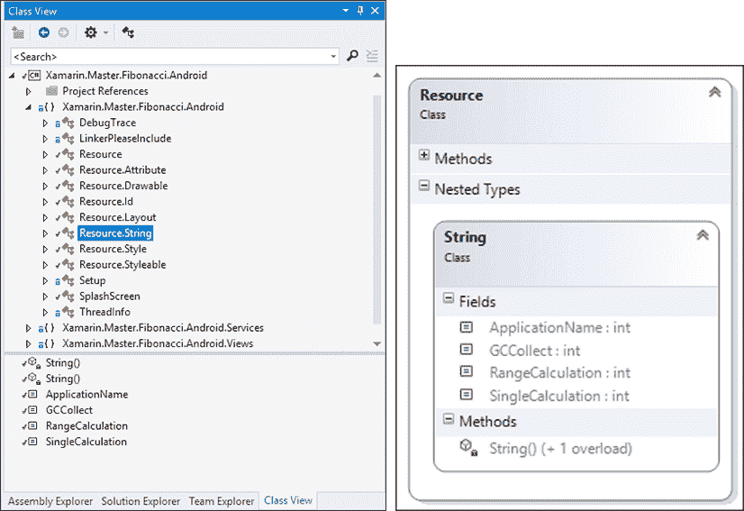

图 1：生成的资源常量

使用`Resources`实用工具，可以通过以下方式检索文本资源：

```cs
// Getting a single text value
var singleStringValue = Resources.GetText(Resource.String.ApplicationName);
// Getting a string array
var stringArrayValue = Resources.GetTextArray(Resource.Array.MyStringArray);
// Getting a pluralized version for 2 items
var quantity = Resources.GetQuantityString(Resource.Plurals.CalculationsCompleted, 2, 2);
```

此外，其他原始数据类型（例如整数、布尔值等），以及用于样式定义中的单位或`structs`（例如尺寸和颜色）也可以包含在资源 XML 文件中。

### Xamarin.iOS

在 iOS 平台上，将文本资源与其他项目内容分离的最简单方法就是创建`.strings`文件（例如，`Localizable.strings`），这些文件遵循简单的类似 JSON 的模式，包含键/值对：

```cs
"GCCollect" = "GC Collect";
"RangeCalculation" = "Range Calculation";
"SingleCalculation"= "Single Calculation";
```

这些字符串值，编译成资源包后，可以使用`NSBundle.MainBundle.LocalizedString`方法进行访问：

```cs
var localizedString = NSBundle.MainBundle.LocalizedString ("RangeCalculation", "");
```

本地化字符串值可以用作 UI 控件的标签，在静态文本内容和实际运行时组件之间创建松散耦合的关系。这个过程在 iOS 生态系统中被称为国际化。国际化的控件和元素可以轻松地本地化为不同的语言。`Strings`文件可以创建在`Resources`文件夹中，或者可以放置在`Resources`目录内的`Base.lproj`文件夹中，这构成了 iOS 项目的基本地化项目文件夹（默认/回退资源）。

对于故事板，国际化过程可能稍微复杂一些。Xcode 中每个故事板中的 UI 元素都被分配了一个唯一的标识符，称为 **Object ID**，而在 Xamarin Storyboard Designer 中则被称为 **Localization ID**。为了将文本内容分配给故事板上的特定项，开发者需要为每个故事板创建字符串文件（例如，对于名为 `Main.storyboard` 的故事板，你需要创建一个 `Main.strings` 文件），并使用特定控件的本地化 ID 和文本属性的名称：

```cs
/* Class = "UIViewController"; title = "Single Calculation"; ObjectID = "138"; */
"138.title" = "Single Calculation";
/* Class = "UILabel"; text = "Ordinal"; ObjectID = "153"; */
"153.text" = "Ordinal";
/* Class = "UIButton"; normalTitle = "Calculate"; ObjectID = "156"; */
"156.normalTitle" = "Calculate";
```

如所见，属性名称和大小写与 UI 控件的实际类型属性（例如，`text` 对于 `UILabel`，`normalTitle` 对于 `UIButton`）明显不同。iOS 国际化指南可以提供有关故事板属性的详细信息。

创建故事板的基础国际化文件的另一种方法是使用 Xcode 生成 `string` 文件。为了使用 Xcode 修改 Xamarin.iOS 项目，可以使用 **打开方式** 右键菜单项选择 **Xcode Interface Builder** 以访问故事板和主项目窗口的项目属性。

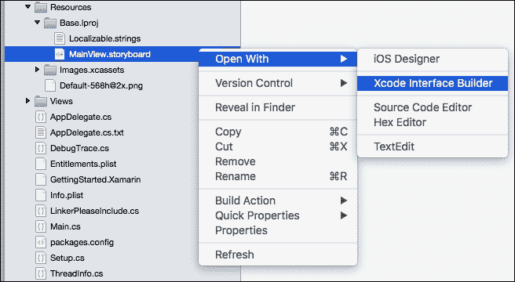

图 2：Xcode Interface Builder

在 Xcode 界面中，国际化设置位于项目设置页面。如果事先创建了基础国际化文件夹，项目设置国际化部分中的 **基础国际化** 选项将已经选中。

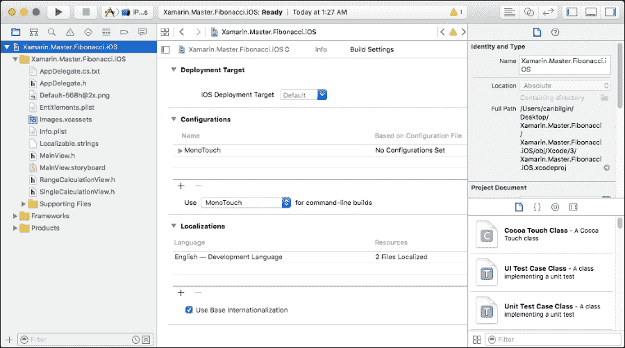

图 3：Xcode 项目配置

任何额外的语言选择都会生成特定语言的 `.lproj` 文件夹和目标故事板及字符串文件的 `.strings` 文件。一旦关闭 Xcode 窗口，这些更改将在 Xamarin.iOS 项目结构中反映出来。

### Windows Phone

在 Windows Phone (Silverlight) 项目中，资源通过传统的 `resx` 文件管理（.NET 框架的遗留）。默认语言资源由项目模板生成并存储在 `Resources` 文件夹下的 `AppResources.resx` 文件中。


图 4：Windows Phone 资源

可以嵌入到资源文件中的其他内容类型包括图像、图标、音频和其他类型的文件。这些文件可以通过代码和标记来访问，使用生成的 `AppResources` 类。另一个生成的类 `LocalizedStrings` 提供了对存储在嵌入的资源文件中的资源的访问：

```cs
<StackPanel>
    <Button x:Name="SingleCalculation"
            Content="{Binding LocalizedResources.SingleCalculation, Source={StaticResource LocalizedStrings}}"
            Style="{StaticResource NavigationButtons}"></Button>
    <Button x:Name="RangeCalculation"
            Content="{Binding LocalizedResources.RangeCalculation, Source={StaticResource LocalizedStrings}}"
            Style="{StaticResource NavigationButtons}"></Button>
    <Button x:Name="GCCollect"
            Content="{Binding LocalizedResources.GCCollect, Source={StaticResource LocalizedStrings}}"
            Style="{StaticResource NavigationButtons}"></Button>
</StackPanel>
```

在 Windows Phone 8.1（即 Windows Runtime）和 Windows 10 中，应用程序使用 `resw` 文件（称为 `PRIResource`，指代编译方法）。尽管 `resx` 和 `resw` 文件的格式相同，但 `resw` 文件只能包含原始值（即字符串值或可以表示为字符串的值）。使用 `resw` 文件，开发者可以直接使用控件的 `Uid` 值将样式或其他属性值分配给用户控件，类似于 iOS 上故事板的国际化。

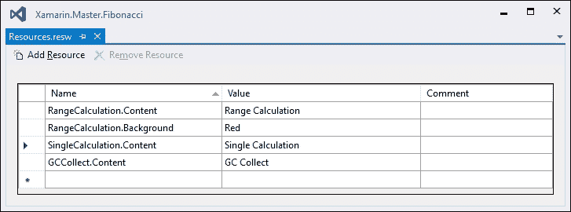

图 5：Windows Runtime PRI 资源

除了目标资源外，开发者仍然可以自由使用简单的资源字符串。这些资源可以通过 `ResourceLoader` 类和 `GetString` 方法访问。

## 图像资源

移动应用程序项目可以包含来自外部来源的媒体资源以及应用程序包。在每一个目标平台上，媒体资源可以通过不同的方式包含在内。

虽然 iOS 和 Windows Phone 没有规定媒体资源在项目树中的特定位置，但在 Android 项目中，开发者有义务将图像文档包含在 `Resources` 目录下的 `drawable` 文件夹中。

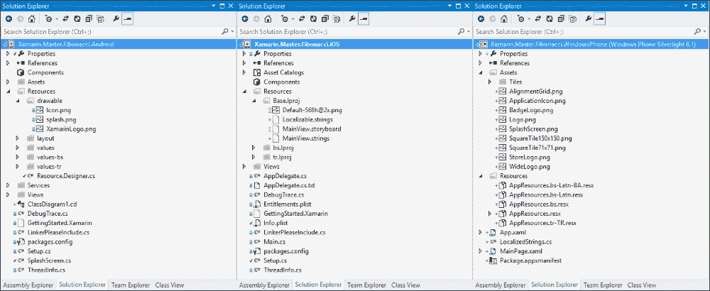

图 6：项目结构

与 iOS 平台上的文本资源结构类似，如果你计划在后续迭代中进行本地化，建议将语言中立的图像元素（针对默认语言）放置在 `Base.lproj` 位置。此外，还可以使用资产目录来简化图像及其不同分辨率下的像素完美替代物的管理（参见 *自适应视觉资源* 部分）。

## 自适应视觉资源

针对 Xamarin 平台的自适应 UI 模式有时迫使开发者包含不同分辨率和像素密度的媒体资源变体。尽管图像资源根据上述自适应 UI 指标进行了缩放，但缩放后的图像并不总是能呈现出令人满意的效果（例如，将图像大小调整为原始大小的两倍，以在不同设备上具有相同的物理屏幕尺寸，其显示效果可能并不如预期）。

Android 平台使用设备兼容性配置限定符来处理图像和文本资源文件夹（即`drawables`和`values`），以及其他类型的资源，例如布局。在这些项目中，兼容性限定符作为后缀连接到资源文件夹（例如，`drawables-xhdpi`文件夹可以用来提供针对大约 320 dpi 的超高密度设备显示的特定图像）并且向此文件夹添加各种默认资源。兼容性配置不仅处理像素密度，还提供与移动网络相关开关的选择器（即**MCC**（**移动国家代码**）和**MNC**（**移动网络代码**）），语言，和地区（见*本地化*部分），布局方向（即从左到右或从右到左），与屏幕尺寸相关的各种选项，屏幕方向，UI 模式（与显示应用程序的平台相关——汽车、桌面、电视、家电或手表），夜间模式（即白天或夜晚），与输入类型相关的配置，最后是平台 API 级别/版本。

在 iOS 平台上，可以通过添加不同的后缀为图像资产提供不同分辨率和设备风格的同一图像版本（即 iPhone、iPod 和 iPad）。设备风格值（即设备修饰符）与波浪号（`~`）字符一起使用，可以使用`~iphone`后缀识别 iPhone 和 iPod 的资源，使用`~ipad`后缀识别 iPad 的资源。`@2x`后缀，应出现在设备修饰符之前，用于识别高分辨率图像变体。

在 Windows Phone 8.1 引入之前，Windows Phone 操作系统仅支持四种变体：WVGA（480 x 800，仅用于 WP 7.1）、WXGA（768 x 1280）、720p（720 x 1280）和 1080p（1080 x 1920）。区分这些分辨率的唯一方法是使用`App.Current.Host.ScaleFactor`设备配置属性（例如，100 的缩放因子表示 WVGA，150 表示 HD）。Windows Store 应用程序（包括 Windows Phone 8.1）提供了一种类似于 iOS 和 Android 的自动缩放机制。在 Windows Phone 8.1 平台上，每个资源文件和/或文件夹都可以添加各种限定符以支持多个显示比例、语言和地区、对比度等，以针对不同的设备配置定制外观和感觉。如果限定符应用于特定文件，则每个限定符/值对应通过下划线分隔，并添加在文件名和扩展名之间（即`filename.qualifiername-value_otherqualifier-value.fileextension`）。如果限定符应用于完整文件夹，则对于每个限定符/值，应创建一个子文件夹（即`resourcefolder/qualifier-value/otherqualifier-value/`）。

例如，查看以下项目路径：

```cs
Images/en-US/config-designer/myImage.scale-140_layoutdir-LTR.png
```

这可以通过`Images/myImage.png`资源路径访问。

## 可重用资产

在跨平台项目中管理媒体资产，尤其是如果你为不同的设备配置提供变体时，可能会变得相当困难。为了在多个平台上重用这些资产，可以利用链接文件引用（**添加** | **现有项** | **添加为链接**）。

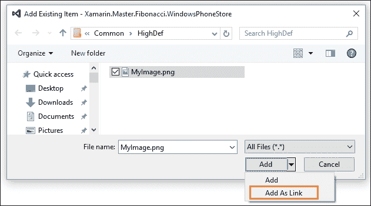

图 7：将资源作为链接添加

使用这种策略，图像文档可以包含在所有特定平台项目的公共位置（例如，公共便携式库），并且只需将链接文件引用添加到特定平台项目中。

这样，图像文档不会被复制到多个位置，而只是编译到不同的特定平台项目中。

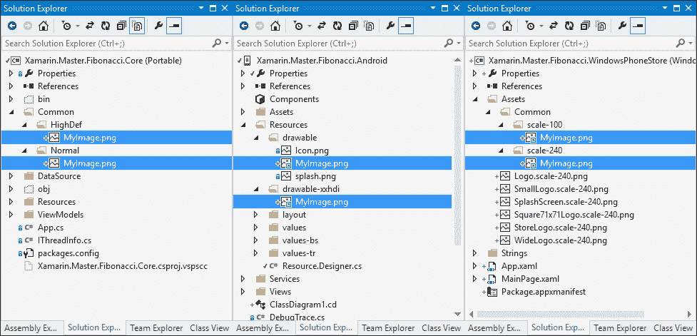

图 8：Windows Phone 和 Android 项目中正常和高清晰度的链接资源

在跨平台项目中，文本资源在不同平台之间差异不大，尤其是如果涉及的资源是简单的字符串值，而不是针对 UI 控件的特定属性（例如，在故事板中指定的标签或按钮的文本内容）。另一个观察结果是，大多数文本资源值都以 XML 格式（针对 Windows Phone 和 Android）或简单的 JavaScript-like 表示法（在 iOS 中）作为键/值对处理。基于这些假设，我们可以创建一个自动化的过程，该过程评估一个通用的资源文件，并为目标平台创建/生成资源字符串。

考虑到我们将使用一个共享的项目库或便携式类库，该库将包含针对特定平台项目的共享代码，这个通用项目将是存储通用资源字符串的最合适位置。我们可以使用此项目创建`resx`格式的通用资源包。

如前所述，这些嵌入式资源文件是简单的 XML 文件，其中字符串资源对存储在具有`name`属性作为键的`<data>`节点中，以及`<value>`文本节点作为值（文件的其余部分包含用于代码生成的 XSD 架构和元数据值）。

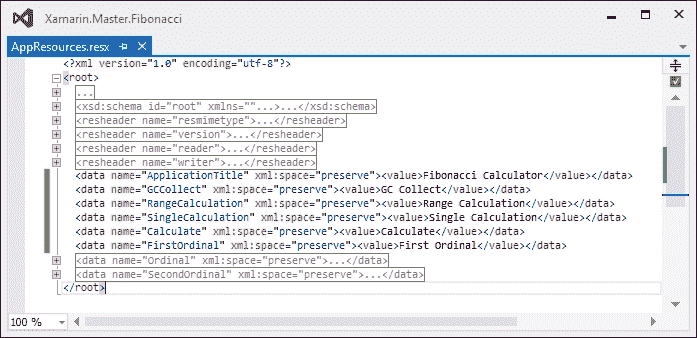

图 9：Resx 文件 XML 结构

Android 字符串资源结构与复杂性较低，节点名称不同（即，资源值由具有`name`属性的`<string>`文本节点表示）。在 Visual Studio 中使用 XSL 转换在两个 XML 文件之间进行转换相对简单。

### 注意

XSL 是可扩展样式表语言的缩写，用于将 XML 文档从一种格式转换为另一种格式。XSLT 文件可以使用模板、XPath 查询和其他 XSL 函数来处理 XML 文档内容。更多信息可以在[`www.w3schools.com/xsl/default.asp`](http://www.w3schools.com/xsl/default.asp)找到。

要将资源文件转换为 Android 格式，我们将在通用项目中的 `AppResources.resx` 文件相同的文件夹中创建一个 XSLT 文件。为了创建 Android XML 资源文件，我们需要从 `<root>` 节点中选择每个 `<data>` 元素，并在 `<resources>` 根节点内创建具有适当文本内容和属性的 `<string>` 节点：

```cs
<?xml version="1.0" encoding="utf-8"?>
<xsl:stylesheet version="1.0" 
     exclude-result-prefixes="msxsl">
  <xsl:output method="xml" indent="yes"/>
  <xsl:template match="/">
    <resources>
      <xsl:for-each select="/root/data">
        <string>
          <xsl:attribute name="name">
            <xsl:value-of select="@name"/>
          </xsl:attribute>
          <xsl:value-of select="value"/>
        </string>
      </xsl:for-each>
    </resources>
  </xsl:template>
</xsl:stylesheet>
```

现在，完成此步骤后，我们可以使用 XML 菜单通过 `resx` 文件来调试 XSLT 文件：

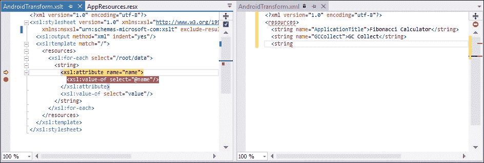

图 10：Visual Studio 中的 XSL 转换调试会话

确认转换按预期工作后，我们现在可以自动化此过程，以便每次重建通用项目时都重新生成字符串文件。为此自动化，我们可以使用第三方 XML 转换命令行应用程序，并通过项目设置将控制台命令作为预构建事件命令行参数添加。另一个选项是使用内置的 `MSBuild` 任务 `XslTransformation` 来添加 `BeforeBuild` 目标。

### 小贴士

为了添加新的构建目标，需要在 Visual Studio 中修改 `csproj` 文件。为此，首先需要使用项目上下文菜单中的 **卸载项目** 选项卸载通用项目，然后可以从相同的上下文菜单中选择 **编辑 <项目文件名>** 选项来编辑项目文件。

`XslTransformation` 任务是一个简单的构建任务，有三个基本参数用于需要转换的 XML 文件（即 `XmlInputPath`），用于转换的 XSL 文件（即 `XslInputPath`），以及最终的输出路径（即 `OutputPaths`）：

```cs
<Target Name="BeforeBuild">
  <XslTransformation 
    XslInputPath="Resources\AndroidTransform.xslt" 
    XmlInputPaths="Resources\AppResources.resx" 
    OutputPaths="..\Xamarin.Master.Fibonacci.Android\Resources\values\strings.xml" />
</Target>
```

通过此修改，每次构建通用项目（默认设置下，通用项目应在 Android 项目之前构建）时，`strings.xml` 文件将被生成并放置在 Android 项目的 values 文件夹中。

相同的转换方法也适用于 iOS 本地化的 `strings` 文件。在 iOS 特定的转换中，输出应设置为文本，转换样式表应创建键/值对。为了为嵌入的资源文件中的每个数据元素创建文本行，可以利用 `concat` 函数：

```cs
<?xml version="1.0" encoding="utf-8"?>
<xsl:stylesheet version="1.0" 
   exclude-result-prefixes="msxsl">
  <xsl:output method="text" encoding="utf-8" indent="no" omit-xml-declaration="no"/>
  <xsl:template match="/">
    <xsl:for-each select="/root/data">
      <xsl:value-of select="concat('&quot;', @name, '&quot; = &quot;', value, '&quot;;', '
')" />
    </xsl:for-each>
  </xsl:template>
</xsl:stylesheet>
```

在此样式表中，需要注意的是，文本元素（符号），如双引号和换行符（即行结束），是 HTML 编码的。

一旦确认转换结果，我们可以在项目文件中添加另一个 `XslTransformation` 任务作为 `BeforeBuild` 目标来创建本地化的 `strings` 文件：

```cs
<XslTransformation 
  XslInputPath="Resources\IOSTransform.xslt" 
  XmlInputPaths="Resources\AppResources.resx" 
  OutputPaths="..\Xamarin.Master.Fibonacci.iOS\Resources\Base.lproj\Localizable.strings" />
```

使用相同的实现，包含 `resx` 文件的翻译值可以转换并用于为目标平台生成本地化资源。除了 XSL 转换之外，T4 模板也可以用来生成文本资源文件。由于某些构建任务（包括 `XslTransformation`）尚未被 xBuild 和 Xamarin Studio 支持，如果您的开发环境主要是 Mac OS 且主要开发 IDE 是 Xamarin Studio，则 T4 模板可以提供一种替代方案。使用 T4 模板，还可以遍历通用资源中的每个文件并生成平台特定项目中匹配的本地化文件。

下一个部分将总结在 Xamarin 目标平台上的本地化策略。

# 本地化

本地化和全球化是移动应用的两个基本概念。在前几节中，我们讨论了将视觉内容与应用程序其余部分分离的不同方法。这个过程本质上是为移动应用本地化做准备，通常是全球化阶段的一部分。全球化应用应独立于它们正在执行的 culture 或 locale 运行，功能相同。在本地化过程中，开发者应创建特定语言的资源并将它们集成到全球化应用程序中。

## 区域设置和文化

区域设置可以定义为包括特定设备（或在某些情况下特定应用程序）上所有区域配置的通用术语。区域设置不仅代表用户界面语言，还包括用于显示日期、时间、数字和货币值的格式。

作为全球化工作的一部分，在 Xamarin 目标平台上，开发者首先需要确定哪些语言将作为本地化工作的一部分得到支持。一旦用户发布并安装了移动应用，它应显示支持的语言，以便用户界面可以使用操作系统指定的区域设置（如果支持）或应用程序的默认/后备语言进行渲染。

支持的语言清单是根据提供的资源（Android）或预先声明的清单或项目条目（iOS 和 Windows Phone）计算得出的值。

## Windows Phone

在 Windows Phone Silverlight 应用程序项目中，可以根据命名约定使用资源包提供不同语言的资源。然后应在 `WMAppManifest.xml` 文件中引用提供的包。为 Windows Phone 应用程序添加额外的语言支持的最简单方法是通过项目属性来识别支持的文化。

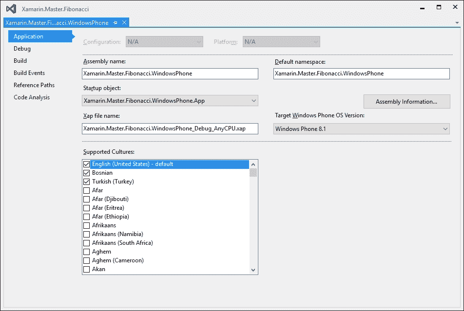

图 11：Windows Phone Silverlight 应用程序的项目属性

保存项目配置修改后，Visual Studio 会自动创建相关的 `resx` 文件（例如，为波斯尼亚语创建 `AppResources.bs.resx`，为土耳其语创建 `AppResources.tr-TR.resx`）并更新应用程序清单。默认语言可以从包清单（即 `package.appxmanifest`）或应用程序清单（`WMAppManifest.xml`）设计器中进行修改。

Windows Store 应用程序（即 Windows Phone 8.1）使用以支持的语言命名的文件夹进行全球化，其中包含 `resw` 资源文件。例如，为了创建一个针对与上一个示例相同文化的应用程序，我们需要创建一个类似以下的文件夹结构和特定文化资源文件：

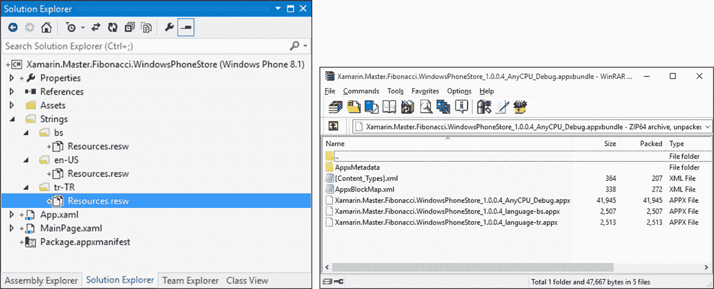

图 12：Windows Store 应用支持的文化和应用程序包

一旦创建完应用程序包，你会注意到，除了单个应用程序包外，还会创建一个应用程序包，并且每个支持的文化都关联一个存储应用程序包在该包中。

### 注意

应用程序包在 Windows Store 应用中使用，以减少用户为特定 CPU 架构（ARM、x86 或 x64）、显示硬件（图像和其他媒体资产，针对不同分辨率进行优化）或区域设置下载的应用程序包的大小。可以在创建应用程序包时选择打包策略，但如果放弃打包，开发者需要为计划支持其应用程序的每个 CPU 架构创建不同的上传包。

## Xamarin.iOS

如前所述，对于 Xamarin.iOS，一旦在 Xcode 开发环境中为项目选择了附加语言，生成的本地化文件夹和文件将自动添加到 Xamarin.iOS 项目中。生成的故事板字符串文件最初包含可能的本地化字段和从故事板分配的值。其他字符串包资源文件从 `Base.lproj` 文件夹复制相同的值。

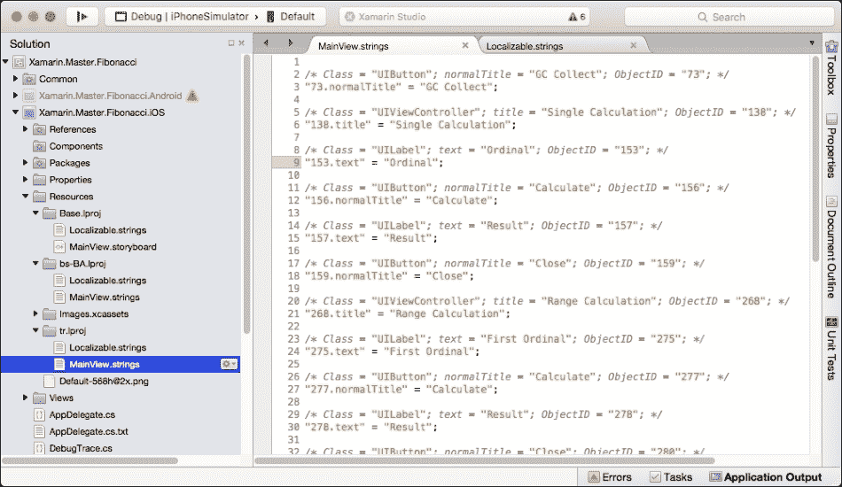

图 13：本地化的 Xamarin.iOS 项目

当使用文本资源文件进行本地化时，`MainBundle` 属性的 `LocalizedString` 函数要么返回与当前用户语言选择匹配的值，要么返回在 `Base.lproj` 目录中定义的默认值。

### 小贴士

当使用 Visual Studio 创建和编辑 `strings` 文件时，使用 **选项** 对话框和 **文本编辑器** | **文件扩展名** 部分将 `strings` 扩展名映射到 JavaScript 编辑器是一个好主意。

为了加载与当前首选语言（或语言）配置不匹配的语言特定资源，你需要使用本地化包路径，并使用此包上的相同函数检索本地化资源：

```cs
var path = NSBundle.MainBundle.PathForResource("tr", "lproj");
NSBundle languageBundle = NSBundle.FromPath(path);
var localizedString = languageBundle.LocalizedString ("RangeCalculation", "");
```

原生开发语言目录（即，`Base.lproj`），以及特定语言的文件夹，也可以用来存储其他类型的包资源，例如图像资源、故事板、XIB 文件，甚至是特定语言的`Info.plist`文件。（语言目录中的`InfoPlist.strings`文件可以用来覆盖应用程序`Info.plist`文件中的值，例如应用程序名称。）

向信息清单中添加支持的语言至关重要。对于本地化，有两个相关的键。第一个相关项是*本地化*原生开发区域（即，`CFBundleDevelopmentRegion`），第二个键是*本地化*（即，`CFBundleLocalizations`）。虽然原生开发区域定义了与`Base.lproj`位置关联的语言，但本地化条目提供了有关其他支持本地化的信息。

## Xamarin.Android

在 Xamarin.Android 项目中，本地化与 Windows Phone 8.1 项目的文件夹结构类似，通过特定的文件夹结构实现，语言代码附加到本地化资源项中（例如，`drawable-tr`或`values-en`）。

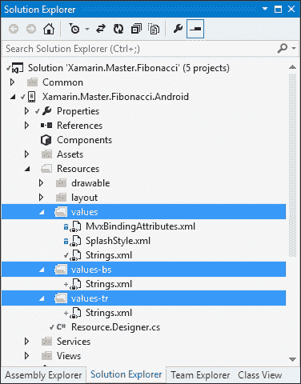

图 14：Android 本地化文件夹结构

在运行时，通过一个简单的消除算法选择合适的资源，该算法根据地区、显示密度、显示大小、触摸支持和其他标准选择正确的资源文件。

## Xamarin.Forms

Xamarin.Forms 便携式类库项目模板提供了一个理想的文本资源共享环境。在这个设置中，与 Windows Phone Silverlight 项目类似的过程，可以使用`resx`文件创建资源包，这些资源包可以用来本地化使用 Xamarin.Forms 框架创建的跨平台视图。

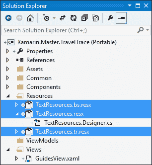

图 15：本地化的 Xamarin.Forms 资源

一旦将嵌入的资源文件及其翻译对应的文件添加到公共 PCL 项目中，就可以使用生成的静态类来访问资源条目。为了使生成的类可以从特定平台实现中访问，资源文件的**自定义工具**属性必须设置为`PublicResXFileCodeGenerator`，而**构建操作**属性必须设置为`Embedded Resource`。

### 小贴士

使用 Xamarin Studio 或 Visual Studio，可以通过文件属性窗口设置资源访问器的正确访问修饰符。在 Visual Studio 中，资源编辑器也可以用来修正资源项的访问修饰符（即，使用资源设计器选择**访问修饰符** | **Public**）。

在 Windows Phone 运行时，根据当前线程的文化，正确加载资源文件，因此先前的实现会自动选择合适的嵌入式资源。然而，支持的语言仍然需要通过应用程序清单进行配置。在 Xamarin.iOS 中，根据用户的语言偏好（而不是当前 UI 语言）加载正确的资源，并且应使用 `CFLocalizations` 条目将支持的语言包含在 `Info.plist` 文件中。对于 Android 平台，UI 语言选择被视为资源的标识符。

以下实现将本地化前一章中的选项卡页实现：

```cs
var tabbedPage = new TabbedPage();

tabbedPage.Children.Add(new ContentPage
{
    Title = TextResources.TabItemRecent,
    Content = new StackLayout
    {
        // Omitted for clarity
    },
    Icon = "social.png"
});
```

在先前的示例中，高亮显示的代码行将访问器属性设置为特定的资源元素。当使用 XAML 进行相同的实现时，我们可以求助于使用 `TextResources` 生成的类进行静态绑定属性：

```cs
<TabbedPage 

    x:Class="Xamarin.Master.TravelTrace.Views.MainTabView"
    >
  <ContentPage 
        Title="{x:Static resources:TextResources.TabItemRecent}" 
        Icon="social.png">
```

包含生成的资源访问器的 CLR 命名空间是很重要的。

# 架构模式

应用程序的用户界面可以描述为对下面所有移动部分的封装。随着应用程序变得更加复杂，用户界面的责任也在增加，封装下面的产品变得更加困难。抛开 UI 的静态部分（即本章前几节中描述的资产），它是应用程序中最易变的部分。为了对抗整个应用程序生命周期中积累的熵，解决重复的问题模式，以及重用模块，开发者通常会在他们的开发工作中利用某些设计模式。特别是在跨平台项目中，这些架构设计模式的重要性已经被证明是无可辩驳的。

为了演示目的，让我们使用一个简单的表单提交场景。在这个实现中，用户将看到一个需要填写的表单。一旦用户填写了所有必需的文本字段，他/她将通过提交按钮提交内容。然后验证数据并存储。用户应该随后通过一个只读屏幕被告知提交情况，在该屏幕上他/她可以看到提交和存储的数据。

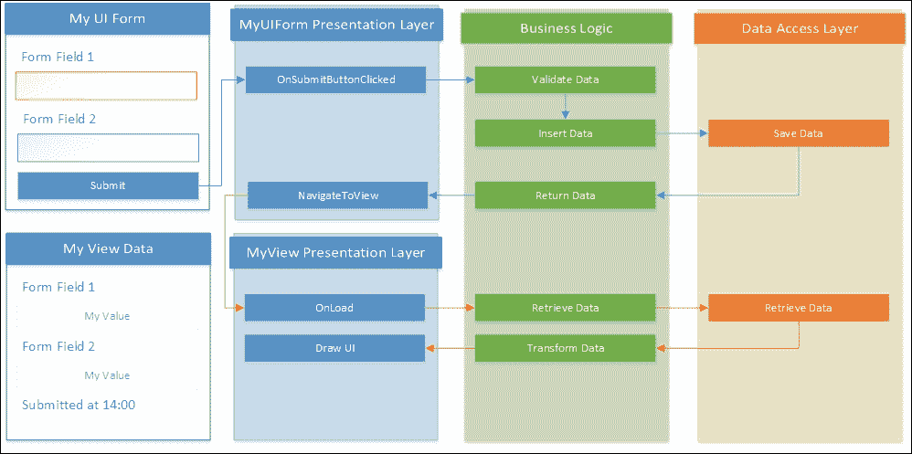

图 16：经典的 *n* 层场景

在 *n* 层实现中，表示层将负责可视化数据并持有 API 门面实例。API 门面将实现业务逻辑以验证信息并将其提交给数据层实例。数据层将仅负责与持久存储进行通信（可能通过服务层）。

事件订阅（即文本字段更改或提交按钮点击）将在表示层中实现。在成功提交后，表示层会将当前的 API 对象传递给一个新的表示容器，并可视化提交的数据。尽管这种方法在层之间提供了清晰的分离，但在层次结构中（即表示层持有 API 的强类型引用，API 要么重用或创建数据模型的新实例）仍然存在强烈的联系。应用程序层还创建了一个不必要的庞大且复杂的结构，该结构应提供所有容器和相关场景在表示层中所需的方法。在事件驱动实现方面，表示层仍然承担着最大的责任。如果我们把这个实现转移到 Xamarin 跨平台项目中，我们就能在各个平台上重用完整的应用程序层和数据层。然而，对于其他平台项目，仍然需要对表示层进行相当多的重新实现，因为这一层负责使用 API。这种模式的另一个缺点是，除了门面之外，实现单元测试并不容易（即在表示层上有多个事件订阅）。

**MVP**（**模型-视图-演示者**）和**MVVM**（**模型-视图-视图模型**），都是**MVC**（**模型-视图-控制器**）的衍生模式，试图解决经典*n*层实现中的一些问题。这两种模式本质上都使用一个被动的表示层，并将主要责任委托给监督或中介组件；这样做的主要原因是因为对视图进行单元测试通常是不切实际的，因此视图应尽可能不包含逻辑。演示者与数据层进行主动通信，并负责视图的视觉呈现。在这个范例中，视图与中介通信的唯一方式是通过路由事件（关注点分离）。还应注意，在这些架构实现中，应用程序被划分为自给自足的三元组（即模型、视图和演示者），它们构成了应用程序中的不同用例和视图。门面通常仅在模型组件中使用。

## MVC

MVC 模式最初被引入到 Smalltalk 中，后来随着其在 Web 应用程序和框架中的（过度）使用而流行起来。在经典的 MVC 实现中，**模型**不仅提供对数据存储的访问，还实现了任何所需的企业逻辑。**模型**可以描述为问题域的核心实现，与用户界面无关。

**控制器**通常代表从**视图**中剥离的逻辑；它可以向**模型**以及**视图**发送命令，并从**视图**接收路由的事件。状态的变化（即在**模型**中），无论是否有**控制器**的干预，都会在**视图**上反映出来（经典的 MVC 允许**模型**和**视图**之间的主动或隐式交互）。

### iOS 应用架构

在 iOS 应用程序中，迄今为止主要开发语言一直是 Objective-C。用于 Mac OS 和 iOS 应用程序开发的 Cocoa 和 Cocoa Touch 框架也主要用 Objective-C 开发。考虑到 Objective-C 和 SmallTalk 之间的紧密联系，iOS 开发工具包采用和强制执行的主要开发模式是 MVC 也就不足为奇了。

在 Cocoa 版本的 MVC 实现中，由于移动应用程序开发环境的技术要求，**视图**和**模型**之间的直接通信完全放弃（并被禁止），并且为了提高模型和视图组件的可重用性。在这个模式中，**控制器**（有时也称为调解者）被赋予控制**视图**和**模型**之间数据流的主要责任。从这个角度来看，Cocoa 对 MVC 的实现无疑类似于 MVP 模式：

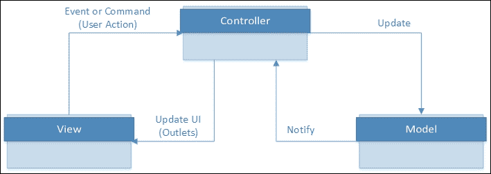

图 17：Cocoa MVC

在这个实现方案中，鼓励开发人员将三联组件相互解耦，并通过定义的抽象来实现它们之间的通信。

**视图**和**控制器**之间的分离通常通过命令、出口和绑定来实现。命令提供可执行的组合，可以从一层传递到另一层，出口是某些 UI 元素的扩展，以便控制器可以订阅事件并根据状态控制 UI 的呈现方式。

当视图元素使用 XIBs 或故事板（即在编译时使用故事板生成 XIBs）设计时，出口被定义为**视图**-**控制器**的访问点。**视图**-**控制器**不直接依赖于**视图**，**视图**也没有任何关于**控制器**的知识。这种设置符合关注点分离原则，并提供了松散耦合的结构，正如建议的那样。

如果我们要实现前一个示例中的场景，我们将在提交表单中暴露两个文本输入字段的出口和一个提交按钮的出口。这些出口将反过来被分配给**视图**的控制器用于订阅某些事件，以验证和提交数据。**视图-控制器**（即**UIController**）还负责更改控件显示方式（例如，验证可以改变文本输入字段的颜色）以及将用户操作（例如，提交数据）与**模型**进行通信。在这种情况下，导航到另一个视图也是**控制器**的责任。

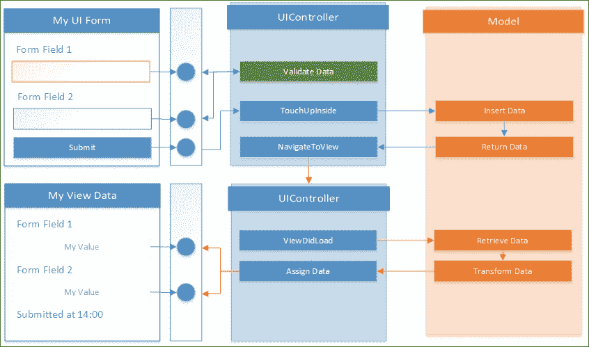

图 18：iOS 表单上的 MVC 演示

当新**视图**的控制器存在于调用**控制器**中，或者两个视图都使用相同的 UI 控制器（即，在先前的示例中，相同的**控制器**可以用于提交和只读视图）时，视图之间的 segue 导航是另一种可能的导航策略。

## MVVM

**MVVM**（**模型-视图-视图模型**），MVP 模式的衍生品，为 UI、业务逻辑和数据之间提供了明确的边界。自从其出现以来，它几乎立即成为了**WPF**（**Windows 演示基础**）应用程序的主要实现模式。WPF 框架提供的数据绑定功能构成了这种中介模式的基础。

### 注意

数据绑定是用来描述将 UI 层（即控件）中的数据可视化元素与其他层（例如，其他控件或数据对象）连接起来的机制的术语。绑定双方之间的同步通过各种事件（例如，使用`INotifyPropertyChanged`接口来传播值更改事件）来维护。

在这个模式中，ViewModel 是主要演员，其责任是控制**视图**和**模型**之间的数据流。在这个架构中，出口由 ViewModel 暴露并由视图实现使用（与 iOS MVC 架构相反）。ViewModel 以可以与 UI 控件属性或状态关联的数据元素的形式提供这些出口，以及作为**视图**控件可以用来响应用户输入的通用命令。

### Windows Runtime

Windows Phone 应用程序以及 Windows Store 应用程序原生支持 UI 控件的数据绑定。这一特性使得 Windows Phone 应用程序成为这种架构的理想候选者。然而，架构元素仍应由开发者根据特定项目的需求来实现。有多个（开源或商业）库可以作为 NuGet 包包含在开发项目中，包括 Prism（一个跨平台 MVVM 库，最初是微软模式和实践团队的宠物项目，但现在由社区维护）和 MVVMCross（一个跨平台开源 MVVM 框架）。

在 MVVM 模式和数据绑定的核心，我们可以找到可绑定基类的实现。可绑定基类提供了`INotifyPropertyChanged`接口的实现，使得识别和实现将参与数据绑定的数据元素变得更加容易。此接口用于将数据项及其属性的价值更改事件路由到 UI 元素。

一个简单的可绑定基类实现看起来会类似于以下这样：

```cs
public abstract class BindableBase : INotifyPropertyChanged
{
    protected virtual void SetProperty<T>(ref T property, T value, 
      [CallerMemberName] string propertyName = null)
    {
        if (Equals(property, value)) return;

        property = value;

        OnPropertyChanged(propertyName);
    }

    public event PropertyChangedEventHandler PropertyChanged;

    protected virtual void OnPropertyChanged([CallerMemberName] string propertyName = null)
    {
        var handler = PropertyChanged;
        if (handler != null) handler(this, new PropertyChangedEventArgs(propertyName));
    }
}
```

这个类的实现可以与模型数据项一起使用，以便任何更改都可以在 UI 上反映出来：

```cs
public class ModelData : BindableBase
{
    private string m_Property1BackingField = string.Empty;

    public string Property1
    {
        get
        {
            return m_Property1BackingField;
        }
        set
        {
            SetProperty(ref m_Property1BackingField, value);
        }
    }
}
```

现在，`ModelData`类已经可以用作 ViewModel，并且其绑定可以提供给`Property1`：

```cs
public MainPage()
{
    this.InitializeComponent();

    this.DataContext = new ModelData {Property1 = "Hello MVVM"};
}
```

主页上的输入控件的数据绑定看起来会类似于以下这样：

```cs
<TextBox Text="{Binding Property1, Mode=TwoWay}">
```

在这种绑定场景中，我们将绑定模式设置为`TwoWay`。这种绑定类型意味着，无论属性值的变化是在 ViewModel 还是用户界面（即用户输入）上，都会传播到 UI 元素，反之亦然。

### 注意

数据绑定可以使用不同的模式来维护。**OneTime**绑定用于在数据源更改时使用源属性更新目标属性。这种类型的绑定通常用于只读控件。**OneWay**绑定仅在源属性值更改时更新目标属性，而**TwoWay**模式用于双向同步。最后，**OneWayToSource**仅在目标属性有更改时更新源属性。

数据绑定不仅限于从 ViewModel 属性到值和从值到 ViewModel 属性的绑定。用户控件的可绑定属性也可以在这个模式中桥接。此外，用户控件的可绑定属性包括行为和样式属性（例如，`TextBox`用户控件上的`IsEnabled`属性）。还可以通过附加和/或依赖属性为内建或派生用户控件提供额外的可绑定属性。

命令绑定是另一个概念，它提供了一种解耦的方式来将用户操作控件（例如，`Button`）与数据上下文中的可执行元素（即，ViewModel）关联起来。为了使用户控件绑定到命令，用户控件应实现可绑定命令属性，而 ViewModel 应提供特定操作的`ICommand`实现。`ICommand`接口是一个简单的接口，包含一个`CanExecute`属性，一个相关的`CanExecuteChanged`事件（通常绑定到用户控件的`IsEnabled`属性），以及`Execute`方法。

一个简单的命令实现，将验证前一个示例中的数据模型并执行，其实现方式如下（请注意，MVVM 框架通常提供一个通用的`Command`类，该类接受用于`Execute`和`CanExecute`方法的委托和/或 lambda 表达式）：

```cs
public class SubmitCommand : ICommand
{
    private readonly ModelData m_DataContext;

    public SubmitCommand(ModelData dataContext)
    {
        m_DataContext = dataContext;

        m_DataContext.PropertyChanged += (sender, args) =>
        {
            if(args.PropertyName == "Property1" && 
                CanExecuteChanged !=null) 
                CanExecuteChanged(this, null);
        };
    }

    public bool CanExecute(object parameter)
    {
        return m_DataContext.Property1.Length > 5;
    }

    public void Execute(object parameter) {
        // TODO:
    }

    public event EventHandler CanExecuteChanged;
}
```

使用此实现（无论是公共的还是之前定义的数据模型嵌套类），我们可以在初始化新的`ModelData`类时初始化和公开命令：

```cs
public ModelData()
{
    Submit = new SubmitCommand(this);
}

public ICommand Submit { get; set; }
```

最后，此命令在 XAML 标记中的绑定看起来如下：

```cs
<Button Content="Submit" Command="{Binding Submit}"></Button>
```

如果我们要使用 MVVM 模式实现前一个表单提交场景，我们可以观察到数据和命令绑定的实现。我们可以实现一个 ViewModel 类，该类负责加载和提交可绑定数据项。视图将绑定到 ViewModel 属性和命令，以及绑定到数据项本身。

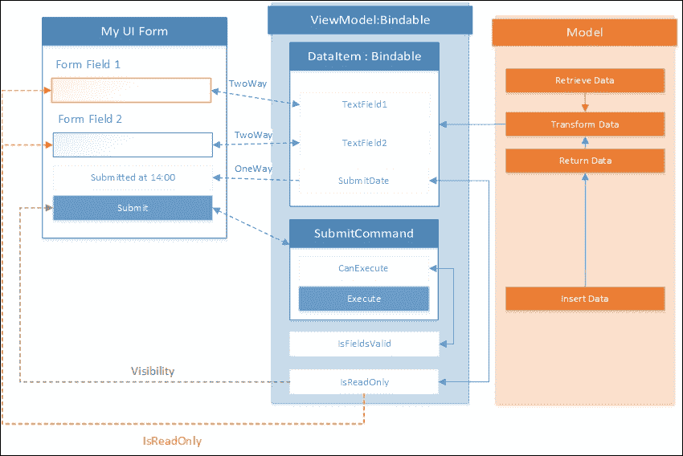

图 19：表单提交场景的 MVVM 实现

在此设计中，`SubmitCommand`既用于将用户输入提交到**模型**，也用于验证表单本身（使用`CanExecute`方法）。ViewModel 的`IsReadOnly`属性绑定到文本字段的`IsReadOnly`属性以及提交按钮的`Visibility`属性（在只读模式下，而不是提交按钮，应显示提交标签），可能还使用`IValueConverter`（在数据绑定场景中用于绑定属性之间的双向转换的接口）。

### 注意

值转换器实现了`IValueConverter`接口，以在绑定过程中应用自定义逻辑。它们通常用作目标属性和源属性的 CLR 类型（例如，如果数据模型属性类型是定义某种颜色的`string`，我们需要将此值转换/解析为`SolidColorBrush`或类似类型以分配给视觉元素的属性）的适配器。

除了通过使用 MVVM 实现的松散耦合和模块化之外，ViewModel 提供的伪有限自动机允许开发者轻松地重新创建视图使用的数据状态，并轻松实现单元测试。

### 在 Xamarin.iOS 和 Xamarin.Android 上实现 MVVM

在 Xamarin 项目中，为了在不同平台的应用程序之间创建统一的结构并最大化代码共享，使用 MVVM 模式作为全局实现原则是一种广泛接受的做法。由于 iOS 和 Android 原生不支持数据绑定和命令模式实现，使用支持 Xamarin 跨平台开发的 MVVM 框架可以是一个解决方案。

### 注意

需要指出的是，iOS 和 Cocoa 有键值观察的概念，并且可以在一定程度上应用类似绑定的实现。

在 Xamarin.iOS 和 Xamarin.Android 上，绑定通常通过`UIViewController`（在 iOS 上）和`Activities`（在 Android 上）的扩展提供。在 iOS 中，这种实现策略将 MVC 架构中的**视图**和**控制器**转换为仅有的**视图**实现，而 ViewModel 在概念上取代了**模型**实现。对 ViewModel 的绑定是在`UIViewControllers`和`Activities`的应用程序生命周期事件中初始化的。

### 使用 Xamarin.Forms 的 MVVM

Xamarin.Forms 的数据绑定功能是对 WPF 数据绑定的实现/端口，因此支持 XAML 绑定用于数据和命令。Xamarin.Forms 与 Windows Runtime 的主要区别在于，在 Windows Store 应用程序中，用户控件或容器的绑定上下文是通过`DataContext`属性配置的，而在 Xamarin.Forms 中，使用`BindingContext`属性用于相同的目的。Xamarin.Forms 还提供了通用的命令实现类（即`Command`和`Command<T>`），允许开发者无需在嵌套类中实现`ICommand`接口即可暴露命令。

# 摘要

在跨平台项目中，无论是否使用 Xamarin.Forms，建议尽可能保持视图元素薄，不包含静态和/或可共享元素。正如本章所讨论的，每个 Xamarin 目标平台都支持特定的资源和管理方式。这些方法可以通过使用链接资源和使用特殊的构建技术来扩展，以便在特定平台的项目之间共享静态资源。

架构模式，无论是平台强制的还是其他原因，可以在项目开始时或通过迭代项目成熟时采用。MVC、MVVM 以及 MVP 模式有助于减少视图上的可共享逻辑组件，从而创建一个更松散耦合的项目结构（参见第一章中的质量标识符，*使用 Xamarin 进行开发*）。

在介绍完 Xamarin 框架和 UI 相关概念的不同方面之后，本书的下一部分将讨论与**应用程序生命周期管理**（**ALM**）相关的话题，以创建针对处理 Xamarin 项目的个人或团队的效率开发流程。
