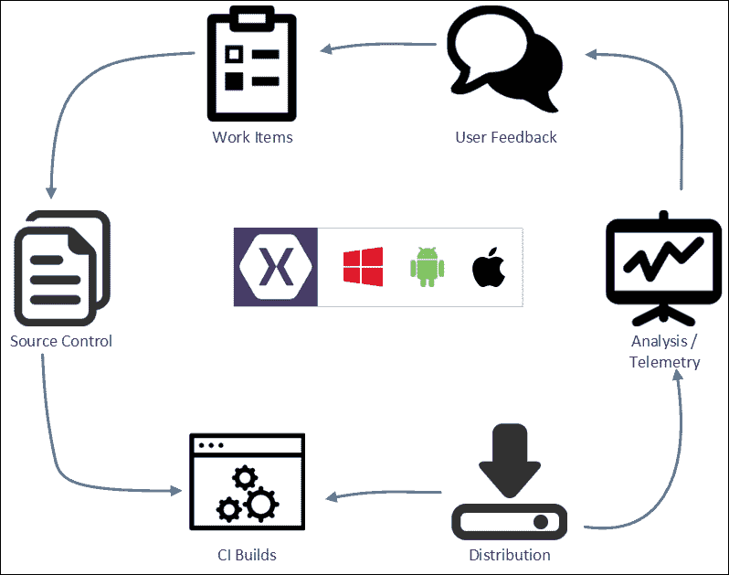
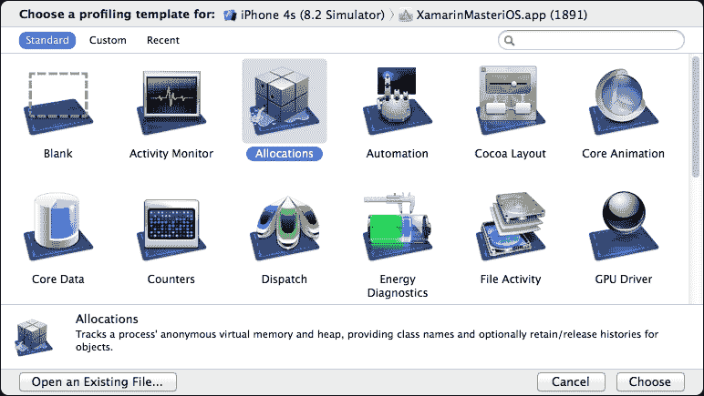
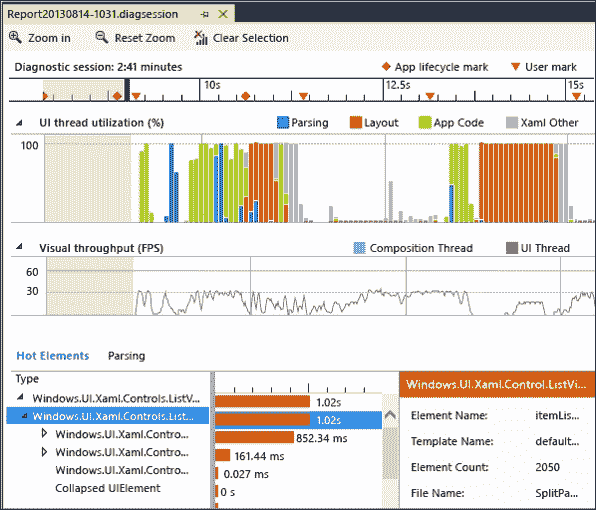
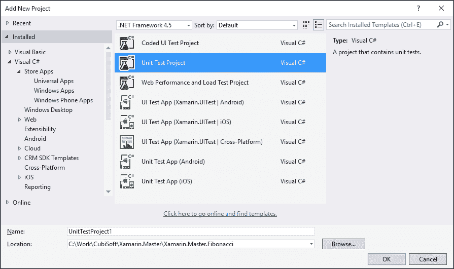
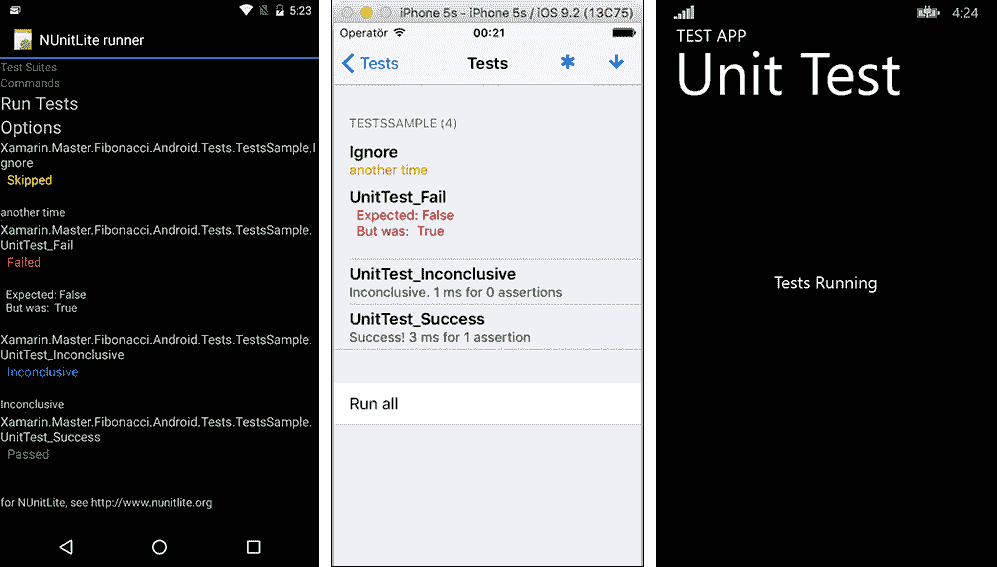
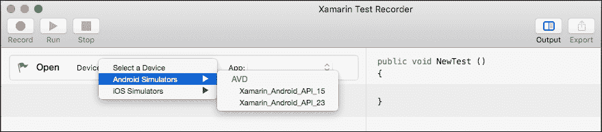
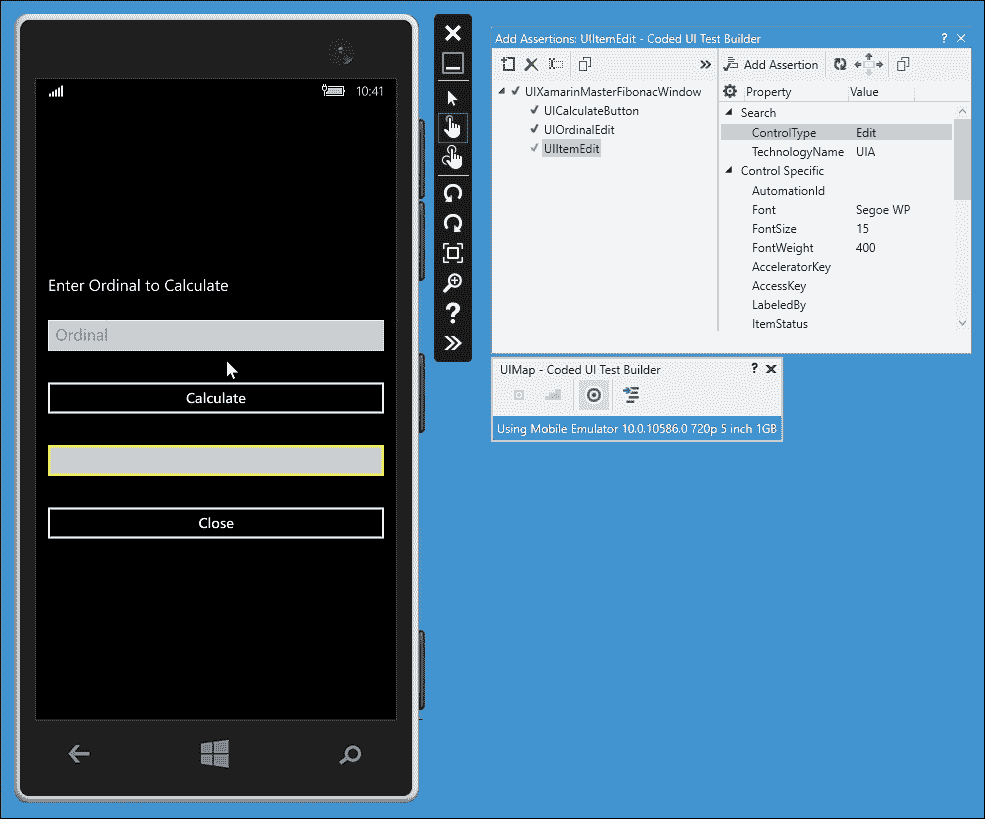

# 第十章。ALM – 开发者和 QA

本章介绍了在 Xamarin 跨平台应用程序中**应用生命周期管理（ALM**）和持续集成方法。作为 ALM 过程中对开发者最相关的部分，本章将讨论并演示单元测试策略，以及自动化的 UI 测试。本章分为以下几部分：

+   开发流程

+   故障排除

+   单元测试

+   UI 测试

# 开发流程

开发流程可以被描述为一条虚拟的生产线，它将一个项目从仅仅是一堆业务需求引导到消费者手中。这个流程中的利益相关者包括但不限于业务代理、开发者、质量保证团队、发布和配置团队，以及最终的用户。在这个生产线上，每个利益相关者都承担着不同的责任，并且他们应该协同工作。因此，拥有一个高效、健康且最好是自动化的流程，该流程能够提供单元之间的沟通和交付成果的传递，对于项目的成功至关重要。

在敏捷项目管理框架中，开发流程是循环的，而不是线性的交付队列。在应用程序生命周期中，需求持续地插入到待办事项列表中。待办事项列表导致规划和开发阶段，随后是测试和质量保证。一旦生产就绪的应用程序发布，消费者可以通过实时应用程序遥测仪器成为这个周期的一部分。



图 1：应用生命周期管理

在 Xamarin 跨平台应用程序项目中，开发团队有幸拥有各种工具和框架，这些工具和框架可以简化 ALM 策略的执行。从可用于早期原型设计和设计的草图和模拟工具，到构成 ALM 骨干的源代码控制和项目管理工具，Xamarin 项目可以利用各种工具来自动化和系统地分析项目时间线。

本章的以下部分主要集中讨论在将任务分配给开发者到任务或错误完成/解决并检查到源代码控制仓库之间的时间线上，保护 Xamarin 跨平台项目健康和稳定性的防御线。

# 故障排除和诊断

与 Xamarin 目标平台和开发 IDE 关联的 SDK 配备了全面的分析工具。利用这些工具，开发者可以识别导致应用冻结、崩溃、响应时间慢以及其他与资源相关的问题（例如，过度使用电池）的原因。

使用 XCode Instruments 工具集分析 Xamarin.iOS 应用程序。在此工具集中，有多个分析模板，每个模板用于分析应用程序执行的某个特定方面（例如，在第二章中使用的分配模板，用于内存分析）。可以在运行在 iOS 模拟器或实际设备上的应用程序上执行工具模板。



图 2：XCode Instruments

类似地，可以使用 Android SDK 提供的设备监控器分析 Android 应用程序。使用 Android Monitor，还可以分析内存配置文件、CPU/GPU 利用率和网络使用情况，并收集应用程序提供的诊断信息。**Android 调试桥接器**（**ADB**）是一个命令行工具，允许执行各种手动或自动的设备相关操作。

对于 Windows Phone 应用程序，Visual Studio 提供了多种分析工具，用于分析 CPU 使用率、能耗、内存使用率和 XAML UI 响应性。特别是 XAML 诊断会话可以提供有关视图实现中问题部分的宝贵信息，并确定可能的视觉和性能问题：



图 3：Visual Studio XAML 分析

最后，Xamarin Profiler 作为成熟的应用程序（目前处于预览发布状态），可以帮助分析内存分配和执行时间。Xamarin Profiler 可以与 iOS 和 Android 应用程序一起使用。

# 单元测试

**测试驱动开发**（**TDD**）模式规定，业务需求和由这些需求定义的细粒度用例应首先反映在单元测试用例中。这允许移动应用程序在定义的断言单元测试模型范围内增长/发展。无论遵循 TDD 策略还是实施测试以确保开发管道的稳定性，单元测试都是开发项目的根本组成部分。



图 4：单元测试项目模板

Xamarin Studio 和 Visual Studio 都提供了一系列针对跨平台项目不同领域的测试项目模板。在 Xamarin 跨平台项目中，单元测试可以分为两组：平台无关和平台特定测试。

## 平台无关单元测试

平台无关的组件，例如包含 Xamarin 应用程序共享逻辑的可移植类库，可以使用针对.NET 框架的通用单元测试项目进行测试。可以根据选择的开发环境使用 Visual Studio 测试工具或 NUnit 测试框架。还应注意，用于为 Xamarin 项目创建共享逻辑容器的共享项目不能使用.NET 单元测试固定装置进行测试。对于共享项目和引用特定平台的项目，应准备特定平台的单元测试固定装置。

在遵循 MVVM 模式时，视图模型是单元测试固定装置的重点，因为，如前所述，视图模型可以被视为一个有限状态机，其中可绑定属性用于创建一个特定的状态，在该状态下执行命令，模拟要测试的特定用例。这种方法是测试 Xamarin 应用程序 UI 行为最方便的方法，而无需实现和配置自动化的 UI 测试。

在为这类项目实现单元测试时，通常使用模拟框架来替换业务逻辑中依赖平台的部分。松散耦合这些依赖组件（参见第八章，*Xamarin.Forms*），使得开发者更容易注入模拟接口实现，并增加了这些模块的可测试性。最流行的单元测试模拟框架是 Moq 和 RhinoMocks。

### 注意

Moq 和 RhinoMocks 都使用反射，特别是 Reflection.Emit 命名空间，用于在运行时生成类型、方法、事件和其他资源。之前提到的 iOS 代码生成限制使得这些库在特定平台测试中不适用，但它们仍然可以包含在针对.NET 框架的单元测试固定装置中。对于特定平台的实现，True Fakes 库提供了编译时代码生成和模拟功能。

根据实现的具体细节（如使用的命名空间、网络通信、多线程等），在某些场景下，测试特定平台上的通用逻辑实现是强制性的。例如，某些多线程和并行任务实现在 Windows Runtime、Xamarin.Android 和 Xamarin.iOS 上给出不同的结果。这些变化通常是由于底层平台的机制或.NET 和 Mono 实现逻辑之间的细微差异造成的。为了确保这些组件的完整性，可以将通用单元测试固定装置作为链接/引用文件添加到特定平台的测试项目中，并在测试平台上执行。

## 特定平台单元测试

在 Xamarin 项目中，无法使用 Visual Studio 测试套件和 NUnit 框架中提供的传统单元测试运行器对平台相关的功能进行单元测试。平台相关的测试是在空白的特定平台项目上执行的，这些项目作为该特定平台单元测试的框架。

可以使用 Visual Studio 测试套件测试 Windows 运行时应用程序项目。然而，对于 Android 和 iOS，应使用 NUnit 测试框架，因为 Visual Studio 测试工具在 Xamarin.Android 和 Xamarin.iOS 平台上不可用。



图 5：测试框架

Windows Phone（Silverlight）和 Windows Phone 8.1 应用程序的单元测试运行器使用与 Visual Studio 测试资源管理器集成的测试框架。可以在 Visual Studio 内部执行和调试单元测试。

Xamarin.Android 和 Xamarin.iOS 测试项目模板分别使用 NUnitLite 实现对应平台的功能。为了运行这些测试，测试应用程序应该部署在模拟器（或测试设备）上，并且必须手动执行应用程序。

### 提示

通过仪器化，可以在 Android 和 iOS 平台上自动化单元测试；然而，这些方法将在下一章中讨论。

在每个 Xamarin 目标平台上，初始应用程序生命周期事件用于添加必要的单元测试：

```cs
[Activity(Label = "Xamarin.Master.Fibonacci.Android.Tests", MainLauncher = true, Icon = "@drawable/icon")]
public class MainActivity : TestSuiteActivity
{
    protected override void OnCreate(Bundle bundle)
    {
        // tests can be inside the main assembly
        //AddTest(Assembly.GetExecutingAssembly());
        // or in any reference assemblies
        AddTest(typeof(Fibonacci.Android.Tests.TestsSample).Assembly);

        // Once you called base.OnCreate(), you cannot add more assemblies.
        base.OnCreate(bundle);
    }
}
```

在 Xamarin.Android 实现中，`MainActivity` 类继承自 `TestSuiteActivity`，该类实现了运行单元测试所需的基础设施以及用于可视化测试结果的 UI 元素。在 Xamarin.iOS 平台上，测试应用程序使用默认的 `UIApplicationDelegate`，通常使用 `FinishedLaunching` 事件代理来创建单元测试运行固定程序的 `ViewController`：

```cs
public override bool FinishedLaunching(UIApplication application, NSDictionary launchOptions)
{
    // Override point for customization after application launch.
    // If not required for your application you can safely delete this method

    var window = new UIWindow(UIScreen.MainScreen.Bounds);
    var touchRunner = new TouchRunner(window);

    touchRunner.Add(System.Reflection.Assembly.GetExecutingAssembly());

    window.RootViewController = new UINavigationController(touchRunner.GetViewController());

    window.MakeKeyAndVisible();

    return true;
}
```

以这种方式执行单元测试的主要缺点是难以生成代码覆盖率报告并归档测试结果。

这两种测试方法都不提供测试 UI 层的能力。它们只是用来测试平台相关的实现。为了测试交互层，需要实现特定平台或跨平台（Xamarin.Forms）的编码 UI 测试。

# UI 测试

一般而言，单元测试的代码覆盖率与共享代码的数量直接相关，这至少相当于普通 Xamarin 项目代码库的 70-80%。正如前几章所述，架构模式的主要驱动因素之一是减少视图层中的逻辑和代码量，以便使用传统单元测试的项目可测试性达到令人满意的水平。编码 UI（或自动 UI 接受）测试用于测试跨平台解决方案的最高层：视图。

## Xamarin.UITests 和 Xamarin Test Cloud

用于 Xamarin 项目的 UI 测试主要框架是 Xamarin.UITests 测试框架。此测试组件可用于各种平台特定项目，从原生移动应用程序到 Xamarin.Forms 实现，但 Windows Phone 平台和应用程序除外。Xamarin.UITests 是基于 Calabash 框架的实现，Calabash 框架是一个针对移动应用程序的自动化 UI 验收测试框架。

Xamarin.UITests 是通过公开可用的 NuGet 包引入到 Xamarin.iOS 或 Xamarin.Android 应用程序中的。包含的框架组件用于提供进入原生应用程序的入口点。入口点是 Xamarin 测试云代理，它在编译过程中嵌入到原生应用程序中。云代理类似于本地服务器，允许 Xamarin 测试云或测试运行器与应用程序基础设施通信并模拟与应用程序的用户交互。

### 注意

Xamarin 测试云是一个基于订阅的服务，允许使用通过 Xamarin.UITests 实现的 UI 测试在真实移动设备上进行测试。Xamarin 测试云不仅为 Xamarin.iOS 和 Xamarin.Android 应用程序提供了强大的测试基础设施和大量的移动设备，还可以集成到持续集成工作流程中。

安装适当的 NuGet 包后，可以在特定设备上的特定应用程序中初始化 UI 测试。为了初始化应用程序的交互适配器，需要配置应用程序包和设备。在 Android 上，可以使用 APK 包路径和设备序列号进行初始化：

```cs
IApp app = ConfigureApp.Android.ApkFile("<APK Path>/MyApplication.apk")
                   .DeviceSerial("<DeviceID>")
                   .StartApp();
```

对于 iOS 应用程序，流程类似：

```cs
IApp app = ConfigureApp.iOS.AppBundle("<App Bundle Path>/MyApplication.app")
    .DeviceIdentifier("<DeviceID of Simulator")
    .StartApp();
```

一旦创建了`App`句柄，使用 NUnit 编写的每个测试都应该首先创建测试的前置条件，模拟交互，并最终测试结果。

`IApp`接口提供了一套方法来选择视觉树上的元素并模拟某些交互，例如文本输入和点击。除了主要的测试功能外，还可以拍摄截图以记录测试步骤和可能的错误。

Visual Studio 和 Xamarin Studio 都为 Xamarin.UITests 提供了项目模板。

## Xamarin 测试记录器

Xamarin 测试记录器是一个可以简化自动化 UI 测试创建的应用程序。它目前处于预览版本，并且仅适用于 Mac OS 平台。



图 6：Xamarin 测试记录器

使用此应用程序，开发者可以选择需要测试的应用程序以及将要运行应用程序的设备/模拟器。一旦开始录制会话，屏幕上的每个交互都会作为单独屏幕上的执行步骤被记录下来，这些步骤可以用来生成 Xamarin.UITests 实现的准备或测试步骤。

## 编码 UI 测试（Windows Phone）

编码 UI 测试用于在 Windows Phone 平台上进行自动化 UI 测试。Windows Phone 和 Windows Store 应用程序的编码 UI 测试与其他 .NET 平台（如 Windows Forms、WPF 或 ASP.Net）的对应版本没有区别。还应注意，只有 XAML 应用程序支持编码 UI 测试。

编码 UI 测试是在模拟器上生成的，基于 Automation ID 原则编写的。Automation ID 属性是 Windows Phone 应用程序（仅在 XAML 中）以及应用程序中使用的 UI 控件的自动生成或手动配置的标识符。编码 UI 测试依赖于为特定屏幕上的每个控件使用 Automation IDs 创建的 UIMap。在创建 UIMap 时，可以使用准星工具选择模拟器屏幕上的应用程序和控件来定义交互元素：



图 7：生成编码 UI 访问器和测试

一旦创建了 UIMap 并生成了设计器文件，就可以使用手势和生成的 XAML 访问器来创建测试前提条件和断言。

对于编码 UI 测试，可以在单个断言上使用和测试多个特定场景的输入值。使用 `DataRow` 属性，单元测试可以扩展以测试多个数据驱动场景。下面的代码片段使用多个输入值来测试不同的错误输入值：

```cs
[DataRow(0,"Zero Value")]
[DataRow(-2, "Negative Value")]
[TestMethod]
public void FibonnaciCalculateTest_IncorrectOrdinal(int ordinalInput)
{
    // TODO: Check if bad values are handled correctly
}
```

自动测试可以在可用的模拟器和/或真实设备上运行。它们也可以包含在 CI 构建工作流程中，并成为自动化开发流程的一部分。

## Calabash

Calabash 是一个用于执行 Cucumber 测试的自动化 UI 接受测试框架。Cucumber 测试提供了一种类似于编码 UI 测试的断言策略，但更广泛且以行为为导向。Cucumber 测试框架支持用 Gherkin 语言（一种用于行为定义的人类可读编程语法描述）编写的测试。Calabash 提供了必要的基础设施，以在各个平台和应用运行时上执行这些测试。

使用数据驱动模型在 Coded UI 上先前测试的功能和场景的简单声明将类似于以下摘录。在此功能中仅声明了两个可能的测试场景以供演示；功能可以扩展：

```cs
Feature: Calculate Single Fibonacci number.
Ordinal entry should greater than 0.

Scenario: Ordinal is lower than 0.
    Given I use the native keyboard to enter "-2" into text field Ordinal
    And I touch the "Calculate" button
    Then I see the text "Ordinal cannot be a negative number."

Scenario: Ordinal is 0.
    Given I use the native keyboard to enter "0" into text field Ordinal
    And I touch the "Calculate" button
    Then I see the text "Cannot calculate the number for the 0th ordinal."
```

由于 Calabash 框架公开的 Ruby API 与嵌入在具有 NuGet 包的 Xamarin 应用程序中的 Xamarin Test Cloud Agent 具有双向通信线路，因此 Calabash 测试执行在 Xamarin 目标平台上是可能的。

Calabash/Cucumber 测试可以在 Xamarin Test Cloud 上针对真实设备执行，因为应用程序运行时与 Calabash 框架之间的通信由 Xamarin Test Cloud Agent 维护，这与 Xamarin.UI 测试相同。

# 摘要

Xamarin 项目可以从一个正确建立的开发管道和 ALM 原则的使用中受益。这种类型的做法使得团队更容易分担责任，并以迭代的方式解决业务需求。

在 ALM 时间线中，开发阶段是大多数具体实现发生的主要领域。为了使开发团队能够提供能够在 ALM 周期中存活的优质代码，强烈建议使用 Xamarin 开发 IDE 中的可用工具对原生应用程序进行分析和测试。

在 Xamarin 项目中，针对目标平台的通用代码库可以使用传统的单元测试来处理和测试，如同.NET 实现一样，但平台特定的实现需要更特别的处理。应用程序的平台特定部分需要在相应的平台模拟器或设备上的空壳应用程序，即测试框架中测试。

为了测试视图，可以使用如 Coded UI tests（适用于 Windows Phone）和 Xamarin.UITests（适用于 Xamarin.Android 和 Xamarin.iOS）等可用的框架，以增加测试代码覆盖率并为交付管道创建一个稳定的基石。

本章中讨论的大多数测试和分析工具都可以集成到自动化的持续集成过程中。用于源代码控制和持续集成构建及测试过程的基础设施将是下一章的主题。
