# 第十一章. ALM – 项目和发布管理

本章解释了版本控制和自动化持续集成工作流程的基本知识。将为 Xamarin 项目演示版本控制选项以及自动化构建策略。还将涵盖其他主题，如实时遥测收集和测试应用分发中心。本章分为以下几节：

+   版本控制

+   持续集成

+   自动化测试

+   测试版部署

+   实时遥测

# 版本控制

无论作为团队还是个人工作，版本控制或版本管理始终是软件开发项目开发流程的基本要素。源代码仓库是描述处理代码库版本控制和合并的代码管理存储的术语。源代码仓库的附加功能可能包括但不限于分支、审查、暂存和类似的生产力相关功能。然而，这些项目适用于任何类型的软件开发项目，并且超出本书的范围。

对于 Xamarin 项目，开发者可以利用几种类型的仓库。仓库的选择通常取决于所选的环境设置（即操作系统、开发 IDE 等）。

## TFVC

**团队基础版版本控制**（**TFVC**）是 Team Foundation Server 及其基于云的对应产品 Visual Studio Team Services（以前称为 Visual Studio Online）提供的本地仓库的名称。TFVC 是一个集中式版本控制系统，其中版本历史记录保存在集中式服务器仓库中，客户端每个文件只有一个版本（即工作区版本）。

TFVC 为习惯于 Microsoft 开发堆栈的 Xamarin 开发者提供了一个非常熟悉的源代码管理工具集。对于使用 Windows 和 Visual Studio 的 Xamarin 开发者来说，TFVC 是一个理想的选择，因为它与 Visual Studio 具有原生集成。源代码管理是在“签入”和“签出”操作的基础上实现的。每次代码签入还可以包括对项目元数据工件（如任务、功能、错误等）的引用。将更改集（即要签入的源代码文件集合）与项目元数据关联为团队中的开发者提供了一个理想的发展管道。

对于在 Windows 或 Mac OS 上使用 Xamarin Studio 的开发者，使用 TFVC 的唯一选项是安装 Team Explorer Everywhere。Team Explorer Everywhere 是一个 Eclipse 插件，可以安装在 Mac OS 上，并用于签入和签出源代码项。在 Windows 上使用 Xamarin Studio 的开发者仍然可以安装并使用免费版的 Visual Studio 来访问 TFS 服务器。

## Git

**Git**与 TFVC 不同，是一个分布式版本控制系统，其中每个开发者都有一个整个源仓库的克隆，每个克隆都本地管理，直到更改发布到中央服务器。开发者也可以自由创建私有本地分支，并在不同的分支之间轻松切换。根据需要，分支可以被合并、发布或关闭。

Xamarin Studio 原生支持 Git 以及如`pull`、`clone`、`commit`和`push`等开发者命令，可以在 IDE 内执行。这种原生支持使得 Git 仓库成为使用基于 Mac 的开发环境的开发者的理想选择。

Visual Studio 也支持 Git 仓库和经典的 Pull-Commit-Push 流程。除了 Visual Studio 支持外，随着 Visual Studio Team Services 的最新更新，现在可以使用 Git 仓库创建团队项目。版本控制类型的选取不会干扰其他项目相关选项或构建设置。然而，目前无法使用与项目相关的功能（例如，将更改集与任务项关联）使用 Git 仓库。

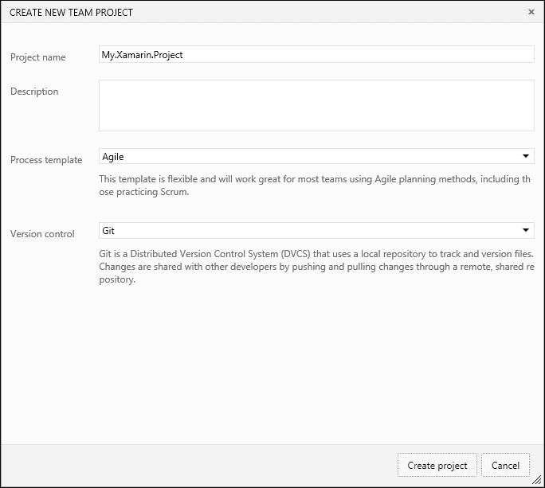

图 1：带有 Git 的团队基金会服务器

目前也可以设置一个使用多种类型仓库的团队项目。这些仓库目前只能使用最新版本的 Visual Studio（即 Visual Studio 2015 Update 1）访问。

下一个部分提供了涉及 TFS 和 Git 仓库的更多集成选项。

## TFS/Git 场景

在某些场景中，开发者可以选择或被迫使用 Git 仓库与集中式的 TFVC 仓库一起使用（例如，具有 Mac OS 开发设置的开发者没有直接与 TFVC 集成）。在这种情况下，有几种可用的实用工具和实现模式可以帮助团队准备他们的开发基础设施。

### Git 桥接

可以采用的一种集成路径是微软在 CodePlex 上维护的 Git-TF 工具。Git-TF 工具是一个用 Java 编写的平台无关的工具。它利用 TFVC API 来允许开发者使用 TFS 仓库与本地 Git 仓库一起使用。

在这个集成路径中，Xamarin 开发团队的单一成员或多个成员可以使用 Git-TF 工具与中央仓库同步的本地或共享 Git 仓库。

对于个人开发者使用与 TFVC 同步的本地 Git 仓库的设置，首先需要将 TFS 仓库克隆到本地机器：

```cs
git tf clone http://myserver:8080/tfs $/TeamProjectA/Main

```

克隆后，可以在本地机器上使用 Git 仓库继续开发。本地提交的执行不会反映在中央仓库上。在此期间，可以使用 Git-TF 的`pull`命令将中央仓库与本地仓库合并：

```cs
git tf pull --rebase

```

一旦开发任务完成，可以使用`checkin`命令将代码签入 TFS（而不是`git push`）：

```cs
git tf checkin --associate=123,124 –-message="Additional items for Task 123"

```

Git-TF 提供了将 TFS 上的工作项关联/解决并包含类似于标准代码签入的签入注释的选项。

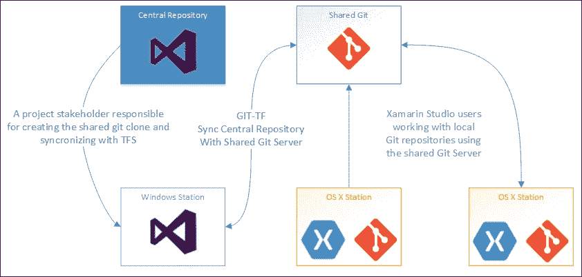

图 2：Git 与 TFVC 仓库

另一种可能性是为几个团队成员配置一个共享的 Git 仓库，这样每个开发者都可以将其克隆到本地环境中并用作分支。在这种配置中，中央仓库（TFVC）和共享 Git 仓库之间的代码合并和同步必须由管理员处理。

类似地，GitHub 上维护的 Git-TFS 工具是一个用.NET 编写的开源项目，它提供了 TFS 和 Git 仓库之间的双向集成。然而，这个工具目前还没有适用于 Mac OS 的版本。Git-TFS 为与工作空间处理和 shelvesets 相关的一些高级 TFS 场景提供了支持。

### NuGet 包

如前所述，NuGet 包是使用 Xamarin 的跨平台项目中的一种代码共享策略。NuGet 包还可以用来创建 TFVC 和 Git 之间的桥梁，可能通过为 Xamarin 目标平台提供 PCL 库来实现。

例如，我们可以考虑一个场景，其中 Windows Store 应用程序和 Xamarin.iOS 之间的共享项目是在基于 Windows 的开发环境中实现的，而 Xamarin.iOS 开发团队成员使用带有 Xamarin Studio 的 Mac OS 开发设置。在这个例子中，团队项目可以包括 TFVC 仓库（用于共享代码和 Windows Store 应用程序实现）和一个 Git 仓库（用于 Xamarin.iOS 开发）。两个服务器之间的同步可以通过 NuGet 包来处理。

可以使用 TFS 的内置构建任务定义来构建和部署 NuGet 包，使用**持续集成**（**CI**）构建过程，使 NuGet 过程成为开发管道和持续集成的一部分。

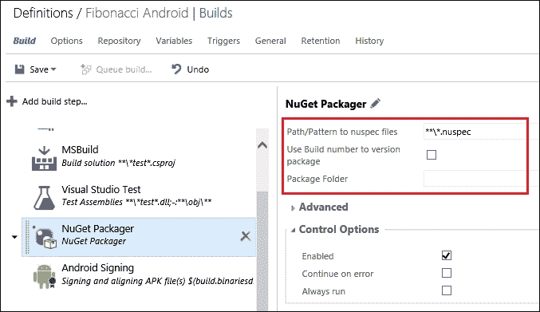

图 3：NuGet 包的自动化构建

对于 NuGet 包的分发，除了商业产品（例如，Artifactory 服务器）之外，Visual Studio Team Services 还可以用来创建 NuGet 源馈送并将它们私下发布给开发团队成员。

## Subversion (SVN)

Subversion 是另一种源代码存储库类型，通常称为 SVN 或 Apache Subversion。使用 XCode 开发工具，可以在 Mac OS 开发环境中轻松创建 Subversion 存储库。Xamarin Studio 原生支持 SVN（版本 1.6 或更高）。对于偏好基于 Mac 的开发环境的个人 Xamarin 开发者来说，Subversion 可以是一个简单的解决方案。尽管有公开可用的 Visual Studio 扩展和集成工具，可以在 Windows 环境中使用 SVN，但通常还是更倾向于使用原生支持的 Git 和 TFVC，而不是 SVN。

# 持续集成

持续集成（CI）是指涉及上述源代码管理策略的软件实践，包括自动化的构建/部署和测试阶段。如今，CI 通常指的是**应用程序生命周期管理**（**ALM**）的自动化构建/部署和测试阶段。

对于 Xamarin 项目，软件工程师可以自由使用大量 CI 管理工具，这些工具既有商业版也有免费增值许可（即免费使用有限功能）。

## Visual Studio Team Services

**Visual Studio Team Services**（**VSTS**）是 Team Foundation Server 的云版本，为 Xamarin 开发者提供了方便的功能。目前作为免费增值订阅服务提供，团队可以免费管理有限数量的项目，每个团队成员数量也有限。

在 VSTS 团队项目中，可以管理、规划、自动构建、测试 Git 和 TFVC 开发存储库，并且可能部署（有关 VSTS 集成的 Beta 部署部分请参阅）。

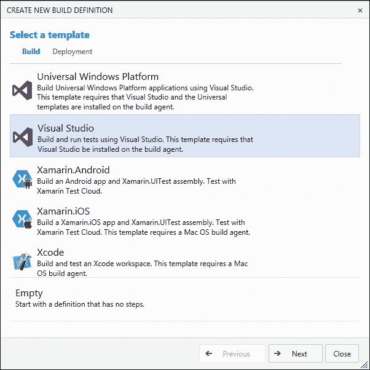

图 4：TFS 自动化的 Xamarin 构建

包含 Xamarin.iOS 和 Xamarin.Android 项目的开箱即用的构建模板可以在托管构建代理上执行。虽然后者构建模板可以使用共享托管构建代理执行，但 Xamarin.iOS 需要一个具有 Xamarin.iOS 功能的专用构建主机，以便与团队项目关联。

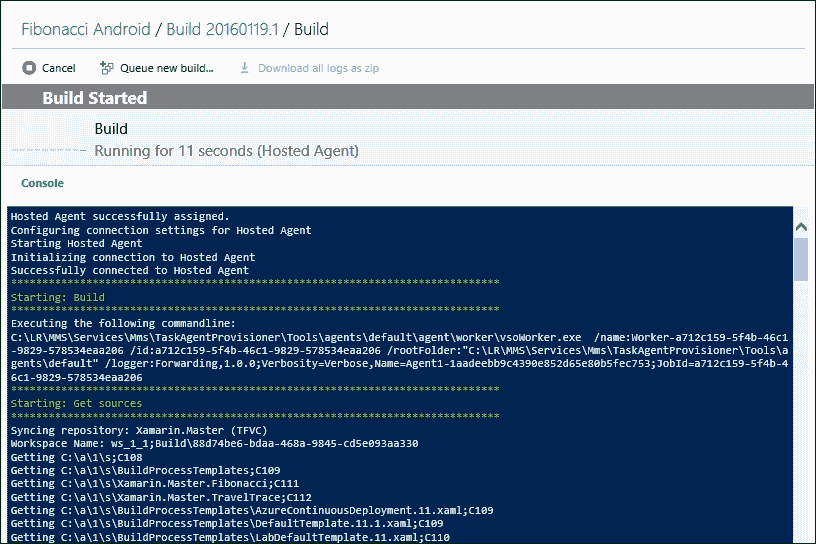

图 5：VSTS 托管 Android 构建代理

对于 Xamarin.Android 构建模板，开发者需要插入 Xamarin 许可证详情。然而，构建代理在构建期间不会占用许可证座位。构建定义模板包括一个激活步骤，其中构建代理被注册为 Xamarin 许可证的占用者，并在构建完成后进行另一个步骤以移除许可证。

在 VSTS 中，还可以集成 Xamarin Test Cloud，使用默认构建模板执行自动验收测试。

## TeamCity

TeamCity（JetBrains）是另一个 CI 服务器，它为各种平台提供了自动构建和大量的集成场景。TeamCity 可以下载并安装到多个操作系统上（包括 OS X 和 Windows），并且作为一个免费增值产品（带有有限的免费构建代理安装和构建配置）。

对于 Xamarin 开发团队来说，TeamCity 最大的优势是它可以安装在 Mac OS 上。一旦构建服务器配置完成（它可以在运行 TeamCity 服务器的同一台机器上），就可以在 Xamarin.Android 和 Xamarin.iOS 上触发各种动作的构建，例如仓库更改和计划。

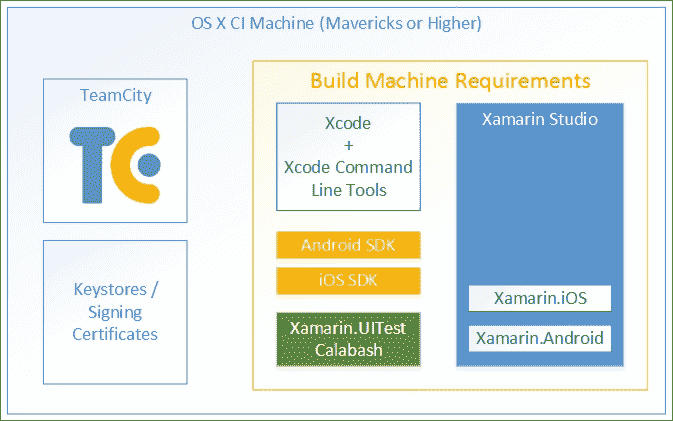

图 6：TeamCity 与 Xamarin 项目

在 Xamarin 项目中，关于可能的集成场景和构建步骤，还包括应用程序包的 Calabash 仪器化和 Xamarin Test Cloud 提交。

## 其他

Xamarin 开发团队有使用许多其他在线/云基础 SaaS（软件即服务）提供商的奢侈，这些提供商适用于内部和开源开发。其中最受欢迎的服务是 GitHub，它提供基于订阅的私有和公共仓库。CI 构建提供商如 AppVeyor 和 Travis CI 与 GitHub 有原生集成，可以用于各种平台特定的构建配置。

最后，Jenkins 是另一个免费和商业安装都适用的 CI 服务器。Jenkins 可以与各种仓库集成，并可以配置为构建和测试 Xamarin 项目。

# 自动化测试

自动化测试，换句话说，就是运行作为开发工作一部分建立的单元测试或代码 UI 测试，是大多数开发项目中持续集成周期的一个基本部分。

为了准备 Xamarin 项目的测试固定装置，开发者可以使用各种框架，如 Visual Studio 测试套件、nUnit 和 xUnit。此外，Xamarin 开发团队有从可用的源控制仓库和 CI 平台列表中进行选择的自由。幸运的是，由于上述测试框架为各种配置提供了测试适配器（除了本地的 Visual Studio 测试框架），因此这些 CI 管道的各个方面都可以轻松集成。

例如，让我们考虑一个托管在 Visual Studio Team Services 上 TFVC 仓库的 Xamarin 项目，其中单元测试固定装置是利用 xUnit 框架编写的。作为第一步，为了让 TFS 构建代理帮助 xUnit 适配器运行单元测试固定装置，测试适配器必须作为解决方案的 NuGet 包安装。

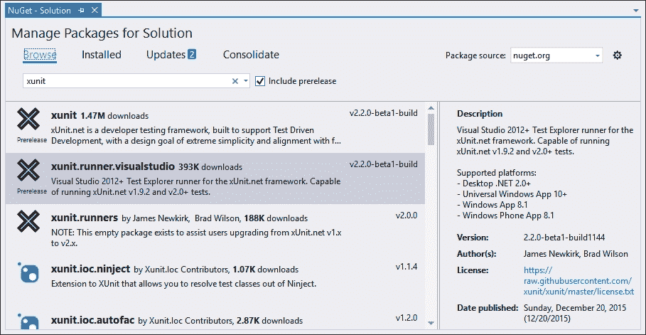

图 7：xUnit 测试适配器

在适配器包部署到源代码控制仓库后，团队构建现在可以包括使用自定义适配器的测试步骤。

在 Visual Studio 团队构建中，如果未定义自定义适配器，则测试将使用默认适配器运行。在这种情况下，构建步骤将报告找不到测试。

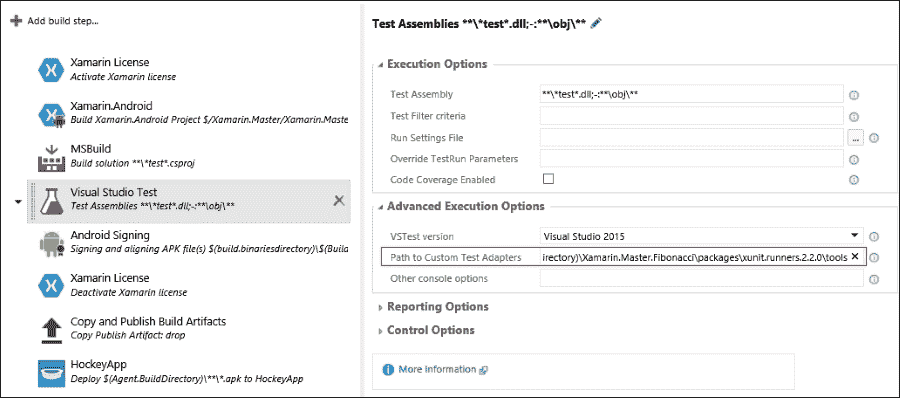

图 8：xUnit 测试适配器设置

在此配置中，解决方案中 NuGet 包的`packages`文件夹被用作源目录（例如，`$(Build.SourcesDirectory)\Xamarin.Master.Fibonacci\packages\<path>`）。也可以使用测试项目的`binaries`文件夹来访问适配器二进制文件。还应注意，在执行实际的测试用例之前，测试项目在 Visual Studio 测试任务之前的 MSBuild 任务是必不可少的。

# Beta 部署

Beta 测试是 Xamarin 开发流程的一个关键部分。通过使用 Beta 测试分发中心，如 HockeyApp、Crashlytics 或 Testflight，可以将应用程序包发送给测试用户/测试者。对于 Windows Phone 8.1 和 Android，也可以使用简单的网络方法来分发应用程序包（例如，使用共享网络位置、下载链接等）。

## HockeyApp

HockeyApp 作为唯一支持所有 Xamarin 目标平台（包括 Windows Runtime）的 Beta 分发中心，具有各种 CI 配置的集成能力。

初始时，Stuttgart 公司是一家为 iOS 和 Android 提供 Beta 测试平台的公司，后来扩展了其 SDK 以支持 Microsoft 移动开发平台。HockeyApp 最终被 Microsoft 收购。然而，它继续支持包括 Mac OS 在内的各种移动平台。

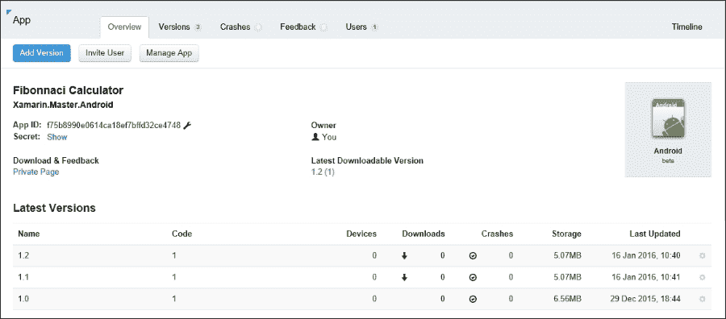

图 9：HockeyApp 应用仪表板

可以直接从 Web 界面上传 HockeyApp 分发中心的应用程序包。团队成员和/或测试者应将 HockeyApp 应用程序下载到他们的移动设备上，以便从服务器下载最新的包。

除了手动发布外，HockeyApp 还提供了两个公共 API：一个用于客户端，一个用于开发者。客户端 API 用于与服务器通信，以提供应用程序运行时相关的分析，而开发者 API 为开发者提供了上传和分发应用程序包所需的功能。

对于 Visual Studio Team Services（Visual Studio Online）和 Jenkins，有集成模块可以使将应用程序作为 CI 构建的一部分发布成为可能。

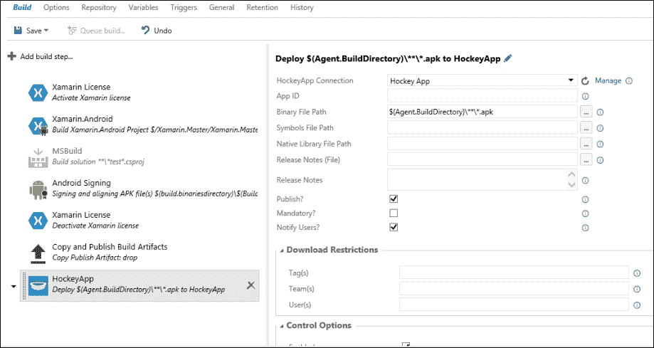

图 10：HockeyApp TFS 构建步骤

HockeyApp 套件还包括可以集成到 Visual Studio Team Services、Assembla、BaseCamp、BitBucket 等缺陷跟踪系统中的崩溃分析功能。

HockeyApp 提供免费和企业许可选项。

## Crashlytics

Crashlytics 是另一个测试分析平台，为 Xamarin.iOS 和 Xamarin.Android 应用提供分发和崩溃报告功能。

Crashlytics 提供了与其他协作工具的集成，例如 PivotalTracker、JIRA、GitHub 和 BitBucket。它还提供了一个公开的 API，为各种集成场景提供服务钩子。

Crashlytics 最近被 Twitter 收购，并继续支持两个 Xamarin 目标平台应用。Crashlytics 目前是 Twitter fabric 开发平台的一部分，并提供免费服务。

## TestFlight

TestFlight 最初是 iOS 和 Android 应用的测试平台，在被苹果收购后立即取消了 Android 应用的支持。现在它是苹果开发者计划的一部分，并且只能通过 iTunes Connect 访问。

提交给 TestFlight 的内容与实际苹果商店应用包没有区别。最终的可分发包（`.ipa`）应准备提交，并使用 Application Loader 上传到苹果服务器（有关更多信息，请参阅第十二章，*ALM – 应用商店和发布*）。

很遗憾，这个过程目前无法自动化，因为没有构建集成选项，也没有公开的 API。

## 软件包分发

与 iOS 设备相比，Android 和 Windows Phone 设备都可以安装和运行通过互联网或移动存储分发的应用包。

对于 Windows Phone 8 和 8.1，测试设备应使用 Windows Phone SDK 配置为开发者设备。为了开发者能够解锁 Windows Phone 设备，需要一个 Windows 开发者账户（这是一个免费订阅）：

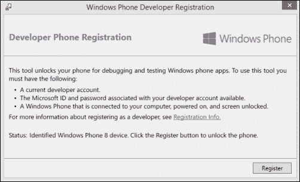

图 11：Windows Phone 开发者解锁

在注册步骤之后，开发者可以使用 SDK 工具安装应用包，或者如果有硬件支持，可以使用 SD 卡和默认的商店应用。

对于 Android 平台，有可用的免费工具可以用来安装`.apk`包。默认的包管理器也可以用来安装作为网络资源共享的自定义应用包。

# 实时遥测

实时遥测是指用于定义从目标受众或测试人员使用中的应用程序收集的分析信息。这些分析值对于功能丰富的移动应用来说是无价的，因为 Xamarin 应用可能针对运行 iOS、Android 或 Windows Phone 且具有各种硬件配置和外围设备的设备。

通过遥测，开发团队能够收集有关不同场景中用户输入模式、应用程序利用流程和平台障碍/优势的信息。虽然此类统计信息对于 UX 设计至关重要，但有关实际使用场景的崩溃/异常详细信息、网络连接、内存消耗和其他诊断数据等值可以作为应用程序的健康指标。

对于 Xamarin 目标平台，有大量的遥测提供者和框架。这些框架可以通过绑定包（例如，Android 应用程序的 Google Analytics）包含在 Xamarin 应用程序中，并且针对 Xamarin 应用程序的遥测平台（如 Xamarin Insights 和/或 Microsoft Application Insights）可以包含在 Xamarin 实现中。

## Xamarin Insights

Xamarin Insights 是专为 Xamarin 目标平台构建的分析和崩溃报告平台。Xamarin Insights 的实现可以用于每个 Xamarin 平台项目，包括 Xamarin.Forms 应用程序和 Windows Runtime。这是一个基于订阅的服务，可以在基于网络的仪表板上看到实时遥测数据。

为了在跨平台应用程序解决方案中开始使用 Xamarin Insights，应在特定平台的项目中包含 Xamarin Insights NuGet 包。在引入框架客户端程序集后，可以使用订阅密钥初始化 Xamarin.Insights 运行时。

例如，如果我们使用 MVVMCross 实现将 Xamarin Insights 模块包含并初始化到 Xamarin.Android 应用程序中，初始化可以包含在应用程序设置中：

```cs
public class Setup : MvxAndroidSetup
{
    public Setup(Context applicationContext) : base(applicationContext)
    {
        Insights.Initialize("<API Key>", applicationContext);

        // Identifying the specific user, and follow the usage pattern in the rest of the execution
        var traits = new Dictionary<string, string> {
            {Insights.Traits.Email, "john.smith@contoso.com"},
            {Insights.Traits.Name, "John Smith"}
        };
        Insights.Identify("john.smith@contoso.com ", traits);
    }
}
```

在此实现中，`Identify` 方法是一个可选调用。它用于识别用户特定的特征，而不是通用使用模式。

### 注意

无论哪个平台运行着 Xamarin Insights 内容，应用程序都应该启用使用互联网连接（即，应用程序清单）。还建议在 Xamarin.Android 应用程序上启用诸如 `BATTERY_STATS`、`READ_LOGS`、`ACCESS_WIFI_STATE` 等权限，以收集更多信息。同样，在 Windows Phone 8 上，必须在记录遥测时添加 `ID_CAP_IDENTIFY_DEVICE` 功能来识别特定设备。

一旦初始化了 Xamarin Insights 上下文，就可以在共享库（例如，ViewModel 实现）上执行额外的报告调用。

## Application Insights

Application Insights 是另一个可以与 Xamarin 应用程序一起使用的基于订阅的服务/平台。这个基于云的套件最初由微软为 Web 应用程序发布，但逐渐进入了移动应用程序领域。Application Insights 的 NuGet 包可以用于 Xamarin.Android（API 级别 15 及以上）和 Xamarin.iOS（版本 6 及以上）应用程序。功能有限的 Application Insights 可以免费用于无限数量的设备，并有限地处理数据。

Application Insights 的使用场景本质上与 Xamarin Insights 非常相似。第一步是使用平台特定的初始化器来启动遥测会话。一旦创建了遥测上下文，就可以使用`TelemetryClient`实例来启动自动诊断记录或向见解服务器发送手动数据：

```cs
var telemetryClient = new TelemetryClient();

 // User Action Event
 telemetryClient.TrackEvent("Calculation Completed");

 // Send a metric:
 telemetryClient.TrackMetric("Calculation Range", (ordinal2 - ordinal1));

 // Nominal values by which you can filter events:
 var nominalValues = new Dictionary<string,string> { {"calculation", "rangeCalculation"}};

 // Metrics associated with an event:
 var metrics = new Dictionary<string,int> 
         {
             {"ordinal1", ordinal1},
              {"ordinal2", ordinal2}
          };

 telemetryClient.TrackEvent("Calculation Completed", nominalValues, metrics);
```

与 HockeyApp 提供的崩溃分析相结合，使用 Application Insights 移动应用程序的用法统计和服务器端数据（如果有），实时遥测可以提供关于 Xamarin 应用程序的宝贵见解。

### 注意

Application Insights 正在逐渐被 HockeyApp 取代。这一转变最初在 2015 年 11 月的 Connect()会议上宣布。截至 2016 年 4 月，微软将停止接受 Xamarin 应用程序以及 Windows Store 和 Windows Phone 应用程序的新提交。2016 年 6 月，移动应用程序的应用程序见解数据将完全迁移到 HockeyApp。

# 摘要

总体而言，可用于.NET 平台的工具可以轻松地用于管理和简化开发管道任务。除了基于微软的提供之外，还有许多采用免费订阅模式的提供商。这为个人/独立开发者创造了巨大的机会。

对于源代码控制，最合理的选择是 Git 和 TFVC。虽然 TFVC 对于基于 Windows 的开发环境设置的开发者来说是一个理想的解决方案，但 Git 为 Windows 和 Mac OS 环境中的 Xamarin Studio 提供了原生集成。

不论是选择哪个仓库，Visual Studio Team Services 或其他 CI 平台，如 TeamCity，都可以用于创建自动测试和构建工作流程。

最后，beta 测试和收集的遥测数据是 Xamarin 项目的根本要素。通过实际用例和用法模式的分析数据，开发者可以微调他们的应用程序，并在实际发布前避免问题。

在最后一章中，我们将讨论 Xamarin 应用程序提交到商店的准备步骤和分发选项。
