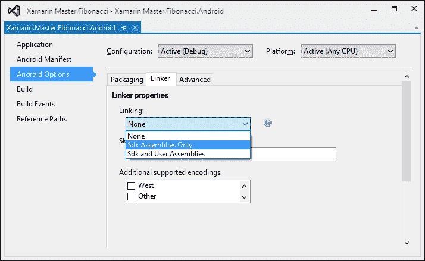
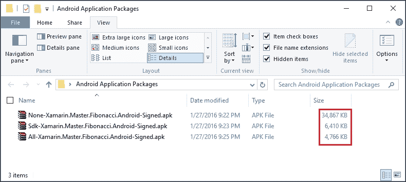
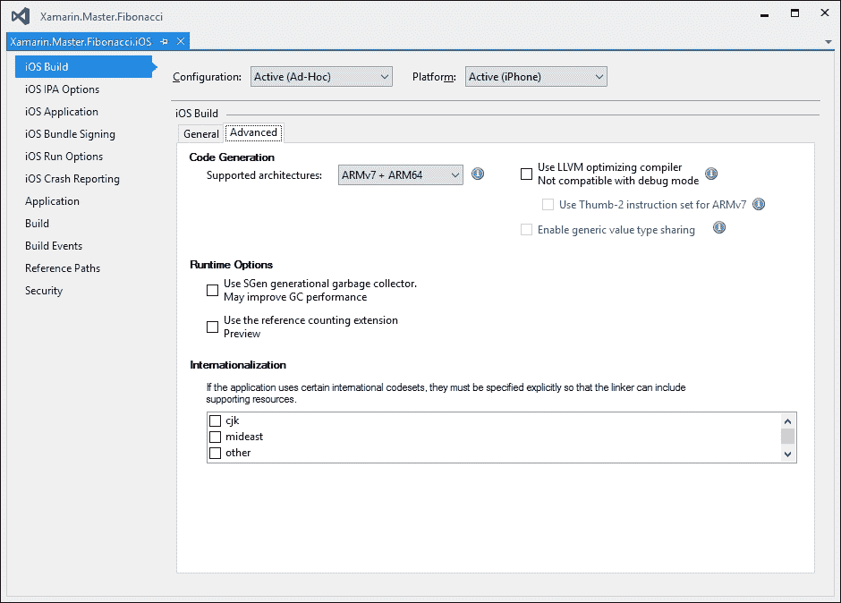
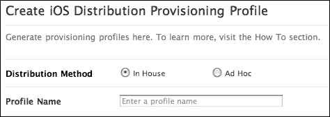

# 第十二章。ALM – 应用商店和发布

本章解释了与应用程序包准备和发布相关的流程，这构成了应用程序生命周期的最后一步。关于应用程序包和包的一般信息之后，接着是关于不同发布渠道和发布管理工具的信息。本章分为以下部分：

+   发布包

+   分发选项

+   商业应用程序

# 发布包

在每个 Xamarin 目标平台上，发布包与开发阶段和测试阶段准备的开发包在几个方面有所不同。发布包经过优化，以占用更少的空间并在运行时消耗更少的资源（包括处理时间和内存资源）。它们也不包含用于**即时**（**JIT**）调试所需的符号文件或进程间通信通道（例如**Java 调试线协议**（**JDWP**））。还重要的是要提到，一旦 Xamarin.iOS 和 Xamarin.Android 项目构建用于发布，它们实际上与使用原生开发工具构建的应用程序没有太大区别。

为了准备应用程序发布，开发者在实际构建应用程序之前需要采取几个准备步骤。这些步骤在每个平台上略有不同。

## Xamarin.Android 应用程序包（.apk）

准备 Xamarin.Android 应用程序发布包的开发者应遵循一定的清单来创建一个优化的发布包。

### 禁用调试

准备 Xamarin.Android 应用程序发布的初始步骤是禁用 Xamarin 工具或`adb`用于与**Java 虚拟机**（**JVM**）通信的 Java 调试线协议（**JDWP**）调试通道。如果不禁用，此通道可能会造成安全风险。

可以通过应用程序清单或`AssemblyInfo.cs`文件来禁用 JDWP。为了通过应用程序清单禁用调试，需要在应用程序节点上设置`android:debuggable`属性为`false`：

```cs
<application android:label="Fibonnaci Calculator" 
              android:debuggable="false" 
              android:icon="@drawable/Icon">
</application>
```

`AssemblyInfo.cs`中的条目看起来类似：

```cs
[assembly: Application(Debuggable = false, BackupAgent = typeof(PreferencesBackupService))]
```

### 小贴士

注意，调试构建包含某些权限，如存储访问和互联网使用，会自动启用。一旦应用程序使用发布配置构建，运行应用程序进行另一轮回归测试是一个好主意，如果需要，修改应用程序清单中的显式权限声明。

### 链接

在开发阶段，应用程序部署通常包含整个 Xamarin.Android 运行时程序集集（无链接）。链接是一个过程，其中只将所需的组件引入到应用程序包中，以减小应用程序包的大小。在链接过程中使用了一个静态分析算法（即编译前编译），在这个过程中，会识别依赖关系并将其包含在包中。

有三个可用的选项定义了哪些组件将经过链接过程：

+   **None**: 这是调试构建的默认配置值。不执行链接操作。

+   **仅 Sdk 组件**：仅链接 Xamarin.Android 运行时组件。

+   **Sdk 和用户组件**：对 Xamarin.Android 运行时组件和应用程序库进行静态分析以确定代码可达性。

    图 1：链接器选项

为了确保某些类型和命名空间包含在最终包中，即使它们不是静态可访问的，也可以通过使用所需类型作为参数的公共类声明和公共方法创建必要的代码可达性（参见`LinkerPleaseInclude.cs`）：

```cs
public class LinkerPleaseInclude
{
    public void Include(Activity act)
    {
        act.Title = act.Title + "";
    } 
}
```

使用链接描述文件也可以实现链接特定类型和方法。为了创建链接描述文件，应在 Xamarin.Android 项目中创建一个设置构建操作为`LinkDescription`的 XML 文件。`LinkDescription`的文件架构使用简单的声明性结构：

```cs
<?xml version="1.0" encoding="utf-8" ?>
<linker>
  <assembly fullname="Mono.Android">
    <type fullname="Android.App.Activity" >
      <method name="get_Title" />
      <method name="set_Title" />
    </type>
  </assembly>
</linker>
```

一旦应用程序构建完成并且包已导出，比较`None`、`Sdk`和`All`组件的签名`apk`包的大小，会发现明显的尺寸减少：



图 2：Android 链接器结果

就像发布构建一样，在链接步骤之后，强烈建议运行另一个设置回归测试，以查看应用程序功能是否按预期工作。

### 打包选项

重要应用程序包相关配置值可以在**项目属性**页的**Android 选项**标签页的**打包**部分找到。尽管在正常发布构建中，大多数配置值默认禁用，但在某些场景下，它们可能用于优化发布包。**使用共享运行时**和**使用快速部署**在正常情况下是针对调试构建的，用于提高开发者的生产力。

+   **将组件打包成原生代码**：此选项指示 Mono 编译器将应用程序组件打包成一个原生共享库，作为安全措施（仅适用于企业许可证）。

+   **为每个选定的 ABI 生成一个包（.apk）**：每个选定的**应用程序二进制接口（ABI**）将导致编译器生成一个单独的包。例如，如果选择了 armeabi-v7a 和 x86 CPU 架构，将生成两个应用程序包。

+   **AOT 编译**（实验性）：提前编译将应用程序组件转换为原生代码，以减少应用程序的初始化时间，同时增加应用程序包的大小（仅适用于商业或企业许可证）。

+   **启用多 DEX**：为了绕过 DEX 方法计数限制，Android Lollipop（API 21）版本中引入了多 DEX 功能，并为 API 级别 4 到 20 发布了回溯支持库。此选项启用使用多个 DEX 文件。

    ### 注意

    Android 应用程序包包含一个名为 Dalvik 可执行文件（DEX）的可执行字节码文件。此文件包含应用程序运行时使用的编译代码，并且引用的方法数量有限制，为 64*210（65536）个（包括 Android 框架方法、库方法和应用程序引入的自定义代码）。

+   **启用 ProGuard**：ProGuard 是另一个可以帮助减小应用程序和 DEX 声明的选项。对于使用原生工具集开发的应用程序，ProGuard 还可以混淆应用程序代码，但此选项目前不可用于 Xamarin.Android 应用程序。

### 打包

准备步骤完成后，可以使用 Visual Studio 或 Xamarin Studio 创建 Xamarin.Android 应用程序包。Xamarin Studio 提供归档构建的选项，以便它们可以轻松签名并推送到可用渠道。

可以使用项目上下文菜单中的**归档以发布**选项来归档应用程序包。（同样，可以使用**查看归档**按钮访问以前的归档。）在归档视图中，所选的应用程序包可以签名并准备好提交到商店或临时（参见*分发选项*）分发。


图 3：Xamarin Studio 包归档

使用 Visual Studio 的`导出 Android 包`选项创建的包使用调试密钥签名。这些包不应，并且在大多数情况下不能，通过正常渠道分发。为了创建发布就绪的包，应定位构建目录中的未签名包，并使用 Java SDK 中的`jarsigner`实用程序对包进行签名。

## Xamarin.iOS 应用程序包（.ipa）

在任何 iOS 应用程序可以发布到 App Store 之前，需要配置和修改几个配置值。更重要的是，构建过程应配置为发布构建，并且在提交到 iTunes Connect 之前，包应使用适当的身份进行签名。

### 构建选项

对于发布构建（临时或应用商店），一旦设置了活动构建配置，一些值会自动调整为开发者的便利性。例如，与调试相关的选项，如**启用性能分析**和**启用增量构建**，会自动禁用。这些选项，连同**启用调试**选项一起，会产生较大的应用程序包，这些包对于商店提交无效。

除了调试选项之外，必须仔细配置支持的 CPU 架构。虽然可以组合选择（如图下所示的 ARMv7 + ARM64），但每个架构针对特定的 iPhone 或 iPad 模型。ARMv6 是 iPhone 3G 最初使用的 CPU 架构。这个架构不再被 iOS 编译器支持。从 iPhone 3GS 开始，直到 iPhone 5，包括 iPad，使用的 CPU 架构是 ARMv7。ARMv7s 和 ARM64 分别用于 iPhone 5 和 iPhone 5s。iPhone 6 使用 ARMv8，这是一种另一款 64 位处理器（即，构建要求将是 ARM64）。



图 4：iOS 构建配置

**低级虚拟机**（**LLVM**）是一组工具/库的名称，旨在为各种编程语言编写的程序进行编译时优化。它是在开源许可下发布的。在开发阶段，Xamarin 工具仅使用 mono 编译器（`mtouch`）。Mono 编译器生成的二进制文件优化程度较低但“可访问性”更高，这使得它们可以调试和诊断。然而，对于使用 LLVM 的发布构建，它可以生成更多优化的结果。

虽然 LLVM 提供了包大小和运行时增强，但 Thumb-2 指令集仅仅是可执行大小的改进。ARMv7 和 ARMv7s 处理器使用这个紧凑的指令集。它可以在牺牲较慢的执行时间的情况下显著减少包大小。

### 链接

链接的工作方式与 Xamarin.Android 平台类似。除了使用公共方法创建任意类以避免某些类被链接出来之外，在 Xamarin.iOS 上，可以在类声明上使用 `Preserve` 属性来通知编译器有关某个类及其成员（如 `[Preserve(AllMembers = true)]`）的必要性。

### 配置文件

配置文件用于设置 iOS 应用程序的权限和包签名信息。为了创建一个可发布的 iOS 包，用户首先需要在苹果的 iOS 配置文件门户上创建应用程序元数据。

在配置文件门户上，开发者应首先选择一个独特的应用程序名称和捆绑 ID。一旦发布，这些将用于识别应用程序。此外，还需要选择应用程序所需的应用程序服务。

除了 App ID 之外，还应为应用程序创建分发配置文件。为了创建分发配置文件，需要在应用程序门户导航树中选择 Provision->Distribution 节点。使用**+**按钮可以创建一个新的分发配置文件。在分发配置文件向导中，用户需要选择分发类型（即，**App Store**或**Ad Hoc**），选择之前创建的 App ID，可能的部署设备和签名证书（可以从苹果的会员中心请求签名证书）。

一旦创建了 App ID 和配置文件，应在 Xamarin.iOS 项目的 iOS**应用设置**部分设置应用程序元数据（`Info.plist`和`Entitlements.plist`文件也可以直接配置）。

最后，可以使用**发布存档**按钮来创建发布包。一旦构建完成，新的包将在存档窗口中显示。选择正确的应用程序并使用**签名和分发**选项将打开发布向导，在此向导中可以选择并应用之前配置的配置文件到当前构建包。

## Windows Phone 应用程序包 (.appx)

使用 Visual Studio 中为 Windows 应用程序开发者提供的工具集准备 Windows Phone 和 Windows Store 应用程序包。在发布准备阶段，Windows Phone 应用程序不需要或与任何 Xamarin 组件交互。

# 分发选项

与测试版构建一样，Xamarin 应用程序的发布版本也有不同的分发选项。公共应用商店是分发移动应用程序最简单、最方便的方式，面向大众。另一方面，对于企业应用程序的分发场景，可能需要私有应用程序分发渠道。

## 应用商店

对于 Xamarin.iOS 和 Windows Phone 应用程序，唯一的官方分发商店分别是苹果和微软分别维护的应用商店。这些应用商店都有明确的提交流程，包括内容验证（即，应用程序是否符合内容指南）和技术验证（即，应用程序是否符合质量标准）。在将发布包提交给这些商店之前，强烈建议阅读适当的应用程序认证指南。为了使用 iTunes Connect 工具和 Apple App Store 分发应用程序，开发者需要申请开发者账户并支付年度订阅费。Windows App Store 需要开发者账户订阅，目前是免费的。

另一方面，Android 开发者有大量的公共应用程序分发渠道可供选择。最受欢迎的商店是 Google Play 和 Amazon 应用商店。这两个商店都允许开发者发布付费和免费的应用程序。

Google Play 商店是 Android 操作系统的官方应用程序商店。它最初被称为 Android Market，后来与另外两个 Google 产品合并，即 Google 音乐和 Google 电子书商店。Google Play 商店要求开发者支付小额订阅费才能分发应用程序。安全和质量测试是应用程序认证过程中最重要的步骤之一，这使得该商店在 Android 用户中最为可信。

另一方面，Amazon 应用商店最初是为 Amazon Kindle Fire 设备专门创建的，但后来成为 Android 应用程序的第二大商店。开发者可以免费注册开发者账户，并且收入分成模式与其他流行商店相同（即，70% 开发者/30% 商店）。

除了两个最大的商店外，还有其他 Android 应用程序商店。最引人注目的应用程序商店提供商是 F-Droid 商店，它专注于 Android 操作系统的免费和开源软件（FOSS）。由于商店政策规定分发应用程序中不包含跟踪、广告或依赖项，因此该商店吸引了众多用户。

## 临时分发

临时分发是指通过各种通信渠道（如共享存储、在线分享、电子邮件等）将应用程序包分发给用户进行测试或私人使用的过程的名称。

这种分发方式在前一章的测试部分中提到过，但有时仅用于内部使用构建的应用程序也可以以这种方式分发。

临时分发概念可以分为两大类：签名分发和无签名分发。在空中分发应用程序包的官方方式是使用受信任的证书对应用程序包进行数字签名（即，签名身份应使用官方渠道创建，例如签名证书提供商）。一旦应用程序包使用受信任提供商的证书进行了数字签名，该应用程序就可以侧载到移动设备上。侧载是指在不使用公共或私人商店的情况下安装应用程序的过程。

如果应用程序使用自签名证书进行签名，应用程序发布者将无法识别。在这种情况下，设备所有者应允许从未知来源安装应用程序（在 Android 和 Windows 10 移动设备上），或者设备应解锁为开发者模式（在 Windows Phone 上）或越狱（在 iOS 上）。虽然在 Windows Phone 设备上解锁设备是官方流程，但越狱违反了 iOS 的最终用户许可协议。

# 商业线应用程序

商业线应用程序，或 LOB 应用程序，是一个通常与企业应用程序同义的术语。这些应用程序要么是内部开发的，要么是针对公司特定需求外包的。换句话说，LOB 应用程序可以归类为商业而非消费应用程序。它们通常是特定领域的，针对具有特定需求的小组。

## 私有渠道分发（Android）

分发为 Android 平台构建的 LOB 应用程序的一种方式是使用 Google Play 私有渠道。通过这些渠道分发的应用程序仅限于特定域的用户。为了使用私有渠道，需要订阅 Google Play for Work、Google Apps for Business、教育或政府。

虽然应用定价和其他分发设置可能仍然适用于这些私有应用程序，但在商店提交过程中会跳过测试和验证步骤。应用提交可以由渠道所有者完成，或者权限可以委派给同一域内的其他用户。

## 苹果开发者企业计划

苹果开发者企业计划是苹果支持公司开发和分发内部应用程序的举措。此计划仅适用于作为法律实体存在的公司（需要 D-U-N-S 号码）。一旦组织注册了企业计划，开发和管理团队成员可以分配角色，以及数字证书和配置文件。然而，这些配置文件不能包含 App Store 分发方法（即，唯一可用的配置文件是内部和临时的）。



图 5：苹果开发者企业计划的配置文件

在企业计划下构建的应用程序可以通过原生或第三方**移动设备管理（MDM**）解决方案以及临时包进行分发。

## Windows Phone 私有分发

Windows Phone 应用程序可以用于内部使用进行开发和分发，使用从赛门铁克（Symantec）购买的签名证书（赛门铁克目前是此类证书的唯一提供者）。使用移动签名证书，应用程序包可以签名并通过 MDM 分发，或者侧载到公司设备中。

大多数 MDM 提供商，如 Microsoft Intune，都配备了公司商店应用程序，可用于为公司设备提供应用程序。设备管理系统还使直接为域用户安装公司应用程序成为可能。

还可以在设备上安装签名证书，这将使内部应用程序受益，并通过定制的公司中心应用程序分发应用程序。

# 摘要

在本章中，我们简要介绍了 Xamarin.Android 和 Xamarin.iOS 应用（以及 Windows Phone）的发布包准备过程。正如您所看到的，准备发布包比在所选的开发 IDE 上按下**调试**按钮要复杂一些。然而，每个平台都有明确的应用认证指南和在线资源。

一旦准备完成发布包，开发者需要从不同的分发选项中进行选择，包括但不限于可以用来发布发布包的公共和私有存储库。公共存储库应用可以交付给公众，而私有分发渠道或临时部署，涉及侧载和 MDMs，可以用于 LOB 应用。
