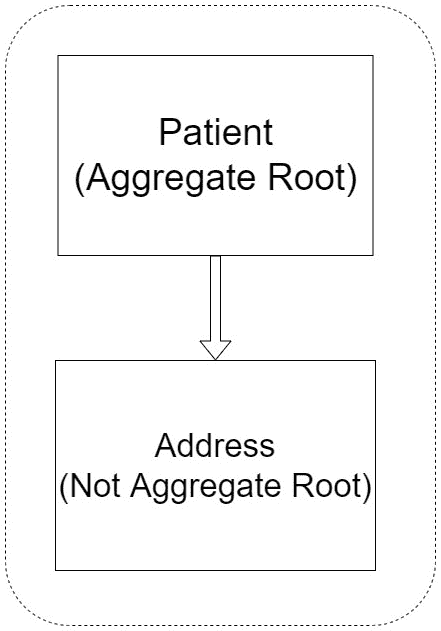
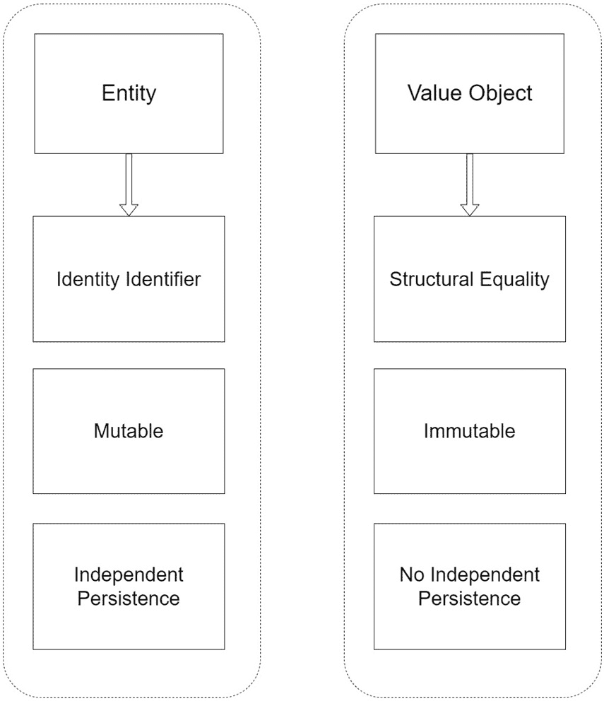

# 使用聚合模式进行工作

在上一章中，我们查看了一些构成微服务的关键元素。我们将把注意力转向这些概念的实际应用，从**聚合模式**和**领域驱动设计**开始。这些结合为基于微服务设计原则构建的应用程序的范围设定了前提。

聚合模式与领域驱动设计相辅相成。目前，我们将领域驱动设计简称为**DDD**。因此，DDD 聚合是一组领域对象，作为一个单一单元组合在一起。在实践中，我们可能会有与文档不同的客户记录，但明智的做法是将所有这些数据点显示为一个数据点，即聚合。

在阅读完本章之后，我们将能够做到以下几件事情：

+   理解 DDD

+   理解如何在系统过程中推导领域

+   理解聚合及其聚合模式的重要性

+   区分聚合和实体

+   理解值对象及其在设计过程中的作用

# 技术要求

本章中使用的代码引用可以在项目仓库中找到，该仓库托管在 GitHub 上，网址为 [`github.com/PacktPublishing/Microservices-Design-Patterns-in-.NET/tree/master/Ch02`](https://github.com/PacktPublishing/Microservices-Design-Patterns-in-.NET/tree/master/Ch02)

确保您的机器上至少安装了以下软件之一，以便能够执行此代码（使用链接下载和安装）：

+   Visual Studio 2022: [`visualstudio.microsoft.com/vs/`](https://visualstudio.microsoft.com/vs/)

+   Visual Studio Code: [`code.visualstudio.com/download`](https://code.visualstudio.com/download)

# 探索 DDD 及其重要性

DDD 是一种软件开发方法，鼓励我们作为开发者评估过程和子过程，并解析其中的所有原子元素。"原子"意味着一个过程可能有多个组成部分，虽然它们组合起来产生一个输出，但它们都有自己的程序要执行。每个子过程都可以被视为自我管理的，并且可以进一步归因于一个**领域**。这促使我们将单体拆分成独立的微服务，这些微服务在自己的数据上执行自己的任务。那就是一个领域。

在我们进一步深入之前，让我们花些时间探索一些关键词及其定义：

+   **模型**：这些是定义领域方面并用于解决领域问题的抽象。我们将有关目标领域的信息组织成较小的部分，并称它们为模型。模型是我们设计和开发过程中的一个中心参考点。然后，这些模型可以分组到逻辑模块中，一次处理一个。一个领域包含的信息太多，无法仅用一个模型来处理，有时，信息的一部分可以简单地省略。例如，我们的医疗管理系统确实需要捕获客户信息，但我们不需要知道他们的眼睛和头发颜色。这可能是一个简单的例子，但在实际场景中可能会变得更加复杂。筛选知识体系的相关部分需要与开发者、领域专家和同行设计师的紧密合作。

+   **通用语言**：这是一种特定于领域模型的独特语言，在涉及特定领域活动的背景下由团队成员使用。我们已经确定，一个领域的模型需要通过与领域专家的合作来开发。鉴于技能集和认知的差异，将存在沟通障碍。开发者倾向于思考和谈论与编程相关的概念。他们通常用继承、多态等术语思考和交谈。不幸的是，领域专家通常不知道或不关心这些。领域专家将使用他们自己的术语和开发者不理解的语言。这种沟通差距对任何团队来说都不是好兆头。

+   **边界上下文**：这定义了系统或子系统的边界，它告知特定团队将执行的工作以及他们在其领域内的努力焦点。一个**边界上下文**是领域的逻辑边界，其中适用术语和规则。所有在这个边界内的术语、定义和概念都构成了**通用语言**。建立边界上下文是领域驱动设计（DDD）的核心步骤，在大型团队中战略性地用于范围大型模型。在 DDD 中，我们将较大的模型细分为边界上下文，然后我们确定它们之间存在的关联。没有现实世界示例的 DDD 中的上下文映射可能会令人困惑。让我们以我们的医疗管理系统作为两个使用边界上下文映射的示例实现的样本，并学习如何分析映射之间的关系。假设我们有文档管理和患者预约的上下文。两者都有无关和相关的概念。文档仅存在于文档管理系统中，但将引用患者。上下文映射是 DDD 中用来描述边界上下文之间关系的常用策略。

*图 2.1*显示了两个领域之间的关系：


图 2.1 – 每个领域都是独立的，但有时数据会重叠。预约管理和文档管理都需要患者数据

让我们退一步，从微服务设计模式的角度评估仅构建软件所需的内容。领域是一类业务规则和操作。如果你的软件将在银行中使用，那么领域就是银行；如果它在医院中使用，那么领域就是医疗保健。

因此，我们开发的软件必须补充领域，以解决整体问题。领域的核心概念和元素必须存在于软件的设计和模型中。

## 探索 DDD 的优缺点

DDD 是一项重大承诺。它促进了对领域较小、个体部分的关注，并且产生的软件更加灵活。它将应用程序分解成更小的块，使我们能够更容易地修改应用程序的部分和组件，并减少副作用。应用程序的代码往往组织良好且易于测试，领域业务逻辑被隔离到特定的代码库中。即使你不会在整个项目中使用 DDD，这些原则对你的应用程序实施活动也是有益的。DDD 最好用于分解复杂业务逻辑。它不适用于具有简单需求和创建、添加、更新和删除数据业务逻辑的应用程序。DDD 耗时且需要专家级的领域知识。因此，请记住，需要非技术资源人员，并且他们必须在项目期间可用。

现在我们已经从高层次上理解了 DDD，让我们探索它所促进的概念如何与微服务设计模式相结合。

## DDD 和微服务

使用 DDD 进行范围规划的应用程序的最佳实现方式是通过微服务。到目前为止，我们可以认识到微服务架构促进了将一个大型应用程序概念划分为自包含和独立的服务。因此，为了使用边界和上下文的概念，每个微服务都服务于其自身的边界上下文。每个微服务都将拥有自己的模型、语言、业务规则和技术栈。

这并不是一个万能的解决方案，因为微服务与边界上下文之间的完美对齐可能并不总是成立，但包括我们的应用程序在内的某些应用程序是微服务和 DDD 的完美候选人。

我们可以考虑许多场景，在这些场景中我们可以隔离某些不是最明显的服务，这些服务最初也没有被定义为边界上下文。以电子邮件和警报系统为例。将这些逻辑和功能放在网络应用中是足够的，这样当提交预约时，我们会向我们的患者发送确认信息，向工作人员发送警报。这是合理的，但我们可以创建基于消息队列的服务，这些服务仅用于传递这些消息。这样，网络应用的责任就更少了，我们在处理电子邮件或警报维护问题时意外修改 UI 逻辑的风险也更小。

最终，因为 DDD 建议我们将上下文分离成独立的切片，微服务架构是支持这一雄心的完美开发模式。记住，DDD 作为一项初始指南，用于制定可以独立存在的业务规则，每个微服务都将被开发来支持那一组业务规则，并以最有效和松耦合的方式实现支持服务。

现在我们已经能够理解 DDD 和微服务是如何相辅相成的，让我们开始探讨聚合模式以及如何开始评估需要捕获的不同模型和数据。

# 聚合模式的目的和使用

*聚合模式* 是 DDD 中的一种特定软件设计模式。它促进了相关实体的收集并将它们聚合为一个单元。

聚合使得在大系统中定义元素的所有权变得更加容易。没有它们，我们面临的是蔓延和试图做太多的事情的风险。在确定了领域中的不同上下文之后，我们就可以开始从可能多个上下文和来源中提取我们确切需要的数据，并对它们进行建模。

## 聚合和聚合根

一个聚合包含一个或多个实体和价值对象模型，它们以某种方式相互交互。这种交互鼓励我们将它们作为一个单元来处理数据变更。我们还想确保在做出更改之前，聚合始终保持一致性。在我们的医疗管理系统概念中，我们已经确定了有一个患者，他很可能还有一个地址。对患者的记录及其地址的任何更改都应该被视为一个单一的事务。我们还希望考虑聚合有根或父对象，为所有其他聚合成员提供。

聚合使得在多个对象上强制执行某些数据验证规则变得更加容易。因此，在我们目前的例子中，一个患者可以有多个地址，但至少需要有一个地址才能处于有效状态。这类约束从根的更高层级更容易全面应用。这也更容易确保数据变更遵循**ACID**（**原子性、一致性、隔离性和持久性**）原则。我们将在后面的章节中进一步探讨这些内容。

聚合根还有助于我们维护不变性。不变性是不可协商的条件，确保系统的一致性。在确定什么应该是聚合根的好指标是考虑删除记录是否应该触发对层次结构中其他对象的级联删除。本质上，我们的聚合根代表了一组相关的对象，作为一个单元进行数据相关变更。

*图 2.2* 展示了根实体与非根实体之间的关系：



图 2.2 – 患者是我们的聚合根，以地址为例，我们还有其他与根对象相关的实体

如您所见，**患者**实体扮演着聚合根的角色，并与**地址**实体存在关联。

总是使用图表来可视化不同实体和对象之间的关系是很好的。这有助于在范围界定练习中提供更广泛的理解，因为我们评估每个模型在领域中的作用以及我们的数据策略如何实现。

现在，让我们将目光转向更深入地探索关系。我们需要查看系统的其他部分，并确定哪些应该是子实体、父实体，或者仅仅是兄弟实体。

## 聚合中的关系

考虑到聚合是相关对象的集群，我们完全理解这些对象之间的关系非常重要。一般来说，我们认为关系是双向关联——也就是说，对象 A 与对象 B 相关联，反之亦然。例如，一个患者有一个预约，我们需要他们有一个预约。这种思维方式可能与领域驱动设计（DDD）的原则相矛盾，因为我们在尝试简化事情，双向关系可能会增加当前任务的复杂性。

在领域驱动设计（DDD）中，我们希望推广单向关系的概念。如果我们选择双向关系，这可能会发生，我们需要确保增加的复杂性是合理的。关系允许一个对象遍历另一个对象的详细信息。这意味着，对于患者，我们应该能够看到相关预约的所有详细信息，但在相反方向我们不需要看到患者的所有详细信息。一个简单的患者 ID 引用就足够了。如果我们引入一个完整的双向关系，那么我们就在预约和患者之间创建了一个直接的依赖关系，这并不一定正确。在定义我们的模型时，一个好的衡量标准是问自己，“*我能否在不需要另一个对象的情况下定义这个对象？*”

一个好的指导原则是我们应该始终确保我们的聚合从根到其依赖项的单向流动，而绝不相反方向。

我们已经看到了明显且紧密相连的关系，但当关系更广泛地分散时会发生什么？让我们讨论我们如何处理跨越聚合的关系。

## 处理跨越聚合的关系

我们知道，聚合是我们应用程序中逻辑分组之间的边界。我们通过限制对聚合中非根对象的直接引用来强制这些隔离。在我们的患者和地址的例子中，我们可以安全地让患者记录引用地址，使我们的地址成为一个实体或值对象。

在这个关联中需要注意的关键点是，获取患者正确地址的唯一方法是通过搜索患者记录。地址不会在其他任何地方被引用。然而，患者可以从其他聚合中引用，例如从预约记录或文档中引用。因此，了解何时可以直接引用或不能直接引用一些数据是很重要的，我们可以利用这一点来指导我们可以在应用程序设计中将哪些聚合作为核心。

考虑到设计我们的数据对象用于数据库访问库，例如 Entity Framework，我们必须考虑所有**创建、读取、更新和删除**（**CRUD**）操作对我们数据的影响。根据我们实体类的一般设计模式，我们会在关系中的两个实体内部放置导航对象，但如果不妥善管理，这可能会导致级联问题。这是一个关键的设计决策，因为有时删除导航对象，牺牲一些 Entity Framework 的魔力，并保持对模型如何交互的更大控制和可预测性会更好。通过仅保留外键 ID 引用，我们可以更好地强制聚合以单向方式与非根实体相关联。现在我们已经了解了聚合、聚合根以及我们如何构建它们，让我们来探讨实体，并比较它们与聚合的不同之处。

# 聚合与实体

如前所述，聚合在概念上由实体和相互关联的值对象组成。我们需要完全理解实体是什么以及它在我们的开发过程中扮演的角色。

## 实体及其必要性

在领域驱动设计（DDD）中，决策是由行为驱动的，但行为需要对象。这些对象被称为 *实体*。实体是系统中数据的表示，是你需要能够检索、跟踪变更并存储的东西。实体通常还有一个标识键，最常见的是自增整数或 GUID 值。在代码中，你希望创建一个基实体类型，允许你根据派生类型设置所需的关键类型。以下是一个 C# 中 `BaseEntity` 类的示例：

```cs
public abstract class BaseEntity<TId>
    {
        public TId Id { get; set; }
    }
```

`BaseEntity` 类将接受一个泛型 `type` 参数，这使得我们能够根据需要灵活地设置 ID 类型。我们还确保将类类型设置为 `abstract` 以防止 `BaseEntity` 的独立实例化。

拥有关于你打算实施的实体和数据持久性策略的心理图是一回事。但当责任落到肩上时，建模和编码往往是不同的活动。鉴于 DDD 的独特需求，有一些模式和技巧可以采用，以确保某些技术属性在我们的 DDD 风格实体中得到实施。为你的系统建立中心实体，然后围绕这个中心设计所有其他部分是很重要的。例如，可以说预约预订是我们系统中最核心的操作，因此所有其他实体都只是作为参考。在另一个范围内，患者记录管理可能被视为最关键的部分，因此我们希望尽可能使这一方面尽可能稳健。

这些场景表明，你做出的决策需要与当前任务相关。没有一种方法适合所有人，你的设计考虑需要最适合你的整体环境。除此之外，我们还需要确保在开始实施领域事件、存储库、工厂以及任何其他与业务逻辑相关的元素之前，我们对要执行的操作有一个很好的理解。

现在，让我们看看在我们的 DDD 风格系统中实体具体的使用。我们需要了解实体应该如何被使用以及它们在我们系统中的实际用途。

## 实体在代码中的实际用途

实体主要是由其标识符定义的，对于领域模型来说非常重要。我们精心设计和实现实体是非常关键的。

实体代表可能需要穿越多个微服务的数据，因此需要有一个可以唯一标识它在任何系统中的身份值。我们通常在关系型数据库中使用顺序整数作为我们的 ID 值，但考虑到这个限制，我们不能依赖于这个顺序值在多个数据库中使用。因此，我们通常采用**GUID**的使用，它是一般随机生成的字母数字字符串块。它不是顺序的，但它更容易保证一致性，因为我们是在代码中设置的，而不是依赖于数据库来设置它。

相同的身份可以在多个微服务中建模。在一个身份值在微服务之间共享的场景中，这并不一定意味着每个微服务或边界上下文中的相同属性和行为都是相同的。例如，在患者管理微服务中的患者实体可能包含我们想要范围的所有关键属性和行为，但在预约预订微服务中的相同实体可能只需要最小数据和行为，以满足预约预订过程的需求。实体的内容将始终与微服务或边界上下文的需求相关。

领域实体通常以方法的形式实现行为，以及数据属性。在领域驱动设计（DDD）中，领域实体需要实现仅对特定领域或实体有用的行为和逻辑。在我们的`patient`类的情况下，必须实现与验证相关的任务和操作作为方法。这些方法将处理实体的不变性和规则，以确保它们不会散布在应用层。

在这一点上，我们已经开始看到我们的实体模型可能不仅仅是具有属性的类，也可能实现行为。接下来，我们将探讨贫血和丰富领域模型以及它们的实现方式。

## 丰富的领域模型与贫血领域模型

在这一点上，我们应该欣赏*贫血模型*和*丰富模型*之间的差异。丰富模型在本质上更偏向于行为，符合我们所描述的——即实现与领域内模型相关的任务的方法。贫血模型更侧重于数据，并且倾向于仅实现属性。贫血模型通常作为子实体实现，其中没有特殊逻辑。逻辑是在聚合根或业务逻辑层中实现的。贫血领域模型使用过程式编程风格实现。这意味着模型没有行为，仅暴露出将要存储的数据点的属性。然后我们倾向于将所有行为放在业务层的`service`对象中，从而冒着最终得到乱炖代码的风险，从而失去了领域模型提供的优势。

让我们来看一个更简单或贫血的实体模型：

```cs
    public class Patient : BaseEntity<int>
    {
        public Patient(string name, string sex, int? 
          primaryDoctorId = null)
        {
            Name = name;
            Sex = sex;
            PrimaryDoctorId = primaryDoctorId;
        }
        public Patient(int id)
        {
            Id = id;
        }
        private Patient() // required for EF
        {
        }
        public string Name { get; private set; }
        public string Sex { get; private set; }
        public int? PrimaryDoctorId { get; private set; }
        public void UpdateName(string name)
        {
            Name = name;
        }
        public override string ToString()
        {
            return Name.ToString();
        }
    }
```

通过要求在对象实例化时设置值，可以在你的类中强制执行封装。最终，你对模型丰富程度或贫血程度的选择取决于微服务的使用或一般操作。贫血模型可能非常适合更简单的 CRUD 服务，而领域驱动设计（DDD）可能对于设计系统来说过于复杂。它们更简单地用于建模我们的持久化模型，因为我们只使用模型进行数据存储和 CRUD 操作。在下面的代码块中，我们将查看一个`Appointment`类作为丰富领域模型实现的示例，包括处理某些关键数据操作的逻辑。

示例已经被分解成更小的代码块，以突出丰富数据模型的不同一般组件：

```cs
public class Appointment : BaseEntity<Guid>
{
        public Appointment(Guid id,
          int appointmentTypeId,
          Guid scheduleId,
          int doctorId,
          int patientId,
          int roomId,
          DateTime start,
          DateTime end,
          string title,
          DateTime? dateTimeConfirmed = null)
{
            Id = id;
            AppointmentTypeId = appointmentTypeId;
            ScheduleId = scheduleId;
            DoctorId = doctorId;
            PatientId = patientId;
            RoomId = roomId;
            Start = start;
            End = end;
            Title = title;
            DateTimeConfirmed = dateTimeConfirmed;
        }
```

至少，我们需要确保使用构造函数来强制执行对象创建规则。我们列出在创建时所需的最小值，并在创建时进行赋值。在这个阶段，包括验证检查和/或默认值也是常见的做法：

```cs
        public void UpdateRoom(int newRoomId)
       {
            if (newRoomId == RoomId) return;
            RoomId = newRoomId;
        }
        public void UpdateStartTime(DateTime newStartTime,)
        {
            if (newStartTime == Start) return;
            Start = newStartTime;
        }
        public void Confirm(DateTime dateConfirmed)
        {
            if (DateTimeConfirmed.HasValue) return;
            DateTimeConfirmed = dateConfirmed;
        }
    }
```

我们还有一些在方法中实现的行为示例。传统上，你可能会想在业务逻辑层或存储库中实现这些，但对于丰富数据模型，我们为其配备了所需的方法来根据需要改变其数据。我们也可以在这些方法中实现我们自己的验证规则。

现在我们已经了解了什么是实体，以及它们创建的规则，并且有了一般指南来了解它们如何实现，我们现在可以探索值对象以及它们在我们领域模型中与实体有何不同。

# 理解和使用值对象

我们已经观察到了实体对象应该通过哪些主要属性来识别，这些属性是连续性和身份，而不是它们的值。这让我们提出了一个问题，*我们该如何称呼那些确实由它们的值定义的对象*？这些是值对象。它们在领域模型中也有它们的位置，因为它们用于衡量和量化领域的一部分。它们不像实体那样拥有身份键，但它们的键是通过所有属性值的组合形成的，因此得名*值对象*。

由于它们存储的数据对于定义它们在我们系统中的身份和唯一性至关重要，因此一旦创建，这些对象永远不应改变，并且是不可变的。了解实体模型和值对象之间的差异也很重要。

*图 2.3* 展示了实体与值对象之间的比较：



图 2.3 – 值对象与领域实体在本质上不同，理解这些差异是很重要的

不可变性意味着一旦创建了这些对象，它们的属性就不应该改变。相反，在必要时应该创建另一个具有新预期值的实例。如果这些对象需要比较，我们可以通过比较所有值来完成。自从 C# 10 引入`record`类型以来，这已经变得更容易且更实用了。`record`类型与类和结构体不同，因为`record`类型是基于值相等性进行比较的。如果记录定义相同，并且两个记录中每个字段的值都相等，则认为两个`record`对象是相等的。

值对象允许有方法和行为，但它们的范围应该有限。方法应该只计算，永远不要改变值对象的状态，或其中的值，并注意它是不可变的。记住，如果需要新值，我们应该为那个目的创建一个新的对象。

让我们更深入地探讨一下值对象的基础知识。事实上，我们在开发任务中经常使用它们，可能都没有注意到。这些值对象的常见例子包括字符串对象。在.NET 和大多数其他语言中，字符串是一系列字符，或者是一个`char`数组。这个字符集合赋予了字符串一个值或特定的含义。如果我们改变字符数组中的一个值，或者重新排序它们，那么整个字符串的含义就会改变。在.NET 中，通过允许我们更改字母大小写或提取字符串一部分的字符串操作方法，相对容易地增强这些值。在进行这些操作时，我们实际上并没有改变字符串的值，但我们最终得到了一个具有新值的全新对象。正如我们所说的，不可变对象的价值不会改变，但如果需要改变，必须创建一个新的对象。

在为您的系统定义值对象时，重要的是从一开始就评估所有必要的信息，以确保它们无懈可击。确保信息正确的一个好例子是体重。存储患者的数据并声明他们的体重为 50 公斤是足够容易的。但仅仅 50 这个数字本身是毫无意义的，考虑到有这么多可能的计量单位。因此，在实际应用中，这个值没有单位就没有意义。50 磅（磅）和 50 公斤是完全不同的测量单位。我们还需要确保用于存储这些信息的`class`或`record`类型对一次可以更新的值有限制。例如，改变数值是可以的，因为一个人可能会增重或减重，但允许单独更新单位可能会对数值在体重变化方面的实际含义产生更深远的影响。确保单位只能在同时设置体重数值时设置将是一个好主意。您还可以考虑预约安排。我们绝不应该接受没有伴随结束日期和时间的开始日期和时间。如果我们在一个`record`类型中设置这个预约的开始和结束日期时间组合，那么将大大简化执行冲突的等价性检查，我们也不需要用重载和过多的逻辑来使我们的代码杂乱无章，以确保预约时间对系统是可接受的。

这里的最重要的目标，再次强调，是确保值对象的状态在创建后不被改变。因此，无论何时您选择使用`record`或`class`类型，值都应该在对象创建时通过构造函数设置，所有验证和不变性检查也必须在构造函数中进行。值也应该通常设置为只读类型，以防止超出该范围的修改。但请记住，对于`class`类型，您需要确保包含适当的等价性比较逻辑，因为`record`类型内置了基于值等价语义的等价性比较。

我们已经探讨了值对象以及它们与实体如此不同的原因。我们还回顾了在 C#代码中实现它们的最佳方式，以确保它们的独特特性。

# 摘要

在本章中，我们探讨了相当多的事情。我们试图理解领域驱动设计（DDD）的基本原理以及它为何与常规软件设计方法如此不同。然后，我们将 DDD 的元素分解为数据对象和期望。最后，我们回顾了值对象，并探讨了在什么情况下我们会制定它们，以及如何在 C#中实现它们的最佳方式。

在下一章中，我们将探讨责任链模式以及如何在我们的微服务之间最佳地实现同步通信。
