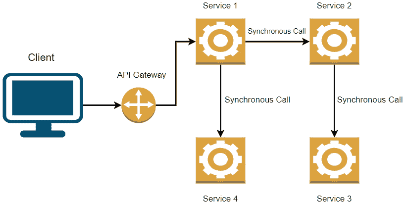

# 微服务之间的同步通信

在上一章中，我们学习了聚合器模式以及它们如何帮助我们为微服务定义存储考虑因素。现在，我们将关注服务在应用程序运行时如何相互通信。

我们已经确定微服务应该是自治的，并且应该处理所有与要完成的领域操作片段相关的操作。尽管它们在设计上是自治的，但现实情况是，某些操作在产生最终结果之前需要从多个服务中获取输入。

在那个阶段，我们需要考虑促进通信，其中一个服务将调用另一个服务，等待响应，然后根据该响应采取一些行动。

在阅读本章之后，我们将能够做到以下几点：

+   理解为什么微服务需要通信

+   理解使用 HTTP 和 gRPC 的同步通信

+   理解微服务通信的缺点

# 技术要求

本章中使用的代码参考可以在 GitHub 上的项目仓库中找到，该仓库托管在[`github.com/PacktPublishing/Microservices-Design-Patterns-in-.NET/tree/master/Ch03`](https://github.com/PacktPublishing/Microservices-Design-Patterns-in-.NET/tree/master/Ch03)。

# 同步通信的使用案例

考虑到我们迄今为止关于服务独立性和隔离性的所有讨论，你可能想知道为什么我们需要涵盖这个主题。现实情况是，每个服务覆盖了我们应用程序流程和操作的一个特定部分。一些操作有多个步骤和部分需要由不同的服务完成，因此，正确界定可能需要的服务、何时需要以及如何最佳地实现服务之间的通信是很重要的。

微服务之间的通信需要高效。鉴于我们讨论的是多个小服务相互作用以完成一项活动，我们需要确保实现也是健壮的、容错的，并且通常有效。

*图 3.1*概述了微服务之间的同步通信：



图 3.1 – 一个请求可能需要几个后续调用到其他服务

现在我们已经了解了为什么服务需要通信，让我们讨论围绕服务间通信的不同挑战。

## 微服务通信的挑战

在这一点上，我们需要接受我们正在构建一个比单体架构更为复杂和分布式的系统。在导航网络服务调用的一般请求-响应周期、适当的协议以及如何处理故障或长时间运行的过程时，这会带来它自己的挑战。一般来说，我们在**同步**和**异步**通信中有两种广泛的通信类别。除此之外，我们需要确定操作的性质并据此做出调用。如果操作需要立即响应，那么我们使用同步技术；对于不需要立即响应的长时间运行过程，我们将其异步化。

如前所述，我们需要确保我们的服务间操作具有以下特点：

+   **性能**：在开发解决方案时，性能总是我们心中所考虑的事情。个别来说，我们需要每个服务尽可能高效，但这种要求也扩展到通信场景。我们需要确保当一个服务调用另一个服务时，调用是使用最有效的方法进行的。由于我们主要使用**REST API**，**HTTP**通信将是首选方法。此外，我们可以考虑使用**gRPC**，这允许我们以更高的吞吐量和更低的延迟调用 REST API。

+   **弹性**：我们需要确保我们的服务调用是通过耐用通道完成的。记住，硬件可能会失败，或者当服务调用正在执行时，可能会出现网络中断。因此，我们需要考虑两种将我们的服务变得弹性的模式：**重试**和**断路器**：

    +   **重试模式**：瞬态故障很常见，暂时的故障可能会阻碍操作完成。然而，它们往往会自行消失，我们更愿意尝试操作几次，而不是完全失败应用程序的操作。使用这种模式，我们根据配置重试我们的服务调用几次，如果没有成功，则触发超时。对于增强数据的操作，我们需要更加小心，因为请求可能会被发送，瞬态故障可能会阻止响应被发送。这并不意味着操作实际上没有完成，重试可能会导致不希望的结果。

    +   **断路器模式**：这种模式用于限制我们尝试调用服务次数的次数。多次调用可能会因为瞬态故障解决所需的时间过长，或者服务请求的数量可能导致可用系统资源和分配出现瓶颈。因此，使用这种模式，我们可以配置它来限制我们尝试调用一个服务所花费的时间。

+   **跟踪和监控**：我们已经确定单个操作可以跨越多个服务。这给通过所有服务进行监控和跟踪活动带来了另一个挑战，从单一源头开始。此时，我们需要确保我们使用的是一款能够处理分布式日志并将它们全部聚合到中央位置以便于查阅和问题跟踪的适当工具。

既然我们已经清楚地了解了为什么我们需要进行通信以及我们可能会面临哪些挑战，我们将探讨同步通信的实际应用场景。

# 实现同步通信

同步通信意味着我们从一项服务直接调用另一项服务并等待响应。考虑到我们可以实施的所有安全措施和重试策略，我们仍然根据是否收到对调用响应来评估调用的成功。

在我们的医院管理系统背景下，前端的一个简单查询需要同步执行。如果我们需要查看系统中的所有医生以向用户展示列表，那么我们需要直接调用医生的 API 微服务，该服务从数据库中检索记录并返回数据，很可能会以 200 响应表示成功。当然，这需要尽可能快和高效地完成，因为我们希望减少用户等待结果返回的时间。

我们可以使用多种方法来发起 API 调用，其中 HTTP 是最受欢迎的。大多数语言和框架都支持 HTTP 调用，C#和.NET 也不例外。HTTP 的一些优势体现在标准化的报告方法；能够缓存响应或使用代理；标准的请求和响应结构；以及响应负载的标准。HTTP 请求的负载通常在 JSON 格式。虽然可以使用其他格式，但由于其通用、灵活且易于使用的数据表示结构，JSON 已成为 HTTP 负载的事实标准。遵循 HTTP 标准的 RESTful API 服务将以资源的形式表示可用信息。在我们的医院管理系统中，资源可以是**医生**或**病人**，这些资源可以通过使用标准的 HTTP 动词（如`GET`、`POST`、`PUT`或`DELETE`）进行交互。

现在我们已经可以可视化微服务中同步 HTTP 通信的过程，让我们来看看在.NET 中可以使用的编码技巧，以促进通信。

## 实现 HTTP 同步通信

在本节中，我们将查看一些示例代码，展示如何在.NET 应用程序中调用 API 时进行 HTTP 通信。

基于 HTTP 的 API 通信的当前标准是**REST**（**表征状态转移**）。RESTful API 公开了一组方法，允许我们通过标准的 HTTP 调用访问底层功能。通常，一个调用或*请求*包括一个 URL 或端点、一个动词或方法以及一些数据。

+   **URL 或端点**：请求的 URL 是 API 的地址以及你试图与之交互的资源。

+   `GET`（检索数据）、`POST`（创建记录）、`PUT`（更新数据）和`DELETE`（删除数据）。

+   对预订微服务的`POST`请求需要包含需要创建的预订的详细信息。

本次对话的下一重要部分以响应或 HTTP 状态码的形式出现。HTTP 定义了标准的状态码，我们使用这些状态码来解释请求的成功或失败。状态码的分类如下所示：

+   **1xx (信息性)**: 这传达了协议级别的信息。

+   **2xx (成功)**: 这表示请求已被接受，并且在处理过程中没有发生错误。

+   **3xx (重定向)**: 这表示需要采取替代路线才能完成原始请求。

+   **4xx (客户端错误)**: 这是由于请求产生的错误的一般范围，例如数据格式不良（400）或地址错误（404）。

+   **5xx (服务器错误)**: 这些错误表示服务器由于某些不可预见的原因未能完成任务。在构建我们的服务时，我们正确记录请求的格式以及确保我们的响应与实际结果保持一致是非常重要的。

在`appsettings.json`中，然后我们可以有一个常量类，其中我们定义服务的行为或资源。

我们的`appsettings.json`文件将装饰以下块，这允许我们从应用程序的任何地方访问服务地址值：

```cs
"ApiEndpoints": {
    "DoctorsApi": "DOCTORS_API_ENDPOINT",
    "PatientsApi": "PATIENTS_API_ENDPOINT",
    "DocumentsApi": "DOCUMENTS_API_ENDPOINT"
  }
```

每个服务的配置值将与相应网络服务的发布地址相关。这可能是一个用于开发的本地主机地址，一个服务器上的发布地址，或一个容器实例。我们将使用该基本地址以及我们的端点，我们可以在我们的静态类中定义端点。

为了使我们的代码保持一致性，我们可以实现一个基线代码来制作和处理 HTTP 请求和响应。通过使代码通用，我们传递预期的类类型、URL 以及可能需要的任何附加数据。此代码看起来可能如下所示：

```cs
    public class HttpRepository<T> : IHttpRepository<T> where T : class
    {
        private readonly HttpClient _client;
        public HttpRepository(HttpClient client)
        {
            _client = client;
        }
        public async Task Create(string url, T obj)
        {
            await _client.PostAsJsonAsync(url, obj);
        }
        public async Task Delete(string url, int id)
        {
            await _client.DeleteAsync($"{url}/{id}");
        }
        public async Task<T> Get(string url, int id)
        {
            return await _client.GetFromJsonAsync<T>($"{url}/
              {id}");
        }
        public async Task<T> GetDetails(string url, int id)
        {
            return await _client.GetFromJsonAsync<T>($"{url}/
              {id}/details");
        }
        public async Task<List<T>> GetAll(string url)
        {
            return await _client.
              GetFromJsonAsync<List<T>>($"{url}");
        }
        public async Task Update(string url, T obj, int id)
        {
            await _client.PutAsJsonAsync($"{url}/{id}", obj);
        }
    }
```

HttpClient 类可以被注入到任何类中，并在任何 ASP.NET Core 应用程序中即时使用。我们创建一个通用的 HTTP API 客户端工厂类，作为`HttpClient`类的包装，以便标准化所有源自应用程序或微服务的 RESTful API 调用。任何需要促进与另一个服务 RESTful 通信的微服务都可以实现此代码并相应地使用它。

现在我们对如何通过 HTTP 方法处理调用有了概念，我们可以回顾一下我们如何在服务之间设置 gRPC 通信。

## 实现 gRPC 同步通信

到目前为止，我们应该对 REST 以及与我们的微服务进行和之间通信的 HTTP 方法感到舒适。现在，我们将转向更详细地探索 gRPC。

RPC 代表**远程过程调用**，它允许我们以类似于在代码中调用方法的方式调用另一个服务。因此，在分布式系统中使用 gRPC 效果很好。通信可以更快地发生，整个框架从一开始就轻量级且性能出色。这并不是说我们应该完全用 gRPC 替换所有 REST 方法。我们现在知道我们只是选择最适合我们情况的工具并相应地使其工作，但了解 gRPC 在效率至关重要的场景中是最佳选择是很好的。

事实上，gRPC 完全由 ASP.NET Core 支持，这使得它成为我们.NET Core 基于的微服务解决方案的一个很好的候选者。鉴于其基于合同的本质，它自然地强制执行某些标准和期望，我们在创建自己的 REST API 服务类时尝试模仿这些标准和期望。它从一个名为**proto**的文件开始，这是一个合同文件。这个合同概述了服务器（或广播微服务）提供的属性和行为。

以下是一些代码片段（为了简洁起见，部分内容已被省略）：

// Protos/document-search-service.proto

```cs
syntax = "proto3";
option csharp_namespace = "HealthCare.Documents.Api.Protos";
package DocumentSearch;
service DocumentService {
  rpc GetAll (Empty) returns (DocumentList);
  rpc Get (DocumentId) returns (Document);
}
message Empty{}
message Document {
  string patientId = 1;
  string name = 2;
}
message DocumentList{
    repeated Document documents = 1; 
}
message DocumentId {
  string Id = 1;
}
```

这个`proto`类定义了一些我们希望允许文档管理服务的方法。我们定义了一个检索所有文档的方法，以及一个基于提供的 ID 值检索文档的方法。现在我们已经定义了`proto`，我们将在实际的服务类中实现我们的方法：

```cs
public class DocumentsService : DocumentService.
    DocumentServiceBase
    {
        public override Task<Document> Get(DocumentId request, 
              ServerCallContext context)
        {
            return base.Get(request, context);
        }
        public override Task<DocumentList> GetAll(Empty 
              request, ServerCallContext context)
        {
            return base.GetAll(request, context);
        }
    }
```

在每个方法中，我们可以执行完成操作所需的操作，在这个上下文中，这将是我们数据库查询和潜在的数据转换。

接下来，我们需要确保调用服务有一个合同表示，并且知道如何进行调用。以下是我们如何连接到 gRPC 服务地址、创建客户端以及请求信息的示例：

```cs
// The port number must match the port of the gRPC server.
using var channel = GrpcChannel.ForAddress("ADDRESS_OF_
    SERVICE");
var client = new DocumentService. DocumentService 
    Client(channel);
var document = await client.Get(
                  new DocumentId { Id = "DOCUMENT_ID" });
```

现在我们已经看到了一些 gRPC 的代码示例，让我们来比较一下 HTTP REST 和 gRPC 的面对面比较。

## HTTP 与 gRPC 通信对比

我们已经看到了如何通过 HTTP 或 RESTful 方法和 gRPC 协议与我们的服务进行交互的示例。现在，我们需要更清楚地了解在什么情况下我们会选择一种方法而不是另一种方法。

使用 REST 的好处包括以下内容：

+   **一致性**：REST 提供了一个统一和标准的接口，用于向订阅者公开功能。

+   **客户端-服务器独立性**：客户端和服务器应用程序之间存在明显的独立性。客户端仅与已公开或为功能所需的服务器 URI 进行交互。服务器对可能订阅的客户端一无所知。

+   **无状态**：服务器不保留有关正在进行的请求的信息。它只是接收请求并生成响应。

+   **可缓存**：API 资源可以被缓存，以便允许按请求更快地存储和检索信息。

注意，gRPC 确实有其优点，这就是为什么它被吹捧为 REST 通信的可行替代品。以下是一些优点：

+   **协议缓冲区**：协议缓冲区（或简称为 protobuf）以二进制形式序列化和反序列化数据，由于压缩率更高，因此导致数据传输速度更快，消息大小更小。

+   **HTTP2**：与 HTTP 1.1 不同，HTTP2 支持预期的请求-响应流，以及双向通信。因此，如果一个服务从多个客户端接收多个请求，它可以通过同时处理多个请求和响应来实现多路复用。

你可以看到使用任何一种方法进行网络服务创建和通信的明显和非明显的优势。一些开发者认为 gRPC 是未来，鉴于其轻量级和更高效的特点。然而，REST API 仍然更为流行，更容易实现，并且有更多的第三方工具支持代码生成和文档。大多数基于微服务架构的项目都是使用 REST API 构建的，坦白说，除非你有特定的需求导致采用 gRPC 实现，否则在这个阶段大规模采用 gRPC 可能是一种风险。

既然我们已经探讨了关于同步通信及其最常用的促进方法，让我们来看看围绕我们的微服务之间进行同步通信的一些不利因素。

# 微服务之间同步通信的不利因素

虽然它是服务间通信的首选方法，但并不总是那个时刻的最佳选择。大多数情况甚至可能证明，一开始就选择这种方法并不是最好的主意。

请记住，我们的用户将等待服务间调用的结果在用户界面上显现出来。这意味着，无论这种通信持续多长时间，我们都有用户或用户坐在界面上等待，以便继续加载并提供结果。

从架构的角度来看，我们违反了微服务设计的一个关键原则，即服务应该独立存在，对彼此知之甚少，或者最好是根本不了解。通过让两个服务进行对话，我们就会了解另一个服务及其实现细节，而这些与服务的核心功能关系甚微。此外，这也引入了服务之间不希望看到的紧密耦合程度，对于需要与其他服务通信的每个服务来说，这种耦合程度会呈指数级增加。现在，对一个服务的更改可能会对其他服务产生不希望的功能和维护影响。

最后，如果我们最终得到一个服务调用链，这将使得跟踪和捕捉调用过程中发生的任何错误变得更加困难。想象一下，我们通过服务调用实现了一种形式的*责任链*，其中一个服务调用另一个服务，然后使用结果调用另一个服务，依此类推。如果我们有三个连续的服务调用，第一个调用失败，我们将得到一个错误，并且无法确定错误发生在哪个点。另一个问题可能是，我们有一些成功的调用，第一个错误打破了链，从而浪费了链中之前发生的有用性。

总是了解我们所采用技术的优缺点是件好事。我确实同意同步通信有时是必要的，但我们还必须意识到，由于它的使用，在短期和长期内都需要额外的开发努力。在这个阶段，我们开始考虑替代方案，比如异步通信和事件驱动编程。

# 摘要

在本章中，我们探讨了相当多的事情。我们试图了解网络资源之间的同步通信是什么，最常用的协议，以及这些技术的潜在优缺点。我们详细研究了 HTTP 通信是如何发生的，以及如何使用 C#实现，并将其与 gRPC 技术进行了比较。此外，我们还比较了这两种技术，以确保我们知道何时使用哪种技术最为合适。

在下一章中，我们将探讨服务之间的异步通信，最佳实践，以及通过这种服务到服务的通信方法可以解决哪些问题。
