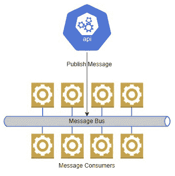

# 4

# 微服务之间的异步通信

我们刚刚回顾了微服务之间的同步通信及其优缺点。现在，我们将看看它的对立面，异步通信。

有时需要同步通信，根据正在执行的操作，这可能不可避免。它确实引入了可能的长等待时间以及某些操作中的潜在中断点。在这个时候，正确评估操作并决定是否需要来自附加服务的即时反馈以继续进行是很重要的。异步通信意味着我们向下一个服务发送数据，但不等待响应。用户会认为操作已经完成，但实际上工作是在后台进行的。

从这次回顾中可以明显看出，这种通信方法并不总是可以使用，但在我们的应用程序中高效地实现某些流程和操作是必要的。

在阅读完这一章后，我们将能够做到以下几件事情：

+   理解异步通信是什么以及我们应该何时使用它

+   实现发布-订阅通信

+   学习如何配置消息总线（**RabbitMQ**或**Azure Service Bus**）

# 技术要求

本章中使用的代码参考可以在项目仓库中找到，该仓库托管在 GitHub 上，网址为：[`github.com/PacktPublishing/Microservices-Design-Patterns-in-.NET/tree/master/Ch04`](https://github.com/PacktPublishing/Microservices-Design-Patterns-in-.NET/tree/master/Ch04)

# 使用异步通信

在继续前进之前，让我们回顾一些重要的定义和概念。

我们将在微服务之间基本上使用两种消息模式：

+   **同步通信**：我们在上一章中介绍了这种模式，其中一个服务直接调用另一个服务并等待响应

+   **异步通信**：在这种模式中，我们使用消息进行通信，而不需要等待响应

有时候，一个微服务需要另一个微服务来完成一个操作，但此时它不需要知道任务的结果。让我们考虑在我们的健康管理系统成功预订预约后发送确认电子邮件的情况。想象一下用户在用户界面上等待加载操作完成并显示确认信息。在他们点击**提交**并看到确认信息之间，预订服务需要完成以下操作：

1.  创建预约记录

1.  向预约了预约的医生发送电子邮件

1.  向预约了预约的患者发送电子邮件

1.  为系统创建日历条目

尽管我们尽了最大努力，尝试完成这些操作的预订服务将需要一些时间，可能会导致用户体验不佳。我们也可以争论发送邮件的责任不应是预订服务的固有功能。同样，日历管理也应独立存在。因此，我们可以将预订服务的任务重构如下：

1.  创建预约记录

1.  同步调用邮件服务向预约的医生发送邮件

1.  同步调用邮件服务向预约的患者发送邮件

1.  同步调用日历管理服务为系统创建日历条目

现在，我们已经重构了预订服务，使其执行的操作更少，并将非预约预订操作的复杂性转移到其他服务上。这是一个好的重构，但我们保留了，甚至可能放大了这种设计的主要缺陷。我们仍然会在进行下一个操作之前等待一个可能耗时的操作完成，这同样存在风险。在这个时候，我们可以考虑等待这些操作响应的重要性，相对于我们在数据库中输入预订记录，这是最重要的操作，相对于让用户知道预订过程的结果。

在这种情况下，我们可以利用异步通信模式来确保主要操作完成，其他操作，如发送邮件和输入日历条目，最终会发生，而不会影响我们的用户体验。

在非常基本的情况下，我们仍然可以使用 HTTP 模式实现异步通信。让我们讨论这可以有多有效。

## HTTP 异步通信

与我们迄今为止所探讨的似乎形成对比，我们实际上可以通过 HTTP 实现异步通信。如果我们评估 HTTP 通信的工作方式，我们会根据收到的 HTTP 响应形成成功或失败的评估。同步地，我们预计预订服务会调用邮件服务，并在收到 HTTP `200 OK` 成功响应代码之前尝试进行下一个命令。同步地，我们实际上会在那一刻尝试发送邮件，并根据该操作的成功或失败形成我们的响应。

异步地，我们将让邮件服务响应 HTTP `202 ACCEPTED` 状态码，这表示服务已接受任务并最终执行。这样，预订服务可以基于这个承诺继续其操作，并减少操作时间。在后台，邮件服务将在适当的时候执行该任务。

虽然这确实减轻了预订服务的一些压力，但还有其他模式，如 Pub-Sub 模式，可以实现以使此过程更顺畅。让我们回顾一下这个模式。

# 理解发布-订阅通信

发布-订阅模式已经获得了相当多的流行度和赞誉，并且在分布式系统中被广泛使用。*Pub*代表*发布者*，而*Sub*代表*订阅者*。本质上，这种模式围绕将数据（在上下文中称为消息）发布到一个中介消息系统，该系统可以描述为具有弹性和可靠性，然后让订阅应用程序监控这个中介系统。一旦检测到消息，订阅应用程序将根据需要进行处理。

## 理解消息队列

在我们探索发布-订阅方法之前，我们需要了解消息系统的基本原理以及它们是如何工作的。我们将首先查看的模型被称为*消息队列*。消息队列通常被实现为两个系统之间的桥梁，即发布者和消费者。当发布者将消息放入队列时，消费者会尽快处理消息中的信息。队列强制执行**先进先出**（**FIFO**）的交付方法，因此处理顺序总是可以得到保证。这通常在点对点通信场景中实现，因此为每个订阅应用程序分配一个特定的队列。支付系统往往大量使用这种模式，其中提交支付的顺序很重要，并且它们需要确保指令的可靠性。如果你这么想，支付系统通常具有非常低的故障率。大多数时候，当我们提交支付请求时，我们可以放心，它将在未来的某个时刻成功完成。

*图 4.1* 展示了一个发布者与几个消息队列的交互。


图 4.1 – 每个消息队列确保每个应用程序获得所需的确切数据，而不多余任何数据

这里不幸的是，一个坏消息可能会给队列中等待的其他消息带来麻烦，因此我们必须考虑这个潜在的缺点。我们还得考虑我们 armor 上的第一个漏洞。消息在读取后也会被丢弃，因此需要对未成功处理的消息做出特殊安排。

虽然消息队列确实有其用途，并为我们的系统设计带来了一定程度的可靠性，但在分布式系统中，它们可能有点低效，并引入一些我们可能不愿意接受的缺点。在这种情况下，我们将注意力转向更分布式的中介消息设置，例如消息总线。我们将在下一节讨论这一点。

## 理解消息总线系统

*消息总线*、*事件总线*或*服务总线*提供接口，其中一条发布的消息可以被多个或竞争的订阅者处理。在需要将相同的数据发布到多个应用程序或服务的情况下，这很有优势。这样，我们不需要连接到多个队列来发送消息，而只需有一个连接，完成一个*发送*操作，就不必担心其他事情。

*图 4.2*显示了一个发布者与消息的交互，该消息有多个消费者。



图 4.2 – 此消息总线有多个消费者或订阅者正在监听消息

回到我们的场景，在预约时存在多个操作问题，我们可以使用消息总线将数据分发到相关服务，并允许它们在自己的时间完成操作。而不是直接调用其他 API，我们的预约 API 将创建一个消息并将其放置在消息总线上。电子邮件和日历服务订阅了消息总线，并相应地处理消息。

在解耦和应用程序可伸缩性方面，这种模式有几个优点。这有助于使微服务之间更加独立，并减少未来添加更多服务时的限制。它还增加了我们服务整体交互的稳定性，因为消息总线充当完成操作所需数据的存储中介。如果一个消费服务不可用，消息将被保留，一旦恢复正常，挂起的消息将被处理。如果所有服务都在运行且消息正在积压，那么我们可以扩展服务的实例数量，以更快地减少消息积压。

你可能会遇到几种不同类型的消息，但我们将专注于本章中的两种。它们是**命令**和**事件**消息。命令消息本质上请求执行某些操作。因此，我们发送给日历服务的消息会指示创建一个日历条目。鉴于这些命令的性质，我们可以利用这种异步模式，并最终处理这些消息。这样，即使大量消息也会被处理。

事件消息只是宣布某些操作已经发生。由于这些消息是在操作之后生成的，它们使用的是过去时态，并且可以发送到多个微服务。在这种情况下，发送给电子邮件服务的消息可以被视为一个事件，我们的电子邮件服务将相应地传递该信息。这种类型的信息通常只包含足够的信息，让消费服务知道哪些操作已完成。

命令消息通常针对需要发布或修改数据的微服务。直到消息被消费并采取行动，预期的数据将无法在一段时间内可用。这是异步消息模型的一个主要缺点，被称为**最终一致性**。我们需要更深入地探讨这一点，并发现最佳采取的方法。

## 理解最终一致性

微服务设计中我们面临的最大挑战之一是数据管理和制定保持数据同步的策略，这有时意味着我们需要在几个微服务数据库中保留相同数据的多个副本。**最终一致性**是分布式计算系统中的一个概念，它接受数据将在一段时间内不同步。这种约束仅在分布式系统和容错应用程序中是可接受的。

在单一数据库中管理一个数据集是很容易的，就像单体应用程序一样，因为数据将始终是最新的，以便其他应用程序的部分能够访问。我们的应用程序采用单一数据库方法为我们提供了我们之前讨论过的 ACID 事务的保证，但我们仍然面临着**并发性**管理的挑战。并发性指的是我们可能在不同的时间点有相同数据的多个版本。在单一数据库应用程序中，这个挑战更容易管理，但在分布式系统中，它提出了独特的挑战。

当数据在一个微服务中发生变化时，数据将在另一个微服务中发生变化，并在一段时间内导致数据存储之间出现一些不一致。**CAP 定理**引入了这样一个概念，即我们无法保证分布式系统的三个主要属性：**一致性**、**可用性**和**分区容错性**：

+   **一致性**：这意味着对数据存储的每次读取操作都将返回数据的当前最新版本，或者如果系统无法保证这是最新版本，则会引发错误。

+   **可用性**：这意味着对于读取操作，数据总是会返回，即使这不是最新保证的版本。

+   **分区容错性**：这意味着即使存在可能导致系统在正常情况下停止的短暂错误，系统也会继续运行。想象一下，我们服务之间或/和消息系统之间存在轻微的连接问题。数据更新将被延迟，但这个原则将建议我们需要在**可用性**和**一致性**之间做出选择。

选择一致性或可用性是一个非常重要的决定。鉴于微服务通常需要始终可用，我们必须谨慎地做出决定，以及如何严格地在我们对系统一致性策略（最终一致性或强一致性）的约束上。

有一些场景中不需要强一致性，因为操作执行的所有工作要么已经完成，要么已回滚。这些更新要么丢失（如果已回滚），要么将在自己的时间内传播到其他微服务，而不会对应用程序的整体操作产生任何不利影响。如果选择这种模式，我们可以通过敏感化和让他们知道更新并不总是立即出现在不同的屏幕和模块中来衡量用户体验。

使用 Pub-Sub 模型是实现这种服务之间事件驱动通信的第一种方式，其中它们都通过消息总线进行通信。每个操作的完成，每个微服务都会向消息总线发布一个事件消息，其他服务最终会接收到并处理它。

要实现最终一致性，我们通常使用基于事件的发布-订阅模型进行通信。当数据在一个微服务中更新时，你可以向中央消息总线发布一条消息，其他拥有数据副本的微服务可以通过订阅总线接收通知。因为调用是异步的，单个微服务可以继续使用它们已有的数据副本来服务请求，而系统需要容忍这种情况，即使数据可能一开始并不一致，这意味着数据可能不会立即同步，最终将在微服务之间保持一致。当然，实现最终一致性可能比仅仅向消息总线发送消息要复杂得多。在本书的后面部分，我们将探讨如何减轻风险的方法。

到目前为止，我们已经探讨了使用事件驱动或 Pub-Sub 模式来促进异步通信的概念。所有这些概念都基于这样一个想法，即我们有一个消息系统在服务之间和操作之间持久化和分发消息。现在，我们需要探索一些选项，例如 RabbitMQ 和 Azure Service Bus。

# 配置消息总线（RabbitMQ 或 Azure Service Bus）

在对消息总线和队列进行了一番诗意般的描述之后，我们终于可以讨论两个促进基于消息的服务通信的优秀选项了。它们是 **RabbitMQ** 和 **Azure Service Bus**。

这些绝对不是唯一的选择，也不是最佳选择，但它们很受欢迎，并且可以完成任务。你可能遇到的替代方案包括 **Apache Kafka**，以其高性能和低延迟而闻名，或者 **Redis Cache**，它可以作为简单的键值缓存存储，也可以作为消息代理。最终，你使用的工具取决于你的需求以及工具为你提供的上下文。

让我们探索如何在 .NET Core 应用程序中与 RabbitMQ 集成。

## 在 ASP.NET Core Web API 中实现 RabbitMQ

RabbitMQ 是最广泛部署和使用的开源消息代理，至少在撰写本文时是这样。它支持多个操作系统，有一个现成的容器镜像，并且是一个由多种编程语言支持的可靠的中介消息系统。它还提供了一个管理界面，允许我们作为监控措施的一部分审查消息和整体系统性能。如果您计划在本地部署消息系统，那么 RabbitMQ 是一个很好的选择。

RabbitMQ 支持两种主要方式发送消息——**队列**和**交换机**。我们已经了解了队列是什么，而交换机支持消息总线模式。

让我们看看在 Windows 计算机上配置 RabbitMQ 以及发布和消费所需的支撑 C# 代码。让我们首先通过 NuGet 包含 `MassTransit.RabbitMQ` RabbitMQ 包。在我们的 `Program.cs` 文件中，我们需要确保配置 `MassTransit` 使用 RabbitMQ，并添加以下行：

```cs
builder.Services.AddMassTransit(x =>
{
    x.UsingRabbitMq();
});
```

这创建了一个可注入的服务，可以在我们代码的任何其他部分访问。我们需要将 `IPublishEndpoint` 注入到我们的代码中，这将允许我们向 RabbitMQ 交换机提交消息：

```cs
[ApiController]
[Route("api/[controller]")]
public class AppointmentsController : ControllerBase
{
    private readonly IPublishEndpoint _publishEndpoint;
    private readonly IAppointmentRepository
        _appointmentRepository;
    public AppointmentsController (IAppointmentRepository
        appointmentRepository, IPublishEndpoint
            publishEndpoint)
    {
        _publishEndpoint = publishEndpoint;
        _appointmentRepository = appointmentRepository;
    }
[HttpPost]
public async Task<IActionResult> CreateAppointment
    (AppointmentDto appointment)
{
       var appointment = new Appointment()
       {
         CustomerId = AppointmentDto.CustomerId,
         DoctorId = AppointmentDto.DoctorId,
         Date = AppointmentDto.Date
       });
       await _appointmentRepository.Create(appointment);
      var appointmentMessage = new AppointmentMessage()
       {
        Id = appointment.Id
         CustomerId = appointment.CustomerId,
         DoctorId = appointment.DoctorId,
         Date = appointment.Date
       });
       await _publishEndpoint.Publish(appointmentMessage);
       return Ok();
  }
}
```

在创建预约记录后，我们可以在交换机上共享记录的详细信息。不同的订阅者将接收到这条消息并处理他们所需的内容。消费者通常被创建为始终开启并运行的服务或后台工作服务。以下示例展示了消费者代码可能的样子：

```cs
public class AppointmentCreatedConsumer :
    IConsumer<AppointmentMessage>
{
public async Task Consume(ConsumeContext<Appointment
    Message> context)
{
   // Code to extract the message from the context and
     complete processing – like forming email, etc…
        var jsonMessage =
            JsonConvert.SerializeObject(context.Message);
        Console.WriteLine($"ApoointmentCreated message:
            {jsonMessage}");
      }
}
```

我们的消费者将能够接收任何 `AppointmentMessage` 类型的消息，并按需使用这些信息。请注意，消息交换的数据类型在生产者和消费者之间是一致的。因此，我们最好有一个位于中间的 `CommonModels` 项目，提供这些公共数据类型。

如果我们在控制台应用程序中实现此消费者，那么我们需要注册一个 `appointment-created-event`。要创建一个控制台应用程序，该程序将监听直到我们终止实例，我们需要如下代码：

```cs
var busControl = Bus.Factory.CreateUsingRabbitMq(cfg =>
{
    cfg.ReceiveEndpoint("appointment-created-event", e =>
    {
        e.Consumer<AppointmentCreatedConsumer>();
    });
});
await busControl.StartAsync(new CancellationToken());
try
{
    Console.WriteLine("Press enter to exit");
    await Task.Run(() => Console.ReadLine());
}
finally
{
    await busControl.StopAsync();
}
```

既然我们已经简要地了解了与 RabbitMQ 交换机通信所需的内容，让我们回顾一下与基于云的 Azure Service Bus 通信所需的内容。

## 在 ASP.NET Core API 中实现 Azure Service Bus

Azure Service Bus 是云基础微服务的绝佳选择。它是一个完全托管的面向企业的消息代理，支持队列以及 Pub-Sub 主题。鉴于 Microsoft Azure 强大的可用性保证，此服务支持负载均衡，如果我们选择此选项，我们可以确保消息传输的安全和协调。与 RabbitMQ 类似，Azure Service Bus 支持队列和主题。主题是交换的直接等价物，我们可以有多个服务订阅并等待新消息。让我们重用我们刚刚在 RabbitMQ 中探讨的概念，并回顾发布主题上消息所需的代码，看看消费者会是什么样子。我们将专注于本节中的代码，并假设您已经创建了以下内容：

+   一个 Azure Service Bus 资源

+   一个 Azure Service Bus 主题

+   一个订阅 Azure Service Bus 主题的 Azure Service Bus 订阅

这些元素都必须存在，我们将通过 Azure 门户检索 Azure Service Bus 的连接字符串。要开始编写代码，请将 `Azure.Messaging.ServiceBus` NuGet 包添加到生产者和消费者项目中。

在我们的发布者中，我们可以创建一个服务包装器，它可以注入到将发布消息的代码部分。我们将有类似以下的内容：

```cs
public interface IMessagePublisher {
    Task PublisherAsync<T> (T data);
}
public class MessagePublisher: IMessagePublisher {
    public async Task PublishMessage<T> (T data, string
       topicName) {
         await using var client = new ServiceBusClient
             (configuration["AzureServiceBusConnection"]);
        ServiceBusSender sender = client.CreateSender
            (topicName);
        var jsonMessage =
            JsonConvert.SerializeObject(data);
        ServiceBusMessage finalMessage = new
            ServiceBusMessage(Encoding.UTF8.GetBytes
                (jsonMessage))
        {
            CorrelationId = Guid.NewGuid().ToString()
        };
        await sender.SendMessageAsync(finalMessage);
        await client.DisposeAsync();
}
```

在此代码中，我们声明了一个接口，`IMessagePublisher.cs`，并通过 `MessagePublisher.cs` 实现它。当收到消息时，我们创建 `ServiceBusMessage` 并将其提交到指定的主题。

我们需要确保我们注册此服务，以便它可以注入到我们代码的其他部分：

```cs
services.AddScoped<IMessagePublisher, MessagePublisher>();
```

现在，让我们看看同一个控制器，以及它是如何将消息发布到 Azure Service Bus 而不是 RabbitMQ 的：

```cs
[ApiController]
[Route("api/[controller]")]
public class AppointmentsController : ControllerBase
{
    private readonly IMessageBus _messageBus;
    private readonly IAppointmentRepository
        _appointmentRepository;
    public AppointmentsController (IAppointmentRepository
        appointmentRepository, IMessageBus messageBus)
    {
      _appointmentRepository = appointmentRepository;
      _messageBus = messageBus;
    }
[HttpPost]
public async Task<IActionResult> CreateAppointment
    (AppointmentDto appointment)
{
       var appointment = new Appointment()
       {
         CustomerId = AppointmentDto.CustomerId,
         DoctorId = AppointmentDto.DoctorId,
         Date = AppointmentDto.Date
       });
       await _appointmentRepository.Create(appointment);
      var appointmentMessage = new AppointmentMessage()
       {
        Id = appointment.Id
         CustomerId = appointment.CustomerId,
         DoctorId = appointment.DoctorId,
         Date = appointment.Date
       });
       await _messageBus.PublishMessage(appointmentMessage,
           "appointments");
       return Ok();
  }
}
```

现在我们知道了如何设置发布者代码，让我们回顾消费者所需的元素。此代码可用于后台工作者或 Windows 服务以持续监视新消息：

```cs
public interface IAzureServiceBusConsumer
    {
        Task Start();
        Task Stop();
    }
```

我们从定义一个接口开始，该接口概述了 `Start` 和 `Stop` 方法。这个接口将由一个消费者服务类实现，该类将连接到 Azure Service Bus 并开始执行监听 Service Bus 新消息并相应消费它们的代码：

```cs
    public class AzureServiceBusConsumer :
        IAzureServiceBusConsumer
    {
        private readonly ServiceBusProcessor
            appointmentProcessor;
        private readonly string appointmentSubscription;
        private readonly IConfiguration _configuration;
        public AzureServiceBusConsumer(IConfiguration
            configuration)
        {
           _configuration = configuration;
            string appointmentSubscription =
              _configuration.GetValue<string>
                ("AppointmentProcessSubscription")
            var client = new ServiceBusClient
                (serviceBusConnectionString);
            appointmentProcessor = client.CreateProcessor
                ("appointments", appointmentSubscription);
        }
        public async Task Start()
        {
            appointmentProcessor.ProcessMessageAsync +=
                ProcessAppointment;
            appointmentProcessor.ProcessErrorAsync +=
                ErrorHandler;
            await appointmentProcessor
                .StartProcessingAsync();
        }
        public async Task Stop()
        {
            await appointmentProcessor
                .StopProcessingAsync();
            await appointmentProcessor.DisposeAsync();
        }
        Task ErrorHandler(ProcessErrorEventArgs args)
        {
            Console.WriteLine(args.Exception.ToString());
            return Task.CompletedTask;
        }
        private async Task ProcessAppointment
            (ProcessMessageEventArgs args)
        {
            // Code to extract the message from the args,
            parse to a concrete type, and complete 
            processing – like
forming email, etc…
           await args.CompleteMessageAsync(args.Message);
        }
    }
```

从我们与消息总线系统交互的两个示例中，我们可以看到它们在概念上非常相似。对于 .NET Core 库支持的任何其他消息总线系统，都会采用类似的考虑和技巧。

当然，当我们实现这种基于消息的通信时，肯定会有权衡。我们现在有一个额外的系统，以及潜在的故障点，因此我们必须考虑额外的基础设施需求。我们还看到，所需的代码增加了我们的代码库的复杂性。让我们深入了解这种方法的一些缺点。

# 微服务之间异步通信的缺点

就像任何系统或编程方法一样，总有优势和劣势伴随着它。我们已经探讨了为什么对于可能运行时间较长的操作来说，拥有异步消息模式是一个好主意。我们需要确保最终用户不会花费太多时间等待整个操作完成。消息系统是缩短完成操作感知时间的一种极好方式，并允许服务尽可能高效地独立运行。它们还帮助解耦系统，允许更大的可扩展性，并在数据传输和处理方面为系统引入一定程度的稳定性。

现在，当我们分析这种模式可能引入的实际复杂程度时，缺点就会逐渐显现。在设计我们的服务如何与其他服务交互、需要共享哪些数据以及操作完成后需要发布哪些事件时，需要考虑更多的协调。在同步模型中，我们将更有信心确保后续任务能够完成，因为我们不能在没有下一个服务链中服务有利的响应的情况下前进。在异步模型中使用队列和总线时，我们必须依赖消费服务（或服务）发布关于完成状态的事件。我们还需要确保没有重复的调用，在某些情况下，需要共同努力确保消息按特定顺序处理。

这又引出了另一个缺点，即数据一致性。记住，消息总线最初的响应表明操作是成功的，但这仅仅意味着数据已成功提交到总线。在此之后，我们的消费服务仍然需要继续并完成它们的操作。如果其中一项或多项服务未能处理并可能将数据提交到数据存储，那么我们的数据将出现不一致。这是我们需要注意的事情，因为它可能导致有害的副作用和用户流失。

# 摘要

在本章中，我们探索了一些内容。我们详细比较了通过同步 API 通信与异步通信处理流程的方式。然后，我们扩展了我们关于如何利用消息系统来支持我们服务的异步通信模型的一般知识。在这个过程中，我们讨论了在操作之间可能面临的数据一致性挑战，以及我们如何衡量这个不可避免因素的可接受指标。在后面的部分，我们回顾了两种流行的消息系统，并讨论了在这个范式下我们必须应对的一些明显缺点。

在下一章中，我们将探讨**命令-查询责任分离**（**CQRS**）模式以及它如何帮助我们编写更干净的服务代码。
