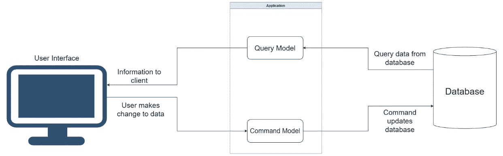
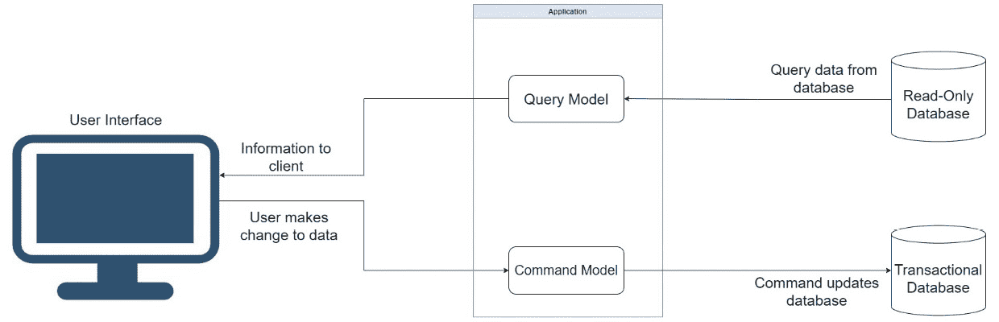
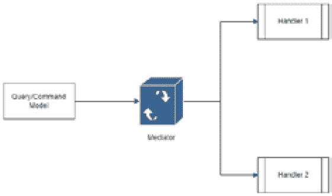

# 5

# 使用 CQRS 模式进行工作

我们现在知道，在规划阶段，微服务需要一定的前瞻性，我们需要确保我们采用最佳的模式和技术来支持我们的决策。在本章中，我们将探讨另一种在帮助我们编写干净且可维护的代码方面受到广泛赞誉的模式。这就是 **命令查询责任分离或分离**（**CQRS**）模式，它是 **命令查询分离**（**CQS**）模式的扩展。

这种模式使我们能够干净地分离我们的查询操作和命令操作。本质上，查询请求数据，而命令应该在操作结束时以某种方式修改数据。

作为程序员，我们倾向于在我们的应用程序中使用 **创建、读取、更新和删除**（**CRUD**）。考虑到每个应用程序的核心功能都是支持 CRUD 操作，这是可以理解的。但随着应用程序变得更加复杂，我们需要更多地考虑围绕这些操作的商务逻辑，相对于我们正在解决的问题域。

到那时，我们开始使用诸如 *行为* 和 *场景* 这样的词汇。我们开始考虑以某种方式构建我们的代码，使我们能够隔离行为，并轻松地确定这种行为是否仅仅是请求数据，还是会在操作结束时通过某种方式增强数据。

在阅读本章后，你将实现以下目标：

+   理解 CQRS 模式的优势以及为什么它被用于微服务开发

+   了解如何在 CQRS 模式中实现命令

+   了解如何在 CQRS 模式中实现查询

# 技术要求

本章中使用的代码参考可以在项目仓库中找到，该仓库托管在 GitHub 上，网址为：[`github.com/PacktPublishing/Microservices-Design-Patterns-in-.NET/tree/master/Ch05`](https://github.com/PacktPublishing/Microservices-Design-Patterns-in-.NET/tree/master/Ch05)。

# 为什么要在微服务开发中使用 CQRS？

**CQS** 被引入作为一种模式，旨在帮助开发者将执行读取操作的代码与执行写入操作的代码分离。它的不足之处在于，它没有考虑到为每个操作建立特定的模型。CQRS 在此基础上发展，并引入了为要执行的操作定制特定模型的概念。

*图 5.1* 展示了典型的 CQRS 架构：



图 5.1 – 应用程序将与读取操作和写入操作（称为命令）的模型进行交互

如果你更仔细地观察，可以认为 CQS 只考虑了一个数据存储，这意味着我们正在对同一个数据库进行读写操作。CQRS 会建议你拥有单独的数据存储，可能有一个标准的关系数据库用于你的写入操作，并为另一个存储（如文档数据库或数据仓库）执行读取操作。实现多个数据存储并不总是可行的，也不是必须的。

自从 CQRS 在开发中引入以来，它获得了许多赞誉，并被誉为微服务设计中的一个非常重要的支柱。事实上，它也可以用于标准应用程序，因此它并不仅限于微服务。它还增加了开发工作的新层次复杂性，因为它引入了需要编写更多特定类和代码的需求，这可能导致项目膨胀。

人们常说，“……当我们有一把锤子时，一切看起来都像钉子……”这在当我们听到一个新的模式并觉得需要到处使用它时仍然适用。我建议在使用此模式之前要谨慎并仔细考虑，并确保其在应用程序中的价值是合理的。

对于更大的应用程序，建议使用 CQRS 来帮助我们结构化代码，并更干净地处理可能复杂的业务逻辑和移动部件。尽管它很复杂，但它确实有好处。让我们回顾一下在我们的应用程序中实现 CQRS 模式的好处。

## CQRS 模式的优点

CQRS 是关于将单个模型拆分为两个变体，一个用于读取，一个用于写入。然而，最终目标是一个更大的轮辐。这种方法的第一个好处是可扩展性。

评估你正在构建的系统的读写工作量是很重要的。考虑到一次读取可能需要从几个表中获取大量数据，并且每个请求可能都有其自己的数据外观要求，读取操作可能比写入操作更密集。一种观点鼓励我们采用一个专门用于和优化读取操作的数据存储。这使我们能够将读取操作与写入操作分开进行扩展。

一个专门的读取存储示例可以是*数据仓库*，其中数据通过某种形式的数据转换管道不断被转换，从可能是规范化*关系数据库*的写入数据存储。另一种常用的技术是 NoSQL 数据库，如**MongoDB**或**Cosmos DB**。数据仓库或 NoSQL 数据库提供的数据结构代表了从关系数据存储中提取的未规范化、只读版本的数据。

*图 5.2*展示了具有两个数据库的 CQRS 架构：



图 5.2 – 查询模型表示从事务数据库中优化的读取操作的数据表示

第二个好处是性能。尽管它似乎与可扩展性密不可分，但我们考虑的因素有所不同。使用独立的数据存储并不总是可行的选择，因此我们可以采用其他技术来优化我们的操作，而这些技术在不使用统一数据模型的情况下是不可能的。例如，我们可以应用缓存来查询执行读取操作。我们还可以使用针对我们请求的特定数据库功能和微调的原始 SQL 语句，而不是在命令方面使用**对象关系映射**（**ORM**）代码。

我们可以从这个模式中获得另一个好处，那就是简单性。考虑到我们在本章前面的部分提到了复杂性，这似乎有些矛盾，但这取决于你用来评估你将长期获得的回报的视角。命令和查询有不同的需求，使用一个数据模型来满足这两组需求是不合理的。CQRS 迫使我们考虑为每个查询或命令创建特定的数据模型，这导致代码更容易维护。每个新的数据模型都负责特定的操作，对其进行的修改将对程序的其他方面影响很小或没有影响。

我们在这里看到，在我们的项目中使用 CQRS 有一些好处。但是，有利必有弊。让我们回顾一下采用这种设计模式的一些缺点。

## CQRS 模式的缺点

我们考虑的每一个模式都必须彻底调查它所增加的价值和潜在的缺点。我们总是想确保好处大于坏处，并且我们不会后悔这些重大的设计决策。CQRS 对于将执行简单的 CRUD 操作的应用程序来说并不理想。它是以行为或场景驱动的，正如我们之前所提到的，所以在你跳入之前，一定要确保你能证明用例的合理性。这个模式会导致代码感知上的重复，因为它促进了**关注点分离**（**SoC**）的概念，并鼓励命令和查询有专门的模式。

说到个人观点，我见过一些开发负责人一开始充满热情，却在实际上并不需要 CQRS 的项目中实施了它。结果，项目变得过于复杂，让所有的新开发人员完全搞不清楚东西在哪里。

正如我们所见，当我们使用 CQRS 时，存在多个数据存储区域的情况。这可能是它的最完整实现。一旦我们引入多个数据存储，我们就引入了数据一致性问题，并需要实现*事件溯源*技术，并包括**服务级别协议**（**SLAs**）来让我们的用户了解我们读写操作之间可能存在的差距。当我们拥有多个数据库时，我们也必须考虑额外的成本，包括基础设施和一般操作。随着数据库的增加，潜在的故障点也增加，我们需要额外的监控和故障安全技术来确保系统尽可能平稳运行，即使在出现故障的情况下。

当 CQRS 被合理应用时，它可以给项目带来价值。当你的项目拥有复杂的业务逻辑，或者有明确的需求来分离数据存储和读写操作时，CQRS 将作为一个合适的架构选择大放异彩。

这种模式并不特定于任何编程语言，.NET 对这种模式有很好的支持。现在让我们通过一些工具和库的帮助，回顾使用 Mediator 模式实现 CQRS。

## 在.NET 中使用 CQRS 的 Mediator 模式

在我们深入探讨如何实现 CQRS 之前，我们应该讨论一个支持模式，称为*Mediator*模式。Mediator 模式涉及我们定义一个对象，该对象体现了对象之间的交互方式。因此，我们可以避免两个或多个对象之间直接依赖，而是使用一个中介来协调依赖关系，并将请求路由到适当的*处理程序*。处理程序将根据模型关联的场景或任务定义操作的所有细节。

*图 5.3*展示了 Mediator 模式的工作方式：



图 5.3 – 查询/命令模型在中介引擎中注册，然后选择适当的处理程序

相对于为每个任务定义的代码实现，Mediator 模式在 CQRS 的实现中变得有用，因为我们需要促进代码之间的松耦合。它允许我们保持*松耦合*，并促进更高的可测试性和可扩展性。

在 .NET Core 中，我们有一个名为 `MediatR` 的优秀第三方包，它帮助我们相对容易地实现此模式。`MediatR` 扮演了 *进程内* 中介者的角色，它管理类在同一个进程中的交互方式。这里的局限性是，如果我们想要在不同系统中分离命令和查询，它可能不是最好的包。尽管有这个缺点，但它帮助我们相对容易、高效和可靠地编写基于 CQRS 的系统。我们可以开发强类型代码，这将确保我们不会不匹配模型和处理程序，我们甚至可以构建管道来管理请求在整个周期中的整个行为。

在 .NET Core 应用程序中，我们可以按照以下步骤设置 `MediatR`：

1.  安装 `MediatR.Extensions.Microsoft.DependencyInjection` NuGet 包

1.  使用以下行修改我们的 `Program.cs` 文件：`builder.Services.AddMediatR(typeof(Program));`

完成此操作后，我们可以继续将我们的 `IMediator` 服务注入到我们的控制器或端点以供进一步使用。我们还需要实现两个文件，这两个文件将直接相互关联，即命令/查询模型和相应的处理器。

既然我们已经探讨了使用中介者模式设置 CQRS 实现的基础，让我们回顾一下实现命令所需的步骤。

# 实现一个命令

如我们所记，命令预期将执行将增强数据存储中数据的操作，这通常称为写操作。鉴于我们正在使用中介者模式来管理我们执行这些操作的方式，我们需要一个命令模型和一个处理器。

## 创建一个命令模型

我们的模式相对简单易实现。它通常是一个标准的类或记录，但在 `MediatR` 的帮助下，我们将实现一个名为 `IRequest` 的新类型。`IRequest` 将将这个模型类与一个相关的处理器关联起来，我们将在稍后探讨这一点。

在我们系统的预约示例中，我们可以相对容易地实现一个 `CreateAppointmentCommand.cs` 文件，如下所示：

```cs
public record CreateAppointmentCommand (int
  AppointmentTypeId, Guid DoctorId, Guid PatientId, Guid
    RoomId, DateTime Start, DateTime End, string Title):
      IRequest<string>;
```

在这个例子中，我们使用了一个 `record` 类型，但如果你觉得更舒服，它也可以是一个类定义。请注意，我们继承自 `IRequest<string>`，这向 `MediatR` 概述了以下内容：

+   这个命令应该与一个具有相应返回类型的处理器相关联。

+   与此命令相关联的处理程序预期将返回一个字符串值。这将是一个预约 `Id` 值。

命令并不总是需要返回一个类型。如果你不期望返回类型，你可以简单地从 `IRequest` 继承。

现在我们已经了解了命令模型需要看起来是什么样子，让我们实现相应的处理器。

## 创建一个命令处理器

我们的处理器是执行任务逻辑通常所在的地方。在某些实现中，在没有丰富数据模型的情况下，你可以执行所有必要的验证和附加任务，以确保任务得到妥善处理。这样，我们可以更好地隔离在发送特定命令以执行时预期的业务逻辑。

我们用于创建预约的处理器将被命名为 `CreateAppointmentHandler.cs`，可以像这样实现：

```cs
public class CreateAppointmentHandler :
  IRequestHandler<CreateAppointmentCommand, string>
{
    private readonly IAppointmentRepository _repo;
    public CreateAppointmentHandler(IAppointmentRepository
      repo /* Any Other Dependencies */)
{
        _repo = repo
        /* Any Other Dependencies */
      };
    public async Task<string> Handle
      (CreateAppointmentCommand request, CancellationToken
         cancellationToken)
    {
        // Handle Pre-checks and Validations Here
        var newAppointment = new Appointment
        (
            Guid.NewGuid(),
            request.AppointmentTypeId,
            request.DoctorId,
            request.PatientId,
            request.RoomId,
            request.Start,
            request.End,
            request.Title
        );
        await _repo.Add(newAppointment);
     //Perform post creation hand-off to services bus.
        return newAppointment.Id.ToString();
    }
}
```

在这里有几个需要注意的事项：

+   处理器继承自 `IRequestHandler<>`。在类型括号中，我们概述了处理器将要实现的特定 *命令模型类型* 和 *期望的返回类型*。

+   处理器的实现方式与其他类相同，并且可以根据需要注入依赖项。

+   完成我们的操作后，我们必须返回一个与命令模型中 `IRequest<>` 概述的数据类型相匹配的值。

+   `IRequestHandler` 实现了一个名为 `Handle` 的方法，该方法默认为附加到命令模型的 `IRequest<>` 的概述返回类型。它将自动生成一个名为 `request` 的参数，该参数的数据类型为命令模型的数据类型。

如果我们不要求返回值，我们就必须返回 `Unit.Value`。这是 `MediatR` 的默认 `void` 表示形式。

现在我们已经为实现命令模型及其相应处理器编写了一些样板代码，让我们看看如何从控制器中实际调用处理器。

## 调用一个命令

我们已经定义了用于预约操作的控制器，并且它需要具有我们的 `IMediator` 服务的依赖项以开始编排我们的调用。我们需要像这样注入我们的依赖项：

```cs
private readonly IMediator _mediator;
  public AppointmentsController(IMediator mediator) =>
    _mediator = mediator;
```

一旦我们有了这个依赖项，我们就可以开始进行调用。这个解决方案之所以如此干净，是因为我们不需要担心任何业务逻辑和特定处理器的具体实现。我们只需要创建一个具有适当数据的命令模型对象，然后使用我们的中介发送它，它将调用适当的处理器。我们的 `POST` 方法的代码如下所示：

```cs
[HttpPost]
public async Task<ActionResult> Post([FromBody]
  CreateAppointmentCommand createAppointmentCommand)
{
   await _mediator.Send(createAppointmentCommand);
   return StatusCode(201);
}
```

实现这一部分有几种方法。一些替代方案包括以下内容：

+   使用 *模型* 或 **数据传输对象**（或简称为 **DTO**）来接受来自 API 端点的数据。这意味着我们将在发送之前将数据点从传入的模型对象传输到我们的命令模型，如下所示：

    ```cs
    [HttpPost]
    ```

    ```cs
    public async Task<ActionResult> Post([FromBody]
    ```

    ```cs
      AppointmentDto appointment)
    ```

    ```cs
    {
    ```

    ```cs
        var createAppointmentCommand = new
    ```

    ```cs
          CreateAppointmentCommand { /* Assign all values
    ```

    ```cs
            here*/}
    ```

    ```cs
       await _mediator.Send(createAppointmentCommand);
    ```

    ```cs
       return StatusCode(201);
    ```

    ```cs
    }
    ```

+   我们不是在命令模型中定义所有数据属性，而是使用 DTO 作为命令模型的一个属性，这样我们就可以将它与中介请求一起传递，如下所示：

    ```cs
    // New Command Model with DTO property
    ```

    ```cs
      public record CreateAppointmentCommand
    ```

    ```cs
        (AppointmentDto Appointment) : IRequest<string>;
    ```

    ```cs
    // New Post method
    ```

    ```cs
    [HttpPost]
    ```

    ```cs
    public async Task<ActionResult> Post([FromBody]
    ```

    ```cs
      AppointmentDto appointment)
    ```

    ```cs
    {
    ```

    ```cs
        var createAppointmentCommand = new
    ```

    ```cs
          CreateAppointmentCommand { Appointment =
    ```

    ```cs
            appointment; }
    ```

    ```cs
       await _mediator.Send(createAppointmentCommand);
    ```

    ```cs
       return StatusCode(201);
    ```

    ```cs
    }
    ```

你可以观察到编写代码的每种方法都归结为同一件事，那就是在我们将模型发送到我们的中介之前，我们需要将适当的模型类型与适当的值组合起来。中介已经确定了哪个模型与哪个处理程序相匹配，并将继续执行其操作。

命令和查询通常遵循相同的实现。在下一节中，我们将探讨使用中介和 CQRS 模式实现查询模型/处理程序对。

# 实现查询

查询预计将搜索数据并返回结果。这种搜索可能很复杂，也可能足够简单。然而，事实是我们将这种模式实现为一个简单的方法，将查询逻辑与请求的发起者（如控制器）和命令逻辑分开。这种分离增加了团队维护应用程序任一方面的能力，而不会相互干扰，换句话说。我们将类似地使用中介模式来管理我们执行这些操作的方式，并且我们需要一个查询模型和一个处理程序。

## 创建查询模型

我们的模式足够简单，我们可以让它为空，或者包含在处理程序中将要执行的过程中的属性。我们继承了`IRequest<>`，它定义了返回类型。我敢说，考虑到这是一个查询，返回类型是必要的。

让我们看看两个查询的例子，一个将检索数据库中的所有预约，另一个将仅通过 ID 检索。我们可以像这样定义`GetAppointmentsQuery.cs`和`GetAppointmentByIdQuery.cs`：

```cs
public record GetAppointmentsQuery(): Irequest
  <List<Appointment>>;
public record GetAppointmentByIdQuery(string Id):
  IRequest<AppointmentDetailsDto>;
```

只要注意到，任何查询模型都是特定于它需要表示的内容。`GetAppointmentsQuery`模型不需要任何属性，因为它只是将被用作处理程序创建关联的轮廓。`GetAppointmentByIdQuery`有一个`Id`属性，这是显而易见的原因，因为 ID 将需要处理程序正确执行当前任务。返回类型的差异也是一个需要注意的关键点，因为它为处理程序可以返回的内容定下了基调。

我们需要确保我们为预期的数据类型专门构建我们的查询模型，以便从匹配的处理程序中检索数据。现在，让我们看看如何实现这些处理程序。

## 创建查询处理程序

我们的查询处理程序将执行预期的查询，并按照`IRequest<>`定义的方式返回数据。如前所述，理想的使用方式将看到我们使用一个单独的数据存储，其中被查询的数据已经针对返回进行了优化。这将使我们的查询操作高效，并减少数据转换和清理的需求。

在我们的例子中，我们并不那么幸运地拥有一个独立的数据存储，所以我们将会使用同一个仓库来查询事务数据存储。我们用于获取所有预约的查询处理器将被命名为 `GetAppointmentsHandler.cs`，并且可以像这样实现：

```cs
public class GetAppointmentsHandler : IrequestHandler
  <GetAppointmentsQuery, List<Appointment>>
    {
        private readonly IAppointmentRepository _repo;
        public GetAppointmentsHandler
          (IAppointmentRepository repo) => _repo = repo;
        public async Task<List<Appointment>>
           Handle(GetAppointmentsQuery request,
             CancellationToken cancellationToken)
        {
            return await _repo.GetAll();
        }
    }
```

这个处理器的定义很简单，因为我们只是检索一个预约列表。当我们需要通过 ID 获取一个预约时，这意味着我们需要预约的详细信息。这将需要一个更复杂的查询，可能涉及连接，或者更好的是，需要同步 API 调用来获取相关记录的详细信息。这正是数据库设计的优点或缺点会发挥作用的地方。如果我们按照我们的 `AppointmentDetailsDto` 返回，如下所示：

```cs
public class GetAppointmentByIdHandler :
  IRequestHandler<GetAppointmentByIdQuery,
    AppointmentDetailsDto>
    {
        private readonly IAppointmentRepository _repo;
        public GetAppointmentByIdHandler
          (IAppointmentRepository repo)
        {
            _repo = repo;
        }
        public async Task<AppointmentDetailsDto>
          Handle(GetAppointmentByIdQuery request,
            CancellationToken cancellationToken)
        {
            // Carry out all query operations and convert
            the result to the expected return type
            return new AppointmentDetailsDto{ /* Fill model
              with appropriate values */ };
        }
    }
```

在我们收集了特定场景所需的数据之后，我们构建我们的 `return` 对象并将其发送回原始发送者。

现在，让我们看看控制器操作看起来像什么，它们试图完成查询。

## 调用一个查询

使用相同的控制器，我们可以假设 `IMediator` 依赖项已经被注入，并执行以下代码：

```cs
[HttpGet]
public async Task<ActionResult<Appointment>> Get()
{
    var appointments = await _mediator.Send(new
      GetAppointmentsQuery());
            return Ok(appointments);
}
[HttpGet("{id}")]
public async Task<ActionResult<AppointmentDetailsDto>>
    Get(string id)
{
  var appointment = await _mediator.Send(new
    GetAppointmentByIdQuery(id));
            return Ok(appointment);
}
```

我们的操作看起来很相似。每个操作都定义了它从请求中需要的参数。然后它们调用 `mediator` 对象和期望的查询模型类型的新对象。中介者将协调调用并将请求路由到适当的处理器。

# 摘要

从这种开发方法中可以获益的几个好处。我们已经概述了项目膨胀是其中的一部分，但可以强制执行和保证的一致性和结构水平可能值得额外的努力。

在本章中，我们探讨了 CQRS 模式以及我们如何在微服务应用程序中应用它。我们花时间评估我们需要解决的问题，为为什么我们添加这一新的复杂层次提供实际背景。然后我们查看我们如何重构我们的代码以方便我们的处理器和请求/命令对象。我们还查看了一些关于我们的数据存储的读写操作我们可以做出的设计决策。

在下一章中，我们将探讨与我们的 CQRS 模式相结合的事件源模式，这将帮助我们保持整个应用程序中的数据相关性。
