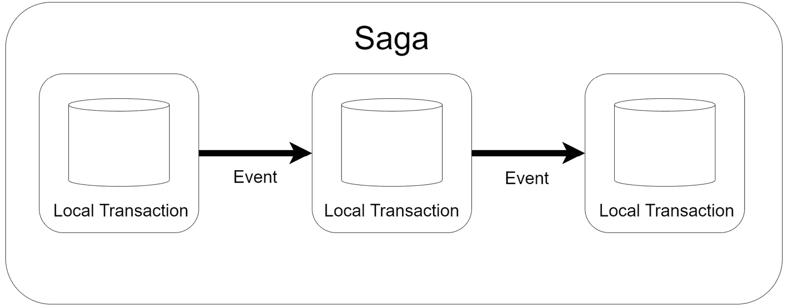
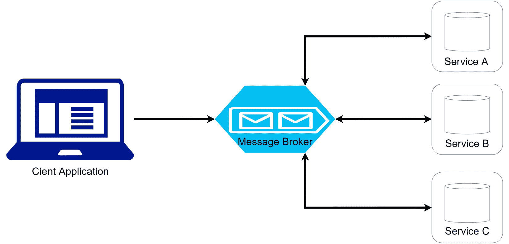
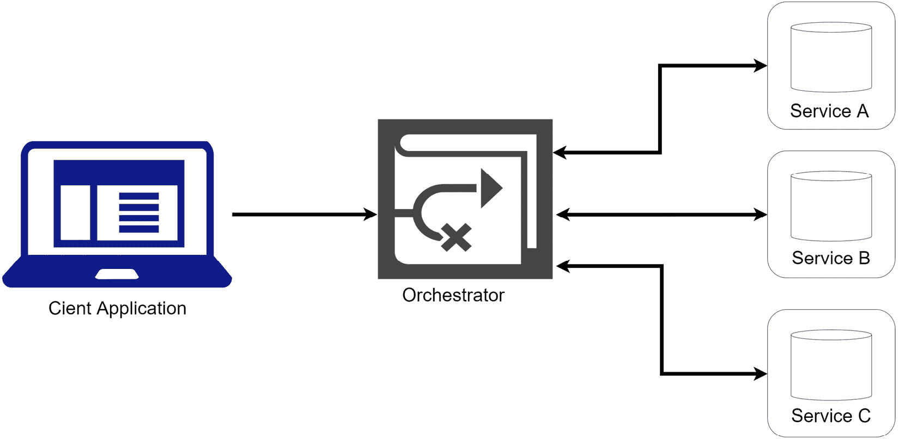

# 使用 Saga 模式在微服务之间实现事务

我们刚刚讨论了数据库开发以及在使用微服务架构开发应用程序时需要考虑的因素。我们讨论了为每个微服务创建单独数据库的优缺点。这样做确实允许每个微服务拥有更多的自主权，使我们能够选择最适合该服务的最佳技术。虽然这是一种首选且推荐的技术，但在确保数据存储之间的数据一致性方面确实存在显著的缺点。

通常，我们通过事务来确保一致性。正如本书前面所讨论的，事务确保所有数据都提交或都不提交。这样，我们可以确保操作不会部分写入数据，而我们看到的内容确实反映了正在跟踪的数据的状态。

在具有不同数据库的微服务之间强制执行事务是困难的，但这就是我们使用 saga 模式的时候。这种模式帮助我们编排数据库操作并确保我们的操作是一致的。

阅读本章后，我们将了解如何进行以下操作：

+   使用 Saga 模式在微服务之间实现事务

+   在微服务之间编排数据操作

+   实现编排

# 探索 Saga 模式

我们之前探讨了“每个服务一个数据库”的模式，这鼓励我们为每个服务拥有单独的数据存储。有了这个模式，每个微服务将内部处理自己的数据库和事务。这提出了一个新的挑战，即需要多个服务参与并可能修改其数据的操作存在部分失败的风险，最终可能导致我们的应用程序中的数据不一致。这是这种模式选择的主要缺点，因为我们无法保证我们的数据库始终同步。

这就是我们要使用 saga 模式的地方。你可以把 saga 看作是一系列预定义的步骤，概述了服务应该调用的顺序。saga 模式还将负责对所有服务进行监督，可以说是在观察和监听，任何服务在执行过程中的任何失败迹象。

如果服务报告了故障，saga 还将为每个服务包含一个回滚措施。因此，它将按照特定的顺序进行，提示每个在故障之前可能已经成功的服务撤销其所做的更改。这很有用，因为我们的服务是解耦的，理想情况下不会直接相互通信。

Saga 是一种跨越多个服务的机制，可以在各种数据存储中实现事务。我们有分布式事务选项，如 *两阶段提交*，这可能要求所有数据存储都提交或回滚。这听起来很完美，但一些 NoSQL 数据库和消息代理与这种模型并不完全兼容。

假设一位新患者在我们医疗中心进行了注册。这个过程将要求患者提供他们的信息和一些基本文件，并预约初步的会诊，这需要支付费用。这些操作需要四个不同的微服务参与，因此将影响四个不同的数据存储。

我们可以将跨越多个服务的操作称为 *叙事式*。再次强调，叙事式是一系列本地事务。每个事务都会更新数据目标数据库，并产生一个消息或事件，触发叙事式下一个事务操作的执行。如果链中的某个本地事务失败，叙事式将在受先前事务影响的所有数据库中执行回滚操作。

叙事式通常实现三种类型的事务：

+   **可补偿的**：这些事务可以通过具有相反效果的其他事务进行撤销。

+   **可重试的**：这些事务保证成功，并在枢纽事务之后实现。

+   **枢纽**：正如其名所示，这些事务的成功或失败对叙事式的继续至关重要。如果事务提交，则叙事式将继续运行，直到完成。这些事务可以放置为最终的补偿事务或叙事式的第一个可重试事务。它们也可以既不是补偿事务也不是可重试事务。

*图 8.1* 展示了叙事式模式：

图 8.1 – 每个本地事务都会向叙事式中的下一个服务发送消息，直到叙事式完成

正如我们所知，每个模式都有其优点和缺点，因此考虑所有角度非常重要，以便我们能够充分规划方法。让我们回顾一些已知问题和在实现此模式时需要考虑的事项。

## 问题与考虑事项

由于在本章之前，我们已将微服务架构中在数据存储中实现 ACID 事务的可能性排除在外，我们可以想象这种模式并不容易实现。它需要绝对的协调和对我们应用程序所有动态部分的良好理解。

这种模式也难以调试。由于我们正在实现跨自主服务的单一功能，我们现在引入了一个新的接触点和潜在的故障点，必须特别努力跟踪和追踪故障可能发生的位置。随着参与叙事式服务的步骤增加，这种复杂性也在增加。

我们需要确保我们的传奇可以处理架构中的短暂故障。这些是在操作过程中发生的可能不是永久性的错误。因此，包括重试逻辑以确保单个尝试中的失败不会过早地结束传奇是明智的。这样做的同时，我们还需要确保我们的数据与每次重试保持一致。

这种模式当然不是没有挑战，它将显著增加我们应用程序代码的复杂性。它并非万无一失，因为它会有其谬误，但它确实会帮助我们确保我们的数据在松散耦合的服务中更加一致，通过回滚或补偿操作失败来实现。

传奇通常使用*编排*或*舞蹈*来协调。这两种方法都有其优缺点。让我们从探索舞蹈开始。

# 理解和实现舞蹈

**舞蹈**是一种协调传奇的方法，其中参与服务使用消息或事件相互通知完成或失败。在这个模型中，事件代理位于服务之间，但不控制消息流或传奇流。这意味着没有中央参考点或控制点，每个服务只是等待一个作为其操作确认触发器的消息。

*图 8.2*显示了舞蹈流程：

图 8.2 – 应用请求向队列发送消息，通知传奇中的第一个服务开始，消息在所有参与的服务之间流动

从舞蹈模型中得出的主要启示是没有中央控制点。每个服务将监听事件并决定是否采取行动。消息的内容将通知服务它应该采取行动，如果它采取行动，它将以消息的形式回复其行动的成功或失败。如果传奇的最后一个服务成功，则不会产生任何消息，传奇将结束。

如果我们使用本章前面提到的用户注册和预约预订示例来可视化此过程，我们将有一个如下所示的流程：

1.  用户提交注册和预约预订请求（客户端请求）。

1.  *注册服务*存储新用户的数据，然后发布包含相关预约和付款详情的事件。例如，这个事件可以称为`USER_CREATED`。

1.  *支付服务*监听`USER_CREATED`事件，并将尝试处理必要的付款。如果成功，它将产生一个`PAYMENT_SUCCESS`事件。

1.  *预约预订* 服务处理 `PAYMENT_SUCCESS` 事件，并继续按预期添加预约信息。此服务安排预订并产生一个 `BOOKING_SUCCESS` 事件供下一个服务使用。

1.  *文档上传服务* 收到 `BOOKING_SUCCESS` 事件，并继续上传文档并在文档服务数据存储中添加记录。

这个例子表明我们可以跟踪链中的过程。如果我们想知道每一步和结果，我们可以让注册服务监听所有事件，并在传奇故事中更新状态或记录进度。它还将能够将传奇故事的成功或失败传达给客户。

然而，当服务失败时会发生什么？我们如何减轻或利用传奇模式能够逆转已发生更改的能力？让我们接下来回顾一下。

## 失败时的回滚

传奇故事是必要的，因为它们允许我们在失败时回滚已经发生的更改。如果一个本地事务失败，服务将发布一个事件声明它未成功。然后我们需要在前面服务中添加额外的代码，以便根据回滚程序做出相应的反应。例如，如果我们的支付服务操作失败，流程可能看起来像这样：

1.  预约预订服务未能确认预约预订，并发布了一个 `BOOKING_FAILED` 事件。

1.  支付服务收到 `BOOKING_FAILED` 事件，并继续向客户发出退款。这将是一个补救步骤。

1.  前面的注册服务将看到 `BOOKING_FAILED` 事件，并通知客户预订未成功。

在这种情况下，我们并没有完全逆转每一步，因为我们保留了用户的注册信息以供将来参考。然而，重要的是，在传奇故事中的下一个服务，即上传文档的服务，并没有配置为监听 `BOOKING_FAILED` 事件。因此，除非它看到 `BOOKING_SUCCESS` 事件，否则它将没有任何事情可做。

我们还可以注意，我们的补救步骤与实际执行的操作相关。我们的 *支付服务* 可能是围绕第三方支付引擎的一个包装，该引擎也会为支付操作写入本地数据库记录。在其补救步骤中，它不会删除支付记录，而是简单地将其标记为已退款支付或取消支付，考虑到传奇故事的未完成。

虽然这并不是在真正意义上符合本地数据库会做的 *ACID*，并且撤销写入操作对数据库的影响，但每个服务的回滚可能看起来都不同，这取决于业务规则或操作的特性。我们还看到，我们的回滚并没有涵盖每个单一的服务，因为我们的业务规则建议我们保留用户注册信息以供将来参考。

我们还需要考虑我们的回滚操作是否有必要性。鉴于我们服务的基于事件的本性，如果我们想实现一个顺序，那么我们将需要更多服务将专门监听的事件类型。

让我们回顾一下这种编排实现的优缺点。

## 优缺点

在编排模型中，我们有一种简单的方法来实现叙事。这种方法利用了我们之前在*事件溯源*和*异步服务通信*中讨论的一些模式。每个服务保持其自主性，回滚操作可能每个服务看起来都不同。这是一种为较小操作、参与者较少和基于成功或失败有较少潜在结果的叙事实现方式。

我们还可以将异步方法视为叙事的一种优势，因为我们可以从每个服务的成功中触发多个同时操作。这对于在客户端等待结果时快速完成操作是有益的。

我们也看到，我们需要不断扩展我们的代码库以适应各种操作及其结果，尤其是如果我们打算实现回滚操作的顺序。鉴于实现此类叙事使用的异步模型，使用一种事件类型同时触发操作可能是危险的。

随着参与者数量的增加，我们面临实施复杂参与者、事件和补救措施的网络的危险。正确监控所有服务并充分追踪故障点变得越来越困难。如果要对操作进行测试，所有服务都必须运行，以便正确排除我们的操作故障。叙事越大，监控就越困难。

因此，我们转向另一种叙事模式，即编排，它实现了一个中央控制点。我们将在下一节中对其进行回顾。

# 理解和实现编排

当我们想到“编排”这个词时，我们会想到协调。一个管弦乐队是由协调一致的乐手组成的组合，他们共同努力创作出同一种类的音乐。每位乐手都演奏自己的部分，但他们都由一位指挥家引导，沿着相同的路径前进。

实现剧情的编排方法在需要中央控制点（如指挥家）方面并没有很大不同，所有服务都由中央控制点监控，以确保它们很好地扮演自己的角色，或者相应地报告失败。中央控制被称为 *编排器*，它是一个位于客户端和所有其他微服务之间的微服务。它处理所有事务，根据在剧情期间收到的反馈告诉参与服务何时完成操作。编排器执行请求，跟踪并解释每个任务后的请求状态，并在必要时处理补救操作。

*图 8.3* 展示了编排器流程：

图 8.3 – 应用程序请求向编排器发送消息，编排器开始协调和监控后续对参与服务的调用

让我们从编排器剧情实现的角度回顾我们的预约操作：

1.  用户提交注册和预约请求（客户端请求）。

1.  客户端请求传递给 *编排器* 服务。

1.  *编排器* 服务集中存储来自客户端请求的数据。这些数据将在 *用户注册* 剧情期间使用。

1.  *编排器* 服务通过将用户信息传递给 *注册* 服务开始剧情，该服务将在其数据库中添加一条新记录并返回 `201Created` HTTP 响应。*编排器* 将存储用户的 ID，因为它将在剧情期间需要。

1.  然后 *编排器* 将用户的支付信息发送给 *支付* 服务，该服务将返回 `200OK` HTTP 响应。如果需要回滚并且应该取消支付，*编排器* 将存储支付响应详情。

1.  然后 *编排器* 向 *预约* 服务发送请求，该服务相应地处理预约并返回 `201Created` HTTP 响应。

1.  *编排器* 最终将触发 *文档上传* 服务，该服务上传文档并将记录添加到文档服务数据库中。

1.  然后 *编排器* 确认剧情已结束，并将更新操作的状态。然后它将向客户端发送整体结果。

我们可以看到，编排器在操作的每一步都处于主导地位，并了解每个服务的输出结果。它作为是否应该进入下一步的主要权威机构。我们还可以看到，在这个剧情模式中实现了更 *同步的服务通信* 模型。

让我们回顾一下回滚操作可能的样子。

## 回滚失败

回滚是实施叙事的最重要部分，就像编排模式一样，我们受操作和个别服务操作的业务规则所约束。这里的要点是，服务将向中心点响应失败，然后协调器将在各个服务之间协调回滚操作。重用之前讨论的失败场景，我们的编排看起来可能像这样：

1.  **预约预订**服务向**协调器**发送`400BadRequest` HTTP 响应。

1.  **协调器**继续调用**支付**服务以取消支付。在叙事过程中，它已经存储了有关支付的相关信息。

1.  **协调器**将触发额外的清理操作，例如将用户的注册记录标记为不完整，以及清除操作开始时可能存储的任何其他数据。

1.  **协调器**将通知客户端操作失败。

在这里进行回滚可以说是更容易实现——不是因为我们在改变服务和它们的行为方式，而是因为我们能够确保在顺序重要的情况下，补救措施将按照什么顺序发生，并且我们可以在不向流程中引入太多额外复杂性的情况下做到这一点。

让我们更详细地讨论使用此模式的好处。

## 优点和缺点

使用这种叙事模式实现的明显优势是我们能够确保实施的控制水平。我们可以编排我们的服务调用并接收实时反馈，这可以用来决定并沿着叙事路径有一个可跟踪和监控的固定路径。这使得实现复杂的工作流程并随着时间的推移扩展参与者的数量变得更容易。

如果我们需要控制叙事活动的确切流程并确保我们没有服务被同时触发，并且它们可能认为相关的信息，这种实现对我们来说非常出色。服务只有在被调用时才会行动，配置错误的可能性较小。服务不需要直接相互依赖进行通信，更具有自主性，导致业务逻辑更简单。故障排除也变得更容易，因为我们能够跟踪单个代码库正在做什么，并更容易地识别失败点。

尽管所有这些协调的优点，我们仍需记住，我们只是在创建一个同步服务调用的中心点。如果其中一个服务运行速度比预期慢，这可能会成为叙事中的瓶颈。当然，这可以通过正确实现的**重试**和**断路器**逻辑来管理，但这仍然是一个值得考虑的风险。

我们还遇到了一个情况，我们最终又需要开发和维护另一个微服务。我们将引入一个新的、更中心的故障点，因为如果协调器停止工作，没有其他微服务会被调用。

让我们回顾一下本章所学的内容。

# 摘要

到目前为止，我们已经看到了围绕微服务架构和开发的一些模式。每个模式的目的都是为了减少这种架构带来的损耗。

我们在*数据库按服务模式*的实现中看到了一个潜在的痛点和一个关注点，以及来自不同数据存储的困难。我们无法始终保证所有服务在操作中都能成功，因此，我们无法保证数据存储会反映相同的内容。

为了解决这个问题，我们转向了叙事模式，该模式可以通过基于事件的*编排*实现或更集中的*编排*方法来利用。我们已经回顾了围绕这两种实现的优势、劣势和考虑因素，以及它们如何帮助我们更有效地帮助微服务保持数据一致性。

在下一章中，我们将回顾微服务之间通信中可能存在的缺陷，并讨论如何使用*断路器模式*实现更容错的服务间通信。

# 第三部分：弹性、安全和基础设施模式

可靠性是 API 设计中最关键的方面之一。本部分讨论了围绕健壮 API 设计、安全和托管的技术。在本部分的结尾，你应该能够设计出高级且安全的 API，这些 API 可以以较低的失败率进行通信，并且可以高效地托管。

本部分包含以下章节：

+   *第九章*, *构建弹性微服务*

+   *第十章*, *对您的服务进行健康检查*

+   *第十一章*, *实现 API 和 BFF 网关模式*

+   *第十二章*, *使用令牌保护微服务*

+   *第十三章*, *微服务容器托管*

+   *第十四章*, *为微服务实现集中式日志记录*

+   *第十五章*, *总结*
