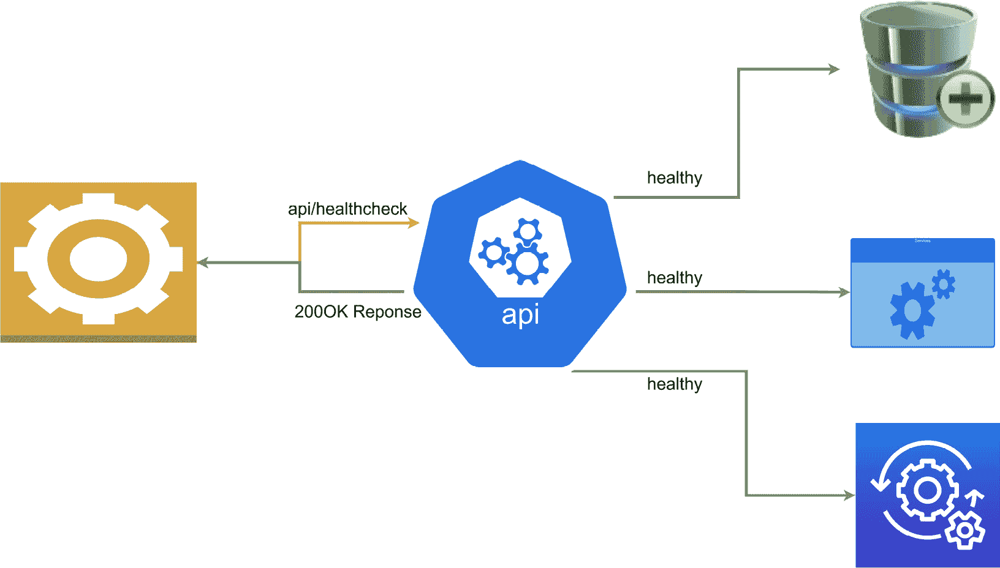
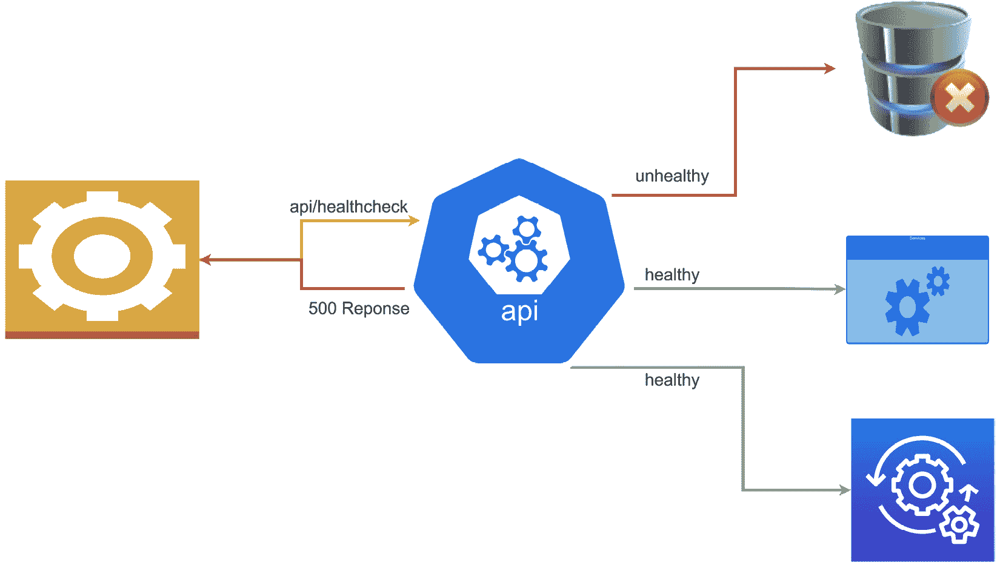
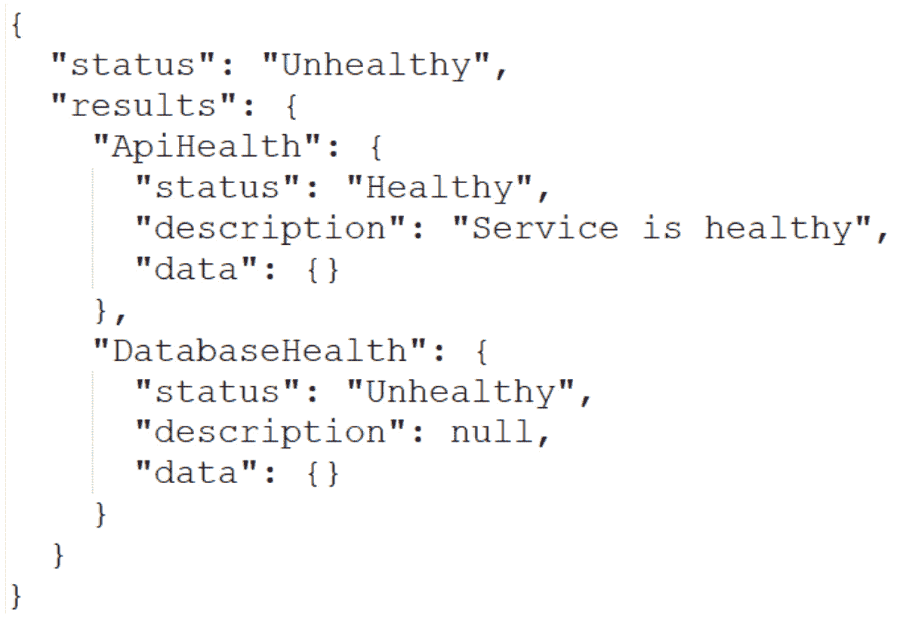

# 10

# 对您的服务执行健康检查

维护最大正常运行时间是任何系统的一个重要方面。在前一章中，我们看到了我们可以以容错的方式编写代码，这将减少我们基础设施和网络中故障的发生频率。然而，这并不是一个长期解决方案，事情无论采取这些措施与否都会失败。这导致了一个观点，即我们需要知道何时出现故障。

这是我们开始考虑健康检查的地方。健康检查作为一种机制，可以通知我们服务的故障以及我们应用程序中支持数据库和连接的故障。通常，这可以通过对资源发送一个简单的 ping 请求来完成。如果收到响应，则表示资源可用且按预期运行。如果没有响应，我们假设资源已关闭并触发警报。

服务的上线和下线状态之间存在状态，我们将在本章中探讨这些选项。我们还将探索 .NET Core 提供的一些功能，以实现这些检查。

在本章中，我们将探讨在导航我们微服务架构中可能出现的故障时，我们可以实施的各种场景和应对措施。

阅读本章后，我们将能够做到以下几点：

+   了解为什么健康检查是必要的

+   了解如何在 ASP.NET Core 中实现健康检查

+   了解编排器如何监控和响应故障

# 技术要求

本章中使用的代码参考可以在项目仓库中找到，该仓库托管在 GitHub 上，网址为：[`github.com/PacktPublishing/Microservices-Design-Patterns-in-.NET/tree/master/Ch10`](https://github.com/PacktPublishing/Microservices-Design-Patterns-in-.NET/tree/master/Ch10)。

# 健康检查与微服务

健康检查使我们能够监控我们服务的健康状况。坦白说，任何暴露 HTTP 端点的另一个服务或资源都成为健康检查的有能力候选人。我们可以简单地向该端点发送请求，并希望得到一个表示成功响应的响应。最简单的健康检查形式可以来自实现一个简单的 `GET` 请求，它返回一个 `200OK` HTTP 响应。我们可以向这样的端点添加更多智能，检查与其他关键服务的连接性，并使用这些信息来影响返回的响应代码。

健康检查对于单体和微服务应用程序都是有用的机制。然而，在微服务的情况下，我们面临着一个更大的挑战，那就是监控和维护多个服务。尤其是如果它们被配置为在单个级别上进行扩展。健康检查可以用来监控相互依赖服务的健康和正常运行时间，并在服务出现故障时执行某种形式的纠正操作。

使用 .NET Core，我们可以返回一个成功的响应，并包含一些关于服务健康状况的详细信息。在这种情况下，我们不能仅仅根据 `200OK` 响应来判断，我们需要检查实际的响应体以确定服务是否健康、降级或不健康。

*图 10.1* 展示了一个典型的健康检查：



图 10.1 – 展示了在确认所有服务都可用后的健康检查请求和健康响应

让我们分解每个状态的含义：

+   **健康**：这表示服务是健康的，并且应用程序正在按预期运行

+   **降级**：这表示服务正在运行，但某些功能可能不可用

+   **不健康**：这表示服务正在失败，并且没有按预期运行

*图 10.2* 展示了一个失败的健康检查：



图 10.2 – 展示了一个由于某个服务不可用而发送了失败响应的健康检查

服务的健康状态取决于多个因素，包括正确的配置、访问密钥和依赖项、托管平台和基础设施的状态，以及与数据库的连接。它们还可以用于外部应用程序监控和整体应用程序健康。

微服务的一种常见部署模式是使用容器编排器，如 *Kubernetes*，在生产环境中部署和运行我们的服务。大多数编排器在运行时会对它们的 pod 进行定期的 *活跃性健康检查*，并在部署期间进行 *就绪性健康检查*。健康检查有助于编排器确定哪些 pod 处于就绪状态，并且能够处理流量。了解活跃性健康检查和就绪性健康检查之间的区别以及何时使用哪一个非常重要。最容易实现的是活跃性健康检查；我们将在下一节讨论这个问题。

## 活跃性健康检查

活跃性健康检查端点是专门为实现健康检查目的而实现的特定端点。在这个健康探测中，当服务响应 *活跃性健康检查* 时，我们认为它是健康的。无法响应此端点表明应用程序存在严重问题。这个问题可能是由于多种原因造成的，例如崩溃或计划外应用程序重启。因此，重启未通过此检查的应用程序是一种常见的做法。

监控基础设施的应用程序，例如监控 Docker 容器的*Kubernetes*，使用*存活健康检查*来确定 Pod 的健康状况并在需要时触发重启。云提供商还提供了与负载均衡器一起的健康探测功能，可以通过定期向存活检查端点发送请求来检查已部署应用程序的可用性。这种方法通常对于 Web 应用程序和服务来说是足够的，因为我们不需要复杂的存活检查端点。如果服务可以接受请求并返回响应，那么我们将其视为健康状态。

检查应用程序或服务是否存活很简单，但在应用程序部署和/或升级后，我们也可能需要减轻误报。这可能会发生在应用程序可能尚未完全准备好使用时，而我们却收到了来自存活检查的积极响应。在这种情况下，我们需要考虑实施*就绪健康检查*。

## 就绪健康检查

*就绪健康检查*用于需要验证不仅仅是 HTTP 响应的情况。具有多个第三方依赖的应用程序可能需要更长的时间才能准备好使用。因此，尽管它能够运行并能响应简单的 HTTP 请求，但数据库或消息总线服务等可能尚未就绪。我们希望在继续使用它或继续部署活动之前，确保我们对应用程序从启动角度的状态有一个全面的了解。

一个*就绪健康检查*通常只有在启动任务完成后才会返回健康状态。这些检查将比*存活健康检查*需要更长的时间来返回健康状态。就绪健康检查到位后，编排器不会尝试重启应用程序，但也不会路由请求流量。*Kubernetes*可以在应用程序的运行时定期执行就绪探测，但它也可以配置为仅在应用程序启动时执行此探测。一旦应用程序报告其健康，则此探测在整个应用程序的生命周期内将不再执行。

这种*就绪健康检查*最适合用于那些在应用程序被认为就绪和可操作之前必须完成的长时间运行任务的应用程序。回想一下，在微服务中，我们引入了几个额外的基础设施依赖项，我们需要监控和确认系统的整体健康状况，以确保只有最健康的 Pod 才会被分配流量。因此，正确配置健康检查对于确保我们有我们应用程序健康状况的最佳表示至关重要。

现在我们已经探讨了健康检查的工作原理以及编排器和监控系统如何使用它们，我们可以探索在我们的 ASP.NET Core API 中实现健康检查。

# 实现 ASP.NET Core 健康检查

ASP.NET Core 有一个内置的健康检查中间件，允许我们原生实现非常健壮的健康检查。此中间件不仅限于 API 项目，而且对我们监控应用程序的健康状况非常有用。原生创建就绪性和存活性健康检查，并支持 UI 仪表板。使用相对简单的存活性健康检查，我们可以实现一个简单的 API 端点，返回预期的简单响应。我们还可以使用更全面的就绪性健康检查来检查应用程序的依赖项的健康状况。

对于这个例子，我们将向我们的预约预订服务添加存活性和就绪性健康检查。此服务有多个依赖项，并且对我们应用程序中的几个操作至关重要。我们需要确保它始终保持健康状态，并在它降级时快速响应。

让我们首先探讨如何为 ASP.NET Core API 配置一个存活性健康检查。

## 添加存活性健康检查

如前所述，存活性检查是可以实现的最基本的健康检查。在我们的 ASP.NET Core 应用程序中，为此所需的基本配置是注册 `AddHealthChecks` 服务和添加健康检查中间件，其中我们定义了一个 URL。

我们对 `Program.cs` 文件进行了以下修改：

```cs
var builder = WebApplication.CreateBuilder(args);
// code omitted for brevity
builder.Services.AddHealthChecks();
var app = builder.Build();
// code omitted for brevity
app.MapHealthChecks("/healthcheck ");
app.Run();
```

任何尝试导航到 `/healthcheck` 端点的操作都将返回一个简单的纯文本响应，作为 `HealthStatus`。可能的 `HealthStatus` 值有 `HealthStatus.Healthy`、`HealthStatus.Degraded` 或 `HealthStatus.Unhealthy`。

健康检查是通过 `IHeathCheck` 接口创建的。此接口允许我们扩展默认的健康检查，并为我们的健康检查添加更多逻辑，进一步自定义可能的响应值。我们可以使用以下代码块创建一个健康检查扩展：

```cs
 public class HealthCheck : IHealthCheck
{
    public Task<HealthCheckResult> CheckHealthAsync(
        HealthCheckContext context, CancellationToken =
            default)
    {
        var healthy = true;
        if (healthy)
        {
            // additional custom logic when the health is
            confirmed.
            return Task.FromResult(
                HealthCheckResult.Healthy("Service is
                    healthy"));
        }
        // additional custom logic when the api is not
           healthy
        return Task.FromResult(
            new HealthCheckResult(
                context.Registration.FailureStatus,
                    "Service is unhealthy"));
    }
}
```

从 `IHeathCheck` 继承迫使我们必须实现 `CheckHealthAsync` 方法。当健康检查被触发时，此方法会被调用，我们可以包含额外的代码来检查其他因素，并确定我们是否认为我们的应用程序是健康的。根据 `healthy` 的值，我们可以返回一个自定义消息。

现在要将 `HealthCheack` 添加到我们的服务中，我们修改 `AddHealthChecks` 服务注册如下：

```cs
builder.Services.AddHealthChecks()
    .AddCheck<HealthCheack>("ApiHealth");
```

在这里，我们添加了新的健康检查逻辑，并为它在应用程序的其他部分提供了一个特定的名称作为参考。此 `AddCheck` 方法允许我们为健康检查定义一个名称、默认失败状态值、映射到自定义健康检查端点的标签以及默认超时值。

现在基于我们的编排器和负载均衡器在执行健康检查时也倾向于看到与健康状况相关的适当响应这一概念，我们可以扩展 `app.MapHealthChecks` 中间件代码，以返回与健康状况相关的特定 HTTP 响应。在此过程中，我们还可以禁用缓存响应：

```cs
app.MapHealthChecks("/healthcheck", new HealthCheckOptions
{
    AllowCachingRepsonses = false,
    ResultStatusCodes =
    {
          [HealthStatus.Unhealthy] =
                 StatusCodes.Status503ServiceUnavailable,
        [HealthStatus.Healthy] = StatusCodes.Status200OK,
        [HealthStatus.Degraded] = StatusCodes.Status200OK,
    }
});
```

我们接下来可能想要调查的是在我们的响应中返回详细信息。目前，我们只返回带有状态的纯文本响应。我们可以使用`System.Text.Json`库中的方法创建一个自定义委托方法，如下所示。

我们首先需要向中间件指示我们有一个名为`WriteJsonResponse`的自定义`ResponseWriter`。我们需要将其添加到`HealthCheckOptions`列表中，使用以下方式：

```cs
app.MapHealthChecks("/healthcheck", new HealthCheckOptions
{
    // code omitted for brevity
    ResponseWriter = JsonResponse
});
```

然后我们使用以下方式定义`WriteJsonResponse`写入器：

```cs
private static Task JsonResponse(HttpContext context,
    HealthReport healthReport)
{
    context.Response.ContentType = "application/json;
        charset=utf-8";
   var options = new JsonWriterOptions { Indented = true };
    using var memoryStream = new MemoryStream();
    using (var jsonWriter = new Utf8JsonWriter
        (memoryStream, options))
    {
        jsonWriter.WriteStartObject();
        jsonWriter.WriteString("status",
            healthReport.Status.ToString());
        jsonWriter.WriteStartObject("results");
        foreach (var healthReportEntry in
           healthReport.Entries)
        {
            jsonWriter.WriteStartObject
                (healthReportEntry.Key);
            jsonWriter.WriteString("status",
                healthReportEntry.Value.Status.ToString());
            jsonWriter.WriteString("description",
                healthReportEntry.Value.Description);
            jsonWriter.WriteStartObject("data");
            foreach (var item in
                healthReportEntry.Value.Data)
            {
                jsonWriter.WritePropertyName(item.Key);
                JsonSerializer.Serialize(jsonWriter,
                    item.Value,
                    item.Value?.GetType() ??
                        typeof(object));
            }
            jsonWriter.WriteEndObject();
            jsonWriter.WriteEndObject();
        }
        jsonWriter.WriteEndObject();
        jsonWriter.WriteEndObject();
    }
    return context.Response.WriteAsync(
        Encoding.UTF8.GetString(memoryStream.ToArray()));
}
```

*图 10.3*显示了健康检查的结果：


图 10.3 – 显示了服务和数据库都可用且状态良好的健康检查响应

现在我们可以包括有关 API 报告不健康或降级状态的健康状态的详细信息。此外，当我们添加更多健康检查时，此 JSON 响应的内容将用每个检查的详细信息填充。

*图 10.4*显示了不健康检查的结果：



图 10.4 – 显示了数据库不可用的健康检查响应

现在我们有了更详细的响应，我们可以添加更详细的检查，例如数据库探测。这将作为检查以验证 API 可以通过配置的数据库与数据库通信。由于我们使用 Entity Framework 进行此连接，我们可以实现一个`DbContext`检查。我们从`Microsoft.Extensions.Diagnostics.HealthChecks.EntityFrameworkCore` NuGet 包开始。然后我们使用以下代码片段修改`AddHealthChecks`方法注册：

```cs
builder.Services.AddHealthChecks()
    .AddCheck<HealthCheack>("ApiHealth")
      .AddDbContextCheck<ApplicationDbContext>
        ("DatabaseHealth");
```

此上下文健康调用 Entity Framework Core 的内置`CanConnectAsync`方法，并使用该响应来推断数据库连接健康。

现在我们可以检查我们服务的健康状态及其与数据库的连接性，让我们为就绪性检查进行配置。

## 添加就绪性健康检查

正如我们讨论过的，就绪性检查指示应用程序及其依赖项是否已成功启动并准备好开始接收请求。我们可以为就绪性检查定义一个单独的端点，并根据使用的 URL 进一步自定义应执行的检查。

要在不同的 URL 上实现活动性和就绪性检查，我们可以在`AddHealthChecks`方法的扩展中添加一个`tags`参数。这允许我们传入一个标签名称数组。我们可以这样标记我们的健康检查：

```cs
builder.Services.AddHealthChecks()
    .AddCheck<HealthCheack>("ApiHealth", tags: new[] {
      "live"})
 .AddDbContextCheck<ApplicationDbContext>("DatabaseHealth",
    tags: new[] { "ready" });
```

现在我们已经标记了我们的健康检查，我们可以继续创建我们的特定检查端点并将它们与标签关联：

```cs
app.MapHealthChecks("/healthcheck/ready", new
    HealthCheckOptions
{
    Predicate = healthCheck =>
        healthCheck.Tags.Contains("ready"),
    // code omitted for brevity
});
app.MapHealthChecks("/healthcheck/live", new
    HealthCheckOptions
{
    Predicate = healthCheck => false;
    // code omitted for brevity
});
```

使用这段新代码，`/healthcheck/ready`端点将仅过滤标记为`ready`的健康检查。在`/health/live`端点中，我们将谓词值设置为`false`以忽略所有标签并执行所有健康检查。

虽然我们不会详细探讨 Kubernetes 或其他编排器，但我们想看看编排器如何与我们的健康检查端点交互。

# 在编排器中配置健康探针

监控并非仅限于编排器，正如我们之前已经确立的。有一些服务为我们提供监控服务，并允许我们将探针配置到我们的应用程序中。这些服务通常允许我们添加警报并配置响应时间阈值。这些警报在帮助我们根据配置的阈值响应故障或关注的情况时非常有用。

在微服务应用程序中，我们需要一种尽可能高效地监控许多服务的方法。我们需要做的唯一配置越少，越好。我们有几种部署模型可以使用，其中最突出的是由编排器管理的容器。Microsoft Azure 有几种 Web 应用程序部署模型，包括**容器 Web 应用程序**（**WAC**）、**Azure 容器实例**（**ACI**）和**Azure Kubernetes 服务**（**AKS**）。

WAC 是 App Service 的一部分，因此健康检查的工作方式与 Azure Web 应用程序相同。它允许你指定一个健康检查端点，该端点将在 2xx 和 3xx HTTP 响应范围内返回响应。它还应在 1 分钟内返回此健康检查响应，以便服务被认为是健康的。

下一个选项是 ACI，其中健康检查被称为健康探针。这些探针配置了检查周期，它决定了检查的频率。当健康检查成功完成时，容器被认为是健康的；如果不成功，则容器是不健康的或只是不可用。使用 ACI，我们可以配置存活和就绪健康检查。我们的探针可以在容器上执行命令或执行 HTTP `GET`请求。当我们执行存活探针时，我们验证容器是否健康；如果不健康，ACI 可能会关闭容器并启动一个新的实例。就绪探针旨在确认容器是否可用于请求处理，正如我们之前讨论的，在应用程序启动过程中这一点更为重要。

在 Azure Kubernetes 服务（AKS）中，我们有一个与 ACI 中非常相似的健康检查和探针方法。开箱即用，Kubernetes 支持存活和就绪探针；如之前所见，主要区别是 Kubernetes 建议您为检查应用程序启动时的健康状态有一个单独的探针，这个探针与在应用程序运行期间持续进行的就绪探针是分开的。我们还可以实现 HTTP `GET` 请求探针以及 TCP 探针来检查我们的容器。

Kubernetes 使用一种名为 `spec.template` 字段的标记语言进行配置。

以下是一个示例 YAML 配置，它创建了一个执行容器启动、存活和就绪健康检查的部署对象：

```cs
apiVersion: v1
kind: Pod
metadata:
  labels:
    test: liveness-api
  name: liveness-http
spec:
  ports:
  - name: api-port
    containerPort: 8080
    hostPort: 8080
  containers:
  - name: liveness-api
    image: registry.k8s.io/liveness
    args:
    - /server
    livenessProbe:
      httpGet:
        path: /healthcheck/live
        port: api-port
      initialDelaySeconds: 3
      failureThreshold: 1
      periodSeconds: 3
    startupProbe:
      httpGet:
        path: /healthcheck/ready
        port: api-port
      failureThreshold: 30
      periodSeconds: 10
    readinessProbe:
      httpGet:
        path: /healthcheck/ready
        port: api-port
      failureThreshold: 30
      periodSeconds: 10
```

描述健康检查的 YAML 文件部分是 `livenessProbe`、`startupProbe` 和 `readinessProbe`。与其它探针定义相比，就绪探针的主要区别在于它执行一个命令，而不是调用一个端点。

通过这种方式，我们获得了一些关于健康检查的基本知识，了解它们是如何工作的，以及为什么我们需要它们。

# 摘要

健康检查是简单而强大的结构，帮助我们确保应用程序以最大效率运行。我们认识到，对于我们来说，不仅要监控和报告服务的正常运行时间，还要监控和报告依赖项，例如数据库和其他可能需要应用程序正常运行的其它服务。

使用 ASP.NET Core，我们可以访问一个内置的健康检查机制，该机制可以自定义和扩展以实现特定的检查，并将它们与不同的端点关联。这在我们需要区分针对被调用端点的测试类型时特别有用。

我们还探讨了如何配置编排器以轮询我们的健康检查端点。编排器使得监控和响应故障变得更容易，因为它们将处理将流量路由到健康实例，并在需要时重启实例。

健康检查不仅帮助我们监控目标网络服务，我们还可以配置健康检查来报告下游服务。这在我们将微服务通过如 API 网关模式等模式实现依赖关系时特别有用。我们将在下一章中探讨实现此模式的方法。
