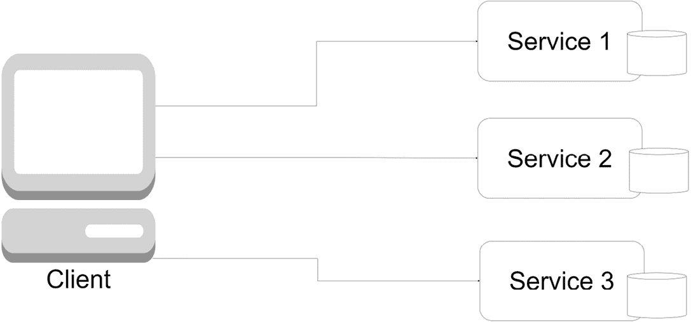
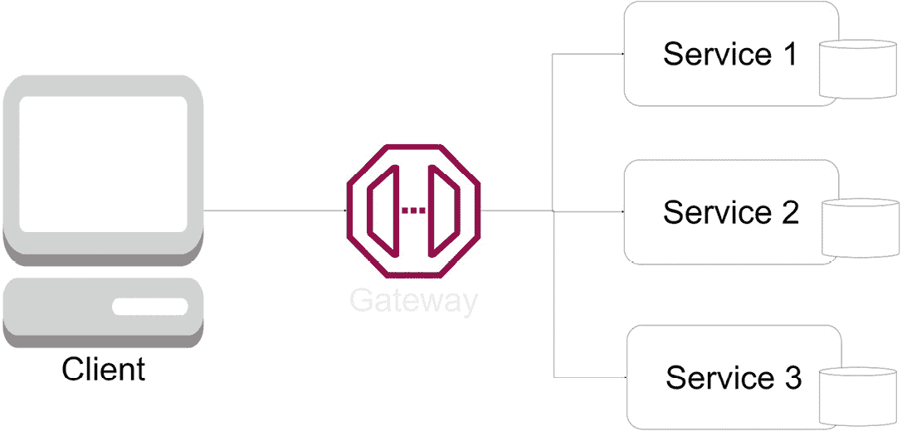
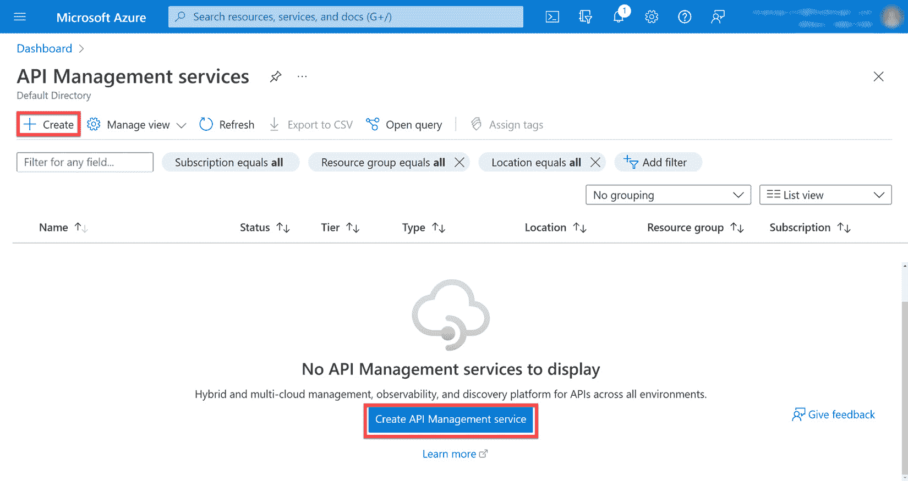
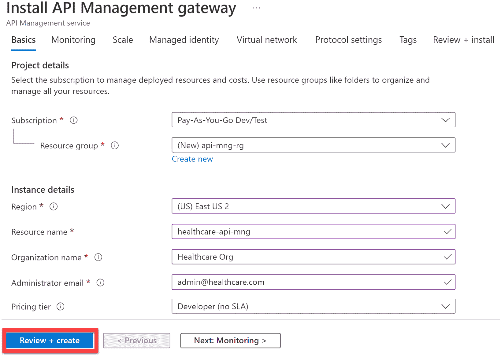
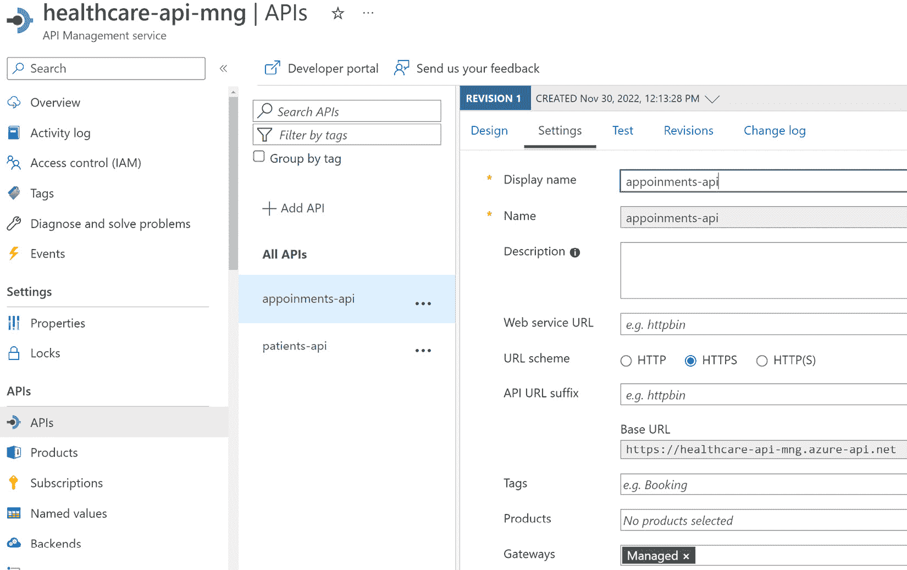
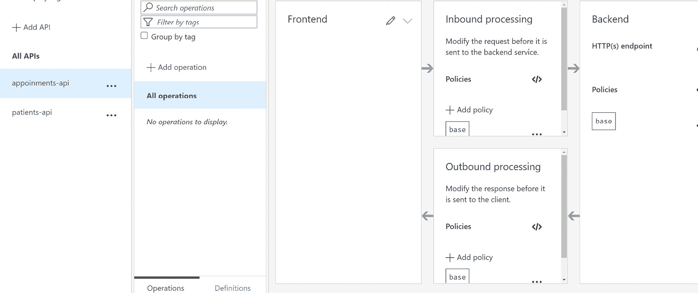
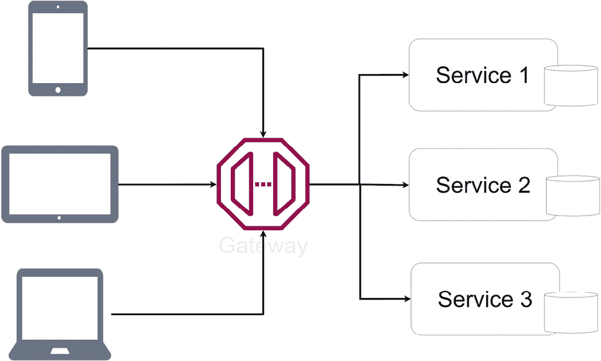
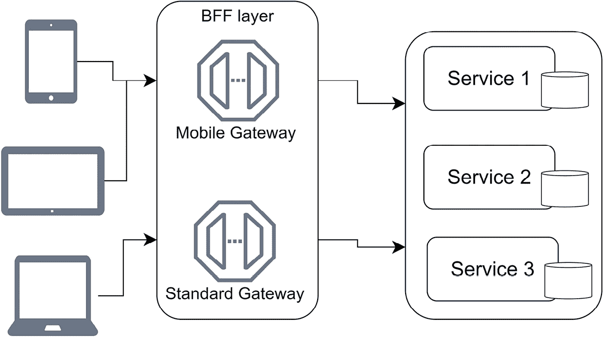

# 实现 API 和 BFF 网关模式

当使用微服务架构方法构建应用程序时，我们已经意识到我们需要跟踪多个 API 端点。我们实际上已经从通过单体提供的单个端点转变为一系列端点。其中一些端点将由其他 API 调用，而另一些则直接集成到与微服务交互的客户端应用程序中。

这成为一个挑战，因为我们最终将客户端应用程序与用于集成各种服务的自定义逻辑混为一谈，并可能编排服务间的通信。我们希望将客户端应用程序代码保持尽可能简单和可扩展，但与每个服务的集成不支持这种观点。

这就是我们将考虑实现 API 网关模式的地方，它引入了客户端和服务之间的一个中心接触点。我们的 API 网关将记录所有端点，并公开一个单一的 API 地址，其中端点将映射到其他微服务的各种端点。

在本章中，我们将探讨各种场景，这些场景将使 API 网关成为我们应用的理想选择，以及实现方法。

在阅读本章之后，我们将能够做到以下几件事情：

+   理解 API 网关及其重要性

+   使用行业领先的技术和方法实现 API 网关

+   正确实现**前端后端**（**BFF**）模式

# 技术要求

本章中使用的代码引用可以在本项目的 GitHub 仓库中找到，该仓库托管在[`github.com/PacktPublishing/Microservices-Design-Patterns-in-.NET/tree/master/Ch11`](https://github.com/PacktPublishing/Microservices-Design-Patterns-in-.NET/tree/master/Ch11)。

# 什么是 API 网关模式？

为了理解 API 网关模式及其必要性，我们需要回顾面向服务的架构的基本原理以及我们如何构建此类解决方案。

面向服务的架构包括应用的三层主要层：

+   **客户端**：也称为前端。这个客户端应用程序是用户看到的，它被设计为从 API 中获取数据。其功能通常限于 API 提供的功能，并且前端开发者可以利用多种技术向最终用户暴露功能。

+   **服务器**：也称为后端。这个架构部分包含 API 和业务逻辑。客户端应用程序的智能程度取决于后端。后端可以由一个或多个服务组成，就像微服务的情况一样。

+   **数据库**：数据库是整个应用程序的锚点，因为它存储了 API 后端使用的所有数据，并在前端显示。

这种应用程序布局在单体应用中很受欢迎，其中所有前端所需的功能都可以在一个 API 中找到。这是一种有效的开发方法，许多成功和强大的应用程序都以此为主导。然而，我们已经探讨了单体方法的缺点，API 可能会变得臃肿，难以长期维护。在追求微服务方法的过程中，我们似乎放弃的主要优势是，我们有一个客户端应用的单一入口点，而不是每个服务都有自己的要求。

虽然微服务架构引领我们走向实现面向服务的架构的应用程序，但我们需要考虑到我们的客户端将需要跟踪多个后端或 API，并且足够智能，能够为每个用户请求编排调用。根据所提供的描述，这是应用中应该最不智能的部分承担的大量责任。

*图 11.1* 展示了客户端和微服务：



图 11.1 – 客户端应用需要了解所有微服务的端点，并保留每个微服务如何工作的知识

正是在这里，我们引入了 API 网关。这个网关将位于我们的服务和客户端应用之间，简化两者之间的通信。对于客户端，它将暴露一个单一的基 URL，客户端将乐意与之交互，并视为一个 API 服务；对于微服务，它将充当一个通道，将来自客户端的请求转发到适当的微服务。

让我们回顾一下引入 API 网关的优势。

## API 网关的优势

当客户端的请求到来时，它被网关接收，网关解释请求，如果需要，转换数据，然后将它转发到适当的微服务。实际上，对于可能需要调用多个微服务的情况，我们可以实现编排和结果聚合，并根据需要向客户端返回更准确的数据表示。

我们的 API 网关还允许我们为我们的微服务集中以下任务：

+   **集中式日志记录**：从 API 网关，我们可以集中记录所有流量到我们的各种端点，并跟踪下游服务的成功和错误响应。这很有优势，因为它免除了我们在每个服务中实现日志记录的需要，并可能产生非常冗长的日志。使用 API 网关允许我们集中实施，并优先考虑写入日志的内容，这有助于我们更好地分类同步操作的结果。我们还可以使用网关来跟踪和记录对下游服务调用的统计信息和响应时间。

+   **缓存**：缓存作为一种临时数据存储，在主数据源可能离线或我们需要减少对服务调用次数时非常有用。我们可以在网关中使用缓存层来稳定我们的应用程序，并可能提高应用程序的性能。通过适当的协调和定制，我们可以使用此缓存进行端点的高速读取操作，这些端点流量很大，甚至可以使用它来处理部分失败，即当服务不可用时，我们使用缓存数据作为响应。

+   **安全性**：保护微服务可能是一项繁琐且技术性强的任务。每个服务可能都有独特的安全需求，这可能导致在协调安全措施和实施时产生开发开销。使用 API 网关，我们可以在网关级别集中安全措施。这可以减轻微服务在验证和授权对资源访问时的负担，因为网关将管理大多数这些需求。我们还可以在此级别实施 IP 白名单，并限制对批准的 IP 地址列表的访问。

+   **服务监控**：我们可以配置我们的 API 网关对下游服务进行健康检查。如前所述，健康检查或探测有助于我们确定服务状态。由于网关需要转发请求，在尝试操作之前确定下游服务的健康状况非常重要。由于网关可以确定服务的健康状况，它可以配置为优雅地处理失败和部分失败。

+   **服务发现**：我们的网关需要知道所有服务的地址以及如何根据需要转换和转发请求。为此，网关需要一个所有下游服务的注册表。网关将简单地作为服务端点的包装器，并向客户端应用暴露一个单一地址。

+   **速率限制**：有时，我们希望限制来自同一来源的快速连续请求的数量，怀疑这种活动可能是对服务端点的**分布式拒绝服务**（DDoS）攻击。使用 API 网关，我们可以实施通用规则，以控制端点可以访问的频率。

再次强调，网关实现最重要的方面是它从我们的客户端承担了大部分责任，这使得扩展和多样化客户端代码变得更加容易。

*图 11.2* 展示了客户端、网关和微服务：



图 11.2 – 引入网关后，客户端应用现在有一个端点，不需要了解底层服务

现在我们已经看到 API 网关如何帮助我们集中访问多个 API 端点，并使客户端应用更容易集成 API 操作，让我们回顾一下使用这种模式的一些缺点。

## API 网关的缺点

虽然优势明显且无可辩驳，但我们还必须意识到引入 API 网关的弊端。API 网关可能以另一个微服务的形式出现，具有讽刺意味的是。处理过多服务的补救措施是构建一个来统治它们。这样，就引入了一个单点故障，因为当这个网关服务离线时，我们的客户端应用将无法向各种服务发送请求。现在，还需要额外的维护，因为我们的网关服务需要随着它所交互的每个服务的变化而变化，以确保请求和响应被准确解释。我们还面临增加请求往返时间的风险，因为这一新层需要足够高效，以接收原始请求，将其转发，然后从微服务检索并转发响应。

虽然我们有明显的优势可以参考，但我们需要确保我们知道、接受并减轻为我们的微服务应用程序实现网关服务所涉及的风险。

正如我们所见，所有 API 都存在一些跨领域和通用问题。在每个服务中实现这些通用需求可能导致冗余，而试图构建一个单一的服务来实现它们可能会导致单体应用程序的创建。使用一个加强了我们所需 API 网关主要功能的第三方应用程序更容易。

现在，让我们回顾一下 API 网关可能实现的方式。

# 实现 API 网关模式

在实现 API 网关时，应遵循某些指南。鉴于其描述，我们可能会倾向于开发一个新的微服务，将其标记为网关，并自行开发和维护 API 集成。

当然，这是一个可行的方案，并且它确实给了你对实现、规则和特性的完全控制，这些是你认为对应用程序和下游服务必要的。我们还可以通过编排对下游服务的请求和响应以及相应地聚合和转换数据来实现特定的业务逻辑来管理某些操作。然而，这可能导致拥有一个*厚 API 网关*。我们将在下一节中进一步讨论这一点。

## 厚 API 网关

当我们意识到我们将过多的业务操作逻辑放入我们的 API 网关时，就创造了*厚 API 网关*这个表达。我们的网关应该更多地作为客户端和微服务之间的抽象层，而不是业务逻辑的主要中心。我们应该避免在网关中放置业务逻辑，这将增加实现复杂性，并增加网关的维护工作量。

我们也可以称这为*过于雄心勃勃的网关*，通常应尽量避免将 API 网关作为我们应用程序行为的核心点。我们还有可能实现一个单体架构，并最终在我们的微服务应用程序中回到起点。同时，我们也不应完全避免这种网关实现，因为通过拥有带有一些业务逻辑的网关，我们可以利用一些额外的模式。

在本书的早期部分，我们回顾了*Saga 模式*和更具体的*编排模式*。回想一下，编排模式依赖于一个中央服务，该服务对下游服务有监督权，监控服务响应，并相应地决定继续或终止 saga。在这种情况下，一个*厚 API 网关*将有助于实现这种行为。

最终，我们都在我们的应用程序中有不同的需求，这些是，再次强调，我们在实施时应该遵守的指南。我们应该始终根据我们的需求为我们的应用程序做出最佳决策。

在所有这些因素可能不适用的情况下，我们需要最小化网关实现中的业务逻辑量，我们可能需要考虑现有的工具和服务，这些工具和服务可以帮助我们以更少的维护和开发工作量完成这些任务。在这个时候，我们可以开始考虑*Amazon API Gateway*、*Microsoft Azure API Management*和像*Ocelot*这样的开源解决方案。

在下一节中，我们将回顾使用*Microsoft Azure API Management*实现 API 网关功能。

## 使用 Azure API Management 实现 API 网关

Microsoft Azure API Management 是一个基于云的解决方案，可在 Microsoft Azure 开发工具套件中找到。它旨在抽象化、保护、加速和观察后端 API。在执行此操作时，它通过服务发现安全地暴露 API，供内部和外部客户端使用，无论是在 Azure 生态系统内还是外部。

它具有以下多个用途：

+   **API 网关**：允许对后端服务的受控访问，并允许我们实施节流和访问控制策略。网关作为后端服务的门面，允许 API 提供者减少对后端不断发展的服务套件进行更改所涉及的成本。网关提供了用于安全、节流、监控甚至缓存的持续和强大的配置选项。

+   虽然这是一个基于云的服务，但 API 网关也可以部署在本地环境中，以满足希望自行托管其 API 以提高性能和合规性的客户。这个 *自托管网关* 被打包成一个 Docker 容器，通常部署到 Kubernetes。

+   **开发者门户**：一个自动生成且完全可定制的网站。第三方开发者可以使用开发者门户来审查 API 文档并了解如何将其集成到他们的应用程序中。

+   **管理平面**：Azure API Management 的这部分允许我们配置服务的设置。我们可以从多个来源定义 API 架构，并配置对不同的协议和标准（如 *OpenAPI 规范*、*WebSockets* 或 *GraphQL*）的支持。

现在，让我们探索设置第一个 Azure API 管理服务所需的一些步骤。为此练习，您需要一个 *Azure 订阅*，如果您还没有，您可以在开始之前创建一个免费的 *Microsoft Azure 账户*。

我们的第一步是登录到 Azure 门户。然后您可以使用搜索功能，输入 *API 管理服务* 并在搜索结果中选择匹配的选项。结果页面将列出您目前拥有的所有 *API 管理服务* 实例。为此练习，您可以点击 **创建**。

*图 11.3* 显示了 Azure API Management 服务的搜索结果：



图 11.3 – 为此练习创建一个新的 API 管理服务

在下一屏幕上，我们可以继续填写服务的详细信息并选择以下选项：

+   **订阅**：此新服务将配置的订阅。

+   **资源组**：与正在配置的服务关联的资源逻辑组。为此练习可以创建一个新的资源组。

+   **区域**：这是服务大部分用户将位于的最佳地理表示。

+   **资源名称**：您将要配置的实例的唯一名称。您需要修改 *图 11.4* 中显示的名称才能继续。

+   **组织名称**：您的组织名称。这将与 API 服务的所有权相关联。

+   **管理员电子邮件地址**：用于所有来自 API 管理的通信和通知的电子邮件地址。

+   **定价层**：这决定了我们偏好的服务正常运行水平。对于此实例，我们将使用 *开发者* 层，它不适用于生产使用。

*图 11.4* 展示了各种 Azure API 管理选项：



图 11.4 – 创建 API 管理服务所需的最低值

在创建 API 管理服务后，我们可以开始将我们的微服务导入管理门户。现在，我们的 API 管理服务将作为我们服务的前端，允许我们根据需要控制访问和转换数据。如果它们的 API 可以在整个互联网或网络上被发现，我们可以从任何来源导入 API。

API 管理服务将处理客户端与映射到请求端点的目标服务之间的所有通信，无论实现 API 所使用的技术。

*图 11.5* 展示了添加到 Azure API 管理服务的 API：



图 11.5 – API 管理服务允许您添加 API 并映射自定义路由，当调用时，将请求重定向到映射的资源

在 *图 11.5* 中，我们可以看到我们已经将我们的预约和客户 API 映射到 API 管理服务，并基于现在通过服务提供的首选端点定义了一个基本 URL。

在 *图 11.6* 中，我们可以看到我们可以管理允许的请求类型，以及为每种请求类型定义我们的策略和转换。

*图 11.6* 还显示了 Azure API 管理服务中的各种请求处理选项：



图 11.6 – API 管理服务允许您轻松管理每个 API 允许的请求类型，并为请求和响应定义转换策略

使用 Azure API Management，我们能够获得许多标准 API 网关功能，并且当我们有生产级定价层时，我们还获得了可用性和服务正常运行时间的保证。如果我们选择不自行托管此应用程序，我们可以利用其 **软件即服务** (**SaaS**) 模型，其中我们大大减少了与使其上线和运行相关的任何基础设施工作的责任。

我们可能会遇到需要自行托管我们的网关，并且 API 管理不是可选方案的情况。在这种情况下，我们可以考虑提供自己的 API 网关应用程序。对于这种实现，一个很好的候选者是 *Ocelot*，这是一个轻量级的 API 网关包，可以直接安装到标准的 ASP.NET Core 项目中。我们将在下一节中进一步讨论这一点。

## 使用 Ocelot 实现 API 网关

Ocelot 是一个基于 .NET Core 平台的开源 API 网关。它是一个简单的网关实现，通过抽象统一了对微服务的通信，正如我们期望从网关中得到的。Ocelot API 网关将转换传入的 HTTP 请求，并根据预设的配置将它们转发到适当的微服务地址。

它是一种流行的广泛使用的 API 网关技术，并且可以很容易地使用 NuGet 包管理器安装到 .NET Core 应用程序中。其配置可以用 JSON 格式概述；在这里，我们定义 *upstream* 和 *downstream* 路由。*upstream* 路由是指暴露给客户端的服务地址，而 *downstream* 路由是映射微服务的真实地址。我们还可以为每个上游服务路由定义允许的协议，从而允许对我们在路由上愿意接受的流量类型进行强大的控制。

让我们一起设置一个 Ocelot API 网关应用程序。我们将使用一个简单的 ASP.NET Web API 项目模板，并首先通过 NuGet 包管理器添加 `Ocelot` 包：

```cs
Install-Package Ocelot
```

现在我们已经安装了我们的包，我们需要开始概述我们的路由配置。我们可以创建一个新的配置文件，并将其命名为 `ocelot.json`。在这个 JSON 文件中，我们将概述所有 *upstream* 和 *downstream* 路由。此配置将类似于以下内容：

```cs
{
     "Routes": [
    {
      "DownstreamPathTemplate": "/api/Patients",
      "DownstreamScheme": "http",
      "DownstreamHostAndPorts": [
        {
          "Host": "localhost",
          "Port": 5232
        }
      ],
      "UpstreamPathTemplate": "/Patients",
      "UpstreamHttpMethod": [
        "GET",
        "POST"
      ]
    },
    {
      "DownstreamPathTemplate": "/api/Patients/{id}",
      "DownstreamScheme": "http",
      "DownstreamHostAndPorts": [
        {
          "Host": "localhost",
          "Port": 5232
        }
      ],
      "UpstreamPathTemplate": "/Patients/{id}",
      "UpstreamHttpMethod": [
        "GET",
        "PUT"
      ]
    },
    {
      "DownstreamPathTemplate": "/api/Appointments",
      "DownstreamScheme": "http",
      "DownstreamHostAndPorts": [
        {
          "Host": "localhost",
          "Port": 5274
        }
      ],
      "UpstreamPathTemplate": "/Appointments",
      "UpstreamHttpMethod": [
        "POST",
        "PUT",
        "GET"
      ]
    }
  ],
  "GlobalConfiguration": {
    "BaseUrl": http://localhost:5245""
  }
}
```

此配置文件很简单，一旦我们掌握了模式，我们就可以根据需要扩展它以用于我们其余的服务。各部分在此处解释：

+   **Routes**: 这是我们的 JSON 配置的父级部分，我们在这里开始定义上游和下游配置。

+   **DownstreamPathTemplate**: 此部分概述了微服务可以找到的地址。

+   **DownstreamScheme**: 这概述了我们将与定义的微服务进行通信的协议。

+   **DownstreamHostAndPorts**: 主机地址和端口在此部分定义。

+   **UpstreamPathTemplate**: 我们概述了我们将暴露给客户端应用的路径。通过调用此定义的路由，Ocelot 将自动将请求重定向到在 **DownstreamPathTemplate** 中定义的服务。注意，在前面的示例中，如果我们需要，我们可以重命名路由。下游 API 中原本的 **Customers** API 端点只能通过 **Patients** 端点地址访问。

+   **UpstreamHttpMethod**: 在这里，我们定义我们将接受作为合法请求的方法。

+   **全局配置**：我们在配置中概述了 **BaseUrl**，所有请求流量都应该通过它发送。

现在，让我们配置我们的应用程序以使用这些配置并使用 Ocelot 包。我们将从向 `Program.cs` 文件中添加以下行开始：

```cs
builder.Configuration.AddJsonFile("ocelot.json", optional:
  false, reloadOnChange: true);
builder.Services.AddOcelot(builder.Configuration);
```

这些行在应用程序启动时将 `ocelot.json` 文件添加到全局配置中，然后注册 Ocelot 作为服务。然后，我们需要添加 Ocelot 中间件，如下所示：

```cs
await app.UseOcelot();
```

通过这些简单的配置，我们现在可以在客户端应用程序中使用网关 URL 作为 API URL。

Ocelot 文档齐全且可扩展。它支持其他功能，例如以下内容：

+   内置缓存管理

+   速率限制器

+   支持原生 .NET Core 日志集成

+   支持 **JSON Web Token** (**JWT**) 认证

+   重试和断路器策略（使用 *Polly*）

+   聚合

+   预下游和后下游请求转换

现在我们已经学习了如何使用 Ocelot 设置一个简单的网关，让我们来看看如何扩展这个功能。我们将从添加缓存管理开始。

## 添加缓存管理

缓存作为请求到更可靠的数据存储之间的临时数据存储。这意味着缓存将根据它最后接收的数据集临时存储数据。良好的缓存管理建议我们根据间隔刷新缓存，并用数据的新版本刷新它。

当我们需要减少对主数据库的访问次数时，缓存非常有用，这可以减少数据库调用带来的延迟和读写成本。Ocelot 对缓存有一些支持，这对于在网关应用程序中本地解决小缓存问题很有帮助。

这可以通过相当容易的方式添加。我们将从使用 NuGet 包管理器执行以下命令开始：

```cs
Install-Package Ocelot.Cache.CacheManager
```

这个包为我们提供了所需的缓存扩展，然后我们可以在 `Program.cs` 文件中引入一个扩展方法。这个扩展方法看起来像这样：

```cs
builder.Services.AddOcelot()
    .AddCacheManager(x =>
    {
        x.WithDictionaryHandle();
    });
```

最后，我们在 `ocelot.json` 配置文件中添加以下行：

```cs
"FileCacheOptions": {
    "TtlSeconds": 20,
    "Region": "SomeRegionName"
  }
```

现在我们已经引入了一个配置来管理我们的网关中缓存应该如何发生，我们必须概述值应该缓存最多 20 秒。这将为已定义的下游服务添加原生缓存支持。一旦缓存期过期，请求将按预期转发，然后新的响应值将再次缓存，为期定义的时间。

缓存有助于减轻我们对服务的压力，但它合理地只对短期施加限制。如果我们延长这个期限，那么我们就有可能返回过时的数据太长时间。我们还想实施另一层保护，那就是速率限制。让我们接下来探讨这个问题。

## 添加速率限制

速率限制帮助我们防御 DDoS 攻击的影响。本质上，我们规定了我们的服务端点可以被同一资源访问的频率。当请求频率违反我们的规则时，我们将拒绝其他传入的请求。这有助于防止可能的服务性能下降。我们的服务将不会尝试满足所有请求，尤其是那些可能看起来像攻击的请求。

速率限制通过记录原始请求的 IP 地址来工作。对于来自同一 IP 地址的所有其他请求，我们评估它是否合法，并且是否在控制从同一发送者发出请求频率的约束范围内。当检测到违规规则时，我们发送失败响应，并且不在服务中转发请求。

Ocelot 允许我们为配置的下游服务配置速率限制。这很好，因为它允许我们全局管理这些规则，我们不需要在每个服务中实现这些规则。

首先，让我们修改我们的代码，以实现特定下游服务的速率限制。我们可以在服务的配置文件中添加以下代码：

```cs
{
      "DownstreamPathTemplate": "/api/Patients",
      "DownstreamScheme": "http",
      "DownstreamHostAndPorts": [
        {
          "Host": "localhost",
          "Port": 5232
        }
      ],
      "UpstreamPathTemplate": "/Patients",
      "UpstreamHttpMethod": [
        "GET",
        "POST"
      ],
      "RateLimitOptions": {
        "ClientWhitelist": [],
        "EnableRateLimiting": true,
        "Period": "5s",
        "PeriodTimespan": 1,
        "Limit": 1
      }
    },
```

我们在`ocelot.json`文件中引入了一个新的部分，称为`RateLimitingOptions`。更具体地说，我们在患者的下游服务配置中添加了此新配置。现在，将对以下如何访问此下游服务施加以下限制：

+   **ClientWhiteList**: 允许不受速率限制限制的客户端列表。

+   **EnableRateLimiting**: 一个标志，表示是否应该执行速率限制限制。

+   **Period**: 此值指定我们用来确定客户端是否正在发出违反限制选项的请求的时间量。我们可以使用以下：

    +   s 表示秒

    +   m 表示分钟

    +   h 表示小时

    +   d 表示天

模式相当容易遵循。在我们的例子中，我们对请求有一个 5 秒的限制。

+   **PeriodTimeSpan**: 这是一个冷却期。在此期间，违反限制限制的客户端后续请求将被拒绝，时钟将重置。一旦这个周期过去，客户端可以继续发出请求。

+   **Limit**: 客户端在指定时间段内允许发出的请求数量。在此，我们定义每 5 秒只能从客户端接收一个请求。

然后，我们可以定义全局值，以控制网关如何处理速率限制。我们可以在`GlobalConfiguration`部分添加一个类似的`RateLimitingOptions`部分：

```cs
"GlobalConfiguration": {
    "BaseUrl": http://localhost:5245"",
    "RateLimitOptions": {
      "DisableRateLimitHeaders": false,
      "QuotaExceededMessage": "Too many requests!!!",
      "HttpStatusCode": 429,
      "ClientIdHeader": "ClientId"
    }
  }
```

现在，我们有一些新的选项，如下所示：

+   **DisableRateLimitHeaders**: 一个标志，用于确定我们是否禁用或启用速率限制头。这些头值通常如下：

    +   **X-Rate-Limit**: 在指定时间段内可用的最大请求数量

    +   **Retry-After**: 指示客户端在发出后续请求之前应等待多长时间

+   **QuotaExceededMessage**：允许我们定义一个自定义消息发送给违反限制规则的客户端。

+   **HttpStatusCode**：这概述了违反规则时要发送的响应代码。429TooManyRequests 是这种情况的标准响应。

+   **ClientIdHeader**：指定用于识别发起请求的客户端的头部。

通过这些小的改动，我们已经对所有进入 `/patients` 端点的请求实施了速率限制。如果两个或更多请求在 5 秒内从同一客户端地址进入，我们将以 **429TooManyRequests** HTTP 响应进行响应。

在使用 Ocelot 时，我们可能还会考虑聚合我们的响应。这允许我们将多个调用串联起来，并减少客户端编排这些调用的需求。我们将学习如何添加这个功能。

## 添加响应聚合

响应聚合是一种用于合并多个下游服务的响应并相应发送单个响应的方法。本质上，API 网关可以通过接受来自客户端的单个请求，然后向多个下游服务发出分布式并行请求来实现这一点。一旦从下游服务收到所有响应，它将合并数据成一个单一的对象并返回给客户端。

这种方法带来了几个好处。最显著的好处是我们可以减少客户端需要向多个服务请求数据的请求数量。API 网关将自动处理编排。客户端也只需要知道一个模式。因此，几个可能复杂的请求可以合并成一个请求体，这将减少客户端需要跟踪的模式数量。这种方法还将加快涉及调用多个服务的响应时间。由于调用将并行进行，我们不必等待依次进行服务调用所需的全段时间。

Ocelot 允许我们以相当容易的方式配置聚合调用。我们将用键装饰我们的下游服务配置，这些键将作为我们聚合配置的参考点。如果我们想要聚合一个应该返回患者及其所有预约的调用，我们需要进行以下修改：

```cs
    {
      "DownstreamPathTemplate": "/api/Patients/{id}",
      "DownstreamScheme": "http",
      "DownstreamHostAndPorts": [
        {
          "Host": "localhost",
          "Port": 5232
        }
      ],
      "UpstreamPathTemplate": "/Patients/{id}",
      "UpstreamHttpMethod": [
        "GET",
        "PUT"
      ],
      "Key": "get-patient"
    }
```

我们首先向 `api/patients/{id}` 下游服务配置中添加一个新的键。这个键充当别名，我们稍后会使用它。我们还将添加一个新的下游服务配置和新的端点。配置看起来像这样：

```cs
    {
      "DownstreamPathTemplate":
          "/api/user/Appointments/{id}",
      "DownstreamScheme": "http",
      "DownstreamHostAndPorts": [
        {
          "Host": "localhost",
          "Port": 5274
        }
      ],
      "UpstreamPathTemplate": "/Appointments/user/{id}",
      "UpstreamHttpMethod": [
        "GET"
      ],
      "Key": "get-patient-appointments"
    }
```

将在预约服务中实现的匹配端点看起来像这样：

```cs
// GET: api/Appointments/user/{id}
        [HttpGet("user/{id}")]
        public async Task<ActionResult<List<Appointment>>>
            GetAppointmentsByUser(Guid id)
        {
            var appointments = await _context.Appointments
                .Where(q => q.PatientId == id)
                .ToListAsync();
            return appointments;
        }
```

现在我们已经配置了新的端点并修改了下游服务配置，我们需要为我们的聚合编排添加一个新的配置：

```cs
"Aggregates": [
    {
      "RouteKeys": [
        "get-patient",
        "get-patient-appointments"
      ],
      "UpstreamPathTemplate": "/get-patient-details/{id}"
    }
  ],
```

现在，我们可以使用聚合配置中定义的端点，执行一个调用，该调用将返回患者的记录以及他们所预约的所有预约。这些信息几乎同时来自多个服务。我们的客户端不再需要多次调用以获取这些信息。

这种简单而强大的技术帮助我们更好地协调 API 调用，并精确地呈现客户端应用所需的信息。它促进了在检索数据时的行为驱动型工作流程，并减少了每个客户端应用将需要的开发开销。

现在我们已经看到我们可以如何使用我们的 API 项目或 Azure API 管理来实现 API 网关，我们已经克服了微服务应用中的一个主要障碍。我们不再需要构建需要跟踪我们所有微服务地址的客户端应用。

这又引发了一个新的担忧。不幸的是，不同的设备可能对如何与我们服务交互有不同的要求。移动客户端可能需要特殊的考虑，例如安全性和缓存，而 Web 应用则不需要。这给我们在中央网关中跟踪配置增加了更多的复杂性，相对于托管客户端应用的设备而言。

这些考虑让我们走上了为每种服务客户端实现一个网关的道路。这种实现方法被称为*前端后端模式*，我们将在下一节中讨论。

# 前端后端模式

虽然 API 网关解决了几个问题，但它并不是一个万能的解决方案。我们仍然需要应对满足多种设备类型和由此产生的客户端应用的可能性。例如，我们可能需要为移动客户端使用额外的压缩和缓存规则，而网站可能不需要很多特殊考虑。随着能够与 API 交互的设备越来越多，我们越需要确保我们能够支持集成。

*图 11.7* 展示了多个客户端和一个网关：



图 11.7 – 所有客户端设备访问相同的网关，导致某些设备效率低下

所有这些考虑都很好地说明了**前端后端**（**BFF**）模式的好处。这种模式允许我们提供按设备 API 的方法。BFF 模式允许我们根据我们希望用户在特定用户界面上拥有的体验来精确定义我们的 API 功能。这使得我们更容易根据客户端的要求开发和维护 API，并简化了在多个客户端之间交付功能的过程。

*图 11.8* 展示了一个 BFF 的设置：



图 11.8 – 每个客户端应用程序都有一个端点指向特别配置以优化目标设备类型 API 流量的网关

现在，我们可以优化每个网关实例，以最有效的方式处理特定设备的流量。例如，我们的移动应用程序可能需要额外的缓存或压缩设置，我们可能需要重写请求头。我们甚至可能定义额外的头信息，以便从我们的移动设备提供，因为我们可能需要跟踪设备类型和位置。简而言之，我们需要尽可能地为每个可能的设备提供服务。

Azure API Management 具有允许我们在转发请求之前查询传入请求并修改请求，或者在将响应发送到请求客户端之前修改响应的功能。通过定义这些策略，我们可以实现类似 BFF 的机制，其中策略被定义为查找设备类型或通常请求的来源，并尽可能优化以转发或返回。

Ocelot 可能需要一些更复杂的逻辑来支持此类策略。使用 Ocelot 实现此模式更推荐的方式是使用多个 Ocelot 实现。在这种实现风格中，我们会创建多个 Ocelot 项目，每个项目都有其特定的用途，例如移动端、网页和公共网关，并为允许的上游和下游服务添加每个配置。我们还可以为每个实现指定速率限制和缓存选项。

让我们回顾一下如何使用 Ocelot 实现此模式。

## 使用 Ocelot 的 BFF 模式

我们已经看到我们可以配置 Ocelot 作为我们的 API 网关。这只是一个简单的扩展，我们之前所做的工作，即创建额外的项目并按类似方式配置它们。我们可以保留已经拥有的网关，并专门用于第三方应用程序访问。通过我们定义的上游和下游服务，我们可以限制第三方只能访问那些端点。

然后，我们可以创建一个新的 Ocelot 项目，并专门为我们的网页客户端使用它。假设我们不想在网页客户端上应用速率限制，可以将缓存时间减少到 10 秒而不是 20 秒。鉴于这是我们网页应用程序，我们可以放宽大多数这些限制，允许更宽松的交互。

此配置文件将看起来像这样：

```cs
{
  "Routes": [
    {
      "DownstreamPathTemplate": "/api/Patients",
      "DownstreamScheme": "http",
      "DownstreamHostAndPorts": [
        {
          "Host": "localhost",
          "Port": 5232
        }
      ],
      "UpstreamPathTemplate": "/web/Patients",
      "UpstreamHttpMethod": [
        "GET",
        "POST"
      ]
    },
   // omitted for brevity   ],
  "FileCacheOptions": {
    "TtlSeconds": 10,
    "Region": "SomeRegionName"
  },
  "GlobalConfiguration": {
    "BaseUrl": http://localhost:5245""
  }
}
```

这看起来与我们在之前的网关中已经做过的类似，但请注意，现在我们有一个独特的机会来定义自定义路径，这些路径与我们要实现的网络入口点相匹配，同时根据需要添加/删除配置，以适应网络客户端。此外，请注意，它将从不同的地址广播，这将防止客户端之间出现任何引用冲突。

我们还可能想要实现一个具有较少限制的移动客户端，类似于我们在网络网关中概述的内容，但我们可能还想要自定义聚合操作。因此，对于我们的移动客户端网关，我们可以在 Ocelot 配置中添加以下聚合器定义：

```cs
  "Aggregates": [
    {
      "RouteKeys": [
        "get-patient",
        "get-patient-appointments"
      ],
      "UpstreamPathTemplate": "/get-patient-details/{id}",
      "Aggregator": "PatientAppointmentAggregator"
    }
  ],
```

在`Program.cs`文件中，我们添加以下行以注册聚合器：

```cs
builder.Services.AddOcelot().AddSingletonDefinedAggregator<
  PatientAppointmentAggregator>()
```

现在，我们需要定义一个名为`PatientAppointmentAggregator`的类，该类将实现我们的自定义聚合逻辑。这个自定义聚合器将拦截来自下游服务器的响应，并允许我们查询和修改返回的内容：

```cs
public class PatientAppointmentAggregator :
  IDefinedAggregator
{
    public async Task<DownstreamResponse>
        Aggregate(List<HttpContext> responses)
    {
        var patient = await responses[0].Items.Downstream
          Response().Content.ReadAsStringAsync();
        var appointments = await responses[1]
          .Items.DownstreamResponse()
            .Content.ReadAsStringAsync();
        var contentBuilder = new StringBuilder();
        contentBuilder.Append(patient);
        contentBuilder.Append(appointments);
        var response = new StringContent
          (contentBuilder.ToString())
        {
            Headers = { ContentType = new
              MediaTypeHeaderValue("application/json") }
        };
        return new DownstreamResponse(response,
          HttpStatusCode.OK, new List<KeyValuePair<string,
            IEnumerable<string>>>(), "OK");
    }
}
```

这个聚合器代码接收一个响应列表，其中每个条目代表在配置中定义的顺序中下游服务的响应。然后我们将响应提取为字符串，并将其追加到一个字符串值中。我们还向最终响应添加了一个`ContentType`头，该响应与`200OK` HTTP 响应一起发送。这是一个简单的例子，但它展示了我们如何轻松地自定义默认的聚合行为，以及如何通过扩展为特定的 bff 网关进行自定义。

bff 模式允许我们进一步多样化我们的开发团队及其在维护各种微服务方面的努力。现在，团队可以管理他们的网关并实现针对他们所服务的设备独特的网关方法和功能。

既然我们已经理解了 API 网关、bff 模式以及如何使用行业标准软件实现其中之一，让我们回顾一下本章所学的内容。

# 摘要

本章回顾了 API 网关的需求。在构建单体应用时，我们有一个单一入口点来访问应用程序的支持 API，并且这个单一入口点可以用于任何类型的客户端。

这种方法的缺点是，我们可能会得到一个 API，随着需求的改变，它变得越来越难以改进和扩展。我们还需要考虑这样一个事实，即不同的设备对 API 有不同的需求，例如缓存、压缩和身份验证等。

我们随后尝试将我们应用程序的功能多样化，扩展到多个服务或微服务中，并且只为每个服务实现所需的功能。这种方法简化了每个服务的代码库，同时却使客户端应用程序的代码库变得更加复杂。原本只有一个服务端点，现在我们有几个需要跟踪。

API 网关将位于所有微服务之上，提供一个单一的入口点，并允许我们实现多个实例，以满足将使用它们的客户端应用程序的直接需求。这种调整被称为 bff，它允许我们针对需要它们的客户端应用程序特别定制后端服务。

这里的主要缺点是，通过提供网关层，我们重新引入了一个单点故障，这可能会引入潜在的性能问题。然而，我们的目标是减少我们的客户端应用程序对它们需要与之交互的复杂服务网络有深入了解的需求，这一层抽象也有助于我们在对客户端应用程序影响较小的情况下维护我们的服务。

我们还了解到，当尝试添加 bff 模式时，我们引入了对更多服务和更多代码进行维护的需求。理想情况下，我们希望有一个单一的实现，可以被配置多次，所有这些配置都是特定的。这正是 Docker 等技术能够帮助的地方，但我们将在此书稍后进行回顾。

现在我们已经看到了 API 网关模式的优缺点，我们需要探索我们 API 的安全性。在下一章中，我们将探讨使用令牌的 API 安全性。
