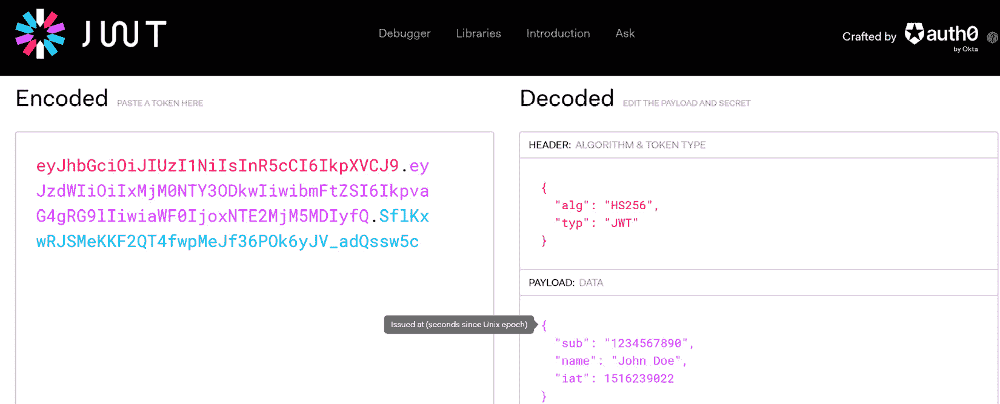
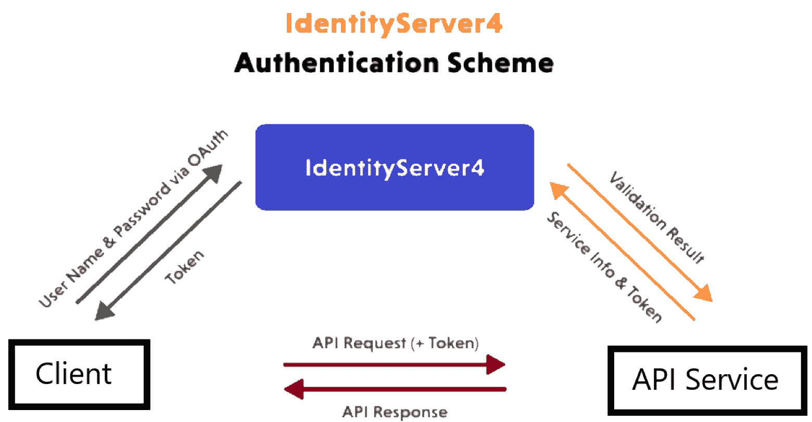
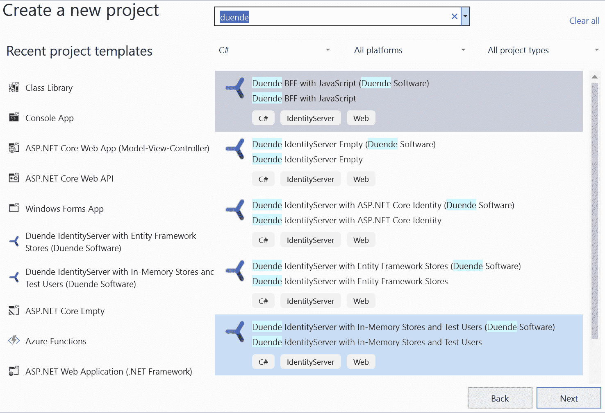
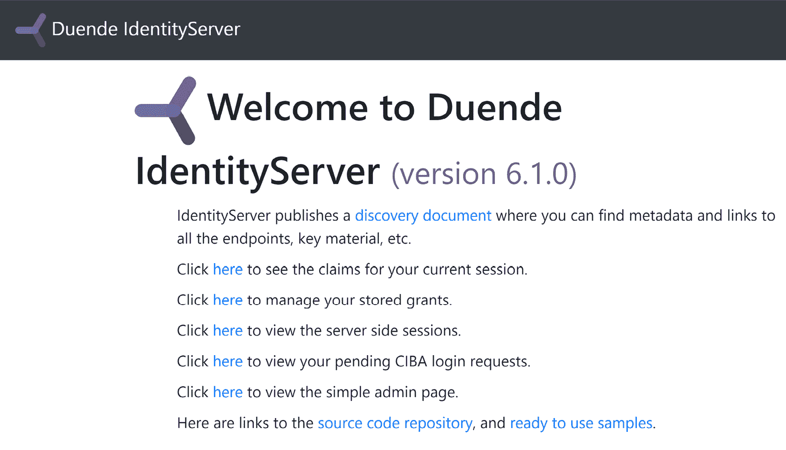
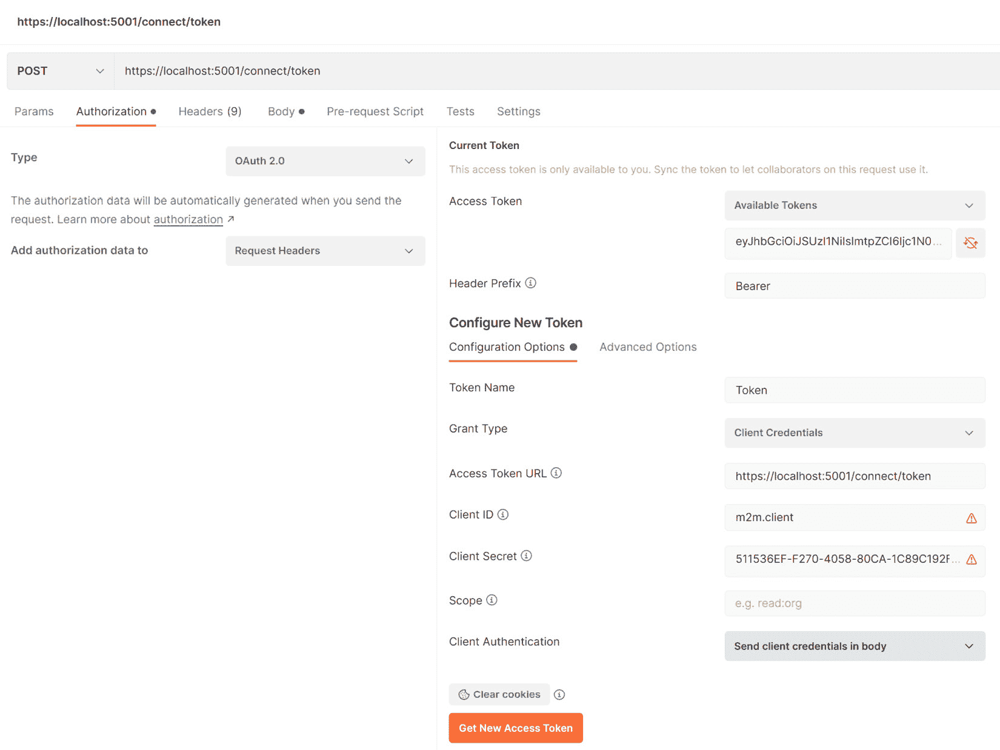
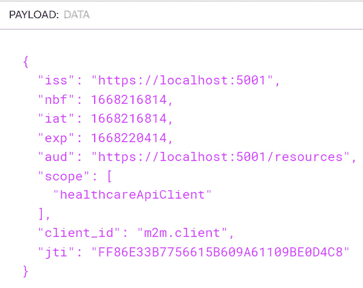
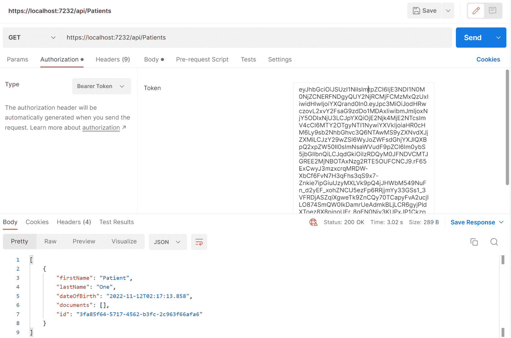

# 12

# 使用载体令牌保护微服务

安全性是任何应用最重要的且最繁琐的方面之一。我们需要确保我们的应用是用安全代码构建的，并且始终追求最有效的方法来减少系统中的入侵和漏洞。尽管如此，然而，安全性也以可用性为代价，我们应该始终寻求在这两者之间找到平衡。

基本应用安全始于登录系统。我们应该能够允许用户在系统中注册自己并相应地存储一些标识信息。当用户返回并希望访问应用的部分内容时，我们将查询数据库并通过他们的标识信息验证用户的身份，然后决定相应地授予或限制访问。

在现代应用中，我们发现维护一个作为我们所有用户权威的数据存储变得越来越困难，同时还要考虑到他们可能通过的所有可能的渠道访问我们的应用。我们一直在探索使用微服务架构，这使我们的安全考虑达到了新的水平，我们现在需要为从多个设备访问的不同用户保护应用的不同部分。

在本章中，我们将探讨在保护我们的微服务应用时需要考虑的主要因素，以及最佳配置和技术。

在阅读本章后，我们将完成以下内容：

+   理解载体令牌的安全性

+   学习如何在 ASP.NET Core API 中实现载体令牌安全性

+   学习如何使用身份提供者来保护我们的微服务

# 技术要求

本章中使用的代码示例可以在 GitHub 上托管的项目存储库中找到：[`github.com/PacktPublishing/Microservices-Design-Patterns-in-.NET/tree/master/Ch12`](https://github.com/PacktPublishing/Microservices-Design-Patterns-in-.NET/tree/master/Ch12)。

# 用于保护通信的载体令牌

载体令牌是针对我们在开发现代应用时面临的一系列安全、身份验证和授权挑战的相对较新的解决方案。我们已经从处理标准桌面和 Web 应用转变为满足具有类似安全需求的多种互联网设备。在我们开始探索这些现代安全需求之前，让我们回顾一下我们在过去几年中面临的 Web 应用的一些挑战。

在保护 Web 应用时，我们面临着几个挑战：

+   我们需要一个方法来收集用户信息。

+   我们需要一个存储用户信息的方法。

+   我们需要一个验证用户信息的方法。这被称为*身份验证*。

+   我们需要一个方法来跟踪用户在请求之间的认证状态。

+   我们需要一个方法来跟踪用户在我们系统中被允许做什么。这被称为*授权*。

+   我们需要满足用户可能通过各种渠道或设备类型访问 Web 应用程序的需求。

在一个典型的 Web 应用程序中，大多数这些因素可以通过表单认证来实现，我们要求提供唯一标识信息，并在数据库中查找匹配项。

当找到匹配项时，我们实例化一个临时存储机制，该机制将识别用户在我们的系统中已认证。这个临时存储结构可以以下列形式出现：

+   **会话**：一种在网站中存储信息的方法，可以在多个请求之间使用该变量。与每个请求都会丢失其值的典型变量不同，会话保留其值一段时间，直到它过期或被销毁。会话变量通常存储在服务器上，每次用户成功认证时都会创建一个或多个会话变量。会话变量可以存储诸如用户名、角色等信息。当有太多用户同时登录时，使用会话变量可能导致在较弱的服务器上出现内存问题。

+   **Cookies**：会话的替代方案，其中在用户的设备上创建并存储一个小文件。它用于在请求之间存储信息，以及跟踪用户的认证状态。每次从用户的设备发送请求时，都会发送这个 cookie，服务器 Web 应用程序使用这些信息来了解是否可以采取行动，以及如果可以，哪些行动。由于 cookies 可以减少服务器的负载并将更多责任放在用户的设备上，因此有时它们比会话更受欢迎。

当我们确信将要处理的是一个维护*状态*的 Web 应用程序时，这两种选项都表现得非常出色。状态意味着我们在请求之间保留用户信息，并记住谁登录以及他们在使用网站期间的基本信息——但是当你需要针对 API 进行认证时会发生什么？API 本质上不维护状态。它不会尝试保留访问它的用户的认知，因为 API 是为任何渠道在任何时间点的偶然访问而设计的。因此，我们实现了载体令牌。

载体令牌是一个包含尝试与我们 API 通信的用户信息的编码字符串。它帮助我们实现无状态通信，并促进一般的用户认证和授权场景。

## 理解载体令牌

*承载令牌*或**JSON Web Token**（JWT）是一种在*认证*和*授权*场景中广泛使用的*无状态*API 的构造。承载令牌基于一个开放的行业标准认证，这使得我们能够在服务器和客户端之间轻松共享认证用户信息。当访问 API 时，会在请求-响应周期内创建一个临时状态。这意味着当收到请求时，我们可以确定请求的来源，并根据需要解码额外的头部信息。一旦返回响应，我们就不再有请求的记录，也不知道它来自哪里，或者是由谁发起的。

承载令牌在成功认证请求后发放。我们收到对认证 API 端点的请求，并使用之前描述的信息来检查我们的数据库。一旦用户得到验证，我们就收集几个数据点，如下所示：

+   **主题**：通常是指用户的唯一标识符，例如来自原始数据库的用户 ID。

+   **发行者**：通常是与生成令牌以供发放的服务相关联的名称。

+   **受众**：通常是与将消费令牌的客户端应用程序相关联的名称。

+   **用户名**：用户的唯一系统名称，通常用于登录。

+   **电子邮件地址**：用户的电子邮件地址。

+   **角色**：用户的系统角色，它决定了他们被授权执行的操作。

+   **声明**：关于用户的各个信息片段，可用于在客户端应用程序中辅助授权或信息显示。这可以包括用户的名字、性别，甚至他们个人资料的路径。

+   **过期日期**：令牌应该始终有一个相对于其生成的适度过期日期。当它过期时，用户将需要重新认证，所以我们不希望它只有效很短的时间，但也不要永远有效。

最终，客户端应用程序与 API 之间的登录流程如下：

1.  用户将使用客户端应用程序进行登录

1.  客户端应用程序将登录表单收集到的信息转发到登录 API 端点进行验证

1.  API 返回一个包含有关用户最相关信息片段的编码字符串或令牌

1.  客户端应用程序存储这个编码字符串，并用于后续的 API 通信

基于这种流程，客户端应用程序将使用令牌中的信息在用户界面（UI）上显示有关用户的信息，例如用户名或其他可能包含的信息，如名字和姓氏。虽然有一些推荐的信息片段应该包含在令牌中，但没有固定的标准规定应该包含什么。然而，我们确实避免包含敏感信息，例如密码。

载体令牌是编码的但不是加密的。这意味着它们是包含所有我们之前提到的信息的自包含信息块，但一开始并不易读。编码压缩了字符串，通常以*base64*表示，这是客户端和服务器之间传输以及存储所使用的格式。令牌字符串不是为了安全起见，因为解码字符串并查看其中信息很容易，而且再次强调，这就是为什么我们不将敏感和有罪的数据包含在令牌中。此令牌字符串由三个部分组成。每个部分由句点(*)分隔，通用格式为*aaaa.bbbb.cccc*。每个部分代表以下内容：

+   **头部**：令牌的*a*部分，其中包含有关令牌类型和用于编码的签名算法的信息，例如 HMAC SHA-256 和 RSA。

+   **有效载荷**：令牌字符串的*b*部分，其中包含以声明形式存在的用户信息。我们将在本章稍后更详细地讨论声明。

+   **签名**：令牌的*c*部分，其中包含编码后的头部、编码后的有效载荷以及用于编码的密钥的字符串表示。此签名用于验证令牌自生成以来是否被篡改。

大多数开发框架都包括在应用程序运行时可以解密载体令牌的工具和库。由于载体令牌基于一个开放标准，解码令牌的支持广泛可用。这使我们能够编写通用的和一致的代码来处理由 API 发布的令牌。每个 API 实现都可以根据应用程序的精确需求包含不同的令牌，但总有一些标准是我们始终可以依赖的。

然而，在开发过程中，我们可能想要测试一个令牌以查看我们期望以更易读的形式存在的具体内容。因此，我们转向第三方工具，这些工具可以解码并显示令牌的内容，并允许我们根据需要引用不同的信息。

例如**jwt.io**之类的工具为我们提供了将令牌粘贴进去并以更易读的格式查看信息的能力。如前所述，每个令牌字符串中有三个部分，我们可以使用此网站或类似工具以明文形式查看每个部分。令牌的有效载荷部分在解码后会产生*图 12.1*中显示的信息。它显示了一个示例载体令牌及其内容，可在[www.jwt.io](http://www.jwt.io)上查看。



图 12.1 – 我们可以看到编码后的字符串及其内容右侧的明文翻译

放入携带令牌中的所有信息都代表一个键值对。每个键值对代表关于用户或令牌本身的信息单元，而键实际上是之前提到的通常存在于令牌中的声明的简短名称：

+   **iss**：代表**发行者**值。

+   **sub**：代表**主题**值。

+   **aud**：代表**受众**值。

+   **nonce**：代表一个唯一值，该值应始终与每个令牌一起变化，以防止重放攻击。此值始终是新的，这确保了不会向同一用户发行的任何两个令牌是相同的。有时这个值也可以称为**jti**声明。

+   **exp**：代表令牌的过期日期。值以 UNIX 纪元的形式表示，这是一个时间的数值表示。

+   **iat**：代表发行日期和时间。

现在我们已经探讨了为什么我们需要携带令牌以及它们是如何被使用的，让我们回顾一下我们如何在 ASP.NET Core API 应用程序中实现令牌安全。

# 实现携带令牌安全

ASP.NET Core 通过其`Identity Core`库提供原生的身份验证和授权支持。这个库与 Entity Framework 直接集成，允许我们在目标数据库中创建标准的用户管理表。我们还可以进一步指定我们偏好的身份验证方法，并定义定义整个应用程序中授权规则的政策。

这个强大的库内置了对以下功能的支持：

+   **用户注册**：用户管理器库具有使用户创建和管理变得简单的功能。它包含覆盖大多数常见用户管理操作的功能。

+   **登录、会话和 cookie 管理**：登录管理器库具有管理用户身份验证和会话管理场景的功能。

+   **双因素身份验证**：Identity Core 允许我们通过电子邮件或短信原生前置多因素身份验证。这可以轻松扩展。

+   `Identity Core`使得将此功能集成到您的应用程序中变得简单。

使用携带令牌保护 API 确保每个 API 调用都需要在请求的头部部分包含一个有效的令牌。HTTP 头部允许在 HTTP 请求或响应中提供额外的信息。

在我们保护 API 的案例中，我们强制要求每个请求都必须包含一个包含携带令牌的授权头部。我们的 API 将评估传入的请求头部，检索令牌，并对其与预定义配置进行验证。如果令牌不符合标准或已过期，将返回`HTTP 401 未授权`响应。如果令牌符合要求，则请求将被满足。这种内置机制使得在应用程序中支持广泛的、健壮的身份验证和授权规则变得简单且易于维护。

现在我们已经了解了`Identity Core`库以及它在 ASP.NET Core 应用程序中的原生支持，我们可以探索使用 bearer tokens 保护 API 所需的必要包和配置。

## 使用 bearer tokens 保护 API

我们可以使用 NuGet 包管理器安装以下包：

```cs
Install-Package Microsoft.AspNetCore.Authentication
  .JwtBearer
```

第一个包支持 Entity Framework 和`Identity Core`之间的直接集成。第二个包包含扩展方法，允许我们在 API 配置中实现 token 生成和验证规则。

接下来，我们需要定义常量值，这些值将告知 API 中的 token 生成和验证活动。我们可以将这些常量放在`appsettings.json`中，它们将如下所示：

```cs
  "Jwt": {
    "Issuer": "HealthCare.Appointments.API",
    "Audience": " HealthCare.Appointments.Client",
    "DurationInHours": 8
    "Key": "ASecretEncodedStringHere-Minimum16Charatcters"
  }
```

我们已经讨论了发行者和受众值如何帮助强制执行。我们还可以为生成的 token 提出一个建议的有效期。这个值应该始终相对于 API 的功能和操作以及您的风险承受能力来考虑。token 的有效期越长，我们提供给潜在攻击者的系统窗口就越大。同时，如果期限太短，那么客户端将需要频繁地重新认证。我们应该始终寻求寻求平衡。

我们在这里的关键值具有示范性的价值，但我们使用这个签名密钥作为生成 token 的加密密钥。密钥应该始终保密，因此我们可以使用应用程序密钥或更安全的密钥存储来存储这个值。

现在我们有了应用程序常量，我们可以继续在`Program.cs`文件中指定全局身份验证设置：

```cs
builder.Services.AddAuthentication(options =>
{
    options.DefaultAuthenticateScheme =
        JwtBearerDefaults.AuthenticationScheme;
    options.DefaultChallengeScheme =
        JwtBearerDefaults.AuthenticationScheme;
}).AddJwtBearer(o =>
{
    o.TokenValidationParameters = new
        TokenValidationParameters
    {
        ValidateIssuer = true,
        ValidateAudience = true,
        ValidateLifetime = true,
        ValidateIssuerSigningKey = true,
        ValidIssuer = builder.Configuration["Jwt:Issuer"],
        ValidAudience = builder.Configuration
            ["Jwt:Audience"],
        IssuerSigningKey = new SymmetricSecurityKey
        (Encoding.UTF8.GetBytes(builder.Configuration["Jwt:
            Key"]))
    };
});
```

在这里，我们正在向应用程序添加配置，这将向 API 应用程序声明它应该强制执行特定的身份验证方案。鉴于 Identity Core 支持多种身份验证方案，我们需要指定我们打算强制执行的方案以及扩展到所需的挑战方案类型。挑战方案指的是应用程序将需要的身份验证要求。在这里，我们指定`JwtBearerDefaults.AuthenticationScheme`作为挑战和身份验证方案。这个`JwtBearerDefaults`类包含通常可用和使用的 JWT 常量。在这种情况下，`AuthenticationScheme`将渲染值为 bearer，这是一个关键字。

在我们完成定义身份验证方案后，我们继续设置将强制执行某些规则的配置，这些规则将决定如何验证令牌。通过将 `ValidateIssuer`、`ValidateAudience` 和 `ValidateLifetime` 设置为 `true`，我们强制要求传入令牌中的匹配值必须与我们设置在 `appsettings.json` 配置常量中的值相匹配。您可以根据您想要如何严格检查令牌内容与系统之间的匹配程度来灵活设置验证规则。验证规则越少，有人使用伪造令牌获取系统访问权限的可能性就越高。

我们还需要确保我们的 API 知道我们打算支持授权，因此我们还需要添加以下行：

```cs
builder.Services.AddAuthorization();
```

然后，我们还需要按照以下顺序包含我们的中间件：

```cs
app.UseAuthentication();
app.UseAuthorization();
```

现在我们已经处理了初步配置，我们需要将我们的默认身份用户表包含到数据库中。我们首先将数据库上下文的继承从 `DbContext` 改为 `IdentityDbContext`：

```cs
public class AppointmentsDbContext : IdentityDbContext
```

我们还将添加代码在数据库上下文中生成一个示例用户。当我们执行下一个迁移时，此用户将被添加到表中，我们可以用它来测试身份验证：

```cs
protected override void OnModelCreating(ModelBuilder
    builder)
        {
            base.OnModelCreating(builder);
            var hasher = new PasswordHasher<ApiUser>();
            builder.Entity<ApiUser>().HasData(new ApiUser
            {
                Id = "408aa945-3d84-4421-8342-
                    7269ec64d949",
                Email = "admin@localhost.com",
                NormalizedEmail = "ADMIN@LOCALHOST.COM",
                NormalizedUserName = "ADMIN@LOCALHOST.COM",
                UserName = "admin@localhost.com",
                PasswordHash = hasher.HashPassword(null,
                    "P@ssword1"),
                EmailConfirmed = true
            });
        }
```

在这些更改之后，我们执行的下一个迁移将生成在执行 `update-database` 命令时创建的用户表。默认情况下，这些新表将以前缀 `AspNet` 开头。

我们还需要在我们的应用程序中注册 `Identity Core` 服务并将其连接到数据库上下文，如下所示：

```cs
builder.Services.AddIdentityCore<IdentityUser>()
    .AddRoles<IdentityRole>()
    .AddEntityFrameworkStores<AppointmentsDbContext>();
```

在这里，我们在应用程序中注册与身份相关的服务，指定我们正在使用默认的用户类型 `IdentityUser`、默认的角色类型 `IdentityRole` 以及与 `AppointmentsDbContext` 关联的数据存储。

现在我们已经指定了 `Identity Core` 和 JWT 身份验证集成所需的配置，我们可以着手实现一个登录端点，该端点将验证用户的凭据并根据需要生成包含最少识别信息的令牌。我们将在下一节中探讨这个问题。

## 生成和颁发令牌

ASP.NET Core 支持生成、颁发和验证令牌。为此，我们需要在我们的身份验证流程中实现逻辑，以生成包含已认证用户信息的令牌，并将其作为响应体返回给请求客户端。让我们首先定义一个 `Id` 值和令牌，并将它们都包装在它们自己的 `AuthResponseDto` 中：

```cs
public class AuthResponseDto
{
   public string UserId { get; set; }
   public string Token { get; set; }
}
```

我们还将有一个 DTO 接受登录信息。我们可以称这个 DTO 为 `LoginDto`：

```cs
public class LoginDto
    {
        [Required]
        [EmailAddress]
        public string Email { get; set; }
        [Required]
        [StringLength(15, ErrorMessage = "Your Password is
            limited to {2} to {1} characters",
                MinimumLength = 6)]
        public string Password { get; set; }
    }
```

我们的 DTO 将对提交的数据执行验证规则。在这里，我们的用户可以使用他们的电子邮件地址和密码进行身份验证，任何违反验证规则的无效尝试都将使用 `400BadRequest` HTTP 状态码被拒绝。

我们的认证控制器将实现一个接受此 DTO 作为参数的登录操作：

```cs
[Route("api/[controller]")]
[ApiController]
public class AccountController : ControllerBase
{
    private readonly IAuthManager _authManager;
    public AccountController(IAuthManager authManager)
    {
        _authManager = authManager;
    }
    // Other Actions here
    [HttpPost]
    [Route("login")]
    public async Task<IActionResult> Login([FromBody]
        LoginDTO loginDto)
    {
        var authResponse = _authManager.Login(loginDto);
        if (authResponse == null)
        {
            return Unauthorized();
        }
        return Ok(authResponse);
    }
}
```

我们将`IAuthmanager`服务注入到控制器中，其中我们抽象了大部分用户验证和令牌生成逻辑。此服务合同如下：

```cs
public interface IAuthManager
{
   // Other methods
   Task<AuthResponseDto> Login(LoginDto loginDto);
}
```

在`AuthManager`的实现中，我们使用由`Identity Core`提供的`UserManager`服务来验证提交的用户名和密码组合。验证后，我们将生成并返回一个包含令牌和用户 ID 的`AuthResponseDto`对象。我们的实现将类似于以下代码块：

```cs
public class AuthManager : IAuthManager
{
    private readonly UserManager<IdentityUser>
        _userManager;
    private readonly IConfiguration _configuration;
    private IdentityUser _user;
    public AuthManager(UserManager<IdentityUser>
        userManager, IConfiguration configuration)
    {
        this._userManager = userManager;
        this._configuration = configuration;
    }
    // Other Methods
    public async Task<AuthResponseDto> Login(LoginDto
        loginDto)
    {
        var user = await _userManager.FindByEmailAsync
            (loginDto.Email);
        var isValidUser = await _userManager
            .CheckPasswordAsync(_user, loginDto.Password);
        if(user == null || isValidUser == false)
        {
            return null;
        }
        var token = await GenerateToken();
        return new AuthResponseDto
        {
            Token = token,
            UserId = _user.Id
        };
    }
```

我们将`UserManager`和`IConfiguration`都注入到我们的`AuthManager`中。在我们的登录方法中，我们尝试根据在`LoginDto`中提供的电子邮件地址检索用户。如果我们尝试验证提供的密码是否正确。如果没有用户或密码不正确，我们将返回一个 null 值，登录操作将使用此值来指示未找到用户，并将返回`401 Unauthorized` HTTP 响应。

如果我们可以验证用户，那么我们将生成一个令牌，然后返回包含令牌和用户`Id`值的`AuthResponseDto`对象。生成令牌的方法也在`AuthManager`中，如下所示：

```cs
private async Task<string> GenerateToken()
{
        var securitykey = new SymmetricSecurityKey
            (Encoding.UTF8.GetBytes(_configuration["
               Jwt:Key"]));
        var credentials = new SigningCredentials
            (securitykey, SecurityAlgorithms.HmacSha256);
        var roles = await _userManager.GetRolesAsync
            (_user);
        var roleClaims = roles.Select(x => new
            Claim(ClaimTypes.Role, x)).ToList();
        var userClaims = await _userManager.GetClaimsAsync
           (_user);
        var claims = new List<Claim>
        {
            new Claim(JwtRegisteredClaimNames.Sub,
                _user.Email),
            new Claim(JwtRegisteredClaimNames.Jti,
                Guid.NewGuid().ToString()),
            new Claim(JwtRegisteredClaimNames.Email,
                _user.Email),
            new Claim("uid", _user.Id),
        }
        .Union(userClaims).Union(roleClaims);
        var token = new JwtSecurityToken(
            issuer: _configuration[" Jwt:Issuer"],
            audience: _configuration[" Jwt:Audience"],
            claims: claims,
            expires: DateTime.Now.AddMinutes
                (Convert.ToInt32(_configuration["
                    Jwt:DurationInMinutes"])),
            signingCredentials: credentials
            );
        return new JwtSecurityTokenHandler()
            .WriteToken(token);
    }
}
```

在此方法中，我们首先通过`IConfiguration`服务从`appsettings.json`检索我们的安全密钥。然后我们对此密钥进行编码和加密。我们还编译了应该通常包含在令牌中的标准声明，并且我们可以包括其他声明值，无论它们来自数据库中的用户声明还是我们认为必要的自定义声明。

我们最终将所有声明和其他关键值，如这些：

+   `SigningCredentials`具有加密密钥的值

+   *Issuer*和*Audience*在`appsettings.json`中定义

+   jti 声明，它是一个唯一的标识符，或令牌的*一次性密码*。

+   令牌的过期日期和时间，相对于配置的时间限制

结果是一个充满编码字符的字符串，它被返回到我们的`Login`方法，然后通过`AuthResponseDto`返回给控制器。

为了使我们的`AuthManager`在我们的控制器中可用，我们需要在`Program.cs`文件中使用此行注册接口和实现：

```cs
builder.Services.AddScoped<IAuthManager, AuthManager>();
```

在这些配置到位后，我们可以使用简单的`[Authorize]`属性来保护我们的控制器和操作。此属性将直接放置在我们的类实现或操作方法之上。我们的 API 将自动评估每个传入请求的授权头值，并自动拒绝没有令牌或违反在`TokenValidationParameters`中规定的规则的请求。

现在，当我们使用像**Swagger UI**或**Postman**这样的工具，使用我们预先设置的测试用户来测试我们的登录端点时，我们将收到一个看起来像这样的令牌响应：

```cs
{
  "userId": "408aa945-3d84-4421-8342-7269ec64d949",
  "token": "eyJhbGciOiJIUzI1NiIsInR5cCI6IkpXVCJ9.eyJz
  dWIiOiJhZG1pbkBsb2NhbGhvc3QuY29tIiwianRpIjoiZWU5ZjI4OD
  ItMWFkZC00ZTZkLThlZjktY2Q1ZjFlOWM3ZjMzIiwiZW1haWwiOiJhZ
  G1pbkBsb2NhbGhvc3QuY29tIiwidWlkIjoiNDA4YWE5NDUtM2Q4NC00
  NDIxLTgzNDItNzI2OWVjNjRkOTQ5IiwiZXhwIjoxNjY5ODI4MzMwLCJ
  pc3MiOiJIb3RlbExpc3RpbmdBUEkiLCJhdWQiOiJIb3RlbExpc3Rpbm
  dBUElDbGllbnQifQ.yuYUIFKPTyKKUpsVQhbS4NinGLSF5_XXPEBtAEf
  jO5E"
}
```

在 API 中实现令牌认证相对简单，但我们不仅在我们的应用程序中考虑一个 API。我们有多个 API 需要被保护，并且最好，一个令牌应该被所有服务接受。如果我们继续沿着这条路走下去，我们可能会为每个服务进行这些配置，然后需要额外的代码来让所有其他服务认可可能由任何其他服务发行的令牌。

我们需要一个更全局的解决方案，更合适的是，为我们的微服务应用中的所有服务提供一个安全和令牌生成及管理的中央权威机构。这就是我们开始探索将令牌管理责任从每个 API 中分离出来，并将它们放在一个实现**IdentityServer**的 API 中的地方，它是 ASP.NET Core 的**OpenID Connect**和**OAuth 2.0**框架。我们将在下一节中研究实现**IdentityServer**。

# 使用 IdentityServer4 来保护微服务

任何现代应用程序或应用程序套件的关键特性之一是**单点登录**（**SSO**）的概念。此功能使我们能够一次性提供我们的凭据，并在套件中的多个应用程序之间保持已验证的用户状态。这是可以在谷歌或微软在线产品中观察到的功能，仅举几个例子。

当保护微服务应用程序时，这个概念将非常有用。正如我们所看到的，在应用程序的许多 API 中实现令牌发行逻辑，然后尝试协调对已授予一个 API 的所有 API 的访问，这是不可行的。我们还面临要求用户每次尝试访问需要另一个 API 来完成的功能时都需要重新认证的风险，这不会是一个好的用户体验。

考虑到这些因素，我们需要使用一个中央权威机构，它可以允许我们根据我们服务的所有安全考虑实施更全局的令牌发行和验证规则。在 ASP.NET Core 中，此类服务的最佳候选者是**IdentityServer**。

`Identity Core`并允许开发者在他们的 Web 应用程序安全实现中支持**OpenID Connect**和**OAuth2.0**标准。它符合行业标准，并包含针对基于令牌的认证、SSO 和应用程序中的 API 访问控制的即插即用支持。虽然它是一个商业产品，但社区版可供小型组织或个人项目使用。

**IdentityServer**推荐的实现方式如下：

1.  为认证创建一个新的微服务

1.  为我们的认证相关表创建一个新的数据库（可选）

1.  配置要包含在令牌信息中的作用域

1.  配置我们的服务以了解哪些作用域允许访问它们

*图 12.2*显示了 IdentityServer 认证流程：



图 12.2 – 这描述了 IdentityServer 如何位于客户端和服务之间，并处理身份验证和令牌交换的流程

现在，让我们探索创建一个新的服务并将其配置为我们的微服务应用程序中身份验证和授权的中心权威。

## 配置 IdentityServer

Duende 为我们提供了一些快速入门的 ASP.NET Core 项目模板，这些模板在我们的解决方案中易于创建。这些快速入门模板启动了在 ASP.NET Core 项目中启动 IdentityServer 功能所需的最小要求。设置 IdentityServer 服务的常规步骤如下：

+   将 Duende IdentityServer 支持添加到标准 ASP.ENT Core 项目

+   添加数据存储支持，最好使用 Entity Framework 配置

+   添加对 ASP.NET `Identity Core` 的支持

+   为客户端应用程序配置令牌发行

+   使用 IdentityServer 保护客户端应用程序

要开始，我们需要使用 .NET CLI 并运行以下命令：

```cs
dotnet new --install Duende.IdentityServer.Templates
```

该命令现在将为我们提供访问以 `Duende.IdentityServer` 为前缀的新项目模板。*图 12.3* 展示了在 Visual Studio 中安装这些模板后我们可以期待看到的内容。

*图 12.3* 展示了 Duende IdentityServer 项目模板：



图 12.3 – 我们得到了各种项目模板，这些模板有助于我们加快 IdentityServer 的实现过程

使用我们的医疗微服务应用程序，让我们首先添加一个新的 `HealthCare.Auth`。现在，我们有一个预配置的包含多个组件的 IdentityServer 项目。我们需要了解主要组件是什么，并欣赏我们如何根据我们的需求操纵它们。让我们对开箱即得的文件和文件夹结构进行高级审查：

+   `Wwwroot`: 这是与 ASP.NET Core 网络应用程序模板一起提供的标准文件夹。它存储用于网站中的静态资产，如 JavaScript 和 CSS 文件。

+   `Migrations`: 存储预设迁移，这些迁移将用于用支持表填充数据存储。这很方便，因为它消除了我们创建数据库的需要。

+   `Pages`: 存储用于支持用户身份验证操作 UI 要求的默认 Razor 页面。开箱即得，我们得到登录、注册、授权和用户数据管理页面。

+   `appsettings.json`: 这是包含日志和数据库连接配置的标准文件。我们可以更改这个连接字符串以更好地反映我们的需求。

+   `buildschema.bat`: 包含使用.NET 命令行命令（`dotnet ef`）的 Entity Framework 命令，这些命令将运行包含在`Migrations`文件夹中的迁移脚本。我们将使用这些命令来创建我们的数据库。

+   `Config.cs`: 这个静态类作为配置权威机构。它用于概述`IdentityResources`、`Scopes`和`Clients`：

    +   `IdentityResources`：映射到授予访问身份相关信息的范围。`OpenId`方法支持预期的*主题*（或*sub*-声明）值，而`Profile`方法支持额外的声明信息，如`given_name`和`family_name`。我们还可以扩展默认提供的内容，并包括用户*角色*等额外细节。

    +   `Scopes`：可以在发放令牌时包含权限。

    +   `Clients`：我们期望使用 IdentityServer 作为令牌发行权威机构的第三方客户端。

+   `HostingExtension.cs`: 包含服务和中间件注册扩展方法。这些方法随后在启动时的`Program.cs`文件中被调用。

+   `Program.cs`：ASP.NET Core 应用程序中的主要程序执行文件。

+   `SeedData.cs`: 包含默认方法，确保在应用程序启动时执行数据迁移和种子操作。

IdentityServer 使用两个数据库上下文，一个配置存储上下文和一个操作存储上下文。因此，在`HostingExtension.cs`文件中创建了两个数据库上下文。使用以下代码注册`IdentityServer`库：

```cs
var isBuilder = builder.Services
                .AddIdentityServer(options =>
                {
                    options.Events.RaiseErrorEvents = true;
                    options.Events.RaiseInformationEvents =
                        true;
                    options.Events.RaiseFailureEvents =
                        true;
                    options.Events.RaiseSuccessEvents =
                        true;
                     options.EmitStaticAudienceClaim =
                        true;
                })
                .AddTestUsers(TestUsers.Users)
                .AddConfigurationStore(options =>
                {
                    options.ConfigureDbContext = b =>
                        b.UseSqlite(connectionString,
                        dbOpts => dbOpts.MigrationsAssembly
                        (typeof(Program).Assembly
                         .FullName));
                })       .AddOperationalStore(options =>
                {
                    options.ConfigureDbContext = b =>
                        b.UseSqlite(connectionString,
                        dbOpts => dbOpts.MigrationsAssembly
                        (typeof(Program).Assembly.FullName
                        ));
                     options.EnableTokenCleanup = true;
                    options.RemoveConsumedTokens = true;
                });
```

我们将`TestUsers`添加到配置中，然后添加`ConfigurationStoreDbContext`和`OperationalStoreDbContext`。其他设置还规定了如何处理警报和令牌。默认设置通常很稳健，但您可以根据具体需求进行修改。

默认连接字符串和 Entity Framework Core 库为我们支持 SQLite 数据库。这可以更改为任何期望的数据存储，但我们将继续使用 SQLite 来完成这个练习。让我们继续生成数据库和表，我们需要以下命令：

```cs
Update-Database -context PersistedGrantDbContext
Update-Database -context ConfigurationDbContext
```

使用这两个命令，我们将看到我们的数据库已经与所有支持表一起构建。在这个阶段，它们都是空的，我们可能希望根据我们的应用程序填充一些默认值。让我们首先配置我们打算在令牌中支持的`IdentityResources`。我们可以按如下方式修改`IdentityResources`方法：

```cs
public static IEnumerable<IdentityResource>
    IdentityResources =>
            new IdentityResource[]
            {
            new IdentityResources.OpenId(),
            new IdentityResources.Profile(),
            new IdentityResource("roles", "User role(s)",
                new List<string> { "role" })
            };
```

我们已经将角色列表添加到资源列表中。根据正在处理的声明，我们需要确保我们的用户将包含所有预期的数据，以及他们预期拥有的声明列表。请记住，声明是客户端应用程序将通过令牌拥有的信息，因为这是客户端跟踪哪个用户在线以及他们可以做什么的唯一方式。

现在，我们可以通过修改`ApiScopes`方法来细化支持的作用域列表：

```cs
public static Ienumerable<ApiScope> ApiScopes =>
            new ApiScope[]
            {
                new ApiScope("healthcareApiUser",
                    "HealthCare API User"),
                new ApiScope("healthcareApiClient",
                    "HealthCare API Client "),
            };
```

在这里，我们支持两种类型的身份验证作用域。这些作用域将被用于支持两种不同场景的身份验证：客户端和用户。客户端身份验证代表一种未经监督的尝试获取资源，通常是通过另一个程序或 API。客户端身份验证意味着用户将使用凭证进行身份验证。

这引出了下一个配置，它是针对客户端的。术语客户端使用得比较宽松，因为任何试图从 IdentityServer 获取授权的实体都被视为客户端。客户端一词也可以指试图获取授权的程序，例如守护进程或后台服务。另一种情况是当用户试图执行需要他们通过 IdentityServer 进行身份验证的操作时。我们如下添加对客户端的支持：

```cs
public static IEnumerable<Client> Clients =>
            new Client[]
            {
            // m2m client credentials flow client
            new Client
            {
                ClientId = "m2m.client",
                ClientName = "Client Credentials Client",
                AllowedGrantTypes = GrantTypes
                    .ClientCredentials,
                ClientSecrets = { new Secret("511536EF-
                   F270-4058-80CA-1C89C192F69A ".Sha256())
                       },
                AllowedScopes = { "healthcareApiClient" }
            },
            // interactive client using code flow + pkce
            new Client
            {
                ClientId = "interactive",
                ClientSecrets = { new Secret("49C1A7E1-
                  0C79-4A89-A3D6-A37998FB86B0".Sha256()) },
                AllowedGrantTypes = GrantTypes.Code,
                RedirectUris = {
                    "https://localhost:5001/signin-oidc" },
                FrontChannelLogoutUri =
                    "https://localhost:5001/signout-oidc",
                PostLogoutRedirectUris = {
                   "https://localhost:5001/signout-
                      callback-oidc" },
                AllowOfflineAccess = true,
                AllowedScopes = { "openid", "profile",
                    "healthcareApiUser", "roles" }
            },
            };
```

现在，我们已经为我们的客户端定义了`ClientId`和`ClientSecret`值。通过定义多个客户端，我们可以在更细粒度的层面上支持我们期望支持的应用程序，并且我们可以定义特定的`AllowedScopes`和`AllowedGrantTypes`值。在这个例子中，我们为 API 定义了一个客户端，它可以代表我们的应用程序中可能需要与身份验证服务进行身份验证的微服务。这种类型的身份验证通常在没有用户交互的情况下发生。我们还定义了一个 Web 客户端，它可能是一个面向用户的应用程序。这提出了一个独特的挑战，即我们在配置登录和注销 URL 时，将用户在身份验证或注销流程期间重定向。我们还说明了哪些作用域可以通过生成的令牌访问。由于我们希望在用户身份验证时包含该信息，因此我们将`roles`值添加到`AllowedScopes`列表中。

现在我们已经概述了配置值，让我们向`Properties`文件夹中的`launchSettings.json`文件添加一个用于初始化的命令行参数。该文件的现在内容如下：

```cs
"profiles": {
    "SelfHost": {
      "commandName": "Project",
      "launchBrowser": true,
      "environmentVariables": {
        "ASPNETCORE_ENVIRONMENT": "Development"
      },
      "applicationUrl": "https://localhost:5001",
      "commandLineArgs": "/seed"
    }
```

如果我们在做出此调整后运行此应用程序，`if (args.Contains("/seed"))`语句将在`Program.cs`中评估为`true`，这将触发`SeedData.cs`文件中概述的数据库初始化活动。第一次运行后，您可以从`launchSettings.json`文件中删除`"commandLineArgs": "/seed"`部分。再次运行它将启动一个带有类似*图 12.4*所示页面的浏览器应用程序。这是主页着陆页，显示我们的 IdentityServer 正在运行。

*图 12.4*显示了 Duende IdentityServer 的着陆页：



图 12.4 – 此着陆页显示我们的 IdentityServer 应用程序正在运行状态

您可以在`Pages`文件夹中找到`TestUsers.cs`文件。我们将使用`alice`作为用户名和密码进行快速测试。您可以使用该文件实例中提供的凭据继续操作。然后，我们可以使用默认添加到上下文中的一个测试用户来测试登录操作，并且当我们尝试访问大多数这些链接时，我们将需要验证身份。

我们需要讨论的最重要链接是通往发现文档的链接。大多数 OAuth2.0 和 OpenID Connect 服务提供商都有一个发现文档的概念，它概述了 API 中的内置路由、支持的声明和令牌类型以及其他有助于我们了解和访问这些复杂信息的要点信息。以下是一些关键信息：

```cs
{
    "issuer": "https://localhost:5001",
    "jwks_uri": "
        https://localhost:5001/.well-known/openid-
        configuration/jwks",
    "authorization_endpoint": "
        https://localhost:5001/
        connect/authorize",
    "token_endpoint": "
        https://localhost:5001/connect/
        token",
    "userinfo_endpoint": "
        https://localhost:5001/connect/
        userinfo",
    "end_session_endpoint": "
        https://localhost:5001/connect
        /endsession",
    "check_session_iframe": "
        https://localhost:5001/connect
        /checksession",
    "revocation_endpoint": "
        https://localhost:5001/connect
       /revocation",
    "introspection_endpoint": "
        https://localhost:5001/
        connect/introspect",
    "device_authorization_endpoint": "
        https://localhost:5001/connect/deviceauthorization",
    "backchannel_authentication_endpoint":
        "https://localhost:5001/connect/ciba",
   ...
    "scopes_supported": [
        "openid",
        "profile",
        "roles",
        "healthcareApiUser",
        "healthcareApiClient",
        "offline_access"
    ],
...
}
```

我们现在对可用于不同常见操作的各个端点有一个清晰的概述。

接下来，我们可以测试我们的`HealthCare.Auth`应用程序，并验证我们能否检索到一个有效的令牌。让我们尝试使用我们的机器客户端凭据来检索令牌。我们将使用一个名为*Postman*的 API 测试工具发送请求。*图 12.5*显示了 Postman 的用户界面以及相应需要添加的信息。



图 12.5 – 在这里，我们在 Postman 中添加客户端 ID、客户端密钥和令牌 URL 值以检索一个承载令牌

一旦我们添加了所需的值，我们就点击**获取新的访问令牌**按钮。这将向我们的 IdentityServer 发送请求，如果数据库中存在相关信息，它将验证请求并返回一个令牌。

我们的令牌响应自动包含一些附加信息，例如令牌类型、过期时间戳和包含的作用域。我们的令牌默认包含几个数据点。由于 IdentityServer 遵循*OAuth*和*OpenID Connect*标准，我们可以确信我们不需要包含基本声明，例如**sub**、**exp**、**jti**和**iss**等。

包含的值是作用域和客户端 ID。这些值由每个客户端的配置和认证用户提供的信息确定。在这个例子中，我们允许只有经过认证的用户才能访问的 API。

*图 12.6*显示了令牌的有效负载：



图 12.6 – 如果没有使用 IdentityServer 生成，我们的令牌将自动包含一些我们手动输入的声明

让我们保存返回的携带令牌值，因为我们将在下一节中使用它。现在让我们回顾一下使用 IdentityServer 保护 API 所必需的更改。

## 使用 IdentityServer 保护 API

我们现在面临着一个特别的挑战，即在微服务应用程序中实施最佳的安全解决方案。我们有几个需要保护的服务，并且根据你实现的架构模式，你可能还有一个路由流量的网关：

+   **保护每个服务**：保护每个服务看起来足够简单，但我们必须记住，每个服务都有不同的需求，可能需要被视为每个请求的不同客户端。当尝试维护与每个服务相关的所有范围和客户端时，这可能会导致维护噩梦。我们还需要考虑服务之间的通信方式，因为服务到服务的调用需要令牌。一个服务的声明和范围可能不足以支持这种通信。这可能会导致用户在访问依赖于不同服务的不同功能时需要多次进行身份验证。

+   **受保护的 API 网关**：保护我们的 API 网关最有意义。如果我们实现一个所有应用程序都将与之通信的网关，我们允许网关为客户和客户端之间的身份验证流程进行编排，并管理在服务调用之间共享的令牌。这种支持可以在自定义编写的 API 网关中实现，并且大多数（如果不是所有）第三方网关服务提供商都支持。当与 *Backend For Frontend* 模式结合使用时，这特别有用。

我们已经看到如何使用 `Identity Core` 库的功能将 JWT 携带保护添加到我们的 API 中。我们可以利用一些这些配置，并用对 IdentityServer 的支持覆盖原生功能。让我们探索如何使用 IdentityServer 保护我们的 `Patients` API。我们首先通过 NuGet 包管理器添加 `Microsoft.AspNetCore.Authentication.JwtBearer` 库：

```cs
Install-Package Microsoft.AspNetCore.Authentication
  .JwtBearer
```

然后，我们修改 `Program.cs` 文件并添加以下配置：

```cs
builder.Services.AddAuthentication(JwtBearerDefaults
     .AuthenticationScheme)
            .AddJwtBearer(options =>
            {
                // base-address of your identityserver
                options.Authority =
                    "https://localhost:5001/";
                // audience is optional, make sure you read
                   the following paragraphs
                // to understand your options
                options.TokenValidationParameters
                    .ValidateAudience = false;
                // it's recommended to check the type
                header to avoid "JWT confusion" attacks
                options.TokenValidationParameters
                    .ValidTypes = new[] { "at+jwt" };
            });
```

我们还需要在我们的应用程序中注册身份验证中间件，以下是一行代码。我们应该确保将此注册放在授权中间件之上：

```cs
app.UseAuthentication();
app.UseAuthorization();
```

此配置将指示我们的服务现在要将它们指向 *Authority* 选项中的 URL，以获取身份验证说明。我们现在可以通过实现全局授权策略来保护我们的 API。这将确保没有端点可以访问，除非有一个由我们的 IdentityServer 签发的有效携带令牌：

```cs
builder.Services.AddAuthorization(options =>
{
    options.AddPolicy("RequireAuth", policy =>
    {
        policy.RequireAuthenticatedUser();
    });
});
```

我们按如下方式修改控制器的中间件：

```cs
app.MapControllers().RequireAuthorization("RequireAuth");
```

现在，任何尝试与我们的 `Patients` API 端点交互的操作都将返回 `401Unauthorized` HTTP 响应。API 现在期望我们提供携带令牌作为授权头中的值。在 *图 12.7* 中，我们看到如何使用在前一节中从我们的机器客户端凭据身份验证中检索到的携带令牌对 `Patients` API 端点进行授权的 API 调用。

*图 12.7* 显示了授权的 API 请求：



图 12.7 – 我们的携带令牌包含在请求我们的受保护服务中，我们可以轻松地访问端点

现在，我们需要配置我们的 API 以强制进行身份验证并相应地依赖 *HealthCare.Auth* 服务。如果我们重用我们的预约 API，我们可以在 `Program.cs` 文件中进行一些修改，并引入对身份验证服务的依赖。

我们首先修改 `builder.Services.AddAuthentication()` 注册如下：

```cs
builder.Services.AddAuthentication(JwtBearerDefaults
    .AuthenticationScheme)
   .AddJwtBearer("Bearer", opt =>
   {
       opt.RequireHttpsMetadata = false;
```

现在我们已经直接保护了我们的 API，我们可以探索如何在我们的 API 网关中管理这个新的安全要求。回想一下，我们已经实现了聚合方法，并且我们期望客户端应用程序通过网关访问端点。

## 使用 IdentityServer 保护 Ocelot API 网关

现在，当我们访问通过 IdentityServer 受保护的 API 端点时，我们需要对网关服务进行返工，以支持身份验证并将凭据转发到目标 API。我们首先使用 NuGet 软件包管理器添加 `Microsoft.AspNetCore.Authentication.JwtBearer` 库：

```cs
Install-Package Microsoft.AspNetCore.Authentication
  .JwtBearer
```

然后，我们修改 `ocelot.json` 文件并添加一个 `AuthenticationOptions` 部分。现在，我们的 `Patients` API 的 `GET` 方法如下：

```cs
{
  "DownstreamPathTemplate": "/api/Patients",
  ...
  "AuthenticationOptions": {
        "AuthenticationProviderKey":
            "IdentityServerApiKey",
        "AllowedScopes": []
      },
…
},
```

现在，我们修改我们的 `Program.cs` 文件，并将我们的身份验证服务注册为使用 JWT 携带者身份验证，这与我们在服务本身上所做的方式类似：

```cs
builder.Services
    .AddAuthentication()
    .AddJwtBearer(authenticationProviderKey, x =>
    {
        x.Authority = "https://localhost:5001";
        x.TokenValidationParameters = new
            TokenValidationParameters
        {
            ValidateAudience = false
        };
    });
```

现在，我们已经使用 IdentityServer 保护了我们的网关。这再次可能是一个更好的安全解决方案，用于通过网关访问的我们的微服务套件，并且它可以帮助我们集中访问我们的服务。

现在我们已经详细探讨了 API 安全性，让我们总结一下我们探索的概念。

通过这个简单的更改，我们不再需要担心在我们的预约 API 数据库中包含身份验证表，或者复杂的 JWT 携带者编译逻辑。我们只需将服务指向我们的 `Authority`（身份验证服务），并包含 `Audience` 值，以便它可以向身份验证服务进行自我识别。

使用此配置，用户需要提供一个令牌，例如我们检索到的令牌，才能对我们的 API 进行任何调用。任何其他令牌或没有令牌都将遇到 *401 未授权* HTTP 响应。

配置 IdentityServer 并不是最困难的任务，但在尝试处理多个场景、配置和客户端时，它可能会变得复杂。在过程中可以做出一些考虑，我们将在下一节中讨论它们。

## 额外的 API 安全考虑

我们已经配置了一个身份验证服务来保护我们的微服务应用程序。有几个场景可以决定每个服务如何被这个中央权威保护，它们各有优缺点。

我们还需要考虑的是，我们希望承担托管和维护我们自己的*OAuth*服务的全部责任。有一些第三方服务，例如**Auth0**、**Azure Active Directory**和**Okta**（仅举几例）。它们都提供托管服务，这将抽象化我们部署和维护服务的需求，我们可以简单地订阅它们的服务，并通过一些配置来保护我们的应用程序。

这种选择利用了**软件即服务**（**SaaS**）提供的服务，这些服务大大减少了我们的基础设施需求，并增加了我们应用程序安全性的可靠性、稳定性和未来保障。

# 摘要

在本章中，我们回顾了当前行业标准的 API 安全。使用载体令牌，我们可以支持授权的 API 访问尝试，而无需维护状态或会话。

在面向服务的架构中，客户端应用程序可以有多种形式，无论是 Web 应用程序、移动应用程序，甚至是智能电视。我们无法确定正在使用的设备类型，我们的 API 也不会跟踪连接到它的应用程序。因此，当用户登录并验证我们的用户信息数据存储时，我们会选择最重要的信息片段并将它们编译成一个令牌。

这个令牌被称为载体令牌，是一个编码的字符串，应该包含足够关于用户的信息，以便我们的 API 能够确定与令牌关联的用户以及他们在我们系统中的权限。

最终，尝试使用这种方法为每个 API 提供安全保护可能会导致很多脱节和复杂性，因此我们引入了一个集中的身份验证管理平台，例如 IdentityServer。这个中央权威将使用通用配置来保护所有 API，并基于这些全局配置颁发令牌。现在，我们可以使用这些令牌一次，访问多个服务，而无需重新进行身份验证。

在任何应用程序中，安全都不应该被忽视，并且当它得到良好实施时，我们可以在我们的应用程序中在安全性和可用性之间取得平衡。

现在我们已经探讨了我们的微服务应用程序的安全性，我们将在下一章中回顾如何利用*容器*来部署我们的微服务应用程序。
