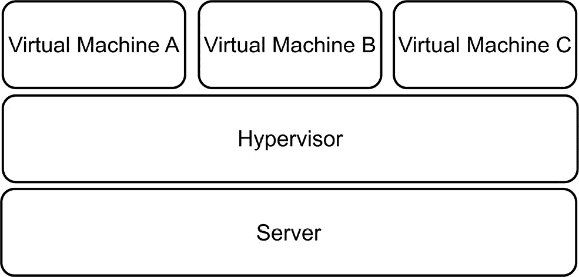
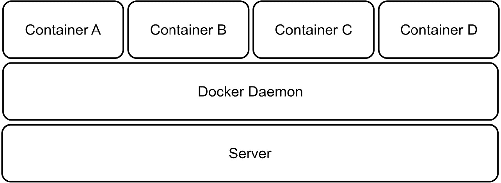
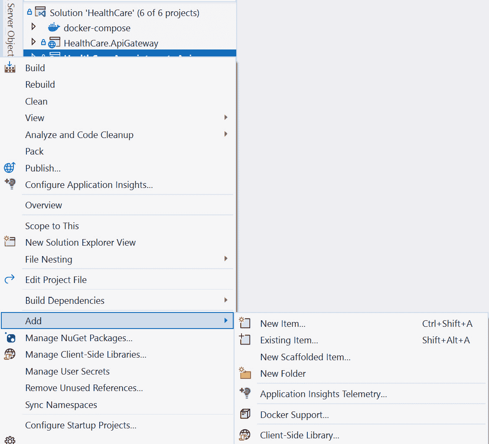
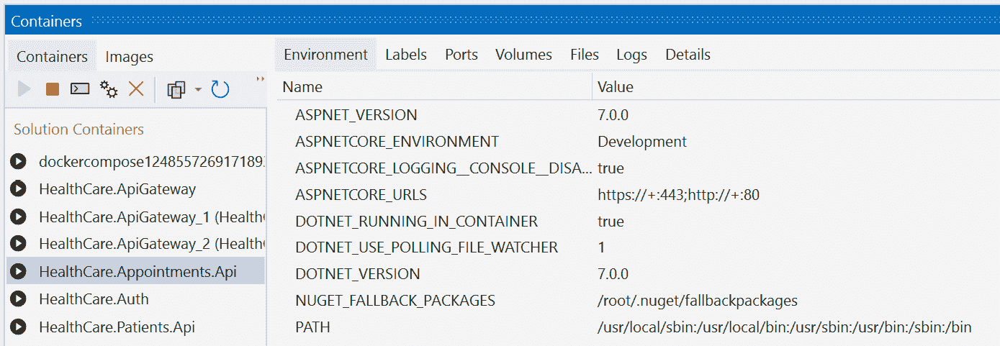
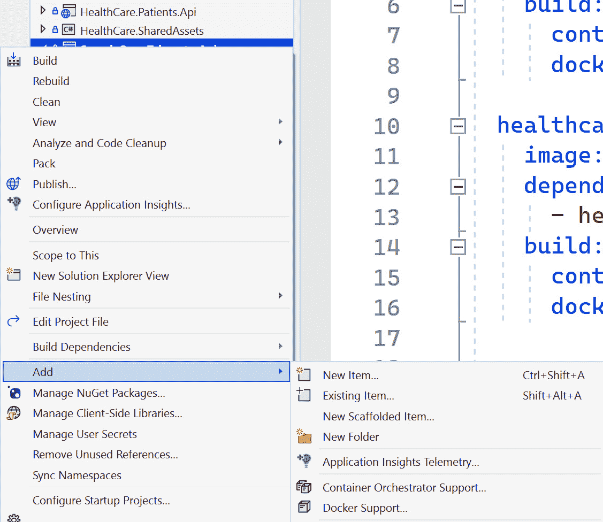

# 微服务容器托管

一旦我们完成了一定量的开发工作，我们接下来的主要关注点是**托管**。托管带来了一系列问题，因为有许多选项，而这些选项的优缺点与应用程序的架构和整体需求相关。

对于 Web 应用程序，典型的托管选项可能是一个简单的服务器，以及通过 IP 地址或域名进入该服务器的单一入口点。现在，我们正在构建一个微服务应用程序，我们引以为豪的是我们可以促进松散耦合，并且我们的应用程序的所有部分都可以独立运行，无需直接依赖彼此。现在的挑战是如何满足一个可能异构的应用程序。每个服务都是独立的，可能具有不同的托管和数据库需求。然后我们需要考虑为每种技术创建特定的托管环境，这可能导致巨大的成本影响。

这正是我们可以利用容器托管技术并最小化拥有多台服务器机器的成本超支的地方。我们可以使用容器作为每个正在使用的微服务架构中技术和数据库的最小托管要求的缩小版模仿，并且我们可以配置端点，通过这些端点可以访问每个容器。

在本章中，我们将回顾容器的工作原理，它们如何为我们带来好处，以及为什么它们是高效托管微服务应用程序的必备工具。

我们将涵盖以下主题：

+   理解 Docker 和容器的作用

+   学习如何使用 Dockerfile 和命令

+   学习如何使用`docker-compose`并编排 Docker 镜像

+   学习如何在容器中部署微服务应用程序并将其部署到容器注册库

# 技术要求

本章中使用的代码参考可以在 GitHub 上的项目仓库中找到，网址为：[`github.com/PacktPublishing/Microservices-Design-Patterns-in-.NET/tree/master/Ch13`](https://github.com/PacktPublishing/Microservices-Design-Patterns-in-.NET/tree/master/Ch13)。

# 在微服务开发中使用容器

容器在开发领域非常流行。它们为我们提供了一个轻量级的应用程序托管选项，使我们能够以干净和可重复的方式部署我们的应用程序。虽然它们不是新事物，但近年来在更商业化和易于访问的空间中的应用使得它们变得更加流行。然而，什么是容器，我们为什么应该关心它是如何工作的呢？让我们在下一节中回顾一下。

## 容器能为我做什么？

从传统意义上讲，每当我们的应用程序对环境和软件有特定要求时，我们就会求助于使用服务器来满足这些要求。服务器和每个应用程序的服务器的问题是它们带有成本。服务器机器通常不便宜，而且当我们引入新机器时，我们还必须考虑许可和能源成本。此外，考虑到如果一台机器出现故障，我们需要重新配置该机器以符合原始环境规格，并重新配置原始部署的几个方面。

在这一点上，我们开始考虑虚拟化。这意味着我们现在使用**虚拟机**（**VMs**）来构建新服务器并重用旧基础设施。这将大大减少物理基础设施需求和成本，并使我们更容易扩展机器人。我们还可以使用机器的快照来在失败时保持一个快速的恢复计划。市场上有多款虚拟化解决方案，包括流行的如**VMware、VirtualBox 和 Microsoft Hyper-V**。

*图 13.1* 展示了一台服务器上有多个虚拟机：



图 13.1 – 一台机器需要支持在虚拟机管理程序上运行多个虚拟机

这种可视化方法看起来像是我们需要的那根救命稻草，但我们发现这个解决方案还有更多问题，如下所示：

+   我们仍然需要考虑我们需要非常强大的机器来处理多个虚拟机

+   我们仍然需要进行手动维护任务，以保持我们的环境和操作系统更新和安全

+   我们必须记住，在几种情况下，我们试图在不同的安装上配置相同的环境，但每次都会遇到预料之外的不同

+   我们不能总是依赖机器环境与每个实例保持一致

现在，这带我们来到了这个问题的最新解决方案，即容器。容器建立在为我们提供的虚拟机（VMs）的概念之上，使我们能够减少应用程序可能需要的整体空间和资源需求。使用容器来托管我们的应用程序被称为**容器化**——这是一种现代软件开发方法，允许我们将应用程序及其所有依赖项打包，创建一个可重复、可测试和可靠的包，称为**镜像**。然后，这个镜像可以直接以一致的方式部署到多个地方。

这种一致性对于我们在容器和虚拟机之间区分容器的好处非常重要。我们刚刚回顾了，我们并不能总是确信服务器或虚拟机的每个**操作系统**（**OS**）实例都是相同的。容器去除了我们在部署过程中所面临的许多变量，并为需要部署的应用程序提供了一个专门调优的环境。

*图 13.2* 展示了一个服务器上有几个容器和应用程序：



图 13.2 – 一台机器可以托管多个容器应用程序并更好地利用其资源

另一个好处，如*图 13.2* 所示，是我们现在可以最大化物理服务器的资源利用率，因为我们不再需要为整个操作系统的实例提供固定数量的 RAM、CPU 和存储。

容器还可以在共享操作系统上相互隔离，因此我们无需担心容器之间的异构需求。用简单的话说，在 Linux 环境中运行一个容器的同时，也可以运行需要基于 Windows 环境的容器。使用容器可以使我们的应用程序更具有可扩展性和可靠性。我们可以根据需要轻松地配置新的容器实例，并运行多个相同的实例。

使用需要相互通信的虚拟机存在一个主要的安全风险。它们生成包含关于正在交换的数据及其交换方式非常敏感信息的元数据文件。有了这些信息，攻击者可能会试图重放操作并在其中插入恶意信息。容器不会转移这种风险，并将以更安全的方式支持容器间的通信。

容器并不新鲜，但它们正变得越来越流行，用于托管消费者应用程序中的隔离操作并提高部署到较不强大机器上的应用程序的效率。要使用容器，我们需要一个容器托管解决方案，如 Docker。我们将在下一节中回顾如何开始使用 Docker 和容器。

## 理解 Docker

在我们深入探讨 Docker 及其工作原理之前，值得注意的是，Docker 并不是唯一处理容器化的应用程序。有几个遵循相同**开放容器倡议**（**OCI**）标准的替代方案，允许我们容器化我们的应用程序。然而，Docker 革命性地推动了容器化进入主流领域和曝光。它是一个免费（用于开发和开源）的应用程序，可在跨平台上使用，并允许我们通过**用户界面**（**UI**）或**命令行界面**（**CLI**）对容器进行版本控制并管理多个容器实例。

Docker 的引擎采用客户端-服务器实现风格，客户端和服务器都运行在同一硬件上。客户端是一个命令行界面（CLI），它通过 REST API 与服务器交互，发送指令并执行功能。Docker 服务器是一个后台任务，或称为守护进程，称为`dockerd`。它负责跟踪我们容器的生命周期。我们还需要创建和配置一些对象来支持部署。这些对象可以是网络、存储卷和插件等，仅举几例。我们会根据具体情况创建这些对象，并在需要时部署它们。

因此，让我们简要回顾一下。容器是一个自包含的空间，一次可以容纳一个应用程序。容器环境及其依赖的定义被称为镜像。这个镜像是一致的蓝图，描述了环境需要呈现的样子。为多个第三方应用程序也存在镜像，这使得我们能够轻松启动实例。拥有一个中央镜像仓库是件好事，Docker 正是出于这个原因提供了*Docker Hub*。

Docker Hub 是一个容器注册库，用于存储和分发容器镜像。我们可以用它来托管自己的镜像，并且有一个公共空间，用于存储和共享行业领先应用程序的通用和共享镜像。注意——Docker Hub 不是唯一的注册库。还有其他替代方案，例如微软的**Azure Container Registry**（**ACR**），它允许我们与其他 Azure 服务更无缝地集成。

我们已经多次提到了容器镜像。让我们在下一节中更详细地讨论它们。

## 理解容器镜像

如前所述，容器镜像是一个容器内容的蓝图。它是一个可携带的包，表现为容器的一个内存实例。一个关键特性是镜像不可变。一旦我们定义了镜像，它就不能被更改。基于该镜像或该镜像特定版本的每个容器都将相同。这有助于我们保证在开发和预发布环境中工作过的环境将在生产环境中存在。在部署过程中，我们不再需要“在我的机器上它工作过”的借口。

基础镜像是一个作为其他镜像基础的镜像。它从 Docker 的 scratch 镜像开始，这是一个不创建文件系统层的空容器镜像。这意味着该镜像假定我们将运行的应用程序将直接从操作系统的内核运行。

父镜像是一个作为其他镜像基础镜像的容器镜像。它通常基于操作系统，并将托管一个设计在操作系统上运行的应用程序。例如，我们可能在我们的机器上需要一个 Redis 缓存实例。这个 Redis 缓存镜像将基于 Linux。这就是父镜像。

在这两种情况下，镜像都是可重用的，但基础镜像使我们能够对最终镜像有更多的控制。我们总是可以向镜像中添加内容，但不能从中删除，因为镜像是不可变的。

Docker Hub 是一个可靠的、安全的容器镜像注册中心，其中包含流行的和需求量大的容器镜像，可以轻松地拉取到您的机器上。Docker CLI 提供了与 Docker Hub 的直接连接，通过几个命令，我们可以将镜像从执行它的主机机器上拉取。

如果我们要设置一个 Redis 缓存容器，我们可以通过几个简单的步骤来完成。首先，我们应该在我们的设备上安装 Docker，您可以从[www.docker.com](https://www.docker.com)获取。一旦安装完成，我们就可以在我们的命令行界面中运行以下命令：

```cs
docker pull redis
```

这将从 Docker Hub 注册中心拉取最新的 Redis 缓存应用程序镜像，并在您的机器上创建一个容器。现在我们有了镜像，我们可以使用`docker run`命令根据镜像创建一个容器：

```cs
docker run --name my-redis-container -d redis
```

现在，我们已经在主机机器上运行了一个 Redis 缓存实例，我们可以使用任何 Redis 缓存管理工具进行连接。当我们不再需要这个容器运行时，我们可以简单地使用`docker stop`命令，如下所示：

```cs
docker stop my-redis-container
```

现在，这是一个我们可以快速为第三方应用程序创建优化环境的例子，但我们使用 Docker 的主要原因之一是我们可以为我们的应用程序提供容器。在我们探索如何做到这一点之前，我们应该寻求欣赏使用容器的优缺点。我们将在下一部分查看这些内容。

## 容器的优缺点

在我们的应用程序中使用容器化的好处是显而易见的。我们可以利用管理我们的托管环境，软件交付的一致性，更有效地使用系统资源，以及软件的可移植性。

回想一下，容器将仅需要托管应用程序运行所需的精确资源。这意味着我们可以放心，我们不会过度扩展或过度配置资源以适应容器。我们还可以从需要时快速启动新容器的好处中受益。如果我们使用虚拟机，那么每个应用程序可能需要一个完整的机器实例。容器具有更小的占用空间，并且需要更少的资源来托管新的应用程序。

在所有这些优点中，我们需要意识到使用这种托管和部署方法的潜在缺点。容器将共享单个操作系统，这种共享依赖性意味着我们现在有一个单一的故障点或攻击点。这对安全团队来说可能是个问题。由于我们可操作的内容较少，监控我们的应用程序也变得稍微困难一些。容器通常提供日志信息，以让我们了解应用程序的健康状况，但我们并不总是了解正在工作的额外资源和插件，这使得全面的监控操作变得稍微困难一些。

如果我们决定在应用程序中使用容器化，我们需要熟悉如何编写用于仅托管我们的应用程序的镜像。在这种情况下，我们需要了解并理解如何使用基础镜像并将我们的应用程序部署到新的容器中。为此，我们需要一个 Dockerfile，我们将回顾如何创建一个。

# 编写 Dockerfile

**Dockerfile** 是一个文本文件，概述了如何构建 Docker 镜像。使用的语言是 **另一种标记语言** (**YAML**)，这是一种流行的用于配置文件的标记语言。此文件通常包含以下元素：

+   基础或父镜像，用于构建新镜像

+   根据需要更新操作系统和额外的软件和插件

+   将编译的应用程序资产包含在镜像中

+   为存储和网络需求提供额外的容器镜像资产

+   当容器启动时运行应用程序的命令

在我们的案例中，我们正在构建一个基于微服务的应用程序，包含多个 Web 服务。这意味着我们需要为每个 Web 服务编写 Dockerfile。由于所有我们的服务都是基于 ASP.NET Core 的，我们可以使用以下 Dockerfile 的示例作为我们的预约 Web 服务和其他服务的基例。

要将 Dockerfile 添加到我们的项目中，我们可以使用 **Visual Studio**，只需在 **解决方案资源管理器** 中右键单击我们的项目，转到 **添加**，然后点击 **Docker 支持…**。

*图 13.3* 展示了 **Docker 支持…** 选项：



图 13.3 – 在 Visual Studio 2022 中添加 Docker 支持

在 `docker-compose` 支持中。一旦我们完成选项的选择，它将开始生成我们的文件。

这两个路径将在目标项目中产生两个新文件。我们得到一个 Dockerfile 和一个`.dockerignore`文件。在预约预订服务项目的情况下，如果我们完成前面的步骤，我们将得到一个看起来像这样的 Dockerfile：

```cs
FROM mcr.microsoft.com/dotnet/aspnet:6.0 AS base
WORKDIR /app
EXPOSE 80
EXPOSE 443
FROM mcr.microsoft.com/dotnet/sdk:6.0 AS build
WORKDIR /src
COPY ["HealthCare.Appointments.Api/HealthCare.Appointments.Api.c
  sproj", "HealthCare.Appointments.Api/"]
COPY ["HealthCare.SharedAssets/HealthCare.SharedAssets.csproj",
  "HealthCare.SharedAssets/"]
RUN dotnet restore "HealthCare.Appointments.Api
  /HealthCare.Appointments.Api.csproj"
COPY . .
WORKDIR "/src/HealthCare.Appointments.Api"
RUN dotnet build "HealthCare.Appointments.Api.csproj" -c
  Release -o /app/build
FROM build AS publish
RUN dotnet publish "HealthCare.Appointments.Api.csproj" -c
  Release -o /app/publish /p:UseAppHost=false
FROM base AS final
WORKDIR /app
COPY --from=publish /app/publish .
ENTRYPOINT ["dotnet", "HealthCare.Appointments.Api.dll"]
```

此 Dockerfile 包含创建目标服务镜像和构建容器的指令。这些指令执行以下操作：

1.  使用 `mcr.microsoft.com/dotnet/aspnet:6.0` 镜像作为基础，我们将从中派生其余的新镜像。

1.  定义我们希望从容器中公开的端口，这些是标准 Web 流量端口，即 HTTP (`80`) 和 HTTPS (`443`)。

1.  通过复制我们为应用程序所需的键文件和目录的内容，在镜像中定义我们自己的内容。

1.  执行 *构建*、*还原* 和 *发布* 操作以生成二进制文件，发布操作完成后，运行并从 `发布` 目录复制文件到容器空间。

1.  将 *ENTRYPOINT* 定义为启动我们的应用程序的项目执行二进制文件。

我们还得到一个`.dockerignore`文件，概述了在创建容器时不应包含的文件和目录。其内容如下：

```cs
**/.classpath
**/.dockerignore
**/.env
**/.git
**/.gitignore
**/.project
**/.settings
**/.toolstarget
**/.vs
**/.vscode
**/*.*proj.user
**/*.dbmdl
**/*.jfm
**/azds.yaml
**/bin
**/charts
**/docker-compose*
**/Dockerfile*
**/node_modules
**/npm-debug.log
**/obj
**/secrets.dev.yaml
**/values.dev.yaml
LICENSE
README.md
```

这个文件很容易理解，通常不需要修改。它只是概述了项目文件组成的不同区域，一旦应用程序构建和部署，它认为不需要将这些区域传输到容器中。

我们的 Dockerfile 是我们自己的容器的起点，该容器将容纳目标 Web 服务。为了回顾一下容器是如何构建的，我们从一个*注册表*开始，这个注册表包含*镜像*。在这个镜像集中，我们有基础镜像，它们是所有后续镜像的起点。在这种情况下，我们的第一行引用了一个基础镜像，我们希望从中派生出我们的 Web 服务容器。请注意，我们通过这个过程看不到最终使用的基础镜像的来源和基础镜像。事实是，我们不知道`mcr.microsoft.com/dotnet/aspnet:6.0`基础镜像背后的层次结构，也不知道这些镜像的层次结构。这种方法帮助我们利用对当前基础镜像做出贡献的各种镜像，而无需直接引用它们或使文件因引用而膨胀。我们只是简单地创建了自己的衍生版本。这与保持我们的容器镜像小的目标是一致的。

现在，让我们探索如何继续使用这个 Dockerfile。

## 启动容器化应用程序

现在我们已经为我们的一个服务完成了这个过程，我们可以轻松地为其他服务重复它。通过这样做，我们将完全成功地容器化每个 Web 服务，以及我们的微服务应用程序。值得注意的是，Visual Studio 和 Visual Studio Code 将始终生成最适合你正在使用的项目类型的最佳 Dockerfile。现在我们还可以享受新引入的启动功能，其中我们可以在一个 Docker 容器中启动我们的新容器化 Web 服务，并且仍然保留实时分析和调试功能，就像它在正常调试设置中运行一样。

在`属性`中，打开名为`launchSettings.json`的文件。这是一个 JSON 配置文件，它是每个 ASP.NET Core 项目中的标准配置文件，除非你有特殊原因，否则你通常不会打开或修改此文件。然而，它已被修改并赋予了一个新的启动配置文件，该配置文件通知*Visual Studio*有新的方式来启动此应用程序进行调试。文件现在看起来是这样的：

```cs
  "profiles": {
    "HealthCare.Appointments.Api": {
    // Unchanged Content
    },
    "IIS Express": {
     // Unchanged Content
      }
    },
    "Docker": {
      "commandName": "Docker",
      "launchBrowser": true,
      "launchUrl": "{Scheme}://{ServiceHost}:{ServicePort}
         /swagger",
      "publishAllPorts": true,
      "useSSL": true
    }
  },
```

这个新的`Docker`部分是在我们介绍 Dockerfile 时创建的，现在它允许我们从 Visual Studio 中选择**Docker**作为启动选项。这将执行 Dockerfile 中概述的指令，其中将基于基础 Microsoft 镜像创建一个新的镜像，构建、恢复并发布我们的 Web 项目，然后将文件移动到新创建的容器中并执行应用程序。

在这个体验中，我们将看到的唯一主要区别是，Visual Studio 或 Visual Studio Code 中的 UI 将显示有关容器的更多信息，例如它们的健康状态、版本、端口、环境变量、日志，甚至是容器正在使用的文件系统。

*图 13.4*显示了使用 Docker 进行调试时的 Visual Studio UI：



图 13.4 – 当容器在使用时，我们看到处于调试模式的 Visual Studio；它显示了容器在运行时的信息

当我们使用 Docker 容器进行调试时，你可能会注意到 Docker 的**图形用户界面**（**GUI**）中的容器，它们显示了可用于 HTTP 流量的端口。我们将使用这些端口来相应地处理配置的端口映射。如果你想通过 CLI 查看正在运行的容器，可以运行以下命令：

```cs
docker ps -a
```

这将生成一个容器列表，显示它们的名称、端口和状态。Docker 有几个命令可以帮助我们自动化容器操作，例如以下命令：

+   `docker run`启动或创建一个容器。它接受一个`-d`参数，这是要启动的容器的名称。

+   `docker pause`将暂停正在运行的容器并挂起所有服务和活动。

+   `docker unpause`与`docker pause`相反。

+   `docker restart`封装了停止和启动命令，并将重新启动容器。

+   `docker stop`向容器及其内部运行的进程发送终止信号。

+   `docker rm`删除容器及其所有相关数据。

这里值得注意的神奇之处在于，使用容器使我们的应用程序变得极其便携和可部署。现在，我们不需要在服务器上进行特殊配置，从而降低一个服务器行为与其他服务器不同的风险。我们可以更容易地通过容器在任何机器上部署相同的环境，并且我们可以始终期待相同的输出。

到.NET 7 为止，我们可以无需 Dockerfile 即可容器化我们的应用程序。我们将回顾可以完成的下一步步骤。

## 使用本机.NET 容器支持

在.NET 7 中，我们原生支持容器化。这意味着我们可以使用.NET 包将容器支持添加到我们的应用程序中，然后直接将应用程序发布到容器中，而无需使用 Docker。

容器支持通过`Microsoft.NET.Build.Containers`包提供。我们可以使用以下命令添加此包：

```cs
Install-package Microsoft.NET.Build.Containers
```

现在我们已经添加了包，我们可以将应用程序发布到容器中，然后使用 Docker 运行已发布的应用程序。使用 CLI，我们可以运行以下命令：

```cs
dotnet publish --os linux --arch x64 -c Release -
  p:PublishProfile=DefaultContainer
docker run -it --rm -p 5010:80 healthcare-patients-
  api:1.0.0
```

现在，我们的自托管容器将运行并监听配置的`5010`端口。

现在我们看到，我们有几种方法可以引导我们容器化我们的应用程序，我们为所有其他服务都这样做。然而，这却带来了一个新的挑战，我们可能需要以特定的顺序启动我们的容器化网络服务，或者使用默认值和设置。为此，我们需要一个编排器。我们之前已经提到了编排器，即 Kubernetes，它是 Docker 镜像（隐喻的手）的行业领先隐喻手套，以便与之匹配。

在我们到达 Kubernetes 之前，Docker 提供了一个由 `docker-compose` 文件中概述的指令定义的编排引擎。我们将在下一节中探讨它是如何工作的。

# 理解 docker-compose 和镜像

在我们探索 `docker-compose` 以及它是如何编译我们的镜像之前，我们需要了解编排的概念以及为什么我们需要它。容器编排是一种自动化的方法，用于启动容器及其相关服务。在上下文中，当我们有一个容器化的应用程序时，我们可能会在我们的容器化应用程序和第三方应用程序之间得到几个容器。

在我们的微服务应用程序的上下文中，我们拥有几个独立的服务，每个服务都是容器化的。我们也可能最终会使用一个容器化的缓存服务器，以及其他支持服务，如电子邮件和日志应用程序。我们现在需要一种方法来组织我们的容器列表，并按特定顺序启动它们，以确保在启动依赖服务容器之前，支持应用程序是可用的。

这个要求引入了相当多的复杂性，可能会使手动操作变得非常困难。使用容器编排，我们可以使这项操作对开发和运维变得可管理。我们现在有了定义需要完成的工作以及容器应启动的顺序及其依赖关系的声明式方法。现在我们将有以下几点：

+   **简化操作**：重申一下，容器编排极大地简化了以特定顺序和配置启动容器的重复性工作。

+   **弹性**：可以根据容器健康、系统负载或扩展需求执行我们的特定操作。编排将根据需要管理我们的实例，并自动化应采取的最佳利益行动，以确保应用程序的稳定性。

+   **安全性**：这种自动化方法有助于我们减少人为错误的可能性，并确保我们应用程序的安全性。

`docker-compose`是我们能采用的 simplest 形式的编排。其他选择包括 Kubernetes 和 Docker Swarm，它们是容器编排领域的行业领先选项。

`docker-compose` 是一个帮助我们定义多容器应用程序的工具。我们可以定义一个 YAML 文件，并定义需要启动的容器及其依赖项，然后我们可以使用单个命令启动应用程序。`docker-compose` 的主要优点是我们可以在一个文件中定义关于我们应用程序堆栈的所有内容，并在应用程序文件夹的根目录中定义它。

这里另一个优点是，如果我们的项目是版本控制的，我们可以轻松地允许通过外部贡献来演变此文件，或者我们可以轻松地与他人共享我们的容器以及我们的应用程序的启动步骤。

现在，让我们回顾一下将 `docker-compose` 支持添加到我们的微服务应用程序的步骤。

## 将 docker-compose 添加到项目

将 `docker-compose` 支持添加到我们的 ASP.NET Core 微服务应用程序非常简单。在 Visual Studio 中，我们可以简单地右键单击我们的服务项目之一，转到 **添加**，然后选择 **容器编排器支持…**。这会打开一个窗口，我们可以确认我们更喜欢 **Docker Compose** 并选择 **确定**。我们可以选择 **Windows** 或 **Linux** 作为目标操作系统。由于 ASP.NET Core 是跨平台的，所以任何操作系统选项都可以工作。

*图 13.5* 显示了 **容器编排器支持…** 选项：



图 13.5 – 使用 Visual Studio 2022 添加容器编排器支持

这在我们的解决方案中引入了一个新的项目，其中包含一个 `.dockerignore` 文件和一个 `docker-compose.yml` 文件。如果我们检查 `docker-compose.yml` 文件，我们会看到我们有一个版本号和至少一个服务定义：

```cs
version: '3.4'
services:
  healthcare.patients.api:
    image: ${DOCKER_REGISTRY-}healthcarepatientsapi
    build:
      context: .
      dockerfile: HealthCare.Patients.Api/Dockerfile
```

在我们服务的定义下，我们定义了我们希望启动的容器，并声明了图像的名称和 Dockerfile，它将是图像定义的参考点。按照对其他服务的类似步骤，Visual Studio 将自动根据需要将额外的服务附加到文件中。如果我们继续对额外的服务执行此操作，我们将得到一个像这样的 `docker-compose` 文件：

```cs
version: '3.4'
services:
  healthcare.patients.api:
    image: ${DOCKER_REGISTRY-}healthcarepatientsapi
    build:
      context: .
      dockerfile: HealthCare.Patients.Api/Dockerfile
  healthcare.auth:
    image: ${DOCKER_REGISTRY-}healthcareauth
    build:
      context: .
      dockerfile: HealthCare.Auth/Dockerfile
  healthcare.appointments.api:
    image: ${DOCKER_REGISTRY-}healthcareappointmentsapi
    build:
      context: .
      dockerfile: HealthCare.Appointments.Api/Dockerfile
  healthcare.apigateway:
    image: ${DOCKER_REGISTRY-}healthcareapigateway
    build:
      context: .
      dockerfile: HealthCare.ApiGateway/Dockerfile
```

现在，我们有一个 `docker-compose` 文件，它记录了在我们的微服务应用程序中需要启动的每个容器。现在，我们可以根据整个应用程序的需求扩展此文件以包含额外的容器。如果我们需要一个 Redis 缓存实例，我们可以在 `docker-compose` 文件中添加一个命令来启动 Redis 容器。这将是它的样子：

```cs
services:
  redis:
    image: "redis:alpine"
… Other services …
```

此文件添加将简单地启动一个使用定义的基础镜像的 Redis 缓存容器。请注意，Redis 缓存图像组合可以扩展以使用存储卷，我们可以将特定的配置文件传递给我们的图像，并指示我们希望在数据卷中持久化容器的信息。当我们重新启动此图像时，上一次运行的数据仍然可用。

我们还可能想要指出，某些容器应该在其他容器启动之前可用。如果容器依赖于 Redis 缓存容器或另一个服务，这可能很有用。为此，我们可以添加另一个节点`depends_on`，这将允许我们指示在尝试启动其他容器之前应该启动的容器名称。例如，我们的预约服务时不时地与我们的患者服务进行通信。我们确保在尝试启动预约服务之前启动患者服务是明智的。我们可以修改预约容器的编排，使其看起来像这样：

```cs
healthcare.appointments.api:
    image: ${DOCKER_REGISTRY-}healthcareappointmentsapi
    depends_on:
      - healthcare.patients.api
    build:
      context: .
      dockerfile: HealthCare.Appointments.Api/Dockerfile
```

我们可以为每个镜像提供更具体的配置，甚至为我们的镜像提供更具体的配置，而无需直接重复执行 Dockerfile。这正是`docker-compose.override.yml`文件发挥作用的地方。它是一个嵌套的子项，可以在`docker-compose.yml`文件下找到，其内容如下：

```cs
version: '3.4'
services:
  healthcare.patients.api:
    environment:
      - ASPNETCORE_ENVIRONMENT=Development
      - ASPNETCORE_URLS=https://+:443;http://+:80
    ports:
      - "80"
      - "443"
    volumes:
      - ${APPDATA}/Microsoft/UserSecrets:/root/.microsoft/
      usersecrets:ro
      - ${APPDATA}/ASP.NET/Https:/root/.aspnet/https:ro
... Other overrides...
```

在这里，我们可以看到我们的 API 容器将使用特定的环境变量启动，并具有预设的端口和卷。如果您更喜欢对容器有更明确的控制，可以删除此文件，但您需要确保在 Dockerfile 中配置了相关值。

为了回顾我们在上一章中提到的“后端为前端”模式，我们概述了我们可以配置多个网关项目并为每个实例提供特定的配置。现在有了容器化技术，我们可以移除对额外代码项目的需求，并重用相同的项目，同时为每个项目使用不同的配置。让我们向`docker-compose.yml`文件中添加以下行，并基于相同的网关镜像创建两个独立的容器：

```cs
  mobileshoppingapigw:
    image: ${DOCKER_REGISTRY-}healthcareapigateway
    build:
      context: .
      dockerfile: HealthCare.ApiGateway/Dockerfile
  webshoppingapigw:
    image: ${DOCKER_REGISTRY-}healthcareapigateway
    build:
      context: .
      dockerfile: HealthCare.ApiGateway/Dockerfile
```

现在我们已经基于相同的`ApiGateway`镜像定义创建了两个新的容器，我们可以向`docker-override.yml`文件中添加内容，并指定在两种情况下应使用的特定配置文件的来源：

```cs
  mobilegatewaygw:
    environment:
      - ASPNETCORE_ENVIRONMENT=Development
      - IdentityUrl=IDENTITY_URL
    volumes:
      - ./HealthCare.ApiGateway/mobile:/app/configuration
  webhealthcaregw:
    environment:
      - ASPNETCORE_ENVIRONMENT=Development
      - IdentityUrl=IDENTITY_URL
    volumes:
      - ./HealthCare.ApiGateway/web:/app/configuration
```

我们可以将卷源指定为配置文件的路径，但我们还利用这个机会定义了相对于配置的环境变量值，这些配置可能会变化或在容器创建时需要设置。

通常，我们还会考虑其他依赖项的需求，例如数据库服务器、消息总线提供者（如 RabbitMQ）、支持性 Web 服务和工具等。您的微服务应用的所有组件都可以容器化，并且容器可以根据需要直接相互引用。《docker-compose.yml》文件允许我们根据需要概述所有这些容器及其变量，我们可以轻松地插入相应的值。只需几行代码，我们就可以开始，但还有许多其他途径可以探索和掌握。

现在，我们可以轻松地通过一键或一条命令启动整个微服务应用程序及其所有组件。如果使用 Visual Studio，传统的开始调试按钮会一次引用一个服务的名称，或者我们需要启用多个项目以进行调试。现在，`docker-compose.yml`文件的存在取代了这种具体的需求，并赋予我们运行`compose`命令并一次性初始化所有容器的能力。使用 CLI，我们可以简单地运行`docker-compose up`。

现在，我们拥有一个完全容器化的应用程序，我们可以简单地调整用于启动容器的参数，从而在处理应用程序托管和部署时保持敏捷和可扩展。这也使得与我们的开发团队分享应用程序变得更加容易，团队成员只需安装 Docker 作为依赖项即可运行我们的应用程序。

我们还看到，有一些基础镜像允许我们扩展并创建自己的镜像。总有一天，我们会遇到特定的应用程序或我们自己的应用程序版本，我们希望将其保存并重新分享，而不仅仅是我们的项目。我们可以将我们的容器镜像发布到中央仓库。我们将在下一节中回顾这一概念。

# 将容器发布到容器注册库

**容器注册库**是一个集中存储多个容器的仓库。它允许远程访问这些容器，并在我们需要为某些应用程序提供一个一致的容器镜像源时，对于一般开发和部署需求非常有用。容器注册库通常直接连接到 Docker 和 Kubernetes 等平台。

注册库可以节省开发者在创建和交付云原生解决方案中的时间和精力。回想一下，容器镜像包含构成应用程序的文件和组件。通过维护注册库，我们可以最大化我们的敏捷开发努力，并有效地交付增量镜像更新，并且通过注册库，我们可以将它们存储在团队的中心区域。

容器注册库可以是私有的或公开的。我们将在下一节讨论我们的选项。

## 公开与私有容器注册库

注册库可以是公开的或私有的。公开仓库通常被开发者或开发者团队使用，他们要么希望尽快提供注册库，要么希望公开分享他们开发的容器。这些镜像随后被其他人用作基础镜像，有时会进行一些调整。这是为开源容器镜像集合做出贡献的绝佳方式。Docker Hub 是最大的公开仓库和容器社区，也是我们执行`docker pull`命令时的默认容器镜像源。

私有仓库提供了一种更安全和私密的方式来托管和维护企业容器。这些类型的仓库可以是远程的，通过如**Google Container Registry**（**GCR**）、Microsoft ACR 或 Amazon **Elastic Container Registry**（**ECR**）等已建立的仓库。

当使用私有容器仓库时，我们对安全和配置有更多的控制，但我们也承担了更多管理责任，包括在组织内部进行访问控制和合规性。我们需要维护以下内容：

+   在我们组织内部支持多种身份验证选项

+   **基于角色的访问控制**（**RBAC**）对镜像的支持

+   镜像版本控制和针对漏洞的维护

+   用户活动审计和日志记录

我们可以通过更严格的控制和措施来正确控制谁能够上传镜像，并防止对仓库的未授权访问和贡献。

请记住，容器仓库可以本地托管。这意味着我们可以在服务器上部署 Docker Hub 的本地实例，并添加针对我们组织需求和政策的特定配置。我们还可以利用云托管的容器仓库服务。使用云托管解决方案的优势在于，我们可以减少设置本地服务器时伴随的基础设施考虑，同时利用一个完全托管和地理复制的解决方案。

让我们回顾一下如何创建一个自定义版本的图片并将其上传到仓库。

## 创建和上传自定义图片

我们已经创建了几个镜像来支持我们的应用程序。有时我们可能需要将特定的应用程序以一致和可重复的方式部署，而我们不想冒重新创建 Dockerfile 或`docker-compose.yml`文件的风险。

在这种情况下，我们可以拉取基本镜像的副本，向其中添加我们自己的配置和变量，然后将带有新且唯一的名称的镜像推送到仓库。现在，其他团队成员——甚至你未来的项目——可以随意拉取这个新镜像，并根据需要利用预设的环境。为此练习，我们需要在 Docker Hub 上有一个账户。

让我们以一个 SQL Server 镜像为例。如果我们需要创建一个以默认数据库为起点的镜像，我们可以通过以下步骤完成。首先，我们使用以下命令从 Docker Hub 拉取基本镜像：

```cs
docker pull mcr.microsoft.com/mssql/server
```

SQL Server 镜像通常较大，因此下载可能需要一些时间。一旦下载完成，我们可以执行以下命令来运行容器：

```cs
docker run -e "ACCEPT_EULA=Y" -e
  "MSSQL_SA_PASSWORD=AStrongP@ssword1" -p 1434:1433 -d
    mcr.microsoft.com/mssql/server
```

第一个命令类似于我们之前看到的，即从我们的本地机器拉取镜像。然后我们运行镜像，基于最新的镜像版本创建 SQL Server 的实例，并通过端口`1434`使其可用。`1433`是 SQL Server 的默认端口，因此我们可以使用不同的端口以避免与其他可能存在的 SQL 实例发生冲突。我们还设置了默认的`*sa*`用户凭据，并接受使用条款协议。

现在我们已经从我们的镜像中启动并运行了 SQL Server 实例，我们可以使用 **SQL Server Management Studio** （**SSMS**）或 Microsoft Azure Studio 连接，然后运行一个脚本。我们将保持简单，创建一个数据库和一个表：

```cs
CREATE DATABASE PatientsDb
GO
USE PatientsDb
CREATE TABLE Patients(
    Id int primary key identity,
    FirstName varchar(50),
    LastName varchar(50),
    DateofBirth datetime
)
```

现在我们有了更新的数据库，让我们将更新的镜像提交到注册表中。我们可以使用 Docker UI 查看运行中的 SQL Server 容器的名称，或者使用 `docker ps` 命令，该命令将列出所有正在运行的容器。然后我们使用运行中的 SQL Server 容器的名称运行这个 `docker commit` 命令：

```cs
docker commit -m "Added Patients Database" -a "Your Name"
  adoring_boyd Username/NewImageName:latest
```

这将在容器当前状态下创建镜像的本地副本。我们添加一个 `commit` 消息，以便我们可以跟踪所做的更改，并添加一个作者标签，说明基于哪个容器的名称创建镜像，然后添加我们的 Docker Hub 用户名和新的镜像名称。现在，我们可以使用 Docker UI 并点击 `docker images` 命令来列出系统上当前的所有镜像。您现在将看到原始的 SQL Server 镜像以及我们最近提交的镜像。

现在，我们已经成功地将我们的镜像发布到了我们自己的本地注册表中。如果我们想使这个镜像在 Docker Hub 上可访问，我们需要使用 Docker UI 中可用的 **推送到 Hub** 选项。或者，我们可以运行以下命令：

```cs
docker push Username/NewImageName
```

在未来，如果我们需要将这个数据库镜像添加到我们的编排中，我们可以像这样修改我们的 `docker-compose.yml` 文件：

```cs
  patients_sql_db:
    image: Username/NewImageName
    restart: always
    ports:
      1434:1433
```

现在，我们将始终使用这个基础数据库启动 SQL Server 实例。

我们不仅容器化了我们的应用程序，还配置了编排并创建了我们的自定义镜像。让我们回顾一下本章所学到的所有内容。

# 摘要

在本章中，我们回顾了容器化的优缺点。我们看到了容器如何帮助我们减少应用程序的资源需求，并为开发和部署创建了这些应用程序的便携式版本。

Docker 是一个行业领先的容器化软件，拥有不断增长的贡献者社区。Docker 可以安装在机器上，然后根据需要用于管理镜像和容器。我们还将能够访问 Docker Hub，这是一个流行的公共镜像存储库。

当我们将 Docker 集成到我们的 ASP.NET Core 应用程序中时，我们为构建和托管自己的应用程序开辟了新的维度。我们现在可以保证我们的服务将以更一致的方式运行，无论它们部署在哪个机器上。这是因为我们将创建容器来托管我们的服务，这些容器将根据服务的需求进行优化，并且除非我们调整它们的定义，否则它们永远不会改变。

我们还研究了容器编排，这是我们可以在一个设置中概述所需的容器，并一次性启动它们，或者根据依赖关系以特定顺序启动。这对我们的微服务应用来说非常完美，因为我们的应用由多个服务和依赖关系组成，逐一启动会非常繁琐。

最后，我们回顾了如何创建自己的镜像并将其托管在本地容器注册库中。然后，我们可以将自定义镜像发布到公共注册库，如 Docker Hub，使其对所有用户可访问。现在，我们可以创建具有我们需要与团队共享的应用程序版本的特定容器，并且我们可以更好地控制分发和使用的容器版本。

在下一章中，我们将回顾应用开发中的一个主要横切关注点，即微服务中的日志聚合。
