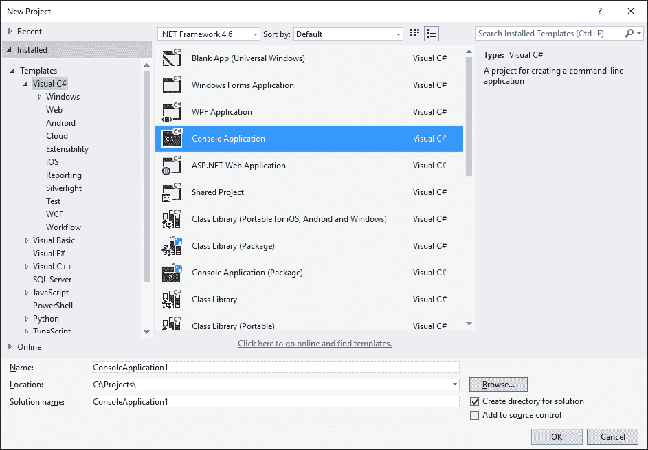

# 第一章. 线程基础

在本章中，我们将介绍使用 C# 中的线程的基本任务。您将学习以下食谱：

+   在 C# 中创建线程

+   暂停线程

+   使线程等待

+   终止线程

+   确定线程状态

+   线程优先级

+   前台和后台线程

+   向线程传递参数

+   使用 C# lock 关键字进行锁定

+   使用 `Monitor` 构造进行锁定

+   处理异常

# 简介

在过去的某个时刻，常见的计算机只有一个计算单元，不能同时执行多个计算任务。然而，操作系统已经能够同时处理多个程序，实现了多任务的概念。为了防止一个程序永远控制 CPU，导致其他应用程序和操作系统本身挂起，操作系统必须以某种方式将物理计算单元分割成几个虚拟化处理器，并给每个正在执行的程序分配一定量的计算能力。此外，操作系统必须始终具有对 CPU 的优先访问权，并且应该能够对不同程序进行 CPU 访问的优先级排序。线程是这个概念的实现。它可以被认为是一个分配给特定程序并独立运行的虚拟处理器。

### 注意

记住，线程消耗大量的操作系统资源。试图在许多线程之间共享一个物理处理器将导致操作系统忙于仅管理线程而不是运行程序。

因此，虽然可以增强计算机处理器，使其每秒执行更多命令，但通常与线程的交互是操作系统任务。在单核 CPU 上尝试并行计算某些任务是没有意义的，因为这会比顺序运行这些计算花费更多时间。然而，当处理器开始拥有更多计算核心时，旧程序无法利用这一点，因为它们只使用一个处理器核心。

为了有效地利用现代处理器的计算能力，能够以某种方式编写程序，使其能够使用多个计算核心，这导致将其组织为几个相互通信和同步的线程，这一点非常重要。

本章中的食谱专注于使用 C# 语言对线程执行一些非常基本的操作。我们将涵盖线程的生命周期，包括创建、挂起、使线程等待和终止线程，然后，我们将介绍基本同步技术。

# 在 C# 中创建线程

在接下来的食谱中，我们将使用 Visual Studio 2015 作为编写 C# 多线程程序的主要工具。本食谱将向您展示如何创建一个新的 C# 程序并在其中使用线程。

### 注意

可以从 Microsoft 网站下载免费的 Visual Studio Community 2015 IDE 并用于运行代码示例。

## 准备工作

要完成此食谱，您需要 Visual Studio 2015。没有其他先决条件。此食谱的源代码位于 `BookSamples\Chapter1\Recipe1` 目录中。

### 提示

**下载示例代码**

您可以从 [`www.packtpub.com`](http://www.packtpub.com) 的账户下载此书的示例代码文件。如果您在其他地方购买了此书，您可以访问 [`www.packtpub.com/support`](http://www.packtpub.com/support) 并注册以将文件直接通过电子邮件发送给您。

您可以通过以下步骤下载代码文件：

+   使用您的电子邮件地址和密码登录或注册我们的网站。

+   将鼠标指针悬停在顶部的 **支持** 选项卡上。

+   点击 **代码下载与勘误表**。

+   在 **搜索** 框中输入书籍名称。

+   选择您想要下载代码文件的书籍。

+   从下拉菜单中选择您购买此书的来源。

+   点击 **代码下载**。

文件下载完成后，请确保使用最新版本的以下软件解压或提取文件夹：

+   WinRAR/7-Zip for Windows

+   Zipeg/iZip / UnRarX for Mac

+   7-Zip/PeaZip for Linux

## 如何操作...

要了解如何在 C# 程序中创建新程序并使用线程，请按照以下步骤操作：

1.  启动 Visual Studio 2015。创建一个新的 C# 控制台应用程序项目。

1.  确保项目使用 .NET Framework 4.6 或更高版本；然而，本章中的代码也可以与之前的版本兼容。

1.  在 `Program.cs` 文件中添加以下 `using` 指令：

    ```cs
    using System;
    using System.Threading;
    using static System.Console;
    ```

1.  在 `Main` 方法下方添加以下代码片段：

    ```cs
    static void PrintNumbers()
    {
      WriteLine("Starting...");
      for (int i = 1; i < 10; i++)
      {
        WriteLine(i);
      }
    }
    ```

1.  在 `Main` 方法内部添加以下代码片段：

    ```cs
    Thread t = new Thread(PrintNumbers);
    t.Start();
    PrintNumbers();
    ```

1.  运行程序。输出将类似于以下截图：

## 工作原理...

在步骤 1 和 2 中，我们使用 .Net Framework 版本 4.0 创建了一个简单的 C# 控制台应用程序。然后，在步骤 3 中，我们包含了 `System.Threading` 命名空间，其中包含程序所需的所有类型。然后，我们使用了 C# 6.0 的 `using static` 功能，这使得我们可以使用 `System.Console` 类的静态方法而不需要指定类型名称。

### 注意

正在执行的程序实例可以称为进程。进程由一个或多个线程组成。这意味着当我们运行程序时，我们始终有一个主线程来执行程序代码。

在步骤 4 中，我们定义了 `PrintNumbers` 方法，该方法将在主线程和新创建的线程中使用。然后，在步骤 5 中，我们创建了一个运行 `PrintNumbers` 的线程。当我们构造线程时，会将 `ThreadStart` 或 `ParameterizedThreadStart` 委托的实例传递给构造函数。C# 编译器在后台创建此对象，当我们只是输入想要在另一个线程中运行的函数名称时。然后，我们启动一个线程，并在主线程中以常规方式运行 `PrintNumbers`。

结果，将会有两个从 1 到 10 的随机交叉的数字范围。这说明了`PrintNumbers`方法在主线程和其他线程上同时运行。

# 暂停线程

这个食谱将向你展示如何使线程等待一段时间而不浪费操作系统资源。

## 准备工作

为了完成这个食谱，你需要 Visual Studio 2015。没有其他先决条件。这个食谱的源代码可以在`BookSamples\Chapter1\Recipe2`中找到。

## 如何操作...

要理解如何在不浪费操作系统资源的情况下使线程等待，请执行以下步骤：

1.  启动 Visual Studio 2015。创建一个新的 C# 控制台应用程序项目。

1.  在`Program.cs`文件中，添加以下`using`指令：

    ```cs
    using System;
    using System.Threading;
    using static System.Console;
    using static System.Threading.Thread;
    ```

1.  在`Main`方法下方添加以下代码片段：

    ```cs
    static void PrintNumbers()
    {
      WriteLine("Starting...");
      for (int i = 1; i < 10; i++)
      {
        WriteLine(i);
      }
    }
    static void PrintNumbersWithDelay()
    {
      WriteLine("Starting...");
      for (int i = 1; i < 10; i++)
      {
        Sleep(TimeSpan.FromSeconds(2));
        WriteLine(i);
      }
    }
    ```

1.  在`Main`方法内部添加以下代码片段：

    ```cs
    Thread t = new Thread(PrintNumbersWithDelay);
    t.Start();
    PrintNumbers();
    ```

1.  运行程序。

## 它是如何工作的...

当程序运行时，它创建了一个线程，该线程将在`PrintNumbersWithDelay`方法中执行代码。紧接着，它运行`PrintNumbers`方法。这里的关键特性是在`PrintNumbersWithDelay`方法中添加了`Thread.Sleep`方法调用。这会导致执行此代码的线程在打印每个数字之前等待指定的时间（在我们的例子中是 2 秒）。当线程休眠时，它尽可能少地使用 CPU 时间。因此，我们将看到通常运行较晚的`PrintNumbers`方法中的代码将在单独的线程中先于`PrintNumbersWithDelay`方法中的代码执行。

# 使线程等待

这个食谱将向你展示程序如何等待另一个线程中的某些计算完成，以便稍后在代码中使用其结果。仅使用`Thread.Sleep`方法是不够的，因为我们不知道计算的确切时间。

## 准备工作

为了完成这个食谱，你需要 Visual Studio 2015。没有其他先决条件。这个食谱的源代码可以在`BookSamples\Chapter1\Recipe3`中找到。

## 如何操作...

为了理解程序如何等待另一个线程中的某些计算完成以便稍后使用其结果，请执行以下步骤：

1.  启动 Visual Studio 2015。创建一个新的 C# 控制台应用程序项目。

1.  在`Program.cs`文件中，添加以下`using`指令：

    ```cs
    using System;
    using System.Threading;
    using static System.Console;
    using static System.Threading.Thread;
    ```

1.  在`Main`方法下方添加以下代码片段：

    ```cs
    static void PrintNumbersWithDelay()
    {
      WriteLine("Starting...");
      for (int i = 1; i < 10; i++)
      {
        Sleep(TimeSpan.FromSeconds(2));
        WriteLine(i);
      }
    }
    ```

1.  在`Main`方法内部添加以下代码片段：

    ```cs
    WriteLine("Starting...");
    Thread t = new Thread(PrintNumbersWithDelay);
    t.Start();
    t.Join();
    WriteLine("Thread completed");
    ```

1.  运行程序。

## 它是如何工作的...

当程序运行时，它运行一个长时间运行的线程，打印数字并等待两秒钟后再打印每个数字。但是，在主程序中，我们调用了 `t.Join` 方法，这允许我们等待线程 `t` 完成工作。当它完成时，主程序继续运行。借助这种技术，可以在两个线程之间同步执行步骤。第一个线程会等待另一个线程完成，然后继续工作。当第一个线程等待时，它处于 `blocked` 状态（就像在之前的菜谱中调用 `Thread.Sleep` 时一样）。

# 终止线程

在这个菜谱中，我们将描述如何终止另一个线程的执行。

## 准备工作

要完成这个菜谱，你需要 Visual Studio 2015。没有其他先决条件。这个菜谱的源代码可以在 `BookSamples\Chapter1\Recipe4` 找到。

## 如何操作...

要了解如何终止另一个线程的执行，请执行以下步骤：

1.  启动 Visual Studio 2015。创建一个新的 C# 控制台应用程序项目。

1.  在 `Program.cs` 文件中，添加以下 `using` 指令：

    ```cs
    using System;
    using System.Threading;
    using static System.Console;
    ```

1.  使用静态 `System.Threading.Thread`，在 `Main` 方法下方添加以下代码片段：

    ```cs
    static void PrintNumbersWithDelay()
    {
      WriteLine("Starting...");
      for (int i = 1; i < 10; i++)
      {
        Sleep(TimeSpan.FromSeconds(2));
        WriteLine(i);
      }
    }
    ```

1.  在 `Main` 方法内部添加以下代码片段：

    ```cs
    WriteLine("Starting program...");
    Thread t = new Thread(PrintNumbersWithDelay);
    t.Start();
    Thread.Sleep(TimeSpan.FromSeconds(6));
    t.Abort();
    WriteLine("A thread has been aborted");
    Thread t = new Thread(PrintNumbers);
    t.Start();
    PrintNumbers();
    ```

1.  运行程序。

## 它是如何工作的...

当主程序和单独的数字打印线程运行时，我们等待六秒钟，然后在线程上调用 `t.Abort` 方法。这会将 `ThreadAbortException` 方法注入到线程中，导致其终止。这非常危险，通常因为这个异常可能在任何时刻发生，可能会完全破坏应用程序。此外，并不总是可以使用这种方法终止线程。目标线程可能会通过调用 `Thread.ResetAbort` 方法来处理这个异常，从而拒绝终止。因此，不建议使用 `Abort` 方法来关闭线程。有其他更推荐的方法，例如提供一个 `CancellationToken` 对象来取消线程执行。这种方法将在 第三章 *使用线程池* 中描述。

# 确定线程状态

这个菜谱将描述线程可能具有的可能状态。了解线程是否已启动或是否处于阻塞状态是有用的。请注意，由于线程是独立运行的，其状态可能在任何时候发生变化。

## 准备工作

要完成这个菜谱，你需要 Visual Studio 2015。没有其他先决条件。这个菜谱的源代码可以在 `BookSamples\Chapter1\Recipe5` 找到。

## 如何操作...

要了解如何确定线程状态并获取有关它的有用信息，请执行以下步骤：

1.  启动 Visual Studio 2015。创建一个新的 C# 控制台应用程序项目。

1.  在 `Program.cs` 文件中，添加以下 `using` 指令：

    ```cs
    using System;
    using System.Threading;
    using static System.Console;
    using static System.Threading.Thread;
    ```

1.  在 `Main` 方法下方添加以下代码片段：

    ```cs
    static void DoNothing()
    {
      Sleep(TimeSpan.FromSeconds(2));
    }

    static void PrintNumbersWithStatus()
    {
      WriteLine("Starting...");
      WriteLine(CurrentThread.ThreadState.ToString());
      for (int i = 1; i < 10; i++)
      {
        Sleep(TimeSpan.FromSeconds(2));
        WriteLine(i);
      }
    }
    ```

1.  在 `Main` 方法内部添加以下代码片段：

    ```cs
    WriteLine("Starting program...");
    Thread t = new Thread(PrintNumbersWithStatus);
    Thread t2 = new Thread(DoNothing);
    WriteLine(t.ThreadState.ToString());
    t2.Start();
    t.Start();
    for (int i = 1; i < 30; i++)
    {
      WriteLine(t.ThreadState.ToString());
    }
    Sleep(TimeSpan.FromSeconds(6));
    t.Abort();
    WriteLine("A thread has been aborted");
    WriteLine(t.ThreadState.ToString());
    WriteLine(t2.ThreadState.ToString());
    ```

1.  运行程序。

## 它是如何工作的...

当主程序启动时，它定义了两个不同的线程；其中一个将被终止，而另一个将成功运行。线程状态位于 `Thread` 对象的 `ThreadState` 属性中，这是一个 C# 枚举。一开始，线程处于 `ThreadState.Unstarted` 状态。然后，我们运行它，并假设在 30 次循环迭代的过程中，线程的状态将从 `ThreadState.Running` 变为 `ThreadState.WaitSleepJoin`。

### 小贴士

注意，当前的 `Thread` 对象始终可以通过 `Thread.CurrentThread` 静态属性访问。

如果没有发生这种情况，只需增加迭代次数。然后，我们终止第一个线程，并看到现在它处于 `ThreadState.Aborted` 状态。程序也可能打印出 `ThreadState.AbortRequested` 状态。这很好地说明了同步两个线程的复杂性。请记住，你不应该在程序中使用线程终止。这里只是为了展示相应的线程状态。

最后，我们可以看到我们的第二个线程 `t2` 成功完成，并且现在处于 `ThreadState.Stopped` 状态。还有其他几种状态，但它们部分已弃用，不如我们检查的那些状态有用。

# 线程优先级

这个菜谱将描述线程优先级的不同选项。设置线程优先级决定了线程将获得多少 CPU 时间。

## 准备工作

要完成这个菜谱，你需要 Visual Studio 2015。没有其他先决条件。这个菜谱的源代码可以在 `BookSamples\Chapter1\Recipe6` 找到。

## 如何完成...

要理解线程优先级的工作原理，请执行以下步骤：

1.  启动 Visual Studio 2015。创建一个新的 C# 控制台应用程序项目。

1.  在 `Program.cs` 文件中添加以下 `using` 指令：

    ```cs
    using System;
    using System.Threading;
    using static System.Console;
    using static System.Threading.Thread;
    using static System.Diagnostics.Process;
    ```

1.  在 `Main` 方法下方添加以下代码片段：

    ```cs
    static void RunThreads()
    {
      var sample = new ThreadSample();

      var threadOne = new Thread(sample.CountNumbers);
      threadOne.Name = "ThreadOne";
      var threadTwo = new Thread(sample.CountNumbers);
      threadTwo.Name = "ThreadTwo";

      threadOne.Priority = ThreadPriority.Highest;
      threadTwo.Priority = ThreadPriority.Lowest;
      threadOne.Start();
      threadTwo.Start();

      Sleep(TimeSpan.FromSeconds(2));
      sample.Stop();
    }

    class ThreadSample
    {
      private bool _isStopped = false;

      public void Stop()
      {
        _isStopped = true;
      }

      public void CountNumbers()
      {
        long counter = 0;

        while (!_isStopped)
        {
          counter++;
        }

        WriteLine($"{CurrentThread.Name} with " +
          $"{CurrentThread.Priority,11} priority " +
          $"has a count = {counter,13:N0}");
      }
    }
    ```

1.  在 `Main` 方法内部添加以下代码片段：

    ```cs
    WriteLine($"Current thread priority: {CurrentThread.Priority}");
    WriteLine("Running on all cores available");
    RunThreads();
    Sleep(TimeSpan.FromSeconds(2));
    WriteLine("Running on a single core");
    GetCurrentProcess().ProcessorAffinity = new IntPtr(1);
    RunThreads();
    ```

1.  运行程序。

## 它是如何工作的...

当主程序启动时，它定义了两个不同的线程。第一个线程 `threadOne` 具有最高的线程优先级 `ThreadPriority.Highest`，而第二个线程 `threadTwo` 具有最低的 `ThreadPriority.Lowest` 优先级。我们打印出主线程的优先级值，然后在这些所有可用的核心上启动这两个线程。如果我们有多个计算核心，我们应在两秒内得到一个初始结果。通常，具有最高优先级的线程会计算更多的迭代次数，但这两个值应该很接近。然而，如果有其他程序正在运行并加载所有 CPU 核心，情况可能会有很大不同。

为了模拟这种情况，我们设置了 `ProcessorAffinity` 选项，指示操作系统在我们的单个 CPU 核心上（编号 1）运行所有线程。现在，结果应该非常不同，计算将超过两秒钟。这是因为 CPU 核心主要运行高优先级线程，给其他线程的时间非常少。

注意，这是一个演示操作系统如何与线程优先级协同工作的示例。通常，你不应该编写依赖于这种行为的程序。

# 前台和后台线程

本食谱将描述前台和后台线程是什么，以及设置此选项如何影响程序的行为。

## 准备工作

为了完成这个食谱，你需要 Visual Studio 2015。没有其他先决条件。本食谱的源代码可以在 `BookSamples\Chapter1\Recipe7` 中找到。

## 如何操作...

为了了解前台和后台线程对程序的影响，请执行以下步骤：

1.  启动 Visual Studio 2015。创建一个新的 C# 控制台应用程序项目。

1.  在 `Program.cs` 文件中添加以下 `using` 指令：

    ```cs
    using System;
    using System.Threading;
    using static System.Console;
    using static System.Threading.Thread;
    ```

1.  在 `Main` 方法下方添加以下代码片段：

    ```cs
    class ThreadSample
    {
      private readonly int _iterations;

      public ThreadSample(int iterations)
      {
        _iterations = iterations;
      }
      public void CountNumbers()
      {
        for (int i = 0; i < _iterations; i++)
        {
          Sleep(TimeSpan.FromSeconds(0.5));
          WriteLine($"{CurrentThread.Name} prints {i}");
        }
      }
    }
    ```

1.  在 `Main` 方法内部添加以下代码片段：

    ```cs
    var sampleForeground = new ThreadSample(10);
    var sampleBackground = new ThreadSample(20);

    var threadOne = new Thread(sampleForeground.CountNumbers);
    threadOne.Name = "ForegroundThread";
    var threadTwo = new Thread(sampleBackground.CountNumbers);
    threadTwo.Name = "BackgroundThread";
    threadTwo.IsBackground = true;

    threadOne.Start();
    threadTwo.Start();
    ```

1.  运行程序。

## 它是如何工作的...

当主程序启动时，它定义了两个不同的线程。默认情况下，我们显式创建的线程是前台线程。为了创建后台线程，我们手动将 `threadTwo` 对象的 `IsBackground` 属性设置为 `true`。我们配置这些线程的方式是，第一个线程将更快完成，然后我们运行程序。

在第一个线程完成之后，程序将关闭，后台线程将被终止。这是两者之间的主要区别：一个进程在完成工作之前会等待所有前台线程完成，但如果它有后台线程，它们只需关闭即可。

还需要提到的是，如果一个程序定义了一个未完成的前台线程，主程序将无法正确结束。

# 向线程传递参数

本食谱将描述如何为我们在另一个线程中运行的代码提供所需的数据。我们将探讨完成此任务的不同方法，并回顾常见的错误。

## 准备工作

为了完成这个食谱，你需要 Visual Studio 2015。没有其他先决条件。本食谱的源代码可以在 `BookSamples\Chapter1\Recipe8` 中找到。

## 如何操作...

要了解如何向线程传递参数，请执行以下步骤：

1.  启动 Visual Studio 2015。创建一个新的 C# 控制台应用程序项目。

1.  在 `Program.cs` 文件中添加以下 `using` 指令：

    ```cs
    using System;
    using System.Threading;
    using static System.Console;
    using static System.Threading.Thread;
    ```

1.  在 `Main` 方法下方添加以下代码片段：

    ```cs
    static void Count(object iterations)
    {
      CountNumbers((int)iterations);
    }

    static void CountNumbers(int iterations)
    {
      for (int i = 1; i <= iterations; i++)
      {
        Sleep(TimeSpan.FromSeconds(0.5));
        WriteLine($"{CurrentThread.Name} prints {i}");
      }
    }

    static void PrintNumber(int number)
    {
      WriteLine(number);
    }

    class ThreadSample
    {
      private readonly int _iterations;

      public ThreadSample(int iterations)
      {
        _iterations = iterations;
      }
      public void CountNumbers()
      {
        for (int i = 1; i <= _iterations; i++)
        {
          Sleep(TimeSpan.FromSeconds(0.5));
                WriteLine($"{CurrentThread.Name} prints {i}");
        }
      }
    }
    ```

1.  在 `Main` 方法内部添加以下代码片段：

    ```cs
    var sample = new ThreadSample(10);

    var threadOne = new Thread(sample.CountNumbers);
    threadOne.Name = "ThreadOne";
    threadOne.Start();
    threadOne.Join();

    WriteLine("--------------------------");

    var threadTwo = new Thread(Count);
    threadTwo.Name = "ThreadTwo";
    threadTwo.Start(8);
    threadTwo.Join();

    WriteLine("--------------------------");

    var threadThree = new Thread(() => CountNumbers(12));
    threadThree.Name = "ThreadThree";
    threadThree.Start();
    threadThree.Join();
    WriteLine("--------------------------");

    int i = 10;
    var threadFour = new Thread(() => PrintNumber(i));
    i = 20;
    var threadFive = new Thread(() => PrintNumber(i));
    threadFour.Start(); 
    threadFive.Start();
    ```

1.  运行程序。

## 它是如何工作的...

当主程序启动时，它首先创建一个`ThreadSample`类的对象，向它提供一个迭代次数。然后，我们通过对象的`CountNumbers`方法启动一个线程。这个方法在另一个线程中运行，但它使用数字`10`，这是我们传递给对象构造函数的值。因此，我们只是以相同的方式间接地将这个迭代次数传递给另一个线程。

## 更多内容…

另一种传递数据的方式是使用`Thread.Start`方法，通过接受可以传递给另一个线程的对象。为了这样工作，我们在另一个线程中启动的方法必须接受一个类型为`object`的单个参数。这个选项通过创建一个`threadTwo`线程来展示。我们将`8`作为对象传递给`Count`方法，在那里它被转换为`integer`类型。

下一个选项涉及到 lambda 表达式的使用。lambda 表达式定义了一个不属于任何类的方法。我们创建这样的方法，它调用另一个方法并传递所需的参数，然后在另一个线程中启动它。当我们启动`threadThree`线程时，它打印出 12 个数字，这正是我们通过 lambda 表达式传递给它的数字。

使用 lambda 表达式涉及到另一个名为`closure`的 C#结构。当我们在一个 lambda 表达式中使用任何局部变量时，C#会生成一个类，并将这个变量作为这个类的属性。所以，实际上，我们做的和在`threadOne`线程中做的是同一件事，但我们不是自己定义这个类；C#编译器会自动完成这个操作。

这可能会导致几个问题；例如，如果我们从几个 lambda 表达式中使用相同的变量，它们实际上会共享这个变量的值。这在前面的例子中得到了说明，当我们启动`threadFour`和`threadFive`时，它们都打印出`20`，因为变量在两个线程启动之前被更改为保留`20`的值。

# 使用 C# lock 关键字进行锁定

这个食谱将描述如何确保当一个线程使用某些资源时，另一个线程不会同时使用它。我们将看到为什么这是必要的，以及线程安全概念是什么。

## 准备工作

为了完成这个食谱，你需要 Visual Studio 2015。没有其他先决条件。这个食谱的源代码可以在`BookSamples\Chapter1\Recipe9`找到。

## 如何操作...

要理解如何使用 C#的 lock 关键字，请执行以下步骤：

1.  启动 Visual Studio 2015。创建一个新的 C#控制台应用程序项目。

1.  在`Program.cs`文件中，添加以下`using`指令：

    ```cs
    using System;
    using System.Threading;
    using static System.Console;
    ```

1.  在`Main`方法下方添加以下代码片段：

    ```cs
    static void TestCounter(CounterBase c)
    {
      for (int i = 0; i < 100000; i++)
      {
        c.Increment();
        c.Decrement();
      }
    }

    class Counter : CounterBase
    {
      public int Count { get; private set; }

      public override void Increment()
      {
        Count++;
      }

      public override void Decrement()
      {
        Count--;
      }
    }

    class CounterWithLock : CounterBase
    {
      private readonly object _syncRoot = new Object();

      public int Count { get; private set; }

      public override void Increment()
      {
        lock (_syncRoot)
        {
          Count++;
        }
      }

      public override void Decrement()
      {
        lock (_syncRoot)
        {
          Count--;
        }
      }
    }

    abstract class CounterBase
    {
      public abstract void Increment();

      public abstract void Decrement();
    }
    ```

1.  在`Main`方法内部添加以下代码片段：

    ```cs
    WriteLine("Incorrect counter");

    var c = new Counter();

    var t1 = new Thread(() => TestCounter(c));
    var t2 = new Thread(() => TestCounter(c));
    var t3 = new Thread(() => TestCounter(c));
    t1.Start();
    t2.Start();
    t3.Start();
    t1.Join();
    t2.Join();
    t3.Join();

    WriteLine($"Total count: {c.Count}");
    WriteLine("--------------------------");

    WriteLine("Correct counter");

    var c1 = new CounterWithLock();

    t1 = new Thread(() => TestCounter(c1));
    t2 = new Thread(() => TestCounter(c1));
    t3 = new Thread(() => TestCounter(c1));
    t1.Start();
    t2.Start();
    t3.Start();
    t1.Join();
    t2.Join();
    t3.Join();
    WriteLine($"Total count: {c1.Count}");
    ```

1.  运行程序。

## 工作原理...

当主程序启动时，它首先创建一个`Counter`类的对象。这个类定义了一个简单的计数器，它可以增加和减少。然后，我们启动三个线程，它们共享同一个计数器实例，并在循环中进行增加和减少操作。这会导致非确定性的结果。如果我们运行程序几次，它将打印出几个不同的计数器值。可能是`0`，但大多数情况下不会是。

这是因为`Counter`类不是线程安全的。当多个线程同时访问计数器时，第一个线程获取计数器的值`10`并将其增加到`11`。然后，第二个线程获取值`11`并将其增加到`12`。第一个线程获取计数器的值`12`，但在减量发生之前，第二个线程也获取了计数器的值`12`。然后，第一个线程将`12`减到`11`并保存到计数器中，而第二个线程同时做同样的操作。结果是我们有两个增加操作和一个减少操作，这显然是不正确的。这种情况被称为竞争条件，是多线程环境中错误的一个非常常见原因。

为了确保这种情况不会发生，我们必须确保当一个线程正在与计数器一起工作时，所有其他线程都等待直到第一个线程完成工作。我们可以使用`lock`关键字来实现这种行为。如果我们锁定一个对象，所有需要访问这个对象的其他线程都将等待在阻塞状态，直到它被解锁。这可能会成为一个严重的性能问题，稍后，在第二章中，你将学习更多关于这个内容。

# 使用 Monitor 构造函数进行锁定

这个菜谱展示了另一种常见的多线程错误，称为死锁。由于死锁会导致程序停止工作，这个例子中的第一个部分是一个新的`Monitor`构造函数，它允许我们避免死锁。然后，使用之前描述的`lock`关键字来引发死锁。

## 准备工作

要完成这个菜谱，你需要 Visual Studio 2015。没有其他先决条件。这个菜谱的源代码可以在`BookSamples\Chapter1\Recipe10`找到。

## 如何做到这一点...

要理解多线程错误死锁，请执行以下步骤：

1.  启动 Visual Studio 2015。创建一个新的 C#控制台应用程序项目。

1.  在`Program.cs`文件中添加以下`using`指令：

    ```cs
    using System;
    using System.Threading;
    using static System.Console;
    using static System.Threading.Thread;
    ```

1.  在`Main`方法下方添加以下代码片段：

    ```cs
    static void LockTooMuch(object lock1, object lock2)
    {
      lock (lock1)
      {
        Sleep(1000);
        lock (lock2);
      }
    }
    ```

1.  在`Main`方法内添加以下代码片段：

    ```cs
    object lock1 = new object();
    object lock2 = new object();

    new Thread(() => LockTooMuch(lock1, lock2)).Start();

    lock (lock2)
    {
      Thread.Sleep(1000);
      WriteLine("Monitor.TryEnter allows not to get stuck, returning false after a specified timeout is elapsed");
      if (Monitor.TryEnter(lock1, TimeSpan.FromSeconds(5)))
      {
        WriteLine("Acquired a protected resource succesfully");
      }
      else
      {
        WriteLine("Timeout acquiring a resource!");
      }
    }

    new Thread(() => LockTooMuch(lock1, lock2)).Start();

    WriteLine("----------------------------------");
    lock (lock2)
    {
      WriteLine("This will be a deadlock!");
      Sleep(1000);
      lock (lock1)
      {
        WriteLine("Acquired a protected resource succesfully");
      }
    }
    ```

1.  运行程序。

## 它是如何工作的...

让我们从`LockTooMuch`方法开始。在这个方法中，我们只锁定第一个对象，等待一秒钟，然后锁定第二个对象。然后，我们在另一个线程中启动这个方法，并尝试从主线程锁定第二个对象，然后是第一个对象。

如果我们像在这个演示的第二部分中那样使用`lock`关键字，将会出现死锁。第一个线程持有`lock1`对象的`lock`，等待`lock2`对象变得空闲；主线程持有`lock2`对象的`lock`，等待`lock1`对象变得空闲，但在这个情况下永远不会发生。

实际上，`lock`关键字是`Monitor`类使用的语法糖。如果我们使用`lock`反汇编代码，我们会看到它变成了以下代码片段：

```cs
bool acquiredLock = false;
try
{
  Monitor.Enter(lockObject, ref acquiredLock);

// Code that accesses resources that are protected by the lock.

}
finally
{
  if (acquiredLock)
  {
    Monitor.Exit(lockObject);
  }
}
```

因此，我们可以直接使用`Monitor`类；它有一个`TryEnter`方法，该方法接受一个超时参数，如果在我们可以获取由`lock`保护的资源之前超时参数过期，则返回`false`。

# 处理异常

这个配方将描述如何正确处理其他线程中的异常。始终在线程内部放置`try/catch`块非常重要，因为不可能在线程代码外部捕获异常。

## 准备工作

要完成这个配方，你需要 Visual Studio 2015。没有其他先决条件。这个配方的源代码可以在`BookSamples\Chapter1\Recipe11`中找到。

## 如何操作...

要理解在其他线程中处理异常，请执行以下步骤：

1.  启动 Visual Studio 2015。创建一个新的 C#控制台应用程序项目。

1.  在`Program.cs`文件中，添加以下`using`指令：

    ```cs
    using System;
    using System.Threading;
    using static System.Console;
    using static System.Threading.Thread;
    ```

1.  在`Main`方法下方添加以下代码片段：

    ```cs
    static void BadFaultyThread()
    {
      WriteLine("Starting a faulty thread...");
      Sleep(TimeSpan.FromSeconds(2));
      throw new Exception("Boom!");
    }

    static void FaultyThread()
    {
      try
      {
        WriteLine("Starting a faulty thread...");
        Sleep(TimeSpan.FromSeconds(1));
        throw new Exception("Boom!");
      }
      catch (Exception ex)
      {
        WriteLine($"Exception handled: {ex.Message}");
      }
    }
    ```

1.  在`Main`方法内部添加以下代码片段：

    ```cs
    var t = new Thread(FaultyThread);
    t.Start();
    t.Join();

    try
    {
      t = new Thread(BadFaultyThread);
      t.Start();
    }
    catch (Exception ex)
    {
      WriteLine("We won't get here!");
    }
    ```

1.  运行程序。

## 它是如何工作的...

当主程序启动时，它定义了两个将抛出异常的线程。其中一个线程处理异常，而另一个没有。你可以看到第二个异常没有被代码启动部分的`try/catch`块捕获。所以，如果你直接与线程工作，一般规则是不要从线程中抛出异常，而是在线程代码内部使用`try/catch`块。

在.NET Framework 的旧版本（1.0 和 1.1）中，这种行为是不同的，未捕获的异常不会强制应用程序关闭。可以通过添加包含以下代码片段的应用程序配置文件（例如`app.config`）来使用此策略：

```cs
<configuration>
  <runtime>
    <legacyUnhandledExceptionPolicy enabled="1" />
  </runtime>
</configuration>
```
