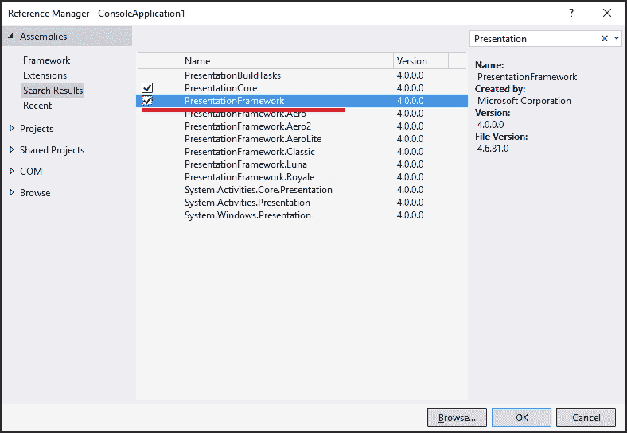
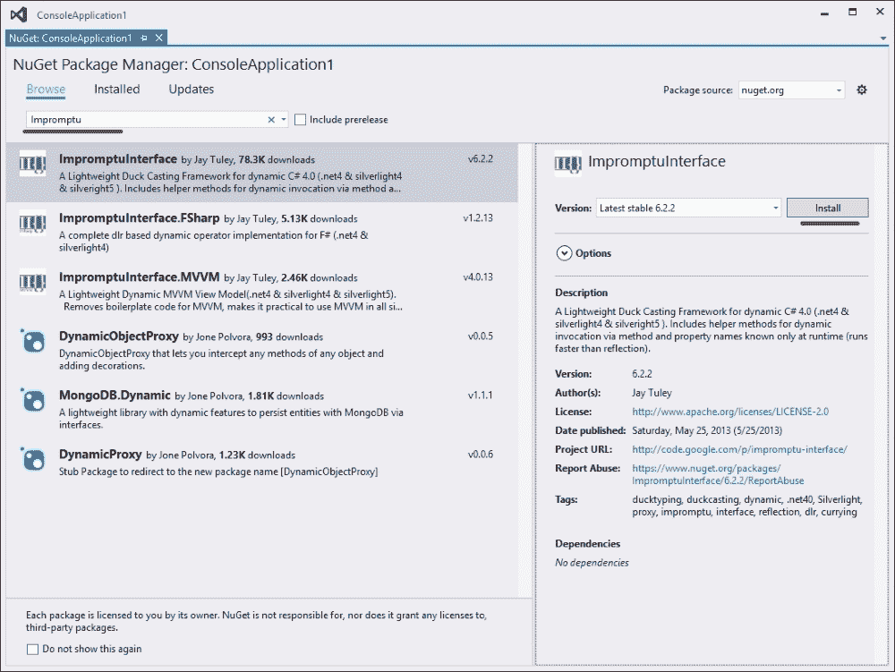

# 第五章 使用 C# 6.0

在本章中，我们将探讨 C# 6.0 编程语言中的原生异步编程支持。你将学习以下技巧：

+   使用 `await` 操作符获取异步任务结果

+   在 lambda 表达式中使用 `await` 操作符

+   使用 `await` 操作符处理后续异步任务

+   使用 `await` 操作符执行并行异步任务

+   处理异步操作中的异常

+   避免使用捕获的同步上下文

+   处理 `async void` 方法

+   设计自定义可等待类型

+   使用 `dynamic` 类型与 `await` 结合

# 简介

到目前为止，你学习了关于任务并行库（Task Parallel Library，TPL）的内容，这是微软最新的异步编程基础设施。它允许我们以模块化的方式设计程序，将不同的异步操作组合在一起。

不幸的是，阅读这样的程序仍然很难理解实际的程序流程。在一个大程序中，会有许多相互依赖的任务和延续，延续运行其他延续，以及用于异常处理的延续。它们都在程序代码的非常不同的地方聚集在一起。因此，理解哪个操作先执行以及接下来会发生什么成为一个非常具有挑战性的问题。

另一个需要注意的问题是，是否将适当的同步上下文传播到每个可能接触用户界面控件的异步任务。仅允许从 UI 线程使用这些控件；否则，我们会得到一个多线程访问异常。

说到异常，我们还需要使用单独的延续任务来处理在先前的异步操作或操作中发生的错误。这反过来又导致复杂的错误处理代码散布在代码的不同部分，彼此之间没有逻辑关系。

为了解决这些问题，C# 的作者们引入了新的语言增强功能，称为 **异步函数**，与 C# 5.0 版本一起推出。它们确实使异步编程变得简单，但同时也提供了对 TPL 的高级抽象。正如我们在第四章中提到的，*使用任务并行库*，抽象隐藏了重要的实现细节，以简化异步编程，但代价是程序员失去了许多重要的事物。理解异步函数背后的概念对于创建健壮和可扩展的应用程序非常重要。

要创建一个异步函数，你首先需要使用 `async` 关键字标记一个方法。如果不这样做，将无法拥有 `async` 属性或事件访问器方法和构造函数。代码将如下所示：

```cs
async Task<string> GetStringAsync()
{
  await Task.Delay(TimeSpan.FromSeconds(2));
  return "Hello, World!";
}
```

另一个重要的事实是，异步函数必须返回 `Task` 或 `Task<T>` 类型。虽然可以存在 `async void` 方法，但最好使用 `async Task` 方法。唯一合理的使用 `async void` 函数的选项是在你的应用程序中使用顶级 UI 控制事件处理器。

在标记有 `async` 关键字的方法内部，你可以使用 `await` 操作符。这个操作符与 TPL 中的任务一起工作，并在任务内部获取异步操作的结果。这些细节将在本章后面进行介绍。你无法在 `async` 方法外部使用 `await` 操作符；这将导致编译错误。此外，异步函数的代码中至少应该有一个 `await` 操作符。然而，如果没有 `await` 操作符，只会产生编译警告，而不是错误。

重要的是要注意，此方法在 `await` 调用行之后立即返回。在同步执行的情况下，执行线程将被阻塞 2 秒，然后返回结果。在这里，我们异步等待，同时在执行 `await` 操作符后立即将工作线程返回到线程池。2 秒后，我们再次从线程池中获取工作线程，并在其上运行异步方法的其余部分。这允许我们在这 2 秒内重用此工作线程来完成其他工作，这对于应用程序的可扩展性至关重要。借助异步函数，我们有一个线性的程序控制流，但它仍然是异步的。这既非常舒适又非常令人困惑。本章中的食谱将帮助你学习异步函数的每一个重要方面。

### 注意

根据我的经验，如果程序中有两个连续的 `await` 操作符，人们通常对程序的工作方式有一个常见的误解。许多人认为，如果我们对一系列异步操作使用 `await` 函数，它们将并行运行。然而，它们实际上是顺序执行的；第二个操作只有在第一个操作完成后才开始。这一点非常重要，我们将在本章后面详细讨论这个话题。

使用 `async` 和 `await` 操作符存在一些限制。例如，在 C# 5.0 中，无法将控制台应用程序的 `Main` 方法标记为 `async`；你无法在 `catch`、`finally`、`lock` 或 `unsafe` 块中使用 `await` 操作符。不允许在异步函数上有 `ref` 和 `out` 参数。还有更多细微之处，但这些都是主要点。在 C# 6.0 中，一些这些限制已被移除；由于编译器内部增强，可以在 `catch` 和 `finally` 块中使用 `await`。

在幕后，C# 编译器将异步函数转换为复杂的程序结构。我故意不会详细描述这一点；生成的代码与另一种称为 **迭代器** 的 C# 结构非常相似，并且实现为一种状态机。由于许多开发者几乎在每一个方法中都开始使用 `async` 修饰符，我想强调，如果一个方法不是打算以异步或并行方式使用，那么标记方法为 `async` 没有意义。调用 `async` 方法会带来显著的性能损失，与使用 `async` 关键字标记的相同方法相比，通常的方法调用将快 40 到 50 倍。请务必注意这一点。

在本章中，您将学习如何使用 C# 的 `async` 和 `await` 关键字来处理异步操作。我们将介绍如何顺序和并行地等待异步操作，讨论如何在 lambda 表达式中使用 `await`，如何处理异常，以及如何在使用 `async void` 方法时避免陷阱。为了结束本章，我们将深入研究同步上下文传播，您将学习如何创建自己的可等待对象而不是使用任务。

# 使用 await 操作符获取异步任务结果

本食谱将引导您了解使用异步函数的基本场景。我们将比较如何使用 TPL 和 `await` 操作符来获取异步操作的结果。

## 准备工作

为了逐步完成这个食谱，您将需要 Visual Studio 2015。没有其他先决条件。本食谱的源代码可以在 `BookSamples\Chapter5\Recipe1` 中找到。

## 如何操作...

要使用 `await` 操作符获取异步任务结果，请执行以下步骤：

1.  启动 Visual Studio 2015。创建一个新的 C# 控制台应用程序项目。

1.  在 `Program.cs` 文件中，添加以下 `using` 指令：

    ```cs
    using System;
    using System.Threading.Tasks;
    using static System.Console;
    using static System.Threading.Thread;
    ```

1.  在 `Main` 方法下方添加以下代码片段：

    ```cs
    static Task AsynchronyWithTPL()
    {
      Task<string> t = GetInfoAsync("Task 1");
      Task t2 = t.ContinueWith(task => WriteLine(t.Result),
        TaskContinuationOptions.NotOnFaulted);
      Task t3 = t.ContinueWith(task => WriteLine(t.Exception.InnerException),
        TaskContinuationOptions.OnlyOnFaulted);

      return Task.WhenAny(t2, t3);
    }

    static async Task AsynchronyWithAwait()
    {
      try
      {
        string result = await GetInfoAsync("Task 2");
        WriteLine(result);
      }
      catch (Exception ex)
      {
        WriteLine(ex);
      }
    }

    static async Task<string> GetInfoAsync(string name)
    {
      await Task.Delay(TimeSpan.FromSeconds(2));
      //throw new Exception("Boom!");
      return
         $"Task {name} is running on a thread id {CurrentThread.ManagedThreadId}." + 
    $" Is thread pool thread: {CurrentThread.IsThreadPoolThread}";
    }
    ```

1.  在 `Main` 方法内部添加以下代码片段：

    ```cs
    Task t = AsynchronyWithTPL();
    t.Wait();

    t = AsynchronyWithAwait();
    t.Wait();
    ```

1.  运行程序。

## 工作原理...

当程序运行时，我们运行两个异步操作。其中一个是标准的 TPL 代码，另一个使用新的 `async` 和 `await` C# 功能。`AsynchronyWithTPL` 方法启动一个运行 2 秒的任务，然后返回一个包含有关工作线程信息的字符串。然后，我们定义一个后续操作，在操作完成后打印异步操作的结果，另一个用于在发生错误时打印异常详细信息。最后，我们在 `Main` 方法中返回一个表示其中一个后续任务的任务，并等待其完成。

在`AsynchronyWithAwait`方法中，我们通过使用`await`与任务一起实现相同的结果。这就像我们只写了常规的同步代码——我们从任务中获取结果，打印结果，并在任务以错误完成时捕获异常。关键的区别是我们实际上有一个异步程序。在`await`使用后立即，C#会创建一个任务，该任务具有一个带有`await`操作符之后所有剩余代码的后续任务，并处理异常传播。然后，我们将此任务返回到`Main`方法并等待其完成。

### 注意

注意，根据底层异步操作的性质和当前同步上下文，执行异步代码的确切方式可能不同。我们将在本章后面解释这一点。

因此，我们可以看到程序的第一部分和第二部分在概念上是等效的，但在第二部分中，C#编译器隐式地处理异步代码的工作。实际上，它比第一部分更复杂，我们将在本章接下来的几个菜谱中详细介绍。

请记住，在 Windows GUI 或 ASP.NET 等环境中不建议使用`Task.Wait`和`Task.Result`方法。如果程序员不是 100%清楚代码中真正发生的事情，这可能导致死锁。这在本章 4 的*使用 TaskScheduler 微调任务执行*菜谱中得到了说明，当时我们在 WPF 应用程序中使用了`Task.Result`。

要测试异常处理的工作方式，只需取消注释`GetInfoAsync`方法内的`throw new Exception`行。

# 在 lambda 表达式中使用`await`操作符

此菜谱将向您展示如何在 lambda 表达式中使用`await`。我们将编写一个使用`await`的匿名方法，并使用 lambda 表达式中的`await`操作符异步获取方法执行的结果。

## 准备工作

要逐步完成此菜谱，你需要 Visual Studio 2015。没有其他先决条件。此菜谱的源代码可以在`BookSamples\Chapter5\Recipe2`中找到。

## 如何做...

要编写一个使用`await`的匿名方法，并使用 lambda 表达式中的`await`操作符异步获取方法执行的结果，请执行以下步骤：

1.  启动 Visual Studio 2015。创建一个新的 C#控制台应用程序项目。

1.  在`Program.cs`文件中添加以下`using`指令：

    ```cs
    using System;
    using System.Threading.Tasks;
    using static System.Console;
    using static System.Threading.Thread;
    ```

1.  在`Main`方法下方添加以下代码片段：

    ```cs
    static async Task AsynchronousProcessing()
    {
      Func<string, Task<string>> asyncLambda = async name => {
        await Task.Delay(TimeSpan.FromSeconds(2));
        return
      $"Task {name} is running on a thread id {CurrentThread.ManagedThreadId}." +
      $" Is thread pool thread: {CurrentThread.IsThreadPoolThread}";
      };

      string result = await asyncLambda("async lambda");

      WriteLine(result);
    }
    ```

1.  在`Main`方法内部添加以下代码片段：

    ```cs
    Task t = AsynchronousProcessing();
    t.Wait();
    ```

1.  运行程序。

## 工作原理...

首先，我们将异步函数移动到`AsynchronousProcessing`方法中，因为我们不能在`Main`中使用`async`。然后，我们使用`async`关键字描述一个 lambda 表达式。由于任何 lambda 表达式的类型都不能从 lambda 本身推断出来，我们必须明确地将类型指定给 C#编译器。在我们的情况下，类型意味着我们的 lambda 表达式接受一个字符串参数并返回一个`Task<string>`对象。

然后，我们定义 lambda 表达式体。一个异常是，方法被定义为返回一个`Task<string>`对象，但实际上我们返回一个字符串，并且没有编译错误！C#编译器会自动为我们生成一个任务并返回它。

最后一步是等待异步 lambda 表达式执行并打印出结果。

# 使用`await`运算符与连续的异步任务

这个菜谱将向您展示当我们代码中有多个连续的`await`方法时，程序的确切流程。您将学习如何使用`await`方法阅读代码，并理解为什么`await`调用是一个异步操作。

## 准备工作

要逐步完成这个菜谱，您需要 Visual Studio 2015。没有其他先决条件。这个菜谱的源代码可以在`BookSamples\Chapter5\Recipe3`中找到。

## 如何做到...

为了理解存在连续`await`方法时的程序流程，请执行以下步骤：

1.  启动 Visual Studio 2015。创建一个新的 C#控制台应用程序项目。

1.  在`Program.cs`文件中添加以下`using`指令：

    ```cs
    using System;
    using System.Threading.Tasks;
    using static System.Console;
    using static System.Threading.Thread;
    ```

1.  在`Main`方法下方添加以下代码片段：

    ```cs
    static Task AsynchronyWithTPL()
    {
      var containerTask = new Task(() => { 
        Task<string> t = GetInfoAsync("TPL 1");
        t.ContinueWith(task => {
          WriteLine(t.Result);
          Task<string> t2 = GetInfoAsync("TPL 2");
          t2.ContinueWith(innerTask => WriteLine(innerTask.Result),
            TaskContinuationOptions.NotOnFaulted | TaskContinuationOptions.AttachedToParent);
          t2.ContinueWith(innerTask => WriteLine(innerTask.Exception.InnerException),
            TaskContinuationOptions.OnlyOnFaulted | TaskContinuationOptions.AttachedToParent);
          },
          TaskContinuationOptions.NotOnFaulted | TaskContinuationOptions.AttachedToParent);

        t.ContinueWith(task => WriteLine(t.Exception.InnerException),
          TaskContinuationOptions.OnlyOnFaulted | TaskContinuationOptions.AttachedToParent);
      });

      containerTask.Start();
      return containerTask;
    }

    static async Task AsynchronyWithAwait()
    {
      try
      {
        string result = await GetInfoAsync("Async 1");
        WriteLine(result);
        result = await GetInfoAsync("Async 2");
        WriteLine(result);
      }
      catch (Exception ex)
      {
        WriteLine(ex);
      }
    }

    static async Task<string> GetInfoAsync(string name)
    {
      WriteLine($"Task {name} started!");
      await Task.Delay(TimeSpan.FromSeconds(2));
      if(name == "TPL 2")
        throw new Exception("Boom!");
      return
      $"Task {name} is running on a thread id {CurrentThread.ManagedThreadId}." +
      $" Is thread pool thread: {CurrentThread.IsThreadPoolThread}";
    }
    ```

1.  在`Main`方法内添加以下代码片段：

    ```cs
    Task t = AsynchronyWithTPL();
    t.Wait();

    t = AsynchronyWithAwait();
    t.Wait();
    ```

1.  运行程序。

## 它是如何工作的...

当程序运行时，我们执行两个异步操作，就像我们在第一个菜谱中所做的那样。然而，这次，我们将从`AsynchronyWithAwait`方法开始。它看起来仍然像是常规的同步代码；唯一的区别是两个`await`语句。最重要的一点是，代码仍然是顺序的，`Async 2`任务只有在前一个任务完成后才会开始。当我们阅读代码时，程序流程非常清晰：我们看到先运行什么，然后是什么接着运行。那么，这个程序是如何异步的呢？好吧，首先，它并不总是异步的。如果我们使用`await`时任务已经完成，我们将同步地得到其结果。否则，当我们看到代码中的`await`语句时，常见的做法是注意在这个点上，方法将立即返回，其余的代码将在一个延续任务中运行。由于我们没有阻塞执行，等待操作的结果，所以这是一个异步调用。我们可以在`AsynchronyWithAwait`方法执行时执行任何其他任务，而不是在`Main`方法中调用`t.Wait`。但是，主线程必须等待所有异步操作完成，否则它们将在后台线程上运行时被停止。

`AsynchronyWithTPL`方法模仿`AsynchronyWithAwait`方法相同的程序流程。我们需要一个容器任务来处理所有依赖任务。然后，我们启动主任务，并向其添加一组后续任务。当任务完成时，我们打印出结果；然后我们再启动一个任务，该任务在第二个任务完成后继续工作。为了测试异常处理，我们在运行第二个任务时故意抛出异常，并打印出其信息。这组后续任务创建了与第一种方法相同的程序流程，当我们将其与使用`await`方法的代码进行比较时，我们可以看到它更容易阅读和理解。唯一的技巧是要记住，异步并不总是意味着并行执行。

# 使用`await`运算符执行并行异步任务

在本配方中，您将学习如何使用`await`来并行运行异步操作，而不是通常的顺序执行。

## 准备工作

要逐步执行此配方，您需要 Visual Studio 2015。没有其他先决条件。此配方的源代码可在`BookSamples\Chapter5\Recipe4`中找到。

## 如何操作...

要理解`await`运算符在并行异步任务执行中的用法，请执行以下步骤：

1.  启动 Visual Studio 2015。创建一个新的 C#控制台应用程序项目。

1.  在`Program.cs`文件中，添加以下`using`指令：

    ```cs
    using System;
    using System.Threading.Tasks;
    using static System.Console;
    using static System.Threading.Thread;
    ```

1.  在`Main`方法下方添加以下代码：

    ```cs
    static async Task AsynchronousProcessing()
    {
      Task<string> t1 = GetInfoAsync("Task 1", 3);
      Task<string> t2 = GetInfoAsync("Task 2", 5);

      string[] results = await Task.WhenAll(t1, t2);
      foreach (string result in results)
      {
        WriteLine(result);
      }
    }

    static async Task<string> GetInfoAsync(string name, int seconds)
    {
      await Task.Delay(TimeSpan.FromSeconds(seconds));
      //await Task.Run(() => 
      //   Thread.Sleep(TimeSpan.FromSeconds(seconds)));
      return
      $"Task {name} is running on a thread id " +
      $"{CurrentThread.ManagedThreadId}. " +
      $"Is thread pool thread: {CurrentThread.IsThreadPoolThread}";
    }
    ```

1.  在`Main`方法内部添加以下代码片段：

    ```cs
    Task t = AsynchronousProcessing();
    t.Wait();
    ```

1.  运行程序。

## 工作原理...

在这里，我们定义了两个异步任务，分别运行 3 秒和 5 秒。然后，我们使用`Task.WhenAll`辅助方法创建另一个任务，该任务只有在所有底层任务都完成后才会完成。然后，我们等待这个组合任务的结果。5 秒后，我们得到所有结果，这意味着任务是在同时运行的。

然而，有一个有趣的观察。当你运行程序时，你可能会注意到这两个任务很可能由同一个线程池中的工作线程来服务。当我们并行运行任务时，这是如何可能的呢？为了使事情更有趣，让我们在`GetIntroAsync`方法中注释掉`await Task.Delay`行，并取消注释`await Task.Run`行，然后再次运行程序。

我们将看到在这种情况下，两个任务将由不同的工作线程提供服务。区别在于 `Task.Delay` 在底层使用计时器，处理过程如下：我们从线程池中获取工作线程，并等待 `Task.Delay` 方法返回结果。然后，`Task.Delay` 方法启动计时器并指定当计时器计算到 `Task.Delay` 方法指定的秒数时将调用的代码片段。然后，我们立即将工作线程返回到线程池。当计时器事件运行时，我们再次从线程池中获取任何可用的工作线程（这可能是我们最初使用的工作线程）并在其上运行提供给计时器的代码。

当我们使用 `Task.Run` 方法时，我们从线程池中获取一个工作线程，并使其阻塞几秒钟，这是提供给 `Thread.Sleep` 方法的。然后，我们获取第二个工作线程并使其也阻塞。在这种情况下，我们消耗了两个工作线程，它们实际上什么也没做，因为它们在等待时无法执行任何其他任务。

我们将在 第九章 *使用异步 I/O* 中详细讨论第一个场景，我们将讨论一组与数据输入和输出一起工作的异步操作。尽可能使用第一种方法是创建可扩展服务器应用程序的关键。

# 异步操作中的异常处理

此配方将描述如何使用 C# 中的异步函数处理异常。您将学习在您使用 `await` 与多个并行异步操作一起时如何处理聚合异常。

## 准备工作

要逐步执行此配方，您需要 Visual Studio 2015。没有其他先决条件。此配方的源代码可以在 `BookSamples\Chapter5\Recipe5` 中找到。

## 如何做...

要理解异步操作中的异常处理，请执行以下步骤：

1.  启动 Visual Studio 2015。创建一个新的 C# 控制台应用程序项目。

1.  在 `Program.cs` 文件中添加以下 `using` 指令：

    ```cs
    using System;
    using System.Threading.Tasks;
    using static System.Console;
    ```

1.  在 `Main` 方法下方添加以下代码片段：

    ```cs
    static async Task AsynchronousProcessing()
    {
      WriteLine("1\. Single exception");

      try
      {
        string result = await GetInfoAsync("Task 1", 2);
        WriteLine(result);
      }
      catch (Exception ex)
      {
        WriteLine($"Exception details: {ex}");
      }

      WriteLine();
      WriteLine("2\. Multiple exceptions");

      Task<string> t1 = GetInfoAsync("Task 1", 3);
      Task<string> t2 = GetInfoAsync("Task 2", 2);
      try
      {
        string[] results = await Task.WhenAll(t1, t2);
        WriteLine(results.Length);
      }
      catch (Exception ex)
      {
        WriteLine($"Exception details: {ex}");
      }

      WriteLine();
      WriteLine("3\. Multiple exceptions with AggregateException");

      t1 = GetInfoAsync("Task 1", 3);
      t2 = GetInfoAsync("Task 2", 2);
      Task<string[]> t3 = Task.WhenAll(t1, t2);
      try
      {
        string[] results = await t3;
        WriteLine(results.Length);
      }
      catch
      {
        var ae = t3.Exception.Flatten();
        var exceptions = ae.InnerExceptions;
        WriteLine($"Exceptions caught: {exceptions.Count}");
        foreach (var e in exceptions)
        {
          WriteLine($"Exception details: {e}");
          WriteLine();
        }
      }

      WriteLine();
          WriteLine("4\. await in catch and finally blocks");

      try
      {
        string result = await GetInfoAsync("Task 1", 2);
        WriteLine(result);
      }
      catch (Exception ex)
      {
        await Task.Delay(TimeSpan.FromSeconds(1));
        WriteLine($"Catch block with await: Exception details: {ex}");
      }
      finally
      {
         await Task.Delay(TimeSpan.FromSeconds(1));
        WriteLine("Finally block");
      }
    }

    static async Task<string> GetInfoAsync(string name, int seconds)
    {
      await Task.Delay(TimeSpan.FromSeconds(seconds));
      throw new Exception($"Boom from {name}!");
    }
    ```

1.  在 `Main` 方法内部添加以下代码片段：

    ```cs
    Task t = AsynchronousProcessing();
    t.Wait();
    ```

1.  运行程序。

## 它是如何工作的...

我们运行四个场景来展示在 C# 中使用 `async` 和 `await` 进行错误处理的常见情况。第一个场景非常简单，几乎与常规同步代码相同。我们只是使用 `try`/`catch` 语句来获取异常的详细信息。

一个非常常见的错误是在等待多个异步操作时使用相同的方法。如果我们像以前一样使用 `catch` 块，我们只会从底层的 `AggregateException` 对象中获取第一个异常。

要收集所有信息，我们必须使用已等待任务的`Exception`属性。在第三种情况下，我们使用`AggregateException`的`Flatten`方法来展开`AggregateException`层次结构，然后从中解包所有底层异常。

为了说明 C# 6.0 的变化，我们在异常处理代码的`catch`和`finally`块中使用`await`。为了验证在 C#的先前版本中无法在`catch`和`finally`块中使用`await`，您可以通过在项目属性的构建部分高级设置中指定它来编译它针对 C# 5.0。

# 避免使用捕获的同步上下文

本配方讨论了使用`await`获取异步操作结果时同步上下文行为的详细信息。您将了解如何和何时关闭同步上下文流。

## 准备工作

要逐步执行此配方，您需要 Visual Studio 2015。没有其他先决条件。此配方的源代码可以在`BookSamples\Chapter5\Recipe6`中找到。

## 如何操作...

要了解使用`await`时同步上下文行为的详细信息，以及学习如何和何时关闭同步上下文流，请执行以下步骤：

1.  启动 Visual Studio 2015。创建一个新的 C#控制台应用程序项目。

1.  按照以下步骤添加对 Windows Presentation Foundation 库的引用：

    1.  右键单击项目中的**引用**文件夹，并选择**添加引用…**菜单选项。

    1.  添加以下库的引用：**PresentationCore**、**PresentationFramework**、**System.Xaml**和**WindowsBase**。您可以使用引用管理器对话框中的搜索功能如下：

    

1.  在`Program.cs`文件中，添加以下`using`指令：

    ```cs
    using System;
    using System.Diagnostics;
    using System.Text;
    using System.Threading.Tasks;
    using System.Windows;
    using System.Windows.Controls;
    using static System.Console;
    ```

1.  在`Main`方法下方添加以下代码片段：

    ```cs
    private static Label _label;

    static async void Click(object sender, EventArgs e)
    {
      _label.Content = new TextBlock {Text = "Calculating..."};
      TimeSpan resultWithContext = await Test();
      TimeSpan resultNoContext = await TestNoContext();
      //TimeSpan resultNoContext =
      //   await TestNoContext().ConfigureAwait(false);
      var sb = new StringBuilder();
      sb.AppendLine($"With the context: {resultWithContext}");
      sb.AppendLine($"Without the context: {resultNoContext}");
      sb.AppendLine("Ratio: " +
        $"{resultWithContext.TotalMilliseconds/resultNoContext.TotalMilliseconds:0.00}");
      _label.Content = new TextBlock {Text = sb.ToString()};
    }

    static async Task<TimeSpan> Test()
    {
      const int iterationsNumber = 100000;
      var sw = new Stopwatch();
      sw.Start();
      for (int i = 0; i < iterationsNumber; i++)
      {
        var t = Task.Run(() => { });
        await t;
      }
      sw.Stop();
      return sw.Elapsed;
    }

    static async Task<TimeSpan> TestNoContext()
    {
      const int iterationsNumber = 100000;
      var sw = new Stopwatch();
      sw.Start();
      for (int i = 0; i < iterationsNumber; i++)
      {
        var t = Task.Run(() => { });
        await t.ConfigureAwait(
          continueOnCapturedContext: false);
      }
      sw.Stop();
      return sw.Elapsed;
    }
    ```

1.  将`Main`方法替换为以下代码片段：

    ```cs
    [STAThread]
    static void Main(string[] args)
    {
      var app = new Application();
      var win = new Window();
      var panel = new StackPanel();
      var button = new Button();
      _label = new Label();
      _label.FontSize = 32;
      _label.Height = 200;
      button.Height = 100;
      button.FontSize = 32;
      button.Content = new TextBlock {Text = "Start asynchronous operations"};
      button.Click += Click;
      panel.Children.Add(_label);
      panel.Children.Add(button);
      win.Content = panel;
      app.Run(win);

      ReadLine();
    }
    ```

1.  运行程序。

## 它是如何工作的...

在本例中，我们研究了异步函数默认行为的一个重要方面。您已经从第四章 *使用任务并行库* 中了解了任务调度器和同步上下文。默认情况下，`await`运算符会尝试捕获同步上下文并在其上执行前面的代码。正如我们已经知道的，这有助于我们通过操作用户界面控件来编写异步代码。此外，当使用`await`时，由于我们不会在等待结果时阻塞 UI 线程，因此不会发生死锁等情况，如前一章所述。

这是合理的，但让我们看看可能会发生什么。在这个例子中，我们通过编程创建了一个 Windows Presentation Foundation 应用程序，并订阅了其按钮点击事件。当点击按钮时，我们运行两个异步操作。其中一个使用常规的`await`运算符，而另一个使用带有`false`作为参数值的`ConfigureAwait`方法。它明确指示我们不应使用捕获的同步上下文在该上下文中运行后续代码。在每个操作内部，我们测量它们完成所需的时间，然后，在主屏幕上显示相应的时间和比率。

因此，我们看到常规的`await`运算符需要更多的时间来完成。这是因为我们在 UI 线程上发布了 100,000 个后续任务，该线程使用其消息循环异步处理这些任务。在这种情况下，我们不需要在 UI 线程上运行此代码，因为我们没有从异步操作中访问 UI 组件；使用带有`false`的`ConfigureAwait`将是一个更高效的解决方案。

值得注意的是，还有一件事。尝试通过仅点击按钮并等待结果来运行程序。现在，再次执行同样的操作，但这次，点击按钮并尝试以随机方式拖动应用程序窗口的两侧。你会注意到捕获的同步上下文上的代码变慢了！这个有趣的副作用完美地说明了异步编程是多么危险。这种情况很容易发生，如果你以前从未遇到过这种行为，那么几乎不可能调试它。

公平起见，让我们看看相反的情况。在上面的代码片段中，在`Click`方法内部，取消注释被注释的行，并注释掉紧随其后的行。当运行应用程序时，我们将遇到多线程控制访问异常，因为设置`Label`控件文本的代码不会在捕获的上下文中发布，而是会在线程池工作线程上执行。

# 解决`async void`方法的问题

这个配方描述了为什么`async void`方法非常危险。你将了解在什么情况下可以使用此方法，以及在可能的情况下应该使用什么替代方案。

## 准备工作

要逐步执行此配方，你需要 Visual Studio 2015。没有其他先决条件。此配方的源代码可以在`BookSamples\Chapter5\Recipe7`中找到。

## 如何操作...

要学习如何使用`async void`方法，请执行以下步骤：

1.  启动 Visual Studio 2015。创建一个新的 C#控制台应用程序项目。

1.  在`Program.cs`文件中，添加以下`using`指令：

    ```cs
    using System;
    using System.Threading.Tasks;
    using static System.Console;
    using static System.Threading.Thread;
    ```

1.  在`Main`方法下方添加以下代码片段：

    ```cs
    static async Task AsyncTaskWithErrors()
    {
      string result = await GetInfoAsync("AsyncTaskException", 2);
      WriteLine(result);
    }

    static async void AsyncVoidWithErrors()
    {
      string result = await GetInfoAsync("AsyncVoidException", 2);
      WriteLine(result);
    }

    static async Task AsyncTask()
    {
      string result = await GetInfoAsync("AsyncTask", 2);
      WriteLine(result);
    }

    static async void AsyncVoid()
    {
      string result = await GetInfoAsync("AsyncVoid", 2);
      WriteLine(result);
    }

    static async Task<string> GetInfoAsync(string name, int seconds)
    {
      await Task.Delay(TimeSpan.FromSeconds(seconds));
      if(name.Contains("Exception"))
        throw new Exception($"Boom from {name}!");
      return
      $"Task {name} is running on a thread id {CurrentThread.ManagedThreadId}." +
      $" Is thread pool thread: {CurrentThread.IsThreadPoolThread}";
    }
    ```

1.  在`Main`方法内部添加以下代码片段：

    ```cs
    Task t = AsyncTask();
    t.Wait();

    AsyncVoid();
    Sleep(TimeSpan.FromSeconds(3));

    t = AsyncTaskWithErrors();
    while(!t.IsFaulted)
    {
      Sleep(TimeSpan.FromSeconds(1));
    }
    WriteLine(t.Exception);

    //try
    //{
    //  AsyncVoidWithErrors();
    //  Thread.Sleep(TimeSpan.FromSeconds(3));
    //}
    //catch (Exception ex)
    //{
    //  Console.WriteLine(ex);
    //}

    int[] numbers = {1, 2, 3, 4, 5};
    Array.ForEach(numbers, async number => {
      await Task.Delay(TimeSpan.FromSeconds(1));
      if (number == 3) throw new Exception("Boom!");
      WriteLine(number);
    });

    ReadLine();
    ```

1.  运行程序。

## 工作原理...

当程序启动时，我们通过调用两个方法 `AsyncTask` 和 `AsyncVoid` 来启动两个异步操作。第一个方法返回一个 `Task` 对象，而另一个由于声明为 `async void` 而不返回任何内容。由于它们是异步的，所以它们都会立即返回，但第一个可以通过返回的任务状态或直接调用其上的 `Wait` 方法来轻松监控。等待第二个方法完成的唯一方法是实际等待一段时间，因为我们没有声明任何可以用来监控异步操作状态的对象。当然，可以使用某种类型的共享状态变量，并在 `async void` 方法中设置它，同时从 `调用` 方法中检查它，但最好只是返回一个 `Task` 对象。

最危险的部分是异常处理。在 `async void` 方法中，异常将被发送到当前同步上下文；在我们的例子中，是线程池。线程池上的未处理异常将终止整个进程。可以使用 `AppDomain.UnhandledException` 事件来拦截未处理的异常，但无法从那里恢复进程。为了体验这一点，我们应该取消注释 `Main` 方法内的 `try`/`catch` 块，然后运行程序。

关于使用 `async void` lambda 表达式的另一个事实是，它们与 `Action` 类型兼容，这在标准 .NET Framework 类库中广泛使用。很容易忘记这个 lambda 表达式中的异常处理，这会导致程序再次崩溃。要查看此示例，取消注释 `Main` 方法中第二个注释掉的块。

我强烈建议仅在 UI 事件处理器中使用 `async void`。在其他所有情况下，请使用返回 `Task` 的方法。

# 设计自定义可等待类型

此过程向您展示如何设计一个与 `await` 操作符兼容的非常基本的可等待类型。

## 准备工作

要逐步执行此过程，你需要 Visual Studio 2015。没有其他先决条件。此过程的源代码可以在 `BookSamples\Chapter5\Recipe8` 中找到。

## 如何操作...

设计自定义可等待类型，请执行以下步骤：

1.  启动 Visual Studio 2015。创建一个新的 C# 控制台应用程序项目。

1.  在 `Program.cs` 文件中，添加以下 `using` 指令：

    ```cs
    using System;
    using System.Runtime.CompilerServices;
    using System.Threading;
    using System.Threading.Tasks;
    using static System.Console;
    using static System.Threading.Thread;
    ```

1.  在 `Main` 方法下方添加以下代码片段：

    ```cs
    static async Task AsynchronousProcessing()
    {
      var sync = new CustomAwaitable(true);
      string result = await sync;
      WriteLine(result);

      var async = new CustomAwaitable(false);
      result = await async;

      WriteLine(result);
    }

    class CustomAwaitable
    {
      public CustomAwaitable(bool completeSynchronously)
      {
        _completeSynchronously = completeSynchronously;
      }

      public CustomAwaiter GetAwaiter()
      {
        return new CustomAwaiter(_completeSynchronously);
      }

      private readonly bool _completeSynchronously;
    }

    class CustomAwaiter : INotifyCompletion
    {
      private string _result = "Completed synchronously";
      private readonly bool _completeSynchronously;

      public bool IsCompleted => _completeSynchronously;

      public CustomAwaiter(bool completeSynchronously)
      {
        _completeSynchronously = completeSynchronously;
      }

      public string GetResult()
      {
        return _result;
      }

      public void OnCompleted(Action continuation)
      {
        ThreadPool.QueueUserWorkItem( state => {
          Sleep(TimeSpan.FromSeconds(1));
          _result = GetInfo();
          continuation?.Invoke();
        });
      }

      private string GetInfo()
      {
        return
        $"Task is running on a thread id {CurrentThread.ManagedThreadId}." +
        $" Is thread pool thread: {CurrentThread.IsThreadPoolThread}";
      }
    }
    ```

1.  在 `Main` 方法内添加以下代码片段：

    ```cs
    Task t = AsynchronousProcessing();
    t.Wait();
    ```

1.  运行程序。

## 它是如何工作的...

要与 `await` 操作符兼容，类型应符合 C# 语言规范中声明的若干要求。如果您已安装 Visual Studio 2015，您可以在 `C:\Program Files (x86)\Microsoft Visual Studio 14.0\VC#\Specifications\1033` 文件夹中找到规范文档（假设您有一个 64 位操作系统并使用了默认的安装路径）。

在第 7.7.7.1 段落中，我们找到了关于可等待表达式的定义：

*`await` 表达式的任务是必须可等待的。一个表达式* `t` *是可等待的，如果以下任何一个条件成立：*

+   `t` *是编译时类型 dynamic*

+   `t` *具有一个可访问的实例或扩展方法，名为* `GetAwaiter` *，没有参数和类型参数，返回类型为* `A` *，并且满足以下所有条件：*

    1.  `A` *实现了接口* `System.Runtime.CompilerServices.INotifyCompletion` *(以下简称为* `INotifyCompletion` *以节省篇幅)。*

    1.  `A` *具有一个可访问的、可读的实例属性* `IsCompleted` *，其类型为* `bool`。

    1.  `A` *具有一个可访问的实例方法* `GetResult` *，没有参数和类型参数*。

这些信息足以开始。首先，我们定义一个可等待类型 `CustomAwaitable` 并实现 `GetAwaiter` 方法。这反过来又返回 `CustomAwaiter` 类型的实例。`CustomAwaiter` 实现了 `INotifyCompletion` 接口，具有 `bool` 类型的 `IsCompleted` 属性，并具有 `GetResult` 方法，该方法返回 `string` 类型。最后，我们编写了一段代码，创建了两个 `CustomAwaitable` 对象，并等待它们两个。

现在，我们应该了解 `await` 表达式的评估方式。这次，为了避免不必要的细节，没有引用规范。基本上，如果 `IsCompleted` 属性返回 `true`，我们就同步调用 `GetResult` 方法。这可以防止我们在操作已经完成的情况下为异步任务执行分配资源。我们通过向 `CustomAwaitable` 对象的构造函数方法提供 `completeSynchronously` 参数来处理这种情况。

否则，我们在 `CustomAwaiter` 的 `OnCompleted` 方法上注册一个回调操作，并开始异步操作。当它完成时，它调用提供的回调，通过在 `CustomAwaiter` 对象上调用 `GetResult` 方法来获取结果。

### 注意

此实现仅用于教育目的。无论何时您编写异步函数，最自然的方法是使用标准的 `Task` 类型。您应该只定义自己的可等待类型，如果您有充分的理由不能使用 `Task` 类型，并且确切地知道您在做什么。

与设计自定义可等待类型相关的许多其他主题，例如 `ICriticalNotifyCompletion` 接口实现和同步上下文传播。在了解如何设计可等待类型的基本原理之后，您将能够轻松地使用 C# 语言规范和其他信息源来查找您需要的详细信息。但我想强调，除非您有充分的理由不使用 `Task` 类型，并且确切地知道您在做什么，否则您应该只使用 `Task` 类型。

# 使用动态类型与 await

这个配方展示了如何设计一个与 `await` 操作符和动态 C# 类型兼容的非常基本的类型。

## 准备中

要逐步执行此食谱，你需要 Visual Studio 2015。你需要互联网访问来下载 NuGet 包。没有其他先决条件。此食谱的源代码可以在 `BookSamples\Chapter5\Recipe9` 中找到。

## 如何操作...

要学习如何使用 `dynamic` 类型与 `await` 结合，请执行以下步骤：

1.  启动 Visual Studio 2015。创建一个新的 C# 控制台应用程序项目。

1.  按照以下步骤添加对 **ImpromptuInterface** NuGet 包的引用：

    1.  右键单击项目中的 **引用** 文件夹，并选择 **管理 NuGet 包…** 菜单选项。

    1.  现在，添加您首选的 **ImpromptuInterface NuGet** 包引用。您可以在 **管理 NuGet 包** 对话框中使用搜索功能，如下所示：

    

1.  在 `Program.cs` 文件中，使用以下 `using` 指令：

    ```cs
    using System;
    using System.Dynamic;
    using System.Runtime.CompilerServices;
    using System.Threading;
    using System.Threading.Tasks;
    using ImpromptuInterface;
    using static System.Console;
    using static System.Threading.Thread;
    ```

1.  在 `Main` 方法下方添加以下代码片段：

    ```cs
    static async Task AsynchronousProcessing()
    {
      string result = await GetDynamicAwaitableObject(true);
      WriteLine(result);

      result = await GetDynamicAwaitableObject(false);
      WriteLine(result);
    }

    static dynamic GetDynamicAwaitableObject(bool completeSynchronously)
    {
      dynamic result = new ExpandoObject();
      dynamic awaiter = new ExpandoObject();

      awaiter.Message = "Completed synchronously";
      awaiter.IsCompleted = completeSynchronously;
      awaiter.GetResult = (Func<string>)(() => awaiter.Message);

      awaiter.OnCompleted = (Action<Action>) ( callback => 
        ThreadPool.QueueUserWorkItem(state => {
          Sleep(TimeSpan.FromSeconds(1));
          awaiter.Message = GetInfo();
          callback?.Invoke();
        })
      );

      IAwaiter<string> proxy = Impromptu.ActLike(awaiter);

      result.GetAwaiter = (Func<dynamic>) ( () => proxy );

      return result;
    }

    static string GetInfo()
    {
      return
        $"Task is running on a thread id {CurrentThread.ManagedThreadId}." +
        $" Is thread pool thread: {CurrentThread.IsThreadPoolThread}";
    }
    ```

1.  在 `Program` 类定义下方添加以下代码：

    ```cs
    public interface IAwaiter<T> : INotifyCompletion
    {
        bool IsCompleted { get; }

        T GetResult();
    }
    ```

1.  在 `Main` 方法内部添加以下代码片段：

    ```cs
    Task t = AsynchronousProcessing();
    t.Wait();
    ```

1.  运行程序。

## 它是如何工作的...

在这里，我们重复使用之前食谱中的技巧，但这次，我们借助动态表达式。我们可以借助 NuGet——一个包含许多有用库的包管理器来实现这一目标。这次，我们使用一个动态创建包装器的库，实现我们需要的接口。

要开始，我们创建两个 `ExpandoObject` 类型的实例，并将它们分配给动态局部变量。这些变量将成为我们的 `awaitable` 和 `awaiter` 对象。由于 `awaitable` 对象只需要有 `GetAwaiter` 方法，因此提供它没有问题。`ExpandoObject`（结合 `dynamic` 关键字）允许我们自定义它，并通过分配相应的值添加属性和方法。实际上，它是一个具有 `string` 类型的键和 `object` 类型的值的字典类型集合。如果你熟悉 JavaScript 编程语言，你可能会注意到这与 JavaScript 对象非常相似。

由于 `dynamic` 允许我们在 C# 中跳过编译时检查，`ExpandoObject` 被编写成这样：如果你将某个值赋给一个属性，它会在字典中创建一个条目，其中键是属性名，值是提供的任何值。当你尝试获取属性值时，它会进入字典，并提供了存储在相应字典条目中的值。如果值是 `Action` 或 `Func` 类型，我们实际上存储了一个委托，这反过来又可以像方法一样使用。因此，`dynamic` 类型与 `ExpandoObject` 的组合允许我们创建一个对象，并动态地为其提供属性和方法。

现在，我们需要构建我们的`awaiter`和`awaitable`对象。让我们从`awaiter`开始。首先，我们提供一个名为`Message`的属性，并为此属性提供一个初始值。然后，我们使用`Func<string>`类型定义`GetResult`方法。我们分配一个 lambda 表达式，它返回`Message`属性值。然后我们实现`IsCompleted`属性。如果它被设置为`true`，我们可以跳过其余的工作，并继续到存储在`result`局部变量中的`awaitable`对象。我们只需要添加一个返回`dynamic`对象的方法，并从其中返回我们的`awaiter`对象。然后，我们可以使用`result`作为`await`表达式；然而，它将同步运行。

主要挑战是在我们的动态对象上实现异步处理。C#语言规范指出，`awaiter`对象必须实现`INotifyCompletion`或`ICriticalNotifyCompletion`接口，而`ExpandoObject`不实现这些接口。即使我们动态地实现`OnCompleted`方法并将其添加到`awaiter`对象中，我们也不会成功，因为我们的对象没有实现上述任何一个接口。

为了解决这个问题，我们使用了从 NuGet 获取的`ImpromptuInterface`库。它允许我们使用`Impromptu.ActLike`方法动态创建实现所需接口的代理对象。如果我们尝试创建一个实现`INotifyCompletion`接口的代理，我们仍然会失败，因为`proxy`对象不再动态，而这个接口只有`OnCompleted`方法，但没有`IsCompleted`属性或`GetResult`方法。作为最后的解决方案，我们定义了一个泛型接口`IAwaiter<T>`，它实现了`INotifyCompletion`并添加了所有必需的属性和方法。现在，我们用它来生成代理，并将`result`对象从`GetAwaiter`方法返回的`awaiter`改为`proxy`。程序现在可以工作了；我们只是构建了一个在运行时完全动态的`awaitable`对象。
