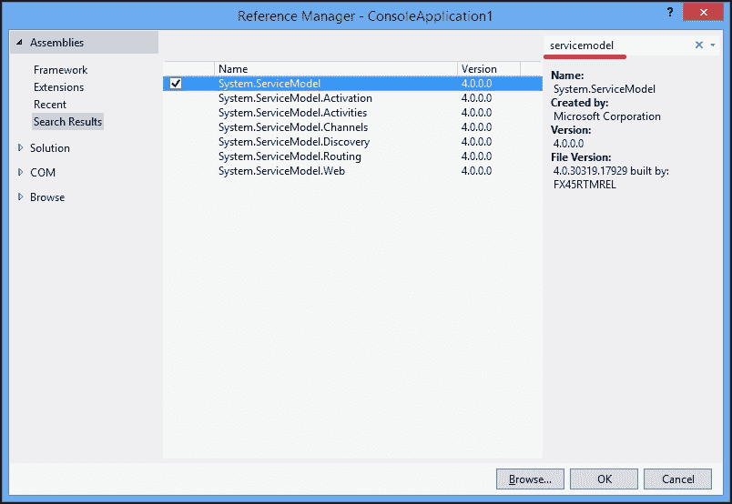

# 第九章。使用异步 I/O

在本章中，我们将详细回顾异步 I/O 操作。你将学习以下技巧：

+   异步处理文件

+   编写异步 HTTP 服务器和客户端

+   异步处理数据库

+   异步调用 WCF 服务

# 简介

在前面的章节中，我们已经讨论了正确使用异步 I/O 操作的重要性。为什么这很重要？为了有一个坚实的理解，让我们考虑两种类型的应用程序。

当我们在客户端运行应用程序时，最重要的事情之一是拥有一个响应式的用户界面。这意味着无论应用程序发生什么，所有的用户界面元素，如按钮和进度条，都保持快速运行，用户能够立即从应用程序中得到反应。这并不容易实现！如果你尝试在 Windows 中打开记事本文本编辑器，并尝试加载一个几兆字节的文本文件，应用程序窗口将冻结一段时间，因为整个文本首先是从磁盘加载的，然后程序才开始处理用户输入。

这是一个极其重要的问题，在这种情况下，唯一的解决方案是无论如何都要避免阻塞 UI 线程。这反过来又意味着为了防止阻塞 UI 线程，每个与 UI 相关的 API 必须只允许异步调用。这正是 Windows 8 操作系统重新设计 API 的关键原因，几乎用异步类似物替换了所有方法。但是，如果我们的应用程序使用多个线程来实现这个目标，这会影响性能吗？当然，会的！然而，考虑到我们只有一个用户，我们可能需要付出这个代价。让应用程序利用计算机的全部力量来提高效率是很好的，因为所有这些力量都是为了运行应用程序的单个用户。

让我们来看第二种情况。如果我们在一个服务器上运行应用程序，我们会遇到完全不同的状况。我们将可扩展性作为首要任务，这意味着单个用户应该尽可能少地消耗资源。如果我们为每个用户创建许多线程，我们根本无法很好地进行扩展。在高效地平衡我们的应用程序资源消耗方面，这是一个非常复杂的问题。例如，在微软的 Web 应用程序平台 ASP.NET 中，我们使用一个工作线程池来处理客户端请求。这个池中有限数量的工作线程，我们必须最小化每个工作线程的使用时间以实现可扩展性。这意味着我们必须尽快将其返回到池中，以便它可以处理另一个请求。如果我们启动一个需要计算的异步操作，我们将有一个非常低效的工作流程。首先，我们从线程池中取出一个工作线程来处理客户端请求。然后，我们再取出另一个工作线程并在其上启动一个异步操作。现在，我们有两个工作线程在处理我们的请求，但我们实际上只需要第一个线程做些有用的事情！遗憾的是，常见的情况是我们简单地等待异步操作完成，我们消耗了两个工作线程而不是一个。在这种情况下，异步操作实际上比同步执行还要差！我们不需要加载所有 CPU 核心，因为我们已经服务了许多客户端，因此正在使用所有的 CPU 计算能力。我们不需要保持第一个线程的响应性，因为我们没有用户界面。那么，为什么在服务器应用程序中要使用异步操作呢？

答案是，当存在异步 I/O 操作时，我们应该使用异步操作。今天，现代计算机通常有一个硬盘驱动器用于存储文件，以及一个网络卡用于在网络中发送和接收数据。这两个设备都有自己的微计算机，它们在非常低级别上管理 I/O 操作并向操作系统报告结果。这又是一个相当复杂的话题；但为了保持概念清晰，我们可以这样说，程序员有办法启动一个 I/O 操作，并提供给操作系统一段代码，当操作完成时由操作系统回调。在启动 I/O 任务和其完成之间，没有涉及 CPU 工作；这是在相应的磁盘和网络控制器微计算机上完成的。这种方式执行 I/O 任务被称为 I/O 线程；它们使用.NET 线程池实现，并最终使用操作系统提供的 I/O 完成端口基础设施。

在 ASP.NET 中，一旦从工作线程开始异步 I/O 操作，它就可以立即返回到线程池！在操作进行时，此线程可以服务其他客户端。最后，当操作发出完成信号时，ASP.NET 基础设施从线程池中获取一个空闲的工作线程（可能不同于启动操作的那个线程），并完成操作。

好吧；我们现在已经理解了 I/O 线程对于服务器应用程序的重要性。不幸的是，检查任何给定的 API 是否在底层使用 I/O 线程非常困难。除了研究源代码之外，唯一的方法就是简单地知道哪些 .NET Framework 类库利用了 I/O 线程。在本章中，我们将看到如何使用这些 API 之一。你将学习如何异步地处理文件，如何使用网络 I/O 创建 HTTP 服务器并调用 **Windows Communication Foundation** (**WCF**) 服务，以及如何使用异步 API 查询数据库。

### 注意

另一个需要考虑的重要问题是并行性。由于许多原因，密集的并行磁盘操作可能性能非常差。请注意，并行 I/O 操作通常非常无效，可能合理地以顺序方式处理 I/O，但以异步方式进行。

# 异步处理文件

这个示例指导我们如何创建文件以及如何异步地读取和写入数据。

## 准备工作

为了逐步执行此示例，你需要 Visual Studio 2015。没有其他先决条件。此示例的源代码可以在 `BookSamples\Chapter9\Recipe1` 中找到。

## 如何做...

为了了解如何异步处理文件，请执行以下步骤：

1.  启动 Visual Studio 2015。创建一个新的 C# 控制台应用程序项目。

1.  在 `Program.cs` 文件中，添加以下 `using` 指令：

    ```cs
    using System;
    using System.IO;
    using System.Linq;
    using System.Text;
    using System.Threading.Tasks;
    using static System.Console;
    using static System.Text.Encoding;
    ```

1.  在 `Main` 方法下方添加以下代码片段：

    ```cs
    const int BUFFER_SIZE = 4096;

    static async Task ProcessAsynchronousIO()
    {
      using (var stream = new FileStream(
        "test1.txt", FileMode.Create, FileAccess.ReadWrite, FileShare.None, BUFFER_SIZE))
      {
        WriteLine($"1\. Uses I/O Threads: {stream.IsAsync}");

        byte[] buffer = UTF8.GetBytes(CreateFileContent());
        var writeTask = Task.Factory.FromAsync(
          stream.BeginWrite, stream.EndWrite, buffer, 0, buffer.Length, null);

        await writeTask;
      }

      using (var stream = new FileStream("test2.txt", FileMode.Create, FileAccess.ReadWrite,FileShare.None, BUFFER_SIZE, FileOptions.Asynchronous))
      {
        WriteLine($"2\. Uses I/O Threads: {stream.IsAsync}");

        byte[] buffer = UTF8.GetBytes(CreateFileContent());
        var writeTask = Task.Factory.FromAsync(
          stream.BeginWrite, stream.EndWrite, buffer, 0, buffer.Length, null);

        await writeTask;
      }

      using (var stream = File.Create("test3.txt", BUFFER_SIZE, FileOptions.Asynchronous))
      using (var sw = new StreamWriter(stream))
      {
        WriteLine($"3\. Uses I/O Threads: {stream.IsAsync}");
        await sw.WriteAsync(CreateFileContent());
      }

      using (var sw = new StreamWriter("test4.txt", true))
      {
        WriteLine($"4\. Uses I/O Threads: {((FileStream)sw.BaseStream).IsAsync}");
        await sw.WriteAsync(CreateFileContent());
      }

      WriteLine("Starting parsing files in parallel");

      var readTasks = new Task<long>[4];
      for (int i = 0; i < 4; i++)
      {
        string fileName = $"test{i + 1}.txt";
        readTasks[i] = SumFileContent(fileName);
      }

      long[] sums = await Task.WhenAll(readTasks);

      WriteLine($"Sum in all files: {sums.Sum()}");

      WriteLine("Deleting files...");

      Task[] deleteTasks = new Task[4];
      for (int i = 0; i < 4; i++)
      {
        string fileName = $"test{i + 1}.txt";
        deleteTasks[i] = SimulateAsynchronousDelete(fileName);
      }

      await Task.WhenAll(deleteTasks);

      WriteLine("Deleting complete.");
    }

    static string CreateFileContent()
    {
      var sb = new StringBuilder();
      for (int i = 0; i < 100000; i++)
      {
        sb.Append($"{new Random(i).Next(0, 99999)}");
        sb.AppendLine();
      }
      return sb.ToString();
    }

    static async Task<long> SumFileContent(string fileName)
    {
      using (var stream = new FileStream(fileName, FileMode.Open, FileAccess.Read,FileShare.None, BUFFER_SIZE, FileOptions.Asynchronous))
      using (var sr = new StreamReader(stream))
      {
        long sum = 0;
        while (sr.Peek() > -1)
        {
          string line = await sr.ReadLineAsync();
          sum += long.Parse(line);
        }

        return sum;
      }
    }

    static Task SimulateAsynchronousDelete(string fileName)
    {
      return Task.Run(() => File.Delete(fileName));
    }
    ```

1.  在 `Main` 方法内添加以下代码片段：

    ```cs
    var t = ProcessAsynchronousIO();
    t.GetAwaiter().GetResult();
    ```

1.  运行程序。

## 它是如何工作的...

当程序运行时，我们以不同的方式创建四个文件并将它们填充随机数据。在第一种情况下，我们使用 `FileStream` 类及其方法，将异步编程模型 API 转换为任务；在第二种情况下，我们做同样的事情，但向 `FileStream` 构造函数提供 `FileOptions.Asynchronous`。

### 注意

使用 `FileOptions.Asynchronous` 选项非常重要。如果我们省略此选项，我们仍然可以以异步方式处理文件，但这只是线程池上的异步委托调用！只有当我们提供此选项（或在另一个构造函数重载中提供 bool `useAsync`）时，我们才使用 `FileStream` 类的 I/O 异步。

第三个案例使用一些简化的 API，例如`File.Create`方法和`StreamWriter`类。它仍然使用 I/O 线程，我们可以使用`stream.IsAsync`属性来检查。最后一个案例说明了过度简化也是不好的。在这里，我们没有利用 I/O 异步性，而是通过异步委托调用来模拟它。

现在，我们执行从文件的并行异步读取，汇总其内容，然后将其与彼此相加。最后，我们删除所有文件。由于在任何非 Windows 商店应用程序中都没有异步删除文件，我们使用`Task.Run`工厂方法来模拟异步性。

# 编写异步 HTTP 服务器和客户端

这个配方展示了如何创建一个简单的异步 HTTP 服务器。

## 准备工作

要逐步完成这个配方，你需要 Visual Studio 2015。没有其他先决条件。这个配方的源代码可以在`BookSamples\Chapter9\Recipe2`中找到。

## 如何做...

以下步骤演示了如何创建一个简单的异步 HTTP 服务器：

1.  启动 Visual Studio 2015。创建一个新的 C#控制台应用程序项目。

1.  添加对`System.Net.Http`框架库的引用。

1.  在`Program.cs`文件中，添加以下`using`指令：

    ```cs
    using System;
    using System.IO;
    using System.Net;
    using System.Net.Http;
    using System.Threading.Tasks;
    using static System.Console;
    ```

1.  在`Main`方法下方添加以下代码片段：

    ```cs
    static async Task GetResponseAsync(string url)
    {
      using (var client = new HttpClient())
      {
        HttpResponseMessage responseMessage = await client.GetAsync(url);
        string responseHeaders = responseMessage.Headers.ToString();
        string response = await responseMessage.Content.ReadAsStringAsync();

        WriteLine("Response headers:");
        WriteLine(responseHeaders);
        WriteLine("Response body:");
        WriteLine(response);
      }
    }

    class AsyncHttpServer
    {
      readonly HttpListener _listener;
      const string RESPONSE_TEMPLATE = 
            "<html><head><title>Test</title></head><body><h2>Testpage</h2>" +
    "<h4>Today is: {0}</h4></body></html>";

      public AsyncHttpServer(int portNumber)
      {
        _listener = new HttpListener();
        _listener.Prefixes.Add($"http://localhost:{portNumber}/");
      }

      public async Task Start()
      {
        _listener.Start();

        while (true)
        {
          var ctx = await _listener.GetContextAsync();
          WriteLine("Client connected...");
          var response = string.Format(RESPONSE_TEMPLATE, DateTime.Now);

          using (var sw = new StreamWriter(ctx.Response.OutputStream))
          {
            await sw.WriteAsync(response);
            await sw.FlushAsync();
          }
        }
      }

      public async Task Stop()
      {
        _listener.Abort();
      }
    }
    ```

1.  在`Main`方法内部添加以下代码片段：

    ```cs
    var server = new AsyncHttpServer(1234);
    var t = Task.Run(() => server.Start());
    WriteLine("Listening on port 1234\. Open http://localhost:1234 in your browser.");
    WriteLine("Trying to connect:");
    WriteLine();

    GetResponseAsync("http://localhost:1234").GetAwaiter().GetResult();

    WriteLine();
    WriteLine("Press Enter to stop the server.");
    ReadLine();

    server.Stop().GetAwaiter().GetResult();
    ```

1.  运行程序。

## 工作原理...

在这里，我们使用`HttpListener`类实现了一个非常简单的 Web 服务器。还有一个`TcpListener`类用于 TCP 套接字 I/O 操作。我们配置监听器以接受来自任何主机到本地机器`1234`端口的连接。然后，我们在一个单独的工作线程中启动监听器，以便我们可以从主线程控制它。

当我们使用`GetContextAsync`方法时发生异步 I/O 操作。不幸的是，它不接受`CancellationToken`用于取消场景；因此，当我们想要停止服务器时，我们只需调用`_listener.Abort`方法，这将放弃连接并停止服务器。

要在此服务器上执行异步请求，我们使用位于`System.Net.Http`程序集和相同命名空间中的`HttpClient`类。我们使用`GetAsync`方法发出异步 HTTP `GET`请求。还有其他 HTTP 请求的方法，例如`POST`、`DELETE`和`PUT`等。`HttpClient`还有许多其他选项，例如使用不同的格式（如 XML 和 JSON）序列化和反序列化对象，指定代理服务器地址、凭据等。

当您运行程序时，您可以看到服务器已经启动。在服务器代码中，我们使用 `GetContextAsync` 方法来接受新的客户端连接。此方法在新客户端连接时返回，我们只需将当前日期和时间输出为非常基本的 HTML 语言到响应中。然后，我们请求服务器并打印响应头和内容。您还可以打开浏览器并浏览到 `http://localhost:1234/`。在这里，您将在浏览器窗口中看到相同的响应。

# 异步处理数据库

此配方将引导我们通过创建数据库、用数据填充它以及异步读取数据的过程。

## 准备工作

要逐步执行此配方，您需要 Visual Studio 2015。无需其他先决条件。此配方的源代码可在 `BookSamples\Chapter9\Recipe3` 中找到。

## 如何操作...

要了解创建数据库、用数据填充它以及异步读取数据的过程，请执行以下步骤：

1.  启动 Visual Studio 2015。创建一个新的 C# 控制台应用程序项目。

1.  在 `Program.cs` 文件中，添加以下 `using` 指令：

    ```cs
    using System;
    using System.Data;
    using System.Data.SqlClient;
    using System.IO;
    using System.Reflection;
    using System.Threading.Tasks;
    using static System.Console;
    ```

1.  在 `Main` 方法下方添加以下代码片段：

    ```cs
    static async Task ProcessAsynchronousIO(string dbName)
    {
      try
      {
        const string connectionString =
                @"Data Source=(LocalDB)\MSSQLLocalDB;Initial Catalog=master;" +
                "Integrated Security=True";

        string outputFolder = Path.GetDirectoryName(
                Assembly.GetExecutingAssembly().Location);

        string dbFileName = Path.Combine(outputFolder, $"{dbName}.mdf");
        string dbLogFileName = Path.Combine(outputFolder, $"{dbName}_log.ldf");

        string dbConnectionString = 
          @"Data Source=(LocalDB)\MSSQLLocalDB;" +
          $"AttachDBFileName={dbFileName};Integrated Security=True;";

        using (var connection = new SqlConnection(connectionString))
        {
          await connection.OpenAsync();

          if (File.Exists(dbFileName))
          {
            WriteLine("Detaching the database...");

            var detachCommand = new SqlCommand("sp_detach_db", connection);
            detachCommand.CommandType = CommandType.StoredProcedure;
            detachCommand.Parameters.AddWithValue("@dbname", dbName);

            await detachCommand.ExecuteNonQueryAsync();

            WriteLine("The database was detached succesfully.");
            WriteLine("Deleting the database...");

            if(File.Exists(dbLogFileName)) File.Delete(dbLogFileName);
            File.Delete(dbFileName);

            WriteLine("The database was deleted succesfully.");
          }

          WriteLine("Creating the database...");
          string createCommand = 
                    $"CREATE DATABASE {dbName} ON (NAME = N'{dbName}', FILENAME = " +
                    $"'{dbFileName}')";
          var cmd = new SqlCommand(createCommand, connection);

          await cmd.ExecuteNonQueryAsync();
          WriteLine("The database was created succesfully");
        }

        using (var connection = new SqlConnection(dbConnectionString))
        {
          await connection.OpenAsync();

          var cmd = new SqlCommand("SELECT newid()", connection);
          var result = await cmd.ExecuteScalarAsync();

          WriteLine($"New GUID from DataBase: {result}");

          cmd = new SqlCommand(
    @"CREATE TABLE [dbo].CustomTable NOT NULL, " + 
    "[Name] nvarchar NOT NULL, CONSTRAINT [PK_ID] PRIMARY KEY CLUSTERED " + 
    " ([ID] ASC) ON [PRIMARY]) ON [PRIMARY]", connection);

                await cmd.ExecuteNonQueryAsync();

          WriteLine("Table was created succesfully.");

          cmd = new SqlCommand(
    @"INSERT INTO [dbo].[CustomTable] (Name) VALUES ('John');
    INSERT INTO [dbo].[CustomTable] (Name) VALUES ('Peter');
    INSERT INTO [dbo].[CustomTable] (Name) VALUES ('James');
    INSERT INTO [dbo].[CustomTable] (Name) VALUES ('Eugene');", connection);
          await cmd.ExecuteNonQueryAsync();

          WriteLine("Inserted data succesfully");
          WriteLine("Reading data from table...");

          cmd = new SqlCommand(@"SELECT * FROM [dbo].[CustomTable]", connection);
          using (SqlDataReader reader = await cmd.ExecuteReaderAsync())
          {
            while (await reader.ReadAsync())
            {
              var id = reader.GetFieldValue<int>(0);
              var name = reader.GetFieldValue<string>(1);

              WriteLine("Table row: Id {0}, Name {1}", id, name);
            }
          }
        }
      }
      catch(Exception ex)
      {
        WriteLine("Error: {0}", ex.Message);
      }
    }
    ```

1.  在 `Main` 方法内添加以下代码片段：

    ```cs
    const string dataBaseName = "CustomDatabase";
    var t = ProcessAsynchronousIO(dataBaseName);
    t.GetAwaiter().GetResult();
    Console.WriteLine("Press Enter to exit");
    Console.ReadLine();
    ```

1.  运行程序。

## 它是如何工作的...

此程序与名为 SQL Server 2014 LocalDb 的软件一起工作。它与 Visual Studio 2015 一起安装，应该可以正常工作。然而，如果出现错误，您可能希望从安装向导中修复此组件。

我们首先配置到数据库文件的路径。我们将数据库文件放置在程序执行文件夹中。将有两个文件：一个用于数据库本身，另一个用于事务日志文件。我们还配置了两个连接字符串，用于定义我们如何连接到数据库。第一个是连接到 LocalDb 引擎以分离数据库；如果它已经存在，则删除并重新创建它。我们在打开连接和执行 SQL 命令时利用 I/O 异步性，分别使用 `OpenAsync` 和 `ExecuteNonQueryAsync` 方法。

在此任务完成后，我们附加一个新创建的数据库。在这里，我们创建一个新表并在其中插入一些数据。除了之前提到的方法外，我们还使用 `ExecuteScalarAsync` 以异步方式从数据库引擎获取标量值，并使用 `SqlDataReader.ReadAsync` 方法异步地从数据库表读取数据行。

如果我们的数据库中有一个大表，其行包含大二进制值，那么我们会使用 `CommandBehavior.SequentialAcess` 枚举来创建数据读取器，并使用 `GetFieldValueAsync` 方法异步地从读取器获取大字段值。

# 异步调用 WCF 服务

此配方将描述如何创建 WCF 服务，如何在控制台应用程序中托管它，如何使服务元数据对客户端可用，以及如何以异步方式使用它。

## 准备工作

要逐步执行此配方，您需要 Visual Studio 2015。没有其他先决条件。此配方的源代码可以在`BookSamples\Chapter9\Recipe4`中找到。

## 如何操作...

要了解如何使用 WCF 服务，请执行以下步骤：

1.  启动 Visual Studio 2015。创建一个新的 C#控制台应用程序项目。

1.  添加对`System.ServiceModel`库的引用。在项目中的`References`文件夹上右键单击，并选择**添加引用…**菜单选项。添加对`System.ServiceModel`库的引用。您可以在引用管理器对话框中使用搜索功能，如图所示：

1.  在`Program.cs`文件中，添加以下`using`指令：

    ```cs
    using System;
    using System.ServiceModel;
    using System.ServiceModel.Description;
    using System.Threading.Tasks;
    using static System.Console;
    ```

1.  在`Main`方法下方添加以下代码片段：

    ```cs
    const string SERVICE_URL = "http://localhost:1234/HelloWorld";

    static async Task RunServiceClient()
    {
      var endpoint = new EndpointAddress(SERVICE_URL);
      var channel = ChannelFactory<IHelloWorldServiceClient>
            .CreateChannel(new BasicHttpBinding(), endpoint);

      var greeting = await channel.GreetAsync("Eugene");
      WriteLine(greeting);
    }

    [ServiceContract(Namespace = "Packt", Name = "HelloWorldServiceContract")]
    public interface IHelloWorldService
    {
      [OperationContract]
      string Greet(string name);
    }

    [ServiceContract(Namespace = "Packt", Name = "HelloWorldServiceContract")]
    public interface IHelloWorldServiceClient
    {
      [OperationContract]
      string Greet(string name);

      [OperationContract]
      Task<string> GreetAsync(string name);
    }

    public class HelloWorldService : IHelloWorldService
    {
      public string Greet(string name)
      {
        return $"Greetings, {name}!";
      }
    }
    ```

1.  在`Main`方法内部添加以下代码片段：

    ```cs
    ServiceHost host = null;

    try
    {
      host = new ServiceHost(typeof (HelloWorldService), new Uri(SERVICE_URL));
      var metadata = host.Description.Behaviors.Find<ServiceMetadataBehavior>() 
            ?? new ServiceMetadataBehavior();

      metadata.HttpGetEnabled = true;
      metadata.MetadataExporter.PolicyVersion = PolicyVersion.Policy15;
      host.Description.Behaviors.Add(metadata);

      host.AddServiceEndpoint(ServiceMetadataBehavior.MexContractName, 
            MetadataExchangeBindings.CreateMexHttpBinding(), "mex");

      var endpoint = host.AddServiceEndpoint(typeof (IHelloWorldService),new BasicHttpBinding(), SERVICE_URL);

      host.Faulted += (sender, e) => WriteLine("Error!");

      host.Open();

      WriteLine("Greeting service is running and listening on:");
      WriteLine($"{endpoint.Address} ({endpoint.Binding.Name})");

      var client = RunServiceClient();
      client.GetAwaiter().GetResult();

      WriteLine("Press Enter to exit");
      ReadLine();
    }
    catch (Exception ex)
    {
      WriteLine($"Error in catch block: {ex}");
    }
    finally
    {
      if (null != host)
      {
        if (host.State == CommunicationState.Faulted)
        {
          host.Abort();
        }
        else
        {
          host.Close();
        }
      }
    }
    ```

1.  运行程序。

## 它是如何工作的...

WCF 是一个框架，允许我们以不同的方式调用远程服务。其中之一，在一段时间前非常流行，是通过使用基于 XML 的协议**简单对象访问协议**（**SOAP**）通过 HTTP 调用远程服务。当服务器应用程序调用另一个远程服务时，这是很常见的，并且可以使用 I/O 线程来完成。

Visual Studio 2015 对 WCF 服务提供了丰富的支持；例如，您可以使用**添加服务引用**菜单选项添加对这类服务的引用。您也可以用我们的服务来做这件事，因为我们提供了服务元数据。

要创建这样的服务，我们需要使用`ServiceHost`类来托管我们的服务。我们通过提供服务实现类型和基础 URI 来描述我们将托管的服务。然后，我们配置元数据端点和服务端点。最后，在出现错误时处理`Faulted`事件，并运行托管服务。

### 注意

请注意，由于它使用 HTTP 绑定，而 HTTP 绑定又使用`http.sys`，因此需要特殊权限来创建，我们需要有管理员权限来运行服务。您可以在管理员模式下运行 Visual Studio，或者在提升的命令提示符中运行以下命令来添加必要的权限：

```cs
netsh http add urlacl url=http://+:1234/HelloWorld user=machine\user
```

要消费此服务，我们创建一个客户端，这里就是主要技巧所在。在服务器端，我们有一个名为`Greet`的常规同步方法。此方法在服务合同`IHelloWorldService`中定义。然而，如果我们想利用异步网络 I/O，我们必须异步调用此方法。我们可以通过创建一个新的服务合同，其中包含匹配的命名空间和服务名称，来定义同步和基于任务异步方法。尽管在服务器端我们没有异步方法定义，但我们遵循命名约定，WCF 基础设施理解我们想要创建一个异步代理方法。

因此，当我们创建一个 `IHelloWorldServiceClient` 代理通道，并且 WCF 正确地将异步调用路由到服务器端的同步方法时，如果你让应用程序继续运行，你可以打开浏览器并使用其 URL 访问服务，即 `http://localhost:1234/HelloWorld`。将打开一个服务描述，你可以浏览到允许我们从 Visual Studio 2012 添加服务引用的 XML 元数据。如果你尝试生成引用，你会看到稍微复杂一些的代码，但它是由自动生成的，并且易于使用。
