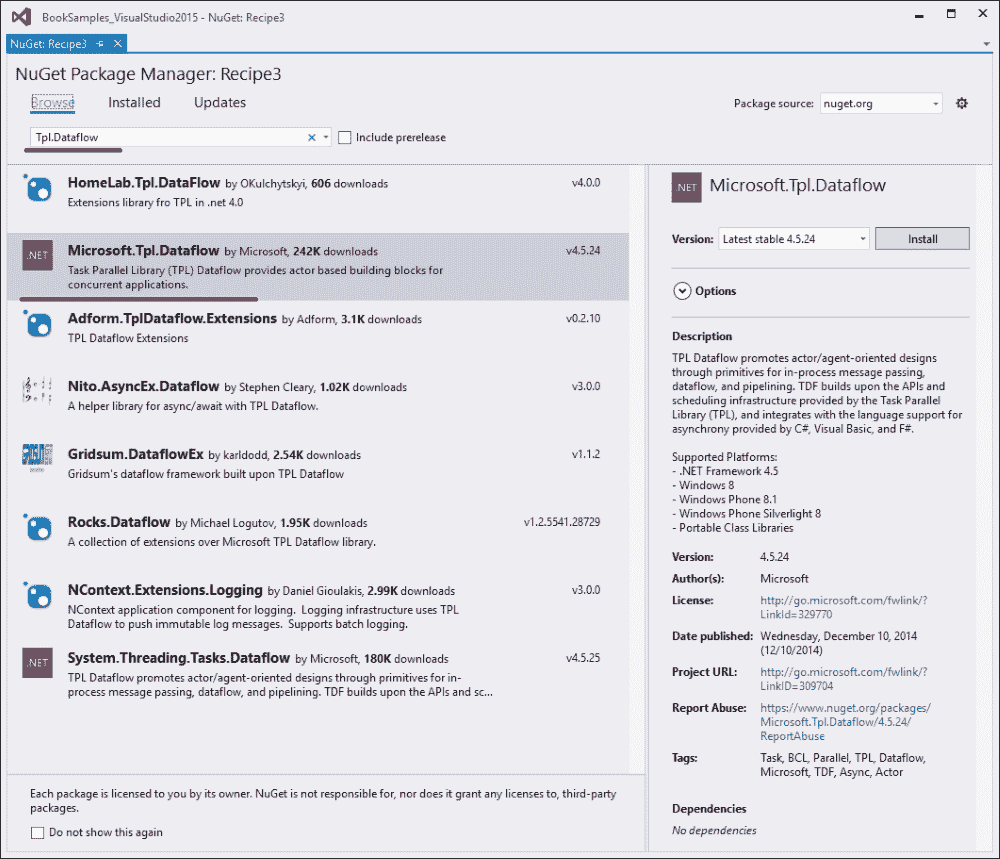

# 第十章. 并行编程模式

在本章中，我们将回顾程序员在尝试实现并行工作流程时经常遇到的一些常见问题。你将学习以下技巧：

+   实现延迟评估的共享状态

+   使用 `BlockingCollection` 实现并行管道

+   使用 TPL DataFlow 实现并行管道

+   使用 PLINQ 实现 Map/Reduce

# 简介

编程模式意味着对给定问题的具体和标准解决方案。通常，编程模式是人们积累经验、分析常见问题并为这些问题提供解决方案的结果。

由于并行编程已经存在了很长时间，因此有许多不同的模式被用来编写并行应用程序。甚至还有专门的编程语言来简化特定并行算法的编程。然而，事情开始变得越来越复杂。在本章中，我将为你提供一个起点，从这里你可以进一步学习并行编程。我们将回顾一些非常基础但非常有用的模式，这些模式对于并行编程中的许多常见情况非常有帮助。

首先，我们将使用来自多个线程的 **共享状态对象**。我想强调的是，你应该尽可能避免使用它。正如我们在前面的章节中讨论的那样，当编写并行算法时，共享状态真的很糟糕，但在许多情况下，它是不可避免的。我们将找出如何延迟对象的实际计算直到它被需要，以及如何实现不同的场景以实现线程安全。

然后，我们将向你展示如何创建一个结构化的并行数据流。我们将回顾一个具体的案例，即生产者/消费者模式，被称为 **Parallel Pipeline**。我们计划通过首先阻塞集合来实现它，然后我们将看到来自微软的另一个库——**TPL DataFlow** 对于并行编程是多么有帮助。

我们将要研究的最后一个模式是 **Map/Reduce** 模式。在现代世界中，这个名字可能意味着非常不同的事情。有些人认为 Map/Reduce 不是一个通用的方法来解决任何问题，而是一个针对大型、分布式集群计算的具体实现。我们将找出这个模式名称背后的含义，并回顾一些在小规模并行应用中可能的工作方式。

# 实现延迟评估的共享状态

这个技巧展示了如何编程一个延迟评估、线程安全的共享状态对象。

## 准备工作

要开始这个技巧，你需要运行 Visual Studio 2015。没有其他先决条件。这个技巧的源代码可以在 `BookSamples\Chapter10\Recipe1` 中找到。

## 如何做到这一点...

要实现延迟评估的共享状态，执行以下步骤：

1.  启动 Visual Studio 2015。创建一个新的 C# 控制台应用程序项目。

1.  在 `Program.cs` 文件中，添加以下 `using` 指令：

    ```cs
    using System;
    using System.Threading;
    using System.Threading.Tasks;
    using static System.Console;
    using static System.Threading.Thread;
    ```

1.  在`Main`方法下方添加以下代码片段：

    ```cs
    static async Task ProcessAsynchronously()
    {
      var unsafeState = new UnsafeState();
      Task[] tasks = new Task[4];

      for (int i = 0; i < 4; i++)
      {
        tasks[i] = Task.Run(() => Worker(unsafeState));
      }
      await Task.WhenAll(tasks);
      WriteLine(" --------------------------- ");

      var firstState = new DoubleCheckedLocking();
      for (int i = 0; i < 4; i++)
      {
        tasks[i] = Task.Run(() => Worker(firstState));
      }

      await Task.WhenAll(tasks);
      WriteLine(" --------------------------- ");

      var secondState = new BCLDoubleChecked();
      for (int i = 0; i < 4; i++)
      {
        tasks[i] = Task.Run(() => Worker(secondState));
      }

      await Task.WhenAll(tasks);
      WriteLine(" --------------------------- ");

      var lazy = new Lazy<ValueToAccess>(Compute);
          var thirdState = new LazyWrapper(lazy);
      for (int i = 0; i < 4; i++)
      {
        tasks[i] = Task.Run(() => Worker(thirdState));
      }

      await Task.WhenAll(tasks);
      WriteLine(" --------------------------- ");

      var fourthState = new BCLThreadSafeFactory();
      for (int i = 0; i < 4; i++)
      {
        tasks[i] = Task.Run(() => Worker(fourthState));
      }

      await Task.WhenAll(tasks);
      WriteLine(" --------------------------- ");

    }

    static void Worker(IHasValue state)
    {
      WriteLine($"Worker runs on thread id {CurrentThread.ManagedThreadId}");
      WriteLine($"State value: {state.Value.Text}");
    }

    static ValueToAccess Compute()
    {
      WriteLine("The value is being constructed on a thread " +
            $"id {CurrentThread.ManagedThreadId}");
      Sleep(TimeSpan.FromSeconds(1));
      return new ValueToAccess(
                $"Constructed on thread id {CurrentThread.ManagedThreadId}");
    }

    class ValueToAccess
    {
      private readonly string _text; 
      public ValueToAccess(string text)
      {
        _text = text;
      }

      public string Text => _text;
    }

    class UnsafeState : IHasValue
    {
      private ValueToAccess _value;

      public ValueToAccess Value =>_value ?? (_value = Compute());
    }

    class DoubleCheckedLocking : IHasValue
    {
      private readonly object _syncRoot = new object();
      private volatile ValueToAccess _value;

      public ValueToAccess Value
      {
        get
        {
          if (_value == null)
          {
            lock (_syncRoot)
            {
              if (_value == null) _value = Compute();
            }
          }
          return _value;
        }
      }
    }

    class BCLDoubleChecked : IHasValue
    {
      private object _syncRoot = new object();
      private ValueToAccess _value;
      private bool _initialized;

      public ValueToAccess Value => LazyInitializer.EnsureInitialized(
        ref _value, ref _initialized, ref _syncRoot, Compute);
    }

    class BCLThreadSafeFactory : IHasValue
    {
      private ValueToAccess _value;

      public ValueToAccess Value => LazyInitializer.EnsureInitialized(ref _value, Compute);
    }

    class LazyWrapper : IHasValue
    {
      private readonly Lazy<ValueToAccess> _value;

      public LazyWrapper(Lazy<ValueToAccess> value )
      {
        _value = value;
      }

      public ValueToAccess Value => _value.Value;
    }

    interface IHasValue
    {
      ValueToAccess Value { get; }
    }
    ```

1.  在`Main`方法内添加以下代码片段：

    ```cs
    var t = ProcessAsynchronously();
    t.GetAwaiter().GetResult();
    ```

1.  运行程序。

## 它是如何工作的...

第一个示例显示了为什么在多个访问线程中使用`UnsafeState`对象是不安全的。我们看到`Construct`方法被多次调用，不同的线程使用不同的值，这显然是不正确的。为了修复这个问题，我们可以在读取值时使用一个锁，如果它尚未初始化，首先创建它。这将有效，但使用锁进行每次读取操作并不高效。为了避免每次都使用锁，我们可以使用一个传统的称为**双重检查锁定**模式的方法。我们第一次检查值，如果它不是 null，我们避免不必要的锁定并直接使用共享对象。然而，如果它尚未构造，我们使用锁然后第二次检查值，因为它可能在我们的第一次检查和锁操作之间被初始化。如果它仍然未初始化，我们才计算值。我们可以清楚地看到这种方法在第二个示例中是有效的——只有一个`Construct`方法的调用，第一个调用的线程定义了共享对象状态。

### 注意

注意，如果延迟计算的对象实现是线程安全的，这并不意味着它的所有属性也都是线程安全的。

例如，如果你向`ValueToAccess`对象添加一个`int`公共属性，它将不是线程安全的；你仍然必须使用互斥构造或锁定来确保线程安全。

这种模式非常常见，这就是为什么在基类库中有几个类帮助我们。首先，我们可以使用`LazyInitializer.EnsureInitialized`方法，它在内部实现了双重检查锁定模式。然而，最舒适的选项是使用`Lazy<T>`类，它允许我们开箱即用就有线程安全、延迟计算的共享状态。接下来的两个示例表明，它们与第二个示例是等价的，程序的行为也是相同的。唯一的区别是，由于`LazyInitializer`是一个静态类，我们不需要创建一个新实例，就像在`Lazy<T>`的情况下，因此，在某些罕见场景中，第一种情况下的性能可能会更好。

最后一个选项是，如果我们不关心`Construct`方法，可以完全避免锁定。如果它是线程安全的并且没有副作用/严重的性能影响，我们只需运行几次，但只使用第一个构造的值。最后一个示例显示了描述的行为，我们可以使用另一个`LazyInitializer.EnsureInitialized`方法重载来实现这个结果。

# 使用 BlockingCollection 实现并行管道

这个配方将描述如何使用标准的`BlockingCollection`数据结构实现生产者/消费者模式的一个特定场景，这被称为并行管道。

## 准备工作

要开始这个食谱，你需要运行 Visual Studio 2015。没有其他先决条件。这个食谱的源代码可以在`BookSamples\Chapter10\Recipe2`找到。

## 如何实现...

要了解如何使用`BlockingCollection`实现并行管道，请执行以下步骤：

1.  启动 Visual Studio 2015。创建一个新的 C# 控制台应用程序项目。

1.  在`Program.cs`文件中添加以下`using`指令：

    ```cs
    using System;
    using System.Collections.Concurrent;
    using System.Globalization;
    using System.Linq;
    using System.Threading;
    using System.Threading.Tasks;
    using static System.Console;
    using static System.Threading.Thread;
    ```

1.  在`Main`方法下方添加以下代码片段：

    ```cs
    private const int CollectionsNumber = 4;
    private const int Count = 5;

    static void CreateInitialValues(BlockingCollection<int>[] sourceArrays, CancellationTokenSource cts)
    {
      Parallel.For(0, sourceArrays.Length*Count, (j, state) =>
      {
          if (cts.Token.IsCancellationRequested)
          {
              state.Stop();
          }

          int number = GetRandomNumber(j);
          int k = BlockingCollection<int>.TryAddToAny(sourceArrays, j);
          if (k >= 0)
          {
              WriteLine(
                  $"added {j} to source data on thread " +
                  $"id {CurrentThread.ManagedThreadId}");
              Sleep(TimeSpan.FromMilliseconds(number));
          }
      });
      foreach (var arr in sourceArrays)
      {
          arr.CompleteAdding();
      }
    }

    static int GetRandomNumber(int seed)
    {
      return new Random(seed).Next(500);
    }

    class PipelineWorker<TInput, TOutput>
    {
      Func<TInput, TOutput> _processor;
      Action<TInput> _outputProcessor;
      BlockingCollection<TInput>[] _input;
      CancellationToken _token;
      Random _rnd;

      public PipelineWorker(
          BlockingCollection<TInput>[] input,
          Func<TInput, TOutput> processor,
          CancellationToken token,
          string name)
      {
        _input = input;
        Output = new BlockingCollection<TOutput>[_input.Length];
        for (int i = 0; i < Output.Length; i++)
          Output[i] = null == input[i] ? null
            : new BlockingCollection<TOutput>(Count);

        _processor = processor;
        _token = token;
        Name = name;
        _rnd = new Random(DateTime.Now.Millisecond);
      }

      public PipelineWorker(
          BlockingCollection<TInput>[] input,
          Action<TInput> renderer,
          CancellationToken token,
          string name)
      {
        _input = input;
        _outputProcessor = renderer;
        _token = token;
        Name = name;
        Output = null;
        _rnd = new Random(DateTime.Now.Millisecond);
        }

      public BlockingCollection<TOutput>[] Output { get; private set; }

      public string Name { get; private set; }

      public void Run()
      {
        WriteLine($"{Name} is running");
        while (!_input.All(bc => bc.IsCompleted) && 
          !_token.IsCancellationRequested)
        {
          TInput receivedItem;
          int i = BlockingCollection<TInput>.TryTakeFromAny(
              _input, out receivedItem, 50, _token);
          if (i >= 0)
          {
            if (Output != null)
            {
              TOutput outputItem = _processor(receivedItem);
            BlockingCollection<TOutput>.AddToAny(
                Output, outputItem);
            WriteLine($"{Name} sent {outputItem} to next, on " +
            $"thread id {CurrentThread.ManagedThreadId}");
            Sleep(TimeSpan.FromMilliseconds(_rnd.Next(200)));
            }
            else
            {
              _outputProcessor(receivedItem);
            }
          }
          else
          {
            Sleep(TimeSpan.FromMilliseconds(50));
          }
        }
        if (Output != null)
        {
          foreach (var bc in Output) bc.CompleteAdding();
        }
      }
    }
    ```

1.  在`Main`方法内部添加以下代码片段：

    ```cs
    var cts = new CancellationTokenSource();

    Task.Run(() =>
    {
      if (ReadKey().KeyChar == 'c') cts.Cancel();
    }, 
    cts.Token);

    var sourceArrays = new BlockingCollection<int>[CollectionsNumber];

    for (int i = 0; i < sourceArrays.Length; i++)
    {
      sourceArrays[i] = new BlockingCollection<int>(Count);
    }

    var convertToDecimal = new PipelineWorker<int, decimal>
    (
      sourceArrays,
      n => Convert.ToDecimal(n*100),
      cts.Token,
      "Decimal Converter"
    );

    var stringifyNumber = new PipelineWorker<decimal, string>
    (
      convertToDecimal.Output,
      s => $"--{s.ToString("C", CultureInfo.GetCultureInfo("en-us"))}--",
      cts.Token,
      "String Formatter"
      );

    var outputResultToConsole = new PipelineWorker<string, string>
    (
      stringifyNumber.Output,
      s => WriteLine($"The final result is {s} on thread " +
                $"id {CurrentThread.ManagedThreadId}"),
      cts.Token,
      "Console Output"
      );

    try
    {
      Parallel.Invoke(
        () =>
        CreateInitialValues(sourceArrays, cts),
        () => convertToDecimal.Run(),
        () => stringifyNumber.Run(),
        () => outputResultToConsole.Run()
      );
    }
    catch (AggregateException ae)
    {
      foreach (var ex in ae.InnerExceptions)
        WriteLine(ex.Message + ex.StackTrace);
    }

    if (cts.Token.IsCancellationRequested)
    {
      WriteLine("Operation has been canceled! Press ENTER to exit.");
    }
    else
    {
      WriteLine("Press ENTER to exit.");
    }
    ReadLine();
    ```

1.  运行程序。

## 它是如何工作的...

在前面的例子中，我们实现了最常见的并行编程场景之一。想象一下，我们有一些数据需要通过几个计算阶段，这需要相当长的时间。后一个计算需要前一个计算的结果，所以我们不能并行运行它们。

如果我们只有一个项目要处理，那么提高性能的可能性并不多。然而，如果我们让许多项目通过相同的计算阶段，我们可以使用并行管道技术。这意味着我们不必等到所有项目都通过第一个计算阶段才能进入下一个阶段。只要有一个项目完成了阶段，我们就可以将其移动到下一个阶段；同时，下一个项目正在由前一个阶段处理，以此类推。结果，我们几乎实现了通过第一个项目通过第一个计算阶段所需的时间来实现的并行处理。

这里，我们为每个处理阶段使用四个集合，说明我们可以并行处理每个阶段。我们首先提供通过按*C*键取消整个过程的可能性。我们创建了一个取消令牌，并运行一个单独的任务来监控*C*键。然后，我们定义我们的管道。它由三个主要阶段组成。第一个阶段是我们将初始数字放在前四个集合中，这些集合作为后续管道的项目源。这段代码位于`CreateInitialValues`方法的`Parallel.For`循环内部，而`Parallel.Invoke`语句则表示我们并行运行所有阶段；初始阶段也是并行运行的。

下一个阶段是定义我们的管道元素。逻辑定义在`PipelineWorker`类内部。我们使用输入集合初始化工作者，提供一个转换函数，然后与其他工作者并行运行工作者。这样，我们定义了两个工作者，或者过滤器，因为它们过滤初始序列。其中一个将整数转换为十进制值，另一个将十进制转换为字符串。最后，最后一个工作者只是将每个传入的字符串打印到控制台。在所有地方，我们提供了一个运行线程 ID，以查看一切是如何工作的。此外，我们还添加了人工延迟，以便项目的处理更加自然，因为我们实际上使用了重计算。

因此，我们看到了预期的确切行为。首先，在初始集合中创建了一些项目。然后，我们看到第一个过滤器开始处理它们，在它们被处理的同时，第二个过滤器开始工作。最后，项目被发送到最后一个工作器，它将项目打印到控制台。

# 使用 TPL DataFlow 实现并行管道

这个食谱展示了如何使用 TPL DataFlow 库实现并行管道模式。

## 准备中

要开始这个食谱，你需要运行 Visual Studio 2015。没有其他先决条件。这个食谱的源代码可以在`BookSamples\Chapter10\Recipe3`中找到。

## 如何做...

要了解如何使用 TPL DataFlow 实现并行管道，请执行以下步骤：

1.  启动 Visual Studio 2015。创建一个新的 C#控制台应用程序项目。

1.  将引用添加到**Microsoft TPL DataFlow** NuGet 包。按照以下步骤操作：

    1.  右键单击项目中的**引用**文件夹，并选择**管理 NuGet 包...**菜单选项。

    1.  现在，将你喜欢的引用添加到**Microsoft TPL DataFlow** NuGet 包中。你可以在**管理 NuGet 包**对话框中使用搜索选项，如下所示：

    

1.  在`Program.cs`文件中，添加以下`using`指令：

    ```cs
    using System;
    using System.Globalization;
    using System.Threading;
    using System.Threading.Tasks;
    using System.Threading.Tasks.Dataflow;
    using static System.Console;
    using static System.Threading.Thread;
    ```

1.  在`Main`方法下方添加以下代码片段：

    ```cs
    async static Task ProcessAsynchronously()
    {
      var cts = new CancellationTokenSource();
      Random _rnd = new Random(DateTime.Now.Millisecond);

      Task.Run(() =>
      {
        if (ReadKey().KeyChar == 'c')
          cts.Cancel();
      }, cts.Token);

      var inputBlock = new BufferBlock<int>(
        new DataflowBlockOptions { BoundedCapacity = 5, CancellationToken = cts.Token });

      var convertToDecimalBlock = new TransformBlock<int, decimal>(
        n =>
        {
          decimal result = Convert.ToDecimal(n * 100);
          WriteLine($"Decimal Converter sent {result} to the next stage on " +
                  $"thread id {CurrentThread.ManagedThreadId}");
          Sleep(TimeSpan.FromMilliseconds(_rnd.Next(200)));
          return result;
        }
        , new ExecutionDataflowBlockOptions { MaxDegreeOfParallelism = 4, CancellationToken = cts.Token });

      var stringifyBlock = new TransformBlock<decimal, string>(
        n =>
        {
          string result = $"--{n.ToString("C", CultureInfo.GetCultureInfo("en-us"))}--";
          WriteLine($"String Formatter sent {result} to the next stage on thread id {CurrentThread.ManagedThreadId}");
          Sleep(TimeSpan.FromMilliseconds(_rnd.Next(200)));
          return result;
        }
        , new ExecutionDataflowBlockOptions { MaxDegreeOfParallelism = 4, CancellationToken = cts.Token });

      var outputBlock = new ActionBlock<string>(
        s =>
        {
          WriteLine($"The final result is {s} on thread id {CurrentThread.ManagedThreadId}");
        }
        , new ExecutionDataflowBlockOptions { MaxDegreeOfParallelism = 4, CancellationToken = cts.Token });

      inputBlock.LinkTo(convertToDecimalBlock, new DataflowLinkOptions { PropagateCompletion = true });
      convertToDecimalBlock.LinkTo(stringifyBlock, new DataflowLinkOptions { PropagateCompletion = true });
      stringifyBlock.LinkTo(outputBlock, new DataflowLinkOptions { PropagateCompletion = true });

      try
      {
        Parallel.For(0, 20, new ParallelOptions { MaxDegreeOfParallelism = 4, CancellationToken = cts.Token }
        , i =>
        {
          WriteLine($"added {i} to source data on thread id {CurrentThread.ManagedThreadId}");
          inputBlock.SendAsync(i).GetAwaiter().GetResult();
        });
        inputBlock.Complete();
        await outputBlock.Completion;
        WriteLine("Press ENTER to exit.");
      }
      catch (OperationCanceledException)
      {
        WriteLine("Operation has been canceled! Press ENTER to exit.");
      }

      ReadLine();
    }
    ```

1.  在`Main`方法内部添加以下代码片段：

    ```cs
    var t = ProcessAsynchronously();
    t.GetAwaiter().GetResult();
    ```

1.  运行程序。

## 它是如何工作的...

在前面的食谱中，我们实现了一个并行管道模式，通过顺序阶段处理项目。这是一个相当常见的问题，提出编程此类算法的方法之一是使用来自 Microsoft 的 TPL DataFlow 库。它通过 NuGet 分发，易于安装和使用。

TPL DataFlow 库包含不同类型的块，这些块可以用不同的方式相互连接，形成复杂的过程，可以在需要时部分并行和顺序执行。为了查看一些可用的基础设施，让我们使用 TPL DataFlow 库实现前面的场景。

首先，我们定义了将处理我们的数据的不同块。请注意，这些块在构建时可以指定不同的选项；它们可能非常重要。例如，我们将取消令牌传递到我们定义的每个块中，当我们发出取消信号时，它们都会停止工作。

我们从`BufferBlock`开始我们的过程，将其容量绑定到最大 5 个项目。此块持有项目，以便将它们传递到流程中的下一个块。我们将其限制为五项容量，指定`BoundedCapacity`选项值。这意味着当此块中有五个项目时，它将停止接受新项目，直到现有项目中的一个传递到下一个块。

下一个块类型是`TransformBlock`。这个块用于数据转换步骤。在这里，我们定义了两个转换块；其中一个将整数转换为小数，另一个将小数值转换为字符串。我们可以使用`MaxDegreeOfParallelism`选项为此块指定最大同时工作线程数。

最后一个块是`ActionBlock`类型。这个块将在每个传入的项目上运行指定的操作。我们使用这个块将项目打印到控制台。

现在，我们使用`LinkTo`方法将这些块连接起来。在这里，我们有一个简单的顺序数据流，但也可以创建更复杂的方案。在这里，我们还提供了`DataflowLinkOptions`，并将`PropagateCompletion`属性设置为`true`。这意味着当步骤完成时，它将自动将结果和异常传播到下一个阶段。然后，我们并行地向缓冲块添加项目，当我们完成添加新项目后，调用块的`Complete`方法。然后，我们等待最后一个块完成。在取消的情况下，我们处理`OperationCancelledException`并取消整个过程。

# 使用 PLINQ 实现 Map/Reduce

这个食谱将描述如何在使用 PLINQ 的同时实现 Map/Reduce 模式。

## 准备工作

要开始这个食谱，你需要运行 Visual Studio 2015。没有其他先决条件。这个食谱的源代码可以在`BookSamples\Chapter10\Recipe4`找到。

## 如何操作...

要了解如何使用 PLINQ 实现 Map/Reduce，请执行以下步骤：

1.  启动 Visual Studio 2015。创建一个新的 C#控制台应用程序项目。

1.  在`Program.cs`文件中，添加以下`using`指令：

    ```cs
    using System;
    using System.Collections.Generic;
    using System.IO;
    using System.Linq;
    using System.Net.Http;
    using System.Text;
    using System.Threading.Tasks;

    using Newtonsoft.Json;

    using static System.Console;
    ```

1.  添加对`Newtonsoft.Json` NuGet 包和`System.Net.Http`组件的引用。

1.  在`Main`方法下方添加以下代码片段：

    ```cs
    static char[] delimiters = { ' ', ',', ';', ':', '\"', '.' };

    async static Task<string> ProcessBookAsync(
        string bookContent, string title, HashSet<string> stopwords)
    {
        using (var reader = new StringReader(bookContent))
        {
            var query = reader.EnumLines()
                .AsParallel()
                .SelectMany(line => line.Split(delimiters))
                .MapReduce(
                    word => new[] { word.ToLower() },
                    key => key,
                    g => new[] { new { Word = g.Key, Count = g.Count() } }
                )
                .ToList();

            var words = query
                .Where(element =>
                    !string.IsNullOrWhiteSpace(element.Word)
                    && !stopwords.Contains(element.Word))
                .OrderByDescending(element => element.Count);

            var sb = new StringBuilder();

            sb.AppendLine($"'{title}' book stats");
            sb.AppendLine("Top ten words used in this book: ");
            foreach (var w in words.Take(10))
            {
                sb.AppendLine($"Word: '{w.Word}', times used: '{w.Count}'");
            }

            sb.AppendLine($"Unique Words used: {query.Count()}");

            return sb.ToString();
        }
    }

    async static Task<string> DownloadBookAsync(string bookUrl)
    {
      using (var client = new HttpClient())
      {
          return  await client.GetStringAsync(bookUrl);
      }             
    }

    async static Task<HashSet<string>> DownloadStopWordsAsync()
    {
      string url = 
            "https://raw.githubusercontent.com/6/stopwords/master/stopwords-all.json";

      using (var client = new HttpClient())
      {
          try
          {
              var content = await client.GetStringAsync(url);
              var words =
                  JsonConvert.DeserializeObject
                      <Dictionary<string, string[]>>(content);
              return new HashSet<string>(words["en"]);
          }
          catch
          {
              return new HashSet<string>();
          }

      }
    }
    ```

1.  在`Main`方法内部添加以下代码片段：

    ```cs
    var booksList = new Dictionary<string, string>()
    {
        ["Moby Dick; Or, The Whale by Herman Melville"] 
        = "http://www.gutenberg.org/cache/epub/2701/pg2701.txt",

        ["The Adventures of Tom Sawyer by Mark Twain"]
        = "http://www.gutenberg.org/cache/epub/74/pg74.txt",

        ["Treasure Island by Robert Louis Stevenson"]
        = "http://www.gutenberg.org/cache/epub/120/pg120.txt",

        ["The Picture of Dorian Gray by Oscar Wilde"]
        = "http://www.gutenberg.org/cache/epub/174/pg174.txt"
    };

    HashSet<string> stopwords = DownloadStopWordsAsync().GetAwaiter().GetResult();

    var output = new StringBuilder();

    Parallel.ForEach(booksList.Keys, key =>
    {
        var bookContent = DownloadBookAsync(booksList[key])
            .GetAwaiter().GetResult();

        string result = ProcessBookAsync(bookContent, key, stopwords)
            .GetAwaiter().GetResult();

      output.Append(result);
      output.AppendLine();
    });

    Write(output.ToString());
    ReadLine();
    ```

1.  在`Program`类定义之后添加以下代码片段：

    ```cs
    static class Extensions
    {
      public static ParallelQuery<TResult> MapReduce<TSource, TMapped, TKey, TResult>(
        this ParallelQuery<TSource> source,
        Func<TSource, IEnumerable<TMapped>> map,
        Func<TMapped, TKey> keySelector,
        Func<IGrouping<TKey, TMapped>, IEnumerable<TResult>> reduce)
      {
        return source.SelectMany(map)
        .GroupBy(keySelector)
        .SelectMany(reduce);
      }

        public static IEnumerable<string> EnumLines(this StringReader reader)
        {
            while (true)
            {
                string line = reader.ReadLine();
                if (null == line) yield break;

                yield return line;
            }
        }
    }
    ```

1.  运行程序。

## 它是如何工作的...

`Map`/`Reduce`函数是另一种重要的并行编程模式。它们适用于小型程序和大型多服务器计算。这种模式的意义在于，你拥有两个特殊函数可以应用于你的数据。第一个是`Map`函数。它接收一组以键/值列表形式存在的初始数据，并生成另一个键/值序列，将数据转换成便于进一步处理的形式。然后，我们使用另一个函数，称为`Reduce`。`Reduce`函数接收`Map`函数的结果，并将其转换为我们实际需要的最小数据集。为了理解这个算法是如何工作的，让我们回顾一下前面的食谱。

在这里，我们将分析四本经典书籍的文本。我们将从古腾堡计划网站([www.gutenberg.org](http://www.gutenberg.org))下载这些书籍，如果在发出大量网络请求时遇到验证码，可能会破坏本示例的程序逻辑。如果在程序的输出中看到 HTML 元素，请在浏览器中打开其中一个书籍 URL 并完成验证码。接下来要做的事情是加载一个我们将跳过分析文本的英文单词列表。在本示例中，我们尝试从 GitHub 加载一个 JSON 编码的单词列表，如果失败，我们只得到一个空列表。

现在，让我们关注我们的`Map`/`Reduce`实现，作为`PLINQExtensions`类中的一个 PLINQ 扩展方法。我们使用`SelectMany`通过应用`Map`函数将初始序列转换为所需的序列。这个函数从一个序列元素中产生几个新元素。然后，我们使用`keySelector`函数选择如何对新的序列进行分组，并使用`GroupBy`和这个键来产生一个中间的键/值序列。最后，我们对结果分组序列应用`Reduce`以获得结果。

然后，我们并行运行所有书籍的处理过程。每个处理工作线程将结果信息输出到一个字符串中，当所有工作线程完成后，我们将这些信息打印到控制台。我们这样做是为了避免并发控制台输出，当每个工作线程的文本重叠时，会导致结果信息难以阅读。在每个工作进程中，我们将书籍文本分割成文本行序列，将每一行分割成单词序列，并对其应用我们的`MapReduce`函数。我们使用`Map`函数将每个单词转换为小写并用作分组键。然后，我们定义`Reduce`函数作为将分组元素转换为键值对的转换，其中包含一个包含在文本中找到的唯一单词的`Word`元素和一个包含有关该单词使用次数信息的`Count`元素。最后一步是通过调用`ToList`方法进行查询物化，因为我们需要处理这个查询两次。然后，我们使用我们的停用词列表从我们的统计数据中删除常见单词，并创建一个包含书籍标题、书籍中使用频率最高的 10 个单词以及书籍中唯一单词频率的字符串结果。
