# 什么是.NET MAUI？

为不同平台编写移动应用程序很困难，尤其是当涉及到创建在不同设备和操作系统上运行顺畅的跨平台应用程序时。**.NET MAUI**（**多平台应用程序用户界面**）是一个旨在通过允许开发者构建针对 iOS、macOS、Android 和 Windows 的原生和性能卓越的跨平台桌面和移动应用程序来简化这一过程的框架——所有这些都可以从单个代码库中完成。

本章中，我们将探讨.NET MAUI 框架。为了彻底理解这个框架是什么以及它做什么，我们将讨论其核心概念、工作原理、特性和优势。我们还将查看开始构建.NET MAUI 应用程序所需的要素，安装必要的组件，以及创建新应用程序。

阅读本章后，您将对.NET MAUI 框架及其工作原理有一个扎实的理解。您还将了解如何安装必要的工具以开始构建.NET MAUI 应用程序，并能够从头开始创建新应用程序。有了这些知识，您将准备好开始使用.NET MAUI 框架开发跨平台应用程序。

本章中，我们将探讨以下主要主题：

+   .NET MAUI 概述

+   它是如何工作的？

+   创建您的第一个.NET MAUI 应用程序

在我们开始将 MVVM 应用于.NET MAUI 之前，了解该框架本身是至关重要的。

# 技术要求

本章的最后部分，*创建您的第一个.NET MAUI 应用程序*，将指导您完成创建.NET MAUI 应用程序所需的所有设置。

示例代码可以在 GitHub 上找到：[`github.com/PacktPublishing/MVVM-pattern-.NET-MAUI/tree/main/Chapter02`](https://github.com/PacktPublishing/MVVM-pattern-.NET-MAUI/tree/main/Chapter02)。

# .NET MAUI 概述

**.NET MAUI** 是微软的一个框架，用于构建针对 iOS、macOS、Android 和 Windows 的原生和性能卓越的跨平台桌面和移动应用程序，所有这些都可以从单个代码库中完成。此外，得益于三星在添加对 Tizen OS 支持方面的努力，.NET MAUI 的适用范围超出了这些主要平台。这种额外的支持为开发者提供了针对更广泛设备的机会，例如运行 Tizen 的智能电视、可穿戴设备和物联网设备。然而，为了本书的目的，我们将专注于为 iOS、macOS、Android 和 Windows 构建应用程序。使用.NET MAUI，开发者可以使用 XAML 或 C#创建原生跨平台用户界面。关键思想是在所有支持的平台上共享代码，包括业务逻辑和 UI（*图 2.1*）。

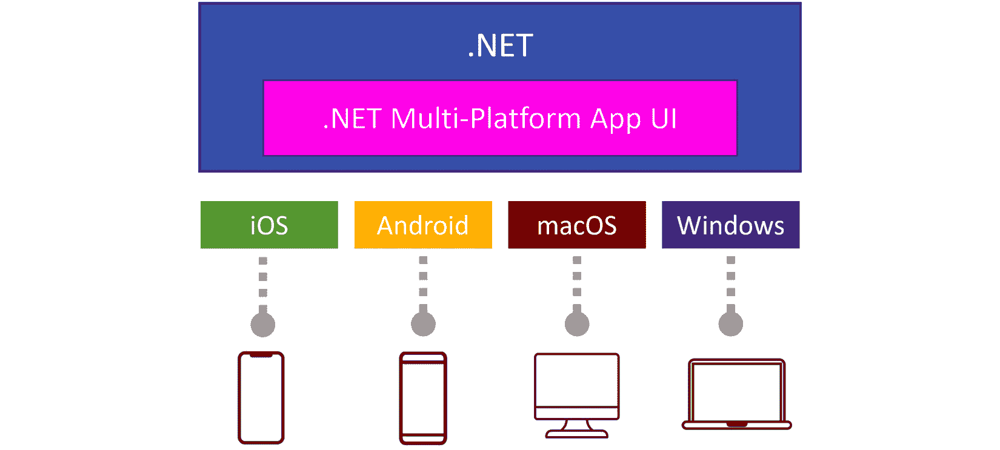

图 2.1：.NET MAUI 高级概述

重要的是要注意，在.NET MAUI 中拥有这个共享代码库并不会限制你使用 C#访问原生平台特定 API。实际上，.NET MAUI 旨在允许开发者访问原生功能，同时保持统一的代码库。.NET MAUI 丰富的跨平台 API 库为常见任务提供了一个抽象层，这些任务通常是特定平台的。然而，当某个功能需要.NET MAUI 的跨平台 API 中不可用的原生平台 API 时，你仍然可以直接通过 C#使用原生平台 API。通过部分类、编译器指令或依赖注入等机制，.NET MAUI 确保开发者能够为他们的应用实现最佳程度的定制和功能。

## 回忆起 Xamarin.Forms

这可能对之前听说过或使用过**Xamarin.Forms**的开发者来说很熟悉。

事实上，.NET MAUI 是 Xamarin.Forms 的演变，具有许多明显和微妙的不同之处。其中一个显著的不同点是其从.NET 6 开始集成到.NET 中。这种集成意味着开发者不再需要安装额外的 NuGet 包或扩展来使用.NET MAUI，简化了设置过程。一旦安装了 MAUI 所需的**.NET 工作负载**，开发者就可以立即开始构建应用程序。

此外，作为.NET 的一等公民，MAUI 从 Visual Studio 中受益于改进的工具和开发者体验，使得使用该框架创建移动应用变得更加方便和高效。这种无缝集成和增强的工具支持开发者更轻松、更有效地构建跨平台应用。

但主要的核心思想保持不变：使开发者能够使用.NET 构建原生和性能卓越的跨平台应用，同时拥有单一共享的代码库，用于业务逻辑和 UI 代码。这种方法简化了开发过程，并促进了不同平台间的代码重用，同时提供了在需要时访问平台特定 API 的灵活性，确保开发者能够利用原生功能并按需定制他们的应用。

.NET MAUI 建立在 Xamarin.Forms 相同的基础原则上，但还结合了其前驱近十年的开发者经验。通过改进性能、项目结构和工具等方面，.NET MAUI 旨在简化创建跨平台应用的过程，同时保持共享业务逻辑和 UI 代码的核心思想，并允许轻松访问平台特定 API。

## 跨平台 UI 和更多

.NET MAUI 当然允许我们为移动和桌面应用程序创建共享 UI。该框架为我们提供了诸如`Grid`、`VerticalStackLayout`、`AbsoluteLayout`等概念，这使我们能够以许多不同的方式执行布局控制。作为开发者，你可以选择是否要在 XAML 中或代码中定义你的布局。无论你选择哪种方法，都可以实现相同的效果。此外，我们还获得了数据绑定，这是我们在上一章中学到的 MVVM 的一个基本概念。通过内置的页面类型，如`FlyoutPage`、`TabbedPage`、`NavigationPage`等，我们可以创建具有高级导航模式的应用程序。记住，所有这些最终都会转换成运行本地 UI 的原生应用！

### 跨平台 API

但我们不要忘记.NET MAUI 不仅仅只是 UI 相关。.NET MAUI 提供了跨平台 API，这些 API 抽象了常见任务的平台特定实现，使开发者能够使用单个统一的 API 访问原生设备功能——访问设备的指南针、地理位置、文件系统等——仅举几个例子。这使我们能够为这些任务编写平台无关的代码，进一步简化开发过程并促进不同平台间的代码重用。.NET MAUI 提供的跨平台 API 包括以下内容：

+   **设备信息**: 获取设备特定的信息，例如型号、制造商、平台和操作系统版本。

+   **地理位置**: 访问设备的位置服务以获取 GPS 坐标，执行地理编码和反向地理编码，并跟踪设备的移动。

+   **连接性**: 确定设备的网络连接状态并监控变化。

+   **权限**: 请求和管理应用程序所需的各项运行时权限，如位置、相机和存储访问。

+   **传感器**: 利用设备传感器，如加速度计、陀螺仪、磁力计和气压计，来收集有关设备方向、运动和环境的数据。

+   **首选项**: 存储和检索用于应用程序设置和用户首选项的简单键值数据。使用**安全存储**API 来存储需要安全的数据。

+   **启动器**: 使用该应用的 URI 方案启动另一个应用。如果您想使用操作系统的默认浏览器打开网站，还可以使用**浏览器**API。

还有许多许多其他功能！

那么，Xamarin.Essentials 呢？

Xamarin.Essentials 是一个开源库，旨在为移动应用程序创建跨平台的 API，作为常见平台特定任务的抽象层。随着 Xamarin.Forms 向.NET MAUI 的演变，这些 API 现在更无缝地集成到框架本身中。这意味着在.NET MAUI 应用程序中不需要 Xamarin.Essentials NuGet 包。

### 跨平台生命周期事件

.NET MAUI 引入了**统一的 app 生命周期**，这简化了跨平台应用状态的管理。在传统的 Xamarin.Forms 开发中，每个平台都有自己的生命周期事件和模式，这有时会导致在处理跨平台场景时出现不一致性和复杂性增加。

通过`Window`类，我们现在可以使用单一的事件集来响应我们应用程序的生命周期，无论目标平台是什么。

订阅这些事件的最简单方法是通过在`App`类中的`CreateMethod`获取应用程序窗口的引用，然后订阅相关的事件。

这些事件使我们能够以一致的方式处理所有支持平台上的几个生命周期事件。根据我们的需求或场景，我们可以使用这些事件处理器，例如，在`Stopped`事件处理器中停止长时间运行的过程，或者在`Resumed`事件中刷新当前页面的数据。在银行应用程序中，我经常看到当应用程序被置于后台或没有获得焦点时，其 UI 会变得模糊或模糊不清。这通常可以通过使用`Deactivated`和`Activated`事件以跨平台的方式进行处理。

与.NET MAUI 一样，这些抽象不应阻止您访问平台 API 或执行特定平台的事情。如果您需要响应某个特定平台的生命周期事件，您仍然可以这样做。通过`MauiAppBuilder`的`ConfigureLifecycleEvents`扩展方法，我们可以在底层平台的生命周期事件上定义应该被调用的委托：

```cs
public static MauiApp CreateMauiApp()
{
    var builder = MauiApp.CreateBuilder();
    return builder
        .UseMauiApp<App>()
        .ConfigureLifecycleEvents(lifecycle =>
        {
        ...
        }).Build();
}
```

例如，如果我们想让我们的应用程序通过自定义 URI 方案激活，我们可能希望拦截触发应用程序打开的 URL 并对其做出反应。要获取该 URL，只能在每个平台的特定生命周期事件上完成：Android 上的`OnCreate`方法和 iOS 上的`OpenUrl`。我们可以分别在`MainActivity`或`AppDelegate`中重写这些方法，就像我们以前使用 Xamarin.Forms 一样。或者，我们可以使用前面提到的`ConfigureLifecycleEvents`钩入这些平台事件：

```cs
.ConfigureLifecycleEvents(lifecycle =>
{
#if ANDROID
    lifecycle.AddAndroid(android =>
    {
        android.OnCreate((activity, bundle) =>
        {
            //Get url activity.Intent.Data
        });
    });
#elif IOS
    lifecycle.AddiOS(ios =>
    {
        ios.OpenUrl((app, url, options) =>
        {
            return true;
        });
    });
#endif
})
```

与在平台特定的类和文件中分散这种类型的代码相比，我认为前面的解决方案要优雅得多，因为所有内容都在一个地方。我认为这大大提高了代码的可读性和可维护性！

### 单个项目结构（多目标）

.NET MAUI 还引入了一种全新的单项目结构。与每个目标平台都有一个项目以及一个共享代码项目不同，使用.NET MAUI，我们可以从单个项目构建针对不同平台的应用程序。不仅共享代码，还包括平台特定的实现、资源，如图像、字体和应用程序图标，都直接包含在这个单一的项目中。

这得益于 `MSBuild`，它是 .NET 和 .NET MAUI 所使用的构建系统。通过多目标构建，我们基本上可以将所有代码放在一个项目中，并定义项目应该为哪些平台构建。这些目标平台在项目的 `csproj` 文件中定义。在 .NET MAUI 中，默认情况下看起来是这样的：

```cs
<TargetFrameworks>net8.0-android;net8.0-ios;net8.0-
  maccatalyst</TargetFrameworks>
<TargetFrameworks Condition="$([MSBuild]::IsOSPlatform
  ('windows'))">$(TargetFrameworks);net8.0-
    windows10.0.19041.0</TargetFrameworks>
```

因此，对于一个标准的 .NET MAUI 项目，这意味着我们针对的是 Android、iOS、Mac Catalyst 和 Windows – 后者仅在 Windows 上运行时。

在编译时，`MSBuild` 会为所有配置的平台构建，只取与它编译的平台相关的源文件，并根据指定的目标框架处理依赖项。换句话说：一个项目会产生多个编译库或应用，这些库或应用本身只包含为编译平台相关的源代码。但 `MSBuild` 如何知道要取哪些特定平台的文件呢？有几种方法可以通知构建系统要取哪些源文件：

+   在你的代码中使用 `#if`, `#elif`, `#else`, 和 `#endif` 来条件编译特定平台的代码块。这些指令允许你在单个源文件中包含特定平台的代码，从而更容易地在不同平台间共享代码，并减少对多个文件的需求。例如，被 `#if ANDROID` 和 `#endif` 包围的代码只有在明确编译为 Android 时才会被包含和编译。关于处理特定平台生命周期事件的先前代码示例中也包含这些指令，因为它们所包围的代码仅与特定平台相关，并使用该平台特定的 API。

+   当为相应平台编译时，`MSBuild` 只会包含 `Platforms/Android`、`Platforms/iOS`、`Platforms/Windows` 或 `Platforms/MacCatalyst` 中的内容。这允许我们，在不使用预处理器指令的情况下，在这些文件夹中编写访问原生 API 的特定平台代码。这一点可以从查看默认的 `Platforms/iOS` 中的 `Program` 类中得到证明，其中使用了 `UIKit.UIApplication` 对象，这是一个特定于 iOS 的对象。为了类比，`Platforms/Android` 中的 `MainActivity` 类使用了 `Android.App.ActivityAttribute`，这是特定于 Android 的。

    不仅这些特定平台的文件夹包含特定平台的代码，还包含特定平台独有的资源 – 例如 `Platforms/Windows` 中的 `Package.appxmanifest` 或 `Platforms/MacCatalyst` 中的 `Info.plist`。

+   你可以将这些与特定平台的文件夹结合使用在 `csproj` 文件中。

    请查看 [`learn.microsoft.com/dotnet/maui/platform-integration/configure-multi-targeting`](https://learn.microsoft.com/dotnet/maui/platform-integration/configure-multi-targeting) 以获取有关如何配置基于文件名的多目标配置以及如何将其与特定平台文件夹结合使用的详细方法。您想使用的方法主要是个人偏好，完全取决于您和您的团队来决定。

在 Visual Studio 中，当处于 .NET MAUI 项目内部时，还有一个额外的下拉菜单可用，称为 **平台选择器**，允许您选择一个目标平台。默认情况下，当在 C# 代码文件中时，此下拉菜单位于代码编辑器的右上角 (*图 2.2*):

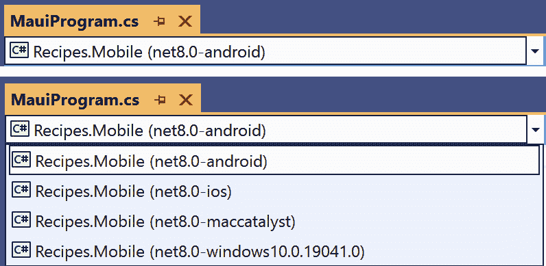

图 2.2：平台选择器

在此下拉菜单中选择一个条目不会影响编译。所选平台的作用是为该特定平台配置开发环境。这意味着，当使用预处理器指令时，它会显示特定平台的代码，并确保智能感知和代码导航功能调整以在特定平台的代码上工作。

*图 2.3* 展示了 IDE 如何将所选目标平台（Android）中未编译的代码变灰。

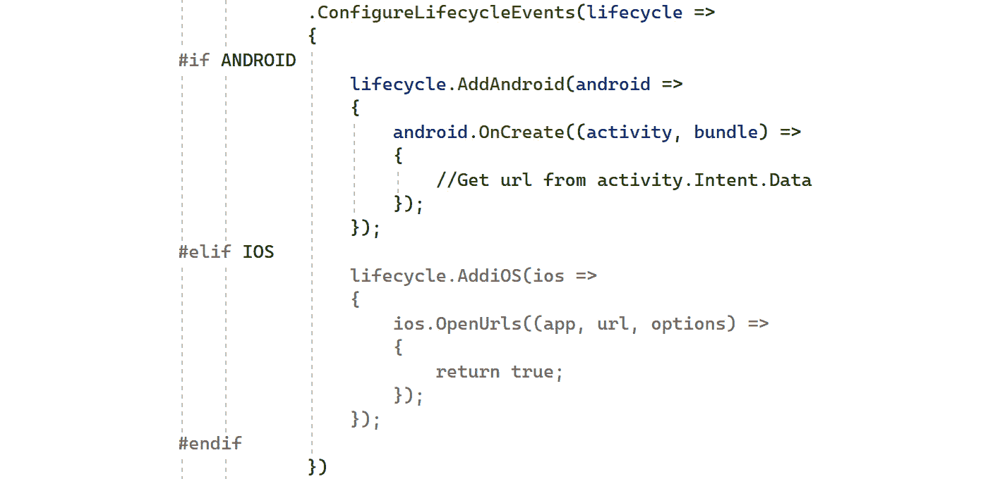

图 2.3：Android 作为选定的目标平台

在所选配置中，被 `#if ANDROID` 包围的代码将被编译；然而，iOS 特定的代码将被忽略。此外，即使在 IDE 中 iOS 部分有错误（`OpenUrls` 方法不存在，因为 `OpenUrl` 是正确的名称），我们也不会得到红色的波浪线。只有在将目标平台在 **平台选择器** 下拉菜单中选为 iOS 时，此错误才会变得可见 (*图 2.4*).

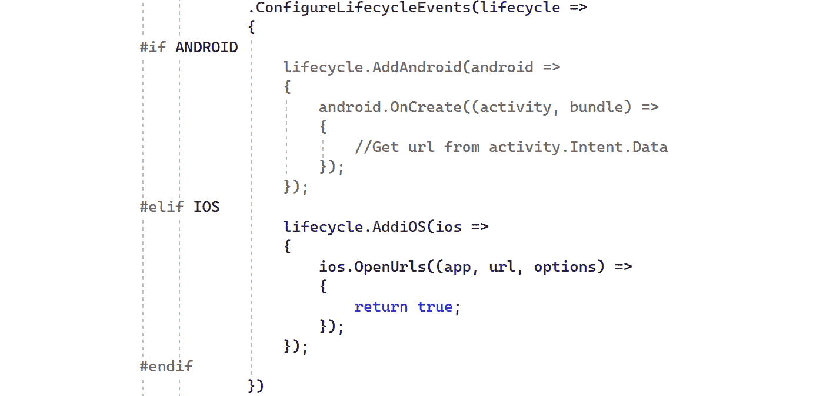

图 2.4：iOS 作为选定的目标平台

通过选择 iOS 作为构建目标，所有特定于 iOS 的代码都会亮起，而其他平台的特定代码则会变灰。

此下拉菜单在编写特定平台的代码时非常有帮助！

注意

总结来说，.NET MAUI 是 *一个用于构建移动和桌面设备的跨平台原生应用的现代框架*。它支持 Android、iOS、macOS 和 Windows。它提供了一个共享的 UI 层，包含丰富的控件，跨平台的常见任务 API，不同平台间统一的应用生命周期事件，以及简化开发和部署的单个项目结构。

# 它是如何工作的？

既然我们已经对 .NET MAUI 有了一个很好的理解，你可能会想知道这实际上是如何工作的。这段 .NET 代码最终是如何变成在不同平台上具有本地 UI 的原生应用的？这并不是魔法，但要理解它是如何工作的，我们需要看看它的内部结构。

## 使用 .NET 创建原生应用

在编译时，为每个选定的平台创建原生应用程序。.NET **基类库**（**BCL**）的必要部分，其中包含 .NET 数据类型、接口和库，被嵌入到原生应用程序中，并针对目标平台进行定制。BCL 依赖于 **.NET 运行时**来为您的应用程序代码创建执行环境。对于 Android、iOS 和 macOS 平台，**Mono 运行时**作为 .NET 运行时实现，为执行环境提供动力。同时，在 Windows 上，**.NET CoreCLR** 负责为您的应用程序提供运行时环境。

这种机制并不仅限于 .NET MAUI。这实际上是 **.NET for Android**、**.NET for iOS**、**.NET for Mac** 和 **WinUI** 的基础。这些听起来可能像是新事物，但实际上，这些是我们之前可能知道的新名字，即 **Xamarin.Android**、**Xamarin.iOS** 和 **Xamarin.Mac**。

.NET for Android、.NET for iOS 和 .NET for Mac 提供了对平台特定 API 的绑定，使开发者能够使用熟悉的 .NET 结构访问特定的功能和控件。在 Android 上，当应用程序编译时，.NET 代码与 Mono 运行时一起打包，并在 Android 设备上使用 **即时编译**（**JIT**）执行。由于苹果对 JIT 编译的限制，.NET for iOS 应用程序使用 **提前编译**（**AOT**）编译，将 .NET 代码转换为在 iOS 设备上直接运行的本地 ARM 代码。

WinUI 是一个使用 C# 和 XAML 构建 Windows 应用程序的现代、原生 UI 框架，它基于 .NET。这是 **Windows UI 库**的最新版本，它提供了一套 UI 控件、样式和功能，用于构建流畅且高性能的 Windows 应用程序。它使用 .NET CoreCLR 作为执行环境，而不是 Mono 运行时。

这些框架中的每一个都可以用来创建使用 .NET 的原生应用程序，利用每个平台特有的 UI 模式和范式来构建 UI。

小贴士

尽管 .NET for Android 和 .NET for iOS 提供了一种共享大量代码的方法，但为每个平台创建和维护具有原生 UI 的应用程序仍然可能非常具有挑战性。开发者需要精通每个平台的具体细节，并深入了解它们之间的差异。这可能导致更高的开发成本、更长的上市时间和增加的维护工作量。

## .NET MAUI，另一个抽象层

正是在这里，.NET MAUI 出现了。它提供了一种方便且高效的方法，使用单个代码库为多个平台创建真正的原生移动应用程序。.NET MAUI 在之前提到的 .NET 平台上添加了一个抽象层，使我们能够为它们构建共享的 UI (*图 2**.5*)。

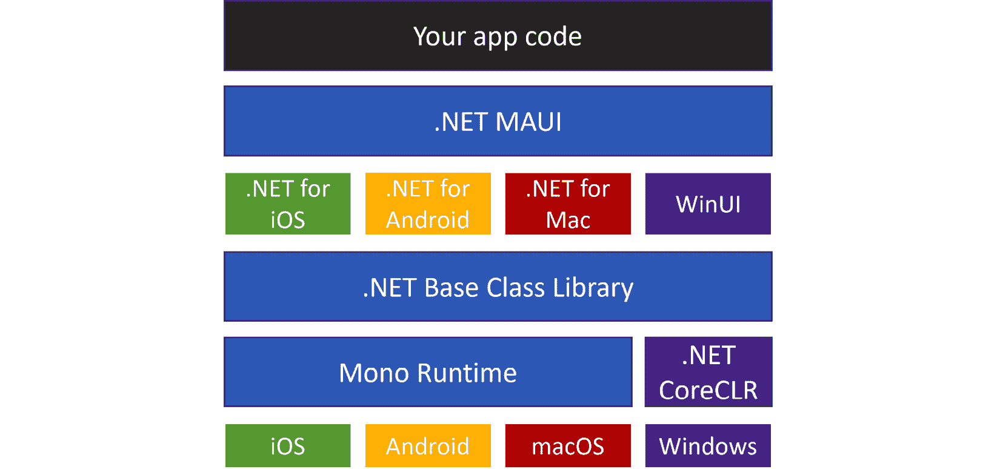

图 2.5: .NET MAUI 架构

您的 .NET MAUI 应用中的代码主要与 .NET MAUI API 交互，该 API 又反过来与原生平台 API 进行通信。此外，您的 .NET MAUI 代码可以直接访问特定平台的 API，以利用独特的平台功能或自定义。

让我们探索将跨平台定义的 UI 转换为特定于每个平台的原生 UI 的过程。

### 从虚拟视图到原生视图

在 .NET MAUI 中定义 UI 时，平台无关的 **控件** 或 **虚拟视图** 在运行时会映射到每个平台的原生 UI 元素或 **原生视图**。.NET MAUI 控件的定义通常是它在所有支持平台上表示的原生控件的共同分母。在某些情况下，特定平台的功能通过特定平台的扩展提供。

但我们如何从虚拟视图转换到原生视图呢？

.NET MAUI 中引入的 **处理程序** 架构负责将虚拟视图映射到每个支持平台的原生 UI 元素。处理程序是轻量级且性能良好的组件，它们取代了在 Xamarin.Forms 中使用的传统渲染器。每个 MAUI 控件都有相应的处理程序，负责在特定平台上创建、更新和管理原生 UI 元素。处理程序处理属性更改、事件和平台特定的自定义，将共享的 MAUI 控件代码转换为特定平台的原生控件和行为。

*图 2.6* 展示了 `Microsoft.Maui.Controls.Button`（虚拟视图）实例如何映射到特定的原生视图：

+   在 iOS 上，处理程序将按钮映射到 `UIKit.UIButton`。由于 .NET MAUI 利用 Mac Catalyst 创建原生 macOS 应用程序，因此 macOS 也使用相同的 `UIKit.UIButton`。Mac Catalyst 是苹果开发的一项技术，允许开发者利用相同的项目和源代码在 iOS、iPadOS 和 macOS 上创建原生应用。

+   在 Android 上，按钮是通过处理程序映射到 `AndroidX.AppCompat.Widget.AppCompatButton` 实例。

+   当映射 .NET MAUI 按钮时，Windows 上的处理程序创建 `Microsoft.UI.Xaml.Controls.Button` 实例。

如 *图 2.6* 所示，`ButtonHandlers` 没有直接引用 `Button` 实现；同样，`Button` 实现也没有引用 `ButtonHandlers`。相反，每个控件都实现了一个抽象控件的接口。处理程序通过特定于控件的接口访问，例如 `IButton` 用于 `Button`。

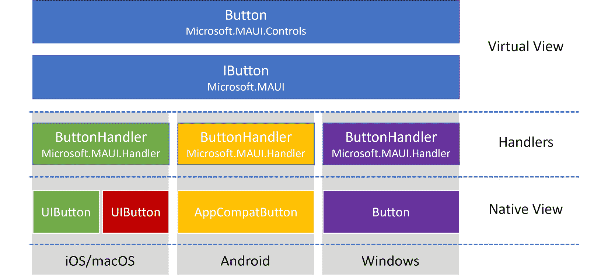

图 2.6：.NET MAUI 的处理程序架构

我们已经讨论了很多关于 *映射* 的内容，但本质上，这正是这些处理器中发生的事情。处理器有一个或多个 `PropertyMapper` 并允许传递额外的参数并不是巧合。处理跨平台事件，例如 `ScrollView` 上的 `ScrollTo`，就是一个例子。为了使原生视图滚动到请求的位置，位置本身需要作为参数传递给处理器。这样，处理器就可以使用这个参数值在原生视图中调用必要的操作。

与 Xamarin.Forms 的渲染器实现相比，处理器的架构提供了几个优点：改进的性能、更容易的自定义和更好的可维护性，这使得它在从 Xamarin.Forms 过渡到 .NET MAUI 时成为一个重要的改进点。

现在我们已经涵盖了大量的理论，并且您了解了底层的工作原理，是时候卷起袖子开始创建一些有形的东西了。我知道您迫不及待地想要深入其中，那么让我们开始构建我们的第一个 .NET MAUI 应用程序！

# 创建您的第一个 .NET MAUI 应用

让我们创建我们的第一个 .NET MAUI 应用！在我们开始编写任何代码之前，我们需要通过安装一些组件来设置我们的机器。所以，让我们一起走过这些初始设置步骤，看看我们有哪些选择。一旦设置完成，我们就会进入令人兴奋的部分：从头开始逐步创建一个 .NET MAUI 应用。

## 设置您的机器

开始使用 .NET MAUI 进行开发相当简单，尤其是如果您使用 Visual Studio 作为您的 IDE。即使您不想使用 Visual Studio，安装过程也应该相当直接。

### 关于 .NET SDK 版本和工作负载

.NET MAUI 从 .NET 6 开始提供，在撰写本书时，**.NET 8** 是最新的版本。需要注意的是，每个 .NET 版本都有一项特定的支持策略：有提供 3 年免费支持和补丁的**长期支持**（**LTS**）版本，以及提供 18 个月免费支持和补丁的**标准支持**（**STS**）版本。然而，对于 .NET MAUI 来说，这并不适用。微软需要确保 .NET MAUI 支持所有受支持平台上的最新和最优秀的 API。新功能和改进将主要针对下一个版本的 .NET 开发，其中一些可能会回滚到当前版本。因此，当涉及到 .NET MAUI 时，支持策略与一般的 .NET 支持策略不同。最好使用可用的最新版本的 .NET，这样您就可以访问最新的平台 API 和性能最佳的 .NET MAUI 版本，无论它是 LTS 还是 STS 版本。

.NET 6 引入了 **工作负载** 的概念。工作负载是一组工具、模板和库，用于特定的开发场景或目标平台。当安装 .NET MAUI 工作负载时，我们正在安装构建跨平台原生应用程序所需的全部内容。它将安装 .NET MAUI 类库、构建和运行时组件、特定平台的 SDK 和工具、项目模板等。

.NET MAUI 工作负载可以通过两种方式安装和管理：使用 Visual Studio 安装程序或如果您选择不使用 Visual Studio，则通过命令行。

小贴士

为了确保您的 .NET MAUI 工作负载保持稳定状态，重要的是坚持以下选项之一：您要么使用 Visual Studio 安装并从那里管理它，要么从命令行进行操作。不要混合使用两种方法！

### 安装 Visual Studio 和 .NET MAUI 工作负载

当使用 Visual Studio（2022 17.3 或更高版本）时，我们可以使用 Visual Studio 安装程序来安装 .NET MAUI 工作负载。这是迄今为止安装和管理您的工作负载最简单的方法。.NET MAUI 开发支持所有版本的 Visual Studio：从免费的社区版到付费的企业版。

如果您的计算机上尚未安装 Visual Studio，您首先需要通过访问 [`visualstudio.microsoft.com/downloads/`](https://visualstudio.microsoft.com/downloads/) 下载 Visual Studio 安装程序。一旦安装程序下载完成，启动它，并选择 **安装** (*图 2.7*)。

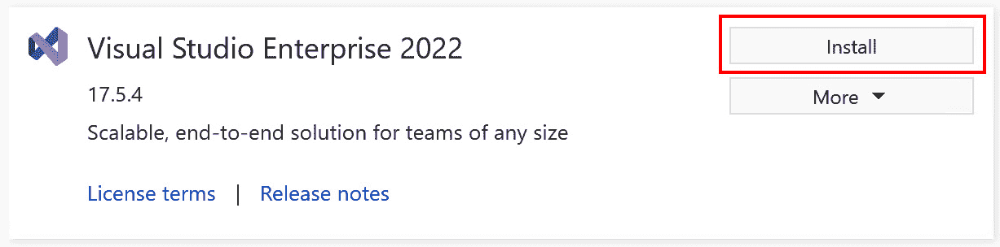

图 2.7：安装 Visual Studio

或者，如果您已经安装了 Visual Studio，您可以启动 Visual Studio 安装程序并选择 **修改** (*图 2.8*)。

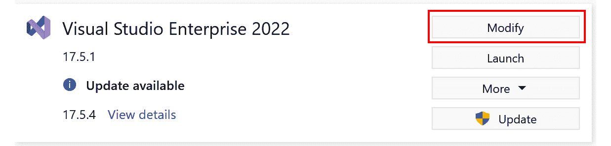

图 2.8：修改 Visual Studio

无论您是在安装 Visual Studio 还是修改它，在下一个对话框中，您可以选择要安装的工作负载。如图 *图 2.9* 所示，这是我们需要检查 **.NET 多平台应用程序** **UI 开发** 的地方。

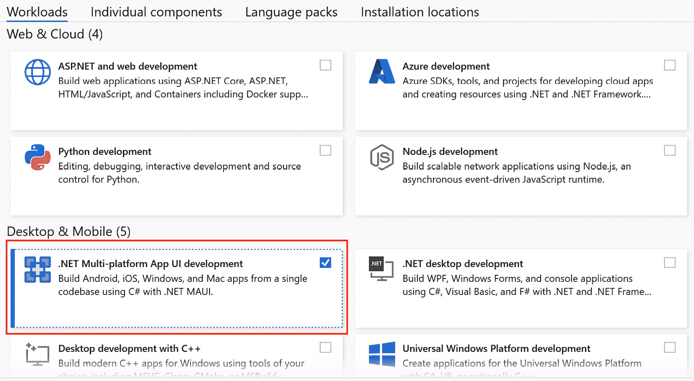

图 2.9：安装 .NET MAUI 工作负载

这将安装所有必要的组件，以便您能够构建 .NET MAUI 应用程序。

在 Visual Studio 新鲜安装后，启动它，并选择 **继续不使用代码** (*图 2.10*)。

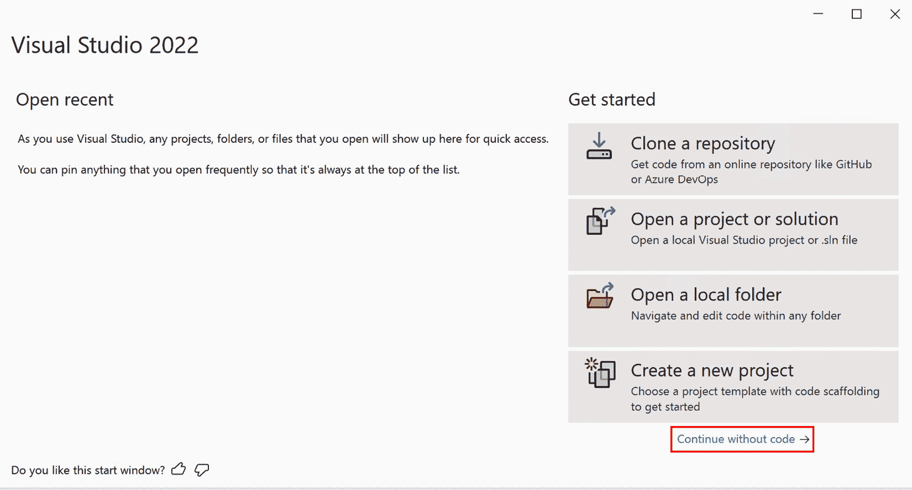

图 2.10：不使用代码启动 Visual Studio

为了能够在 Android 模拟器或 iOS 模拟器上调试，我们需要安装或配置以下内容：

+   前往 **工具** | **Android** | **Android 设备管理器**。从这里，您可以添加您可以使用来部署您的 .NET MAUI 应用程序的 Android 模拟器。

+   从 **工具** | **iOS** | **连接到 Mac**，您可以按照步骤连接到您网络中的 Mac。连接到 Mac 后，您可以在 iOS 模拟器或连接到您的 Mac 的物理设备上调试您的应用。

热重启

当然，您也可以在连接到您的 PC 的物理设备上进行调试。这在 iOS 设备上也是可能的！使用 Visual Studio **热重启**，您可以直接在 iPhone 上进行调试，而无需将 Mac 连接到 Windows 机器。唯一的限制是您需要一个 **Apple 开发者账号**、一个活跃的 **Apple 开发者计划** 注册（这是付费的），并且需要在您的 PC 上安装 iTunes。一旦您将 iOS 设备连接到您的计算机并在 Visual Studio 中将其选为调试目标，Visual Studio 将引导您设置热重启，这需要您输入您的 Apple 开发者账号详细信息。我建议您访问 [`learn.microsoft.com/dotnet/maui/ios/hot-restart`](https://learn.microsoft.com/dotnet/maui/ios/hot-restart) 以获取如何设置 iOS 上热重启的逐步指南。虽然这对于调试来说很棒，但为了发布 iOS 或 macOS 应用，您仍然需要一个 Mac 来构建和签名您的应用！

### 使用命令行安装 .NET MAUI 工作负载

或者，如果您选择的是除 Visual Studio 以外的其他 IDE，您需要通过命令行手动安装 .NET MAUI 工作负载。

但在安装 .NET MAUI 之前，您需要确保您的机器上已安装 .NET。您可以通过运行以下命令来完成此操作：

```cs
dotnet --list-sdks
```

这应该会为您提供所有已安装 .NET SDK 的概述。如前所述，.NET 6 是进行 .NET MAUI 开发所需的最低 .NET SDK。如果前面的命令失败，如 *图 2**.11* 所示，这意味着 .NET 尚未安装到您的机器上。您应该访问 [`dotnet.microsoft.com/download/dotnet`](https://dotnet.microsoft.com/download/dotnet)，选择 .NET 的最新版本，并下载适当的安装程序或二进制文件。

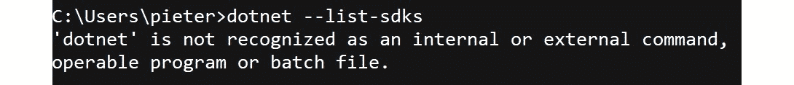

图 2.11: 'dotnet' 不可识别

一旦在您的机器上安装了最新的 .NET 版本，您可以通过以下命令通过命令行安装 .NET MAUI 工作负载：

```cs
dotnet workload install maui
```

这将安装构建跨平台应用所需的全部内容，使用您喜欢的 IDE 通过 .NET MAUI 进行开发。

注意，这不会安装任何用于管理 Android 模拟器的额外工具，例如，也不会提供开箱即用的工具，让您轻松连接到 Mac 或部署到 iPhone。

### 安装 Visual Studio Code 和 .NET MAUI 扩展

如果您更喜欢使用 **Visual Studio Code**，无论是在 Windows、macOS 还是甚至 Linux 上，都有一些好消息。**.NET MAUI 扩展** 与 **C# 开发工具包扩展** 一起，为您提供开始使用 Visual Studio Code 创建 MAUI 应用所需的一切。支持的目标平台取决于您运行的操作系统。在 Windows 上，您可以创建 Windows 和 Android 应用；在 macOS 上，您可以开发除 Windows 之外的所有应用；在 Linux 上，您只能创建 Android 应用。让我们看看如何将 Visual Studio Code 配置好以创建 .NET MAUI 应用：

1.  从 [`code.visualstudio.com/`](https://code.visualstudio.com/) 安装 Visual Studio Code。从 `maui` 安装 .NET MAUI 扩展，如图 2.12* 所示：


图 2.12: .NET MAUI 扩展

1.  一旦安装了扩展，Visual Studio Code 中就会弹出 **欢迎** 页面：

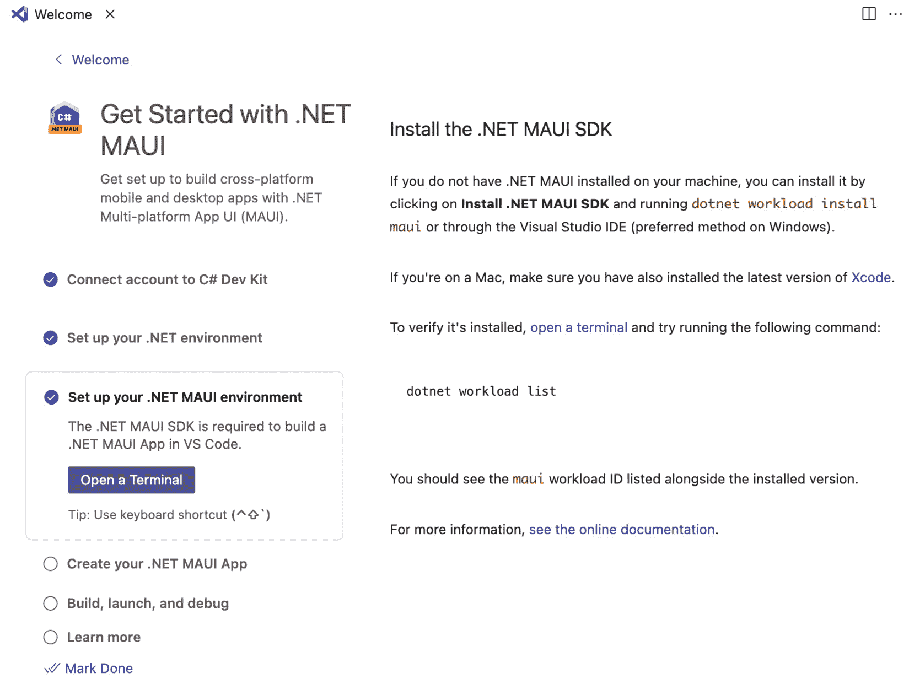

图 2.13: .NET MAUI 扩展欢迎页面

这个 **欢迎** 页面会指导您完成所有额外的步骤，以使您的环境启动并运行。它涵盖了从安装 .NET MAUI 工作负载到下载和安装 Microsoft OpenJDK 的所有内容，这对于构建和调试 Android 应用至关重要。此外，它还告诉您在 Mac 上安装 Xcode 和 Xcode 命令行工具，这对于构建和调试 iOS 和 macOS 应用是必需的。

现在我们已经将首选的开发环境全部设置好，让我们创建一个 .NET MAUI 应用！请注意，在本书中，说明流程与 Visual Studio 中的流程相同。然而，在您选择的 IDE 中跟随应该不会成问题。

## “食谱！”应用

在本书的整个过程中，我们将致力于开发 *食谱！* 应用。通过这个应用，用户可以添加他们喜欢的食谱并与全世界分享，允许其他用户对其进行评分和评论。

因此，让我们继续创建一个 .NET MAUI 应用，它将作为我们 *食谱！* 应用的起点。

### 创建新项目

随着兴奋感的增加，我们即将迈出开发 *食谱！* 应用的第一步。为了开始，我们将在 Visual Studio 中创建一个新项目：

1.  启动 Visual Studio 并选择 **创建新项目**，如图 2.14* 所示：

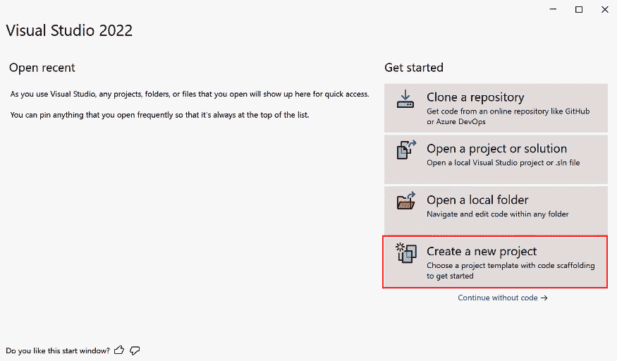

图 2.14: 创建新项目

1.  接下来，在顶部的搜索栏中输入 `maui` 以查询列表。

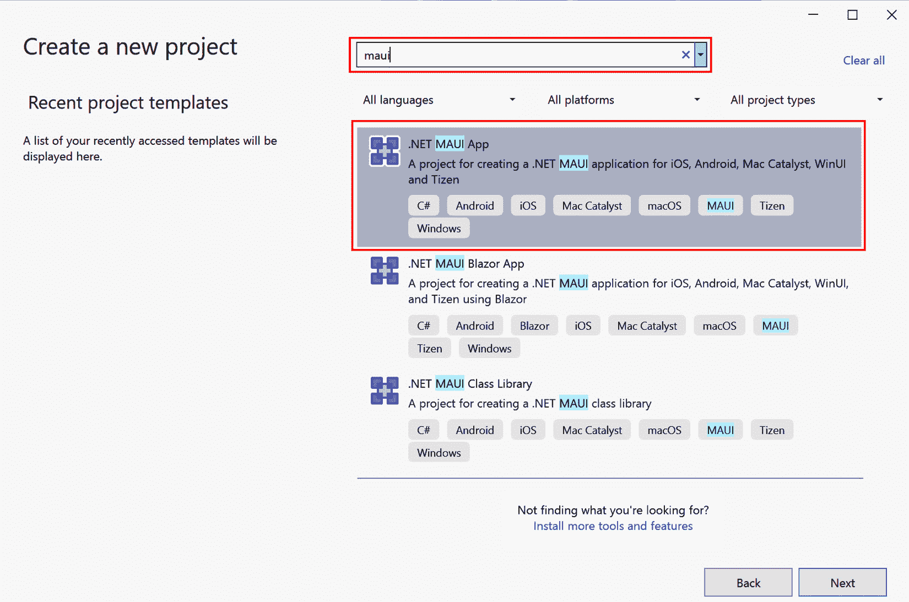

图 2.15: 选择 .NET MAUI 应用模板

1.  接下来，输入 **项目名称**、**位置** 和 **解决方案名称** 的相关详细信息。

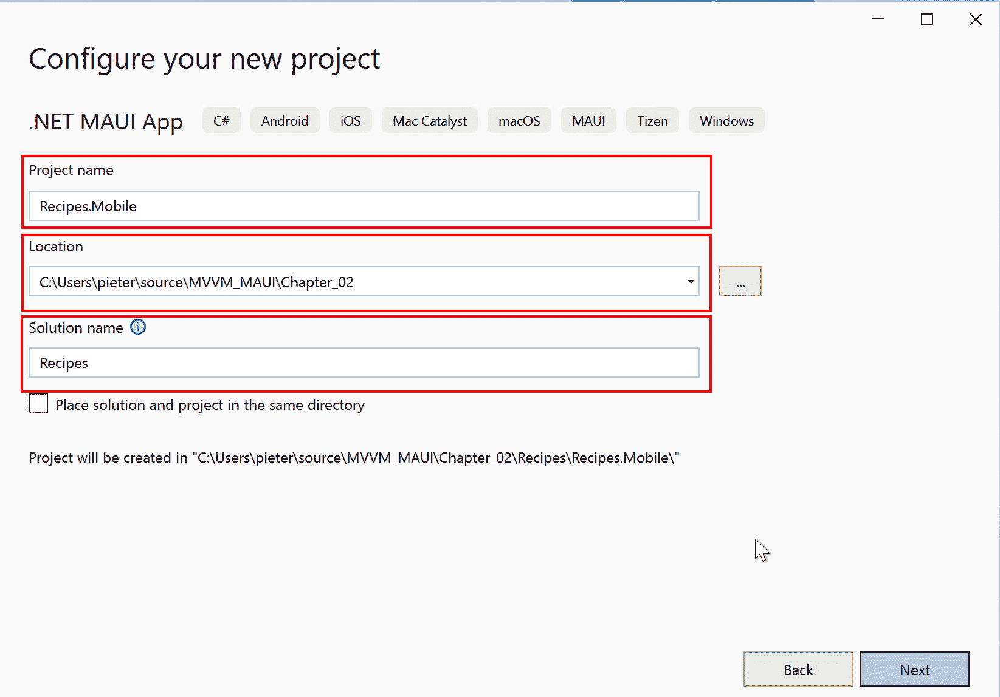

图 2.16: 配置您的新的项目

1.  在最后一页，选择**.NET 8（长期支持）**或任何其他你想要的目标.NET 框架。

1.  点击**创建**按钮。

这将在指定位置创建一个包含提供名称的.NET MAUI 项目的解决方案，如图*图 2.17*所示。：


图 2.17：.NET MAUI 项目

### 运行你的应用程序

一开始，你就可以通过按*F5*键或在 Visual Studio 中点击**运行**按钮来运行你全新的跨平台应用程序。**运行**按钮旁边应该有**Windows Machine**字样，表示你将原生在 Windows 上运行你的应用程序。如果按钮没有显示**Windows Machine**，你可以点击向下箭头以获取更多选项，如图*图 2.18*所示。18*：

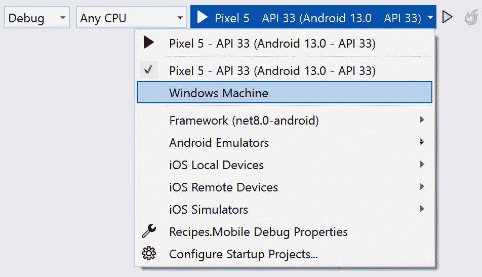

图 2.18：选择调试目标

当你第一次调试 Windows 应用程序时，Visual Studio 可能会提示你启用 Windows 中的**开发者模式**。之后，你那闪亮的新应用程序应该已经在 Windows 上部署并运行了！

我们也可以立即在 Android 上进行调试：点击**Windows Machine**旁边的向下箭头，选择**Android 模拟器**，并从列表中选择一个模拟器。如果你是第一次运行 Android 应用程序，你将在 Visual Studio 的**错误列表**中看到一个错误消息，提示你接受 Android SDK 许可。双击该消息将打开**Android SDK – 许可协议**，你应该接受它以继续。再次按*F5*键，或在 Visual Studio 中点击包含你的模拟器名称的**运行**按钮。第一次启动模拟器并部署可能需要一些时间，但过一段时间后，你将看到一个带有你的原生 Android 应用程序运行的模拟器弹出。

相比之下，如果你连接到 Mac，你也可以选择 iOS 模拟器，并看到你的原生 iOS 在 iOS 模拟器上运行！如果你有连接到你的 PC 的 Android 或 iOS 设备，它也应该出现在列表中。选择它并运行应用程序应该会将你的应用程序部署到你的物理设备上。

### .NET 热重载和 XAML 热重载

通过**.NET 热重载**，开发人员可以在应用程序运行时对其源代码进行更改，而无需暂停或重新构建应用程序。它使迭代更快，并能够实时反馈代码更改。我们为什么不趁应用程序运行时对我们的代码进行一些更改呢？

1.  打开`MainPage.xaml.cs`文件。

1.  在`OnCounterClicked`方法中，将`count++`改为`count += 2`。

    保存你的更改或手动在 Visual Studio 中点击**热重载**（*Alt* + *F10*）。在这个按钮的下拉菜单中，你还可以找到一个**文件保存时热重载**设置，你可能想要检查一下。勾选这个设置应该会在你保存更改时自动触发**热重载**。


图 2.19：热重载

1.  返回运行中的应用程序并点击按钮，您应该会看到每次点击时计数器增加两个。

此外，使用 **XAML 热重载**，我们甚至可以在应用程序运行时更新 XAML 代码，并立即看到更新的 UI。因此，当我们的应用程序正在运行时，让我们更新屏幕上的某些内容：

1.  在您选择的平台运行您的应用程序。

1.  当应用程序正在运行时，转到 Visual Studio 并打开 `MainPage.xaml`。

1.  将第一个 `Label` 的 `Text` 属性从 `"Hello, World"` 更改为 `"Recipes!"`：

    ```cs
    <Label
        FontSize="32"
        HorizontalOptions="Center"
    Text property of the second Label to "Find your next favorite dish.":

    ```

    <Label

    FontSize="18"

    HorizontalOptions="Center"

    将按钮的 BackgroundColor 属性设置为 "#FCB64A"，并将 TextColor 属性设置为 "white"：

    ```cs
    <Button
        x:Name="CounterBtn"
        BackgroundColor="#F8B146"
        Clicked="OnCounterClicked"
        HorizontalOptions="Center"
        Text="Click me"
        TextColor="white" />
    ```

    ```cs

    ```

1.  保存您所做的更改，您应该会立即看到运行中的应用程序中的 UI 变更。

.NET 热重载和 XAML 热重载是出色的工具，因为它们避免了在应用程序进行小幅度增量更改时需要停止、重新构建和重新部署应用程序的需要。

### 添加启动画面和应用程序图标

.NET MAUI 的单项目方法使得能够管理该单个项目中的所有应用程序资源（如图像、图标、字体等）。在编译期间，相关 `Platforms` 文件夹内的所有资源以及 `Resources` 文件夹内的所有内容都会一起被选中。所有这些都会嵌入到生成的原生应用程序中。

因此，如果您愿意，可以添加一个 `Platforms` 子文件夹。同样适用于 `Platforms` 子文件夹。但在 MAUI 中，有一个更简单的方法：.NET MAUI 可以为我们生成启动画面和应用程序图标。让我们看看如何：

1.  在 `splash.svg` 文件中。

1.  右键点击 `Splash` 文件夹，选择 `Chapter 02/Assets/recipes-logo.svg` 文件，该文件位于本章开头共享的代码仓库中。

1.  将文件重命名为 `splash.svg` 并将 **Build Action** 设置为 **MauiSplashScreen**。

1.  通过在 `csproj` 文件中点击您的 MAUI 项目，打开项目的 `csproj` 文件，找到 `MauiSplashScreen` 标签。您可以为启动画面定义所需背景颜色并添加一个 `Color` 属性。给定的 `svg` 将以定义的背景色为中心显示在启动画面上：

    ```cs
    <MauiSplashScreen Include="Resources\Splash\splash.svg" Color="#F8B146" />
    ```

1.  清理并重新构建您的解决方案，然后再次运行您的应用程序。现在您应该会看到更新的启动画面，如图 *图 2.20* 所示：

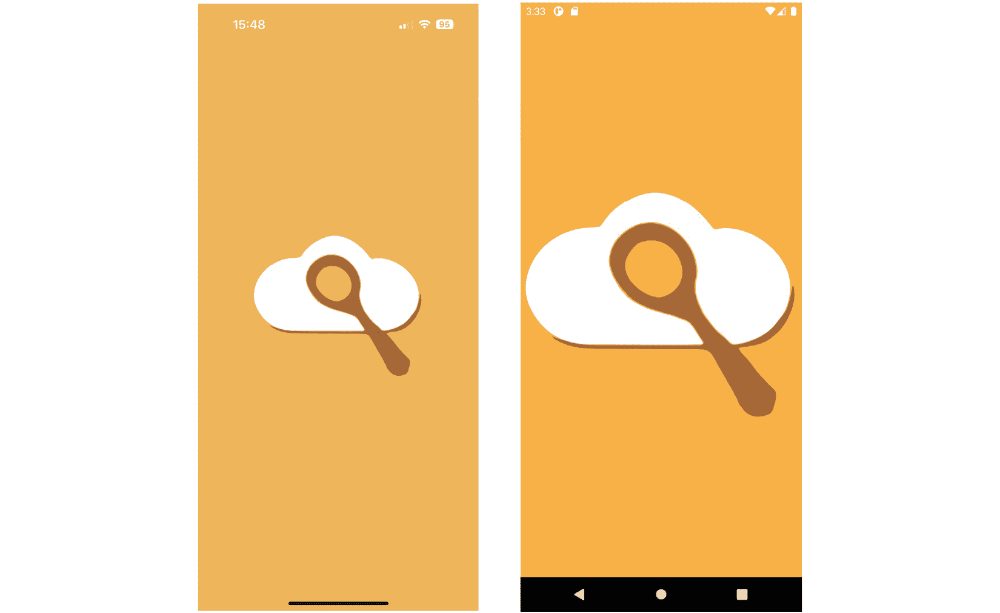

图 2.20：iOS 和 Android 上的 Recipes! 应用程序启动画面

注意

当您通过在 Windows PC 上使用热重启部署到物理 iOS 设备时，您的启动画面将不会更新，并且将保留标准的 .NET 启动画面。尽管您已正确配置了自定义启动画面，但这仍然是热重启的限制。为了验证您的启动画面，最好将其部署到连接到 Mac 的物理设备上。

不仅 .NET MAUI 能够为我们生成启动画面，它还可以生成我们的应用图标！以下是方法：

1.  在 `appicon.svg` 和 `appiconfg.svg` 文件中。

1.  右键单击 `Resources` 文件夹，选择 `Chapter` `02``/Assets/recipes-appicon.svg` 文件。

1.  将文件重命名为 `appicon.svg` 并将 **构建操作** 设置为 **MauiIcon**。

1.  查看项目的 `csproj` 文件，寻找 `MauiIcon` 标签。添加一个 `Color` 属性：

    ```cs
    <MauiIcon Include="Resources\AppIcon\appicon.svg" Color="#F8B146" />
    ```

清理并重新构建你的解决方案，以确保你的应用图标在设备上显示。在部署之前，你可能还想从你的设备上删除应用。一旦部署了你的应用，你应该能看到你的更新后的应用图标：


图 2.21：Recipes! 应用在 Android、Windows 和 iOS 上的图标

就这样！我们付出了很少的努力，就创建了一个包含启动画面和应用图标的跨平台应用。

# 摘要

在本章中，我们提供了 .NET MAUI 的概述：它是什么，它是如何工作的，以及如何使用 .NET MAUI 创建跨平台应用。我们详细介绍了创建应用的过程，包括启动画面和应用图标。此外，我们还探讨了 .NET 热重载和 XAML 热重载，这些功能使我们能够在应用运行时更新代码，大大提高了我们的效率。现在，你已经对 .NET MAUI 和 MVVM 设计模式有了全面的理解，我们可以继续我们的旅程，探索如何在 .NET MAUI 框架中有效地应用此模式。

在 *第三章* 中，我们将探讨 .NET MAUI 中可用的数据绑定构建块，这些构建块使我们能够使用 MVVM 模式构建跨平台应用。

# 进一步阅读

要了解更多关于本章所涉及主题的信息，请查看以下资源：

+   *在 .NET MAUI 中创建启动画面*：[`learn.microsoft.com/dotnet/maui/user-interface/images/splashscreen`](https://learn.microsoft.com/dotnet/maui/user-interface/images/splashscreen)

+   *在 .NET MAUI 中使用应用图标*：[`learn.microsoft.com/dotnet/maui/user-interface/images/app-icons`](https://learn.microsoft.com/dotnet/maui/user-interface/images/app-icons)

+   *配置* 多目标：[`learn.microsoft.com/dotnet/maui/platform-integration/configure-multi-targeting`](https://learn.microsoft.com/dotnet/maui/platform-integration/configure-multi-targeting)

+   *.NET MAUI 应用* 生命周期：[`learn.microsoft.com/dotnet/maui/fundamentals/app-lifecycle`](https://learn.microsoft.com/dotnet/maui/fundamentals/app-lifecycle)

+   *.NET MAUI* 安装：[`learn.microsoft.com/dotnet/maui/get-started/installation`](https://learn.microsoft.com/dotnet/maui/get-started/installation)

+   *与* Mac *配对：[`learn.microsoft.com/dotnet/maui/ios/pair-to-mac`](https://learn.microsoft.com/dotnet/maui/ios/pair-to-mac)

+   *Android* *模拟器*: [`learn.microsoft.com/dotnet/maui/android/emulator/device-manager`](https://learn.microsoft.com/dotnet/maui/android/emulator/device-manager)

+   *为调试设置 Android 设备*: [`learn.microsoft.com/dotnet/maui/android/device/setup`](https://learn.microsoft.com/dotnet/maui/android/device/setup)

+   *.NET MAUI 支持* *策略*: [`dotnet.microsoft.com/platform/support/policy/maui`](https://dotnet.microsoft.com/platform/support/policy/maui)
