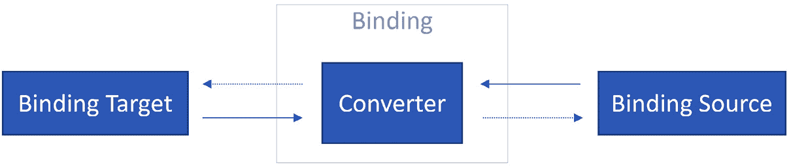
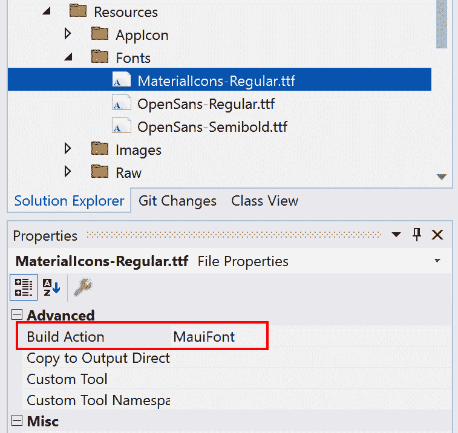
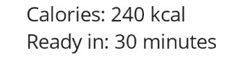
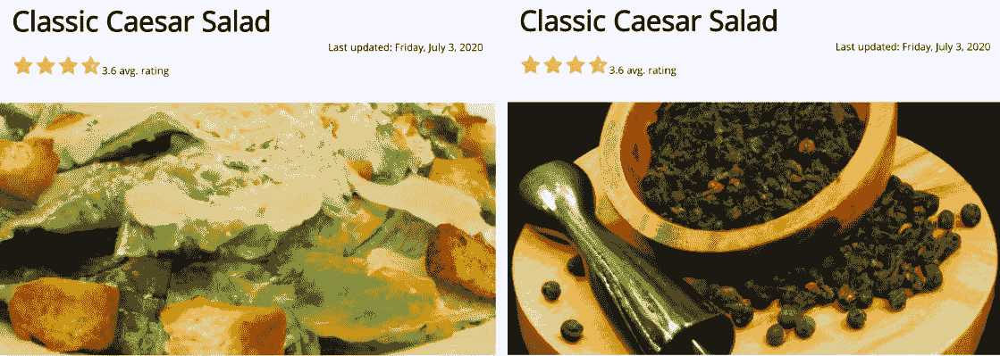
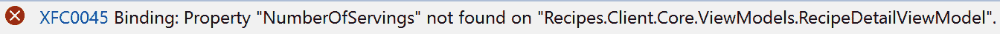
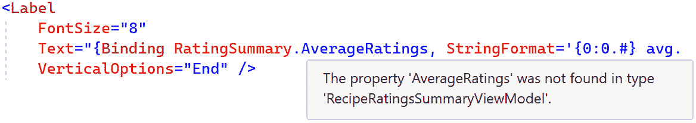

# 第四章：.NET MAUI 中的数据绑定

在上一章中，我们介绍了 .NET MAUI 数据绑定的基础知识。数据绑定不仅是 .NET MAUI 的核心功能，也是使用 MVVM 设计模式有效构建应用程序的关键组件。它创建了一个强大的链接，将您的 View 和 ViewModel 之间连接起来，促进了两者之间高效通信和同步。

随着我们深入数据绑定的领域，掌握一些高级技术和功能是至关重要的。这些是您能够尽可能高效地创建动态用户界面的基石。它们使我们能够设计出不仅更互动，而且更容易管理和维护的用户界面。

本章将涵盖以下主题：

+   ValueConverters 和 `StringFormat`

+   回退

+   元素和相对绑定

+   多绑定

+   编译绑定

到本章结束时，结合上一章的内容，您将全面深入地理解 .NET MAUI 的数据绑定。这些知识将使您能够有效地将这些技术应用到您的应用程序中。让我们开始吧！

# 技术要求

在本章中，我们将向 *Recipes!* 应用程序添加功能。所有必要的资产，包括本章中使用的所有代码，都可以在 GitHub 上找到，网址为 [`github.com/PacktPublishing/MVVM-pattern-.NET-MAUI/tree/main/Chapter04`](https://github.com/PacktPublishing/MVVM-pattern-.NET-MAUI/tree/main/Chapter04)。

# ValueConverters 和 StringFormat

在许多情况下，ViewModel 中的数据并不完全符合 UI 预期的格式。例如，您可能有一个 `DateTime` 对象在 ViewModel 中，您希望在 View 中以特定的字符串格式显示，或者一个枚举应该表示为更友好的字符串。

这就是 **ValueConverters** 和 **StringFormat** 发挥作用的地方。这两种技术都充当中间人，将 ViewModel 数据转换成适合在 UI 中显示或交互的格式。

在本节中，我们将深入探讨如何创建和使用 ValueConverters 来有效地管理这些数据转换，以及格式化如何进一步细化数据的展示，确保其具有意义且用户友好。 

## 创建和使用 ValueConverters

ValueConverter 在源（通常是 ViewModel）和目标（View）之间充当中间人。它提供了一种在数据从源到目标或反之亦然传递时转换或转换数据的方法（*图 4**.1*）：



图 4.1：转换器的使用

一个常见的场景可能涉及 ViewModel 属性，它是一种特定类型，例如枚举或复杂对象，需要在 UI 中以不同的方式显示。ValueConverter 可以将数据从一种类型转换为与 UI 兼容和适当的另一种类型。同样，在 UI 中接收到的用户输入可能需要在存储到 ViewModel 之前转换成不同的格式。

ValueConverter 是实现了`Microsoft.Maui.Controls.IValueConverter`接口的类，该接口定义了两个方法——`Convert`和`ConvertBack`：

```cs
object Convert(object value, Type targetType, object
  parameter, CultureInfo culture);
object ConvertBack(object value, Type targetType, object
  parameter, CultureInfo culture);
```

`Convert`方法负责将绑定源中的值转换为绑定目标。它接受原始值、目标类型、可选参数和文化信息作为参数。此方法执行转换并返回一个表示转换后数据的对象。然后使用转换后的数据来更新视图上的属性。确保返回的对象与绑定目标属性的预期类型或兼容类型相匹配非常重要。

让我们看看方法的参数：

+   `value`：这是需要转换的源数据。这通常是您希望在视图中显示的 ViewModel 中的数据。因为这可能是一切，所以它被提供为`object`。

+   `targetType`：这是绑定目标属性的类型。这是方法应该将数据返回为的类型。例如，如果您正在将数据绑定到您的视图中的一个`Microsoft.Maui.Graphics.Color`类型的属性，那么`targetType`将是`Microsoft.Maui.Graphics.Color`。

+   `parameter`：这是一个可选的`parameter`，可以用来向转换器传递额外的信息。

+   `culture`：这是在转换器中应该使用的`System.Globalization.CultureInfo`文化。这在处理日期、时间和数字时尤为重要，因为不同文化中这些值可能有不同的表示方式。

`ConvertBack`方法用于反转转换过程，将数据从绑定目标转换回绑定源。在许多情况下，`ConvertBack`方法没有实现，因为它仅在`TwoWay`和`OneWayToSource`数据绑定中才有用，在这些数据绑定中，需要在传递给 ViewModel 之前将视图上的数据转换。返回值和参数与`Convert`方法类似。

到目前为止，这一切可能都有些抽象，所以让我们来看看如何构建和使用一个 ValueConverter。

### 创建一个 ValueConverter

为了展示 ValueConverters 的灵活性和强大功能，我们将通过引入评分指示器来增强我们的应用。仅仅显示一个数值并不是表示菜谱评分最吸引人或直观的方式。因此，我们将利用 ValueConverter 将这些数字替换为星形图标，创建一个视觉上吸引人且用户友好的评分表示。我们的自定义 ValueConverter，`RatingToStarsConverter`，将双精度值转换为字符串。结合特定的字体，这个字符串将显示为星形图标。但在我们开始构建转换器之前，我们需要先做一些准备工作：

1.  首先，我们将创建 `RecipeRatingsSummaryViewModel`。右键单击 `ViewModels` 文件夹，并选择 `RecipeRatingsSummaryViewModel.cs`。

1.  目前，我们只向类中添加了一个 `AverageRating` 属性，其类型为 `double`：

    ```cs
    public class RecipeRatingsSummaryViewModel
    {
        public double MaxRating { get; } = 4d;
        public double? AverageRating { get; set; } = 3.5d;
    }
    ```

    我们还包含了一个值来指示用户可以给出的最大星数。接下来，让我们向 `RecipeDetailViewModel` 添加一个额外的属性 `RatingDetail`，并默认分配一个新实例：

    ```cs
    public RecipeRatingsSummaryViewModel RatingDetail {
      get; set; } = new ();
    ```

在应用程序中显示图标的一种高效方法是使用专门的图标字体。这些字体既免费又可购买，允许您轻松地将各种图标集成到您的应用程序中。原理很简单：将所需的图标字体集成到您的应用中，然后在您希望显示图标的 `Label` 类上将其分配为 `FontFamily`。从那里，剩下的只是将 `Label` 类的 `Text` 属性设置为对应于您要显示的图标的值。

让我们在我们的应用中包含 Google 的 Material Design 图标字体，这样我们就可以使用这种字体来稍后显示菜谱的评分。您可以在 `Chapter 04/Assets/Fonts` 文件夹中找到 `MaterialIcons-Regular.ttf` 字体文件，或者您可以从 [`github.com/google/material-design-icons/tree/master/font`](https://github.com/google/material-design-icons/tree/master/font) 下载它：

1.  在 Visual Studio 中，**Recipes.Mobile** 项目的 `Resources/Fonts` 文件夹，并选择 **File Explorer** 中的 **Open Folder**。

1.  将 `MaterialIcons-Regular.ttf` 字体文件复制到这个文件夹中。

1.  返回 Visual Studio，您应该在新添加的字体文件中看到 **Solution Explorer**。该文件的 **Build Action** 应该已经自动设置为 **MauiFont**，如图 *图 4.2* 所示：



图 4.2：MaterialIcons-Regular.ttf 文件属性

1.  接下来，为了能够在我们的 MAUI 应用中使用这种字体，我们需要通过 `MauiAppBuilder` 来添加它。转到 `MauiProgram.cs` 并添加以下内容：

    ```cs
    .ConfigureFonts(fonts =>
    {
        ...
        fonts.AddFont("MaterialIcons-Regular.ttf",
          "MaterialIconsRegular");
    });
    ```

    上述代码将允许我们通过设置 `Label` 类或任何显示文本的控件的 `FontFamily` 属性为 `MaterialIconsRegular` 来使用此字体。

现在所有这些都已就绪，我们最终可以开始编写我们的第一个 ValueConverter：`RatingToStarsConverter`。这个转换器应将菜谱的评分转换为小星星图标。

#### RatingToStarsConverter

`RatingToStarsConverter`应将任何双精度值转换为表示星星的字符串值。这正是转换器的作用——接收特定数据类型（双精度）的对象，并返回另一个数据类型（字符串）的对象。对于星星图标的可视化，我们可以使用我们之前添加的图标字体。[`fonts.google.com/icons?icon.set=Material+Icons`](https://fonts.google.com/icons?icon.set=Material+Icons)提供了我们刚刚添加的字体中所有可用图标的概述。通过点击一个图标，你可以看到不同的定位方式。我们感兴趣的是代码值。我们想要使用的星星图标的代码是`e838`，而半星图标的代码是`e839`。掌握了这些知识，让我们看看如何创建`RatingToStarsConverter`：

1.  在`Converters`。

1.  右键点击`Converters`文件夹，选择**添加** | **类…**。

1.  输入我们的转换器名称，`RatingToStarsConverter`，然后点击**添加**。

1.  使该类实现`Microsoft.Maui.Controls.IValueConverter`接口，如下面的代码块所示：

    ```cs
    public class RatingToStarsConverter : IValueConverter
    {
        public object Convert(object value, Type
          targetType, object parameter, CultureInfo
            culture)
        {
            throw new NotImplementedException();
        }
        public object ConvertBack(object value, Type
          targetType, object parameter, CultureInfo
            culture)
        {
            throw new NotImplementedException();
        }
    }
    ```

1.  现在，我们可以开始实现`Convert`方法。由于这个转换器可以在任何绑定语句中使用，我们首先需要检查绑定源是否确实是`double`类型的值：

    ```cs
    public object Convert(object value, Type targetType,
        object parameter, CultureInfo culture)
    {
        if (value is not double rating
            || rating < 0 || rating > 4)
        {
            return string.Empty;
        }
        ...
    }
    ```

1.  如果`value`参数不是我们期望的类型，或者它不在期望的范围内，我们将返回一个默认值——在这种情况下，`string.Empty`。

1.  在验证提供的`value`之后，我们可以添加其余的逻辑：

    ```cs
    string fullStar = "\ue838";
    string halfStar = "\ue839";
    int fullStars = (int)rating;
    bool hasHalfStar = rating % 1 >= 0.5;
    return string.Concat(
        string.Join("", Enumerable.Repeat(fullStar,
        fullStars)), hasHalfStar ? halfStar : "");
    ```

    根据我们收到的评分值，我们将返回一个包含我们在项目中添加的`MaterialIcons`字体中定义的图标字符串。对于满星，我们必须生成一组`fullStar`图标。然后`string.Join`方法将这些单个图标字符串合并成一个字符串。如果评分包含 0.5 或更高的十进制值，我们还会将一个`halfStar`图标追加到字符串中。

    在`RatingToStarsConverter`中，我们所需做的全部就是这些。我们不需要实现`ConvertBack`方法，因为这个特定的转换器将不会在`TwoWay`或`OneWayToSource`场景中使用。当不实现`ConvertBack`方法时，添加一条注释说明有意不实现是良好的实践。

1.  接下来，我们想要使用我们新创建的转换器，因此我们需要前往`RecipeDetailPage`。在那里，我们首先需要做的是将转换器的命名空间添加到我们的 XAML 中，如下面的代码片段所示：

    ```cs
    <ContentPage
        x:Class="Recipes.Mobile.RecipeDetailPage"

        xmlns:x="http://schemas.microsoft.com/winfx/2009
          /xaml"
        xmlns:conv="clr-namespace:Recipes.Mobile
          .Converters"
        Title="RecipeDetailPage">
    ```

    通过声明此 XML 命名空间，我们可以在使用 `conv` 前缀的此 XAML 页面中直接引用 `Recipes.Mobile.Converters` 命名空间内的任何内容。前缀可以是您选择的任何内容。要声明它，只需键入 `xmlns:`（XML 命名空间），然后跟上前缀，并将其设置为要引用的 CLR 命名空间。这种技术允许代码更干净、更有组织，因为您可以使用此前缀来引用指定命名空间中的类和组件。

1.  现在，我们需要将 `RatingToStarsConverter` 的一个实例添加到我们的页面中，以便我们可以在后续的绑定语句中使用它。以下代码块显示了如何将转换器的实例作为资源添加到页面中：

    ```cs
    <ContentPage
        ...
        >
        <ContentPage.Resources>
            <conv:RatingToStarsConverter x:Key=
              "ratingToStarsConverter" />
        </ContentPage.Resources>
        ...
    ```

    通过给资源一个 `Key` 值，我们可以在以后引用它。

1.  最后，我们现在可以实施 `RatingDetail.AverageRating` 属性的绑定，并使用 `RatingToStarsConverter` 作为此绑定的转换器：

    ```cs
    <Label
        FontFamily="MaterialIconsRegular"
        FontSize="18"
        Text="{Binding RatingDetail.AverageRating,
          Converter={StaticResource
    Binding Markup Extension, we can define Converter. We can reference the instance we’ve declared on top of this page by using the StaticResource Markup Extension and passing in the key value of the converter instance. The converter will return a particular string value that, in combination with the label’s FontFamily set to MaterialIconsRegular, will show icons on the screen.
    ```

关于资源、StaticResource 和 DynamicResource

我们刚刚添加到资源中的转换器现在可以在这个特定的页面上访问。需要注意的是，此资源的范围仅限于这个页面。这意味着如果您想在其他页面上使用此转换器，您也必须在它们的资源中声明它。

如果您计划在多个页面中使用此转换器，请考虑将其添加到您的 `App.xaml` 资源中。通过这样做，转换器在整个应用程序中全局可访问，消除了在每个页面上重新声明它的需要。这导致代码更干净、更易于维护，特别是对于像转换器这样的资源，它们通常在整个应用程序中使用。

`StaticResource Markup Extension` 在资源字典中查找资源并将其分配给设置的属性。此资源查找仅在加载使用 `StaticResource` 的页面或控件时执行一次。

另一方面，`DynamicResource Markup Extension` 用于值可以更改且 UI 需要更新以反映此更改的情况。它维护属性和资源之间的链接，因此当资源更改时，属性也会更新。`DynamicResource` 对于像主题切换这样的场景非常完美，其中资源字典中的值可以更新。

或者，如果您从代码后定义数据绑定，您也可以在代码中表达要使用的转换器。为此，您需要使用 `x:Name` 属性将您想要显示评分的标签命名为 `lblRating`：

```cs
lblRating.SetBinding(Label.TextProperty,
$"{nameof(RecipeDetailViewModel.RatingDetail)}.{nameof
  (RecipeRatingsSummaryViewModel.AverageRating)}",
    converter: new RatingToStarsConverter());
```

`SetBinding` 方法接受一个可选的转换器参数，允许您指定应使用的转换器。当您运行应用程序时，您应该看到代表食谱评分的星星，如图下所示：


图 4.3：RatingToStartsConverter 在工作

让我们进一步提升我们应用程序的用户界面和用户体验。为了实现这一点，我们将根据菜谱的平均评分为评分指示器分配独特的颜色。

#### RatingToColorConverter

使用`RatingToColorConverter`，我们应该能够根据平均评分给代表菜谱评分的星号上色。此外，我们还想在背景中始终显示四个星号，无论菜谱的平均得分如何。*图 4.4**.4*展示了我们想要实现的效果：


图 4.4：使用不同颜色的评分指示器

这个视觉提示作为一个评分尺度，帮助用户立即理解一个菜谱在评分方面的位置。由于背景星号需要与表示实际得分的星号颜色不同，我们新的 ValueConverter 必须接受一个参数来区分前景和背景颜色。

那么，让我们开始吧！就像我们之前做的那样，我们需要添加一个转换器并实现`IValueConverter`接口：

1.  右键点击**Recipe.Mobile**项目中的**Converters**文件夹，然后选择**添加** | **类…**。

1.  输入`RatingToColorConverter`作为名称，然后点击**添加**。

1.  让这个类实现`IValueConverter`接口。

1.  在`Convert`方法中，我们可以检查传入的参数。当将`"background"`值作为参数传递给这个转换器时，我们希望返回一个稍微不同的颜色：

    ```cs
    bool isBackground = parameter is string param
        && param.ToLower() == "background";
    ```

1.  一旦我们有了这些信息，我们就可以继续实现这个方法的其余部分：

    ```cs
    var hex = value switch
    {
        double r when r > 0 && r < 1.4 => isBackground ?
          "#E0F7FA" : "#ADD8E6", //blue
        double r when r < 2.4 => isBackground ? "#F0C085"
          : "#CD7F32", //bronze
        double r when r < 3.5 => isBackground ? "#E5E5E5"
          : "#C0C0C0", //silver
        double r when r <= 4.0 => isBackground ? "#FFF9D6"
          : "#FFD700", //gold
        _ => null,
    };
    Return hex is null ? null : Color.FromArgb(hex);
    ```

    根据提供的评分，这个转换器返回特定的颜色。除此之外，如果转换器参数是`"background"`，则返回一个稍微不同的颜色强调，这应该作为背景颜色。

1.  以下代码块展示了我们如何将这个转换器作为资源添加到`RecipeDetailPage`。这允许我们在页面上使用这个转换器：

    ```cs
    <ContentPage.Resources>    ...
        <conv:RatingToColorConverter
          x:Key="ratingToColorConverter" />
    </ContentPage.Resources>
    ```

    在设置好之后，我们可以使用定义好的键，`"ratingToColorConverter"`，在我们的数据绑定语句中引用这个转换器。

1.  最后，用以下代码替换之前显示`Rating`属性的标签：

    ```cs
    <Grid>
        <Label
            FontFamily="MaterialIconsRegular"
            FontSize="18"
            Text="{Binding RatingSummary.MaxRating,
            Converter={StaticResource
              ratingToStarsConverter}}"
            TextColor="{Binding
              RatingSummary.AverageRating,
            Converter={StaticResource
              ratingToColorConverter},
                ConverterParameter=background}" />
        <Label
            FontFamily="MaterialIconsRegular"
            FontSize="18"
            Text="{Binding RatingSummary.AverageRating,
            Converter={StaticResource
              ratingToStarsConverter}}"
            TextColor="{Binding
              RatingSummary.AverageRating,
            Converter={StaticResource
              ratingToColorConverter}}" />
    </Grid>
    ```

    通过将两个标签都放置在`Grid`中，标签将重叠，因此第一个标签将作为评分指示器的背景。这个标签的`Text`属性绑定到`RatingSummary.MaxRating`属性，表示评分的上限。`RatingToStarsIconConverter`将这个值转换为星号图标。此外，它的`TextColor`属性绑定到 ViewModel 的`RatingSummary.AverageRating`属性，使用我们新创建的`RatingToColorConverter`来决定其颜色。请注意，我们已经将`Binding Markup Extension`的`ConverterParameter`属性设置为`"background"`。这个参数被转发到转换器，表示我们需要一个适合背景图标的颜色。

    第二个 `Label` 类的 `Text` 和 `TextColor` 属性也绑定到 `RecipeDetailViewModel` 的 `RatingSummary.AverageRating` 属性。`RatingToColorConverter` 被用作 `TextColor` 属性的转换器，根据菜谱的评分提供颜色。因为我们在这里没有使用 `ConverterParameter`，转换器理解它需要生成用于前景的颜色。

这两个简单的值转换器为菜谱的评分提供了一个很好的可视化效果。当运行应用程序时，我们应该看到如图所示的菜谱评分的彩色可视化效果：


图 4.5：使用不同颜色的评分指示器

在这些示例中，我们没有实现值转换器的 `ConvertBack` 方法，因为它们只在 `TwoWay` 或 `OneWayToSource` 数据绑定中起作用。让我们快速看一下一个示例。

#### InverseBoolConverter

一个非常常见且简单的转换器是 `InverseBoolConverter`：它只接受一个 `bool` 值并返回其相反值。`InverseBoolConverter` 的实现通常还包括其 `ConvertBack` 方法的实现。这尤其重要，因为在双向数据绑定的上下文中，UI 上的操作可以触发绑定 `bool` 值的更新。通过提供 `ConvertBack` 的实现，我们确保 UI 的更改能够正确地反映回 ViewModel，保持数据同步。让我们看看如何创建一个实现了 `ConvertBack` 方法的转换器：

1.  要创建 `InverseBoolConverter`，创建一个名为 `InverseBoolConverter` 的新类，并让它实现 `IValueConverter` 接口。

1.  让我们编写一个返回 `bool` 值并接受一个 `object` 类型的 `value` 参数的 `Inverse` 方法：

    ```cs
    private bool Inverse(object value)
        => value switch
        {
            bool b => !b,
            _ => false
        };
    ```

    此方法接受一个 `object` 类型的 `value` 参数。在这个方法内部，我们检查提供的值是否为 `bool` 类型。如果是，我们返回 `inverse`；如果不是，我们返回 `false`。

1.  此方法现在可以由 `Convert` 和 `ConvertBack` 方法使用，因为这两个方法都应该反转给定的 `bool` 值：

    ```cs
    public object Convert(object value, Type targetType,
      object parameter, CultureInfo culture)
    => Inverse(value);
    public object ConvertBack(object value, Type
      targetType, object parameter, CultureInfo culture)
    => Inverse(value);
    ```

1.  要看到这个转换器的实际效果，我们可以转到 `RecipeDetailViewModel`，将 `ShowAllergenInformation` 属性更新为 `HideAllergenInformation`，并将其默认值更改为 `true`：

    ```cs
    private bool _hideAllergenInformation = true;
    public bool HideAllergenInformation
    {
        get => _ hideAllergenInformation;
        set
        {
            if (_hideAllergenInformation != value)
            {
                _ hideAllergenInformation = value;
                OnPropertyChanged();
            }
        }
    }
    ```

1.  因为这个属性的现在意义与之前相反，我们需要更新我们的 UI 上的绑定。这正是我们的新 `InverseBoolConverter` 发挥作用的地方。在我们将 `InverseBoolConverter` 添加到 `RecipeDetailPage` 的资源之后，我们可以更新 XAML 如下：

    ```cs
    <HorizontalStackLayout>
        <Label
            FontAttributes="Italic"
            Text="Show Allergen information"
            VerticalOptions="Center" />
        <CheckBox IsChecked="{Binding
          HideAllergenInformation, Mode=OneWayToSource,
            Converter={StaticResource
              inverseBoolConverter}}" />
    </HorizontalStackLayout>
    <Label IsVisible="{Binding HideAllergenInformation,
      Mode=OneWay, Converter={StaticResource
        inverseBoolConverter}}"
        Text="ToDo: add allergen information" />
    ```

    `InverseBoolConverter`将反转`HideExtendedAllergenList`属性值。在`OneWay`数据绑定场景中，将调用`Convert`方法，而当点击`CheckBox`时，将调用`ConvertBack`方法，这将触发`IsCheckedProperty`的更新，通过`OneWayToSource`数据绑定需要更新 ViewModel 上的属性。

ValueConverters 是数据绑定中的一个强大功能，它允许在 ViewModel 和 View 之间无缝转换数据。它们提供了一种干净、可维护的方式来控制数据的显示，并处理 ViewModel 中数据格式与在 View 中显示或输入所需格式之间的差异。

保持转换器简单

请记住，在有很多转换器的屏幕上，这些转换器可能会被多次调用，尤其是在集合中。因此，建议尽可能保持转换器简单，并考虑它们的性能。

作为一名开发者，掌握 ValueConverters 将极大地增强你使用.NET MAUI 构建动态、数据驱动应用程序的能力。在*第五章*“社区工具包”中，我们将看到.NET MAUI 社区工具包中包含了许多可供你用于项目的转换器。

另一种将 ViewModel 中的数据展示方式转换为转换的方法是提供`StringFormat`。

#### StringFormat

尽管 ValueConverters 功能更强大，但将`StringFormat`提供给你的数据绑定可以提供一个快速直接的方法来修改数据在数据绑定表达式中的展示，从而避免为简单的转换创建单独转换器的开销。它利用标准的.NET 格式化约定来将绑定数据塑造成特定的字符串格式。当绑定的数据是原始或内置的.NET 数据类型，如`DateTime`、`int`、`float`、`double`等，并且你希望以特定方式格式化这些数据以供显示时，特别有用。

作为第一个示例，让我们在`RecipeDetailPage`上显示食谱的卡路里，如图*图 4.6*所示：



图 4.6：显示卡路里和烹饪时间

让我们看看这有多简单来实现：

1.  将可选的`Calories`和`ReadyInMinutes`属性添加到`RecipeDetailViewModel`中：

    ```cs
    public int? Calories { get; set; } = 240;
    public int? ReadyInMinutes { get; set; } = 35;
    ```

1.  现在，由于我们想在屏幕上显示这些属性，我们需要指明这个值的含义。我们不仅仅想显示原始值。为此，我们可以使用多个标签或转换器来丰富这些原始值，并添加额外的上下文。或者，我们可以使用`StringFormat`，如下所示：

    ```cs
    <Label Text="{Binding Calories,
      StringFormat='Calories: {0} kcal'}" />
    <Label Text="{Binding ReadyInMinutes,
      StringFormat='Ready in: {0} minutes'}" />
    ```

就像我们在 .NET 中使用 `string.Format` 方法一样，我们也可以使用 `Binding Markup Extension` 的 `StringFormat` 属性。在格式字符串中，我们可以使用占位符 (`{0}`) 来指示绑定值应该插入的位置。这种方法提供了一种简单直接的方法将绑定值集成到格式化字符串表达式中。

并且与 `string.Format` 的相似性并不仅限于此。我们甚至可以使用数字、时间段以及日期和时间的格式化字符串。

为了演示这一点，让我们在 `RecipeDetailPage` 中添加一个 `LastUpdated` 时间戳。让我们看看以下步骤：

1.  首先，我们需要在 `RecipeDetailViewModel` 中添加一个名为 `LastUpdated` 的属性：

    ```cs
    public DateTime LastUpdated { get; set; }
        = new DateTime(2020, 7, 3);
    ```

1.  现在，我们可以转到 `RecipeDetailPage` 并将此值绑定到一个新的标签上：

    ```cs
    <Label
        FontSize="8"
        HorizontalOptions="End"
        Text="{Binding LastUpdated, StringFormat='Last
    string.Format method, we can add a format specifier to a placeholder. In this case, D is a standard DateTime format string representing the long date format specifier. It formats the bound DateTime value into a long date pattern. Of course, we could achieve the same result by creating a ValueConverter, but using the StringFormat property is a lot more concise and straightforward for such simple transformations. It saves us from the additional overhead of defining a separate converter class, thereby keeping our code cleaner and more maintainable.
    ```

1.  此外，我们可能还想在屏幕上以文本形式显示平均评分，限制为 1 位小数：

    ```cs
    <Label FontSize="8"
        Text="{Binding RatingDetail.AverageRating,
          StringFormat='string.Format method.
    ```

让我们检查应用，特别是关注这两个标签。它们看起来是这样的：


图 4.7：利用 StringFormat

ValueConverters 和 `StringFormat` 不仅促进了从 ViewModel 到更适合我们 UI 的数据的转换，还允许创建更动态、响应和用户友好的应用程序。通过使用 ValueConverters，我们可以处理复杂的转换，而 `StringFormat` 则帮助我们轻松地在绑定中格式化字符串。这两个机制使我们能够无缝地处理数据转换，而不会使 ViewModel 过载与 UI 相关的担忧。记住，有效的数据绑定不仅关乎数据链接；它还关乎以最直观的方式向用户展示数据。

但如果事情没有按计划进行呢？如果我们绑定到的数据是 `null` 呢？这就是我们绑定中的 `TargetNullValue` 和 `FallbackValue` 处理这种情况并确保更稳健、更安全的用户界面的地方。

# 回退

有时候数据绑定可能会失败；绑定源无法解析（目前）或返回的值为 `null`。尽管 ValueConverters 和额外的代码可以解决许多此类情况，但我们也可以通过设置 `TargetNullValue` 或 `FallbackValue` 属性来增强数据绑定的鲁棒性。这可以通过在绑定表达式中设置这些属性轻松完成。

## TargetNullValue

`TargetNullValue` 属性可以在我们想要处理解析的绑定源目标返回 `null` 的情况下使用。换句话说，绑定引擎可以解析绑定的属性，但这个属性返回一个 `null` 值。

在我们的应用中，`RecipeDetailViewModel` 上的 `Calories` 属性被定义为可空的 `int` 类型。这使得我们在数据绑定中优雅地处理任何潜在的空值变得至关重要。如果我们保持绑定语句不变，当 `Calories` 属性为 `null` 时，标签会显示 `"Calories: kcal"`。看起来不太整洁，对吧？让我们来修复这个问题：

```cs
<Label Text="{Binding Calories, StringFormat='Calories: {0}
  kcal', TargetNullValue='No calories information
TargetNullValue property, we dictate what value should be used if the bound property returns null. Note that the defined StringFormat will not apply when TargetNullValue is used! We can do the same thing with the binding of the ReadyInMinutes property:

```

<Label Text="{Binding ReadyInMinutes, StringFormat='Ready

in: {0} 分钟', TargetNullValue='无烹饪时间

RecipeDetailPage。由于可能并非每次都会为食谱添加图片，我们需要确保提供 TargetNullValue 属性，以便显示默认图片。让我们看看我们如何实现这一点：

1.  首先，我们需要将 `Chapter 04``/Assets/caesarsalad.png` 和 `Chapter 04``/Assets/fallback.png` 图片添加到 `Recipes.Mobile` 项目的 `Resources/Images` 文件夹中。最简单的方法是使用操作系统的文件管理器来复制文件。

1.  在 `RecipeDetailViewModel` 中添加一个 `Image` 属性：

    ```cs
    public string Image { get; } = "caesarsalad.png";
    ```

    3.  接下来，将以下 XAML 添加到 `RecipeDetailPage.xaml` 中，位于 **添加**/**移除为** **收藏**按钮之上：

    ```cs
    <Image Margin="-10,10"
      Aspect="AspectFill" HeightRequest="200"
      HorizontalOptions="Fill"
      Source="{Binding Image, TargetNullValue=fallback.png}"
      />
    ```

    因为在 `RecipeDetailViewModel` 中设置的值是 `caesarsalad.png`，所以应用会在屏幕上显示这张图片。然而，如果你将其设置为 `null`，则会显示定义好的 `fallback.png` 图片，因为它被指定为 `TargetNullValue`。*图 4**.8* 展示了这种情况：



Figure 4.8: 显示食谱的图片（左）或回退值（右）

并非太复杂，对吧？当涉及到 ValueConverter 时，事情会变得稍微复杂一些。如果绑定的属性是 `null`，则此 `null` 值将被传递给 ValueConverter。只有当转换器返回 `null` 时，才会使用 `TargetNullValue`。如果 ValueConverter 返回非空值，则不会使用 `TargetNullValue`。虽然可以将 `TargetNullValue` 定义为 `StaticResource` 或使用 `x:Static Markup Extension` 来分配一个静态值，但无法使用绑定表达式设置其值。

查看 `RecipeRatingsSummaryViewModel` 的 `AverageRating` 属性，我们可以将其默认值设置为 `null` 并更新 `TextColor` 绑定语句：

```cs
TextColor="{Binding RatingDetail.AverageRating,
Converter={StaticResource ratingToColorConverter},
ConverterParameter=background, TargetNullValue={x:Static
HotPink because RatingToColorConverter returns null when the provided value is null. When we update RatingToColorConverter so that it returns a default color if the value doesn’t fall within the expected range, the TargetNullValue will not be used:

```

public object Convert(object value, Type targetType, object

parameter, CultureInfo culture)

{

...

var hex = value switch

{

...

_ => "#EBEBEB"

};

return Color.FromArgb(hex);

}

```cs

 `TargetNullValue` can be very useful for handling properties that might return a null value. However, it won’t be helpful if the property or its source is inaccessible or doesn’t exist since it isn’t a null value issue but a problem with resolving the property itself. For example, in our app, it could be that the `RatingDetail` property of `RecipeDetailViewModel` is still null because it’s not (yet) loaded. For that, we can use the `FallBackValue` property.
FallbackValue
`FallbackValue` is used when the binding engine is unable to retrieve a value due to an error or if the source itself is `null`, rather than when the resolved binding source returns `null`. As an example, we can set the `RatingDetail` property on `RecipeDetailViewModel` to `null` instead of assigning it a new instance and update the following data binding:

```

<Label FontSize="8"

Text="{Binding RatingDetail.AverageRating,

StringFormat='{0:0.#} avg. rating',

Label 类在绑定引擎无法解析 RatingDetail.AverageRating 属性时显示 "Ratings not available"。就像 TargetNullValue 属性一样，当使用 FallbackValue 时，StringFormat 属性将被忽略。此外，当使用 FallbackValue 值时，此绑定语句上定义的转换器也将被忽略。

如果我们希望结合使用 `TargetNullValue` 和 `FallbackValue`，我们可以这样做：

```cs
<Label
    FontSize="8"
    Text="{Binding RatingDetail.AverageRating,
      StringFormat='{0:0.#} avg. rating',
        FallbackValue='Ratings not available',
          "No ratings yet" will be displayed when the AverageRating property is set to null, whereas "Ratings not available" will be shown when the AverageRating property cannot be resolved due to the RatingDetail property being null.
Both `TargetNullValue` and `FallbackValue` are very valuable properties of the `Binding Markup Extension` and are very often overlooked. However, they can help tremendously in creating simple and easy-to-maintain UIs that make sense to the user. When both `FallbackValue` and `TargetNullValue` are defined in a binding, `TargetNullValue` takes precedence when the source property is null. `FallbackValue` is used when the binding system is unable to get a property value, such as when the path is incorrect or the source is not available. So, essentially, `TargetNullValue` is used for null values, while `FallbackValue` is used for binding errors.
Up until now, we’ve been binding to data on our ViewModel, but we can also bind to other elements in our visual tree. Let’s have a look at element and relative data binding.
Element and relative binding
The versatility of data binding extends beyond linking our Views with ViewModel data. It’s also possible to bind to different elements within our visual tree, opening up many new possibilities.
Both **element bindings** and **relative bindings** serve the purpose of allowing bindings to other elements. However, they differ in how they identify the source element:

*   In an element binding, you specify the source element by its name, which is defined by using the `x:Name` attribute in XAML. The binding refers to this specific named element.
*   In a relative binding, you refer to the source element concerning the position of the current element in the XAML tree. For example, you might bind to a property of the parent element or a property of the next sibling element, or you might even bind to a property of the element itself.

Let’s have a look at both types of binding in more detail. First up: element binding.
Element binding
With element binding, we can bind to the property of another element by referencing that element by its name. For example, in our *Recipes!* app, we could remove the `HideExtendedAllergenList` property from the ViewModel and update our XAML to this:

```

<HorizontalStackLayout>

<Label Text="显示扩展过敏原列表？"

VerticalOptions="Center" />

<CheckBox x:Name="cbShowAllergens" IsChecked="False" />

</HorizontalStackLayout>

<VerticalStackLayout Margin="10,0,0,0" IsVisible="{Binding

IsChecked, Source={Reference cbShowAllergens}}">

<Label Text="待办，添加扩展过敏原列表" />

</VerticalStackLayout>

```cs

 In the preceding example, we are binding the `IsVisible` property of `VerticalStackLayout` to the `IsChecked` property of the `cbShowAllergenList` `CheckBox`. This eliminates the need for an additional property on `RecipeDetailViewModel` and keeps the ViewModel clean and focused.
This direct connection between UI components streamlines the logic, reduces the ViewModel’s responsibilities, and increases the maintainability of our code. It’s a clear demonstration of how element binding can simplify interactions within the user interface.
Relative binding
Relative binding in XAML provides a way to set the source of a binding relative to the position of the binding target in the UI tree, and it can reference either the binding target itself or one of its ancestors.
The three main forms of relative binding are as follows:

*   **Self**: This mode is used to bind a property to another property on the same element. It’s useful when one property depends on the value of another.
*   **FindAncestor**: This mode is used to bind a property to a property on an ancestor element in the visual tree. You can specify the type of the ancestor element and how far up the visual tree to search.
*   `ControlTemplate` to bind a property to a property on the control the template is applied to. It is particularly useful when creating custom templates for a control.

Let’s have a look at these three forms of relative binding in more detail.
Self-relative binding mode
As an example of the self-relative binding mode, let’s take a look at the two buttons in our app that allow the user to set or remove a recipe as a favorite. Wouldn’t it be nice if we could hide the disabled button? We can easily achieve this by using the `Self` relative binding mode:

```

<Button

Command="{Binding AddAsFavoriteCommand}"

IsVisible="{Binding IsEnabled, Source={RelativeSource

Self}}"

Text="添加为收藏" />

```cs

 `AddAsFavoriteCommand` is responsible for setting the button to enabled or disabled, depending on what the `CanExecute` method returns. With this relative binding, we are binding the `IsEnabled` property of the button itself to the `IsVisible` property. Now, when the button is disabled, it is not shown on the UI.
FindAncestor relative binding mode
In relative bindings, `AncestorType` is useful when you need to bind to a property of a parent element in the visual tree. It essentially “walks up” the tree of UI elements until it finds an instance of the specified type. By specifying `AncestorLevel`, we can define which ancestor to bind to. By default, `AncestorLevel` is 1, meaning it will bind to the nearest ancestor of the specified type. However, if you set `AncestorLevel` to 2, it will bind to the second nearest ancestor of the specified type, and so on. This offers a great deal of flexibility and control in choosing the specific ancestor in the visual tree that you want to bind to.
As a simple example, we can give the root `VerticalStackLayout` a `BackgroundColor` of `GhostWhite`. Now, if we want to bind the `TextColor` property of the two buttons on the bottom of the page to the `BackgroundColor` property of `VerticalStackLayout`, we could write the following:

```

<Button

BackgroundColor="LightSlateGray"

...

TextColor="{Binding BackgroundColor,

Source={RelativeSource AncestorLevel=2,

按钮的`TextColor`属性现在绑定到其第二个祖先（`AncestorLevel=2`）的`BackgroundColor`属性，该祖先为`VerticalStackLayout`类型（`AncestorType={x:Type VerticalStackLayout}`）。请注意，当页面结构发生变化时，第二级可能没有其他此类祖先。

TemplatedParent relative binding mode

`Control Template`是一个 XAML 标记片段，它定义了控件应该如何渲染。当您处于控件模板内部时，您可以使用`TemplatedParent`来绑定到使用该模板的控件的属性。我们将在*第十一章*中更详细地探讨这一点，*创建* *MVVM-Friendly Controls*。

Relative bindings in XAML offer a powerful way to connect properties of different elements within our user interface. One of its strongest aspects is its ability to traverse up the visual tree, enabling access to binding contexts of other elements. This feature becomes especially useful when the current element’s binding context isn’t sufficient or when we need to link a property to an element outside of its immediate scope.

在许多 UI 场景中，某种状态是由多个属性的组合定义的。虽然当然可以在 ViewModel 中创建一个额外的属性来聚合这些属性以进行绑定，但有一种更好、更优雅的方式来处理这种情况。让我们看看多绑定。

Multi-bindings

多绑定是 XAML 数据绑定中的一个强大功能，它允许您将单个目标属性绑定到多个源属性，然后应用逻辑以产生一个单一值。这种技术在目标属性值依赖于多个源属性时特别有用。这个最简单的例子就是使用`StringFormat`。

Multi-binding StringFormat

一个典型的多绑定场景是您希望在单个标签中显示多个值。我们当然可以在 ViewModel 上创建一个属性来连接这些值，或者我们可以定义一个使用`StringFormat`的多绑定。

例如，我们想在页面上已经有的**最后更新**时间戳旁边显示食谱的作者（*图 4**.9*）：


图 4.9：显示作者与最后更新时间戳并排

下面是如何实现的：

1.  首先，让我们在我们的 ViewModel 中添加一个`Author`属性：

    ```cs
    public string Author { get; set; } = "Sally Burton";
    ```

    2.  接下来，将显示`LastModified`时间戳的标签替换为以下内容：

    ```cs
    <Label FontSize="8" HorizontalOptions="End">
        <Label.Text>
            <MultiBinding StringFormat="Last updated:
              {0:D} | {1}">
                <Binding Path="LastUpdated" />
                <Binding Path="Author" />
            </MultiBinding>
        </Label.Text>
    </Label>
    ```

    `MultiBinding` 类允许我们设置多个绑定。`MultiBinding` 的 `StringFormat` 属性允许我们从多个绑定中构建一个单一的字符串值。这类似于 `string.Format` 方法，使用不同的占位符（`{0}`、`{1}`、`{2}` 以及如此等等）对应于每个绑定。这使得从多个数据源构建复杂的字符串值变得更加容易。

绑定属性

在 `MultiBinding` 中定义的 `Binding` 与我们之前在数据绑定中使用的 `Binding Markup Extension` 是同一回事。它具有 `Converter`、`ConverterParameter`、`StringFormat`、`TargetNullValue`、`FallbackValue` 等属性，可以为 `MultiBinding` 中的每个 `Binding` 单独配置，从而实现对 `MultiBinding` 每个组件的精细控制。

多绑定不仅限于以特定格式连接字符串。让我们看看 `MultiBinding` 的 `Converter` 属性。

IMultiValueConverter

`MultiBinding` 类有一个名为 `Converter` 的属性，其类型为 `Microsoft.Maui.Controls.IMultiValueConverter`。此接口类似于 `IValueConverter`，但有一个显著的区别。`IMultiValueConverter` 中的 `Convert` 方法接受一个对象数组，代表所有单独绑定的值，而不是像 `IValueConverter` 中的单个对象。同样，`IMultiValueConverter` 的 `ConvertBack` 方法返回一个对象数组，而不是单个对象。

让我们更新 `RecipeDetailView` 中的 `RatingIndicator`。星星的颜色不仅应取决于平均评分，还应取决于评论总数。如果食谱的评论少于 15 条，我们将显示一个通用的默认颜色。只有当食谱有更多评论时，我们才会使用之前使用的颜色刻度。为了实现这一点，我们将使用 `MultiBinding` 来绑定 `RecipeRatingsSummaryViewModel` 中的 `AverageRating` 和 `TotalReviews`，并使用 `IMultiValueConverter` 来决定星星的颜色：

1.  首先，我们需要向我们的 `RecipeRatingsSummaryViewModel` 添加一个额外的属性，名为 `TotalReviews`：

    ```cs
    public class RecipeRatingsSummaryiewModel
    {
        public int TotalReviews { get; } = 15;
        public double MaxRating { get; } = 4d;
        public double? AverageRating { get; set; } =
          3.6d;}
    ```

    2.  接下来，我们可以创建一个名为 `RatingAndReviewsToColorConverter` 的类，该类实现了 `IMultiValueConverter` 接口。为此，我们需要在 `Converter` 文件夹上右键点击，选择 **添加** | **类…**，并输入转换器的名称。

1.  使类实现 `IMultiValueConverter` 并将以下代码添加到 `Convert` 方法中：

    ```cs
    bool isBackground = parameter is string param
        && param.ToLower() == "background";
    var hex = isBackground ? "#F2F2F2" : "#EBEBEB";
    if (values.Count() == 2
        && values[0] is int reviewCount
        && values[1] is double rating)
    {
        if (reviewCount >= 15)
        {
            hex = rating switch
            {
                …
            };
        }
    }
    return hex is null ? null : Color.FromArgb(hex);
    ```

    在这个 `Convert` 方法中，我们可以访问绑定的值数组。这允许我们通过考虑每个给定的值来编写逻辑。在这种情况下，我们期望总评论数是第一个值，而评分是第二个值。

    4.  现在，我们可以将此转换器作为资源添加到我们的 `RecipeDetailPage` 中，就像我们之前对其他 ValueConverters 所做的那样。

    ```cs
    <conv:RatingAndReviewsToColorConverter
      x:Key="ratingAndReviewsToColorConverter" />
    ```

    5.  最后，我们可以在 `Label` 类的 `TextColor` 属性上的 `MultiBinding` 类中使用 `RatingAndReviewsToColorConverter`，就像我们之前在其他 ValueConverters 上所做的那样。

```cs
<Label.TextColor>
    <MultiBinding
        Converter="{StaticResource
          ratingAndReviewsToColorConverter}"
        ConverterParameter="background"
        TargetNullValue="{x:Static Colors.HotPink}">
        <Binding Path="RatingDetail.TotalReviews" />
        <Binding Path="RatingDetail.AverageRating" />
    </MultiBinding>
</Label.TextColor>
```

`IMultiValueConverter`与`MultiBinding`结合使用，提供了一种动态且灵活的方法来处理复杂的绑定场景。通过接受一个输入数组并将它们处理成一个单一输出，它允许我们处理 UI 中的多源依赖关系。

在数据绑定的背景下，我们需要关注的是编译绑定。尽管这个特性有很多优点，但它似乎并不那么为人所知。

编译绑定

编译绑定是创建绑定的一种更高效的方式，它们在编译时而不是在运行时进行验证。通常，数据绑定引擎使用反射来获取或设置绑定对象上的属性值。这种方法既灵活又强大，因为它允许绑定引擎与任何类型的对象交互。然而，它也有一些性能影响，因为反射比直接属性访问要慢，并且可能导致仅在运行时才能检测到的错误，例如属性名拼写错误或属性不存在。相比之下，编译绑定在编译时进行检查，这意味着它们可以在应用程序运行之前捕获错误。此外，因为绑定被编译到应用程序中，所以运行时性能得到了提高，因为不需要进行传统数据绑定中发生的绑定解析过程。

启用编译绑定相当简单：使用`x:DataType`属性，我们可以指定 XAML 元素及其子元素将要绑定的对象类型。因此，基本上，在我们的`RecipeDetailPage`中，我们可以添加以下内容：

```cs
<ContentPage
    x:Class="Recipes.Mobile.RecipeDetailPage"
    …
    xmlns:vms="clr-namespace:Recipes.Client.Core
      .ViewModels;assembly=Recipes.Client.Core"
    x:DataType="vms:RecipeDetailViewModel"
    Title="RecipeDetailPage">
```

这样，我们表明`BindingContext`的类型将是`Recipes.Client.Core.ViewModels.RecipeDetailViewModel`，从而使得 XAML 编译器能够在编译时验证绑定。

然而，有一个需要注意的问题，它将阻止我们从批处理文件中编译和运行应用程序。在我们的现有 XAML 代码中，我们已经明确地将`HorizontalStackLayout`的`BindingContext`设置为`IngredientsList`属性。这会让 XAML 编译器产生混淆，因为它假设`HorizontalStackLayout`内的元素仍然绑定到`RecipeDetailViewModel`，但实际上并非如此。这种误解导致在 Visual Studio 中出现了错误消息（*图 4**.10*）。这个错误消息是证据，表明通过添加`x:DataType`属性，绑定现在在编译时得到了验证和编译：



图 4.10：绑定错误

很遗憾，修复这个错误可能不像你想象的那么简单：不仅需要在`VerticalStackLayout`上设置`x:DataType`属性为`IngredientsListViewModel`，绑定本身也需要更新：

```cs
<HorizontalStackLayout
  x:DataType="vms:IngredientsListViewModel"
    BindingContext="{Binding IngredientsList,
      Source={RelativeSource AncestorType={x:Type
        vms:RecipeDetailViewModel}}}">
```

在这些调整到位后，我们可以像以前一样构建和运行我们的应用。但现在，我们的应用受益于编译绑定的性能改进。需要更多证据证明绑定现在是编译的吗？尝试在绑定语句中拼写一个绑定属性的名称。如图 *图 4.11* 所示，Visual Studio 将会立即提醒你关于不存在属性的警告：



图 4.11：在指定类型上找不到属性

编译绑定提供了设计时检查，甚至在编写绑定语句时还会提供智能感知。但最重要的是，它们还能导致页面加载时间更快，整体应用性能更好。

摘要

数据绑定是 XAML 中的一个强大概念，它使得将我们的视图逻辑与业务逻辑分离变得更加容易。它是实现 .NET MAUI 中的 MVVM 的一个巨大推动力。这是一个复杂的话题，完全掌握它的各个方面可能会具有挑战性。它涉及到理解各种概念和技术，从简单的数据绑定到多绑定和转换器，以及从元素和相对绑定到高性能编译绑定。

然而，不要感到不知所措。就像任何复杂的主题一样，理解数据绑定需要时间和实践。你越是用它工作，就会越感到舒适，许多方面最终会变得像本能一样。

记住，最终目标是高效地应用 MVVM 模式。在这种情况下，数据绑定在连接 ViewModel 的数据和业务逻辑与 UI 之间发挥着关键作用。你在本章中学到的知识让你离这个目标更近了一步。

在下一章中，我们将探讨可以促进在 .NET MAUI 中实现 MVVM 模式的社区工具包。

进一步阅读

要了解更多关于本章所涵盖的主题，请查看以下资源：

+   *多绑定*：[`learn.microsoft.com/dotnet/maui/fundamentals/data-binding/multibinding`](https://learn.microsoft.com/dotnet/maui/fundamentals/data-binding/multibinding)

+   *相对* *绑定*：[`learn.microsoft.com/dotnet/maui/fundamentals/data-binding/relative-bindings`](https://learn.microsoft.com/dotnet/maui/fundamentals/data-binding/relative-bindings)

+   *编译* *绑定*：[`learn.microsoft.com/dotnet/maui/fundamentals/data-binding/compiled-bindings`](https://learn.microsoft.com/dotnet/maui/fundamentals/data-binding/compiled-bindings)

```cs

```

```cs

```

```cs

```
