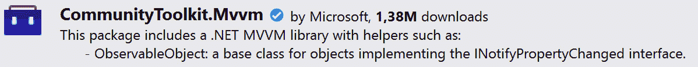
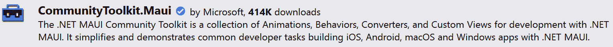

# 社区工具包

在本章中，我们将探讨一些流行的 **社区工具包**，这些工具包是为了帮助开发者更高效、更有效地在 .NET MAUI 中使用数据绑定和 MVVM 模式而开发的。这些工具包提供了有价值的组件和实用工具，可以极大地提升你的开发体验，并帮助你构建健壮和可维护的应用程序。有许多大型和小型框架或工具包可以促进数据绑定和 MVVM 模式在你的项目中的应用。其中一些对你的代码有重大影响，而另一些则更专注于为开发者提供一套辅助器或组件，你通常需要为每个新项目重写这些组件。

每个现有的工具包或框架都是一群投入时间和专业知识的开发者创造的产品，每个都为用户提供价值，无论它是否适合你的特定编码风格。在这本书中，我不想偏袒任何特定的框架或工具包，而是展示那些对开发者有益的社区驱动努力。因此，我们将探讨两个社区工具包，它们提供了一些辅助类和基类，你可以在此基础上构建，但不会对你的代码产生重大影响。

在本章中，我们将讨论以下内容：

+   MVVM 工具包

+   .NET MAUI 社区工具包

+   其他流行框架

+   贡献社区

这些工具包被选为示例，因为它们提供了可以按需集成到你的项目中的工具和组件，而不强加特定的架构风格或编码范式。这一特性使得这些工具包特别灵活和适应性强，可以适应各种编码风格和项目需求。作为 .NET 社区工具包的一部分，它们受益于一个广泛的贡献者社区，包括微软员工和独立开发者。这种合作确保了工具包始终保持最新、可靠和有效，适用于所有开发者。

这些工具包旨在简化你在构建 .NET MAUI 应用程序时遇到的大量常见任务。它们提供的功能通常是我们在前面的章节中介绍过的，但现在，它们已经方便地为你实现了。重要的是要理解，这些工具包并不是魔法般的存在；它们封装了你可以自己实现的战略和技术。然而，它们的真正价值在于提供现成的、社区认可的解决方案，为你节省大量的时间和精力。通过了解这些工具包中可用的内容，你可以做出明智的决定，关于何时利用它们以及何时定制你的解决方案。所以，无需多言，让我们深入探讨一下它们能提供什么吧！

# 技术要求

在本章中，我们将更新*Recipes!*应用程序的一些代码。更新的代码可以在 GitHub 上找到，用于参考和比较：[`github.com/PacktPublishing/MVVM-pattern-.NET-MAUI/tree/main/Chapter05`](https://github.com/PacktPublishing/MVVM-pattern-.NET-MAUI/tree/main/Chapter05)。

# MVVM Toolkit

**MVVM Toolkit**（**CommunityToolkit.Mvvm**）是一个综合性的库，旨在简化并简化您应用程序中 MVVM 模式的实现。由.NET 社区开发和维护，这个工具包提供了一套强大的框架无关的工具、组件和实用程序，帮助您使用 MVVM 模式构建应用程序。重要的是要注意，这个工具包不是.NET MAUI 特定的；它是 UI 框架无关的。

下面是 MVVM Toolkit 的一些关键特性：

+   `INotifyPropertyChanged`接口简化了引发`PropertyChanged`事件的过程。它的`SetProperty`方法简化了属性值的设置，并在需要时自动引发`PropertyChanged`事件。通过使用这个类，开发者可以减少与检查属性更新和相应触发`PropertyChanged`事件相关的样板代码。

+   `ObservableValidator`扩展了`ObservableObject`类，并包含内置的验证逻辑。这意味着任何从`ObservableValidator`继承的对象都将具有可观察和验证的特性。

+   `ICommand`接口。`RelayCommand`处理同步操作，而`AsyncRelayCommand`是为异步任务设计的。两者都支持可选的`CanExecute`逻辑。

+   `WeakReferenceMessenger`是一个消息系统，它允许松散耦合组件之间的通信。它使用弱引用来管理消息订阅，这有助于您避免应用程序中对象之间的内存泄漏和意外的强依赖。消息将在*第七章*中更深入地讨论，*依赖注入、服务*和*消息*。

+   `ObservablePropertyAttribute`简化了触发`PropertyChanged`事件的属性的实现，而`RelayCommandAttribute`则自动化了命令的创建。

这些只是 MVVM Toolkit 组件的几个示例。这里的想法是让您了解 MVVM 库能提供什么。现在，让我们看看如何在我们的项目中有效地使用它。

将 MVVM Toolkit 添加到您的项目中非常简单：

1.  右键单击`Recipes.Client.Core`项目并选择**管理** **NuGet 包**。

1.  在列表中搜索`MVVM Toolkit`并选择**CommunityToolkit.Mvvm**。*图 5.1*显示了我们要搜索的 NuGet 包：



图 5.1：CommunityToolkit.Mvvm NuGet 包

1.  打开`Recipes.Client.Core`项目。

在下面的示例中，我们将更新`RecipeDetailViewModel`和`IngredientsListViewModel`，使它们使用 MVVM Toolkit 中的`ObservableObject`。

## ObservableObject

在每个 ViewModel 中实现`INotifyPropertyChanged`接口可能会变得繁琐和重复。这就是为什么开发者经常创建一个基类来处理这项任务。MVVM Toolkit 免费提供这样一个基类，形式为`ObservableObject`。

通过继承自`ObservableObject`，您的 ViewModel 类可以自动通知视图属性更改，保持 UI 与底层数据同步。`ObservableObject`还提供了`SetProperty`方法，允许开发者设置属性值。因此，如果值已更改，它将自动触发`PropertyChanged`事件以更新 UI。

让我们更新我们的代码，让我们的 ViewModel 继承自`ObservableObject`而不是每个都实现自己的`INotifyPropertyChanged`接口：

1.  转到`IngredientsListViewModel`，让这个类继承自`ObservableObject`而不是实现`INotifyPropertyChanged`接口，如下所示：

    ```cs
    using CommunityToolkit.Mvvm.ComponentModel;
    namespace Recipes.Client.Core.ViewModels;
    public class IngredientsListViewModel :
      ObservableObject
    {
        private int _numberOfServings = 4;
        public int NumberOfServings
        {
            ...
        }
        //ToDo: add list of Ingredients
    }
    ```

1.  通过继承`ObservableObject`，我们可以移除之前存在的`OnPropertyChanged`方法和`PropertyChanged`事件。

1.  接下来，我们可以更新`NumberOfServings`属性的 setter，使其使用`ObservableObject`的`SetProperty`方法：

    ```cs
    public int NumberOfServings
    {
        get => _numberOfServings;
        set => SetProperty(ref _numberOfServings, value);
    }
    ```

    `SetProperty`方法简化了在值更新时调用`PropertyChanged`事件的实现。此方法将更新提供的后置字段（`_numberOfServings`），并在值更新时自动触发`PropertyChanged`事件。

我们也可以为`RecipeDetailViewModel`做同样的事情：

1.  继承自`ObservableObject`。

1.  移除`OnPropertyChanged`方法和`PropertyChanged`事件。

1.  更新`HideAllergenInformation`属性的 setter，使其使用`SetProperty`方法，如下面的代码片段所示：

    ```cs
    private bool _hideAllergenInformation = true;
    public bool HideAllergenInformation
    {
        get => _hideAllergenInformation;
        set => SetProperty(ref _hideAllergenInformation, value);
    }
    ```

通过确保我们的 ViewModel 继承自`ObservableObject`并利用`SetProperty`方法，我们可以消除过多的样板代码。这将使我们受益，减少大量的仪式感。这有助于保持 ViewModel 的简洁和清晰，使它们能够专注于其核心职责。除非你因代码行数而获得报酬，否则我认为你会同意，这些更新后的类看起来要好得多，样板代码要少得多！

MVVM Toolkit 中最有帮助的特性之一是不同的`ICommand`实现。让我们看看吧！

## RelayCommand

MVVM Toolkit 提供了`ICommand`接口的几个强大实现。每个实现都有其独特的作用，针对不同场景中 ViewModel 和视图之间通信的不同需求。这些实现有助于简化命令操作：

+   `RelayCommand`：这是 `ICommand` 的简单实现，允许你使用委托指定 `Execute` 和 `CanExecute` 方法，定制命令的行为以及是否可以在特定时间执行。这种实现类似于我们之前使用的 `Microsoft.Maui.Controls.Command`。然而，`Command` 实现有 `ChangeCanExecute` 方法，我们可以调用它来触发 `CanExecute` 方法的重新评估。在 `RelayCommand` 类中，具有这种行为的函数称为 `NotifyCanExecuteChanged`。

+   `RelayCommand<T>`：这是 `RelayCommand` 的一个变体，它增加了对可以传递给 `Execute` 和 `CanExecute` 方法的参数的支持。参数的类型由泛型类型参数确定。这种实现类似于 `Microsoft.Maui.Controls.Command<T>`。

+   `AsyncRelayCommand`：`ICommand` 的异步变体，`AsyncRelayCommand` 返回一个 `Task`，使其非常适合管理如网络数据获取之类的异步操作。

+   `AsyncRelayCommand<T>`：`AsyncRelayCommand` 的参数支持版本，这允许你向异步的 `Execute` 和 `CanExecute` 方法传递参数，为异步操作提供额外的灵活性。

让我们看看我们如何更新我们的命令，以便利用 `RelayCommand` 和 `RelayCommand<T>` 类：

1.  下面的代码块展示了我们如何通过将类型从 `Microsoft.Maui.Controls.Command` 更新为 `CommunityToolkit.Mvvm.Input.RelayCommand`，以及从 `Microsoft.Maui.Controls.Command<T>` 更新为 `CommunityToolkit.Mvvm.Input.RelayCommand<T>` 来在构造函数中初始化命令：

    ```cs
    public RecipeDetailViewModel()
    {
        AddAsFavoriteCommand =
            new RelayCommand(AddAsFavorite,
              CanAddAsFavorite);
        RemoveAsFavoriteCommand =
            new RelayCommand(RemoveAsFavorite,
              CanRemoveAsFavorite);
        SetFavoriteCommand =
               new RelayCommand<bool>(SetFavorite,
                 CanSetFavorite);
    }
    ```

    此更新后的代码将使用新的 `RelayCommand` 实例化三个命令，传递在调用命令的 `Execute` 和 `CanExecute` 方法时应触发的函数。

1.  当我们进行这些操作时，我们还可以更新这个类中命令的类型。虽然 `RelayCommand` 实现了 `ICommand` 接口，但它也实现了 `IRelayCommand` 接口：

    ```cs
    public IRelayCommand AddAsFavoriteCommand
    {
        get;
    }
    public IRelayCommand RemoveAsFavoriteCommand
    {
        get;
    }
    public IRelayCommand SetFavoriteCommand
    {
        get;
    }
    ```

    通过更新我们命令的类型，如前文代码片段所示，我们可以避免后续的额外类型转换。

1.  `IsFavorite` 的设置器现在可以更新为以下内容：

    ```cs
    public bool? IsFavorite
    {
        get => _isFavorite;
        private set
        {
            if(SetProperty(ref _isFavorite, value))
            {
                AddAsFavoriteCommand
                    .NotifyCanExecuteChanged();
                RemoveAsFavoriteCommand
                    .NotifyCanExecuteChanged();
                SetFavoriteCommand
                    .NotifyCanExecuteChanged();
            }
        }
    }
    ```

    `SetProperty` 方法在属性被更改时返回 `true`。这允许我们在属性更改（或未更改）时执行额外操作。例如，在这种情况下，我们希望在 `IsFavorite` 属性值更改时重新评估命令的 `CanExecute` 方法，通过调用每个命令的 `NotifyCanExecuteChanged` 方法。

遵循 MVVM 的最佳实践

由于我们不再使用 `Microsoft.Maui.Control.Command`，我们也可以移除这个项目当前所依赖的 MAUI 依赖。点击 `Recipes.Client.Core` 项目，以便打开项目的 `.csproj` 文件，并移除 `<UseMaui>` 标签。现在，ViewModel（以及 `Recipes.Client.Core` 项目）再次成为平台无关的，遵循 MVVM 的最佳实践。

在*第一章*中，很明显，应用 MVVM 模式比在代码后端编写所有内容需要更多的代码。这主要是因为 ViewModel 中的所有仪式。虽然像`ObservableObject`这样的类已经抽象了一些样板代码，但我们甚至可以更进一步，看看 MVVM Toolkit 中可用的源生成器。

## 源生成器

源生成器是.NET 中的一个编译器功能，允许开发者在编译过程中生成新代码。这有可能大大减少手动编码和错误的可能性。

MVVM Toolkit 提供了`ObservablePropertyAttribute`和`RelayCommandAttribute`，这些属性由源生成器用于创建通知 UI 变化的属性和用于处理用户交互的命令。此外，还可以使用`NotifyPropertyChangedForAttribute`和`NotifyCanExecuteChangedForAttribute`等属性与`ObservablePropertyAttribute`结合使用，通过代码生成添加更多功能。

由于源生成器的工作方式，应用这些属性的课程必须声明为部分类。在 C#中，部分类允许您使用`partial`关键字将类拆分到多个文件中。在编译时，不同的文件将组合成一个类。此功能对于源生成器至关重要，因为源生成器在编译期间生成额外的源代码。因此，当您希望使用这些属性中的任何一个时，请记住将您的 ViewModel 声明为`partial`：

```cs
public partial class RecipeDetailViewModel :
  ObservableObject
```

现在已经将 ViewModel 声明为部分类，我们可以开始调整我们的代码以利用这些属性。让我们看看如何做到这一点。

### 使用 ObservableProperty 属性

通常，在实现触发`PropertyChanged`事件的属性时，我们需要编写一些样板代码。通过使用`ObservablePropertyAttribute`，我们可以让源生成器为我们生成此代码。

此属性可以应用于字段；在构建时，将生成一个公共属性，注解的字段作为后端字段。

例如，我们可以看看`RecipeDetailViewModel`。可以将`HideExtendedAllergenList`属性删除，并将`ObservablePropertyAttribute`添加到`_hideExtendedAllergenList`字段：

```cs
[ObservableProperty]
private bool _hideExtendedAllergenList = true;
```

在此`ObservableProperty`属性生效的情况下，在构建时将生成一个名为`HideExtendedAllergenList`的完整公共属性。

生成的属性的设置方法将包含检查值是否已更新并相应触发`PropertyChanged`事件的逻辑。设置器还将调用一些正在生成的部分方法，允许我们在属性值更新时添加一些自定义代码。

注意

非常重要的是要注意，`ObservableProperty` 属性会为我们生成一个公共属性。当将此值绑定到 UI 时，请确保绑定到这个生成的属性（在这个例子中是 `HideExtendedAllergenList`），而不是尝试绑定到设置了属性的域。另外，在赋值时，始终将值赋给生成的属性，以确保触发 `PropertyChanged` 事件！

但 `RecipeDetailViewModel` 的 `IsFavorite` 属性怎么办呢？

在这个设置器中，我们调用我们命令的 `NotifyCanExecuteChanged` 方法。我们能否让这也在生成的属性上工作？是的；对于这些情况，我们有 `NotifyCanExecuteChangedFor` 属性，它接受当属性值更新时需要触发的命令的 `NotifyCanExecuteChanged` 方法的名称。这意味着整个 `IsFavorite` 属性可以重写为如下所示：

```cs
[ObservableProperty]
[NotifyCanExecuteChangedFor(nameof(AddAsFavoriteCommand))]
[NotifyCanExecuteChangedFor(nameof(RemoveAsFavoriteCommand))]
[NotifyCanExecuteChangedFor(nameof(SetFavoriteCommand))]
private bool? _isFavorite = false;
```

第一个属性 `ObservableProperty` 将生成一个属性，当其值更新时将触发 `PropertyChanged` 事件。接下来的三个 `NotifyCanExecuteChangedFor` 属性将确保当属性更新时，`IRelayCommand` 类型的三个命令的 `NotifyCanExecuteChanged` 方法将被调用。

说到命令，还有一个用于生成 `RelayCommand` 的源生成器。让我们看看。

### 使用 RelayCommand 属性

您可以将 `RelayCommand` 属性应用于您打算用作命令执行动作的方法。在构建时，这将生成一个与方法同名的公共 `RelayCommand` 属性，后缀为 “Command。” 当调用生成的 `RelayCommand` 的 `Execute` 方法时，应用了该属性的该方法将被调用。这实际上简化了声明公共 `IRelayCommand` 命令、创建要调用的方法以及创建与该方法关联的命令实例的过程，以下是一个简化的形式：

```cs
[RelayCommand]
private void RemoveAsFavorite() => IsFavorite = false;
```

这将生成一个公共 `IRelayCommand` 类型的 `RemoveAsFavoriteCommand` 属性，当命令执行时将调用 `RemoveAsFavorite` 方法。

当将此属性应用于接受一个参数的方法时，生成的命令将是一个泛型 `RelayCommand<T>`，其中 `T` 对应于参数的类型。

或者，我们也可以传递一个名为 `CanExecute` 的字符串参数，该参数指向一个方法，当调用命令的 `CanExecute` 方法时应调用该方法。如果我们想更新 `RecipeDetailViewModel` 并让 `AddAsFavoriteCommand`、`RemoveAsFavoriteCommand` 和 `SetFavoriteCommand` 由源生成器生成，这是必不可少的。让我们看看我们如何实现这一点：

1.  删除公共 `AddAsFavoriteCommand`、`RemoveAsFavoriteCommand` 和 `SetFavoriteCommand` 属性，这些属性的类型为 `IRelayCommand`。

1.  在 `RecipeDetailViewModel` 的构造函数中删除这些命令的实例化。

1.  将`RelayCommand`属性添加到`AddAsFavorite`、`RemoveAsFavorite`和`SetFavorite`方法中，如下所示：

    ```cs
    [RelayCommand(CanExecute = nameof(CanSetFavorite))]
    private void SetFavorite(bool isFavorite)
        => IsFavorite = isFavorite;
    [RelayCommand(CanExecute = nameof(CanAddAsFavorite))]
    private void AddAsFavorite() => IsFavorite = true;
    [RelayCommand(CanExecute = nameof
      (CanRemoveAsFavorite))]
    private void RemoveAsFavorite() => IsFavorite = false;
    ```

    在构建时，公共命令将通过`RelayCommand`属性生成。在这个例子中，所有属性都指向一个方法，当调用生成的命令的`CanExecute`方法时会被调用。

虽然源生成器可以极大地简化代码库并提高生产力，通过自动化样板代码，但我出于几个原因选择不使用它们。

首先，它们可能会掩盖一些底层实现细节。这可能会让新来的开发者或经验较少的开发者难以完全理解代码及其内在模式。

其次，使用 MVVM 工具包的源生成器可能需要调整你的编码风格以匹配工具包内固有的“规定”风格。这可能不会吸引所有喜欢在编码方法上更有灵活性的开发者。

然而，重要的是要注意，这些是个人偏好，许多开发者发现使用源生成器有很大的价值。它们可以显著简化 ViewModel 的开发过程，如果你发现它们对你有益且有利于你的编码风格，我真诚地推荐使用它们！

最后，源生成器是一个工具。像任何工具一样，考虑何时何地它们能带来最大价值是至关重要的。在自动化和简单性与理解、灵活性以及个人代码风格之间取得平衡，始终是软件开发中一个重要的考虑因素。

这涵盖了 MVVM 工具包的大部分基本内容。现在，让我们看看.NET MAUI 社区工具包如何使我们在应用 MVVM 模式时生活变得更轻松。

# .NET MAUI 社区工具包

.**NET MAUI 社区工具包**是一组有用的组件、控件和实用工具，旨在增强使用.NET MAUI 的开发体验。尽管其主要焦点不是启用或促进 MVVM，但工具包确实提供了可以帮助开发者在其.NET MAUI 项目中实现 MVVM 模式的功能：

+   **行为**：这些是可以附加到某些类型控件上的可重用功能块。通过在行为中封装代码，你可以保持视图的整洁和易于理解。

+   **转换器**：正如我们之前看到的，转换器有助于将数据从一种类型转换为另一种类型，这使得从 ViewModel 绑定数据到 View 变得更加容易。工具包为大量常见场景提供了许多转换器。

.NET MAUI 社区工具包还有很多其他功能，但在 MVVM 的上下文中，这些是相关的部分。请注意，这是一个应该只添加到 MAUI 项目中的工具包，而不是包含你的 ViewModel 的核心项目。为什么？因为.NET MAUI 社区依赖于.NET MAUI，因此它不应该被引用到与 UI 框架无关的项目中。

通过提供这些额外的功能和辅助工具，.NET MAUI Community Toolkit 有助于在 .NET MAUI 中使用 MVVM 时提高开发效率和流程简化。

安装 .NET MAUI Community Toolkit 与安装任何其他 NuGet 包类似：

1.  右键单击 `Recipes.Mobile` 项目，然后选择 **管理** **NuGet 包**。

1.  搜索 `Maui Community` 并从列表中选择 **CommunityToolkit.Maui**。*图 5*.2 展示了我们应该下载的 NuGet 包：



图 5.2：CommunityToolkit.Maui NuGet 包

1.  打击 `Recipes.Mobile` 项目。

1.  安装完成后，转到 `MauiProgram.cs` 并确保在 `MauiAppBuilder` 上调用 `UseMauiCommunityToolkit`：

    ```cs
    builder.UseMauiCommunityToolkit();
    ```

1.  要在 XAML 中使用工具包中的组件，您需要将命名空间添加到您想要使用工具包的 XAML 页面中：

    一旦所有这些设置就绪，我们就可以开始使用 .NET MAUI Community Toolkit。

## 转换器

在 *第四章*，*.NET MAUI 中的数据绑定*，我们讨论了值转换器是什么以及如何创建它们。.NET MAUI Community Toolkit 内置了许多现成的值转换器。其中之一是 `ListToStringConverter`，它可以非常方便地将项目列表显示为单个字符串。让我们使用它来显示食谱的过敏信息：

1.  首先，让我们向 `RecipeDetailViewModel` 添加一个名为 `Allergens` 的字符串数组：

    ```cs
    public string[] Allergens { get; }
        = new string[]{ "Milk", "Eggs", "Nuts", "Sesame" };
    ```

    此属性包含食谱中包含的所有过敏原列表。目前，我们在这里硬编码了一些值。

1.  在 `RecipeDetailPage` 上添加工具包的命名空间：

    ```cs
    xmlns:toolkit=http://schemas.microsoft.com/dotnet/2022
      /maui/toolkit
    ```

    这将允许我们使用 `toolkit` 前缀在 XAML 中访问 Community Toolkit 库。

1.  将 `ListToStringConverter` 实例添加到页面的 `Resources` 中：

    ```cs
    <ContentPage.Resources>
        ...
        <toolkit:ListToStringConverter
          x:Key="listToStringConverter" Separator=", " />
    </ContentPage.Resources>
    ```

    `ListToStringConverter` 有一个名为 `Separator` 的属性，我们将其设置为 ","。

1.  最后，我们可以更新标签，以显示过敏信息：

    ```cs
    <Label IsVisible="{Binding HideAllergenInformation,
      Mode=OneWay, Converter={StaticResource
        inverseBoolConverter}}"
       Text="{Binding Allergens, Converter={StaticResource
    ListToStringConverter, we can bind the Allergens property of the ViewModel to the Text property of the label. This converter will take the items from the Allergens array and concatenate them to show them as one string value.
    ```

此值转换器以及工具包中的其他一些转换器并不完全是火箭科学。这是您可以自己编写的。然而，在我看来，为什么要在别人已经为你做了艰苦工作的情况下重新发明轮子呢？利用这些现成的工具无疑可以使您的编码生活更加轻松！

## 行为

行为允许您在不从头开始构建自定义控件的情况下向 UI 控件添加功能。这极大地帮助构建丰富且直观的用户界面，以满足您的特定需求。通过在视图层封装 UI 特定的操作，行为有助于减少 ViewModels 的复杂性，遵循 MVVM 中核心的关注点分离原则。.NET MAUI Community Toolkit 提供了各种现成的行为，节省了您在增强 UI 时的时间和精力。

.NET MAUI 社区工具包提供的一个行为是 `EventToCommand`，它允许你将事件映射到命令。这允许你进一步增强你的 UI 和业务逻辑之间的解耦。这个行为在处理不支持直接绑定到命令的事件时特别有用。

作为一个非常简单的例子，让我们想象一下，我们想要在整个应用程序中收集一些用户行为。我们可能感兴趣的一件事是用户是否在食谱页面上滚动，因为这可能表明用户对该特定食谱有一定程度的兴趣。`ScrollView` 有一个 `Scrolled` 事件，但没有相应的命令。在这种情况下，`EventToCommandBehavior` 可以非常有帮助，就像我在接下来的步骤中将要展示的那样：

1.  在 `RecipeDetailViewModel` 上创建一个 `RelayCommand`，当用户在页面上滚动时需要调用：

    ```cs
    [RelayCommand]
    private void UserIsBrowsing()
    {
        //Do Logging
    }
    RelayCommand attribute is used to generate UserIsBrowsingCommand, but you could write a RelayCommand yourself as well, of course.
    ```

1.  接下来，我们可以在 `ScrollView` 上添加 `EventToCommandBehavior`：

    ```cs
    <ScrollView>
        <ScrollView.Behaviors>
            <toolkit:EventToCommandBehavior
              Command="{Binding UserIsBrowsingCommand}"
                EventName="Scrolled" />
        </ScrollView.Behaviors>
        ...
    </ScrollView>
    ```

    `EventToCommandBehavior` 的 `Command` 属性绑定到我们在 ViewModel 上刚刚创建的 `UserIsBrowsingCommand` 属性。通过将 `EventName` 属性设置为 `"Scrolled"`，我们定义我们想要在 `ScrollView` 的 `Scrolled` 事件上调用此命令。

作为最后一个示例，为了展示通过结合行为和转换器这个工具包如何有用，想象以下情况：一个心形图标应该始终显示在屏幕上，但只有当用户将食谱标记为收藏时，它才应该是红色的。我们可以不添加任何一行 C# 代码，也不与多个图标交互来完成这个任务！让我们看看这是如何实现的：

1.  到目前为止，在我们的 *Recipes!* 应用程序中，收藏图标放置得有点不合适。让我们先从将收藏图标放置在食谱标题旁边开始。你可以通过替换显示食谱标题的标签来完成此操作，以下是一个 XAML 代码：

    ```cs
    <Grid ColumnDefinitions="*, Auto">
        <Label
            FontAttributes="Bold" FontSize="22"
            Text="{Binding Path=Title, Mode=OneTime}"
            VerticalOptions="Center" />
        <Image
            x:Name="favoriteIcon"
            Grid.Column="1" Margin="5"
            HeightRequest="35" Source="favorite.png"
            VerticalOptions="Center" WidthRequest="35">
        </Image>
    </Grid>
    ```

    现在，收藏图标将永久地出现在食谱标题旁边。

1.  .NET MAUI 社区工具包提供了 `IconTintColorBehavior`，我们可以将其应用到 `favoriteIcon` 上以改变其颜色。我们可以在我们的图片上添加此行为：

    ```cs
    <Image
        x:Name="favoriteIcon"
        ...>
        <Image.Behaviors>
            <toolkit:IconTintColorBehavior
                TintColor="#E9E9E9E9" />
        </Image.Behaviors>
    </Image>
    ```

    添加此行为后，图标将采用指定的 `TintColor`。

1.  现在，我们需要根据 `RecipeDetailViewModel` 的 `IsFavorite` 属性设置 `TintColor` 值。方便的是，工具包提供了 `BoolToObjectConverter`，我们可以利用它将 `boolean` 值转换为另一个值。我们可以在 `RecipeDetailPage` 中添加其实例：

    ```cs
    <toolkit:BoolToObjectConverter
        x:Key="isFavoriteToColorConverter"
        x:TypeArguments="Color"
        FalseObject="#E9E9E9E9"
        TrueObject="#FF0000" />
    ```

1.  通过将此实例的 `TypeArguments` 设置为 `"Color"`，我们指定我们想要将 `bool` 值转换为 `Color` 值。`FalseObject` 和 `TrueObject` 属性设置了转换器应该为 `false` 和 `true` 返回的值。

1.  最后一步是在图片上更新`IconTintColorBehavior`。挑战在于将行为的`TintColor`属性绑定到`RecipeDetailViewModel`的`IsFavorite`属性。由于行为不会从它们定义的控件继承`BindingContext`，我们将使用`ElementBinding`通过`favoriteIcon`的`BindingContext`访问`RecipeDetailViewModel`：

    ```cs
    <toolkit:IconTintColorBehavior TintColor="{Binding
      Source={x:Reference favoriteIcon},
        Path=BindingContext.IsFavorite,
          Converter={StaticResource
    TintColor is effectively bound to the IsFavorite property on the ViewModel and isFavoriteToColorConverter determines the color to use.
    ```

.NET MAUI Community Toolkit 是一个无价的资源，它简化了开发过程。它提供了各种可重用的构建块，减少了重复工作的必要性，并允许您专注于创建独特应用程序功能。通过行为、转换器等组件，该工具包使开发者能够以更少的努力和复杂性构建丰富和交互式的用户体验。尽管该工具包不专注于 MVVM，但它通过提供行为、转换器等实用功能，有助于实现 MVVM 模式。

# 其他流行的框架

如前所述，有众多 MVVM 框架可供选择，每个框架都有其独特的特性和优势。在本章中，我们探讨了 MVVM Toolkit 和.NET MAUI Community Toolkit。这些工具包由社区驱动且易于访问，提供了各种有用的工具，以简化您的 MVVM 代码。

然而，MVVM 框架的领域非常广泛，因此了解其他框架可以提供什么可能是有价值的。以下是一些与.NET MAUI 兼容的最受欢迎的第三方 MVVM 框架列表：

+   ReactiveUI: [`www.reactiveui.net/`](https://www.reactiveui.net/)

+   Prism 库: [`prismlibrary.com/`](https://prismlibrary.com/)

+   TinyMvvm: [`github.com/dhindrik/TinyMvvm`](https://github.com/dhindrik/TinyMvvm)

+   FreshMvvm: [`github.com/XAM-Consulting/FreshMvvm.Maui`](https://github.com/XAM-Consulting/FreshMvvm.Maui)

无论您是在寻找一个简单的工具包来处理基础知识，还是需要一个具有高级功能的全面框架，您很快就会发现一个最适合您特定需求并与您的编码风格相匹配的框架。然而，重要的是要记住，使用 MVVM 框架并不是有效实现 MVVM 的先决条件。完全有可能在没有专用框架的情况下有效地实现 MVVM 模式。最终，是否使用框架——以及如果使用，使用哪个框架——应取决于您项目的需求、您团队对框架的熟悉程度以及您个人的编码偏好。*记住，工具是用来帮助您的，而不是规定您如何编码的。*

# 为社区贡献力量

随着本章的结束，重要的是要认识到这些第三方工具包和框架在本质上都是社区贡献的结果。它们是他人辛勤工作、思考和热情的结晶。所有这些代码都可以在 GitHub 等平台上供您访问，并由具有社区意识的个人维护，他们总是乐于接受建议、改进和错误报告。

请记住，为社区做出贡献并不仅限于创建自己的新项目或工具包。它可能只是报告一个 bug、建议一个功能，甚至在开源项目上进行小的代码改进。这种开源精神是.NET 生态系统的主要优势之一。

因此，如果您在使用这些框架时发现可以改进的地方或需要修复的 bug，请不要犹豫，积极贡献。通过这样做，您不仅会为自己改进工具，也会为其他使用它的开发者带来便利。这样，您可以回馈社区，也许在这个过程中还能学到一些东西。

最后，请记住，这些开源 MVVM 框架不仅仅是您使用的工具，它们也是您作为开发者成长和为更广泛的.NET 社区做出贡献的机会。

# 摘要

总结来说，MVVM 工具包和.NET MAUI 社区工具包都提供了一套全面的组件，有助于在您的应用程序中实现 MVVM 模式。通过使用这些工具包，您可以避免从头开始构建一切或重新发明现有解决方案的需要，从而节省时间和精力，并让您能够专注于构建应用程序。

在本书的其余代码示例中，我们将使用 MVVM 工具包，并使用`ObservableObject`和`RelayCommand`等类。这些类非常易于理解。即使您选择不使用此工具包，您也应该发现代码示例清晰易懂，因为底层概念并不复杂。

# 进一步阅读

要了解更多关于本章所涉及主题的信息，请查看以下资源：

+   MVVM 工具包简介：[`learn.microsoft.com/dotnet/communitytoolkit/mvvm/`](https://learn.microsoft.com/dotnet/communitytoolkit/mvvm/)

+   .NET MAUI 社区工具包文档：[`learn.microsoft.com/dotnet/communitytoolkit/maui/`](https://learn.microsoft.com/dotnet/communitytoolkit/maui/)

+   .NET MAUI 社区工具包转换器：[`learn.microsoft.com/dotnet/communitytoolkit/maui/converters/`](https://learn.microsoft.com/dotnet/communitytoolkit/maui/converters/)

+   .NET MAUI 社区工具包行为：[`learn.microsoft.com/dotnet/communitytoolkit/maui/behaviors/`](https://learn.microsoft.com/dotnet/communitytoolkit/maui/behaviors/)

+   `ObservablePropertyAttribute`: [`learn.microsoft.com/dotnet/communitytoolkit/mvvm/generators/observableproperty`](https://learn.microsoft.com/dotnet/communitytoolkit/mvvm/generators/observableproperty)

+   `RelayCommandAttribute`: [`learn.microsoft.com/dotnet/communitytoolkit/mvvm/generators/relaycommand`](https://learn.microsoft.com/dotnet/communitytoolkit/mvvm/generators/relaycommand)
