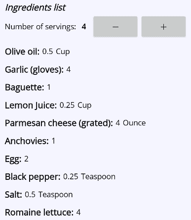
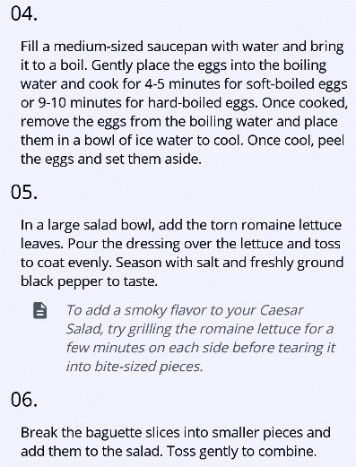
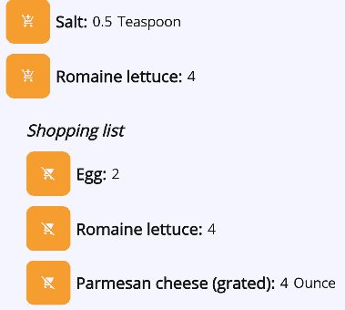
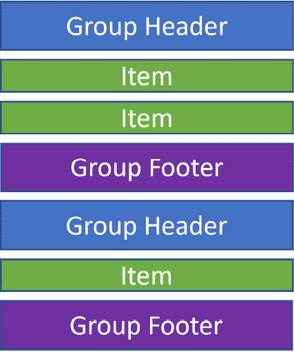
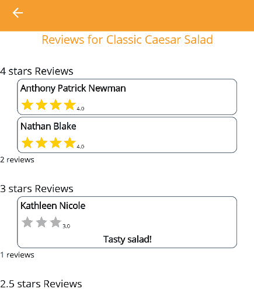

# 与集合一起工作

集合几乎是每个应用程序的基本组成部分，使我们能够管理和组织相关对象的组。在本章中，我们将探讨在 MVVM 设计模式背景下集合的力量，为您提供在 .NET MAUI 应用程序中高效处理数据的工具和知识。

到目前为止，我们的主要关注点一直是绑定单个值，例如标题、评分和命令。然而，随着集合的引入，我们可以将我们的应用程序提升到新的水平。集合使我们能够表示项目组，无论是食谱集合、成分列表还是用户评分数组。通过利用集合的能力，我们可以创建动态、数据驱动的 UI，提供增强的用户体验。

本章分为三个关键部分：

+   使用 `BindableLayout`

+   `ICollectionChanged` 接口

+   与 `CollectionView` 一起工作

到本章结束时，您将对在 .NET MAUI 中使用集合有深入的理解，这将显著扩展您构建丰富、以数据为中心的应用程序（如我们的 *Recipes!* 应用程序）的能力。让我们深入探讨吧！

# 技术要求

在本章中，我们将增强 *Recipes!* 应用程序的功能。本章的代码库以及所有资产，包括为有效覆盖本章主题所需的额外类和代码，可以在 GitHub 上找到：[`github.com/PacktPublishing/MVVM-pattern-.NET-MAUI/tree/main/Chapter06`](https://github.com/PacktPublishing/MVVM-pattern-.NET-MAUI/tree/main/Chapter06)。本章的起点在 `Start` 文件夹中提供，其中包含为本章特别添加的必要类和代码。`Start` 文件夹中的代码是跟随本章内容的基础，建立在之前章节中建立的基础上。本章完成后的代码，包括我们本章中编写的所有代码，可以在 `Finish` 文件夹中找到，供参考和比较。

# 使用 BindableLayout

`BindableLayout` 类是一个静态类，它为将集合绑定到布局容器提供了 *附加属性*。附加属性是一个概念，允许您将额外的属性附加到现有元素或控件上。这些属性不是在元素本身中定义的，而是由外部类提供的。它们使您能够在不修改其底层代码的情况下扩展元素的行为和功能。`.NET MAUI` 中最常用的附加属性之一可能是 `Grid.Row`。它可以应用于任何 UI 元素，允许您在 `Grid` 布局中定义行位置。它不是 UI 元素本身的属性；相反，它是一个增强 `Grid` 布局灵活性和强大功能的附加属性。因此，`BindableLayout` 提供了一组附加属性，可用于将数据集合绑定到布局容器，例如 `VerticalStackLayout` 或 `Grid`。您可以利用其附加属性轻松绑定并显示动态数据集合。

虽然可以将 `BindableLayout` 类的附加属性添加到任何继承自 `Layout` 类的布局中，但它通常与 `VerticalStackLayout` 和 `HorizontalStackLayout` 等布局一起使用。

注意

`BindableLayout` 是显示数据集合的一个轻量级且直接的方法。它非常适合项目数量有限的情况，提供了简单性和易用性。

然而，重要的是要考虑，`BindableLayout` 在没有内置功能如虚拟化或视图回收的情况下为集合中的每个项目生成 UI 元素。这意味着对于包含许多项目的大型集合，可能会有性能影响和内存使用增加。

让我们看看我们如何使用 `BindableLayout` 在 `VerticalStackLayout` 内部显示数据集合。

## 显示什么以及如何显示

`BindableLayout` 的两个基本附加属性是 `ItemsSource` 和 `ItemTemplate`。这两个属性在定义需要显示哪些数据集合以及如何可视化每个数据项方面起着至关重要的作用。`ItemsSource` 属性用于绑定数据集合，而 `ItemTemplate` 属性用于定义集合中每个项目的 `DataTemplate`。

由于一个食谱如果没有其配料列表就什么都不是，在第一个例子中，我们将在 `RecipeDetailPage` 上显示配料列表。然而，在我们深入探讨如何有效使用 `BindableLayout` 之前，让我们首先讨论 `RecipeIngredientViewModel`，它用于存储配料的信息。

### 定义配料

`RecipeIngredientViewModel` 类表示食谱中的一个配料。

它包含成分的名称和关于特定份数所需成分数量的信息。`DisplayAmount`属性的目的在于动态调整并显示所需份数的适当数量的成分。它允许用户看到与所选份量相匹配的调整后的数量，为他们的食谱准备提供准确的成分测量。让我们看看它的`UpdateServings`方法：

```cs
public void UpdateServings(int servings)
{
    var factor = servings / (double)baseServings;
    DisplayAmount = factor * baseAmount;
}
```

此方法根据期望的份量更新`DisplayAmount`属性，使用户能够看到所选份量中成分的适当数量。由于`DisplayAmount`属性的 setter 在值变化时调用`PropertyChanged`事件，我们可以将此属性绑定到视图中的 UI 元素，以根据所选的份量动态显示调整后的成分数量。

我们可以扩展`IngredientsListViewModel`以添加一个额外的属性：`Ingredients`。这个属性是一个`RecipeIngredientViewModel`对象的列表，为了演示目的，它被分配了一个硬编码的成分列表，这些成分是制作凯撒沙拉所需的。

最后，更新了`NumberOfServings`属性。以下代码块展示了当`NumberOfServings`属性的值发生变化时，如何调用每个成分上的`UpdateServings`方法：

```cs
public int NumberOfServings
{
    get => _numberOfServings;
    set
    {
        if (SetProperty(ref _numberOfServings, value))
        {
            Ingredients.ForEach(
                i => i.UpdateServings(value));
        }
    }
}
```

当更新`NumberOfServings`时，通过调用`UpdateServings`方法，每个成分的`DisplayAmount`属性也会更新。

在所有这些准备就绪后，我们最终可以转向 XAML，看看我们如何将这个`RecipeIngredientViewModels`集合绑定到一个`VerticalStackLayout`上，同时使用`BindableLayout`的附加属性。

### 在屏幕上显示成分

在以下步骤中，我们将通过设置 XAML 代码来以视觉上吸引人的方式显示成分。请注意，我们将在 XAML 中执行的所有操作也可以在代码中完成：

1.  在`RecipeDetailPage`上，在包含控制份量的`Stepper`属性的`HorizontalStackLayout`下方，我们可以添加一个新的`VerticalStackLayout`。如下面的代码块所示，我们可以使用`BindableLayout`类的`ItemsSource`属性来绑定到成分列表：

    ```cs
    <VerticalStackLayout
        Margin="0,10" Spacing="10"
        BindableLayout.ItemsSource="{Binding
    IngredientsList.Ingredients}">
    </VerticalStackLayout>
    ```

1.  现在，我们需要定义需要渲染的 UI 元素，这些元素对应于绑定集合中的每个项目。我们可以使用`ItemTemplate`属性来定义这一点。这个属性需要一个`DataTemplate`类的值。它可以这样定义：

    ```cs
    <VerticalStackLayout ... >
        <BindableLayout.ItemTemplate>
            <DataTemplate x:DataType=
              "vms:RecipeIngredientViewModel" >
            </DataTemplate>
        </BindableLayout.ItemTemplate>
    </VerticalStackLayout>
    ```

    注意，在`DataTemplate`中，如果我们想利用编译绑定，就像我们在*第四章*中看到的，*在.NET MAUI 中的数据绑定*，我们可以定义`x:DataType`。

注意

非常重要的是要认识到，`DataTemplate`的`BindingContext`被设置为绑定集合的单独项目。因为模板会为集合中的每个项目重复，所以在`DataTemplate`中用`x:Name`命名的 UI 元素在代码后面是不可访问的。它们的名称仅限于该模板的作用域。然而，名称仍然可以用于同一`DataTemplate`内的元素绑定。

1.  下面的代码片段显示了我们可以如何为配料定义一个`DataTemplate`。这就是我们定义每个配料需要如何可视化的方式：

    ```cs
    <DataTemplate x:DataType=
      "vms:RecipeIngredientViewModel">
        <HorizontalStackLayout Spacing="5">
            <Label
                FontAttributes="Bold" FontSize="16"
                Text="{Binding IngredientName,
                  StringFormat='{0}:', Mode=OneTime}"
                VerticalOptions="Center" />
            <Label Text="{Binding DisplayAmount,
    Mode=OneWay}" VerticalOptions="Center" />
            <Label
                Text="{Binding Measurement, Mode=OneTime}"
                VerticalOptions="Center" />
        </HorizontalStackLayout>
    </DataTemplate>
    ```

对于每个配料，我们希望渲染一个包含显示配料名称的标签、显示`DisplayAmount`的标签，以及最后显示`Measurement`的标签的`HorizontalStackLayout`。*图 6**.1*显示了它的样子：



图 6.1：配料列表

注意到`DisplayAmount`是`OneWay`绑定的，这意味着当此属性的`PropertyChanged`事件被触发时，标签的`Text`属性会相应地更新。所有其他属性都可以绑定`OneTime`，因为它们的值在显示后不会改变。

小贴士

在性能方面，值得注意的是，`OneTime`绑定模式通常比`OneWay`数据绑定更高效。这在绑定数据集合时尤为重要！`OneTime`绑定只建立一次绑定，不会跟踪源属性后续的变化。因此，在可能的情况下使用`OneTime`绑定来优化性能和减少不必要的 UI 更新是明智的。

`DataTemplate`也可以在资源字典中定义。这允许`DataTemplate`被重用，这在在应用的不同部分显示相同类型的数据时特别方便。例如，通过在`Application.Resources`（在`App.xaml`中）中一次性定义模板，它可以在整个应用中重用。然后，我们可以使用`StaticResource`标记扩展，通过在资源字典中定义的键将特定的`DataTemplate`绑定到`BindableLayout`的`ItemTemplate`属性。下面的代码块显示了如何将`DataTemplate`添加到页面的资源中，并在稍后将其用作`VerticalStackLayout`显示配料的`ItemTemplate`：

```cs
<ContentPage.Resources>
    <DataTemplate x:Key="recipeIngredientTemplate"
              x:DataType="vms:RecipeIngredientViewModel">
        ...
    </DataTemplate>
</ContentPage.Resources>
...
    <VerticalStackLayout
        Margin="0,10"
        BindableLayout.ItemsSource="{Binding IngredientsList.Ingredients}"
        BindableLayout.ItemTemplate="{StaticResource
          recipeIngredientTemplate}"
        Spacing="10"/>
```

在之前的代码片段中，在`ContentPage.Resources`部分定义了一个`DataTemplate`，并将其分配给`"recipeIngredientTemplate"`键。稍后，通过使用`StaticResource`标记扩展引用该模板，使用`"recipeIngredientTemplate"`键，在`VerticalStackLayout`中使用了此模板。

注意

在.NET MAUI 中，如果你绑定一个集合而没有分配特定的`DataTemplate`，框架会自动调用集合中每个对象的`ToString`方法。返回的字符串值就是将在屏幕上显示的内容。

在所有这些准备就绪之后，我们的应用现在在菜谱详情页上显示了一份成分列表，其中每个成分都使用定义好的`ItemTemplate`进行渲染。

但如果某个特定集合中的所有项目都不应该以相同的方式渲染呢？让我们看看如何在运行时动态选择`DataTemplate`。

## 在运行时动态选择 DataTemplate

虽然成分对于菜谱应用至关重要，但没有一套全面的烹饪说明，对成分的处理就非常有限。因此，让我们在我们的应用中让这些说明变得生动起来！除了基本步骤外，说明列表还可能包括有价值的烹饪技巧和额外信息，以增强烹饪体验。让我们探讨如何将这些烹饪说明以及任何相关的备注整合到我们的*Recipes!*应用中。

### 定义烹饪说明和备注

在我们的应用中，我们使用`InstructionViewModel`和`NoteViewModel`分别表示烹饪说明和备注。`InstructionViewModel`有`Index`和`Description`属性，而`NoteViewModel`只有一个`Note`属性。它们都归组在共同的父类`InstructionBaseViewModel`下，并存储在`RecipeDetailViewModel`中的`Instructions`列表中。

目前，这个列表初始化了一些烹饪说明和制作凯撒沙拉的技巧。

如果我们想在屏幕上显示包含说明和备注的列表，我们需要一个机制，允许我们根据类型使用不同的`ItemTemplate`。让我们看看`DataTemplateSelector`如何实现这一点！

### 创建一个 DataTemplateSelector

使用`DataTemplateSelector`，我们可以编写在运行时确定使用哪个`DataTemplate`的代码。编写`DataTemplateSelector`相当直接。让我们看看我们如何构建一个：

1.  在`TemplateSelectors`中，通过右键单击**Recipes.Mobile**项目并选择**添加** | **新建文件夹**。

1.  接下来，右键单击这个新添加的文件夹，将其命名为`InstructionsDataTemplateSelector`。

1.  为了使我们的类作为`DataTemplateSelector`工作，它需要从`Microsoft.Maui.Controls.DataTemplateSelector`继承，如下面的代码片段所示：

    ```cs
    public class InstructionsDataTemplateSelector :
      DataTemplateSelector
    {
        protected override DataTemplate
          OnSelectTemplate(object item, BindableObject
            container) { }
    }
    ```

从`DataTemplateSelector`类继承需要重写抽象的`OnSelectTemplate`方法。该方法在运行时被调用以选择适当的`DataTemplate`，并接受两个参数：

+   `item`（类型为`object`）是我们想要显示的对象，例如我们应用中的`NoteViewModel`或`InstructionViewModel`项目。

+   `container`（类型为`BindableObject`）指的是包含集合的布局元素，例如我们示例中的`VerticalStackLayout`

使用这些参数，`DataTemplateSelector`中的`OnSelectTemplate`方法可以帮助你为给定项目选择适当的`DataTemplate`。在我们的特定场景中，该方法将根据传入项目的类型来确定模板。

让我们在`InstructionsDataTemplateSelector`中引入两个属性。这两个属性，`NoteTemplate`和`InstructionTemplate`，决定了`DataTemplateSelector`应该根据传入的项目参数类型返回哪个`DataTemplate`。具体来说，如果它是一个`NoteViewModel`，则`OnSelectTemplate`方法应该返回`NoteTemplate`。相反，如果是`InstructionViewModel`，则返回`InstructionTemplate`。让我们探索如何实现这一点：

1.  将以下属性添加到`InstructionsDataTemplateSelector`：

    ```cs
    public DataTemplate NoteTemplate { get; set; }
    public DataTemplate InstructionTemplate { get; set; }
    ```

1.  以下代码块显示了如何实现`OnSelectTemplate`方法，以便它检查给定项的类型并返回适当的`DataTemplate`：

    ```cs
    protected override DataTemplate OnSelectTemplate
      (object item, BindableObject container)
    {
        if (item is InstructionViewModel)
            return InstructionTemplate;
        else if(item is NoteViewModel)
            return NoteTemplate;
        return null;
    }
    ```

    如果给定的项既不是`InstructionViewModel`也不是`NoteViewModel`项，则返回`null`。因此，对象的`ToString`方法返回的值将被渲染，这与不提供`DataTemplateSelector`时的行为相同。

这就是`InstructionsDataTemplateSelector`的内容。让我们看看我们如何使用这个`DataTemplateSelector`在应用中显示说明和笔记。

### 在屏幕上显示说明和笔记

现在数据已经就绪，我们也确定了想要使用的`DataTemplateSelector`，我们需要在 XAML 中做一些事情来显示菜谱的说明和笔记：

1.  让我们先思考一下我们如何在应用中表示`InstructionViewModel`。以下是一个我们可以添加到`RecipeDetailPage`资源中的模板：

    ```cs
    <ContentPage.Resources>
    ...
        <DataTemplate x:Key="instructionTemplate"
          x:DataType="vms:InstructionViewModel">
            <VerticalStackLayout Spacing="10">
                <Label FontSize="20" Text="{Binding Index,
                 StringFormat='{0:D2}.', Mode=OneTime}" />
                <Label Margin="10,0" Text="{Binding
                  Description, Mode=OneTime}" />
            </VerticalStackLayout>
        </DataTemplate>
    </ContentPage.Resources>
    ```

    `InstructionViewModel`的`DataTemplate`定义了我们想要如何可视化此类项：显示`Index`属性，其下方是`Description`。

    注意，我们给`DataTemplate`分配了一个键（`instructionTemplate`），我们可以稍后使用它来引用这个特定的模板。

1.  让我们添加一个`NoteViewModel`项的`DataTemplate`。以下代码块显示了可视化此类项的`DataTemplate`：

    ```cs
    <DataTemplate x:Key="noteTemplate" x:DataType=
      "vms:NoteViewModel">
        <Grid Margin="20,0" ColumnDefinitions="35,*">
            <Label
                FontFamily="MaterialIconsRegular"
                FontSize="20" Text="&#xe873;"
                TextColor="LightSlateGray" />
            <Label
                Grid.Column="1" FontAttributes="Italic"
                Text="{Binding Note, Mode=OneTime}"
                TextColor="LightSlateGray" />
        </Grid>
    </DataTemplate>
    ```

    通过使用这个`DataTemplate`，我们可以通过显示一个图标（我们使用`MaterialIconsRegular`字体）来可视化笔记，然后是笔记本身。两者都使用特定的颜色，以便在笔记和说明之间有清晰的区分。和之前一样，我们给`DataTemplate`分配了一个特定的键（`noteTemplate`），这样我们就可以稍后引用它。

1.  接下来，让我们将`InstructionsDataTemplateSelector`添加到`RecipeDetailPage`。首先，将所述`DataTemplateSelector`的命名空间作为 XML 命名空间添加到页面中，如下所示：

    ```cs
    xmlns:selectors="clr-namespace:Recipes
      .Mobile.TemplateSelectors"
    ```

    一旦设置好，我们就可以将`InstructionsDataTemplateSelector`类的一个实例添加到页面的`Resources`中，如下面的代码片段所示：

    ```cs
    <selectors:InstructionsDataTemplateSelector
        x:Key="instructionDataTemplateSelector"
        InstructionTemplate="{StaticResource
          instructionTemplate}"
        NoteTemplate="{StaticResource noteTemplate}" />
    ```

    使用 `StaticResource` 标记扩展来引用我们之前创建的两个 `DataTemplate`，并将它们分配给 `InstructionsDataTemplateSelector` 的相应属性。就像我们对单个 `DataTemplate` 所做的那样，我们给这个 `InstructionsDataTemplateSelector` 实例提供了一个键（`instructionDataTemplateSelector`），我们可以在以后使用它来引用。

1.  要显示指令列表，我们可以在 `RecipeDetailPage` 的底部附近添加一个 `VerticalStackLayout`。以下代码片段演示了此设置：

    ```cs
    <VerticalStackLayout Padding="10">
        <Label FontAttributes="Italic,Bold"
            FontSize="16" Text="Instructions" />
        <VerticalStackLayout
            Margin="0,10" Spacing="10"
    BindableLayout.ItemsSource="{Binding
              Instructions}"
            BindableLayout.ItemTemplateSelector=
              "{StaticResource instruction
                DataTemplateSelector}"/>
    </VerticalStackLayout>
    Instructions property of our ViewModel to the BindableLayout ItemsSource property. Additionally, by using the StaticResource markup extension and the key we used in the resource dictionary for our DataTemplateSelector, we set the ItemTemplateSelector property. The result is shown in *Figure 6**.2*:
    ```



Figure 6.2: Showing instructions and notes

通过这样，我们已经探讨了如何在 *Recipes!* 应用程序中利用 `DataTemplate` 和 `DataTemplateSelector` 来可视化指令和注释。通过定义单独的 `DataTemplate` 并使用 `DataTemplateSelector`，我们可以动态地为集合中的每个项目选择适当的模板，提供定制且直观的烹饪指令和附加注释的显示。

现在我们已经成功实现了指令和注释的可视化，让我们继续处理空集合。

### 处理空集合

除了 `ItemsSource` 和 `ItemTemplate` 属性外，`BindableLayout` 还具有 `EmptyView` 和 `EmptyViewTemplate` 属性。这些属性允许我们定义如果提供的 `ItemsSource` 为空或为 null 时显示的内容。

`EmptyView` 属性可以是字符串值或 `View`。因此，在其最简单的形式中，我们可以在 `VerticalStackLayout` 中添加以下内容来显示购物清单：

```cs
<VerticalStackLayout
    BindableLayout.EmptyView="Nothing to see here"
    ... >
```

当绑定的 `ItemSource` 不包含任何项目时，屏幕上会显示 `"Nothing to see here"`。

或者，如果我们想要对集合为空时显示的内容的外观有更多控制，我们也可以这样做：

```cs
<VerticalStackLayout
    ...>
        <BindableLayout.EmptyView>
            <Label Text="Nothing to see here"
                FontAttributes="Bold" />
EmptyViewTemplate, we can specify a DataTemplate that needs to be shown when the bound collection is empty or null. This means that in this template, you can bind to values on the parent UI element or any other accessible context within the UI hierarchy. This flexibility enables you to create dynamic and context-aware empty views that can display relevant information or provide interactive elements based on the available data context.
As we saw earlier, data binding and the `INotifyPropertyChanged` interface allow the UI to stay in sync with the data on ViewModels, ensuring automatic updates. However, when it comes to dynamically adding or removing items from collections, the binding engine alone will not automatically reflect these changes in the UI. To achieve this kind of behavior, we need to explore the `ICollectionChanged` interface.
The ICollectionChanged interface
The `ICollectionChanged` interface provides a powerful mechanism for notifying the UI about changes in a collection itself, rather than on individual items within the collection. By implementing this interface, a collection can raise events that inform the binding engine and UI elements about structural changes, such as additions, removals, or modifications to the collection itself.
While it is possible to assign an updated list of items to a property on your ViewModel and trigger the `PropertyChanged` event, dynamically changing a collection requires a more optimal approach. By utilizing a collection that implements the `INotifyCollectionChanged` interface, we can achieve more efficient rendering of the UI. Instead of needing to re-render the entire collection on the UI, the binding engine can perform updates in a more optimized manner, resulting in improved performance and responsiveness.
The `ICollectionChanged` interface defines the `CollectionChanged` event, which is raised whenever the collection undergoes a structural change. This event provides detailed information about the type of change that occurred, such as whether an item was added, removed, or modified, and the position at which the change occurred. Let’s see what this means in terms of binding modes.
The ICollectionChanged interface and binding modes
To use this interface as efficiently as possible, it’s very important to understand how different binding modes affect this behavior.
OneTime binding
When using `OneTime` binding, the UI will perfectly update when items inside the collection change. However, there’s a caveat: if a new instance is assigned to the property holding the collection, this change won’t reflect in the UI. In such cases, instead of assigning a new instance, we need to clear the existing collection and add the new items to it. Importantly, the property setter should not trigger the `NotifyPropertyChanged` event as it’s unnecessary for `OneTime` binding.
OneWay binding
`OneWay` binding might offer more flexibility, allowing you to replace the collection with a new instance and reflect this in the UI. In this mode, make sure the property setter calls the `NotifyPropertyChanged` event to update the UI. While `OneWay` binding allows for greater flexibility, replacing an entire collection can be resource-intensive, requiring the UI to re-render the collection. This is especially important to consider when dealing with large datasets. If only a few items change, modifying the existing collection is often more efficient than replacing it.
By understanding these subtleties, you can make more informed decisions on what data binding mode to use.
Let’s put this into action and add some functionality to the *Recipes!* app by leveraging the `ObservableCollection` class.
Using the ObservableCollection
The `ObservableCollection` class is a specialized collection class provided by .NET that implements the `ICollectionChanged` interface out of the box.
Let’s enhance the functionality of our *Recipes!* app by introducing a `Shopping List` feature. We want to provide users with the ability to add ingredients from the list of recipe ingredients to a separate `Shopping List`. To achieve this, we will associate a button with each ingredient in the list. When the user taps the button, the corresponding ingredient will be added to an `ObservableCollection` named `ShoppingList`. As a result, the UI will be automatically updated each time an ingredient is added or removed from the list:

1.  Let’s start by adding an additional property, `ShoppingList`, of type `Observable` **Collection<RecipeIngredientViewModel>** to `RecipeDetailViewModel`:

    ```

    public ObservableCollection<RecipeIngredientViewModel>

    ShoppingList { get; } = new();

    ```cs

    We are automatically assigning a new instance to this property, which makes perfect sense: the instance of this property will not change as we will be adding and removing items from the collection. As `ObservableCollection` implements the `IObservableCollection` interface, the UI will remain in sync as the `CollectionChanged` event will be triggered when we manipulate the collection.

     2.  Currently, we don’t have functionality for managing items in the `ShoppingList` collection. So, let’s add the following to `RecipeDetailViewModel`:

    ```

    public IRelayCommand AddToShoppingListCommand { get; }

    public IRelayCommand RemoveFromShoppingListCommand

    { get; }

    private void AddToShoppingList(

    RecipeIngredientViewModel viewModel)

    {

    if (ShoppingList.Contains(viewModel))

    return;

    ShoppingList.Add(viewModel);

    }

    private void RemoveFromShoppingList

    (RecipeIngredientViewModel viewModel)

    {

    if (ShoppingList.Contains(viewModel))

    ShoppingList.Remove(viewModel);

    }

    ```cs

    The `AddToShoppingList` method will be responsible for adding an instance of `RecipeIngredientViewModel` to the `ShoppingList` collection if the given ViewModel isn’t already in there. The `RemoveFromShoppingList` method, on the other hand, will remove the item from `ShoppingList`.

    For both methods, we’ve also created two corresponding commands, which we need to instantiate in the constructor of `RecipeDetailViewModel`, as shown here:

    ```

    public RecipeDetailViewModel()

    {

    ...

    AddToShoppingListCommand = new RelayCommand

    <RecipeIngredientViewModel>(AddToShoppingList);

    RemoveFromShoppingListCommand = new RelayCommand

    <RecipeIngredientViewModel>

    (RemoveFromShoppingList);

    }

    ```cs

     3.  Next, add the following XAML to the `VerticalStackLayout` that shows the ingredients of the recipe:

    ```

    <VerticalStackLayout Padding="10">

    <Label ...

    Text="Ingredients list" />

    ...

    <VerticalStackLayout Margin="10,0" Padding="10">

    <Label

    FontAttributes="Italic,Bold"

    FontSize="16" Text="Shopping list" />

    <VerticalStackLayout

    Margin="0,10" Spacing="10"

    BindableLayout.ItemsSource="{Binding

    ShoppingList, Mode=OneTime}"

    BindableLayout.EmptyView="Nothing added">

    </VerticalStackLayout>

    </VerticalStackLayout>

    </VerticalStackLayout>

    ```cs

    Below the list of ingredients, we’ve added a label with the text `"Shopping list"`, followed by another `VerticalStackLayout`. The `ShoppingList` property is bound to the `BindableLayout.ItemsSource` property. We’ve added an `EmptyView` property that will be shown when no items are on the list.

    The `ItemTemplate`, which will be rendered for each item in `ShoppingList`, will be added in a few steps.

     4.  Let’s add a `Button` to the `ItemTemplate` of the `VerticalStackLayout` showing the ingredients. The `Button`’s `Command` should be bound to the `AddToShoppingListCommand` on the `RecipeDetailViewModel` as shown here:

    ```

    <HorizontalStackLayout Spacing="5">

    `<Button

    Command="{Binding AddToShoppingListCommand,

    Source={RelativeSource AncestorType={x:Type

    vms:RecipeDetailViewModel}}}"

    CommandParameter="{Binding}"

    FontFamily="MaterialIconsRegular"

    Text="&#xe854;" />

    <Label

    FontAttributes="Bold"

    FontSize="16" VerticalOptions="Center"

    Text="{Binding IngredientName,

    StringFormat='{0}:'}" />

    ...

    </HorizontalStackLayout>

    ```cs

    The `Button`’s `Command` property is bound to the `AddToShoppingListCommand` on the `RecipeDetailViewModel`. As the `Button`’s `BindingContext` is the current `RecipeIngredientViewModel`, we need to use relative binding to point to the `RecipeDetailViewModel`. `CommandParameter` is data bound by just defining `{ Binding }`. This will bind it to the binding context of the UI element itself, which is the current `RecipeIngredientViewModel`. As a result, the `RecipeIngredientViewModel` instance is passed to the `AddShoppingList` method, allowing us to add it to the `ShoppingList` collection.

     5.  Finally, we can define the `ItemTemplate` of the `ShoppingList` items. We can copy the `DataTemplate` of the `"Ingredients list"`. However, we need to update the `Button` to this:

    ```

    <Button

    Command="{Binding RemoveFromShoppingListCommand,

    Source={RelativeSource AncestorType={x:Type

    vms:RecipeDetailViewModel}}}"

    CommandParameter="{Binding}"

    FontFamily="MaterialIconsRegular"

    Button has a different icon and has its Command bound to RemoveFromShoppingListCommand, allowing the user to remove an ingredient again from the list.

    ```cs

With everything in place, users can now add ingredients from `"Ingredients list"` to `"Shopping list"`, from which items can also be removed again. Here’s what it looks like:


Figure 6.3: Shopping list
By using `ObservableCollection` – or any collection that implements `IObservableCollection` – it becomes very easy and efficient to keep a list of objects in sync with the UI.
Don’t overuse ObservableCollection
It is important to use `ObservableCollection` judiciously in your application. This specialized collection should be utilized when the collection itself dynamically changes, such as when items are added or removed, and the UI needs to reflect those changes. However, if the collection is fixed or assigned to a property in its entirety, there is no need to use `ObservableCollection`.
As we mentioned earlier, using `BindableLayout` is very easy to use and is perfect for showing small collections. For more advanced scenarios, there is `CollectionView`. Let’s have a look at it!
Working with CollectionView
`CollectionView` is an advanced control specifically designed for efficiently displaying large amounts of data. It offers all the properties available in `BindableLayout`, such as `ItemsSource`, `ItemTemplate`, `ItemTemplateSelector`, `EmptyView`, and `EmptyViewTemplate`. Additionally, `CollectionView` provides a wealth of powerful features, including item grouping, header and footer support, item selection and highlighting, item virtualization, and incremental loading of data as the user scrolls. These features enable you to create highly interactive and engaging user interfaces while efficiently managing and presenting your data. Item virtualization ensures that only the visible items are rendered, optimizing performance and memory usage, especially for large collections.
Other specialized controls
Aside from `CollectionView`, there are other specialized controls, such as `CarouselView` and `ListView`, for displaying collections in .NET MAUI. These controls also support `ItemsSource` binding and allow you to define an `ItemTemplate` or `DataTemplateSelector`. Each comes with a unique set of features and use cases, but the basic principles of data binding remain similar.
Now, let’s explore a simple example of using `CollectionView`. In our `RecipesOverviewViewModel`, we expose an `ObservableCollection` of `RecipeListItemViewModel`s called `Recipes`. Each `RecipeListItemViewModel` represents a recipe and contains a subset of properties relevant to displaying it on an overview page, such as the recipe’s ID, title, image, and favorite status. While the recipe’s ID may not be necessary for direct display on the screen, it is valuable for identifying the selected item for navigation purposes or implementing features such as “favoriting” an item from the list. For our app to start on `RecipesOverviewPage`, we need to update the `AppShell.xaml` file, as shown in the following snippet:

```

<ShellContent AppShell.xaml file, as shown earlier, and don’t worry about it.

To display the recipes in `RecipesOverviewPage`, we can use `CollectionView`. The `ItemsSource` property of `CollectionView` is bound to the `Recipes` property of the `RecipesOverviewViewModel` class, which serves as the page’s `BindingContext`. Similar to `BindableLayout`, we define the `ItemTemplate` property to specify how each item in the collection should be rendered. The following code snippet demonstrates this setup:

```cs
<CollectionView
    ItemsSource="{Binding Recipes}">
    <CollectionView.ItemTemplate>
        <DataTemplate>
            ...
        </DataTemplate>
    </CollectionView.ItemTemplate>
</CollectionView>
```

The usage of `CollectionView` should feel familiar if you have worked with `BindableLayout` before. You can copy the `DataTemplate` class from `BindableLayout` and it will show up the same.

Now, let’s leverage one of the more powerful features of `CollectionView`: data grouping. Let’s explore how to effectively display grouped data.

Displaying grouped data

在集合中对数据进行分组是一种强大的方式，可以有意义和结构化地组织和展示信息。通过分组相关项目，您可以提供直观的导航并增强用户体验。`CollectionView` 允许我们轻松显示分组数据，并提供 `GroupHeaderTemplate` 和 `GroupFooterTemplate` 属性。这些模板允许我们定义在项目组上方和下方显示的内容。*图 6.4* 展示了如何使用分组标题和脚本来渲染分组项目列表：



图 6.4：分组标题和脚注

`RecipeRatingDetailPage`, which can be accessed by tapping on the rating information on `RecipeDetailPage`, should show all the ratings of a recipe grouped by the number of stars. Let’s walk through the steps needed to set this up:

1.  While `RecipeRatingsDetailViewModel` already contains a list of all the reviews of a recipe, it doesn’t group the data yet. First, let’s create a class for holding a group of ratings. In the `RatingGroup` as its name.

1.  The `RatingGroup` class inherits from `List<UserReviewModel>` and has an additional property called `Key`. Here’s what it looks like:

    ```cs
    public class RatingGroup : List<UserReviewViewModel>
    {
        public string Key { get; private set; }
        public RatingGroup(string key,
            List<UserReviewViewModel> reviews) :
              base(reviews)
        {
            Key = key;
        }
    }
    ```

    这个类作为一个专门用于存储 `UserReviewViewModel` 对象的列表。它继承自 `List<UserReviewViewModel>`，这意味着它可以做任何常规列表能做的事情，例如存储多个 `UserReviewViewModel` 项目。除此之外，该类还包括一个名为 `Key` 的额外属性。这个属性用于根据某些标准（如评分或类别）对用户评论进行分组。

    3. 接下来，向 `RecipeRatingsDetailViewModel` 添加一个 `GroupedReviews` 属性。这个属性的类型是 `List<RatingGroup>`。它包含根据星级数量组织的评论组。列表中的每个 `RatingGroup` 将包含具有相同星级数量的评论，这由 `Key` 属性表示。以下代码片段展示了这个新添加的属性以及如何在构造函数中初始化它：

    ```cs
    List<RatingGroup> _groupedReviews = new();
    public List<RatingGroup> GroupedReviews
    {
        get => _groupedReviews;
        private set => SetProperty(ref _groupedReviews,
          value);
    }
    public RecipeRatingsDetailViewModel(...)
    {
       ...
        Reviews = new() { ... };
        GroupedReviews = Reviews.GroupBy(r =>
          Math.Round(r.Rating / .5) * .5)
            .OrderByDescending(g => g.Key)
            .Select(g => new RatingGroup(g.Key.ToString(),
              g.ToList()))
            .ToList();
    }
    ```

    在构造函数中，我们已经根据评分（四舍五入到 0.5）对所有的评论进行了分组。我们使用这个分组来创建一个 `RatingGroups` 项目的列表，并将其分配给 `GroupedReviews` 属性。

    4. 现在，我们可以将 `GroupedReviews` 属性绑定到 `RecipeRatingDetailPage` 上的 `CollectionView`。在绑定分组集合时，我们还需要确保 `CollectionView` 的 `IsGrouped` 属性设置为 true，如下代码片段所示：

    ```cs
    <CollectionView
            IsGrouped="True"
            ItemsSource="{Binding GroupedReviews}">
    ...
    </CollectionView>
    ```

    5. 正如我们之前所做的那样，我们应该定义一个 `ItemTemplate` 来声明每个项目应该如何渲染。一旦设置好，`CollectionView` 就会渲染所有项目，但不同组之间还没有明显的区分。

1.  因此，让我们添加 `GroupHeaderTemplate` 和 `GroupFooterTemplate` 以清楚地区分不同的组。以下代码块演示了如何实现这一点：

    ```cs
    <CollectionView.GroupHeaderTemplate>
        <DataTemplate x:DataType="{x:Type
          vms:RatingGroup}">
            <Label
                Margin="0,25,0,0" FontSize="16"
                Text="{Binding Key, StringFormat='{0}
                  stars Reviews'}" />
        </DataTemplate>
    </CollectionView.GroupHeaderTemplate>
    <CollectionView.GroupFooterTemplate>
        <DataTemplate x:DataType="{x:Type
          vms:RatingGroup}">
            <Label FontSize="12" Text="{Binding Count,
              StringFormat='{0} reviews'}" />
        </DataTemplate>
    </CollectionView.GroupFooterTemplate>
    ```

    这些模板的 `BindingContext` 是 `RatingGroup` 的一个实例，允许我们绑定到其属性，如 `Key` 和 `Count`。有了这个，我们可以使分组对用户来说在视觉上更加清晰。

在 `CollectionView` 中对数据进行分组允许以更有组织和结构化的方式展示信息，如图 6.5 所示。5：



图 6.5：分组数据

通过利用 `GroupHeaderTemplate` 和 `GroupFooterTemplate` 属性，您可以增强用户体验，并在您的应用中提供直观的导航。

不仅 `CollectionView` 可以渲染您的数据，它还提供了各种交互功能，以吸引用户参与您的应用。从选择项目到增量加载数据和其他常见功能，让我们在保持 MVVM 原则的同时，发现如何充分利用这个强大的控件。

选择项目

当使用 `CollectionView` 时，您有多种选择项目和管理选择状态的方法。通过绑定 `SelectedItem` 属性，您可以在 ViewModel 中轻松跟踪当前选中的项目。此外，您可以将 `SelectedItems` 属性绑定到 ViewModel 中的集合以跟踪多个选中的项目。`SelectionMode` 属性允许您定义是否可以选择单个或多个项目，或者是否禁用项目选择。您可以使用 `SelectionChangedCommand` 属性绑定 ViewModel 中的命令，该命令将在选择更改时执行，或者处理 `SelectionChanged` 事件，从而在您的应用程序中实现灵活和交互式的项目选择行为。

让我们看看如何允许用户选择一个或多个评论，例如允许用户报告不适当的评论：

1.  将以下属性添加到 `RecipeRatingsDetailViewModel`：

    ```cs
    public ObservableCollection<object> SelectedReviews 
    { get; } = new();
    ```

    此属性将保存用户在 `CollectionView` 上选择的项目。请注意，此 `ObservableCollection` 使用 `object` 作为其类型参数，而不是更具体的类型。尽管没有明确记录，但使用 `object` 似乎是在 `CollectionView` 中成功绑定多选的唯一方法。

    2. 现在，让我们添加一个名为 `ReportReviewsCommand` 的命令，该命令只能在选择一个或多个评论时执行，如下所示：

    ```cs
    public RelayCommand ReportReviewsCommand { get; }
    public RecipeRatingsDetailViewModel()
    {
        ...
        ReportReviewsCommand = new
            RelayCommand(ReportReviews,
            () => SelectedReviews.Any());
    }
    private void ReportReviews()
    {
        var selectedReviews = SelectedReviews
            .Cast<UserReviewViewModel>().ToList();
        //do reporting
        SelectedReviews.Clear();
    }
    ```

    3. 由于 `SelectedReviews` 属性是 `ObservableCollection`，我们可以监听 `CollectionChangedEvent` 并调用 `ReportReviewsCommand` 的 `NotifyCanExecuteChanged` 方法。这样，`ReportReviewsCommand` 的 `CanExecute` 方法将重新评估。以下代码片段显示了如何实现这一点：

    ```cs
    public RecipeRatingsDetailViewModel()
    {
    .   ...
        SelectedReviews.CollectionChanged +=
            SelectedReviews_CollectionChanged;
    }
    private void SelectedReviews_CollectionChanged(object?
      sender, NotifyCollectionChangedEventArgs e)
    => ReportReviewsCommand.NotifyCanExecuteChanged();
    ```

    4. 更新 `RecipeRatingDetailPage` 上的 `CollectionView`，使其 `SelectedItems` 属性绑定到 `SelectedReviews` 属性。我们还需要设置适当的 `SelectionMode`，如下所示：

    ```cs
    <CollectionView
        IsGrouped="True"
        ItemsSource="{Binding GroupedReviews}"
        SelectedItems="{Binding SelectedReviews}"
        SelectionMode="Multiple">
    ```

通过添加此代码，用户在 UI 上选择的项目将被添加到 `SelectedReviews` 列表中，而用户取消选择的项目将从其中移除。通过 `ReportReviews` 方法，我们可以轻松访问 `SelectedReviews` 属性以查看已选择的项目。

作为最后的例子，让我们看看如何将 `SelectedItem` 和 `SelectionChangedCommand` 属性绑定以触发导航等操作。让我们看看如何在 `RecipesOverviewPage` 上实现这一点：

1.  在 `RecipesOverviewPage` 上，更新 `CollectionView` 并绑定其 `SelectedItem` 和 `SelectionChangedCommand` 属性，如下所示：

    ```cs
    <CollectionView
        ...
        SelectedItem="{Binding SelectedRecipe,
          Mode=TwoWay}"
        SelectionChangedCommand="{Binding
          NavigateToSelectedDetailCommand}"
        SelectionMode="Single">
    ```

    `SelectedItem` 属性与 `SelectedRecipe` 属性双向绑定，并且 `SelectionChangedCommand` 绑定到 `NavigateToSelectedDetailCommand`。这两个属性将很快被添加。此外，`SelectionMode` 属性设置为 `"Single"`，允许用户在列表中选择一个项目。

    2.  现在，让我们将前面提到的两个属性添加到 `RecipeOverviewViewModel` 中。以下是它们的形状：

    ```cs
    RecipeListItemViewModel? _selectedRecipe;
    public RecipeListItemViewModel? SelectedRecipe
    {
        get => _selectedRecipe;
        set => SetProperty(ref _selectedRecipe, value);
    }
    public AsyncRelayCommand NavigateTo
      SelectedDetailCommand { get; }
    ```

    3.  以下代码片段展示了如何在 ViewModel 的构造函数中实例化该命令：

    ```cs
    public RecipesOverviewViewModel()
    {
    ...
        NavigateToSelectedDetailCommand = new
          AsyncRelayCommand(NavigateToSelectedDetail);
    }
    ```

    因为此命令绑定到 `CollectionView` 的 `SelectionChangedCommand`，所以当选择或取消选择项目时，它将被触发。

    4.  以下代码块显示了 `NavigateToSelectedDetail` 方法：

    ```cs
    private Task NavigateToSelectedDetail()
    {
        if (SelectedRecipe is not null)
        {
            //ToDo navigate to selected item
            SelectedRecipe = null;
        }
        return Task.CompletedTask;
    }
    ```

当用户在 `CollectionView` 中选择一个项目时，ViewModel 上的 `SelectedRecipe` 属性将被更新。接下来，`NavigateToSelectedDetailCommand` 将被执行，这将调用 `NavigateToSelectedDetail` 方法。在这个方法中，我们可以访问 `SelectedRecipe` 属性并对其采取行动，例如导航到其详细页面。最后，我们将 `SelectedRecipe` 属性设置为 null。由于此属性是双向绑定的，项目将在 `CollectionView` 中取消选中。因此，如果我们从 `RecipeDetailPage` 返回，概述中不会选择任何项目，然后我们可以立即选择另一个项目。

现在，让我们看看如何在用户滚动大型数据集时增量加载数据。

增量加载数据

当用户在 `CollectionView` 中滚动大型数据集时，提供无缝和交互式的用户体验至关重要。`RemainingItemsThreshold` 和 `RemainingItemsThresholdReachedCommand` 属性允许您轻松地加载更多项目。通过指定剩余项目的阈值，新数据将动态获取并无缝加载，确保流畅和连续的体验。让我们通过几个简单的步骤来探索如何实现这种交互功能：

1.  将以下方法添加到 `RecipesOverviewViewModel`：

    ```cs
    private async Task TryLoadMoreItems()
    {
        //Dummy implementation
        if (Recipes.Count < TotalNumberOfRecipes)
        {
            await Task.Delay(250);
            foreach (var item in items)
            {
                Recipes.Add(item);
            }
        }
    }
    ```

    此方法将项目添加到 `Recipes` `ObservableCollection` 类中，因为它比 `TotalNumberOfRecipes` 属性中定义的项目要少。这是一个相当愚蠢的实现，但它应该能说明问题。在现实场景中，我们会从 API 或其他地方获取这些数据。我们将在 *第十章*，*与远程数据工作* 中查看这一点。

    2.  接下来，让我们添加一个名为 `TryLoadMoreItemsCommand` 的命令。这是我们想要加载数据时应该调用的命令。我们希望将其实例化在 `RecipesOverviewViewModel` 的构造函数中，如下所示：

    ```cs
    public AsyncRelayCommand TryLoadMoreItemsCommand 
    { get; }
    public RecipesOverviewViewModel()
    {
        Recipes = new ObservableCollection
          <RecipeListItemViewModel>(items);
        TryLoadMoreItemsCommand = new AsyncRelayCommand
          (TryLoadMoreItems);
    }
    ```

    3.  现在，我们可以更新 `CollectionView` 并添加 `RemainingItemsThreshold` 和 `RemainingItemsThresholdReachedCommand`，如下面的代码块所示：

    ```cs
    <CollectionView
        ItemsSource="{Binding Recipes}"
        RemainingItemsThreshold="5"
        RemainingItemsThresholdReachedCommand="{Binding
          TryLoadMoreItemsCommand}"
        ...>
    ```

    在此代码设置后，当用户滚动并且剩余项目数量达到指定的五个或更少时，`TryLoadMoreItemsCommand` 将被调用。然后，`TryLoadMoreItems` 方法将向 `Recipes` `ObservableCollection` 添加项目。因为此方法实现了 `ICollectionChanged` 接口，所以添加的项目将被自动添加到 `CollectionView`。

在处理非常大的数据集时，增量加载数据是一个好主意，而 `CollectionView` 通过使用 `RemainingItemsThreshold` 和 `RemainingItemsThresholdReachedCommand` 属性，使得实现这一点变得极其方便。

其他常见交互

除了我们讨论的功能之外，还值得提一下，常见的交互，如下拉刷新和项目上下文菜单，也在 .NET MAUI 中提供。这些交互允许用户刷新集合中显示的数据，并访问针对每个项目的附加操作或信息。虽然它们在集合上使用得非常频繁，但重要的是要注意，这些功能并不局限于 `CollectionView`，可以在应用程序的任何地方实现。

`SwipeView` 是一个多才多艺的控件，允许您向集合中的单个项目添加滑动手势。它使用户能够通过在项目上水平或垂直滑动来执行操作，例如删除项目或显示附加选项。

另一方面，`RefreshView` 是一个提供标准下拉刷新功能的控件。它允许用户通过在屏幕上向下拉来刷新集合中显示的数据。当被触发时，`RefreshView` 执行一个命令以使用新鲜数据更新集合。

摘要

在本章中，我们探讨了 .NET MAUI 中集合的强大功能和能力。我们学习了如何使用 `BindableLayout` 和 `CollectionView` 有效地将集合绑定到 UI 元素，从而实现数据的动态和高效渲染。我们涵盖了数据模板、项目选择、分组和增量加载等主题。`CollectionView` 证明是一个多才多艺的控件，提供了如项目虚拟化和无缝数据加载的高级功能。

随着我们继续构建健壮和可扩展的应用程序之旅，在下一章中，我们将深入探讨依赖注入、服务和消息传递等重要概念。这些应用程序开发的基本方面将使我们能够创建模块化和可维护的代码，提高代码的可重用性，并使应用程序不同部分之间的有效通信成为可能。

进一步阅读

要了解更多关于本章所涉及的主题，请查看以下资源：

+   `BindableLayout`: [`learn.microsoft.com/en-us/dotnet/maui/user-interface/layouts/bindablelayout`](https://learn.microsoft.com/en-us/dotnet/maui/user-interface/layouts/bindablelayout)

+   `CollectionView`: [`learn.microsoft.com/dotnet/maui/user-interface/controls/collectionview`](https://learn.microsoft.com/dotnet/maui/user-interface/controls/collectionview)

+   `ListView`: [`learn.microsoft.com/dotnet/maui/user-interface/controls/listview`](https://learn.microsoft.com/dotnet/maui/user-interface/controls/listview)

+   `CarouselView`: [`learn.microsoft.com/dotnet/maui/user-interface/controls/carouselview`](https://learn.microsoft.com/dotnet/maui/user-interface/controls/carouselview)

+   `SwipeView`: [`learn.microsoft.com/dotnet/maui/user-interface/controls/swipeview`](https://learn.microsoft.com/dotnet/maui/user-interface/controls/swipeview)

+   `RefreshView`: [`learn.microsoft.com/dotnet/maui/user-interface/controls/refreshview`](https://learn.microsoft.com/dotnet/maui/user-interface/controls/refreshview)

```cs

```

# 第二部分：使用 MVVM 构建.NET MAUI 应用程序

在本部分中，我们专注于为您提供构建真正的.NET MAUI 应用程序所需的必要工具和技术，该应用程序利用 MVVM 模式。我们将深入研究核心机制，如依赖注入、服务和消息传递，这些是任何强大应用程序的骨架。我们将帮助您掌握.NET MAUI 中的基于 MVVM 的导航，无论是否有 Shell，以及通过精确的输入和验证来细化用户交互，并与远程数据源无缝连接。

本部分包含以下章节：

+   *第七章*, *依赖注入、服务和消息传递*

+   *第八章*, *.NET MAUI Shell 和导航*

+   *第九章*, *处理用户输入和验证*

+   *第十章*, *处理远程数据*
