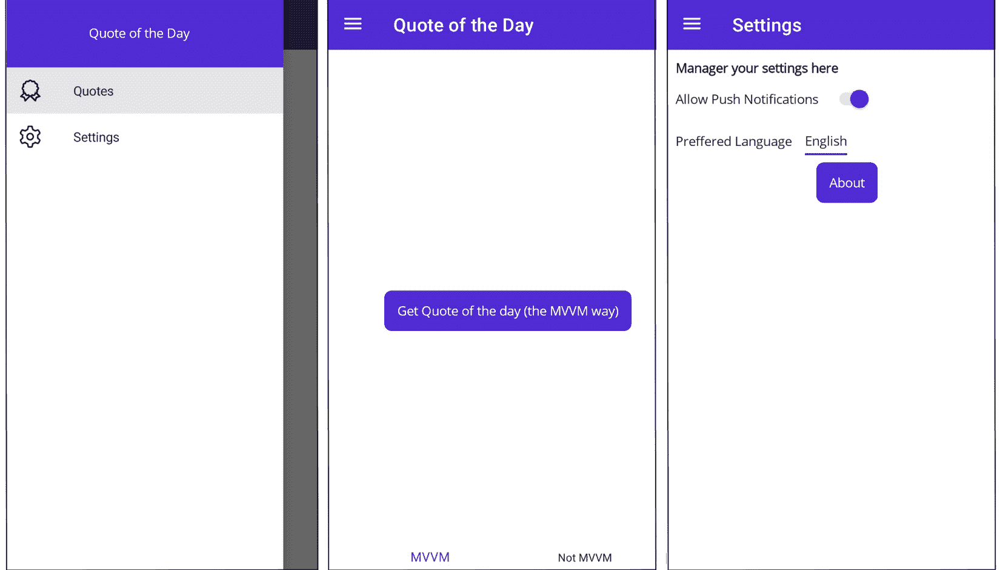
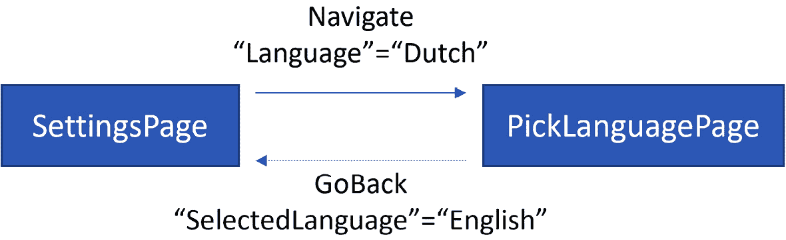

# 第八章：MVVM 中的导航

到目前为止，在我们的 *Recipes!* 应用程序构建之旅中，我们已经使用 MVVM 设计模式建立了坚实的基础。现在，还缺少一个重要部分：导航——即在不同页面之间移动。本章将专注于 .NET MAUI 内部导航的实际方面。我们将把讨论分为四个关键领域：

+   关于 .NET MAUI Shell

+   在 .NET MAUI Shell 应用程序中设置导航

+   不使用 .NET MAUI Shell 设置导航

+   返回结果

MVVM 主要关注关注点的分离，将逻辑与表示层解耦。当我们将导航集成到 MVVM 架构中时，我们实际上是在将“关注点分离”的原则扩展到导航逻辑。为了有效地实现这一点，掌握导航的关键原则是至关重要的。

到本章结束时，你将牢固掌握 .NET MAUI 的导航功能。无论你选择使用 .NET MAUI Shell 还是坚持使用传统的导航方法，你都将能够使你的应用程序导航流畅且用户友好。是时候深入研究了！

# 技术要求

我们将在本章中继续向 *Recipes!* 应用程序添加功能。像往常一样，所有内容都可以在 GitHub 上找到，网址为 [`github.com/PacktPublishing/MVVM-pattern-.NET-MAUI/tree/main/Chapter08`](https://github.com/PacktPublishing/MVVM-pattern-.NET-MAUI/tree/main/Chapter08)。你可以从 `Start` 文件夹中提供的代码开始，跟随本章内容。`Finish` 文件夹包含完成的代码，你可以参考它。

# 关于 .NET MAUI Shell

.NET MAUI Shell 是一种有观点的方式来创建 .NET MAUI 应用程序的结构。它引入了一种更简化的方法来构建移动应用程序，这在结构化和导航方面可能会相当复杂。Shell 通过提供统一的声明性语法来表达应用程序的结构和导航模式，从而简化了这些方面。

由于有观点，.NET MAUI Shell 有特定的指南和约定，它期望开发者遵循，以减少样板代码和努力。它带来了各种功能，旨在降低移动应用程序开发的复杂性：

+   **基于 URI 的导航**：Shell 支持基于 URI 的导航方案，类似于网络开发模型。开发者可以定义一个指向特定页面的 **路由**。这些路由允许在应用程序周围进行简单且松散耦合的导航，使导航代码更直接且更少出错。

+   **简化复杂的应用程序结构**：Shell 提供了开箱即用的对常见 UI 元素（如飞出菜单、标签页和导航栏）的支持，以及所有这些元素的组合。开发者可以轻松地将这些结构添加到他们的应用程序中，并由 Shell 在不同平台上管理渲染。

+   **性能**：Shell 还旨在通过更有效地处理其组件的生命周期来提高性能，提供更快的渲染时间。

然而，Shell 的固执己见性质意味着它可能不适合每个应用程序场景或开发者。它提供了一个预定义的结构，并期望开发者遵守它，这对简单的应用程序可能有益，但可能会限制更复杂场景的灵活性。

.NET MAUI Shell

.NET MAUI Shell 是任何移动开发者工具箱中的强大工具。它提供了一个高级别的抽象，以简化应用程序开发，但开发者应该评估其固执己见的方法是否与项目需求和限制相一致。

让我们看看如何在.NET MAUI 应用程序中利用 Shell。

## 设置 Shell

默认情况下，当创建一个新的.NET MAUI 应用程序时，`Shell`已经自动连接。一个继承自`Microsoft.Maui.Controls.Shell`的`AppShell`类被生成，并且这个`AppShell`类的实例被分配给`App`类的`MainPage`属性：

```cs
public App()
{
    InitializeComponent();
    MainPage = new AppShell();
}
```

`MainPage`属性的值指定了当应用程序启动时将显示的第一个页面。换句话说，它是进入应用程序 UI 的入口点。这可以是一个单独的内容页面、一个导航页面、一个标签页，甚至是一个主详情页面。或者，如这里所示，当利用`Shell`时，它也可以是一个`Shell`对象。`Shell`充当应用程序结构和导航的容器，定义了应用程序的初始布局和流程。

虽然`MainPage`是显示的初始页面，但从技术上讲，在应用程序的生命周期中的任何时刻都可以更改它，以适应应用程序的需求。例如，你最初可以将`MainPage`设置为`LoginPage`，一旦用户成功登录，你就可以将`MainPage`更改为你的`AppShell`。

在`AppShell`类中，你定义了应用程序的主要结构元素。例如，如果你的应用程序包含一个飞出菜单和几个标签页，你可以在你的`AppShell`中定义这些元素。以下是一个基本示例，展示了这可能看起来像什么：

```cs
<Shell.FlyoutHeader>
    ...
</Shell.FlyoutHeader>
<FlyoutItem Title="Quotes" Icon="badge.png">
    <Tab Title="MVVM">
        <ShellContent
            Title="Quote of the Day"
            ContentTemplate="{DataTemplate
              local:MainPage_MVVM}"
            Icon="badge.png" />
    </Tab>
    <Tab Title="Not MVVM">
        <ShellContent
            Title="Quote of the Day"
            ContentTemplate="{DataTemplate local:MainPage}"
            Icon="badge.png" />
    </Tab>
</FlyoutItem>
<FlyoutItem Title="Settings" Icon="settings.png">
    <ShellContent Title="Settings"
                  ContentTemplate="{DataTemplate
                    local:SettingsPage}" />
</FlyoutItem>
```

这里显示的代码将渲染一个包含飞出菜单的两个项目的 Shell：`FlyoutItem` 代表应用的独立部分。`Quotes` 部分被定义为包含两个标签页，每个标签页都有自己的标题。每个标签页的内容由一个 `ShellContent` 对象定义，该对象引用在标签页被选中时显示的页面。`Settings` 部分只包含一个 `ShellContent` 项目，它引用 `SettingsPage`。没有 .NET MAUI Shell，创建一个包含飞出菜单、标签页和独立部分的复杂布局，同时管理它们之间的导航，可能相当复杂且需要大量的样板代码。但有了 Shell，你可以在 `AppShell` 中以简单、声明性的方式定义这种结构，使其更容易管理和更新。*图 8.1* 显示了这里定义的布局，使用 Shell 在 XAML 中定义的外观：



图 8.1：使用 Shell 时的飞出项和标签页

Shell 不仅允许我们定义应用的主要结构，还允许我们定义路由。让我们看看这一点。

## 路由

.NET MAUI Shell 的路由系统基于命名路由的概念，这实际上是应用内页面的唯一标识符或路由。这简化了在页面之间导航的过程，并引入了一种将导航逻辑与页面类型松散耦合的方法。而不是直接引用页面类型，你导航到已注册的路由。这在你导航到特定名称注册的“页面”时提供了一种抽象级别，而不是直接导航到特定的页面。这允许与特定路由关联的实体页面发生变化，而无需修改你的导航逻辑。

我们可以使用静态 `Microsoft.Maui.Controls.Routing` 类上的 `RegisterRoute` 方法来注册路由。通常，路由在 `AppShell` 类的构造函数中注册，但可以在应用的任何位置进行，只要它在应用的生命周期早期完成。因此，`MauiProgram` 类中的 `CreateMauiApp` 方法也是一个不错的选择。在 *每日名言* 应用中，路由的注册是在后者中完成的。无论你选择在哪个位置注册你的应用路由，以下是完成方式：

```cs
Routing.RegisterRoute("about", typeof(AboutPage));
```

注册后，你可以像这样导航到路由：

```cs
await Shell.Current.GoToAsync("about");
```

此外，Shell 支持绝对和相对导航。一个以斜杠（`/`）开头的绝对 URI 在导航之前重置导航堆栈，而一个不以斜杠开头的相对 URI 将导航操作推送到导航堆栈上。为了清晰起见，导航堆栈实际上是用户已导航过的页面历史记录，允许在应用中进行前后导航。

这种基于命名路由的导航还支持在页面之间传递参数：

```cs
await Shell.Current.GoToAsync("aboutIDictionary<string, object>:

```

await Shell.Current.GoToAsync("about",

new Dictionary<string, object>()

{

{"foo", "bar" }

});

```cs

 The reason I prefer this approach is the fact that this allows for passing complex objects, whereas the query string approach only allows for primitive types. And because I like consistency, I prefer to always use the dictionary.
These parameters, which we pass from one page to another, can be retrieved in different ways. One of them is to let the target page inherit the `Microsoft.Maui.Controls.IQueryAttributable` interface. As shown here, this interface defines just one method, `ApplyQueryAttributes`, that needs to be implemented:

```

public partial class AboutPage : ContentPage,

IQueryAttributable

{

...

public void ApplyQueryAttributes(

IDictionary<string, object> query)

{

lblParameter.Text = $"Parameter {query

.First().Key}: {query.First().Value}";

}

}

```cs

 Moreover, if an instance of a class that implements the `IQueryAttributable` interface is assigned as the target page’s `BindingContext` (such as a ViewModel), that `ApplyQueryAttributes` method would also be invoked.
Adhering to MVVM best practices
I’ve often seen ViewModels inheriting the `IQueryAttributable` interface to receive navigation parameters. Although that works perfectly well, it goes against one of MVVM’s best practices, which says that ViewModels should be framework agnostic. This interface is .NET MAUI and Shell-specific, so it requires a dependency on these frameworks. Later in this chapter, I’ll show you how to not rely on the `IQueryAttributable` interface and still be able to receive navigation parameters.
As we mentioned previously, there are also other ways to receive parameters on the navigation target. I’m not going to dive deeper into that as we won’t be relying on that when we implement navigation in MVVM.
Let’s have a look at one final aspect I want to highlight about Shell before we go further: Shell’s support for DI.
Supporting Dependency Injection
In the previous chapter, we discussed DI and briefly touched on the fact that Shell allows pages to be resolved dynamically. This allowed us to define the ViewModel as a dependency of a page, which gets injected through the page’s constructor, as shown here:

```

public AboutPage(AboutPageViewModel vm)

{

InitializeComponent();

BindingContext = vm;

}

```cs

 The only caveat here is that the page itself needs to be registered in the `IServiceCollection`, alongside its dependencies of course. With the following in place, we can navigate to `"about"` and Shell will resolve `AboutPage` and its dependencies – in this case, `AboutPageViewModel` – and inject them:

```

Routing.RegisterRoute("about", typeof(AboutPage));

builder.Services.AddTransient<AboutPage>();

builder.Services.AddTransient<AboutPageViewModel>();

```cs

 There is even a convenient extension method in the .NET MAUI Community Toolkit that does all of this at once. Take a look:

```

builder.Services.AddTransientWithShellRoute<AboutPage,

AboutPageViewModel>("about");

```cs

 The same method also exists for adding the types as scoped or singleton, of course.
In this section, we merely scratched the surface of .NET MAUI Shell, exploring its routing system and support for DI. We saw how it provides a robust, flexible, and intuitive approach to structuring your application and managing navigation.
However, remember that .NET MAUI Shell has a lot more to offer, including advanced features such as flyout customization, search handling, and life cycle events, among others. For deeper insights into these aspects of .NET MAUI Shell, be sure to visit the *Further reading* section at the end of this chapter.
Now that we’ve established a solid understanding of .NET MAUI Shell, it’s time to see how we can leverage it within MVVM. In the next section, we’ll focus on setting up navigation in our *Recipes!* app while adhering to the MVVM pattern. So, let’s dive right in!
Setting up navigation in a .NET MAUI Shell app
Effective navigation within the MVVM pattern begins with an integral component: a `NavigationService`. This service is the driving force behind MVVM navigation. In essence, a `NavigationService` is a class that implements an `INavigationService` interface. The `INavigationService` interface provides the contract for navigating between pages, defining the various methods needed for such operations. These methods could include operations such as `GoToDetailPage()`, `GoBack()`, and others, depending on your specific requirements.
Here’s the beauty of this setup: during the app’s startup, we register a framework-specific implementation of the `INavigationService` interface with the DI container. It’s a perfect illustration of the power of DI, where we program to an interface, not an implementation. This allows our ViewModels to be completely platform-agnostic. This not only promotes code flexibility and testability but also allows us to replace or modify our `NavigationService` implementation without affecting the rest of our app.
Before we dive deeper into the setup of an `INavigationService` and explore how it operates within our *Recipes!* app, notice that the UI of the app has changed a little bit. The main UI now shows two tabs: `RecipesOverviewPage`, and `SettingsPage`. Let’s have a look at implementing a `NavigationService` interface that leverages .NET MAUI Shell.
Creating an INavigationService interface
It all starts with this interface, which will get injected into the ViewModels that want to navigate. And this is where developers tend to have different opinions. Some developers prefer to have a very slimmed-down interface only containing methods such as `GoTo(string name)`, `GoTo(string name, IDictionary<string, object> parameters)`, and `GoBack()`. This allows for a very generic interface and implementation that can easily be reused. I prefer a more per-app approach where I have methods such as `GoToOverview()`, `GoToDetail(string id)`, and others. The big advantage I find in this approach is the fact that when I want to navigate to a certain page, I know exactly what parameters are required to navigate to that page. I also find it easier to unit test and it makes it easier to implement app-specific edge cases. I’ve also seen and used generic implementations over the years, containing methods such as `GoTo<TViewModel>()` for example. It pretty much comes down to personal preference, use case requirements, and the specific needs of the project. I’ll be demonstrating the approach I typically use and have used successfully over the years. Once you understand the main concept of a `NavigationService`, please use whatever approach you prefer! Let’s create the `INavigationService` interface for our *Recipes!* app:

1.  In the `Recipes.Client.Core` project, add a new folder by right-clicking the project in the `Navigation`.
2.  Next, right-click the newly created folder and select `INavigationService` as the name for the new interface.
3.  As the *Recipes!* app doesn’t have a lot of navigation going on, we can keep the interface pretty simple, as shown here:

    ```

    public interface INavigationService

    {

    Task GoToRecipeDetail(string recipeId);

    Task GoToRecipeRatingDetail(RecipeDetailDto

    recipe);

    Task GoBack();

    }

    ```cs

    The interface currently holds three methods. The `GoToRecipeDetail` method should navigate to the detail page. It accepts a string parameter representing the ID of the recipe we want to load on that page. The `GoToRecipeRatingDetail` method should load the ratings overview page of the given `RecipeDetailDto` object. Finally, there is the `GoBack` method, which should allow us to programmatically navigate back into the app.

Note
This `INavigationService` interface holds no reference to .NET MAUI or Shell. It’s just a contract for triggering navigations. The fact the interface is part of the `Recipes.Client.Core` project already gives away that it is framework agnostic. So, whether you want to leverage Shell or not, this interface probably won’t change.
Now that we have this interface in place, let’s see how we can implement a `NavigationService` interface that leverages Shell.
Creating and using a NavigationService
Because the implementation of `NavigationService` is specific to a framework, we are going to add it to the `Recipes.Mobile` project:

1.  Let’s add a `Navigation` folder to the **Recipes.Mobile** project by right-clicking the project in the **Solution Explorer** and selecting **Add** | **New Folder**.
2.  Now, right-click the `NavigationService`.
3.  This class needs to implement `INavigationService`, as shown here:

    ```

    public class NavigationService : INavigationService

    {

    ...

    }

    ```cs

     4.  Now, this is where Shell comes in! Earlier in this chapter, we saw how easy it is to use Shell for navigation: just call `Shell.Current.GoToAsync` and pass in the name of the page you want to navigate to. Let’s add the following method, which wraps around this `GoToAsync` method, to our new `NavigationService` class:

    ```

    private async Task Navigate(string pageName,

    Dictionary<string, object> parameters)

    {

    await Shell.Current.GoToAsync(pageName);

    }

    ```cs

    This `Navigate` method just calls the `GoToAsync` method of `Shell`, passing in the given `pageName` parameter. We’ll look at the `parameters` parameter later.

     5.  What remains for `NavigationService` is implementing the `INavigationService` interface’s methods, which is now pretty easy to do, as shown here:

    ```

    public Task GoToRecipeDetail(string recipeId)

    => Navigate("RecipeDetail",

    new () { { "id", recipeId } });

    public Task GoToRecipeRatingDetail(RecipeDetailDto

    recipe)

    =>  Navigate("RecipeRating",

    new () { { "recipe", recipe } });

    public Task GoBack()

    =>  Shell.Current.GoToAsync("..");

    ```cs

    The first two methods call the `Navigate` method we created earlier, passing in the name of the page that needs to be loaded, as well as a dictionary containing the `recipeId` parameter. The `GoBack` method calls the `GoToAsync` method of `Shell`, passing in "..", signaling we want to navigate up the navigation stack.

     6.  Next, we can go ahead and register this `NavigationService` in the DI container. Open `MauiProgram.cs` and add the following:

    ```

    builder.Services.AddSingleton<INavigationService,

    NavigationService>();

    ```cs

And with that in place, it’s time to update our ViewModels and add `INavigationService` as a dependency:

1.  Head over to `RecipesOverviewViewModel` and update its constructor so that it accepts an `INavigationService`. As before, we should also create a `readonly` field to hold the injected value:

    ```

    public class RecipesOverviewViewModel :

    ObservableObject

    {

    private readonly INavigationService

    navigationService;

    ...

    public RecipesOverviewViewModel(

    IRecipeService recipeService,

    IFavoritesService favoritesService,

    INavigationService navigationService)

    {

    this.navigationService = navigationService;

    ...

    }

    }

    ```cs

     2.  Further down this class, we can now update the `NavigateToSelectedDetail` method to the following:

    ```

    private async Task NavigateToSelectedDetail()

    {

    if (SelectedRecipe is not null)

    {

    await navigationService.GoToRecipeDetail

    (SelectedRecipe.Id);

    SelectedRecipe = null;

    }

    }

    ```cs

     3.  In `RecipesOverviewPage.xaml`, the following can be removed:

    ```

    SelectionChanged="CollectionView_SelectionChanged"

    ```cs

    In the `RecipesOverviewPage.xaml.cs` file, the `CollectionView_SelectionChanged` method can be removed as well. Up until now, this is what triggered the navigation from the overview page to the detail page.

Now, we need to give `RecipeDetailViewModel` the same treatment: inject `INavigationService` and use it to execute navigation to the `RecipeRatingsDetailPage`:

1.  As before, add an additional parameter to the class’s constructor and keep a reference to it in a `readonly` field:

    ```

    public partial class RecipeDetailViewModel :

    ObservableObject

    {

    private readonly INavigationService

    navigationService;

    ...

    public RecipeDetailViewModel(

    IRecipeService recipeService,

    IFavoritesService favoritesService,

    IRatingsService ratingsService,

    INavigationService navigationService)

    {

    this.navigationService = navigationService;

    ...

    }

    ...

    }

    ```cs

     2.  The following snippet shows how we can update the `NavigateToRatings` method:

    ```

    private Task NavigateToRatings()

    => navigationService

    .GoToRecipeRatingDetail(recipeDto);

    }

    ```cs

    This method gets called when `NavigateToRatingsCommand` is invoked.

     3.  Finally, we need to head over to the `RecipeDetailPage.xaml` file and update the `TapGestureRecognizer` on the `HorizontalStackLayout`, which shows the rating, to the following:

    ```

    <HorizontalStackLayout.GestureRecognizers>

    <TapGestureRecognizer Command="{Binding

    NavigateToRatingsCommand}" />

    </HorizontalStackLayout.GestureRecognizers>

    ```cs

    Tapping this control will now trigger `NavigateToRatingsCommand`, which we just created, which will call the `NavigationService` to initiate navigation to the `RatingsDetailPage`.

     4.  The `Ratings_Tapped` method in the code-behind of `RecipeDetailPage` can be deleted as it is no longer of any use.

The pages, their ViewModels, and their routes, are already registered in `MauiProgram`’s `CreateMauiApp` method, as shown here:

```

...

builder.Services.AddTransient<RecipesOverviewPage>();

builder.Services.AddTransient<RecipesOverviewViewModel>();

builder.Services.AddTransient<RecipeDetailPage>();

builder.Services.AddTransient<RecipeDetailViewModel>();

builder.Services.AddTransient<RecipeRatingsDetailPage>();

builder.Services.AddTransient<RecipeRatingsDetailViewModel>

();

builder.Services.AddTransient<SettingsPage>();

builder.Services.AddTransient<SettingsViewModel>();

Routing.RegisterRoute("MainPage",

typeof (RecipesOverviewPage));

路由注册("RecipeDetail",

typeof (RecipeDetailPage));

Routing.RegisterRoute("RecipeRating",

typeof (RecipeRatingsDetailPage));

```cs

 With all of these changes in place, we can now effectively navigate from one page to another. The injected instance of `NavigationService` in the ViewModels leverages Shell to navigate between pages. But there is still one thing missing: passing parameters from one page to another. Let’s see how to add this!
Passing parameters
As mentioned earlier, although .NET MAUI Shell has a baked-in way of passing parameters, I’m not fond of using that in my ViewModels as it would require my ViewModels to depend on MAUI and Shell. Luckily, a solution to that is not that complex. Moreover, it fits nicely in the broader setup of our `NavigationService`, as we will discuss later in this chapter.
Let’s introduce a new interface: `INavigationParameterReceiver`. This interface exposes one method called `OnNavigatedTo` that receives a dictionary of type `Dictionary<string, object>` as a single parameter. This interface can be implemented by ViewModels that want to accept navigation parameters. When navigated to a page, the `NavigationService` can check whether the `BindingContext` of the new page implements this interface and then call the `OnNavigatedTo` method, passing in the parameters. Let’s see how we can implement this:

1.  First, let’s add the `INavigationParameterReceiver` interface. Right-click the `Navigation` folder in the `Recipes.Client.Core` project and select `INavigationParameterReceiver` as the name of the interface.
2.  As we mentioned previously, this interface should expose the `OnNavigatedTo` method. Let’s add this:

    ```

    public interface INavigationParameterReceiver

    {

    Task OnNavigatedTo(Dictionary<string, object>

    parameters);

    }

    ```cs

     3.  Head over to the `Navigate` method of the `NavigationService` class and update it to the following:

    ```

    private async Task Navigate(string pageName,

    Dictionary<string, object> parameters)

    {

    await Shell.Current.GoToAsync(pageName);

    if (Shell.Current.CurrentPage.BindingContext

    is INavigationParameterReceiver receiver)

    {

    await receiver.OnNavigatedTo(parameters);

    }

    }

    ```cs

    The preceding code will pass the provided parameters to the ViewModel once Shell has navigated to the new page. We can retrieve the current page by calling `Shell.Current.CurrentPage`. Once we have the current page, we can check whether the page’s `BindingContext` implements the `INavigationParameterReceiver` interface. If it does, we can call the `OnNavigatedTo` method to pass the provided parameters.

     4.  `RecipeDetailViewModel` can now implement the `INavigationParameterReceiver` interface, as shown here:

    ```

    public partial class RecipeDetailViewModel :

    ObservableObject, INavigationParameterReceiver

    {

    ...

    public Task OnNavigatedTo(

    Dictionary<string, object> parameters)

    => LoadRecipe(parameters["id"].ToString());

    当调用 OnNavigatedTo 方法时，从字典中检索 id 参数并将其传递给 LoadRecipe 方法。

    ```cs

     5.  Up until now, the constructor of `RecipeDetailViewModel` called the `LoadRecipe` method with a hard-coded ID. This call can now be removed.
6.  `RecipeRatingsDetailViewModel` also needs to be updated for it to be able to receive parameters. The following code block shows how it can implement `INavigationParameterReceiver`:

    ```

    public class RecipeRatingsDetailViewModel :

    ObservableObject, INavigationParameterReceiver

    {

    ...

    public Task OnNavigatedTo(

    Dictionary<string, object> parameters)

    => LoadData(parameters["recipe"]

    as RecipeDetailDto);

    }

    ```cs

    Please note that there has been a slight change in the `LoadData` method signature since the previous chapter. Rather than accepting a string, it now takes a `RecipeDetailDto` object as its parameter. This is an optimization strategy that aims to avoid over-fetching. When we navigate from `RecipeDetailPage`, we have already loaded the details of a recipe. Therefore, it’s not needed to reload these same details when we move to `RecipeRatingDetailPage`. By passing in a `RecipeDetailDto`, we effectively utilize the data we’ve already fetched.

With `INavigationParameterReceiver` in place, we can effectively pass navigation parameters from one page to another. Let’s see how we can extend our navigation infrastructure even more to allow us to hook into and manage important parts of the ViewModel’s life cycle: specifically, the moments of navigation to and from a ViewModel.
Avoid “magic strings”
The code samples in this chapter use a lot of “magic strings": specific routes are registered for pages, parameters are passed using exact keys, and navigation requires correct input of these routes and keys. While this makes the code samples simple and clear, it’s risky in practice. A single spelling error can lead to runtime errors that aren’t immediately apparent. To prevent such issues, it’s advisable to use string constants for route names and parameters stored in designated classes. We didn’t follow this best practice here for the sake of simplicity, but keep it in mind when you’re writing your code.
Hooking into navigation
Often, we want to hook into the navigation process to effectively manage ViewModel states during transitions. This allows us to handle setup and cleanup operations, as well as manage state changes when a ViewModel becomes active or inactive in the application. This strategy is particularly useful for tasks such as subscribing to or unsubscribing from services, loading or saving states, and initiating or canceling network requests.
For that purpose, let’s introduce two new interfaces: `INavigatedFrom` and `INavigatedTo`. Just like `INavigationParameterReceiver`, ViewModels can choose to implement these interfaces if they want to react to certain navigation events. Let’s see what they look like:

```

public interface INavigatedFrom

{

Task OnNavigatedFrom(NavigationType navigationType);

}

public interface INavigatedTo

{

Task OnNavigatedTo(NavigationType navigationType);

}

```cs

 Both the `OnNavigatedFrom` and `OnNavigatedTo` methods accept one parameter of type `NavigationType`, which is an enum. This enum has the following implementation:

```

public enum NavigationType

{

Unknown,

Forward,

Back,

SectionChange,

}

```cs

 With this `enum` type, we want to give context to the type of navigation that occurred. The `SectionChanged` value can be used when the user opens another tab for example or selects another item from `FlyoutMenu`. As you might expect, the `Forward` and `Back` values are used when navigating hierarchically from one page to another.
These methods and values of the `NavigationType` enum enable nuanced reactions to a wide variety of navigation scenarios. Let’s consider some examples:

*   When the `OnNavigatedFrom` method of a ViewModel is called with `Back` as the parameter, we can infer that we’re navigating backward away from this ViewModel. In this context, you should consider stopping any ongoing tasks or network requests related to that ViewModel. The page no longer exists on the `NavigationStack`, so unsubscribing from messages or events may be wise, allowing any unneeded resources to be reclaimed via garbage collection.
*   If the `OnNavigatedFrom` method is invoked with `Forward` as the parameter, we know the page and its ViewModel remain on the `NavigationStack`. Therefore, the user can easily navigate back to this page. In this situation, we may also want to clean up specific processes or running tasks, but it’s important to ensure they can be quickly reinstated. When the user navigates back to the ViewModel, the `OnNavigatedTo` method will be triggered with `Back` as the parameter, signaling a need to restart previously paused processes.

Let’s see how we can add these additional interfaces to our ViewModels and hook up the necessary code to call the methods these interfaces expose:

1.  Add the interfaces (`INavigatedFrom` and `INavigatedTo`) and the `NavigationType` enum, as shown in the earlier code blocks, to the `Navigation` folder of the `Recipes.Client.Core` project.
2.  When inheriting from the `AppShell` class, we can override the `OnNavigated` method. This method is invoked when a navigation is executed by the Shell framework. This is the ideal place to call into the methods of the interfaces that we’ve introduced. Go ahead to the `AppShell` class and override this method, as shown here:

    ```

    protected override async void OnNavigated

    (ShellNavigatedEventArgs args)

    {

    var navigationType =

    GetNavigationType(args.Source);

    base.OnNavigated(args);

    }

    ```cs

    The `ShellNavigatedEventArgs` parameter that’s passed into this method has a `Source` property. This `Source` property is of type `ShellNavigationSource` and indicates how the navigation occurred: `Push`, `Pop`, `PopToRoot`, and so on. We want to translate this to the `NavigationType` enum we introduced earlier, allowing it to be framework-independent from here on.

     3.  To translate `ShellNavigationSource` to `NavigationType`, create the following `GetNavigationType` method in the `AppShell` class:

    ```

    private NavigationType GetNavigationType

    (ShellNavigationSource source) =>

    source switch

    {

    ShellNavigationSource.Push or

    ShellNavigationSource.Insert

    => NavigationType.Forward,

    ShellNavigationSource.Pop or

    ShellNavigationSource.PopToRoot 或

    ShellNavigationSource.Remove

    => NavigationType.Back,

    ShellNavigationSource.ShellItemChanged 或

    ShellNavigationSource.ShellSectionChanged or

    ShellNavigationSource.ShellContentChanged

    => NavigationType.SectionChange,

    _ => NavigationType.Unknown

    };

    ```cs

     4.  Now, we need to find a way to access the ViewModels of the current and previous page, from within the overridden `OnNavigated` method. Once we get a hold of them, we can call `OnNavigatedFrom` and `OnNavigatedTo` when the ViewModel implements the corresponding interfaces. For that purpose, let’s introduce a new interface: `INavigationInterceptor`. Here’s what it looks like:

    ```

    public interface INavigationInterceptor

    {

    Task OnNavigatedTo(object bindingContext,

    NavigationType navigationType);

    }

    ```cs

    For now, this interface only exposes one method: `OnNavigatedTo`. It accepts a parameter of the `object` type that represents the `BindingContext` of the current page. It also accepts a parameter of type `NavigationType`.

     5.  Add this interface as a constructor parameter to `AppShell` and call its `OnNavigatedTo` method from the `OnNavigated` method of Shell, which we’ve just overridden. The following code block shows how to add this:

    ```

    public partial class AppShell : Shell

    {

    readonly INavigationInterceptor interceptor;

    public AppShell(INavigationInterceptor

    interceptor)

    {

    this.interceptor = interceptor;

    InitializeComponent();

    }

    protected override async void OnNavigated

    (ShellNavigatedEventArgs args)

    {

    var navigationType =

    GetNavigationType(args.Source);

    base.OnNavigated(args);

    await interceptor.OnNavigatedTo(

    CurrentPage?.BindingContext,

    navigationType);

    }

    ...

    }

    ```cs

     6.  Because the `AppShell` class now lacks its default constructor and requires a parameter of type `INavigationInterceptor`, we need to update our code in the `App.xaml.cs` file, as shown here:

    ```

    public App(INavigationInterceptor interceptor)

    {

    ...

    MainPage = new AppShell(interceptor);

    }

    ```cs

    The constructor of the `App` class has been updated so that it accepts a parameter of the `INavigationInterceptor` type.

     7.  What remains is implementing `INavigationInterceptor` and registering it in the DI container. This interface can be implemented by our existing `NavigationService`. Let’s see how:

    ```

    Public class NavigationService : INavigationService,

    INavigationInterceptor

    {

    ...

    WeakReference<INavigatedFrom> previousFrom;

    public async Task OnNavigatedTo(object

    bindingContext, NavigationType navigationType)

    {

    if(previousFrom is not null && previousFrom

    .TryGetTarget(out INavigatedFrom from))

    {

    await from.OnNavigatedFrom

    (navigationType);

    }

    if (bindingContext

    is INavigatedTo to)

    {

    await to.OnNavigatedTo(navigationType);

    }

    if(bindingContext is INavigatedFrom

    navigatedFrom)

    previousFrom = new (navigatedFrom);

    else

    previousFrom = null;

    }

    ```cs

    A lot is going on here, so let’s discuss what happens. Remember that the `OnNavigatedTo` method is called when we have already navigated. So, we must keep a reference to the previous page’s `BindingContext` if we want to call a method on that later on. This reference is kept as `WeakReference` because we don’t want this reference to cause the object not to be garbage collected and causing memory leaks. First, we check whether the `previousFrom` field is not null and whether it still holds a reference to a value that implements the `INavigatedFrom` interface. If we get back a value, the `OnNavigatedFrom` method is called on the `BindingContext` of the page we’ve navigated from.

    Next, we check whether the passed-in `bindingContext` parameter implements the `INavigatedTo` interface. If that’s the case, the `OnNavigatedTo` method is called.

    In the end, we check whether the given `bindingContext` implements the `INavigatedFrom` interface. If so, we store it in the `previousFrom` field. If not, the `previousFrom` field is assigned null.

     8.  It’s important to notice that we’ve introduced state to our `NavigationService` by keeping track of the `BindingContext` of the previous page through the `previousFrom` field. As a result, `NavigationService` should be registered as Singleton so that throughout the app, the same instance of `NavigationService` is being used. Moreover, the `NavigationService` should be resolvable as `INavigationService` in the ViewModels and as `INavigationInterceptor` for instantiating the `AppShell` class. To accommodate this, we can update the registration, as follows:

    ```

    builder.Services.AddSingleton<NavigationService>();

    builder.Services.AddSingleton<INavigationService>(

    c => c.GetRequiredService<NavigationService>());

    builder.Services.AddSingleton<INavigationInterceptor>(

    c => c.GetRequiredService<NavigationService>());

    ```cs

`NavigationService` itself is registered as a singleton. We also added singleton registrations for `INavigationService` and `INavigationIntercepter`, both returning the registration of `NavigationService`. This allows us to register one type for multiple interfaces, all pointing to the same instance.
Go ahead and implement the `INavigatedTo` and `INavigatedFrom` interfaces in some ViewModels. Add a breakpoint to the implemented methods, run the app, and see what happens by inspecting the parameter values. For our little *Recipes!* app, there is no need to add an implementation to said methods, but as managing ViewModel states during transitions is something developers tend to struggle with in larger apps, I wanted to share how I handle these kinds of scenarios.
Setting up navigation without .NET MAUI Shell
As I mentioned earlier, Shell is an opinionated way to create the structure of a .NET MAUI app. This might not work for you or your particular project. Not using Shell complicates the implementation of a `NavigationService` a lot, especially when your app has a complex structure such as tabs or a flyout menu. Let’s focus on a simple hierarchical navigation and see what is needed to implement a `NavigationService` without relying on another framework.
Luckily, the interfaces we created earlier (`INavigationService`, `INavigatedTo`, `INavigatedFrom`, and `INavigationParameterReceiver`) are framework-independent and can still be used as the backbone of this implementation:

1.  No Shell means no routing. However, I do like the concept of having keys associated with a particular view as it allows for a loosely coupled way of navigating. That’s why we’re creating a static `Routes` class in the `Navigation` folder of the `Recipes.Mobile` project, as shown here:

    ```

    public static class Routes

    {

    static Dictionary<string, Type> routes

    = new Dictionary<string, Type>();

    public static void Register<T>(string key)

    where T : Page

    => routes.Add(key, typeof(T));

    public static Type GetType(string key)

    => routes[key];

    }

    ```cs

    This class allows us to map keys to types that inherit from `Page`.

     2.  Next, instead of using the static `Routing.RegisterRoute` method to register routes in the `MauiProgram` class, we can now use our own `Routes` class, like this:

    ```

    Routes.Register<RecipesOverviewPage>("MainPage");

    Routes.Register<RecipeDetailPage>("RecipeDetail");

    Routes.Register<RecipeRatingsDetailPage>

    ("RecipeRating");

    ```cs

    The `Routes.GetType` method will allow us to retrieve a key’s `Type` later.

     3.  Before diving into the implementation of the non-Shell `NavigationService`, let’s add the following code to the `INavigationService` interface:

    ```

    Task GoToOverview();

    ```cs

     4.  In `App.xaml.cs`, update the `App`’s constructor as shown here:

    ```

    public App(INavigationService navigationService)

    {

    Application.Current.UserAppTheme = AppTheme.Light;

    InitializeComponent();

    MainPage = new NavigationPage();

    navigationService.GoToOverview();

    }

    ```cs

    With the updated code, a class implementing the `INavigationService` interface will be injected. After assigning a new `NavigationPage` to the `MainPage` property, we can call the newly added `GoToOverview` method on the injected `INavigationService` for it to navigate to the `OverviewPage`.

     5.  Now, we can go and start implementing the non-Shell `NavigationService`. Create a new class called `NonShellNavigationService` in the `Navigation` folder of the `Recipes.Mobile` project. As you might expect, this class needs to implement the `INavigationService` interface, as shown here:

    ```

    public class NonShellNavigationService :

    INavigationService

    ```cs

     6.  The first thing we want to add is the `Navigation` property, which is of type `Microsoft.Maui.Controls.INavigation`. Through this property, we want to effectively route our navigation. The `INavigation` interface defines navigation-related methods and properties. Let’s see what that property looks like:

    ```

    protected INavigation Navigation

    {

    get

    {

    INavigation? navigation =

    Application.Current?.MainPage?.Navigation;

    if (navigation is not null)

    return navigation;

    else

    {

    throw new Exception();

    }

    }

    }

    ```cs

    Through the static `Current` property of the `Application` class, we can get to the instance of the application, allowing us to access its `MainPage` property. The `MainPage` property, which is of type `Page`, has a `Navigation` property of type `INavigation`, which is exactly what we need.

     7.  Like on `NavigationService`, which used `Shell`, we also want to add a private `Navigate` method that other methods in this class can use. Here’s what this looks like:

    ```

    private async Task Navigate(string key,

    Dictionary<string, object> parameters)

    {

    var type = Routes.GetType(key);

    var page = ServiceProvider.Current

    .GetService(type) as Page;

    page.NavigatedFrom += Page_NavigatedFrom;

    await Navigation.PushAsync(page);

    if (page.BindingContext

    is INavigationParameterReceiver receiver)

    {

    await receiver.OnNavigatedTo(parameters);

    }

    if (Navigation.NavigationStack.Count == 1)

    {

    if (page.BindingContext

    is INavigatedTo to)

    await to.OnNavigatedTo(NavigationType

    .SectionChange);

    }

    }

    ```cs

    With the given key, we can resolve the type we want to navigate to. Using the `ServiceProvider`, we can retrieve an instance of the given type, satisfying all of its dependencies. Next, an event handler for the resolved page’s `NavigatedFrom` event is added before we access our `Navigation` property and push this page onto the navigation stack with the `PushAsync` method. This is what executes the effective navigation to the requested page. After the page is pushed, its `BindingContext` is checked to see whether it implements the `INavigationParameterReceiver` interface. If that’s the case, its `OnNavigatedTo` method is called, passing in the navigation parameters. The final thing that happens in this method is that it checks whether the size of `NavigationStack` is `1`. This means that we navigated to a page and that there’s only one item on the stack, or in other words, this is the first page we’re navigating to. If that is the case, we want to call the `OnNavigatedTo` method on the page’s `BindingContext` if said `BindingContext` implements the `INavigatedTo` interface and pass in `NavigationType.SectionChange`. With this in place, the `OnNavigatedTo` method is called on initial navigation.

     8.  In the previous method, we added a handler to the page’s `NavigatedFrom` event. The following code block shows its implementation:

    ```

    private async void Page_NavigatedFrom(object sender,

    NavigatedFromEventArgs e)

    {

    bool isForwardNavigation =

    Navigation.NavigationStack.Count > 1

    && Navigation.NavigationStack[²] == sender;

    if (sender is Page page)

    {

    if (!isForwardNavigation)

    {

    page.NavigatedFrom -= Page_NavigatedFrom;

    }

    await OnNavigatedTo(Navigation.NavigationStack

    .Last().BindingContext,

    isForwardNavigation ? NavigationType

    .Forward : NavigationType.Back);

    }

    }

    ```cs

    As we are focusing on hierarchical navigation, navigation from a page can happen for two reasons: we’re navigating forward to another page or we’re navigating back to the previous page. This is what is determined at the beginning of this method. As this event is handled after the navigation occurred, we can determine forward navigation by looking at the second-to-last item on the `NavigationStack`: if that entry equals the sender, it means we navigated forward from the sender to another page. If it wasn’t forward navigation, meaning we’ve navigated back from the page to the previous page, we need to remove the event handler from the page’s `NavigateFrom` event. We need to do this so that the page has no references and can be garbage collected, avoiding potential memory leaks. Finally, we call the `OnNavigated` method, passing in the `BindingContext` of the current page (which is the last item in `NavigationStack`). Depending on whether it is forward navigation or not, we pass in `NavigationType.Forward` or `NavigationType.Backward`.

     9.  The `OnNavigatedTo` method that is being called in the previous code block might look familiar. That’s because it is completely identical to the `OnNavigatedTo` method we had in our previous implementation of the `NavigationService`:

    ```

    WeakReference<INavigatedFrom> previousFrom;

    private async Task OnNavigatedTo(object

    bindingContext,

    NavigationType navigationType)

    {

    if (previousFrom is not null && previousFrom

    .TryGetTarget(out INavigatedFrom from))

    {

    await from.OnNavigatedFrom(navigationType);

    }

    if (bindingContext

    is INavigatedTo to)

    {

    await to.OnNavigatedTo(navigationType);

    }

    if (bindingContext is INavigatedFrom

    navigatedFrom)

    previousFrom = new(navigatedFrom);

    else

    previousFrom = null;

    }

    ```cs

     10.  Finally, let’s have a look at the implemented methods of the `INavigationService` interface:

    ```

    public Task GoBack()

    => Navigation.PopAsync();

    public Task GoToRecipeDetail(string recipeId)

    => Navigate("RecipeDetail",

    new() { { "id", recipeId } });

    public Task GoToRecipeRatingDetail(RecipeDetailDto

    recipe)

    => Navigate("RecipeRating",

    new() { { "recipe", recipe } });

    public Task GoToOverview()

    => Navigate("Overview", null);

    ```cs

    They also look very much like they did in the previous implementation because the `Navigate` method accepts the same parameters as in the previous sample.

     11.  The only thing that’s left to do is register this `NonShellNavigationService`:

    ```

    builder.Services.AddSingleton<INavigationService,

    NonShellNavigationService>();

    ```cs

    In this setup, we’re not using `INavigationInterceptor`, so there’s no need to register that.

With that in place, we’ve successfully created a simple `NavigationService` that does not leverage .NET MAUI Shell. Many of the core concepts were reused in this example, demonstrating that they are a good level of abstraction. That said, this implementation is very simple and naïve. It lacks the support for modal navigation and navigation inside tabs and doesn’t have anything for handling a flyout menu. This example might give you some ideas and insights, but building a `NavigationService` from scratch, without leveraging Shell, is quite daunting. In many cases, when Shell is not an option for you or your specific project, I think relying on other third-party frameworks might be the way to go. Libraries such as *FreshMvvm* and especially *Prism Library* are worth checking out!
Before concluding this chapter, it’s important to address a potentially unclear aspect: how can we effectively return a result from a child page to its parent?
Passing results back
In this chapter, we’ve explored passing parameters from one page to another during forward navigation. But what if we need to take an object, use it as a parameter to navigate to another page, manipulate it there, and then retrieve the updated result?
There are various approaches to achieve this, but the most straightforward method is to add a little extension to our navigation framework and allow parameters to be passed when navigating back. For example, on the `SettingsPage` of the *Recipes!* app, we show the user’s current language. There’s a button that navigates to the `PickLanguagePage`, where the user can select a different language. The current language needs to be passed from the `SettingsPage` to the `PickLanguage` page so that the latter can show the current value. When the user selects a new language, the `PickLanguagePage` should navigate back to the `SettingsPage` and pass the selected language as a parameter. *Figure 8**.2* shows how this looks schematically:


Figure 8.2: Passing values back
Let’s explore how to implement this scenario:

1.  First, add the `GoBackAndReturn` method to `INavigationService`:

    ```

    Task GoBackAndReturn(Dictionary<string, object>

    parameters);

    ```cs

    By introducing this method, we want to allow a ViewModel to trigger back navigation and pass parameters to the ViewModel of the previous page.

     2.  This method is very easy to implement in both `NavigationService` and `NonShellNavigationService`. First, let’s take a look at the implementation in `NavigationService`:

    ```

    public async Task GoBackAndReturn(

    Dictionary<string, object> parameters)

    {

    await GoBack();

    if (Shell.Current.CurrentPage.BindingContext

    is INavigationParameterReceiver receiver)

    {

    await receiver.OnNavigatedTo(parameters);

    }

    }

    ```cs

    In this method, we first call the `GoBack` method. Once the back navigation is executed, we check whether `BindingContext` of the current page implements the `INavigationParameterReceiver` interface. If that’s the case, we call its `OnNavigatedTo` method, passing in the parameters.

     3.  On `NonShellNavigationService`, this method looks very similar:

    ```

    public async Task GoBackAndReturn(

    Dictionary<string, object> parameters)

    {

    await GoBack();

    if(Navigation.NavigationStack.Last()

    .BindingContext

    is INavigationParameterReceiver receiver)

    {

    await receiver.OnNavigatedTo(parameters);

    }

    }

    ```cs

    We are doing the same thing here as in the `NavigationService`, except we’re not using the Shell APIs to retrieve the current page. Instead, we’re getting the current page from `NavigationStack`.

     4.  Next, let’s add the method that should navigate to `PickLanguagePage`. Add the `GoToChooseLanguage` method to the `INavigationService` interface:

    ```

    Task GoToChooseLanguage(string currentLanguage);

    ```cs

     5.  In both `ShellNavigationService` and `NonShellNavigationService`, implement the `GoToChooseLanguage` method, like this:

    ```

    public Task GoToChooseLanguage(string currentLanguage)

    => Navigate("PickLanguagePage",

    new() { { "language", currentLanguage } });

    ```cs

    The registration of `PickLanguagePage`, its route, and its ViewModel is already done in the `CreateMauiApp` method of the `MauiProgram` class, as shown here:

    ```

    ...

    builder.Services.AddTransient<PickLanguagePage>();

    builder.Services.AddTransient<PickLanguageViewModel>

    ();

    ...

    Routing.RegisterRoute("PickLanguagePage",

    typeof (PickLanguagePage));

    ...

    //非 Shell

    //Routes.Register<PickLanguagePage>

    //("PickLanguagePage");

    //非 Shell

    ...

    ```cs

     6.  Update `PickLanguageViewModel` as it needs to implement the `INavigationParameterReceiver` interface and needs to get a dependency on the `INavigationService` interface. Here’s how it looks:

    ```

    public class PickLanguageViewModel : ObservableObject,

    INavigationParameterReceiver

    {

    readonly INavigationService _navigationService;

    ...

    public PickLanguageViewModel(I

    NavigationService navigationService)

    {

    _navigationService = navigationService;

    }

    public async Task OnNavigatedTo(

    Dictionary<string, object> parameters)

    {

    _selectedLanguage =

    parameters["language"] as string;

    OnPropertyChanged(nameof(SelectedLanguage));

    }

    }

    ```cs

    Note that in the `OnNavigatedTo` method, we’re assigning the _`selectedLanguage` field rather than the `SelectedLanguage` property. This is intentional because updating the property will immediately invoke the `LanguagePicked` method. We don’t want to trigger this when we set the initial value of this property. Because of that, we need to call `OnPropertyChanged` manually, passing the name of the `SelectedLanguage` property.

     7.  The `LanguagePicked` method is called when the user selects a new language from the dropdown. This should be where we utilize our new `GoBackAndReturn` method to navigate back and return the selected language. Let’s take a look:

    ```

    private Task LanguagePicked()

    {

    return _navigationService.GoBackAndReturn(

    new Dictionary<string, object> {

    { "SelectedLanguage", SelectedLanguage }

    });

    }

    ```cs

     8.  Go to `SettingsViewModel` and make it implement the `INavigationParameterReceiver` interface:

    ```

    public class SettingsViewModel :

    ObservableObject, INavigationParameterReceiver

    ```cs

    Here’s what the implemented `OnNavigatedTo` method looks like:

    ```

    public Task OnNavigatedTo(

    Dictionary<string, object> parameters)

    {

    if(parameters is not null &&

    parameters.ContainsKey("SelectedLanguage"))

    {

    CurrentLanguage =

    parameters["SelectedLanguage"] as string;

    }

    return Task.CompletedTask;

    }

    ```cs

    This `OnNavigatedTo` method will be called both when navigating “forward” to this ViewModel as well as when navigating “back” to it. The `SelectedLanguage` parameter that’s sent by `PickLanguageViewModel` can be picked up here.

     9.  `SettingsPageViewModel` also needs to get the `INavigationService` interface injected. Here’s how:

    ```

    Readonly INavigationService _navigationService;

    ...

    public SettingsViewModel(INavigationService service)

    {

    _navigationService = service;

    ...

    }

    ```cs

     10.  Finally, the `ChooseLanguage` method, which gets triggered when the user taps `PickLanguagePage`, as shown here:

    ```

    private async Task ChooseLanguage()

    {

    await _navigationService

    .GoToChooseLanguage(CurrentLanguage);

    }

    ```cs

With this update, moving data between pages is easier and more flexible. Our app now offers smoother user experiences, all thanks to our navigation framework.
Summary
The fundamental picture of navigation is quite straightforward: a navigation service, which is injected into ViewModels, is utilized to handle navigation. ViewModels can implement specific interfaces, enabling them to receive parameters or be notified about navigation activities, be it from or to them.
While the overall idea seems simple, the implementation can be complex, and this is where developers often become puzzled. Fortunately, .NET MAUI Shell streamlines the navigation process in complex UIs, providing a level of ease in the implementation. But as with anything, Shell’s opinionated nature may not suit every application or developer’s preferences. Therefore, we didn’t stop at exploring Shell navigation but also dove into building a navigation service that is not reliant on Shell.
Toward the end of this chapter, we looked a bit deeper into passing parameters and results between pages. We demonstrated that by efficiently combining navigation services and ViewModel coordination, we can create a seamless user experience.
Navigating through the complexities of .NET MAUI navigation can be a challenge, but with a good understanding of the underlying principles and implementation details, we’re better equipped to handle it. As we move forward, we’ll explore handling user input and validation, diving into how to make our applications more interactive.
Further reading
To learn more about the topics that were covered in this chapter, take a look at the following resources:

*   *.NET MAUI* *Shell*: [`learn.microsoft.com/dotnet/maui/fundamentals/shell/`](https://learn.microsoft.com/dotnet/maui/fundamentals/shell/)
*   *Prism* *Library*: [`prismlibrary.com/`](https://prismlibrary.com/)
*   *FreshMvvm*: [`github.com/XAM-Consulting/FreshMvvm.Maui`](https://github.com/XAM-Consulting/FreshMvvm.Maui)

```
