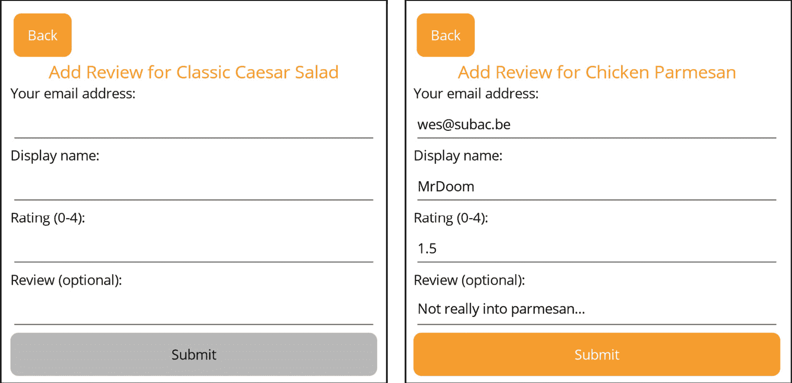
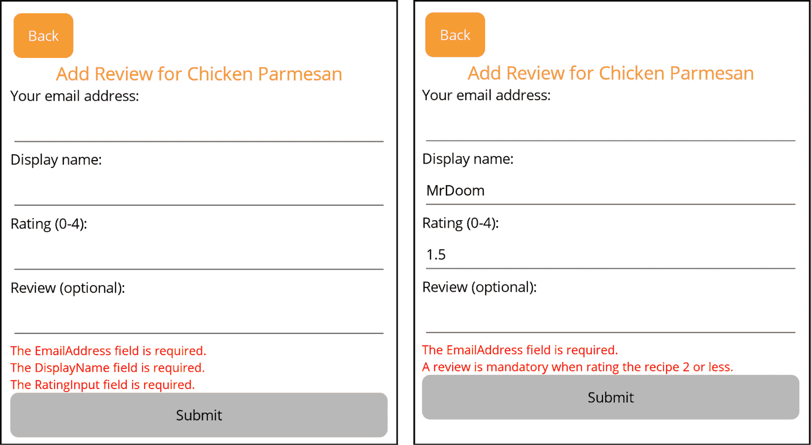
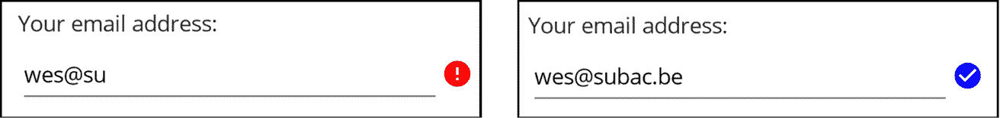
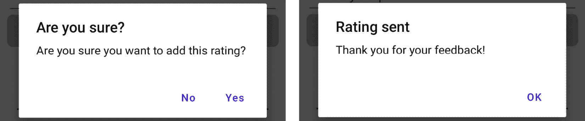

# 处理用户输入和验证

用户输入是任何交互式应用程序的核心。我们管理、验证和响应用户输入的方式直接影响了我们应用程序的用户体验。虽然后端验证用户输入对于维护数据完整性是必不可少的，但在前端提供即时且有用的反馈对于良好的用户体验同样重要。在本章中，我们将深入探讨在.NET MAUI 应用程序中利用 MVVM 设计模式管理用户输入和验证的关键主题。

本章分为以下几部分：

+   在 ViewModel 中实现输入验证

+   使用触发器可视化验证错误

+   提示和警报

+   确认或取消导航

为了使我们的应用程序更加动态和交互式，本章将专注于有效地处理用户输入——确保流畅且无缝的用户体验。让我们开始吧！

# 技术要求

在本章中，我们将进一步丰富 *Recipes!* 应用程序的功能。为了保持同步，所有资源和代码片段都可在 GitHub 上找到：[`github.com/PacktPublishing/MVVM-pattern-.NET-MAUI/tree/main/Chapter09`](https://github.com/PacktPublishing/MVVM-pattern-.NET-MAUI/tree/main/Chapter09)。如果您想与本章一起积极编码，最好从 `Start` 文件夹开始。最终版本可在 `Finish` 文件夹中找到。

# 在 ViewModel 中实现输入验证

输入验证可以在用户交互生命周期的不同阶段以各种方式实现。它可能发生在用户更改属性时，立即提供关于输入数据有效性的反馈。另一方面，它可能仅在用户启动某些操作时执行，例如点击按钮，从而提供更累积的验证体验。决定何时以及如何实现验证通常取决于您项目的具体要求。这是在即时反馈和保持流畅、不间断的用户流程之间的平衡。没有一种适合所有情况的解决方案，策略可以根据数据的复杂性、用户交互的形式以及您应用程序的整体设计而有所不同。

在前端实现验证具有几个优点：它为用户提供即时反馈，确保更响应和直观的体验。此外，通过在源头捕捉和纠正问题，我们可以降低将错误数据发送到后端的风险。然而，需要注意的是，前端验证应补充而非取代后端验证。ViewModel 是前端验证的理想位置，因为它作为我们防止潜在数据不一致或错误在到达后端系统之前的第一道防线。

在本节中，我们将专注于 ViewModel 中输入验证的实现。我们将特别深入探讨`ObservableValidator`的使用，它是 MVVM 社区工具包的一部分，是一个强大的工具。这个特性使得处理验证响应并向用户显示有意义的反馈变得轻而易举。让我们继续详细探索`ObservableValidator`，以及它是如何增强我们对输入验证方法的。

## 使用`ObservableValidator`

验证用户输入是构建健壮应用程序的基础。虽然我们可以完全编写自己的验证逻辑——在属性更新或命令调用时检查属性，然后填充可以绑定到 UI 的验证属性——但这通常涉及重新发明常见的模式。为什么不利用为这一特定目的设计的现有工具呢？在 MVVM 模式中，用户输入验证的最佳实践之一是使用`ObservableValidator`。这个类是 MVVM 社区工具包的一部分，它继承自`ObservableObject`类并实现了`System.ComponentModel.INotifyDataErrorInfo`接口。这个接口并不特定于.NET MAUI，它提供了一个强大的系统来报告和管理对象中的错误。它包括一个`ErrorsChanged`事件，你可以订阅它以接收验证状态变化的通知，以及一个`GetErrors`方法，用于检索指定属性或整个对象的验证错误。

当属性值更新时，`ObservableValidator`能够使用其`SetProperty`方法的重载自动验证它。它还提供了`TrySetProperty`的重载，只有在验证成功时才会更新属性值，并且可以返回任何生成的错误。对于需要手动控制验证的场景，`ObservableValidator`提供了`ValidateProperty`和`ValidateAllProperties`方法，可以用来手动触发特定属性或所有属性的验证。此外，它还提供了一个`ClearAllErrors`方法，非常适合用于重置表单以便再次使用。

`ObservableValidator` 的灵活性扩展到与 `System.ComponentModel.DataAnnotations` 命名空间提供的广泛验证属性兼容。这意味着您可以使用一组在许多场景中必不可少的常见验证规则，例如 `[Required]`、`[StringLength]`、`[Range]`、`[Compare]`、`[RegularExpression]` 以及更多。这些属性允许以表达的方式直接在 ViewModel 的属性上定义验证规则，从而实现高度可读性和可维护的代码库。当验证属性时，`ObservableValidator` 会拾取这些属性，使验证过程无缝且直接。您还可以通过将复杂的验证逻辑封装到专门的验证方法中，甚至是在自定义 `ValidationAttribute` 类中定义自己的特定验证规则，这些类可以在您的应用程序中重用。

让我们看看如何使用 `ObservableValidator` 为 `AddRatingViewModel` 添加验证。

### 预配置的验证规则

如前所述，`ObservableValidator` 类利用了 `System.ComponentModel.DataAnnotations` 命名空间中找到的验证属性的力量。这些属性可以轻松地应用于您的属性，而 `ObservableValidator` 类将使用它们来验证相应的属性值。`ObservableValidator` 与 `DataAnnotations` 命名空间之间的关系提供了一系列预配置的验证规则，简化了在 ViewModel 中实现输入验证的过程。让我们首先将一些属性标记为必填项：

1.  转到 `AddRatingViewModel`，而不是继承 `ObservableObject` 类，让它继承 `ObservableValidator` 类，如下所示：

    ```cs
    public class AddRatingViewModel : Required attribute to the EmailAddress, DisplayName, and RatingInput properties:

    ```

    [Required]

    public string EmailAddress { … }

    [Required]

    public string DisplayName { … }

    [Required]

    public string RatingInput { ... }

    ```cs

    ```

1.  `AddRatingViewModel` 类包含一个 `SubmitCommand`，它调用 `OnSubmit` 方法。让我们更新这个方法，以便它验证所有属性并将验证消息写入调试窗口：

    ```cs
    private Task OnSubmit()
    {
        ValidateAllProperties();
        if(HasErrors)
        {
            var errors = GetErrors();
            Debug.WriteLine( string.Join("\n",
                errors.Select(e => e.ErrorMessage)));
        }
        else
        {
            Debug.WriteLine("All OK");
        }
        return Task.CompletedTask;
    }
    ```

    使用 `ValidateAllProperties` 方法，验证当前类的所有属性。调用此方法后，我们可以检查 `HasErrors` 属性以查看是否存在违规行为。如果有，`GetErrors` 方法允许我们检索 `ValidationResult` 对象的列表。`ValidationResult` 对象包含受此结果影响的成员名称列表和 `ErrorMessage`。

继续调试应用程序！如果您转到 `AddRatingPage`，留空所有内容并点击 **提交** 按钮。您将在 Visual Studio 的 **输出** 窗口中看到错误消息。

验证和错误

`ValidateAllProperties`方法验证 ViewModel 中的所有属性。`ValidateProperty`方法接受一个值和属性名，将检查给定值是否适用于给定属性。这是一种验证单个属性简单的方法。`HasErrors`属性将根据已验证的属性设置。对于`GetErrors`方法也是如此：它返回已验证属性的`ValidationResult`对象。此方法还有一个重载版本，您可以传递一个属性名以获取该特定属性的错误。`GetErrors`方法本身不会进行任何验证，尝试获取未验证属性的错误将不会产生任何结果。`ClearErrors`方法允许在提供属性名时移除所有错误或特定属性的错误。

让我们通过添加更多的验证规则并禁用**提交**按钮直到所有输入有效来增强我们的验证。

在`EmailAddress`属性上，我们应该添加一个额外的验证属性。我们可以使用`RegularExpressionAttribute`来检查一个值是否与给定的正则表达式匹配：

1.  以下代码片段显示了如何使用`RegularExpressionAttribute`将额外的验证属性添加到`EmailAddress`属性，以确保值匹配指定的正则表达式模式。此模式将用于验证给定值是否为电子邮件地址：

    ```cs
    public const string EmailValidationRegex =
     "^[aA-zZ0-9]+@[aA-zZ]+\.[aA-zZ]{2, 3}$";
    ...
    [Required]
    [RegularExpression(EmailValidationRegex)]
    public string EmailAddress { ... }
    ```

1.  为了确保`DisplayName`属性具有最小和最大长度，我们可以使用`MinLength`和`MaxLength`属性。让我们添加它们：

    ```cs
    public const int DisplayNameMinLength = 5;
    public const int DisplayNameMaxLength = 25;
    ...
    [Required]
    [MinLength(DisplayNameMinLength)]
    [MaxLength(DisplayNameMaxLength)]
    public string DisplayName { ... }
    ```

1.  为了将`RatingInput`属性约束在 0 到 4 之间，带有零或一个十进制点，我们可以使用`RangeAttribute`进行范围约束和`RegularExpressionAttribute`进行十进制限制：

    ```cs
    public const string RangeDecimalRegex = @"^\d+(\.\d{1,1})?$";
    public const double RatingMinVal = 0d;
    public const double RatingMaxVal = 4d;
    ...
    [Required]
    [RegularExpression(RangeDecimalRegex)]
    [Range(RatingMinVal, RatingMaxVal)]
    public string RatingInput { ... }
    ```

1.  最后，我们希望在属性值更新时验证每个属性。`ObservableValidator`类有一个重载的`SetProperty`方法，它接受一个`bool`值，指示提供的值是否需要验证。这是`EmailAddress`属性的示例：

    ```cs
    SetProperty(ref _emailAddress, value, DisplayName, RatingInput, and Review properties on this ViewModel as well, to use this overloaded SetProperty method, passing in true in order to trigger validation when the value is set. If we were to pass in false as the last parameter, the validation would not be triggered.
    ```

`SetProperty`和`TrySetProperty`

注意，这个重载的`SetProperty`方法无论提供的值是否有效，都会设置后备字段的值并触发`PropertyChanged`事件。在`ObservableValidator`类中还有一个`TrySetProperty`方法，当属性值无效时，它不会设置属性值。它返回一个`bool`值，指示值是否已设置，并且有一个`out`参数，返回错误集合。

1.  `AddRatingViewModel`类包含一个命令`SubmitCommand`。这个命令应该在提供的属性值被认为是有效的情况下才可执行。为此，我们可以将`SubmitCommand`的`canExecute`函数指向`HasErrors`属性，如下所示：

    ```cs
    SubmitCommand =
        new AsyncRelayCommand(OnSubmit, NotifyCanExecuteChanged method of the SubmitCommand, so the canExecute function can be re-evaluated. The ObservableValidator class exposes an event called ErrorsChanged, which gets triggered whenever there is a change in validation errors. That’s the ideal moment to call the NotifyCanExecuteChanged method of the SubmitCommand. Let’s subscribe to this event and implement this:

    ```

    `public AddRatingViewModel(`

    `INavigationService navigationService)`

    {

    ...

    ErrorsChanged += AddRatingViewModel_ErrorsChanged;

    }

    private void AddRatingViewModel_ErrorsChanged(

    object? sender, DataErrorsChangedEventArgs e)

    {

    SubmitCommand.NotifyCanExecuteChanged();

    }

    ```cs

    ```

现在，如果你运行应用程序并导航到`AddRatingPage`，你会发现`SubmitCommand`的`CanExecute`方法基于验证错误的缺失。*图 9.1*展示了这看起来是什么样子：



图 9.1：没有错误时启用提交按钮（右）

我们之前讨论的预配置验证属性可以简化向 ViewModel 添加验证的过程。然而，在某些情况下，这些内置规则可能无法满足你的特定要求，你需要创建自己的自定义验证逻辑。让我们接下来探讨如何实现这一点。

### 创建自定义验证规则

通常，预配置的验证规则可能不足以满足需求，你需要添加自己的自定义验证逻辑。当与`ObservableValidator`类一起工作时，实现自定义验证规则有两种选择：

+   第一种方法涉及通过扩展基类`ValidationAttribute`创建一个全新的验证属性。这允许你在可重用的组件中封装自己的验证逻辑，使你的 ViewModel 更干净，更专注于其主要职责。然后，你可以像应用内置属性一样将此自定义属性应用于任何属性。

+   第二种选择涉及使用`CustomValidation`属性，这允许你在声明点直接指定一个静态方法来处理验证。这种方法允许实现更本地化、上下文特定的验证场景，在这种情况下，创建一个单独的属性类可能就过于冗余了。

让我们更详细地检查这两种方法，看看它们如何被用来解决自定义验证需求。

#### 创建一个自定义属性

让我们添加一个我们想在`Review`属性上使用的验证规则。尽管评论是可选的，但如果提供了，它必须在一个特定的长度范围内。由于这样的规则可能在不同场景中被重复使用，因此将此验证逻辑放入自定义属性中是有意义的。下面是如何操作的：

1.  在`Validation`文件夹中，右键单击`Recipes.Client.Core`项目，将其命名为新的文件夹。

1.  右键单击`Validation`文件夹，选择`EmptyOrWithinRangeAttribute`作为类名。

1.  让这个类继承`ValidationAttribute`类，如下所示：

    ```cs
    public class EmptyOrWithinRangeAttribute : ValidationAttribute
    ```

1.  接下来，添加两个属性，`MinLength`和`MaxLength`，类型为`int`：

    ```cs
    public int MinLength { get; set; }
    public int MaxLength { get; set; }
    ```

    这些属性允许更广泛地使用此属性。它们允许开发者在将此属性应用于属性时自定义长度约束。这样，可以针对每个单独的属性定制所需的精确最小和最大长度，因为开发者可以声明所需的最低和最高长度。

1.  下一步是重写`IsValid`方法。当对应用了属性的属性开始验证过程时，该方法会被调用。让我们看看我们如何实现它：

    ```cs
    protected override ValidationResult IsValid(object? value, ValidationContext validationContext)
    {
        if (value is string valueAsString && (
            string.IsNullOrEmpty(valueAsString) ||
            (valueAsString.Length >= MinLength
            && valueAsString.Length <= MaxLength)))
        {
            return ValidationResult.Success;
        }
        else
        {
            return new ValidationResult($"The value should be between {MinLength} and {MaxLength} characters long, or empty.");
        }
    }
    ```

    值参数，类型为`object`，表示需要验证的属性值。第二个参数，类型为`ValidationContext`，提供了更多的上下文，包括正在验证的对象的实例和属性。返回`ValidationResult.Success`表示给定的值是有效的，否则我们返回一个描述性的错误消息。

1.  最后，我们可以在`AddRatingViewModel`的`Review`属性上使用这个属性，如下所示：

    ```cs
    [EmptyOrWithinRange(MinLength = 10, MaxLength = 250)]
    public string Review
    {
        get => _review;
        set => SetProperty(ref _review, value, true);
    }
    ```

在我们的自定义验证属性就绪后，`Review`属性可以被验证，使其为空或位于给定的长度范围内。此属性可以轻松地在整个应用程序中重用。

#### 使用 CustomValidation 属性

`ValidationResult`对象，并接受一个与正在验证的属性类型匹配的参数，以及一个`ValidationContext`对象。这与我们在实现自己的`ValidationAttribute`时重写的`IsValid`方法类似。让我们给`Review`属性添加一个额外的验证，以便在给定的评分小于或等于 2 时是必需的：

1.  在`AddRatingViewModel`中，添加一个名为`ValidateReview`的新静态方法，其实现如下：

    ```cs
    public static ValidationResult ValidateReview(string review, ValidationContext context)
    {
        AddRatingViewModel instance =
            (AddRatingViewModel)context.ObjectInstance;
        if (double.TryParse(instance.RatingInput,
            out var rating))
        {
            if (rating <= 2 &&
                string.IsNullOrEmpty(review))
            {
                return new("A review is mandatory when rating the recipe 2 or less.");
            }
        }
        return ValidationResult.Success;
    }
    ```

    此方法接受一个类型为`string`的参数，与我们要验证的属性类型匹配。第二个参数是类型为`ValidationContext`，我们可以使用它来访问属性定义的对象的实例。这允许我们访问正在验证的对象上的其他属性，例如我们案例中的`RatingInput`属性。当我们可以将`RatingInput`值解析为`double`时，我们可以检查它是否小于或等于 2。如果是这种情况，并且给定的评论值为空，我们返回一个验证错误。否则，返回`Success`。

1.  现在，我们需要在`Review`属性上添加一个`CustomValidation`属性，并将其指向我们刚刚创建的静态`ValidateReview`方法。让我们看看这是如何完成的：

    ```cs
    [CustomValidation(
        typeof(AddRatingViewModel),
        nameof(ValidateReview))]
    [EmptyOrWithinRange(MinLength = 2, MaxLength = 250)]
    public string Review
    {
        get => _review;
        set => SetProperty(ref _review, value, true);
    }
    ```

    `CustomValidation` 属性需要的第一参数是静态验证方法定义的类型。在我们的例子中，我们是在 `AddRatingViewModel` 本身上定义的，所以我们将其作为类型传递。这意味着你可以在其他地方定义你的验证方法，例如将它们捆绑在单独的类中。第二个参数是验证方法的名称。我们使用 `nameof` 关键字来避免使用魔法字符串，并添加编译时错误检查。

1.  由于 `Review` 属性的验证也依赖于输入的 `RatingInput` 属性，我们必须确保在 `RatingInput` 属性更改时也验证 `Review` 属性。如下面的代码片段所示，我们可以通过在 `RatingInput` 属性的值更新时调用 `Review` 属性的 `ValidateProperty` 方法来轻松地做到这一点：

    ```cs
    [Required]
    [RegularExpression(RangeDecimalRegex)]
    [Range(RatingMinVal, RatingMaxVal)]
    public string RatingInput
    {
        get => _ratingInput;
        set
        {
            SetProperty(ref _ratingInput, value, true);
            ValidateProperty(Review, nameof(Review));
        }
    }
    ```

就这些了！这就是添加自定义验证、利用 `CustomValidation` 属性所需的所有内容。这种方法通常用于在较少的不同对象上重复使用的验证检查。在这种情况下，我们访问 `ValidationContext` 的 `ObjectInstance` 并将其转换为特定类型，这自然使其在不同类型上不可用。

运行你的应用程序，注意当给出的评分低于 3 且评论为空时，**提交**按钮会被禁用。我们的验证逻辑正在按预期运行！然而，当前的实现缺乏用户友好性，因为它没有提供关于无效输入的任何反馈。让我们看看如何向用户展示这些验证错误。

### 在屏幕上显示错误

向用户展示验证错误基本上有两种方法。第一种方法通常一次概述所有问题，通常在表单的顶部或底部。第二种方法在发生错误的输入字段上直接提供反馈。这通常可以帮助用户更直接、更快速地纠正错误。这两种方法都有其用途，并且通常在应用程序中结合使用以获得最佳用户体验。

#### 显示所有错误

虽然 `ObservableValidator` 没有提供直接列出所有验证错误的属性，但它确实提供了一个 `GetErrors` 方法来获取它们。遗憾的是，数据绑定到方法是不可能的。为了更好地与 MVVM 实践相一致并促进数据绑定，引入一个类型为 `ObservableCollection<ValidationResult>` 的 `Errors` 属性将会很有益。这样，我们就可以在 UI 中绑定到我们的验证错误。

让我们看看我们如何实现这一点：

1.  将一个类型为 `ObservableCollection<ValidationResult>` 的 `Errors` 属性添加到 `AddRatingViewModel` 中：

    ```cs
    public ObservableCollection<ValidationResult> Errors { get; } = new();
    ```

1.  当`ObservableValidator`的`ErrorsChanged`事件被触发时，`AddRatingViewModel`上的`AddRatingViewModel_ErrorsChanged`方法会被调用。目前，这调用`SubmitCommand`上的`NotifyCanExecuteChanged`方法，但让我们更新它，使其也（重新）填充我们刚刚定义的`Errors`集合。下面的代码块显示了我们可以如何做到这一点：

    ```cs
    private void AddRatingViewModel_ErrorsChanged(object? sender, DataErrorsChangedEventArgs e)
    {
        Errors.Clear();
        GetErrors().ToList().ForEach(Errors.Add);
        SubmitCommand.NotifyCanExecuteChanged();
    }
    ```

    前面的代码首先清除了`Errors`集合。接下来，它调用`ObservableValidator`的`GetErrors`方法来获取所有错误。使用`ForEach`方法，我们可以遍历所有项目并调用`Errors.Add`方法将当前项目添加到`Errors`集合中。

1.  前面的代码应该将所有当前验证错误添加到`Errors`属性。剩下要做的只是将这个集合绑定到我们的视图中，如下所示：

    ```cs
    <VerticalStackLayout BindableLayout.ItemsSource="{Binding Errors}">
        <BindableLayout.ItemTemplate>
            <DataTemplate x:DataType="annotations:ValidationResult">
                <Label Text="{Binding ErrorMessage}"
                    FontSize="12" TextColor="Red"/>
            </DataTemplate>
        </BindableLayout.ItemTemplate>
    </VerticalStackLayout>
    ```

    到目前为止，你应该会发现 XAML 代码熟悉且简单：`Errors`集合绑定到`VerticalStackLayout`上的`BindableLayout` `ItemsSource`属性。`ItemTemplate`规定对于每个项目，我们想要渲染一个显示其`ErrorMessage`属性的`Label`。`DataTemplate`的`DataType`是`ValidationResult`。`annotations` XML 命名空间在页面顶部定义：**.**

**前面的代码将导致在屏幕上显示所有验证错误的列表。运行应用程序，你应该会看到随着你输入值，验证错误的出现和消失，如图** *9**.2* 所示。



图 9.2：显示最新的验证错误

虽然这已经可以大大改善用户体验，但我们还可以更进一步。让我们通过显示内联错误消息来增强 UX，直接相邻于相关的输入字段。

#### 显示内联错误

显示单个错误时的主要挑战是开发一种机制，使我们能够检索和显示与单个属性相关的验证错误，而不是一次性显示所有验证错误。对此有一个非常简单的方法：对于每个属性，公开一个包含该属性错误集合的附加属性。看看以下示例：

```cs
public List<ValidationResult> EmailValidationErrors
{
    get => GetErrors(nameof(EmailAddress)).ToList();
}
```

这个`EmailValidationErrors`属性只提供与`EmailAddress`属性相关的验证错误列表。这个`EmailValidationErrors`属性可以绑定到 UI 上，这样我们就可以在屏幕上只显示与`EmailAddress`属性相关的错误。为了保持这个绑定列表的更新，我们需要确保每次`EmailAddress`属性更新时，都触发`EmailValidationErrors`属性的`PropertyChanged`事件，如下所示：

```cs
public string EmailAddress
{
    get => _emailAddress;
    set
    {
        SetProperty(ref _emailAddress, value, true);
        OnPropertyChanged(nameof(EmailValidationErrors));
    }
}
```

通过为每个输入的验证错误创建一个专用属性并确保在输入值更改时更新它，我们可以有效地隔离和显示单个字段的验证错误。然而，这也带来了一些副作用：对于具有许多输入字段的表单，这种方法可能有些费时且重复。让我向您展示一个自动化此过程并节省我们一些手动工作的替代方案。最终结果是我们将绑定到一个特定的属性，称为 `ErrorExposer`。然后，使用它的 **索引器**，我们将指定要检索和显示哪个属性的验证错误，类似于这样：

```cs
<VerticalStackLayout BindableLayout.ItemsSource="{Binding ErrorExposer[EmailAddress]}">
```

让我们看看我们如何实现这个机制：

1.  在我们之前创建的 `Validation` 文件夹中，选择 `ValidationErrorExposer` 作为类名。

1.  `ValidationErrorExposer` 类应该实现两个接口：`INotifyPropertyChanged` 和 `IDisposable`，如下面的代码片段所示：

    ```cs
    public class ValidationErrorExposer : INotifyPropertyChanged, IDisposable
    {
        public event PropertyChangedEventHandler? PropertyChanged;
        public void Dispose()
        {
        }
    }
    ```

1.  接下来，让我们介绍一个 `readonly` 字段 `validator`，其类型为 `ObservableValidator`。这个字段的值应该通过类构造函数传入，如下所示：

    ```cs
    readonly ObservableValidator validator;
    public ValidationErrorExposer(
            ObservableValidator observableValidator)
    {
        validator = observableValidator;
    }
    ```

    传入的 `observableValidator` 是我们想要自动暴露每个属性验证错误的实例。

1.  是时候添加 `ValidationErrorExposer` 索引器了。在 .NET 中，索引器允许使用索引访问类的实例，类似于数组或字典。这个索引可以是任何类型，例如字符串或整数，它允许你检索或设置值，而无需显式调用方法或属性。在这种情况下，我们将索引设置为字符串，因为它代表我们想要获取验证错误的属性的名称。这就是我们如何做到这一点的：

    ```cs
    public List<ValidationResult> this[string property]
        => validator.GetErrors(ValidationErrorExposer accepts a string value as the index and returns a list of ValidationResult objects. This value, which represents the name of the property we want to get the errors of, is passed into the ObservableValidator GetErrors method. The result is returned as a List.
    ```

1.  在 `ValidationErrorExposer` 类的构造函数中，我们还应该订阅传入的 `ObservableValidator` 的 `ErrorsChanged` 事件，如下所示：

    ```cs
    public ValidationErrorExposer(ObservableValidator observableValidator)
    {
        validator = observableValidator;
        validator.ErrorsChanged += ObservableValidator_ErrorsChanged;
    }
    private void ObservableValidator_ErrorsChanged(object? sender, DataErrorsChangedEventArgs e)
        => PropertyChanged?.Invoke(this, new PropertyChangedEventArgs($"Item[{e.PropertyName}]"));
    ```

    虽然这看起来可能像是有某种魔法在起作用，但这个概念相当直接。在 .NET MAUI 中，如果一个对象有一个索引器，你可以绑定到那个索引器属性，就像示例 `{Binding ErrorExposer[EmailAddress]}` 所展示的那样，其中 `ErrorExposer` 是一个包含索引器的类型的实例。为了通知 UI 更新后的值，我们可以从 `ErrorExposer` 中调用 `PropertyChanged` 事件，并传递 `Item[EmailAddress]` 作为属性名。这样做将促使所有绑定到 `ErrorExposer[EmailAddress]` 的绑定重新评估。或者，使用具有 `Item` 作为属性名的 `PropertyChangedEventArgs` 调用 `PropertyChanged` 事件将触发与索引器相关联的所有绑定的重新评估。

1.  最后，在 `ValidationErrorExposer` 中，我们应该更新 `Dispose` 方法如下：

    ```cs
    public void Dispose()
        => _validator.ErrorsChanged -=         ObservableValidator_ErrorsChanged;
    ```

    由于我们已订阅了 `ObservableValidator` 的 `ErrorsChanged` 方法，我们需要提供一个机制来取消订阅此事件，以防止内存泄漏。为此，我们可以使用 `Dispose` 方法。

1.  让我们回到`AddRatingViewModel`并添加一个类型为`ValidationErrorExposer`的属性，如下所示：

    ```cs
    public ValidationErrorExposer ErrorExposer { get; }
    ```

1.  在`AddRatingViewModel`的构造函数中，将新实例分配给此属性：

    ```cs
    public AddRatingViewModel(INavigationService navigationService)
    {
    ...
        ErrorExposer = new (this);
    ...
    }
    ```

    我们将`this`传递给`ValidationErrorExposer`类的构造函数，因为它本身就是继承自`ObservableValidator`的`AddRatingViewModel`实例，因此包含所有验证错误。

1.  在 XAML 中，我们现在可以通过`ValidationErrorExposer`类的索引器绑定到特定属性的验证错误列表。这允许我们将这些错误显示在相关的输入字段附近，如下面的代码片段所示：

    ```cs
    <Editor Text="{Binding Review, Mode=TwoWay}" />
    <VerticalStackLayout BindableLayout.ItemsSource="{Binding ErrorExposer[Review]}">
        <BindableLayout.ItemTemplate>
            ...
        </BindableLayout.ItemTemplate>
    </VerticalStackLayout>
    ```

`ValidationErrorExposer`允许我们轻松地从特定属性获取验证错误，而无需进行任何手动工作：一旦设置好，我们就可以使用其索引属性绑定任何特定属性的错误。

在用户输入附近显示验证错误可以进一步提高用户体验。让我们探讨如何通过视觉指示输入值的有效性，从而进一步提升体验。

# 使用触发器可视化验证错误

**触发器**帮助我们自定义 UI 元素的工作方式和外观，而无需从头开始构建新的控件。

尽管存在不同类型的触发器，但我们将重点关注**数据触发器**。当 ViewModel 上的属性发生变化时，这些触发器会启动，使我们能够根据用户的行为动态调整 UI 控件元素。

触发器类型

.NET MAUI 中有不同类型的触发器：属性触发器、数据触发器、事件触发器等等……它们都允许你在 XAML 中声明性地更改 UI 控件的外观，基于触发器。它们之间的区别在于触发变化的是什么：属性值、绑定值、事件。你可以在[`learn.microsoft.com/dotnet/maui/fundamentals/triggers`](https://learn.microsoft.com/dotnet/maui/fundamentals/triggers)了解更多关于它们的信息。

从本质上讲，数据触发器提供了一种在 XAML 中声明性地设置 UI 变化以响应数据变化的方法，无需在代码后编写过程式代码、自定义值转换器或 ViewModel。

数据触发器是一个相对容易理解的概念。所以，让我们直接深入并添加一个视觉指示器，紧邻不同的`Entry`控件旁边，用符号和特定的颜色指示输入的值是否有效，如图*9**.3*所示：



图 9.3：指示输入有效（右）或无效（左）

那么，值转换器呢？

在 *第四章* 中，我们讨论了 .NET MAUI 中的数据绑定使用。你可以使用 DataTriggers 实现的事情也可以用值转换器实现，反之亦然。但是，使用 DataTrigger，可以非常容易地声明式地实现这些视觉效果，而不需要一行 C# 代码，这也使得 XAML 更易于阅读。

让我们看看如何使用 DataTriggers 来实现这些视觉提示：

1.  首先，为 `EmailAddress` 属性的 `Entry` 添加一个 `Grid`：

    ```cs
    <Grid ColumnDefinitions="*, Auto" HeightRequest="45">
        <Entry
            Keyboard="Email"
            Text="{Binding EmailAddress, Mode=TwoWay}"
            VerticalOptions="End" />
    </Grid>
    ```

    这个 `Grid` 有两列，第一列是 `Entry`，我们将在第二列中添加有效性指示器。

1.  在这个 `Grid` 中，在 `Entry` 下方添加以下 `Label`，它将作为有效性指示器：

    ```cs
    <Label
        Grid.Column="1" FontFamily="MaterialIconsRegular"
        FontSize="20" Text="&#xe000;" TextColor="Red"
        VerticalOptions="Center">
    </Label>
    ```

    默认情况下，这个 `Label` 显示无效状态：红色文本和感叹号图标。

1.  现在，我们可以添加 `DataTrigger` 并定义当提供的电子邮件地址有效时，`Label` 需要显示蓝色勾选标记。以下代码片段展示了我们如何做到这一点：

    ```cs
    <Label ... >
        <Label.Triggers>
            <DataTrigger
                TargetType="Label"
                Binding="{Binding ErrorExposer[EmailAddress].Count}"
                Value="0">
                <Setter Property="Text"
                    Value="&#xe86c;" />
                <Setter Property="TextColor"
                    Value="Blue" />
            </DataTrigger>
        </Label.Triggers>
    </Label>
    ```

    `DataTrigger` 有一个 `Binding` 属性，允许我们绑定到某个值。在这种情况下，我们绑定到与 `EmailAddress` 属性相关的验证错误列表的 `Count` 属性。通过 `Value` 属性，我们可以为这个绑定属性设置一个条件。我们将值设置为 `"0"`，这意味着没有与 `EmailAddress` 属性相关的验证错误。当属性的值满足这个条件时，触发器被激活。一旦激活，触发器可以改变 UI 控件的属性之一或多个。在这个特定的情况下，我们通过指定这些属性的 `Setter` 并提供一定的 `Value` 来更新 `Text` 和 `TextColor` 属性。

如前所述，这也可以通过自定义 `ValueConverter`s 实现，但这种方式在 XAML 中声明式地定义它非常易于阅读、维护和使用。

Behaviors

另一种给用户提供关于输入值有效性的视觉提示的方法是使用 **Behaviors**。Behaviors 就像你可以添加到你的 UI 元素中的小插件，增强它们的默认行为，而无需对它们进行子类化。它们特别有用，因为它们封装了可重用的逻辑片段，允许开发者将相同的功能应用于不同的控件。例如，一个 Behavior 可能允许文本输入字段只接受数值输入或在满足某些条件时改变其颜色。.NET MAUI 社区工具包附带了一套现成的 Behaviors！你可以在 [`learn.microsoft.com/dotnet/maui/fundamentals/behaviors`](https://learn.microsoft.com/dotnet/maui/fundamentals/behaviors) 上了解更多信息。

在下一节中，我们将探讨如何显示提示和警报，这是提供用户反馈和收集输入的基本部分。

# 提示和警报

直接反馈和清晰的沟通对于良好的用户体验至关重要。当用户在应用程序中导航并与各种输入交互时，会有一些时刻，微妙的提示或直接的提示可以产生巨大的差异。提示和警报是这些基本工具，引导用户完成旅程，确保他们获得信息并做出有意的决策。

显示提示和警报是特定于平台的。幸运的是，.NET MAUI 为我们提供了覆盖，它们提供了简单直观的 API 来实现这一点。另一方面，在 MVVM 场景中，显示提示或警报通常是从 ViewModel 触发的，这应该是框架无关的。解决方案当然是创建一个接口来实现这个功能，ViewModel 可以与之通信。让我们继续设置这个接口！

1.  首先，让我们添加一个定义显示提示和警报方法的接口。在 `Services` 中右键点击 `Recipes.Client.Core` 项目。

1.  在此文件夹中添加一个新的接口，命名为 `IDialogService`。

1.  在 `IDialogService` 中定义的方法可能因项目而异。以下代码块显示了在 `IDialogService` 接口中常见的某些方法声明：

    ```cs
    public interface IDialogService
    {
        Task Notify(string title, string message,
            string buttonText = "OK");
        Task<bool> AskYesNo(string title, string message,
            string trueButtonText = "Yes",
            string falseButtonText = "No");
        Task<string?> Ask(string title, string message,
            string acceptButtonText = "OK",
            string cancelButtonText = "Cancel");
    }
    ```

    正如所说，根据您的具体用例，这个接口可能会扩展一些其他具体的方法定义。

1.  接下来，我们需要为这个接口添加一个实现。在 `Recipes.Mobile` 项目中添加一个名为 `Services` 的新文件夹。

1.  右键点击新的 `Services` 文件夹，选择 `DialogService` 作为新类的名称，并添加以下代码：

    ```cs
    public class DialogService : IDialogService
    {
        public Task Notify(string title, string message,
            string buttonText = "OK")
            => Application.Current.MainPage
                .DisplayAlert(title, message, buttonText);
        public Task<bool> AskYesNo(string title,
            string message,
            string trueButtonText = "Yes",
            string falseButtonText = "No")
            => Application.Current.MainPage
                .DisplayAlert(title, message,
                trueButtonText, falseButtonText);
        public Task<string?> Ask(string title,
            string message,
            string acceptButtonText = "OK",
            string cancelButtonText = "Cancel")
            => Application.Current.MainPage
                .DisplayPromptAsync(title, message,
                acceptButtonText, cancelButtonText);
    }
    ```

    在 .NET MAUI 中，`Page` 类提供了显示警报、提示和操作表的各种方法。在 `DialogService` 类中，我们可以通过引用 `Application` 类的静态 `Current` 属性来访问这些方法。

1.  接下来，我们需要在我们的依赖注入容器中注册 `DialogService`。转到 `MauiProgram.cs` 并添加以下内容：

    ```cs
    builder.Services.AddSingleton<IDialogService, DialogService>();
    ```

1.  最后，我们可以将 `IDialogService` 作为依赖项添加到我们的 ViewModels 中。让我们将其添加到 `AddRatingViewModel` 中，如下所示：

    ```cs
    readonly IDialogService dialogService;
    ...
    public AddRatingViewModel(INavigationService navigationSerivce, IDialogService dialogService)
    {
    ...
        this.dialogService = dialogService;
    ...
    }
    ```

1.  转到 `OnSubmit` 方法并更新如下所示：

    ```cs
    private async Task OnSubmit()
    {
        var result = await _dialogService.AskYesNo(
            "Are you sure?",
            "Are you sure you want to add this rating?");
        if (result)
        {
            //ToDo: Submit data
            await _dialogService.Notify("Rating sent",
                "Thank you for your feedback!");
            GoBackCommand.Execute(null);
        }
    }
    ```

    在更新的 `OnSubmit` 方法中，我们首先请求确认。如果用户确认，将显示一个警报，说明评分已发送（*图 9**.3*）。在用户关闭警报后，将调用 `GoBackCommand`，关闭 `AddRatingPage`。



图 9.3：显示警报和提示

在 `IDialogService` 和其 `DialogService` 实现到位后，我们已经为我们的应用程序中的基本弹出交互奠定了基础。接下来，我们将探讨如何利用这一点在用户尝试离开特定页面时提示用户确认。

# 确认或取消导航

当用户与我们的应用程序交互时，可能会有他们即将从包含未保存更改或重要输入的页面导航离开的时刻。为了防止潜在的数据丢失，在允许此类导航之前提示确认是至关重要的。让我们看看我们如何通过利用我们在上一章中构建的 `NavigationService` 来构建它：

1.  让我们从向 `Recipes.Client.Core` 项目的 `Navigation` 文件夹中添加以下名为 `INavigatable` 的接口开始：

    ```cs
    public interface INavigatable
    {
        Task<bool> CanNavigateFrom(NavigationType navigationType);
    }
    ```

    想要控制用户是否能够导航的 ViewModels 可以实现此接口。这与我们在导航上下文中引入的其他接口类似，例如 `INavigatedFrom`、`INavigatedTo` 和 `INavigationParameterReceiver` 接口。

1.  使用以下方法定义扩展 `INavigationInterceptor` 接口：

    ```cs
    Task<bool> CanNavigate(object bindingContext, NavigationType type);
    ```

1.  实现 `INavigationInterceptor` 接口的 `NavigationService` 类现在需要实现此方法。以下是它的样子：

    ```cs
    public Task<bool> CanNavigate(object bindingContext, NavigationType type)
    {
        if(bindingContext is INavigatable navigatable)
            return navigatable.CanNavigateFrom(type);
        return Task.FromResult(true);
    }
    ```

    此方法检查给定的 `bindingContext` 参数是否实现了 `INavigatable` 接口。如果是这样，它将返回其 `CanNavigateFrom` 方法的结果，传递 `NavigationType`。如果 `bindingContext` 没有实现 `INavigatable` 接口，则返回 `true`，表示导航可以执行。

1.  在 `AppShell` 类中，我们现在必须重写 `OnNavigating` 方法。在这个方法中，我们可以从传入的 `ShellNavigatingEventArgs` 中检索一个 `ShellNavigatingDeferral`。这个延迟令牌可以用来完成导航。或者，如果导航应该被取消，可以在 `ShellNavigatingEventArgs` 上调用 `Cancel` 方法。下一个代码块显示了重写的方法：

    ```cs
    protected override async void OnNavigating(ShellNavigatingEventArgs args)
    {
        base.OnNavigating(args);
        var token = args.GetDeferral();
        if(token is not null)
        {
            var canNavigate = await interceptor
            .CanNavigate(CurrentPage?.BindingContext, GetNavigationType(args.Source));
            if (canNavigate)
                token.Complete();
            else
                args.Cancel();
        }
    }
    ```

    通过调用拦截器的 `CanNavigate` 方法，我们可以确定是否必须完成导航。根据结果，我们可以调用延迟令牌上的 `Complete` 方法来完成导航，或者调用传入的 `args` 上的 `Cancel` 方法来取消它。

1.  最后，我们可以进入 `AddRatingViewModel`，使其实现 `INavigatable` 接口，并添加以下内容：

    ```cs
    public class AddRatingViewModel : ObservableValidator, INavigationParameterReceiver, INavigatedFrom, INavigatable
    {
    ...
        public Task<bool> CanNavigateFrom(
            NavigationType navigationType) =>
            _dialogService.AskYesNo(
            "Leaving this page...",
            "Are you sure you want to leave this page?");
    }
    ```

因此，当从 `AddRatingView` 导航时，`Shell` 类上的 `OnNavigating` 方法将被调用，通过 `NavigationService` 将调用 `AddRatingViewModel` 上的 `CanNavigateFrom` 方法。ViewModel 将向用户显示对话框并返回响应。根据用户给出的响应，导航将被完成或取消。`INavigatable` 接口可以由任何 ViewModel 实现，并可以包含任何业务逻辑以确定是否允许导航。

# 摘要

在本章中，我们深入探讨了通过有效的验证、提示和警报来增强用户体验。我们探索了`ObservableValidator`在验证逻辑方面的强大功能，并学习了如何以集体列表和内联方式显示错误，即紧挨着输入字段。通过触发器，我们学习了如何在不重新发明轮子的前提下自定义 UI 元素。我们还探讨了使用`IDialogService`利用警报和提示，这在需要用户反馈或确认的上下文中至关重要，例如在关键操作或导航期间。随着我们继续前进，我们将转向许多现代应用的一个关键方面：进行远程 API 调用。

# 进一步阅读

要了解更多关于本章所涉及的主题，请查看以下资源：

+   `ObservableValidator`：[`learn.microsoft.com/dotnet/communitytoolkit/mvvm/observablevalidator`](https://learn.microsoft.com/dotnet/communitytoolkit/mvvm/observablevalidator)

+   触发器：[`learn.microsoft.com/dotnet/maui/fundamentals/triggers`](https://learn.microsoft.com/dotnet/maui/fundamentals/triggers)

+   行为：[`learn.microsoft.com/dotnet/maui/fundamentals/behaviors`](https://learn.microsoft.com/dotnet/maui/fundamentals/behaviors)

+   .NET MAUI 社区工具包行为：[`learn.microsoft.com/dotnet/communitytoolkit/maui/behaviors/`](https://learn.microsoft.com/dotnet/communitytoolkit/maui/behaviors/)

+   .NET MAUI 弹出窗口：[`learn.microsoft.com/dotnet/maui/user-interface/pop-ups`](https://learn.microsoft.com/dotnet/maui/user-interface/pop-ups)**
