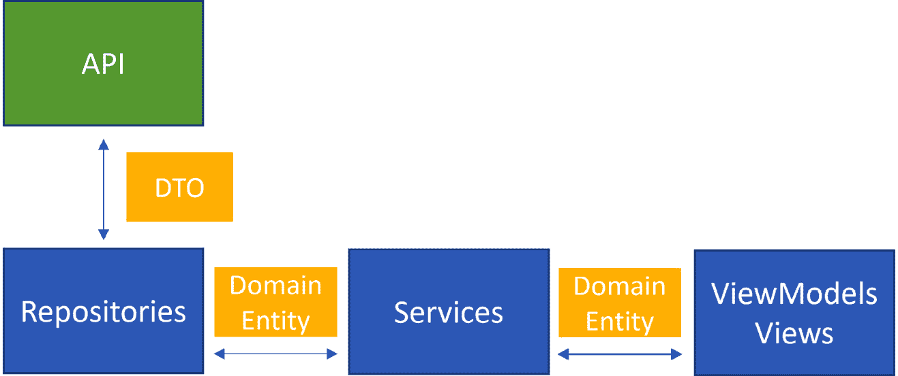

# 处理远程数据

到目前为止，我们已经深入探讨了 MVVM 和 .NET MAUI，涵盖了从 MVVM 设计的基础，到数据绑定和依赖注入，再到导航和处理用户输入的各个方面。但是，还有一块重要的拼图我们没有解决：从互联网获取数据。

现在很难想象一个应用程序不与在线服务通信来获取新鲜数据。添加后端通信也意味着我们需要解决一些架构挑战，例如保持关注点的分离、以可维护性为前提构建应用程序等。

在本章中，我们将深入探讨以下内容：

+   重新审视模型架构

+   使用 Refit 进行 API 通信

+   ViewModels 的 API 通信

到本章结束时，我们的 *Recipes!* 应用程序将不仅仅是一个独立的东西。它将与后端服务通信以获取新鲜数据并推送更新。我们将为其配备构建坚实的 MVVM 应用程序所需的必要工具和技能。

# 技术要求

在本章中，我们更新了 *Recipes!* 应用程序的一般架构，以更好地促进与远程 API 的通信。为了确保你与我们在同一页面上，所有资源和代码片段都可在 GitHub 上找到：[`github.com/PacktPublishing/MVVM-pattern-.NET-MAUI/tree/main/Chapter10`](https://github.com/PacktPublishing/MVVM-pattern-.NET-MAUI/tree/main/Chapter10)。如果你希望一起编码，请从 `Start` 文件夹中的代码开始，该代码已被重构，作为本章的基础。完成之后，你可以将你的工作与 `Finish` 文件夹中的最终版本进行比较。

# 重新审视模型架构

在我们迄今为止的旅程中，我们的模型很简单。我们只是使用了读取本地 JSON 文件的服务，并将 **数据传输对象 (DTOs)** 直接提供给我们的 ViewModels。但是，随着我们引入远程数据，这种简单的模型将不再足够。

一种直接的方法是在我们的服务中直接进行 API 调用，并将结果 DTOs 传递给我们的 ViewModels。然而，根据 SoC 原则，我相信服务不应该进行 API 调用。此外，直接在 ViewModels 中使用特定于 API 的 DTOs 是一条滑梯。这会紧密地将我们的应用程序与外部 API 相关联，可能导致维护噩梦，尤其是如果 API 经常更改或不受我们控制的话。

相反，我主张将这些 DTOs 映射到 **Plain Old CLR Objects (POCOs)**，或者实体或领域模型——无论你更喜欢叫它们什么。核心思想？与我们所拥有和控制的数据类型一起工作。

小贴士

通过将我们的应用程序和 API 之间的交互点保持在最低限度，我们的代码将受到潜在 API 变化的影响较小，从而提高可维护性。

为了实现这一点，我们将在我们的架构中引入**存储库**的概念。这些存储库将与 API（或任何数据源）接口，获取 DTOs，将它们映射到我们的领域模型，然后提供给我们的服务和 ViewModel。以下图表展示了这一设想架构：



图 10.1：架构概述

现在，有人可能会问：这真的有必要吗？我们难道不能直接从服务中调用 API，同时在 ViewModel 中使用 DTOs 吗？答案是：不需要；如果你想，完全可以从服务中调用 API。这绝对适用于所有业务逻辑都在服务器上完成的较小“傻瓜”应用程序。但随着我们规模的扩大或处理更复杂的场景，深思熟虑的架构对于几个原因来说变得至关重要：

+   **关注点分离**: 通过引入存储库，我们明确地分离了系统中的角色。存储库主要关注从数据源（无论是 API 还是另一个数据存储）获取数据，并将其转换为服务可以轻松使用的格式。将存储库层放置在核心项目之外不仅强调了其独特的责任，还确保了数据源的变化或扩展不会干扰核心业务逻辑。这种分离增强了系统的适应性和可维护性。很明显，存储库的唯一目的是数据检索，它作为一个薄层从各种来源获取数据，并将其提供给核心服务。作为中介的存储库，数据源的变化或数据结构的更改都集中管理，简化了修改过程。

+   **提高可测试性**: 通过引入存储库层，我们增强了应用程序的可测试性。有了存储库，我们可以在测试中轻松地模拟数据层。这种抽象确保我们的测试专注于服务内部的逻辑，不受外部数据源的依赖。在*第十三章* *单元测试*中，我们将更详细地探讨这一点。

+   **增强服务**: 服务层可以自由地引入额外的功能，例如缓存、业务逻辑或从多个存储库中进行数据聚合。这种解耦意味着服务不会直接绑定到特定的数据源，并且可以独立演进。

在深入探讨存储库和其他细节的概念之前，让我们先探索本章配套代码库的`Start`文件夹中找到的解决方案，以了解所进行的更改。

## 代码库的更新

随着我们深入创建一个健壮的 MVVM 架构，熟悉代码库中已进行的更改和新增内容至关重要。如果你查看本章配套存储库的`Start`文件夹，你会注意到一些变化。以下是一些显著的更新：

+   已添加了一个`Recipes.Web.Api` API 项目。在核心上，它仍然从本地 JSON 文件中读取，类似于我们早期的服务。API 的实现相当简单，仅用于演示目的。

+   新的`Recipes.Shared`项目包含了 API 返回并接受的 DTOs。

+   在`Recipes.Client.Core`项目的`Features`文件夹中，我们添加了新的 POCO 或领域实体。这些实体是 DTOs 的反映，但设计上完全受我们控制，确保与我们的应用程序基础设施的集成更加顺畅。

+   已创建一个新的`Recipes.Client.Repositories`项目。该项目将包含我们将要创建的存储库的实现。我们的想法是将它们与`Recipes.Client.Core`项目分开，以便核心项目完全独立于 API 及其 DTOs。该项目还包含将 API 返回的 DTOs 映射到我们将在整个应用程序中使用的 POCO 实体的映射器。

+   服务和 ViewModels 不再依赖于 DTOs。现在，它们仅与我们的 POCO 交互，确保架构干净且易于维护。

+   由于我们将从 API 获取数据，因此已从`Recipes.Mobile`项目中删除了`ratings.json`和`recipedetails.json`文件。

+   `MauiProgram`类中`IRecipeService`和`IRatingsService`的注册已更新为以下内容：

    ```cs
    builder.Services.AddTransient<IRatingsService,
      RatingsService>();
    builder.Services.AddTransient<IRecipeService,
      RecipeService>();
    ```

这些更改为引入存储库和与 API 的交互奠定了基础。

## 总是返回一个结果

在传统的编码中，异常通常用于指示失败。虽然它们对于*异常*情况很有用，但它们可能不是处理常规、预期错误场景的最佳选择。使用异常处理预期错误可能会使代码变得混乱，难以理解。

因此，我倾向于使用`Result<TSuccess>`对象来处理此类情况。该对象作为成功时预期的数据（`TSuccess`）的包装器，并提供错误代码、错误数据和失败情况下的`Exception`错误字段。它是一个非常简单且方便的包装器，如下所示：

```cs
public sealed class Result<TSuccess>
{
    ...
    public bool IsSuccess { get; }
    public TSuccess? Data { get; }
    public string? ErrorCode { get; }
    public string? ErrorData { get; }
    public Exception? Exception { get; }
    private Result(TSuccess? data,
        string? errorCode, string? errorData,
        Exception? exception, bool isSuccess)
    {
        Data = data;
        ErrorCode = errorCode;
        ErrorData = errorData;
        Exception = exception;
        IsSuccess = isSuccess;
    }
}
```

如以下代码块所示，该类还包含一些静态方法，用于实例化`Success`或`Fail` `Result`对象，从而简化该对象的使用：

```cs
public static Result<TSuccess> Success(TSuccess data)
    => new Result<TSuccess>(data, null, null, null, true);
public static Result<TSuccess> Success()
    => new Result<TSuccess>(default, null, null,
        null, true);
public static Result<TSuccess> Fail(string errorCode,
  string? errorData = null, Exception? exception = null)
    => new Result<TSuccess>(default, errorCode,
        errorData, exception, false);
public static Result<TSuccess> Fail(Exception exception)
    => new Result<TSuccess>(default, nameof(exception),
        exception.Message, exception, false);
```

通过使用`Result`对象，我们可以轻松地区分两种类型的错误：

+   **意外错误**：这些是我们无法预测且不知道如何处理的“异常”。它们仍然最好通过抛出异常来管理。

+   `Result`对象。

例如，一个无法检索数据的移动应用程序不是一个异常情况；这是我们应计划的情况。`Result`对象允许我们优雅地处理此类情况，而无需求助于异常。它提供的上下文比简单地返回`null`或`false`更丰富，使我们能够了解操作失败的原因。即使当我们与不控制的 API 通信时，这也同样有效：这只是一个围绕对象的简单包装器。

`Result` 对象使我们的代码更加清晰和一致。它消除了诸如“*这个方法会抛出异常吗？如果是，是什么类型的异常？它在* *类似场景中抛出的异常类型是否相同？*”这样的不确定性。

错误与异常

通过将预期错误与真正的异常分开，我们使代码更易于阅读和维护。它让异常成为它们应该成为的东西：指示关键、意外的失败。

随着我们将 *Recipes!* 应用程序扩展到与后端 API 通信，各种类型错误的可能性显著增加。为了应对这种复杂性，我们将把服务和仓库的返回值包裹在一个 `Result` 对象中。这种方法不仅帮助我们有效地处理预期错误，还为我们错误处理策略带来了标准化和清晰度。让我们看看这个 `Result` 对象如何为我们的 ViewModels 带来优雅和健壮性。

### 将 Result 对象投入使用

以下代码片段展示了 `Result` 对象如何在 `RecipeRatingsDetailViewModel` 中优雅地处理成功和失败的结果：

```cs
private async Task LoadData(RecipeDetail recipe)
{
...
    var loadRatings = await
        ratingsService.LoadRatings(recipe.Id);
    if(loadRatings.IsSuccess)
    {
        GroupedReviews = loadRatings.Data
        ...
        .ToList();
    }
    else
    {
        var shouldRetry = await dialogService.AskYesNo(
            "Failed to load", "Retry?");
        if (shouldRetry)
            await LoadData(recipe);
        else
            await navigationService.GoBack();
    }
}
```

这个例子强调了 `Result` 对象为我们的 ViewModels 带来的优雅和健壮性。通过使用 `IsSuccess` 属性，我们可以立即确定操作的成功与否。如果成功，我们继续处理我们接收到的数据。如果不成功，我们给用户一个重试或返回的机会。此外，`Result` 对象还包含在 `ErrorMessage`、`ErrorCode` 和 `Exception` 中的有价值错误信息，使我们能够定制我们的错误处理策略，例如向用户显示特定的错误消息。这种方法消除了在 ViewModels 中添加异常处理部分的必要性，从而使得代码结构更清晰、易于阅读和维护。

如果我们想利用 C# 的 **模式匹配** 能力，我们可以使前面的代码更加优雅，如下所示：

```cs
if (loadRatings is { IsSuccess: true, Data: var ratings })
{
    GroupedReviews = ratings
    ...
    .ToList();
}
else
{
    ...
}
```

通过使用模式匹配，我们可以检查 `Result` 对象的 `IsSuccess` 属性是否为 `true`，并在同一语句中，将 `Result` 对象的 `Data` 属性赋值给 `ratings` 变量。这使得我们能够通过 `if` 块内部的 `ratings` 变量更轻松地访问 `Data` 属性。现在我们已经很好地理解了 `Result` 对象，我们可以开始向我们的架构中添加仓库。

## 添加仓库接口

让我们开始添加仓库，这些代码片段将直接与我们的 API 交互：

1.  在 `Recipes.Client.Core` 项目中，将一个名为 `IRecipeRepository` 的接口添加到 `Features/Recipes` 文件夹中。这个接口看起来是这样的：

    ```cs
    public interface IRecipeRepository
    {
        Task<Result<LoadRecipesResponse>> LoadRecipes(
            int pageSize = 7, int page = 0);
        Task<Result<RecipeDetail>> LoadRecipe(string id);
    }
    ```

    此接口定义了任何类需要实现以从数据源获取菜谱的合同。在此接口中定义了两种方法：`LoadRecipes`和`LoadRecipe`。第一种方法返回一个`LoadRecipesResponse`对象，它包含一个分页的菜谱集合。第二种方法返回一个 ID 标识的`RecipeDetail`对象。这两种方法的返回值都包裹在`Result`对象中，使我们能够处理请求的数据（暂时）无法检索的情况。

1.  前往`RecipeService`类，并在其构造函数中添加一个类型为`IRecipeRepository`的参数。还添加了一个字段来保持对这个实例的引用，如下面的代码片段所示：

    ```cs
    public class RecipeService : IRecipeService
    {
        readonly IRecipeRepository _recipeRepository;
    ...
        public RecipeService(
            IRecipeRepository recipeRepository)
        {
            _recipeRepository = recipeRepository;
        }
    }
    ```

1.  由于`RecipeService`类中几乎没有“业务逻辑”，其方法应该只是调用注入的仓库的方法并返回其结果。请看以下代码：

    ```cs
    public Task<Result<RecipeDetail>> LoadRecipe(
        string id) => _recipeRepository.LoadRecipe(id);
    public Task<Result<LoadRecipesResponse>> LoadRecipes(
        int pageSize = 7, int page = 0)
        => _recipeRepository.LoadRecipes(pageSize, page);
    ```

我们可以将相同的处理方式应用到`RatingsService`类中：创建一个仓库接口，将其作为依赖项添加到服务中，并在`RatingsService`类的方法中调用该接口的方法。我们将按以下步骤进行：

1.  让我们在`Features/Ratings`文件夹中创建一个`IRatingsRepository`接口，并将以下定义添加到新创建的接口中：

    ```cs
    Task<Result<IReadOnlyCollection<Rating>>>
        GetRatings(string recipeId);
    Task<Result<RatingsSummary>> GetRatingsSummary(
        string recipeId);
    ```

    在此接口中定义了两种方法：`GetRatings`和`GetRatingsSummary`。第一种方法返回与指定菜谱 ID 关联的`Rating`对象集合。第二种方法返回一个 ID 标识的菜谱的`RatingsSummary`。如前所述，返回值都包裹在`Result`对象中。

1.  接下来，我们将`IRatingsRepository`作为`RatingsService`类的依赖项添加，通过将其定义为构造函数参数：

    ```cs
    public class RatingsService : IRatingsService
    {
        readonly IRatingsRepository _ratingsRepository;
    ...
        public RatingsService(
            IRatingsRepository ratingsRepository)
        {
            _ratingsRepository = ratingsRepository;
        }
    }
    ```

1.  最后，由于`RatingsService`类不包含任何额外的逻辑，这个类将只调用仓库的方法，正如您在这里看到的：

    ```cs
    public Task<Result<RatingsSummary>>
        LoadRatingsSummary(string recipeId)
        => _ratingsRepository.GetRatingsSummary(recipeId);
    public Task<<Result<IReadOnlyCollection<Rating>>>
        LoadRatings(string recipeId)
        => _ratingsRepository.GetRatings(recipeId);
    ```

这就剩下最后一个需要更新的服务：`FavoritesService`。与之前我们一直在更新的服务不同，`FavoritesService`确实包含一些额外的逻辑。但让我们首先看看`IFavoritesRepository`接口的样子：

```cs
public interface IFavoritesRepository
{
    Task<Result<IReadonlyCollection<string>>>
        LoadFavorites(string userId);
    Task<Result<Nothing>> Add(string userId, string id);
    Task<Result<Nothing>> Remove(string userId, string id);
}
```

此接口定义了三个方法：`LoadFavorites`、`Add`和`Remove`。由于我们的收藏夹存储在集中式服务器上，因此将用户的标识符（或`userId`）传递给 API 是必不可少的。这确保了获取、添加或删除的收藏夹是针对该用户的。`Add`方法或`Remove`方法没有固有的返回值。为了与我们的其他 API 保持一致，我们希望返回一个包裹在`Result`对象中的值。这就是为什么返回一个自定义的`Nothing`类型的原因。正如您在这里看到的，这只是一个空的 struct：

```cs
public struct Nothing
{
}
```

让我们更新`FavoritesService`，使其利用`IFavoritesRepository`接口：

1.  将`IFavoritesRepository`接口添加到`Features/Favorites`文件夹。

1.  更新 `FavoritesService`，使其构造函数接受一个类型为 `IFavoritesRepository` 的参数：

    ```cs
    public class FavoritesService : IFavoritesService
    {
        readonly IFavoritesRepository
            _favoritesRepository;
    ...
        public FavoritesService(
            IFavoritesRepository favoritesRepository)
        {
            _favoritesRepository = favoritesRepository;
        }
    }
    ```

1.  `FavoritesService` 在内存中保存用户喜欢的列表。这个内存中的列表可以很容易地在 `IsFavorite` 方法中使用，以快速检查给定的 `recipeId` 是否存在于列表中。以下是我们在内存中加载此列表的方法：

    ```cs
    List<string> favorites = null;
    private async ValueTask LoadList()
    {
        if (favorites is null)
        {
            var loadResult = await _favoritesRepository
                .LoadFavorites(GetCurrentUserId());
            if (loadResult.IsSuccess)
            {
                favorites = loadResult.Data.ToList();
            }
        }
    }
    //Dummy implementation,
    //could be retrieved via injected service
    private string GetCurrentUserId()
        => "3";
    ```

    当喜欢列表为 `null` 时，`LoadList` 方法会在 `IFavoritesRepository` 上调用 `LoadFavorites` 方法。这个“虚拟”的 `GetCurrentUserId` 方法为应用中给定的用户提供一个假的标识符。在实际场景中，这可以从注入的服务中检索。

1.  如前所述，这个内存中的列表有助于实现 `IsFavorite` 方法，如下一个代码块所示：

    ```cs
    public async Task<bool> IsFavorite(string id)
    {
        await LoadList();
        return favorites is not null
            && favorites.Contains(id);
    }
    ```

    此方法调用 `LoadList` 方法，如果内存中的列表为 `null`，则从 API 获取喜欢的项目。当喜欢的项目被加载后，我们可以检查列表是否包含给定的 ID。

与我们之前讨论的早期服务不同，其中每个方法只是调用了注入的仓库中相应的方法，这里由于内存中列表的存在，事情稍微复杂一些。此外，由于 `Add` 和 `Remove` 方法都发送一个 `FavoriteUpdateMessage` 实例，它们在实现上需要一些额外的逻辑。以下是它是如何完成的：

1.  在 `FavoritesService` 的 `Add` 方法中要做的第一件事是调用仓库的 `Add` 方法，传入（假的）`userId` 值，如下所示：

    ```cs
    public async Task<Result<Nothing>> Add(string id)
    {
        var result = await _favoritesRepository
            .Add(GetCurrentUserId(), id);
    }
    ```

1.  `IFavoritesRepository` 的 `Add` 方法返回一个包裹在 `Result` 对象中的 `Nothing` 对象。多亏了 `Result` 对象，我们可以检查 API 调用是否成功。如果是这样，我们将喜欢的菜谱的 ID 添加到内存中的喜欢列表中，并发送 `FavoriteUpdateMessage`，如下所示：

    ```cs
    if (result.IsSuccess)
    {
        if (favorites is not null
            && !favorites.Contains(id))
            favorites.Add(id);
        WeakReferenceMessenger.Default
            .Send(new FavoriteUpdateMessage(id, true));
    }
    return result;
    ```

1.  `Remove` 方法非常相似：

    ```cs
    public async Task<Result<Nothing>> Remove(string id)
    {
        var result = await _favoritesRepository
            .Remove(GetCurrentUserId(), id);
        if (result.IsSuccess)
        {
            if (favorites is not null
                && favorites.Contains(id))
                favorites.Remove(id);
            WeakReferenceMessenger.Default
                .Send(
                new FavoriteUpdateMessage(id, false));
        }
        return result;
    }
    ```

在所有代码就绪后，是时候为这些仓库添加实现，并确保它们在 DI 容器中注册。

### 添加和注册仓库实现

我们可以放置仓库接口实现的专用项目中。由于这些仓库将与我们自己的 API 进行通信，我倾向于使用 `ApiGateway` 作为命名。我个人认为这个名字完美地说明了其功能。在 `Recipes.Client.Repositories` 项目中，我们可以添加三个类：`FavoritesApiGateway`、`RatingsApiGateway` 和 `RecipeApiGateway`。这些类应分别实现 `IFavoritesRepository`、`IRatingsRepository` 和 `IRecipeRepository` 接口。在下一节中，我们将讨论如何使用 Refit 有效地激活 API 通信。

现在，让我们将注意力转向将这些仓库注册到 DI 容器中。我们不会在 `MauiProgram` 类中处理每个注册，而是将这项任务完全委托给 `Recipes.Client.Repositories` 项目的代码：

1.  将 `Microsoft.Extensions.DependencyInjection.Abstractions` NuGet 包添加到 `Recipes.Client.Repositories` 项目中。

1.  在 `Recipes.Client.Repositories` 项目中，添加一个 `ServiceCollectionExtension` 类。以下是这个静态类的样子：

    ```cs
    public static class ServiceCollectionExtension
    {
        public static IServiceCollection
            RegisterRepositories(
            this IServiceCollection services)
        {
            services.AddTransient<IRatingsRepository,
                RatingsApiGateway>();
            services.AddTransient<IRecipeRepository,
                RecipeApiGateway>();
            services.AddTransient<IFavoritesRepository,
                FavoritesApiGateway>();
            return services;
        }
    }
    ```

    这个类包含一个方法：`RegisterRepositories`。这是一个扩展方法，它扩展了 `IServiceCollection` 接口。要使用 `IServiceCollection`，请确保你已经包含了 `Microsoft.Extensions.DependencyInjection` 命名空间，这是我们在第一步中添加的 NuGet 包的一部分。这个方法完全是关于注册仓库的。通过在方法结束时返回 `services` 实例，我们可以采用构建器模式，从而允许链式调用额外的扩展方法。

1.  现在，我们可以转到 `MauiProgram.cs` 文件，并在 `CreateMauiApp` 方法中添加以下内容：

    ```cs
    builder.Services.RegisterRepositories();
    ```

    `RegisterRepositories` 扩展方法只能在添加了 `Recipes.Client.Repositories` 命名空间时才能解析。

在所有这些准备就绪之后，我们应用程序的服务现在依赖于最终将与应用程序 API 通信的仓库。这些仓库接口的实现及其注册是在专门的 `Recipes.Client.Repositories` 项目中完成的。这保持了所有内容的组织和模块化，并确保了关注点的清晰分离，使我们的代码库更容易维护。

尽管我们现在已经注册了仓库，但它们仍然缺乏与我们的 API 的通信。此外，我们还注册了 `RatingsApiGateway`、`RecipeApiGateway` 和 `FavoritesApiGateway` 类，这些类目前还不存在。让我们看看我们如何添加这些类，并利用 Refit 来进行 API 请求并接收强类型响应，这使得处理错误和解析数据变得更加容易。

# 使用 Refit 进行 API 通信

到目前为止，我们已经为我们的仓库设置了一个整洁的架构，但它们仍然缺少与我们的 API 通信的能力。为了添加这个功能，我们可以手动使用 `HttpClient` 来进行 API 调用并反序列化响应。虽然这是完全可能的，但它也很繁琐且容易出错，更不用说它需要大量的样板代码才能正确实现。

这就是 Refit 发挥作用的地方。Refit 是一个强大的库，通过提供更声明式和更少错误的方法来简化 API 调用。你不需要编写繁琐的 HTTP 请求和响应，只需定义一个映射到 API 端点的 C# 接口。Refit 会为你处理底层的 `HttpClient` 调用、序列化和反序列化，让你专注于最重要的部分——你应用程序的逻辑。

在本节中，我们将看到 Refit 如何通过减少代码复杂性和提高可读性来简化我们的工作，同时仍然为更复杂的场景提供定制选项。因此，让我们以智能的方式让我们的仓库与 API 进行通信。

## 开始使用 Refit

Refit 是一个类型安全的 .NET REST 客户端，允许您通过定义接口轻松地执行 API 调用。您使用 HTTP 属性（如 `[Get]`、`[Post]` 等）注释接口方法，指定 API 端点。然后 Refit 能够为您生成实现，将这些接口方法转换为 API 调用。让我们看看一个例子：

1.  首先，我们需要通过声明一个接口来定义我们将与之交互的 API 端点：

    ```cs
    public interface IRecipeApi
    {
        [Get("/recipe/{recipeId}")]
        Task<ApiResponse<RecipeDto>>
            GetRecipe(string recipeId);
    }
    ```

    在这里，`IRecipeApi` 接口定义了一个通过其 ID 获取单个菜谱的 API 调用。使用 `Refit.Get` 属性来定义一个针对特定端点的 `HTTP GET` 方法。端点中的 `{recipeId}` 部分指定了一个路径参数，用于将 `recipeId` 参数传递给方法。当使用菜谱 ID 调用 `GetRecipe` 方法时，我们希望 Refit 库向指定的端点发送一个 `HTTP GET` 请求，并将端点的 `{recipeId}` 部分替换为指定的 ID。

1.  其次，我们使用 `RestService.For` 生成接口的实现，如下所示：

    ```cs
    var api = RestService.For<IRecipeApi>(
            "https://api.yourservice.com");
    ```

    这一行代码创建了一个知道如何调用 `IRecipeApi` 中定义的 API 调用的对象。`RestService.For` 方法接受一个字符串参数，用于定义 API 的基本 URL。或者，也可以传递 `HttpClient` 的实例作为参数，而不是字符串值。Refit 将使用提供的 `HttpClient` 与 API 进行通信。在章节的后面部分，我们将看到为什么传递 `HttpClient` 可能是有用的。

1.  最后，我们可以使用生成的对象来执行 API 调用并处理响应，如下面的代码片段所示：

    ```cs
    var recipeResponse = await api.GetRecipe("1");
    if (recipeResponse.IsSuccessStatusCode)
    {
        RecipeDto recipe = recipeResponse.Content;
    }
    Task<RecipeDto> GetRecipe(string recipeId);
    ```

    这将只返回反序列化的对象。我更喜欢返回 `ApiResponse<T>` 的方法，因为它提供了关于 API 交互过程中发生情况的更全面的信息，这对于健壮的错误处理和有洞察力的日志记录至关重要。

如此一来，我们就完成了三个简单的步骤，替换了原本可能需要更多样板代码的情况。现在，让我们回到我们的 *Recipes!* 应用程序，并将这些应用到实践中。

## 创建 API 接口

让我们在 `Recipes.Client.Repositories` 项目中添加 API 接口。稍后，我们将与 Refit 一起使用它们来生成与 API 通信所需的代码：

1.  在 `Recipes.Client.Repositories` 项目中选择 `Api`。

1.  在新创建的文件夹中添加一个名为 `IFavoritesApi` 的接口。下面的代码片段显示了该接口的外观：

    ```cs
    public interface IFavoritesApi
    {
        [Get("/users/{userId}/favorites")]
        Task<string[]> GetFavorites(string userId);
        [Post("/users/{userId}/favorites")]
        Task AddFavorite(string userId,
            FavoriteDto favorite);
        [Delete("/users/{userId}/favorites/{recipeId}")]
        Task DeleteFavorite(string userId,
            string recipeId);
    }
    ```

    这个接口直接映射到负责管理用户收藏的 API 端点。`Get`、`Post` 和 `Delete` 属性指定了每个 API 调用应使用的 HTTP 方法。出现在 URL 中的参数，如 `userId`，将自动从方法参数中填充。注意 `AddFavorite` 方法中的 `favorite` 参数。这个参数不是定义的端点 URL 的一部分；相反，它被序列化并发送为请求体。或者，也可以通过使用 `Body` 属性显式地指出需要将收藏参数发送到消息体中。这看起来是这样的：

    ```cs
    [Post("/users/{userId}/favorites")]
        Task AddFavorite(string userId,
            IRatingsApi interface, which looks like this:

    ```

    public interface IRatingsApi

    {

    [Get("/recipe/{recipeId}/ratings")]

    Task<ApiResponse<RatingDto[]>> GetRatings(

    string recipeId);

    [Get("/recipe/{recipeId}/ratingssummary")]

    Task<ApiResponse<RatingsSummaryDto>>

    GetRatingsSummary(string recipeId);

    }

    ```cs

    Again, these methods and their attributes correspond with the endpoints that allow us to retrieve ratings and a ratings summary for a given recipe ID.
    ```

1.  最后，让我们定义 `IRecipeApi` 接口：

    ```cs
    public interface IRecipeApi
    {
        [Get("/recipe/{recipeId}")]
        Task<ApiResponse<RecipeDetailDto>>
          GetRecipe(string recipeId);
        [Get("/recipes")]
        Task<ApiResponse<RecipeOverviewItemsDto>>
          GetRecipes(int pageSize = 7, int pageIndex = 0);
    }
    ```

    如您现在可能已经知道的那样，与之前的接口一样，这个接口也映射到某些 API 端点。`GetRecipes` 方法的 `pageSize` 和 `pageIndex` 参数没有出现在 `Get` 属性的端点中。因此，在执行请求时，它们将作为查询字符串参数添加。

在定义了我们的 API 接口之后，现在是时候弥合我们的存储库和实际 API 调用之间的差距了。

## 集成 Refit

让我们将 Refit 集成到我们的存储库中，使 API 调用变得轻松。一切从向 `Recipes.Client.Repositories` 项目添加 Refit NuGet 包开始。为了使集成 Refit 更加容易并避免以后重复代码，让我们首先在 `Recipes.Client.Repositories` 项目中添加一个新的 `ApiGateway` 抽象类。这个类的作用是帮助我们执行调用并将 `ApiResponse` 结果映射到另一个类型。`InvokeAndMap` 方法的签名如下所示：

```cs
protected async Task<Result<TResult>>
    InvokeAndMap<TResult, TDtoResult>(
    Task<ApiResponse<TDtoResult>> call,
    Func<TDtoResult, TResult> mapper)
{
}
```

这个方法返回一个 `Task<TResult>` 对象并接受两个参数：

+   `call` 参数是要执行的 API 调用，它返回一个 `ApiResponse<TDtoResult>` 对象

+   `mapper` 参数是一个方法，它接受响应中的 `TDtoResult` 对象并将其映射到 `InvokeAndMap` 方法返回的 `TResult` 对象

实现相当直接：方法必须执行提供的 `call` 参数。如果 resulting `ApiResponse` 实例表示成功，则将使用传入的 `mapper` 参数将结果从 `TDtoResult` 映射到 `TResult`，并将其包装在一个表示成功的 `Result` 对象中。如果响应不表示成功，则返回一个失败的结果，其中包含响应的状态码。下面的代码块显示了如何实现：

```cs
try
{
    var response = await call;
    if (response.IsSuccessStatusCode)
    {
        return Result<TResult>
            .Success(mapper(response.Content));
    }
    else
    {
        return Result<TResult>.Fail("FAILED_REQUEST",
            response.Error.StatusCode.ToString());
    }
}
...
```

此外，我们还需要警惕可能抛出的潜在异常，我们可以像下面这样处理：

```cs
try
{
...
}
catch (ApiException aex)
{
    return Result<TResult>
        .Fail("ApiException",
            aex.StatusCode.ToString(), aex);
}
catch (Exception ex)
{
    return Result<TResult>.Fail(ex);
}
```

当发生异常时，我们应该返回一个 `Result` 对象，该对象表示失败，并包含有关异常的相关数据。

关于鲁棒性的说明

在开发移动应用程序时，重要的是要记住网络条件可能是不可预测的。移动设备可能会在不同的网络区域之间移动，导致连接不稳定。作为一个最佳实践，始终考虑实现弹性模式，例如，在`ApiGateway`类中添加这种重试逻辑而不是直接返回一个`Fail`结果是完美的位置。更多关于 Polly 的信息请在这里了解：[`github.com/App-vNext/Polly`](https://github.com/App-vNext/Polly)。

在 API 接口返回的数据类型与我们希望封装在`Result`对象中的类型相同的情况下，我们可以提供一个重载的`InvokeAndMap`方法，从而消除对类型映射器的需求。这在处理原始类型时特别有用。以下代码片段显示了这种重载：

```cs
protected Task<Result<T>>
    InvokeAndMap<T>(<ApiResponse<T>> call)
    => InvokeAndMap(call, e => e);
```

这个基类将极大地简化将 API 返回的 DTO 映射到封装在`Result`对象中的域实体的过程。现在，让我们看看我们如何在我们的仓库中利用这个`InvokeAndMap`方法：

1.  首先，确保所有我们的仓库（`FavoritesApiGateway`、`RatingsApiGateway`和`RecipeApiGateway`）通过添加以下代码继承这个抽象的`ApiGateway`类：

    ```cs
    internal class FavoritesApiGateway : ApiGateway,
      IFavoritesRepository { ... }
    internal class RatingsApiGateway : ApiGateway,
      IRatingsRepository { ... }
    internal class RecipeApiGateway : ApiGateway,
      IRecipeRepository { ... }
    ```

1.  接下来，这些仓库中的每一个都应该通过其构造函数注入相应的 API 接口。让我们看看`RatingsApiGateway`的例子：

    ```cs
    internal class RatingsApiGateway : ApiGateway,
      IRatingsRepository
    {
        readonly IRatingsApi _api;
    ...
        public RatingsApiGateway(IRatingsApi api)
        {
            _api = api;
        }
    }
    ```

1.  注入的`IRatingsApi`接口现在可以用来进行网络调用并从 API 检索所需的数据。以下代码块显示了实现的`GetRatings`方法：

    ```cs
    public Task<Result<IReadOnlyCollection<Rating>>>
        GetRatings(string recipeId)
        => InvokeAndMap(
            _api.GetRatings(recipeId), MapRatings);
    ```

    `GetRatings`方法调用基类的`InvokeAndMap`方法。将`GetRatings` API 调用作为参数传递，以及`MapRatings`方法，它将 API 返回的`RatingDto`数组映射到`Rating`对象的`IReadOnlyCollection`。`MapRatings`方法是在静态`RatingsMapper`类上的静态方法。我们可以在类内部直接访问`RatingsMapper`的静态映射方法，而无需显式地在其名称前添加，因为以下`using`语句被添加到了类中：

    ```cs
    using static Recipes.Client.Repositories.Mappers
      .RatingsMapper;
    ```

1.  我们现在可以为这个类的`GetRatingsSummary`方法做完全相同的事情：

    ```cs
    public Task<Result<RatingsSummary>>
        GetRatingsSummary(string recipeId)
        => InvokeAndMap(_api.GetRatingsSummary(recipeId),
            MapRatingSummary);
    ```

1.  与前面的示例类似，`FavoritesApiGateway`类的实现可以遵循相同的模式：注入`IFavoritesApi`接口并使用其方法从 API 检索数据，利用`ApiGateway`基类的`InvokeAndMap`方法：

    ```cs
    internal class FavoritesApiGateway : ApiGateway,
        IFavoritesRepository
    {
        readonly IFavoritesApi _api;
        public Task<Result<Nothing>> Add(
            string userId, string id)
            => InvokeAndMap(_api.AddFavorite(userId,
                new FavoriteDto(id)));
        public Task<Result<string[]>> LoadFavorites(
            string userId)
            => InvokeAndMap(_api.GetFavorites(userId));
        public Task<Result<Nothing>> Remove(string userId,
        string recipeId)
            => InvokeAndMap(_api.DeleteFavorite(userId,
                recipeId));
        public FavoritesApiGateway(IFavoritesApi api)
        {
            _api = api;
        }
    }
    ```

    在`FavoritesApiGateway`中的所有这些方法都使用了重载的`InvokeAndMap`方法，该方法不执行额外的映射：API 接口返回的数据类型与仓库返回的类型相同，但它被封装在一个`Result`对象中。

1.  `RecipeApiGateway`类的实现不应该有任何惊喜；它只包含更多的映射。但就其核心而言，它遵循与前面两个类完全相同的模式。首先，需要添加一个类型为`IRecipeApi`的字段作为成员和构造函数参数，如下面的代码片段所示：

    ```cs
    internal class RecipeApiGateway : ApiGateway,
        IRecipeRepository
    {
        readonly IRecipeApi _api;
    ...
        public RecipeApiGateway(IRecipeApi api)
        {
            _api = api;
        }
    }
    ```

    `LoadRecipes`方法和它使用的映射看起来是这样的：

    ```cs
    public Task<Result<LoadRecipesResponse>>
        LoadRecipes(int pageSize, int page)
        => InvokeAndMap(_api.GetRecipes(pageSize, page),
            MapRecipesOverview);
    ```

    `LoadRecipes`调用`InvokeAndMap`方法，传入 API 接口的`GetRecipes`方法。`MapRecipesOverview`方法用于将类型为`RecipesOverviewItemsDto`的结果对象映射到`LoadRecipesResponse`对象。

    最后，我们可以实现`LoadRecipe`方法。它可以使用`IRecipeApi`的`GetRecipe`方法来获取数据。结果将使用静态`RecipeMapper`类的静态`MapRecipe`方法进行映射。看看这个：

    ```cs
    public Task<Result<RecipeDetail>> LoadRecipe(
        string id)
        => InvokeAndMap(_api.GetRecipe(id), MapRecipe);
    ```

我们还需要更新我们的`ServiceCollectionExtension`类。因为每个仓库现在都依赖于特定的 API 接口，我们需要确保这些依赖也被注册。但首先，我们可能想要在`Recipes.Client.Repositories`项目中添加一个新的`RepositorySettings`类。这个类应该是一种将设置从应用传递到仓库的方式，例如，需要使用特定`HttpClient`实例的情况。如下面的代码块所示，对于这个特定的演示项目，这个类并没有多少内容。但在更复杂的应用中，可以在这里添加诸如特定的序列化或认证设置等。

```cs
public class RepositorySettings
{
    public HttpClient HttpClient { get; }
    public RepositorySettings(HttpClient httpClient)
    {
        HttpClient = httpClient;
    }
}
```

让我们把这些拼图的最后几块拼在一起，更新`ServiceCollectionExtension`，并在我们的应用中调用它。以下是我们需要做的：

1.  将前面提到的`RepositorySettings`类添加到`Recipes.Client.Repositories`项目中。

1.  在`ServiceCollectionExtension`类的`RegisterRepositories`扩展方法中添加一个类型为`RepositorySettings`的参数，如下所示：

    ```cs
    public static class ServiceCollectionExtension
    {
        public static IServiceCollection
            RegisterRepositories (
            this IServiceCollection services,
            RepositorySettings settings)
        {
            ...
            return services;
        }
    }
    ```

1.  正如我们之前看到的，Refit 的`RestService.For`方法可以用来生成 API 接口的实现。以下代码片段展示了我们如何将生成的实现注册到 DI 容器中：

    ```cs
    services.AddSingleton((s) =>
      RestService.For<IRatingsApi>(settings.HttpClient));
    services.AddSingleton((s) =>
      RestService.For<IRecipeApi>(settings.HttpClient));
    services.AddSingleton((s) =>
    RestService.For<IFavoritesApi>(settings.HttpClient));
    ```

    `RestService.For`方法接受一个`HttpClient`实例，该实例将由 Refit 用于 API 通信。`HttpClient`应该在应用中进行配置并通过`RepositorySettings`传入。

1.  最后，在`MauiProgram`类中，我们可以调用更新的`RegisterRepositories`并传入一个配置好的`HttpClient`，如下所示：

    ```cs
    var baseAddress = DeviceInfo.Platform ==
        DevicePlatform.Android
        ? "https://10.0.2.2:7220"
        : "https://localhost:7220";
    var httpClient = HttpClientHelper
        .GetPlatformHttpClient(baseAddress);
    builder.Services.RegisterRepositories(
        new RepositorySettings(httpClient));
    ```

    由于 Android 模拟器在虚拟路由器后的隔离网络环境中运行，它不能直接使用`localhost`访问开发机器。相反，模拟器提供了一个特殊的`10.0.2.2`别名，该别名路由到开发机器的环回接口，使您能够访问本地网络服务。

    `Recipes.Mobile` 项目包含一个 `HttpClientHelper` 类，该类配置一个 `HttpClient` 实例以用于连接到本地网络服务。这是必要的，因为需要对每个平台进行一些特定的配置，以便有效地与本地托管的服务进行通信。

连接到本地网络服务

在开发软件时，通常需要在 Android 模拟器或 iOS 模拟器中运行本地网络服务，并使用应用访问它。为了使应用能够与你的本地网络服务通信，需要一些额外的配置。有关连接到本地网络服务以及如何配置每个平台的更多信息，请参阅此处：[`learn.microsoft.com/dotnet/maui/data-cloud/local-web-services`](https://learn.microsoft.com/dotnet/maui/data-cloud/local-web-services)。

如果你想要调试 *Recipes!* 应用，我们需要告诉 Visual Studio 同时运行移动应用和 API。为此，在 **Solution Explorer** 中右键单击 **Solution ‘Recipes App’** 并选择 **Properties**。在弹出的窗口中，选择 **Multiple startup projects** 并将 **Recipes.Mobile** 和 **Recipes.Web.Api** 项目的 **Action** 设置为 **Start**。

在我们结束本章之前，让我们简要地关注一下我们如何从 ViewModels 调用 API、处理加载指示器以及处理潜在的错误，同时提供无缝的用户体验。

# 从 ViewModels 发送的 API 通信

当导航到 `RecipeDetailPage` 时，你会看到屏幕上显示一些数据，同时正在加载数据。显示的数据是绑定语句中定义的 `FallbackValue` 或 `TargetNullValue` 的值，这是由于 `RecipeDetailViewModel` 中的数据尚未加载。虽然有效，但我认为它看起来不太美观。让我们看看我们如何在数据加载时显示加载指示器来改进这一点。

## 显示加载指示器

提高用户体验的最简单有效的方法之一是在 API 调用期间提供视觉反馈。考虑以下代码片段：

```cs
private bool _isLoading = true;
public bool IsLoading
{
    get => _isLoading;
    set => SetProperty(ref _isLoading, value);
}
private async Task LoadRecipe(string recipeId)
{
    IsLoading = true;
...
    await Task.WhenAll(loadRecipeTask,
        loadIsFavoriteTask, loadRatingsTask);
...
    IsLoading = false;
}
```

在这里，我们在开始加载数据之前将 `RecipeDetailViewModel` 的 `IsLoading` 属性设置为 `true`，并在之后将其还原为 `false`。多亏了 `async`/`await` 的使用，在此操作期间 UI 线程不会被阻塞，允许更新和渲染 UI 元素，如加载指示器。

你可以将此属性绑定到 XAML 中的加载旋转器，如下所示：

```cs
<Grid>
    <ScrollView>
        ...
    </ScrollView>
    <Grid
        BackgroundColor="GhostWhite"
        IsVisible="{Binding IsLoading}">
        <ActivityIndicator
            HorizontalOptions="Center"
            IsRunning="{Binding IsLoading}"
            VerticalOptions="Center" />
    </Grid>
</Grid>
```

由于这种设置，每当 API 调用——或者任何长时间运行的过程——正在进行时，用户会收到一个视觉提示，表明应用当前正忙。在上一个示例中，我们使用了 `Grid` 属性，它覆盖了整个页面并包含一个 `ActivityIndicator`。然而，你并不局限于这种方法；你也可以使用消息、动画或任何其他最适合你应用设计和用户体验的 UI 元素。

使用一个属性来指示任务正在进行中，并将此属性绑定到 UI，是管理长时间运行操作的一种常见的 MVVM 模式。响应性是通过`async`/`await`构造实现的，它保持 UI 线程不被阻塞，从而提供更流畅的用户体验。

在本章的早期部分，我们已经看到了`Result`对象如何帮助我们优雅地处理成功和失败的结果。现在，让我们更进一步，通过处理表示失败的`Result`对象来增强用户体验。

## 处理失败

在本章的早期部分，我们介绍了`Result`对象作为优雅处理失败的一种方式。对象的`IsSuccess`属性指示操作是否成功完成。我们已经看到，在成功的情况下，`Data`属性为我们提供了访问结果的方式。然而，当`IsSuccess`为`false`时，至关重要的是不要让用户猜测。相反，我们应该提供清晰的反馈并提供解决问题的方法。让我们看看这是如何在`RecipesOverviewViewModel`的`LoadRecipes`方法中解决的：

```cs
private async Task LoadRecipes(int pageSize, int page)
{
    LoadFailed = false;
    var loadRecipesTask =
        recipeService.LoadRecipes(pageSize, page);
    ...
    if(recipesResult.IsSuccess)
    {
        //Set TotalNumberOfRecipes property
        //Fill Recipes collection
        ...
    }
    else
    {
        LoadFailed = true;
        ReloadCommand =
            new AsyncRelayCommand(
            () => LoadRecipes(pageSize, page));
    }
}
```

如您所见，当任务未成功时，`LoadFailed`属性被设置为`true`。此外，`ReloadCommand`属性被初始化。下面的代码块展示了这两个属性如何与 UI 数据绑定，并将为用户提供一些信息和重新加载食谱列表的能力：

```cs
<Grid>
    <CollectionView>
    ...
    </CollectionView>
    <Grid
        BackgroundColor="{StaticResource Primary}"
        HorizontalOptions="Fill"
        IsVisible="{Binding LoadFailed}"
        VerticalOptions="Fill">
        <VerticalStackLayout
            HorizontalOptions="Center"
            VerticalOptions="Center">
            <Label Text="Unable to load recipes" />
            <Button Command="{Binding ReloadCommand}"
                Text="Retry" />
        </VerticalStackLayout>
    </Grid>
</Grid>
```

此外，当发生特定失败时，我们还可以向用户显示自定义错误消息。`Result`对象的`ErrorMessage`、`ErrorCode`和`Exception`属性可以用于此目的。这种方法消除了在 ViewModel 中散布各种异常处理块的需要，从而创建了一个更流畅、可读性和可维护性更强的代码库。

# 摘要

我们通过回顾我们的*Recipes!*应用架构，并包含存储库来开启本章。这次增加是为了遵循 SoC 原则并最小化我们的应用对 API 本身的依赖。我们还引入了`Result`对象，这是我们错误处理策略中的一个变革性组件。这个单一的对象封装了成功和失败状态，使我们的 ViewModel 更加健壮和易于理解。通过使用`Result`对象，我们使优雅地处理预期错误变得更加容易，同时仍然保留异常用于关键性故障。

在建立这个架构基础之后，我们继续探索 Refit 的强大和简单性，Refit 是一个类型安全的 REST 客户端。Refit 极大地简化了我们与 API 交互的方式，使代码更易于阅读和维护。

我们还探讨了 `Result` 对象如何优雅地融入我们的 ViewModels，这使得处理预期错误变得更容易，并提供了统一的方法来管理错误。与此同时，我们讨论了实用的 UI 考虑因素，包括加载指示器和错误覆盖层，以提供吸引用户并富有信息性的体验。

你现在应该已经对如何进行 API 调用、管理响应以及以弹性和易于维护的方式提供实时用户反馈有了稳固的理解。

在下一章中，我们将探讨如何创建适合 MVVM 的控件。

# 进一步阅读

要了解更多关于本章所涉及的主题，请查看以下资源：

+   Refit 文档：[`reactiveui.github.io/refit/`](https://reactiveui.github.io/refit/)

+   使用 `HttpClient` 消费基于 REST 的 Web 服务：[`learn.microsoft.com/dotnet/maui/data-cloud/rest`](https://learn.microsoft.com/dotnet/maui/data-cloud/rest)

# 第三部分：掌握 MVVM 开发

本部分主要介绍如何精炼和加固你的 .NET MAUI 应用。我们将深入探讨如何制作与 MVVM 无缝集成的控件。你将学习如何通过本地化技术扩展你应用的范围，并通过强大的单元测试加固你的代码库，确保稳定性和可靠性。当事情没有按计划进行时，你将能够依赖有价值的故障排除和调试技巧来重新回到正确的轨道。

本部分包含以下章节：

+   *第十一章*，*创建适合 MVVM 的控件*

+   *第十二章*，*使用 MVVM 进行本地化*

+   *第十三章*，*单元测试*

+   *第十四章*，*故障排除和调试技巧*
