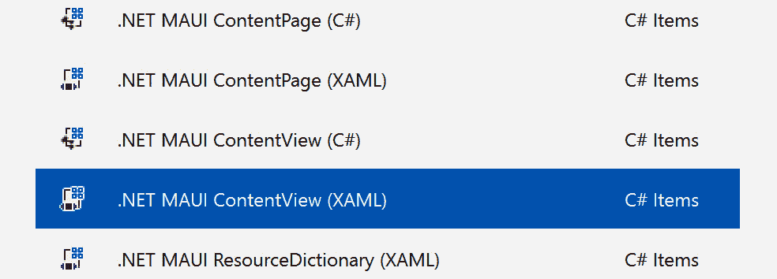
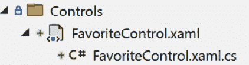
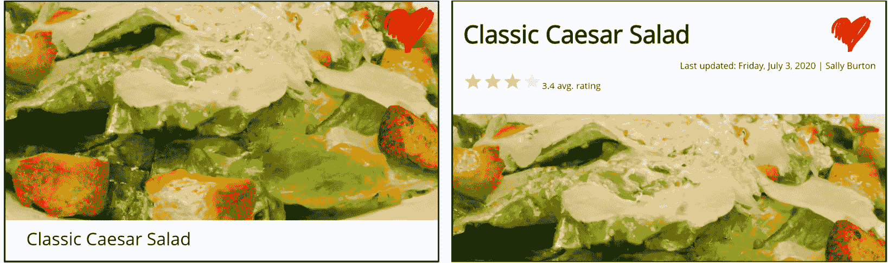
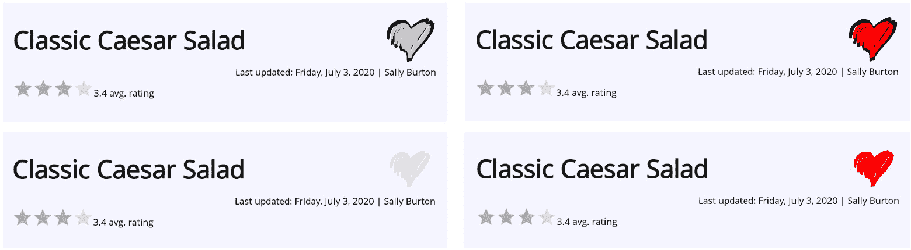
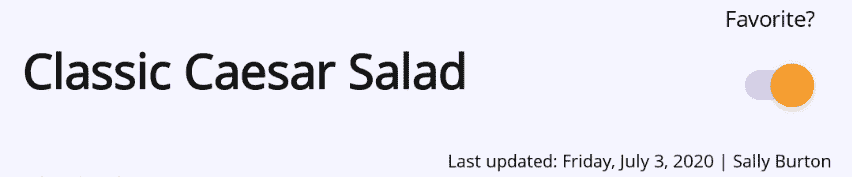

# 创建 MVVM 友好的控件

到目前为止，我们已经浏览了 MVVM 和.NET MAUI 的广泛主题——从基本设计模式到数据绑定、导航，甚至处理远程数据。现在，让我们深入探讨另一个重要主题——**自定义控件**。

有时，内置控件可能无法满足特定的用户界面要求或独特的设计元素。因此，你需要通过将单个 UI 元素组合成一个更有效的单元来创建自己的控件。使这些元素在应用程序中成为 MVVM 友好和可重复使用的是我们的目标。

在本章中，我们将关注以下内容：

+   使用可绑定属性构建自定义控件

+   在自定义控件上启用交互

+   与控件模板一起工作

到本章结束时，你将知道如何创建既美观又易于在 MVVM 设置中管理的自定义控件。准备好深入研究了？

# 技术要求

我们将继续通过深入研究自定义控件和控制模板来增强*食谱*应用，所有这些都是在考虑 MVVM 架构的情况下设计的。为了跟随代码，请确保访问 GitHub 仓库[`github.com/PacktPublishing/MVVM-pattern-.NET-MAUI/tree/main/Chapter11`](https://github.com/PacktPublishing/MVVM-pattern-.NET-MAUI/tree/main/Chapter11)。`Start`文件夹包含开始本章所需的初始代码设置，而`Finish`文件夹包含供您参考的完成代码。

# 使用可绑定属性构建自定义控件

构建功能丰富的应用程序通常需要不仅仅是标准的 UI 控件集。当你有多个部分中一起出现的控件组合——例如，一个带有验证错误列表的输入字段或总是与活动指示器一起使用的按钮——将这些组合成自定义控件是有意义的。这些自定义的可重复使用元素不仅使代码库更易于维护，而且当它们可绑定时，与 MVVM 架构完美契合。

本节的重点不仅是创建自定义控件，还要使它们“可绑定”，无缝地集成到我们的 MVVM 架构中。通过制作可绑定的控件，你可以实现与 ViewModel 的简单通信。这是确保 UI 始终与应用程序的数据和逻辑保持同步的关键。

那么，我们如何实现这一点？

在接下来的几页中，我们将看到如何将现有控件组合成自定义的可绑定控件。我们还将讨论如何向控件添加自定义属性和行为，确保它们可以无缝地融入基于 MVVM 的应用程序架构。

注意

虽然我们将在本章的整个过程中使用 XAML 创建自定义控件，但重要的是要注意，我们所做的所有事情也可以完全通过代码完成，如果需要的话。

当我们深入创建具有数据绑定功能的自定义控件时，重要的是要回忆起我们在 *第三章*，*在 .NET MAUI 中的数据绑定构建块* 中讨论的绑定目标的概念。在 .NET MAUI 中，绑定目标通常是 UI 元素上的 `BindableProperty` 或另一个 `BindableObject`。为了使我们的自定义控件作为有效的绑定目标，它们需要从 `BindableObject` 继承。此外，我们打算绑定的任何属性都必须是 `BindableProperty` 类型。这确保了我们的自定义控件将无缝集成到 MVVM 数据绑定架构中。

## 实现 FavoriteControl

在我们的 *Recipes!* 应用中，显示一个菜谱是否被标记为收藏是一个常见的主题。该“收藏”图标出现在我们应用的各个部分。每次这个图标出现时，它的行为都是相同的——当菜谱被标记为收藏时改变颜色。为了避免在各个地方重复相同的代码，我们可以将这种模式封装成一个可重用的 `FavoriteControl`。通过这样做，我们使代码更易于维护，并为未来的改进——例如添加更多手势或动画——铺平了道路，而无需修改代码库的多个部分。

让我们继续看看创建我们的 `FavoriteControl` 所需的步骤：

1.  在 `Recipes.Mobile` 项目的 `Controls` 文件夹中，选择 **添加** | **新建项…**。

1.  将新项目的名称选为 `FavoriteControl.xaml`。点击 **添加**。



图 11.1：从对话框中选择 ContentView

按照这些步骤，将创建两个新的文件——`FavoriteControl.xaml` 和其代码后文件 `FavoriteControl.xaml.cs`，如图 *11.2* 所示：



图 11.2：组成 FavoriteControl 的文件

生成的 `FavoriteControl` 继承自 `ContentView` 类，而 `ContentView` 本身是 `BindableObject` 的子类。这使得 `FavoriteControl` 能够定义 `BindableProperties`，这对于使控件可绑定至关重要。说到这里，`FavoriteControl` 应该包含一个名为 `IsFavoriteProperty` 的 `BindableProperty` 和一个类型为 `bool` 的 `IsFavorite` 属性。以下代码片段显示了它的样子：

```cs
public static readonly BindableProperty IsFavoriteProperty
=
    BindableProperty.Create(nameof(IsFavorite),
        typeof(bool), typeof(FavoriteControl));
public bool IsFavorite
{
    get { return (bool)GetValue(IsFavoriteProperty); }
    set { SetValue(IsFavoriteProperty, value); }
}
```

定义 `BindableProperty` 可能一开始会让人感到困惑或不清楚。如果这个概念仍然模糊，请参阅 *第三章*，*在 .NET MAUI 中的数据绑定构建块*，它对此进行了更深入的介绍。

在此基础上，我们可以深入 XAML 并开始工作于这个 `FavoriteControl` 的视觉层。

自定义控件中的数据绑定

在构建自定义控件时，建议设计它，使其不依赖于其`BindingContext`，这是从其父页面或控件继承而来的。自定义控件不应依赖于其`BindingContext`，而应该是自包含的，并直接与其自己的可绑定属性交互。这种方法使您的控件更加模块化和可重用，使其摆脱对任何特定 ViewModel 或数据源的依赖。元素绑定或相对绑定是实现这种独立性的关键。然而，值得注意的是，在控件中使用数据绑定不是强制性的。在控件的后台代码中程序化处理所有逻辑和值赋值也是一个可靠的方法。这主要取决于个人偏好。

让我们看看如何定义控件的外观，以及我们如何有效地绑定到其`IsFavorite`属性：

1.  打开`FavoriteControl.xaml`文件，并添加以下`local`和`toolkit` XML 命名空间以及`x:Name`属性：

    ```cs
    <ContentView
        x:Class="Recipes.Mobile.Controls.FavoriteControl"
        xmlns="http://schemas.microsoft.com/dotnet/
          2021/maui"
        xmlns:x="http://schemas.microsoft.com/winfx/
          2009/xaml"
        xmlns:local="clr-namespace:
          Recipes.Mobile.Controls"
        xmlns:toolkit="http://schemas.microsoft.com/
          dotnet/2022/maui/toolkit"
    toolkit namespace in place, which refers to the .NET MAUI Community Toolkit, we can add an instance of BoolToObjectConverter to the control’s Resources. This converter can be copied over from RecipesOverviewPage or RecipeDetailPage. The next code block shows what it looks like:

    ```

    <ContentView.Resources>

    <toolkit:BoolToObjectConverter

    x:Key="isFavoriteToColorConverter"

    x:TypeArguments="Color"

    FalseObject="#E9E9E9E9"

    TrueObject="#FF0000" />

    </ContentView.Resources>

    ```cs

    As a reminder, this converter (as it is configured here) will convert a `bool` value into a color – `false` will become a color with the hex value of `"#E9E9E9E9"` while `true` will be converted to `"#FF0000"`.
    ```

1.  接下来，我们可以添加`Image`控件来显示`"favorite.png"`图标。我们还想让这个 Image 控件与为`FavoriteControl`指定的尺寸相匹配。以下是设置此控件的步骤：

    ```cs
    <Image
        x:Name="icon"
        HeightRequest="{Binding HeightRequest,
          Source={RelativeSource AncestorType={x:Type
            local:FavoriteControl}}}"
        Source="favorite.png"
        WidthRequest="{Binding WidthRequest, Source=
          {RelativeSource AncestorType={x:Type
            local:FavoriteControl}}}">
    HeightRequest and WidthRequest properties of the Image control to those of FavoriteControl. By doing so, we ensure that the image scales according to the dimensions defined for FavoriteControl.
    ```

1.  最后，为了根据收藏状态控制`Image`的色调，我们使用`IconTintColorBehavior`，如下所示：

    ```cs
    <Image.Behaviors>
        <toolkit:IconTintColorBehavior
            TintColor="{Binding IsFavorite,
            Source={x:Reference root},
            Converter={StaticResource
            isFavoriteToColorConverter}}" />
     </Image.Behaviors>
    ```

    这个设置与我们在`RecipesOverviewPage`和`RecipeDetailPage`上使用的设置非常相似。关键区别在于绑定的来源。在这里，我们直接绑定到我们刚刚创建的`IsFavorite`属性。我们通过元素绑定（通过`x:Reference root`）实现这一点，它引用回`FavoriteControl`本身。这是必要的，因为相对绑定在这里不适用。与其它 UI 元素不同，行为不是视觉树的一部分，因此它们不能像其他元素那样执行相对绑定或查找祖先。

完成这些步骤后，我们已经成功创建了第一个自定义控件`FavoriteControl`。现在，我们可以继续用这个自定义控件替换现有的图像和`IconTintColorBehavior`设置，这些设置用于在`RecipesOverviewPage`和`RecipeDetailPage`上指示收藏的菜谱。让我们按以下步骤进行：

1.  前往`RecipesOverviewPage`并添加一个`xml`命名空间，引用包含新创建的`FavoriteControl`的命名空间，如下所示：

1.  指向.NET MAUI 社区工具包的 XML 命名空间(`xmlns:toolkit`)可以删除，因为我们不会在这个页面上再使用其任何功能。现在，这些功能都封装在我们的自定义控件中。

1.  删除`Image` UI 元素及其相关行为，这些行为直到现在一直作为菜谱的收藏指示器。

1.  用我们刚刚创建的`FavoriteControl`替换删除的`Image`。以下是这样做的方法：

    ```cs
    <controls:FavoriteControl
        Margin="5"
        HeightRequest="45"
        HorizontalOptions="End"
        IsFavorite="{Binding IsFavorite}"
        IsVisible="{Binding IsFavorite}"
        VerticalOptions="Start"
        WidthRequest="45" />
    ```

    布局属性，如边距、大小、可见性和对齐选项，与删除的`Image`保持不变。同时，观察我们如何轻松地将`FavoriteControl`的`IsFavorite`属性绑定到页面`BindingContext`上的相应`IsFavorite`属性。

对于`RecipeDetailPage`，我们可以采取类似的方法。包含一个指向`Recipes.Mobile.Controls`的 XML 命名空间，并用新创建的`FavoriteControl`替换之前表示是否为收藏的`Image`。这就是结果的样子：

```cs
<ContentPage
    x:Class="Recipes.Mobile.RecipeDetailPage"

     ...>
...
    <Grid ColumnDefinitions="*, Auto">
        <Label FontAttributes="Bold" FontSize="22"
            Text="{Binding Path=Title, Mode=OneWay}"
            VerticalOptions="Center" />
        **<controls:FavoriteControl Grid.Column="1"**
**            Margin="5" HeightRequest="35"**
**            IsFavorite="{Binding IsFavorite}"**
**            VerticalOptions="Center" WidthRequest="35" />**
    </Grid>
...
</ContentPage>
```

**通过将收藏指示器合并成一个单一的可重用`FavoriteControl`，我们实现了多个目标。首先，我们集中了代码，使其更容易管理和更新。其次，这个控件现在可以一致地应用于应用的不同页面，确保了统一的用户体验。最后，通过这样做，我们还提高了代码库的可读性和可维护性**。图 11.3*展示了应用不同页面上的`FavoriteControl`。尽管对用户来说没有明显的变化，但代码及其可维护性从这种可重用控件中获得了巨大的收益。



图 11.3：不同页面上的 FavoriteControl

让我们看看我们如何进一步改进这个控件，使应用对用户更具吸引力。

## 状态变化动画

作为对状态变化做出快速反应的一个例子，让我们来看看如何在`IsFavorite`属性变化时给`FavoriteControl`添加一个微妙的动画。我们将使用`IsFavoriteProperty`的`propertyChanged`委托方法来触发这个动画。让我们深入探讨吧！

1.  通过添加一个`propertyChanged`委托，修改`IsFavoriteProperty`，如下所示：

    ```cs
    public static readonly BindableProperty
      IsFavoriteProperty =
            BindableProperty.Create(nameof(IsFavorite),
            typeof(bool),
            typeof(FavoriteControl),
            propertyChanged: OnIsFavoriteChanged);
    private static void OnIsFavoriteChanged(BindableObject
      bindable, object oldValue, object newValue)
    {
    }
    ```

    经过这次修改，每当`IsFavorite`属性的值发生变化时，静态的`OnIsFavoriteChanged`方法将被调用。传入的`BindableObject`是设置`BindableProperty`的实例。在这种情况下，它将是一个`FavoriteControl`的实例。`oldValue`和`newValue`参数是自解释的，因为它们分别提供了属性的旧值和新值。

1.  接下来，让我们添加当控件状态变化时要播放的动画。以下是添加动画的方法：

    ```cs
    private async Task AnimateChange()
    {
        await icon.ScaleTo(1.5, 100);
        await icon.ScaleTo(1, 100);
    }
    ```

    `AnimateChange`方法将在 100 毫秒内将持有图标的`Image`缩放到 1.5 倍大小。之后，它将在相同的时间内再次缩放到原始大小。

1.  最后，我们需要从静态的`OnIsFavoriteChanged`方法中调用这个方法。以下代码块展示了如何实现这一点：

    ```cs
    private static void OnIsFavoriteChanged(
        BindableObject bindable,
        object oldValue, object newValue)
        => (bindable as FavoriteControl).AnimateChange();
    ```

    可绑定参数可以安全地转换为`FavoriteControl`，这样我们就可以调用`AnimateChange`方法，触发动画。

运行应用程序以查看实际变化！每次将食谱切换为收藏时，你会在`RecipeDetailPage`上观察到细微的动画。引入这个自定义控件带来了应用程序中统一动画的便利。对自定义控件内动画的任何修改都会自动反映到其使用的每个地方。如果没有这样的控件，我们就需要手动更新应用程序中每个实例的动画。忽略任何一个实例都可能导致行为不一致。因此，自定义控件确保了一致性和维护的简化。

注意

这个例子强调了重要的一点——即使你完全致力于使用 MVVM 模式，也仍然会有一些情况下在代码后编写代码不仅是可以接受的，而且是必要的。这在创建自定义控件时尤其如此，使用代码后不仅不可避免，而且非常合适。

接下来，让我们探讨如何通过利用命令来添加自定义控件的交互，从而进一步与 MVVM 概念保持一致。

# 在自定义控件上启用交互

在现实世界的应用中，控件通常扮演双重角色——它们既显示数据，也允许用户与之交互。在本节中，我们将进一步增强我们的`FavoriteControl`，使其不仅支持通过`IsFavoriteChangedCommand`进行用户交互，而且还要便于双向数据绑定。这些特性将使控件更具交互性，并进一步与 MVVM 概念保持一致。我们希望允许用户点击`FavoriteControl`上的`Image`。当`FavoriteControl`的`IsEnabled`属性设置为`true`时，`IsFavorite`属性将被更新，并且`IsFavoriteChangedCommand`将被执行。

让我们来看看这个功能的第一个部分——当用户点击图片时更新`IsFavorite`属性，并确保绑定到这个属性的值也得到更新。

## 用户操作和状态反映

首先，让我们添加用户通过点击控件来切换收藏状态的能力。然后，这个用户操作将更新控件的`IsFavorite`属性，反过来，它将反映回更新绑定的属性。以下步骤展示了如何实现这一点：

1.  如下所示，将`GestureRecognizer`添加到`FavoriteControl`的`ContentView`中：

    ```cs
    <ContentView.GestureRecognizers>
        <TapGestureRecognizer
            Tapped="TapGestureRecognizer_Tapped" />
    </ContentView.GestureRecognizers>
    ```

    `GestureRecognizer`允许你在 UI 元素上处理用户交互事件，例如点击、捏合和滑动。通过向`ContentView`添加`TapGestureRecognizer`，我们有效地指示应用程序监听此控件上的点击事件。

    下面是代码后部的`TapGestureRecognizer_Tapped`事件处理程序：

    ```cs
    private void TapGestureRecognizer_Tapped(
        object sender, TappedEventArgs e)
    {
    }
    ```

    当用户点击`FavoriteControl`时，将触发此方法。

1.  现在，让我们在`TapGestureRecognizer_Tapped`方法中实现更新`IsFavorite`属性的逻辑：

    ```cs
    private void TapGestureRecognizer_Tapped(
        object sender, TappedEventArgs e)
    {
        if (IsEnabled)
        {
            IsFavorite = !IsFavorite;
        }
    }
    ```

    注意我们首先检查 `IsEnabled` 属性，然后再更新 `IsFavorite`。对于自定义控件来说，与开发者的期望保持一致的行为至关重要。在这种情况下，将 `VisualElement` 的 `IsEnabled` 属性设置为 `false` 应该会禁用控件。因此，我们在切换 `IsFavorite` 的值之前会检查 `IsEnabled` 属性。

如果我们现在运行应用程序并导航到 `RecipeDetailPage`，触摸 `FavoriteControl` 应该会更新其状态。我们之前定义的动画也会作为对 `IsFavorite` 属性更新的反应播放。然而，状态变化并没有反映在 ViewModel 上。你可能想知道为什么会出现这种情况。这是因为 `IsFavoriteProperty` 具有默认的绑定模式 `OneWay`。这就是为什么更新后的值不会从控件流向 ViewModel。这很容易调整——将 `IsFavoriteProperty` 的默认绑定模式更改为 `TwoWay`，或者更新 `RecipeDetailPage` 上的绑定语句并显式将其设置为 `TwoWay`。以下是第一种方法——更新默认绑定模式——的示例：

```cs
public static readonly BindableProperty
IsFavoriteProperty =
    BindableProperty.Create(nameof(IsFavorite),
        typeof(bool),
        typeof(FavoriteControl),
        defaultBindingMode: BindingMode.TwoWay,
        propertyChanged: OnIsFavoriteChanged);
```

或者，我们可以保留默认的绑定模式为 `OneWay`，并在 `RecipeDetailPage` 上更新绑定语句，如下所示：

```cs
<controls:FavoriteControl
    Grid.Column="1"
    Margin="5"
    HeightRequest="35"
    IsFavorite="{Binding IsFavorite, Mode=TwoWay}"
    VerticalOptions="Center"
    WidthRequest="35" />
```

无论哪种方式，`FavoriteControl` 上的 `IsFavorite` 属性现在将反映其在 ViewModel 中的状态。我们如何验证这一点呢？当然是通过在代码中添加断点，但也可以通过简单地触摸控件——注意 ViewModel 中 `IsFavorite` 属性的可见性。

注意

在定义可绑定属性时，选择与控件的主要预期行为或最常用的绑定模式最一致的 `defaultBindingMode` 是至关重要的。在需要不同行为的不常见情况下，开发者可以通过在绑定语句中指定不同的绑定模式来覆盖默认设置。

`IsFavorite` 属性不会导致底层模型更新。让我们深入了解如何将命令集成到我们的 `FavoriteControl` 中，使其更加灵活。

## 添加基于命令的交互

让我们进一步增强我们的 `FavoriteControl`，通过公开一个命令属性——`ToggledCommand`。当通过在控件上轻触手势切换 `IsFavorite` 属性时，将调用此命令。为了使其更加健壮，该命令将发送更新的 `IsFavorite` 布尔值作为参数。

将基于命令的交互添加到自定义控件中非常简单，以下步骤展示了如何操作：

1.  所有操作都从添加一个 `BindableProperty` 和一个类型为 `ICommand` 的属性开始。此代码块展示了如何将 `ToggledCommand` 属性及其对应的 `BindableProperty` 添加到我们的 `FavoriteControl` 中：

    ```cs
    public static readonly BindableProperty
      ToggledCommandProperty =
        BindableProperty.Create(
            nameof(ToggledCommand),
            typeof(ICommand), typeof(FavoriteControl));
    public ICommand ToggledCommand
    {
        get => (ICommand)
            GetValue(ToggledCommandProperty);
        set => SetValue(ToggledCommandProperty, value);
    }
    ```

1.  接下来，我们可以在用户触摸控件并更新 `IsFavorite` 属性时调用命令的 `Execute` 方法。以下是更新后的 `TapGestureRecognizer_Tapped` 方法：

    ```cs
    private void TapGestureRecognizer_Tapped(
        object sender, TappedEventArgs e)
    {
        if (IsEnabled)
        {
            IsFavorite = !IsFavorite;
            ToggledCommand?.Execute(IsFavorite);
        }
    }
    ```

    注意，我们使用空条件运算符（`?`）来防止在`ToggledCommand`为 null 时出现`NullReferenceException`。

1.  下面的代码块显示了我们可以添加到`RecipeDetailViewModel`中的`FavoriteToggledCommand`，并将其绑定到`FavoriteControl`的`ToggledCommand`：

    ```cs
    ...
    public IRelayCommand FavoriteToggledCommand { get; }
    ...
    public RecipeDetailViewModel(...)
    {
        ...
        FavoriteToggledCommand =
            new AsyncRelayCommand<bool>(FavoriteToggled);
        ...
    }
    ...
    ```

1.  接下来，让我们添加`FavoriteToggled`方法，这个方法由`FavoriteToggledCommand`调用。下面是这个方法的示例：

    ```cs
    private async Task FavoriteToggled(bool isFavorite)
    {
        if(isFavorite)
        {
            await favoritesService.Add(recipeDto.Id);
        }
        else
        {
            await favoritesService.Remove(recipeDto.Id);
        }
    }
    ```

    `FavoriteControl`的`ToggledCommand`将更新的`isFavorite`值作为参数发送。我们可以使用这个参数来决定在`favoritesService`上调用哪个方法。

1.  在此基础上，我们还可以快速重构现有的`AddAsFavorite`和`RemoveAsFavorite`方法，以避免代码重复，如下所示：

    ```cs
    private Task AddAsFavorite()
        => UpdateIsFavorite(true);
    private Task RemoveAsFavorite()
        => UpdateIsFavorite(false);
    private Task UpdateIsFavorite(bool newValue)
    {
        IsFavorite = newValue;
        return FavoriteToggled(newValue);
    }
    ```

    添加了`UpdateIsFavorite`方法。这个方法接受`IsFavorite`属性应该获取的新值。它将这个值赋给属性，并调用我们刚刚引入的`FavoriteToggled`方法。从`AddAsFavorite`和`RemoveAsFavorite`方法中，现在可以调用这个新的`UpdateIsFavorite`方法，只需传递一个`bool`值。

1.  剩下的唯一事情是将`RecipeDetailViewModel`的`FavoriteToggledCommand`绑定到`RecipeDetailPage`上`FavoriteControl`的`ToggledCommand`属性。下面是如何做的：

    ```cs
    <controls:FavoriteControl
        Grid.Column="1"
        Margin="5"
        HeightRequest="35"
        IsFavorite="{Binding IsFavorite, Mode=TwoWay}"
        ToggledCommand="{Binding FavoriteToggledCommand}"
        VerticalOptions="Center"
        WidthRequest="150" />
    ```

如果我们现在运行应用程序，我们会看到当点击`FavoriteControl`时，不仅`IsFavorite`属性会更新，而且绑定的`FavoriteToggledCommand`也会被调用，这使得我们的应用程序中的交互和数据更新更加无缝。这完成了将基于命令的基本交互集成到我们的自定义控件中。让我们继续，使控件对应用程序的用户和其他开发者来说都更好、更直观。

### 提升开发者和用户体验

虽然前面的例子提供了如何将基于命令的交互集成到我们的自定义控件中的基础理解，但它只是触及了表面。旨在将此控件集成到各种用例中的开发者和将与之交互的最终用户都期待一个更加精致和适应性强的解决方案。例如，我们可以通过提供指示控件可点击的视觉提示来增强用户体验。在开发者方面，我们希望我们的控件是可预测的；开发者期望事情以某种方式工作。理想情况下，我们的控件应该遵循绑定命令的`CanExecute`方法并根据其行为进行调整。根据我的经验，设计不佳或思考不周全的控件经常给我和我的同事带来了麻烦。目标是使自定义控件足够直观，以至于对于简单任务不需要详细的解释。让我们看看我们如何将`FavoriteControl`提升到另一个层次！

让我们先向`FavoriteControl`引入一个新的属性`IsInteractive`。当控制器的`IsEnabled`属性设置为`true`，`ToggleCommand`被设置，并且其`CanExecute`方法返回`true`时，此属性将被设置为`true`。在所有其他情况下，`IsInteractive`属性的值需要为`false`。然后可以在执行动作之前在控件内部检查此属性。让我们一步一步来：

1.  将`IsInteractive`属性添加到`FavoriteControl`中，如下所示：

    ```cs
    public bool IsInteractive { get; private set; }
    ```

1.  以下代码片段显示了`UpdateIsInteractive`方法。此方法负责设置`IsInteractive`属性：

    ```cs
    private void UpdateIsInteractive()
        => IsInteractive = IsEnabled
        && (ToggledCommand?.CanExecute(IsFavorite)
        ?? false);
    ```

1.  更新`TapGestureRecognizer_Tapped`方法，如下代码块所示：

    ```cs
    private void TapGestureRecognizer_Tapped(
        object sender, TappedEventArgs e)
    {
        if (IsInteractive)
        {
            IsFavorite = !IsFavorite;
            ToggledCommand?.Execute(IsFavorite);
        }
    }
    ```

    通过更新此处显示的代码，我们只允许在`IsInteractive`属性设置为`true`时切换`IsFavorite`属性。这意味着控件已启用，其`ToggleCommand`已设置，并且`ToggleCommand`的`CanExecute`方法返回`true`。

接下来，我们需要确保在需要更新其值时调用`UpdateIsInteractive`方法。以下三种情况就是这种情况：

+   当`IsEnabled`属性的值发生变化时

+   当`ToggleCommand`属性被更新时

+   当命令的`CanExecuteChanged`事件被触发时

在以下步骤中，我们将确保在上述情况下调用`UpdateIsInteractive`方法：

1.  在`FavoriteControl`类中，重写`OnPropertyChanged`方法。此方法由控件属性调用，以触发`PropertyChanged`事件，就像我们在 ViewModel 中通常做的那样。让我们看看我们能用它做什么：

    ```cs
    protected override void OnPropertyChanged(
        [CallerMemberName] string propertyName = null)
    {
        base.OnPropertyChanged(propertyName);
        if(propertyName == nameof(IsEnabled))
        {
            UpdateIsInteractive();
        }
    }
    ```

    每当传入的`propertyName`与`IsEnabled`属性匹配时，我们希望触发`UpdateIsInteractive`方法。这确保了每当`IsEnabled`属性被更新时，`IsInteractive`属性会重新评估。

1.  接下来，我们继续确保当`ToggledCommand`被更新时，`IsInteractive`属性也会被更新。让我们首先向`ToggledCommandProperty`添加一个`propertyChanged`委托，如下所示：

    ```cs
    public static readonly BindableProperty
      ToggledCommandProperty =
        BindableProperty.Create(nameof(ToggledCommand),
            typeof(ICommand), typeof(FavoriteControl),
            propertyChanged: ToggledCommandChanged);
    private static void ToggledCommandChanged(
        BindableObject bindable,
        object oldValue, object newValue)
    {
        var control = bindable as FavoriteControl;
        control.UpdateIsInteractive();
    }
    ```

    当命令的值被更新时，会调用`ToggledCommandChanged`方法。这是调用`UpdateIsInteractive`方法的理想位置，以便根据新的`ToggledCommand`更新`IsInteractive`属性。

1.  最后，我们的`IsInteractive`属性不仅依赖于`IsEnabled`属性和`ToggledCommand`的存在，还考虑了定义的命令的`CanExecute`方法。为了实现这一点，我们需要通过订阅其`CanExecuteChanged`事件来监听命令`CanExecute`状态的变化。以下是我们可以如何更新`ToggleCommandChanged`方法：

    ```cs
    private static void ToggledCommandChanged(
        BindableObject bindable,
        object oldValue, object newValue)
    {
        var control = bindable as FavoriteControl;
        if (oldValue is ICommand oldCommand)
        {
            oldCommand.CanExecuteChanged -=
                control.CanExecuteChanged;
        }
        if (newValue is ICommand newCommand)
        {
            newCommand.CanExecuteChanged +=
                control.CanExecuteChanged;
        }
        control.UpdateIsInteractive();
    }
    ```

    在设置新命令后，我们不仅订阅了其`CanExecuteChanged`事件；我们还确保从上一个命令的事件中取消订阅。这对于确保我们的控件只对当前命令的`CanExecute`状态做出反应至关重要。`CanExecuteChanged`事件处理程序仅调用`UpdateIsInteractive`方法，如下所示：

    ```cs
    private void CanExecuteChanged(
        object sender, EventArgs e)
        => UpdateIsInteractive();
    ```

总结来说，`IsInteractive`属性是用户与控件交互的门户。其状态由多种因素决定——控件的`IsEnabled`属性、命令的存在以及该命令的`CanExecute`方法。重要的是，每当这些影响因素中的任何一个发生变化时，`IsInteractive`状态都会动态重新评估。

让我们看看这个效果！为了演示目的，让我们添加一个最大次数，通过`FavoriteControl`可以切换菜谱的收藏状态。只要这个数字没有超过，`RecipeDetailViewModel`上的`FavoriteToggledCommand`的`canExecute`委托应返回`true`。让我们看看我们如何实现这一点：

1.  让我们从向`RecipeDetailViewModel`添加以下两个字段开始：

    ```cs
    int updateCount = 0;
    int maxUpdatedAllowed = 5;
    ```

1.  接下来，更新`FavoriteToggledCommand`，使其包括`canExecute`谓词，如下所示：

    ```cs
    FavoriteToggledCommand = new AsyncRelayCommand<bool>(
        FavoriteToggled,
        FavoriteToggled method so that it keeps track of the number of times it was invoked, as shown here:

    ```

    private async Task FavoriteToggled(bool isFavorite)

    {

    ...

    updateCount++;

    FavoriteToggledCommand.NotifyCanExecuteChanged();

    }

    ```cs

    Not only does this method now keep track of the number of times it was invoked, but it also triggers the `NotifyCanExecuteChanged` event of the `FavoriteToggledCommand`. As a result, the `CanExecuteChanged` method on `FavoriteControl` will get called, which will eventually call the command’s `CanExecute` method to see whether it still can be executed.
    ```

在此设置完成后，我们可以运行应用程序并查看`FavoriteControl`如何对`ToggleCommand`的`CanExecute`方法做出反应。转到菜谱的详细页面，并按下`FavoriteControl`几次。你会注意到收藏状态将被更新，直到你点击五次。之后，`ToggleCommand`的`CanExecute`方法返回`false`，导致`IsInteractive`也被设置为`false`。由于这个原因，任何后续与控件的交互都将被忽略。此外，在`RecipesOverviewPage`上，你会发现`FavoriteControl`不可触摸，因为没有定义`ToggleCommand`。这两个场景都说明了控件的行为符合预期！

现在我们已经了解了`IsInteractive`属性的工作原理，让我们将注意力转向如何利用它来提供更直观的用户体验。具体来说，我们将探讨如何使用这个属性来提供视觉提示，指示控件是否可触摸。关于我们的`FavoriteControl`，我们无法做太多来使其非常清楚地表明它是可触摸的。为了演示的目的，我们将在可触摸时在心形图标周围添加一个简单的指示器——一个黑色边框。以下是我们可以如何做到这一点：

1.  打开`FavoriteControl.xaml`文件，并将现有的`Image`控件用`Grid`包围，如下面的代码片段所示：

    ```cs
    <Grid>
        <Image x:Name="icon" ...>
            ...
        </Image>
    Image, prior to the existing one:

    ```

    <Grid>

    <Image

    HeightRequest="{Binding HeightRequest,

    Source={x:Reference icon}}"

    WidthRequest="{Binding WidthRequest,

    Source={x:Reference icon}}"

    IsVisible="{Binding IsInteractive,

    Source={RelativeSource

    AncestorType={x:Type

    local:FavoriteControl}}}"

    Scale="1.2"

    Source="{Binding Source,

    Source={x:Reference icon}}" />

    <Image x:Name="icon" ...>

    ...

    </Image>

    </Grid>

    ```cs

    `Grid` allows controls to be placed on top of each other. The added `Image` will be rendered below the existing favorite icon. Its `HeightRequest`, `WidthRequest`, and `Source` properties are bound to those of the existing Image. Do note its `Scale` property – it’s set to `1.2`. As a result, this new `Image` will be a bit bigger than the `Image` on top. This creates the visual effect of a border surrounding the icon. Also, take a look at the `IsVisible` property – it’s bound to the `IsInteractive` property we introduced earlier. Because of this, the underlying `Image` will only be rendered when the control is tappable, giving a user a visual cue.
    ```

1.  最后，不要忘记在`IsInteractive`属性更新时触发`PropertyChanged`事件。否则，绑定引擎不会通知更新后的值。以下代码片段显示了如何更新`UpdateIsInteractive`方法来实现这一点：

    ```cs
    private void UpdateIsInteractive()
    {
        IsInteractive = IsEnabled
        && (ToggledCommand?.CanExecute(IsFavorite)
        ?? false);
        OnPropertyChanged(nameof(IsInteractive));
    }
    ```

当现在运行应用程序并导航到`RecipeDetailPage`时，你应该看到收藏图标周围有一个黑色边框，这表明控制是交互式的。由于缺少`ToggledCommand`，这个边框在`RecipeOverviewPage`上不可见。此外，在`RecipeDetailPage`上连续几次轻触`FavoriteControl`后，第五次触摸后边框将消失，因为`FavoriteToggledCommand`的`CanExecute`方法返回`false`。这个视觉提示告知用户控制不再交互。*图 11.4*显示了`RecipeDetailPage`上`FavoriteControl`的所有不同状态：



图 11.4：FavoriteControl 在不同状态

现在我们已经优化了用户和开发者的体验，让我们更进一步，使我们的控制设计与其功能一样适应性强。

# 与控制模板一起工作

到目前为止，我们一直在处理硬编码的外观和感觉，但如果我们想提供更多的灵活性，而不强迫开发者重写或扩展我们的控制，那会怎么样呢？通过支持控制模板，我们可以暴露我们控制视觉树的结构，允许进行样式和结构上的更改，同时保留其核心功能。这是确保我们的自定义控制能够无缝地融入各种用户界面，提供更高程度的定制化的绝佳方式。

你可能会想知道这与 MVVM 有什么关系。考虑以下情况——一个控制模板的作用是将控制逻辑和行为与其视觉表示分离，就像 MVVM 如何实现 ViewModel 和 View 之间的松耦合。从这个意义上讲，控制实际上充当了控制模板的 ViewModel。它暴露了模板绑定到的属性。反过来，控制模板可以被视为 View。因此，就像我们习惯的那样，我们可以在控制模板中使用数据绑定，并使用设置为`TemplatedParent`的相对绑定源来绑定到模板应用到的控制属性。

模板绑定和模板父级

在接下来的示例中，我们将使用绑定语句，并将它们的 `RelativeSource` 设置为 `TemplatedParent`。值得注意的是，这种方法与现在已废弃的 `TemplateBinding` 标记扩展执行相同的功能。本质上，手动将 `RelativeSource` 设置为 `TemplatedParent` 完成了 `TemplateBinding` 以前自动完成的事情，创建了一个源为应用模板的控件的绑定。然而，从 .NET 7 开始，`TemplateBinding` 标记扩展已被标记为“已废弃”。

我想快速讨论一下控件模板，因为它们反映了 MVVM 哲学。无论你是扩展现有控件的外观还是从头创建新的控件，了解如何正确构建和利用控件模板都将使你的开发过程更高效，并使你的应用程序更易于维护。我还认为，精通 XAML 和数据绑定的方面直接有助于在项目中有效地应用 MVVM 模式。无需多言，让我们深入探讨！

下一步将展示如何定义一个控件模板并将其应用到 `FavoriteControl` 上：

1.  在 `RecipeDetailPage` 中，我们可以向页面的 `Resource`s 添加一个 `ControlTemplate`，如下面的代码片段所示：

    ```cs
    <ControlTemplate x:Key="FavoriteTemplate">
        <VerticalStackLayout>
            <Label
                FontSize="10" HorizontalOptions="Center"
                Text="Favorite?" />
            <Switch
                HorizontalOptions="Center"
                InputTransparent="True"
                IsEnabled="{Binding IsInteractive,
                 Source={RelativeSource TemplatedParent}}"
                IsToggled="{Binding IsFavorite, Source=
                  {RelativeSource TemplatedParent},
    Mode=OneWay}"
            />
        </VerticalStackLayout>
    </ControlTemplate>
    ```

    注意这个模板在其绑定语句中使用 `TemplatedParent` 作为 `RelativeSource`。通过这样做，我们绑定到控制公开的属性，这些属性将在应用此模板的控件中暴露，正如我们稍后将要看到的。

1.  以下代码片段展示了我们如何使用与 `ControlTemplate` 关联的键（`FavoriteTemplate`），结合 `StaticResource` 标记扩展，将其分配为我们的 `FavoriteControl` 的模板：

    ```cs
    <controls:FavoriteControl
        ...
        ControlTemplate="{StaticResource
          FavoriteTemplate}"
        ... />
    ```

在保持 `FavoriteControl` 功能的同时，这个模板给控件带来了完全不同的外观，正如你在 *图 11.5* 中可以看到的那样：



图 11.5：使用替代模板的 FavoriteControl

然而，这里缺少了一样东西。还记得原始控件上的动画吗？动画是由以下代码触发的：

```cs
private async Task AnimateChange()
{
    await icon.ScaleTo(1.5, 100);
    await icon.ScaleTo(1, 100);
}
```

控件的原生视觉树被 `ControlTemplate` 中定义的新视觉树所替换。因此，原始元素不再可见，并且不是当前视觉树的一部分。然而，如果你在代码后端有对这些原始元素的引用，它们仍然存在于内存中。尽管它们已经从视觉树中分离出来且不可见，但你仍然可以使用代码与它们交互。它们只是不会对用户看到的内容产生影响，因为它们不再在视觉树中。因此，负责动画的代码不会崩溃，但屏幕上不会有任何视觉效果。让我们看看我们如何访问在 `ControlTemplate` 上定义的视觉元素。

## 从模板中访问元素

传统上，当与自定义控件一起工作时，UI 元素直接在控件内部定义。这些控件在赋予`x:Name`属性后，可以从控件的代码隐藏文件中访问和操作，这是一种定义和使用自定义控件的完全有效的方法。然而，当完全拥抱控件模板的力量时，直接定义 UI 元素的需求减少。相反，控件的理想默认外观应封装在`ControlTemplate`中。

为了说明，让我们考虑`FavoriteControlTemplated`，它是`FavoriteControl`的一个变体。与原始版本不同，这个版本没有在内部直接定义 UI 元素。相反，它的默认外观在`ControlTemplate`中声明，定义在控件的`Resources`中。以下是它在 XAML 中的样子：

```cs
<ContentView
    ...>
    <ContentView.Resources>
        <toolkit:BoolToObjectConverter
            ... />
        <ControlTemplate x:Key="DefaultTemplate">
            <Grid>
                <Image
HeightRequest="{Binding HeightRequest,
                     Source={x:Reference TemplatedParent}}"
                    IsVisible="{Binding IsInteractive,
                      Source={RelativeSource
                        TemplatedParent}}"
                    Scale="1.2"
                    Source="{Binding Source, Source=
                      {x:Reference scalableContent}}"
                    WidthRequest="{Binding WidthRequest,
                     Source={x:Reference scalableContent}}"
/>
                <Image
                    x:Name="scalableContent"
                    HeightRequest="{Binding HeightRequest,
                      Source={RelativeSource
                        TemplatedParent}}"
                    Source="favorite.png"
                    WidthRequest="{Binding WidthRequest,
                      Source={RelativeSource
                        TemplatedParent}}">
<Image.Behaviors>
                        ...
                    </Image.Behaviors>
                </Image>
            </Grid>
        </ControlTemplate>
    </ContentView.Resources>
    <ContentView.GestureRecognizers>
        ...
    </ContentView.GestureRecognizers>
</ContentView>
```

如您在下一个代码块中可以看到的，在`FavoriteControlTemplated`类的构造函数中，如果没有指定其他模板，则会分配一个默认模板：

```cs
public FavoriteControlTemplated()
{
    InitializeComponent();
    if(ControlTemplate == null)
    {
        var template = Resources["DefaultTemplate"];
        ControlTemplate = template as ControlTemplate;
    }
}
```

如果`ControlTemplate`属性为 null，这意味着开发者没有指定不同的模板。在这种情况下，会检索并分配控件`Resources`中的默认模板。

当控件模板完全加载时，会调用`OnApplyTemplate`方法。这是使用`GetTemplateChild`方法访问模板中特定元素的地方，例如我们模板中的`Image`，我们将其命名为`scalableContent`。以下代码片段显示了如何使用`GetTemplateChild`方法获取名为`scalableContent`的`VisualElement`：

```cs
VisualElement scalableContent;
protected override void OnApplyTemplate()
{
    base.OnApplyTemplate();
    scalableContent =
        GetTemplateChild("scalableContent")
        as VisualElement;
}
```

一旦检索到名为`scalableContent`的`VisualElement`，就可以对其进行程序化操作。例如，在`AnimateChange`方法中，可以对其应用缩放动画：

```cs
private async Task AnimateChange()
{
    if (scalableContent is not null)
    {
        await scalableContent.ScaleTo(1.5, 100);
        await scalableContent.ScaleTo(1, 100);
    }
}
```

通过采用控件模板并利用`GetTemplateChild`等方法，我们可以保持控件逻辑和视觉表示之间的清晰分离，从而允许更灵活和可重用的组件。

让我们更新在`RecipeDetailPage`上创建的`FavoriteTemplate`，通过给某个 UI 元素命名为`scalableContent`，使用`FavoriteControlTemplated`而不是`FavoriteControl`。以下是操作步骤：

1.  在`RecipeDetailPage`上更新`FavoriteTemplate`，如下所示：

    ```cs
    <ControlTemplate x:Key="FavoriteTemplate">
        ...
            <Switch
                x:Name="scalebleContent"
                …  />
        </VerticalStackLayout>
    </ControlTemplate>
    ```

    通过将`scalebleContent`作为`Switch`控件的名称，它可以在以后被`FavoriteControlTemplated`控件拾取，并对其应用动画。

1.  如下一个代码块所示，让我们使用`FavoriteControlTemplated`自定义控件而不是之前的`FavoriteControl`：

    ```cs
    <controls:FavoriteControlTemplated
        Grid.Column="1"
        Margin="5"
        ControlTemplate="{StaticResource
          FavoriteTemplate}"
        IsFavorite="{Binding IsFavorite, Mode=TwoWay}"
        ToggledCommand="{Binding FavoriteToggledCommand}"
        VerticalOptions="Center" />
    ```

    如果你在这个阶段运行应用程序，你会注意到更新的收藏指示器。当我们点击控件时，你会注意到`Switch`被缩放了。这是因为它在模板中命名为`scalableContent`。如果你更新`RecipeDetailPage`并省略对`ControlTemplate`属性的赋值（`ControlTemplate="{StaticResource FavoriteTemplate}"`）然后再次运行应用程序，你会看到我们之前使用的心形可视化。那是因为当没有明确分配`ControlTemplate`时，控件将加载默认的控件模板。

值得注意的是，任何包含名为`scalableContent`的元素的控件模板都将与此代码兼容。换句话说，只要模板中有一个名为`scalableContent`的 UI 元素，我们的`FavoriteControlTemplated`类就能检索到它并应用缩放动画。然而，如果模板中没有`scalableContent`元素呢？不用担心——控件被设计成能够优雅降级。如果找不到该元素，控件的所有功能都将保持完整；只是动画将不存在。这种灵活性允许开发者创建各种视觉风格，同时保持控件的行为不变。

关注点分离原则是 MVVM 的核心，对于创建可维护的软件至关重要。当你正在创建自定义控件时，这个原则可以通过使用控件模板来扩展。然而，值得注意的是，并非总是需要完全实现控件模板。对于你应用程序中独特且保持一致外观的简单控件，直接在控件内部定义 UI 元素既实用又有效。这允许你平衡复杂性与灵活性，使你能够选择最适合你项目特定需求的方法。

# 摘要

在本章中，我们探讨了.NET MAUI 中自定义控件和控制模板提供的强大可能性，所有这些都是在 MVVM 架构的背景下进行的。从理解自定义控件的基础到创建可绑定属性，我们深入研究了自定义控件上的数据绑定复杂性。我们还探讨了如何为我们的控件添加交互性以及如何公开和处理命令。此外，我们还深入研究了控制模板提供的灵活性和可扩展性。这些技术的综合运用提高了可重用性，并遵循了关注点分离的原则。掌握创建 UI 的艺术——无论是通过 XAML 还是代码后置——以及了解如何使用可绑定属性和命令创建 MVVM 友好的控件，对精通 MVVM 贡献巨大。无论是具有硬编码外观的简单控件还是复杂、模板驱动的控件，关键是要理解何时以及如何恰当地应用这些方法来创建可维护、可适应且高度可定制的 UI 组件。

在下一章中，我们将探讨在 MVVM 的背景下进行本地化，使我们的 UI 组件不仅灵活且易于维护，而且能够全球适应。

# 进一步阅读

要了解更多关于本章所涵盖的主题，请查看以下资源：

+   使用处理程序创建自定义控件：[`learn.microsoft.com/dotnet/maui/user-interface/handlers/create`](https://learn.microsoft.com/dotnet/maui/user-interface/handlers/create)

+   使用处理程序自定义控件：[`learn.microsoft.com/dotnet/maui/user-interface/handlers/customize`](https://learn.microsoft.com/dotnet/maui/user-interface/handlers/customize)

+   更多关于控制模板的信息：[`learn.microsoft.com/dotnet/maui/fundamentals/controltemplate`](https://learn.microsoft.com/dotnet/maui/fundamentals/controltemplate)

+   绑定到模板化父级：[`learn.microsoft.com/dotnet/maui/fundamentals/data-binding/relative-bindings#bind-to-a-templated-parent`](https://learn.microsoft.com/dotnet/maui/fundamentals/data-binding/relative-bindings#bind-to-a-templated-parent)
