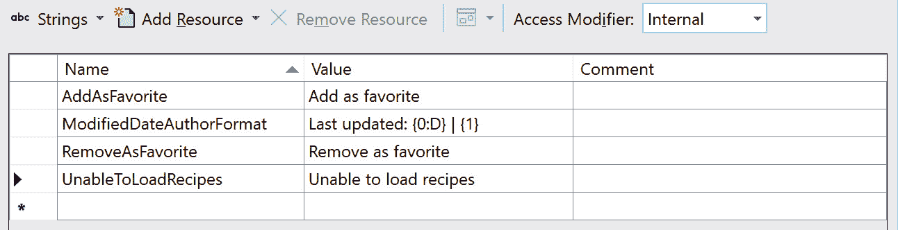
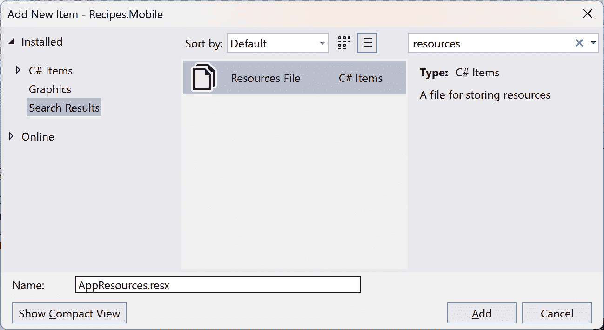
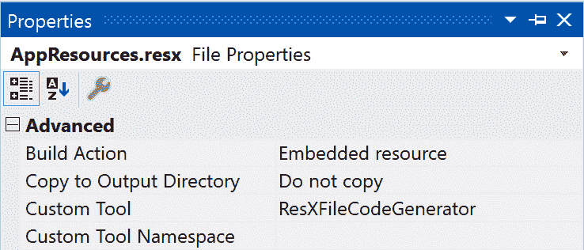
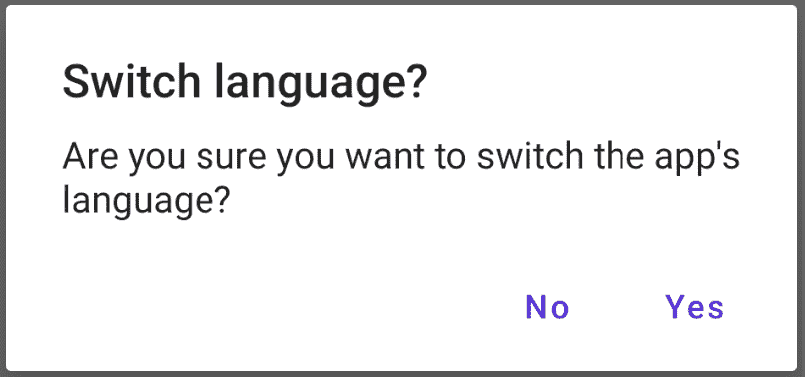
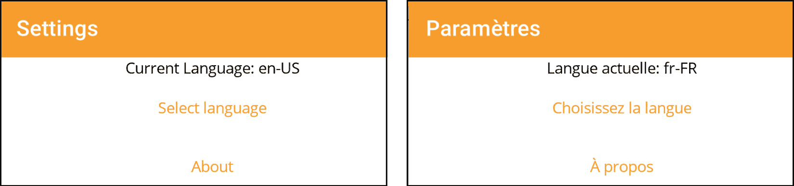

# 使用 MVVM 进行本地化

因此，我们已经构建了这个出色的*食谱*应用，我们对它的设计和功能感到非常满意。然而，目前这个应用完全是英文的。那么，来自世界各地的烹饪爱好者怎么办呢？答案是本地化，具体来说，就是将我们应用的所有方面都翻译出来，使其对全球用户更加易于访问和友好。

在本章中，我们将从 MVVM 的角度探讨本地化。我们将探讨如何将硬编码的`copy`标签从应用中翻译出来，同时也会探讨如何有效地从 API 中获取特定语言的数据。为了实现这一点，我们将深入研究以下主题：

+   与文化、资源文件和本地化一起工作

+   查看 MVVM 的本地化解决方案

+   使用自定义的`Translate`标记扩展

+   从 API 中获取本地化数据

在我们深入本章内容时，请记住，我们对本地化的探索也展示了具有 MVVM 原则的深思熟虑的应用设计。到结束时，我们不仅将拥有工具和知识来通过 UI 将我们应用的触角扩展到多元化的全球受众，我们还将看到正确的设计选择如何确保我们应用的每一层，包括我们展示的数据，都是协调和有序的。

# 技术要求

像往常一样，为了获得实际经验并跟上内容，请访问我们的 GitHub 仓库[`github.com/PacktPublishing/MVVM-pattern-.NET-MAUI/tree/main/Chapter12`](https://github.com/PacktPublishing/MVVM-pattern-.NET-MAUI/tree/main/Chapter12)。从`Start`文件夹中的代码开始，如果您需要一个全面的视角，您始终可以参考包含完善、章节末尾代码的`Finish`文件夹。

# 与文化、资源文件和本地化一起工作

在我们深入实际编码并探讨如何在 MVVM 中集成本地化之前，让我们确保我们对.NET MAUI 上下文中的“文化”一词有相同的理解。在这种情况下，“文化”指的是确定要使用的语言以及日期、时间、货币等项目显示格式的设置。

让我们从如何在.NET MAUI 中检索用户的“文化”开始。

## 获取用户的“文化”

`CultureInfo`类是.NET 中`System.Globalization`命名空间的一部分，它作为获取特定文化信息（如语言、国家、日期格式、数字格式等）的中心点。它还包含`CurrentCulture`和`CurrentUICulture`属性，可以用来获取或设置用户的当前文化以及“UI 文化。”

CurrentCulture 与 CurrentUICulture

`CurrentCulture`定义了数据类型（如日期、数字和货币）在应用程序中的格式化方式。这确保了数据的视觉和感觉与用户的文化背景相一致。另一方面，`CurrentUICulture`决定了 UI 元素和文本资源使用的语言。`CurrentCulture`决定*事物看起来如何*（格式化），而`CurrentUICulture`控制*使用哪种语言*（本地化）。

用户当前的文化设置可以通过以下代码行轻松获取：

```cs
var currentCulture = CultureInfo.CurrentCulture;
var currentUICulture = CultureInfo.CurrentUICulture;
```

这将获取设备的文化设置，这是用户在其系统设置中设置的。让我们看看我们如何设置不同的文化。

## 设置不同的文化

设置特定的文化就像将其分配给`CultureInfo`类上的相关属性一样简单：

```cs
var cultureInfo = new CultureInfo("fr-FR");
CultureInfo.CurrentCulture = cultureInfo;
CultureInfo.CurrentUICulture = cultureInfo;
CultureInfo.DefaultThreadCurrentCulture = cultureInfo;
CultureInfo.DefaultThreadCurrentUICulture = cultureInfo;
```

`DefaultThreadCurrentCulture`和`DefaultThreadCurrentUICulture`属性用于设置.NET 应用程序中所有线程的默认文化设置，包括你可能为各种任务启动的后台线程。

注意

为了简化并保持我们对本地化整体过程的关注，在本章中，除非明确提及，否则我们不会在`CurrentCulture`和`CurrentUICulture`之间做出区分。当我们谈论更新文化设置时，我们将更新`CurrentCulture`和`CurrentUICulture`，以及它们的`DefaultThread`对应物。

如果我们想，我们可以允许用户从支持的文化的列表中选择一个文化，并将其保存以供未来的会话使用。以下是一个使用`Microsoft.Maui.Storage.Preferences`存储所选文化的简化示例：

```cs
Preferences.Set("SelectedCulture", "fr-FR");
```

获取并分配之前存储的选定文化可以这样做：

```cs
var storedCulture = Preferences.Get("SelectedCulture", 
"en-US");
```

`Preferences`的`Get`方法接受第二个参数，用作当给定键不存在现有值时返回的默认值。我们现在可以使用的字符串值来实例化一个新的`CultureInfo`对象，然后我们可以使用它来设置应用程序的文化。看看这个例子：

```cs
var cultureInfo = new CultureInfo(storedCulture);
CultureInfo.CurrentCulture = cultureInfo;
```

如前所述，`CurrentCulture`属性定义了特定数据类型是如何显示的。那么，让我们快速看看我们指的是什么。

## 显示格式化数据

文化设置对数据类型（如日期和数字）在 UI 中显示时的格式化有直接影响。当你设置`CultureInfo.CurrentCulture`时，它也会影响数据绑定场景中的格式化。这意味着例如`DateTime`值将根据设置文化的格式规则显示。

假设我们在 ViewModel 中有一个`DateTime`属性：

```cs
public DateTime LastUpdated { get; set; } = new
DateTime(2020, 7, 3);
```

我们将此属性绑定到 XAML 中的`Label`：

```cs
<Label Text="{Binding LastUpdated}" />
```

由于我们没有指定数据应该如何格式化，`ToString` 方法将被调用在 `DateTime` 对象上，并且该结果将显示在屏幕上。`ToString` 方法将考虑当前的文化设置。因此，如果文化设置为美国英语（`en-US`），日期将格式化为 `7/3/2020 12:00:00 AM`，而如果文化设置为法语（`fr-FR`），日期将显示为 `03/07/2020 00:00:00`。

XAML 绑定表达式中的 `StringFormat` 属性允许我们为 `DateTime` 等数据类型定义自定义格式化。最棒的是，`StringFormat` 也会尊重当前的文化设置，因此这是一种将定制与本地化结合的绝佳方式。例如，我们可以在 XAML 中使用 `StringFormat` 来指定日期的显示方式：

```cs
<Label Text="{Binding LastUpdated, StringFormat='{0:MMMM d,
  yyyy}'}" />
```

在这个例子中，`StringFormat` 被设置为显示完整的月份名称、日期和完整的年份。在美国英语中，它将显示为 `July 3, 2020`，而当应用程序的文化设置为法语时，日期将自动调整为 `juillet 3, 2020`。`StringFormat` 中指定的格式保持一致，但日期和月份的实际字符串值将适应设置的文化。

同样的原则适用于数字格式化。不同的文化有不同的数字表示方式，尤其是在分隔千位和小数点时。通过注意文化设置，我们确保我们的应用程序以用户熟悉且易于理解的方式显示数字。

与 `CurrentCulture` 属性相反，`CurrentUICulture` 属性确定应用程序中使用的语言。因此，让我们看看如何通过资源文件来管理这一点。

## 资源文件是什么？

资源文件是 .NET 生态系统的一个核心功能，用于在广泛的应用程序类型之间促进本地化。通常以 `.resx` 扩展名命名，这些基于 XML 的文件允许你定义键值对，其中键代表应用程序中的特定文本或资产，值代表其本地化等效项。Visual Studio 还提供了 `.resx` 文件的编辑器，允许开发者轻松定义键及其值（*图 12**.1*）：



图 12.1：Visual Studio .resx 设计器

特别方便的是，当你创建 `.resx` 文件时，会自动生成一个强类型类。这个类允许我们以类型安全的方式以编程方式访问本地化资源，从而消除了在代码中手动查找资源键的需要。这个自动生成的类的名称是从 `resx` 文件本身的名称派生出来的。例如，如果资源文件命名为 `AppResources.resx`，则生成的类将命名为 `AppResources`。

通过给文件名添加后缀，我们可以指定特定资源文件属于哪种文化——例如，`AppResources.resx`是应用程序的默认文化（比如说英语），`AppResources.fr-FR.resx`是法语，`AppResources.es-ES.resx`是西班牙语，等等。

.NET MAUI 将查找与请求的值对应的设置文化对应的`.resx`文件。获取本地化字符串可以像这里所示那样进行：

```cs
var s1 = AppResources.
    ResourceManager.GetString("AddAsFavorite");
```

如果当前 UI 文化设置为法语（`fr-FR`），.NET MAUI 将自动在`AppResources.fr-FR.resx`文件中查找`AddAsFavorite`。如果不存在与当前 UI 文化匹配的资源文件，将使用默认文件（不带后缀的文件）。

或者，检索`AddAsFavorite`键的值也可以这样做：

```cs
var s2 = AppResources.AddAsFavorite;
```

对于`.resx`文件中的每个键，`AppResources`类将生成一个静态属性。这些属性使用`ResourceManager`的`GetString`方法检索相应的值。

注意

重要的是要注意，生成的类将仅基于默认资源文件。这意味着只为默认文件中的键生成属性。因此，在各个不同文化特定的文件中保持相同的键非常重要！如果当前 UI 文化的资源文件中不存在键的值，将导致异常！

让我们在我们的解决方案中添加一些资源文件：

1.  右键单击`Recipes.Mobile`项目中的`Resources`文件夹，然后选择`Strings`。

1.  右键单击此文件夹，然后选择**添加** | **新建项…**。

1.  在`resources`中，选择`AppResources.resx`作为名称（*图 12**.2*）：



图 12.2：创建新的资源文件

1.  在**属性**窗口中双检查新创建的文件属性。**构建操作**属性应设置为**嵌入资源**，**自定义工具**属性应设置为**ResXFileCodeGenerator**，如图*12**.3*所示：



图 12.3：AppResources.resx 文件的属性

1.  添加第二个`AppResources.fr-FR.resx`。请注意，只有默认资源文件的**自定义工具**属性设置为**ResXFileCodeGenerator**。其他资源文件将不会设置此属性，但它们的**构建操作**属性也必须设置为**嵌入资源**。

1.  在`Chapter 12/Resources`文件夹中，你会找到一个`AppResources.resx`文件和一个`AppResources.fr-FR.resx`文件，分别包含英语和法语资源。将它们复制到 Visual Studio 中的`Strings`文件夹，并覆盖你刚刚创建的文件。

在此基础上，让我们看看如何将这些值显示在屏幕上。

## 在屏幕上获取本地化资源

在其最简单形式中，我们可以使用 `x:Static` 标记扩展。此标记扩展用于从指定的类中引用静态字段或属性。如前所述，生成的 `AppResources` 类为 `x:Static` 标记扩展中的每个键都有一个静态属性来引用本地化值。让我们看看我们如何添加它：

1.  将以下代码添加到 `MauiProgram` 类的 `CreateMauiApp` 方法中：

    ```cs
    public static MauiApp CreateMauiApp()
    {
        var builder = MauiApp.CreateBuilder();
        ...
        var french = new CultureInfo("fr-FR");
        CultureInfo.CurrentCulture = french;
        CultureInfo.CurrentUICulture = french;
    ...
    }
    ```

    这将强制应用的文化设置为法语。

1.  前往 `AppShell.xaml` 并添加一个指向 `AppResources` 类命名空间的 XML 命名空间：

1.  接下来，更新第一个 `Tab` 元素的 `Title` 属性为以下内容：

    ```cs
    Title="{x:Static strings:AppResources.Tab1Title}"
    ```

    通过利用 `x:Static` 标记扩展，我们正在指向 `AppResources` 类的静态 `Tab1Title` 属性。

1.  第二个 `Tab` 元素的 `Title` 属性应指向 `Tab2Title` 属性，如下所示：

    ```cs
    Title="{x:Static strings:AppResources.Tab2Title}"
    ```

1.  最后，对于这个第一个例子，前往 `RecipeDetailPage` 并找到显示 `LastUpdated` 和 `Author` 属性的标签上的 `MultiBinding`。`x:Static` 标记扩展也可以用于绑定语句上的 `StringFormat` 属性，如下所示：

    ```cs
    <MultiBinding StringFormat="{x:Static
        strings:AppResources.ModifiedDateAuthorFormat}">
        <Binding Path="LastUpdated" />
        <Binding Path="Author" />
    </MultiBinding>
    ```

    值得注意的是，`ModifiedDateAuthorFormat` 包含一个表示长日期模式的 `D` 格式说明符。因此，日期的表示将根据所选文化而有所不同。例如，当 `CurrentCulture` 设置为法语 (`fr-FR`) 时，2020 年 7 月 3 日将显示为 `vendredi 3` `juillet 2020`。

如果我们现在运行应用，我们应该立即看到两个主要标签的标题现在已变为法语，如图 *12**.4* 所示：


图 12.4：本地化标签标题

当导航到 `RecipeDetailPage` 时，显示 `LastUpdated` 和 `Author` 属性的标签现在也已翻译。现在，前往 `CreateMauiApp` 方法并更改文化为 `nl-BE`。运行应用，你应该会看到英文的本地化标签。这是因为没有为这种文化提供资源文件，所以使用默认的。请注意，日期是根据荷兰（比利时）的格式进行格式化的：`vrijdag 3` `juli 2020`。

如前所述，这种方法是获取屏幕上本地化资源的最简单形式。这是一个完全有效的方法，但它不是非常 MVVM 友好，并且有其局限性：

+   最大的限制是 `x:Static` 无法响应变化。如果在运行时更改静态属性的值，UI 不会更新以反映新值。这使得它不适合本地化文本可能动态变化的情况，例如当用户在应用内切换语言时。只有当导航到新页面时，`x:Static` 标记扩展才会加载新选择的文化所需值。当导航（返回）到内存中的页面时，前一个文化的值仍然存在。

+   无法从我们的 ViewModel 中访问这些资源。如果我们想从 ViewModel 中显示对话框或警报，这可能会成为一个问题。

到目前为止，我们已经为理解.NET MAUI 中的本地化奠定了基本的基础，包括资源文件的作用、`CultureInfo`类和`x:Static`标记扩展。虽然我们迄今为止讨论的方法和概念构成了.NET MAUI 本地化的基本骨架，但我们的下一节将探讨如何无缝地将它们集成到 MVVM 中。最终，我们的目标是利用数据绑定将我们的 UI 连接到本地化值。这实现了动态更新：如果用户在运行时切换语言或文化，显示的文本将自动反映这些更改。

注意

在绑定语句上的属性，如`StringFormat`、`FallbackValue`和`TargetNullValue`，不是可绑定属性。这意味着将这些属性从资源文件中赋值的唯一方法是通过利用`x:Static`标记扩展，尽管它有其局限性。

# 查看 MVVM 的本地化解决方案

在本节中，我们将探讨一个不仅功能性强，而且与 MVVM 架构模式相得益彰的解决方案。无论您需要在本地的 ViewModel 中本地化文本，还是动态更新 UI 中的语言，这种方法都能满足您的需求。这是我多年来在众多项目中亲自实施过的解决方案。虽然我在过程中做了一些改进，但核心概念经受住了时间的考验，并在实际应用中证明了其有效性。

警告 – 文化设置是线程特定的

当允许用户在应用程序内切换文化时，我们应该警惕这样一个事实：在`async`操作中更新`CultureInfo`时，这些更改不会自动传播到父线程。需要设计一个考虑到这一点的本地化策略，以避免不一致性。

在本章的代码中，新增了两个项目：`Localization`和`Localization.Maui`。`Localization`项目的主要目标是提供一个与框架无关的方法来管理和访问本地化设置和资源。通过将本地化逻辑封装在其自己的项目中，我们促进了不同项目之间的代码共享，为在其他项目中打包和重用铺平了道路。

另一方面，`Localization.Maui`项目专门针对.NET MAUI 进行定制。它包含了存储和检索本地化信息的代码。将此逻辑与其他*Recipes!*应用程序代码分开，使我们能够确保它保持模块化和可重用性，适用于其他.NET MAUI 应用程序。让我们首先讨论`Localization`项目。

## 本地化项目

让我们来看看`Localization`项目中的`ILocalizationManager`接口：

```cs
public interface ILocalizationManager
{
    void RestorePreviousCulture(
        CultureInfo defaultCulture = null);
    void UpdateUserCulture(CultureInfo cultureInfo);
    CultureInfo GetUserCulture(
        CultureInfo defaultCulture = null);
}
```

`ILocalizationManager`接口定义了三种用于管理本地化设置的方法：

+   `RestorePreviousCulture`是一个可以用来恢复用户之前使用的文化的函数。可以使用`defaultCulture`参数指定一个回退文化，以防没有设置之前的文化。

+   `UpdateUserCulture`更新并存储当前用户的语言设置。`cultureInfo`参数指定了要使用的新文化。

+   `GetUserCulture`方法检索存储的文化设置。可以使用`defaultCulture`参数指定一个回退文化，以防没有设置文化。

此接口的主要目的是抽象与用户指定文化的持久化和检索相关的任务。在.NET MAUI 特定实现的背景下，例如，我们可能会选择将最近选择的`CultureInfo`保存在`Preferences`中，以确保在下次应用启动时可用，以便可以恢复。我们将在稍后深入了解这一特定方法。

`Localization`项目中的第二个接口是`ILocalizedResourcesProvider`接口。让我们看看它是什么样子：

```cs
public interface ILocalizedResourcesProvider
{
    string this[string key]
    {
        get;
    }
    void UpdateCulture(CultureInfo cultureInfo);
}
```

在其核心，此接口促进了与用户选择的`CultureInfo`相匹配的本地化字符串值的检索。它提供了一个只读索引器来获取与指定键对应的本地化字符串。此外，`UpdateCulture`方法允许您修改当前的`CultureInfo`，确保后续的本地化字符串检索反映了更新的文化上下文。

接下来，我们将探索`Localization`项目中`ILocalizedResourceProvider`接口的具体实现——即`LocalizedResourcesProvider`。让我们首先看看它的构造函数：

```cs
ResourceManager resourceManager;
CultureInfo currentCulture;
public static LocalizedResourcesProvider Instance
{
    get;
    private set;
}
public LocalizedResourcesProvider(
    ResourceManager resourceManager)
{
    this.resourceManager = resourceManager;
    currentCulture = CultureInfo.CurrentUICulture;
    Instance = this;
}
```

构造函数接受一个参数，`resourceManager`。这是需要用来检索本地化值的`ResourceManager`。`currentCulture`字段使用默认值初始化，即当前的 UI 文化。在构造函数中，当前实例被分配给静态的`Instance`属性。这允许我们通过静态属性访问此`LocalizedResourcesProvider`实现，这在数据绑定场景中将会很有用，正如我们稍后将会看到的。

注意

将当前`LocalizedResourcesProvider`实例分配给静态的`Instance`属性意味着在整个应用中只能有一个`LocalizedResourcesProvider`实现。虽然这是一个需要注意的限制，但它不应造成重大问题。

此类的索引器允许我们获取给定键的本地化字符串值。以下是其实施方式：

```cs
public string this[string key]
    => resourceManager.GetString(key, currentCulture)
    ?? key;
```

当键存在于我们的资源中时，该方法使用 `currentCulture` 获取相应的本地化字符串。然而，如果提供的键不匹配任何资源键，则键本身将作为后备返回。重要的是要注意，我们在调用 `GetString` 时明确传递了 `currentCulture`。这确保了 `resourceManager` 获取特定于提供的 `currentCulture` 的值，而不是默认使用当前执行线程的 `CultureInfo`。这种设计选择解决了由文化设置线程特定性引起的问题。

现在，让我们看看 `LocalizedResourcesProvider` 中的 `UpdateCulture` 方法：

```cs
public void UpdateCulture(CultureInfo cultureInfo)
{
    currentCulture = cultureInfo;
    OnPropertyChanged("Item");
}
```

此方法更新 `currentCulture` 字段。因此，任何后续对该类索引器的调用都将根据更新的 `currentCulture` 获取给定键的本地化字符串值。此外，该方法调用 `OnPropertyChanged` 方法，将 `Item` 作为其参数。在涉及数据绑定的场景中，这会提示重新评估所有与索引器链接的绑定。因此，任何绑定到此索引器的值都将刷新，返回更新后的 `CultureInfo` 的本地化字符串。让我们将注意力转向 `Localization.Maui` 项目。

## The Localization.Maui project

`Localization.Maui` 项目中的 `LocalizationManager` 类是 `ILocaliazationManager` 的一个实现。它依赖于 `ILocalizedResourcesProvider`，正如你在这里看到的：

```cs
readonly ILocalizedResourcesProvider _resourceProvider;
public LocalizationManager(
    ILocalizedResourcesProvider resoureProvider)
{
    _resourceProvider = resoureProvider;
}
```

通过拥有这个引用，我们可以在以后调用它的 `UpdateCulture` 方法，保持更新后的文化与 `ILocalizedResourcesProvider` 保持同步。

`LocalizationManager` 类也应该存储选定的 `CultureInfo`，以便在后续的应用程序启动时检索并恢复之前的 `CultureInfo`。以下代码块展示了 `UpdateUserCulture` 如何使用 `Preferences` API 存储给定的 `CultureInfo`，将更新后的值分配给 `currentCulture` 字段，更新 `CultureInfo` 对象上的静态属性，并调用 `ILocalizedResourcesProvider` 的 `UpdateCulture` 方法：

```cs
public void UpdateUserCulture(CultureInfo cultureInfo)
{
    Preferences.Default.Set("UserCulture",
        cultureInfo.Name);
    SetCulture(cultureInfo);
}
private void SetCulture(CultureInfo cultureInfo)
{
    currentCulture = cultureInfo;
    Application.Current.Dispatcher.Dispatch(() =>
    {
        CultureInfo.CurrentCulture = cultureInfo;
        CultureInfo.CurrentUICulture = cultureInfo;
        CultureInfo.DefaultThreadCurrentCulture =
            cultureInfo;
        CultureInfo.DefaultThreadCurrentUICulture =
            cultureInfo;
    });
    _resourceProvider.UpdateCulture(cultureInfo);
}
```

注意到对 `CultureInfo` 对象的更新是如何派发到主线程的。还记得关于 `CultureInfo` 与当前线程绑定的说明吗？我们想要确保主线程的 `CultureInfo` 被更新以保持一致性。未能将这些更改应用到主线程可能会导致使用过时或之前的 `CultureInfo` 进行数据绑定。这种不匹配可能导致在格式化数据时出现不准确，例如显示 `DateTime` 对象。

`GetUserCulture` 方法首先检查其 `currentCulture` 字段是否已设置。如果是，则直接返回该值。如果不是，该方法尝试根据 `Preferences` 中的 `UserCulture` 键检索文化。如果没有找到值，它将回退到提供的 `defaultCulture` 参数，或者在没有提供的情况下，使用当前系统文化。一旦确定，此文化将被分配给 `currentCulture` 字段，然后返回。请看以下内容：

```cs
public CultureInfo GetUserCulture(
    CultureInfo defaultCulture = null)
{
    if (currentCulture is null)
    {
        var culture = Preferences.Default.Get(
            "UserCulture", string.Empty);
        if (string.IsNullOrEmpty(culture))
        {
            currentCulture = defaultCulture
                ?? CultureInfo.CurrentCulture;
        }
        else
        {
            currentCulture = new CultureInfo(culture);
        }
    }
    return currentCulture;
}
```

最后，`RestorePreviousCulture` 方法使用 `GetUserCulture` 方法检索之前使用的文化，并将其传递给 `SetCulture` 方法，正如您在这里所看到的：

```cs
public void RestorePreviousCulture(
    CultureInfo defaultCulture = null)
    => SetCulture(GetUserCulture(defaultCulture));
```

当应用程序启动时，可以使用此方法将当前文化设置为用户之前选择的文化。

现在我们已经熟悉了这些类的角色和工作原理，让我们将它们集成到 *Recipes!* 应用程序中。这将使我们能够以补充 MVVM 架构模式的方式处理本地化。以下是一个分步指南：

1.  打开 `MauiProgram.cs` 并在 `CreateMauiApp` 方法中添加以下代码行：

    ```cs
    builder.Services.AddSingleton<ILocalizationManager,
      LocalizationManager>();
    ```

    此操作将 `LocalizationManager` 的一个实例注册到依赖注入容器中。

1.  创建 `LocalizedResourcesProvider` 的实例。将 `AppResources` 的 `ResourceManager` 传递给其构造函数，允许 `LocalizedResourceProvider` 访问在 `AppResources` 文件中定义的资源：

    ```cs
    var resources = new LocalizedResourcesProvider(
        AppResources.ResourceManager);
    ```

1.  让我们将此 `LocalizedResourcesProvider` 注册为 `Singleton` 到依赖注入容器中，如下所示：

    ```cs
    builder.Services
        .AddSingleton<ILocalizedResourcesProvider>(
        resources);
    ```

    通过这样做，我们确保在整个应用程序中只使用 `LocalizedResourcesProvider` 类的单个实例。每次通过依赖注入解析此实例时，它都保证与 `LocalizedResourcesProvider` 的静态 `Instance` 属性所引用的是同一个实例。这对于在应用程序中一致地访问本地化资源至关重要。

这为构建一个稳固的本地化解决方案奠定了基础，该解决方案可以用于我们的应用程序。让我们看看我们如何在应用程序中集成 `LocalizedResourcesProvider` 和 `LocalizationManager`。

## 使用 LocalizedResourcesProvider 和 LocalizationManager

让我们看看我们如何使用 `LocalizedResourcesProvider` 和 `LocalizationManager` 从 ViewModel 内部访问本地化资源。在 `SettingsPage` 上，用户可以通过 `PickLanguagePage` 选择新的语言。在选择语言时，应提示用户是否想要切换，当前语言下的提示。切换后，应以更新后的语言显示一个确认更新的警报。以下是我们可以这样做的方法：

1.  首先，让我们向 `SettingsViewModel` 添加以下两个字段：

    ```cs
    readonly ILocalizedResourcesProvider _resources;
    readonly ILocalizationManager _localizationManager;
    readonly IDialogService _dialogService
    ...
    public PickLanguageViewModel(
        INavigationService navigationService
        IDialogService dialogService,
        ILocalizedResourcesProvider resourcesProvider,
        ILocalizationManager localizationManager)
    {
        _dialogService = dialogService;
        _resources = resourcesProvider;
        _localizationManager = localizationManager;
        ...
    }
    ...
    ```

    依赖注入容器将自动将这些额外的依赖项注入到构造函数中。

1.  接下来，我们可以更新 `ConfirmSwitchLanguage` 方法如下：

    ```cs
    private Task<bool> ConfirmSwitchLanguage()
        => _dialogService.AskYesNo(
            _resources["SwitchLanguageDialogTitle"],
            _resources["SwitchLanguageDialogText"],
            _resources["YesDialogButton"],
            _resources["NoDialogButton"]);
    ```

    看看我们如何使用 `_resources` 字段来检索本地化字符串，然后将其传递给 `IDialogService` 的 `AskYesNo` 方法。键与 `AppResources` 文件中存在的键完全匹配。

1.  同样，我们也可以更新 `NotifySwitch` 方法，如下所示：

    ```cs
    private Task NotifySwitch()
        => _dialogService.Notify(
            _resources["LanguageSwitchedTitle"],
            _resources["LanguageSwitchedText"],
            _resources["OKDialogButton"]);
    ```

1.  最后，我们需要在 `SwitchLanguage` 方法中添加以下代码行：

    ```cs
    private void SwitchLanguage()
    {
        CurrentLanguage = newLanguage;
        _localizationManager
            .UpdateUserCulture(
            new CultureInfo(SelectedLanguage));
    }
    ```

    当用户确认切换到新语言时，将调用此方法。通过调用 `_localizationManager` 的 `UpdateUserCulture`，我们将持久化所选文化，更新 `CultureInfo` 属性，并通知 `ILocalizedResourcesProvider` 关于更新的文化。因此，后续对 `_resources` 字段的调用将检索更新后的 `CultureInfo` 的本地化值。

我们现在可以运行应用程序，转到 `SettingsPage`，然后点击到 `PickLanguagePage`，在那里我们可以更改应用程序的语言。一旦选择了新语言，我们将自动导航回 `SettingsPage`，在那里我们将以应用程序的当前语言收到提示（*图 12.5*）：



图 12.5：英语提示

确认后，语言将更新，我们将看到新语言中的警报（*图 12.6*）：


图 12.6：法语警报

我们可以在我们的 ViewModels 中切换文化，并检索当前设置文化的本地化字符串值，这已经非常令人兴奋了！但如果我们想让它们也更新到新选定的文化，我们如何在视图中处理本地化？让我们看看！

1.  转到 `SettingsPage.xml` 并添加以下 XML 命名空间：

    ```cs
    xmlns:localization="clr-namespace:
      Localization;assembly=Localization"
    ```

    此命名空间指向 `Localization` 项目的 `Localization` 命名空间。

1.  将 **选择语言** 按钮的 `Text` 属性更新为以下内容：

    ```cs
    Text="{Binding Path=[ChooseLanguage], Source={x:Static
    localization:LocalizedResourcesProvider.Instance}}"
    LocalizedResourcesProvider.Instance["ChooseLanguage"]
    ```

    正如我们在 `LocalizedResourcesProvider` 的实现中看到的，索引器接受提供的键，并使用配置的 `ResourceManager` 获取相应的本地化字符串。

1.  让我们同样更新 `LocalizedResourcesProvider` 的文本，如下所示：

    ```cs
    {Binding Path=[About], Source={x:Static
    localization:LocalizedResourcesProvider.Instance}}"
    ```

    同时，让我们也更新页面的标题：

    ```cs
    Title="{Binding Path=[SettingsTitle], Source={x:Static
    localization:LocalizedResourcesProvider.Instance}}"
    ```

1.  看一下显示当前选中语言的标签的 `Text` 属性：

    ```cs
    Text="{Binding CurrentLanguage, StringFormat=
      'Language: {0}'}"
    We’ve extracted the hardcoded `Language` part from the `StringFormat` property and defined two placeholders. By leveraging multi-binding, we can indicate the first placeholder should get the value associated with `Language` in the `AppResources`. The second placeholder is bound to the `CurrentLanguage` property on the ViewModel.Note that the `StringFormat` property starts with `{}`. Putting just `{0}: {1}` in there is not allowed, because the  `{` curly brace is a special character in XAML, often signaling the start of a markup extension. `{}` is an escape sequence to handle this.
    ```

实施这些更改后，再次运行应用程序。转到 `SettingsPage` 并选择不同的语言。在确认切换应用程序的语言后，您不仅应该看到更新的语言中的警报出现，而且应该看到 `SettingsPage` 上的标签立即更新（*图 12.7*）！



图 12.7：切换到法语之前（左）和之后（右）的设置页面

奇迹发生是因为我们的绑定针对的是`LocalizedResourcesProvider`类的索引器。因此，任何触发`PropertyChanged`事件（`Item`作为属性名）都会促使这些绑定重新评估。触发`PropertyChanged`事件是因为`LocalizationManager`在其`_resourceProvider`字段上调用`UpdateCulture`方法。

目前，所选的文化没有在应用程序启动之间持久化。更准确地说：所选的文化确实被存储了，但在应用程序启动时并没有被恢复。我们可以很容易地通过更新`App`类的构造函数来添加这个功能：

```cs
public App(INavigationInterceptor navigationInterceptor,
    ILocalizationManager manager)
{
    manager.RestorePreviousCulture();
...
}
```

通过在注入的`ILocalizationManager`接口上调用`RestorePreviousCulture`，正在恢复之前设置的 culture。这是在`App`类的构造函数中完成的，以便在应用程序的生命周期早期应用。

个人认为，这是一个美丽且非常 MVVM 友好的本地化解决方案；好吧，除了我们必须放置的相当复杂的数据绑定语句。在下一节中，我们将看到如何改进这一点。

# 使用自定义的 Translate 标记扩展

我们之前为我们的应用程序设置了一个本地化解决方案。虽然它非常有效，但数据绑定语句有点冗长，并且必须为每个字符串重复。在这个基础上，在本节中，我们将介绍一种简化的方法：一个专门为翻译设计的自定义标记扩展。

在我们继续之前，让我们简要回顾一下标记扩展是什么。**标记扩展**提供了一种在运行时计算或检索属性值的方法，而不是仅仅将它们设置为静态值。这种功能使它们在诸如资源查找、数据绑定或在我们的情况下简化翻译检索等任务中特别有用。

重要的是要注意，我们并没有改变我们利用数据绑定绑定到资源的方式。相反，我们只是使 XAML 代码更容易编写和阅读。实际的数据绑定过程保持不变。这就是`Translate`标记扩展在 XAML 中的基本样子：

```cs
Title="{mauiloc:Translate SettingsTitle}"
```

这与以下内容同义：

```cs
Title="{Binding Path=[SettingsTitle], Source={x:Static
  localization:LocalizedResourcesProvider.Instance},
    Mode=OneWay}"
```

`Translate`标记扩展是一个常规数据绑定语句的包装器。让我们看看`Localization.Maui`项目中的`TranslateExtension`类。这个类实现了泛型的`IMarkupExtension`接口，因此它需要实现以下方法：

```cs
object IMarkupExtension.ProvideValue(IServiceProvider
  serviceProvider);
T ProvideValue(IServiceProvider serviceProvider);
```

非泛型的`ProvideValue`方法将在运行时被调用，并且必须返回我们想要在 XAML 中使用的值。在这种情况下，我们想要返回一个`Binding`。以下是它的实现方式：

```cs
[ContentProperty(nameof(Key))]
public class TranslateExtension :
    IMarkupExtension<Binding>
{
    public string Key { get; set; }
    object IMarkupExtension.ProvideValue(
        IServiceProvider serviceProvider)
        => ProvideValue(serviceProvider);
    public Binding ProvideValue(
        IServiceProvider serviceProvider)
        => ...
}
```

非泛型的`ProvideValue`方法调用其泛型版本，该版本返回一个`Binding`。该类有一个名为`Key`的属性，它表示用于获取本地化值的键。这个`Key`属性可以在标记扩展中分配，如下所示：

```cs
Title="{mauiloc:Translate ContentProperty attribute applied to this class, we can omit the Key= segment, simplifying our markup extension’s use even more. ContentProperty specifies the default property that is to be used when no identifier is specified in XAML. Remember how we don’t need to explicitly state Path= in a data-binding statement and can simply write the path? This ContentProperty attribute is exactly what drives that! Let’s finally see what the generic ProvideValue method returns:

```

public Binding ProvideValue(

IServiceProvider serviceProvider)

=> new Binding

{

Mode = BindingMode.OneWay,

Path = $"[{Key}]",

Source = LocalizedResourcesProvider.Instance

};

```cs

 The `ProvideValue` method returns a `Binding` object. Its `Source` value is set to the static `Instance` property of `LocalizedResourcesProvider`, equivalent to this:

```

{x:Static localization:LocalizedResourcesProvider.Instance}

```cs

 For the `Path` property, when the `Key` value is `SettingsTitle`, it translates to `Path=[SettingsTitle]`. The `Binding`’s `Mode` is set to `OneWay` to ensure it listens for the `PropertyChanged` event and updates the bound value when needed.
The `Translate` markup extension provides a convenient way to define the exact same binding statements we had earlier. Let’s go ahead and update some of our Views so that they leverage this `Translate` markup extension:

1.  Go to `SettingsPage` and add the following XML namespace, which points to the `Localization.Maui` namespace of the `Localization.Maui` project:

    ```

    xmlns:mauiloc="clr-namespace:Localization.Maui;

    assembly=Localization.Maui"

    ```cs

     2.  Update the binding statements on the `SettingsPage`, as shown here:

    ```

    ...

    Title="{mauiloc:Translate SettingsTitle}"

    ...

    Text="{mauiloc:Translate ChooseLanguage}"

    ...

    Text="{mauiloc:Translate About}"

    ...

    ```cs

     3.  In `AppShell.xaml`, add the same XML namespace that we previously added to `SettingsPage` in *step 1*.
4.  Now, update the binding statements on `AppShell.xaml`, as shown in the following snippet:

    ```

    <Tab Title="{mauiloc:Translate Tab1Title}">

    ...

    </Tab>

    <Tab Title="{mauiloc:Translate Tab2Title}">

    ...

    </Tab>

    ```cs

The `Translate` markup extension offers an elegant approach to what is typically considered a complex task. Everywhere hardcoded text is used, we can very simply replace it with this `TranslateExtension`. Note that the `TranslateExtension` can still be improved: all the typical data-binding properties such as `Converter`, `ConverterParameter`, and so on can be added to this class as well and be used in the `Binding` object that is being returned.
Now that we know how to localize hardcoded `copy` labels, let’s have a look at how we can fetch localized data from APIs.
Fetching localized data from APIs
Before we wrap up this chapter, let’s have a quick look at how we could pass the user’s language to the API so that it can return localized data. One approach is to include a language parameter in every service and repository method, allowing the ViewModel to pass the user’s current language. However, I believe adding such parameters can clutter the code. A cleaner alternative is to handle this within the repositories. Let’s see how:

1.  First, let’s update the `IRecipeAPI` interface by adding a `language` parameter of type `string` to the `GetRecipes` method. The following snippet shows how we can configure Refit to pass this additional parameter as an `Accept-Language` request header when executing the API call:

    ```

    Task<ApiResponse<RecipeOverviewItemsDto>>

    GetRecipes([Header("Accept-Language")] string

    Header 属性，但我认为这种方法更简洁。

    ```cs

     2.  It’s the `RecipeApiGateway` class that invokes the updated `GetRecipes` method. In order for it to access the current culture, let’s inject an instance of the `ILocalizationManager`, as shown here:

    ```

    readonly ILocalizationManager _localizationManager;

    ...

    public RecipeApiGateway(IRecipeApi api,

    ILocalizationManager localizationManager)

    {

    _api = api;

    _localizationManager = localizationManager;

    }

    ```cs

     3.  The next code block shows how we can now use the `_localizationManager` field to access the current user culture and pass its `Name` property to the `GetRecipes` method:

    ```

    public Task<Result<LoadRecipesResponse>>

    LoadRecipes(int pageSize, int page)

    => InvokeAndMap(_api.GetRecipes(

    _localizationManager.GetUserCulture().Name,

    pageSize, page), MapRecipesOverview);

    ```cs

    While directly using `CultureInfo.CurrentCulture.Name` might seem straightforward, accessing the culture via our `ILocalizationManager` ensures greater consistency, as mentioned earlier.

     4.  Accessing the `Accept-Language` that’s now being sent with this API call can be achieved by updating the `GetRecipes` endpoint in the `Program.cs` file inside the `Recipes.Web.Api` project. Here’s what the updated code looks like:

    ```

    app.MapGet("/recipes", (int pageSize, int pageIndex,

    [FromHeader(Name = "Accept-Language")] string

    language) =>

    {

    //使用语言来检索菜谱

    return new RecipeService()

    .LoadRecipes(pageSize, pageIndex);

    })

    .WithName("GetRecipes")

    .WithOpenApi();

    ```cs

In contrast to the data-bound values on the screen, changing the app’s language won’t automatically fetch any localized data coming from the API anew. So, how can we tackle this? In *Chapter 7*, *Dependency Injection, Services, and Messaging*, we already discussed thoroughly how ViewModels can communicate with each other in a loosely coupled manner through `Messaging`. `Messaging` offers a solution to this challenge: `SettingsViewModel` can send a message notifying other ViewModels about the updated language. ViewModels can react to this and re-fetch their data. Let’s implement this:

1.  Add a new class called `CultureChangedMessage` to the `Messages` folder of the `Recipes.Client.Core` project. Here’s what it looks like:

    ```

    public class CultureChangedMessage :

    ValueChangedMessage<CultureInfo>

    {

    public CultureChangedMessage(CultureInfo value) :

    base(value)

    { }

    }

    ```cs

     2.  Update the `SwitchLanguage` method on `SettingsViewModel`, as shown here:

    ```

    private void SwitchLanguage(string newLanguage)

    {

    CurrentLanguage = newLanguage;

    var newCulture = new CultureInfo(newLanguage);

    _localizationManager

    .UpdateUserCulture(newCulture);

    WeakReferenceMessenger.Default.Send(

    new CultureChangedMessage(newCulture));

    }

    ```cs

     3.  Finally, in the constructor of the `RecipesOverviewViewModel`, we can add the following code that listens for the `CultureChangedMessage` to arrive so that we can reload the list of recipes:

    ```

    WeakReferenceMessenger.Default

    .Register<CultureChangedMessage>(this, (r, m) =>

    {

    Recipes.Clear();

    (r as RecipesOverviewViewModel).LoadRecipes(7, 0);

    });

    ```cs

    We don’t need to bother with passing the updated culture or language around. Once the message is received, the `LocalizationManager` is already updated to the selected culture and will return the newly selected culture. This ensures that any new recipe fetch will use the updated culture.

When running the app and changing the language on the `SettingsPage`, the `RecipesOverviewViewModel` will reload its recipes. If you debug and set a breakpoint in the API, you’ll observe that the language parameter consistently matches the newly selected language.
Summary
We kicked off this chapter with an introduction to localization, understanding its importance in ensuring our app resonates with users globally. Before diving deep, we explored the basics of how localizable values can be statically bound, offering a foundational approach.
Building on this, we introduced a more dynamic localization framework. This allowed for more flexible updates and interactions. Following this, we delved into simplifying our XAML through the `Translate` markup extension. While it made our data-binding statements sleeker, the underlying mechanism remained unchanged.
Next, we discussed getting localized data from our APIs. We found a neat way to tell the API about the user’s language choice without making our code messy. By using the `ILocalizationManager`, we kept our approach consistent. And, with `Messaging`, our app knows when to fetch new data if a user changes their language.
The big takeaway? All our steps respected the key MVVM idea of “separation of concerns.” Each part of our app has its job, making things organized and easier to manage.
Note
Be aware that what we’ve seen throughout this chapter doesn’t completely cover everything there is to localizing your apps, such as localizing the app’s name or localizing images. Take a look at [`learn.microsoft.com/dotnet/maui/fundamentals/localization`](https://learn.microsoft.com/dotnet/maui/fundamentals/localization) to find out more!
As we wrap up this chapter, we’ve truly come a long way in building the *Recipes!* app, while adhering to the MVVM principles. But, of course, no app development journey is complete without ensuring its robustness. And that’s where the next chapter comes in. We’ll dive into how MVVM isn’t just about structuring our app effectively, but also about setting the stage for thorough and effective unit testing.
Further reading
To learn more about the topics that were covered in this chapter, take a look at the following resources:

*   The `ResourceManager` class: [`learn.microsoft.com/dotnet/api/system.resources.resourcemanager?view=net-8.0`](https://learn.microsoft.com/dotnet/api/system.resources.resourcemanager?view=net-8.0)
*   *XAML markup* *extensions*: [`learn.microsoft.com/dotnet/maui/xaml/fundamentals/markup-extensions`](https://learn.microsoft.com/dotnet/maui/xaml/fundamentals/markup-extensions)
*   *Create XAML markup* *extensions*: [`learn.microsoft.com/dotnet/maui/xaml/markup-extensions/create`](https://learn.microsoft.com/dotnet/maui/xaml/markup-extensions/create)

```
