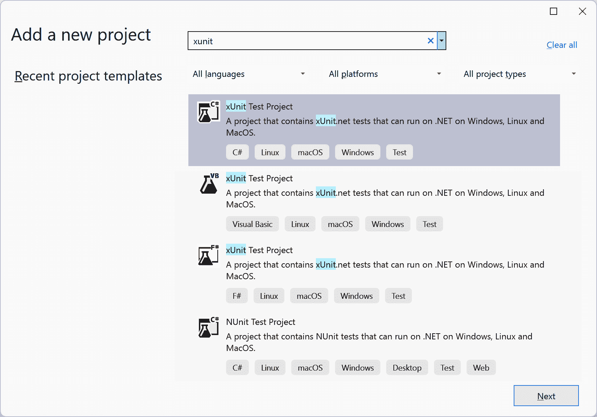
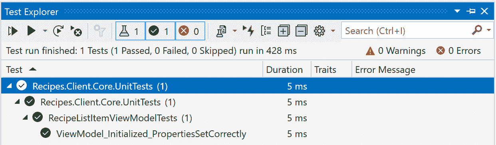
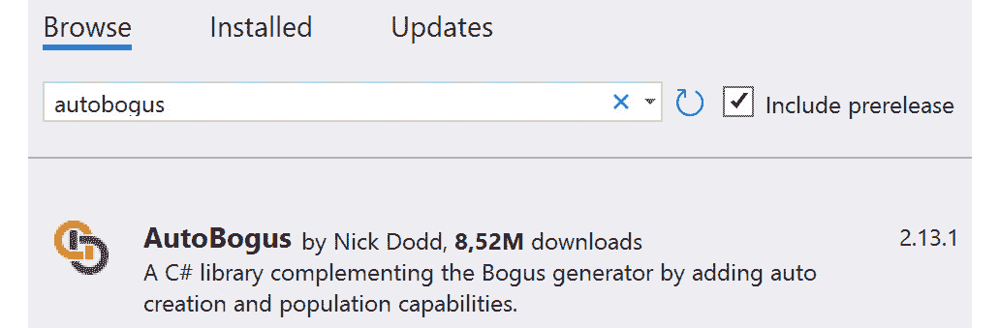

# 13

# 单元测试

让我们深入探讨一个关键点：**单元测试**。把它想象成你的安全网。这不仅仅是知道你的应用程序现在运行顺畅，而是确保在每次调整、更新或彻底改造后，你的应用程序都能平稳运行，没有故障或意外惊喜。回归 bug？我们正在关注你！使用 MVVM 和正确的测试实践，我们可以有效地防范这些潜在问题。

在本章中，我们将解决以下问题：

+   单元测试的重要性

+   设置单元测试项目

+   使用 Bogus 生成数据

+   使用 Moq 模拟依赖

+   测试 MAUI 特定的代码

虽然我们不会深入细节（毕竟，根据你使用的工具，复杂性可能会有很大差异），但我将使用我熟悉的工具集来引导你：**xUnit**、**Bogus**、**AutoBogus**和**Moq**。这些是我的首选构建块，但让我们记住：.NET 生态系统庞大而灵活。还有许多其他出色的框架和库，例如**NUnit**、**AutoFixture**、**NSubstitute**等。我们涵盖的原则将大致保持不变；这只是哪个工具与你的工作流程相协调的问题。最终，一切都关乎个人喜好。

到本章结束时，你应该坚信单元测试带来的巨大价值。此外，你将清楚地了解如何有效地使用工具和技术来编写单元测试。

# 技术要求

为了确保你与即将到来的内容保持同步，请访问我们的 GitHub 仓库：[`github.com/PacktPublishing/MVVM-pattern-.NET-MAUI/tree/main/Chapter13`](https://github.com/PacktPublishing/MVVM-pattern-.NET-MAUI/tree/main/Chapter13)。从`Start`文件夹中的材料开始。记住——如果你需要综合参考，`Finish`文件夹在章节结束时包含了最终、精炼的代码。

# 单元测试的重要性

我通过艰难的方式学到的教训永远改变了我对软件开发的态度：**永远不要低估**单元测试。

几年前，我曾是制作一款雄心勃勃的应用程序的专业团队的一员。我们在 C#和平台方面的专业知识无可否认。然而，我们忽视了单元测试，将我们的信任寄托在手动测试和我们的**质量保证**（**QA**）团队上。最终产品得到了高度认可和赞扬，但过程是动荡的。QA 的反馈经常揭示 bug，使得每次代码调整都感觉风险重重。

接近截止日期意味着失眠的夜晚、匆忙的 bug 修复以及即将到来的回归恐惧。项目完成后，我与不同背景的开发者合作，遇到了一位对**测试驱动开发**（**TDD**）投入极大的同事。这真是一个真正的启发，不仅对单元测试的本质，也对我们之前设计选择中的缺陷有了深刻的认识。

我的单元测试之旅

+   **效率**：不再需要在手动验证之前进行长期部署。单元测试迅速验证我的代码，简化了开发过程。

+   **质量和信心**：随着每个测试的进行，软件的质量提高，我的信心也随之增强。它成为了一个安全网，允许探索性编码而不必担心意外的后果。

+   **防止回归**：单元测试确保更改不会无意中破坏现有功能。

随着时间的推移，我也观察到单元测试充当着不断演变的文档。新团队成员可以从这些测试中确定预期的行为和逻辑，从而加快集成并增强代码修改的信心。

我和我的老队友们时不时还会聚在一起。我们谈论过去的日子和共同的经历。在我们的对话中，一个共同的认知脱颖而出：在我们共同度过的时光里，我们每个人都在各自的项目中成熟起来。这往往导致我们进行相互反思：如果我们多年前在那个项目中就采用了单元测试，我们的工作可能会更加顺利。请别误会；我们的客户对我们交付的成果感到满意。但对我们所有人来说，从个人层面来看，从一开始就有测试可能会节省许多压力之夜、健康问题和不确定性。

虽然单元测试在许多开发者圈子中受到赞誉，但我仍然目睹了犹豫不决，尤其是在.NET 世界的某些部分。我的倡导并不是为了达到一个覆盖率指标或 TDD 狂热。它是为了认识到单元测试的好处，从确保代码可靠性到提升团队士气。

单元测试不是关于达到一个抽象的完美概念。它是关于拥有一个安全网，允许进行代码杂技表演而不必担心出错。我是否为每一行代码都编写了测试？坦白说：不是。我的所有代码都容易测试吗？并不总是。但我编写的测试确实很有帮助。它们让我快速知道事情是否正常工作，是否破坏了某些东西，或者是否正确地修复了一个错误。这让我对自己的工作充满信心。当报告错误时，我首先做的事情就是编写一个失败的测试，暴露这个错误。然后我可以继续处理这个错误，一旦测试通过，我就知道我已经修复了它。而且，不仅错误现在已经被修复，而且由于额外的测试（或测试），代码变得更加健壮，并得到了对未来回归的保护。

在我们这个快节奏的世界中，软件持续发展，单元测试不仅是一种最佳实践，更是一条生命线。它带来的安心感是无与伦比的，确保软件不仅能够运行，而且能够抵御不可避免的变化。

对于刚开始开发者旅程或重新评估单元测试的人来说：不要模仿我最初的疏忽。将测试看作是一项任务，而不是一个可靠的伙伴。

话虽如此，是时候从“为什么”转向“如何”了。对于那些仍然和我在一起的人，让我们深入了解细节：为 ViewModel 设置单元测试。相信我，这比看起来简单得多！

# 设置单元测试项目

在本节中，我们将逐步介绍设置单元测试项目并创建第一个测试的步骤。我们将在本节中使用 xUnit。我们不会深入探讨这个特定库的细节，因为还有许多其他出色的库。无论你选择哪个，重要的收获都应该记住。所以，无需多言，让我们开始设置有效的 ViewModel 测试的舞台！

## 创建单元测试项目

让我们先创建一个 xUnit 测试项目。在 xUnit 中，我欣赏的一点是它的简单性。测试类和方法只是普通的类和方法，无需特殊基类或复杂的设置。以下是步骤：

1.  在 **Visual Studio** 的 **解决方案资源管理器** 中，右键单击 **“Recipes App” 解决方案**，然后选择 **添加** | **新建项目…**。

1.  在搜索框中输入 `xunit` 并从列表中选择 **xUnit 测试项目** (*图 13.1*)：



图 13.1：创建新的 xUnit 测试项目

1.  将 `Recipes.Client.Core.UnitTests` 作为项目名称。点击 **下一步**。

1.  当提示时，从 **框架** 列表中选择 **.NET 8.0 (长期支持**)，然后点击 **创建** 按钮。

1.  一旦项目生成，右键单击它，从列表中选择 `Recipes.Client.Core` 项目。

在项目及其对 `Recipes.Client.Core` 项目的引用就绪后，我们可以开始编写我们的单元测试。让我们继续编写我们的第一个测试！

## 创建单元测试

让我们先从测试一些相对简单的事情开始：测试 `RecipeListItemViewModel` 的初始化。以下是步骤：

1.  删除生成的 `UnitTest1.cs` 文件。

1.  将一个名为 `RecipeListItemViewModelTests` 的新 C# 类添加到项目中。

1.  将类设置为公共的，并添加一个名为 `ViewModel_Initialized_PropertiesSetCorrectly` 的公共方法，如下面的代码片段所示：

    ```cs
    [Fact]
    public void
      ViewModel_Initialized_PropertiesSetCorrectly()
    {
    }
    ```

    注意如何将 `Fact` 属性添加到这个方法中。这个属性表示这是一个测试方法。如果没有它，这个方法就不会被识别为测试方法，因此在测试运行期间也不会作为测试方法执行。

1.  将以下代码添加到这个方法中：

    ```cs
    //Arrange
    string id = "id1";
    string title = "title1";
    bool isFavorite = false;
    string image = "image1";
    //Act
    var sut = new RecipeListItemViewModel(id, title,
        isFavorite, image);
    //Assert
    Assert.Equal(id, sut.Id);
    Assert.Equal(title, sut.Title);
    Assert.Equal(isFavorite, sut.IsFavorite);
    Assert.Equal(image, sut.Image);
    ```

这将创建并验证一个 `RecipeListItemViewModel` 实例。此代码块首先使用示例数据创建 `RecipeListItemViewModel` 类的实例。然后调用一系列断言以确认对象的属性已按预期初始化。

在单元测试术语中，我们实例化的对象被称为 `sut`，代表 **系统测试对象**。这是一个在单元测试中常用的名称。

最后，值得特别注意的是，xUnit 框架固有的 `Assert` 语句的作用。`Assert` 方法在验证对象状态以确保它们符合我们的预期中起着关键作用。`Assert.True`、`Assert.Empty`、`Assert.Contains` 以及更多方法都在我们的掌握之中。正如本例所示，`Assert.Equal` 方法评估预期值是否与对象的实际值匹配。在这种情况下，它确保我们的 `sut` 对象的属性，如 `Id`、`Title`、`IsFavorite` 和 `Image`，被初始化为预期值。

在前面的代码片段中，你可能注意到了清晰的架构，这是由注释引导的：`//Arrange`、`//Act` 和 `//Assert`。这对应于单元测试中的一个基本模式，称为 **Arrange-Act-Assert**（**AAA**）。让我们简要地探讨一下每个阶段的意义：

+   `Arrange`: 这个阶段涉及为测试设置任何先决条件。我们确定测试运行的条件。这可能包括初始化变量、创建模拟对象或设置资源。在我们的例子中，这是定义我们的样本数据的地方：`id`、`title`、`isFavorite` 和 `image`。

+   `Act`: 在这里，我们执行我们打算测试的操作。这是 `sut` 对象被调用的地方，通常是一个单一的操作。在我们的上下文中，这是使用我们安排的样本数据实例化 `RecipeListItemViewModel`。

+   `Assert`: 这个最终阶段是通过检查结果与预期结果是否一致来验证测试是否通过或失败。在我们的例子中，这是通过使用 `Assert.Equal` 方法来确保我们的 `RecipeListItemViewModel` 对象的属性与我们初始化它们的值相匹配来完成的。

遵循 AAA 模式可以确保测试是有组织和可读的，这使得你或任何审查你代码的人更容易理解每个测试的目的和行为。

现在运行测试吧！这可以通过在要测试的测试方法内部右键单击并选择 **运行测试** 来完成。或者，你可以选择 **调试测试**，这将运行你的测试并在你添加的任何断点处中断，允许你逐步执行单元测试。测试方法在 **Visual Studio** 的 **测试资源管理器** 中也是可见的。从那里，你可以轻松地运行多个测试。此面板还显示了你的测试的当前状态：哪些成功运行，哪些失败，以及其他相关信息，如图 *图 13.2* 所示：



图 13.2：Visual Studio 的测试资源管理器

让我们添加一些更多的测试！`RecipeListItemViewModel`的每个实例都应该监听`FavoriteUpdateMessage`，当这样的消息到达时，它的`IsFavorite`属性应该相应更新。所以，首先，让我们编写一个测试来验证新实例化的`RecipeListItemViewModel`已注册为`FavoriteUpdateMessage`消息的接收者。其次，在单独的测试中，我们可以检查类是否对这样的消息做出预期的反应：

1.  让我们从向`RecipeListItemViewModelTests`类添加以下测试开始：

    ```cs
    [Fact]
    public void
      VM_Initialized_SubscribedToFavoriteUpdateMessage()
    {
        //Arrange, Act
        var sut = new RecipeListItemViewModel(
            "id", "title", true, "image");
        //Assert
        Assert.True(WeakReferenceMessenger.Default
            .IsRegistered<FavoriteUpdateMessage>(sut));
    }
    ```

    `WeakReferenceMessenger.Default.IsRegistered`方法允许我们检查特定对象是否已注册接收特定消息。我们期望我们的`sut`已注册接收`FavoriteUpdateMessage`，因此我们可以调用此方法，并使用`Assert.True`验证结果为真。

1.  我们还应该验证，当`sut`接收到`FavoriteUpdateMessage`时，`IsFavorite`属性会相应更新——当然，前提是消息发送的 id 与`sut`的 id 匹配。看看这里：

    ```cs
    [Fact]
    public void
      FavoriteUpdateMsgReceived_SameId_FavoriteUpdated()
    {
        //Arrange
        var id = "id";
        var originalValue = false;
        var updateToValue= !originalValue;
        var sut = new RecipeListItemViewModel(
            "someid", "title", originalValue, "image");
        //Act
        WeakReferenceMessenger.Default.Send(
            new FavoriteUpdateMessage(
                id, updatedFavorite));
        //Assert
        Assert.Equal(updatedFavorite, sut.IsFavorite);
    }
    ```

    `FavoriteUpdateMessage`发送用于实例化`sut`的`originalValue`值的逆值。在发送包含与`sut`相同的`RecipeId`的消息后，我们可以检查`IsFavorite`属性的值是否等于我们发送的值。

1.  作为最后的测试，我们可能想要验证`RecipeListItemViewModel`不会对具有不同`RecipeId`的`FavoriteMessage`做出反应。这和之前的测试非常相似，正如你在这里看到的：

    ```cs
    [Fact]
    public void FavoriteUpdateMsgReceived_DifferentId
      _FavoriteNotUpdated()
    {
        //Arrange
        var originalValue = false;
        var updateToValue= !originalValue;
        var sut = new RecipeListItemViewModel(
            "someid", "title", originalValue, "image");
        //Act
        WeakReferenceMessenger.Default.Send(
            new FavoriteUpdateMessage(
                "otherid", updatedFavorite));
        //Assert
        Assert.Equal(originalValue, sut.IsFavorite);
    }
    ```

    因为消息发送的`RecipeId`与`RecipeListItemViewModel`上的 ID 不同，我们想要验证`sut`上的`IsFavorite`属性仍然与最初设置的值相同。

单元测试中的“单元”

当我们谈论*单元测试*时，那个*单元*部分至关重要。这全部关于保持事物小而专注。看看我们刚刚创建的测试。第一个确保 ViewModel 已注册接收传入的`FavoriteUpdateMessage`，而另一个则检查 ViewModel 如何响应传入的消息。当然——后者间接验证了消息监听器，但这并不意味着我们可以跳过第一个测试。每个*单元*测试都应该专注于检查拼图中的一小部分，以确保每个部分都按预期工作。

在第一个测试通过后，让我们看看如何使它们更具数据驱动性。

## 查看数据驱动测试

将第三个参数设为`false`。现在，如果我们从`RecipeListItemViewModel`类的构造函数中移除`IsFavorite = isFavorite;`，我们的测试仍然会欺骗性地通过——这是一个测试中的假阳性经典例子。这是因为，出于巧合，`IsFavorite`的默认值是`false`，但实际上，它从未被分配我们作为参数传递的值。我们可以创建另一个具有不同值的`Theory`和`InlineData`属性的其他测试方法，以利用数据驱动测试。

在 xUnit 中，虽然`Fact`属性表示一个简单的单元测试，它只运行一次，但还有一个强大的功能：`Theory`属性。与`InlineData`属性结合使用，`Theory`允许我们创建参数化测试。这意味着我们可以用不同的输入值运行相同的测试逻辑，确保我们的代码能够应对各种场景，而无需重复测试方法。让我们深入探讨并重构我们之前的测试，以利用这一功能：

1.  修改`ViewModel_Initialized_PropertiesSetCorrectly`方法，包括以下参数：

    ```cs
    public void
      ViewModel_Initialized_PropertiesSetCorrectly(
        string id, string title, bool isFavorite,
    Arrange phase and use the provided parameters directly to instantiate our ViewModel:

    ```

    //Arrange, Act

    var sut = new RecipeListItemViewModel(id, title,

    isFavorite, image);

    //Assert

    Assert.Equal(id, sut.Id);

    Assert.Equal(title, sut.Title);

    Assert.Equal(isFavorite, sut.IsFavorite);

    Assert.Equal(image, sut.Image);

    ```cs

    ```

1.  现在我们从这个方法中移除`Fact`属性，并添加一个`Theory`属性和一些`InlineData`属性：

    ```cs
    [Theory]
    [InlineData("id1", "title1", false, "image1")]
    [InlineData("id2", "title2", true, "image2")]
    [InlineData("foo", "bar", true, null)]
    [InlineData(null, null, false, null)]
    ```

`Theory`属性用于标记一个测试方法为数据驱动测试。这意味着测试方法将为使用`InlineData`属性指定的每组数据值执行一次。每个测试运行的测试都将访问由`InlineData`提供的值。当`Theory`方法执行时，xUnit 将为`InlineData`属性中指定的每组数据值创建测试类的新的实例，然后使用这些数据值执行测试方法。`InlineData`属性中提供的值应与正在测试的方法上的参数数量和类型完全匹配。

这是我们将`FavoriteUpdateMsgReceived_SameId_FavoriteUpdated`方法更新为数据驱动测试方法的示例：

```cs
[Theory]
[InlineData(true, false)]
[InlineData(false, true)]
[InlineData(true, true)]
[InlineData(false, false)]
public void
    FavoriteUpdateMsgReceived_SameId_FavoriteUpdated(
    bool originalValue, bool updateToValue)
{
    //Arrange
    var id = "id";
    var sut = new RecipeListItemViewModel(
        id, "title", originalValue, "image");
    //Act
    WeakReferenceMessenger.Default.Send(
        new FavoriteUpdateMessage(id, updateToValue));
    //Assert
    Assert.Equal(updateToValue, sut.IsFavorite);
}
```

`FavoriteUpdateMsgReceived_DifferentId_FavoriteNotUpdated`可以像下面这样更新：

```cs
[Theory]
[InlineData(true, false)]
[InlineData(false, true)]
[InlineData(true, true)]
[InlineData(false, false)]
public void FavoriteUpdateMsgReceived_
  DifferentId_FavoriteNotUpdated(
bool originalValue, bool updateToValue)
{
    //Arrange
    var sut = new RecipeListItemViewModel(
        "someid", "title", originalValue, "image");
    //Act
    WeakReferenceMessenger.Default.Send(
        new FavoriteUpdateMessage(
        "otherid", updateToValue));
    //Assert
    Assert.Equal(originalValue, sut.IsFavorite);
}
```

通过采用`Theory`和`InlineData`属性，我们显著增强了我们的测试能力。这些更新的测试方法现在可以验证一系列不同的值，确保我们的 ViewModel 在多种场景下表现一致。这是一种优雅的方式来增加测试覆盖率，而无需添加冗余代码。

有时，让我们自动生成测试数据是有益的，尤其是当我们更关注逻辑而不是具体值时。这正是 Bogus 和 AutoBogus 等工具发挥作用的地方，它们帮助我们无需手动干预就能轻松生成各种测试值。让我们看看吧！

# 使用 Bogus 生成数据

虽然在单元测试中手动选择数据有其位置，但它往往带有固有的偏见：因为我们已经编写了我们想要测试的功能，所以我们对于使用的值的格式有一定的期望。为了对抗这种偏见，许多测试受益于随机化或生成数据，特别是当具体输入不如结果重要时。Bogus 是一个针对那些需要可靠、无偏见的测试数据而不需要手动劳动的时刻的强大工具。

在本节中，我们将介绍 Bogus 和 AutoBogus，并探索其一些基本功能。然而，值得注意的是，我们在这里只是触及了表面。这些工具提供了许多功能，但为了简洁和专注，我们将保持讨论的高级性，仅涉及一些基本用例。

首先，让我们将 AutoBogus（以及因此也包含 Bogus）添加到我们的项目中：

1.  在 `Recipes.Client.Core.UnitTests` 项目中，选择 **Manage** **NuGet Packages…**。

1.  在 `autobogus` 中安装并选择 **Manage** **NuGet Packages…**。



图 13.3：AutoBogus NuGet 包

现在我们已经安装了这些包，让我们通过测试 `EmptyOrWithinRangeAttribute` 类来将这个库付诸实践：

1.  创建一个名为 `EmptyOrWithinRangeAttributeTests` 的新类。

1.  将以下成员变量放入新类中：

    ```cs
    const int MinValueStart = 5;
    const int MinValueEnd = 10;
    const int MaxValueStart = 11;
    const int MaxValueEnd = 15;
    readonly EmptyOrWithinRangeAttribute sut;
    ```

    在这个类中，我们将把我们的 `sut` 对象作为类成员。这允许我们在构造函数（或内联）中一次性编写 `sut` 对象的实例化代码，从而防止在每个测试中设置重复的代码。由于每个测试方法都在 `EmptyOrWithinRangeAttributeTests` 类的单独实例中运行，这也对其他测试没有副作用。

1.  为类添加一个构造函数，并添加以下代码：

    ```cs
    sut = new Faker<EmptyOrWithinRangeAttribute>()
        .RuleFor(r => r.MinLength, f =>
            f.Random.Int(MinValueStart, MinValueEnd))
        .RuleFor(r => r.MaxLength, f =>
            f.Random.Int(MaxValueStart, MaxValueEnd))
        .Generate();
    ```

我们不是手动创建 `EmptyOrWithinRangeAttribute` 类的实例，而是将此委托给 Bogus 框架。我们通过实例化一个新的 `Faker` 类，传入我们想要它生成的类型来实现这一点。通过 `Faker` 类的 `RuleFor` 方法，我们可以配置单个属性的值。

在 `RuleFor` 方法中，我们首先需要指向我们想要配置的属性。这个方法的下一个参数是一个带有 `Faker` 类作为参数的函数，它允许我们定义属性的值。在这种情况下，我们使用 `Faker` 的 `Random.Int` 方法来表示我们想要它在两个值之间生成一个生成的 int 值。

通过调用 `Generate` 方法，Bogus 框架将生成我们想要的类型的实例，并遵循我们定义的规则。这会返回我们想要与之工作的 `EmptyOrWithinRangeAttribute` 实例。

让我们继续实现一个测试，检查 `EmptyOrWithinRangeAttribute` 是否正确验证输入：

1.  将 `Value_WithinRange_IsValid` 添加到这个类中，如下所示：

    ```cs
    [Fact]
    public void Value_WithinRange_IsValid()
    {
        //Arrange
        var input = new Faker().Random.String2(
            sut.MinLength, sut.MaxLength);
        //Act
        var isValid = sut.IsValid(input);
        //Assert
        Assert.True(isValid);
    }
    ```

    在 `Arrange` 步骤中，我们使用 Bogus 的 `Faker` 类生成一个随机字符串，其长度介于 `sut` 的 `MinLength` 和 `MaxLength` 属性之间。记住——这些 `MinLength` 和 `MaxLength` 属性是由 Bogus 生成的值。现在，这个生成的字符串值可以用来检查 `EmptyOrWithingRangeAttribute` 的 `IsValid` 方法是否如我们所期望的那样工作。返回的值应该是 `true`，我们可以很容易地使用 `Assert.True` 方法来检查。

1.  类似地，我们可以添加一个 `Value_TooShort_IsNotValid` 方法来检查当提供的值不正确时，`IsValid` 方法返回 `false`：

    ```cs
    [Fact]
    public void Value_TooShort_IsNotValid()
    {
        //Arrange
        var input = new Faker().Random.String2(
            1, MinValueStart - 1);
        //Act
        var isValid = sut.IsValid(input);
        //Assert
        Assert.False(isValid);
    }
    ```

1.  当我们进行这项工作时，让我们也添加一个检查，看看是否返回空字符串被视为有效。这将在下面的代码块中展示：

    ```cs
    [Fact]
    public void Value_Empty_IsValid()
    {
        //Arrange
        var input = string.Empty;
        //Act
        var isValid = sut.IsValid(input);
        //Assert
        Assert.True(isValid);
    }
    ```

注意这些测试方法是多么简短和直接！添加额外的检查以确保输入值过长或为空实际上并不困难。而且因为我们不使用硬编码的数据，我们可以相当有信心 `EmptyOrWithingRangeAttributes` 类的 `IsValid` 方法在许多不同场景下都能按预期工作。除此之外，想想我们验证这个 `ValidationAttribute` 类的速度和效率。我们还没有部署我们的应用程序或点击其界面。尽管如此，我们已经开始确信我们代码的正确性。这极大地提高了开发效率！

记得我们之前在 `RecipeListItemViewModelTests` 类中编写的 `VM_Initialized_SubscribedToFavoriteUpdateMessage` 方法吗？这个方法检查 `RecipeListItemViewModel` 的一个实例是否已注册为 `FavoriteUpdateMessage` 的接收者。在这个测试方法中，我们必须初始化我们的系统单元（sut）。然而，用于创建它的值在测试中没有任何价值：无论使用什么值，实例都应该监听 `FavoriteUpdateMessage`。这是一个引入 AutoBogus 的理想场景。只需看看 `VM_Initialized_SubscribedToFavoriteUpdateMessage` 方法的更新代码：

```cs
//Arrange, Act
var sut = AutoFaker.Generate<RecipeListItemViewModel>();
//Assert
Assert.True(WeakReferenceMessenger.Default
    .IsRegistered<FavoriteUpdateMessage>(sut));
```

通过 `AutoFaker` 类的静态 `Generate` 方法，我们可以生成 `RecipeListItemViewModel` 的一个实例。`Faker` 类通常需要一个默认构造函数来实例化我们想要创建的对象类型。`RecipeListItemViewModel` 没有默认构造函数，这就是 `AutoFaker` 发挥作用的地方：它会自动为参数提供假值。我们基本上不关心用于创建这个类的值是什么。在这个测试中，我们感兴趣的唯一事实是实例化的类已注册为 `FavoriteUpdateMessage`。

在其他测试方法中，例如 `RecipeListItemViewModelTests` 中的方法，我们依赖于硬编码的虚拟数据。我们也可以使用 AutoBogus 来消除这些硬编码的值。看看更新后的 `FavoriteUpdateMsgReceived_SameId_FavoriteUpdated` 方法：

```cs
public void
    FavoriteUpdateMsgReceived_SameId_FavoriteUpdated(
    bool originalValue, bool updateToValue)
{
    //Arrange
    var id = AutoFaker.Generate<string>();
    var sut = new RecipeListItemViewModel(id,
        AutoFaker.Generate<string>(),
        originalValue,
        AutoFaker.Generate<string>());
    //Act
    WeakReferenceMessenger.Default.Send(new
        FavoriteUpdateMessage(id, updateToValue));
    //Assert
    Assert.Equal(updateToValue, sut.IsFavorite);
}
```

在这个之前的代码块中，我们正在利用 AutoBogus 的 `Generate` 方法为我们生成随机数据。

Bogus 和 AutoBogus 通过生成无偏、随机的测试数据来自动化 .NET 测试，从而消除手动和可能存在偏见的输入。

除了提供假数据之外，我们通常需要模拟整个组件或行为。这就是专门的模拟框架，如 Moq，变得非常有价值的地方。让我们深入了解 Moq 如何帮助我们有效地模拟依赖项并简化我们的测试过程。

# 使用 Moq 模拟依赖项

测试往往涉及我们的系统与外部依赖项交互的场景，这些依赖项可能是数据库、API 或其他服务。针对这些真实依赖项运行测试可能导致缓慢、不可预测的结果，并可能产生不希望出现的副作用。模拟通过模拟这些依赖项提供了解决方案，确保我们的测试纯粹关注于当前组件。通过模拟，我们控制了外部交互，确保我们的测试快速、可靠且不受外部影响。

集成测试

在编写单元测试时，我们通常希望尽可能多地模拟外部依赖。然而，测试不同组件的集成以确保它们无缝协作通常也很有价值。这就是集成测试的用武之地。与侧重于模拟以测试独立单元的单元测试不同，集成测试通常涉及较少的模拟。这确保了组件以我们期望的确切方式相互交互，验证它们作为一个统一整体的行为是否正确。

DI 和关注点分离的原则强调了这种方法。当我们设计组件以解耦并注入它们的依赖项时，在测试期间用模拟版本替换真实依赖项变得无缝。将 DI、SoC 和模拟视为相互咬合的拼图碎片，每个都补充了其他，从而形成全面且可维护的测试策略。现在，让我们深入了解 Moq 如何帮助我们实现这一目标。

当我们检查`RecipeDetailViewModel`的构造函数时，很明显它依赖于几个服务：

```cs
public RecipeDetailViewModel(
    IRecipeService recipeService,
    IFavoritesService favoritesService,
    IRatingsService ratingsService,
    INavigationService navigationService,
    IDialogService dialogService)
{
...
}
```

为了有效地测试这个 ViewModel，我们需要抽象出其外部依赖。可以通过以下方式模拟`recipeService`参数：

```cs
var recipeServiceMock = new Mock<IRecipeService>();
```

然后将模拟的值传递给`RecipeDetailViewModel`如下：

```cs
var sut = new RecipeDetailViewModel
  (recipeServiceMock with fake method implementations. We can configure our mock object with specific method behaviors. Consider the LoadRecipe method of IRecipeService:

```

Task<Result<RecipeDetail>> LoadRecipe(string id);

```cs

 Here’s how to instruct Moq to mimic this method:

```

recipeServiceMock

.Setup(m => m.LoadRecipe(It.IsAny<string>()))

.ReturnsAsync(

Result<RecipeDetail>.Success(new RecipeDetail(...));

```cs

 With the `Setup` method, we can tell Moq which method we want to simulate. In our example, we’re targeting the `LoadRecipe` method. `It.IsAny<string>` is a matcher, which signifies that we’re indifferent to the exact value passed into the method. In simpler terms, any string value will trigger the behavior we’re defining here. Speaking of which, `ReturnsAsync` specifies the result our mock method should produce. For example, we’re returning a successful result containing dummy `RecipeDetail` data. In essence, this code configures `recipeServiceMock` to always produce a specific result for any call to `LoadRecipe`, ensuring our tests are predictable and not reliant on real implementations. Let’s see how we can add a set of new tests.
Applying mocking in our ViewModel tests
To start testing `RecipeDetailViewModel`, let’s add a new class named `RecipeDetailViewModelTests` to the test project and follow these steps:

1.  Add the following fields to the `RecipeDetailViewModelTests` class:

    ```

    readonly Mock<IRecipeService> _recipeServiceMock;

    readonly Mock<IFavoritesService>

    _favoritesServiceMock;

    readonly Mock<IRatingsService> _ratingsServiceMock;

    readonly Mock<INavigationService>

    _navigationServiceMock;

    readonly Mock<IDialogService> _dialogServiceMock;

    readonly RecipeDetailViewModel sut;

    ```cs

     2.  Instantiate these fields in the class’s constructor, as shown here:

    ```

    public RecipeDetailViewModelTests()

    {

    _recipeServiceMock = new();

    _favoritesServiceMock = new();

    _ratingsServiceMock = new();

    _navigationServiceMock = new();

    _dialogServiceMock = new();

    _ratingsServiceMock

    .Setup(m =>

    m.LoadRatingsSummary(It.IsAny<string>()))

    .ReturnsAsync(Result<RatingsSummary>.Success(

    AutoFaker.Generate<RatingsSummary>()));

    sut = new RecipeDetailViewModel(

    _recipeServiceMock.Object,

    _favoritesServiceMock.Object,

    _ratingsServiceMock.Object,

    _navigationServiceMock.Object,

    _dialogServiceMock.Object);

    }

    ```cs

    In this previous code block, we’re instantiating all of our mock classes and using them to instantiate the `sut` object. By putting this in the constructor, we don’t have to repeat this code in every unit test. We can even already provide some default mock implementations, as shown with `_ratingServiceMock`. If, for a specific test, we need a different behavior for `_ratingServiceMock`, we can easily override the default behavior set in the constructor in the test itself. When we specify a new behavior in the test method, Moq will use the most recent setup, ensuring flexibility in our tests.

     3.  In the first test, we want to validate that the parameter that is being used to navigate to the detail page, is effectively being passed to the injected `IRecipeService`’s `LoadRecipe` method to retrieve the detail information. Start by adding the following method to this class:

    ```

    [Fact]

    public async Task OnNavigatedTo_Should_Load_Recipe()

    {

    ...

    }

    ```cs

     4.  Let’s have a look at this test’s `Arrange` step:

    ```

    //Arrange

    var recipeId = AutoFaker.Generate<string>();

    var parameters = new Dictionary<string, object> {

    { "id", recipeId }

    };

    _recipeServiceMock

    .Setup(m => m.LoadRecipe(It.IsAny<string>()))

    .ReturnsAsync(Result<RecipeDetail>

    .Success(AutoFaker.Generate<RecipeDetail>()));

    ```cs

    In the `Arrange` step, we’re generating a `recipeId` using `AutoFaker`. This value is put in a Dictionary named parameters which we’ll use in the next step. We’re also configuring the behavior of the `_recipeServiceMock`’s `LoadRecipe` method. As we’re not interested in what exactly is being returned in this test, we’ll leave it to `AutoFaker` to generate a `RecipeDetail` instance.

     5.  Add the following code below the `Arrange` steps:

    ```

    //Act

    await sut.OnNavigatedTo(parameters);

    ```cs

    By calling the ViewModel’s `OnNavigatedTo` method and passing a dictionary, we can mimic navigating to the ViewModel. This should trigger the load of the recipe’s detail information, using the passed-in `"id"` item from the dictionary.

     6.  Validating whether the `LoadRecipe` method of the injected `IRecipeService` is correctly called can be achieved like this:

    ```

    //Assert

    _recipeServiceMock.Verify(

    m => m.LoadRecipe(recipeId), Times.Once);

    ```cs

    The `Verify` method on a `Mock` object allows us to check whether a specific method was invoked or not. Note that we’re explicitly specifying that the `LoadRecipe` should have been called with the `recipeId` parameter. Also, with `Times.Once` we define that the method, with the given parameter, should have been called exactly once. If that isn’t the case, an exception will be thrown that will fail the test.

This powerful feature of Moq ensures that certain interactions (method calls) take place as expected. But by using Moq, we can also make our tests predictable, allowing us to check for particular output values. The following test shows how we can validate whether the data returned by the `IRecipeService`’s `LoadRecipe` method is correctly mapped on to the ViewModel:

```

[Fact]

public async Task OnNavigatedTo_Should_Map_RecipeDetail()

{

//Arrange

var recipeDetail = AutoFaker.Generate<RecipeDetail>();

var parameters = new Dictionary<string, object> {

{ "id", AutoFaker.Generate<string>() }

};

_recipeServiceMock

.Setup(m => m.LoadRecipe(It.IsAny<string>()))

.ReturnsAsync(Result<RecipeDetail>

.Success(recipeDetail));

//Act

await sut.OnNavigatedTo(parameters);

//Assert

Assert.Equal(recipeDetail.Name, sut.Title);

Assert.Equal(recipeDetail.Author, sut.Author);

}

```cs

 A generated `recipeDetail` is what the `_recipeServiceMock`’s `LoadRecipe` method returns. After navigating to the ViewModel, we can check whether the properties match the value of the returned `recipeDetail` variable, assuring us the values are correctly mapped.
Thin UI, deep tests
One of the pinnacle benefits of the MVVM pattern, especially when coupled with DI, is the depth of our unit testing capability. Let’s look at an example that demonstrates this. Traditionally, interactions such as dialog prompts or navigation might be considered to be UI testing. But here, we’ll see how we can validate these interactions through simple unit tests. The `IDialogService` and `INavigationService`, while seeming intrinsically linked to UI, are injected as platform-independent dependencies. This abstraction ensures that our tests remain agnostic to the final UI layer, whether it’s a mobile app, a web interface, or desktop software. As a result, the UI layer remains incredibly thin, and our confidence in the bulk of our application logic – verified through these tests — remains high. Let’s dive into an example: when the `RecipeDetailViewModel` is unable to load the recipe detail, a prompt should be shown asking the user to retry. If the user selects **No**, the app should automatically navigate back to the previous page. Here’s what this test looks like:

```

[Fact]

public async Task FailedLoad_Should_ShowDialog()

{

//Arrange

var parameters = new Dictionary<string, object> {

{ "id", AutoFaker.Generate<string>() }

};

_recipeServiceMock

.Setup(m => m.LoadRecipe(It.IsAny<string>()))

.ReturnsAsync(Result<RecipeDetail>

.Fail(AutoFaker.Generate<string>()));

_dialogServiceMock

.Setup(m => m.AskYesNo(It.IsAny<string>(), ...))

.ReturnsAsync(false);

//Act

await sut.OnNavigatedTo(parameters);

//Assert

_dialogServiceMock.Verify(m => m.AskYesNo(It.IsAny<string>(), ...), Times.Once);

_navigationServiceMock.Verify(m => m.GoBack(),

Times.Once);

}

```cs

 In the previous code block, we’re configuring `_recipeServiceMock` so that it returns a `Fail` result every time the `LoadRecipe` method is called. `_dialogServiceMock` is configured so that when the `AskYesNo` method is invoked, a `false` value is returned. This mimics the user selecting `No` in the presented dialog. With all this in place, we can check that the dialog is being shown and that back navigation is triggered as a result of the user selecting `No` in the retry dialog.
This demonstrates how, with the right architecture and tools, even intricate interactions that touch upon UI elements can be captured, controlled, and tested – all without direct dependency on platform-specific components. This platform-independent unit testing not only ensures that our application remains both maintainable and reliable but also hardens its adaptability across various platforms. It underscores the power of the MVVM pattern!
However, there is still some code to be tested that is platform-specific. Let’s have a look at that before we end this chapter.
Testing MAUI-specific code
As shown in the previous examples, the majority of our code can be tested independently of the platform. But let’s not forget that there is code in our MAUI project as well that could benefit from some unit tests.
Let’s start by adding a new project to hold our tests for the `Recipes.Mobile` project:

1.  Add a new `Recipes.Mobile.UnitTests`.
2.  Once the project has been created, add a reference to the `Recipes.Mobile` project.
3.  Add the **AutoBogus** NuGet package to this project.

The `Recipes.Mobile.UnitTests` project doesn’t target any specific frameworks other than `net8.0`. Because of that, we need to make sure `net8.0` is on the list of target frameworks of the MAUI project as well. Also, we need to make sure that when the `Recipes.Mobile` project targets this additional `net8.0` framework, it doesn’t output an EXE file. Let’s see how to properly configure this:

1.  Open the `Recipes.Mobile.csproj` file by clicking on the project name in the **Solution Explorer** in **Visual Studio** or by right-clicking the project and selecting **Edit** **Project File**.
2.  Add `net8.0` to the `TargetFrameworks` tag, as shown here:

    ```

    <TargetFrameworks>net8.0;net8.0-android;net8.0-

    ios;net8.0-maccatalyst</TargetFrameworks>

    ```cs

     3.  Find the `OutputType` tag in the `.csproj` file and update the following:

    ```

    <OutputType Condition="'$(TargetFramework)' !=

    Recipes.Mobile 项目并选择卸载项目。卸载后，再次右键单击它并选择重新加载项目。

    ```cs

Once the `Recipes.Mobile` project is configured, we also need to add one thing to the `Recipes.Mobile.UnitTests` project. In its `.csproj` file, find the first `PropertyGroup` tag and add the following: `<UseMaui>true</UseMaui>`.
With all of this in place, writing tests for functionality in the `Recipes.Mobile` project isn’t any different from the tests we’ve written so far. Let’s have a look at how to test the `RatingToStarsConverter` class:

1.  Start by creating a new class called `RatingToStarsConverterTests`.
2.  This converter makes for a good data-driven test. We can specify the input and expected output through method parameters, as shown in the following code block:

    ```

    public void Convert_Should_Return_ExpectedOutput(

    object input, string expectedOutput)

    {

    //Arrange

    var sut = new Converters.RatingToStarsConverter();

    //Act

    var result = sut.Convert(input,

    null, null, null);

    //Assert

    Assert.Equal(expectedOutput, result);

    }

    ```cs

    The passed-in input value is the value we want our converter to convert. The result is compared to the converted value by using `Assert.Equal`.

     3.  Add the `Theory` attribute and the following `InlineData` attributes for different – edge-case – scenarios to this method:

    ```

    [InlineData("foo", "")]

    [InlineData(-1d, "")]

    [InlineData(6d, "")]

    [InlineData(1d, "\ue838")]

    [InlineData(2d, "\ue838\ue838")]

    [InlineData(2.2d, "\ue838\ue838")]

    [InlineData(2.5d, "\ue838\ue838\ue839")]

    [InlineData(2.9d, "\ue838\ue838\ue839")]

    ```cs

This test method successfully validates if the `RatingToStarsConverter` converts a given value to a string representing star-icons. Not only are happy paths tested, but also the expected behavior when passing in invalid data.
One other thing we can test is the `InstructionsDataTemplateSelector` class. The following steps show you how this can be done:

1.  Add a new class `InstructionsDataTemplateSelectorTests` to the `Recipes.Mobile.UnitTests` project.
2.  Here’s what a test for this `TemplateSelector` could look like:

    ```

    [Fact]

    public void SelectTemplate_NoteVM_Should_Return

    _NoteTemplate()

    {

    //Arrange

    var template = new DataTemplate();

    var sut = new InstructionsDataTemplateSelector();

    sut.NoteTemplate = template;

    sut.InstructionTemplate = new DataTemplate();

    //Act

    var result = sut.SelectTemplate(

    AutoFaker.Generate<NoteViewModel>(), null);

    //Assert

    Assert.Equal(template, result);

    }

    ```cs

    In this test, we’re creating a template that gets assigned to the `NoteTemplate` property of the sut. The `SelectTemplate` method of the sut gets invoked, passing in a generated `NoteViewModel`. We expect the returned `DataTemplate` to be the one we created and assigned to the `NoteTemplate` property.

With simple tests like these, we can easily validate the behavior of a `TemplateSelector` without deploying and running our app once! Testing if the `InstructionsDataTemplateSelector` works as expected for an `InstructionViewModel` or an unsupported ViewModel, should be pretty straightforward.
Summary
In this chapter, we delved into unit testing within the MAUI framework, specifically focusing on testing ViewModels and some MAUI components. It’s worth noting that while we focused on these areas, the tools and techniques discussed are equally effective for testing services, repositories, and other integral parts of your application. Beyond just validating the code’s functionality, unit testing acts as a safety net, ensuring maintainability and robustness by reducing the chances of regression bugs. This powerful approach empowers us to iterate faster, removing the constant need for cumbersome deployments or manual checks. Leveraging mock implementations, we can seamlessly mimic and validate countless scenarios, and this validation remains ingrained in our code base. As we add or modify features, this ensures every intricate use case remains covered. A key takeaway is the significant portion of our app that can be tested independently of platform-specific details. This not only enhances adaptability but solidifies the effectiveness of the MVVM pattern. In conclusion, unit testing in MAUI isn’t just a checkbox; it’s a foundational element that drives us to build robust applications with agility and confidence. In the next and final chapter of this book, we’ll be looking at some troubleshooting and debugging tips that might come in handy when building an MVVM app with .NET MAUI.
Further reading
To learn more about the topics that were covered in this chapter, take a look at the following resources:

*   xUnit: [`xunit.net/`](https://xunit.net/)
*   Bogus for .NET: [`github.com/bchavez/Bogus`](https://github.com/bchavez/Bogus)
*   AutoBogus: [`github.com/nickdodd79/AutoBogus`](https://github.com/nickdodd79/AutoBogus)
*   Moq: [`github.com/devlooped/moq`](https://github.com/devlooped/moq)
*   *Unit testing C# in .NET Core using dotnet test and* *xUnit*: [`learn.microsoft.com/dotnet/core/testing/unit-testing-with-dotnet-test`](https://learn.microsoft.com/dotnet/core/testing/unit-testing-with-dotnet-test)

```
