# 第二章。创建小部件

在本章中，我们将创建我们的第一个精灵小部件，并了解它是如何工作的。然后我们将创建每个重要小部件模板的一个示例，并分析它们相应的参数，以便您知道如何创建和配置它们。

在本章结束时，我们将拥有一个功能齐全的主菜单，其中包含 NGUI 的大部分小部件。

# 创建我们的第一个小部件

我们将创建我们的第一个精灵小部件来显示主菜单的背景窗口。为了轻松完成此操作，NGUI 为我们提供了一个带有几个模板的**Widget Wizard**。

## 小部件向导

您可以通过导航到**NGUI** | **Open** | **Widget Wizard**来打开小部件向导。它看起来如下截图所示：

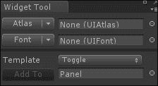

如您在前面的截图中所见，要创建一个小部件，您需要配置**Atlas**和**Font**。正如第一章中所述，“NGUI 入门”，一个 atlas 是一个包含您需要创建 UI 的精灵的大纹理。在本章的其余部分，我们将使用默认的 atlas，名为**SciFi Atlas**，它包含在插件中。

## 选择纹理图集

让我们选择我们的默认 SciFi 纹理图集，它包含必要的精灵，如下所示：

1.  在**Project**视图中，导航到**Assets** | **NGUI** | **Examples** | **Atlases** | **SciFi**。

1.  将预制件`SciFi Atlas.prefab`拖放到**Atlas**字段中。

1.  将预制件`SciFi Font – Header.prefab`拖放到**Font**字段中。

我们已经选择了**Atlas**和**Font**预制件。现在我们可以从模板创建一个小部件。

## 从模板创建小部件

让我们通过以下步骤从模板创建一个小部件：

1.  点击**Template**字段旁边的下拉菜单。

1.  将**Sprite**选项选择为**Template**。

1.  点击**Sprite**字段旁边的下拉菜单。

1.  选择名为**Dark**的精灵。

1.  将**Pivot**选项保留为**Center**。

1.  确保您已在**Hierarchy**视图中选择了**Panel**。

1.  点击**Add To**按钮。

好的，我们的精灵小部件已经创建完成了！

### 注意

小部件向导将新小部件添加为所选 GameObject 或面板的子项。如果您选择了错误的 GameObject，您仍然可以在创建后将其拖放到正确的 GameObject 中。

## 小部件变换

我们已经创建了第一个小部件：**Sprite (Dark**)。在**Hierarchy**视图中选择它，并尝试以下操作来更改其变换值。

### 移动小部件

在**Scene**视图中，您可以使用**句柄**移动小部件，或者您可以直接在**Inspector**视图的**X**、**Y**或**Z**参数中输入坐标。以下截图是带有三个参数可见的**Scene**视图：

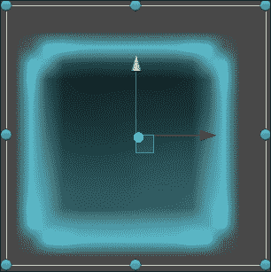

你应该始终将**Z**坐标保留在 0。如果你需要将小部件放置在另一个小部件之后或之前，请使用**检查器**视图中的**后退**和**前进**按钮来控制小部件的深度。

### 小贴士

你可以通过在点击轴的手柄之前按住*Shift*来仅在一个轴上移动你的小部件。

### 旋转小部件

在**场景**视图中，将鼠标光标放在围绕小部件的任何蓝色圆圈的外侧。你的光标旁边将出现一个旋转图标。现在你可以按住左鼠标按钮并移动鼠标来旋转小部件。

### 小贴士

默认情况下，旋转设置为 15 度步长。如果你希望有更精确的旋转——1 度步长——旋转时请按住*Shift*键。

### 缩放小部件

你可能已经注意到，在**检查器**视图中，缩放值被灰色显示。这是因为你应该使用**UISprite**组件的**尺寸**参数。

在**场景**视图中，将鼠标光标放在围绕小部件的任何蓝色圆圈上。你的光标旁边将出现一个调整大小图标。现在你可以点击并拖动鼠标来调整小部件的大小。

### 小贴士

使用蓝色手柄**不会**保持你的小部件相对于当前位置居中。如果你想在小部件的两侧按比例调整大小，请点击**尺寸**组件的**X**或**Y**参数前面的空间，并左右拖动鼠标。

为了保持像素完美，你应该避免使用 Unity 的缩放工具上下调整小部件的大小。尽量使用**尺寸**来做所有事情。让我们看看我们还有哪些小部件参数。

## 常见小部件参数

选择**（暗色）精灵**，你将在**检查器**视图中找到以下截图中的参数：

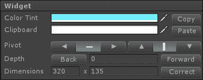

这些参数适用于任何类型的小部件。让我们看看它们是什么：

+   **颜色色调**：这是小部件的启用 alpha 颜色。

+   **剪贴板**：如果你点击**复制**按钮，当前的**颜色色调**选择将被复制到这个参数。如果你点击**粘贴**按钮，**剪贴板**参数的选择将被粘贴到**颜色色调**。

+   **枢轴**：这显示了两组按钮，可以用来选择你希望小部件枢轴放置的角落或侧面。

+   **深度**：这可以用来显示你的小部件在其他人之前或之后。

+   **尺寸**：这可以用来以像素为单位显示大小而不是缩放。

现在我们已经看到了小部件参数，请为我们的新创建的**（暗色）精灵**输入以下**尺寸**：`1300` x `850`。

我们的小部件窗口变得非常大且丑陋。为什么？因为它是一个 15 x 15 的精灵被拉伸到 1300 x 850！让我们谈谈精灵，看看我们如何纠正这个问题。

# 精灵

我们已经创建了第一个精灵，并了解了如何移动、旋转和更改其尺寸。实际上，我们将其与原始尺寸相比放大了很多。但这个 15 x 15 的精灵有一些特别之处。

如果您选择**精灵（暗色）**GameObject，您将在**检查器**视图中的**预览**窗口内看到四条虚线。这意味着它是一个**切片****精灵**：

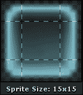

## 切片精灵

**切片**精灵是将图像分成九个部分，使其可调整大小同时保持其角落的比例。切片精灵可以按需缩放——它们仍然看起来很美。

由于**精灵（暗色）**是 9 切片精灵，我们必须告诉我们的**UISprite**组件将其视为此类。执行以下步骤：

1.  选择**精灵（暗色）**GameObject。

1.  点击其**精灵类型**字段旁边的下拉菜单。

1.  选择**切片**。

注意精灵现在看起来有多好——它不再拉伸了！

### 备注

**填充中心**参数允许您只显示精灵的边缘，并在内部留下透明度。

尽管切片精灵非常适合窗口和可变大小的盒子，但您可以通过将**精灵类型**保留为**简单**来显示常规精灵。

## 平铺精灵

平铺精灵是一种旨在无限重复的图案——它可以用来通过重复相同的纹理覆盖大面积。现在让我们试试：

1.  在**层次结构**视图中，将**精灵（暗色）**重命名为`Window`。

1.  选择我们的**窗口**GameObject 并执行以下步骤：

    1.  确保它位于`{`0`, `0`, `0`}`位置，并且具有`{`1`, `1`, `1`}`的比例。

    1.  确保深度设置为`0`。

    1.  在**颜色色调**参数中，将**R**更改为`115`，**G**更改为`240`，**B**更改为`255`，**A**更改为`255`。

好的，我们有了我们的窗口。让我们通过以下步骤创建一个平铺背景，使其看起来更好：

1.  选择我们的**窗口**GameObject 并使用*Ctrl* + *D*进行复制。

1.  将副本重命名为`Background`。

1.  选择新的**背景**GameObject 并执行以下步骤：

    1.  将其 UISprite 的**深度**参数设置为`1`。

    1.  点击**精灵类型**字段旁边的下拉菜单。

    1.  选择**平铺**。因为它看起来不好，因为我们的精灵不是平铺精灵。

    1.  点击**精灵**按钮。

    1.  选择**蜂窝**精灵，它是一个平铺精灵。

    1.  在**颜色色调**参数中，将**R**更改为`115`，**G**更改为`240`，**B**更改为`255`，**A**更改为`255`。

1.  通过导航到**组件** | **NGUI** | **UI** | **拉伸**并执行以下步骤，为它附加一个组件：

    1.  将**窗口**GameObject 拖放到**容器**字段中。

    1.  将**样式**字段设置为**两者**。

1.  通过导航到**NGUI** | **附加** | **锚点**并拖放到**容器**字段中，为它附加一个组件。

看起来更好了！我们现在有一个用于窗口背景的平铺精灵，它看起来如下：

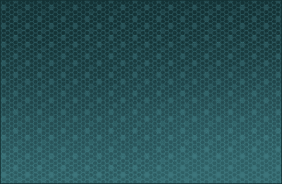

我们使用了**UIStretch**组件来避免手动设置尺寸；如果您更改窗口的**尺寸**，背景将自动调整大小。

**UIAnchor**组件用于确保背景也随窗口移动。

## 填充精灵

一个填充的精灵对于创建生命条或进度条很有用；使用这个功能，你可以设置一个精灵并改变**填充量**参数在 0 到 1 之间来隐藏其一部分。以下截图显示了一个部分隐藏的进度条：

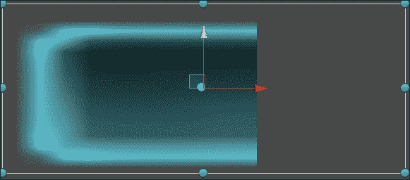

让我们按照以下步骤创建这个效果：

1.  选择我们的**背景**GameObject 并将**精灵类型**设置为**填充**。

1.  将**填充方向**设置为**水平**。

移动**填充量**滑块，你可以在游戏视图中看到它所做的工作。你已经理解了填充精灵系统。现在将**精灵类型**字段设置回**平铺**。

好的，我们已经看到了不同的小部件和参数。让我们学习如何添加文本。

# 标签

标签用于在屏幕上显示具有特定字体的文本，如下面的截图所示：

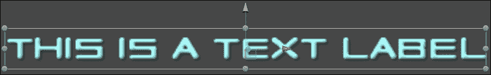

让我们按照以下步骤创建一个带有标签的小部件：

1.  选择**面板**GameObject。

1.  导航到**NGUI** | **打开** | **小部件向导**。

1.  选择**标签**模板。

1.  我们已经选择了一个字体；它将用于此标签。

1.  点击**添加到**按钮。

已在面板中添加了一个新的标签并将其放置在屏幕中央。

## 参数

选择**标签**后，`UILabel`参数将在**检查器**视图中显示。它们如下所示：

+   **文本**：这是一个大文本框，允许你输入要显示的文本。

+   **溢出**：当文本大于标签的**尺寸**时，这为小部件提供了四种不同的行为。这四种行为如下：

    +   **缩小内容**：这会缩小文本以适应

    +   **限制内容**：这确保溢出永远不会发生

    +   **自由调整大小**：这会调整大小以显示所有内容及其溢出

    +   **调整高度**：这仅调整高度——列样式

+   **编码**：如果你想通过插入[RRGGBB]十六进制值来更改字符的颜色，必须勾选此选项。

+   **效果**：这将帮助你为标签添加阴影或轮廓效果。你可以调整**距离**和**颜色**值。

+   **最大行数**：这是分配给标签的最大行数。对于无限行，请将其保留为**0**。

+   **锚点**：锚点还定义了文本的对齐方式。

## 创建标题栏

让我们添加一个标题，它将看起来像下面的截图：

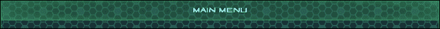

请按照以下步骤继续创建这个窗口的标题栏：

1.  选择**面板**并使用*Alt* + *Shift* + *N*创建一个新的子项。

1.  将新子项重命名为`标题`。它将成为我们的标题栏容器。

1.  将**标签**GameObject 拖放到**标题**GameObject 中。

1.  选择我们的**标题**GameObject。

1.  导航到**NGUI** | **打开** | **小部件向导**。

1.  使用**高亮**精灵创建一个新的精灵并执行以下步骤：

    1.  将这个新的精灵（**高亮**）重命名为`背景`。

    1.  将**精灵类型**设置为**切片**。

    1.  将**枢轴**选项更改为**顶部**（带有向上箭头的按钮）。

    1.  将其**变换**位置重置为 `{`0``, `0`, `0`}`。

    1.  在**颜色色调**参数中，将**R**更改为`95`，**G**更改为`255`，**B**更改为`150`，**A**更改为`200`。

    1.  将**深度**设置为`2`。

1.  通过导航到**组件** | **NGUI** | **UI** | **拉伸**并执行以下步骤来为其附加组件：

    1.  将我们的**窗口**GameObject 拖放到**容器**字段中。

    1.  将**样式**设置为**水平**。

    1.  将其 UISprite 的**Y**维度设置为`62`。

1.  从**标题**中选择**标签**GameObject 并执行以下步骤：

    1.  将其文本更改为 `[AAFFFF]主菜单`。

    1.  将其**溢出**参数设置为**自由调整大小**。

    1.  输入**深度**为`3`。

1.  通过导航到**NGUI** | **附加** | **锚点**并执行以下步骤来为其附加组件：

    1.  将**标题**中的**背景**GameObject 拖放到**容器**字段中。

    1.  将**侧边**参数设置为**居中**。

1.  在**层次结构**视图中选择我们的**标题**GameObject。

1.  通过导航到**NGUI** | **附加** | **锚点**并执行以下步骤来为其附加组件：

    1.  将我们的**窗口**GameObject 拖放到**容器**字段中。

    1.  将**侧边**参数设置为**顶部**。

我们**标题**GameObject 的**层次结构**和**检查器**视图应该看起来像以下截图中的那样：

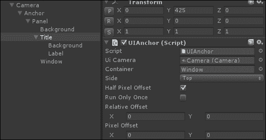

现在我们有一个看起来真的像窗口的窗口。我们使用了锚点来避免手动设置位置。现在让我们添加一些按钮！

# 按钮

使用 NGUI，按钮易于创建和配置。

让我们通过以下步骤创建第一个：

1.  选择**面板**GameObject。

1.  使用*Alt* + *Shift* + *N*创建一个新的子项并执行以下步骤：

    1.  将其重命名为`Buttons`。它将成为我们的按钮容器。

1.  导航到**NGUI** | **打开** | **小部件向导**并执行以下步骤：

    1.  在**层次结构**视图中选择**按钮**模板。

    1.  对于**背景**字段，选择名为**按钮**的精灵。

1.  选择**按钮**GameObject，然后点击**添加到**按钮。

一个按钮已经被创建并居中在屏幕上。如果你查看**层次结构**视图，你会看到按钮由一个名为**按钮**的容器 GameObject 和两个子项组成：一个**背景**精灵和一个**标签**。这就是 NGUI 的工作方式；模板只是简单地组装组件和小部件。如果你想的话，你可以使用正确的组件在空 GameObject 上从头开始构建一个按钮。

点击播放按钮。你可以看到悬停和点击已经设置好了！关闭播放模式，选择新的**按钮**GameObject，并查看**检查器**视图。

交互式小部件附有一个盒子碰撞体，这个按钮也是如此。碰撞体用于检测与光标的碰撞。

## 参数

一个按钮有一个`UIButton`组件，它处理七个按钮参数：

+   **目标**：当用户悬停或按下按钮时，此 GameObject 将被转换和修改。默认情况下，这是 **背景**。

+   **正常状态**：这是没有任何操作发生时的颜色渐变。

+   **悬停状态**：这是用户的光标在按钮上时的颜色渐变。

+   **按下状态**：这是用户点击按钮时的颜色渐变。

+   **禁用状态**：这是按钮被禁用（无法点击）时的颜色渐变。

+   **持续时间**：这是状态之间转换的持续时间。

+   **通知**：这是允许你选择在按钮点击时调用的方法的参数。你必须首先将一个 GameObject 拖动到 **通知** 字段中。然后，将出现一个 **方法** 字段，列出 GameObject 附加的脚本方法，如下截图所示：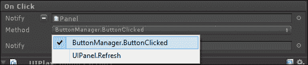

在前面的示例中，我将 **面板** GameObject 拖动到 **通知** 字段中。我的 **面板** GameObject 附加了一个 `ButtonManager.cs` 脚本——此脚本有一个 `ButtonClicked()` 方法。我现在可以在 **方法** 字段中选择它。它将在点击时被调用。

### 注意

只有 **公共** 方法且没有参数的才会显示在 **通知** 参数的 **方法** 字段中。

此按钮还附加了一个 **PlaySound** 组件。它允许你在选定的事件发生时选择要播放的音频剪辑。你可以编辑 **音调** 和 **音量** 参数。

### 注意

如果需要，你可以添加任意数量的 **PlaySound** 组件，以便在用户悬停或点击某个东西时播放声音，例如。

## 播放和退出按钮

我们现在将在窗口中添加两个按钮，用于退出或启动游戏。它们将显示如下截图所示：

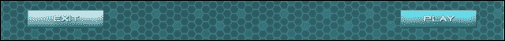

我们需要一个将管理游戏的 GameObject。它将包含用于管理通用行为（如退出或启动游戏）的 `GameManager.cs` 脚本。让我们首先创建它；按照以下步骤进行操作：

1.  在 **层次结构** 根目录处创建一个新的 GameObject，使用 *Ctlr* + *Shift* + *N* 并执行以下步骤：

    1.  将其重命名为 `GameManager`。

1.  创建并附加一个新的 `GameManager.cs` C# 脚本到它，并执行以下步骤：

    1.  打开这个新的 `GameManager.cs` 脚本。

    1.  在这个新脚本内部，添加一个名为 `ExitPressed()` 的新方法，代码行如下：

        ```cs
        public void ExitPressed()
        {
          //Exit Now
          Application.Quit();
        }
        ```

### 提示

**下载示例代码**

你可以从你购买的所有 Packt 书籍的账户中下载示例代码文件。[`www.packtpub.com`](http://www.packtpub.com)。如果你在其他地方购买了这本书，你可以访问 [`www.packtpub.com/support`](http://www.packtpub.com/support) 并注册以将文件直接通过电子邮件发送给你。

现在退出方法已经准备好了，让我们按照以下步骤创建和配置两个按钮：

1.  选择 **按钮** GameObject 并执行以下步骤：

    1.  将其重命名为 `Exit`。

    1.  将 **GameManager** GameObject 拖动到 **通知** 字段中。

    1.  在**方法**字段中选择**GameManager.ExitPressed**。

    1.  在**正常**颜色色调参数中，将**R**更改为`185`，**G**更改为`255`，**B**更改为`255`，并将**A**更改为`255`。

    1.  在**悬停**颜色色调参数中，将**R**更改为`0`，**G**更改为`220`，**B**更改为`255`，并将**A**更改为`255`。

1.  通过导航到**NGUI** | **附加** | **锚点**，将其附加一个组件，并执行以下步骤：

    1.  将我们的**窗口**GameObject 拖入**容器**字段。

    1.  将**边**参数设置为**左下角**。

    1.  将**像素偏移**设置为{`135`, `60`}。

1.  选择我们的**退出**按钮的子**背景**GameObject，并执行以下步骤：

    1.  输入**深度**为`2`。

1.  选择我们的**退出**按钮的子**标签**GameObject，并执行以下步骤：

    1.  将其文本更改为`退出`。

    1.  输入**深度**为`3`。

好的，我们有了**退出**按钮。让我们按照以下步骤创建我们的**播放**按钮：

1.  复制**退出**按钮并执行以下步骤：

    1.  将这个新复制的名称重命名为`播放`。

    1.  点击 UIButton 旁边**通知**字段的**减号**按钮，从其中移除**GameManager**GameObject。

    1.  将其**边**参数设置为**右下角**。

    1.  将**像素偏移**设置为{`-135`, `60`}。

1.  通过导航到**组件** | **NGUI** | **示例** | **点击加载关卡**，将其附加一个组件，并将其**关卡名称**字符串参数设置为**游戏**。

1.  选择我们的**播放**按钮的子**标签**GameObject，并将其文本更改为`播放`。

完美，现在如果您构建场景，您将拥有一个仅用一行代码即可工作的功能**退出**按钮！**像素偏移**参数保持按钮与窗口边界的相同距离，即使您更改分辨率或窗口尺寸。我们将在稍后创建游戏场景。

### 备注

**图像按钮**也可以使用小部件向导创建。它们与普通按钮相同，只是它们使用图像来代替**正常**、**悬停**、**按下**和**禁用**状态的颜色和缩放缓动。

# 文本输入

现在，我们将学习如何添加文本输入以创建昵称框。执行以下步骤：

1.  选择**面板**GameObject，并使用*Alt* + *Shift* + *N*创建一个新的子项。然后将这个新子项重命名为`昵称`。它将成为我们的昵称框容器。

1.  导航到**NGUI** | **打开** | **小部件向导**。

    1.  从**项目**视图，导航到**NGUI** | **示例** | **图集** | **SciFi**。

    1.  将**SciFi Font – Normal**预制件拖入**字体**字段。

    1.  选择**输入**模板。

    1.  将**精灵（暗色）**设置为**背景**参数。

1.  在选择**昵称**GameObject 后，单击**添加到**按钮。

已向场景中添加了一个名为**输入**的新小部件。

## 参数

已创建一个**输入**GameObject。让我们看看它的**检查器**参数：

+   **输入标签**：这是用于此输入的文本标签。

+   **非活动颜色**：这是文本未选中时的文本颜色。

+   **活动颜色**：这是文本正在编辑时的文本颜色。

+   **默认文本**：这是 **空白** 或带有标签的默认文本。**空白** 将在选择 **输入** GameObject 时删除标签的文本。

+   **键盘类型**：这允许授权不同的字符集。这也会更改移动平台上的键盘布局。

+   **按 Tab 选择**：将想要在按 *Tab* 键编辑输入时被选择的 GameObject 拖入此字段。

+   **自动保存键**：这使标签的文本能够自动保存到指定的 `PlayerPrefs()` 键。

+   **最大字符数**：这是允许的最大字符数。`0` 表示无限。

+   **光标字符**：这是文本的末尾字符。

+   **密码**：如果您激活此布尔值，标签的字符将在屏幕上被 ***** 替换。

+   **自动更正**：这可以在移动平台上启用或禁用自动更正。

## 创建一个昵称框

让我们使用这个文本输入来创建一个看起来像以下截图的昵称框：

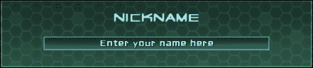

让我们创建前面截图中所见的昵称框。执行以下步骤以创建：

1.  复制 **窗口** GameObject 并执行以下步骤：

    1.  将新复制的名称重命名为 `Background`。

    1.  将其拖入 **昵称** 容器 GameObject。

    1.  输入 **深度** 为 `2`。

    1.  将 **尺寸** 设置为 `440` x `120`。

1.  选择我们的 **输入** GameObject 并执行以下步骤：

    1.  将其 **盒式碰撞器** 组件的中心重置为 `{`0`, `0`, `0`}`。

    1.  在 **自动保存键** 参数中输入 `Nickname`。

    1.  输入 **最大字符数** 为 `25`。

1.  通过导航到 **NGUI** | **附加** | **锚点** 来将其附加到组件上，并执行以下步骤：

    1.  将 **Background** GameObject 从 **昵称** 内拖动到 **容器** 字段中。

    1.  将 **像素偏移** 设置为 `{`0`, `-17`}`。

1.  从 **标题** 复制 **标签** 子 GameObject 并执行以下步骤：

    1.  将其拖入 **昵称** GameObject 内。

    1.  将其文本更改为 `[AAFFFF]昵称`。

    1.  将 **背景** GameObject 从 **昵称** 内拖动到 **容器** 字段中。

    1.  将 **侧边** 参数设置为 **顶部**。

    1.  将 **像素偏移** 设置为 `{`0`, `-32`}`。

1.  从 **输入** 选择 **背景** 子 GameObject 并执行以下步骤：

    1.  输入 **深度** 为 `3`。

    1.  将 **轴点** 设置为 **中心**（中间按钮 + 中间按钮）。

    1.  将 **变换** 字段的定位重置为 `{`0`, `0`, `0`}`。

    1.  在 **颜色色调** 参数中，将 **R** 设置为 `100`，**G** 设置为 `230`，**B** 设置为 `255`，**A** 设置为 `255`。

1.  从 **输入** 选择 **标签** 子 GameObject 并执行以下步骤：

    1.  输入 **深度** 为 `4`。

    1.  将 **轴点** 设置为 **中心**（中间按钮 + 中间按钮）。

    1.  将**变换**字段的定位重置为 `{`0`, `0`, `0`}`。

    1.  将 **标签** GameObject 的文本更改为 `在此处输入您的姓名`。

1.  选择 **昵称** 容器 GameObject。

1.  为其附加一个组件并导航到**NGUI** | **附加** | **锚点**并执行以下步骤：

    1.  将我们的**窗口**游戏对象拖入**容器**字段。

    1.  将**侧边**参数设置为**顶部**。

    1.  将**像素偏移**设置为 `{`0`, `-220`}`。

好的，我们有了**昵称**框。你的**层次结构**视图应该看起来像以下截图：

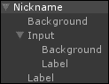

用户可以输入他的昵称，最多 25 个字符。如果你移动或更改窗口的尺寸，我们的框将移动以保持在同一位置。

# 滑块

现在让我们为用户添加一个可以移动和选择音量级别的音量滑块。

可用滑块模板，允许你通过在条上滑动滑块手柄轻松调整参数。按照以下步骤创建音量滑块：

1.  选择**面板**游戏对象并使用*Alt* + *Shift* + *N*创建一个新的子对象。

1.  将新子对象重命名为`Volume`。它将成为我们的音量设置容器。

1.  导航到**NGUI** | **打开** | **小部件向导**并执行以下步骤：

    1.  选择**滑块**模板。

    1.  将**暗**精灵设置为**空**。

    1.  将**光**精灵设置为**全开**。

    1.  将**高亮**设置为**滑块手柄**。

1.  在选择**音量**游戏对象后，点击**添加到**按钮。

## 参数

已创建滑块。它有 6 个参数，如下所示：

+   **值**：这是滑块的当前值，介于 0 和 1 之间。

+   **步骤**：这是完全填充或清空滑块的步骤数。

+   **方向**：这是滑块的填充方向，可以是**水平**或**垂直**。

+   **前景**：这是用于填充滑块的精灵。

+   **滑块手柄**：这是用于改变滑块值的精灵。通过将其设置为**null**，将创建一个简单的进度条（用户无法交互）。

+   **通知**：这是允许你选择在滑块值变化时调用的方法的游戏对象。当分配了游戏对象时，你可以选择在值变化时调用的方法。

## 创建音量滑块

我们可以使用这个滑块来创建我们的音量滑块，它将看起来像以下截图：


按照以下步骤创建它：

1.  从**昵称**复制**背景**游戏对象并执行以下步骤：

    1.  将复制的对象拖入**音量**容器游戏对象内部。

    1.  将其**尺寸**设置为`320` x `135`。

1.  通过导航到**NGUI** | **附加** | **锚点**附加一个组件并执行以下步骤：

    1.  将我们的**窗口**游戏对象拖入**容器**字段。

    1.  将**像素偏移**设置为 `{`-420`, `-90`}`。

1.  从**昵称**复制**标签**游戏对象并执行以下步骤：

    1.  将其拖入**音量**游戏对象内部。

    1.  将我们的音量**背景**游戏对象拖入**容器**字段。

    1.  将其文本更改为`[AAFFFF]音量`。

1.  选择**滑块**游戏对象。

1.  通过导航到**NGUI** | **附加** | **锚点**来将其附加到组件上，并执行以下步骤：

    1.  将**背景**GameObject 从**音量**拖动到**容器**字段内。

    1.  将**像素偏移**设置为`{-100, -23}`。

1.  从**滑块**中选择**背景**GameObject 并执行以下步骤：

    1.  将**深度**设置为`3`。

    1.  在**颜色色调**参数中，将**R**改为`80`，**G**改为`220`，**B**改为`85`，并将**A**改为`255`。

1.  从**滑块**中选择**前景**GameObject 并执行以下步骤：

    1.  将**深度**设置为`4`。

    1.  在**颜色色调**参数中，将**R**改为`95`，**G**改为`255`，**B**改为`190`，并将**A**改为`255`。

1.  从**滑块**中选择**滑块手柄**GameObject 并执行以下步骤：

    1.  将**深度**设置为`5`。

    1.  在**颜色色调**参数中，将**R**改为`100`，**G**改为`255`，**B**改为`250`，并将**A**改为`255`。

好的，我们现在有一个漂亮的音量滑块！你的**层次结构**视图应该看起来像以下截图：

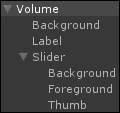

我们现在将使用一个新的脚本将其链接到游戏音量。让我们向主菜单添加一些音乐。首先，按照以下步骤将你选择的音频文件添加到 Unity 项目中：

1.  选择我们的**主摄像机**GameObject。

1.  通过导航到**组件** | **音频** | **音频源**来将其附加到组件上，并执行以下步骤：

    1.  将音乐文件从**项目**视图拖动到**音频源**参数的**音频剪辑**字段。

1.  从**音量**中选择**滑块**GameObject 并执行以下步骤：

    1.  创建并附加一个新的`VolumeManager.cs` C#脚本。

    1.  打开这个新的`VolumeManager.cs`脚本。

在这个新脚本中，我们首先需要声明和初始化必要的变量。添加以下变量声明和`Awake()`方法：

```cs
//We will need the Slider
UISlider slider;

void Awake ()
{
  //Get the Slider
  slider = GetComponent<UISlider>();
  //Set the Slider's value to last saved volume
 slider.value = NGUITools.soundVolume;
}
```

在这里，我们将滑块的值初始化为`NGUITools.soundVolume`，因为这个浮点数是持久的，并且将在场景间保存——即使你退出游戏。

现在，让我们创建一个`OnVolumeChange()`方法，每次滑块的值改变时，都会修改我们的 AudioListener 方法的音量：

```cs
public void OnVolumeChange ()
{
  //Change NGUI's UI Sounds volume
  NGUITools.soundVolume = UISlider.current.value;
  //Change the Game AudioListener's volume
  AudioListener.volume = UISlider.current.value;
}
```

好的，方法已经准备好了。我们只需要在滑块的值每次改变时调用它。让我们使用**UISlider**组件的**通知**字段如下：

1.  从**音量**中选择**滑块**GameObject 并执行以下步骤：

    1.  将**滑块**GameObject 从**音量**拖动到**通知**字段。

    1.  对于**方法**字段，选择`VolumeManager.OnVolumeChange`。

现在，每次滑块的值被修改时，我们的方法将被调用。

你可以点击播放按钮；游戏音量会随着滑块的变化而变化。音量即使在退出游戏并重新启动时也会保存！

# 切换

现在我们有了音量滑块，让我们添加一个启用/禁用声音的复选框，这将把音量调至 0 并隐藏我们的音量滑块。

首先，创建一个如下所示的切换小部件：

1.  选择**面板**GameObject 并使用*Alt* + *Shift* + *N*创建一个新的子组件。

1.  将新子对象重命名为`Sound`。它将成为我们的声音切换容器。

1.  导航到**NGUI** | **打开** | **小部件向导**并执行以下步骤：

    1.  选择**Toggle**作为**模板**。

    1.  选择**深色**精灵作为**背景**。

    1.  选择**X**精灵作为**勾选标记**。

    1.  在选择**声音**容器后，点击**添加到**按钮。

如下截图所示，已创建了一个带有标签的复选框：


## 参数

选择我们新的**Toggle**游戏对象。让我们看看 UIToggle 的**检查器**参数：

+   **分组**：这是切换的分组。同一分组的切换将作为单选按钮操作；一次只能选择其中一个。

+   **起始状态**：这定义了切换在开始时的状态。

+   **动画**：这是当复选框状态改变时播放的动画。

+   **精灵**：这让我们可以选择用作勾选标记的部件；在这里我们应该使用我们的**X**精灵。

+   **过渡**：这可以是**平滑**或**立即**；使用 alpha 淡入/淡出。

+   **通知**：这是在切换时通知的 GameObject。当分配 GameObject 时，您可以选择在切换事件上调用公共方法。

## 创建声音切换

我们已经看到了 UIToggle 的参数。现在我们将创建如下截图所示的这个声音切换：

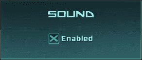

让我们使用最近添加的**Toggle**游戏对象来创建这里显示的窗口。按照以下步骤操作：

1.  从**音量**中选择**背景**和**标签**游戏对象并执行以下步骤：

    1.  复制它们。

    1.  将那些新复制的副本拖放到我们的**声音**容器内。

1.  从**声音**中选择**背景**游戏对象并输入其 UIAnchor 的**像素偏移**参数为`{-420, 43}`。

1.  从**声音**中选择**标签**游戏对象并将其文本更改为`[AAFFFF]声音`。

1.  选择**Toggle**游戏对象并检查**UIToggle**中的**起始状态**布尔值。

1.  通过导航到**NGUI** | **附加** | **锚点**附加组件并执行以下步骤：

    1.  将**声音**中的**背景**游戏对象拖放到**容器**字段中。

    1.  在其**像素偏移**参数中输入`{-38, -20}`。

1.  通过导航到**NGUI** | **交互** | **切换对象**并添加组件，将我们的**音量**容器游戏对象拖放到**激活**数组中。

1.  从**Toggle**中选择**背景**精灵游戏对象并执行以下步骤：

    1.  输入**深度**为`3`。

    1.  在**颜色色调**参数中，将**R**更改为`130`，**G**更改为`255`，**B**更改为`130`，**A**更改为`255`。

1.  从**Toggle**中选择**勾选标记**精灵游戏对象并执行以下步骤：

    1.  输入**深度**为`4`。

    1.  在**颜色色调**参数中，将**R**更改为`50`，**G**更改为`255`，**B**更改为`70`，**A**更改为`255`。

1.  从**Toggle**中选择**标签**游戏对象并执行以下步骤：

    1.  输入**深度**为`3`。

    1.  将其文本更改为 `[AAFFFF]Enabled`。

    1.  在 **Color Tint** 参数中，将 **R** 更改为 `200`，**G** 更改为 `255`，**B** 更改为 `250`，**A** 更改为 `255`。

点击播放按钮。我们有一个带声音切换复选框的漂亮的声音框，当需要时可以隐藏/显示 **Volume** 框。但它还没有关闭声音。

我们需要对 `VolumeManager.cs` 脚本进行一些修改以纠正这个问题。

首先，打开我们的 `VolumeManager.cs` 脚本。我们将添加一个新的 `OnSoundToggle()` 方法，当切换状态改变时将被调用。它将直接将音量设置为 0，或设置为滑块的值。将此新方法添加到 `VolumeManager.cs` 中，如下代码行所示：

```cs
public void OnSoundToggle()
{
  float newVolume = 0;
  //If sound toggled ON, set new volume to slider value
  if(UIToggle.current.value)
  newVolume = slider.value;
  //Apply newVolume to volumes
  AudioListener.volume = newVolume;
  NGUITools.soundVolume = newVolume;
}
```

好的，前面的方法将根据切换的状态将我们的音量设置为 `0` 或滑块的值。让我们通过选择我们的 **Toggle** GameObject 并将 **Volume** 中的 **Slider** GameObject 拖到 **UIToggle** 的 **Notify** 字段中，在 **On Value Change** 部分下面，将其链接到我们的声音切换。然后，对于 **Method** 字段，选择 `VolumeManager.OnSoundToggle`。

点击播放按钮。就这样。当我们点击 **Volume** 中的 **Toggle** 复选框时，音量会相应地反应。

但如果我们使用切换关闭声音并停止运行，当我们再次点击播放时，复选框仍然被选中，音量滑块显示，但音量在 `0`。

这是因为我们的音量设置为 `0`，但复选框在开始时仍然被选中。让我们添加一行简单的代码，将起始状态设置为 `false`，如果音量在 `0`：

1.  打开我们的 `VolumeManager.cs` 脚本。

1.  声明一个新的全局变量 `public UIToggle soundToggle`。

1.  在 `Awake()` 方法的末尾添加以下代码行：

    ```cs
    //If volume is at 0, uncheck the Sound Checkbox
    if(NGUITools.soundVolume == 0) soundToggle.value = false;
    ```

1.  保存脚本并返回到 Unity。

1.  从 **Volume** 中选择 **Slider** GameObject。

将 **Volume** 中的 **Toggle** GameObject 拖到音量管理器的 **Sound Toggle** 字段中。

点击播放按钮。就这样。如果你使用切换禁用声音并退出播放模式然后再次启动，复选框保持未选中状态，音量滑块不显示。完美！

# 弹出列表

我们现在将学习如何创建弹出列表，查看其参数，并为我们的游戏创建一个难度选择器。

1.  选择 **Panel** GameObject 并使用 *Alt* + *Shift* + *N* 创建一个新的子项。

1.  将新子项重命名为 `Difficulty`。它是我们的难度框容器。

1.  导航到 **NGUI** | **Open** | **Widget Wizard** 并执行以下步骤：

    1.  选择 **Popup List** 作为 **Template**

    1.  将 **Foreground** 选择为 **Dark**。

    1.  将 **Background** 选择为 **Dark**。

    1.  选择 **Highlight** 精灵作为 **Highlight**。

1.  在选择我们的 **Difficulty** GameObject 后，点击 **Add To** 按钮。

## 参数

刚刚创建了一个 **Popup List** GameObject。让我们看看它的参数：

+   **Atlas**：这是用于弹出列表精灵的图集。

+   **Font**：这是用于弹出列表选项的字体。

+   **Text Label**：这是在 **Popup List** 更改选择时更新的标签。

+   **选项**：这是将要弹出的选项列表——每行一个。

+   **Default**：这是启动时选择的选项。

+   **位置**：您可以强制选项列表出现在弹窗列表按钮的 **Above** 或 **Below**。如果此参数设置为 `Auto`，NGUI 将根据可用空间选择其中之一。

+   **Localized**：这启用了选项的本地化。

+   **Background**：这是弹窗列表选项容器的背景精灵。

+   **Highlight**：这是当前悬停选项的精灵。

+   **Text Color**：这是选项列表的文本颜色色调。

+   **Background**：这是弹窗列表的背景颜色色调。

+   **Highlight**：这是悬停选项的背景颜色色调。

+   **填充**：这是 **X** 和 **Y** 选项的填充。

+   **Text Scale**：这是选项的文本缩放。

+   **Animated**：如果未勾选，选项的显示将是瞬间的。

+   **Notify**：这是允许您选择在所选选项更改时调用的方法的 GameObject。

在 `UIPopup List` 组件下方，我们有之前已经见过的 `UIButton` 和 `UIPlay Sound` 组件。

### 注意

Widget Wizard 中也提供了一个弹窗菜单模板。唯一的区别是，菜单不会指示您已选择了哪个选项；按钮的标签不会更新。

## 创建难度选择器

我们现在将使用我们新的 **Popup List** GameObject 来选择游戏难度，如下截图所示：

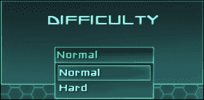

按照以下步骤创建此难度选择器：

1.  从 **Sound** 中选择 **Background** 和 **Label** GameObject 并执行以下步骤：

    1.  复制它们。

    1.  将它们拖放到我们的 **Difficulty** 容器中。

1.  从 **Difficulty** 中选择 **Background** GameObject，并输入其 **Pixel Offset** 参数为 `{`420`, `43`}`。

1.  从 **Difficulty** 中选择 **Label** GameObject 并将其文本更改为 `[AAFFFF]Difficulty.`。

1.  在 **Hierarchy** 视图中选择我们的 **Popup List** 并执行以下步骤：

    1.  将其重命名为 `Popup`。

    1.  输入 `Normal` 和 `Hard`，用一行分隔。

    1.  在 **Text Color** 中，将 **R** 改为 `190`，**G** 改为 `250`，**B** 改为 `255`，**A** 改为 `255`。

    1.  在 **Background** 中，将 **R** 改为 `70`，**G** 改为 `250`，**B** 改为 `255`，**A** 改为 `255`。

    1.  在 **Highlight** 中，将 **R** 改为 `70`，**G** 改为 `255`，**B** 改为 `150`，**A** 改为 `255`。

    1.  在 **Hover** 中，将 **R** 改为 `70`，**G** 改为 `255`，**B** 改为 `150`，**A** 改为 `255`。

1.  通过导航到 **NGUI** | **Attach** | **Anchor** 为其附加一个组件，并执行以下步骤：

    1.  将 **Difficulty** 中的 **Background** GameObject 拖放到 **Container** 字段。

    1.  输入 **Pixel Offset** 为 `{`-76`, `-20`}`。

1.  选择我们弹窗的 **Sprite** GameObject 并执行以下步骤：

    1.  在**颜色色调**中，将**R**改为`170`，**G**改为`255`，**B**改为`190`，**A**改为`255`。

    1.  将**深度**设置为`3`。

1.  选择我们弹窗的**标签**GameObject 并执行以下步骤：

    1.  在**颜色色调**中，将**R**改为`135`，**G**改为`255`，**B**改为`170`，**A**改为`255`。

    1.  将**深度**设置为`4`。

好的，我们现在有一个**弹窗列表**GameObject，它允许我们选择游戏的难度级别。你的**层次结构**面板应该看起来像以下截图：

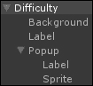

现在是时候将其链接到一个考虑难度级别的方法了。通过执行以下步骤来实现：

1.  打开我们的`GameManager.cs`脚本。

1.  按照以下方式声明一个新的枚举来存储我们的难度级别：

    ```cs
    public enum Difficulties
    {
      Normal,
      Hard
    }
    ```

1.  声明一个新的`Difficulty`变量来存储当前的难度级别，如下所示：

    ```cs
    public static Difficulties Difficulty = Difficulties.Normal;
    ```

我们使用了一个静态变量，因为它在加载游戏场景时不会被销毁。默认情况下，难度级别设置为**正常**。

现在我们需要添加一个`OnDifficultyChange()`方法，当**弹窗列表**状态改变时，它会更改我们的`难度`变量，如下所示：

```cs
public void OnDifficultyChange()
{
  //If Difficulty changes to Normal, set Difficulties.Normal
  if(UIPopupList.current.value == "Normal")
  Difficulty = Difficulties.Normal;
  //Otherwise, set it to Hard
  else Difficulty = Difficulties.Hard;
}
```

我们的方法已经准备好了；我们需要在**弹窗列表**状态改变时调用它。通过执行以下步骤来实现：

1.  保存所有修改后的脚本并返回 Unity。

1.  从**难度**中选择**弹窗列表**GameObject 并执行以下步骤：

    1.  将我们的**GameManager**GameObject 拖入**通知**字段。

    1.  对于**方法**字段，选择`GameManager.OnDifficultyChange`。

现在，**弹窗列表**GameObject 将根据其值更改`难度`变量。一旦我们进入游戏，我们就能访问这个静态变量。

# 总结

在本章中，我们学习了如何创建和配置 NGUI 的大多数小部件——精灵、标签、按钮、文本输入、滑块、切换和弹窗列表。

我们现在有一个带有交互元素的主菜单。我们还使用了 NGUI 的通知事件系统来在代码中更改变量并注册用户的选项。

我们使用了**UI 锚点**和**UI 拉伸**组件来正确地定位我们的小部件——我们只需要移动每个框的背景精灵就可以移动整个元素。这比手动移动每个 GameObject 要有效得多！你应该有一个看起来像以下截图的主菜单：

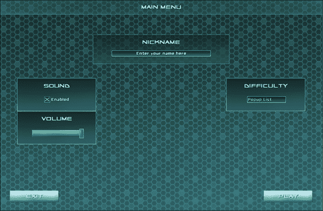

好的，现在是我们增强 UI 体验并使其变得更好的时候了。让我们继续到第三章，*增强你的 UI*。
