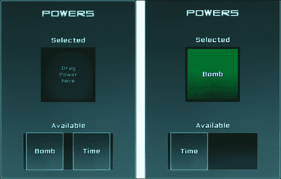
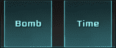
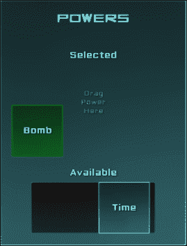
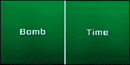
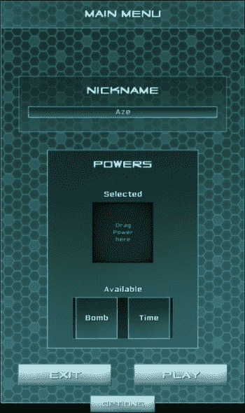
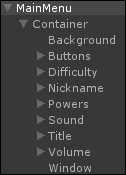
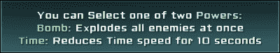
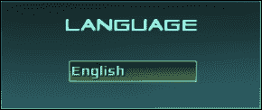

# 第三章。增强你的 UI

在本章中，我们将学习如何通过使用更高级的功能来增强我们的 UI 体验，具体如下：

+   可拖动面板和动画

+   拖放系统

+   自动内容对齐

+   剪切

+   可滚动文本

+   本地化系统

让我们先谈谈 NGUI 组件及其整体行为。

# NGUI 组件

在 第二章，*创建小部件*，我们向我们的小部件添加了 **UIStretch** 和 **UIAnchor** 组件，以及 **点击加载级别** 组件。还有许多其他组件，本章的目的是讨论这些组件。我们将在本章中使用最重要的组件。当然，可以将组件添加到任何类型的小部件中。

这种面向组件的结构使 NGUI 非常灵活和模块化。我们将从将我们的主菜单制作成可拖动窗口开始。

# 可拖动面板

现在，我们将学习如何将我们的菜单转换成可拖动窗口。让我们添加正确的组件并研究其参数，如下所示：

1.  选择 **面板** 游戏对象。

1.  将其重命名为 `MainMenu`。

1.  通过导航到 **组件** | **NGUI** | **交互**，将 **可拖动面板** 组件附加到它上。

**MainMenu** 游戏对象现在已附加了一个 **UIDraggable Panel** 组件。

## 参数

以下是在 **UIDraggable Panel** 中设置值的 13 个参数：

+   **拖动效果**：这是在拖动面板时使用的效果，以实现更平滑的拖动。

+   **限制在面板内**：这使用父面板来限制可拖动面板在其剪切边界内。

+   **如果适合则禁用拖动**：如果内容适合父面板的剪切边界，则将禁用拖动。

+   **平滑拖动开始**：这避免了拖动开始时的“跳跃”效果。

+   **重新定位剪切**：这立即将 **剪切** 重新定位到 **左上角**。

+   **iOS 拖动模拟**：当超过剪切边缘时，拖动移动速度会降低。

+   **滚动轮因子**：如果你想使滚动轮在 y 轴上拖动面板，将此值设置为大于 0。

+   **动量量**：这是当面板放下时应用的效果。释放滚动轮后，面板将继续移动。

+   **水平滚动条**：这允许你拖动一个滚动条来将其定义为面板的水平滚动条。

+   **垂直滚动条**：这允许你拖动另一个滚动条来将其定义为面板的垂直滚动条。

+   **显示滚动条**：这允许你始终显示滚动条，仅在需要时显示它们，或者拖动时显示。

+   **缩放**：这定义了面板应该拖动的轴：`0` 表示不允许拖动，`1` 允许在此轴上完全拖动。

+   **重置时的相对位置**：这是相对于鼠标位置的偏移量。如果你想在拖动时从鼠标位置偏移，这很有用。

现在我们已经看到了组件的参数，让我们使用它们来拖动我们的主菜单。

## 拖动主菜单

我们已经添加了将此 **UIPanel** 设置为 **Draggable Panel** 的 **UIDraggable Panel** 组件。现在，我们必须标记我们的 **MainMenu** 为包含可拖动内容的 GameObject。

我们还将添加一个 **Box Collider** 组件来定义用户必须点击以拖动面板的位置：

1.  选择我们的 **MainMenu** GameObject 并执行以下步骤：

    1.  将 **UIPanel** 的 **Clipping** 参数设置为 **Alpha Clip**。

    1.  在 **Clipping** 中的 **Size** 字段设置为 `1920` x `1080`。

    1.  取消选择 **IOS Drag Emulation** 布尔值。

1.  向它添加 **Drag Panel Contents** 组件。

1.  向它添加 **Box Collider** 组件并执行以下步骤：

    1.  选择 **Is Trigger** 布尔值——我们不需要碰撞，只需要一个触发器来接收来自 **UICamera** 的射线投射。

    1.  将其 **中心** 坐标设置为 `{`0`, `395`, `0`}`。

    1.  将其 **大小** 坐标设置为 `{`1300`, `62`, `1`}`。

点击播放按钮。通过点击窗口的标题，你可以拖动主菜单。但仍然配置不正确；你只能在 x 轴上移动它。

让我们通过执行以下步骤更改 **MainMenu** 的 **UIDraggable Panel** 组件的一个重要参数，以允许在 x 轴上拖动：

1.  选择我们的 **MainMenu** GameObject。

1.  在 **UIDraggable Panel** 中设置 **Scale** 为 `{`1`, `1`, `0`}`。

就这样！我们的 **MainMenu** 现在可以在两个轴上拖动了。如果你将其拖出屏幕，放下时它会自动回到屏幕内。我们必须定义屏幕大小的剪辑，以便此 **Restrict Within Panel** 功能能够工作。

# 拖放系统

我们现在将创建自己的 **拖放** 系统，该系统将使用户能够选择一个能力。他们可以在以下截图所示的选框内拖动两个可用能力之一：



## 能力选择

让我们创建一个拖放系统来选择玩家可以选择的两个能力之一：一个 **炸弹** 能力，它将爆炸；或者一个 **时间** 能力，它将使时间慢几秒钟。

### 可拖动物品容器

让我们首先创建一个漂亮的盒子来放置我们的能力，并通过执行以下步骤创建一个可拖动物品容器：

1.  选择我们的 **MainMenu** GameObject 并执行以下步骤：

    1.  通过按 *Alt* + *Shift* + *N* 创建一个新的空子 GameObject。

    1.  将其重命名为 `Powers`。

1.  从 **Sound** 中选择 **Background** 和 **Label** GameObject：

    1.  复制它们。

    1.  将这些新的副本拖放到我们的 **Powers** GameObject 内部。

1.  在 **Powers** 中选择 **Background** GameObject 并执行以下步骤：

    1.  将其 **尺寸** 设置为 `320` x `420`。

    1.  在 **UIAnchor** 中设置 **像素偏移** 为 `{`0`, `-100`}`。

1.  在 **Powers** 中选择 **Label** GameObject：

    1.  将其重命名为 `TitleLabel`。

    1.  将其文本更改为 `[AAFFFF]Powers`。

1.  选择作为 **Title** 的子对象的 **Label** GameObject 并执行以下步骤：

    1.  复制它。

    1.  将这个新复制的命名为 `SelectedLabel`。

    1.  将它拖动到我们的**Powers** GameObject 内部。

    1.  将我们的**Background** GameObject 在**Powers**中拖动到其**UIAnchor**的**Container**字段。

    1.  将其**UIAnchor**的**Side**参数设置为**Top**。

    1.  在**UIAnchor**中将它的**Pixel Offset**设置为 `{`0`, `-95`}`。

    1.  将其**Font**更改为 `SciFi Font – Normal`。

    1.  将其文本更改为 `[AAFFFF]Selected`。

1.  在**Powers**中选择我们的**SelectedLabel** GameObject 并执行以下步骤：

    1.  复制它。

    1.  将这个新复制的命名为 `AvailableLabel`。

    1.  将其文本更改为 `[AAFFFF]Available`。

    1.  在**UIAnchor**中将它的**Pixel Offset**设置为 `{`0`, `-295`}`。

1.  在**Powers**中选择我们的**SelectedLabel GameObject**并执行以下步骤：

    1.  复制它。

    1.  将这个新复制的命名为 `InstructionsLabel`。

    1.  将文本更改为 `[55AA99]Drag Power Here`—每行一个单词。

    1.  将其**Overflow**参数设置为**Shrink Content**。

    1.  将其**Depth**设置为 `4`。

    1.  将其**Dimensions**设置为 `128` x `45`。

    1.  在**UIAnchor**中将它的**Pixel Offset**设置为 `{`0`, `-175`}`。

1.  在**Powers**中选择我们的**Background** sprite GameObject 并执行以下步骤：

    1.  复制它。

    1.  将这个新复制的命名为 `PowersContainer`。

    1.  将其**Dimensions**设置为 `215` x `90`。

    1.  将其**Color Tint**设置为 `{`100`, `100`, `100`, `255`}`。

    1.  将其**Depth**设置为 `3`。

    1.  将我们的**AvailableLabel** GameObject 从**Powers**拖动到其**UIAnchor**的**Container**字段。

    1.  在**UIAnchor**中将它的**Pixel Offset**设置为 `{`0`, `-60`}`。

好的，我们现在有了带有正确标签和背景的权力盒。

### 可拖动物品

现在我们有了 PowersContainer，让我们创建以下两个可拖动物品：



按照以下步骤创建它们：

1.  在**Powers**中选择我们的**PowersContainer** GameObject。

1.  使用 *Alt* + *Shift* + *N* 创建一个新的子 GameObject 并命名为 `Bomb`。

1.  通过导航到**NGUI** | **Attach**将其附加到一个**Collider**对象上。它将通过以下步骤检测鼠标并接收拖放系统的正确消息：

    1.  检查**Is Trigger**布尔值。

    1.  将新**Box Collider**的**Size**字段设置为 `{`90`, `90`, `1`}`。

1.  通过导航到**Component** | **NGUI** | **Interaction**将其附加到**Drag Object**组件上。

    1.  将我们的**Bomb**从**PowersContainer**的**Target**字段拖动过来。

    1.  将其**Scale**设置为 `{`1`, `1`, `0`}`。

    1.  将**Momentum Amount**设置为 `0`。

1.  在**Powers**中选择并复制**Background** sprite GameObject。然后执行以下步骤：

    1.  将它拖动到我们新的**Bomb** GameObject 内部。

    1.  将其**Depth**设置为 `5`。

    1.  将其**Dimensions**设置为 `90` x `90`。

    1.  移除其**UIAnchor**组件。

    1.  将其**Transform**位置值重置为 `{`0`, `0`, `0`}`。

1.  在**Powers**中选择并复制**AvailableLabel** GameObject。然后执行以下步骤：

    1.  将那个新复制的命名为 `Label`。

    1.  将它拖动到我们新的**Bomb** GameObject 内部。

    1.  将其文本更改为 `[AAFFFF]Bomb`。

    1.  将其**Depth**设置为 `6`。

    1.  移除其**UIAnchor**组件。

    1.  将其**变换**位置值重置为{`0`, `0`, `0`}。

1.  选中我们的**炸弹**GameObject。

1.  通过导航到**组件** | **NGUI** | **交互**来将其附加一个**按钮颜色**组件，并执行以下步骤：

    1.  将我们的**背景**GameObject 从**炸弹**拖动到**目标**字段。

    1.  将其**按下**颜色设置为{`0`, `255`, `0`, `150`}。

1.  创建一个新的`DragItem.cs` C#脚本并将其附加到**按钮颜色**组件。

我们有一个带有`DragItem.cs`脚本附加的可拖动炸弹力量。让我们通过以下步骤创建第二个时间力量：

1.  在**PowersContainer**中选中并复制我们的**炸弹**GameObject。

1.  将其重命名为`Time`。

1.  选中我们的新**标签**GameObject，它是**时间**的子对象。

1.  将其文本更改为`[AAFFFF]时间`。

好的，我们现在有两个可拖动的力量，并且它们重叠在一起。让我们使用锚点和网格组件来纠正这个问题，这将自动对齐我们的项目。我们可以使用以下步骤来完成：

1.  选中我们的**PowersContainer**GameObject。

1.  通过按*Alt* + *Shift* + *N*创建一个新的子对象，并将其重命名为`Grid`。

1.  通过导航到**组件** | **NGUI** | **交互**来将其附加一个**网格**组件。

1.  将我们的**炸弹**和**时间**GameObject 拖动到我们新的**Grid**GameObject 中。

1.  选中我们的**Grid**GameObject 并执行以下步骤：

    1.  将其**单元格宽度**设置为`105`。

    1.  选中**排序**布尔值。

    1.  选中**立即重置位置**布尔值以更新表格。

    1.  将其**变换**位置设置为{`-52`, `0`, `0`}。

UIGrid 组件自动对其子对象进行对齐。我们现在有两个可拖动的力量对齐。如果你点击播放，你会看到你可以像以下截图所示那样拖动它们：



### 掉落表面

我们将创建一个新的**Surface**GameObject，并附加一个`DropSurface.cs`脚本和一个**Box Collider**组件来定义可拖动物品可以放置的位置。

当用户将带有**DragItem**组件的对象拖放到**Surface**GameObject 上时，**DragItem**组件将被销毁，并且将实例化一个“掉落版本”的对象，作为**Surface**GameObject 的子对象。

首先，让我们通过以下步骤创建和配置**Surface**GameObject：

1.  选中并复制我们的**背景**GameObject 从**Powers**，并将新副本重命名为`Surface`。

1.  从**Powers**中选择我们的新**Surface**GameObject 并执行以下步骤：

    1.  将其**精灵**更改为**高亮**。

    1.  将其**颜色色调**更改为{`0`, `25`, `5`, `255`}。

    1.  将其**深度**设置为`3`。

    1.  将其**尺寸**设置为`130` x `130`。

    1.  将我们的**SelectedLabel**GameObject 从**Powers**拖动到其**UIAnchor**中的**容器**字段。

    1.  将其**像素偏移**设置为{`0`, `-80`}。

1.  通过导航到**NGUI** | **附加** | **Collider**来将其附加一个**Collider**对象。它将检测**DragItems**。然后执行以下步骤：

    1.  选中其**是否触发**布尔值。

    1.  将其**大小**设置为`{`130`，`130`，`1`}`。

1.  创建并附加一个新的`DropSurface.cs` C#脚本。

好的，我们的表面现在已准备好检测我们的物品。

### 放置时实例化的预制体

现在，我们需要为我们的能力创建两个预制体，当在**Surface**GameObject 上放置**DragItem**组件时，它们将被实例化为该 GameObject 的子组件。它们将如下所示：



让我们按照以下步骤创建这些预制体：

1.  从**网格**中选择**炸弹**GameObject，然后按照以下步骤操作：

    1.  复制它。

    1.  将其重命名为`SelectedBomb`。

1.  从**网格**中选择我们新的**SelectedBomb**GameObject。然后执行以下步骤：

    1.  将其**正常**颜色色调更改为**R**: `0`，**G**: `145`，**B**: `60`，和**A**: `255`。

    1.  移除其**盒子碰撞器**组件。

    1.  移除其**Drag Item**组件。

1.  创建并附加一个新的`Power.cs` C#脚本。

1.  从**SelectedBomb**中选择**背景**sprite GameObject，然后执行以下步骤：

    1.  将**精灵**更改为**光**。

    1.  将其**深度**设置为`4`。

    1.  将其**尺寸**设置为`120` x `120`。

1.  从**SelectedBomb**中选择**标签**GameObject，并将其**深度**设置为`5`。

1.  将我们的**SelectedBomb**GameObject 拖放到项目视图中的您选择的文件夹中，以从它创建一个预制体。

1.  当我们的**SelectedBomb**成为预制体（场景的**层次结构**中为蓝色）时，您可以将其从场景中删除。

我们现在有了我们的**SelectedBomb**预制体。让我们在我们的`DragItem.cs`脚本中声明一个变量，该变量将存储在放置时实例化的预制体。我们可以通过以下步骤完成此操作：

1.  从**网格**中选择我们的**炸弹**GameObject。

1.  打开附加到其上的`DragItem.cs`脚本，并使用以下代码添加此公共变量：

    ```cs
    public Object CreateOnDrop;
    ```

1.  保存脚本并返回 Unity。

1.  从**网格**中选择我们的**炸弹**GameObject，并将项目视图中的**SelectedBomb**预制体拖放到其**Drag Item**的**创建时放置**字段中。

现在让我们以以下方式为我们的**时间**能力做同样的事情：

1.  在**项目**视图中选择我们的**SelectedBomb**预制体，并执行以下步骤：

    1.  使用*Ctrl* + *D*复制它。

    1.  将新的副本预制体重命名为`SelectedTime`。

1.  选择其**标签**子 GameObject，并将其文本更改为`[AAFFFF]Time`。

1.  在场景的**层次结构**中从**网格**中选择我们的**时间**GameObject。

1.  从**项目**视图中的**Drag Item**的**创建时放置**字段中拖动我们的**SelectedTime**预制体。

我们现在可以向`DropSurface.cs`脚本添加一个`OnDrop()`方法来以以下方式处理放置的对象：

1.  从**Powers**中选择我们的**Surface**GameObject。

1.  打开其附加的`DropSurface.cs`脚本。

`OnDrop()`事件有一个参数：`dropped` GameObject。让我们将此方法添加到我们的脚本中，以使用以下代码片段处理拖放操作：

```cs
//Called when an object is dropped on DropSurface
public void OnDrop(GameObject dropped)
{
  //Get the DragItem from the dropped object
  DragItem dragItem = dropped.GetComponent<DragItem>();
  //If it has none, don't go further
  if(dragItem == null) return;
  //Instantiate the defined CreateOnDrop Object
  GameObject newPower = NGUITools.AddChild(this.gameObject, dragItem.CreateOnDrop as GameObject);
  //Destroy the dropped Object
  Destroy(dropped);
}
```

保存脚本并点击播放按钮。当您将能力拖放到**Surface**GameObject 上时，没有任何操作！为什么？

这是因为 `OnDrop()` 事件依赖于从 `Camera` 发出的射线投射，并且在拖拽释放的瞬间，我们拖拽的能量的 **Box Collider** 组件挡在了鼠标光标和 **Surface** 游戏对象之间。

我们只需在拖拽时禁用 **Power** 的碰撞器。我们可以通过以下方式完成：

1.  从 **Grid** 中选择我们的 **Bomb** 游戏对象。

1.  打开其附加的 `DragItem.cs` 脚本。

我们将使用 `OnPress()` 事件来完成这个操作。`OnPress()` 方法将以以下方式将对象的 `pressed` 状态作为参数：

```cs
//Method called when the Item is Pressed or Released
void OnPress(bool pressed)
{
  //Invert the collider's state
  collider.enabled = !pressed;
}
```

保存脚本并点击播放。你现在可以在表面上拖拽和释放能量了！

### 处理无效的释放

现在，让我们确保如果用户将能量拖拽到 **Surface** 游戏对象外部，能量会重新定位到默认位置。

要实现这一点，我们可以在 `OnPress(false)` 事件发生时检查摄像机的最后击中点。打开我们的 `DragItem.cs` 并在 `collider.enabled = !pressed` 之后添加以下行：

```cs
//If the Item is released
if(!pressed)
{
  //Get the last hit collider
  Collider col = UICamera.lastHit.collider;
  //If there is no collider, or no DropSurface behind the Power
  if(col == null || col.GetComponent<DropSurface>() == null)
  {
    //Get the grid in parent objects
    UIGrid grid = NGUITools.FindInParents<UIGrid>(gameObject);
    //If a grid is found, order it to Reposition now
    if(grid != null) grid.Reposition();
  }
}
```

保存并点击播放。如果你在 **Surface** 游戏对象以外的任何地方释放能量，我们的项目将会自动重新定位。太棒了！

一个小问题：你可以将它们两个都放在表面上，然后你就会陷入困境。让我们在下面的章节中探索解决方案。

### 替换当前项目

现在，我们将确保你只能有一个能量在表面上。如果你在 DropSurface 已经被占用的情况下拖拽第二个，当前的能量将被新的一个替换，并且拖拽项目组件将在 **PowersContainer** 游戏对象中重新出现。

我们需要知道当前哪个能量被放置在表面上，以及哪个原始拖拽项目组件必须在 **PowersContainer** 中的 **Grid** 中实例化：

1.  在 **Project** 视图中选择我们的 **SelectedBomb** 预制件。

1.  打开其附加的 `Power.cs` 脚本。

此脚本将用于包含有关释放项目的信息。让我们声明一个新的 `enum` 来区分哪种类型的能量，以及一个 `Object` 变量来设置哪个预制件将被实例化以在替换时使可拖拽的能量项目重新出现：

```cs
//Declare an enum to define type of Power
public enum Type 
{
  None,
  Time,
  Bomb
}
//Declare a Type variable to choose it in Inspector
public Type type;
//Object variable to define the DragItem to recreate
public Object createOnDestroy;
```

现在，我们需要回到 Unity 中，在将它们分配给 `createOnDestroy` 变量之前，为我们的 `Bomb` 和 `Time` 可拖拽项目创建预制件：

1.  从 **Scene** 的 **Hierarchy** 中的 **Powers** 中选择我们的 **Bomb** 游戏对象，并将其拖拽到你在 **Project** 视图中选择的任意文件夹中，以从它创建一个预制件。

1.  在 **Project** 视图中选择我们的 **SelectedBomb** 预制件，并执行以下步骤：

    1.  将其 **Power** 组件的 **Type** 变量设置为 **Bomb**。

    1.  将我们从 **Project** 视图中拖拽的新 **Bomb** 预制件拖拽到 **Power** 组件的 **Create On Destroy** 字段。

我们将 **SelectedBomb** 的 **Type** 参数赋值给 **Bomb**，现在它已经分配了一个预制件，我们将实例化它以在替换时重新创建可拖拽的项目。

### 注意

重复步骤 1 和 2，将 `Bomb` 替换为 `Time` 以对我们的时间能量游戏对象和预制件执行相同的操作。

现在，我们必须编写一个系统来注册当前选中的力量类型。我们将以下方式使用`GameManager.cs`脚本来存储它：

1.  打开我们的`GameManager.cs`脚本并声明这个新的静态变量：

    ```cs
    //This static variable will contain the selected power
    public static Power.Type SelectedPower = Power.Type.None;
    ```

1.  向其他脚本添加以下新的静态方法来设置我们的`SelectedPower`：

    ```cs
    //This static method changes the SelectedPower value
    public static void SetPower(Power.Type newPower)
    {
      SelectedPower = newPower;
    }
    ```

好的，我们现在有了注册当前选中力量的方法。现在是时候修改我们的`DropSurface.cs`脚本了：

1.  从**Powers**中选择我们的**Surface** GameObject，并打开`DropSurface.cs`脚本。

1.  声明一个新的`GameObject`变量来存储我们的**Grid** GameObject：

    ```cs
    public GameObject dragItemsContainer;
    ```

1.  保存脚本，在**层次结构**视图中从**Powers**中选择我们的**Surface** GameObject。从其**DropSurface**组件的**Drag Items Container**字段中拖动**PowersContainer**中的**Grid** GameObject。

现在，回到我们的`DropSurface.cs`脚本。我们将添加以下几行代码来处理用户不能在表面上放下两个力量的事实；它会替换先前的力量并重新创建其原始的`Drag Item`。在`OnDrop()`方法中，就在`if(dragItem == null) return`行下面，添加以下代码：

```cs
RecreateDragItem();
```

现在，向文件中添加一个新的`RecreateDragItem()`方法：

```cs
void RecreateDragItem()
{
  //If there's already a Power selected
  if(GameManager.SelectedPower != Power.Type.None)
  {
    //Get the selected power's Power.cs script
    Power selectedPowerScript = transform.GetChild(0).GetComponent<Power>();
    //Add the Drag Item to the grid
    NGUITools.AddChild(dragItemsContainer, selectedPowerScript.createOnDestroy as GameObject);
    //Destroy the currently selected Power
    Destroy(selectedPowerScript.gameObject);
  }
}
```

好的，我们现在必须通知`GameManager.cs`脚本选中的力量已更改。我们可以通过调用我们的`SetPower()`静态方法来实现。

在`OnDrop()`方法中，在`Destroy(dropped)`行之前添加以下行：

```cs
//Set the new selected power in the GameManager
GameManager.SetPower(newPower.GetComponent<Power>().type);
```

保存所有脚本并点击播放按钮。你现在可以在**Surface** GameObject 上放下第一个力量，然后放下第二个。第一个力量现在被替换，并将重新出现在**可用**力量容器中。

不幸的是，我们无法简单地删除力量。让我们在以下部分中纠正这一点。

### 删除当前项

我们希望通过点击来删除选中的力量。在我们的`DropSurface.cs`脚本中，添加这个新的`OnClick()`方法，当用户点击表面时将被调用：

```cs
void OnClick()
{
  //Recreate the DragItem now
  RecreateDragItem();
  //Reset SelectedPower to None
  GameManager.SetPower(Power.Type.None);
  //Force reposition of the grid
  dragItemsContainer.GetComponent<UIGrid>().Reposition();
}
```

现在，点击播放。你现在可以通过右键或左键点击来删除选中的力量。

# 使用 NGUI 的动画

NGUI 的一个优点是你可以将 Unity 的动画系统应用于任何类型的控件。还有一些 Tween 组件，允许你在一段时间内修改大多数值，例如尺寸、颜色和缩放。例如，你可以在 5 秒内将一个对象的颜色从颜色 A 变为颜色 B。

我们有一个很好的主菜单。但实际上，我们的选项是持续显示的。这并不太友好。

我们将使用动画和 tween 来隐藏我们的选项，并在用户点击**选项**按钮时显示它们。当选项隐藏时，我们的菜单将看起来如下所示：



但首先，让我们使力量的出现更加平滑。

## 平滑出现效果

让我们在我们的预制体上添加**缩放 Tween**，通过以下步骤使它们平滑出现：

1.  在项目视图中，选择我们的**SelectedBomb**预制体。

1.  通过导航到**组件** | **NGUI** | **Tween**附加一个**Scale Tween**组件并执行以下步骤：

    1.  将其**From**参数设置为 `{`0`, `0`, `0`,}`。

    1.  将其**持续时间**设置为`0.2`。

1.  右键单击**Tween Scale**组件，然后单击**复制组件**。

1.  选择我们的**SelectedTime**、**Bomb**和**Time**预制体。

1.  在**检查器**视图中，右键单击任何现有的组件名称，然后单击**粘贴组件为新组件**。

现在，一旦这些小部件被创建，它们将在 0.2 秒内从 0 缩放到 1，这使得它们看起来平滑。

现在，我们可以看到我们如何使用按钮来隐藏和显示选项。

## 裁剪以隐藏选项

首先，我们必须隐藏我们的选项框。为此，我们将使用**面板** **裁剪**并在需要显示它们时增加它们的宽度。让我们设置裁剪选项：

1.  从**MainMenu**中选择我们的**Window** GameObject，并将其**尺寸**设置为`515` x `850`。

1.  选择**MainMenu** GameObject 并执行以下步骤：

    1.  在**UIPanel**中将它的**深度**设置为 `-1`。

    1.  使用*Alt* + *Shift* + *N*创建**MainMenu**的新子项。

    1.  将这个新子项重命名为`Container`。

1.  选择我们新的**Container** GameObject。

1.  通过导航到**组件** | **NGUI** | **UI**将其附加一个**Panel**组件，然后执行以下步骤：

    1.  将其**深度**设置为`0`。

    1.  将其**裁剪**参数设置为**Alpha 裁剪**。

    1.  将其**大小**设置为`515` x `1080`。

1.  使用每个旁边的箭头折叠**MainMenu**的所有子项。

1.  选择**MainMenu**的每个子项（除了新的**Container**子项），并将它们全部拖入我们新的**Container** GameObject 中。

好的，现在我们的选项已经隐藏了。你的**层次结构**应该看起来如下面的截图所示：



让我们添加一个**选项**按钮，它将显示或隐藏这些选项：

1.  选择并复制我们的**Play** GameObject 从**按钮**，并将这个新副本重命名为`选项`。

1.  从**按钮**中选择我们新的**Options** GameObject 并执行以下步骤：

    1.  在**UIAnchor**中将它的**侧边**参数设置为**底部**。

    1.  将其在**UIAnchor**中的**像素偏移**重置为 `{`0`, `0`}`。

    1.  在**Box Collider**中将它的**大小**设置为 `{`140`, `40`, `0`}`。

    1.  移除其**点击时加载级别**组件。

1.  从**选项**中选择我们的**Background** GameObject 并设置其**尺寸**为`140` x `40`。

1.  从**选项**中选择我们的**Label** GameObject：

    1.  将其文本更改为`选项`。

    1.  将其**溢出**参数设置为**收缩内容**。

    1.  将其**尺寸**设置为`90` x `25`。

好的，所以现在我们有一个**选项**按钮。接下来，我们希望它在点击时扩大我们的**Window**和**Container**的**面板裁剪宽度**。我们可以通过代码来做这件事，但我们将使用以下方式使用 tweens 和动画来查看它们是如何工作的：

1.  在**Container**中选择我们的**Window** GameObject。

1.  通过导航到**组件** | **NGUI** | **Tween**，将其附加一个**Tween Width**组件。然后执行以下步骤：

    1.  将其 **从** 参数设置为 `515`。

    1.  将其 **到** 参数设置为 `1300`。

    1.  将 **持续时间** 设置为 `0.5`。

    1.  将 **尺寸** 重置为 `515` x `850`。

    1.  禁用 **缓动宽度** 组件以防止它在开始时缓动。

我们有一个 **缓动** 组件，当激活时，会调整 **窗口** 的 **宽度**。让我们使用 **UIPlay 缓动** 组件在点击 **选项** 按钮时启动它：

1.  选择我们的 **选项** 按钮 GameObject。

1.  通过导航到 **组件** | **NGUI** | **交互**，附加一个 **播放缓动** 组件。然后执行以下步骤：

    1.  将我们的 **窗口** GameObject 从 **容器** 拖到 **缓动目标** 字段中。

    1.  将 **播放** 方向设置为 **切换**。

点击播放。你会看到当点击 **选项** 时，窗口会按需调整大小。然而，**裁剪** 参数没有变化。让我们使用 Unity 动画来纠正这个问题：

1.  从 **主菜单** 中选择我们的 **容器** GameObject。

1.  通过导航到 **窗口** | **动画** 打开 **动画** 窗口。

1.  点击红色记录按钮。

1.  将动画保存为 `ShowOptions.anim` 并执行以下步骤：

    1.  再次输入 `515` 作为裁剪的 **X 大小** 以添加一个关键帧。

    1.  将时间指针移动到 **动画** 窗口的 `0:30`。

    1.  在 **UIPanel** 中输入 `1300` 作为裁剪的 **X 大小** 以添加一个关键帧。

    1.  再次点击红色记录按钮以完成。

1.  在 **动画** 组件中取消选中其 **自动播放** 布尔值。

我们的动画已经准备好了。现在，让我们以下述方式将按钮链接到动画：

1.  从 **按钮** 中选择我们的 **选项** GameObject。

1.  通过导航到 **组件** | **NGUI** | **交互**，向它附加一个 **播放动画** 组件。然后执行以下步骤：

    1.  将我们的 **容器** GameObject 从 **主菜单** 拖到 **目标** 字段中。

    1.  对于 **剪辑名称** 参数，输入 `ShowOptions`。

    1.  将 **播放** 方向设置为 **切换**。

点击播放。当点击 **选项** 按钮时，我们的窗口和裁剪在两个方向上都完美地调整大小。

但你可以看到，我们的 **选项** 小部件直到你实际拖动主菜单才可见；这是因为动画后裁剪没有被刷新。

1.  为了解决这个问题，我们可以简单地强制一个 **动画结束时的拖动** 选项。

1.  选择我们的 **主菜单** GameObject 并执行以下步骤：

    1.  为它创建并添加一个新的 `UpdatePanel.cs` 脚本。

    1.  打开我们的新 `UpdatePanel.cs` 脚本。

1.  现在，将这个新的 `UpdateNow()` 方法添加到将强制在 **主菜单** 上拖动 (0, 0, 0) 值的脚本中：

    ```cs
    public void UpdateNow()
    {
      //Force a drag of {0, 0, 0} to update Panel
      GetComponent<UIDraggablePanel>().MoveRelative(Vector3.zero);
    }
    ```

1.  保存脚本，然后执行以下步骤：

    1.  在 **按钮** 中选择我们的 **选项** GameObject。

    1.  将我们的 **主菜单** GameObject 拖到 **UIPlay 动画** 组件的 **通知** 字段中。

    1.  为 **方法** 字段选择我们新的 `UpdatePanel.UpdateNow` 方法。

1.  点击播放按钮。动画播放后，**选项**框现在会出现！

太棒了！我们已经使用了 NGUI 的 **缓动** 和 **播放动画** 组件来增强我们的 UI，使其更美观、更用户友好。

# 可滚动文本

让我们添加一个带有用户说明的欢迎文本框。此文本可以使用鼠标滚轮或简单的点击并拖动进行滚动。它将如下截图所示：



在开始时，它将自动滚动。现在让我们创建它：

1.  选择我们的 **昵称** 容器 GameObject，通过按 *Ctrl* + *D* 复制它。

1.  将这个新副本重命名为 `Help`。

1.  选择此 **帮助** GameObject 并执行以下步骤：

    1.  将我们的 **标题** GameObject 拖到其 **UIAnchor** 的 **容器** 字段中。

    1.  在 **UIAnchor** 中将其 **侧** 参数设置为 **底部**。

    1.  在 **UIAnchor** 中将其 **像素偏移** 设置为 `{`0`, `-50`}`。

1.  通过导航到 **组件** | **NGUI** | **UI** 附加一个面板组件：

    1.  将其 **深度** 设置为 `1`。

    1.  将其 **剪辑** 参数设置为 **Alpha Clip**。

    1.  将其 **剪辑大小** 设置为 `440` x `85`。

1.  通过导航到 **NGUI** | **附加** 为其附加一个 **Collider** 对象，并将其 **大小** 设置为 `{`440`, `85`, `0`}`。

1.  从 **帮助** 中删除 **输入** GameObject。

1.  从 **帮助** 中选择我们的 **标签** GameObject 并执行以下步骤：

    1.  将其 **字体** 更改为 **SciFi Font – Normal**。

    1.  移除其 **UIAnchor** 组件。

    1.  将其文本设置为：

        ```cs
        Welcome!
        [HIT RETURN KEY]
        [HIT RETURN KEY]
        You can Select one of two [AAFFFF]Powers[FFFFFF]:
        [AAFFAA]Bomb[FFFFFF]: Explodes all enemies at once
        [AAFFAA]Time[FFFFFF]: Reduces Time speed for 10 seconds
        ```

1.  通过导航到 **组件** | **NGUI** | **交互** 为其附加一个 **Tween Position** 组件。然后执行以下步骤：

    1.  将其 **From** 参数设置为 `{`0`, `-50`, `0`}`。

    1.  将其 **To** 参数设置为 `{`0`, `20`, `0`}`。

    1.  将其 **持续时间** 值设置为 `1.5`。

    1.  将其 **开始延迟** 值设置为 `3`。

1.  将其 **变换** 位置设置为 `{`0`, `-50`, `0`}`。

1.  选择 **帮助** 中的 **背景** GameObject 并执行以下步骤：

    1.  将其 **尺寸** 设置为 `440` x `85`。

    1.  将其 **颜色色调** 设置为 `{`150`, `255`, `255`, `255`}`。

点击播放按钮。我们现在有一个自动滚动的欢迎文本，通过在剪辑面板内部改变其 Y 坐标来实现。现在让我们启用可滚动文本的滚动轮和鼠标拖动：

1.  选择我们的 **帮助** GameObject。

1.  通过导航到 **组件** | **NGUI** | **交互** 为其附加一个 **拖动对象** 组件。然后执行以下步骤：

    1.  将我们的 **标签** GameObject 从 **帮助** 拖到 **目标** 字段。

    1.  将 **缩放** 设置为 `{`0`, `1`, `0`}` 以限制垂直滚动。

    1.  将 **滚动轮因子** 值设置为 `1`。

    1.  选择 **限制在面板内** 布尔值。

点击播放。你现在可以使用左键点击并拖动或鼠标滚轮手动拖动文本标签。**帮助** GameObject 上的 **Box Collider** 组件检测鼠标事件，而 **UIDrag Object** 则相应地通过改变 **标签** 的 Y 位置来做出反应。

我们不得不在 **帮助** GameObject 中添加一个 **UIPanel** 组件，以便限制在剪辑边界内的移动。

# 本地化系统

现在我们已经有一个完整的 UI，让我们配置 **本地化** **系统** 并添加一个弹出列表来更改 UI 的语言。

## 本地化文件

我们所有的本地化文本字符串都必须包含在每个语言的 `.txt` 文件中。为了本书的目的，我们将有英语和法语，我们需要 `English.txt` 文件和 `French.txt` 文件。

让我们立即以以下方式创建它们：

1.  使用您的文件资源管理器访问项目文件夹的 Assets 文件夹，并创建一个名为 `Localization` 的新文件夹。

1.  在这个新文件夹内，创建一个名为 `English.txt` 的新文本文件。

1.  复制这个新的 `English.txt` 文件并将其重命名为 `French.txt`。

1.  在您喜欢的 IDE 或文本编辑器中同时打开它们。

好的，现在我们的本地化文件已准备好与本地化系统一起使用。

## 本地化组件

我们现在可以配置本地化系统以与我们的 UI 一起工作。我们需要在场景中的 GameObject 上附加本地化组件：

1.  选择我们的 **GameManager** GameObject，并通过导航到 **组件** | **NGUI** | **内部** 来将其附加一个 **本地化** 组件。

1.  在 **项目** 视图中，导航到 Assets | 本地化，并将我们的 `English.txt` 和 `French.txt` 文件拖入语言数组中。

**起始语言** 设置为 **英语**，我们还在数组中提供了 **法语**。

## 语言选择框

下一步是创建一个如图所示的语言选择框：



如果我们想看到我们在做什么，我们首先应该通过将 **容器** 中的 **UIPanel** 的 **裁剪** 参数设置为 **无** 来禁用 **裁剪**。

一旦禁用裁剪，请按照以下步骤操作：

1.  从 **难度** 中选择 **弹出** GameObject：

    1.  在 **UIPopup List** 中检查其 **本地化** 布尔值。

    1.  将其子 **标签** GameObject 重命名为 `CurrentDifficulty`。

1.  选择并复制 **容器** 中的 **难度** GameObject。

1.  将新副本重命名为 `Language`。

1.  在 **语言** 中选择我们新的 **背景** GameObject 并将其 **UIAnchor** 中的 **像素偏移** 设置为 `{420, -90}`。

    ### 注意

    有时，锚点不会自动更新。您可能需要先禁用并重新激活 **语言** GameObject，以便更新标签的 **UIAnchor**。

1.  从 **语言** 中选择我们的 **标签** GameObject 并将其文本更改为 `[AAFFFF]语言`。

1.  从 `语言` 中选择我们的 **弹出** GameObject 并执行以下步骤：

    1.  将 **选项** 文本值更改为以下两个选项：

        ```cs
        English
        French
        ```

    1.  将其 **位置** 设置为 **下方**。

    1.  检查 **本地化** 布尔值。

1.  通过导航到 **组件** | **NGUI** | **交互** 来附加一个 **语言选择** 组件。

1.  将 **Popup** 的子 **标签** 重命名为 `CurrentLanguage`。

现在，我们可以通过将 **容器** 中的 **UIPanel** 的 **裁剪** 参数设置为 **Alpha 裁剪** 来重新激活 **裁剪**。裁剪 **大小** 已保存。

那就这样，我们的本地化系统已经到位，当弹出列表的值改变时，`Language Selection.cs`脚本会自动更改本地化的**当前语言**值。

## 本地化标签

我们现在准备好使用**UILocalize**组件和一个`Key`来本地化我们的第一个标签，这个`Key`将定义从我们的`.txt`文件中使用哪个字符串。执行以下步骤：

1.  从**标题**中选择我们的**标签**GameObject。

1.  通过导航到**组件** | **NGUI** | **UI**附加一个**Localize**组件到它上。

1.  通过输入`MainMenu`设置其`Key`参数。

1.  切换到我们的`English.txt`本地化文件，并添加以下行：

    ```cs
    MainMenu = [AAFFFF]Main Menu
    ```

1.  切换到我们的`French.txt`本地化文件，并添加以下行：

    ```cs
    MainMenu = [AAFFFF]Menu Principal
    ```

保存这两个`.txt`文件，并点击播放按钮。如果你访问选项并更改语言为**法语**，我们的窗口标题将从**主菜单**变为**Menu Principal**。这是因为**UILocalize**组件使用我们`.txt`本地化文件中`=`后面的字符串更新它附加的**UILabel**组件。如果你退出播放模式，语言将被保存，UI 将使用最后选择的语言初始化。

现在，我们必须为场景中的每个**标签**添加一个具有特定`Key`的**UILocalize**组件，然后在我们的两个`.txt`文件中为它们中的每一个添加本地化字符串。

不要害怕；它并不长，这将训练你使用本地化系统：

1.  在**层次结构**视图中，在搜索框中输入`Label`。

1.  通过按*Ctrl* + *A*选择所有匹配搜索的**标签**GameObject，并通过导航到**组件** | **NGUI** | **UI**将一个**Localize**组件附加到选择上。

1.  从**标题**中选择我们的**标签**GameObject，并移除其第二个**UILocalize**组件，因为它已经有一个了！

现在，我们所有的**标签**GameObject 都附加了一个**UILocalize**组件。一个接一个地选择它们，并根据它们在**UILabel**组件中设置的文本设置它们的`Key`参数。

你必须忽略**弹出列表**的标签；由于我们已经检查了它们的**本地化**布尔值，它们不需要**UILocalize**组件。只需为它们的**选项**添加具有相同名称的本地化字符串：**正常**、**困难**、**英语**和**法语**。

### 注意

不要忘记将相同的操作应用于我们四个不同的力量预制件中的标签：**时间**、**炸弹**、**选定时间**和**选定炸弹**。在本地化文件中，新行（回车）被`\n`替换。颜色工作方式相同。

当你设置完它们的`Key`参数后，切换到我们的`English.txt`文件，并添加你需要的每个键，然后加上`=`后面跟着相应的本地化文本。

现在，复制所有这些键声明，并将它们粘贴到我们的`French.txt`文件中，然后替换英语单词为法语单词或任何其他你选择的语言。

当你完成时，我们的整个 UI 将完成本地化！

# 摘要

在本章中，我们首先学习了如何设置可拖拽的面板。然后，我们创建并配置了一个拖拽系统，使用 **UIDrag Object** 组件和自定义代码来选择我们想要的能量。

记得经常使用 **UIGrid** 组件来自动对齐对象——当与 **UIAnchor** 和 **UIStretch** 组件明智地结合使用时，它们非常强大。

使用 Unity 的动画和 NGUI 的 Tweens 对我们来说不再是秘密——我们使用它们为这些能量创建平滑的显现效果，并将它们与裁剪结合使用，以隐藏/显示我们的选项菜单。

最后，我们创建了可滚动的文本，并学习了如何使用本地化系统来设置多种语言。

我们现在可以查看下一章中如何使用 C# 与 NGUI，并看看我们可以通过代码实现什么。
