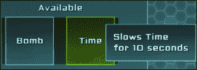
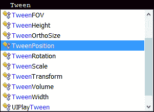
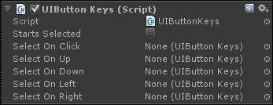
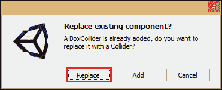
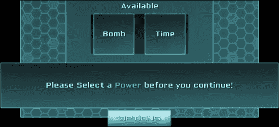

# 第四章：C# 与 NGUI

在本章中，我们将讨论使用 NGUI 的 C# 脚本。我们将学习如何处理事件并与它们交互。我们将使用它们来：

+   播放动画和补间

+   通过代码使用本地化文本更改标签

+   为我们的 UI 添加键盘键

+   创建通知和工具提示

我们还将看到一些 NGUI 的面向代码的组件，例如事件转发和消息发送。

# 事件方法

当使用 C# 与 NGUI 一起使用时，有一些方法您将在需要知道对象当前是否被悬停、按下或点击时经常使用。

如果您将脚本附加到具有碰撞器的任何对象上（例如，按钮或 3D 对象），您可以在脚本中添加以下有用的方法来捕获事件：

+   `OnHover(bool state)`: 当对象被悬停或取消悬停时调用此方法。`state` 布尔值给出悬停状态；如果 `state` 是 `true`，则光标刚刚进入对象的碰撞器。如果 `state` 是 `false`，则光标刚刚离开碰撞器的边界。

+   `OnPress(bool state)`: 此方法与之前的 `OnHover()` 方法完全相同，只是在对象被按下时调用。它与触摸或点击一起工作。如果您需要知道用于按下对象的鼠标按钮，请使用 `UICamera.currentTouchID` 变量；如果此 int 等于 -1，则表示左键点击。如果等于 -2，则表示右键点击。最后，如果等于 -3，则表示中键点击。

+   `OnClick()`: 此方法与 `OnPress()` 类似，但此方法仅在点击被验证时调用，即 `OnPress(true)` 事件之后跟随 `OnPress(false)` 事件。它与鼠标点击和触摸一起工作。

    ### 注意

    您还可以使用 `OnDoubleClick()` 方法，它的工作方式相同。

+   `OnDrag(Vector2 delta)`: 在鼠标或触摸在 `OnPress(true)` 和 `OnPress(false)` 事件之间移动的每一帧调用此方法。`Vector2` `delta` 参数给出对象自上一帧以来的移动。

+   `OnDrop(GameObject droppedObj)`: 当对象被丢弃到附加此脚本的 GameObject 上时调用此方法。丢弃的 GameObject 作为 `droppedObj` 参数传递。

+   `OnSelect()`: 当用户点击对象时调用此方法。除非另一个对象被点击或对象被取消选择（点击空白处），否则不会再次调用。

+   `OnInput(string text)`: 当用户在选中对象时输入文本时调用此方法。`text` 参数给出输入的文本。

+   `OnTooltip(bool state)`: 当光标在对象上超过由 **UICamera** 的 **Tooltip Delay** 检查器参数定义的持续时间时调用此方法。如果 **UICamera** 的 **Sticky Tooltip** 布尔值被选中，则工具提示将保持可见，直到光标移出 Collider 的边界，否则工具提示将在光标移动时消失。

+   `OnScroll(float delta)`: 当鼠标的滚轮在对象上悬停时移动时，此方法会被调用——delta 参数给出了滚动量及其方向。

+   `OnKey(KeyCode key)`: 当用户在对象被选中时点击一个键，此方法会被调用。按下的键存储在`key`参数中。

### 注意

如果您将脚本附加到 3D 对象以捕获这些事件，请确保它位于`UICamera`的`Event` `Mask`中包含的层。

## 创建工具提示

现在我们使用`OnTooltip()`事件来显示我们的工具提示，如下截图所示：



我们还将确保它使用与 NGUI 集成的集成方法进行本地化。

### 工具提示引用

首先，我们将创建一个在需要时显示的工具提示。以下是执行此操作的步骤：

1.  使用*Ctrl* + *D*选择并复制我们的**Help** GameObject。然后执行以下步骤：

    1.  将此新副本重命名为`Tooltip`。

    1.  在**UIPanel**中将**Depth**设置为`4`。

    1.  将**UIPanel**中的**Clipping**设置为**None**。

    1.  移除其**Box Collider**组件。

    1.  移除其**UIDrag** `Object`组件。

    1.  移除其**UIAnchor**组件。

    1.  将其**Transform**位置重置为{`0`, `0`, `0`}。

1.  选择我们的新**Background**，它是**Tooltip**的子 GameObject。然后执行以下步骤：

    1.  将其**Depth**值设置为`0`。

    1.  将其**Pivot**参数设置为**Top Left**（左箭头 + 上箭头）。

    1.  将其**Transform**位置重置为{`0`, `0`, `0`}。

    1.  将其**Dimensions**设置为`200` x `50`。

1.  选择**Label**，它是**Tooltip**的子 GameObject。然后执行以下步骤：

    1.  将其**Depth**设置为`1`。

    1.  将其文本更改为`This is a Tooltip`。

    1.  将其**Overflow**参数更改为**Resize Height**。

    1.  移除其**Tween Position**组件。

    1.  移除其**UILocalize**组件。

    1.  将其**Pivot**参数设置为**Top Left**（左箭头 + 上箭头）。

    1.  将其**Transform**位置设置为{`15`, `-15`, `0`}。

    1.  将其**Dimensions**参数设置为`200` x `20`。

1.  选择我们的**Tooltip** GameObject。

1.  通过导航到**Component** | **NGUI** | **UI**并为所选对象附加一个**Tooltip**，执行以下步骤：

    1.  将我们的**Label** GameObject 从**Tooltip**拖到其**Text**字段。

    1.  将我们的**Window** GameObject 从**Tooltip**拖到其**Background**字段。

好的。我们的工具提示已经准备好显示。我们已将**Tooltip**下的**Label**的**Pivot**参数设置为**Top left**，位置为{`15`, `-15`, `0`}，这将强制在文本和背景精灵之间产生一个边距。

**Overflow**参数将允许文本仅按高度调整大小，这将使我们的工具提示即使在长工具提示的情况下也能保持一致——**Background**精灵将自动调整大小以适应**Label** GameObject。

### 显示工具提示

我们现在必须显示工具提示。为了做到这一点，我们只需要使用`OnTooltip()`事件，在其中我们将创建一个新的带有本地化文本的工具提示。

在 **项目** 视图中，选择我们的 **Time** 和 **Bomb** 预制件，并为其创建并添加一个新的 `TooltipManager.cs` C# 脚本。

你现在可以打开这个新的 `TooltipManager.cs` 脚本，并声明以下枚举，它将定义必须显示哪种类型的工具提示：

```cs
//Enum to define which type of tooltip must be shown
public enum Type
{
  Bomb,
  Time
}

//Declare the Type enum variable
public Type type;
```

好的，现在添加以下 `OnTooltip()` 方法，它将创建一个带有本地化文本的工具提示，其类型取决于当前类型：

```cs
//When a Tooltip event is triggered on this object
void OnTooltip(bool state)
{
  //If state is true, create a new Tooltip depending on the type
  if(state)
    UITooltip.ShowText(Localization.instance.Get(type.ToString() + "Tooltip"));
  //If state is false, hide tooltip by setting an empty string
  else
  UITooltip.ShowText("");
}
```

保存脚本。如您所见，我们使用了一个有用的 `Localization.instance.Get(string key)` 方法，它返回与传递的 `key` 参数相对应的本地化文本。您现在可以通过代码随时将标签更改为本地化文本！

### 注意

要使用 `Localization.instance.Get(string key)`，您的标签不得附加 **UILocalize** 组件；否则，**UILocalize** 的值将覆盖您分配给标签的任何内容。

好的，我们已经添加了代码来显示带有本地化文本的工具提示。现在我们必须使用以下代码将这些本地化字符串添加到 `English.txt` 文件中：

```cs
BombTooltip = Explodes all\nenemies at once
TimeTooltip = Slows Time\nfor 10 seconds
```

类似地，在 `French.txt` 文件中添加以下行：

```cs
BombTooltip = Détruit tous les ennemis d'un coup
TimeTooltip = Ralentit le temps pour 10 secondes
```

保存这些文件，然后返回 Unity，通过执行以下步骤来分配 **TooltipManager** 类型变量的值：

1.  在 **项目** 视图中，选择我们的 **Bomb** 预制件，并在 **TooltipManager** 中将其 **Type** 字段设置为 `Bomb`。

1.  在 **项目** 视图中，选择我们的 **Time** 预制件，并在 **TooltipManager** 中将其 **Type** 字段设置为 **Time**。

    点击播放按钮。当您将光标放在 **可用能力** 槽中的 **Bomb** 或 **Time** 能力上时，我们的本地化工具提示就会出现！我实际上觉得延迟太长了。让我们纠正一下。

1.  从 **UI Root (2D**) 中选择我们的 **Camera** GameObject，并在 **UICamera** 中将其 **Tooltip Delay** 值设置为 `0.3`。

这样更好——我们的本地化工具提示在悬停 0.3 秒后出现。

# 缓动方法

你可以通过在您最喜欢的 IDE 中的任何方法中简单地输入 `Tween` 来查看所有可用的缓动方法。您将看到由于自动完成而显示的 `Tween` 类列表，如下截图所示：



这些类的一个优点是它们只需一行即可工作，并且不需要每帧执行；您只需调用它们的 `Begin()` 方法即可！

在这里，我们将对小部件应用缓动，因为我们场景中只有这些。但请注意，它以完全相同的方式与其他 GameObjects 一起工作，因为 NGUI 小部件是 GameObjects。

## 主菜单出现

让我们使用 `TweenPosition` 类使我们的主菜单在启动时从屏幕顶部出现。我们首先将使用只有一行的一个简单的缓动，然后我们将添加一个带有延迟的缓动效果，使其看起来更美观。

### 简单缓动

我们可以在 **主菜单** 中的 **Container** GameObject 上添加一个 **Tween Position** 组件，但我们需要看看如何在代码中创建 **Tween**。以下是我们这样做的方式：

1.  从 **项目** 视图中选择我们的 **Container** GameObject，并在其中创建并添加一个新的 `AppearFromAbove.cs` C# 脚本。

1.  现在打开这个新的`AppearFromAbove.cs`脚本并编辑`Start()`方法，使其首先将`Container`中的`position`值设置为高于屏幕高度。然后在一秒内将其 Tween 回`{0, 0, 0}`，如下所示：

    ```cs
    void Start () 
    {
      //First, set the Menu's Y position to be out of screen:
      this.transform.localPosition = new Vector3(0,1080,0);
      //Start a TweenPosition of 1 second towards {0,0,0}:
      TweenPosition.Begin(this.gameObject, 1, Vector3.zero);
    }
    ```

点击播放按钮。现在我们的主菜单只用了两行代码就从屏幕顶部降下来！

### 平滑 Tween

我们创建了一个简单的 Tweens，但你也可以配置你的 Tweens 以添加平滑方法和延迟，例如。

让我们尝试通过将`Start()`方法的代码替换为以下代码来尝试它：

```cs
void Start () 
{
  //First, set the Menu's Y position to be out of screen
  this.transform.localPosition = new Vector3(0, 1080, 0);
  //Start a TweenPosition of 1.5 second towards {0,0,0}
  TweenPosition tween = TweenPosition.Begin(this.gameObject, 1.5f, Vector3.zero);
  //Add a delay to our Tween
  tween.delay = 1f;
  //Add an easing in and out method to our Tween
  tween.method = UITweener.Method.EaseInOut;
}
```

点击播放按钮。我们已经为我们的 Tweens 添加了一个不错的`EaseInOut`方法。菜单的垂直移动现在更平滑，所有这些都是通过代码添加的。以下是可以添加到 Tweens 以产生效果的不同的 Tweens 方法列表：

+   `Linear`: 这将创建一个简单的线性 tween—没有平滑

+   `EaseIn`: 这将在动画开始时使 tween 平滑

+   `EaseOut`: 这将在动画结束时使 tween 平滑

+   `EaseInOut`: 这将在动画开始和结束时使 tween 平滑

+   `BounceIn`: 这将在动画开始时产生弹跳效果

+   `BounceOut`: 这将在动画结束时产生弹跳效果

现在你已经知道了如何使用`TweenPosition`类，你就可以使用其他 Tweens，例如`TweenScale`、`TweenRotation`、`TweenColor`或任何其他可用的 Tweens，因为它们的工作方式相同！

# 使用按键进行导航

我们创建的 UI 可以通过鼠标操作。我们可以轻松地添加按键导航以支持键盘和控制器。存在一个**UIButton Keys**组件用于此目的。你必须将其添加到任何你希望可以通过按键访问的 UI 元素（默认的**检查器**窗口如下）：



让我们尝试使用我们的**播放**、**退出**和**选项**按钮：

1.  选择我们的**退出**、**选项**和**播放**GameObject。

1.  通过导航到**组件** | **NGUI** | **交互**，为它们附加一个**按钮按键**组件。

1.  将出现一个弹出窗口，如下面的截图所示，询问你是否要替换或添加碰撞体：

1.  这是因为它们已经有一个**盒子碰撞体**组件。点击**替换**。

1.  选择**播放**按钮并执行以下步骤：

    1.  检查其**开始选中**布尔值。

    1.  将我们的**退出**按钮拖入**左侧选中**字段。

    1.  将我们的**退出**按钮拖入**右侧选中**字段。

    1.  将我们的**选项**按钮拖入**向下选中**字段。

1.  选择**退出**按钮并执行以下步骤：

    1.  将我们的**播放**按钮拖入**左侧选中**字段。

    1.  将我们的**播放**按钮拖入**右侧选中**字段。

    1.  将我们的**选项**按钮拖入**向下选中**字段。

1.  选择**选项**按钮并执行以下步骤：

    1.  将我们的**退出**按钮拖入**左侧选中**字段。

    1.  将我们的**播放**按钮拖入**右侧选中**字段。

    1.  将我们的 **Play** 按钮拖入 **Selected On Up** 字段。

点击播放。默认情况下，我们的 **Play** 按钮被选中，如果您使用键盘箭头，您将能够导航到这三个按钮并通过 *Return* 验证。

# 错误通知

我们希望用户在输入字段中输入昵称并选择力量值之后才能启动游戏。

目前，用户可以无视输入和选定的力量值启动游戏。让我们通过以下截图所示的方法来纠正这个问题，防止游戏启动并通知用户：



我们将通过代码使用 TweenScale，将通知从 `{0, 0, 0}` 渐进缩放到 `{1, 1, 1}`，按照以下步骤进行：

1.  在 **Hierarchy** 窗口中选择我们的 **Tooltip** GameObject。

1.  使用 *Ctrl* + *D* 进行复制。

1.  将这个新复制的文件重命名为 `Notification` 并执行以下步骤：

    1.  在 **UIPanel** 中将 **Depth** 参数设置为 5。

    1.  移除其 **UITooltip** 组件。

    1.  将其 **Transform** 位置设置为 `{`0`, `-355`, `0`}`。

1.  在 `Notification` 中选择我们的 **Label** GameObject 并执行以下步骤：

    1.  将其文本更改为 `This is a Notification`。

    1.  将 **Overflow** 参数设置为 **Shrink Content**。

    1.  将其 **Pivot** 参数设置为 **Center**（中间按钮 + 中间按钮）。

    1.  将其 **Dimensions** 设置为 `550` x `80`。

    1.  将其 **Transform** 位置重置为 `{`0`, `0`, `0`}`。

1.  通过导航到 **Component** | **NGUI** | **UI** 为其附加一个 **Localize** 组件。

1.  在 `Notification` 中选择我们的 **Background** GameObject 并执行以下步骤：

    1.  将其 **Pivot** 参数设置为 **Center**（中间按钮 + 中间按钮）。

    1.  将其 **Transform** 位置重置为 `{`0`, `0`, `0`}`。

    1.  将其 **Dimensions** 参数设置为 `600` x `100`。

1.  选择我们的 **Notification** GameObject 并将其 **Transform** 缩放设置为 `{`0`, `0`, `1`}`。

1.  创建并附加一个新的 `NotificationManager.cs` C# 脚本到它，并打开这个新的 `NotificationManager.cs` 脚本。

好的。我们已经有了缩放比例为 `{`0`, `0`, `1`}` 的 **Notification** GameObject，现在让我们使用新的 `NotificationManager.cs` 脚本通过代码在 **Notification** GameObject 激活时启动一个 TweenScale。

我们将使用枚举来定义将显示哪种通知类型。这次，我们将使用 **UILocalize** 组件进行本地化文本，并通过代码更改 `key` 参数，而不是使用 `Localization.instance.Get()` 方法。

首先，在 `NotificationManager.cs` 脚本中声明以下变量，如下代码片段所示：

```cs
//Create an enum to define Notification Type
public enum Type
{
  Nickname,
  Power
}
//Declare necessary variables
public UILocalize loc;
public Type type;
//Store the Notification to access it in static methods
public static NotificationManager instance;
```

保存脚本。我们将在脚本中将 `NotificationManager` 的实例存储在场景中，以便能够轻松地从任何其他脚本访问它。

首先，让我们使用 **Inspector** 窗口分配我们的 `Loc` 变量。

选择我们的 **Notification** GameObject 并将 **Notification** 中的 **Label** GameObject 拖入 **Loc** 字段。

好的，现在回到我们的`NotificationManager.cs`脚本。我们将首先创建一个带有静态实例变量初始化的`Awake()`方法，并在游戏开始时禁用我们的**Notification**游戏对象，使其不可见：

```cs
void Awake()
{
  //Set the static instance to this NotificationManager
  instance = this;
  //Deactivate Notification GameObject on awake
  gameObject.SetActive(false);
}
```

现在我们已经编写了`Awake()`方法，让我们创建一个`OnEnable()`方法，它将声明`TweenScale`对象并设置`UILocalize`组件的相应`key`参数，如下所示：

```cs
void OnEnable () 
{
  //Start a TweenScale of 0.5 second towards {1, 1, 1}
  TweenScale tween = TweenScale.Begin(this.gameObject, 0.5f, new Vector3(1,1,1));
  //Add an easing in and out method to our Tween
  tween.method = UITweener.Method.EaseInOut;
  //Set the Localize key to TypeName + "Notification"
  loc.key = type.ToString() + "Notification"; 
  //Force Update the UILocalize with new key
  loc.Localize();
}
```

### 注意

不要忘记，如果在**UILocalize**组件已经激活时更改`key`参数，您必须调用其`Localize()`方法来更新它。

很好。点击播放按钮。当 Unity 运行播放模式时，激活我们的**Notification**游戏对象。

你可以看到我们的**Notification**游戏对象平滑地出现。让我们添加一个`Show()`方法，通过代码显示它，如下所示：

```cs
public void Show(Type notificationType, float duration)
{
  //If there is no current Notification
  if(!gameObject.activeInHierarchy)
  {
    //Set the asked Notification type
    type = notificationType;
    //Enable our Notification on scene
    gameObject.SetActive(true);
    //Start Couroutine to remove in asked duration
    StartCoroutine(Remove(duration));
  }
}
```

之前的方法通过激活其对应的游戏对象来显示我们的通知。`OnEnable()`方法将执行动画和本地化。

在其最后一行，`Show()`方法启动了`Remove()`协程。让我们添加以下`Remove()`协程，它将在给定的时间后使通知消失：

```cs
public IEnumerator Remove(float duration)
{
  //Wait for the Notification display duration 
  yield return new WaitForSeconds(duration);
  //Start the TweenScale to disappear
  TweenScale.Begin(gameObject, 0.5f, new Vector3(0,0,1));
  //Wait for 0.5s, the duration of the TweenScale
  yield return new WaitForSeconds(0.5f);
  //Deactivate the Notification GameObject
  gameObject.SetActive(false);
}
```

太好了。现在我们可以在`English.txt`中添加正确的本地化字符串，如下所示：

```cs
NicknameNotification = [AAFFFF]Please Enter a [00FFAA]Nickname[AAFFFF] before you continue!
PowerNotification = [AAFFFF]Please Select a [00FFAA]Power[AAFFFF] before you continue!
```

我们也可以在`French.txt`中添加正确的字符串，如下所示：

```cs
NicknameNotification = [AAFFFF]Merci d'entrer un [00FFAA]Pseudo[AAFFFF] avant de continuer !
PowerNotification = [AAFFFF]Merci de sélectionner un [00FFAA]Power-Up[AAFFFF] avant de continuer !
```

如果玩家按下播放按钮而没有输入昵称，或者他没有选择一个能力，我们现在可以调用我们的`Show()`方法。

为了做到这一点，我们将从我们的`Play`按钮中移除当前的**点击加载关卡**组件，并将其附加一个新的`LaunchValidator.cs`脚本：

1.  选择我们的`Play`按钮游戏对象并移除其**点击加载关卡**组件。

1.  创建并附加一个新的`LaunchValidator.cs` C#脚本到它上，并打开这个新的`LaunchValidator.cs`脚本。

在这个新脚本中，我们需要我们的昵称的**UIInput**组件。让我们如下声明它：

```cs
public UIInput nicknameInput;
```

保存脚本。现在让我们在**检查器**窗口中分配这个变量。然后选择我们的**Play**游戏对象，并将我们的**Input**游戏对象从**昵称输入**字段中的**昵称**拖到其**启动验证器**的**昵称输入**字段。

返回到我们的`LaunchValidator.cs`脚本。我们现在将添加一个`OnClick()`方法，在实际上载游戏之前添加昵称和能力的验证，如下面的代码片段所示：

```cs
void OnClick() 
{
  //If the nickname input is empty...
  if(string.IsNullOrEmpty(nicknameInput.value))
  {
    //...Show a Nickname error notification for 2.5 sec
    NotificationManager.instance.Show(NotificationManager.Type.Nickname, 2.5f);
  }
  //If there's a nickname but no Power is selected...
  else if(GameManager.SelectedPower == Power.Type.None)
  {
    //...Show a Power error notification for 2.5 sec...
    NotificationManager.instance.Show(NotificationManager.Type.Power, 2.5f);
  }
  //If there is a nickname AND a Power selected...
  else
  {
    //... Load Game Scene
    Application.LoadLevel("Game");
  }
}
```

点击播放按钮。太完美了，我们现在有了通知，如果用户没有输入昵称或没有选择能力，将阻止游戏启动！

# 保存昵称

在第二章 *创建小部件*中，我们在昵称的**自动保存键**参数中输入了`Nickname`。它的工作原理是这样的：如果用户输入昵称并按下*Return*，输入的标签`string`值将被保存在`PlayerPrefs()`方法中的`Nickname`键。

这里的问题是：如果用户按下*Return*，昵称才会被保存。这是一个问题——大多数用户会在输入名字并直接选择他们的力量后不按*Return*——我敢肯定你也这样做过。

我们需要在用户点击**播放**按钮而不按*Return*时，将字符串保存在`PlayerPrefs()`方法中。

我们必须在`LaunchValidator.cs`脚本的`OnClick()`方法末尾添加一行，以便在加载游戏场景之前保存昵称的输入`value`。在`Application.LoadLevel("Game")`行之前，添加以下内容：

```cs
//Save the Nickname to PlayerPrefs before launch
PlayerPrefs.SetString("Nickname", nicknameInput.value);
```

现在无论用户做什么，在启动游戏之前，用户的昵称都会被保存！

# 发送消息

在**检查器**窗口中，我们之前用来在精确事件上调用方法的`Notify`参数通常足以发送消息。然而，你可能需要向另一个 GameObject 及其子对象发送消息。

这时，**UIButton 消息**组件就派上用场了。我们将使用它来在游戏实际退出之前缩小我们的**MainMenu**GameObject 的尺寸：

1.  选择我们的**退出**GameObject，并执行以下步骤：

    1.  通过导航到**组件** | **NGUI** | **交互**，将其附加一个**按钮消息**组件。

    1.  将我们的**容器**GameObject 从`MainMenu`拖动到其**目标**字段。

    1.  在**函数名称**参数中输入`CloseMenu`。

1.  在**MainMenu**中选择我们的**容器**GameObject，并打开其附加的`AppearFromAbove.cs`脚本。

在此脚本中，添加一个简单的`CloseMenu()`方法，包含以下行：

```cs
void CloseMenu()
{
  //Tween the menu's scale to zero
  TweenScale.Begin(this.gameObject, 0.5f, Vector3.zero);
}
```

现在我们需要延迟执行`Application.Quit()`方法，否则我们看不到我们的**Tween**。我们通过以下步骤来完成：

1.  选择我们的**游戏管理器**GameObject，并执行以下步骤：

    1.  打开其附加的`GameManager.cs`脚本。

    1.  用以下行替换`ExitPressed()`方法中的行：

        ```cs
        //Call the exit function in 0.5s
        Invoke("QuitNow", 0.5f);
        ```

1.  添加一个新的`QuitNow()`方法来实际退出应用程序，如下所示：

    ```cs
    void QuitNow()
    {
      Application.Quit();
    }
    ```

    保存脚本并点击播放按钮。当你退出应用程序时，我们的**菜单**将自动消失。这是因为`Invoke()`方法使我们能够以`延迟`作为第二个参数调用函数。

让我们通过以下步骤在玩家启动游戏时也添加这个不错的缩放效果：

1.  选择我们的**播放**按钮 GameObject，并打开其附加的`LaunchValidator.cs`脚本。

1.  我们将需要从**MainMenu**中的**容器**GameObject。声明如下：

    ```cs
    public GameObject menuContainer;
    ```

1.  返回 Unity，并按照以下方式分配这个新的**menuContainer**变量：

    1.  选择我们的**播放**按钮 GameObject，并将我们的**容器**GameObject 从**MainMenu**拖动到其**MenuContainer**字段。

    1.  返回到我们的`LaunchValidator.cs`脚本。我们只需将`Application.LoadLevel("Game")`行替换为以下行：

        ```cs
        menuContainer.SendMessage("CloseMenu");
        Invoke("LaunchNow", 0.5f);
        ```

1.  好的，现在我们可以添加一个新的`LaunchNow()`方法来实际启动游戏场景，如下所示：

    ```cs
    void LaunchNow()
    {
      Application.LoadLevel(levelName);
    }
    ```

很好，在退出或游戏启动时，菜单会缩放出来，这使得过渡更加流畅。我们还学习了如何使用 **UIButton Message** 组件。

### 注意

我们不需要勾选 **包含子项** 的布尔值。但值得注意的是，你可以一次性向目标及其所有子项发送消息。

# 转发事件

在某些情况下，另一个组件可能很有用：**UIForward Events**。此组件允许将附加到它的 GameObject 的事件发送到场景中的另一个 GameObject。例如，它可以用于创建多选。让我们尝试一下，使其更清晰。执行以下步骤：

1.  在 **网格** 中选择我们的 **炸弹** GameObject。

1.  通过导航到 **组件** | **NGUI** | **交互** 并将其添加到 **Forward Events** 组件，然后执行以下步骤：

    1.  将我们的 **时间** GameObject 从 **网格** 拖动到 `目标` 字段。

    1.  勾选 **OnHover** 布尔值。

    1.  勾选 **OnPress** 布尔值。

    1.  勾选 **OnDrag** 布尔值。

点击播放按钮。如果你悬停、按下并拖动 **炸弹** 力量，**时间** 力量也会以相同的方式反应！这就是事件转发的作用。

现在你已经看到它是如何工作的，你可以从我们的 **炸弹** GameObject 中移除 **UIForward Events** 组件。

# 摘要

在本章中，我们使用 C# 和 NGUI 创建了本地化的工具提示和错误通知。我们学习了如何使用 Tween 类通过简化方法使主菜单平滑地出现和消失。

我们还知道如何使用键在 UI 中进行导航，并且当游戏启动时，我们的昵称现在已保存。你现在知道如何使用 NGUI 组件发送消息和转发事件，这可能在将来对你有所帮助。

是时候创建一个新的 `Game.unity` 场景并构建一个完整的可滚动视口，这是 第五章，*构建可滚动视口* 的主题。
