# 第六章. 图集和字体自定义

在本章中，我们将学习如何创建一个新的图集并添加我们自己的资产。在本章结束时，你将知道如何处理正常、切片和瓦片精灵。

我们将使用这些新资产来添加图标到我们的能力和选定的能力。我们还将更改不同窗口的背景，并为我们的项目添加一个新的字体。

一个小练习将让你在我们进入最后一章之前，根据你的喜好自定义主菜单。首先，我们需要学习如何创建我们自己的**游戏**图集。

# 图集预制体

使用 NGUI，图集预制体用于包含精灵和字体。它由以下部分组成：

+   包含所有精灵和字体的大型纹理文件

+   分配了此纹理文件和特定着色器的材质

图集预制体上附加了一个**UIAtlas**组件。它的目的是包含关于精灵在大型纹理中位置和大小的信息。

使用只包含所有精灵的一个大纹理，而不是使用多个单独的小纹理，这要高效得多。

# 创建新的图集

让我们创建自己的图集来存储我们的精灵和新字体。首先，打开我们的**菜单**场景。为了做到这一点，我们将使用**图集制作器**向导。

导航到**NGUI** | **图集制作器**，或者按*Alt* + *Shift* + *M*来显示以下屏幕：

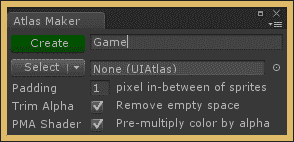

要创建图集，请执行以下步骤：

1.  在第一个字段中，输入新图集的名称为`Game`。

1.  点击绿色的**创建**按钮。

我们的新**游戏**图集已经创建完成，并在**图集制作器**向导中被选中。目前它是空的。让我们来改变这一点。

### 注意

你可以创建尽可能多的图集，但请记住，同时渲染多个图集会增加绘制调用的数量。

# 将精灵添加到图集中

让我们在新的**游戏**图集中添加一些精灵。我们将添加以下三种不同类型的精灵：

+   **简单**精灵：正如其名所示，它只是在屏幕上显示的图像

+   **切片**精灵：在这种情况下，图像被分成九部分，并且可以调整大小而不会拉伸角落

+   **瓦片**精灵：在这种情况下，瓦片图案可以无限重复

让我们从**简单**精灵开始。

## 简单精灵

是时候创建两个精灵，炸弹和时间，它们将展示我们的能力。首先，我们需要创建这些精灵并将它们添加到我们的**游戏**图集中。它们将看起来如下截图所示：

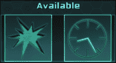

### 注意

你可以自己创建它们，或者从[`goo.gl/bZu4mF`](http://goo.gl/bZu4mF)下载`Assets.zip`文件。

如果你希望创建自己的精灵，128 x 128 的大小就足够了。你可以将它们保存为`.png`以支持透明度，或者作为`.psd`文件——当它们被导入 Unity 项目时，将转换为正确的格式。

### 将精灵添加到图集中

当你的炸弹和计时精灵准备好，或者从上一个链接下载后，将它们放置在你项目中的新 `Assets`/`Textures` 文件夹中。然后，执行以下步骤：

1.  从 **NGUI** 中打开 **Atlas Maker**，或按 *Alt* + *Shift* + *M*。

1.  确保我们新的 **Game** 图集被选中，如图所示：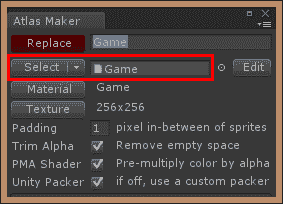

1.  在 **项目** 视图中，选择我们新的 **Bomb** 和 **Time** 纹理。

1.  在 **Atlas Maker** 中点击 **添加/更新所有** 按钮。

好的。我们的两个新精灵已经添加到 **Game** 图集中。

### 可用能力图标

让我们在场景中的 **Time** 和 **Bomb** 预制件上添加图标，并执行以下步骤：

1.  在 **层次** 视图中，通过导航到 **PowersContainer** | **Grid** | **Bomb** 选择 **Background**，然后执行以下步骤：

    1.  复制它。

    1.  将这个新副本重命名为 `Icon`。

    1.  在 **UISprite** 中将其 **Sprite 类型** 参数更改为 **简单**。

    1.  将其 **深度** 设置为 `6` 以确保它可以在背景之上显示。

1.  在 **UISprite** 中点击 **Atlas** 按钮，并在弹出的窗口中选择我们新的 **Game** 图集。

    ### 备注

    如果新的 **Game** 图集不在列表中可见，从 **项目** 视图中将其拖到 **Atlas** 按钮旁边的字段中。

1.  在 **UISprite** 中点击 **Sprite** 按钮，并在弹出的窗口中选择我们的 **Bomb** 精灵。

1.  从 **Bomb** 中选择 **Label** GameObject，然后执行以下步骤：

    1.  删除它——图标和工具提示就足够了！

    1.  弹出一个窗口，询问你是否要继续，因为你将失去预制件连接。点击 **继续**。

1.  从我们的 **Grid** 中选择 **Bomb** GameObject。

1.  在 **检查器** 视图中点击 **应用** 按钮以更新预制件。

好的，我们的 **Bomb** 预制件已经更新了新的图标。让我们通过以下步骤添加 **Time** 预制件的图标：

1.  选择我们的 **Icon** GameObject **Bomb** 并执行以下步骤：

    1.  复制它。

    1.  将这个副本拖到 **Time** GameObject 内。

    1.  将其 **变换** 位置重置为 `{`0`, `0`, `0`}`。

    1.  将其 **Sprite** 参数更改为我们自己的 **Time** 精灵。

    1.  将其 **尺寸** 更改为 `75` x `75`。

1.  从 **Time** 中选择 **Label** GameObject，然后执行以下步骤：

    1.  删除它——图标和工具提示就足够了！

    1.  弹出一个窗口，询问你是否要继续，因为你将失去预制件连接。点击 **继续**。

1.  从 **Grid** 中选择 **Time** GameObject。

1.  在 **检查器** 视图中点击 **应用** 按钮以更新预制件。

好的，我们的可拖动能力预制件现在有了自己的图标。

### 选择能力图标

让我们也为我们的 **SelectedBomb** 和 **SelectedTime** 预制件添加图标，使它们看起来更漂亮：

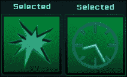

执行以下步骤以实现此目的：

1.  从 **项目** 视图，将 **SelectedBomb** 预制件拖到我们的 **Surface** GameObject。

1.  在**层次结构**视图中，从**Grid/****Bomb**中选择我们的**图标**游戏对象，并执行给定的步骤：

    1.  复制它。

    1.  将这个副本拖动到我们新的**SelectedBomb**实例中。

    1.  将其**变换**位置重置为{`0`, `0`, `0`}。

    1.  将其**深度**设置为`5`。

    1.  将其**尺寸**更改为`120` x `120`。

1.  从**SelectedBomb**中选择**标签**游戏对象并删除它。

1.  从**Surface**中选择**SelectedBomb**游戏对象，并执行给定的步骤：

    1.  在**检查器**视图中点击**应用**按钮以更新预制体。

    1.  从场景中删除**SelectedBomb**实例。

让我们按照相同的步骤来处理我们的**SelectedTime**预制体：

1.  从**项目**视图中，将**SelectedTime**预制体拖动到我们的**Surface**游戏对象中。

1.  在**层次结构**视图中，从**Time**中选择我们的**图标**游戏对象，并执行以下步骤：

    1.  复制它。

    1.  将这个副本拖动到我们新的**SelectedTime**实例中。

    1.  将其**变换**位置重置为{`0`, `0`, `0`}。

    1.  将其**深度**设置为`5`。

    1.  将其**尺寸**更改为`100` x `100`。

1.  从**SelectedTime**中选择**标签**游戏对象，并删除它。

1.  从**Surface**中选择**SelectedTime**游戏对象，并执行以下步骤：

    1.  在**检查器**视图中点击**应用**按钮以更新预制体。

    1.  从场景中删除**SelectedTime**实例。

就这样。我们有了我们自己的两个用于我们力量的图标。现在，我们可以学习如何创建和配置我们自己的九切片精灵。

## 切片精灵

我们在这本书中一直使用暗切片精灵。让我们创建自己的。然后，我们将更改**主菜单**的功率选择框和背景精灵，如图所示：

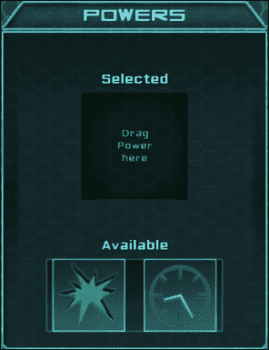

### 向图集中添加精灵

你可以使用一个 16 x 16 的方形精灵，例如暗精灵。如果你希望有更大的角落或添加更多细节，只需使用更大的纹理尺寸。你还可以使用我`Assets.zip`存档中可用的 64 x 64 的`Window.png`文件。

当你的新窗口精灵准备好后，将其放置在`Assets/Textures`文件夹中，并执行以下步骤：

1.  通过导航到**NGUI** | **图集制作器**或*Alt* + *Shift* + *M*打开**图集制作器**，并确保我们的新**游戏**图集被选中。

1.  从**项目**视图中的**纹理**中选择新的`Window.png`精灵文件。

1.  在**图集制作器**窗口中点击绿色的**添加/更新全部**按钮。

好的，`Window.png`已经添加到我们的**游戏**图集中，但它还没有配置。尚需。

### 配置切片精灵

窗口精灵已经添加到图集中，但我们还需要指示**UIAtlas**组件在精灵上必须进行切片的位置。让我们替换**Powers**的**背景**，并配置其切片参数。

在**层次结构**视图中，从**Powers**中选择**背景**游戏对象，并执行以下步骤：

1.  将**UISprite**中的**图集**参数更改为我们的**游戏**图集。

1.  将其**精灵**更改为我们新的**Window**精灵。

1.  点击**精灵**字段旁边的**编辑**按钮，如图所示：

我们现在在精灵的参数窗口中。在这里，我们可以配置其**尺寸**、**边框**和**填充**。设置这些**边框**值以定义切片线：

如果您创建了您自己的精灵，之前截图中的值可能会有所不同。

### 注意

当您更改**边框**值时，在**预览**窗口的**检查器**视图底部会出现点线。

**窗口**精灵应该在**预览**窗口中切片（如图所示）：

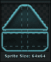

当您输入了四个值后，您可以通过点击绿色**返回背景**按钮返回到我们之前的位置。

现在我们已经有一个功能性的切片精灵，但我们需要调整功率标题的位置。在**层次**视图中，从**功率**中选择我们的**TitleLabel** GameObject，并在**UI 锚点**中将其**像素偏移**更改为{`0`, `-18`}。

太好了！我们已经配置了第一个切片精灵，并用它更改了功率选择框的背景精灵。

### 主菜单窗口

让我们更改我们的**窗口**精灵的**主菜单**。在**层次**视图中，从**容器**中选择我们的**窗口** GameObject，并执行以下步骤：

1.  将其**图集**更改为我们的**游戏**图集。

1.  将其**精灵**更改为我们新的**窗口**精灵。

**主菜单**标题没有放置在标题栏的精确位置。让我们通过以下步骤来更改这一点。

1.  从**容器**中选择**标题**GameObject，并在**UI 锚点**中将其**像素偏移**值更改为{`0`, `10`}。

1.  从**标题**中选择**背景** GameObject，并暂时将其禁用。

1.  从**容器**中选择**背景** GameObject，然后执行以下步骤：

    1.  将其**相对大小**在**UI 拉伸**中更改为{`1`, `0.95`}。

    1.  将其**像素偏移**在**UI 锚点**中更改为{`0`, `-17`}。

太好了。看起来更好了。如果您愿意，您可以用我们新的窗口精灵更改昵称框的背景精灵。您甚至可以使用包含在`Assets.zip`文件中的切片精灵`Button.png`来更改按钮。

### 注意

`Button.png`文件也可以用于非按钮背景，例如通知或工具提示背景。试试看！

## 瓦片精灵

让我们添加一个瓦片精灵来为我们的**游戏**场景创建一个空间背景。

您可以使用`Assets.zip`存档中的`Space.jpg`文件，或者您可能创建一个代表太空中的星星的 256 x 256 瓦片精灵。将`Space.jpg`精灵放在`Assets/Textures`文件夹中，然后执行以下步骤：

1.  打开我们的**游戏**场景。

1.  通过导航到**NGUI** | **Atlas Maker**或*Alt* + *Shift* + *M*打开**Atlas Maker**。然后执行以下步骤：

    1.  在**项目**视图中，从**纹理**中选择我们新的`Space.jpg`文件。

    1.  点击 **Atlas Maker** 窗口的 **添加/更新全部** 按钮。

好的，新的 `Space.jpg` 精灵已经添加到我们的 **Game** 图集。让我们改变 **Game** 场景的背景，使其看起来像我们在太空中。

1.  从 **视口** 中选择 **背景** 游戏对象。

1.  将其 **图集** 更改为我们的 **Game** 图集。

1.  将其 **精灵** 更改为我们新的 **空间** 精灵。

1.  将其 **颜色色调** 更改为 `{`140`, `200`, `200`, `255`}`。

就这样！小星星现在正在背景中平铺。现在，是时候添加字体了。

# 添加字体

为了优化，NGUI 使用位图而不是真型字体。我们需要使用一个名为 **BMFont** 的免费第三方工具将我们的 `.ttf` 或 `.otf` 字体导出为位图，该工具由 **AngelCode** 创建。

然后，我们需要一个包含有关每个符号在导出字体位图中位置信息的 `.txt` 文件。您可以从 [www.angelcode.com/products/bmfont/](http://www.angelcode.com/products/bmfont/) 下载 BMFont。免费字体可在 [www.openfontlibrary.org/](http://www.openfontlibrary.org/) 找到。

对于我们的第一个字体，我们将使用由 *Daniel Johnson* 创建的 Pacaya 字体——它包含在 `Assets.zip` 归档中。下载、安装并启动 BMFont。通过右键单击 `Pacaya.otf` 文件并选择 **安装** 来安装字体。

## 使用 BMFont 导出字体

一旦 BMFont 启动并且 Pacaya 字体已安装，请转到 **选项** | **字体设置**。现在您可以在 **字体** 字段中选择 Pacaya 字体。**大小(px)** 字段定义了导出时字体的像素大小——将其设置为 `24` 并点击 **确定**。

我们已加载 `.otf` 文件，并且我们可以通过左键单击或点击并拖动来可视化和选择我们想要导出的字符。使用 *Ctrl* + *A* 选择所有字符。

### 注意

如果您想要导出一组字符，别忘了选择空字符——它是您的空格字符。

前往 **选项** | **导出** 选项。在这里，您必须将 **位深** 设置为 `32`。现在，您唯一需要检查的是位图的 **宽度** 和 **高度** 值。

要查看它是否足够大，请点击 **确定** 并转到 **选项** | **可视化**。以下截图显示的窗口会出现：

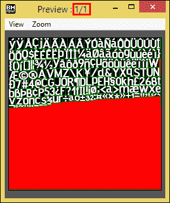

红色空间代表浪费的空间。如您所见，我们有很多浪费的空间。您必须尝试设置位图大小，尽可能减少红色空间，同时确保有足够的空间容纳所有字符。

如果您的位图大小太小，无法容纳所有字符，**预览** 窗口的标题将显示 **预览 : 1/2** 而不是 **预览 : 1/1**，如以下截图所示。然后，您应该增加位图大小，直到它显示 **预览 : 1/1**。对于已选择所有字符的 Pacaya 字体，输入 `256` x `128`。它应该看起来像以下截图所示：

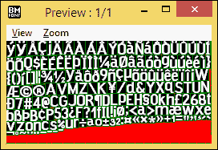

### 提示

为了优化，你应该保持其尺寸为 2 的幂。

一旦设置了正确的位图大小，返回到**选项** | **导出选项**。然后，确保**预设**字段设置为**带 alpha 通道的白色文本**，以便在**R**、**G**和**B**通道中具有**一个**值，在通道**A**中的**符号**：

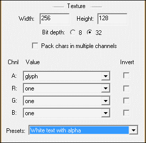

在完成之后，转到**选项** | **保存位图字体为…**并将其命名为`Pacaya`。`.fnt`文件扩展名将被自动添加。在您选择的输出文件夹中，你应该有一个`Pacaya_0.tga`文件——实际的字体位图，以及一个`.fnt`文件。

### 注意

你必须有且只有一个`.tga`文件以及你的`.fnt`文件。否则，你的位图大小太小，在重新导出之前你需要将其放大。

好的，现在将这些两个文件复制到一个新的`Assets/Fonts/Sources`文件夹。

## 在 Unity 中创建字体

我们已经有了新的字体文件。我们现在必须使用这些文件为 NGUI 创建一个新的字体。

在 Unity 中，执行以下步骤：

1.  通过导航到**NGUI** | **字体制作器**或*Alt* + *Shift* + *F*打开**字体制作器**窗口。

1.  在**项目**视图中，浏览到你的`Assets/Fonts/Sources`文件夹。

1.  将你的`Pacaya.fnt`文件拖动到**字体数据**字段中的**字体制作器**。

1.  将`Pacaya_0.tga`文件拖动到**字体制作器**中的**纹理**字段。

1.  在**字体名称**字段中输入`Pacaya`。

1.  点击**Atlas**按钮，选择我们的**游戏**Atlas。

    ### 注意

    这意味着字体的纹理将被添加到**游戏**Atlas 中，当标签显示时不会产生额外的绘制调用。

1.  在**项目**视图的`Assets/Fonts/`路径下的**Sources**文件夹中选择任何文件——我们的字体将被添加到当前文件夹，但你需要实际选择一个文件在目标位置才能使其工作。

1.  点击绿色的**创建字体**按钮。

在`Assets/Fonts/`路径下的`Sources`文件夹中已创建一个新的 Pacaya 预制件。这是 NGUI 需要用来显示字体的预制件。

在**项目**视图中选择它，并将其拖动到我们的`Assets`中的`Fonts`文件夹内。如果你找不到它，只需在**项目**视图的搜索栏中输入你的字体名称。

## 将新的字体分配给标签

现在我们已经将一个新的字体添加到我们的项目中，让我们将其分配给一个标签：

1.  打开我们的**菜单**场景。

1.  通过导航到**主菜单** | **容器** | **昵称** | **输入**选择我们的**标签**GameObject，并执行以下步骤：

    1.  点击**UILabel**中的**字体**按钮。

    1.  选择我们新的**Pacaya**字体。

### 注意

如果新字体没有出现在最近使用的字体中，在你的**项目**视图中找到它，并将其手动拖动到**UILabel**中的**字体**字段。

好的。我们已经将一个新的字体添加到我们的项目中，并将其分配给了一个标签！

# 自定义**主菜单**

我们菜单主相机的蓝色背景不太好看。让我们为相机设置一个黑色背景，并添加我们的空间平铺精灵来改善这个效果：

1.  从**锚点**中选择我们的**MainMenu** GameObject，然后通过导航到**NGUI** | **创建** | **精灵**或按*Alt* + *Shift* + *S*创建一个新的精灵。

1.  从**MainMenu**中选择新的**精灵**GameObject，并执行以下步骤：

    1.  将其重命名为`Space`。

    1.  将其**图集**类型设置为我们的**游戏**图集。

    1.  将其**精灵**设置为我们的**Space**平铺精灵。

    1.  将其**精灵类型**参数设置为**平铺**。

1.  通过导航到**组件** | **NGUI** | **UI**来为它附加一个**拉伸**组件：

1.  将其**样式**参数设置为**两者**。

你可能会注意到，我们在 Space 精灵的每次重复之间有丑陋的线条。这仅仅是因为精灵上有一个 1 像素宽的边框。我们可以通过减少精灵的 1 像素边框值来轻松纠正这个问题。

从**MainMenu**中选择我们的**Space** GameObject，然后点击**精灵**字段旁边的**编辑**按钮，如图所示：

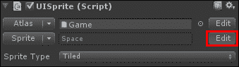

将四个**边框**参数的值设置为以下截图所示：

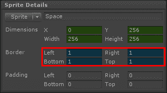

这样就更好了；我们的平铺精灵现在正确地平铺，没有任何图案之间的线条。

现在你已经学会了如何添加精灵和字体，我希望你改变我们的**主菜单**元素的背景，使其看起来更美观。你可以按照自己的意愿进行——如果你想的话，添加更多精灵，更改颜色，发挥你的想象力！

以下是一个使用**窗口**和**按钮**精灵可以实现的示例：

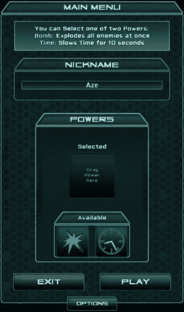

### 注意

你可能需要移动或调整 UI 元素的大小。不要忘记使用**UI 锚点**中的**像素偏移**来移动或调整大小，而不是位置。同样，对于**尺寸**——如果你想保持小部件像素完美，不要使用 Unity 的缩放工具。

# 摘要

在本章中，我们学习了如何创建一个新的图集并添加简单、切片和平铺精灵。使用这些新精灵，我们使我们的**能力**、**选择能力**和**主菜单**窗口比以前看起来更好。

现在，你已经知道了如何使用 BMFont 将字体导出为位图并创建一个新的字体预制件用于 NGUI。

在我们继续到最后的第七章，*使用 NGUI 创建游戏*之前，你应该已经更改了你的**主菜单**的外观，使其看起来更美观。
