# 第二章 Unity 和 Playmaker 的用户界面

在上一章中，我们探讨了下载和安装 Unity、Playmaker 以及为使用本书设置项目的过程。你已经学会了如何在 Unity 窗口内移动面板以组织你的工作流程，以及如何更改一些项目设置。

在本章中，我们将更详细地查看你迄今为止遇到的所有 Unity 面板和界面元素，以及一些你尚未见过的元素，包括 Playmaker 的 **动作** 面板和 **有限状态机** （**FSM**） 视图。你还将学习如何创建简单的游戏对象并修改它们的属性，如位置、位置和缩放。

# 界面概述和主菜单

Unity 的界面是模块化的：这意味着你可以拖动其元素，将它们附加到编辑器窗口的不同部分，甚至完全分离并将它们放在另一个屏幕上以方便使用。当你打开 Unity 时，你看到的一切都是编辑器：面板、视图、控件等。*编辑器* 是 Unity 在 Unity 内部的自称。让我们看看主要界面元素。

屏幕顶部有主菜单。你的菜单应该包括 **文件**、**编辑**、**资产**、**游戏对象**、**组件**、**Playmaker**、**窗口** 和 **帮助** 子菜单。它们将帮助你创建游戏对象（例如，原语、灯光和相机）、附加组件，并打开新的面板和视图。子菜单可以解释如下：

| 子菜单 | 描述 |
| --- | --- |
| **文件** | 此子菜单包含有关构建、保存和打开项目和场景的所有命令。这里有三个你将非常常用的命令，因此记住它们的快捷键是个好主意：*command* + *S* (*Ctrl* + *S* 在 Windows 中) 保存当前场景，*command* + *N* (*Ctrl* + *N* 在 Windows 中) 创建新场景，以及 *command* + *Shift* + *B* (*Ctrl* + *Shift* + *B* 在 Windows 中) 打开 **构建设置** 窗口。 |
| **编辑** | 此子菜单允许你对文件和游戏对象执行各种操作，例如复制（*command* + *C* 或 Windows 中的 *Ctrl* + *C*）、粘贴（*command* + *V* 或 Windows 中的 *Ctrl* + *V*）、复制（*command* + *D* 或 Windows 中的 *Ctrl* + *D*）和删除（*command* +*Delete* 或 Windows 中的直接 *Delete*）。在此之下还有撤销（*command* + *Z* 或 Windows 中的 *Ctrl* + *Z*）和重做（*command* + *Shift* + *Z* 或 Windows 中的 *Ctrl* + *Shift* + *Z*）命令。这些都是跨操作系统的标准命令，因此你应该假设它们在 Finder（Windows 资源管理器）或 TextEdit（Windows 记事本）中的工作方式相同。 |
| **Assets** | 此子菜单允许您创建、导入和导出文件，在游戏开发术语中称为资产。这些可以是脚本、动画、着色器、材质等等。您项目中的资产列表可以在**Project**面板中查看。您将在本章后面使用此子菜单中可用的命令。 |
| **GameObject** | 此子菜单允许您创建新的游戏对象。与**Assets**子菜单链接到**Project**面板的方式类似，**GameObject**子菜单链接到**Hierarchy**面板。当我们在 Unity 中讨论面板和视图时，您将了解更多关于不同类型游戏对象的信息。现在只需记住，您可以通过按*command* + *Shift* + *N*（在 Windows 上为*Ctrl* + *Shift* + *N*）来创建一个新的空游戏对象。这是在 Unity 中工作时您将经常要做的事情。 |
| **Component** | 此子菜单允许您向您的游戏对象添加新的组件。这非常重要，因为空的游戏对象什么也不做，并且是不可见的。通过向其添加组件，您可以改变其外观和行为。我们将在下一章中更详细地讨论组件。 |
| **PlayMaker** | 此子菜单不是默认的 Unity 子菜单；它是通过从 Asset Store 导入的 Playmaker 插件添加到主菜单的。这个专门针对 Playmaker 的子菜单允许您访问 Playmaker 组件和面板，例如 FSM 视图及其面板，允许您为您的对象选择新的动作和转换。我们将在本章节和下一章节中稍后讨论 Playmaker。 |
| **Window** | 此子菜单允许您打开新的面板和视图，例如**Asset Store**、**Hierarchy**和**Scene**。如果您不小心关闭了某个面板或视图，此子菜单非常有用，可以帮助您找到或重新打开它。它不允许您打开相同界面元素的多个实例，因此如果已打开现有面板，您将始终找到它。 |
| **Help** | 此子菜单允许您访问有用的 Unity 参考资源，例如 Unity 手册、参考材料和脚本参考。这些资源在网上有副本，但始终使用与您的安装一致的副本是一个好主意：这样您可以确保您使用的文档与您的 Unity 版本一致，并且本地文档副本始终运行得更快。**Help**子菜单还提供 Unity 社区网站的快捷方式，例如论坛、答案和反馈，并允许您报告错误和检查更新。 |

现在，在主菜单下方是工具栏，包括（从左到右）**Scene**视图的主要控制、游戏执行控制和层过滤器及布局选择下拉框。 |

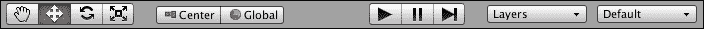

在工具栏下方，你会看到面板和视图标签。我们将在本章稍后更详细地介绍它们，但就目前而言，你需要知道的是，视图（如名称所示）以某种方式让你看到你的游戏场景，而面板则提供有关游戏对象、场景或整个项目的额外信息和工具。

### 小贴士

请记住，视图和面板之间的区别仅仅是一个有用的约定，绝对不限制标签页的功能。这尤其适用于由各种插件或你自己添加的自定义标签页。在这本书中，这种区别是为了方便。

下面的图显示了如果你从第一章以来没有移动任何标签页，你的编辑器窗口应该看起来像什么。我们将在本章中参考这个布局，所以如果你的布局不同，我建议你将其更改为与图片匹配。你总是可以在以后回到它。

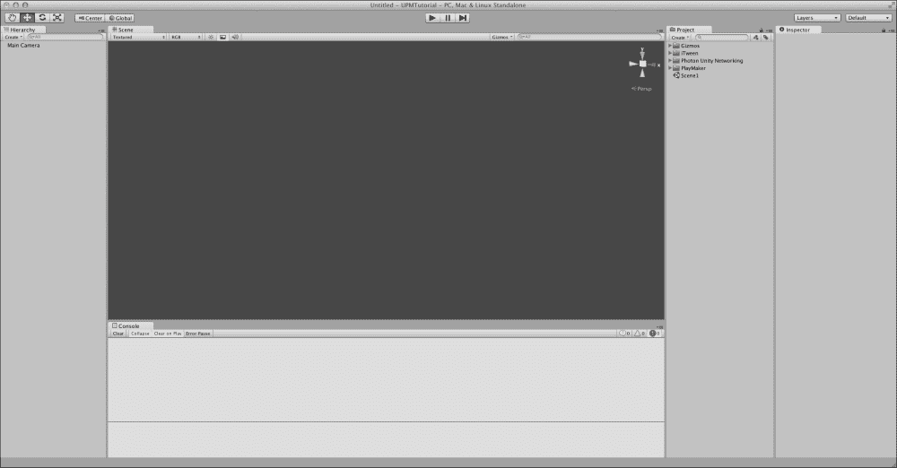

在 Unity 编辑器窗口的底部，有一条长长的空灰色线条。这是状态栏：它显示了**控制台**面板中最后显示的内容，点击它将显示**控制台**，突出显示其中的最后一条日志消息。状态栏、主菜单和工具栏都是 Unity 中的永久界面元素，与标签页不同，不能关闭、分离或调整大小，除非操作编辑器窗口本身。

## 层次结构面板

在 Unity 中，面板是一个提供有关游戏对象、场景或整个项目信息的标签页，或者为你提供额外的控制。面板可以随意添加、关闭、分离和连接。你可以根据需要拖动它们以优化你的工作流程。如果你遵循了第一章中的说明，“使用 Unity 和 Playmaker 入门”，你的当前布局应该与本章前一部分的最后一张截图相匹配。

首先，让我们看看层次结构面板（你应该在编辑器窗口的左侧将其连接上）。

你看到写着**层次结构**这个词的地方是标签页的标题。你可以通过标题拖动任何标签页，无论是视图还是面板。编辑器中可以存在任意数量的面板，位于任意位置，所以有时你可能会遇到多个标签页附着在屏幕的同一区域（如下面的图所示）：

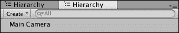

让我们尝试重现这种情况。点击层次结构面板右上角的**选项**按钮（）。然后从下拉列表中悬停在**添加标签**选项上，最后点击**层次结构**。现在你应该有两个**层次结构**面板附着在屏幕的同一侧。它们的标题应该相邻：一个处于活动状态，另一个处于非活动状态。活动面板是颜色较浅的那个。

下图显示了允许你向屏幕的某个区域添加新标签的菜单；在这种情况下，它位于右侧，与**层次结构**面板相同的地点。使用它来添加另一个**层次结构**面板。

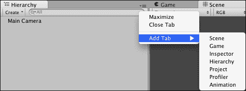

点击非活动面板的标题以查看其内容。此时你应该看到两个面板看起来完全相同：两个面板中唯一的内容是**主摄像机**。这是因为两个面板都显示了相同场景的内容。你可以有任意多的**层次结构**面板，但它们都会显示完全相同的内容。我们不需要两个，所以让我们关闭一个：在层次结构标签页的标题上右键单击，并从出现的上下文菜单中选择**关闭标签**。请注意，这与你在面板右上角点击**选项**按钮时出现的菜单相同。这只是做同样事情的一种方式。

我刚刚提到了一个叫做场景和场景内容的东西——但这究竟是什么意思？Unity 中的项目由场景组成；如果你喜欢，可以将其视为关卡文件，除了实际的游戏关卡之外，场景还可以包含如开场动画、加载界面、游戏菜单或任何内容。这只是将你的游戏划分为可管理的块的一种方便方式，而**层次结构**面板揭示了当前打开场景中的所有内容。在任何给定时刻，你只能打开一个场景，这就是为什么无论你打开多少**层次结构**面板，它们都会显示完全相同的内容。我们将在下一章中更详细地讨论场景。

另一件你应该注意的事情是面板顶部左角的**创建**按钮，它位于标题下方。点击它，你会看到与从主菜单导航到**游戏对象** | **其他**时相同的菜单。这个菜单允许你在列表中点击它们的名称时创建添加到当前场景的游戏对象。

在 Unity 中，游戏对象有点像是一个外壳，一个可以包含任何内容的容器：一个立方体、一盏灯、一个摄像机或一个角色。现在就创建一个立方体、一个四边形和一个方向性光源。我们将在接下来的章节中使用这些来创建一个游戏。

现在我们有了所有这些游戏对象，我们想在场景中以某种方式定位它们。为此，我们将使用检查器面板，以及其他一些工具。

## 检查器面板

**检查器**面板的主要目的是对游戏对象执行各种操作，包括更改它们的属性，例如外观、行为、位置、大小和旋转。在**层次结构**面板中通过单击一次选择**立方体**游戏对象。此时，**检查器**面板的外观应改变，以包含以下截图显示的多个项目：

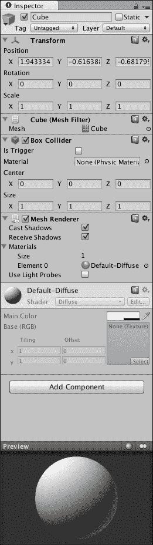

你首先应该注意到的是面板右上角靠近**选项**按钮的小锁图标 ()。与**层次结构**面板不同，**检查器**显示的是对象的属性而不是场景，由于你可以在当前活动场景中同时拥有任意数量的游戏对象，因此你可以为不同的检查器分配不同的对象以始终关注特定的对象。通过右键单击**检查器**标题并选择**添加标签** | **检查器**来打开一个新的**检查器**标签。两个检查器都将聚焦于你在**层次结构**中选择的立方体。点击其中一个检查器中的锁图标。这将使此**检查器**始终显示**立方体**的属性，因此，如果你在**层次结构**中选择**四边形**，锁定的  **检查器**将继续显示立方体的属性，而另一个将显示**四边形**。你可以通过点击你打开的两个**检查器**面板的标题来验证这一点。

### 小贴士

如果你想在不需要点击标题的情况下同时暴露两个对象的属性，你可以通过点击并拖动其标题将其中的一个**检查器**面板分离到任何你想要放置该面板的位置。如果你想要从一个对象复制组件或属性到另一个对象，或者如果你想始终显示一个重要的对象，这可能会很有帮助。

确保你对拥有多个检查器以及它们与所选游戏对象相对应的概念感到舒适。此外，请注意，**检查器**面板可以同时暴露多个游戏对象的属性。你可以在**层次结构**面板中通过按住*command* (*Ctrl* 在 Windows 中)来选择多个游戏对象。你也可以按住*Shift*并选择一系列游戏对象。这些操作与你在 Finder（或 Windows 资源管理器）中执行的操作类似。尝试多次这样做，直到你能够在**层次结构**面板中舒适地执行这些操作，并始终注意未锁定**检查器**面板的内容如何根据你选择的游戏对象而变化。一旦你觉得你已经试验得足够多了，可以通过右键单击其标题并从上下文菜单中选择**关闭标签**来关闭锁定的检查器。

在**检查器**面板的标题下方是所选游戏对象的名字。你可以随意更改它。现在，让我们将我们的**立方体**重命名为`Wall`。确保你在**层次结构**面板中选中了**立方体**，并且其属性显示在**检查器**面板中。点击当前显示为**立方体**的文本字段，删除所有内容，输入`Wall`，然后按*回车*（*Enter*）。你会注意到**层次结构**面板中的名字也发生了变化。

在名称字段下方是一个长条部分，其中包含各种组件，由黑色水平线分隔。默认的立方体（现在称为**Wall**）具有**变换**、**网格过滤器**、**盒子碰撞器**和**网格渲染器**组件。我们将在下一章中详细检查这些组件。现在你应该专注于变换组件（如下图中所示，包括**检查器**面板的标题），这是 Unity 中每个游戏对象都拥有的唯一组件。

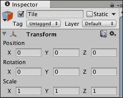

变换定义了游戏对象在 3D 空间中的位置、旋转和缩放。这些都是它的属性。通过点击**X**、**Y**和**Z**字段，删除其中的所有内容，输入你想要的值，然后在键盘上按*回车*（*Enter*）来设置**Wall**的位置为（`0`，`0.5`，`0`）。你刚刚改变了**Wall**游戏对象的变换组件的位置属性。下一章将更详细地检查属性和组件。现在只需将场景中游戏对象的位置和旋转设置为以下值：

| 名称 | 位置 | 旋转 |
| --- | --- | --- |
| 方向光 | 0, 0, 0 | 50, -30, 0 |
| 主相机 | 0, 10, 0 | 90, 0, 0 |
| 四元数 | 0, 0, 0 | 90, 0, 0 |
| Wall | 0, 0.5, 0 | 0, 0, 0 |

目前，我们将所有对象的**缩放**属性保留为其默认值（`1`，`1`，`1`）。

现在你已经修改了场景，你可能想保存它。按*command* + *S*（在 Windows 中为*Ctrl* + *S*）。应该会出现一个对话框窗口，询问你想要将场景保存到何处。默认情况下，它应该建议在`Assets`文件夹中保存。将场景命名为`Scene1`并点击**保存**。以下截图显示了场景文件应该保存的路径。请注意，你不能在`Assets`文件夹之外保存场景。如果你尝试这样做，将会弹出一个错误消息警告你。

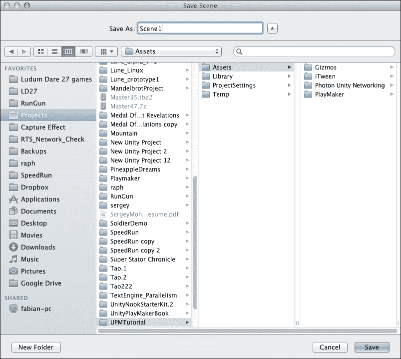

## 项目面板

看一下**项目**面板：你应该看到四个文件夹和一个名为`Scene1`的文件。**项目**面板是你的项目文件浏览器，类似于 Mac OSX Finder 或 Windows 资源管理器，但它只显示位于项目`Assets`文件夹中的文件和文件夹。

与**层次结构**和**检查员**不同，**项目**（见以下截图）只要您打开了相同的 Unity 项目，就始终显示相同的内容。所有场景文件、脚本和艺术资产都会显示出来，并且可以从这里进行操作。使用搜索框右侧的图标，您可以通过标签或类型对**项目**面板中显示的内容进行筛选。

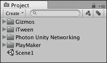

通常来说，保持项目文件结构井然有序是一个好习惯，因为它有助于提高生产力和节省查找文件的时间。为了组织您的资产，您可以将事物放入具有清晰名称的文件夹中，例如`Artwork`、`Scripts`或`Music`。首先，让我们尝试整理一下**项目**面板中已有的内容。

点击面板左上角的**创建**按钮；这将显示一个菜单，允许您创建不同类型的资产。这是您在主菜单中转到**资产** | **创建**时得到的相同菜单。

### 小贴士

访问**资产**菜单的第三种方式是在**项目**面板文件列表下方的空白区域右键单击，然后在出现的上下文菜单中点击**创建**。

创建一个名为`Scenes`的文件夹。如果您在创建文件夹时忘记输入名称，可以按*return*（或在 Windows 中使用*F2*）。一旦您给它起了合适的名字，点击并拖动`Scene1`文件，将其放入`Scenes`文件夹中。从现在起，我们将把所有场景保存到该文件夹中，而不是`Assets`根目录。这样，当我们想要打开特定场景时，它们将更容易找到。

## 视图

现在项目面板已经井然有序，并且您的对象已经在场景中定位，是时候看看视图选项卡了：**游戏**和**场景**。前者显示所有摄像机的输出，而后者是 Unity 中的主要工作区。这是进行关卡设计的地方。当您在工具栏中点击播放按钮（）或使用快捷键*command* + *P*（或在 Windows 中为*Ctrl* + *P*）时，**游戏**视图会变得交互式，前提是在 Playmaker 或其他组件中定义了某种类型的输入。您还可以通过按*command* + *Shift* + *P*（在 Windows 中为*Ctrl* + *Shift* + *P*）来暂停游戏。这就是您稍后测试游戏的方式。目前还没有交互，但我们很快就会达到那个阶段。

如果当前没有激活，请点击**场景**视图的标题来激活它。在**层次**面板中，选择**墙**并按*F*。这将使**场景**视图聚焦于**墙**。你应该能看到你创建的立方体，其下方有一个**四边形**和**方向光**工具（看起来像一个小太阳）。**工具**通常是 3D 空间中的一个 2D 元素，允许你选择和/或操作对象，即使它们在场景中未以其他方式表示。工具也可以是非交互式的，例如一条简单的线或一个线框立方体。这些通常用于揭示某些不可见事物的位置或方向。

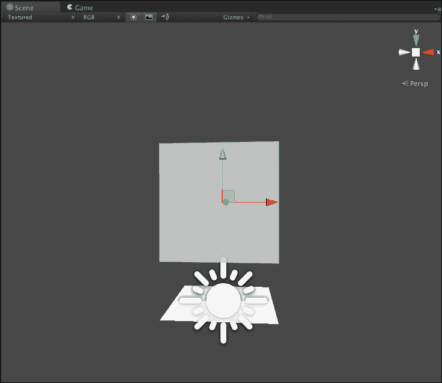

选择一个对象并按*F*是导航 3D 空间的一种方法。另一种方法是使用鼠标。你可以在**场景**视图中直接通过点击它们的网格（3D 模型）或工具来选择不同的对象。要环顾四周，请按住鼠标右键并在**场景**视图中移动鼠标。使用滚轮进行缩放。使用中间点击来拖动视图。你还可以通过按住*Alt*并点击左鼠标按钮并移动鼠标来围绕一个点旋转。

点击**方向光**工具并按*W*或工具栏中的。你应该会看到三个箭头出现：红色、绿色和蓝色。这些箭头分别对应于 3D 空间中的 X、Y 和 Z 轴。点击并拖动其中一个箭头将移动对象在空间中的位置。将**方向光**移动到任何你想要的位置：其位置并不重要。然而，重要的是它的旋转。

在工具栏中按*E*或。一个带有彩色和白色圆圈的球体将出现在对象周围。每个彩色圆圈负责对象围绕一个轴的旋转。再次强调：红色对应 X 轴，绿色对应 Y 轴，蓝色对应 Z 轴。当你选择你的光源时，你也应该看到从它发出的黄色光线。这是一个工具，显示了你的**方向光**在场景中照明的方向。将**方向光**旋转，使**墙**和**四边形**在**游戏**视图中看起来被很好地照亮，几乎呈白色。不要忘记，你可以在任何时刻在**游戏**视图和**场景**视图之间切换，以查看游戏中的预览。

你还可以通过点击工具栏中的**全局**/**局部**切换按钮在旋转、位置和缩放工具的显示方式之间切换。**枢轴**/**中心**切换按钮确定其出现的位置：在对象的枢轴点或其几何中心。

一旦你对灯光满意，选择 **Quad** 对象并按 *R* 或  在工具栏中。这是缩放操作模式。如果你按 *F* 来聚焦于 **Quad**，你会看到一个类似运动操作器的 Gizmo，但每条线的末端是彩色的小方块而不是箭头。和之前一样，颜色对应于轴：红色代表 X 轴，绿色代表 Y 轴，蓝色代表 Z 轴。中间还有一个白色的方块，这是统一缩放操作器，允许你同时改变三个轴的缩放。

使用这个 Gizmo，将 **Quad** 在 X 和 Y 轴上的缩放调整为大约 `100`。它的 Z 轴缩放应保持不变。当你选择一个对象时，你可以在 **Inspector** 面板的 **Transform** 组件中检查位置、旋转和缩放当前值。

通过按 *command* + *S* （在 Windows 中为 *Ctrl* + *S*）保存你的场景。

# Playmaker 界面

是时候最终看看 Playmaker 了。在主菜单中，转到 **PlayMaker** | **PlayMaker 编辑器**。应该会出现一个带有不同 Playmaker 选项和 **playMaker** 面板的欢迎窗口。关闭欢迎窗口，然后将 **playMaker** 面板附加到与你的 **Console** 面板相同的区域，如以下截图所示（如果你自 第一章 以来没有更改任何内容，这应该在 **Scene** 和 **Game** 视图下方）。

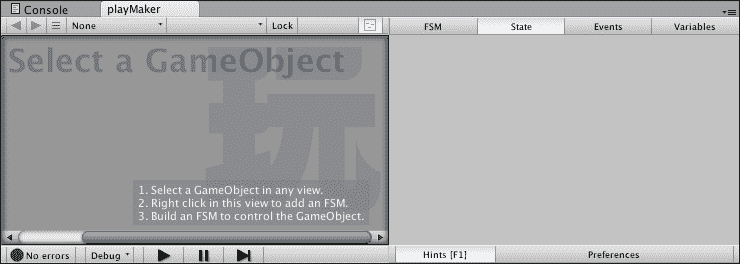

左侧较暗的区域是 FSM 视图。

### 小贴士

请记住，FSM 视图在官方 Playmaker 文档中被称为 Playmaker 编辑器。在这本书中，我们将使用一个更清晰的名字，*FSM 视图*，来区分 **playMaker** 面板的不同区域。

这里你可以编辑你的有限状态机并创建状态节点以及它们之间的转换，我们将在下一章中更详细地讨论。现在，请按照 FSM 视图右下角的说明操作：

1.  在 **Hierarchy** 面板或 **Scene** 视图中通过点击来选择 **Wall** 游戏对象。

1.  在 FSM 视图的任何位置右键单击，并从出现的上下文菜单中选择 **Add FSM** 以将有限状态机添加到 **Wall** 游戏对象。当你这样做时，注意 **Hierarchy** 面板中 **Wall** 旁边出现的红色图标。这个图标表示该对象具有 Playmaker FSM 组件。还要注意在 **Inspector** 面板中出现的 Playmaker FSM 组件。

1.  现在，你可以操作 FSM 来为 **Wall** 分配各种行为。仔细阅读 **playMaker** 面板中显示的所有提示。

### 小贴士

要更好地查看任何选项卡，包括 **playMaker** 面板，请将鼠标光标悬停在选项卡上并按 *Space* 键。然后再次按空格键以最小化。你可以在 Unity 编辑器的任何视图或面板中这样做。

在**playMaker**面板的右侧，有一些标签页，用于显示和修改不同类型的信息，包括整个 FSM 以及其状态、事件和变量。点击每个标签页，检查灰色矩形中的提示，解释每个标签页的内容。完成提示后，你可以按面板底部的**提示**切换按钮来禁用它们。你也可以通过按*F1*来实现这一点。在这样做之前，点击旁边的**首选项**按钮并阅读那里的提示。我们将在下一章中检查对 Playmaker 首选项的必要更改。

在 FSM 视图中，你应该看到与工具栏中的暂停/播放类似的控件。实际上，这些是相同的按钮，它们的存在只是为了在你使用 Playmaker 时，使控制游戏更加方便。

第二个最重要的与 Playmaker 相关的面板是**动作浏览器**。你可以通过从主菜单中选择**Playmaker** | **编辑器窗口** | **动作浏览器**来打开它。以下截图显示了**动作**面板的一部分：

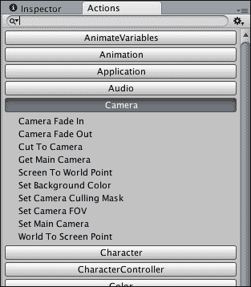

通过其标题将其拖动到编辑器的右侧，直到它与**检查器**的同一区域对齐。此面板显示了你在 Playmaker 库中的动作类别。点击其中一个类别，例如，**相机**，将显示相应的动作。面板顶部附近还有一个搜索栏，允许你更快地访问所需的动作。当你选择一个动作，例如，**相机** | **屏幕到世界点**，其参数的预览将出现在面板底部。它显示了所选动作在**playMaker**面板的**状态**选项卡中的外观。如果你有一个启用了 Playmaker 的对象，并在 FSM 视图中选择了状态，你可以通过点击**动作**面板右下角的**添加动作到状态**按钮，向其添加动作。

你可以按播放按钮（或使用快捷键*command* + *P*或*Ctrl* + *P* Windows）来查看是否存在错误，并且一切是否正常工作。完成后，再次按播放并保存场景。

# 摘要

在本章中，你检查了 Unity 和 Playmaker 的一些主要界面元素，向场景中添加了一些对象，并操作了这些对象。你还查看了游戏对象和组件，并学习了组件的属性。这些主题将在下一章中更详细地探讨。本章中创建的场景为创建游戏奠定了基础，你迄今为止创建并操作的所有对象都将在最终游戏中使用。
