# 第三章 组件和状态机

在上一章中，我们学习了 Unity 的界面，以及事物在编辑器中的组织和显示方式。你向一个游戏对象添加了一个有限状态机（FSM），并简要地查看与 Playmaker 相关的界面元素。你还使用诸如**层次结构**和**检查器**面板以及**场景**视图等界面元素来操作游戏对象和组件。在本章中，我们将涵盖以下内容：

+   Unity 依赖的基于组件的游戏开发方法

+   游戏对象、组件及其属性的更详细内容

+   使用组件定义外观和行为时游戏对象的可互换性

+   有限状态机、动作和转换

+   使用 Playmaker 制作简单的游戏机制

# 游戏对象、组件和属性

Unity 使用的是一种流行的游戏开发通用方法，称为基于组件的架构。这种方法在软件开发中被广泛使用，以使事物更具可重用性和易于管理。

让我们谈谈在 Unity 中事物是如何组织的。其中一些已经在之前的章节中提到过，但我会简要重复一遍，这样你可以从更广泛的角度看到游戏对象、组件及其属性。

首先，你有一个项目，本质上是一个文件夹，其中包含你游戏的所有文件和信息。其中一些文件被称为场景（可以将其视为关卡）。场景包含你添加到其中的多个游戏对象。场景的内容由你决定，你可以拥有尽可能多的场景。你也可以让游戏在不同的场景之间切换，从而激活不同的游戏对象集合。

在较小的尺度上，你有游戏对象和组件。一个游戏对象本身只是一个无形的容器，它什么也不做。如果不添加适当的组件，它就无法在场景中显示，接收玩家的输入，或者移动并与其他对象交互。使用组件，你可以轻松地组装功能强大的游戏对象，同时重用几个小型部件，每个部件负责一个简单的任务或行为——渲染游戏对象、处理输入、承受伤害、播放音效等——使你的游戏开发和管理变得更加简单。Unity 高度依赖这种方法，所以你掌握得越好，你将越快地精通它。

在 Unity 中，每个游戏对象默认都附加了一个名为**变换（Transform）**的组件。它允许你定义游戏对象的位置、旋转和缩放。通常，你可以随意在任意游戏对象中附加、分离和销毁组件，但你不能移除**变换（Transform）**。

每个组件都有一些您可以访问和更改的属性：这些可以是整数或浮点数、文本字符串、纹理、脚本、游戏对象或其他组件的引用。它们用于更改特定组件的行为，影响其外观或交互。您在第二章中已经遇到的某些属性，包括*Unity 和 Playmaker 的用户界面*中的位置、旋转和缩放属性，**变换**组件。还有其他一些您已经看到，包括 FSM，我们将在本章后面讨论。

以下截图显示了附加了**变换**、**网格过滤器**、**盒子碰撞器**、**网格渲染器**和**脚本**组件的**墙**游戏对象。显示了**变换**的属性。为了显示或隐藏组件的属性，您需要左键单击其名称或其图标左侧的小箭头。

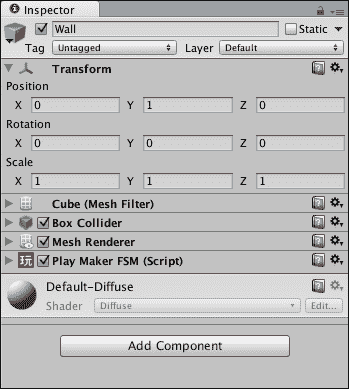

Unity 有一些预定义的游戏对象，它们已经附加了组件，例如摄像机、灯光和原语。您可以通过从主菜单中选择**GameObject** | **创建**来访问它们。或者，您可以通过按*command* + *Shift* + *N* (*Ctrl* + *Shift* + *N* 在 Windows 上)创建空的游戏对象，并使用**组件**子菜单将组件附加到它们。

以下图显示了我们所讨论的项目结构。请注意，一个项目中可以有任意数量的场景，一个场景中可以有任意数量的游戏对象，一个游戏对象可以有任意数量的组件附加到它，最后，一个组件中可以有任意数量的属性。

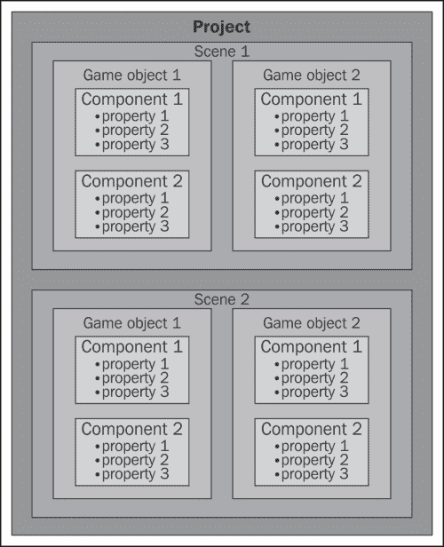

目前您需要了解的关于组件的最后一件事是，您可以通过在**检查器**面板中右键单击组件的名称，并从以下截图所示的上下文菜单中选择**复制组件**来复制它们。您还可以将组件的属性重置为其默认值，删除组件，或根据您的方便将其上下移动。

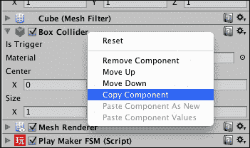

复制的组件可以通过在**检查器**面板中右键单击任何组件的名称，并从相同上下文菜单中选择**粘贴组件为新组件**或**粘贴组件值**来粘贴。这两个命令之间的区别在于，前者将添加一个与您复制的组件完全相同的新的组件，而后者将简单地传输所有属性的值。一旦您复制了组件，这些命令就会变为活动状态。

# 使用预制体

为了创建具有相同组件和属性的多个游戏对象实例，或者从不同的场景访问相同的游戏对象，你可以将其保存为`Assets`文件夹中的一个文件。在 Unity 中，这些文件被称为预制件，它们就像游戏对象模板。要创建一个空预制件，在**项目**面板的空白区域右键单击，然后从上下文菜单中选择**创建** | **预制件**。应在**项目**面板中看到一个名为`New Prefab`的新文件。将此预制件命名为`Wall`。现在创建一个名为`Prefabs`的空文件夹，并将`Wall`预制件放入此文件夹中。

目前预制件是空的。

1.  在**层次结构**面板中，选择你在第二章中创建的**Wall**游戏对象，*Unity 和 Playmaker 的用户界面*。点击并拖动它到**项目**面板中的`Wall`预制件。

1.  **Wall**游戏对象的名字在**层次结构**中会变成蓝色，当你选择`Wall`预制件时，你将在**检查器**面板中看到原始**Wall**游戏对象拥有的所有组件。

现在，如果你将`Wall`预制件拖放到场景中，将创建一个名为**Wall**的新对象，其属性与预制件中定义的属性完全相同。

此外，如果你使用**检查器**面板更改预制件中的一些组件和/或属性，这些更改将自动应用于场景中该预制件的全部实例。如果你有多个相同类型的对象（即墙壁、怪物、树木等），这将为你节省大量时间，因为你不必在**层次结构**中逐个选择它们并多次进行相同的更改。

你也可以通过选择**层次结构**中的一个实例，进行更改，并在**检查器**面板顶部附近点击**应用**按钮来修改你的预制件（以及由此扩展的场景中所有实例）。你还可以通过点击**还原**按钮撤销所有更改。这将将当前选定的实例重置为其预制件设置的方式。

这之所以有效，是因为实际上实例的所有组件和属性都链接到预制件的组件和属性。只有当你更改实例中的它们时，它们才会解除链接，这意味着对该属性在预制件上的进一步更新不会应用于此实例。这些解除链接的属性可以在**检查器**面板中通过其名称变为粗体来区分。如果你想重新链接一个特定的解除链接属性，你可以右键单击它并选择**将值还原为预制件**。

除了**Apply**和**Revert**按钮外，所有预制件实例还有一个**Select**按钮。此按钮允许你选择并突出显示在**Project**面板中对应于当前选中实例的预制件，这样你可以更容易地访问它。此外，正如我们之前看到的，预制件实例可以通过**Hierarchy**面板中其蓝色的名称轻松识别。创建预制件的另一种方法甚至更简单：你可以直接将**Hierarchy**面板中的游戏对象拖放到**Project**面板中。在`Assets`文件夹中会创建一个适当命名的文件。

关于预制件，还有一件非常重要的事情需要了解，那就是它们可以在网络上进行复制和共享，因为它们不过是 Unity 识别的包含组件和属性信息的文件。现在，按照以下步骤修改`Wall`预制件以更好地满足我们的需求：

1.  在**Project**面板中创建一个新的文件夹，并将其命名为`Materials`。它将包含包含游戏对象纹理、着色器和颜色的信息文件。

1.  通过点击**Project**面板左上角的**Create**按钮，并从下拉列表中选择**Material**来创建一个新的材质文件。

1.  将新材质命名为`WallMaterial`并将其放入`Materials`文件夹中。

1.  在**Project**面板中选择**WallMaterial**，然后在**Inspector**中点击文本旁边带有**Main Color**字样的矩形。在出现的**Color**窗口中，选择黑色并关闭**Color**窗口。以下截图显示了**Material**修改界面以及**Color**窗口：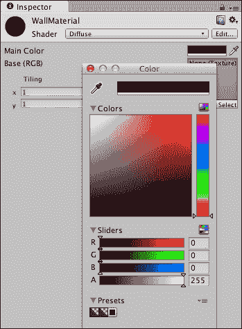

1.  现在你已经设置了这种新材料，选择`Wall`预制件，然后将**WallMaterial**拖放到预制件**Mesh Renderer**组件的**Materials**属性的**Element 0**元素中。它应该替换**Default Diffuse**。以下截图显示了分配新材料后**Mesh Renderer**组件应有的样子。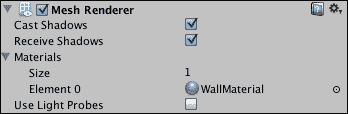

1.  现在，所有`Wall`预制件的实例都将变为黑色。

1.  此外，将**Transform**组件的 X 缩放属性设置为`15`。这将使所有新墙变得更长。

1.  选择**Main Camera**游戏对象，并使用**Inspector**面板将其**Camera**组件的**Projection**属性设置为**Orthographic**。这将使摄像机的视图变得扁平；现在游戏视图将呈现二维。

1.  将**Size**属性设置为`5`。你可以稍后调整外观，但就目前而言，这将帮助我们专注于游戏玩法。

### 小贴士

在设计过程的初期，限制自己使用简单的原始形状、彩色编码的无纹理材质和正交投影相机通常是一个好主意，因为这会让你专注于游戏玩法。这样，如果你的游戏很有趣，你就会知道，如果它不好，你也不会被花哨的视觉效果所分散注意力。

制作四个墙壁并将它们在场景中排列，以便你在**Game**视图中看到以下截图。如果不是这样，你可以回到第二章的表格，*Unity 和 Playmaker 的用户界面*，看看你的**Main Camera**游戏对象是否定位和旋转正确。其位置应设置为(`0`, `10`, `0`)，旋转为(`90`, `0`, `0`)。别忘了，你可以通过在**Transform**组件中更改旋转角度将对象旋转到精确值，例如`90`度和`180`度。同时确保所有墙壁的 Y 位置保持等于`0.5`。

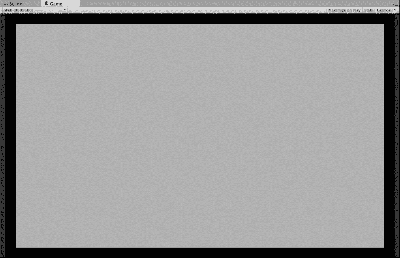

# 有限状态机、状态和动作

我们已经讨论了游戏对象和组件。现在，让我们看看 Playmaker 中的 FSM、状态和动作。

Playmaker 中的 FSM 是一个由状态和它们之间的转换组成的图，附加到一个游戏对象上。它允许使用图的不同状态和触发转换到其他状态的事件进行可视化编程。

如果你选择了`Wall`预制体并打开**playMaker**面板，你会看到它的有限状态机（FSM）有两个状态：默认的**Start**状态，一切从这里开始，另一个默认称为**State 1**的状态，通过一个箭头将前者连接到后者。箭头代表一个转换。你不能移除 Start 状态或与之相连的状态，因为如果你能这样做，你就不需要将 FSM 附加到对象上了。然而，你可以创建新的状态并为它们定义转换。

### 小贴士

你可以几乎以与**Scene**视图相同的方式导航 FSM 视图。使用中间鼠标按钮拖动视图。使用左鼠标按钮移动状态。这不会改变状态机的逻辑，但让你以对你有意义的方式组织一切，同时如果你整个状态机太大而无法一次性显示，还可以查看你此刻最感兴趣的部分。

FSM 中的状态默认为空，不做任何事情，就像一个没有任何组件附加的空游戏对象。为了使状态执行某些操作，你需要将其附加到动作。

正如我们在第二章中看到的，*Unity 和 Playmaker 的用户界面*，你可以通过选择对象，在**playMaker**面板的 FSM 视图中右键单击，然后从上下文菜单中选择**Add FSM**来向对象添加一个 FSM。你可以通过在**Inspector**中右键单击**playMaker FSM（Script）**组件的标题并从上下文菜单中选择**Remove Component**来从 Playmaker 控制中移除对象。这将移除 FSM 并擦除你对它所做的所有更改，包括添加的状态和转换。如果一个对象附加了 FSM，那么在**Hierarchy**面板中它的名称旁边会有一个红色的 Playmaker 象形图标 ()。

作为本书的一个示例，我们将制作一个经典的空气桌球游戏版本。为了开始，我们需要添加一个冰球和一个球杆。在本章中，你将根据鼠标位置移动球杆，并像在现实生活中那样推动冰球。

目前在你的场景中有四面墙，一个背景四边形，一个摄像机和一个方向性光源（在第二章中创建，*Unity 和 Playmaker 的用户界面*)。现在是我们使事物变得交互的时候了。让我们从球杆开始。

1.  在主菜单中选择**GameObject** | **Create Other** | **Cylinder**来创建一个新的圆柱形原形。

1.  将这个游戏对象重命名为`Mallet`，并为它创建一个深绿色（在**Color**窗口中 RGB 颜色设置为`10`，`155`，`10`）的材料，命名为**MalletMaterial**，然后将其分配给它，就像之前为`Wall`预制体所做的那样。

1.  将**Mallet**的缩放设置为(`1.35`，`1.35`，`1.35`)，并将其位置设置为(`-6.5`，`1.45`，`0`)。

1.  现在我们将使球杆移动。首先，我们需要向它添加一个名为**Character Controller**的组件。这个组件负责角色物理。选择**Mallet**，然后在**Inspector**面板底部附近点击**Add Component**按钮。在搜索栏中输入`Character Controller`，然后在列表中双击**Character Controller**项（如图所示）。当 Unity 询问你是否要替换现有的**CapsuleCollider**组件时，点击**Replace**。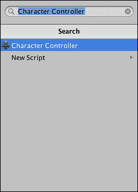

1.  在**Character Controller**组件中，将**Skin Width**属性设置为`0`（它将被设置为可能的最小值，即`0.0001`）。我们这样做是为了确保我们的球杆碰撞看起来精确。

1.  通过选择球杆，在**playMaker**面板的 FSM 视图中右键单击，并从上下文菜单中选择**Add FSM**来向球杆添加一个 FSM。

1.  选择**状态 1**，然后在**playMaker**面板右侧的**状态**选项卡中，从顶部第一个文本框输入`Move`。这负责当前选中状态的名称。当您输入新名称时，您应该会看到 FSM 视图中状态的变化。

1.  保持**移动**状态选中，打开**动作**面板（它应附加在**检查器**面板相同的区域；或者，点击**状态**选项卡右下角的**动作浏览器**按钮）并找到**输入**类别下的**鼠标拾取**动作。点击它，然后点击面板右下角的**将动作添加到状态**按钮。您应该会注意到**鼠标拾取**动作出现在**playMaker**面板的**状态**选项卡中。

    此操作在您悬停在对象上时获取 3D 空间中的光标位置。在底层，它会从鼠标位置在相机的近裁剪平面（当您选择**主相机**时，您可以在**场景**视图中将其视为白色工具箱矩形之一）绘制一条不可见的射线（此操作称为**射线投射**）。如果射线路径上有物体，则会检测到射线碰撞，Unity 会找出碰撞的确切位置。在我们的例子中，我们将使用背景四边形来获取鼠标光标的位置，然后使球槌跟随它。

1.  为了选择正确的射线碰撞位置，我们需要确保没有其他物体阻挡射线。为此，我们将告诉射线仅与背景四边形交互。选择**四边形**游戏对象，并将其重命名为`Background`以提高可读性。然后找到**检查器**面板右上角的**层**下拉菜单，点击默认情况下显示为**默认**的下拉按钮，并在其中按下**添加层…**。此时，**检查器**的外观应发生变化，以显示如图所示的标签和层列表：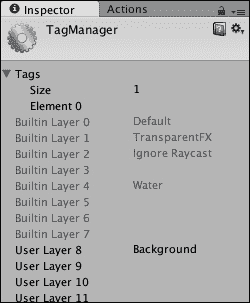

    此菜单称为**标签管理器**。点击**用户层 8**的右侧，并在出现的编辑字段中输入`Background`，然后按键盘上的*Return*键。再次选择**背景**对象，并通过从您之前用于访问**标签管理器**的下拉**层**列表中选择适当的元素，将其层设置为**背景**。

1.  再次选择**球槌**。在**移动**状态下的**鼠标拾取**操作中，将**层掩码**参数设置为`1`。这决定了您将设置多少层与射线交互。**元素 0**应出现在下方。在其右侧的下拉列表中，选择您之前创建的**背景**层。

1.  从现在开始，**鼠标拾取**动作中的射线投射将忽略不在**背景**层的所有对象。现在我们需要将射线击中位置存储在一个变量中。转到**playMaker**面板的**变量**选项卡，在底部的**新变量**字段中输入`mousePos`。点击**添加**按钮。将**变量类型**设置为**Vector3**。一个**Vector 3**变量包含三个数字：**X**、**Y**和**Z**。

1.  返回到**状态**选项卡，并将**鼠标拾取**动作的**存储点**属性设置为**mousePos**。这将保存射线击中的位置在您刚刚创建的**Vector3**类型变量中。最后，确保在**鼠标拾取**动作的底部勾选**每帧**属性复选框，以确保鼠标位置持续更新，而不是仅在游戏开始时更新一次。

1.  将位于**动作**面板**角色**类别下的**控制器简单移动**动作添加到您的**移动**状态。它应该出现在**鼠标拾取**动作下方。如果它出现在上方，你可以通过点击并拖动其标题将其向下移动。

    需要注意的是，状态中动作的顺序很重要：前面提到的动作将在后面提到的动作之前执行，所以如果你想使用在**鼠标拾取**动作中设置的变量，你必须确保**鼠标拾取**在将要使用它的任何动作之上（在我们的例子中是**控制器简单移动**）。

1.  将**控制器简单移动**动作的**移动向量**属性设置为**mousePos**。将其他属性保留为默认值。

# 游戏对象之间的交互

现在球槌可以移动了，我们将让它与球体交互。当球槌接触到球体时，我们将对其施加一个相反方向的力。

你可以点击工具栏中的播放按钮，看看球槌如何根据鼠标位置移动。你会注意到它会与墙壁发生碰撞，平滑地跟随鼠标光标，并根据你移动鼠标的速度和距离改变其移动速度。

1.  创建另一个名为**Puck**的圆柱体，并将其放置在(`-3`, `0.85`, `0`)的位置。将其比例设置为(`1`, `0.7`, `1`)。

1.  向其添加一个**Rigidbody**组件（**组件 | 物理 | Rigidbody**）。将**质量**属性设置为`0.1`，取消勾选**使用重力**，打开**约束**部分，并勾选**冻结位置 Y**和**冻结旋转 X**、**Y**和**Z**。

1.  创建一个新的深灰色（`65`, `60`, `60`）材质（**资产** | **创建** | **材质**），命名为**PuckMaterial**，并将其分配给圆柱体的**Mesh Renderer**。

1.  现在球体已经设置好了，我们将让球槌推动它。转到 FSM 中球槌的**移动**状态，并添加一个名为**碰撞事件**（在物理类别下）的动作。将**碰撞**属性设置为**控制器碰撞器击中**。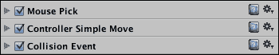

1.  通过选择**Puck**游戏对象并在**检查器**的**标签**下拉菜单中选择**添加标签...**来打开**TagManager**。以与为背景层添加标签相同的方式添加一个名为**Puck**的新标签。标签位于**TagManager**的顶部附近。如果您修改**大小**变量，可以拥有任意数量的标签。将**Puck**游戏对象的标签设置为**Puck**。

1.  返回到球槌的 FSM 中的**移动**状态。将**碰撞标签**属性设置为**Puck**的**碰撞事件**动作。

1.  在**playMaker**面板中打开**事件**选项卡，在选项卡底部的**添加事件**字段中输入`Push`，然后按键盘上的*Enter*键。

1.  再次打开**状态**选项卡，并将**Collision Event**动作的**发送事件**属性设置为**Push**。

1.  现在我们必须告诉 FSM 事件调用后会发生什么。通过在 FSM 视图中任何位置右键单击并从上下文菜单中选择**添加状态**来在球槌的 FSM 中创建一个新状态。将新状态命名为`Push Puck`。在 FSM 视图中右键单击**移动**状态并从上下文菜单中选择**添加转换** | **Push**。在**移动**状态下方应出现一个新的标签**Push**。单击它并将出现的线条拖动到**Push Puck**状态。这条线是当在**移动**状态中调用**Push**事件时发生的转换。以相同的方式向**Push Puck**状态添加一个**FINISHED**事件。您不需要创建它，因为它是一个默认的 Playmaker 事件。

1.  从**FINISHED**事件到**移动**状态创建一个转换，以确保当球被推时，球槌将保持在玩家的控制之下。以下图显示了您的 FSM 应该看起来像什么：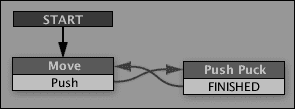

1.  将以下动作逐个添加到球槌的 FSM 中的**Push Puck**状态：**Get Controller Hit Info**，**Get Position**，**Vector3 Subtract**，**Vector3 Normalize**，**Vector3 Multiply**，和**Add Force**。请注意动作的顺序很重要，因为列表上方的动作将先执行。以下截图显示了动作的正确顺序。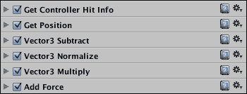

1.  使用**playMaker**面板的**变量**选项卡创建以下变量：**hitPos**（**Vector3**），**pushDir**（**Vector3**），**pushMag**（**Float**）。选择**pushMag**并将其**浮点值**设置为`20`。此值将决定球槌推球的力度。

1.  返回到**状态**选项卡，将**Get Controller Hit Info**动作的**接触点**属性设置为**hitPos**。

1.  将**Puck**游戏对象从**层次结构**拖动到**Get Position**动作的**游戏对象**槽中，然后将**向量**设置为**pushDir**。

1.  在**Vector3 Subtract**动作中，将**Vector3 变量**设置为`pushDir`。点击**Subtract Vector**旁边的选项图标（）。这将允许你从列表中选择一个变量，而不是使用数值。将**Subtract Vector**设置为`hitPos`。

1.  在**Vector3 Normalize**动作中，将**Vector3 变量**设置为**pushDir**。

1.  在**Vector3 Multiply**动作中，将**Vector3 变量**设置为**pushDir**，并将**乘以**设置为**pushMag**。如果需要，点击小选项图标以显示 FSM 变量。

1.  最后，在**添加力**中，将**游戏对象**属性设置为**指定游戏对象**，并将**Puck**游戏对象拖动到下方出现的槽位中。将**向量**设置为**pushDir**。点击**X**、**Y**和**Z**旁边的选项图标，并保持它们在**无**状态，以确保它们不会被重置为`0`，而是简单地没有分配。如果需要，点击小选项图标以显示**无**选项。然后设置**空间**为**世界**。

如果你点击播放并使球棒与它碰撞，你的球现在应该变得可交互。我意识到最后一点同时有很多动作，所以我们将在下一章中讨论这些动作中确切发生了什么。这是一个我们在讨论游戏机制时将要探讨的一些复杂逻辑的例子。现在，将其视为一个熟悉动作和变量以及它们在**playMaker**面板中添加和分配方式的练习。

作为另一个练习，保存你的场景，创建几个带有 FSM 的新游戏对象，并尝试实验不同的动作和变量，看看它们是如何添加和分配的。如果你的动作没有做什么，不要担心。尝试熟悉 Playmaker 界面，并记住如何添加、移动和删除动作，创建新的变量和事件，并将它们分配。

一旦你觉得对这些动作很熟悉，你可以删除你用于练习的对象，或者简单地通过在**项目**面板中双击`Scene1`文件来重新加载场景而不保存它。

# 摘要

在本章中，我们讨论了 Unity 中的项目结构：场景、游戏对象、组件和属性。我们还更详细地了解了 Playmaker 界面：动作、事件、变量和转换。你通过实现一个用鼠标移动的球棒和一个当球棒接触时被推动的球，迈出了创建冰球游戏的第一步——一个真正的游戏机制。在下一章中，我们将添加更多的游戏机制，更详细地解释已经实现的游戏机制，并尝试使游戏更加有趣和美观。
