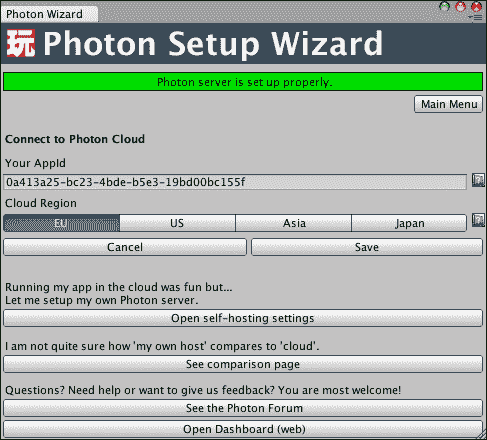
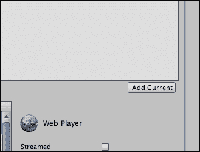
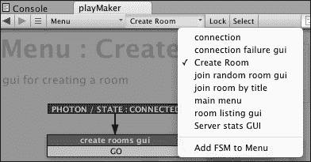
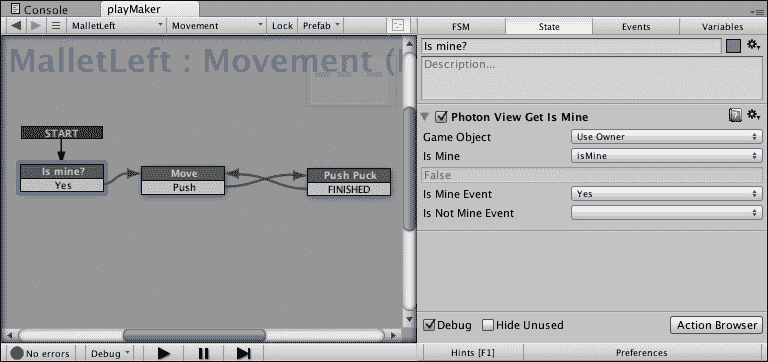

# 第六章：网络和多玩家

在前面的章节中，你学习了如何使用 Unity 的界面，操作对象，以及向它们添加组件和行为。你使用 Playmaker 动作和 Unity 脚本创建了游戏玩法。我们还探讨了从 C#脚本中创建自定义动作。你使用所有这些工具制作了一个完全可玩的双打冰球游戏，并使用人工智能对手。

在本章中，我们将讨论网络。你将使用**Photon Unity Networking**（**PUN**）为游戏创建多玩家模式，这是一个有用的插件，与 Playmaker 一起提供，让你几乎可以毫不费力地制作多玩家游戏。我们还将讨论游戏网络理论，并讨论 Unity 原生网络作为 Photon 的替代方案。

本章中，你将涵盖：

+   理解网络和多玩家

+   设置 Photon Unity Networking

+   制作多玩家游戏

# 理解网络和多玩家

解释像 TCP/IP 和其他低级网络概念超出了本书的范围，我们将尽量使一切尽可能接近实际应用。另一方面，如果你至少熟悉一些理论，那么构建多玩家游戏会容易得多。

你需要知道的第一件事是服务器和客户端是什么。简单来说，服务器是一台响应来自其他计算机网络请求的计算机，或者更精确地说，是一个响应来自其他系统网络请求的系统，因为你在同一台计算机上可能有多个服务器和多个客户端。这意味着客户端通过服务器相互通信。通常，玩家系统是多玩家游戏中的客户端，而服务器位于远程访问的计算机上。有时，玩家可以*托管*游戏，在这种情况下，玩家要么充当服务器，要么简单地告诉服务器为游戏保留其资源。

你可能之前听说过网络架构。在游戏中，最流行的架构可能是客户端-服务器和对等网络。前者意味着所有客户端都订阅一个单一的服务器。服务器托管关于游戏的大部分重要信息，并在玩家之间分配。后者是关于对等方（玩家）直接连接到彼此，因此所有客户端都相互连接，网络负载均匀分布。

客户端-服务器的好处是它允许创建一个更稳定的系统，确保作弊要么不可能，要么非常困难，同时也使得开发者更容易监控一切，并在游戏中即时做出更改。然而，这种方法通常成本较高，如果你是一个正在学习制作第一个多玩家游戏的独立开发者，那么自己实现起来相对较难。

点对点不需要拥有一个强大的服务器同时托管多个游戏会话，允许玩家相互连接，在他们之间分配网络负载。点对点的缺点是它通常不太稳定，而且相对难以监控。此外，如果你想跟踪游戏会话、执行匹配和让玩家在互联网上而不是仅在本地网络中玩游戏，你仍然需要一个服务器。

### 小贴士

没有服务器很难连接到互联网，这是因为有一种叫做**原生地址转换**（**NAT**）的东西。不深入细节的话，应该注意的是，这是网络路由器做的事情，我们大多数人现在都有路由器。一个常用的过程叫做**NAT 穿透**，用于连接一台计算机到另一台计算机，这个过程需要一个服务器作为两台计算机之间第一次连接的中介。

在 Unity 中，设置**本地局域网**（**LAN**）、对等连接或客户端-服务器连接相对简单，无需使用任何外部插件，只需让一位玩家作为游戏主机即可。LAN 连接意味着所有玩家都连接到同一个本地计算机网络。不幸的是，无论你做什么，你都需要一个服务器来确保玩家可以始终通过互联网相互连接，这正是我们想要做的。Photon 采用了客户端-服务器架构，并将其封装在一个极其易于使用的界面中，使得任何人都可以在没有先前经验的情况下创建多人游戏。而且，它的价格也非常实惠。

一些 Photon 服务允许玩家自己托管服务器，但这需要一些时间来设置。在这本书中，我们将使用 Photon Cloud。正如其名所示，所有的游戏会话都在云端进行，即在远程 Photon 服务器上。你所需做的就是通过它们同步你的游戏数据，并确保玩家可以找到彼此。你不需要设置服务器，也不必担心涉及点对点多人游戏的问题。

同步工作的方式是这样的，有一个叫做**网络视图**（在 Photon 中称为**Photon 视图**）的东西，这是一个组件，它使得一个或多个游戏对象的属性在网络中同步。当某个属性在一个客户端发生变化时，它会在所有客户端中发生变化，服务器会跟踪所有变化并向客户端发送命令。例如，球槌的位置可以是一个这样的属性。这样，当玩家 1 移动他们的球槌时，玩家 2 会看到他们移动它，反之亦然。几乎任何其他属性都是如此。

### 小贴士

正如我们在本章的示例中将要展示的，同步位置对于玩家对象（如冰球桌中的球槌或第一人称射击游戏中的角色）是可以接受的，但对于具有物理行为的对象（如冰球），在远程计算机上可能会出现严重的网络延迟。目前，除了使用 Unity 原生网络之外，还没有简单的解决方案来解决这个问题。

有一些对象可以属于场景（如墙壁和背景），因此在整个客户端中都是完全相同且不可更改的，然后还有属于不同客户端的对象，例如球槌。通常，您希望尽可能少地在网络上同步数据，以避免高响应时间。场景对象不需要同步，因为它们不会改变。此外，这样每个玩家的球槌只响应那个玩家的输入，这在游戏玩法上是非常合理的。

现在，您已经准备好开始设置 Photon 了。所有这些理论可能听起来很复杂，但实际上它归结为使用一个名为 Photon View 的特殊 Photon 组件在网络中同步变量。

# 设置 Photon Unity Networking

Photon Unity Networking 是一个免费的 Unity 插件，可选的付费订阅允许您将构建多人游戏的大部分繁重工作外包出去。免费版本具有完整的功能，但受同时在线玩家数量的限制。这不是问题，因为您只需要能够连接到足够多的玩家，以便您的游戏可以玩（例如，冰球桌游戏需要两个玩家）。

1.  首先，我们需要设置 PUN。在主菜单中，导航到**PlayMaker** | **插件** | **Photon Networking** | **设置 Photon Networking**。这应该会打开**Photon 设置向导**窗口。点击橙色**设置**按钮。

1.  如果这是您第一次使用 Photon，您将需要一个账户，因此请在相应的字段中输入您的电子邮件，然后点击**发送**按钮。

1.  之后，您可以通过点击通过电子邮件收到的链接来完成注册过程。登录到您的[`cloud.exitgames.com/`](http://cloud.exitgames.com/)账户，点击账户页面上的**新建应用**按钮，输入游戏名称和描述，然后点击**创建**。您应该会被重定向回您的账户页面。在**详情**部分，复制**AppID**下的代码，然后返回 Unity。

1.  在**Photon 设置向导**中，点击**设置**按钮，将您的 AppID 粘贴到**您的 AppId**文本字段中，并通过按下一个**云区域**按钮选择您的区域。请确保您选择地理位置上离您更近的区域，因为这会影响您游戏多人连接的速度。

1.  一旦您粘贴了 AppID 并选择了区域，点击下面的**保存**按钮。应该会弹出一个窗口，表示您的设置已保存。点击**确定**。以下截图显示了您完成设置后设置窗口应有的样子：

1.  确保绿色标签**Photon 服务器已正确设置**出现在窗口的顶部附近。按下其下方的**主菜单**按钮。它应该带您回到**Photon 设置向导**的第一个屏幕。

1.  复制您的游戏主场景并命名为 `Multiplayer`，通过在**项目**面板中双击它来加载它，然后返回到**Photon 设置向导**窗口并点击**将 Photon 系统添加到场景**。按钮应该消失，您应该看到第二个绿色标签，上面写着**场景已正确设置**。

1.  到此为止，Photon Cloud 已设置完成，您可以自由地关闭向导窗口。保存**多人游戏**场景，确保**PlayMaker Photon 代理**游戏对象已被添加到**层次结构**中。

您可以随时修改设置。如果您选择这样做，您还可以更改您的 AppID。

现在我们已经将 Photon 添加到项目中并创建了一个专门用于多人游戏的场景，是时候在网络中同步对象并设置匹配了。

# 制作多人游戏

在我们的游戏中，有一些游戏对象需要同步，包括目标、冰球和球槌。我们还需要对场景进行一些调整并设置匹配。

我们将使用 Photon Playmaker 示例作为我们游戏的模板，使用那里的场景并对其进行修改以适应我们的目的。如果您想快速设置多人游戏，这通常是一个好主意，因为这些示例具有众多且复杂的有限状态机（FSM），设置起来会花费相当多的时间，而您需要的许多东西已经实现。

您可以在此处下载演示场景：[`www.hutonggames.com/samples.php`](http://www.hutonggames.com/samples.php)。只需点击链接**下载 PlayMaker Photon 演示版**（需要 Unity 3.5+ Playmaker 1.6.1+）。然后您需要在您的计算机上找到下载的 `unitypackage` 文件并双击它。这将弹出导入窗口。点击窗口右下角的**导入**按钮。

### 小贴士

示例下载页面上的警告建议不要将示例导入到现有项目中。我们可以忽略这个警告，因为我们没有任何文件与示例中的文件同名。作为一般规则，在将新包导入新空项目之前，您应该始终确保这一点。否则，您可能会发现自己丢失了项目中的重要资产。

保存**多人游戏**场景，然后让我们将演示场景添加到我们的项目中。它们应该在`Photon Unity Networking/PlayMaker/Demo/Separated Scenes Demo`下。通过双击其文件打开**demo_lobby**场景。

我们需要做的第一件事是将新场景添加到我们的项目中。通过按*Shift* + *command* + *B*（在 Windows 上为*Shift* + *Ctrl* + *B*）打开**构建设置**，然后点击以下截图所示的**添加当前**按钮。这将把当前打开的场景添加到项目中。为**demo_lobby**和**demo_room**都这样做。然后关闭**构建设置**。

这两个场景将负责游戏的两种状态：玩家可以找到和创建服务器的匹配状态，以及游戏本身进行的匹配状态。你可以通过同时打开两个游戏实例来测试其工作方式：一个在 Unity 编辑器中，一个在你的网络浏览器中。

1.  要创建浏览器构建，从主菜单中选择**文件** | **构建与运行**，并在文件浏览器出现时将构建文件保存在你电脑上的任何位置。你可能想要创建一个特殊的**构建**文件夹，以确保你总能找到你的构建。这应该会自动在浏览器中打开游戏。

    ### 小贴士

    请注意，你的平台必须设置为 Web Player，如第一章中所述，*Unity 和 Playmaker 入门*。如果不是，打开**构建设置**，从左侧列表中选择**Web Player**，然后点击**切换平台**按钮。然后关闭**构建设置**窗口。

1.  在**创建房间**旁边指定你的昵称和房间名称，然后点击房间名称文本字段右侧的**GO**按钮。

1.  应该会加载一个新的场景，在那里你可以控制一个可以在平面上四处走动的建筑工人。

1.  在你的网络浏览器中保持游戏打开，回到 Unity 编辑器；确保**demo_scene**已打开，然后点击播放。

1.  点击**现有房间**旁边的**GO**按钮。这将加入一个随机存在的房间。由于我们只创建了一个房间，现在两个游戏实例都将连接到同一个游戏会话。这样，你可以通过查看两个玩家的视角来测试网络功能。

现在你已经看到了示例项目中多人游戏的工作方式，是时候修改其场景以配合我们的游戏了。我们将保持匹配功能不变（实际上，几乎可以以这种方式保持任何多人游戏）。唯一需要更改的是可以加入单个房间的最大玩家数量。你可能已经注意到示例项目允许 100 名玩家。我们需要将其更改为`2`。

1.  在**demo_lobby**场景中，选择**菜单**游戏对象。

1.  从**playMaker** FSM 视图顶部的菜单中，从左侧第二个下拉列表打开**创建房间**FSM。

1.  在创建房间状态的**Photon Network Create Room**动作中，将**最大玩家数**属性设置为`2`。现在最多有两个玩家可以加入一个房间。

1.  保存场景。

现在休息室已经设置好了，是时候设置游戏本身通过网络工作了。

1.  将**demo_room**场景复制一份作为备份，以便在出现问题时可以返回。打开原始的**demo_room**场景。你应该有一个未命名的游戏对象，它有四个子对象，以及**Chat**、**Game**和**PlayMaker Photon Proxy**游戏对象。

1.  删除除**Game**游戏对象之外的所有内容。这里是大多数初始多人逻辑（例如实例化玩家）发生的地方。

1.  保存场景并返回到**Multiplayer**场景。

1.  通过按*command* + *A* (*Ctrl* + *A*在 Windows 中)或点击列表中的第一个项目然后*Shift*-点击最后一个项目来选择场景中**Hierarchy**中的所有对象。

1.  通过按*command* + *C* (*Ctrl* + *C*在 Windows 中)复制选定的对象，然后再次打开**demo_room**场景并按*command* + *V* (*Ctrl* + *V*在 Windows 中)粘贴它们。

1.  在**Prefab**/**Resources**下创建名为`Goal`、`Mallet`和`Puck`的空预制件。如果你还没有创建这些文件夹，请先创建它们。

1.  将**GoalLeft**游戏对象拖入`Goal`预制件，将**MalletLeft**游戏对象拖入`Mallet`预制件，将**Puck**游戏对象拖入`Puck`预制件。

1.  从场景中删除以下对象：**MalletLeft**、**MalletRight**和**Puck**。当玩家加入房间时，它们将从你刚刚创建的预制件中实例化。

1.  通过禁用它们的**Mesh Renderer**组件使**GoalLeft**和**GoalRight**不可见。这些对象也将从预制件中实例化，但不是立即实例化，因此我们需要将它们保留在场景中以确保没有球槌可以离开桌子。你也可以将它们都重命名为`Blocker`，因为它们需要用来阻挡球槌。

1.  选择**Game**游戏对象，并在**playMaker**面板中打开其**Game Manager**FSM。

1.  在**变量**选项卡中，确保你有三个**GameObject**变量：**goalRef**、**player prefab**和**puck prefab**，以及一个**Int**变量**player count**。将`Mallet`预制件拖入**player prefab**的**GameObject**槽中，将`Puck`拖入**puck prefab**的**GameObject**槽中。

1.  在**事件**选项卡中，创建一个名为`Two Players`的新事件。

1.  在**instantiate player**状态的**Photon Network Instantiate**动作中，确保**旋转**设置为(`0`, `0`, `0`)。

1.  在相同的状态下添加另一个**Photon Network Instantiate**动作。通过从**项目**面板拖动`Goal`预制件将其**游戏对象**属性设置为**Goal**。将**位置**属性设置为`(-7.98`, `2`, `0`)，将**旋转**属性设置为(`0`, `90`, `0`)。将**存储对象**设置为**goalRef**。

1.  创建一个名为`How many players?`的新状态，并向它添加**Photon Network Get Room Properties**和**整数比较**动作。确保前者在列表中位于后者之前。如果出现一个错误，说需要一个 PlayMakerPhotonGameObjectProxy 组件，点击它，相关的组件将被自动添加。

1.  将**Photon Network Get Room Properties**动作的**玩家数量**属性设置为**玩家数量**变量。

1.  在**整数比较**动作中，将**整数 1**属性设置为**玩家数量**变量，将**整数 2**属性设置为`2`。将**等于**设置为**两位玩家**。检查**每帧**框。如果你看到一个关于事件的错误，现在忽略它；稍后会修复。

1.  创建一个名为`Create Puck`的新状态。

1.  在**实例化玩家**状态中添加一个**完成**事件。从它拖动一个过渡到**有多少玩家**？

1.  向**How many players?**添加一个**两位玩家**事件，并从它拖动一个过渡到**创建冰球**。

1.  在**创建冰球**状态中，添加两个动作：**光子网络实例化**和**设置位置**。确保**设置位置**是列表中的最后一个。如果出现一个错误，说需要一个 PlayMakerPhotonGameObjectProxy 组件，点击它，相关的组件将被自动添加。

1.  将**Photon Network Instantiate**动作的**游戏对象**属性设置为`Puck`预制件变量。将**位置**设置为(`0`, `0.3`, `0`)和**旋转**设置为(`0`, `0`, `0`)。

1.  在**设置位置**动作中，将**游戏对象**设置为**指定游戏对象**，并从下拉列表中选择**goalRef**变量。确保**向量**是**无**，**X**是`7.98`，而**Y**和**Z**是**无**。

1.  保存你的场景。

这个状态机负责生成应该对不同玩家独特的对象：当玩家连接到房间时，玩家的球槌和目标被生成，而冰球在第二个玩家连接时生成，以确保玩家 1 不会在房间里独自获胜。

现在我们将设置我们创建的每个预制件的个别参数和同步，从`Goal`开始。

1.  在**项目**面板中选择`Goal`预制件，并使用**检查器**面板添加三个组件：**PlayMaker FSM**（**脚本**）、**Photon View**和**Play Maker Photon Game Object Proxy**。你可以通过在**检查器**中点击**添加组件**按钮并输入它们的名称来找到这些组件。

1.  将`Goal`预制件的**Transform**组件拖动到**Photon View**组件的**观察**属性中。

1.  使用**playMaker**面板的**FSM**选项卡将状态机命名为`ColorSync`。

1.  将起始状态重命名为`是我的吗？`并向它添加两个事件：**是**和**否**。

1.  创建两个新状态：**绿色**和**红色**。然后从**是**到**绿色**和从**否**到**红色**创建过渡。

1.  在**是我的吗？**状态下，添加一个**Photon View Get Is Mine**动作。将**是事件**设置为**YES**，将**不是事件**设置为**NO**。

1.  在**绿色**状态下，添加一个**设置材质**动作。将**材质**设置为为绿色目标创建的材质。

1.  对**红色**状态做同样的操作，但选择红色材质。

这个状态机确保游戏开始时目标会改变颜色。请确认场景中仍然有**PlayMaker Photon Proxy**游戏对象。如果你没有从**多人游戏**场景中复制它。在这个时候，你可能想要构建并启动两个游戏实例来测试一切是否运行良好。

现在我们将改变 Mallet 的颜色以匹配目标颜色。我们还将确保只有 Mallet 的所有者才能移动它。

1.  在**项目**面板中找到`Photon Unity Networking/PlayMaker/Demo/Resources`下的`Fsm Photon player`预制件，并选择它。

1.  通过右键单击`Fsm Photon player`组件的标题并从下拉菜单中选择**复制组件**，然后将组件复制到`Mallet`预制件中。然后右键单击`Mallet`预制件中的一个组件标题，并从下拉菜单中选择**粘贴组件为新的**。

1.  对`Fsm Photon player`预制件的三个**Play Maker FSM**组件做同样的操作：名为**GameObject 命名**、**位置同步**和**variable synch repository**的组件。

1.  现在，Mallet 应该有四个 FSM。将名为**FSM**的一个重命名为`Movement`，以确保我们记得它做什么。

1.  将名为**Play Maker FSM**的**variable synch repository**拖放到**Photon View**的**观察**槽中。将**观察选项**属性设置为**可靠数据压缩**。

1.  在**playMaker**面板中，打开**Movement** FSM，并向其中添加一个名为**isMine**的`Bool`变量。

1.  按照以下截图设置 FSM，确保**移动**和**推杆**状态保持不变。如果你没有**推杆**状态（你可能有）确认**移动**状态已附加**推杆**动作。为了设置一个状态为起始状态，右键单击它并从上下文菜单中选择**设置为起始状态**。

1.  选择**是我的吗？**状态，并向其中添加**Photon View Get Is Mine**动作。设置其参数如以下截图所示，然后从**是**事件添加到**移动**状态的转换：

1.  切换到**GameObject 命名** FSM。

1.  在**将"我"添加到游戏对象名称**状态下，添加一个**设置材质**动作，并将其**材质**属性设置为为其中一个 Mallet 创建的绿色材质。不用担心它不再是绿色的，只需确保每个玩家的**目标**材质与他的**Mallet**材质匹配。

1.  在**添加玩家到游戏对象名称**状态中，同时添加一个**设置材质**动作。这次将**材质**属性设置为与红色目标材质相匹配的材质。

1.  切换到**位置同步**状态机，并选择**使用 lerp 设置玩家位置**状态。

1.  在**设置位置**动作中，将**X**设置为**None**，**Y**设置为`0.85`，将**Z**设置为**None**。

现在，球槌应该可以正常使用了，它们的网络位置同步，并在启动时设置了颜色。保存你的场景，并通过构建游戏并启动两个实例同时连接到相同的比赛来确认球槌的位置已同步。

剩下的就是通过网络同步 Puck 的位置。

1.  选择**Puck**预制体，并向其添加**Photon View**和**Play Maker Photon Game Object Proxy**组件。

1.  从`Fsm Photon player`预制体中将**位置同步**和**变量同步仓库**状态机复制到它上面。

1.  将**Play Maker FSM**的**变量同步仓库**组件拖放到**Photon View**的**观察**槽中，并将其**观察者**选项设置为**可靠数据压缩**。

1.  切换到**位置同步**状态机并选择**使用 lerp 设置玩家位置**状态。

1.  在**设置位置**动作中，将**X**设置为**None**，**Y**设置为`0.3`，将**Z**设置为**None**。

1.  保存你的场景。

你需要做的最后一件事是确保当球击中球门时，其中一个玩家离开房间而不是仅仅重新加载关卡。要做到这一点，选择**GoalTriggerLeft**游戏对象，并在其状态机的**LoadLevel**状态中，将**加载关卡**动作替换为**Photon Network Leave Room**。对**GoalTriggerRight**也做同样的操作。

现在你的多人游戏应该已经设置好了。在测试一切之前，确认你已经正确地从**Multiplayer**场景复制了所有文件。确保在**demo_lobby**和**demo_room**场景中都有一个名为**PlayMakerPhotonProxy**的游戏对象。如果其中一个场景中缺少它，可以通过从主菜单进入**PlayMaker** | **Addons** | **Photon Networking** | **Components** | **Add Photon proxy to scene**来添加它，然后保存场景。

你可以通过构建游戏并在浏览器中打开它来测试它，同时启动编辑器中的游戏。确保你始终从**demo_lobby**场景开始，否则匹配将不会工作。

你会看到球槌和 Puck 的位置通过网络同步。也就是说，它们在编辑器和网页浏览器中同时移动。你还会注意到远程对象的移动有些生硬和不精确（尤其是在主机的客户端上的 Puck）。这是由于不可避免的网络延迟和物理数据计算频率高于 Photon 包发送频率所导致的。目前解决这个问题的唯一真正方法是切换到 Unity 原生网络，但这需要你有自己的服务器，如果你想在互联网上运行游戏的话。

对象运动平滑处理的地方是`Puck`和`Mallet`预制体的**Position synch**状态机。如果您查看这些状态机的**get player position**和**Set player position with lerp states**，您会看到，如果对象最初是在本地机器上创建的，其位置会在每一帧保存到一个变量中并通过网络同步。如果对象不属于玩家的客户端，则读取该变量，然后对对象的本地副本的位置进行插值。

### 小贴士

您可以尝试更改**Set player position with lerp**状态中**Vector3 Lerp 2**动作的**Amount**属性。这个变量决定了插值的精度。如果您想了解更多关于 PUN 内部工作方式的信息，请确保查阅其在线文档，该文档详细解释了演示场景中的每个状态机：[`hutonggames.fogbugz.com/default.asp?W927`](https://hutonggames.fogbugz.com/default.asp?W927)

如您所见，光子网络设置起来相当简单，但并不是非常适合需要物理模拟的游戏。这主要是因为云服务器的限制以及与 Unity 引擎的集成有限。大多数不重度依赖物理的简单游戏可以从光子网络中受益。在其他情况下，应使用 Unity 原生网络。更多关于它的信息可以在 Unity 文档的“网络参考指南”部分找到：[`docs.unity3d.com/Documentation/Components/NetworkReferenceGuide.html`](http://docs.unity3d.com/Documentation/Components/NetworkReferenceGuide.html)

Playmaker 也能够与原生 Unity 网络协同工作。您可以在**动作**面板的**网络**部分查看可用的 Playmaker 动作列表，并将它们与参考材料中描述的动作进行比较。

# 摘要

在本章中，您学习了游戏网络的基础知识，设置了 Photon Unity Networking 插件以与 Playmaker 协同工作，并将 PUN 多人游戏功能添加到您的游戏中。我们还探讨了 Photon 的优缺点，并指出它可能不适合像冰球这样的物理游戏，因为网络延迟的原因。

下一章将展示如何将您的游戏放到网上，并添加 Kongregate API 以保存游戏分数到在线排行榜。
