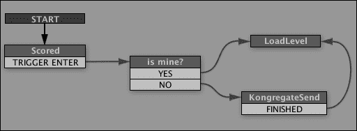

# 第七章。与外部 API 协同工作

在前面的章节中，你创建了一个多人制冰球游戏。扩展它的一个方法是为它添加更多关卡和机制，但你已经知道如何做到这一点。另一种方法是将它集成到不同的外部服务中，例如分析工具、在线得分平台和排行榜。

在本章中，我们将讨论**应用程序编程接口**（**APIs**）。我们将涵盖以下主题：

+   API——它是什么以及它用于什么

+   现有的有用外部 API

+   Unity 通常与外部 API 通信的方式

+   将游戏与现有的一个 API（Kongregate）集成

我们将查看一些代码片段，你将使用这些代码片段将你的游戏与 Kongregate 集成，在线测试游戏，并在 Kongregate 的服务器上保存玩家获胜的次数。

# 关于外部应用程序编程接口

简而言之，在 Unity 的上下文中，外部 API 是一个可以从 Unity 脚本访问的外部代码库，它为你的游戏提供一些额外的功能。一些 API 允许你访问 WebPlayer 游戏所在的页面的 JavaScript 代码，而其他 API 则提供将游戏数据传输到远程服务器并获得信息的能力。

在上一章的冰球游戏中，你已经使用了一个 API：Photon Unity Networking。大多数对远程服务器的调用都隐藏在其源代码的深处，但它仍然是一个 API。

你可能会遇到的其他 API 包括在线游戏平台，如 Kongregate 和 Facebook；分析工具，如 Google Analytics 和 Game Analytics；以及在线数据存储平台，如 Scoreoid 和 Steamworks。

除了不同的功能外，APIs 使用不同的方式连接到外部代码库，并在之后以不同的方式与之通信，这可能看起来像是一项艰巨的任务，但实际上很少是这样。通常，API 的官方网站上会有一个全面的指南，而且即使没有，Unity 社区也经常伸出援手，整理出自己的指南、模板文件和代码片段，这些都可以在 Unity 问答或论坛中轻松获取。

我们将把我们的游戏与 Kongregate 集成，以展示这是如何工作的以及你需要使用什么样的代码。Kongregate 被选为一个相当直接、非常常见且完全免费的 API。

# 将你的游戏上传到 Kongregate

在开始使用 Kongregate API 之前，你必须确认你实际上可以将你的游戏上传到网站。为此，如果你还没有，你需要一个 Kongregate 账户。

1.  访问[`kongregate.com`](http://kongregate.com)，然后在页面顶部附近找到并点击**注册**链接，如图所示：

1.  应该会出现一个注册表单，提供你使用 Facebook 连接或手动输入账户信息的选择。这样做并点击**注册**按钮。

1.  现在，如果你转到 Kongregate 主页并悬停在网站登录块下面的**GAMES**按钮上，应该会出现一个子菜单，分为三个部分：**特色**、**类别**和**开发者**。对我们来说，最后一个是感兴趣的。在那里找到**上传游戏**按钮并点击它。

1.  打开 Unity 并创建一个 Web 构建，就像你在第六章中测试多人游戏时做的那样，*网络和多人游戏*；记住你保存的位置。

1.  在 Kongregate 网站上，你现在应该有游戏信息菜单。输入游戏名称、类别和描述，然后点击**继续**。

1.  下一步要求你选择游戏文件并将它们上传到 Kongregate 的服务器。点击**游戏文件**旁边的**选择文件**按钮，导航到你保存 Unity Web 构建的文件夹，选择具有`unity3d`扩展名的文件，然后点击**打开**。

1.  在下面的两个文本框中，输入游戏的分辨率（宽度 960 和高度 600）。

1.  上传一个图标作为图标。你可以测试，但不能发布没有图标的游戏。

1.  你还可以上传图片作为截图。这不是必需的，你可以稍后进行。

1.  如果你计划不上传游戏到其他任何地方，请勾选**此游戏仅限 Kongregate**。这将确保你从玩你游戏的人那里获得更多的广告利润。

1.  阅读**许可协议**并勾选其下的四个复选框。

1.  **统计 API**部分是我们将要使用 Kongregate API 的部分。点击**添加统计**。

1.  将**统计名称**设置为`Wins`并选择**添加类型**单选按钮。这是统计类型，它决定了统计将如何表现。在我们的例子中，我们将简单地累加玩家的胜利次数。如果你的游戏有一个得分系统，你可以为它创建另一个**最大值**类型的统计。

1.  勾选**显示在排行榜上**以确保该统计信息显示在游戏的公共页面上。

1.  点击**保存**，然后在表单底部点击**上传**。

1.  短暂等待后，游戏应该出现在你的屏幕上，完全可玩。你可以测试多人模式，以确保自你上传到服务器以来没有发生变化。

如果一切正常，我们应该将我们的**Wins**参数与游戏本身集成。为此，我们需要编写几个脚本。

# 编写 Kongregate API 代码

我们需要制作两个脚本，以便将我们的**Wins**得分参数保存并显示在排行榜上。第一个脚本将设置 Kongregate，确保游戏确实在 Kongregate 页面上，并通知游戏 API 连接状态。

第二个脚本将涉及根据球击中的目标来增加获胜玩家的分数。

不再拖延，以下是对话脚本`KongregateAPI`的代码：

```cs
using UnityEngine;
using System.Collections;

// You have to add System in order to access the Convert class
using System;

public class KongregateAPI : MonoBehaviour 
{
  // We are going to check this variable to confirm that
  // Kongregate connection is established
  public static bool isKongregate = false;

  // Player ID
  public static int userId;

  // Player account name. This can be used for greeting the player,
  // for example
  public static string userName;

  // Game ID
  public static string gameAuthToken;

  void Start()
  {
    // Establishing connection with Kongregate
    // Make sure that the game object this script is attached to
    // is in the first scene that gets loaded,
    // and that the name of the object it is attached to is KongregateAPI
    Application.ExternalEval(
    "if(typeof(kongregateUnitySupport) != 'undefined'){" + " kongregateUnitySupport.initAPI('" + gameObject.name +"','OnKongregateAPILoaded');" + "};" );
  }

  // This method gets called if the game is on Kongregate
  void OnKongregateAPILoaded(string userInfoString)
  {
    Debug.Log("Kongregate connection established.");

    isKongregate = true;

    // Kongregate returns a string of chars that we divide and save into variables
    string[] parms = userInfoString.Split("|"[0]);
    userId = Convert.ToInt32(parms[0]);
    userName = parms[1];
    gameAuthToken = parms[2];
  }
}
```

这段代码相当直接，不需要在脚本中已有的注释之外做太多解释。只需注意两点：`Application.ExternalEval`是使你的 Unity 游戏与所在页面的 JavaScript 通信的关键。Unity 以文本字符串的形式发送消息到页面，该消息被 Kongregate 接收并解释为代码。这个字符串的内容使用了 Kongregate API，其完整版本可以在此查阅：[`www.kongregate.com/developer_center/docs/en/using-the-api-with-unity3d`](http://www.kongregate.com/developer_center/docs/en/using-the-api-with-unity3d)。`ExternalEval`是访问外部 API 的一个非常常见的方法。

重要的是，你的脚本附加到的游戏对象（以及脚本本身）应被称为**KongregateAPI**。在**demo_lobby**场景中创建一个空的游戏对象，并将脚本附加到它上，然后保存场景。

页面上的 JavaScript 代码执行后，Kongregate 会向 Unity 发送一个回调消息。这个消息始终以`OnKongregateAPILoaded(string userInfoString)`方法的形式出现。这也是 API 的一部分。然后我们使用`|`符号将其给出的字符串分开，并将部分内容保存到变量中。

### 小贴士

将 Kongregate API 脚本转换为 Playmaker 动作没有太大意义，除非你不想在游戏中使用除 Playmaker 之外的其他组件，在这种情况下，我将由你来决定是否这样做：过程与我们用于第五章中的类似，即*脚本和自定义动作*。

除非你改变了获胜条件，否则游戏目前无法区分玩家 1 和玩家 2 的胜利，无论发生什么情况，游戏都会简单地重新开始。然而，由于我们有一个多人模式并且想要保存每个玩家的胜利次数，这不再适用于我们。我们需要将目标触发器制作成预制体，并按照我们之前制作目标和球棒的方式生成它们；然后，当球击中其中一个时，检测它是否属于我们，如果不是，就将胜利信息发送到 Kongregate。

首先，让我们准备一个 Playmaker 动作，将胜利信息发送到 Kongregate。

```cs
using UnityEngine;
using System.Collections;

namespace HutongGames.PlayMaker.Actions
{
  [ActionCategory(ActionCategory.Level)]
  [Tooltip("Increment the Wins variable on Kongregate.")]
  public class KongregateSendAction : FsmStateAction 
  {
    public override void OnEnter()
    {
      if (KongregateAPI.isKongregate)
      Application.ExternalCall("kongregate.stats.submit", "Wins", 1);
    }
  }
}
```

这里使用的是`Application.ExternalCall`。它调用页面中的外部函数，而不是`ExternalEval`，后者评估一个可能包含或可能不包含函数调用的代码片段。

### 小贴士

`ExternalCall`和`ExternalEval`都只在 Unity Webplayer 中工作。

按照以下步骤来增加 Kongregate 上的**胜利**统计：

1.  打开**demo_room**场景。

1.  创建一个名为`GoalTrigger`的预制件，然后从**Hierarchy**中将**GoalTriggerLeft**游戏对象拖到它上面。

1.  从场景中删除**GoalTriggerLeft**和**GoalTriggerRight**游戏对象；我们将在启动时生成它们。

1.  选择**Game**游戏对象，并在其**Game Manager** FSM 中添加一个名为**goalTriggerRef**的**GameObject**变量。

1.  导航到这个有限状态机（FSM）的实例化玩家状态。向此状态添加一个新的**Photon Network Instantiate**动作。将**游戏对象**属性设置为**GoalTrigger**，**位置**设置为`(-9`, `0.42`, `0`)，**旋转**设置为(`0`, `90`, `0`)，并将**存储对象**设置为**goalTriggerRef**。

1.  打开**Create Puck**状态，并向其中添加一个**Set Position**动作。在这个动作中，将**游戏对象**属性设置为**指定游戏对象**，然后将其设置为**goalTriggerRef**变量。将**向量**、**Y**和**Z**设置为**无**，将**X**设置为`9`。

1.  现在我们已经设置了目标触发器的实例化，我们需要将我们的分数发送到 Kongregate。在项目面板中选择`GoalTrigger`预制件，并向其添加一个**Photon View**组件，然后将它的**Transform**组件拖到**Photon View**的**观察**槽中。

1.  将**PlayMaker Photon GameObject Proxy**组件添加到预制件中。

1.  在**playMaker**面板中，使 FSM 看起来如图所示，添加所有缺失的状态、事件和转换。

1.  向**is mine?**状态添加一个**Photon View Get Is Mine**动作。将**是我的事件**设置为**YES**，将**不是我的事件**设置为**NO**，前提是在**事件**选项卡中之前已经创建了**YES**和**NO**事件。如果没有，请现在就创建它们。

1.  将**Kongregate Send Action**添加到**KongregateSend**状态。这是我们之前创建的动作。

1.  保存场景。

现在，如果你构建游戏，上传到 Kongregate，玩游戏并获胜，将添加分数。你应该在你的游戏页面右侧看到一个**高分**标签。

如果没有这样做，请不要担心，有时提交第一个分数可能需要一些时间。如果你觉得有问题，可以在游戏页面打开互联网浏览器的 JavaScript 控制台，查看 Kongregate 与你游戏交换的命令。

一旦你确定游戏运行良好，并且**胜利**统计信息被正确提交，你可以尝试添加更多统计信息，或者只需通过点击页面顶部的适当链接来发布游戏。然后你可以通过发送公共链接给你的朋友或者自己打开两次并加入同一个服务器来测试它。

# 摘要

在本章中，你学习了 Unity 中的外部 API 是什么以及有哪些类型的 API，然后将其添加到你的游戏中。你将游戏上传到 Kongregate，并在 Kongregate 的服务器上保存了你的多人空中曲棍球游戏的统计信息。
