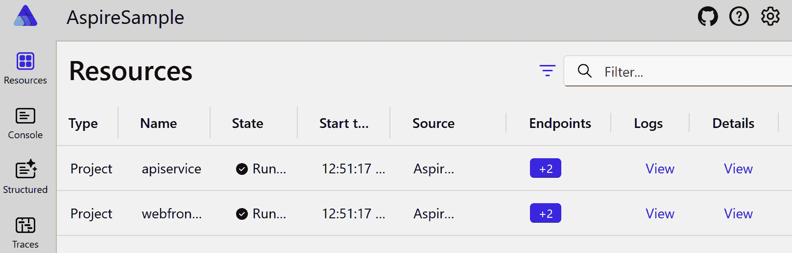
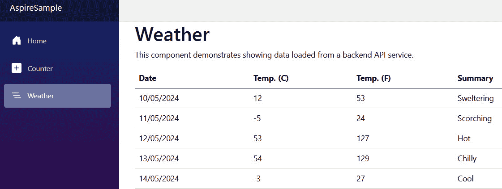
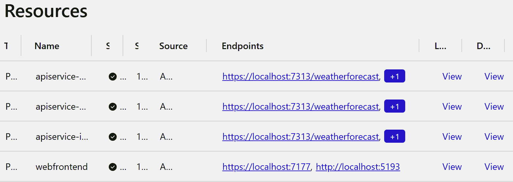
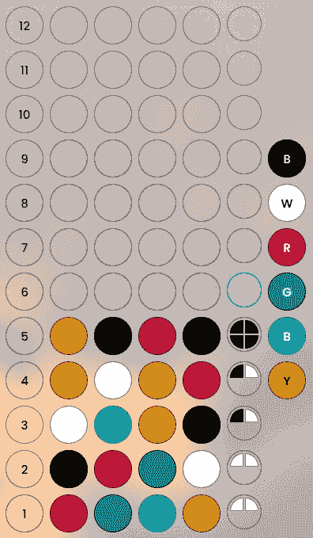
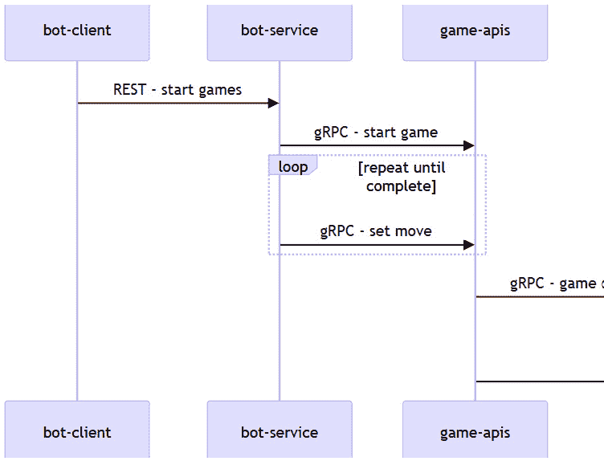
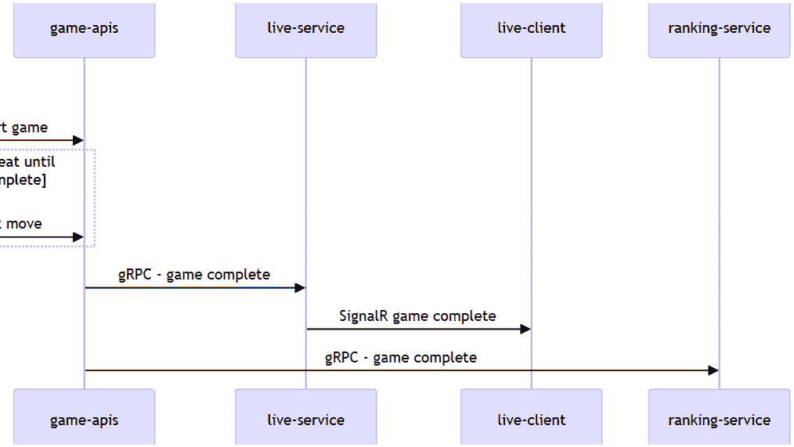
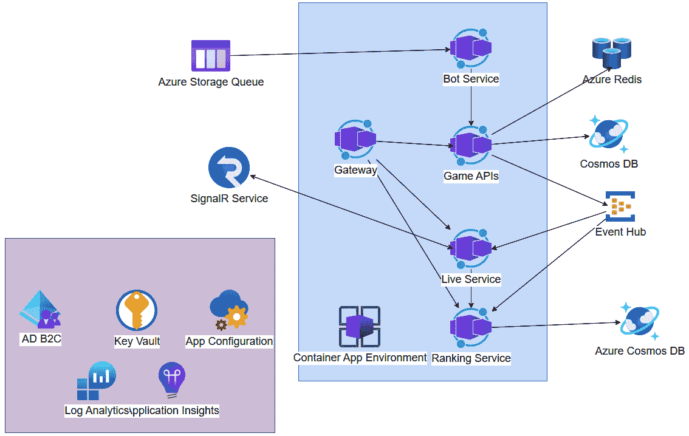

# .NET Aspire 和微服务简介

欢迎创建由微服务组成的解决方案。第一章提供了本书中将开发的微服务解决方案的基础。

在这里，您将了解.NET Aspire 为微服务提供的哪些功能。在这本书中，我们创建了**Codebreaker**解决方案。您将了解 Codebreaker 是什么以及它由哪些部分组成。在本章的最后部分，您将了解在创建应用程序的过程中使用了哪些 Azure 服务。

第一章奠定了基础。

在本章中，您将了解.NET Aspire 在创建微服务方面提供的优势，并且您将获得使用这项技术所需的基础知识，包括如何定义应用程序模型，这对开发和部署意味着什么，如何使用服务发现，以及如何在本地调试解决方案时部署 Azure 资源。

您将了解我们在本书中构建的应用程序概述，解决方案的部分以及不同的服务是如何连接的。

在本章中，您将了解以下内容：

+   创建.NET Aspire 项目

+   Codebreaker 解决方案的部分

+   使用 Microsoft Azure 与.NET Aspire

+   Codebreaker 解决方案使用的 Azure 服务

# 技术要求

在本章中，您需要.NET 8 和.NET Aspire 工作负载，无论是 Visual Studio 还是 Visual Studio Code，Docker Desktop，以及 Microsoft Azure 订阅。有关安装的信息在本章和源代码仓库的 readme 文件中解释。

本章的代码可以在以下 GitHub 仓库中找到：[`github.com/PacktPublishing/Pragmatic-Microservices-with-CSharp-and-Azure`](https://github.com/PacktPublishing/Pragmatic-Microservices-with-CSharp-and-Azure)。

在`ch01`文件夹中，您将看到本章的项目结果。您将看到以下文件夹：

+   `Aspire`：此文件夹包含使用.NET Aspire 模板创建的四个项目，用于运行包括一个服务和 Web 应用的.NET Aspire 项目

+   `Azure`：此文件夹包含与上一个文件夹相同的四个项目，通过使用 Azure 资源进行了增强

# 从.NET Aspire 开始

.NET Aspire 是一种新的.NET 技术，提供工具和库，帮助创建、调试和部署使用微服务的.NET 解决方案。在这本书的所有章节中，我们将利用.NET Aspire。

注意

在本章中，您将获得对.NET Aspire 如何工作的核心理解。在其他所有章节中，我们将使用.NET Aspire 并深入了解其细节。

您可以使用.NET **命令行界面** (**CLI**) 或使用 Visual Studio 2022 进行安装。.NET Aspire 的第一个版本基于.NET 8，因此至少需要.NET 8 才能使用.NET Aspire。

.NET Aspire 需要.NET 8，可以通过安装.NET 工作负载来安装：

```cs
dotnet workload install aspire
```

要查看已安装的工作负载和 .NET Aspire 的版本，请使用以下：

```cs
dotnet workload list
```

如果您使用 Visual Studio，请使用 Visual Studio 安装程序，并选择 **.NET Aspire SDK** 组件来安装 .NET Aspire。

.NET Aspire 应用程序设计为在容器中运行。在本地运行应用程序时，项目直接在系统上运行，无需 Docker 引擎。在部署解决方案时使用 Docker 容器。我们可以（并将）使用可用的 Docker 镜像作为应用程序的一部分。在这里，需要容器运行时才能在本地运行。在这本书中，我们使用最常用的容器运行时 – **Docker Desktop**。Docker Desktop 对个人使用和小公司免费。.NET Aspire 还支持使用 **Podman** 运行容器。

在安装 .NET Aspire 后，创建一个新的项目。

## 创建 .NET Aspire 项目

当 .NET Aspire 安装后，您可以使用以下方式创建一个包含 API 服务和 Blazor 客户端应用程序的新项目：

```cs
dotnet new aspire-starter -o AspireSample
```

使用此模板，将创建四个项目：

+   `AspireSample.ApiService`：此项目包含一个使用 ASP.NET Core 最小 API 的 REST 服务

+   `AspireSample.Web`：一个向 API 服务发送请求的 ASP.NET Core Blazor 应用程序

+   `AspireSample.ServiceDefaults`：一个库项目，包含解决方案中所有服务的共享初始化代码

+   `AspireSample.AppHost`：应用程序宿主项目定义了解决方案的应用程序模型以及所有资源是如何连接的

让我们接下来构建并启动解决方案。

## .NET Aspire 仪表板

当您启动新创建的项目（AppHost 项目需要是启动项目）时，会打开一个控制台，显示 AppHost 的日志，并且浏览器会打开一个仪表板，显示项目的资源，如图 *图 1**.1* 所示。



图 1.1 – Aspire 仪表板

使用 .NET Aspire 仪表板，您可以查看正在运行的资源（如图像中的 `apiservice` 和 `webfrontend`），资源的状态以及端点，并可以访问详细信息和管理日志。在左侧面板中，您可以访问日志、跟踪和指标数据。虽然仪表板通常不在生产环境中使用（我们有 **Prometheus**、**Grafana**、**Azure Application Insights** 和其他环境），但在开发期间了解所有这些信息是非常有用的。服务中是否存在内存泄漏？服务之间的交互是如何发生的？瓶颈在哪里？您可以使用仪表板找到这些信息。这将在 *第十一章* 中详细讨论。

注意

由于 .NET Aspire 仪表板非常出色，它作为 Docker 镜像提供，也可以在生产环境中的小型场景中使用，但它具有开发环境之外的局限性。

当你点击 `webfrontend` 的链接时，应用程序会打开。如果你已经创建了 Blazor 应用程序，你将已经知道应用程序中的链接，如图 *图 1.2* 所示。



图 1.2 – webfrontend

当你点击 `webfrontend` 时，它会向 `apiservice` 发送请求以获取随机天气信息。

应用程序正在运行，接下来让我们看看 .NET Aspire 生成的代码。

## .NET Aspire 应用程序模型

要深入了解 .NET Aspire，你需要学习应用程序模型：

AspireSample.AppHost/Program.cs

```cs
var builder = DistributedApplication.CreateBuilder(args);
var apiService = builder.AddProject<Projects.AspireSample_ApiService>("apiservice");
// code removed for brevity
```

如果你习惯了 .NET 应用程序中的应用程序构建器模式和 `Host` 类来配置 DI 容器、应用程序配置和日志记录，你将看到一些相似之处。在这里，使用 `CreateBuilder` 方法创建 `DistributedApplication` 类以生成 `IDistributedApplicationBuilder`。返回的构建器用于定义解决方案所需的所有资源。使用生成的代码，通过 `AddProject` 方法映射了两个项目。这些项目通过泛型类型引用，例如 `Projects.AspireSample_ApiService`。此类型是通过将项目引用添加到 `AspireSample.ApiService` 项目中创建的。当你打开 `AspireSample.AppHost.csproj` 项目文件时，你可以看到这个引用。

使用 `AddProject` 添加项目类型很方便，但这不是必需的。你也可以传递一个字符串，指向项目所在的目录。

除了添加项目外，还可以添加可执行文件（`AddExecutable`）或 Docker 镜像（`AddContainer`）。

.NET Aspire 还提供了一大串预定义的资源，例如 RabbitMQ、Kafka、Redis 和 SQL Server，以及运行在 Microsoft Azure 中的资源，如 Azure Cosmos DB、Azure 密钥保管库和 Azure 事件中心。要将资源添加到应用程序模型中，需要在 NuGet 包前缀为 `Aspire.Hosting`，并且需要添加 `Aspire.Hosting.Azure`。

注意

在本书中，许多新资源被添加到 Codebreaker 解决方案中。*第三章* 添加了 SQL Server 和 Azure Cosmos DB，*第五章* 添加了 Docker 容器，*第七章* 添加了 Azure 应用配置和 Azure 密钥保管库，*第十一章* 添加了 Azure 日志分析、Prometheus 和 Grafana，*第十三章* 添加了 Azure SignalR 服务，等等。

作为参数传递给 `AddProject` 方法的 `"apiservice"` 名称定义了资源的名称。我们将在 *使用服务* *发现* 部分中使用此名称。

`AddProject` 返回一个 `IResourceBuilder<ProjectResource>` 类型的对象。`IResourceBuilder` 对象可用于在应用模型中连接多个资源。`ProjectResource` 类型继承自 `Aspire.Hosting.ApplicationModel.Resource` 基类，并实现了多个资源接口类型，例如 `IResourceWithEnvironment` 和 `IResourceWithServiceDiscovery`。

让我们使用此资源对象连接另一个资源：

Aspire/AspireSample.AppHost/Program.cs

```cs
// code removed for brevity
builder.AddProject<Projects.AspireSample_Web>("webfrontend")
  .WithExternalHttpEndpoints()
  .WithReference(apiService);
builder.Build().Run();
```

从第一个 `AddProject` 方法返回的 `apiService` 变量使用 `WithReference` 方法引用第二个项目——一个网络前端。这允许访问网络前端以访问 API 服务。API 服务的 URL 被分配为网络前端的环境变量——这就是 `IResourceWithServiceDiscovery` 接口所用的。虽然 API 服务不需要外部访问（只有网络前端需要访问），但网络前端应该可以从外部访问。这就是为什么使用 `WithExternalHttpEndpoints` 方法与网络前端项目一起使用。此配置信息用于指定添加到资源作为代理的 Ingress 控制器的配置。

在查看 AppHost 引用的项目之前，让我们深入了解共享的 `AspireSample.ServiceDefaults` 项目。

## 通用配置的共享项目

`AspireSample.ServiceDefaults` 项目是一个库，包含通用配置，可以被所有资源项目使用：

Aspire/AspireSample.ServiceDefaults/Extensions.cs

```cs
public static class Extensions
{
public static IHostApplicationBuilder AddServiceDefaults(this 
    IHostApplicationBuilder builder)
  {
    builder.ConfigureOpenTelemetry();
    builder.AddDefaultHealthChecks();
    builder.Services.AddServiceDiscovery();
    builder.Services.ConfigureHttpClientDefaults(http =>
    {
      http.AddStandardResilienceHandler();
      http.AddServiceDiscovery();
    });
    return builder;
  }
  // code removed for brevity
```

此共享项目包含 `AddServiceDefaults` 扩展方法，该方法实现了资源应用的通用配置。通过此实现，将调用 `ConfigureOpenTelemetry`，这是由 `Extensions` 类定义的另一个扩展方法。这里实现了日志记录、指标和分布式跟踪的通用部分。这在本章的*第十一章*中有详细说明。`AddDefaultHealthChecks` 配置服务的健康检查，这可能包括用于 .NET Aspire 组件的健康检查。

`AddServiceDiscovery`使用了`Microsoft.Extensions.ServiceDiscovery`库，这个库也是从.NET Aspire 的第一个版本开始就有的，但也可以独立于.NET Aspire 使用。`AddServiceDiscovery`方法注册了默认的服务端点解析器。服务发现不仅可以通过 DI 容器进行配置，还可以通过配置 HTTP 客户端，使用`ConfigureHttpClientDefaults`方法的 lambda 参数进行配置。服务发现将在下一节中讨论。`ConfigureHttpClientDefaults`是`Microsoft.Extensions.Http`库的一部分，即 HTTP 客户端工厂。从`ServiceDefaults`库引用的包是`Microsoft.Extensions.Http.Resiliency`。这个库是从.NET 8 开始出现的，为 Polly 库提供了扩展。在分布式应用程序中，调用有时会在短暂问题上失败。对这些资源的调用重试可能会在另一次调用时成功。这种功能内置在.NET Aspire 中，并在`AddStandardResilienceHandler`中提供了默认的弹性配置。

但现在，让我们进入服务发现。

## 使用服务发现

`webfrontend`需要了解`apiservice`的链接以获取天气信息。这个链接取决于解决方案运行的环境。在开发系统上本地运行应用程序时，我们使用不同端口号的 localhost 链接，并且根据解决方案运行的环境（例如，Azure Container App 环境、Kubernetes 等），需要不同的配置。

使用新的服务发现，可以为服务使用逻辑名称，这些名称使用不同的提供者进行解析。因此，相同的功能可以在不同的环境中工作。

Blazor 客户端应用程序配置`HttpClient`：

Aspire/AspireSample.Web/Program.cs

```cs
builder.Services.AddHttpClient<WeatherApiClient>(client =>
{
  client.BaseAddress = new("https+http://apiservice");
});
// code removed for brevity
```

`apiservice`的名称来自应用程序模型定义——传递给`AddProject`方法的名称。在冒号之前，可以指定模式，例如`http`或`https`。使用`+`分隔模式允许使用多个模式，并且首选第一个。

之前添加到 DI 容器的`AddServiceDiscovery`方法默认添加了一个基于配置的端点解析器。使用它，可以将配置添加到 JSON 配置文件中，例如如下所示：

```cs
{
  "Services": {
    "apiservice": {
      "https": [
        "localhost:8087",
        "10.466.24.90:80"
      ]
    }
  }
}
```

配置后，该部分需要命名为`Services`。在`Services`部分中，查找命名服务（`apiservice`），然后在该处解析模式名称（`https`）下的值。端口号是随机生成的，并且会根据您的环境而有所不同。

在 AppHost 中，由于 `apiservice` 被前端网页引用，API 服务的 URI 被添加为环境变量。打开 .NET Aspire 仪表板，在 `webfrontend` 中，你可以看到 `services__apiservice_http__0` 和 `services__apiservice_https_0` 环境变量，以及 `http://localhost:5395` 和 `https://localhost:7313` 的值。URI 在 `Properties/launchsettings.json` 中指定：

Aspire/AspireSample.ApiService/Properties/launchSettings.json

```cs
"profiles": {
  "http": {
    "commandName": "Project",
    "dotnetRunMessages": true,
    "launchBrowser": true,
    "launchUrl": "weatherforecast",
    "applicationUrl": "http://localhost:5395",
    "environmentVariables": {
      "ASPNETCORE_ENVIRONMENT": "Development"
    }
  },
  "https": {
    "commandName": "Project",
    "dotnetRunMessages": true,
    "launchBrowser": true,
    "launchUrl": "weatherforecast",
    "applicationUrl": "https://localhost:7313;http://localhost:5395",
    "environmentVariables": {
      "ASPNETCORE_ENVIRONMENT": "Development"
    }
  }
}
```

`applicationUrl` 设置定义了应用程序启动时使用的 URL，这是用于将其添加到环境变量的链接。因为环境变量是 .NET 配置的一部分，所以这些值由服务发现配置提供者检索。

Azure 容器应用和 Kubernetes 提供了服务发现功能，而无需使用服务发现库。在这些应用程序部署后，使用 `DnsEndPoint` 配置了一个透传提供者。

在本地运行 .NET Aspire 解决方案时，`webfrontend` 和 `apiservice` 进程使用随机端口。在这些进程之前自动添加了一个反向代理，并且反向代理可以通过配置的启动设置访问。

这允许通过应用程序模型更改副本的数量：

Aspire/AspireSample.AppHost/Program.cs

```cs
var apiService = builder.AddProject<Projects.AspireSample_ApiService>("apiservice")
  .WithReplicas(3);
```

在 AppHost 中，使用 `WithReplicas(3)` 通过三个随机端口启动三个服务实例，并且与反向代理中显示的相同端口号，如 *图 1**.3* 所示。



图 1.3 – 多个副本

你可以看到三个带有不同后缀的 `apiservice-` 服务正在运行，以及三个具有相同端口号的进程，如端点所示。从启动设置中定义的端点是反向代理的端点。当你打开**详细信息**时，你可以看到每个服务都有不同的目标端口。反向代理充当负载均衡器，以选择其中一个副本。

注意

要使用 `http` 启动配置文件启动解决方案，你需要将 `ASPIRE_ALLOW_UNSECURED_TRANSPORT` 环境变量添加到 AppHost 项目的启动设置中，并将其设置为 `true`。

这是从 .NET Aspire 的重要核心功能。然而，还有更多。

## .NET Aspire 组件

.NET Aspire 组件使得在配置的应用程序中使用 Microsoft 和第三方功能和服务的变得容易。Azure Cosmos DB、Pomelo MySQL Entity Framework Core 和 SQL Server 是用于访问数据库的组件，而 RabbitMQ、Apache Kafka 和 Azure Service Bus 是用于消息传递的组件。有关组件的列表，请参阅 [`learn.microsoft.com/en-us/dotnet/aspire/fundamentals/components-overview`](https://learn.microsoft.com/en-us/dotnet/aspire/fundamentals/components-overview)。

要使用组件，通常与 AppHost 一起使用，需要通过添加主机 NuGet 包来配置资源，例如，对于 Azure Cosmos DB EF Core 组件，您会添加`Aspire.Hosting.Azure.CosmosDB`包。然后，通过将`Aspire.Microsoft.EntityFrameworkCore.Cosmos`包添加到访问数据库的服务中（例如，API 服务），来使用该组件本身。

组件能提供什么？你知道技术用来开启日志度量数据名称是什么吗？Aspire 组件知道这一点，并且配置起来很容易。当 Azure Cosmos DB 资源添加到应用模型中，并被服务项目引用时，连接字符串被配置为环境变量（或存储在秘密存储中），并且可以被需要连接的项目访问。

在本书的许多章节中，我们将添加一些新组件，因此这里不再详细介绍。

## 创建应用模型清单

在`AppHost`项目中定义的应用模型，我们可以创建一个描述资源的 JSON 清单文件。如果项目仍在运行，则需要停止项目以允许重新构建：

```cs
cd ApireSample.AppHost
dotnet run --publisher manifest --output-path aspire-manifest.json
```

以下代码片段显示了此清单文件的一部分：

Aspire/AspireSample.AppHost/aspire-manifest.json

```cs
"webfrontend": {
  "type": "project.v0",
  "path": "../AspireSample.Web/AspireSample.Web.csproj",
  "env": {
    "services__apiservice__http__0": "{apiservice.bindings.http.url}",
    "services__apiservice__https__0": "{apiservice.bindings.https.url}"
  },
  "bindings": {
    "https": {
      "scheme": "https",
      "protocol": "tcp",
      "transport": "http",
      "external": true
    }
  }
}
```

清单包含有关资源类型、环境变量、绑定等信息。使用应用模型，我们还可以指定使用 Azure 资源。现在，此清单文件可以被工具用于部署解决方案，例如，通过使用 Azure 开发者 CLI 将其部署到 Microsoft Azure）。创建 Azure 资源的内容在*第六章*中介绍，并在其他章节中继续介绍。

使用 Aspir8（一个开源项目，见[`github.com/prom3theu5/aspirational-manifests/`](https://github.com/prom3theu5/aspirational-manifests/)），可以将解决方案部署到 Kubernetes 集群。这在*第十六章*中有使用。

应用模型可以根据不同的启动配置文件进行自定义。这样，可以创建不同的清单文件以部署到（例如，Azure 并使用特定的 Azure 资源，以及到本地 Kubernetes 集群）。

注意

在开发过程中启动和调试项目时，使用包含应用模型的 AppHost 项目。对于部署，使用应用模型的清单。当在生产环境中运行解决方案时，应用宿主不再起作用。

.NET Aspire 本书从第一章到最后一章都在使用。让我们看看我们正在构建的内容。

# Codebreaker – 解决方案

代码破解解决方案是一个传统的游戏，用于解决一组颜色。使用一种游戏类型，玩家需要从六个不同颜色的列表中选择四个颜色（可以是重复的）。游戏服务随机选择正确的颜色。玩家每走一步，就会得到一个答案：对于每个正确且位置正确的颜色，会返回一个黑色标记。对于每个正确但位置错误的颜色，会返回一个白色标记。现在玩家最多有 12 次移动来找到正确的解决方案。*图 1**.4* 展示了使用 Blazor 客户端应用程序运行的游戏。



图 1.4 – Blazor 客户端应用程序

这种游戏玩法表明，在五步之后找到了解决方案。在这种情况下，正确的结果是黄色 – 黑色 – 红色 – 黑色。第一次选择是红色 – 绿色 – 蓝色 – 黄色，结果是两个白色标记。第五步选择了黄色 – 黑色 – 红色 – 黑色，并返回了四个黑色标记，这意味着这是正确的移动。

注意

创建客户端应用程序不是本书的内容（在第 *第四章* 中仅完成了一个简单的控制台应用程序，该程序访问 API）。然而，几个客户端应用程序的源代码可在 [`github.com/codebreakerapp`](https://github.com/codebreakerapp) 获取。

创建一个运行某些游戏规则的服务似乎是一个简单的任务，不需要微服务架构。然而，正如 *图 1**.5* 和 *图 1**.6* 中的序列图所示，还有更多内容。



图 1.5 – 代码破解玩游戏序列

该解决方案需要多个服务。游戏 API 服务不仅被人类玩家使用的 UI 调用；一个可以接收到消息后触发的机器人服务，会自行玩多个游戏，并且游戏 API 服务将有关游戏和每一步的信息写入数据库。



图 1.6 – 代码破解游戏完成序列

游戏完成后，游戏 API 服务不仅将此信息写入数据库，还发送事件。这些事件被实时服务和排名服务接收。实时服务由实时客户端使用 ASP.NET Core SignalR 监控正在进行的游戏。排名服务将完成的游戏写入其自己的数据库，客户端可以使用它来获取每日、每周和每月的游戏排名。还使用运行 Microsoft YARP 的服务来验证用户并将请求转发到不同的服务。

代码破解解决方案利用了多个 Azure 服务，如以下所述。

# 使用 Microsoft Azure

要创建和运行本书中的代码，您还需要拥有一个 Azure 订阅。您可以在[`azure.microsoft.com/free`](https://azure.microsoft.com/free)免费激活 Microsoft Azure，这将为您的账户提供约 200 美元的 Azure 信用额度，这些额度在最初 30 天内可用，之后还可以免费使用一些服务。

许多开发者可能会错过的是，如果您拥有 Visual Studio Professional 或 Enterprise 订阅，您每个月还可以免费获得一定数量的 Azure 资源。您只需使用您的 Visual Studio 订阅激活即可：[`visualstudio.microsoft.com/subscriptions/`](https://visualstudio.microsoft.com/subscriptions/)。

要创建和管理资源，我们使用 Azure Portal、Azure CLI 和 Azure Developer CLI。在 Windows 上，您可以使用以下方式安装它们：

```cs
winget install Microsoft.AzureCLI
winget install Microsoft.Azd
```

在 Mac 和 Linux 上安装这些工具，请查看[`learn.microsoft.com/en-us/cli/azure/install-azure-cli`](https://learn.microsoft.com/en-us/cli/azure/install-azure-cli)和[`learn.microsoft.com/en-us/azure/developer/azure-developer-cli/install-azd`](https://learn.microsoft.com/en-us/azure/developer/azure-developer-cli/install-azd)。

让我们来看看使用 Microsoft Azure 的资源。

## Codebreaker 使用的 Azure 资源

要查看使用了哪些 Azure 资源，请查看*图 1.7*。



图 1.7 – Codebreaker 的 Azure 资源

解决方案运行的计算服务是 Azure Container App 环境。这是一个抽象 Kubernetes 集群的服务。机器人服务、游戏 API、实时服务、排名服务和使用 YARP 的网关都在 Azure Container Apps 中运行。机器人服务使用 Azure Storage 队列：当队列中有消息到达时，机器人服务被触发以玩一系列游戏。机器人服务也可以从所有客户端应用程序中使用 – 通过 YARP 实现的网关间接使用。游戏 API 服务将游戏写入 Azure Cosmos DB，并使用 Redis 集群缓存游戏。游戏完成后，游戏事件会被推送到 Azure Event Hub。实时服务和排名服务是 Event Hub 的订阅者。实时服务使用 ASP.NET Core SignalR，为了减少该服务的负载，使用了 Azure SignalR 服务。

常用的有 Azure App Configuration，用于应用程序配置值和功能管理，Azure Key Vault 用于存储机密，Azure Active Directory B2C 用于用户注册，以及 Log Analytics 和 Application Insights 用于监控应用程序。

注意

从一个小版本的 Codebreaker 开始，不需要很多 Azure 服务即可使用。为了实现灵活和可扩展的解决方案，该解决方案可能被全球访问，并且为了了解微服务的各个方面，所有这些服务都在使用中。在部署服务时，不要担心成本。只要您不创建巨大的负载（我们将在*第十二章*中这样做），成本就会非常小，并且在使用后删除资源时，您远远不会用完免费订阅中可用的$200。

## 从开发环境进行 Azure 配置

您的.NET Aspire 解决方案可以轻松集成到 Microsoft Azure 中，并在调试解决方案时部署资源。

通过本地调试解决方案，不需要将所有资源部署到 Azure。服务项目可以在测试时本地运行，无需部署。对于 Azure Cosmos DB，有一个 Docker 容器或本地安装的模拟器可用。并非所有资源都可行，例如 Azure Key Vault 或 Azure Application Insights。

要自动部署这些资源，.NET Aspire 需要访问您的订阅。为此，首先，使用 Azure CLI 登录到您的 Azure 订阅：

```cs
az login
```

这将打开浏览器，您可以使用您的 Azure 订阅登录。

如果您有多个订阅，请检查 Azure CLI 是否设置为当前订阅：

```cs
az account show
```

这显示了当前的活动订阅。如果应该使用不同的订阅，请使用`az account list`列出所有订阅，并使用`az account set –subscription <your subscription id>`将当前订阅设置为另一个订阅。记住与`id`一起列出的值——这是在下一步中需要的订阅 ID。

现在，我们需要将项目连接到订阅并指定一些设置。最好将这些信息放在用户密钥中；这些信息不应该放入源代码存储库中。

如果用户密钥尚未与`AppHost`配置，请初始化它：

```cs
cd AspireSample.AppHost
dotnet user-secrets init
```

我们需要的配置如下：

```cs
dotnet user-secrets set Azure:SubscriptionId <your subscription id>
dotnet user-secrets set Azure:AllowResourceGroupCreation true
dotnet user-secrets set Azure:ResourceGroup rg-firstsample
dotnet user-secrets set Azure:Location westeurope
dotnet user-secrets set Azure:CredentialSource AzureCli
```

使用`SubscriptionId`，您指定创建资源的订阅。您使用`ResourceGroup`的值指定的资源组用于创建所有需要的资源。如果将`AllowResourceGroupCreation`设置为`true`，则将创建资源组。否则，您需要首先创建资源组。使用`Location`设置，指定您首选的位置。要查看您的订阅可用的位置，请使用`az account list-locations -``o table`。

将`CredentialSource`设置设置为`AzureCli`表示你正在使用与 Azure CLI 相同的账户来创建资源。如果没有此设置，将使用`DefaultAzureCredential`，它尝试使用预定义列表中的多种账户类型，直到成功。这包括 Visual Studio、Azure CLI、PowerShell、Azure Developer CLI 和其他凭证。在这里，可能使用没有访问订阅的凭证。根据我的经验，最好明确提供凭证。

要查看所有秘密，请使用以下方法：

```cs
dotnet user-secrets list
```

注意

使用 Visual Studio，你可以通过使用解决方案资源管理器将项目连接到 Azure。在 AppHost 项目中，选择**连接的服务**，打开上下文菜单，并选择**Azure 资源配置设置**。这将打开一个对话框，用于选择订阅、位置和资源组。

接下来，让我们将`Aspire.Hosting.Azure.KeyVault` NuGet 包添加到 AppHost 项目中，并更新应用程序模型：

```cs
var builder = DistributedApplication.CreateBuilder(args);
var keyVault = builder.AddAzureKeyVault("secrets");
var apiService = builder.AddProject<Projects.AspireSample_ApiService>("apiservice")
  .WithReplicas(3)
  .WithReference(keyVault);
```

`AddAzureKeyVault`方法创建了一个名为`secrets`的密钥保管库。这个密钥保管库在`apiservice`项目中被引用。

当你现在启动 AppHost 时，密钥保管库将在 Azure 内部创建。打开[`portal.azure.com`](https://portal.azure.com)的 Azure 门户，你会看到资源组，在资源组内部创建了 Azure Key Vault。如果你再次检查用户密钥，将添加一个`Azure:Deployments`部分，其中包含到创建的资源链接。这些信息用于再次找到资源，并且它们在下次启动应用程序时不需要再次发布。

当你完成本章内容后，只需从门户中删除整个资源组，这样就不会产生额外的费用。

注意

要将所有资源（包括项目）发布到 Azure，你可以使用 Azure Developer CLI。这将在*第六章*中介绍。

# 摘要

在本章中，你学习了.NET Aspire 的核心功能，包括工具、编排和 Aspire 组件。你学习了资源是如何通过 Aspire 应用程序模型连接的，以及服务发现是如何进行的。你看到了如何创建一个描述应用程序模型的清单，该清单可以被工具用于部署解决方案。

通过 Codebreaker 解决方案，你了解了游戏的规则以及从第二章到最后一章创建的应用程序部分。

现在，你知道了 Codebreaker 解决方案在 Azure 中运行时使用的不同 Microsoft Azure 服务。还提供了一个替代方案，以便在本地环境中运行完整的解决方案（这样也可以在 Azure 云中托管）。

从下一章开始，我们将开始开发 Codebreaker 解决方案。在*第二章*中，我们将使用 ASP.NET Core 最小 API 创建 REST 服务来玩游戏。我们将使用 HTTP 文件测试此 API。

# 进一步阅读

要了解更多关于本章讨论的主题，您可以参考以下链接：

+   **.NET Aspire 安装和** **工具**: [`learn.microsoft.com/en-us/dotnet/aspire/fundamentals/setup-tooling`](https://learn.microsoft.com/en-us/dotnet/aspire/fundamentals/setup-tooling)

+   **.NET Aspire** **组件**: [`learn.microsoft.com/en-us/dotnet/aspire/fundamentals/components-overview`](https://learn.microsoft.com/en-us/dotnet/aspire/fundamentals/components-overview)

+   **.NET Aspire 清单** **格式**: [`learn.microsoft.com/en-us/dotnet/aspire/deployment/manifest-format`](https://learn.microsoft.com/en-us/dotnet/aspire/deployment/manifest-format)

+   **Aspir8 的 GitHub 仓库**: [`github.com/prom3theu5/aspirational-manifests`](https://github.com/prom3theu5/aspirational-manifests)
