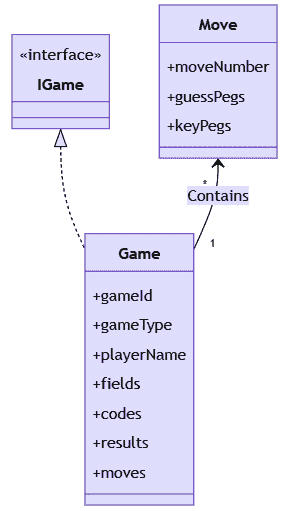
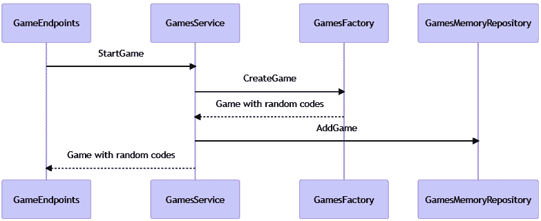
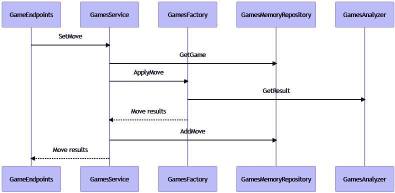
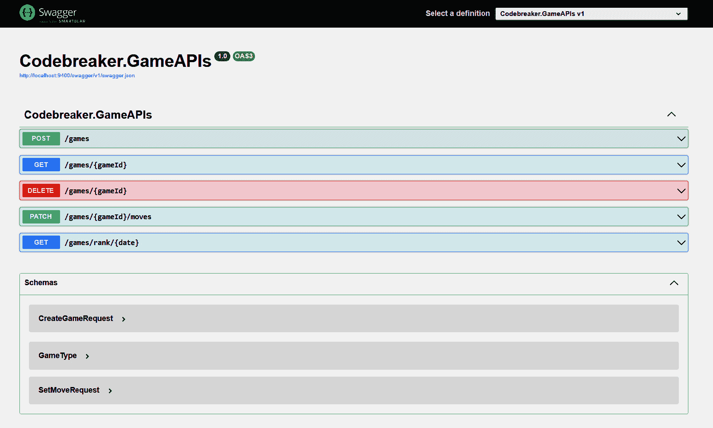
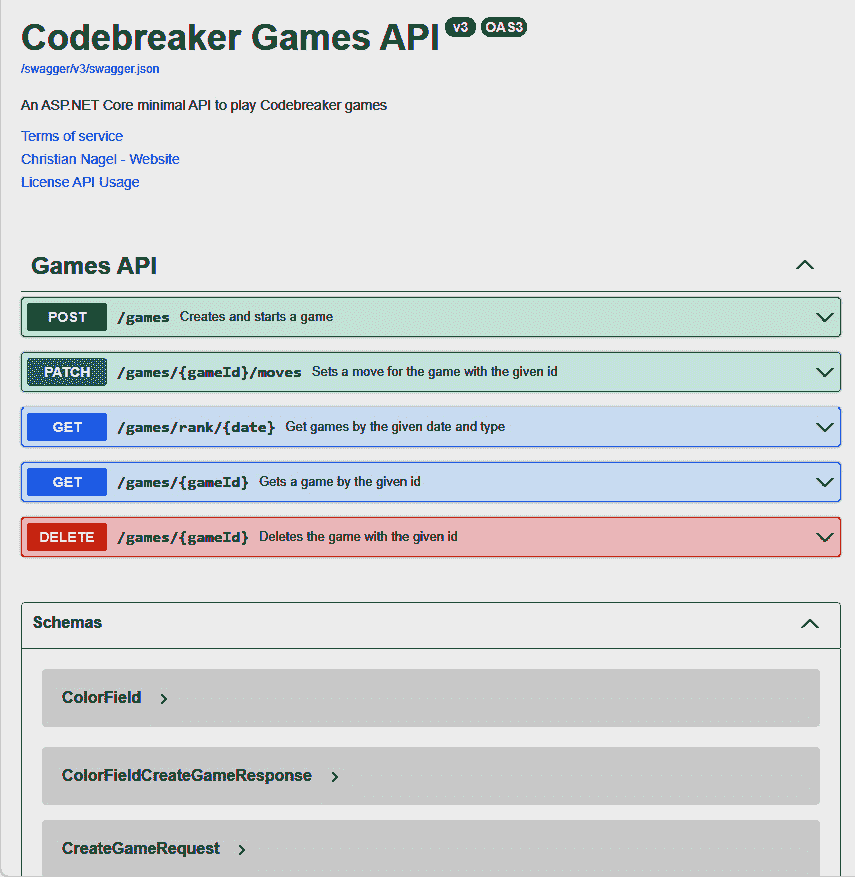
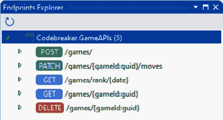
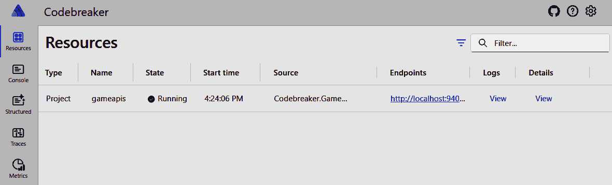
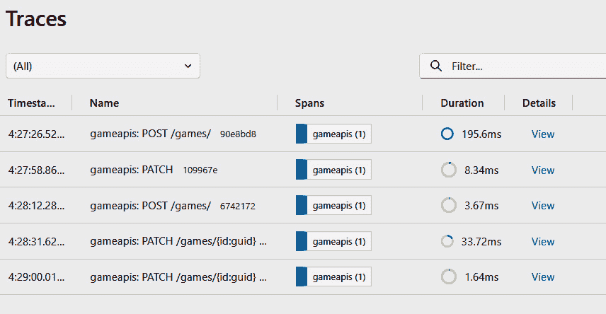

# 第二章：最小 API – 创建 REST 服务

自.NET 6 以来，最小 API 是创建 REST API 的新方法。随着.NET 版本的更新，越来越多的增强功能被提供，这使得它们成为使用.NET 创建 REST 服务的首选方式。

在本章中，你将学习如何使用模型类型创建游戏的数据表示，在服务中使用这些类型来实现游戏功能，创建一个最小 API 项目来创建游戏，通过设置游戏移动来更新游戏，并返回有关游戏的信息。

你将实现提供 OpenAPI 描述的功能，以便开发人员访问服务以获取有关服务的信息，并创建客户端应用程序的简单方法。

在本章中，你将探索以下主题：

+   创建游戏模型

+   实现内存游戏库

+   使用最小 API 实现游戏的 REST 服务

+   使用 OpenAPI 描述服务

+   使用 HTTP 文件测试服务

+   启用.NET Aspire

到本章结束时，你将拥有一个运行中的服务，该服务实现了 Codebreaker 游戏 API，并具有内存游戏存储，可以通过 HTTP 请求访问。

# 技术要求

本章的代码可以在以下 GitHub 存储库中找到：[`github.com/PacktPublishing/Pragmatic-Microservices-with-CSharp-and-Azure`](https://github.com/PacktPublishing/Pragmatic-Microservices-with-CSharp-and-Azure)。`ch02`源代码文件夹包含本章的代码示例。你将找到以下代码：

+   `Codebreaker.GamesAPIs` – Web API 项目

+   `Codebreaker.GamesAPIs.Models` – 数据模型库

+   `Codebreaker.GameAPIs.Analyzers` – 包含游戏移动分析器的库

+   `Codebreaker.GamesAPIs.Analyzers.Tests` – 游戏移动分析器的单元测试

+   `Codebreaker.AppHost` – .NET Aspire 的主项目

+   `Codebreaker.ServiceDefaults` – 由.NET Aspire 配置使用的库

注意

本章中不实现游戏移动分析器。`Analyzers`项目仅作参考，但你可以直接使用为你提供的分析器 NuGet 包（`CNinnovation.Codebreaker.Analyzers`）来构建服务。

对于 Visual Studio、Visual Studio Code 和.NET Aspire 的安装，请检查存储库中本章的 README 文件。

# 游戏模型

在创建 REST API 项目之前，我们从一个包含游戏及其移动的模型的库开始。此模型将包含 Codebreaker 游戏 API 服务解决方案的主要数据部分，该部分将用于读取和写入数据库（在*第三章*），同时该模型也作为游戏主要功能的实现。

简化版本中的主要类型如图 *图 2.1* 所示。`Game` 类实现了 `IGame` 接口。`IGame` 接口由 `Analyzers` 包使用。一个游戏包含一系列移动。单个游戏移动由 `Move` 类表示。



图 2.1 – 游戏模型

## 探索游戏分析器库

由于本书的重点不是使用 .NET 实现游戏规则，您可以使用现有的项目 `Codebreaker.GameAPIs.Analyzers`，或者直接引用已发布在 NuGet 服务器上的 NuGet 包。此库包含以下游戏类型的游戏移动分析器：

+   `Game6x4` – 六种颜色和四种代码来猜测

+   `Game8x5` – 八种颜色和五种代码

+   `Game6x4Mini` – 六种颜色和四种代码，带有 *小型* *儿童* 模式

+   `Game5x5x4` – 五种颜色和五种形状，四种代码

分析器通过通用的 `IGame` 接口工作，您需要使用游戏模型库来实现它。

`IGame` 接口指定了 `Codebreaker` 游戏的一些常见功能，如下面的代码片段所示。请检查存储库以获取完整的接口定义：

Codebreaker.GameAPIs.Analyzers/Contracts/IGame.cs

```cs
namespace Codebreaker.GameAPIs.Contracts;
public interface IGame
{
  Guid Id { get; }
  string GameType { get; }
  int NumberCodes { get; }
  int MaxMoves { get; }
  DateTime StartTime { get; }
  // code removed for brevity
  IDictionary<string, IEnumerable<string>> FieldValues { get; }
  string[] Codes { get; }
}
```

`IGame` 接口定义了分析器使用的游戏成员，例如必须设置的代码数量和允许的最大移动次数，这些由分析器用于验证正确的输入数据。`IDictionary<string, IEnumerable<string>>` 类型的 `FieldValues` 属性定义了可从中选择的可能值。对于颜色游戏类型，这将是一个颜色列表。对于形状游戏类型，这将是一个颜色列表和一个形状列表。`Codes` 属性包含一个字符串数组。字符串的样式取决于游戏类型。字符串数组包含游戏运行的正确解决方案。

`analyzers` 库还包含分析器实现支持的记录类型，您可以用作游戏类型的泛型参数。

以下是一个用于泛型参数的此类类型的示例 `ColorField`：

Codebreaker.GameAPIs.Analyzers/Fields/ColorField.cs

```cs
public partial record class ColorField(string Color)
{
  public override string ToString() => Color;
  public static implicit operator ColorField(string color) => 
    new(color);
}
```

`ColorField` 记录类仅包含一个 `color` 字符串。此字段类型与所有游戏类型一起使用，除了 `Game5x5x4` 游戏类型，它使用 `ShapeAndColorField` 记录。

要指定游戏移动的结果，有三种不同类型可供选择：`ColorResult`、`SimpleColorResult` 和 `ShapeAndColorResult`。`SimpleColorResult` 为幼儿提供信息（哪个位置有正确的颜色），而 `ColorResult` 记录结构仅包含有关放置在正确孔中的颜色数量和放置在错误孔中的颜色数量的信息。

以下代码片段显示了 `ColorResult` 记录结构：

Codebreaker.GameAPIs.Analyzers/Results/ColorResult.cs

```cs
public readonly partial record struct ColorResult(int Correct, 
  int WrongPosition)
{
  private const char Separator = ':';
}
```

此记录部分实现，将实现的部分分离以简化源代码。其他部分定义在其他源文件中，并实现了`IParsable`和`IFormattable`接口。名为`Separator`的`const`成员与`ColorResult`类型的其他部分一起使用。

注意

`ColorField`、`ColorResult`以及其他表示字段和结果的类仅用于分析移动并返回结果。您在本章中将要实现的`Game`和`Move`类只是数据持有者，不包含任何逻辑。字段猜测和结果都使用字符串表示，这使得它们适用于每种游戏类型，并且更容易与 JSON 序列化和数据库访问一起使用。将特定字段和结果类型转换为字符串以及从字符串转换的操作是通过使用`IParsable`、`ISpanParsable`和`IFormattable`接口完成的。可解析接口自.NET 7 以来是新的，并基于 C# 11 的一个功能，该功能允许具有接口的静态成员。如果您想创建自己的游戏类型和游戏分析器，这些类型很重要。

您可以阅读[`csharp.christiannagel.com/2023/04/14/iparsable/`](https://csharp.christiannagel.com/2023/04/14/iparsable/)上的文章，了解更多关于可解析接口的信息。

## 探索游戏分析器

游戏分析器的实现是在`GameGuessAnalyzer`基类和`ColorGameGuessAnalyzer`、`SimpleGameGuessAnalyzer`和`ShapeGameGuessAnalyzer`派生类中完成的。这些分析器的实现与游戏模型类型无关。所有这些分析器都实现了由`IGameGuessAnalyzer<Tresult>`接口指定的`GetResult`方法。在创建分析器实例并传递游戏、猜测和移动编号后，只需调用`GetResult`方法即可计算移动的结果。

如果您对检查分析器感兴趣，请深入到书中源代码仓库中的`Codebreaker.GameAPIs.Analyzers`项目。通过以下步骤操作，而不是引用此项目，您可以添加`CNinnovation.Codebreaker.Analyzers` NuGet 包。只需确保使用此包的最新 3.x 版本，因为 4.x 及更高版本可能包含破坏性更改。

如果您选择这样做，您可以自己创建一个分析器，并添加更多游戏类型。请确保阅读关于游戏规则的*第一章*中的信息。

## 创建.NET 库

模型类型被添加到`.NET library Codebreaker.GameAPIs.Models`。拥有一个库允许创建不同的数据访问库（在*第三章*中），为托管服务提供灵活的数据存储选择。

您可以使用如上所示的.NET CLI 创建类库，或者使用 Visual Studio 创建类库：

```cs
dotnet new classlib --framework net8.0 -o Codebreaker.GameAPIs.Models
```

## 实现模型类型的类

这里展示了包含游戏所需所有数据的 `Game` 类（完整的实现请查看 GitHub 仓库）：

Codebreaker.GameAPIs.Models/Game.cs

```cs
public class Game(
  Guid id,
  string gameType,
  string playerName,
  DateTime startTime,
  int numberCodes,
  int maxMoves) : IGame
{
  public Guid Id { get; } = id;
  public string GameType { get; } = gameType;
  public string PlayerName { get; } = playerName;
  public DateTime StartTime { get; } = startTime;
  // code removed for brevity
  public ICollection<Move> Moves { get; } = []
  public override string ToString() =>   
    $"{Id}:{GameType} – {StartTime}";
}
```

此类实现了 `IGame` 接口，以支持分析器检查走法的正确性并设置一些游戏状态。除了接口的成员外，`Game` 类还包含一个 `Move` 对象的集合。使用主要构造函数语法来减少所需的代码行数。

主要构造函数

本书创建的几个类都使用了主要构造函数。自 C# 9 以来，主要构造函数一直用于记录。在 C# 12 中，主要构造函数可以用于普通类和结构体。然而，虽然记录中的主要构造函数创建属性，而在类中，这些只是参数。这些参数可以分配给字段和属性，或者仅用于成员内。

`Move` 类比较简单，因为它只代表游戏中的玩家走法及其结果：

Codebreaker.GameAPIs.Models/Move.cs

```cs
public class Move(Guid id, int moveNumber)
{
  public Guid Id { get; private set; } = id;
  public int MoveNumber { get; private set; } = moveNumber;
  public required string[] GuessPegs { get; init; }
  public required string[] KeyPegs { get; init; }
  public override string ToString() => 
    $"{MoveNumber}. {string. Join(':', GuessPegs)}";
}
```

`Move` 类包含用于猜测（`GuessPegs`）和结果（`KeyPegs`）的字符串数组。字符串数组可以用于每种游戏类型。

## 定义游戏存储库合约

为了独立于数据存储，`IGamesRepository` 接口定义了在玩游戏时从数据存储中需要的所有成员。当开始新游戏时，将调用 `AddGameAsync` 方法。设置走法时，需要通过调用 `UpdateGameAsync` 方法来更新游戏。接口指定了 `GetGameAsync` 和 `GetGamesAsync` 方法来检索游戏：

Codebreaker.GameAPIs.Models/Data/IGamesRepository.cs

```cs
public interface IGamesRepository
{
  Task AddGameAsync(Game game, 
        CancellationToken cancellationToken = default);
     Task AddMoveAsync(Game game, Move move, 
       CancellationToken cancellationToken = default);
     Task<bool> DeleteGameAsync(Guid id, 
       CancellationToken cancellationToken = default);
     Task<Game?> GetGameAsync(Guid id, 
       CancellationToken cancellationToken = default);
     Task<IEnumerable<Game>> GetGamesAsync(GamesQuery gamesQuery, 
       CancellationToken cancellationToken = default);
     Task<Game> UpdateGameAsync(Game game, 
       CancellationToken cancellationToken = default);
}
```

此接口指定了异步方法。在本章的实现中不需要这些方法。下一章将添加异步实现，因此合约应该为此做好准备。

在指定异步方法时，允许传递 `CancellationToken` 是一种良好的做法。这允许在网络边界之外取消长时间运行的操作。

`IGamesRepository` 接口在 `Codebreaker.GameAPIs.Models` 库中定义。这使得可以从稍后将要实现的所有数据存储库中引用此接口。在本章中，将只实现一个内存中的集合作为下一步的一部分。

# 最小 API 项目

在建立了模型和存储库合约之后，我们可以转向创建托管 REST API 的项目。

在这里，我们将使用 ASP.NET Core 和最小 API 创建 REST API，并在内存存储库中存储游戏和走法。为了创建运行中的游戏 API，我们需要执行以下操作：

1.  创建 Web API 项目。

1.  实现游戏存储库。

1.  创建游戏工厂。

1.  创建数据传输对象。

1.  创建端点以通过 HTTP 请求运行游戏。

1.  配置 JSON 序列化器。

1.  添加端点过滤器。

为了更好地理解不同的类在创建游戏和设置移动时的交互，我们需要实现的功能流程在接下来的两个图中展示。

*图 2.2* 展示了创建新游戏的序列。在调用 API 调用后，`GamesService` 被调用以启动游戏。这个服务类使用 `GamesFactory` 根据接收到的参数创建一个新的游戏，并返回随机的代码值。为了持久化，`GamesService` 从 `GamesService` 调用 `GameMemoryRepository` 在返回游戏之前添加游戏。



图 2.2 – 创建游戏

*图 2.3* 展示了设置游戏移动的序列。因为客户端没有游戏完整的状态，`GamesService` 从存储库中检索游戏。然后，`GamesFactory` 再次使用以根据游戏类型选择分析器，并调用分析器以找到游戏移动的结果。在 `GamesService` 可用结果后，游戏使用新的移动进行更新，并将结果返回到游戏端点。



图 2.3 – 设置游戏移动

让我们使用 API 实现这个功能。

## 创建 Web API 项目

要创建 Web API 项目，你可以使用如下的 .NET CLI 或使用 Visual Studio 中的 Web API 项目模板：

```cs
dotnet new webapi --use-minimal-apis --framework net8.0 -o Codebreaker.GameAPIs
```

使用 `--use-minimal-apis` 选项创建最小 API 而不是传统的控制器。因为 API 将托管在 Ingress 服务器后面，Ingress 服务器将提供 HTTPS，而后端可以使用 HTTP。为了允许但不要求 HTTPS，从代码中删除 `app.UseHttpsRedirection();` 这行代码。

## 探索 WebApplicationBuilder 和 WebApplication

使用创建的项目，`Program.cs` 被创建并包含使用 `WebApplicationBuilder` 类配置依赖注入容器的配置，以及使用 `WebApplication` 类配置中间件的配置。项目模板创建了一个随机天气服务。然而，由于游戏服务不需要天气信息，一些创建的代码可以被删除。

下一代码片段显示了剩余的代码部分：

```cs
var builder = WebApplication.CreateBuilder(args);
builder.Services.AddEndpointsApiExplorer();
builder.Services.AddSwaggerGen();
var app = builder.Build();
if (app.Environment.IsDevelopment())
{
  app.UseSwagger();
  app.UseSwaggerUI();
}
app.Run();
```

`WebApplication.CreateBuilder` 返回 `WebApplicationBuilder` 并配置依赖注入容器、默认配置和默认日志。`AddEndpointsApiExplorer` 和 `AddSwaggerGen` 方法向依赖注入容器添加服务。这两个方法注册的服务对于服务的 `OpenAPI` 描述是必需的。

调用`Build`方法返回一个`WebApplication`实例。然后使用此实例来配置中间件。中间件在服务对每个请求进行调用时被调用。`UseSwagger`方法注册 Swagger 中间件以创建服务的`OpenAPI`描述。`UseSwaggerUI`方法注册`SwaggerUI`中间件以显示一个网页，其中描述了 API 并可对其进行测试。由于 API 尚未实现，因此尚不会生成描述。

Swagger 和 OpenAPI 之间的关系是什么？

Swagger 规范是为了描述 HTTP API 而创建的。2015 年，SmartBear Software 收购了 Swagger API 规范，并在 2016 年与 Google、IBM、Microsoft、PayPal 和其他公司一起在 Linux 基金会的赞助下成立了新的组织——**OpenAPI 倡议**。此规范的最新版本使用 OpenAPI 定义。

`SwaggerXX`方法名称源自原始规范，并且自那时起没有更改。这些方法在`Swashbuckle.AspNetCore` NuGet 包中定义，该包与 Web API 项目模板一起引用。

## 实现存储库

在较早的*定义游戏存储库合约*部分中，我们创建了`IGamesRepository`接口来指定需要由与游戏 API 一起使用的每个数据存储实现的方法。我们现在可以实施此合约。`GamesMemoryRepository`类实现了`IGamesRepository`接口：

Codebreaker.GameAPIs/Data/GamesMemoryRepository.cs

```cs
namespace Codebreaker.GameAPIs.Data.InMemory;
public class GamesMemoryRepository(ILogger<GamesMemoryRepository> 
   logger) : IGamesRepository
{
  private readonly ConcurrentDictionary<Guid, Game> _games = new();
  private readonly ILogger _logger = logger;
  public Task AddGameAsync(Game game, 
    CancellationToken cancellationToken = default)
  {
    if (!_games.TryAdd(game.Id, game))
    {
      _logger.LogWarning("id {Id} already exists", game.Id);
    }
    return Task.CompletedTask;
  }
  // code removed for brevity
  public Task AddMoveAsync(Game game, Move move, 
    CancellationToken cancellationToken = default)
  {
    _games[game.Id] = game;
    return Task.CompletedTask;
  }
}
```

在实施过程中，当多个客户端并发访问服务时，使用`ConcurrentDictionary`类来创建线程安全的集合。通过实现的`AddGameAsync`、`GetGameAsync`和类似方法，游戏可以从字典中添加、更新和删除。在这里，所有游戏都仅保存在内存中。

持久状态和多个服务器实例

本章实现的存储库不持久化状态，也不允许多个服务器实例运行，因为状态仅存储在进程的内存中。在下一章中，将使用此接口的其他实现来将游戏存储在数据库中。

## 创建使用随机值初始化的游戏对象

`GamesFactory`类使用随机值创建游戏。以下代码片段显示了创建一个具有六种颜色和四个孔的游戏；您可以将此扩展到其他游戏类型：

Codebreaker.GameAPIs/Services/GamesFactory.cs

```cs
public static class GamesFactory
{
  private static readonly string[] s_colors6 =
    [ Colors.Red, Colors.Green, Colors.Blue, Colors.Yellow, 
    Colors. Purple, Colors.Orange ];
  // code removed for brevity
  public static Game CreateGame(string gameType, string playerName)
  {
    Game Create6x4Game() =>
      new(Guid.NewGuid(), gameType, playerName, DateTime.Now, 4, 12)
      {
        FieldValues = new Dictionary<string, IEnumerable<string>>()
        {
          { FieldCategories.Colors, s_colors6 }
        },
        Codes = Random.Shared.GetItems(s_colors6, 4)
      };
    // code removed for brevity
    return gameType switch
    {
      GameTypes.Game6x4Mini => Create6x4SimpleGame(),
      GameTypes.Game6x4 => Create6x4Game(),
      GameTypes.Game8x5 => Create8x5Game(),
      GameTypes.Game5x5x4 => Create5x5x4Game(),
      _ => throw new CodebreakerException("
      Invalid game type") { Code = CodebreakerExceptionCodes.
      InvalidGameType }
    };
  }
}
```

在代码中，使用了模式匹配。对于每种游戏类型，定义了一个局部函数，例如`Create6x4Game`，它指定了可用的颜色或形状、随机代码和最大移动次数。

## 创建数据传输对象

`BookData`类用于将信息写入数据库，以及一个`BookDTO`类用于通信，实现相同的属性。采用这种设计，对书籍的更改会导致`BookData`和`BookDTO`以及转换这些对象的实现发生变化。在每个场景中使用相同的`Book`类可以减少编程工作量，并且在运行时也可以减少内存和 CPU 的使用。

使用不同类型进行数据访问和通信的原因是数据映射到数据库的要求以及与通信一起使用的序列化器的需求。如今，EF Core 和`System.Text.Json`序列化器都支持带有参数的构造函数，这可能满足这些需求。

如果有其他需求，DTOs 变得很重要。在使用游戏 API 时，与内部服务相比，通信应使用不同的数据。在创建游戏时，并非所有游戏数据都来自客户端。其中大部分数据，如可用的字段列表以及代码，都是在服务器上生成的。当客户端向服务器发送移动时，服务器上的游戏会更新，但只需要发送从客户端到服务器的一个移动子集。当从服务器向客户端返回信息时，同样，只需要所需的数据子集。这使得创建 DTOs 变得重要。

使用游戏 API，要开始新游戏，我们实现`CreateGameRequest`和`CreateGameResponse`类记录类型：

Codebreaker.GameAPIs/Models/GameAPIModels.cs

```cs
public enum GameType
{
  Game6x4,
  Game6x4Mini,
  Game8x5,
  Game5x5x4
}
public record class CreateGameRequest(GameType GameType, 
  string PlayerName);
public record class CreateGameResponse(Guid id, GameType GameType, 
  string PlayerName, int NumberCodes, int MaxMoves)
{
  public required IDictionary<string, IEnumerable<string>> 
    FieldValues { get; init; }
}
```

在创建游戏时，客户端只需要发送游戏类型和玩家姓名。这就是客户端需要提供的一切。在后台，仅使用字符串表示游戏类型。使用字符串可以轻松地增强其他游戏类型。使用`enum`类型的 API 可以显示可用的游戏类型，正如您将在关于 OpenAPI 的部分中看到的那样。

游戏创建后，客户端只需要拥有游戏的标识符。为了方便，游戏类型和玩家姓名也会返回。客户端还应了解可以选定的可能字段。这由`FieldValues`字典指定。

要设置游戏移动，我们实现`UpdateGameRequest`和`UpdateGameResponse`类记录类型：

Codebreaker.GameAPIs/Models/GameAPIModels.cs

```cs
public record class UpdateGameRequest(Guid Id, GameType GameType, string PlayerName, int MoveNumber, bool End = false)
{
  public string[]? GuessPegs { get; set; }
}
public record class UpdateGameResponse(
  Guid Id,
  GameType GameType,
  int MoveNumber,
  bool Ended,
  bool IsVictory,
  string[]? Results);
```

在发送移动时，客户端需要发送猜测珠子的列表。使用 API 服务，猜测珠子和关键珠子用字符串表示，例如`GuessPegs`属性。这使得它与任何游戏类型无关。在分析器中，为每种游戏类型实现不同的类型。使用`IParsable`接口将字符串值转换为其他类型。

## 实现游戏服务

为了简化端点的实现，我们创建`GamesService`类，该类将被注入到端点中：

Codebreaker.GameAPIs/Services/GamesService.cs

```cs
public class GamesService(IGamesRepository dataRepository) : IGamesService
{
  public async Task<Game> StartGameAsync(string gameType, 
    string playerName, CancellationToken cancellationToken = default)
  {
    Game game = GamesFactory.CreateGame(gameType, playerName);
    await dataRepository.AddGameAsync(game, cancellationToken);
    return game;
  }
// code removed for brevity
```

`StartGameAsync`只是调用带有`IGamesRepository`的`AddGameAsync`方法。这种简单的实现是`GamesService`的许多其他方法的典型情况。在下一章中，当数据在访问数据库之前在内存中缓存时，这将发生变化。当使用内存存储库时，这并不是必需的。

实现`SetMoveAsync`更为复杂，因为在这里我们必须决定使用其中一个游戏分析器来计算游戏。对于游戏类型选择和计算，`ApplyMove`方法在`GamesFactory`类内部被定义为`Game`类型的扩展方法：

Codebreaker.GameAPIs/Services/GamesFactory.cs

```cs
public static Move ApplyMove(this Game game, string[] guesses, int moveNumber)
{
  static TField[] GetGuesses<TField>(IEnumerable<string> guesses)
    where TField: IParsable<TField> => guesses
      .Select(g => TField.Parse(g, default))
      .ToArray();
  string[] GetColorGameGuessAnalyzerResult()
  {
    ColorGameGuessAnalyzer analyzer = 
      new (game, GetGuesses<ColorField>(guesses), moveNumber);
    return analyzer.GetResult().ToStringResults();
  }
  // code removed for brevity
  string[] results = game.GameType switch
  {
    GameTypes.Game6x4 => GetColorGameGuessAnalyzerResult(),
    GameTypes.Game8x5 => GetColorGameAnalyzerResult(),
    // code removed for brevity
  };
  Move move = new(Guid.NewGuid(), moveNumber)
  {
    GuessPegs = guesses,
    KeyPegs = results
  }
  game.Moves.Add(move);
  return move;
}
```

此方法实现使用`switch`表达式进行模式匹配，以调用正确的分析器类来获取游戏移动的结果。

有这个`Game`扩展方法，我们可以切换回`GamesService`类的`SetMoveAsync`方法的实现：

Codebreaker.GameAPIs/Services/GamesService.cs

```cs
public async Task<(Game game, string Result)> SetMoveAsync(
  Guid id, string[] guesses, int moveNumber, 
    CancellationToken cancellationToken = default)
{
  Game? game = await dataRepository.GetGameAsync(id, cancellationToken);
  CodebreakerException.ThrowIfNull(game);
  CodebreakerException.ThrowIfEnded(game);
  Move move = game.ApplyMove(guesses, moveNumber);
  await dataRepository.AddMoveAsync(game, move, cancellationToken);
  return (game, move);
}
```

`SetMoveAsync`方法在调用`ApplyMove`方法进行计算之前，会从存储库中检索游戏。

## 在传输对象和对象模型之间进行转换

在接收创建新游戏的`CreateGameRequest`请求时，无需进行转换。`CreateGameRequest`的成员可以直接在`GamesService`中使用。我们需要创建一个从`Game`类型到`CreateGameResponse`类型的转换。这作为`Game`类型的扩展方法来完成：

Codebreaker.GameAPIs/Extensions/ApiModelExtensions.cs

```cs
public static partial class ApiModelExtensions
{
  public static CreateGameResponse ToCreateGameResponse(
    this Game game) =>
    new(game.Id, Enum.Parse<GameType>(game.GameType), game.PlayerName)
    {
      FieldValues = game.FieldValues;
    };
    // code removed for brevity
```

通过实现，从`Game`类型所需的数据被传输到`CreateGameResponse`类型。

## 为游戏 API 服务创建端点

在创建端点之前，我们创建的服务需要注册到依赖注入容器中，以便在端点中注入它们：

Codebreaker.GameAPIs/Program.cs

```cs
builder.Services.AddSingleton<IGamesRepository, GamesMemoryRepository>();
builder.Services.AddScoped<IGamesService, GamesService>();
```

`GamesMemoryRepository`被创建来在内存中存储游戏对象。这被注册为单例，以创建一个实例，该实例被注入到端点。游戏应该保持与服务器运行的时间一样长。`GamesMemoryRepository`实现了`IGamesRepository`接口。在下一章中，将创建一个 EF Core 上下文来实现相同的接口，这将允许更改`GamesService`类实现`IGamesService`接口。此服务类是注册作用域的；因此，每次 HTTP 请求都会创建一个实例。

使用中间件，我们调用一个定义所有游戏 API 端点的扩展方法：

Codebreaker.GameAPIs/Program.cs

```cs
app.MapGameEndpoints();
app.Run();
```

`MapGameEndpoints`方法是`IEndpointRouteBuilder`接口的扩展方法，接下来将实现它。

在创建 REST API 时，使用不同的 HTTP 动词来读取和写入资源：

+   `GET` – 使用 HTTP `GET`请求，资源从服务返回

+   `POST` – HTTP `POST`请求创建一个新的资源

+   `PUT` – 通常使用`PUT`来更新一个完整的资源

+   `PATCH` – 使用 `PATCH`，可以发送部分资源进行更新

+   `DELETE` – HTTP 的 `DELETE` 请求用于删除资源

### 使用 HTTP POST 创建游戏

让我们从映射 HTTP `POST` 请求来创建新端点开始：

Codebreaker.GameAPIs/Endpoints/GameEndpoints1.cs

```cs
namespace Codebreaker.GameAPIs.Endpoints;
public static class GameEndpoints
{
  public static void MapGameEndpoints(
    this IEndpointRouteBuilder routes)
  {
var group = routes.MapGroup("/games");
    group.MapPost("/", async (
      CreateGameRequest request,
      IGamesService gameService,
      HttpContext context,
      CancellationToken cancellationToken) =>
    {
      Game game;
      try
      {
        game = await gameService.StartGameAsync(request.
          GameType.ToString(), request.PlayerName, cancellationToken);
      }
      catch (CodebreakerException) when (
        ex.Code == CodebreakerExceptionCodes.InvalidGameType)
      {
        GameError error = new(ErrorCodes.InvalidGameType,
          $"Game type {request.GameType} does not exist",
          context.Request.GetDisplayUrl(),
          Enum.GetNames<GameType>());
        return Results.BadRequest(error);
    }
    return Results.Created($"/games/{game.Id}", 
      game.ToCreateGameResponse());
  });
```

注意

在源代码仓库中，你可以找到 `GameEndpoints.cs` 和 `GameEndPoints1.cs` 文件。当前端点的状态在 `GameEndpoints1.cs` 文件中，但稍后当添加 OpenAPI 信息时，这将被更改。根据项目文件定义的文件是 `GameEndpoints.cs`。如果你想要从仓库中编译具有当前版本的项目的项目，请更改项目文件中 C#文件的设置。

如前所述，`MapGameEndpoints` 方法是 `IEndpointRouteBuilder` 接口的一个扩展方法。首先调用的是 `MapGroup` 方法来定义端点共有的功能，该方法反过来使用返回的组变量（一个 `RouteGroupBuilder` 对象）。使用这段代码，共有功能是 `/games` URI，它将被添加前缀。你可以用这个来满足共同的授权需求或共同记录，这将在本书的后续章节中展示。OpenAPI 的共有功能将在本章的 OpenAPI 部分中展示。

创建的组与 `MapPost` 方法一起使用。`MapPost` 方法将在 HTTP `POST` 请求上被调用。同样，`MapGet`、`MapPut` 和 `MapDelete` 也是可用的。所有这些方法都提供两种重载，其中包含模式和 `Delegate` 参数的重载被使用。`Delegate` 参数允许传递任何参数和任何返回类型的 lambda 表达式 – 这正是最小 API 所利用的。

使用 `MapPost` 方法指定的参数类型在此列出：

+   `CreateGameRequest` – 这个请求来自 HTTP 体。

+   `IGamesService` – 该值从 DI 容器中注入。

+   `HttpContext` 和 `CancellationToken` – 这些是与最小 API 绑定在一起的特殊类型。另一个特殊类型是 `ClaimsPrincipal`，它与身份验证一起使用。

可以使用的其他绑定来源包括路由值、查询字符串、头部和 HTML 表单值。你还可以添加自定义绑定来映射路由、查询或头部绑定到自定义类型。

你可以添加如 `FromBody`、`FromRoute`、`FromServices` 等属性，这些属性有助于提高可读性，并在存在冲突时解决问题。

通过使用 `MapPost` 方法实现 lambda 表达式，注入的 `gameService` 变量被用来启动游戏。成功启动游戏后，返回一个由 `Game` 派生的对象，该对象通过 `ToCreateGameResponse` 扩展方法转换为 `CreateGameResponse`。该方法在成功时返回 `HTTP 201 Created`，或者在失败时使用 `Results` 工厂类返回 `HTTP 400 Bad Request`。`Results` 提供了返回不同 HTTP 状态码的方法。

使用 `Results.Created`，将 URI 分配给方法的第一个参数，第二个参数接收创建的对象。使用 `201 Created` 状态码返回 HTTP 位置头，包含客户端可以记住的链接，以便稍后检索相同的资源。这里返回的链接可以用作 HTTP `GET` 请求，稍后检索游戏。

### 定义一个错误对象

在出现错误的情况下，`MapPost` 方法返回 `Results.BadRequest`。在这里，我们可以定义一个对象，向客户端返回详细的错误信息。

以下代码片段展示了 `GameError` 类：

Codebreaker.GameAPIs/Errors/GameError.cs

```cs
public record class GameError(string Code, string Message, 
  string Target, string[]? Details = default);
public class ErrorCodes
{
  public const string InvalidGameType = nameof(InvalidGameType);
  // code removed for brevity
}
```

`GameError` 类定义了 `Code`、`Message`、`Target` 和 `Details` 属性。使用 `MapPost` 方法时，如果请求无效的游戏类型，将返回有效的游戏类型及其详细信息。

### 通过 HTTP GET 返回游戏

要满足对单个游戏的请求，我们使用 `MapGet` 方法：

Codebreaker.GameAPIs/Endpoints/GameEndpoints1.cs

```cs
group.MapGet("/{id:guid}", async (
  Guid id,
  IGamesService gameService,
  CancellationToken cancellationToken
) =>
{
  Game? game = await gameService.GetGameAsync(id, cancellationToken);
  if (game is null)
  {
    return Results.NotFound();
  }
  return Results.Ok(game);
});
```

在这里，使用 lambda 参数，从路由参数中接收 `Guid`。在大括号内，使用了与 `Guid` 变量匹配的相同变量名。实现简单，仅返回状态码为 `OK` 的游戏，或者在仓库中找不到游戏 ID 时返回 `not found`。

### 通过设置移动更新游戏使用 HTTP PATCH

要设置移动，游戏通过不发送完整游戏来更新移动。这是一个部分更新，因此我们使用 HTTP `PATCH` 动词来调用 `MapPatch` 方法：

Codebreaker.GameAPIs/Endpoints/GameEndpoints1.cs

```cs
group.MapPatch("/{id:guid} ", async (
  Guid id,
  UpdateGameRequest request,
  IGamesService gameService,
  HttpContext context,
  CancellationToken cancellationToken) =>
{
  try
  {
    (Game game, string result) = await gameService.SetMoveAsync(
       id, request.GuessPegs, request.MoveNumber, cancellationToken);
    return Results.Ok(game.AsUpdateGameResponse(result));
  }
  catch (CodebreakerException ex) when (
    ex.Code == CodebreakerExceptionCodes.GameNotFound)
  {
    return Results.NotFound();
  }
  // code removed for brevity
});
```

此请求的完整路由为 `games/{id}` – 前缀由组指定的模式。`GamesService` 的 `SetMoveAsync` 方法执行主要工作。成功时，该方法返回 `UpdateGameResponse`，它由 `Game` 对象和结果字符串创建。

## 配置 JSON 序列化

要成功运行应用程序，需要配置 JSON 序列化。.NET JSON 序列化器有许多配置选项 – 包括多态序列化（返回对象层次结构）。但是，由于 ASP.NET Core 支持所有这些序列化功能，您需要注意您使用的客户端技术，如果那里也有相同支持的话。在这里传输的数据类型，没有太多要做。

仅为了序列化游戏类型的枚举值，我们更愿意使用字符串而不是默认返回的数字。要返回字符串值，需要配置 JSON 选项：

Codebreaker.GameAPIs/Models/GameAPIModels.cs

```cs
[JsonConverter(typeof(JsonStringEnumConverter<GameType>))]
public enum GameType
{
    Game6x4,
    Game6x4Mini,
    Game8x5,
    Game5x5x4
}
```

`JsonStringEnumConverter` 类的泛型版本自 .NET 8 以来是新的，以支持原生 AOT。此类型的非泛型版本使用反射，这与原生 AOT 不兼容。

注意

除了使用具有类型的属性外，你还可以使用依赖注入容器配置 JSON 序列化行为。可以使用来自`Microsoft.AspNetCore.Http.Json`命名空间的`ConfigureHttpJsonOptions`扩展方法和`JsonOptions`来配置最小 API 的 JSON 序列化。请注意，OpenAPI 生成仍然使用 MVC 序列化配置，因此在这里，你需要使用带有`Microsoft.AspNetCore.Mvc.JsonOptions`作为泛型参数的`Configure`方法。

## 创建端点过滤器

为了简化端点的代码，正如你所见，端点不需要在顶层语句中指定。你可以通过扩展方法创建多个类来将端点分组在一起。在一个扩展方法内部，你也可以使用`MapGroup`方法将具有共同行为的端点分组。我们还使用了依赖注入，将`GameService`类中的主要功能放在端点实现之外。

有另一种简化端点实现的方法——通过使用自定义端点过滤器。端点过滤器提供了类似于 ASP.NET Core 中间件的功能，只是作用域不同。通过将端点过滤器添加到端点，每次访问端点时都会调用过滤器代码。添加多个端点过滤器时，添加的顺序很重要：一个过滤器在另一个过滤器之后被调用。你还可以将端点过滤器添加到一组中；因此，该过滤器会与该组中指定的每个端点一起调用。

使用`ValidatePlayernameEndpointFilter`，我们创建了一个过滤器来验证玩家名字的最小长度：

Codebreaker.GameAPIs/Endpoints/ValidatePlayernameEndpointFilter.cs

```cs
public class ValidatePlayernameEndpointFilter : IEndpointFilter
{
  public async ValueTask<object?> 
    InvokeAsync(EndpointFilterInvocationContext context, 
    EndpointFilterDelegate next)
  {
    CreateGameRequest request = 
      context.GetArgument<CreateGameRequest>(0);
    if (request.PlayerName.Length < 4)
    {
       return Results.BadRequest("
         Player name must be at least 4 characters long");
    }
    return await next(context);
  }
}
```

端点过滤器实现了`IEndpointFilter`接口。该接口定义了带有`EndpointFilterInvocationContext`和`EndpointFilterDelegate`参数的`InvokeAsync`方法。通过使用`EndpointFilterInvocationContext`，你可以访问`HttpContext`以获取有关请求的所有信息，并添加响应以及传递给端点的参数。通过实现`ValidatePlayernameEndpointFilter`，通过访问端点 lambda 表达式的第一个参数、访问`CreateGameRequest`对象以及访问`PlayerName`属性来验证玩家的名字。如果这没有成功，将返回`400 Bad Request`的 HTTP 状态码。要访问不同的参数，需要参数的索引。在验证成功后，使用从第二个参数接收的`next`变量调用下一个端点。

使用端点过滤器，你还可以删除异常处理代码，并创建在下一个过滤器或端点代码调用之前和之后调用的过滤器代码。我们通过`CreateGameExceptionEndointFilter`实现此功能：

Codebreaker.GameAPIs/Endpoints/CreateGameExceptionEndpointFilter.cs

```cs
public class CreateGameExceptionEndpointFilter : IEndpointFilter
{
  private readonly ILogger _logger;
  public CreateGameExceptionEndpointFilter
    (ILogger<CreateGameExceptionEndpointFilter> logger)
  {
    _logger = logger;
  }
  public async ValueTask<object?> 
    InvokeAsync(EndpointFilterInvocationContext context, 
    EndpointFilterDelegate next)
  {
    CreateGameRequest request = 
      context.GetArgument<CreateGameRequest>(1);
    try
    {
      return await next(context);
    }
    catch (CodebreakerException ex) when (
      ex.Code == CodebreakerExceptionCodes.InvalidGameType)
    {
_logger.LogWarning("game type {gametype} not found", 
        request.GameType);
      return Results.BadRequest("Gametype does not exist");
    }
  }
}
```

`CreateGameExceptionEndpointFilter`端点过滤器定义了一个构造函数来注入`ILogger`接口。所有注册到依赖注入容器的都可以通过端点过滤器注入。使用此过滤器，下一个过滤器（或端点本身，在这种情况下）的调用被一个`try`/`catch`块包围。因此，`CodebreakerException`在端点调用时被捕获，记录，并返回结果。这样，异常处理代码就可以从端点本身中移除。以下代码片段显示了配置了过滤器的端点实现的新代码： 

Codebreaker.GameAPIs/Endpoints/GameEndpoints2.cs

```cs
group.MapPost("/", async (
  CreateGameRequest request,
  IGamesService gameService,
  CancellationToken cancellationToken) =>
{
  Game game = await gameService.StartGameAsync(request.
    GameType.ToString(), request.PlayerName, cancellationToken);
  return Results.Created($"/games/{game.Id}", 
    game.ToCreateGameResponse());
        }).AddEndpointFilter<ValidatePlayernameEndpointFilter>()
          .AddEndpointFilter<CreateGameExceptionEndpointFilter>();
```

使用这种实现，该端点的重要主要功能很容易看到。验证和错误处理被移出端点实现之外。将所有代码一起计算，代码并没有变得更小，只是端点的主要功能变得更简单。

端点过滤器真正的威力来自于不同端点之间的共享功能。在第*11 章* *日志和监控*中，我们将创建一个端点过滤器，为配置了此过滤器的每个端点记录信息。

## 运行服务

在实现了端点之后，你可以运行和测试应用程序，并查看 Open API 用户界面，如图*2.4*所示：



图 2.4 – 无额外配置的 OpenAPI UI

你现在可以从 Swagger 页面发送一个`POST`请求来运行应用程序。在获取返回的游戏信息后，复制游戏的唯一 ID，并发送一个`PATCH`请求来设置移动。

当应用程序运行时，OpenAPI 现在缺少一些信息。返回的 HTTP 结果未列出，应该显示更多描述细节，并且返回类型的模式不可用。这将在下一节中解决。

# OpenAPI 信息

由于存在许多.NET 版本，Web API 模板引用了`Swashbuckle.AspNetCore` NuGet 包来创建 OpenAPI 描述。多年来，随着.NET 版本的更新，越来越多的 OpenAPI 功能被添加到 ASP.NET Core 本身中，例如`OpenApiInfo`类，现在它是`Microsoft.OpenApis.Models`命名空间的一部分。Swashbuckle 被修改为使用新的类，并且也被修改为基于`System.Text.Json`序列化器而不是`Newtonsoft.Json`。

## 添加 OpenAPI 文档

接下来，让我们使用`Microsoft.OpenApis.Models`命名空间中的类以及 Swashbuckle 来配置 OpenAPI 文档：

Codebreaker.GameAPIs/Program.cs

```cs
builder.Services.AddEndpointsApiExplorer();
builder.Services.AddSwaggerGen(options =>
{
  options.SwaggerDoc("v3", new OpenApiInfo
  {
    Version = "v3",
    Title = "Codebreaker Games API",
    Description = 
      "An ASP.NET Core minimal APIs to play Codebreaker games",
    TermsOfService = new Uri("https://www.cninnovation.com/terms"),
    Contact = new OpenApiContact
    {
      Name = "Christian Nagel",
      Url = new Uri("https://csharp.christiannagel.com")
    },
    License = new OpenApiLicense
    {
      Name="API usage license",
      Url= new Uri("https://www.cninnovation.com/apiusage")
    }
  });
});
```

Codebreaker 游戏 API 已经进入第三个主要版本。通过依赖注入容器的 Swagger 配置，`AddSwaggerGen`方法支持接收配置选项。`SwaggerGenOptions`选项参数的`SwaggerDoc`方法允许指定不同的文档值，例如版本号、标题、描述、服务条款、联系信息和许可信息，如代码片段所示。`OpenApiInfo`、`OpenApiContact`和`OpenApiLicense`类是`Microsoft.OpenApi.Models`命名空间的一部分。所有这些配置信息都将显示在生成的 OpenAPI 文档中。

中间件配置也需要更新：

Codebreaker.GameAPIs/Program.cs

```cs
app.UseSwagger();
app.UseSwaggerUI(options =>
{
  options.SwaggerEndpoint("/swagger/v3/swagger.json", "v3");
});
```

在这里，版本号包含在调用`SwaggerEndpoint`方法时使用的`SwaggerUIOptions`参数中。如果您更喜欢生成的文档的另一种外观，可以创建自己的样式表，并通过调用`options.InjectStylesheet`方法传递样式表文件。

## 端点的文档

有几个扩展方法可用于向端点添加 OpenAPI 文档，正如我们将在`MapGameEndpoints`实现中做的那样：

Codebreaker.GameAPIs/Endpoints/GameEndpoints.cs

```cs
public static void MapGameEndpoints(this IEndpointRouteBuilder routes)
{
  var group = routes.MapGroup("/games")
    .WithTags("Games API");
```

`WithTags`方法可以添加到每个端点，或者，如这里所示，添加到端点组。`WithTags`添加一个类别名称——如果 API 应该显示多个类别，则可以添加多个名称。有了这个，对于每个标签名称的文档，都会使用一个标题来显示属于同一类别的所有端点。如果您不提供标签名称，则使用项目名称，并将所有端点列在这个类别中。

接下来，使用`RouteHandlerBuilder`扩展方法，将文档添加到每个端点：

Codebreaker.GameAPIs/Endpoints/GameEndpoints.cs

```cs
group.MapPost("/", async Task<Results<Created<CreateGameResponse>, BadRequest<GameError>>> (
// code removed for brevity
})
.WithName("CreateGame")
.WithSummary("Creates and starts a game")
.WithOpenApi(op =>
{
  op.RequestBody.Description = "
     The game type and the player name of the game to create";
  return op;
});
```

使用`WithName`、`WithSummary`和`WithOpenApi`方法，可以添加 API 的名称和描述——包括每个参数的描述。

## 向 OpenAPI 添加返回类型信息

`Produces`扩展方法可用于定义需要描述的端点返回的类型。从.NET 7 开始，有一个更好的选项：使用`TypedResults`类而不是之前在实现端点时使用的`Results`类。`TypedResults`将指定的类添加到 OpenAPI 文档中。然而，如果有多个类型返回，我们需要通过端点 lambda 表达式的返回类型来指定这一点。

首先需要更改为`TypedResults`的方法是`MapDelete`：

Codebreaker.GameAPIs/Endpoints/GameEndpoints.cs

```cs
group.MapDelete("/{id:guid}", async (
  Guid id,
  IGamesService gameService,
  CancellationToken cancellationToken
) =>
{
  await gameService.DeleteGameAsync(id, cancellationToken);
return TypedResults.NoContent();
})
// code removed for brevity
```

`MapDelete`方法的 lambda 表达式实现仅返回 HTTP 状态码`204`，并且 lambda 表达式不需要返回类型。

这与`MapPatch`实现不同：

```cs
group.MapPatch("/{id:guid}/moves", async Task<Results<Ok<UpdateGameResponse>, NotFound, BadRequest<GameError>>> (
  Guid id,
  UpdateGameRequest request,
  IGamesService gameService,
  HttpContext context,
  CancellationToken cancellationToken) =>
{
  try
  {
    (Game game, string result) = await gameService.SetMoveAsync(id, 
     request.GuessPegs, request.MoveNumber, cancellationToken);
    return TypedResults.Ok(game.AsUpdateGameResponse(result));
  }
  catch (ArgumentException ex) when (ex.HResult >= 4200 && 
    ex.HResult <= 4500)
  {
    string url = context.Request.GetDisplayUrl();
    return ex.HResult switch
    {
      4200 => TypedResults.BadRequest(new GameError(
        ErrorCodes.InvalidGuessNumber, "Invalid number of guesses 
        received", url)),
      4300 => TypedResults.BadRequest(new GameError(
        ErrorCodes.InvalidMoveNumber, "Invalid move number received", 
        url)),
  // code removed for brevity
    };
  }
  catch (GameNotFoundException)
  {
    return TypedResults.NotFound();
  }
})
// code removed for brevity
```

Lambda 表达式的实现包含对 `TypedResults` 工厂类的多次调用。调用 `BadRequest`、`NotFound` 和 `Ok` 方法。使用 `BadRequest` 返回 `GameError` 类型的对象。这是一个简单的记录类，包含 `Message` 和其他属性，以向客户端返回有用的信息。`Ok` 方法返回 `UpdateGameResponse` 类型的对象。当返回两个或更多类型的结果时，lambda 表达式需要一个返回类型。为了使用 lambda 表达式指定返回类型，.NET 7 添加了泛型 `Results` 类型 – 例如，具有两个泛型参数的类型：`Results<TResult1, TResult2>`。泛型类型指定了约束，要求实现 `IResult` 接口。`Microsoft.AspNetCore.Http.HttpResults` 命名空间包含具有两个到六个泛型参数的泛型 `Results` 类型。通过使用 `Results<Ok<UpdateGameResponse>, NotFound, BadRequest<InvalidGameMoveError>>`，定义了该方法要么返回一个包含 `SetMoveError` 对象的 `Ok` 结果，要么返回 `NotFound` 或 `BadRequest`，并带有 `InvalidGameMoveError` 对象。由于 lambda 表达式使用了 `async` 关键字，完整的结果被放入一个任务中：`Task<Results<Ok<UpdateGameResponse>, NotFound, BadRequest<InvalidGameMoveError>>>`。

在所有这些 OpenAPI 配置就绪后，我们可以启动服务，生成描述 API 的文档，并通过网页界面使用它，如图 *图 2.5* 所示。



图 2.5 – OpenAPI 文档

打开端点，你可以看到返回的不同 HTTP 结果和创建的所有模式。

# 测试服务

要运行服务，可以使用 OpenAPI 测试页面。然而，有一种更好的方法，无需离开 Visual Studio 或 Visual Studio Code。Visual Studio 提供了 **端点探索器** 窗口，以显示解决方案中的所有 API 端点，如图 *图 2.6* 所示。使用 **视图** | **其他窗口** | **端点探索器** 打开此窗口：



图 2.6 – 端点探索器

通过选择一个端点并打开上下文菜单，你可以生成一个请求。这会创建一个 HTTP 文件，你可以使用它发送 HTTP 请求，包括正文，并查看旁边的返回结果。

在 Visual Studio Code 中使用 HTTP 文件

如果你使用 Visual Studio Code，请从华超毛那里安装 `REST 客户端` 扩展。

首先，通过发送 `POST` 请求开始游戏：

Codebreaker.GameAPIs/Codebreaker.GameAPIs.http

```cs
@HostAddress = http://localhost:9400
@ContentType = application/json
### Create a game
POST {{HostAddress}}/games/
Content-Type: {{ContentType}}
{
  "gameType": "Game6x4",
  "playerName": "test"
}
```

HTTP 文件中的前两行指定了随后被两个大括号包围的变量。每个请求都需要用三个井号字符`###`分隔。使用这种方式，通过 Visual Studio 或 Visual Studio Code 扩展，您可以看到一个绿色箭头，点击它就会发送请求。为了将 HTTP 头与正文分开，需要一个空行。创建游戏的正文包含`gameType`和`playerName` JSON 元素。

在发送请求创建游戏后，您可以设置一步操作：

Codebreaker.GameAPIs/Codebreaker.GameAPIs.http

```cs
### Set a move
@id = 1eae1e79-a7fb-41a6-9be8-39f83537b7f3
PATCH {{HostAddress}}/games/{{id}}/moves
Content-Type: {{ContentType}}
{
  "gameType": "Game6x4",
  "playerName": "test",
  "moveNumber": 1,
  "guessPegs": [
    "Red",
    "Green",
    "Blue",
    "Yellow"
  ]
}
```

在发送操作之前，获取在创建游戏时返回的 ID，并将其粘贴到与 HTTP 文件一起使用的`id`变量中。无需保存此文件；只需点击链接就会发送`PATCH`请求。请记住，每次操作都要更新操作编号。

要获取有关游戏的信息，请发送一个`GET`请求：

Codebreaker.GameAPIs/Codebreaker.GameAPIs.http

```cs
### Get game information
GET {{HostAddress}}/games/{{id}}
```

在发送`GET`请求时，不提供正文。此请求提供了关于游戏的所有完整信息，包括其操作和结果代码。

通过使用 HTTP 文件，您可以在不离开 Visual Studio 的情况下轻松调试 API。如果您正在进行调试会话，可能需要更改**文本编辑器** | **REST** | **高级设置**中的**请求超时**设置。HTTP 文件还作为项目的一部分提供了良好的文档。

# 启用.NET Aspire

让我们将.NET Aspire 添加到这个解决方案中。使用 Visual Studio，您可以在**解决方案资源管理器**中选择游戏 API 项目，并使用上下文菜单选择**添加** | **.NET Aspire Orchestrator Support…**。

注意

除了使用 Visual Studio 之外，您还可以使用 dotnet CLI 创建.NET Aspire 项目：`dotnet new aspire`。创建这两个项目后，您可以使用本节中的说明连接游戏 API 项目。

这将创建两个项目（`{solution}.AppHost`和`{solution}.ServiceDefaults`），并对游戏 API 项目进行一些小的修改。`AppHost`项目是一个运行仪表板以监控所有配置服务的 Web 应用程序。`ServiceDefaults`是一个用于指定默认配置的库。此库由游戏 API 引用。接下来，让我们深入了解细节。

## 探索 Aspire 主机

这里展示了 Aspire 主机启动代码的源代码：

Codebreaker.AppHost/Program.cs

```cs
var builder = DistributedApplication.CreateBuilder(args);
builder.AddProject<Projects.Codebreaker_GameAPIs>("gameapis");
builder.Build().Run();
```

此 Aspire 主机运行一个仅在开发时间使用的 Web 应用程序。在这里，使用应用程序构建器模式使用了`DistributedApplication`类。`CreateBuilder`方法返回`IDistributedApplicationBuilder`接口，该接口允许配置所有应由分布式应用程序编排的服务。使用此接口，类似于`WebApplicationBuilder`，可以配置配置和 DI 容器。与`WebApplicationBuilder`相反，可以添加由应用程序主机编排的资源。

通过调用 `AddProject` 扩展方法将项目资源添加到构建器的资源中。将项目引用添加到 `Codebreaker.GameAPIs` 项目中将在 `Projects` 命名空间中创建 `Codebreaker_GameAPIs` 类。传递给参数的名称 – `gameapis` – 可以在某个服务引用另一个服务时使用。目前，我们在 `Codebreaker` 解决方案中只有一个服务，但随本书的章节推进，这将会改变。

## 探索 ServiceDefaults 库

`Codebreaker.ServiceDefaults` 项目是为了被所有使用 .NET Aspire 功能的服务项目引用。此项目添加了对 NuGet 包的引用，用于 HTTP 弹性、服务发现以及用于日志记录、指标和分布式跟踪的几个 OpenTelemetry 包。

这是 `Extensions` 类定义的配置：

Codebreaker.ServiceDefaults/Extensions.cs

```cs
public static IHostApplicationBuilder AddServiceDefaults(this IHostApplicationBuilder builder)
{
  builder.ConfigureOpenTelemetry();
  builder.AddDefaultHealthChecks();
  builder.Services.AddServiceDiscovery();
  builder.Services.ConfigureHttpClientDefaults(http =>
  {
    http.AddStandardResilienceHandler();
    http.AddServiceDiscovery();
  });
  return builder;
}
```

`AddServiceDefaults` 方法使用 OpenTelemetry 配置 DI 容器以进行日志记录、默认健康检查和服务发现，并配置 `HttpClient` 类以实现弹性。

此完整配置可以通过调用应用程序构建器的 `AddServiceDefaults` 方法从 Codebreaker Games API 使用。此调用是在添加 Aspire 协调器时从 Visual Studio .NET Aspire 集成中添加的。如果你是从命令行创建的 .NET Aspire 项目，则在配置 DI 容器时需要将调用添加到 `AddServiceDefaults` 方法中。

服务默认库定义的另一个扩展方法是 `MapDefaultEndpoints`：

Codebreaker.ServiceDefaults/Extensions.cs

```cs
public static WebApplication MapDefaultEndpoints(this WebApplication app)
{
  app.MapHealthChecks("/health");
  app.MapHealthChecks("/alive", new HealthCheckOptions
  {
    Predicate = r => r.Tags.Contains("live")
  });
  return app;
}
```

这是一个配置 ASP.NET Core 中间件的健康检查的扩展方法。需要使用 Games API 的中间件配置调用 `MapDefaultEndpoints` 方法。

这里提到的所有功能将在以下章节中详细讨论。现在，你可以开始启动 Aspire 宿主项目，它反过来启动 Games API。

## 运行 .NET Aspire 宿主

当运行 .NET Aspire 宿主时，会显示一个仪表板，显示 `codebreaker.gameapis` 项目及其资源，你可以访问端点、检查环境变量和打开日志信息，如图 *图 2**.7* 所示。



图 2.7 – .NET Aspire 仪表板中的资源

当 Aspire 宿主运行时，你可以使用之前创建的 HTTP 文件玩游戏，并现在监控日志、指标信息和跟踪（如图 *图 2**.8* 所示）。



图 2.8 – .NET Aspire 仪表板中的跟踪

关于日志记录、指标、跟踪以及添加自定义信息的详细信息请参阅 *第十一章*，*日志记录* 和 *监控*。

# 摘要

在本章中，我们使用 ASP.NET Core 最小 API 创建了一个 Web API。我们涵盖了创建服务和内存中仓库，使用依赖注入容器进行配置，创建了模型，并使用游戏分析类来计算移动。

我们创建了用于创建、读取和更新游戏的端点，指定了与 OpenAPI 文档一起显示的信息，使用 HTTP 文件测试了服务，并最终添加了 .NET Aspire 用于托管和仪表板。

在完成本章内容后，你应休息一下，玩玩游戏。使用 HTTP 文件创建一个游戏并设置移动，直到返回的答案显示你已经赢了。在你找到答案之前，不要通过向游戏发送 `GET` 请求来作弊！

在下一章中，我们将使用 Entity Framework Core 和 SQL Server 以及 Azure Cosmos DB 来替换仓库，以拥有一个持久的游戏存储。

# 进一步阅读

要了解更多关于本章讨论的主题，你可以参考以下链接：

+   *主要* 构造函数：[`csharp.christiannagel.com/2023/03/28/primaryctors/`](https://csharp.christiannagel.com/2023/03/28/primaryctors/)

+   *Microsoft REST API* 指南：[`github.com/microsoft/api-guidelines/blob/vNext/Guidelines.md`](https://github.com/microsoft/api-guidelines/blob/vNext/Guidelines.md)

+   *OpenAPI* 初始项目：[`www.openapis.org/`](https://www.openapis.org/)

+   *最小 API 参数* 绑定：[`learn.microsoft.com/aspnet/core/fundamentals/minimal-apis/parameter-binding`](https://learn.microsoft.com/aspnet/core/fundamentals/minimal-apis/parameter-binding)

+   *JSON 序列化* 自定义：[`learn.microsoft.com/en-us/dotnet/standard/serialization/`](https://learn.microsoft.com/en-us/dotnet/standard/serialization/)

+   `Swashbuckle.AspNetCore` GitHub 仓库：[`github.com/domaindrivendev/Swashbuckle.AspNetCore`](https://github.com/domaindrivendev/Swashbuckle.AspNetCore)

+   .NET Aspire 文档：[`learn.microsoft.com/en-us/dotnet/aspire/`](https://learn.microsoft.com/en-us/dotnet/aspire/)
