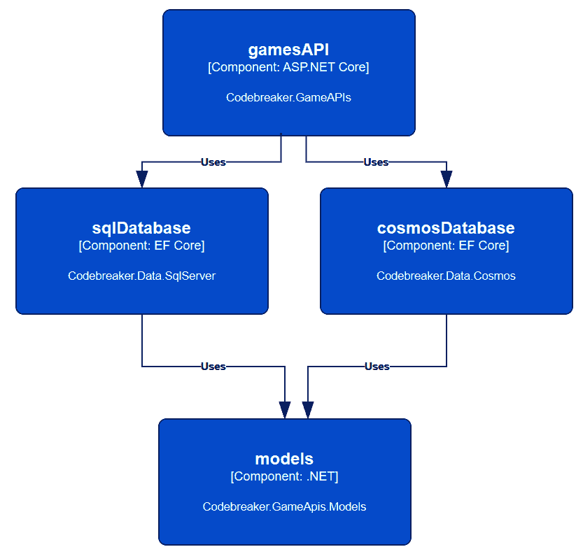
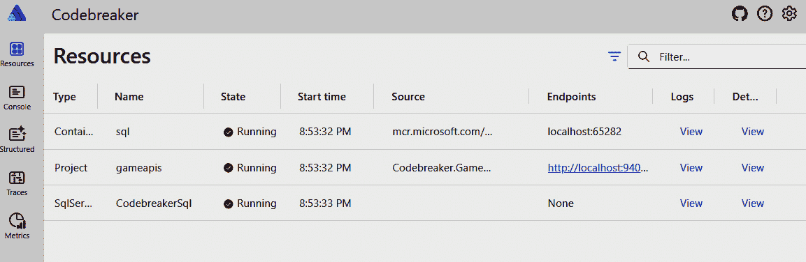
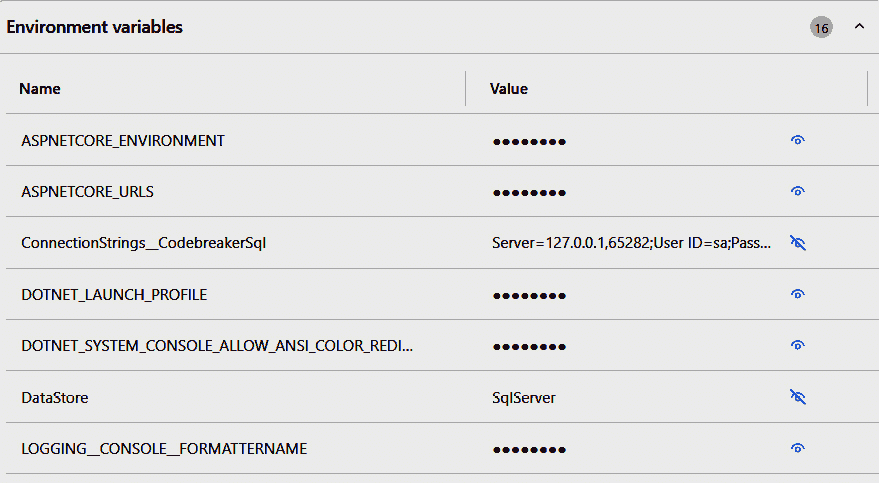

# 将数据写入关系型和非关系型数据库

在使用最小 API 创建服务的第一个实现之后，我们将在此基础上进行读取和写入数据库的操作。在本章中，我们将用**Entity Framework Core**（**EF Core**）替换内存中的存储库，以访问关系型数据库——Microsoft SQL Server——以及使用 EF Core 的 Azure Cosmos DB NoSQL 数据库。

你将创建两个库来访问这些数据库，创建 EF Core 上下文类，指定从模型类到数据库的映射，并配置最小 API 服务以使用其中一个数据库。在添加这些更改后，游戏将被持久化，当服务重启时可以继续游戏运行。

在本章中，你将探索以下主题：

+   探索要存储在数据库中的数据模型

+   创建和配置 EF Core 上下文以访问 Microsoft SQL Server

+   创建迁移以更新数据库架构

+   创建和配置 EF Core 上下文以访问 Azure Cosmos DB

# 技术要求

本章的代码可以在以下 GitHub 仓库中找到：[`github.com/PacktPublishing/Pragmatic-Microservices-with-CSharp-and-Azure`](https://github.com/PacktPublishing/Pragmatic-Microservices-with-CSharp-and-Azure)。

`ch03`源代码文件夹包含本章的代码示例。本章最重要的项目如下：

+   `Codebreaker.Data.SqlServer` – 这是用于访问 Microsoft SQL Server 的新库。

+   `Codebreaker.Data.Cosmos` – 这是用于访问 Azure Cosmos DB 的新库。

+   `Codebreaker.GamesAPIs` – 这是上一章创建的 Web API 项目。在本章中，**依赖注入**（**DI**）容器已更新，以使用.NET Aspire 组件来使用 SQL Server 和 Azure Cosmos DB。

+   `Codebreaker.GameAPIs.Models` – 本章节中该项目仅进行了最小更改，为`Game`类添加了一个属性。

+   `Codebreaker.AppHost` – 该项目已更新，包含 SQL Server 和 Azure Cosmos DB 资源以及转发配置值。

+   `Codebreaker.ServiceDefaults` – 该项目与上一章保持不变。

上一章中的`analyzer`库在本章中未包含。在这里，我们仅使用`CNinnovation.Codebreaker.Analyzers` NuGet 包。

如果你已经完成了上一章的内容，创建了模型并实现了最小 API 项目，你可以从那里继续。如果你没有完成上一章的工作，也可以从`ch02`文件夹中的文件开始。`ch03`包含了本章的所有更新。

除了开发环境之外，您还需要 Microsoft SQL Server 和 Azure Cosmos DB。目前您不需要 Azure 订阅。SQL Server 会与 Visual Studio 一起安装。您也可以下载 SQL Server 2022 开发者版。这可以通过 `winget` 实现很简单（但您也可以下载并安装 Windows 安装程序包）：

```cs
winget install Microsoft.SQLServer.2022.Developer
```

如果您使用的是 Mac，您可以使用 SQL Server 的 Docker 镜像。在 *第五章* 中，您可以阅读有关 Docker 和在 Docker 容器中运行 SQL Server 的更多详细信息。

为了方便使用 SQL Server 和 Azure Cosmos DB，本章使用了 Docker 镜像。您也可以使用与 Visual Studio 一起安装的 SQL Server，以及 Azure Cosmos DB 模拟器。

要运行 Azure Cosmos DB，有一个本地运行的模拟器可用。您可以使用以下命令安装此 NoSQL 数据库模拟器：

```cs
winget install Microsoft.Azure.CosmosEmulator
```

注意

Azure Cosmos 模拟器仅在 Windows 上可用。在 Linux 环境中（以及 Windows 和 Mac 上），您可以使用 Docker 镜像来运行模拟器。有关运行模拟器的信息，请参阅 [`learn.microsoft.com/en-us/azure/cosmos-db/how-to-develop-emulator`](https://learn.microsoft.com/en-us/azure/cosmos-db/how-to-develop-emulator)。有关 Docker 的更多信息，请参阅 *第五章*。

要读取和写入您的 SQL Server 数据，在 Visual Studio 中，您可以使用 SQL Server 对象资源管理器。在 Visual Studio 之外，并且具有更多功能，请使用 **SQL Server Management Studio**（**SSMS**），可以使用以下命令安装：

```cs
winget install Microsoft.SQLServerManagementStudio
```

本章的项目及其相互关系在 *图 3.1* 中以 C4 组件图展示。`gamesAPI` 和 `models` 组件是在 *第二章* 中创建的。在本章中，将添加两个用于访问 SQL Server 和 Azure Cosmos DB 数据库的项目（`sqlDatabase` 和 `cosmosDatabase`）。根据配置，游戏 API 将使用内存中的存储库（在 *第二章* 中创建）或 `IGamesRepository` 的其他实现之一：



图 3.1 – 项目

让我们在对模型进行小修改的同时，开始探索包含这些模型的工程。

# 探索数据库映射的模型

在创建服务时，可以使用不同的模型来处理数据库、功能和 API。数据库层可能与其他层有不同的要求。当创建单体应用程序时，通常是这样的，但这也意味着在维护应用程序和添加字段时，所有不同的层都需要被触及并更新。当创建具有较小范围的微服务时，有很大可能可以使用与数据库、应用程序的功能和 API 相同的模型。这不仅降低了维护成本，还提高了性能，因为不是每个层都会创建新的实例并在周围复制值。

在示例应用程序中，`Game` 和 `Move` 类型及其在前一章中创建的泛型对应类型并不简单，但它们可以直接与 EF Core 一起使用。

让我们看看模型以及数据库需要映射的内容，从 `Game` 类型开始：

Codebreaker.GameAPIs.Models/Game.cs

```cs
public class Game(
  Guid id,
  string gameType,
  string playerName,
  DateTime startTime,
  int numberCodes,
  int maxMoves)
{
  public Guid Id { get; private set; } = id;
  public string GameType { get; private set; } = gameType;
  public string PlayerName { get; private set; } = playerName;
  public DateTime StartTime { get; private set; } = startTime;
  // code removed for brevity
public required IDictionary<string, IEnumerable<string>> FieldValues 
    { get; init; }
  public required string[] Codes { get; init; }
  public ICollection<Move> Moves { get; } = new List<Move>();
  public override string ToString() => $"{Id}:{GameType} - 
{StartTime}";
}
```

`Game` 类包含 `Guid`、`string`、`DateTime`、`TimeSpan`、`int` 和 `bool` 类型的属性。所有这些属性都可以轻松映射到数据库列。只需配置字符串的大小即可。对于 SQL Server，映射字符串的约定是 `nvarchar(max)`。这可以减小大小。更有趣的是构造函数。

该类没有定义无参构造函数。虽然一些工具需要无参构造函数，但现在的 JSON 序列化和 EF Core 都不需要。EF Core 支持具有参数的构造函数，只要构造函数映射到简单属性即可——`Game` 类就是这样。EF Core 映射支持具有 `get` 和 `set` 访问器的属性。如果只有一个 `get` 访问器可用，映射将失败。一种解决方案是使用 `private` 字段。EF Core 支持显式映射到字段。另一个选项是使用私有的 `set` 访问器——这在 `Game` 类中被使用。

`Game` 类还有一些其他有趣的成员：`FieldValues` 属性的类型为 `IDictionary<string, IEnumerable<string>>`。字段值定义了用户可以选择的可能选项。通常，同一游戏类型的所有游戏都具有相同的字段值，但这些都可能随时间而变化。我们不应该期望这些值始终保持不变。应用程序可能会随着时间的推移更改可选择的颜色或形状。因此，我们不能简单地忽略要存储的属性——这个属性应该与游戏一起存储。至于这种类型，没有默认的映射可用，因此我们需要添加一个转换。

`Codes` 属性是字符串数组类型。EF Core 8.0 支持内置映射原始类型集合；也就是说，数组、整数、字符串等的列表。使用内置功能，集合以 JSON 格式存储在字符串表中。这符合目的。`Codes` 属性包含一个解决方案的列表。对于基于颜色的游戏类型，这是一个最多包含五种颜色的列表；对于形状游戏类型，集合中的一个字符串由形状和颜色以及分隔符组成。使用低于 EF Core 8 的版本，则需要自定义转换。使用 EF Core 8，这将使用默认功能进行映射。

`Moves` 属性通常与关系型数据库相关联。使用 SQL Server，我们将使用 `Moves` 表来存储每个移动。如果需要，可以使用 JSON 列存储移动，但我们将使用单独的表和查询来存储移动。使用 NoSQL 数据库，在游戏中存储移动是一种自然的方式。

让我们来看看 `Move` 类型：

Codebreaker.GameAPIs.Models/Move.cs

```cs
public class Move(Guid id, int moveNumber)
{
  public Guid Id { get; private set; } = id;
  public int MoveNumber { get; private set; } = moveNumber;
  public required string[] GuessPegs { get; init; }
  public required string[] KeyPegs { get; init; }
  public override string ToString() => $"{MoveNumber}. " +
    $"{string.Join('#',GuessPegs)} : " +
    $"{string.Join('#', KeyPegs)}";
}
```

对于 `Move` 类，`GuessPegs`（玩家对移动的猜测）和 `KeyPegs`（分析器的结果）可以像 `Game` 类型的 `Codes` 属性一样进行序列化。更有趣的是这里没有的东西。也就是说，没有像 `GameId` 这样的外键属性或直接建立 `Move` 和 `Game` 类型之间关系的 `Game` 属性。到目前为止，在使用 `Move` 类型时，这种关系不是必需的。在 EF Core 中，也不需要在模型中添加这种关系。EF Core 支持一个名为 **影子属性** 的功能。这些属性不是模型的一部分，但存储在数据库中，并且在使用 EF Core 上下文时可以访问。

让我们总结一下使用 EF Core 映射 `Game` 和 `Move` 类型所需完成的任务：

1.  对于简单的字符串属性，需要使用 SQL Server 定义数据库字符串的大小。

1.  `FieldValues` 属性的类型为 `IDictionary<string, IEnumerable<string>>` 需要一个 **值转换器**。

1.  `Moves` 属性将集合映射到 `Move` 类型。在关系型数据库中，`Move` 对象应该存储在单独的 `Moves` 表中。因为 `Move` 类型没有定义主键，所以需要 **影子属性**。

1.  使用 Azure Cosmos DB，移动应该存储在游戏 JSON 文档中。

注意

EF Core 支持通过约定、注解和流畅 API 进行映射。约定是提供程序特定的。例如，.NET 字符串映射到 `nvarchar(max)` 是一个约定。使用可空性，不可空属性映射到必需的数据库列，而可空属性不是必需的。约定可以通过注解覆盖。注解是如 `[StringLength(20)]` 这样的属性，它不仅可以用于验证用户输入，还可以指定列应为 `nvarchar(20)`。使用流畅 API，可以覆盖注解。流畅 API 提供了大多数选项，并覆盖了所有其他设置。我们将在下一节中使用流畅 API。

让我们定义一个映射来处理这些模型，无论是关系数据库还是 NoSQL。

# 使用 EF Core 与 SQL Server

让我们从关系数据库开始，在多个表中存储游戏和移动。我们需要做以下事情：

1.  创建类库项目

1.  创建 EF Core 上下文

1.  自定义简单属性的映射

1.  创建用于映射复杂属性的值转换

1.  定义游戏和移动之间的关系

1.  为 `Move` 类型创建阴影属性

1.  实现存储库合约

1.  使用 SQL Server 配置应用程序模型

1.  使用最小 API 项目配置 DI 容器

## 使用 SQL Server 创建数据类库

要创建类库项目，您可以使用如下所示的 .NET CLI 或使用 Visual Studio 中的类库项目模板：

```cs
dotnet new classlib --framework net8.0 -o Codebreaker.Data.SqlServer
```

要使用 EF Core 访问 SQL Server，请添加 `Microsoft.EntityFrameworkCore.SqlServer` NuGet 包。此项目还依赖于 `Codebreaker.GameAPIs.Models` 项目。

## 为 SQL Server 创建 EF Core 上下文

如下代码片段所示，使用实现 `GamesSqlServerContext` 类的 EF Core 上下文指定数据库映射：

Codebreaker.Data.SqlServer/GamesSqlServerContext.cs

```cs
public class GamesSqlServerContext(DbContextOptions<GamesSqlServerContext> options) : DbContext(options), IGamesRepository
{
  protected override void OnModelCreating(ModelBuilder modelBuilder)
  {
    modelBuilder.HasDefaultSchema("codebreaker");
    modelBuilder.ApplyConfiguration(new GameConfiguration());
    modelBuilder.ApplyConfiguration(new MoveConfiguration());
    // code removed for brevity
  }
  public DbSet<Game> Games => Set<Game>();
  public DbSet<Move> Moves => Set<Move>();
  // code removed for brevity
}
```

EF Core 上下文类需要从 `DbContext` 基类派生。使用来自 DI 容器的上下文，可以在上下文外部配置连接字符串。这需要使用带有 `DbContextOption` 参数的构造函数，该参数需要传递给基类。

`GamesSqlServerContext` 类实现了我们在 *第二章* 中定义的 `IGamesRepository` 接口，以便 `GamesService` 类使用。在 *第二章* 中，我们使用 `GamesMemoryRepository` 内存存储库类实现了此接口。EF Core 上下文类通过实现相同的接口支持存储库模式。这样，我们可以通过使用 `GamesSqlServerContext` 来轻松切换内存存储库。

覆盖的 `OnModelCreating` 方法允许自定义将模型类型映射到数据库。对于 SQL Server，默认架构名称是 `dbo`。这可以通过调用 `modelBuilder.HasDefaultSchema` 来更改。

为了减少`OnModelCreating`方法的复杂性，创建了`GameConfiguration`和`MoveConfiguration`类来使用`Game`和`Move`类型进行自定义映射。

对于上下文类还需要的一件事是，允许使用属性来访问映射的数据库表，对于类型为`DbSet<TEntity>`的属性。

备注

创建`codebreaker`解决方案经历了几个迭代。一次，使用了一个抽象基类和泛型派生类来支持所有不同的游戏类型。使用 EF Core，也可以映射继承，这同样适用于 JSON 序列化和 OpenAPI 定义。EF Core 可以将继承树映射到单个表（**table-per-hierarchy**或**TpH**），每个类型一个表（**table-per-type**或**TpT**），以及每个具体类型一个表（**table-per-concrete-type**或**TpC**）。

为了规划可能永远不会需要的未来功能，而不是创建一个复杂的类层次结构，通常最好将模型类型保持得尽可能简单，这取决于当前版本所需的内容。复杂的模型设计会在多个地方增加复杂性。

现在定义的`Game`类作为数据持有者满足了一组不同的`Game`类型的要求。功能被抽象化，并通过`analyzers`库执行，该库仅使用合约来访问游戏。

由于微服务被用于较小的范围内，**KISS**原则（**Keep It Simple, Stupid**）不仅能帮助减少需要完成的工作，还能提高性能。

## 自定义简单属性的映射

使用`ApplyConfiguration`与上下文配置应用时，需要实现`IEntityTypeConfiguration`泛型接口的配置类来指定`Game`类的映射。

Codebreaker.Data.SqlServer/Configuration/GameConfiguration.cs

```cs
internal class GameConfiguration : IEntityTypeConfiguration<Game>
{
  public void Configure(EntityTypeBuilder<Game> builder)
  {
    builder.HasKey(g => g.Id);
    builder.Property(g => g.GameType).HasMaxLength(20);
    builder.Property(g => g.PlayerName).HasMaxLength(60);
    builder.Property(g => g.Codes).HasMaxLength(120);
    // code removed for brevity
```

通过实现此类，表的关键字被指定为映射到`Id`属性。这并不是必需的，因为约定规定，名为`Id`或以类名前缀 ID 的属性映射到主键。

流畅的 API `HasMaxLength`属性用于更改`GameType`和`PlayerName`属性的数据库类型。`Codes`属性不是一个简单的属性，但仍可以限制为 120 个字符的大小。

此配置应用于`Games`表是通过从上下文配置中调用`ApplyConfiguration`来实现的。

`MoveConfiguration`类为`GuessPegs`和`KeyPegs`属性指定了类似的配置：

Codebreaker.Data.SqlServer/Configuration/MoveConfiguration.cs

```cs
internal class MoveConfiguration : IentityTypeConfiguration<Move>
{
  public void Configure(EntityTypeBuilder<Move> builder)
  {
    // code removed for brevity
    builder.Property(g => g.GuessPegs).HasMaxLength(120);
    builder.Property(g => g.KeyPegs).HasMaxLength(60);
  }
}
```

对于`Move`类型，阴影属性将在*定义游戏和移动之间的关系*部分中稍后指定。

## 创建值转换以映射复杂属性

为了允许映射 EF Core 不支持的数据类型，可以使用值转换。类型`IDictionary<string, IEnumerable<string>>`的`FieldValues`属性不直接支持默认映射。在这个游戏中，这个值的实际内容并不大，也不需要在其中搜索。这使得我们可以将其映射到`nvarchar`类型的列。

实现有多种选项可用。我们将使用不同的选项与 SQL Server 和 Azure Cosmos DB 一起使用，但这两个选项都可以与这些提供者中的任何一个一起使用。

让我们看看数据看起来像什么的一个例子。让我们想象我们有一个如下所示的包含颜色和形状的字典：

```cs
Dictionary<string, IEnumerable<string>> input = new ()
{
  { "colors", ["Red", "Green", "Blue"] },
  { "shapes", ["Rectangle", "Circle"] }
};
```

这应该产生以下字符串：

```cs
var expected = "colors:Red#colors:Green#colors:Blue#shapes:Rectangle#shapes:Circle";
```

每个值都以前缀键开头。在源代码库中，你可以找到一个单元测试来检查这个转换的实现。

要将这个字典转换为字符串，实现了`ToFieldsString`扩展方法：

Codebreaker.Data.SqlServer/MappingExtensions.cs

```cs
public static class MappingExtensions
{
  public static string ToFieldsString(this IDictionary<string, 
IEnumerable<string>> fields)
  {
    return string.Join('#',
      fields.SelectMany(
        key => key.Value
          .Select(value => $"{key.Key}:{value}")));
  }
  // code removed for brevity
}
```

在实现中，使用 LINQ 的`SelectMany`方法，对于字典中的每个键，都会创建一个以键为前缀的值。

反向功能使用`FromFieldsString`方法将字符串转换为字典：

Codebreaker.Data.SqlServer/MappingExtensions.cs

```cs
public static IDictionary<string, IEnumerable<string>> 
FromFieldsString(this string fieldsString)
{
  Dictionary<string, List<string>> fields = new();
  foreach (var pair in fieldsString.Split('#'))
  {
    var index = pair.IndexOf(':');
    if (index < 0)
    {
      throw new ArgumentException($"Field {pair} does not contain ':' 
      delimiter.");
    }
    var key = pair[..index];
    var value = pair[(index + 1)..];
    if (!fields.TryGetValue(key, out List<string>? List))
    {
      list = [];
      fields[key] = list;
    }
    list.Add(value);
  }
  return fields.ToDictionary(
    pair => pair.Key,
    pair => (IEnumerable<string>)pair.Value);
}
```

在实现中，首先使用`#`分隔符将完整的字符串分割。每个结果字符串包含一个键和一个用`:`分隔的值。这些结果被添加到一个对中，最终返回一个字典。

这些方法现在用于`Game`类的配置：

Codebreaker.Data.SqlServer/Configuration/GameConfiguration.cs

```cs
public void Configure(EntityTypeBuilder<Game> builder)
{
  // code removed for brevity
  builder.Property(g => g.FieldValues)
    .HasColumnName("Fields")
    .HasColumnType("nvarchar")
    .HasMaxLength(200)
    .HasConversion(
      convertToProviderExpression: fields => fields.ToFieldsString(),
      convertFromProviderExpression: fields => fields.
        FromFieldsString(),
valueComparer: new ValueComparer<IDictionary<string, 
        Ienumerable<string>>>(
        equalsExpression: (a, b) => a!.SequenceEqual(b!),
hashCodeExpression: a => a.Aggregate(0, (result, next) => 
          HashCode.Combine(result, next.GetHashCode())),
snapshotExpression: a => a.ToDictionary(kv => kv.Key, kv => 
        kv.Value)));
}
```

使用 fluent API 的`HasColumnName`、`HasColumnType`和`HasMaxLength`属性指定列名和数据类型。使用`HasConversion`方法将映射的类型转换为数据库表示。此方法有几个重载，用于不同的用例。在这里，第一个参数引用一个表达式，将.NET 属性类型转换为数据库类型，而第二个参数执行反向操作。在这里，我们调用了之前创建的扩展方法。第三个参数调用`ValueComparer`类的实例。这用于比较值的相等性。

## 定义游戏和移动之间的关系

在关系数据库中，`Games`表与`Moves`表有关联。一个游戏映射到一个移动列表。为了实现这一点，在`Moves`表中定义了一个名为`GameId`的外键，以引用`Games`表的主键：

Codebreaker.Data.SqlServer/Configuration/MoveConfiguration.cs

```cs
internal class MoveConfiguration : IEntityTypeConfiguration<Move>
{
  public void Configure(EntityTypeBuilder<Move> builder)
  {
    builder.Property<Guid>("GameId");
    builder.Property(g => g.GuessPegs).HasMaxLength(120);
    builder.Property(g => g.KeyPegs).HasMaxLength(60);
  }
}
```

使用`EntityTypeBuilder`为`Move`类型调用，调用`Property`方法创建一个没有这个名称属性的`Move`类型。如果没有相同名称的属性，则需要指定类型，就像这里使用泛型参数所做的那样。

以下代码片段将这个关系映射到数据库表中：

Codebreaker.Data.SqlServer/GameConfiguration.cs

```cs
public void Configure(EntityTypeBuilder<Game> builder)
{
  builder.HasKey(g => g.Id);
  builder.HasMany(g => g.Moves)
    .WithOne()
    .HasForeignKey("GameId");
  // code removed for brevity
}
```

EF Core 支持一对一、一对多和多对多关系。对于游戏和移动，使用 `HasMany` 和 `WithOne` 方法定义了一对多关系。`HasForeignKey` 方法指定 `Move` 类的 `GameId` 值以引用游戏记录的 ID。

在定义了类到表的映射后，让我们实现存储库的合约并添加迁移以创建数据库。

## 实现存储库合约

在上一章中，我们定义了 `IGamesRepository` 接口，并使用内存表示实现了它。现在，让我们实现这个接口以读取和写入 SQL Server 数据库。

### 添加和删除游戏

让我们将合约的 `AddGameAsync` 和 `DeleteGameAsync` 方法的实现添加到 `GamesSqlServerContext` 类中：

Codebreaker.Data.SqlServer/GameSqlServerContext.cs

```cs
public async Task AddGameAsync(Game game, CancellationToken cancellationToken = default)
{
  Games.Add(game);
await SaveChangesAsync(cancellationToken);
}
public async Task<bool> DeleteGameAsync(Guid id, CancellationToken 
cancellationToken = default)
{
  var affected = await Games
    .Where(g => g.Id == id)
    .ExecuteDeleteAsync(cancellationToken);
    return affected == 1;
}
```

使用 `AddGameAsync` 方法，传递的 `Game` 对象被添加到 EF Core 上下文的 `Games` 属性中，这标志着实体被更改跟踪器标记为 *已添加*。`SaveChangesAsync` 方法在数据库中创建 `INSERT` 语句。

`DeleteGameAsync` 方法接收游戏 ID 参数。在这里，对匹配 ID 的记录调用 `ExecuteDeleteAsync` 方法。自 EF Core 7 以来，`ExecuteDeleteAsync` 和 `ExecuteUpdateAsync` 方法不使用跟踪并直接执行 `DELETE` 和 `UPDATE` 语句。当不需要更改跟踪时，这提高了性能。如果未找到要删除的记录，此方法返回 `false`。

开始一个 6x4 游戏将创建以下 SQL 语句来存储游戏：

```cs
INSERT INTO [codebreaker].[Games] ([Id], [Codes], [Duration], [EndTime], [Fields], [GameType], [LastMoveNumber], [MaxMoves], [NumberCodes], [PlayerName], [StartTime], [Won])
      VALUES (@p0, @p1, @p2, @p3, @p4, @p5, @p6, @p7, @p8, @p9, @p10, @p11);
```

让我们使用下一个实现来设置一个移动。

### 更新游戏

当设置移动时，一些游戏信息，如最后移动编号，也会更新。添加移动和更新游戏的实现如下所示：

Codebreaker.Data.SqlServer/GameSqlServerContext.cs

```cs
public async Task AddMoveAsync(Game game, Move move, CancellationToken cancellationToken = default)
{
  Moves.Add(move);
  Games.Update(game);
  await SaveChangesAsync(cancellationToken);
}
```

使用 `Add` 方法将 `Move` 对象添加到上下文中，并使用 `Update` 方法添加 `Game` 对象。这样，通过调用 `SaveChangesAsync` 方法配置了更改跟踪器，从而创建 SQL 的 `UPDATE` 和 `INSERT` 语句。

注意

默认情况下，一次 `SaveChangesAsync` 调用创建一个事务。如果更新游戏失败，则对移动进行回滚。如果您需要在单个事务中执行多个 `SaveChangesAsync` 实例，最简单的选项是使用环境事务（使用 `System.Transactions` 命名空间中的 `TransactionScope` 类）。

### 查询游戏

要检索游戏，我们需要实现 `Getxx` 方法。让我们从 `GetGameAsync` 开始，通过游戏 ID 获取游戏：

Codebreaker.Data.SqlServer/GamesSqlServerContext.cs

```cs
public async Task<Game?> GetGameAsync(Guid id, CancellationToken cancellationToken = default)
{
  var game = await Games
    .Include("Moves")
    .TagWith(nameof(GetGameAsync))
    .SingleOrDefaultAsync(g => g.Id == id, cancellationToken);
  return game;
}
```

`GetGameAsync`方法使用`SingleOrDefaultAsync`方法获取一个或零条记录。如果找不到游戏 ID，则返回`null`。在幕后，创建了一个使用`SELECT TOP(2)`的查询来检查此查询是否将返回多条记录。如果是这种情况，`SingleOrDefaultAsync`方法会抛出异常。

使用`Include`方法创建一个查询，该查询包含与返回查询相关的移动。在这里，使用 SQL 的`LEFT JOIN`语句来连接多个表。EF Core 将所有查询和更新写入日志输出。为了更好地查看哪些输出映射到哪些 LINQ 方法，可以使用`TagWith`方法。这个标签在日志输出中显示为一个标题。

注意

`TagWith`方法在调试和故障排除中非常有帮助。通过检查日志输出以查看发送的 SQL 查询，标签提供了一个快速查看此查询生成位置的方法。

以下代码片段显示了此查询的日志输出，包括标题：

```cs
-- GetGameAsync
SELECT [t].[ Id], [t].[Codes], [t].[Duration], [t].[EndTime], [t].[Fields], [t].[GameType], [t].[LastMoveNumber], [t].[MaxMoves], [t].[NumberCodes], [t].[PlayerName], [t].[StartTime], [t].[Won], [m].[Id], [m].[GameId], [m].[GuessPegs], [m].[KeyPegs], [m].[MoveNumber]
FROM (
  SELECT TOP(2) [g].[Id], [g].[Codes], [g].[Duration], [g].[EndTime], [g].[Fields], [g].[GameType], [g].[LastMoveNumber], [g].[MaxMoves], [g].[NumberCodes], [g].[PlayerName], [g].[StartTime], [g].[Won]
  FROM [codebreaker].[Games] AS [g]
  WHERE [g].[Id] = @__Id_0
) AS [t]
LEFT JOIN [codebreaker].[Moves] AS [m] ON [t].[Id] = [m].[GameId]
ORDER BY [t].[Id]
```

要按日期、玩家名称或其他查询选项进行查询，请将`GamesQuery`对象传递给`GetGamesAsync`方法：

Codebreaker.Data.SqlServer/GamesSqlServerContext.cs

```cs
public async Task<IEnumerable<Game>> GetGamesAsync(GamesQuery? gamesQuery, CancellationToken cancellationToken = default)
{
  IQueryable<Game> query = Games
    .TagWith(nameof(GetGamesAsync))
    .Include(g => g.Moves);
  if (gamesQuery.Date.HasValue)
  {
    DateTime begin = gamesQuery.Date.Value.ToDateTime(TimeOnly.
        MinValue);
    DateTime end = begin.AddDays(1);
query = query.Where(g => g.StartTime < end && g.StartTime > 
      begin);
  }
  if (gamesQuery.PlayerName != null)
    query = query.Where(g => g.PlayerName == gamesQuery.PlayerName);
  if (gamesQuery.GameType != null)
    query = query.Where(g => g.GameType == gamesQuery.GameType);
  if (gamesQuery.Ended)
  {
    query = query.Where(g => g.EndTime != null)
      .OrderBy(g => g.Duration);
  }
  else
  {
    query = query.OrderByDescending(g => g.StartTime);
  }
  query = query.Take(MaxGamesReturned);
  return await query.ToListAsync(cancellationToken);
}
```

此方法的实现使用`IQueryable`变量添加不同的 LINQ 查询方法。根据`GamesQuery`参数传递的值，除了`OrderBy`或`OrderByDescending`外，还会添加多个`Where`方法来定义结果的顺序。为了不返回所有玩过的游戏，只返回基于筛选器的第一个 500 个游戏。

通过传递玩家的名称和日期调用此方法会产生以下 SQL 查询：

```cs
SELECT [t].[Id], [t].[Codes], [t].[Duration], [t].[EndTime], [t].[Fields], [t].[GameType], [t].[IsVictory], [t].[LastMoveNumber], [t].[MaxMoves], [t].[NumberCodes], [t].[PlayerIsAuthenticated], [t].[PlayerName], [t].[StartTime], [m].[Id], [m].[GameId], [m].[GuessPegs], [m].[KeyPegs], [m].[MoveNumber]
FROM (
  SELECT TOP(@__p_3) [g].[Id], [g].[Codes], [g].[Duration], [g].[EndTime], [g].[Fields], [g].[GameType], [g].[IsVictory], [g].[LastMoveNumber], [g].[MaxMoves], [g].[NumberCodes], [g].[PlayerIsAuthenticated], [g].[PlayerName], [g].[StartTime]
  FROM [codebreaker].[Games] AS [g]
  WHERE [g].[StartTime] < @__end_0 AND [g].[StartTime] > @__begin_1 AND [g].[GameType] = @__gamesQuery_GameType_2
  ORDER BY [g].[StartTime] DESC
) AS [t]
LEFT JOIN [codebreaker].[Moves] AS [m] ON [t].[Id] = [m].[GameId]
ORDER BY [t].[StartTime] DESC, [t].[Id]
```

`Include`方法导致执行`LEFT JOIN`操作以访问`Moves`表。由于`Take`方法，使用`SELECT TOP`。多次调用 LINQ 的`Where`方法会导致`WHERE`子句。

## 配置用户密钥

要访问数据库，我们需要检索一些配置值。其中一些配置值是秘密，不应包含在源代码存储库中。在开发期间，您可以使用用户密钥。用户密钥与用户配置文件一起存储。

要初始化用户密钥，请使用以下.NET CLI 命令：

```cs
cd Codebreaker.AppHost
dotnet user-secrets init
```

这将在项目文件中创建一个`UserSecretsId`属性。因为所有用户密钥都存储在用户配置文件中，所以这个字符串用于区分多个应用程序的配置。

要使用密钥设置配置值，请使用`dotnet user-secrets` `set`命令：

```cs
dotnet user-secrets set Parameters:sql-password [enter the password]
```

使用我们使用的 SQL Server Docker 容器，对密码有一些要求。请注意，您不能使用简单的密码。需要匹配三到四个集合：大写字母、小写字母、十进制数字和符号。您可以通过检查日志输出来查看是否存在密码问题。

您还可以使用 Visual Studio 和一个带有 Visual Studio 的上下文菜单来配置用户密钥。

注意，默认情况下，从用户密钥中读取配置值的提供程序仅在使用配置的密钥 ID 且应用程序在`Development`环境中运行时使用。

注意

用户密钥在生产环境中不能使用。用户密钥的想法是不将密钥存储在推送到源代码仓库的配置文件中。每个在此项目上工作的开发者都需要配置密钥的配置值。在生产环境中，可以使用其他服务，如 Azure Key Vault。这将在*第七章*中介绍。

## 使用 SQL Server 配置应用程序模型

要运行 SQL Server，.NET Aspire 使得运行 Docker 容器变得简单。只需将以下代码添加到`Codebreaker.AppHost`项目中的应用程序模型中：

Codebreaker.AppHost/Program.cs

```cs
var builder = DistributedApplication.CreateBuilder(args);
var sqlServer = builder.AddSqlServer("sql", sqlPassword)
  .AddDatabase("CodebreakerSql", "codebreaker");
```

`AddSqlServer`方法添加一个 SQL Server 资源。使用此方法，在开发时间，使用 Docker 容器。在*第五章*中，我们将深入了解 Docker，并使用此 SQL Server Docker 容器添加更多配置。此资源的名称为 sql。可选地，可以将密码传递给`AddSqlServer`方法。如果使用资源名称后缀为`-password`（如我们所做）的配置参数值设置，则使用此`password`。否则，将生成一个随机的`password`。`AddDatabase`方法使用第一个参数（资源名称）将数据库添加到资源中，该资源名称用作连接字符串名称，以及数据库名称。

为了让我们能够动态地在不同的游戏存储库之间进行选择，我们使用`DataStore`配置在应用程序启动时决定使用内存、SQL Server 还是 Azure Cosmos DB：

Codebreaker.AppHost/appsettings.json

```cs
{
  "Logging": {
    "LogLevel": {
      "Default": "Information",
      "Microsoft.AspNetCore": "Warning",
      "Aspire.Hosting.Dcp": "Warning"
    }
  },
  "DataStore": "SqlServer"
}
```

根据您想要使用的数据库提供程序，根据需要更改值。

注意

*第七章*，*灵活配置*，深入探讨了`appsettings.json`文件及其环境特定对应项的细节，以及存储配置值的其他选项，例如环境变量、程序参数和 Azure App Configuration 实例。在本章中，我们只需要配置`appsettings.json`中的设置以及受 Azure Cosmos DB 保护的用户密钥。

配置值是在`AppHost`项目的启动时检索的：

Codebreaker.AppHost/Program.cs

```cs
string dataStore = builder.Configuration["DataStore"] ??
  "InMemory";
```

如果值未配置，则默认使用我们在上一章中创建的内存提供程序。

现在，我们可以更改游戏 API 的依赖项：

Codebreaker.AppHost/Program.cs

```cs
builder.AddProject<Projects.Codebreaker_GameAPIs>("gameapis")
  .WithEnvironment("DataStore", dataStore)
  .WithReference(sqlServer);
// code removed for brevity
```

`WithEnvironment`方法为游戏 API 项目创建一个环境变量，该变量具有`DataStore`键和从配置中检索的值。`WithReference`方法引用 SQL Server 资源并创建一个用于连接字符串的环境变量。

接下来，让我们配置最小 API 项目以从`AppHost`项目检索配置值。

## 使用最小 API 项目配置 DI 容器

在模型映射到数据库完成，并且使用 Aspire `AppHost` 项目定义了资源依赖项之后，可以配置 DI 容器以使用 EF Core 上下文。

游戏 API 项目需要引用`Codebreaker.Data.SqlServer`项目和`Aspire.Microsoft.EntityFrameworkCore.SqlServer` NuGet 包。

使用以下代码片段检索`DataStore`的配置：

Codebreaker.GameAPIs/ApplicationServices.cs

```cs
public static void AddApplicationServices(this IHostApplicationBuilder builder)
{
  // code removed for brevity
  string? dataStore = builder.Configuration.
    GetValue<string>("DataStore");
  switch (dataStore)
  {
    case "SqlServer":
      ConfigureSqlServer(builder);
      break;
    default:
      ConfigureInMemory(builder);
      break;
  }
  builder.Services.AddScoped<IGamesService, GamesService>();
}
```

根据检索到的`DataStore`配置值，我们配置 Azure Cosmos DB、SQL Server 或我们在上一章中实现的内存存储库。

以下展示了从上一个`switch/case`语句中调用的 SQL Server 配置：

Codebreaker.GameAPIs/ApplicationServices.cs

```cs
static void ConfigureSqlServer(IHostApplicationBuilder builder)
{
  builder.AddDbContextObjectPool<IGamesRepository, GamesSqlServerContext>(options =>
  {
    var connectionString = builder.Configuration.
    GetConnectionString("CodebreakerSql") ?? throw new 
InvalidOperationException("Could not read SQL Server connection 
string");
    options.UseSqlServer(connectionString);
    options.UseQueryTrackingBehavior(
    QueryTrackingBehavior.NoTracking);
  }
  builder.EnrichSqlServerDbContext<GamesSqlServerContext>();
}
```

使用 .NET Aspire SqlServer EF Core 组件，我们可以调用`AddSqlServerDbContext` API 来配置 .NET Aspire 的 EF Core 上下文。然而，此 API 并未提供我们与不同数据库提供程序一起工作所需的灵活性级别。因此，我们改用 EF Core API，如`AddDbContext`和`AddDbContextPool`来配置 EF Core 上下文，并通过使用`EnrichSqlServerDbContext`添加 Aspire 功能。`AddDbContextObjectPool`方法配置为使用 SQL Server EF Core 提供程序，传递连接字符串，该连接字符串通过`AppHost`项目传递，因此需要与 AppHost 项目中的顶级语句配置名称相匹配。

调用`UseQueryTrackingBehavior`方法在使用 EF Core 时增加了一个有趣的方面。默认情况下，所有查询都在 EF Core 上下文中跟踪，以便上下文了解更改。在 API 服务中，上下文会随着每个新的 HTTP 请求而新建。因此，对于每个上下文保持此跟踪状态是不必要的。添加和更新实体时，会显式使用`Add`和`Update`方法。将查询跟踪行为设置为`QueryTrackingBehavior.NoTracking`将禁用所有查询的跟踪（除非使用`AsTracking`方法覆盖），从而减少了开销。

而不是默认关闭跟踪，您还可以使用`AsNoTracking`方法通过单个查询来关闭跟踪。

`EnrichSqlServerDbContext`方法添加了 Aspire 组件提供的健康检查、日志记录和遥测配置。日志记录和遥测配置在*第十一章*中介绍，健康检查在*第十二章*中介绍。

随着映射和存储库合约的实现，我们现在可以继续使用迁移创建数据库。

# 使用 EF Core 创建迁移

使用 EF Core，你可以使用 `Database.EnsureCreatedAsync` 上下文 API 方法创建数据库。然而，这并不考虑架构更改。随着时间的推移，数据库架构会因为新功能的添加而发生变化——最好是自动进行。

*第八章* 描述了如何自动将服务发布到测试和生产环境。因此，更新数据库也很重要。当数据库架构发生变化时，应该将更新发布到环境中。EF Core 提供了 **migrations** 来记录所有架构更改并程序化更新数据库架构。

接下来，让我们执行以下操作：

1.  添加 .NET EF Core 工具

1.  添加 EF Core 工具并创建初始迁移

1.  更新模型并添加迁移

1.  程序化更新数据库

## 添加 .NET EF Core 工具

如果你还没有安装 EF Core .NET 命令行工具，你可以使用 `dotnet` CLI 作为全局或本地工具来安装它。在这里，我们将它作为本地工具安装，以便在 `Codebreaker.Data.SqlServer` 项目中拥有这个工具的特定版本。

要安装本地工具，首先需要创建一个 `tool-manifest` 文件：

```cs
cd Codebreaker.Data.SqlServer
dotnet new tool-manifest
```

使用 `tool-manifest` 模板，`dotnet new` 命令会创建一个包含 `dotnet-tools.json` 文件的 `.config` 目录。这个清单文件将包含在项目工作中应该安装的所有工具。

一旦这个清单文件可用，我们就可以安装 `dotnet-ef` 工具：

```cs
dotnet tool install dotnet-ef
```

这个命令使用工具清单文件配置此工具并将其本地安装。如果你在项目文件夹内，而命令提示符的当前目录中安装了此工具的另一个版本，你将使用工具清单文件中指定的工具版本。

要使用工具清单文件安装和配置所有工具，可以使用 `tool` `restore` 命令：

```cs
dotnet tool restore
```

当你克隆包含工具清单文件的存储库时，可以使用 `restore` 命令。使用 `dotnet tool restore`，可以恢复项目中指定的所有工具。

让我们使用这个工具为实际上下文创建一个初始迁移：

```cs
dotnet ef migrations add InitGames -s ..\Codebreaker.GameAPIs
```

`migrations` 是 `dotnet ef` 工具的一个命令。使用 `add`，可以添加一个新的迁移，其名称跟随 `add` 命令（这里，`InitGames`）。`-s`（或 `--startup-project`）选项指定了配置了 DI 容器和数据库连接字符串的 EF Core 上下文的项目，这与实现 EF Core 上下文的项目不同（`Codebreaker.Data.Cosmos` 和 `Codebreaker.Data.SqlServer`）；这就是为什么需要这个选项。

注意

如果创建迁移失败，请检查错误信息。可能的一个错误是你未能指定映射，这里的错误信息非常详细。在处理问题时，你可以暂时忽略模型属性以查看错误是否真的基于属性映射。

在这个工具成功运行之后，你将看到与项目一起的 `Migrations` 文件夹。这个文件夹包含数据库当前状态的快照，包括所有表映射、属性映射和关系。这个类是根据 EF Core 上下文后缀名为 `ModelSnapshot` 命名的；例如，`GameSqlServerContextModelSnapshot`。

每次添加新的迁移时，快照将被更新，并创建一个新的 `Migration` 派生类，该类包含基于前一个迁移的所有模式更改。迁移名称以时间前缀命名。生成的类包含一个 `Up` 方法，当迁移应用到 SQL Server 数据库时将被调用，以及一个 `Down` 方法，当迁移从数据库中删除时将被调用。

接下来，我们将使用 `dotnet ef` 工具将迁移应用到数据库上，并在数据库尚不存在时创建数据库。这可以通过使用 `dotnet ef database update` 命令来完成：

```cs
dotnet ef database update -s ..\Codebreaker.GameAPIs.
```

现在这个命令现在使用启动项目的连接字符串来将迁移应用到数据库上。使用迁移创建数据库时，你会看到所有游戏和移动表被创建——包括 `_EFMigrationsHistory` 表。阅读这个表的内容，你会看到应用到数据库上的所有迁移名称。当使用迁移对数据库模式进行另一次更新时，会检查这些信息。

注意

有一些情况下，在创建数据库失败的同时，迁移创建却成功了。映射错误也可能是这里的原因。再次检查错误信息可以提供关于失败原因的详细信息。

## 程序化创建或更新数据库

代替使用命令行来应用迁移，可以通过调用 EF Core 上下文并使用 `context.Database.MigrateAsync` 来程序化地启动迁移。让我们通过 `CreateOrUpdateDatabaseAsync` 方法实现这个功能，该方法从应用程序启动代码中被调用，以便易于使用解决方案：

Codebreaker.GameAPIs/ApplicationServices.cs

```cs
public static async Task CreateOrUpdateDatabaseAsync(this WebApplication app)
{
  var dataStore = app.Configuration["DataStore"] ?? "InMemory";
  if (dataStore == "SqlServer")
  {
    try
    {
      using var scope = app.Services.CreateScope();
      var repo = scope.ServiceProvider.GetRequiredService<IGamesRepository>();
      if (repo is GamesSqlServerContext context)
      {
        await context.Database.MigrateAsync();
        app.Logger.LogInformation("SQL Server database updated");
      }
    }
    catch (Exception ex)
    {
      app.Logger.LogError(ex, "Error updating database");
      throw;
    }
  }
}
```

在实施过程中，我们检查解决方案是否配置为使用 SQL Server。在这种情况下，将调用 `MigrateAsync` 方法来更新数据库到最新版本。

使用 `codebreaker` 解决方案，这确实很方便 - 运行解决方案，一切就绪，包括数据库。从安全角度来看，在生产环境中运行的服务不应有一个允许更改模式的数据库连接字符串。相反，可以使用一个单独的程序来更新数据库。这可以通过 GitHub 动作自动部署来调用。使用 `dotnet ef` 工具，你甚至可以创建一个用于更新数据库模式的独立应用程序：`dotnet ef migrations bundle` 创建了一个包含 .NET 运行时的应用程序，因此你可以从没有安装 .NET 运行时的客户端启动此应用程序。你也可以创建一个 SQL 脚本来启动迁移，如果数据库管理员更喜欢这种方式：`dotnet ef migrations script`。

接下来，让我们对模型进行更改，这将影响数据库模式。

## 更新数据库模式

在 *第九章* 中，我们将区分匿名用户和认证用户。使用这种方式，当游戏由认证用户玩时，游戏信息将被存储。为此，我们将在 `Game` 类中添加一个 `PlayerIsAuthenticated` 标志：

Codebreaker.GameAPIs.Models/Game.cs

```cs
public class Game(
  Guid id,
  string gameType,
  string playerName,
  DateTime startTime,
  int numberCodes,
  int maxMoves) : IGame
{
  public Guid Id { get; private set; } = id;
  public string GameType { get; private set; } = gameType;
  public string PlayerName { get; private set; } = playerName;
  public bool PlayerIsAuthenticated { get; set; } = false;
  // code removed for brevity
```

这个新属性没有被定义为从数据库中忽略。为了更新数据库模式，我们添加一个新的迁移：

```cs
cd Codebreaker.Data.SqlServer
dotnet ef migrations add AddPlayerIsAuthenticated -s ..\Codebreaker.GameAPIs
```

新迁移命名为 `AddPlayerIsAuthenticated`。此更改更新了 `Migrations` 文件夹中的快照并添加了一个新的迁移，如以下代码片段所示：

Codebreaker.Data.SqlServer/Migrations/ 20231225095931_AddPlayerIsAuthenticated.cs

```cs
public partial class AddPlayerIsAuthenticated : Migration
{
protected override void Up(MigrationBuilder migrationBuilder)
  {
    migrationBuilder.AddColumn<bool>(
      name: "PlayerIsAuthenticated",
      schema: "codebreaker",
      table: "Games",
      type: "bit",
      nullable: false,
      defaultValue: false);
    }
  protected override void Down(MigrationBuilder migrationBuilder)
  {
    migrationBuilder.DropColumn(
      name: "PlayerIsAuthenticated",
      schema: "codebreaker",
      table: "Games");
  }
}
```

使用 `Up` 方法，从上一个版本更新数据库时，会将列添加到数据库模式中（`AddColumn`），而 `Down` 方法会移除该列（`DropColumn`）。

在开发过程中，你可能经常更新模式并创建许多迁移。在发布应用程序的新版本之前，将迁移合并为一个是一个好主意。请注意生产或预发布环境中安装的版本。你应该保留已部署的迁移。仅在你开发环境中使用过的迁移可以使用 `dotnet ef migrations remove`（可能多次调用以始终删除最后一个迁移）来移除 - 最后，通过一次调用 `dotnet ef migrations add <迁移名称>`，这将创建一个包含自上次迁移以来所有模式更改的迁移。

现在，让我们使用 SQL Server 运行解决方案。

## 使用 SQL Server 运行应用程序

现在启动主机应用程序，不仅游戏 API 服务正在运行，而且 SQL Server 在 Docker 容器中运行，如图 *图 3.2* 所示：



图 3.2 – 与 SQL Server 的 .NET Aspire 资源

你可以通过访问 OpenAPI 端点描述来开始游戏。请确保检查游戏 API 服务的详细信息。详细信息提供了关于资源、端点和环境变量的信息，如图 *3.3* 所示：



图 3.3 – 环境变量

为此服务设置环境变量后，检查 `DataStore` 和 `ConnectionStrings__CodebreakerSql`，这些由 `AppHost` 项目设置。

尝试使用 HTTP 文件玩游戏。验证记录如何添加到 SQL Server 数据库。然而，当你停止项目并再次运行应用程序时，数据库将从全新状态创建。使用 Docker，我们需要卷来映射 Docker 容器外的存储。这将在 *第五章* 中介绍。

然后，让我们转向 Azure Cosmos DB。

# 使用 EF Core 与 Azure Cosmos DB

使用 Azure Cosmos DB，Microsoft 提供了具有多个 API 的不同数据库，这些 API 都使用了相同的底层基础设施。这些数据库产品中的大多数都是针对不同目的的 NoSQL 数据库。Azure Cosmos DB 提供了一个可以与 MongoDB API 一起访问的 JSON 文档存储。Apache Cassandra API 提供了一个宽列存储，其中每一行可以有不同的列。可以使用 Apache Gremlin 查询语言来访问数据库的图版本。这对于使用顶点和边查询关系非常有用。Azure Cosmos DB for PostgreSQL 是一个使用相同基础设施进行全球数据库网络读写的高性能分布式关系数据库。

对于 `codebreaker` 解决方案，我们将使用 Azure Cosmos DB for NoSQL。在这里，有一个 EF Core 提供器可用。这允许我们使用与 SQL Server 相同的 API，但映射将不同。

将游戏和动作写入 Azure Cosmos DB，我们需要执行以下操作：

1.  创建一个类库项目

1.  创建 EF Core 上下文

1.  创建一个值转换器来映射复杂类型

1.  创建嵌入式实体

1.  实现存储库合约

1.  配置应用程序模型

1.  配置 DI 容器

我们在第一次应用迁移时创建了一个 SQL Server 数据库。使用 Azure Cosmos DB，迁移不可用且不需要。由于存储的是 JSON 文档，我们在写入数据方面非常灵活。没有表和表之间关系概念——我们只是在容器中存储 JSON 文档。一个容器可以保存不同类型的数据。容器可以用作扩展单元，但你也可以选择指定整个数据库的扩展，并与数据库中的不同容器共享 **请求单位**（**RU/s**）。

使用容器时，你还需要了解分区。分区用于扩展容器以提升性能。在指定分区之前，你需要了解一些 Azure Cosmos DB 的属性：

+   分区限制为 20 GB 存储空间。容器的大小限制为 1 TB。

+   在数据库中写入时，事务只能跨越写入单个分区。如果事务内需要写入不同的数据，这些数据应使用相同的分区键。

+   分区的最大限制为 10,000 RU/s。使用容器时，限制为 1,000,000 RU/s（在无服务器模式下，容器 RU/s 限制为 20,000）。为了实现数据并行读取的最佳性能，应使用不同的分区键。

+   分区键的最大长度为 2048 字节。

+   存储的单个项的最大大小为 2 MB。

+   分区键的不同值没有限制。

我们将使用游戏 ID 作为分区键。游戏是独立于其他游戏创建和更新的。没有必要在一个事务中写入多个游戏。使用具有多区域写入配置的 Azure Cosmos DB 可以让我们以高性能从不同的 Azure 区域创建游戏。这使得游戏的`Id`值成为分区键的好候选。

根据这些信息，我们将接下来创建一个类库。

## 为 EF Core 创建一个 NoSQL 类库项目

与创建 SQL Server 库类似，我们使用库来访问 Azure Cosmos DB：

```cs
dotnet new classlib --framework net8.0 -o Codebreaker.Data.Cosmos
```

该库使用了`Microsoft.EntityFrameworkCore.Cosmos` NuGet 包——当然，还需要引用`Codebreaker.GameAPIs.Models`项目。

## 为 Azure Cosmos DB 创建一个 EF Core 上下文

让我们创建一个上下文类来访问 Azure Cosmos DB，如下面的代码片段所示：

Codebreaker.Data.Cosmos/GamesCosmosContext.cs

```cs
public class GamesCosmosContext(DbContextOptions<GamesCosmosContext> optoins) : DbContext(options), IGamesRepository
{
  private const string PartitionKey = nameof(PartitionKey);
  private const string ContainerName = "GamesV3";
  private const string DiscriminatorValue = "GameV3";
  protected override void OnModelCreating(ModelBuilder modelBuilder)
  {
    modelBuilder.HasDefaultContainer(ContainerName);
    var gameModel = modelBuilder.Entity<Game>();
    gameModel.Property<string>(PartitionKey);
    gameModel.HasPartitionKey(PartitionKey);
    gameModel.HasKey(nameof(Game.Id), PartitionKey);
    gameModel.HasDiscriminator<string>("Discriminator")
      .HasValue<Game>(DiscriminatorValue);
    // code removed for brevity
  }
  public DbSet<Game> Games => Set<Game>();
public static string ComputePartitionKey(Game game) => 
    game.GameId.ToString();
  public void SetPartitionKey(Game game) =>
    Entry(game).Property(PartitionKey).CurrentValue =
      ComputePartitionKey(game);
  // code removed for brevity
```

与之前类似，自定义上下文类从`DbContext`基类派生，并定义了一个带有上下文选项的构造函数，这允许我们使用连接字符串配置 DI 容器。差异从现在开始。在 SQL Server 中，我们定义了默认模式名称。在 Azure Cosmos DB 中，这不可用，但我们可以使用`HasDefaultContainer`方法定义默认容器名称。如果你有不应与默认容器一起存储的实体，可以使用`ToContainer`方法配置它们使用不同的容器。之前讨论的分区键通过调用`HasPartitionKey`方法进行配置。使用`SetPartitionKey`和`ComputePartitionKey`方法，分区键被配置为与游戏 ID 相同的**影子属性**。

虽然`Id`是分区键的好选择，但可能存储在相同容器中的其他类型可能没有`Id`值。因此，对于分区键，使用`PartitionKey`。对于游戏，`Id`值将被映射到`PartitionKey`。

将不同类型的对象写入单个容器需要使用判别器值。默认情况下，判别器值是类的名称。通过调用 `HasDiscriminator` 方法，可以通过指定 `Discriminator` 隐藏属性来覆盖默认的判别器配置。对于 `Game` 类型，写入 `GameV3` 值。这使我们能够区分存储不兼容新版本的游戏对象。

Azure Cosmos DB 存储 JSON 文档，因此只需指定 `Game` 类型具有 `DbSet` 属性，而不是 `Move` 类型，就像我们在 SQL Server 中做的那样。定义字符串属性的最大大小也不需要，因为没有模式描述这一点。

## 创建一个转换复杂类型的值转换器

在 SQL Server 部分，我们将 `Idictionary` 类型的属性转换为字符串，通过传递表达式到 `HasConversion` 方法将字典转换为字符串。对于 Azure Cosmos DB 也可以这样做，但现在我们将创建一个从 `ValueConverter` 派生的类，并将字典转换为 JSON，如下代码片段所示：

Codebreaker.Data.Cosmos/Utilities/FieldValueValueConverter.cs

```cs
internal class FieldValueValueConverter : ValueConverter<IDictionary<string, IEnumerable<string>>, string>
{
  static string GetJson(IDictionary<string, IEnumerable<string>> 
values) => return JsonSerializer.Serialize(values);
  static IDictionary<string, IEnumerable<string>> GetDictionary(string 
json) => JsonSerializer.Deserialize<IDictionary<string, 
IEnumerable<string>>>(json) ??
      new Dictionary<string, IEnumerable<string>>();
  public FieldValueValueConverter() : base(
    convertToProviderExpression: v => GetJson(v),
    convertFromProviderExpression: v => GetDictionary(v))
  { }
}
```

EF Core 值转换器从 `ValueConverter` 基类派生，并使用泛型参数指定要转换的类型。使用 `FieldValues` 属性，这是 `IDictionary<string, IEnumerable<string>>`。基类的构造函数需要参数来转换到数据库数据类型和从数据库数据类型转换。在实现中，使用 `System.Text.Json` 命名空间中的 `JsonSerializer` 类来进行序列化和反序列化。

现在将此值转换器的实例传递给具有 `FieldValues` 属性配置的 `HasConversion` 方法的重载：

Codebreaker.Data.Cosmos/GamesCosmosContext.cs

```cs
public class GamesCosmosContext(DbContextOptions<GamesCosmosContext> options) : DbContext(options), IGamesRepository
{
  private static FieldValueValueConverter s_fieldValueConverter = new();
  private static FieldValueComparer s_fieldValueComparer = new();
  protected override void OnModelCreating(ModelBuilder modelBuilder)
  {
    // code removed for brevity
    gameModel.Property(g => g.FieldValues)
.HasConversion(s_fieldValueConverter, s_fieldValueComparer);
  }
```

与 `FieldValueValueConverter` 类似，创建了一个 `FieldValueComparer` 实例。创建了这两个类型的实例以传递给 `HasConversion` 方法。

在创建关系型数据库的映射时，需要配置的内容更多。我们通过为每个映射的表创建配置类来减少数据上下文中的代码。在这里这样做不值得。完整的 EF Core 配置以及仓库接口的实现都是通过上下文类完成的。

## 创建嵌入式实体

那么，游戏和移动之间的关系如何？EF Core 定义了 `OwnsOne` 和 `OwnsMany` 方法来定义一个拥有关系。在关系型数据库中，`OwnsOne` 将拥有类型的列添加到拥有类型中。在 Azure Cosmos DB 提供程序中，从 `gameModel` 调用 `OwnsMany` 并引用 `Moves` 属性，移动将被存储在游戏中的 JSON 内。

自从 EF Core 7 开始，这是与 Azure Cosmos DB 提供程序相关的实体类型的默认行为。因此，无需配置即可实现此功能。

## 实现仓库合约

在实现存储库时，与 SQL Server 的实现有许多相似之处，但由于存储方式不同，需要进行一些更改。在这里，我们将专注于差异：

Codebreaker.Data.Cosmos/GamesCosmosContext.cs

```cs
public async Task AddGameAsync(Game game, CancellationToken cancellationToken = default)
{
  SetPartitionKey(game);
  Games.Add(game);
  await SaveChangesAsync(cancellationToken);
}
```

在添加或更新游戏时，需要设置分区键。除此之外，代码与 SQL Server 相同。

在运行时发生的情况有所不同。而不是使用 SQL `INSERT` 和 `UPDATE` 语句，Azure Cosmos DB 提供程序执行 `CreateItem` 和 `ReplaceItem` 函数。当你检查日志输出时，你可以看到每个语句所需的 RUs 数量。

之前定义的 `GetGamesAsync` 方法也适用于 Cosmos DB 提供程序。这是创建的查询：

```cs
SELECT c
FROM root c
WHERE (((c["Discriminator"] = "Game") AND ((c["StartTime"] < @__end_0) AND (c["StartTime"] > @__begin_1))) AND (c["GameType"] = @__gamesQuery_GameType_2))
ORDER BY c["StartTime"] DESC
OFFSET 0 LIMIT @__p_3
```

将此查询与查询 SQL Server 数据库的查询进行比较，使用 Cosmos DB，它要简单得多：不需要表连接。这个查询的一个有趣部分是对 `Discriminator` 的过滤。默认情况下，存储在容器中的每个对象都有一个包含类型名称的 `Discriminator` 过滤器，这允许在容器中存储不同的文档。对特定类型的查询包括 `Discriminator` 过滤器。

如果你只在一个容器中存储同一类型的对象，你可以使用 `HasNoDiscriminator` 模型定义方法关闭带有 `Discriminator` 过滤器的存储。

注意，并非所有 LINQ 查询都能成功从 Cosmos DB 提供程序转换。例如，`Include` 和 `Join` 方法无法转换。虽然 `Include` 方法曾与 SQL Server 一起使用，用于包含游戏查询中的移动，但在存储在游戏中的 JSON 文档中，这并不是必需的。由于没有 NoSQL 的表，因此通常也不需要 `Join`。如果你想要组合不同对象类型的列表，请创建两个查询并将结果与调用者合并。

## 配置应用程序模型以使用 Azure Cosmos DB

在 SQL Server 中，我们一直使用 SQL Server 的 Docker 容器。使用 Azure Cosmos DB，也有可用的 Docker 容器。然而，在 Cosmos DB 中，这只是一个模拟器，不应用于生产。在 *第五章* 中，我们将使用在 Microsoft Azure 上运行的数据库。

要将 Azure 资源添加到 `AppHost` 项目中，我们需要添加 `Aspire.Hosting.Azure` NuGet 包。让我们将 Azure Cosmos DB 添加到 Aspire `AppHost` 应用程序模型中：

Codebreaker.AppHost/Program.cs

```cs
var cosmos = builder.AddAzureCosmosDB("codebreakercosmos")
  .AddDatabase("codebreaker");
  .RunAsEmulator();
  builder.AddProject<Projects.Codebreaker_GameAPIs>("gameapis")
  .WithEnvironment("DataStore", dataStore)
  .WithReference(cosmos)
  .WithReference(sqlServer);
```

调用`AddAzureCosmosDB`方法注册 Azure Cosmos DB 资源。`codebreakercosmos`是资源名称，需要小写，并用作连接 Azure Cosmos DB 账户的连接字符串。在这里，数据库名称不是连接字符串的一部分。数据库通过调用`AddDatabase`方法指定，并定义了数据库名称。`RunAsEmulator`方法指定一个 Docker 镜像，在 Docker 容器内运行数据库，但仅限于开发环境。与之前类似，Cosmos DB 资源从游戏 API 项目引用，并将带有`codebreakercosmos`键的连接字符串转发到该项目。请注意，它不是传递给`AddDatabase`的名称（SQL Server 的情况），因为数据库名称不是连接字符串的一部分。

## 配置 DI 容器

要配置 DI 容器与游戏 API 项目，我们必须添加`Aspire.Microsoft.EntityFrameworkCore.Cosmos` NuGet 包以使用此 Aspire 组件。DI 容器的配置已经与关系型数据库的配置一起准备好了。现在所需做的就是添加 Cosmos DB EF Core 上下文，如下面的代码片段所示：

Codebreaker.GameApis/ApplicationServices.cs

```cs
static void ConfigureCosmos(IHostApplicationBuilder builder)
{
  builder.AddDbContext<IGamesRepository, GamesCosmosContext>(options =>
  {
    var connectionString = builder.Configuration.
      GetConnectionString("codebreakercosmos") ??
      throw new InvalidOperationException("Could not read Cosmos 
      connection string");
    options.UseCosmos(connectionString, "codebreaker");
    options.UseQueryTrackingBehavior(
    QueryTrackingBehavior.NoTracking);
  });
  builder.EnrichCosmosDbContext<GamesCosmosContext>();
}
```

.NET Aspire Azure Cosmos DB EF Core 组件提供了`AddCosmosDbContext`方法，但与之前类似，因为我们需要注册`IGamesRepository`接口，所以我们使用 EF Core 的`AddDbContext`方法，并通过调用`EnrichCosmosDbContext`方法添加 Aspire 组件的功能。`UseCosmos`方法注册使用 EF Core 提供程序来连接 Azure Cosmos DB，并分配从应用程序模型定义传递的连接字符串。

要创建数据库和 Cosmos DB 容器，我们在`CreateOrUpdateDatabaseAsync`方法中添加`else`部分：

Codebreaker.GameApis/ApplicationServices.cs

```cs
public static async Task CreateOrUpdateDatabaseAsync(this WebApplication app)
{
  // code removed for brevity
  else if (dataStore == "Cosmos")
  {
    try
    {
      using var scope = app.Services.CreateScope();
      var repo = scope.ServiceProvider.
        GetRequiredService<IGamesRepository>();
      if (repo is GamesCosmosContext context)
      {
        bool created = await context.Database.EnsureCreatedAsync();
        app.Logger.LogInformation("Cosmos database created: 
          {created}", created);
      }
    }
    catch (Exception ex)
    {
        app.Logger.LogError(ex, "Error updating database");
      throw;
    }
  }
}
```

`Database.EnsureCreatedAsync`方法创建数据库和具有指定分区键的 Azure Cosmos DB 容器。

配置就绪后，让我们像之前一样使用 SQL Server 启动应用程序，并在您设置移动时检查存储的游戏与您的 Azure Cosmos DB 数据库。只需确保`DataStore`配置设置为正确的数据库类型。使用 HTTP 文件时，不要忘记使用创建游戏后返回的游戏 ID。

# 摘要

在本章中，我们改用持久化存储，使用 API 服务结合关系型数据库和 NoSQL 数据库。我们创建了数据库上下文，将`Game`和`Move`类型映射到关系型数据库的表中，以及 NoSQL 数据库的 JSON 文档中——两者都使用 EF Core。

要选择在您的环境中使用哪个数据库，如果您有具有固定模式的关系型数据，请选择 SQL Server。如果您的场景中不需要模式，并且数据经常发生变化，NoSQL 数据库可能是最佳选择。

您学习了如何映射对象以及如何根据对象模型处理特殊的映射要求。使用关系数据库，您还学习了如何创建迁移来更新数据库架构以及最初创建数据库。

您已经学习了如何使用指定了`AppHost`项目的.NET Aspire 应用程序模型来使用数据库资源。

在开始下一章之前，玩另一轮游戏是当之无愧的。只需使用 HTTP 文件让您的游戏运行。根据当前实现的状态，在您重启服务后，游戏可以继续运行——游戏和移动是持久化的。

在下一章中，我们创建一个库，该库可以被客户端应用程序用来调用 Web API，从而使玩游戏变得更加方便。

# 进一步阅读

要了解更多关于本章讨论的主题，您可以参考以下链接：

+   值转换：[`learn.microsoft.com/ef/core/modeling/value-conversions`](https://learn.microsoft.com/ef/core/modeling/value-conversions)

+   使用 EF Core 进行继承：[`learn.microsoft.com/ef/core/modeling/inheritance`](https://learn.microsoft.com/ef/core/modeling/inheritance)

+   拥有实体类型：[`learn.microsoft.com/ef/core/modeling/owned-entities`](https://learn.microsoft.com/ef/core/modeling/owned-entities)

+   事务：[`learn.microsoft.com/ef/core/saving/transactions`](https://learn.microsoft.com/ef/core/saving/transactions)

+   迁移：[`learn.microsoft.com/ef/core/managing-schemas/migrations`](https://learn.microsoft.com/ef/core/managing-schemas/migrations)

+   Azure Cosmos DB 简介：[`learn.microsoft.com/azure/cosmos-db/introduction`](https://learn.microsoft.com/azure/cosmos-db/introduction)

+   使用 EF Core Cosmos 提供程序的局限性：[`learn.microsoft.com/ef/core/providers/cosmos/limitations`](https://learn.microsoft.com/ef/core/providers/cosmos/limitations)

+   .NET Aspire SqlServer EF Core 组件：[`learn.microsoft.com/en-us/dotnet/aspire/database/sql-server-entity-framework-component`](https://learn.microsoft.com/en-us/dotnet/aspire/database/sql-server-entity-framework-component)

+   .NET Aspire Microsoft EF Core Cosmos DB 组件：[`learn.microsoft.com/en-us/dotnet/aspire/database/azure-cosmos-db-entity-framework-component`](https://learn.microsoft.com/en-us/dotnet/aspire/database/azure-cosmos-db-entity-framework-component)
