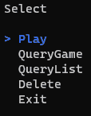
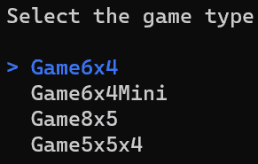
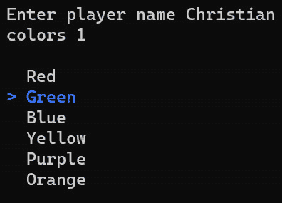
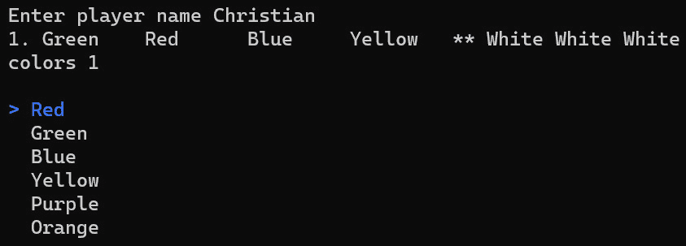
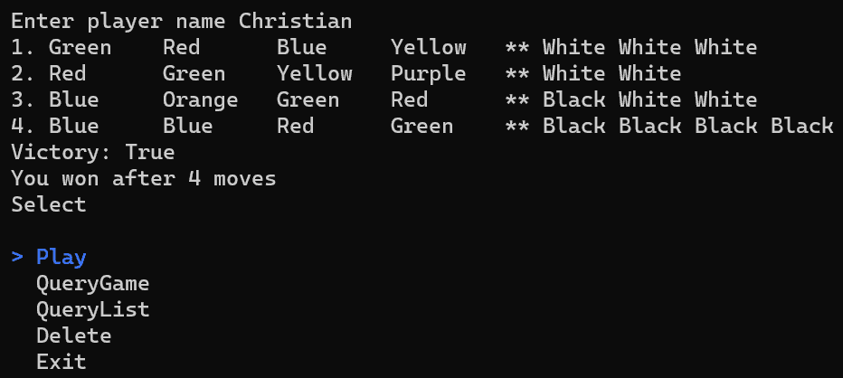

# 为客户端应用程序创建库

通过上一章的更新，游戏 API 现在可供使用——包括对数据库的访问。在本章中，我们将创建一个.NET 库，该库可以被所有.NET 客户端应用程序用来访问服务。我们不需要为每个客户端应用程序创建 HTTP 请求，而是创建一个可以共享的库。

在本章中，你将执行以下操作：

+   创建一个发送 HTTP 请求的库

+   使用库创建一个客户端控制台应用程序来玩游戏

+   使用 Microsoft Kiota 工具根据 OpenAPI 文档生成代码

# 技术要求

本章的代码可以在 GitHub 仓库[`github.com/PacktPublishing/Pragmatic-Microservices-with-CSharp-and-Azure`](https://github.com/PacktPublishing/Pragmatic-Microservices-with-CSharp-and-Azure)中找到。源代码文件夹`ch04`包含本章的代码示例。

上一章的服务实现存储在`server`文件夹中。与上一章相比，模型只有细微的改动。模型包含注解（`Required`、`MinLength`和`MaxLength`属性）。这些信息会出现在 OpenAPI 文档中，并在创建客户端时使用。你可以使用`Chapter04.server.sln`文件打开并运行解决方案。在运行客户端应用程序时，你需要启动服务。根据你的偏好，你需要配置 SQL Server 或 Azure Cosmos DB，如前一章所述。你也可以使用内存中的存储库，这样你就不需要运行数据库。根据你的需求，使用`appsettings.json`文件更改配置。

新代码在`client`文件夹中。在这里，你可以找到以下项目：

+   `Codebreaker.GameApis.Client`：这是一个包含自定义模型和`GamesClient`类的库，该类向服务发送 HTTP 请求

+   `Codebreaker.Client.Console`：这是一个新的控制台应用程序，它引用客户端库，可以用来玩游戏

+   `Codebreaker.GamesApis.Kiota`：这是一个客户端库，可以用作`Codebreaker.GameApis.Client`的替代品，并使用生成的代码

+   `Codebreaker.Kiota.Console`：这是一个使用 Kiota 客户端库的控制台应用程序

# 创建一个创建 HTTP 请求的库

在一个微服务团队中，一个好的做法是团队不仅负责开发包括数据库访问代码在内的完整服务，而且至少负责一个客户端应用程序。在传统的开发团队中，客户端和服务器开发通常分散在不同的团队中。问题在于客户端和服务最好是在协作中创建。创建客户端时，你会发现服务 API 中缺少答案。在这里，客户端和服务开发者之间的快速沟通有助于解决问题。

为客户端创建库允许我们从所有.NET 客户端重用此功能；您可以使用任何.NET 客户端技术创建客户端，例如 Blazor、WinUI、.NET MAUI 以及其他技术。在本章中，我们将仅创建一个控制台应用程序，但您可以在 GitHub 组织[`github.com/codebreakerapp`](https://github.com/codebreakerapp)中找到使用 Blazor、WinUI、.NET MAUI、WPF 和 Platform Uno 的客户端。

要创建供客户端应用程序使用的库，我们执行以下操作：

1.  创建一个支持多目标平台的库以支持不同.NET 版本的客户端

1.  将`HttpClient`注入与客户端交互的主类中。

1.  向游戏服务发送 HTTP 请求。

1.  创建一个 NuGet 包以方便使用。

## 创建支持多目标平台的库

我们使用`dotnet` CLI 创建客户端库：

```cs
dotnet new classlib --framework net8.0 -o Codebreaker.GameApis.Client
```

使用这个库，我们需要模型类型以在客户端和服务之间传输数据，以及一个执行 HTTP 请求以调用服务 API 的客户端类。

为了支持使用不同.NET 版本的客户端，库被配置为支持多目标：

Codebreaker.GameAPIs.Client/Codebreaker.GameAPIs.Client.csproj

```cs
<PropertyGroup>
  <TargetFrameworks>net7.0;net8.0</TargetFrameworks>
  <!-- code removed for brevity -->
</PropertyGroup>
```

与默认入口`TargetFramework`不同，我们附加了一个`s`以包含框架列表。添加多个框架时，创建 NuGet 包时会添加多个二进制文件。对于您来说，创建一个可以由.NET 7 和.NET 8 客户端使用的.NET 6 库可能是可以的。使用多个框架，您可以基于客户端版本创建优化后的代码。

以下代码片段展示了优化示例：

Codebreaker.GameAPIs.Client/Models/CreateGameRequest.cs

```cs
#if NET8_0_OR_GREATER
[JsonConverter(typeof(JsonStringEnumConverter<GameType>))]
#else
[JsonConverter(typeof(JsonStringEnumConverter))]
#endif
public enum GameType
{
    Game6x4,
    Game6x4Mini,
    Game8x5,
    Game5x5x4,
}
```

泛型属性是 C# 11 中引入的新特性。`JsonStringEnumConverter`的泛型类型从.NET 8 开始引入。这个泛型版本支持原生 AOT 编译。较旧版本和非泛型的`JsonStringEnumConverter`使用反射。使用 C#预处理器指令`#if`和预定义符号`NET8_0_OR_GREATER`，根据框架版本编译不同的代码。

客户端和服务之间的模型主要相同。在这里，您可能会选择将模型从仅服务库移动到被客户端和服务应用程序共同引用的通用库。然而，基于客户端技术，您可能还有其他基于验证和变更通知的要求。对于客户端库的模型，您可以实现`INotifyPropertyChanged`接口，该接口被不同的客户端技术用于在变更通知时自动更新用户界面。在本章的后面部分，我们还将从在*第二章*中创建的 OpenAPI 文档创建库，这可能是不创建共享库的另一个原因。

`CreateGameRequest`是我们启动游戏时需要发送请求的类：

Codebreaker.GameAPIs.Client/Models/CreateGameRequest.cs

```cs
[JsonConverter(typeof(JsonStringEnumConverter<GameType>))]
public enum GameType
{
  Game6x4,
  Game6x4Mini,
  Game8x5,
  Game5x5x4,
}
public record class CreateGameRequest(
  GameType,
  string PlayerName);
```

`CreateGameRequest` 包含 `GameType` 和 `PlayerName` 属性，这些属性是开始游戏所必需的。`GamesQuery` 类用于发送不同的查询参数，以根据查询检索过滤后的游戏列表：

Codebreaker.GameAPIs.Client/Models/GamesQuery.cs

```cs
public record class GamesQuery(
  GameType? GameType = default,
  string? PlayerName = default,
  DateOnly? Date = default,
  bool? Ended = false)
{
  public string AsUrlQuery()
  {
    var queryString = "?";
    if (GameType != null)
    {
      queryString += $"gameType={GameType}&";
    }
    if (PlayerName != null)
    {
      queryString += $"playerName={Uri.EscapeDataString(PlayerName)}&";
    }
    // code removed for brevity
    queryString = queryString.TrimEnd('&');
    return queryString;
  }
}
```

`AsUrlQuery` 方法将记录的属性转换为根据游戏 API 服务指定的 HTTP 查询参数，并返回组合的查询字符串。你可能考虑将此方法添加到 `Game` 类中。`Game` 类仅定义表示游戏的 数据结构。`GamesQuery` 类控制其数据如何转换为 URL 查询字符串。

此外，`CreateGameResponse`、`UpdateGameRequest`、`UpdateGameResponse`、`Game` 和 `Move` 是使用此库所必需的。请使用 GitHub 仓库检查这些类型。

## 注入 `HttpClient` 类

我们接下来创建的 `GamesClient` 类用于向游戏服务发送请求。要使用 `HttpClient` 类，可以注入此类的对象。在使用库的应用程序中，此 `HttpClient` 需要配置基本地址（在 *第九章*，这将扩展到身份验证）。

以下代码片段显示了 `GamesClient` 类构造函数的实现：

Codebreaker.GameAPIs.Client/GamesClient.cs

```cs
public class GamesClient(HttpClient httpClient)
{
  private readonly HttpClient _httpClient = httpClient;
  private readonly JsonSerializerOptions _jsonOptions = new()
  {
    PropertyNameCaseInsensitive = true
  };
  // code removed for brevity
```

在 `GamesClient` 的构造函数中，注入的 `HttpClient` 实例被分配给一个变量，并配置了 `JsonOptions`。ASP.NET Core 将 JSON 序列化时的属性映射到小写。根据这里定义的选项，忽略大小写，因此小写映射被传输到大写属性。

注意

不要在每次请求时创建新的 `HttpClient` 类实例。相反，注入客户端将创建实例的责任转移到调用应用程序。使用依赖注入容器，我们将配置 `HttpClient` 以从工厂创建。

## 发送 HTTP 请求

让我们向服务发送一些请求以检索有关游戏、开始游戏和设置移动的信息。

最初的方法用于检索游戏信息：

Codebreaker.GameAPIs.Client/GamesClient.cs

```cs
public async Task<Game?> GetGameAsync(bool id, CancellationToken cancellationToken = default)
{
  Game game = default;
  try
  {
    game = await _httpClient.GetFromJsonAsync<Game>(
      $"/games/{id}", _jsonOptions, cancellationToken);
  }
  catch (HttpRequestException ex) when (ex.StatusCode = 
  HttpStatusCode.NotFound)
  {
    return default;
  }
  return game;
}
public async Task<IEnumerable<Game>> GetGamesAsync(GamesQuery query, CancellationToken cancellationToken = default)
{
  IEnumerable<Game> games = (
    await _httpClient.GetFromJsonAsync<IEnumerable<Game>>(
$"/games/{query.AsUrlQuery()}", _jsonOptions, 
      cancellationToken)) ?? Enumerable.Empty<Game>();
  return games;
}
```

`GetGameAsync` 方法通过传递游戏的标识符检索一个游戏。`GetGamesAsync` 使用先前创建的 `GamesQuery` 来创建用于发送 HTTP GET 请求的服务 URI。`GetFromJsonAsync` 是 `HttpClient` 类的一个扩展方法，用于发送 HTTP GET 请求，使用 `EnsureSuccessStatusCode` 与 `HttpResponseMessage` 检查成功状态码（如果失败则抛出 `HttpRequestException`），并使用 `System.Text.Json` 反序列化器从响应流中反序列化。当传递的 `game-id` 未找到时，我们希望返回 `null` 而不是抛出异常，因此捕获此异常。

使用 `StartGameAsync` 方法实现启动游戏的请求：

Codebreaker.GameAPIs.Client/GamesClient.cs

```cs
public async Task<(Guid id, int numberCodes, int maxMoves, IDictionary<string, string[]> FieldValues)>
  StartGameAsync(GameType gameType, string playerName, 
  CancellationToken cancellationToken = default)
{
  CreateGameRequest createGameRequest = new(_gameType, _playerName);
var response = await _httpClient.PostAsJsonAsync("/games", 
    createGameRequest, cancellationToken);
  response.EnsureSuccessStatusCode();
  var gameResponse = await response.Content.
    ReadFromJsonAsync<CreateGameResponse>(
    _jsonOptions, cancellationToken);
  if (gameResponse is null)
    throw new InvalidOperationException();
  return (gameResponse.Id, gameResponse.NumberCodes, gameResponse.
    MaxMoves, gameResponse.FieldValues);
}
```

`StartGamesAsync` 方法在创建应该随 HTTP 主体一起发送的数据后发送一个 HTTP POST 请求：`CreateGameRequest`。在收到成功响应后，`ReadFromJsonAsync` 扩展方法反序列化返回的 HTTP 主体，并使用元组返回方法的结果。

要发送游戏移动，使用 HTTP PATCH 请求更新游戏：

Codebreaker.GameAPIs.Client/GamesClient.cs

```cs
public async Task<(string[] Results, bool Ended, bool IsVictory)> SetMoveAsync(Guid id, string playerName, GameType gameType, int moveNumber, string[] guessPegs, CancellationToken cancellationToken = default)
{
  UpdateGameRequest updateGameRequest = new(id, gameType, playerName, 
    moveNumber)
  {
    GuessPegs = guessPegs
  };
var response = await _httpClient.PatchAsJsonAsync($"/games/{id}", 
    updateGameRequest, _jsonOptions, cancellationToken);
  response.EnsureSuccessStatusCode();
  var moveResponse = await response.Content.ReadFromJsonAsync<UpdateGameResponse>(_jsonOptions, cancellationToken)
    ?? throw new InvalidOperationException();
  (_, _, _, bool ended, bool isVictory, string[] results) = 
    moveResponse;
  return (results, ended, isVictory);
}
```

发送 HTTP PATCH 请求与发送 POST 请求非常相似：创建 `UpdateGameRequest` 对象以将此 JSON 序列化的信息发送到服务器。接收结果后，将主体反序列化为 `UpdateGameResponse` 对象。

注意

使用 REST API，通常使用 HTTP PUT 请求更新资源，而 HTTP PATCH 用于部分更新。在这里，游戏资源被更新，但不是通过发送完整的游戏，而是只发送一些部分数据。

## 创建 NuGet 包

从库中创建 NuGet 包，您可以使用 `dotnet` CLI：

```cs
cd Codebreaker.GameAPIs.Client
dotnet pack --configuration Release
```

要查看 NuGet 包的内容，您可以将其重命名为 `zip`。为了方便使用此包，您可以将其添加到共享文件夹中，并配置 Visual Studio NuGet 包管理器以引用此文件夹。您还可以将包发布到 Azure DevOps Artifacts。通过引用此，您可以创建一个 `nuget.config` 文件：

```cs
dotnet new nugetconfig
```

使用生成的 `nuget.config` 文件，您需要指定共享文件夹或您的 Azure DevOps Artifacts 源的链接。

这是一个使用 `dotnet new` 创建的 `nuget.config` 文件，并添加了一个自定义源条目：

```cs
<?xml version="1.0" encoding="utf-8"?>
<configuration>
  <packageSources>
    <clear />
    <add key="nuget" value="https://api.nuget.org/v3/index.json" />
<add key="custom" value="https://pkgs.dev.azure.com/
      MyOrganization/_packaging/MyFeed/nuget/v3/index.json" />
  </packageSources>
</configuration>
```

使用此 NuGet 配置文件，`<clear />` 条目删除了所有默认源。带有第一个 `add` 元素的 `nuget` 键引用了 NuGet 服务器的默认源。同样，您可以使用其他键和链接添加自定义源到服务器上的包源。

对于 Codebreaker 解决方案，您可以在 NuGet 服务器上查找 `Cninnovation.Codebreaker.Client` NuGet 包。在 NuGet 上提供 NuGet 包后，应在包中添加一个说明文件、许可证和一些其他元数据。有关更多信息，请参阅进一步阅读。

# 创建客户端应用程序

在库已经就绪的情况下，让我们创建一个客户端应用程序。一个简单的控制台应用程序可以满足玩游戏的目的。在使用这些命令之前，请导航到解决方案文件的文件夹：

```cs
dotnet new console –framework net8.0 -o Codebreaker.Console
cd Codebreaker.Console
dotnet add package Microsoft.Extensions.Hosting
dotnet add package Microsoft.Extensions.Http.Resilience
dotnet add package Spectre.Console.Cli
dotnet add reference ../Codebreaker.GameAPIs.Client
```

`Microsoft.Extensions.Hosting` 将用于依赖注入容器和配置支持，而 `Microsoft.Extensions.Http.Resiliency` 是提供 `HttpClientFactory` 的包。当然，之前创建的库也需要被引用。

要与用户交互，可以使用简单的`Console.ReadLine`和`Console.WriteLine`语句。在书中 GitHub 仓库提供的示例应用程序中，使用了 NuGet 包`Spectre.Console.Cli`。只需检查源代码以获取更多信息。

## 配置依赖注入容器

应用程序的最高级语句如下所示：

Codebreaker.Console/Program.cs

```cs
var builder = Host.CreateApplicationBuilder(args);
builder.Services.AddHttpClient<GamesClient>(client =>
{
  string gamesUrl = builder.Configuration["GamesApiUrl"] ??throw new 
    InvalidOperationException("GamesApiUrl not found");
  client.BaseAddress = new Uri(gamesUrl);
});
builder.Services.AddTransient<Runner>();
var app = builder.Build();
var runner = app.Services.GetRequiredService<Runner>();
await runner.RunAsync();
```

`Host`类的`CreateApplicationBuilder`配置了依赖注入容器，并为应用程序配置提供者和日志提供者提供了默认配置。`AddHttpClient`扩展方法使用 HttpClient 工厂实现。在这里，使用泛型方法重载指定了将接收通过`configureClient`lambda 表达式指定的`HttpClient`注入的`GamesClient`类。`HttpClient`的`BaseAddress`配置为具有`GamesApiUrl`配置值。

对于配置，我们创建了一个`appsettings.json`配置文件：

Codebreaker.Console/appsettings.json

```cs
{
  "Logging": {
    "LogLevel": {
      "Default": "Warning"
    }
  },
  "GamesApiUrl": "http://localhost:9400"
}
```

`GamesApiUrl`键配置为包含游戏 API 服务的地址。为了不将游戏播放的控制台输出与日志混淆，日志级别配置为仅记录警告、错误和关键错误消息。

## 与用户交互

与用户交互和服务调用是通过`Runner`类实现的。在这里，之前创建的`GamesClient`被注入到主要构造函数中：

Codebreaker.Console/Runner.cs

```cs
internal class Runner(GamesClient client)
{
  private readonly CancellationTokenSource _cancellationTokenSource = new();
  public async Task RunAsync()
  {
    bool ended = false;
    while (!ended)
    {
      var selection = Inputs.GetMainSelection();
      switch (selection)
      {
        case MainOptions.Play:
          await PlayGameAsync();
          break;
        case MainOptions.Exit:
          ended = true;
          break;
        case MainOptions.QueryGame:
          await ShowGameAsync();
          break;
        case MainOptions.QueryList:
await ShowGamesAsync();
          break;
        case MainOptions.Delete:
          await DeleteGameAsync();
          break;
        default:
          throw new ArgumentOutOfRangeException();
      }
    }
  }
  // code removed for brevity
}
```

`RunAsync`方法首先询问用户下一步要做什么。主要选项是玩游戏、显示单个游戏的状态、显示游戏列表或删除游戏。此代码片段使用了`Inputs`类，该类又使用了来自提到的 NuGet 包`Spectre.Console.Cli`的`AnsiConsole`类。通过这种方式，您可以得到一个如图 4**.1*所示的漂亮的控制台用户界面，具有简单的选择。根据您用于与用户交互的方式，您的用户界面可能看起来不同。

1.  要运行游戏，首先在启动客户端之前启动服务器。使用客户端，选择**Play**（*图 4**.1*）。



图 4.1 – 控制台输出以选择主任务

1.  接下来，选择游戏类型（*图 4**.2*），例如，**Game6x4**。



图 4.2 – 选择游戏类型

1.  输入玩家名称（*图 4**.3*）并输入单次移动所需的所有颜色。



图 4.3 – 输入名称并根据游戏类型选择颜色

1.  *图 4**.4*显示了移动的结果（这里用三种颜色正确但位置错误）和下一个移动的开始。重复此操作直到解决代码。



图 4.4 – 移动结果和下一步操作

成功移动的结果在 *图 4.5* 中显示：



图 4.5 – 游戏结果

从那里，您可以重复此操作来玩另一场游戏或查询游戏列表。从游戏列表中，您可以获取游戏标识符并查询单个游戏，通过传递标识符。

# 使用 Microsoft Kiota 创建客户端

运行生成 OpenAPI 文档的 API 服务（这是在 *第二章* 中完成的），我们可以利用这些信息，并自动创建客户端代码。本章的示例代码中，OpenAPI 文档存储在文件 `gamesapi-swagger.json` 中，您可以在不启动服务的情况下引用它。

使用 Visual Studio 的一个选项是使用 **添加** | **连接客户端** 并将服务引用添加到 OpenAPI 文档。但这个选项（在撰写本文时）有一些限制：

+   它仍然使用 Newtonsoft Json 序列化器，而新的 `System.Text.Json` 序列化器更快且占用内存更少

+   客户端实现使用字符串而不是流，这可能导致大对象堆中的对象

正如您在本章中看到的，创建一个用于创建 HTTP 请求的自定义库并不难，并且可以针对您的领域进行优化。

但现在还有一个应该考虑的选项：Microsoft Kiota(https://learn.microsoft.com/openapi/kiota/)。Microsoft Kiota 是一个命令行工具，它为包括 Java、PHP、Python、TypeScript、C# 在内的多种语言提供从 OpenAPI 生成代码的功能。让我们试一试。

## 安装 Kiota

Kiota 作为 `dotnet` 工具提供。我们将此工具作为新库的一部分安装到另一个类库项目中。

使用以下命令创建库。请在 `solution` 文件夹中运行这些命令：

```cs
dotnet new classlib --framework net8.0 -o Codebreaker.GameApis.KiotaClient
cd Codebreaker.GameApis.KiotaClient
dotnet add package Microsoft.Kiota.Http.HttpClientLibrary
dotnet add package Microsoft.Kiota.Serialization.Json
dotnet add package Microsoft.Kiota.Serialization.Form
dotnet add package Microsoft.Kiota.Serialization.Multipart
dotnet add package Microsoft.Kiota.Serialization.Text
```

使用 Kiota，我们还需要为不同的序列化器和 Kiota HTTP 客户端库添加一些 Kiota NuGet 包。Kiota 工具与项目一起安装：

```cs
dotnet new tool-manifest
dotnet tool install microsoft.openapi.kiota
```

## 使用 Kiota 生成代码

在安装 Kiota 工具后，我们可以使用 OpenAPI 文档 `gamesapi-swagger.json` 生成代码。此文件位于 `ch04` 文件夹中：

```cs
dotnet kiota generate --openapi ..\..\gamesapi-swagger.json --output codebreaker --language CSharp --class-name GamesAPIClient --namespace-name Codebreaker.Client
```

使用这些选项，将使用引用的 OpenAPI 文档 `gamesapi-swagger.json` 生成源代码，生成的文件存储在子目录 `codebreaker` 中，代码生成使用 C# 语言，执行 HTTP 请求的主要类命名为 `GamesAPIClient`，所有生成的代码的命名空间为 `Codebreaker.Client`。

注意

查看生成的代码，你会发现 Kiota 生成的代码并没有使用与本书或 .NET 团队使用的相同的编码约定。例如，花括号的打开与方法名在同一行，这是许多 JavaScript 程序中使用的约定。如果你使用 Visual Studio，你可以通过在解决方案资源管理器中的上下文菜单中导航到 **分析并清理代码** | **运行代码清理** 来轻松地使用整个程序更改此约定。你可能需要首先配置代码清理的首选项。

使用 Kiota 创建的类型是模型（使用 OpenAPI 中的 `schemas`）和请求构建器（使用定义请求的 `paths`）。请检查书籍仓库以获取生成的代码文件。

### 探索 Kiota 生成的模型

对于所有请求、响应以及 schemas 中指定的所有类型，Kiota 在 `Models` 目录中生成类。让我们看看 `CreateGameRequest` 类：

Codebreaker.GamesAPIs.KiotaClient/codebreaker/Models/CreateGameRequest.cs

```cs
public class CreateGameRequest : IParsable
{
  public Codebreaker.Client.Models.GameType? GameType { get; set; }
  public string? PlayerName { get; set; }
  public static CreateGameRequest 
    CreateFromDiscriminatorValue(IParseNode parseNode)
  {
    _ = parseNode ?? throw new ArgumentNullException(nameof(parseNode));
    return new CreateGameRequest();
  }
  public virtual IDictionary<string, Action<IParseNode>> 
    GetFieldDeserializers()
  {
    return new Dictionary<string, Action<IParseNode>> {
      {"gameType", n => { GameType = n.GetEnumValue<GameType>(); } },
      {"playerName", n => { PlayerName = n.GetStringValue(); } },
    };
  }
  public virtual void Serialize(ISerializationWriter writer)
  {
    _ = writer ?? throw new ArgumentNullException(nameof(writer));
    writer.WriteEnumValue<GameType>("gameType", GameType);
    writer.WriteStringValue("playerName", PlayerName);
  }
}
```

模型类型实现了 `IParsable` 接口。这不是 `System.IParsable` 接口，而是来自 `Microsoft.Kiota.Abstractions.Serialization` 命名空间中的 Kiota 库的版本。此接口定义了实例成员 `GetFieldDeserializers` 和 `Serialize`。通过这种方式，Kiota 提供了一个抽象层，允许使用不同的序列化器。

另一个需要提及的重要方面是，所有模型类型的属性都被声明为可空的。虽然 EF Core 支持可空性，可以将非可空成员映射到数据库中的必填项，但在使用最小 API 生成 OpenAPI 文档时，这个注解并未被使用。在服务器上的模型上添加 `Required` 属性会增加 `required`。其他注解，如 `MaxLength` 和 `MinLength`，也被映射为 `maxLength` 和 `minLength`，正如你在 `gamesapi-swagger.json` 中所看到的。

然而，许多 API 并没有注意可空性。在 OpenAPI 定义中，也没有明确指定如何强制执行严格的可空性。根据模型使用的上下文，信息仍然可能从服务器中遗漏，并且数据没有被发送。

这里是关于 Kiota 实现的讨论：[`github.com/microsoft/kiota/issues/2594`](https://github.com/microsoft/kiota/issues/2594)

随着下一个主要版本的 OpenAPI 规范，这可能会改变。对于当前 Kiota 实现所做的决策，Kiota 可以安全地将所有模型属性声明为可空的，但这同时也意味着我们需要检查 `null`。

### 探索 Kiota 生成的请求构建器

请求构建器的目标是轻松创建请求。让我们看看一些生成的代码：

Codebreaker.GamesAPIs.KiotaClient/codebreaker/GamesAPIClient.cs

```cs
public class GamesAPIClient : BaseRequestBuilder
{
  public GamesRequestBuilder Games
  {
    get => new GamesRequestBuilder(PathParameters, RequestAdapter);
  }
  public GamesAPIClient(IRequestAdapter requestAdapter) : base(requestAdapter, "{+baseurl}", new Dictionary<string, object>())
  {
     ApiClientBuilder.
       RegisterDefaultSerializer<JsonSerializationWriterFactory>();
     ApiClientBuilder.
       RegisterDefaultSerializer<TextSerializationWriterFactory>();
     ApiClientBuilder.
       RegisterDefaultDeserializer<JsonParseNodeFactory>();
  // code removed for brevity
  }
}
```

所有请求构建器都继承自基类 `BaseRequestBuilder`。通过代码生成指定名称的 `GamesApiClient` 类是需要初始化以与 Games API 通信的请求构建器。在构造函数中，可以看到配置了默认的序列化和反序列化器。在这里，Kiota 提供了更多的灵活性。

`GamesApiClient` 的 `Games` 属性返回另一个请求构建器：`GamesRequestBuilder`。此构建器位于 `GamesRequestBuilder.cs` 源文件中：

Codebreaker.GamesAPIs.KiotaClient/codebreaker/Games/GamesRequestBuilder.cs

```cs
public class GamesRequestBuilder : BaseRequestBuilder
{
  public GamesItemRequestBuilder this[Guid position]
  {
    get
    {
      // code removed for brevity
      return new GamesItemRequestBuilder(urlTplParams, 
        RequestAdapter);
    }
  }
  public async Task<List<Game>?> GetAsync(Action<RequestConfiguration
    <GamesRequestBuilderGetQueryParameters>>? requestConfiguration = 
    default, CancellationToken cancellationToken = default)
  {
    var requestInfo = ToGetRequestInformation(requestConfiguration);
    var collectionResult = await RequestAdapter.
      SendCollectionAsync<Game>(requestInfo, Game.
      CreateFromDiscriminatorValue, default, cancellationToken).
      ConfigureAwait(false);
    return collectionResult?.ToList();
  }
public async Task<CreateGameResponse?> PostAsync(CreateGameRequest 
    body, Action<RequestConfiguration<DefaultQueryParameters>>? 
    requestConfiguration = default, CancellationToken 
    cancellationToken = default)
  {
    // code removed for brevity
  }
```

此请求构建器随后用于调用游戏 API 的请求。此请求构建器实现的方法有 `GetAsync` 和 `PostAsync`。`GetAsync` 方法用于通过查询参数检索游戏列表。`PostAsync` 使用生成的 `CreateGameRequest` 模型发送 POST 请求。

要获取单个游戏、通过发送游戏移动更新游戏以及删除游戏，游戏 API 需要一个游戏标识符。通过 Kiota，这是通过提供 `GamesRequestBuilder` 的索引器来解决的，它反过来返回另一个请求构建器 `GameItemsRequestBuilder`。在这里，可以使用流畅的 API 传递游戏标识符并调用 `GetAsync` 和 `PutAsync` 方法。

在下一节中，我们将实现另一个控制台应用程序以使用此生成的代码。

## 使用 Kiota 生成的代码

Kiota 生成的代码与控制台应用程序 `Codebreaker.KiotaConsole` 一起使用。在大部分部分，该应用程序的代码与之前的控制台应用程序类似。主要的变化是，使用 `Runner` 类对服务的调用现在被替换，并且依赖注入容器配置已更改。

HttpClient 工厂不再注册到 DI 容器中，如下代码片段所示：

Codebreaker.KiotaConsole/Program.cs

```cs
var builder = Host.CreateApplicationBuilder(args);
builder.Services.Configure<RunnerOptions>(options =>
{
options.GamesApiUrl = builder.Configuration["GamesApiUrl"] ??
    throw new InvalidOperationException("GamesApiUrl not found");
});
builder.Services.AddTransient<Runner>();
var app = builder.Build();
var runner = app.Services.GetRequiredService<Runner>();
await runner.RunAsync();
```

除了移除 `HttpClient` 配置的代码外，现在基本地址被配置为为 `RunnerOptions` 类提供值。该类仅定义了 `GamesApiUrl` 属性以指定游戏服务的基地址。

`Runner` 类的构造函数，其中传递了选项，将在下一个代码片段中展示：

Codebreaker.KiotaConsole/Runner.cs

```cs
internal class Runner
{
  private readonly GamesAPIClient _client;
  private readonly CancellationTokenSource _cancellationTokenSource = new();
  public Runner(IOptions<RunnerOptions> options)
  {
    AnonymousAuthenticationProvider authenticationProvider = new();
    HttpClientRequestAdapter adapter = new(authenticationProvider)
    {
BaseUrl = options.Value.GamesApiUrl ?? throw new 
        InvalidOperationException("Could not read GamesApiUrl")
    };
    _client = new GamesAPIClient(adapter);
  }
```

在实现 `Runner` 构造函数时，实例化了 `GamesAPIClient` 类。该类接收配置了服务基本地址的 `HttpClientRequestAdapter`。`HttpClientRequestAdapter` 的构造函数接收一个实现 `IAuthenticationProvider` 接口的对象。在这里，使用 `AnonymousAuthenticationProvider` 因为不需要认证。Kiota 提供了各种认证提供者。

要发送带有查询参数的 GET 请求以获取游戏列表，你将调用 `GamesRequestBuilder` 的 `GetAsync` 方法：

Codebreaker.KiotaConsole/Runner.cs

```cs
private async Task ShowGamesAsync()
{
  var games = await _client.Games.GetAsync(config =>
  {
    config.QueryParameters.Date = new Date(DateTime.Today);
  }, _cancellationTokenSource.Token);
  // code removed for brevity
```

`Games`属性返回生成的`GamesRequestBuilder`，这允许我们通过传递查询参数来调用`GetAsync`方法。Kiota 在`Microsoft.Kiota.Abstractions`命名空间内提供了自己的`Date`类型，它代表`DateTime`的仅日期部分。今天，.NET 提供了`DateOnly`类型，但这个类型在.NET Standard 2.0 中不可用，而 Kiota 也支持.NET Standard 2.0。

开始游戏是通过发送 POST 请求来完成的，如下面的代码片段所示：

Codebreaker.KiotaConsole/Runner.cs

```cs
private async Task PlayGameAsync()
{
  // code removed for brevity
  CreateGameRequest request = new()
  {
    PlayerName = playerName,
    GameType = gameType
  };
var response = await _client.Games.PostAsync(request, 
    cancellationToken: _cancellationTokenSource.Token);
```

开始游戏时，玩家名称和游戏类型的用户输入被分配给`CreateGameRequest`对象。然后，通过调用`PostAsync`方法来启动游戏并接收`CreateGameResponse`，将此模型类型传递。

以下代码片段展示了通过传递游戏标识符获取单个游戏：

Codebreaker.KiotaConsole/Runner.cs

```cs
private async Task ShowGameAsync()
{
  // code removed for brevity
  var game = await _client.Games[id.ToString()].GetAsync(
    cancellationToken: _cancellationTokenSource.Token);
  // code removed for brevity
```

获取单个游戏、使用 HTTP PATCH 请求更新游戏以及使用 HTTP DELETE 请求删除游戏都需要将游戏标识符作为查询参数。为了使用这个功能，Kiota 提供了一个传递`game-id`并继续使用流畅 API 的索引器。要获取单个游戏，使用`GetAsync`方法。修补和删除游戏非常相似。

使用这些信息，你可以使用 Kiota 生成的代码，并编写实现来通过发送游戏移动来使用`PostAsync`方法更新游戏。

使用新的客户端，你可以以之前展示的方式运行游戏！

# 摘要

在阅读本章内容的过程中，你将拥有一个运行中的客户端控制台应用程序来运行游戏。我们使用了`HttpClient`类向游戏服务发送请求。为了能够与不同的客户端技术重用这一功能，我们创建了一个库。为了高效地使用`HttpClient`类，你学习了如何使用 HttpClient 工厂。

而不是自己实现模型，你学习了使用 Microsoft Kiota 从 OpenAPI 定义创建代码。在你的自己的场景中，你现在可以决定对你来说最好的选项是什么。

在阅读下一章之前，你可以重用这个新创建的库，并创建你选择的客户端，例如 Blazor、WinUI 或.NET MAUI。虽然这些框架超出了本书的范围，但你可以在[`github.com/codebreakerapp`](https://github.com/codebreakerapp)查看更多可用的客户端。

无论你实现什么客户端，在深入下一章之前，玩一次游戏是值得的——这次是用你自己的客户端应用程序。

在下一章中，我们将再次关注服务；我们将使用 Docker 容器托管服务应用程序（以及另一个服务）。这个新的服务也将使用本章创建的 HTTP 客户端。

# 进一步阅读

要了解更多关于本章讨论的主题，你可以参考以下链接：

+   `HttpClient`指南：https://learn.microsoft.com/dotnet/fundamentals/networking/http/httpclient-guidelines

+   NuGet 包的最佳实践：[`learn.microsoft.com/nuget/create-packages/package-authoring-best-practices`](https://learn.microsoft.com/nuget/create-packages/package-authoring-best-practices)

+   Windows 系统上的大对象堆：[`learn.microsoft.com/dotnet/standard/garbage-collection/large-object-heap`](https://learn.microsoft.com/dotnet/standard/garbage-collection/large-object-heap)

+   Microsoft Kiota 文档：[`learn.microsoft.com/openapi/kiota/`](https://learn.microsoft.com/openapi/kiota/)

+   Kiota GitHub 仓库：[`github.com/microsoft/kiota`](https://github.com/microsoft/kiota)

# 第二部分：托管和部署

本部分重点介绍托管和部署微服务的基本方面。你将首先全面了解 Docker 基础知识，例如创建 Dockerfile、使用 .NET CLI 构建 Docker 镜像以及在开发环境中使用 .NET Aspire 运行 Docker 容器。然后，你将继续将 Docker 镜像发布到 Azure 容器注册库，部署到 Azure 容器应用环境（基于 Kubernetes），并整合 Azure 服务，如 Azure 应用配置和 Azure 密钥保管库。

在本部分中，你将利用 Azure 资源进行本地应用程序执行，使用 Azure 开发者 CLI 将应用程序部署到 Azure，并在代码库更新时通过 GitHub Actions 自动部署到 Azure。为确保在本地和 Azure 环境中无缝运行，将实现 Azure Active Directory B2C 和 Microsoft Entra 进行身份验证，同时使用 ASP.NET Core Identities。

本部分包含以下章节：

+   *第五章*, *微服务的容器化*

+   *第六章*, *在 Microsoft Azure 上托管应用程序*

+   *第七章**，灵活的配置*

+   *第八章**，使用 GitHub Actions 进行 CI/CD 发布*

+   *第九章**，使用服务和客户端进行身份验证和授权*
