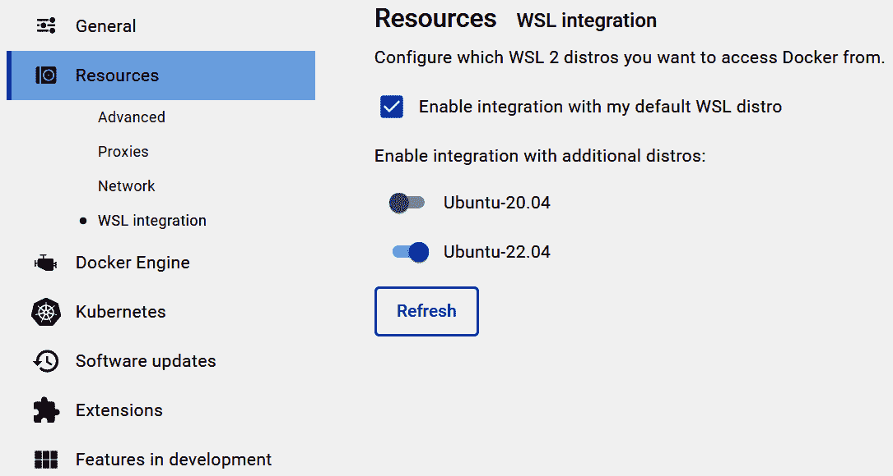
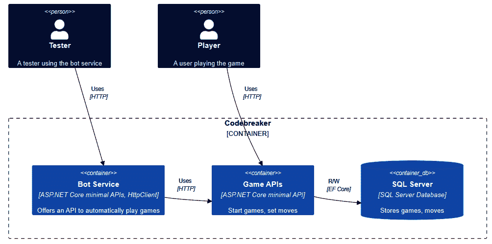
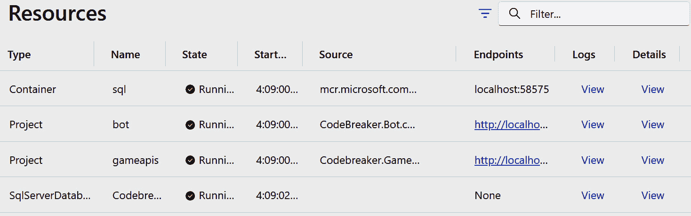
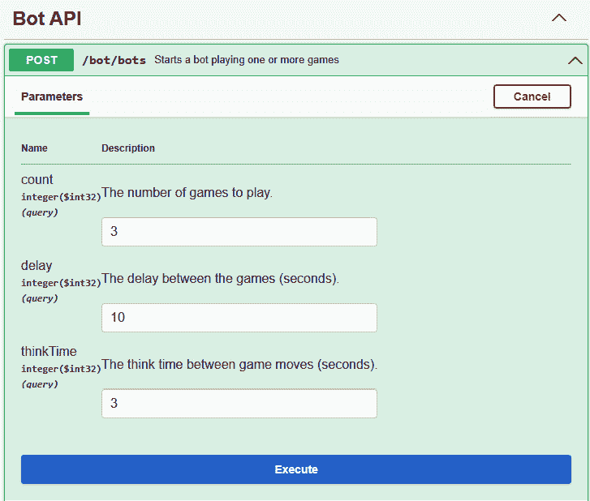
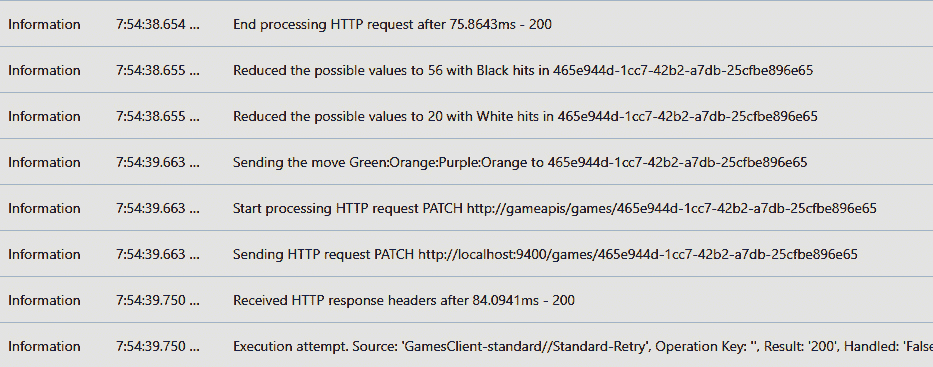

# 第五章：微服务的容器化

在前几章构建了客户端和服务之后，现在是时候让服务为发布做好准备。使用 Docker，我们可以准备包含运行完整解决方案所需所有内容的镜像。

在本章中，你将开始学习 Docker 最重要的部分，包括构建 Docker 镜像、运行容器以及使用.NET Aspire 在本地开发系统上运行由多个服务组成的解决方案，包括在 Docker 容器中运行的 SQL Server，以及利用本地的**预编译**（**AOT**）创建特定平台的本地应用程序。

在本章中，你将学习以下主题：

+   使用 Docker

+   构建 Docker 镜像

+   使用.NET Aspire 运行解决方案

+   在 ASP.NET Core 中使用原生 AOT

# 技术要求

通过本章你需要的是**Docker Desktop**。Docker Desktop 对个人开发者、教育和开源社区是免费的。你可以从[`www.docker.com/products/docker-desktop/`](https://www.docker.com/products/docker-desktop/)下载 Docker Desktop，最佳搭配**Windows 子系统 Linux**（**WSL**）使用。查看本章的 README 文件以安装 WSL 2 和 Docker Desktop。

注意

`dotnet publish`命令支持构建和发布 Docker 镜像。虽然`dotnet publish`的一些功能可以在不安装 Docker Desktop 的情况下使用，但我们直接开始使用 Docker，因为这也有助于理解可以使用.NET CLI 做什么，而且通常你需要比.NET CLI 提供的更多关于 Docker 的功能。

本章的代码可以在以下 GitHub 仓库中找到：[`github.com/PacktPublishing/Pragmatic-Microservices-with-CSharp-and-Azure`](https://github.com/PacktPublishing/Pragmatic-Microservices-with-CSharp-and-Azure).

`ch05`源代码文件夹包含本章的代码示例。对于本章的不同部分，有不同的子文件夹可供选择。为了开始，按照说明操作，你可以使用`StartXX`文件夹。`StartDocker`文件夹包含在创建 Docker 容器之前添加的项目，而`FinalDocker`文件夹包含构建 Docker 容器后的最终状态的项目。

`StartAspire`文件夹包含多个项目，我们在前几章创建的.NET Aspire 特定项目已经包含在内。将其作为本章.NET Aspire 部分的起点。`FinalAspire`包含完整的结果，你可以将其作为参考。`NativeAOT`文件夹包含用于编译.NET 原生 AOT 的游戏 API 的代码。

在`ch05`文件夹的子文件夹中，你会看到以下项目：

+   `Codebreaker.GameAPIs` – 我们在前一章客户端应用程序中使用的游戏 API 项目。在本章中，我们对项目进行了少量更新，以指定连接到 SQL Server 数据库的连接字符串。该项目引用了 NuGet 包，其中实现了`IGamesRepository`接口的 SQL Server 和 Azure Cosmos DB 实现。

+   `Codebreaker.Bot` – 这是一个新项目，它实现了 REST API 并调用游戏 API 以自动进行随机游戏操作。该项目利用我们在*第四章*中创建的客户端库 – 它引用了`CNinnovation.Codebreaker.Client` NuGet 包来调用游戏 API。

+   `Codebreaker.AppHost` – 该项目得到了增强，以协调不同的服务。

+   `Codebreaker.ServiceDefaults` – 在本章中，该项目没有变化。

+   `Codebreaker.GameAPIs.NativeAOT` – 一个新项目，它提供了经过一些修改以支持.NET 8 原生 AOT 的游戏 API。

# 使用 Docker

尽管如今，仅使用.NET 工具创建微服务和运行 Docker 容器是可能的，但了解 Docker 仍然很有帮助。因此，在这里，我们查看 Docker 的一些重要概念，包括启动在 Docker 容器中运行的 SQL Server 实例，创建用于构建游戏 API 服务的 Dockerfile，以及在本地系统上运行这些容器。如果你已经对 Docker 了如指掌，你可以跳过并转到*.NET Aspire*部分，该部分不需要在此处创建的 Docker 容器。

在深入构建 Docker 镜像之前，我们为什么需要容器呢？在部署应用程序时，应用程序经常无法运行。通常，原因是在目标系统上缺少运行时或配置设置错误或缺失。解决这一问题的方法之一是准备**虚拟机**（**VM**），其中所有内容都已预先安装。这种方法的缺点是虚拟机需要的资源。虚拟机包含操作系统并分配 CPU 和内存资源。Docker 要轻量得多。Docker 镜像可以小到操作系统不是镜像的一部分的程度 – 而多个 Docker 容器可以共享相同的 CPU 和内存。

在深入了解细节之前，这里有一个使用 Docker 时的重要术语简要列表：

+   Docker **镜像** 是一个包含运行应用程序所需所有内容的可执行包

+   一个镜像可能有不同的版本，这些版本通过 Docker **标签**来识别

+   **Dockerfile** 是一个包含构建 Docker 镜像指令的文本文件

+   Docker **容器** 是 Docker 镜像的运行实例

+   Docker **仓库** 是 Docker 镜像的存储位置

+   Docker **仓库** 是在仓库中不同版本的 Docker 镜像的集合

## 使用 Docker Desktop

Docker Desktop for Windows 提供了一个环境，可以在 Windows 上构建 Docker 镜像和运行 Docker 容器。你可以配置它使用 Windows 或 Linux 容器。在 Docker Desktop for Windows 的早期版本中，需要安装 Hyper-V。Docker Desktop 随后使用 Linux 虚拟机在该虚拟机上运行所有 Linux 容器。因为 Windows 现在通过 WSL 更原生地支持 Linux，所以 Docker Desktop 可以使用 WSL，不需要虚拟机。在 Docker Desktop 配置中，你可以选择使用与 Windows 系统本身相同的 Docker 环境的 WSL 发行版（见*图 5.1*）。使用这些 Linux 发行版，你可以使用相同的 Docker 命令来管理你的 Docker 环境：



图 5.1 – Docker Desktop 中的 WSL 集成

与配置使用你分配的 CPU 和内存数量的虚拟机不同，WSL 与 Windows 共享 CPU 和内存——但 WSL 有一些限制。在 Windows 构建版本 20176 及以后的版本中，内存限制为 50%和 8GB（取较小者）；在之前的版本中，WSL 可以使用总内存的 80%。

对于逻辑处理器的数量，默认情况下，可以使用所有可用的处理器。你可以为整个子系统全局更改内存和 CPU 限制，也可以为安装的每个 Linux 发行版定义不同的限制。检查 WSL 的设置配置，请参阅[`learn.microsoft.com/windows/wsl/wsl-config`](https://learn.microsoft.com/windows/wsl/wsl-config)。

## 运行 Docker 容器

在你安装了 Docker Desktop 并且正在运行 Windows 后，你可以选择运行 Windows 或 Linux 容器。虽然 Windows 容器非常适合仅运行在 Windows 上的旧版应用程序（例如，使用.NET Framework），但 Linux 容器提供更多功能，Linux Docker 镜像也较小。我们构建的解决方案将使用 Linux 容器运行。

需要先启动 Docker Desktop 环境，然后要运行第一个容器，请使用以下命令：

```cs
docker run hello-world
```

在第一次运行时，`hello-world` Docker 镜像从 Docker 仓库下载并启动。这个容器只是将一条消息写入屏幕以验证一切是否正常运行。再次启动它时，你会看到镜像不再下载，而是立即启动。

要查看所有下载的镜像，你可以使用以下命令：

```cs
docker images
```

要查看正在运行的容器，请使用以下命令：

```cs
docker container ls
```

也有一个简写符号来显示所有正在运行的容器：`docker ps`。

你将看不到`hello-world`容器，因为这个容器在写入输出后立即停止了。

重复运行一个镜像，你就可以从头开始。但同时也保留了一个与运行中的镜像相关的状态。这允许你继续之前停止的容器，并保持之前的状态。`docker container ls -a` 命令不仅显示了正在运行的容器，还显示了已停止的容器。使用 `docker container prune`，你可以从所有已停止的容器中删除状态。

## 在 Docker 容器中运行 SQL Server

在 *第三章* 中，我们使用了本地系统上的 SQL Server 和 Azure Cosmos DB 模拟器来从游戏服务访问它。您也可以使用 Docker 镜像，而不是在本地系统上安装这些产品。

让我们开始下载 SQL Server 的 Docker 镜像：

```cs
docker pull mcr.microsoft.com/mssql/server:2022-latest
```

之前，我们使用 `docker run` 启动容器并隐式地从注册表中下载它。`docker pull` 只是从注册表中下载镜像。`mcr.microsoft.com` 是微软存储镜像的 Microsoft 仓库。`mssql/server` 是镜像的名称。您可以在 [`hub.docker.com/_/microsoft-mssql-server`](https://hub.docker.com/_/microsoft-mssql-server) 上阅读有关此镜像的信息。这是一个基于 Ubuntu 的镜像。`2022-latest` 是一个标签名称。这是 SQL Server 2022 的实际版本。对于 SQL Server，其他标签是 `2019-latest`、`2017-latest` 和 `latest`。这些对应于 SQL Server 2019 和 2017。`latest` 标签是 SQL Server 的最新版本。在撰写本文时，该镜像与 `2022-latest` 和 `latest` 标签相同。如果您下载了这两个镜像，则不需要第二次下载，您将看到具有相同镜像 ID 但不同标签的镜像。

注意

使用 Docker 镜像与 SQL Server 的默认配置是 SQL Server 开发者版。您也可以通过设置环境变量来配置使用 Express、标准、企业和企业核心版。请注意非开发者版本的必要许可证。阅读镜像文档以设置不同版本的环境变量。

在 Docker 环境中使用 SQL Server 版本的另一个选项是 Azure SQL Edge。请检查 [`learn.microsoft.com/en-us/azure/azure-sql-edge/disconnected-deployment`](https://learn.microsoft.com/en-us/azure/azure-sql-edge/disconnected-deployment) 了解如何运行 Azure SQL Edge。

要运行 SQL Server 镜像，您可以使用以下命令：

```cs
docker run -e "ACCEPT_EULA=Y" -e "MSSQL_SA_PASSWORD=Pa$$w0rd" -p 14333:1433 --name sql1 --hostname sql1 -d mcr.microsoft.com/mssql/server:2022-latest
```

使用此命令，这些选项被使用：

+   `-e` 指定环境变量。使用这两个变量，许可证被接受，并为 `sa` 账户定义了一个密码。`sa` 是一个配置了权限的账户，是 *系统管理员* 的简称。

+   `-p` 选项将主机上的端口映射到容器。在目标主机上，不能为多个应用程序使用相同的端口；例如，如果有一个本地 SQL Server 正在运行，第一个值不能使用 1433。请确保使用一个可用的端口。

+   `--name` 选项指定容器的名称。默认情况下，使用两个列表的组合生成一个随机名称。

+   `--hostname` 选项指定容器的主机名。

+   `-d` 选项在后台运行容器。

要获取有关容器做什么的有用信息，请使用 `docker container logs`：

```cs
docker container logs sql1
```

此命令需要容器的名称。要连接并等待所有日志到来，请添加 `-f` 选项（表示 *跟随*）。

要在容器内打开命令提示符并查看内容，请使用 `docker exec -it sql1 bash`，这将分配一个终端，保持 `stdin` 打开（交互模式），并在容器内执行 Bash shell。

SQL Server 容器启动后，我们可以发布在 *第三章* 中创建的数据库。

## 使用 Docker 容器中的卷

SQL Server 的 Docker 容器包含状态（数据库文件）。我们可以再次启动之前运行的容器（使用 `docker start`）。当使用 `docker run` 时，我们会重新开始，并且不会使用之前的状态。使用 `docker commit`，您可以从容器创建一个新的镜像。这样，数据库和状态就在一起了，Docker 镜像的大小也会增长。更好的做法是将状态保存在 Docker 容器之外。您可以在容器内挂载外部目录、文件和 Docker 卷。Docker 卷完全由 Docker 管理。让我们用这个来为 SQL Server 使用。

首先，创建一个卷：

```cs
docker volume create gamessqlstorage
```

这将创建一个名为 `gamessqlstorage` 的卷。要检查可用的卷，请使用 `docker volume ls`。要获取有关卷的更多信息，请执行 `docker volume inspect`。

让我们使用这个卷运行带有数据库的容器：

```cs
docker run -e "ACCEPT_EULA=Y" -e "MSSQL_SA_PASSWORD=Pa$$w0rd" -p 14333:1433 --name codebreakersql1 --hostname codebreakersql1 -v gamessqlstorage:/var/opt/mssql -d mcr.microsoft.com/mssql/server:2022-latest
```

`-v` 选项将容器内的 `/var/opt/mssql` 文件夹挂载到 `gamessqlstorage` 卷上。现在，SQL Server 写入此文件夹的所有数据现在都进入这个卷。状态现在保存在容器外部。因此，让我们创建一个数据库。

注意

在创建数据库备份时，也应使用卷。

## 在 Docker 容器中创建数据库

容器运行时，您可以使用 Visual Studio 中的 **SQL Server Object Explorer** 或 **SQL Server Management Studio** 等工具访问它。您可以使用以下 .NET 配置文件中的连接字符串：

```cs
{
  "ConnectionStrings": {
    "GamesSqlServerConnection": "server=host.docker.internal,14333;database=CodebreakerGames;user id=sa;password=Pa$$w0rd;TrustServerCertificate=true"
  }
}
```

使用 `appsettings.json` 文件，您还需要将 `DataStore` 键更改为 `SqlServer` 值。

使用 Linux 主机系统与 Docker 结合，您可以使用 Docker 容器的 IP 地址和端口号来访问 Docker 容器内的服务。这可能不适用于 Windows。这就是为什么引入了 `host.docker.internal` 主机名：通过使用本地端口号通过网关映射到服务。在数据库连接字符串中，您需要在主机名后添加端口号，并用逗号分隔。要传递用户名和密码，请使用 `user id` 和 `password` 键。因为来自 Docker 容器的证书可能不是 Windows 系统上受信任的权威机构颁发的，所以请在连接字符串中添加 `TrustServerCertificate` 设置。

在*第三章*中，我们使用`dotnet ef`命令行发布了一个数据库。现在是时候在 Docker 容器中创建这个数据库了。使用以下命令，您的当前目录需要是游戏 API 服务（`Codebreaker.GameAPIs`）的目录，`appsettings`中的`DataStorage`配置值设置为`SqlServer`，并且连接字符串指定如前所述：

```cs
cd Codebreaker.GameAPIs
dotnet ef database update -p ..\Codebreaker.Data.SqlServer -c GamesSqlServerContext
```

这样，数据库就创建好了——或者迁移到了最新版本。需要`-p`选项，因为 EF Core 上下文位于与`-c`不同的项目中。

注意

使用游戏服务项目，您有另一种创建数据库的选择。为了更方便地创建 SQL Server 数据库，现在除了其他 API 之外，还提供了`/createsql` API。发送`POST`请求会创建或升级数据库（如果已配置 SQL Server），使用 EF Core 的`MigrateAsync`方法。

接下来，让我们为游戏 API 服务创建一个自定义 Docker 镜像。*图 5**.2*显示了 C4 容器图，为您提供一个我们使用的容器的概览图。我们首先创建的是右侧的容器，托管 SQL Server。接下来，我们为游戏 API 创建一个 Docker 镜像，该镜像访问 SQL Server 容器。左侧的容器是新的机器人项目，它调用在游戏 API 容器中运行的服务，以自动玩游戏：



图 5.2 – C4 容器图

# 构建 Docker 镜像

.NET CLI 的`dotnet publish`命令支持不使用 Dockerfile 创建 Docker 镜像。然而，为了理解 Docker，我们需要了解 Dockerfile。这就是为什么我们首先通过定义 Dockerfile 来构建 Docker 镜像。

在本节中，我们将执行以下操作：

+   为游戏 API 创建 Dockerfile

+   使用 Dockerfile 构建 Docker 镜像

+   使用 Docker 容器运行游戏 API

+   使用`dotnet publish`创建 Docker 镜像

## 创建 Dockerfile

Docker 镜像是通过 Dockerfile 中的指令创建的。使用 Visual Studio，您可以从解决方案资源管理器轻松创建 Dockerfile，使用`Codebreaker.GamesAPI`项目创建一个多阶段 Dockerfile。多阶段 Dockerfile 为不同的阶段创建临时镜像。

### 基础阶段

以下代码片段解释了不同的阶段。第一个阶段为生产环境准备 Docker 镜像：

Codebreaker.GameAPIs/Dockerfile

```cs
FROM mcr.microsoft.com/dotnet/aspnet:8.0 AS base
USER app
WORKDIR /app
EXPOSE 8080
```

每个 Dockerfile 都以`FROM`指令开始。`FROM`指令定义了使用的基镜像。`mcr.microsoft.com/dotnet/aspnet`是一个针对生产优化的镜像。在.NET 8 中，此镜像基于 Debian 12（Bookworm）。`Debian:12-slim`镜像由一个包含`FROM scratch`的 Dockerfile 定义，因此这是指令层次结构的根。`dotnet/aspnet`镜像包含.NET 运行时和 ASP.NET Core 运行时。此镜像中不包含.NET SDK。`AS`指令定义了一个名称，允许在另一个阶段中使用此阶段的输出。`USER`指令定义了应与阶段指令一起使用的用户。`WORKDIR`指令设置后续指令的工作目录。如果该目录在镜像中不存在，则将其创建。第一阶段中的最后一步是`EXPOSE`指令。使用`EXPOSE`，您定义应用程序正在监听的端口。默认情况下使用`TCP`，但您也可以指定使用`UDP`接收器。

注意

.NET 8 在 Docker 镜像生成方面有一些变化：默认容器镜像以非 root 用户（应用程序用户）运行，默认端口不再是 80。80 是一个特权端口，需要 root 用户。新的默认端口现在是 8080。

### 构建阶段

第二阶段构建 ASP.NET Core 应用程序：

Codebreaker.GameAPIs/Dockerfile

```cs
FROM mcr.microsoft.com/dotnet/sdk:8.0 AS build
ARG BUILD_CONFIGURATION=Release
WORKDIR /src
COPY ["Codebreaker.GameAPIs/Codebreaker.GameAPIs.csproj", "Codebreaker.GameAPIs/"]
RUN dotnet restore "./Codebreaker.GameAPIs/Codebreaker.GameAPIs.csproj"
COPY . .
WORKDIR "/src/Codebreaker.GameAPIs"
RUN dotnet build "./Codebreaker.GameAPIs.csproj" -c $BUILD_CONFIGURATION -o /app/build
```

在第二阶段，我们暂时忽略第一阶段，并使用不同的基础镜像：`dotnet/sdk`。这个镜像包含.NET SDK，并用于构建应用程序。首先，创建一个`src`目录，并将当前目录设置为`src`。`ARG`指令指定了在调用构建 Docker 镜像时可以传递的参数。如果没有传递此参数，则默认值为`Release`。接下来，您将看到多个`COPY`指令，用于将项目文件复制到当前目录下的子文件夹中。项目文件包含包引用。如果在`RUN`指令启动的`dotnet restore`命令失败的情况下，无需继续执行下一步。`dotnet restore`下载 NuGet 包。如果您使用不同的 NuGet 源，Dockerfile 需要一些更改，以复制`nuget.config`文件。当`dotnet restore`成功时，使用`COPY`指令将`.`目录下的完整源代码复制到当前目录（此时为`src`）。接下来，将工作目录更改为游戏 API 项目的目录，并调用`dotnet build`命令来为应用程序创建发布代码。使用`dotnet build`时，使用`ARG`指定的`BUILD_CONFIGURATION`参数。在最后一条命令之后，`src/app/build`文件夹中的发布构建是中间镜像的结果。

注意

为了确保不会因使用如`COPY . .`之类的指令而复制不必要的文件，使用了`.dockerignore`文件。与指定要忽略的文件的`.gitignore`文件类似，使用`.dockerignore`文件，你可以指定哪些文件不应该被复制到镜像中。

### 发布阶段

接下来，第二个阶段被用作第三个阶段的基础：

Codebreaker.GameAPIs/Dockerfile

```cs
FROM build AS publish
ARG BUILD_CONFIGURATION=Release
RUN dotnet publish "./Codebreaker.GameAPIs.csproj" -c $BUILD_CONFIGURATION -o /app/publish /p:UseAppHost=false
```

`FROM build`指令使用前一个阶段的结果并继续此处。`dotnet publish`命令生成发布应用程序所需的代码。需要发布的文件被复制到`/src/app/publish`文件夹。虽然工作目录在之前阶段已配置，但在构建镜像时，工作目录仍然被设置。

### 最终阶段

使用最终阶段，我们继续使用第一个阶段，该阶段被命名为`base`：

Codebreaker.GameAPIs/Dockerfile

```cs
FROM base AS final
WORKDIR /app
COPY --from=publish /app/publish .
ENTRYPOINT ["dotnet", "Codebreaker.GameAPIs.dll"]
```

在此阶段的第一条指令是将工作目录设置为`app`。然后，通过使用`--from=publish`引用第三个状态，将`publish`阶段中的`/app/publish`目录复制到当前目录。`ENTRYPOINT`指令定义了在运行镜像时应执行的操作：`dotnet bootstrapper`命令启动并接收`Codebreaker.GameAPIs.dll`作为参数。你也可以从命令行执行此操作：`dotnet Codebreaker.GameAPIs.dll`启动应用程序的入口点以启动 Kestrel 服务器，应用程序可以接收请求。

在构建 Dockerfile 之前，请确保`appsettings.json`中的`DataStore`配置设置为`InMemory`，以便在启动容器时默认使用内存提供程序。

## 使用 Dockerfile 构建 Docker 镜像

要构建镜像，将当前目录设置为解决方案目录，并使用以下命令：

```cs
docker build . -f Codebreaker.GameAPIs\Dockerfile -t codebreaker/gamesapi:3.5.3 -t codebreaker/gamesapi:latest
```

对于简单的 Dockerfile，使用`docker build`可能就足够构建镜像。然而，我们使用的 Dockerfile 包含了其他项目的引用。因此，我们需要注意上下文。对于游戏 API 服务，需要编译多个项目，并且 Dockerfile 中指定的路径使用的是父目录。将当前目录设置为解决方案目录，构建命令后的第一个参数（`.`）将上下文设置为该目录。`-f`选项接下来引用 Dockerfile 的位置。使用`-t`选项对镜像进行标记。仓库名称（`codebreaker/gamesapi`）需要小写，后跟`3.5.3`标签名称和`latest`标签名称。标签名称可以是字符串；没有对版本的要求。只是良好的实践，始终使用`latest`标签标记最新版本。指定`-t`选项两次，我们得到两个引用相同镜像且具有相同镜像标识符的镜像名称。

要列出构建的镜像，使用`docker images`。要限制输出为`codebreaker`镜像，你可以定义一个过滤器：

```cs
docker images codebreaker/*
```

要检查 Docker 镜像的构建方式，我们可以使用 `docker` 的 `history` 命令：

```cs
docker history codebreaker/gamesapi:latest
```

*图 5.3* 展示了 `docker history` 命令的结果。这显示了用于构建镜像的 Dockerfile 中的每条指令。当然，您在 `codebreaker/gamesapi` 镜像中看不到的是 `dotnet build` 和 `dotnet restore` 命令。`build` 和 `publish` 阶段仅用于构建应用程序和创建所需文件的临时镜像。将输出与创建的 Dockerfile 进行比较，您会看到最上面是 `ENTRYPOINT`，然后是 `COPY`、`WORKDIR` 等等。对于这些指令中的每一个，您还可以看到指令的大小结果。`COPY` 命令将 3,441 MB 复制到镜像中。`USER` 指令是我们 Dockerfile 中的第一条指令；在 `USER` 指令之前的指令（在 `USER` 指令下面的行）显示了在创建基础镜像时的指令：


图 5.3 – `docker history` 命令的结果

要查看镜像的暴露端口、环境变量、入口点等信息，请使用以下命令：

```cs
docker image inspect codebreaker/gamesapi:latest
```

结果以 JSON 信息的形式呈现，显示了诸如暴露端口、环境变量、入口点、操作系统以及此镜像基于的架构等信息。在运行镜像时，了解需要映射哪个端口号以及哪些环境变量可能很有用。

## 使用 Docker 运行游戏 API

您可以使用以下命令启动游戏 API 服务的 Docker 镜像：

```cs
docker run -p 8080:8080 -d codebreaker/gamesapi:latest
```

然后，您可以使用 `docker logs <container-id>`（使用 `docker ps` 获取运行容器的 ID）检查日志输出。您可以使用以下 HTTP 地址使用任何客户端与游戏服务交互：`http://localhost:8080`。

在数据存储的默认配置下，游戏仅存储在内存中。要更改此设置，我们需要执行以下操作：

1.  配置网络以允许多个 Docker 容器直接通信

1.  启动 SQL Server 实例的 Docker 容器

1.  将配置值传递给 Docker 容器，以便游戏 API 使用 SQL Server 实例

### 为 Docker 容器配置网络

要让容器之间相互通信，我们创建一个网络：

```cs
docker network create codebreakernet
```

Docker 支持多种网络类型，可以使用 `--driver` 选项进行设置。默认情况下，使用 `docker network ls` 显示所有网络。

### 以 SQL Server 启动 Docker 容器

要启动已存在数据库的 SQL Server Docker 容器，您可以使用我们提交的 Docker 镜像或访问先前运行容器的状态。在这里，我们后者，我们定义名称 `sql1` 作为容器的名称：

```cs
docker start sql1
```

使用 `docker ps` 检查正在运行的容器，并查看之前定义的端口映射。

使用命令将运行中的容器添加到 `codebreakernet` 网络中：

```cs
docker network connect codebreakernet sql1
```

### 使用游戏 API 启动 Docker 容器

现在，我们需要启动游戏 API，但覆盖配置值。这可以通过设置环境变量来完成。在 Docker 容器启动时传递环境变量不仅可以通过设置`-e`选项来完成，还可以使用`--env-file`并传递包含环境变量的文件。这是`gameapis.env`文件的内容：

gameapis.env

```cs
DataStore=SqlServer
ConnectionStrings__GamesSqlServerConnection=sql1,1433;database=CodebreakerGames;user id=sa;password=<enter your password>;TrustServerCertificate=true
```

使用默认容器注册创建应用程序的 DI 容器会注册多个配置提供程序。由于`WebApplicationBuilder`类（或`Host`类）配置提供程序的顺序，使用环境变量的提供程序会战胜 JSON 文件提供程序。使用`DataStore`键来选择存储提供程序。`GamesSqlServerConnection`是`ConnectionStrings`层次结构中的一个键。使用命令行参数传递配置值时，您可以使用`:`作为分隔符来指定配置值的层次结构；例如，传递`ConnectionStrings:GamesSqlServerConnection`。使用`:`在所有地方都不起作用；例如，在 Linux 上的环境变量中。使用`__`转换为这个层次结构。

使用环境变量文件，连接到 SQL Server Docker 容器时使用 Docker 容器的主机名和 SQL Server 使用的端口。由于在同一个网络中，容器可以直接通信。

启动容器时，使用`--env-file`传递环境变量文件：

```cs
docker run -p 8080:8080 -d --env-file gameapis.env -d --name gamesapi codebreaker/gamesapi:latest
docker network connect codebreakernet gamesapi
```

注意

如果您收到容器名称已被使用的错误，您可以使用`docker container stop <containername>`停止正在运行的容器。要删除容器的状态，您可以使用`docker container rm <containername>`或`docker rm <containername>`简写形式。要删除所有已停止容器的状态，请使用`docker container prune`。当使用`dotnet run`启动新容器时，您还可以添加`--rm`选项，以便在退出后删除容器。

指定`gamesapi`容器的名称，容器被添加到`codebreakernet`网络中。现在，我们有两个容器正在运行并相互通信，可以使用游戏服务来玩游戏。

让我们创建另一个 Docker 镜像，但这次不使用 Dockerfile。

## 使用 dotnet publish 构建 Docker 镜像

在本章中，我们使用多个同时运行的容器。在之前的章节中没有使用的一个项目是`Codebreaker.Bot`。该项目提供了一个 API，也是游戏服务的客户端——在 API 调用请求后自动在后台玩游戏。在本节中，我们将为该项目构建一个 Docker 镜像——但首先不创建 Dockerfile。

自 .NET 7 以来，`dotnet publish` 命令直接支持创建 Docker 镜像，无需 Dockerfile。使用 `docker build` 命令时，我们必须注意一些特定的 .NET 行为，例如需要编译多个项目。因此，在构建镜像时需要指定上下文。.NET CLI 了解解决方案和项目结构。.NET CLI 还了解用于构建 ASP.NET Core 应用程序的默认 Docker 基础镜像。

可以在项目文件中指定配置生成选项，并使用 `dotnet publish` 的参数。以下是项目文件中指定的一些配置：

```cs
<PropertyGroup>
  <ContainerRegistry>codebreaker/bot</ContainerRegistry>
<ContainerImageTags>3.5.3;latest</ContainerImageTags>
</PropertyGroup>
<ItemGroup>
  <ContainerPort Include="8080" Type="tcp" />
</ItemGroup>
```

`ContainerImageTags` 和 `ContainerPort` 是 `dotnet publish` 使用的元素中的两个。您可以使用 `ContainerBaseImage` 更改基础镜像，指定容器运行时标识符 (`ContainerRuntimeIdentifier`)，命名注册表 (`ContainerRegistry`)，定义环境变量等。有关详细信息，请参阅 [`learn.microsoft.com//dotnet/core/docker/publish-as-container`](https://learn.microsoft.com//dotnet/core/docker/publish-as-container)。

使用 `dotnet publish`，指定存储库的名称：

```cs
cd Codebreaker.Bot
dotnet publish Codebreaker.Bot.csproj --os linux --arch x64 /t:PublishContainer -c Release
```

机器人 API 服务与游戏服务进行通信，游戏服务使用运行 SQL Server 的容器。现在，我们已经有三个 Docker 容器协同工作。游戏 API 需要连接到数据库，机器人需要连接到游戏 API。

# 使用 .NET Aspire 运行解决方案

在 *第二章* 中，我们将 .NET Aspire 添加到只包含游戏 API 服务的解决方案中。在 *第三章* 中，我们添加了一个运行在 Docker 容器中的 SQL Server 数据库，没有保留状态。在这里，我们将通过使用在 Docker 容器中运行的 SQL Server 来扩展 .NET Aspire 配置，并配置机器人服务以访问游戏 API。

## 配置 SQL Server 的 Docker 容器

使用 .NET Aspire 的 Docker 容器可以通过 .NET 代码进行编排 – 使用 `IDistributedApplication` 接口的扩展方法：

Codebreaker.AppHost/Program.cs

```cs
var builder = DistributedApplication.CreateBuilder(args);
var sqlPassword = builder.AddParameter("SqlPassword", secret: true);
var sqlServer = builder.AddSqlServer("sql", sqlPassword)
  WithDataVolume("codebreaker-sql-data", isReadOnly: false)
 .AddDatabase("CodebreakerSql");
  var gameAPIs = builder.AddProject<Projects.
Codebreaker_GameAPIs>("gameapis")
    .WithReference(sqlServer);
  // code removed for brevity
```

`AddSqlServer` 方法将 SQL Server 添加为 .NET Aspire 资源到应用模型。在开发系统上，使用 Docker 容器来运行 SQL Server。在我们之前在 *第三章* 中创建容器时，我们使用默认密码配置分配了一个密码。在这里，我们使用 `AddParameter` 方法显式创建一个应用模型参数。有了这个，参数就从“参数”配置部分检索。因此，从 `Parameters:SqlConfiguration` 检索名为 `SqlConfiguration` 的参数。此参数资源通过 `AddSqlServer` 的第二个参数传递。如果没有分配密码，并且不存在以资源（sql）后缀为 -password 命名的参数，则会创建一个随机密码。如果没有使用卷挂载，并且每次容器启动时都创建新的数据库，这将非常棒。使用持久卷，每次运行容器时都需要使用相同的密码。这是通过提供密码配置来完成的。访问数据库需要数据库连接字符串，因此需要密码。

`WithDataVolume` 方法定义了 SQL Server 容器使用 Docker 卷。在容器内部，数据库存储在 `/var/opt/mssql` 文件夹中。记住——不使用卷时，数据库存储在容器本身中，并且当运行新的容器实例时不会保留状态。在调用 `WithDataVolume` 时，无需知道需要映射容器的哪些目录。这是由 `WithDataVolume` 方法知道的。我们只需传递卷的可选名称，以及卷是否应该是只读的。使用此卷，数据库文件将被写入，因此它不是只读的。在 *第十一章* 中，当添加 Grafana 和 Prometheus Docker 容器时，我们将使用只读挂载。

`AddDatabase` 方法将 SQL Server 数据库添加为 SQL Server 的子资源。这里传递的名称定义了资源的名称和数据库的名称。

为了让 .NET Aspire 添加隐式服务发现，数据库通过 `WithReference` 方法从游戏 API 项目引用。有了这个，可以使用 `CodebreakerSql` 数据库名称来引用连接字符串。

使用 `AddSqlServer` 方法，无需知道 SQL Server 的 Docker 镜像名称或需要指定的环境变量，因为我们之前已经使用 SQL Server Docker 镜像完成了这些操作。所有这些都在此方法的实现中完成。要了解如何将任何 Docker 镜像添加到 .NET Aspire 应用模型中，让我们看看此方法的实现：

```cs
public static IResourceBuilder<SqlServerServerResource> 
  AddSqlServer(this IDistributedApplicationBuilder builder, string 
  name, string? password = null, int? port = null)
{
var passwordParameter = password?.Resource 
  ??  ParameterResourceBuilderExtensions.
  CreateDefaultPasswordPArameter(builder, $"{name}-password", 
  minLower: 1, minUpper: 1, minNumeric: 1);
  var sqlServer = new SqlServerServerResource(name, 
    passwordParameter);
  return builder.AddResource(sqlServer)
    .WithEndpoint(1433, port, null, "tcp")
    .WithImage("mssql/server", "2022-latest")
    .WithImageRegistry("mcr.microsoft.com")
    .WithEnvironment("ACCEPT_EULA", "Y")
    .WithEnvironment(context =>)
    {
      context.EnvironmentVariables["MSSQL_SA_PASSWORD"] =
        sqlServer.PasswordParameter;
    });
  }
```

使用此代码，定义了一个端点，将传递的端口号映射到容器中运行的 SQL Server 使用的端口号 `1433`；指定了容器注册表、镜像名称和标签值，并创建了环境变量以接受 `AddSqlServer` 方法。使用 .NET Aspire，我们不需要知道这些信息，因为已有可用组件。

在启动应用程序之前，请确保通过用户密钥设置配置，以在 `Codebreaker.AppHost` 项目中存储 SQL Server 的密码；例如，使用以下命令：

```cs
dotnet user-secrets set Parameters:SqlPassword "Password123!"
```

现在，我们必须配置 .NET Aspire SQL Server 组件。

## 配置 .NET Aspire SQL Server 组件

对于游戏 API，使用 .NET Aspire SQL Server EF Core 组件通过 DI 容器配置 EF Core 上下文：

Codebreaker.GameAPIs/ApplicationServices.cs

```cs
public static class ApplicationServices
{
  public static void AddApplicationServices(this 
    IHostApplicationBuilder builder)
  {
    static void ConfigureSqlServer(IHostApplicationBuilder builder)
    {
builder.AddDbContextPool<IGamesRepository, 
        GamesSqlServerContext>(options =>
        {
          var connectionString = builder.Configuration.
            GetConnectionString("CodebreakerSql")
            ?? throw new InvalidOperationException("Could not read SQL 
            Server connection string");
          options.UseSqlServer(connectionString);
          options.UseQueryTrackingBehavior(
            QueryTrackingBehavior.NoTracking);
        });
         builder.EnrichSqlServerDbContext<GamesSqlServerContext>();
    }
    // code removed for brevity
    string? dataStore = builder.Configuration.
      GetValue<string>("DataStore");
    switch (dataStore)
    {
      case "SqlServer":
        ConfigureSqlServer(builder);
        break;
      default:
        ConfigureInMemory(builder);
      break;
    }
    builder.Services.AddScoped<IGamesService, GamesService>();
  }
}
```

配置的第一部分只是通常的 .NET EF Core 配置，用于指定 EF Core 数据库提供者和连接字符串。只需确保使用与应用程序模型定义一起使用的连接字符串密钥。连接字符串从 `AppHost` 项目转发到游戏 API 服务。值为 `CodebreakerSql` 的参数与已通过应用程序模型配置的数据库名称相匹配。使用 .NET Aspire 协调器（使用 `Microsoft.Extensions.ServiceDiscovery`）从协调器配置中获取具有此名称的连接字符串。

`EnrichSqlServerDbContext` 方法添加了 .NET Aspire 的重试、日志和指标配置。

这样，带有数据库配置的游戏 API 服务就设置好了。接下来，添加机器人服务和游戏 API 服务之间的交互。

## 配置与多个服务的交互

通过向分布式应用程序中添加一个项目来配置游戏 API 服务和机器人服务：

Codebreaker.AppHost/Program.cs

```cs
var gameAPIs = builder.AddProject<Projects.Codebreaker_GameAPIs>("gameapis")
  .WithReference(sqlServer);
builder.AddProject<Projects.CodeBreaker_Bot>("bot")
  .WithReference(gameAPIs);
```

使用 `AddSqlServer` 方法添加了 SQL Server Docker 容器。所有应该使用 .NET Aspire 协调的项目都需要使用 `AddProject` 方法添加。当将项目引用添加到 `AppHost` 项目时，会从源生成器创建项目类定义。将 `Codebreaker.Bot` 项目的引用添加后，创建了一个名为 `Codebreaker_Bot` 的类。所有项目类都定义在 `Projects` 命名空间内。

机器人服务需要引用游戏 API，因此使用 `WithReference` 方法生成隐式服务发现。机器人可以使用 `http://gameapis` 名称来引用游戏 API 服务。

使用 `HttpClient` 配置配置检索游戏 API 链接的配置：

Codebreaker.Bot/ApplicationServices.cs

```cs
public static void AddApplicationServices(this IHostApplicationBuilder 
  builder)
{
  builder.Services.AddHttpClient<GamesClient>(client =>
  {
    client.BaseAddress = new Uri("http://gameapis");
  });
  builder.Services.AddScoped<CodeBreakerTimer>();
  builder.Services.AddScoped<CodeBreakerGameRunner>();
}
```

`HttpClient` 的 `BaseAddress` 配置为游戏 API 的名称，如 `gameapis` 协调器配置中定义的，前面加上 `http://`。无需指定 .NET 配置来配置链接。

仅通过这些少数更新，我们就可以在下一步开始 `Codebreaker.AppHost` 项目。

## 使用 .NET Aspire 运行解决方案

使用 `dotnet run` 构建并运行 `Codebreaker.AppHost` 项目启动 SQL Server 的 Docker 容器、游戏 API、机器人服务和 .NET Aspire 仪表板。*图 5.4* 显示了 .NET Aspire 仪表板中所有启动的资源。从这里，你可以看到服务是否成功启动，以及访问为服务、日志以及可访问端点配置的环境变量：



图 5.4 – 仪表板中的 .NET Aspire 资源

使用资源时，请确保打开 **详细信息** 列以查看配置的环境变量。当使用 SQL Server Docker 容器检查日志时，你可以看到使用无效密码时的问题 – 例如，不符合要求的密码或与最初设置的卷不匹配的密码。

点击机器人端点以显示 OpenAPI 测试页面，你可以启动多个游戏运行，如图 5.5 所示。指定机器人应按顺序玩的游戏数量、游戏之间的延迟时间和每次移动的延迟时间，然后点击 **执行** 按钮：



图 5.5 – 机器人服务的 OpenAPI 测试页面

通过机器人服务的日志，你可以监控机器人所玩游戏的实时信息。每当设置一个移动组合时，机器人会记录关于移动结果的好坏以及找到解决方案剩余的可能选项数量：



图 5.6 – 机器人服务的结构化日志

在服务运行后，你还可以访问游戏 API 服务，查看今天玩的游戏，并使用上一章创建的客户端玩一些游戏。使用 Docker CLI 监控正在运行的 Docker 容器，并检查创建的卷。

让我们深入了解 .NET 8 的一个令人兴奋的功能 – 原生 AOT – 下一步。

# 使用 ASP.NET Core 的原生 AOT

比较 Docker 镜像和虚拟机镜像，Docker 镜像要小得多，因为它们不需要包含操作系统。对于 ASP.NET Core 应用程序，Docker 镜像包含应用程序 – 以及 .NET 运行时。在过去几年中，镜像变得越来越小，因为进行了越来越多的优化。拥有更小的镜像意味着应用程序启动速度更快。

自从 .NET 7 以来，使用 C# 创建原生应用程序成为可能，使用 **原生 AOT**。因此，需要对 .NET 进行许多更改。在 .NET 7 中，原生 AOT 功能非常有限。在 .NET 8 中，我们已可以创建 ASP.NET Core 服务，这导致启动速度更快，内存占用更少。

使用原生 AOT，使用 AOT 编译器来编译 `dotnet publish`。

并非所有应用程序都可以更改为使用本地 AOT：库不能动态加载，运行时代码生成不可行……使用本地 AOT，代码被精简，所有库都需要与本地 AOT 兼容。使用 .NET 8，EF Core 不是支持本地 AOT 的库之一。它位于路线图上，并计划在 EF Core 9 中提供部分支持。

通过创建基于微服务的解决方案，可以区分具有不同服务的不同技术。哪些是最常用的服务，其中本地 AOT 可以提供改进？

在 `codebreaker` 解决方案中，游戏服务可以通过更快的启动和更小的内存占用得到增强。这是解决方案中最重要的服务，用户应该在任何时间点都应获得快速响应。然而，由于 EF Core 的支持不足，使用 .NET 8，这仅适用于内存中的游戏提供程序。

要创建支持本地 AOT 的 API 项目，有一个模板可用：

```cs
dotnet new webapiaot -o Codebreaker.GameAPIs.NativeAOT
```

与此项目生成的最重要的区别是项目文件中的 `<PublishAot>true</PublishAot>` 设置。有了这个设置，使用 `dotnet publish` 编译应用程序为本地平台特定代码。因为编译器需要更多时间来编译本地代码，所以在开发时间，仍然生成 IL 代码，并使用 .NET 运行时。作为开发期间构建本地代码的帮助，分析器会运行，并在代码可能不兼容本地 AOT 时提供编译错误和警告。

使用 `Codebreaker.GameAPIs.NativeAOT` 项目，你可以开始从 `Codebreaker.GameAPIs` 项目复制代码，但需要进行一些更改。我们将重点关注本地区域 AOT 所需的更改。

OpenAPI 文档生成功能已被移除 - 包括增强 OpenAPI 文档的方法。此功能利用反射和动态代码生成，但不受支持。EF Core SQL Server 和 Cosmos 提供程序也从此项目中移除。相反，该项目仅使用内存中的游戏存储库。

注意

.NET 7 包含了非常有限的本地 AOT 功能。.NET 8 带来了更多功能，但许多库尚不支持。使用 .NET 8，你不能使用 ASP.NET Core 控制器，OpenAPI 文档不可用，认证库无法使用，并且大多数 EF Core 提供程序不支持本地 AOT。随着时间的推移，将添加更多功能以支持本地 AOT。

本地 AOT 不允许在运行时动态创建代码。在这里，源生成器非常有用。与使用反射发射在运行时创建代码不同，使用源生成器，代码是在编译时创建的。这不仅对本地 AOT 有优势；即使不使用本地 AOT，源生成器也可以提高运行时性能。

## 使用精简构建器

本地 AOT 服务使用了一个精简的应用程序构建器，如下面的代码片段所示：

Codebreaker.GameAPIs.NativeAOT/Program.cs

```cs
var builder = WebApplication.CreateSlimBuilder(args);
```

与默认构建器不同，DI 容器中注册的服务数量减少了。日志记录也减少了。仅配置了精简构建器的简单控制台日志提供程序。如果需要更多功能，可以添加额外的服务。为了进一步减少注册的服务数量，可以使用 `CreateEmptyBuilder` 方法。

## 使用 JSON 序列化器源生成器

需要将 `System.Text.Json` 序列化器的使用方式更改为使用源生成器。如果没有源生成器，序列化器将使用反射并在运行时创建代码。这不支持原生 AOT。为了在编译时生成代码，使用源生成器。要使用 `System.Text.Json` 源生成器，添加 `AppJsonSerializerContext` 类：

Codebreaker.GameAPIs.NativeAOT/Program.cs

```cs
[JsonSerializable(typeof(IEnumerable<Game>))]
[JsonSerializable(typeof(UpdateGameRequest))]
[JsonSerializable(typeof(UpdateGameResponse))]
[JsonSerializable(typeof(CreateGameResponse))]
[JsonSerializable(typeof(CreateGameRequest))]
[JsonSerializable(typeof(Game[]))]
internal partial class AppJsonSerializerContext : JsonSerializerContext
{
}
```

该类被声明为部分类，以允许源生成器创建额外的源，以扩展类并添加额外的成员。对于每个使用 JSON 序列化的类型，都会添加 `JsonSerializable` 属性。

此类与 JSON 序列化的 DI 配置一起使用：

Codebreaker.GameAPIs.NativeAOT/Program.cs

```cs
builder.Services.ConfigureHttpJsonOptions(options =>
{
    options.SerializerOptions.TypeInfoResolverChain.Insert(0,
       AppJsonSerializerContext.Default);
});
```

使用此代码，将上下文类的默认实例添加到 `System.Text.Json` 序列化器的类型解析器中。

## 构建 Windows 版本

在删除 OpenAPI 代码、SQL Server 和 Cosmos 库引用，并将 `PublishAot` 元素添加到项目文件后，在成功构建之后，可以使用 `dotnet publish` 创建原生应用程序。这是创建 Windows 原生镜像的命令：

```cs
cd Codebreaker.GameAPIs.NativeAOT
dotnet publish -r win-x64 -c Release -o pubwin
```

使用 `dotnet publish` 并指定 `win-x64` 运行时标识符将启动原生编译器并将二进制文件写入 `pubwin` 目录。代码被精简以从二进制文件中删除未使用的类型和成员。结果，你将收到一个精简的原生可执行文件，不需要在目标系统上安装 .NET 运行时。启动应用程序时，可以使用任何客户端与内存提供程序一起玩游戏。

## 创建 Linux Docker 镜像

这是我们需要用于原生 AOT 游戏服务的新的 Dockerfile：

Codebreaker.GameAPIs.NativeAOT/Dockerfile

```cs
FROM mcr.microsoft.com/dotnet/sdk:8.0 AS build
RUN apt-get update \
    && apt-get install -y --no-install-recommends \
    clang zlib1g-dev
ARG BUILD_CONFIGURATION=Release
WORKDIR /src
COPY ["Codebreaker.GameAPIs.NativeAOT.csproj", "."]
RUN dotnet restore "./Codebreaker.GameAPIs.NativeAOT.csproj"
COPY . .
WORKDIR "/src/."
RUN dotnet build "./Codebreaker.GameAPIs.NativeAOT.csproj" -c $BUILD_CONFIGURATION -o /app/build
FROM build AS publish
ARG BUILD_CONFIGURATION=Release
RUN dotnet publish "./Codebreaker.GameAPIs.NativeAOT.csproj" -c $BUILD_CONFIGURATION -o /app/publish /p:UseAppHost=true
FROM mcr.microsoft.com/dotnet/runtime-deps:8.0 AS final
WORKDIR /app
EXPOSE 8080
COPY --from=publish /app/publish .
ENTRYPOINT ["./Codebreaker.GameAPIs.NativeAOT"]
```

要将应用程序编译为原生代码，使用相同的 SDK 包含的基础镜像，需要在 Linux 环境中安装 `clang` 和 `zlib1g-dev` 依赖项。这是在复制项目文件之前的第一步。对于生产环境，使用不同的基础镜像：`dotnet/runtime-deps`。这是包含 .NET 所需原生依赖项的新基础镜像。此镜像不包含 .NET 运行时；相反，它可以用于自包含应用程序。

使用以下命令构建 Docker 镜像：

```cs
docker build . -f Codebreaker.GameAPIs.NativeAOT\Dockerfile -t codebreaker/gamesapi-aot:latest -t codebreaker/gamesapi-aot:3.5.6
```

## 使用原生 AOT 容器运行解决方案

在构建镜像之后，你可以启动 Docker 容器，并使用不同的客户端（例如，机器人服务、HTTP 文件和上一章中的客户端）来测试服务。通过这种方式，你还可以进行一些性能比较——但请记住，为了与原生 AOT 兼容，已经移除了一些功能。

注意

在 .NET 8 中，原生 AOT 处于早期阶段。我预计许多库将及时更新以支持原生 AOT。在微服务架构中，对于可以从快速启动时间中受益的服务，已经使用原生 AOT 可能是有用的。原生 AOT 服务可以利用 gRPC（在第十四章中介绍，*二进制通信的 gRPC*），并且通过 gRPC 可访问的服务可以访问数据库。无论如何，非 AOT 服务也可以从你在这里看到的特性中获得改进，例如精简构建器或 JSON 序列化器源生成器。

# 摘要

在本章中，你学习了 Docker 的基础知识，包括拉取、创建和运行 Docker 镜像。你使用了存储状态的容器，在 Docker 容器中运行数据库，并将环境变量和机密信息传递给正在运行的 Docker 容器，还使用了 .NET Aspire 来一次性运行多个容器。

使用 .NET Aspire，你为多个服务配置了编排，包括 SQL Server Docker 容器的配置。与使用 Docker 所需的工作相比，这是一个简单的任务——但仍然有用了解其基础。

使用原生 AOT，你减少了启动时间和内存占用，这你可能可以用在你的某些服务上。

在进入下一章之前，使用机器人，你现在可以轻松地玩成千上万的游戏。机器人使用一个简单的算法从可能的移动列表中设置随机移动。使用游戏查询，检查机器人需要多少步才能找到结果。尝试使用你在上一章中创建的客户端来访问本章中的 Docker 容器，你能用更少的步骤解决游戏吗？

正如你在本章中看到的，你可以在 Docker 容器中运行数据库。有了这个，你仍然需要以与你在本地安装的数据库相同的方式管理你的数据库。下一章中你将看到的另一个选项是使用 **平台即服务**（**PaaS**）云服务，例如 Azure Cosmos DB。在下一章中，我们将创建 Azure 资源，并将本章中创建的 Docker 镜像发布到 **Azure 容器注册库**（**ACR**）和 Azure 容器应用。

# 进一步阅读

要了解更多关于本章讨论的主题，你可以参考以下链接：

+   *在 WSL 2 上开始使用 Docker 远程容器*：[`learn.microsoft.com/windows/wsl/tutorials/wsl-containers`](https://learn.microsoft.com/windows/wsl/tutorials/wsl-containers)

+   *Docker 如何生成容器名称？*: [`frightanic.com/computers/docker-default-container-names/`](https://frightanic.com/computers/docker-default-container-names/)

+   *配置和自定义 SQL Server Docker* *容器*: [`learn.microsoft.com/sql/linux/sql-server-linux-docker-container-configure`](https://learn.microsoft.com/sql/linux/sql-server-linux-docker-container-configure)

+   Azure SQL Edge Docker 镜像: [`hub.docker.com/_/microsoft-azure-sql-edge`](https://hub.docker.com/_/microsoft-azure-sql-edge)

+   在 Linux Docker 上运行 Azure Cosmos DB 模拟器: [`learn.microsoft.com/azure/cosmos-db/docker-emulator-linux`](https://learn.microsoft.com/azure/cosmos-db/docker-emulator-linux)

+   Dockerfile 指令: [`docs.docker.com/engine/reference/builder/`](https://docs.docker.com/engine/reference/builder/)

+   使用 *dotnet* *发布* 将 .NET 应用程序容器化: [`learn.microsoft.com/dotnet/core/docker/publish-as-container`](https://learn.microsoft.com/dotnet/core/docker/publish-as-container)

+   .NET 服务发现: [`learn.microsoft.com/en-us/dotnet/core/extensions/service-discovery`](https://learn.microsoft.com/en-us/dotnet/core/extensions/service-discovery)

+   *.NET Aspire* *文档*: [`learn.microsoft.com/en-us/dotnet/aspire`](https://learn.microsoft.com/en-us/dotnet/aspire)

+   *原生 AOT* *部署*: [`learn.microsoft.com/dotnet/core/deploying/native-aot/`](https://learn.microsoft.com/dotnet/core/deploying/native-aot/)
