# Microsoft Azure 用于托管应用程序

在使用前几章创建 Docker 镜像并本地使用 Docker 容器运行完整应用程序之后，让我们转向使用 Microsoft Azure 运行解决方案。

在本章中，您将学习如何将 Docker 镜像推送到 Azure 容器注册表，使用 Azure 容器应用运行 Docker 容器，使用 Azure Cosmos DB 访问数据库，以及使用 Azure 容器应用配置环境变量和密钥。

使用 Bicep 脚本，您将学习如何一次性创建多个 Azure 资源。

在本章中，您将了解以下主题：

+   体验 Microsoft Azure

+   创建 Azure 资源

+   创建 Azure Cosmos 数据库

+   推送镜像到 **Azure 容器注册表**（**ACR**）实例

+   创建 Azure 容器应用

+   使用 .NET Aspire 和 **Azure 开发者 CLI**（**azd**）创建 Azure 资源

# 技术要求

对于本章，您需要安装 Docker Desktop。您还需要一个 Microsoft Azure 订阅。您可以在 [`azure.microsoft.com/free`](https://azure.microsoft.com/free) 上免费激活 Microsoft Azure，这将为您提供约 200 美元的 Azure 信用额度，这些信用额度在前 30 天内可用，以及一些在此之后可以免费使用的服务。

许多开发者可能会错过：如果您拥有 Visual Studio Professional 或 Enterprise 订阅，您每月也有免费额度的 Azure 资源。您只需使用您的 Visual Studio 订阅激活此服务：[`visualstudio.microsoft.com/subscriptions/`](https://visualstudio.microsoft.com/subscriptions/)。

要完成本章的示例，除了 Docker Desktop，还需要 Azure CLI 和 `azd`。

要创建和管理资源，请安装 Azure CLI 和 `azd`：

```cs
winget install microsoft.azureCLI
winget install microsoft.azd
```

这些工具也适用于 Mac 和 Linux。要在不同平台上安装 Azure CLI，请参阅 [`learn.microsoft.com/cli/azure/install-azure-cli`](https://learn.microsoft.com/cli/azure/install-azure-cli)，而对于 `azd`，请参阅 [`learn.microsoft.com/azure/developer/azure-developer-cli/install-azd`](https://learn.microsoft.com/azure/developer/azure-developer-cli/install-azd)。

使用 Azure Cloud Shell 的一个简单方法是通过网页浏览器。当您使用 Microsoft Azure 账户登录到[`portal.azure.com`](https://portal.azure.com)的 Azure 门户时，在顶部的按钮栏上，您会看到一个代表*Cloud Shell*的图标。点击此按钮，会打开一个终端。在这里，Azure CLI 已经安装好了——以及许多其他工具，如`wget`用于下载文件，`git`用于处理仓库，`docker`，.NET CLI 等。您还可以使用 Visual Studio Code 编辑器（只需在终端中运行`code`）来编辑文件。您创建和更改的所有文件都保存在一个 Azure 存储账户中，该账户在您启动 Cloud Shell 时自动创建。对于全屏的 Cloud Shell，您可以通过[`shell.azure.com`](https://shell.azure.com)打开。

本章的代码可以在以下 GitHub 仓库中找到：[`github.com/PacktPublishing/Pragmatic-Microservices-with-CSharp-and-Azure`](https://github.com/PacktPublishing/Pragmatic-Microservices-with-CSharp-and-Azure)。

在`ch06`文件夹中，这些是重要的项目：

+   `Codebreaker.GameAPIs` – 我们在上一章中使用的`gamesAPI`项目。有一个更改：不再包含带有数据库访问代码和模型的项目的引用，而是使用了 NuGet 包。

+   `Codebreaker.Bot` – 调用游戏 API 的机器人服务。

+   `Codebreaker.AppHost` – 本章中此项目包含了一些重要更改，用于使用 Azure 资源定义应用程序模型。

+   `Codebreaker.ServiceDefaults` – 本章中此项目未做任何更改。

您可以从上一章的结果开始，通过本章继续进行自己的工作。

# 体验微软 Azure

微软 Azure 提供来自许多不同类别的云服务。您可以创建属于**基础设施即服务**（**IaaS**）类别的**虚拟机**（**VMs**），在这里您控制着机器，但同时也需要像在本地环境中一样管理它们，直到可以使用来自**软件即服务**（**SaaS**）类别的如 Office 365 等现成的软件。介于两者之间的是**平台即服务**（**PaaS**），在这里您对虚拟机没有完全控制权，但可以轻松获得许多开箱即用的功能。

这里的重点是 PaaS 服务。在 PaaS 类别中，还有一个名为**无服务器**的类别。这个类别允许从零开始轻松扩展，从没有或低成本的关联，到基于需求的自动扩展的最大量。许多 Azure 服务在这个类别中都有提供。

## 成本

在云环境中创建资源时，总会有关于成本的问题。许多人害怕需要支付意外金额，但这种恐惧是不必要的。一些订阅（如 Visual Studio 订阅）每月都有可用金额的限制。如果达到这个金额，资源将自动停止（除非您明确允许成本超过限制），因此不会产生额外费用。

使用订阅以及仅使用资源组，您可以指定预算以指定计划支出的金额。为此，请打开 Azure 门户并选择一个资源组。在资源组内，您将看到**成本管理**类别中的**预算**选项。通过创建预算（见*图 6.1*），您可以按月定义限制。在达到此限制之前，您可以指定警报，以便您能够收到通知。通过警报，您可以指定通过电子邮件、短信、推送或语音通知接收通知，并且除此之外，您还可以定义一个应调用的操作，以调用 Azure 函数、逻辑应用、自动化运行手册或其他 Azure 资源，在这些资源中可以实现自定义功能。根据使用情况和需求，停止服务可能是一个选项：

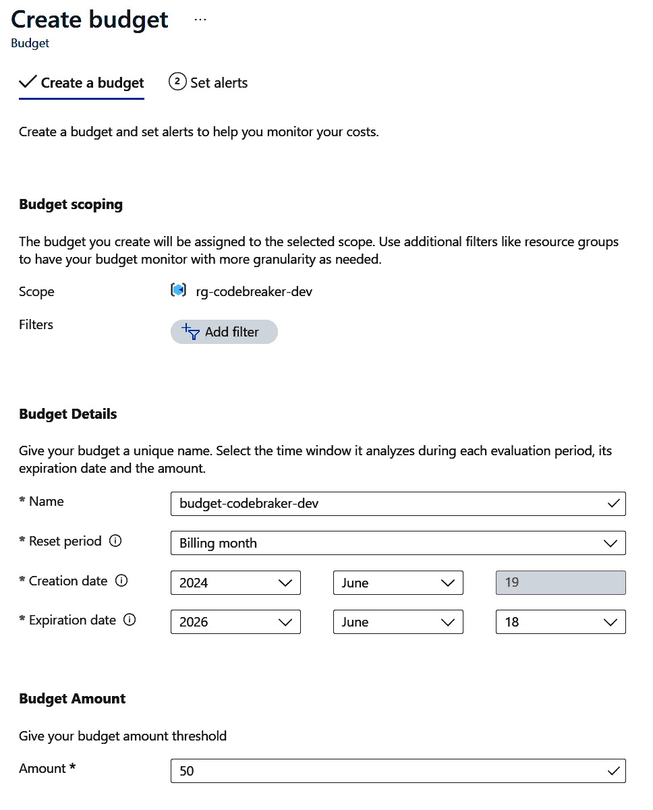

图 6.1 – 指定预算

要获取有关服务的价格信息，请访问 [`azure.microsoft.com`](https://azure.microsoft.com)，您可以选择**Azure 价格**，搜索产品，或从类别中选择产品以获取不同提供物的详细信息。您还将看到定价计算器，您可以在其中选择多个产品，并根据所做的选择获取完整的价格信息。

## 命名约定以及更多

在 Azure 中创建资源时，我们应该考虑一些重要的基础，以便根据 IT 和业务组织的需求轻松找到资源。哪些资源用于生产，哪些用于测试环境？公司中不同的组织使用哪些资源？哪些资源由一个产品使用？哪些资源可能受到技术问题的影响？对于所有这些场景，这些功能都有帮助：

+   每个资源都需要放入一个`codebreaker`解决方案中，将为测试和生产环境创建资源组。

+   还应该能够在资源组中轻松找到多个资源。**资源标签**可以在这里使用。

+   定义一个命名资源的约定。资源的数量会随着时间的推移而增长！您可能需要创建多个实例进行扩展，在不同地区运行相同的服务以获得更好的延迟，在不同环境中运行服务……有许多原因导致资源数量增加。为了应对这种情况，从一开始就使用一个好的命名策略可以大有帮助！

使用 `codebreaker` 应用程序，我们可以为开发、测试和生产环境使用 `rg-codebreaker-dev`、`rg-codebreaker-test` 和 `rg-codebreaker-prod` 资源组。

注意

除了使用不同的资源组来分隔环境外，将开发和生产环境分开到不同的订阅中也是一个好的做法。因为有一个 Azure 订阅，在 Visual Studio 订阅中提供了一些免费额度，这个订阅可以与开发环境一起使用。

一些资源被跨多个资源组使用。例如，你可能使用一个中央 Azure DNS 资源。你也可能在不同应用程序之间共享资源。你可以共享一个托管许多小型网站的 Azure 应用服务。对于每个 Azure 资源，你都可以添加自定义标签，并使用不同的标签及其值来搜索资源。例如，你可以指定一个名为 `cc`（代表成本中心）的标签，其值指定了成本中心。

为了定义资源的命名规范，Microsoft 不仅有一份指南（可在 [`learn.microsoft.com/azure/cloud-adoption-framework/ready/azure-best-practices/resource-naming`](https://learn.microsoft.com/azure/cloud-adoption-framework/ready/azure-best-practices/resource-naming) 查找），还提供了一个可用的 Excel 模板（可在 https://raw.githubusercontent.com/microsoft/CloudAdoptionFramework/master/ready/naming-and-tagging-conventions-tracking-template.xlsx 查找），甚至还有一个可以托管在本地（或云端）的 Blazor 应用程序，供管理员使用简单的用户界面来管理命名规范：https://github.com/mspnp/AzureNamingTool。

可以作为资源名称一部分的组件包括以下内容：

+   资源类型。Microsoft 提供了一组建议的缩写；例如，`rg` 代表资源组，`cosmos` 代表 Azure Cosmos DB 数据库，`cr` 代表 ACR，`ca` 代表容器应用，以及 `cae` 代表容器应用环境。

+   项目、应用程序或服务名称。我们将使用 `codebreaker` 作为应用程序名称。

+   资源使用的环境；例如，`prod` 代表生产，`dev` 代表开发，`test` 代表测试。

+   Azure 资源的位置；例如，`eastus2` 代表第二个东 US 区域，而 `westeu` 代表西欧。在多个区域创建资源对于故障转移场景、为全球客户提供更好的性能以及遵守数据法规都很有用。

现在，我们已准备好创建 Azure 资源。

# 创建 Azure 资源

使用 Microsoft Azure，有不同方式来创建和管理 Azure 资源。Azure 资源可以通过 REST API 访问。您可以发送`GET`请求来读取有关资源的信息，发送`POST`请求来创建新资源，但当然，还有更简单的方法来做这件事。Azure 门户([`portal.azure.com`](https://portal.azure.com))是学习并查看您拥有的不同选项的好方法。要自动创建 Azure 资源，您可以使用 Azure CLI、PowerShell 脚本以及许多其他选项。在本书中，我们将使用 Azure 门户、Bicep 脚本、.NET Aspire 和`azd`。Bicep 脚本提供了来自 Microsoft 的简单语法，可以轻松地重新创建 Azure 资源。.NET Aspire 允许使用.NET 代码定义 Azure 资源并直接创建资源。

在公司环境中，有不同方式创建 Azure 资源以及团队的组织方式。.NET Aspire 与`azd`一起提供了创建 Azure 资源的强大功能，但这可能（目前可能）不适合您的环境。您也可以选择使用适合您公司环境的.NET Aspire 的部分，或者使用.NET Aspire 和`azd`提供的一切。第二个选项是最简单的。为了更好地理解选项，并让您将其映射到您的环境中，我们将开始使用 Azure CLI 和 Azure 门户。这样，您可以轻松地看到资源提供的配置选项。在本章的后面部分，我们将使用.NET Aspire 和`azd`。使用.NET 代码指定 Azure 资源只需要几条语句就可以创建解决方案所需的所有资源。

我们创建了哪些资源？在本节中，我们将执行以下操作：

1.  创建一个资源组，将所有 Azure 资源组合在一起。

1.  创建一个 Azure Cosmos DB 数据库，该数据库被添加到之前创建的资源组中，并用于我们在*第三章*中创建的 EF Core 上下文。

1.  创建一个 Azure 容器注册库来发布我们在*第五章*中创建的 Docker 镜像。

1.  创建两个 Azure 容器应用来运行`gamesAPI`服务和机器人服务。

## 创建资源组

资源组用于一起管理 Azure 资源。使用资源组，您可以指定允许谁在资源组内创建或管理资源的权限。从价格的角度来看，您可以轻松地看到整个资源组的成本以及该资源组中的哪些资源导致了哪些成本。您还可以删除资源组，这将删除组内的所有资源。

要创建资源组，让我们使用 Azure CLI。

要登录 Azure，请使用以下命令：

```cs
az login
```

此命令将打开默认浏览器以验证用户身份。

如果您有多个 Azure 订阅，您可以使用`az account list`来检查这些订阅。当前创建资源的活动订阅通过`az` `account show`显示。

要创建资源组，请使用 `az` `group` 命令：

```cs
az group create -l westeurope -n rg-codebreaker-test
```

`create` 子命令创建资源组。使用 `-l`，我们指定此 Azure 资源的位置。在这里，我使用 `westeurope` 因为这个区域靠近我的位置。使用 `-n` 值，设置资源组的名称。

资源组的地理位置与资源组内资源的地理位置无关。资源组内的资源可以位于其他区域。资源组只是元数据。资源组的地理位置指定了资源组的主要位置。在位置不可用的情况下，你无法更改资源组。

要获取你的订阅可用的区域，你可以使用 `az account list-locations -o table`。

资源组创建后，我们可以在该资源组内创建资源。

## 创建 Azure Cosmos DB 账户

在 *第三章* 中，我们使用了 Azure Cosmos DB 模拟器来存储游戏和移动。现在，让我们将其更改为 Azure 云中的真实数据库。首先，我们将使用 Azure 门户来创建 Azure Cosmos DB 账户。

在 Azure 门户中，通过点击 `Azure Cosmos DB`。当你点击 Azure Cosmos DB 资源上的 **创建** 时，这并不会立即创建资源。相反，你需要在之前进行一些配置。

使用 Azure Cosmos DB 资源时，你首先需要选择可用的 API 之一。请参阅 *第三章* 了解可用的不同 API 以及它们提供的功能。现在，选择 **Azure Cosmos DB for NoSQL**，然后点击 **创建** 按钮。这将打开配置，如图 *图 6.2* 所示：

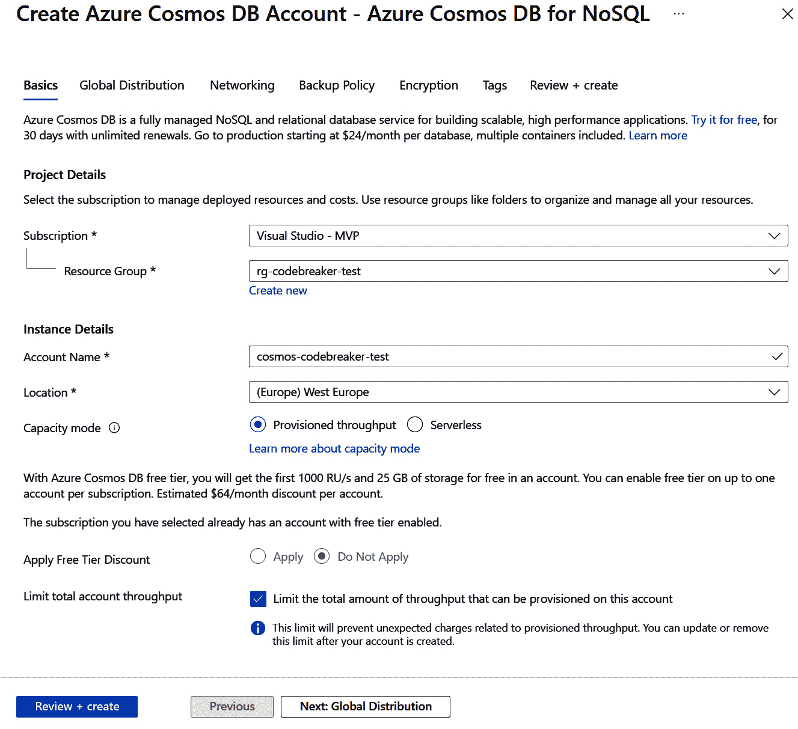

图 6.2 – 创建 Azure Cosmos DB 账户

在你可以点击 `cosmos-codebreaker-test` 进行测试环境之前，你有一些配置页面，但请注意此名称需要是全球唯一的），以及容量。Azure Cosmos DB 为订阅提供了一级免费层。如果你还没有使用过你的订阅，你可以选择此选项。这为你提供了每秒 1,000 个 **请求单位**（**RU/s**）和 25 GB 的存储空间。使用预配吞吐量，你可以通过数据库或数据库容器定义 RU/s 的限制，至少 400 RU/s。无服务器选项从更高的最小限制开始，但会自动扩展到所需的 RU/s。使用无服务器时，你需要注意一些限制。使用无服务器时，最大数据库容器大小为 1 TB；预配配置没有限制。无服务器也不支持地理分布，这在预配设置中是可用的。

注意

创建 Azure Cosmos DB 账户会注册一个 DNS 名称，因此该名称需要是全球唯一的。对于您的账户，您可以在账户名称后添加一个数字，并通过点击 **审查 + 创建** 来检查您选择的名字是否可用。

在下一个配置中，您可以配置数据库的全局分布、网络、自动创建备份的策略、使用服务管理密钥或客户管理密钥的加密，以及标签（每个资源都可用）。您可以使用除基本配置之外的所有设置的默认值。点击 **审查 + 创建** 按钮，进行最终检查，然后点击最终的 **创建** 按钮。现在，您只需等待几分钟，直到数据库账户创建完成。

使用 Azure CLI，您可以使用 `az cosmosdb create` 命令。

数据库账户已创建！接下来，我们将创建 Azure 容器注册库。

注意

在 *第三章* 中，我们不仅创建了一个用于写入 Azure Cosmos DB 的库，还用于 SQL Server。使用 Microsoft Azure，您还可以配置 Azure SQL 数据库。只需注意开发环境中的低成本；选择 **数据库事务单元**（**DTU**）层而不是 vCore 层。有 5 个基本 DTU，每月只需低于 5 美元（在撰写本文时），对于 2 GB 存储空间（与分配有 2 个 vCore 的虚拟机相比，400 美元）。

## 创建 Azure 容器注册库

在上一章中，我们创建了 Docker 镜像并在本地使用它们。您可以将 Docker 镜像发布到 Docker Hub 或任何容器注册库。ACR 为 Docker 镜像提供了一个注册库，它与 Microsoft Azure 集成得很好。

在创建 ACR 实例时，有三个不同的层可供选择：

+   `codebreaker` 应用程序，基本层（SKU）适合此用途，并且比其他选项便宜得多。您只需注意限制即可。

+   **标准版**：标准层提供更多存储空间（基本层限制为 10 GB 存储）和镜像吞吐量。

+   **高级版**：高级版添加了一些功能，例如地理复制可以在不同地区复制镜像和私有访问点。

*图 6**.3* 展示了如何通过门户创建 ACR 实例。在搜索框中点击 `容器注册库`。选择 **仅 Azure 服务**复选框不会显示许多第三方产品：

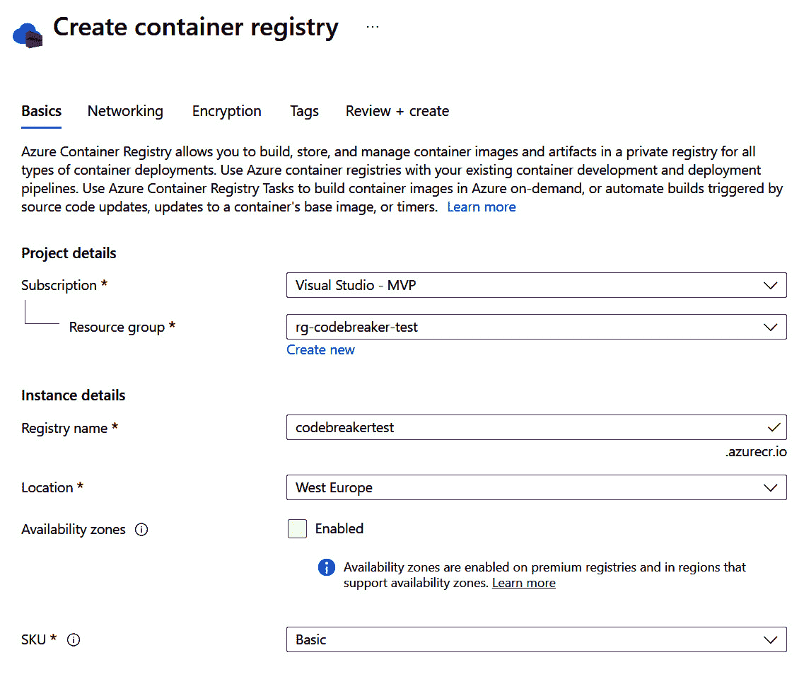

图 6.3 – 创建容器注册库

在配置中，我们只需要资源组的名称、注册库的名称、位置和 SKU。可用区域，其中图像存储在同一地区的不同数据中心，仅在 Premium 层中可用。其他更改网络和加密的配置也需要 Premium 层。

在填写此表格后，在点击 **Review + create** 之前，您仍然可以验证所有选项，然后再点击 **Create** 来创建资源。

注意

注册表的名称是一个全局可用的 DNS 名称（带有 `azurecr.io` 扩展），因此需要是唯一的。选择您自己的名称，只要创建资源时使用的是可用的名称，资源就可以成功创建。

现在我们有一个数据库和一个用于运行容器镜像的注册表。在创建了第一个资源之后，我们只需要一个计算服务来运行 Docker 镜像，就可以在云端运行应用程序。我们将使用 Azure 容器应用。

## 创建 Azure 容器应用环境

Microsoft Azure 提供了多种计算服务来运行 Docker 容器。您可以将 Docker 镜像发布到**Azure 应用服务**，并使用 Windows 或 Linux 服务器来运行您的 API。另一个选项是使用**Azure 容器实例**（**ACI**），它允许您托管一组 Docker 容器，包括一个前端容器（API 服务）和多个后端容器。虽然 Azure 应用服务提供自动扩展功能，可以根据规则创建多个实例，但此功能在 ACI 中不可用。ACI 在快速启动方面很出色——您只需启动一个虚拟机，只需上传较小的 Docker 镜像，但它不提供编排和扩展功能。

对于 Docker 容器的全面编排和扩展，Azure 提供 `kubectl`。为了简化 Kubernetes 的复杂性，定义一个入口控制器只需更改一些设置；**Azure 容器应用**实例即可使用。此服务在幕后使用 Kubernetes，但去除了许多复杂性。

让我们开始创建 Azure 容器应用。

### 创建日志分析工作区

在创建 Azure 容器应用时，为日志记录留出空间是一个好主意。在 Azure 容器应用的先前版本中，有一个要求必须有一个**日志分析工作区**。这不再是要求，因为您还可以使用 Azure Monitor 将日志记录到 Azure 存储帐户、Azure 事件中心或第三方监控解决方案。Azure Monitor 还可以配置为将日志路由到日志分析。

日志分析工作区是用于分析数据和指标的日志数据存储单元。在 *第十章* *日志记录* 中，我们将深入了解微服务的日志记录和指标，并利用日志分析、Azure Monitor 和 Application Insights 获取有关运行服务的详细信息。

要创建日志分析工作区，我们将使用 Azure CLI：

```cs
az monitor log-analytics workspace create -g rg-codebreaker-test -n logs-codebreaker-test-westeu
```

日志分析属于 Azure Monitor，因此使用 `az monitor log-analytics` 命令来创建和管理日志分析。使用 `workspace create` 子命令创建一个日志分析工作区。此命令需要资源组和工作区的名称。如果命令中没有提供位置，则工作区将使用与资源组相同的地理位置。

### 创建容器应用环境

创建容器应用环境在幕后使用一个 Kubernetes 集群。您可以创建此环境来自动创建日志分析工作区。使用现有的工作区（我们在上一步中创建了一个），我们需要客户 ID 和工作区的密钥。使用以下命令获取客户 ID：

```cs
az monitor log-analytics workspace show -g rg-codebreaker-test -n logs-codebreaker-test-westeu --query customerId
```

如果不提供 `--query customerId`，您将获得关于工作区的更完整信息，包括 `customerId` 值。使用 `--query` 命令，我们可以通过查询提供 `customerId`，仅返回此 id 的唯一标识符（一个 GUID）。将此 GUID 以及下一个命令中的密钥一起复制，因为我们创建环境时需要这些值。

此命令返回连接到日志工作区的密钥：

```cs
az monitor log-analytics workspace get-shared-keys -g rg-codebreaker-test -n logs-codebreaker-test-westeu
```

输出返回主密钥和辅助密钥。复制主密钥。

使用客户 ID 以及日志分析工作区的密钥，我们可以创建一个容器应用环境：

```cs
az containerapp env create -g rg-codebreaker-test -n cae-codebreaker-test-westeu --logs-workspace-id <customer-id> --logs-workspace-key <logs-key> --location westeurope
```

要创建环境，您需要指定资源组、环境名称、连接日志分析的信息以及新创建资源的位置。如果未提供位置，则此命令不使用资源组的位置。请注意，此命令可能需要几分钟。但想想您手动创建 Kubernetes 集群需要多少分钟。

### 创建一个 hello 容器应用

在创建环境后，让我们在这个环境中创建我们的第一个应用：

```cs
az containerapp create -n ca-hello-westeu -g rg-codebreaker-test --environment cae-codebreaker-test-westeu --image mcr.microsoft.com/azuredocs/containerapps-helloworld:latest --ingress external --target-port 80 --min-replicas 0 --max-replicas 2 --cpu 0.5 --memory 1.0Gi
```

使用 `create` 命令创建一个新的应用。此应用的名称由 `-n` 参数指定。环境由资源组（`-g`）和 `--environment` 参数指定。`--image` 参数引用的镜像是从 Microsoft 提供的示例 Docker 镜像，它托管了一个带有静态页面的 Web 服务器。要访问容器内运行在 80 端口的 Web 服务器，需要配置 Ingress 服务，使用 `--ingress` 和 `--target-port` 参数。使用 `--min-replicas` 和 `--max-replicas` 参数定义扩展，从 0 扩展到 2 个实例。在有 0 个实例的情况下，第一个访问服务的用户需要等待容器启动。根据提供的配置，应用程序扩展到 2 个运行中的容器。一个容器分配了 0.5 个 CPU 和 1.0 GiB 内存。

注意

*第九章* 到 *第十一章* 将为您提供有关服务扩展的信息。在 *第九章* 中，您将创建负载测试以对服务进行压力测试，在 *第十章* 中，我们将使用这些负载测试来监控指标信息，而在 *第十一章* 中，我们将利用前两章学到的信息来配置扩展。

当应用创建完成后，会显示应用服务的链接。您也可以使用此命令获取 URL：

```cs
az containerapp show -n ca-hello-westeu -g rg-codebreaker-test --query properties.configuration.ingress.fqdn
```

`containerapp show` 命令显示 Azure 容器应用的属性。使用 `properties.configuration.ingress.fqdn` JMESPath 查询返回的 `https://` 实例显示了正在运行的应用程序（见 *图 6**.4*）：

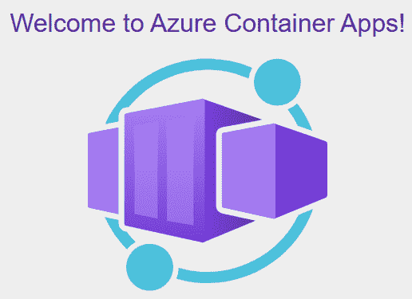

图 6.4 – 访问 hello Azure 容器应用

现在，使用 Azure 门户打开 `rg-codebreaker-test` 资源组，我们可以看到 Azure Cosmos DB、ACR、Azure 容器应用环境、日志分析工作区和容器应用，如图 *图 6**.5* 所示。只需检查 **资源组** 视图左侧的类别选项。**概览** 视图显示了资源，如这里所示。点击 **访问控制**，您可以配置谁可以访问此组中的资源。**活动日志** 显示了在此组内创建、更新和删除资源的人员。**资源可视化器** 提供了资源及其相互关系的图形视图。**成本管理** 类别也可能很有兴趣。

您可能需要等待一天才能看到每个资源的详细成本。使用我们使用的层级，成本将在几分钱之内。但您也可以点击 **推荐** 来查看在生产环境中应该更改和配置的内容。其中一些推荐需要不同的层级，您需要检查成本变化。如果您的公司已经经历过黑客攻击公司网站的情况，那么与黑客攻击的成本相比，使用 Microsoft Azure 启用安全功能的成本非常低：

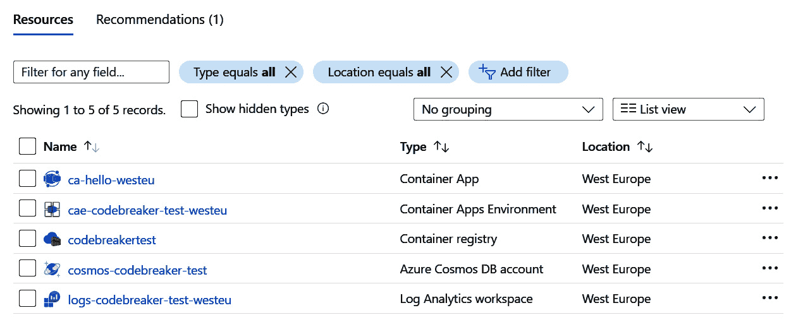

图 6.5 – 包含 Azure 资源的资源组

现在，随着 Azure 资源创建完成，让我们将 `codebreaker` 服务发布到 Microsoft Azure。

让我们从在 Azure Cosmos DB 帐户内创建 Azure Cosmos 数据库开始。

# 创建 Azure Cosmos 数据库

从 Azure 门户，您可以打开 Azure Cosmos DB 帐户的页面，打开 **数据探索器**，然后从那里点击 **新建数据库** 来创建新数据库，以及点击 **新建容器** 在数据库中创建容器。这里，我们将使用 Azure CLI：

```cs
az cosmosdb sql database create --account-name <your cosmos account name> -n codebreaker -g rg-codebreaker-test --throughput 400
```

此命令在现有帐户中创建一个名为 `codebreaker` 的数据库。使用此命令设置吞吐量选项定义了数据库的规模。在此，此数据库中的所有容器共享 400 RU/s 的吞吐量。400 是可以设置的最小值。在创建数据库时，除了提供此值外，还可以通过每个容器配置扩展。如果某些容器不应从其他容器中获取扩展，则可以针对每个容器配置 RU/s – 但在此，每个容器使用的最小值也是 400。

创建数据库后，让我们创建一个容器：

```cs
az cosmosdb sql container create -g rg-codebreaker-test -a <your cosmos account name> -d codebreaker -n GamesV3, --partition-key-path "/PartitionKey"
```

`gamesAPI` 服务的实现使用了一个名为 `GamesV3` 的容器。该容器是在之前创建的数据库中创建的，使用 `/PartitionKey` 分区键，正如在 *第三章* 中使用 EF Core 上下文所指定的。

在此命令完成后，检查 Azure 门户中的 **数据探索器**，如 *图 6*.6* 所示：

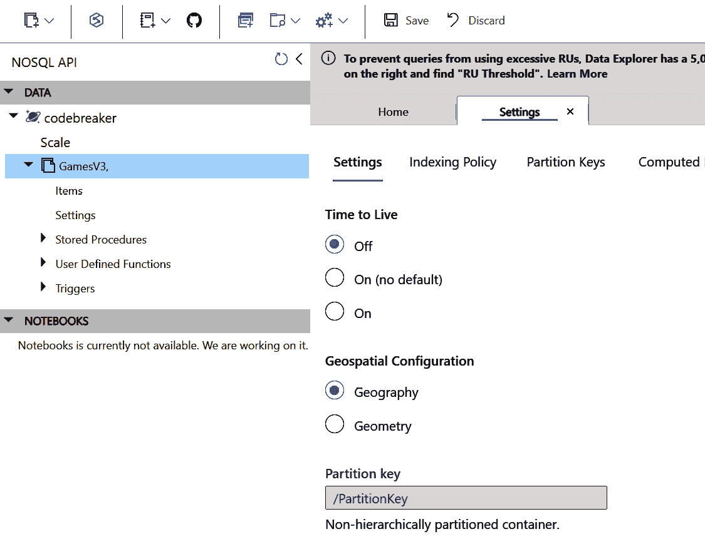

图 6.6 – 数据探索器

您可以看到数据库、容器，以及与容器一起配置的分区键。

## 配置 Azure Cosmos DB 的复制

Azure Cosmos DB 的一个出色功能是全球数据复制。在 Azure 门户中，在 **设置** 类别中，单击 **全局复制数据**。*图 6*.7* 显示了复制视图：

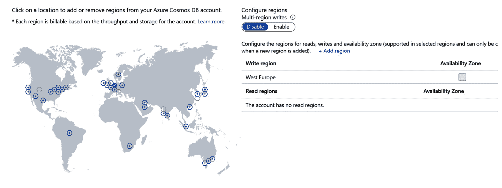

图 6.7 – 使用 Azure Cosmos DB 进行复制

您只需点击您的订阅中可用的 Azure 区域，即可在所选区域内复制数据。您还可以配置将其写入多个区域。

在全球范围内，对于 `codebreaker` 应用程序，用户可以在全球范围内玩游戏，为了提高美国、欧洲、亚洲和非洲用户的性能，可以配置写入多个区域。为此选项可用，不能配置自动扩展。为了在全球范围内实现最佳可伸缩性，我们还需要考虑分区键。通过为每个存储的游戏使用不同的分区键值，游戏可以存储在不同的分区中。

## 配置一致性

在 Azure Cosmos DB 的 Azure 门户中的 **设置** 类别中，我们可以配置默认的一致性级别。结果使用音符、读取和写入多个区域的方式显示，如 *图 6*.8* 所示：

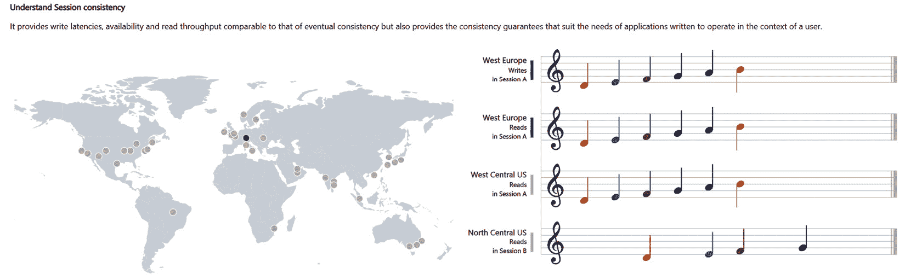

图 6.8 – 使用音符显示的结果

默认设置是 **会话一致性** – 数据在同一个会话中是一致的。使用此设置，写入延迟、可用性和读取吞吐量与 **最终一致性** 相当。使用 Azure Cosmos DB API，可以在应用程序中创建和分发会话。

如果配置了多个区域，则 **强一致性** 选项不可用。对于多个区域，可以配置 **有界过时性**，它指定了在数据一致复制之前的最大延迟时间和最大延迟操作数。

数据库现在已准备好使用，让我们将 Docker 镜像发布到注册表中！

# 将镜像推送到 ACR 实例

ACR 实例已准备就绪，我们在上一章中创建了 Docker 镜像 – 现在，让我们将镜像发布到这个注册表中。

在您使用 `az login` 登录到 Microsoft Azure 后，要登录到 ACR 实例，可以使用 `az acr login`。请确保使用您为 ACR 实例定义的名称：

```cs
az login
az acr login -n <the name of your azure container registry>
```

此命令需要安装并运行 Docker Desktop。

注意

使用 Azure CLI 引用 ACR 实例，只需要注册表的名称（例如 `codebreakertest`）。`docker` 和 `dotnet` 命令支持不同的注册表，因此使用这些命令时，需要完整的域名，例如 `codebreakertest.azurecr.io`。

接下来，让我们构建镜像。在上一章中，我们为游戏 API 创建了 Dockerfile。使用 Windows 终端，确保将当前目录设置为 `ch06` 文件夹，并在本地构建游戏镜像：

```cs
docker build -f Codebreaker.GameAPIs\Dockerfile . -t codebreaker/gamesapi:3.5.1
```

此命令——就像上一章中一样——在本地构建 Docker 镜像，引用 Dockerfile，设置 `docker build` 的上下文，并设置标记。

要将镜像发布到 ACR，我们需要对本地镜像进行标记：

```cs
docker tag codebreaker/gamesapi:3.5.1 <full DNS name of your ACR>/codebreaker/gamesapi:3.5.1
docker tag codebreaker/gamesapi:3.5.1 <full DNS name of your ACR>/codebreaker/gamesapi:latest
```

镜像被标记为指向 ACR 实例的链接。相同的镜像还标记了版本号以及 `latest` 标签。`latest` 标签是一种约定，其中存储最新版本，并且总是覆盖存储库中的版本。

接下来，使用 `docker push` 将镜像推送到注册表：

```cs
docker push <full DNS name of your ACR>/codebreaker/gamesapi:3.5.1
docker push <full DNS name of your ACR>/codebreaker/gamesapi:latest
```

确保您已经登录到 ACR 实例；否则，推送将失败。

成功推送后，您可以在 Azure 门户的 **存储库** 菜单中看到镜像，如图 *图 6.9* 所示：

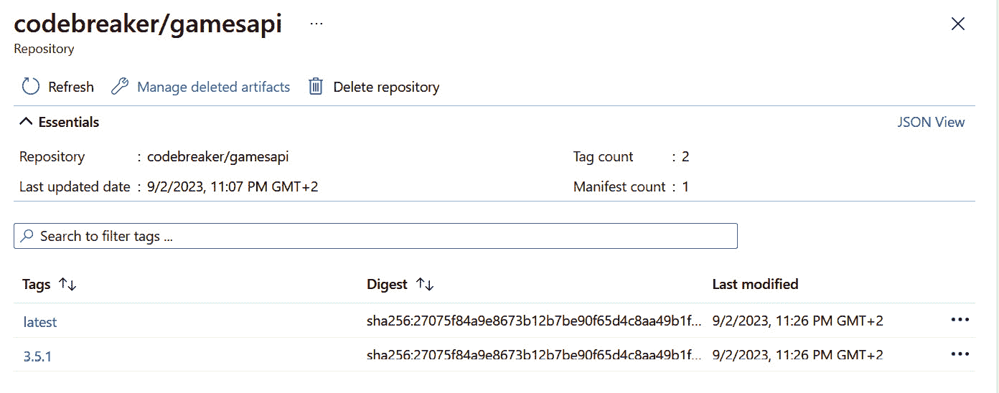

图 6.9 – ACR 中的存储库

在上一章中，我们没有为机器人服务创建 Dockerfile，而是使用了 dotnet CLI。使用 `dotnet publish`，我们只需将此 `PropertyGroup` 实例添加到项目文件中：

Codebreaker.Bot/Codebreaker.Bot.csproj 项目文件

```cs
<PropertyGroup>
<ContainerRegistry>add your registry
  </ContainerRegistry>
  <ContainerRepository>codebreaker/bot
  </ContainerRepository>
  <ContainerImageTags>3.5.3;latest</ContainerImageTags>
</PropertyGroup>
```

`dotnet publish` 命令使用 `ContainerRegistry`、`ContainerRepository` 和 `ContainerImageTags` 元素来创建镜像并将其发布到注册表。请注意使用 `ContainerRegistry` 元素配置您自己的注册表。

对于当前目录需要做的所有事情就是设置机器人的项目文件目录并运行 `dotnet publish`：

```cs
cd Codebreaker.Bot
dotnet publish --os linux --arch x64 /t:PublishContainer -c Release
```

此命令构建镜像并将其直接发布到注册表，如 `ContainerRegistry` 元素中指定。只需确保输入您的注册表链接，并使用 `docker login` 登录。

随着镜像准备就绪，让我们继续使用 Azure 容器应用来使用它们！

# 创建 Azure 容器应用

让我们创建一个使用 Azure 容器应用运行的 `gamesAPI` 服务。这个服务需要一个包含对 Azure Cosmos 数据库的密钥的配置。

在 Azure 门户中，使用 Azure Cosmos 数据库，转到 **设置** 类别并打开 **密钥**。从该页面复制主连接字符串或辅助连接字符串。

使用这些密钥时，定期重新生成它们是有用的——这就是为什么有配对的原因。当你使用应用的主密钥时，重新生成辅助密钥。重新生成后，在应用内部使用辅助密钥，并重新生成主密钥。这样，你就有时间配置所有应用的新密钥。

当为游戏 API 创建 Azure 容器应用时，有许多值需要配置。虽然你可以将所有配置值传递给`az containerapp create`命令，但让我们从 Azure 门户开始创建。打开 Azure 容器应用环境资源，点击**应用**，创建一个新的应用。*图 6**.10*显示了基本设置：

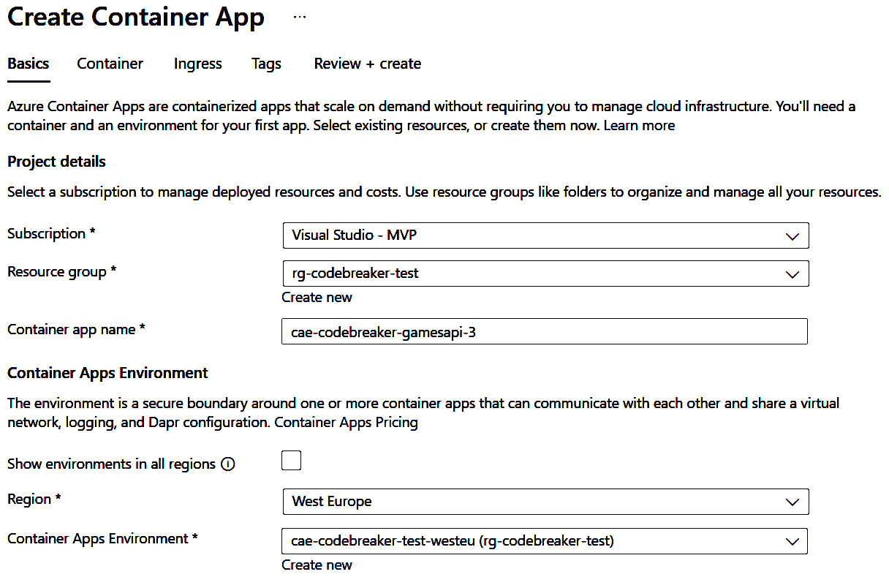

图 6.10 – Azure 容器应用的基本设置

在基本设置中，需要配置以下值：

+   资源订阅。

+   资源组（`rg-codebreaker-test`）。

+   容器应用的名称。我们使用`cae-codebreaker-gamesapi-3`。后缀 3 表示该 API 的版本 3。你可以并行运行此应用的多个版本。

+   区域——选择最适合您位置的区域。

+   容器应用环境。选择之前创建的环境。

容器应用的配置屏幕如图 6**.11**所示：

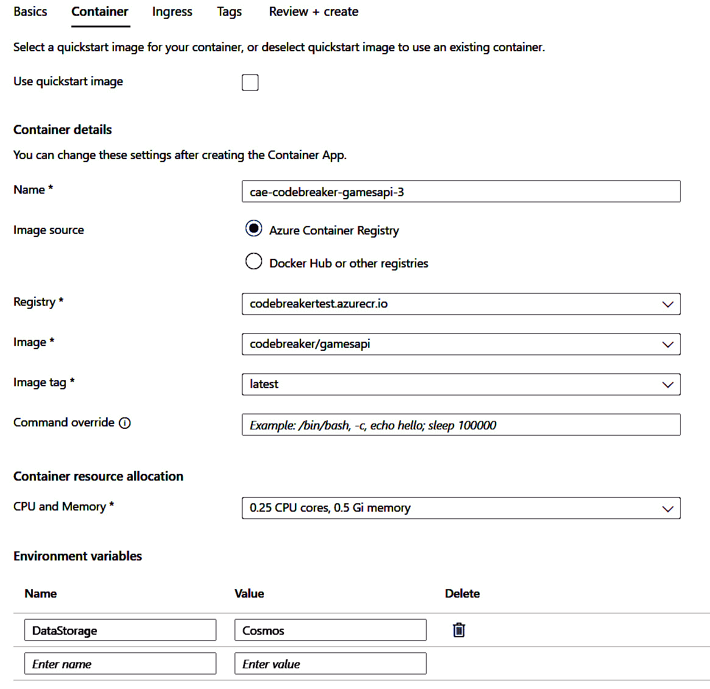

图 6.11 – Azure 容器应用的容器设置

在这里，我们通过选择 ACR 实例和镜像名称和标签来选择将要发布的镜像，为单个运行实例分配的 CPU 和内存资源，以及环境变量。将`DataStorage`环境变量设置为`Cosmos`将覆盖`appsettings.json`文件中定义的值。

*图 6**.12*显示了**入口**配置：

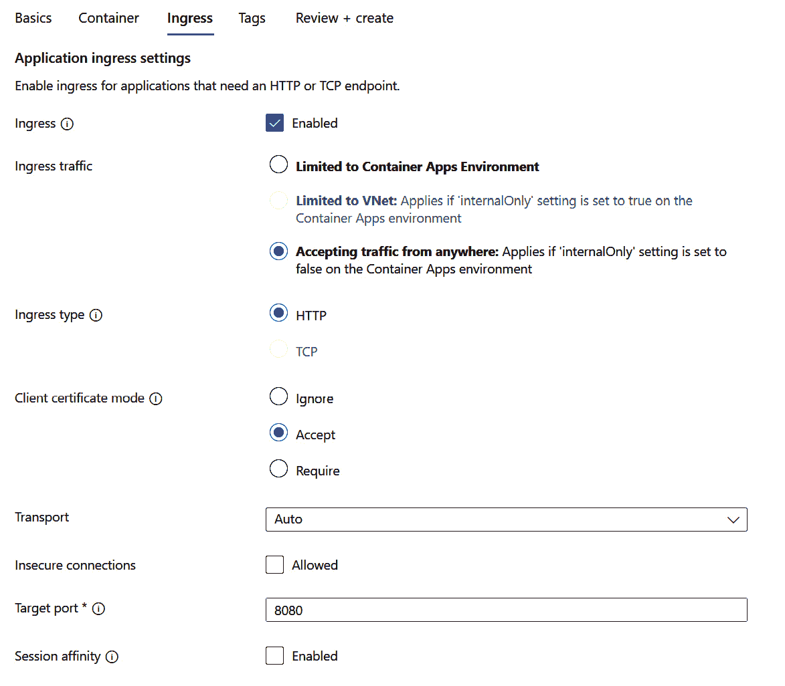

图 6.12 – Azure 容器应用的入口设置

我们需要启用由.NET 8 镜像定义的`8080`。

点击**创建**将根据 ACR 实例获取镜像来创建 Azure 容器应用。请注意，启动应用将失败，因为连接到 Cosmos 数据库的连接字符串仍然需要配置。我们将在创建机器人服务应用后进行此操作。

要创建机器人服务的应用，请在 Azure 门户中打开新创建的容器应用，并从**概览**视图复制*应用 URL*。此 URL 用于配置机器人。

当为机器人服务创建应用时，你可以像配置游戏 API 一样进行配置。创建一个名为`ApiBase`的环境变量，其值为游戏 API 的应用 URL。

我们仍然需要添加一些配置值，我们将在下一步进行。

## 配置密钥和环境变量

在创建应用时，无法直接通过门户定义应用密钥。这可以通过 `az containerapp` `create` 命令直接完成。

使用门户，可以在之后配置密钥。当在 Azure 门户中打开容器应用时，在 `cosmosconnectionstring`，如图 *图 6.13* 所示，并将从 Azure Cosmos DB 复制的连接字符串复制到值：

注意

*图 6.13* 中的截图显示了另一个可以存储密钥的选项：密钥保管库引用。在 *第七章* 中，我们将讨论使用其他选项来使用配置，这些选项包括 **Azure** **密钥保管库**。

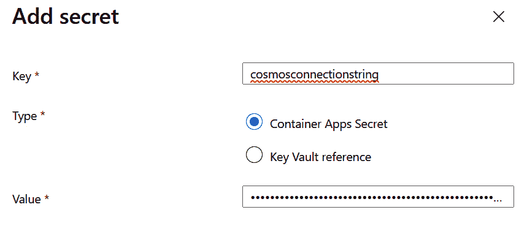

图 6.13 – 使用 Azure 容器应用的密钥配置

要创建一个引用密钥的环境变量，我们可以使用 Azure CLI：

```cs
az containerapp update -n cae-codebreaker-gamesapi-3 -g rg-codebreaker-test --set-env-vars ConnectionStrings__GamesCosmosConnection=secretref:cosmosconnectionstring
```

使用 `az containerapp update` 命令时，我们需要引用容器应用和资源组，并使用 `--set-env-vars` 设置环境变量。与通过命令行传递具有 `:` 作为分隔符的分层配置值不同，例如 `ConnectionStrings:GamesCosmosConnection`，使用环境变量时不能使用 `:`。相反，在这里，`__` 用于映射值。用于连接到 Azure Cosmos DB 实例的键是 `ConnectionStrings__GamesCosmosConnection`。这个值的存储在密钥中。密钥通过 `secretref` 后跟密钥来引用。

应用现在应该正在运行，但让我们确保配置了缩放。

## 使用 Azure 容器应用配置缩放

Azure 容器应用默认配置的缩放范围是从 0 到 10。如果没有应用负载，它会缩放到 0，此时 CPU 和内存成本降低到零。然而，缩放到 0 也意味着第一个访问服务的用户需要等待几秒钟，服务才能返回结果。对于在后台运行且在第一次调用后不需要用户交互的机器人服务，这可能是足够的。对于从消息或事件触发的应用作业，这也行得通。然而，对于 `gamesAPI` 服务，对于第一个访问服务的用户，它应该能够快速响应。

将最小缩放设置为 1，如果没有负载，CPU 的价格会降低。在空闲定价中，内存没有价格差异，但与运行中的服务相比，CPU 的成本大约是 10%。

让我们配置`gamesAPI`服务从 1 个副本扩展到 3 个副本，以及机器人服务从 0 个副本扩展到 3 个副本。在 Azure 门户中，选择容器应用，**应用程序**类别，以及**扩展和副本**菜单。点击**编辑和部署**菜单，选择**扩展**，根据应用程序更改副本数量为 1 到 3 和 0 到 3。如果 UI 元素不易移动以相应地更改值，你可以使用箭头键逐个更改值。在撰写本文时，最大扩展计数（最大）为 300。

点击**创建**会重新部署并创建应用程序的新版本。默认情况下，一次只有一个版本是激活的。一旦新版本成功启动，负载均衡器会将 100%的流量转移到新版本。通过**应用程序** | **版本**菜单，你可以看到激活和未激活的版本。在那里，你也可以配置版本模式。默认版本模式是**单版本**，其中只有一个版本是激活的。你可以将其更改为**多版本**，其中多个版本同时运行，你可以配置要将多少百分比的流量分配给哪个版本。这可以用于测试在用户负载下运行的不同版本。

在此设置完成后，让我们尝试运行应用程序。你可以打开机器人的 Swagger 页面，让机器人玩一些游戏。你也可以使用你在 *第四章* 中创建的客户端，配置 Container App 游戏 API 的 URL，并玩游戏。检查 Cosmos DB 的**数据探索器**部分以查看存储的游戏。

如你现在所知，所有最初使用的 Azure 服务，你可以在下一节中轻松删除 Azure 资源并重新创建它们。

# 使用.NET Aspire 和 azd 创建 Azure 资源

在这里，我们将探讨如何轻松地从开发系统创建 Azure 资源。首先，我们使用一些来自 Azure 云的资源，而大多数项目在发布完整解决方案到 Azure 之前都在开发系统上本地运行。

## 在调试时配置 Azure 资源

当创建 API 服务和使用数据库时，在本地调试应用程序时，你可能不需要任何 Azure 资源。API 可以在本地运行；甚至构建 Docker 镜像也不是必需的。要运行数据库，可以使用 Docker 镜像，正如你在 *第五章* 中所见。然而，对于你可能也在开发过程中使用的某些 Azure 资源，创建和连接 Azure 资源是必需的。一个例子是 Azure Application Insights（在第 *第八章* 中有详细说明）。

要在`AppHost`项目中使用应用程序映射的 Azure 资源，您需要添加`A``spire.Hosting.Azure.*`包。要使用 Azure 资源来定义应用程序模型，有如`Aspire.Hosting.Azure`和`Aspire.Hosting.Azure.cosmosDB`之类的包可用。

当使用应用程序模型指定 Azure 资源时，Azure 资源的配置会自动发生：

Codebreaker.AppHost/Program.cs

```cs
var builder = DistributedApplication.CreateBuilder(args);
string dataStore = builder.Configuration["DataStore"] ?? "InMemory";
var cosmos = builder.AddAzureCosmosDB("codebreakercosmos")
 .AddDatabase("codebreaker");
// code removed for brevity
```

`AddAzureProvisioning`方法在应用程序启动时创建 Azure 资源或检索连接字符串。在成功运行之前，您需要指定您的订阅 ID 和资源创建的位置：

```cs
{
  "Azure": {
    "SubscriptionId": "your subscription id",
    "Location": "westeurope",
    "CredentialSource":"AzureCli"
  }
}
```

此信息不应成为源代码存储库的一部分，因此将其添加到用户密钥中。需要在`Azure`类别中指定`SubscriptionId`和`Location`键。添加`*CredentialSource*`是可选的。用于创建资源的用户是通过 DefaultAzureCredential 选择的（有关详细信息，请参阅*第七章*）。如果在此环境中不起作用，您可以配置 AzureCli，它使用您通过 Azure CLI 登录的账户。

要获取订阅 ID，您可以使用以下命令：

```cs
az account show -–query id
```

您需要登录到您的订阅，不仅是为了查看订阅 ID，还可以自动部署资源。运行应用程序后，您可以看到已部署的资源已写入用户密钥中。

此应用程序模型定义了使用模拟器之外的方式配置和使用 Azure Cosmos DB 数据库：

Codebreaker.AppHost/Program.cs

```cs
var builder = DistributedApplication.CreateBuilder(args);
string dataStore = builder.Configuration["DataStore"] ?? "InMemory";
var cosmos = builder.AddAzureCosmosDB("codebreakercosmos")
  .AddDatabase("codebreaker");
var gameAPIs = builder.AddProject<Projects.Codebreaker_GameAPIs>("gameapis")
.WithExternalHttpEndpoints()
  .WithReference(cosmos)
  .WithEnvironment("DataStore", dataStore);
builder.AddProject<Projects.CodeBreaker_Bot>("bot")
.WithExternalHttpEndpoints()
  .WithReference(gameAPIs);
builder.AddProject<Projects.Codebreaker_CosmosCreate>("cosmoscreate")
  .WithReference(cosmos);
builder.Build().Run();
```

为了避免安装和运行本地 Azure Cosmos DB 模拟器，并解决在 Docker 镜像中使用 Azure Cosmos DB 时的一些问题，我们可以在云中使用 Azure Cosmos DB。不使用`RunAsEmulator`方法与`AddAzureCosmosDB`一起使用，我们使用在 Azure 中运行的资源。`AddDatabase`方法将`codebreaker`数据库添加到账户中。`Codebreaker.CosmosCreate`项目用于运行一次，调用 EF Core 上下文的`EnsureCreatedAsync`方法来创建一个具有分区键的容器。与`gamesAPI`服务和`CosmosCreate`项目一起使用的`WithReference`方法将这些新创建的 Azure Cosmos DB 连接字符串传递给这些资源。`WithExternalEndpoints`方法配置 Azure App Configuration 的 Ingress 控制器，使此服务外部可用。

*图 6.14*显示了运行应用程序的.NET Aspire 仪表板：

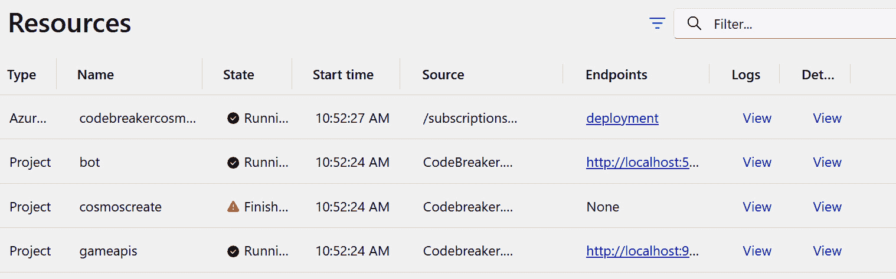

图 6.14 – 部署了 Azure 资源的.NET Aspire 仪表板

`codebreakercosmos` 资源显示了一个带有 `deployment` 链接文本的端点。这是一个部署到 Azure 的资源。点击此链接，你将直接导航到这个云资源，并可以检查数据库和容器名称是否已创建。`cosmoscreate` 引用处于 **完成** 状态，因此容器创建已完成。

现在让我们启动机器人并让它运行一些游戏，然后使用 Azure Cosmos DB 打开 **数据探索器**，你将看到创建的游戏。你只需添加一个 API 方法，就可以在本地调试解决方案的同时使用云中的一些资源。

这里创建的资源组使用名称 `rg-aspire-{yourhost}-codebreaker.apphost`。如果多个开发者使用相同的 Azure 订阅，资源将独立创建，以避免冲突。确保在不需要时删除资源。

接下来，让我们创建一个完整的解决方案，以便在 Azure 上运行。

## 使用 azd up 配置完整解决方案

为了做到这一点，我们使用 `azd`。首先，在解决方案的目录中，使用以下命令：

```cs
azd init
```

这初始化了一个用于与 `azd` 一起使用的应用程序。你可以使用模板创建一个新的解决方案或分析现有的应用程序。由于我们已经有了一个运行中的应用程序，选择 `使用当前目录中的代码` 来分析应用程序。由于 `azd` 也会启动编译，因此需要停止应用程序。在成功扫描后，`azd` 会通知使用 `bot` 和 `gamesAPI` 服务托管应用程序。然后，使用章节后缀定义一个环境（例如，`codebreaker-06`）。

发生了什么？此命令创建了一个 `.azure` 文件夹和 `azure.yaml` 以及 `next-steps.md` 文件。`next-steps.md` 提供了有关下一步可以做什么的信息。`azure.yaml` 是一个包含引用 `containerapp` 中运行的 `AppHost` 项目的信息的简短文件。最有趣生成的信息可以在 `.azure` 文件夹中找到。此文件夹被排除在源代码存储库之外，因为它可能包含机密信息。在这个文件夹中，你可以看到配置的环境，以及关于哪些服务应该是公开的配置信息。

要将完整解决方案发布到 Azure，只需使用以下命令：

```cs
azd up
```

在第一次运行时，你需要选择将资源部署到的 Azure 订阅和 Azure 区域的位置。接下来，只需等待几分钟，直到所有资源都已部署。

在配置阶段，这些资源被部署：

+   资源组

+   容器注册库

+   密钥保管库

+   日志分析工作区

+   容器应用环境

在配置阶段之后，部署阶段开始，这些操作包括：

+   将 Docker 镜像推送到 ACR 实例

+   在容器应用环境中使用 ACR 实例中的镜像创建容器应用

当你对源代码或配置进行任何更改时，你只需再次使用 `azd up` 来部署更新。由于创建的环境不再需要，请使用 `azd down` 再次删除所有资源。确保等待直到你被要求验证是否真的应该删除资源数量。

在 Azure 门户中检查资源组，你可以看到所有创建的资源，如图 *图 6**.15* 所示：

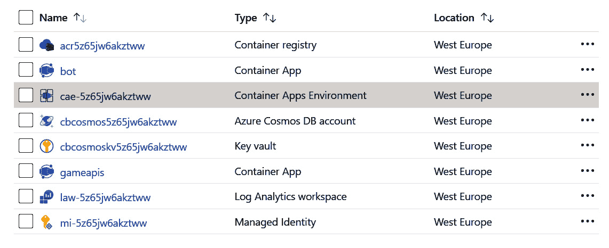

图 6.15 – 从 azd up 创建的资源

现在，你可以检查部署的资源、发布到容器注册表的镜像、发布到容器应用环境的应用程序、包含机密的密钥保管库以及包含数据库和配置容器的 Azure Cosmos DB 账户。让机器人玩游戏并验证一切是否正常运行。

接下来，让我们深入了解 `azd up` 发生了什么。

## 深入 azd up 阶段

运行 `AppHost` 项目时，可以通过命令行参数传递来创建一个描述所有资源的清单文件：

```cs
dotnet run --project Codebreaker.AppHost/Codebreaker.AppHost.csproj -- --publisher manifest --output-path aspire-manifest.json
```

当使用 `dotnet run` 时，可以通过使用 `--` 来区分 `dotnet run` 的参数，将命令行参数传递给应用程序。使用 `-–publisher manifest` 选项创建一个描述应用程序应用模型的 Aspire 清单。此清单指定所有资源，包括资源类型、绑定、环境变量和项目路径。这些信息由 `azd` 用于创建 Azure 资源，并且可以从其他工具中使用，例如，将解决方案部署到 Kubernetes。

接下来，使用 `azd provision`。如果你只想配置 Azure 资源而不推送 Docker 镜像和部署 Azure 容器应用，请使用以下命令：

```cs
azd provision
```

`azd provision` 使用清单文件在内存中创建 Bicep 文件，并创建 Azure 资源。

当任何 Azure 资源被添加到应用模型时，你可以使用此命令，然后仅创建这些资源。

下一步是以下：

```cs
azd deploy
```

`azd deploy` 使用 `dotnet publish` 将容器镜像推送到 ACR 实例，然后使用这些镜像创建或更新 Azure 资源。

`azd up` 在内存中创建 Bicep 脚本。也可以在磁盘上创建 Bicep 脚本以使用它们来创建 Azure 资源，就像我们接下来要做的那样。

## 使用 azd 创建 Bicep 文件

Bicep 是一种使用声明性语法的特定领域语言。在 Bicep 可用之前，我们创建 **Azure 资源管理器** (**ARM**) 模板来创建 Azure 资源。ARM 模板使用 JSON 定义。Bicep 比 ARM 模板更容易编写。在部署期间，Bicep 文件被转换为 ARM 模板。

这里，我们使用 `azd infra` 为解决方案创建 Bicep 文件。

注意

在撰写本文时，`azd infra` 处于早期阶段。请查看本章的 README 文件以获取更新。

从解决方案目录启动此命令：

```cs
azd infra synth
```

此命令创建一个包含这些文件的 `infra` 文件夹：

+   `main.bicep` – 创建资源组并引用模块以创建更多资源的主体 bicep 文件。

+   `main.parameters.json` – 一个参数文件，用于将环境名称和位置等参数传递给 `main.bicep` 文件。

+   `resources.bicep` – 此文件由 `main.bicep` 引用，并包含创建的资源，如 ACR 实例、日志分析工作区、容器应用环境和 Azure 密钥保管库。

+   `codebreakercosmos/codebreakercosmos.bicep` – 此文件也被 `main.bicep` 引用，并包含 Azure Cosmos DB 的资源信息，以及写入 Azure 密钥保管库的 Azure 密钥保管库密钥。密钥本身不是此文件的一部分；密钥在创建此资源时从 Azure Cosmos DB 账户动态检索。

如果你对这些生成的 Bicep 文件进行自定义，则自定义文件在创建 Azure 资源时由 `azd up` 或 `azd provision` 使用。

对于 `bot` 和 `gamesAPI` 项目，`azd infra` 还在 AppHost 项目中创建一个包含模板文件的 infra 文件夹；例如 `gameapis.tmpl.yaml`。使用这些文件，可以自定义 Azure 容器应用实例；例如，通过更改 CPU 和内存大小或更改应使用的副本数量。更改这些值，`azd up` 或 `azd deploy` 会使用这些文件。

当你使用 `azd up` 创建的资源组打开时，在**设置**类别中打开**部署**。这显示了资源组的部署，如图 *图 6**.16* 所示：

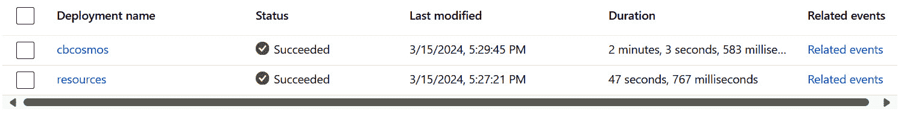

图 6.16 – 部署

部署与使用的 Bicep 文件匹配。当你打开**相关事件**时，你可以看到使用这些部署所执行的所有步骤。

当你不再需要这些资源时，使用此命令再次删除所有资源：

```cs
azd down
```

此工具检索要删除的 Azure 资源数量，并询问是否应该执行此操作——因此，请确保等待直到你可以回答“是”。资源删除完成后，通常需要超过 10 分钟，接下来会询问是否应该清除密钥保管库中的数据。如果你不回答“是”，则这些数据可以在 90 天内恢复，在此期间，你无法在此恢复时间结束前再次创建具有相同名称的资源。

# 摘要

在本章中，你学习了使用 Azure CLI、Azure 门户和 .NET Aspire 的 `azd` 创建 Microsoft Azure 资源。`gamesAPI` 服务现在正在使用 ACR、Azure 容器应用和 Azure Cosmos DB 数据库运行在 Microsoft Azure 资源上。当使用 `azd` 与 .NET Aspire 一起时，只需一个命令即可部署所有服务。

在继续下一章之前，让我们配置您在上一章中使用过的客户端应用程序，现在使用 Azure 容器应用的 URL 而不是本地服务，并玩一些游戏。

在本章中，Azure 密钥保管库已经创建。在下一章中，我们将探讨后端服务的配置，包括 Azure 密钥保管库，并使用 Azure 应用配置作为所有 `codebreaker` 服务的配置中心。

# 进一步阅读

要了解更多关于本章讨论的主题，您可以参考以下链接：

+   Azure 与 Azure 区域的往返延迟统计信息：[`learn.microsoft.com/azure/networking/azure-network-latency`](https://learn.microsoft.com/azure/networking/azure-network-latency)

+   Azure Cosmos DB – 数据库、容器和项：[`learn.microsoft.com/azure/cosmos-db/resource-model`](https://learn.microsoft.com/azure/cosmos-db/resource-model)

+   存储过程、触发器和用户定义函数：[`learn.microsoft.com/azure/cosmos-db/nosql/how-to-write-stored-procedures-triggers-udfs`](https://learn.microsoft.com/azure/cosmos-db/nosql/how-to-write-stored-procedures-triggers-udfs)

+   Azure 容器应用：[`learn.microsoft.com/azure/container-apps/`](https://learn.microsoft.com/azure/container-apps/)

+   Bicep：[`learn.microsoft.com/azure/azure-resource-manager/bicep`](https://learn.microsoft.com/azure/azure-resource-manager/bicep)

+   `azd` 参考：[`learn.microsoft.com/en-gb/azure/developer/azure-developer-cli/reference`](https://learn.microsoft.com/en-gb/azure/developer/azure-developer-cli/reference)
