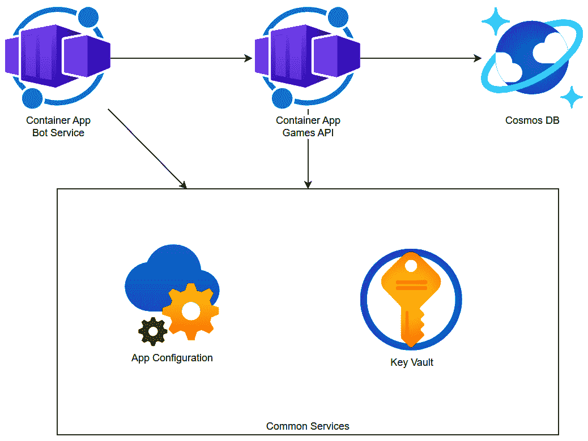
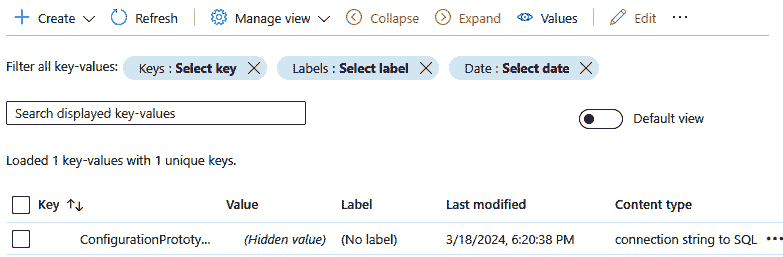
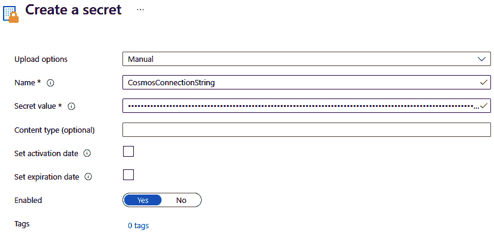
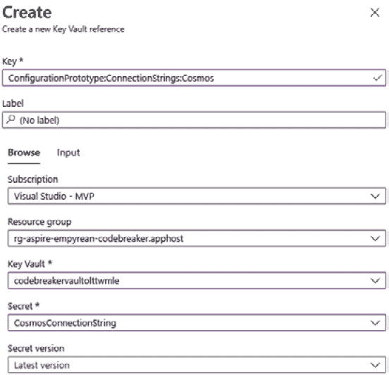
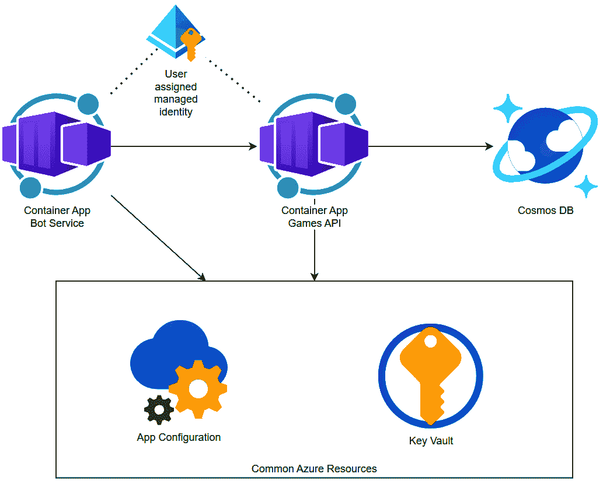
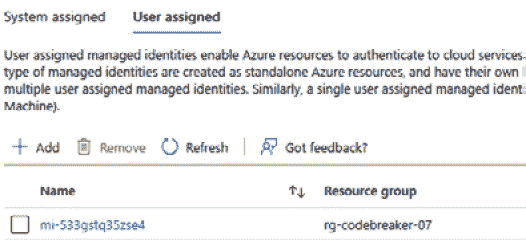
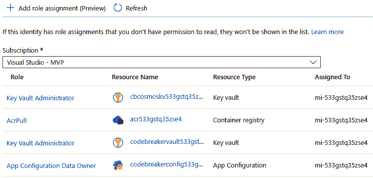
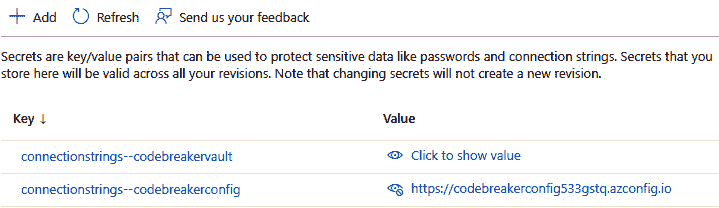
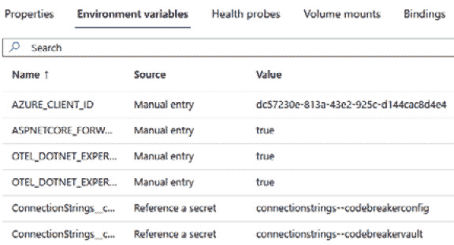

# 第七章：灵活配置

.NET 提供了基于提供者模型的灵活配置，可以从不同的来源读取配置。在上章中，我们使用 Azure 容器应用配置环境变量以覆盖 JSON 文件配置。

在本章中，你将学习如何使用 .NET 应用配置，以及如何添加配置提供者以使用中央配置存储：**Azure App Configuration**。对于秘密，我们还有一个可用的 Azure 服务：**Azure Key Vault**。在本章中，你还将学习如何将 Azure Key Vault 与 Azure App Configuration 结合使用，并通过使用 **Azure** **托管标识**来减少需要存储的秘密数量。

在本章中，你将学习以下内容：

+   探索 .NET 配置的功能

+   使用 Azure App Configuration 存储配置

+   使用 Azure Key Vault 存储秘密

+   使用托管标识减少所需的秘密数量

+   使用 Azure App Configuration 使用环境

# 技术要求

与上一章类似，需要 Azure 订阅、Azure CLI、Azure 开发者 CLI 和 Docker Desktop。

本章的代码可以在以下 GitHub 存储库中找到：[`github.com/PacktPublishing/Pragmatic-Microservices-with-CSharp-and-Azure`](https://github.com/PacktPublishing/Pragmatic-Microservices-with-CSharp-and-Azure)。

在 `ch07` 文件夹中，你会看到本章最终结果的这些项目：

+   `ConfigurationPrototype` – 这是一个新项目，在实现游戏 API 和机器人服务之前，展示了配置的一些概念。

+   `Codebreaker.InitializeAppConfig` – 这是一个新项目，用于使用 Azure App Configuration 初始化值。

+   `Codebreaker.AppHost` – 使用此项目定义的应用模型得到了增强，包括 `ConfigurationPrototype` 和 `Codebreaker.InitializeAppConfig` 项目，并将 App Configuration 和 Azure Key Vault 资源添加到应用模型中。

+   `Codebreaker.GameAPIs` – 我们在上一章中使用过的游戏 API 项目通过 App Configuration 进行了增强。

+   `Codebreaker.Bot` – 这是实现游戏服务的机器人服务的实现。该项目还通过 App Configuration 进行了增强。

你可以从上一章的结果开始，通过本章进行自己的工作。

要发布 Azure 的解决方案（在本章后面使用托管标识时需要），请使用 Azure 开发者 CLI，并将当前目录设置为 `solution` 文件夹：

```cs
azd init
azd up
```

使用 `azd init`，选择分析文件夹中的代码，接受部署 Azure 容器应用，指定一个环境，例如 `codebreaker-07`，并选择可从 Ingress 控制器访问的游戏 API、机器人服务和配置原型。使用 `azd up`，资源将部署到配置的环境。

查看存储库中 `ch07` 文件夹的 README 文件以获取最新更新。

# 体验 .NET 配置

在本章中，我们将创建一个新的 Web API 项目，在将配置功能添加到游戏 API 和机器人服务之前，尝试使用 .NET 配置功能：

```cs
dotnet new webapi -o ConfigurationPrototype
```

.NET 在读取配置值方面非常灵活。配置值可以从不同的源检索，例如 JSON 文件、环境变量和命令行参数。根据环境（例如，生产环境和开发环境），还可以检索不同的配置值。使用此核心 .NET 功能，很容易添加其他配置源并自定义环境。

在幕后，`ConfigurationManager` 类用于配置应用程序配置的源。此配置是在调用 `WebApplication.CreateBuilder` 时在应用程序启动时完成的。

注意

在 .NET 8 中，其他构建器方法，如 `CreateSlimBuilder` 和 `CreateEmptyBuilder`，也可用。使用这些构建器，注册的服务数量减少，以提高性能。

使用 `WebApplicationBulder.CreateBuilder` 完成的默认配置，已添加配置提供程序列表：

+   `webroot` 键设置为 Web 目录的路径。您可以使用配置键而不是使用其他 API 来检索此信息。

+   `ASPNETCORE_` 和 `DOTNETCORE_` 前缀，以便在处理早期即可使用，这允许所有后续提供程序覆盖这些值。另一个环境变量配置提供程序添加所有其他环境变量。`ASPNETCORE_HTTP_PORTS` 和 `ASPNETCORE_HTTPS_PORTS` 环境变量是 .NET 8 中新增的，可以轻松更改 Kestrel 服务器的监听端口。.NET Aspire 将环境变量传递给配置的项目。

+   `appsettings.json` 和 `appsettings.{environmentName}.json`。如果环境名称是 `Development`，则检索 `appsettings.Development.json` 中的值。这将覆盖之前加载的 `appsettings.json` 文件中的设置。

    在您的环境中，如果您更喜欢将所有连接字符串分开，可以使用多个 JSON 文件（例如，`connectionstrings.json`）：

    ```cs
    builder.Configuration.AddJsonFile("connectionstrings.json", optional: true);
    ```

    `AddJsonFile` 扩展方法将文件名添加为另一个 JSON 配置提供程序。如果未将 `optional` 参数配置为 `true`，则在找不到文件时抛出异常。

+   **命令行配置提供程序**：命令行提供程序允许覆盖所有设置（因为它在提供程序列表中最后）。启动应用程序时，您可以通过传递配置值来覆盖其他设置。

    想象一个使用 JSON 指定分层设置的案例，例如以下连接字符串：

    ```cs
    {
    ```

    ```cs
      "ConnectionStrings": {
    ```

    ```cs
        "GamesSqlServerConnection": "server=(localdb)\\mssqllocaldb;database=CodebreakerGames;trusted_connection=true"
    ```

    ```cs
      }
    ```

    ```cs
    }
    ```

    在这种情况下，您可以使用冒号 `:` 分隔符通过命令行参数传递值：

    ```cs
    ConnectionStrings:GamesSqlServerConnection = "the new connection string"
    ```

    使用 `:` 在环境变量中是不可能的。如您在上一章中看到的，在传递用于分层配置的环境变量时，使用两个下划线 (`__`) 作为分隔符。

+   `UserSecretsId` 在项目文件中设置：

    ```cs
    cd ConfigurationPrototype
    ```

    ```cs
    UserSecretsId to the project file and uses a unique identifier to reference the corresponding secrets from the user profile.To add a secret, use this command:

    ```

    使用 dotnet user-secrets -h 查看其他可用的命令。

    ```cs

    ```

注意

在开发系统上运行 .NET Aspire 解决方案时，使用包含运行服务进程的引用信息的应用程序模型及其依赖项来创建环境变量。当将解决方案部署到 Microsoft Azure，并使用 Azure Container Apps 时，会创建环境变量和秘密。由于默认情况下环境变量被配置为配置提供者，因此运行服务时无需进行特殊操作。

## 检索配置值

我们如何访问配置值？要获取自定义配置值，让我们增强 `appsettings.json` 文件：

ConfigurationPrototype/appsettings.json

```cs
{
  "Logging": {
    "LogLevel": {
      "Default": "Information",
      "Microsoft.AspNetCore": "Warning"
    }
  },
  "AllowedHosts": "*",
  "Config1": "config 1 value",
  "Service1": {
    "Config1": "config 1 value",
    "Config2": "config 2 value"
  }
}
```

`Config1` 键被添加到文件的根元素中。使用 `Service1`，我们使用父子关系并定义多个子元素，`Config1` 和 `Config2`。

要检索配置值，我们只需注入 `IConfiguration` 接口，如下面的代码片段所示。您需要在 `app.Run` 方法之前添加此代码片段：

ConfigurationPrototype/Program.cs

```cs
app.MapGet("/readconfig", (IConfiguration config) =>
{
  string? config1 = config["Config1"];
  return $"config1: {config1}";
});
```

`IConfiguration` 接口在 API 实现的 `GET` 请求中注入。使用 C# 索引器，我们检索 `Config1` 键的值。要检索子元素，我们可以使用 `GetSection` 方法并使用返回的节中的索引器。`GetSection` 返回一个实现 `IConfigurationSection` 接口的对象。该接口本身继承自 `IConfiguration`，因此 `IConfiguration` 接口的成员都是可用的。

尝试一下：启动 `ConfigurationPrototype` 应用程序，并使用 OpenAPI 测试页面测试 `/``readconfig` 端点。

要检索子元素，我们将使用不同的方法来使用选项。

## 使用选项

当需要配置值时，许多 .NET 服务都使用 **选项模式**。这为获取这些值提供了更多灵活性——这可以是配置，但这些服务配置值也可以通过编程方式分配。

强类型配置值是此模式的另一个特性。将此类添加到映射配置值：

ConfigurationPrototype/Program.cs

```cs
internal class Service1Options
{
  public required string Config1 { get; set; }
  public string? Config2 { get; set; }
}
```

映射配置值的类需要一个无参数构造函数和与配置值匹配的属性。

要填充值，使用 `Service1Options` 类并通过 `builder.Build` 方法进行配置：

ConfigurationPrototype/Program.cs

```cs
builder.Services.Configure<Service1Options>(
  builder.Configuration.GetSection("Service1"));
```

`IServiceCollection`的`Configure`扩展方法提供了两种重载。其中一种重载允许通过一个委托程序来程序化地填充`Service1Options`实例。第二种重载——在这里使用的是——接收一个`IConfiguration`参数。记住——在之前创建的配置文件中，定义了一个`Service1`父元素。`GetSection`方法检索该部分内的值。因为配置键映射到类，所以填充了这些值。

注意

一个新的.NET 8 特性，具有绑定配置的是源生成器。使用原生 AOT（见*第五章*），此源生成器默认启用。对于非 AOT 项目，可以将`EnableConfigurationBindingGenerator`添加到项目文件中以关闭此源生成器。

在此配置就绪后，让我们检索这些配置值。在`app.Run`之前添加此代码以配置端点：

ConfigurationPrototype/Program.cs

```cs
app.MapGet("/readoptions", (IOptions<Service1Options> options) =>
{
  return $"options - config1: {options.Value.Config1}; config 2: 
    {options.Value.Config2}";
});
```

使用具有`Service1Options`泛型参数的`IOptions`接口进行注入，并且通过这种方式，可以使用配置的值。

在进行这些代码更改后，再次运行`ConfigurationPrototype`项目。使用`/readoptions`端点检索配置的值。

## 使用环境

由于应用程序在不同的环境中运行（例如，生产、预发布和开发），需要不同的配置值。例如，在开发环境中，您不想使用生产数据库。.NET 配置很容易支持不同的环境。

在默认配置下，加载`appsettings.{environment}.json`文件以指定特定环境的配置值——例如，在预发布环境中为`appsettings.staging.json`。

除了使用不同的文件名来加载特定环境的配置值外，我们还可以程序化地验证当前环境。

模板生成的代码包含以下代码：

ConfigurationPrototype/Program.cs

```cs
if (app.Environment.IsDevelopment())
{
  // code removed for brevity
}
```

`IsDevelopment`扩展方法将环境与`Development`字符串进行比较。`Environment`是`WebApplication`类的一个属性。其他可用的方法有`IsProduction`、`IsStaging`和`IsEnvironment`。调用`IsEnvironment`方法时，可以传递任何字符串来检查应用程序是否在指定的环境中运行。您也可以创建一个自定义扩展方法，扩展`IHostEnvironment`类型以与环境进行比较，而不是使用`IsEnvironment`方法。

应用程序运行的环境由前面提到的`ASPNETCORE_ENVIRONMENT`环境变量定义。在本地调试时，`launchsettings.json`文件（在`Properties`文件夹中）将环境定义为`Development`值。如果没有设置环境变量，则默认环境为`Production`。对于所有其他环境，您需要设置此环境变量。

# 使用 Azure Container Apps 配置

Azure Container Apps 支持指定环境变量和秘密。在*第六章*中，当我们创建容器应用程序时，我们配置了环境变量和秘密。容器应用程序的环境变量可以在创建应用程序时或在更新应用程序后进行配置——例如，使用 `az` `containerapp update`。

环境变量可能会在日志文件中可见。对于秘密，这可能会成为一个安全问题。安全嗅探器可以捕获配置在环境变量中的秘密，并在发现这些秘密时向系统管理员发出警报。在容器应用程序中，秘密存储在应用程序的作用域内，但与应用程序的版本无关。

为了获得更好的秘密安全性，容器应用程序的秘密可以连接到 Azure Key Vault 服务。Key Vault 服务以及我们为秘密获取的附加功能将在本章后面讨论。

当您使用多个 Azure 服务（例如，Azure App Service、Azure Functions、Azure Container Apps...）时，配置的管理方式因服务而异。如果您仅在容器应用程序中运行大量服务，您可能更喜欢一个集中管理所有配置的地方。Azure App Configuration 提供了这种功能，而无需创建自定义配置服务。

# 使用 Azure App Configuration 配置

在本章中，我们将 Azure App Configuration 和 Azure Key Vault 添加到解决方案中，如图 *图 7**.1* 所示：



图 7.1 – Azure 服务

这两种服务都可以与任何需要配置值的任何服务一起使用。Key Vault 服务用于存储秘密，并为这一功能提供了许多增强特性。

让我们创建一个 Azure App Configuration 资源。

## 创建 Azure App Configuration 服务

我们使用 .NET Aspire 创建 Azure App Configuration 服务。要使用来自 `ConfigurationPrototype` 项目的 `.NET Aspire `AppHost` 配置，请添加 `AppHost` 项目，并使用应用程序模型定义引用该项目）:

Codebreaker.AppHost/Program.cs

```cs
var builder = DistributedApplication.CreateBuilder(args);
var appConfig = builder.AddAzureAppConfiguration("codebreakerconfig")
  .WithParameter("sku", "Standard");
builder.AddProject<Projects.ConfigurationPrototype>("configurationprototype")
  .WithReference(appConfig);
// code removed for brevity
```

要使用 `AppHost` 项目与 Azure App Configuration 资源一起使用，我们还需要添加 `Aspire.Hosting.Azure.AppConfiguration` NuGet 包。调用 `AddAzureAppConfiguration` 方法将资源添加到应用程序模型。如果您尚未使用 Azure 订阅中的任何 App Configuration 功能，可以将 `sku` 值设置为 `Free` 以使用 App Configuration 服务的免费版本。免费版本不提供任何 SLA，并且每天限制为 1,000 次调用，但对于开发来说，这个限制可能已经足够。App Configuration 服务通过 `ConfigurationPrototype` 项目使用 `WithReference` 方法进行引用。

启动`AppHost`项目，资源将被配置。请记住，需要使用`AppHost`项目配置用户密钥：

```cs
{
  "Azure": {
    "SubscriptionId": "<enter your subscription id>",
    "Location": "westeurope"
    "CredentialSource": "AzureCli"
  }
}
```

将订阅 ID 更改为您的订阅 ID，并将位置更改为您选择的 Azure 区域。指定用于创建 Azure 资源的凭据来源也可能很有帮助。将值设置为`AzureCli`，将使用与您使用 Azure CLI 登录相同的帐户。

由于用户密钥存储将配置存储在用户配置文件中，当使用多个项目中的相同`UserSecretsId`值时，此信息可能已经显示出来。.NET Aspire 还会将创建的资源信息添加到用户密钥中。

当你启动应用程序时，将创建一个额外的 Azure 资源。成功完成后，如.NET Aspire 仪表板所示，让我们添加一些配置值。

## 使用 Azure App Configuration 配置值

完成 App Configuration 服务的创建过程后，我们可以在 Azure 门户中使用配置探索器定义配置值（见图 *7.2*）：



图 7.2 – 配置探索器

使用 App Configuration，键值对被存储。创建一个`ConfigurationPrototype:ConnectionStrings:SqlServer`键，我们定义了一个数据库连接的字符串值。由于所有`Codebreaker`服务的配置值都可以在一个地方配置，因此使用键名的前一部分（即服务的名称）作为键名是一个好习惯——这样我们就可以知道哪些配置值属于哪个服务。还可以使用 JSON 内容作为值，就像我们稍后将在游戏 API 中做的那样。这减少了对此服务的请求次数，并可以简化配置。

接下来，让我们从`ConfigurationPrototype`项目中获取配置。

## 初始化应用程序配置值

在应用程序部署时，我们也可以通过编程方式添加配置值。为此，让我们创建一个只运行一次的后台服务。

创建一个新的后台工作服务：

```cs
dotnet new worker -o Codebreaker.InitializeAppConfig
```

要将工作项目发布为 Docker 镜像，您还需要启用 SDK 容器支持：

Codebreaker.InitializeAppConfig/Codebreaker.InitializeAppConfig.csproj

```cs
<PropertyGroup>
  <IsPublishable>true</IsPublishable>
  <EnableSdkContainerSupport>true</EnableSdkContainerSupport>
</PropertyGroup>
```

在创建工作项目时，如果没有此设置，则无法使用`dotnet publish`创建 Docker 镜像。

将此项目添加到.NET Aspire 编排中（使用.NET Aspire 编排支持，或添加对`ServiceDefaults`项目的引用，并从`AppHost`项目添加项目引用到此项目）。将由此模板创建的`Worker`类重命名为`AppConfigInitializer`。

添加 `Azure.Data.AppConfiguration` 和 `Microsoft.Extensions.Azure` NuGet 包。`Azure.Data.AppConfiguration` 包提供了访问 App Configuration API 以创建、读取和更新设置的函数。`Microsoft.Extensions.Azure` 提供了与 **依赖注入** (`DI`) 系统的集成。

要写入配置设置，将以下代码添加到 `AppConfigInitializer` 类中：

Codebreaker.InitializeAppConfig/AppConfigInitializer.cs

```cs
public class AppConfigInitializer(ConfigurationClient configurationClient, IHostApplicationLifetime hostApplicationLifetime, ILogger<AppConfigInitializer> logger) : BackgroundService
{
  private Dictionary<string, string> s_6x4Colors = new()
  {
    { "color1", "Red" },
    { "color2", "Green" },
    { "color3", "Blue" },
    { "color4", "Yellow" },
    { "color5", "Orange" },
    { "color6", "Purple" }
  };
  protected override async Task ExecuteAsync(CancellationToken 
    stoppingToken)
  {
    foreach ((string key, string color) in s_6x4Colors)
    {
ConfigurationSetting setting = new($"GameAPIs.Game6x4.{key}", 
        color);
      await configurationClient.AddConfigurationSettingAsync(setting);
logger.LogInformation("added setting for key {key}", key);
    }
  }
}
```

使用 `AppConfigInitializer` 类的构造函数，将 `ConfigurationClient` 类和 `IHostApplicationLifetime` 接口注入。`ConfigurationClient` 是用于与 App Configuration 通信的类。我们通过调用 `AddConfigurationSettingAsync` 方法添加设置。`IHostApplicationLifetime` 是用于通知后台服务有关启动和停止事件的接口，并用于在结束时停止服务。在设置写入后，应用程序结束，调用 `StopApplication` 方法。

现在，我们可以使用 DIC 配置来配置 `AppConfigInitializer` 类：

Codebreaker.InitializeAppConfig/Program.cs

```cs
using Codebreaker.InitalizeAppConfig;
using Microsoft.Extensions.Azure;
var builder = Host.CreateApplicationBuilder(args);
builder.AddServiceDefaults();
builder.Services.AddHostedService<AppConfigInitializer>();
builder.Services.AddAzureClients(clients =>
{
  string appConfigUrl = builder.Configuration.
  GetConnectionString("codebreakerconfig") ??
throw new InvalidOperationException("codebreakerconfig not 
    configured");
  clients.AddConfigurationClient(new Uri(appConfigUrl));
});
var host = builder.Build();
host.Run();
```

`AddHostedService` 方法需要一个实现 `IHostedService` 接口的对象。此接口由 `AppConfigInitializer` 类的基类 `BackgroundService` 实现。当服务启动时，会调用 `BackgroundService` 的 `StartAsync` 方法，该方法反过来调用 `AppConfigInitializer` 的 `ExecuteAsync` 方法，在该方法中设置配置值。

`AddAzureClients` 是一个扩展方法，允许配置客户端以访问许多 Azure 服务。在这里，我们使用 `AddConfigurationClient` 扩展方法，传递 App Configuration 资源的 URL。

现在启动此初始化项目会将配置设置添加到 App Configuration 服务。游戏 API 服务现在可以更改以从配置中读取游戏颜色，这允许轻松更改颜色而无需重新编译。

注意

在 .NET Aspire 可用之前，我使用 Azure App Configuration 配置了非秘密配置值，例如不同 Azure 资源的 URL。由于 .NET Aspire 的编排覆盖了这一方面，并使得使用不同环境运行解决方案变得容易，并自动配置这些依赖项，因此 App Configuration 现在主要用于其他特定于应用程序的配置值。

在此初始化设置到位后，让我们继续从应用程序中读取配置值。

## 在应用程序中使用 Azure App Configuration

要从 .NET 应用程序中使用 Azure App Configuration 服务，我们需要添加 `Microsoft.Azure.AppConfiguration.AspNetCore` NuGet 包。此 NuGet 包提供了一个配置提供程序。

此提供程序使用以下代码片段进行配置：

ConfigurationPrototype/Program.cs

```cs
var builder = WebApplication.CreateBuilder(args);
builder.Configuration.AddAzureAppConfiguration(appConfigOptions =>
{
  DefaultAzureCredential cred = new();
  string appConfigUrl = builder.Configuration.
    GetConnectionString("codebreakerconfig") ??
    throw new InvalidOperationException("could not read 
    codebreakerconfig");
  appConfigOptions.Connect(new Uri(appConfigUrl), cred);
});
// the code from the repository also includes the Key Vault configuration added later
```

`AddAzureAppConfiguration` 扩展方法将应用程序配置服务添加到配置提供程序。一个重载使用字符串参数传递包含秘密的连接字符串。.NET Aspire 的默认编排配置仅传递应用程序配置服务的 URL，而不包含秘密。`DefaultAzureCredential` 类。此类使用定义的顺序尝试不同的凭据，包括 *Visual Studio 凭据*、*Azure CLI 凭据*和*Azure Developer CLI 凭据*。首先成功检索到的凭据用于访问配置服务。应用程序配置服务的 URL 由 .NET Aspire 编排器转发，并通过配置 API 获取。在此之后，调用 `AzureAppConfigurationOptions` 类的 `Connect` 方法，使用配置服务的 URL 以及凭据进行连接。添加此配置提供程序后，应用程序配置可以像任何其他配置提供程序一样使用。

注意

当解决方案部署到 Azure 时，不能使用本地凭据。当解决方案在 Azure 中运行时，使用托管标识。这一点将在本章后面介绍。

现在，需要做的只是检索配置值。配置来源没有区别：

ConfigurationPrototype/Program.cs

```cs
app.MapGet("/azureconfig", (IConfiguration config) =>
{
  string? connectionString = config.
    GetSection("ConfigurationPrototype")
    .GetConnectionString("SqlServer");
  return $"Configuration value from Azure App Configuration: 
    {connectionString}";
});
```

再次，`IConfiguration` 接口被注入。使用应用程序配置配置的键具有层次化名称：`ConfigurationPrototype:ConnectionStrings:SqlServer`。第一个层次结构是通过 `GetSection` 方法访问的。接下来，使用 `GetConnectionString` 方法。这访问名为 `ConnectionString` 的部分，然后使用 `SqlServer` 键来获取其值。

通过这个最后的更改，您可以运行应用程序并从应用程序配置服务中检索配置值！

在本地系统上使用环境时使用**用户秘密**。在生产环境中，您可以从上一章中了解到如何使用 Azure Container Apps 配置秘密，以安全的方式将连接字符串添加到应用程序配置中。接下来要介绍的 Azure Key Vault 服务提供了一个更加安全的环境。

# 使用 Azure Key Vault 存储秘密

要获取秘密配置值，可以使用 Azure Key Vault 服务。Key Vault 服务可以用来存储诸如**密码**、**证书**和**密钥**之类的秘密。此服务增加了硬件级别的加密、自动证书续订和细粒度的访问控制。通过预定义的角色，服务决定谁可以读取秘密（*Key Vault Secrets User*，应用程序），谁可以创建和更新秘密但不能读取秘密（*Key Vault Contributor*），以及谁可以监控哪些用户使用秘密但不能创建和读取秘密（*Key Vault Secrets Officer*）。

对于 .NET 应用程序，密钥保管库服务可以作为配置提供程序添加，就像 Azure App 配置一样。另一种使用此服务的方法是将存储在密钥保管库中的秘密链接到 Azure App 配置实例。我们将使用第二种选项。

当您向 App 配置添加密钥时，除了提供密钥和值之外，密钥还可以链接到存储在密钥保管库服务中的秘密。虽然可以与 App 配置使用的相同 API 一起使用秘密，但运行服务的用户需要访问密钥保管库服务。

让我们使用 .NET Aspire 应用程序模型创建一个密钥保管库：

Codebreaker.AppHost/Program.cs

```cs
var appConfig = builder.AddAzureAppConfiguration("codebreakerconfig");
var keyVault = builder.AddAzureKeyVault("codebreakervault");
builder.AddProject<Projects.ConfigurationPrototype>("configurationprototype")
  .WithReference(appConfig)
  .WithReference(keyVault);
```

`AddAzureKeyVault` 方法将密钥保管库资源添加到应用程序模型。此资源从以下项目配置中引用以传递 URL。与之前的 App 配置一样，秘密信息不是传递的 URL 的一部分。

运行应用程序以创建资源。然后，您可以通过查看**访问配置**页面（在**设置**部分）来验证权限模型，如图 *7.3* 所示：


图 7.3 – 密钥保管库访问配置

Azure 密钥保管库服务支持两种访问权限模型：**保管库访问策略**是较旧（遗留）的选项。**Azure 基于角色的访问控制**是首选配置。定义用户角色以允许对不同的密钥保管库对象（如密钥、秘密和证书）进行读取或写入访问。在此类别中另一个设置是允许**Azure 资源管理器**（**ARM**）基于的部署（包括 Bicep）；对于此特定资源，需要授予访问权限。

在密钥保管库创建成功后，您可以创建和导入**秘密**、**密钥**和**证书**。在本章中，我们仅使用密钥保管库服务的秘密。创建一个秘密，如图 *7.4* 所示：



图 7.4 – 创建秘密

除了名称和秘密值之外，您还可以设置激活和过期日期。

在创建秘密后，我们可以切换回 Azure App 配置服务。创建一个密钥保管库引用以将配置值映射到 Azure 密钥保管库服务的值（如图 *7.5* 所示）：



图 7.5 – 使用 App 配置映射密钥保管库秘密

从配置资源管理器添加密钥保管库引用时，可以指定与配置键相对应的键值，但对于值，则引用密钥保管库资源和秘密。

将 App 配置服务连接到密钥保管库服务时，需要更新 App 配置服务：

ConfigurationPrototype/Program.cs

```cs
builder.Configuration.AddAzureAppConfiguration(appConfigOptions =>
{
  DefaultAzureCredentialOptions credentialOptions = new();
  DefaultAzureCredential cred = new();
  string appConfigUrl = builder.Configuration.
GetConnectionString("codebreakerconfig") ?? throw new 
InvalidOperationException("could not read codebreakerconfig");
  appConfigOptions.Connect(new Uri(appConfigUrl), cred)
    .ConfigureKeyVault(keyVaultOptions =>
    {
      keyVaultOptions.SetCredential(cred);
    });
});
```

`AzureAppConfigurationOptions` 类的 `Connect` 方法是一个流畅的 API，它返回相同的选项类型。因此，现在调用 `ConfigureKeyVault` 方法将 Key Vault 服务连接到相同的 App Configuration 资源。`SetCredential` 方法定义了用于访问机密的凭证。在这里，我们使用与 App Configuration 服务相同的凭证，但也可以使用不同的凭证。

在此配置下，机密可以像其他配置值一样访问：

ConfigurationPrototype/Program.cs

```cs
app.MapGet("/secret", (IConfiguration config) =>
{
  string? connectionString = config.
GetSection("ConfigurationPrototype").GetConnectionString("Cosmos");
  return $"Configuration value from Azure Key Vault via App 
Configuration: {connectionString}";
});
```

由于 Key Vault 服务已连接到 App Configuration 服务，我们可以使用之前使用的相同配置 API。幕后，使用了不同的访问机制。

运行应用程序并检查如何使用 `DefaultAzureCredential` 类型成功检索机密。

在我们将 App Configuration 和 Key Vault 服务与我们的游戏 API 和机器人服务集成之前，我们可以使用管理身份通过配置值去除一些必要的机密。

# 减少使用管理身份的机密需求

管理身份（现称为**Microsoft Entra 管理身份用于 Azure 资源**）消除了我们之前与服务主体相关的麻烦。管理身份抽象化了服务主体，并自动创建和删除它们。

使用 Azure 服务（如 Azure Container Apps），可以配置服务的身份以管理身份运行。访问的服务（如 Azure App Configuration）使用角色管理，您可以通过角色管理配置谁可以访问此资源——其中包括选择管理身份的简单选项。

可用的管理身份类型包括**系统分配的管理身份**和**用户分配的管理身份**：

+   系统分配的管理身份直接关联到 Azure 资源。如果删除 Azure 资源，管理身份及其基于角色的访问权限也会被移除。

+   用户分配的管理身份是独立于 Azure 服务创建的。与其他 Azure 资源一样，用户分配的管理身份是资源组内的资源。

这两个选项各有优缺点。

系统分配的管理身份的属性和优势包括以下内容：

+   它们的生命周期与服务的生命周期相同

+   删除服务也会删除管理身份及其角色分配

用户分配的管理身份的优势包括以下内容：

+   一个用户分配的管理身份可以被多个服务使用。

+   删除服务不会删除管理身份 - 它可以被其他服务使用。

+   多个服务可以使用相同的管理身份。如果多个服务需要相同的权限，您只需使用共享管理身份指定一次即可。

一个服务可以使用多个用户分配的托管标识。这也包括一个缺点：使用用户分配的托管标识需要你配置主体 ID 以指定要使用哪个托管标识。

**图 7.6**显示了与机器人服务和游戏 API 一起使用的用户分配的托管标识，用于访问应用配置和密钥保管库服务：



图 7.6 – 分配托管标识

让我们创建一个托管标识并为此托管标识分配权限。

## 创建托管标识并分配角色

在本地系统上运行应用程序时，不使用托管标识。要在 Azure 中使用托管标识，请按照*技术要求*部分所述部署解决方案。

资源成功部署后，使用 Azure 门户打开游戏 API 的 Azure 容器应用服务，并在**设置**部分选择**标识**，如图**7.7**所示。



图 7.7 – 托管标识

系统分配的标识已关闭，但已创建用户分配的托管标识。如果你使用其他容器应用打开标识配置，你可以看到相同的托管标识被分配给所有这些应用，这使得定义权限变得容易。

点击此托管标识，选择**添加角色分配**，如图**7.8**所示。



图 7.8 – 托管标识的角色访问控制

在这里，你可以看到这个托管标识已经分配了几个角色——它可以从 Azure 容器注册服务中拉取 Docker 镜像，这在部署 Azure 容器应用服务时是必需的，它可以访问 Azure 密钥保管库，并且它具有使用**应用配置数据所有者**角色的访问权限。这允许设置配置值，如果未由运行此标识的应用程序设置配置值，则可以将其更改为读取访问。

注意

你可能会想知道为什么托管标识被分配了密钥保管库服务的管理员角色以及应用配置服务的**应用配置数据所有者**角色。这个托管标识在部署过程中也被使用。当部署 Azure 容器应用服务时，会向密钥保管库服务添加一个包含 Azure Cosmos DB 数据库连接字符串的秘密。可以指定配置值并将其提供给应用配置服务。

为了支持**最小权限原则**（**PoLP**），应仅应用必要的权限。您可以为不同的容器应用创建多个托管标识，或使用系统分配的托管标识，这样每个容器应用都有一个不同的标识，并为每个标识指定所需的角色。容器应用可以只有一个系统分配的托管标识，但可以有多个用户分配的托管标识。不同的标识可以用于部署和运行应用程序。

让我们回到一些 C#代码——游戏 API、机器人服务以及配置原型启动代码，以使用托管标识配置 Azure 应用程序配置。

## 使用托管标识配置 Azure 应用程序配置提供程序

在之前，使用`ConfigurationPrototype`项目时，我们已经使用了`AddAzureAppConfiguration`方法重载，该方法不需要包含密钥的连接字符串。调用`Connect`方法时，我们提供了一个`DefaultAzureCredential`实例。使用用户分配的托管标识时，这里需要做出更改。一个应用程序可以分配一个系统分配的托管标识，但可以有多个用户分配的托管标识。我们需要指定我们使用的那个。

让我们检查已应用到 Azure 容器应用的配置。在 Azure 门户中打开配置原型容器应用，在**设置**类别中打开**密钥**，如图**7.10**所示：



Figure 7.9 – Azure 容器应用中的密钥

连接到 Azure 应用程序配置和 Azure 密钥保管库服务的连接字符串存储在**密钥**配置中。这实际上并不是必需的，因为密钥不是这些链接的一部分——但如果配置更改不仅包含端点链接，还包含包含端点和密钥的连接字符串，这将有所帮助。

因为密钥不是此密钥配置的一部分，请检查配置的环境变量。此设置在**应用程序**类别中可用。点击**容器**并选择**环境变量**，如图**7.10**所示：



Figure 7.10 – Azure 容器应用中的环境变量

用户分配的托管 ID 的标识符作为名为`AZURE_CLIENT_ID`的环境变量传递。此环境变量可以用来选择托管标识。让我们使用它来配置`DefaultAzureCredential`对象。我们之前使用过这个类，但现在我们需要调查它提供的不同选项。`DefaultAzureCredential`按照以下顺序使用账户：

+   `EnvironmentCredential` – 此认证需要设置包含客户端 ID、租户 ID 和密钥的环境变量。我们这里不使用此方法。

+   `WorkloadIdentityCredential` – 当在 **Azure Kubernetes Service** (**AKS**) 上运行时，可以启用 Microsoft Entra 工作负载标识。

+   `ManagedIdentityCredential` – 这是当应用程序在配置了 Microsoft Azure 中的托管标识时使用的认证方式。

+   `SharedTokenCacheCredential` – 这是一个已由 `VisualStudioCredential` 取代的传统机制。

+   `VisualStudioCredential` – 使用 Visual Studio，在选项对话框中，你可以配置用于 Azure 服务认证的账户。这是与 `VisualStudioCredential` 一起使用的账户。只需确保在 Visual Studio 中你不需要重新认证 – 否则，通过 `DefaultAzureCredential` 的认证可能不会成功。

+   `VisualStudioCodeCredential` – 这与 `VisualStudioCredential` 类似，是用于 Visual Studio Code 的机制，但与当前版本的 *Azure Account 扩展* 不兼容。将为 Visual Studio Code 构建一个新的认证机制，但这需要一些时间才能准备就绪。使用 Visual Studio Code 时，请使用下一个选项。

+   `AzureCliCredential` – 这是 Azure CLI 使用的账户。使用 `az account list` 命令，你可以看到你登录的 Azure 账户和订阅。`az account show` 会显示将使用的默认账户和订阅。如果这不是正确的账户，请使用 `az account set` 来设置当前活动订阅。

注意

如果你在开发环境中使用 `DefaultAzureCredential` 类时遇到问题，你可以启用诊断信息，并显式启用或禁用特定账户以查找问题。如有错误，请查看此故障排除指南：[`github.com/Azure/azure-sdk-for-net/blob/main/sdk/identity/Azure.Identity/TROUBLESHOOTING.md`](https://github.com/Azure/azure-sdk-for-net/blob/main/sdk/identity/Azure.Identity/TROUBLESHOOTING.md)。

让我们更新配置，以便在应用程序在 Azure 中运行时使用 Azure App Configuration：

ConfigurationPrototype/Program.cs

```cs
builder.Configuration.AddAzureAppConfiguration(appConfigOptions =>
{
#if DEBUG
  DefaultAzureCredential credential = new();
#else
  string managedIdentityClientId = builder.Configuration["AZURE_
    CLIENT_ID"] ?? string.Empty;
  DefaultAzureCredentialOptions credentialOptions = new()
  {
    ManagedIdentityClientId = managedIdentityClientId,
    ExcludeEnvironmentCredential = true,
    ExcludeWorkloadIdentitiyCredential = true
  };
  DefaultAzureCredential credential = new(credentialOptions);
#endif
  string appConfigUrl = builder.Configuration.
GetConnectionString("codebreakerconfig") ??
    throw new InvalidOperationException("could not read 
codebreakerconfig");
  appConfigOptions.Connect(new Uri(appConfigUrl), credential)
    .Select("ConfigurationPrototype*")
    .ConfigureKeyVault(keyVaultOptions =>
    {
      keyVaultOptions.SetCredential(cred);
    });
});
```

`DefaultAzureCredential` 不仅在开发环境中有效，当应用程序在 Azure 中运行时也有效。使用系统分配的托管标识，不需要进行更改。使用用户分配的托管标识，需要将 `ManagedIdentityClientId` 属性设置为托管标识的 ID。我们通过读取 `AZURE_CLIENT_ID` 环境变量并将值传递给此设置来完成此操作。

使用从 `Connect` 方法返回的 `AzureAppConfigurationOptions` 类的 `Select` 方法可以过滤配置值。因为配置值是为解决方案的所有服务指定的，所以我们只需要以 `ConfigurationPrototype` 键开始的那些值。对于机器人和游戏 API 服务，过滤是通过 `bot` 和 `gameapis` 键完成的。

运行配置原型，并使用这些更改，然后让我们继续使用 App 配置使用 .NET 环境。

# 使用 Azure App 配置的环境

Azure 容器应用程序已部署并运行，使用了我们迄今为止创建的所有 Azure 服务。使用 App 配置缺少的是 .NET 配置支持的不同环境。应用程序是在本地开发环境中运行，在 Azure 测试环境中运行，还是在生产服务器上运行？在测试环境中运行时，不应使用生产数据库。

.NET 配置支持不同的环境——根据环境，要么加载 `appsettings.development.json`，要么加载 `appsettings.production.json`。使用 Azure App Configuration 也可以实现类似的功能，使用 **标签** 来区分环境配置。我们可以指定开发、生产和测试标签来区分环境配置。这可以映射到 .NET 环境。

注意

在不同的 Azure 订阅中区分生产环境和开发环境是一个好习惯，可能还会使用不同的 Azure Active Directory 服务。在这里，您也使用单独的 Azure App 配置服务。某些环境可以使用相同的订阅；例如，生产环境和预发布环境可以配置为在同一个订阅中运行。在这种情况下，可以使用标签将不同的配置值映射到环境中。

## 使用 App 配置标签映射 .NET 环境

在 Azure 门户中，再次打开 Azure App 配置服务。创建一个新的键值对，并再次使用 `BotService` 键，但这次，将标签设置为 `Development`。此键的默认设置应包含运行在容器应用程序中的游戏 API 的 `ApiBase` 配置，而 `Development` 标签应引用 `localhost`。

使用机器人服务的启动代码，我们现在可以更改过滤代码：

Codebreaker.Bot/Program.cs

```cs
builder.Configuration.AddAzureAppConfiguration(options =>
{
  options.Connect(new Uri(endpoint), credential)
    .Select("BotService*", labelFilter: LabelFilter.Null)
    .Select("BotService*", builder.Environment.EnvironmentName);
});
```

多次调用 `Select` 方法的方式与您在本章开头看到的使用多个配置提供程序的方式相同。如果一个设置被配置了多次，最后一个配置生效。第一个 `Select` 方法加载所有以 `BotService` 开头的配置值，并且没有应用标签过滤器。接下来，加载所有以 `BotService` 开头的配置值，但这次，只加载与当前环境名称相同的标签的值。所有未被特定环境标签覆盖的配置值保持不变——该值是活动的。对于所有匹配标签的键，新的值现在生效。

这就是使用 Azure App 配置服务映射不同环境配置值所需完成的所有工作。

注意

如果您一段时间内不需要 Azure 资源，请删除资源组。在下一章中，我们将重新创建这些服务。`azd up` 使得这个过程变得简单！

# 摘要

这是一次围绕使用 Azure 服务来解决常见需求（如 Azure 应用配置和 Azure Key Vault 与 .NET 配置相关）的旅程。您学习了 .NET 配置如何提供附加不同提供者的功能，并使用 Azure 应用配置来存储大量服务的配置值。Azure Key Vault 服务用于存储机密。除此之外，您还学习了如何使用托管标识，这有助于消除许多机密。

在本章中，我们使用了 Azure 开发者 CLI 来创建 Docker 镜像，将它们发布到 Azure 容器注册表服务，并使用新镜像创建 Azure 容器应用的新副本。虽然 `azd up` 使得这个过程变得简单，但这可以自动化。这在测试、预生产和生产环境中特别有趣。在下一章中，我们将使用 GitHub Actions 自动化这些活动。此外，Azure 应用配置还可以做更多的事情——使用现代部署模式中的功能标志。这将在*第八章*中介绍。

# 进一步阅读

要了解更多关于本章讨论的主题，您可以参考以下链接：

+   .NET 中的配置提供者：[`learn.microsoft.com/en-us/dotnet/core/extensions/configuration-providers`](https://learn.microsoft.com/en-us/dotnet/core/extensions/configuration-providers)

+   .NET 中的选项模式：[`learn.microsoft.com/dotnet/core/extensions/options`](https://learn.microsoft.com/dotnet/core/extensions/options)

+   Microsoft Entra 管理标识：[`learn.microsoft.com/azure/active-directory/managed-identities-azure-resources/`](https://learn.microsoft.com/azure/active-directory/managed-identities-azure-resources/)

+   使用 `AzureDefaultCredential` 进行故障排除：[`github.com/Azure/azure-sdk-for-net/blob/main/sdk/identity/Azure.Identity/TROUBLESHOOTING.md`](https://github.com/Azure/azure-sdk-for-net/blob/main/sdk/identity/Azure.Identity/TROUBLESHOOTING.md)

+   内置角色：[`learn.microsoft.com/azure/role-based-access-control/built-in-roles`](https://learn.microsoft.com/azure/role-based-access-control/built-in-roles)

+   Azure Key Vault 密钥、机密和证书：[`learn.microsoft.com/en-us/azure/key-vault/general/about-keys-secrets-certificates`](https://learn.microsoft.com/en-us/azure/key-vault/general/about-keys-secrets-certificates)

+   PoLP：[`learn.microsoft.com/en-us/entra/identity-platform/secure-least-privileged-access`](https://learn.microsoft.com/en-us/entra/identity-platform/secure-least-privileged-access)

+   Microsoft Entra Workload ID：[`learn.microsoft.com/en-us/azure/aks/workload-identity-overview`](https://learn.microsoft.com/en-us/azure/aks/workload-identity-overview)
