# 第八章：CI/CD - 使用 GitHub Actions 进行发布

微服务的一个特点是它们能够持续构建和部署服务。在之前的章节中，我们自动创建了服务解决方案使用的基础设施。

在本章中，我们将继续自动构建和更新服务，并在将应用程序部署到预发布和生产环境之前使用保护规则。在这个过程中，你将学习如何使用 Azure App Configuration 与功能标志一起使用。

在本章中，你将学习以下内容：

+   使用 GitHub Actions

+   在拉取请求后自动构建和测试应用程序

+   将应用程序部署到测试环境

+   在将应用程序部署到生产环境之前，使用部署保护规则

+   发布 NuGet 包

+   使用现代部署模式中的功能标志

# 技术要求

在本章中，与上一章类似，你需要 Azure 订阅、Azure CLI、Azure Developer CLI 和.NET Aspire。你还需要自己的 GitHub 仓库，以便你可以存储机密信息、创建环境并运行 GitHub Actions。这些功能在公共仓库中可用。如果你创建一个私有仓库，则需要 GitHub 团队功能来创建环境（见[`github.com/pricing`](https://github.com/pricing)）。

本章的源代码可以在本书的 GitHub 仓库中找到：[`github.com/PacktPublishing/Pragmatic-Microservices-with-CSharp-and-Azure`](https://github.com/PacktPublishing/Pragmatic-Microservices-with-CSharp-and-Azure)。

`ch08`文件夹包含以下项目，以及本章的输出：

+   `Codebreaker.GameAPIs`：我们在上一章中使用过的`game-apis`项目已经通过功能标志进行了增强。

+   `Codebreaker.Bot`：这是`bot-service`的实现，用于玩游戏。

+   `Codebreaker.GameAPIs.KiotaClient`：这是我们*第四章*中创建的客户端库，用于客户端。

+   `Workflows`：这个文件夹是新的。在这里，你可以找到所有 GitHub Actions 工作流程。然而，这些工作流程在你将它们复制到仓库中的`.github/workflows`文件夹之前不会激活。

要与本章中的代码一起工作，你可以使用上一章中的`service`和`bot`项目，以及*第四章*中的`Kiota`库。

对于本章，你需要 GitHub 权限来运行 GitHub 工作流程，以及创建和使用具有保护规则的 GitHub 环境。最简单的方法是创建一个公共仓库，并将本章中的代码仅复制到其中。在这个新仓库中创建`src`文件夹，并将源代码复制到这个文件夹中。

查看本书 GitHub 仓库中`ch08`文件夹中的 README 文件以获取最新更新。

# 使用 Azure Developer CLI 准备解决方案

首先，让我们使用 Azure Developer CLI 准备解决方案。在初始化解决方案时，将当前文件夹设置为存储库的根文件夹（而不是解决方案文件的文件夹，如我们之前所做的那样）：

```cs
azd init
```

选择 `bot` 和 `game-apis` 作为要公开到互联网的项目，并输入一个新的环境名称 - 例如，`codebreaker-08-dev`。包含指向 AppHost 项目文件的链接的生成 `azure.yaml` 文件需要提交到源代码仓库。生成的 `.azure` 文件夹可以包含密钥，并且由于生成的 `.gitignore` 文件，已被排除在源代码仓库之外。

注意

使用稍后使用的 `azd pipeline` 命令的根目录的原因；在编写本文时，此命令需要 `.github/workflows` 目录位于同一文件夹中。计划在以后的版本中进行一些更改，因此请检查本章的 README 文件以获取更新。

现在，让我们将资源部署到 Azure：

```cs
azd auth login
azd up
```

使用 `azd up`，资源将被部署到您配置的环境。选择您希望使用的 Azure 订阅以及您希望部署资源的 Azure 区域。

生成的文件 `azure.yaml` 引用了 AppHost 项目。生成的文件夹 `.azure`（由于可能存储密钥而被排除在源代码仓库之外），包含当前环境和与环境同名的一个文件夹。此文件夹包含 `config.json` 文件，其中列出公开可访问的服务配置，以及包含引用创建的 Azure 资源的 `.env` 文件。

现在，我们已经准备好使用 GitHub Actions。您可以使用 `azd down` 再次删除 Azure 资源，因为完整的基础设施应该已经通过 GitHub Actions 部署：

```cs
azd down
```

回答 `y` 以删除资源，然后再次回答 `y` 以永久删除已启用软删除的资源。

如果您想永久删除资源，请打开 Azure 门户（[`portal.azure.com`](https://portal.azure.com)），转到 **密钥保管库**，然后单击 **管理已删除的保管库**。已删除的密钥保管库需要被清除，以便您可以再次创建具有相同名称的资源。清除密钥保管库。同样，检查需要清除的 Azure App Configuration 服务。

# 探索 GitHub Actions

**GitHub Actions** 是 GitHub 的一个功能，您可以使用它来自动构建、测试和部署源代码。GitHub Actions 是一个由 *工作流程*、*事件*、*作业*、*操作* 和 *运行器* 组成的产品：

+   存储库的 `.github/workflows` 文件夹。一个工作流程包含事件和作业。

+   **事件**指定触发工作流程的内容。工作流程应该在何时启动？

+   **作业**由在 **运行器**机器上执行的步骤组成。

+   **步骤**可以运行脚本或操作。

+   **操作** 是一个可重用的 GitHub 扩展，它可以减少编写脚本的必要性。许多这些可重用扩展可以用于构建和部署应用程序。

现在我们已经用这些术语奠定了基础，让我们通过使用 Azure 门户创建一个工作流程来深入了解细节。

## 创建 GitHub Actions 工作流程

有几种选项可以自动创建 GitHub Actions 工作流程以部署服务到 Microsoft Azure。使用 Azure 门户，在打开 **容器应用** 时，您可以在 **设置** 下选择 **持续部署**，如图 *图 8.1* 所示：

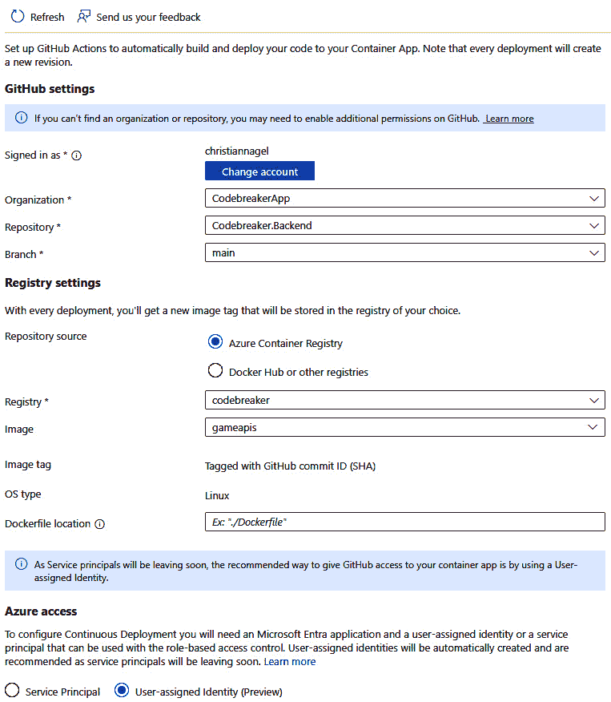

图 8.1 – 从 Azure 门户创建 GitHub Actions 工作流程

使用 Azure 门户，您可以选择 GitHub 仓库，配置您希望使用的 Azure 容器注册表，并指定一个 **服务主体** 或 **用户分配的身份** 值来发布项目。

另一个选项是使用 Visual Studio。使用 Visual Studio，您可以选择一个项目（例如，`game-apis`），然后从上下文菜单中选择 **发布…**。在添加新的发布配置文件时，您可以通过选择 **Azure** | **Azure 容器应用 (Linux)**，然后选择 **容器应用**，然后容器注册表，出现以下对话框：


图 8.2 – 通过 Visual Studio 创建 GitHub Actions 工作流程

在此对话框中，您可以直接发布到 Azure 容器应用或创建一个 GitHub Actions 工作流程。

这些选项的共同点是您可以按服务发布。在这里，您使用了 `azd up` 来部署完整解决方案。让我们看看 Azure 开发者 CLI 提供了哪些功能来创建 GitHub Actions 工作流程。

首先，您需要在仓库的根目录下创建一个 `.github` 文件夹。用于特定 GitHub 功能的文件存储在这个文件夹中。向这个文件夹添加一个 `workflows` 文件夹（`.github/workflows`）。所有 GitHub Actions 工作流程都需要存储在这个文件夹中。

接下来，创建 `codebreaker-deploy.yml` 文件。现在，将 `azure-deploy.yaml` 文件的内容复制到这个文件中。此文件来自 *Azure-Samples* 仓库：[`github.com/Azure-Samples/azd-starter-bicep/blob/main/.github/workflows/azure-dev.yml`](https://github.com/Azure-Samples/azd-starter-bicep/blob/main/.github/workflows/azure-dev.yml)。

现在我们已经创建了此工作流程文件，我们可以更仔细地查看它。

## 使用 YAML 语法的工怍流程文件

工作流程文件的语法使用了 **YAML Ain’t Markup Language**（**YAML**，一个递归缩写）语法。YAML 是一种面向数据的人可读序列化语言，它使用缩进来指定什么属于一起。

有关 YAML 规范和库的链接，请参阅 [`yaml.org/`](https://yaml.org/)。您可以通过以下速查表了解语法：[`yaml.org/refcard.html`](https://yaml.org/refcard.html)。

在进行一些小修改的同时，让我们更仔细地看看工作流程文件。

## 触发器

工作流程文件以名称开头，后跟触发器：

workflows/codebreaker-deploy.yml

```cs
name: Codebreaker backend workflow
on:
  workflow-dispatch:
push:
    branches:
      - main
    paths:
    - 'src/**'
```

工作流程的名称显示在工作流程列表中。`on` 关键字指定触发工作流程的事件。GitHub 提供了许多可以与工作流程一起使用的事件。在此 YAML 文件中，工作流程由 `workflow_dispatch` 事件触发。这允许您手动触发工作流程。第二个事件 `push` 在将更改推送到存储库时触发。由于 `push` 部分中的过滤，触发仅针对使用 `path` 指定的文件更改推送到 `main` 分支进行。如果我们不指定分支和路径过滤器，则工作流程将在存储库的每个更改时触发。

## 无密 Azure 联邦凭据权限

`permissions` 部分是一个新结构，用于与无密 Azure 联邦凭据一起使用以部署到 Azure：

workflows/codebreaker-deploy.yml

```cs
permissions:
  id-token: write
  contents: read
```

权限用于访问身份令牌和内容。使用 `contents read`，工作流程可以读取存储库的内容。`id-token write` 授予对身份令牌的写入访问权限。此令牌用于使用 Azure 认证 GitHub。

## Jobs 和 运行者

在工作流程文件中，在定义触发器之后，可以使用 `jobs` 关键字列出一个或多个应运行的作业：

workflows/codebreaker-deploy.yml

```cs
jobs:
  build-and-deploy:
    runs-on: ubuntu-latest
    env:
      AZURE_CLIENT_ID: ${{ vars.AZURE_CLIENT_ID }}
      AZURE_TENANT_ID: ${{ vars.AZURE_TENANT_ID }}
      AZURE_SUBSCRIPTION_ID: ${{ vars.AZURE_SUBSCRIPTION_ID }}
      AZURE_ENV_NAME: ${{ vars.AZURE_ENV_NAME }}
      AZURE_LOCATION: ${{ vars.AZURE_LOCATION }}
```

`build-and-deploy` 是作业的名称。一个作业需要一个运行者。GitHub 提供托管运行者，可以在 Linux、Windows 和 Mac 上运行作业。您可以在以下位置找到可用的运行者及其版本：[`docs.github.com/en/actions/using-github-hosted-runners/about-github-hosted-runners/about-github-hosted-runners#supportedrunners-and-hardware-resources`](https://docs.github.com/en/actions/using-github-hosted-runners/about-github-hosted-runners/about-github-hosted-runners#supportedrunners-and-hardware-resources)。如果需要其他硬件或操作系统版本，可以使用自定义运行者。

使用 `env` 关键字定义环境变量，这些变量可以在本运行者的步骤中使用。这些变量的值来自 GitHub 项目变量，使用 `vars` 对象。`${{ }}` 表达式在工作流程执行期间进行评估，检索到的值将在运行时添加到工作流程中。我们将稍后使用 `azd` `pipeline config` 指定这些值。

## 步骤和操作

一个作业由步骤和操作组成：

workflows/codebreaker-deploy.yml

```cs
jobs:
  build-and-deploy:
    runs-on: ubuntu-latest
    steps:
      - name: Checkout
        uses: actions/checkout@v4
      - name: Install azd
        uses: Azure/setup-azd@v1.0.0
      - name: Install .NET Aspire workload
        run: dotnet workload install aspire
# Code removed for brevity
```

第一步包括一个操作，`actions/checkout@v4`。此操作检出源代码以确保它与运行器一起可用。`@v4` 定义了用于此 GitHub 操作的版本号。操作通过 GitHub Marketplace 提供：[`github.com/marketplace?category=&query=&type=actions`](https://github.com/marketplace?category=&query=&type=actions)。每个操作都有文档，您可以阅读以了解哪些参数可用。例如，`actions/checkout` 允许在检出时包含子模块，并允许从其他存储库检出源代码。

下一个操作使用 `Azure/setup-azd` 安装 Azure 开发者 CLI。

使用托管运行器安装 .NET，但我们需要确保安装 .NET Aspire 工作负载。这可以通过使用 `run` 字段指定的单行脚本来完成 - 即，`dotnet workload install aspire`。

接下来，使用 `azd auth` 命令：

workflows/codebreaker-deploy.yml

```cs
      - name: Log in with Azure (Federated Credentials)
        if: ${{ env.AZURE_CLIENT_ID != '' }}
        run: |
azd auth login `
            --client-id "$Env:AZURE_CLIENT_ID" `
            --federated-credential-provider "github" `
            --tenant-id «$Env:AZURE_TENANT_ID»
        shell: pwsh
```

这里，我们需要使用之前定义的权限：使用联合身份进行身份验证。`if` 指定此步骤是条件性的 - 只有当 `AZURE_CLIENT_ID` 不为空时。如果 `AZURE_CLIENT_ID` 为空，我们将有另一个身份验证选项，如下一步所示。此步骤不使用 GitHub 操作；相反，`run` 字段定义了它将调用一个多行脚本。使用多行是通过行尾的 `|` 来指定的。PowerShell（通过 `shell` 字段指定）使用反引号（`` ` ``）作为行续字符。

使用 PowerShell 运行的命令是 `azd auth login`，并传递了一些参数。`--client-id` 使用具有必要 Azure 权限的服务主体的标识符。`--federated-credential-provider` 使用 GitHub 进行联合身份验证。联合身份验证允许您使用 GitHub 身份访问 Azure 上的资源。`--tenant-id` 指定用于 Azure 身份验证的 Azure 目录标识符。

下一步使用另一个条件脚本，如果设置了 `AZURE_CREDENTIALS` 变量：

workflows/codebreaker-deploy.yml

```cs
- name: Log in with Azure (Client Credentials)
   if: ${{ env.AZURE_CREDENTIALS != '' }}
   run: |
     $info = $Env:AZURE_CREDENTIALS | ConvertFrom-Json -AsHashtable;
     Write-Host "::add-mask::$($info.clientSecret)"
     azd auth login `
       --client-id "$($info.clientId)" `
       --client-secret "$($info.clientSecret)" `
       --tenant-id "$($info.tenantId)"
   shell: pwsh
   env:
     AZURE_CREDENTIALS: ${{ secrets.AZURE_CREDENTIALS }}
```

`AZURE_CREDENTIALS` 环境变量存储为 JSON 脚本。这被转换为一个名为 `info` 的 PowerShell 哈希表变量，使我们能够访问 JSON 内容的各个部分，例如客户端 ID、客户端密钥和租户 ID。然后，这些部分被传递给 `azd auth login` 命令。`AZURE_CREDENTIALS` 本身是通过 `secrets.AZURE_CREDENTIALS` 获取的。密钥存储在与 GitHub 项目一起加密的旁边，不是存储库源代码的一部分。我们将在下一节中配置这些密钥。

最后，调用两个单行命令：

workflows/codebreaker-deploy.yml

```cs
      - name: Provision Infrastructure
        run: azd provision --no-prompt
      - name: Deploy Application
        run: azd deploy --no-prompt
```

第一个命令 `azd provision` 根据 AppHost 项目的 `app-model` 定义创建 Azure 基础设施。如果基础设施已经存在，则会检查是否需要更改，并且仅应用更新。然后 `azd deploy` 将服务部署到 Azure，从而构建 Docker 镜像，将它们发布到 Azure 容器注册库，并使用创建的镜像创建各种 Azure 容器应用。`--no-prompt` 选项不会等待用户与此命令交互，而只是使用默认值。

我们之前使用的 `azd up` 命令使用了 `azd provision` 和 `azd deploy`。

在您的仓库中创建 `.github/workflows` 文件夹，并将 `codebreaker-deploy.yml` 工作流程文件复制到该文件夹。

## GitHub 变量和密钥

密钥不应包含在源代码中，工作流程文件与源代码一起存储。GitHub 有一个保险库，您可以在其中存储源代码仓库之外的密钥。使用 `azd`，可以自动配置 GitHub 中的密钥和变量。

`azd pipeline` 命令支持此功能。首先，将当前目录设置为仓库的根文件夹。`azd pipeline` 需要的 `.github/workflows` 文件夹必须与您运行 `azd pipeline` 的目录相同；您还必须在目录中初始化 .NET Aspire 应用程序。此要求可能会更改 - 请检查本章 GitHub 仓库中的 README 文件以获取更多信息。

运行以下命令以配置管道：

```cs
azd auth login
azd pipeline config --auth-type federated --principal-name github-codebreaker-dev
```

`azd pipeline config` 使用您之前配置的 Azure 订阅来创建 GitHub 变量和密钥，以及创建 Azure 应用注册，这允许 GitHub 将应用程序部署到 Azure。默认情况下，创建的主名称以 `az-dev-` 开头，并包含创建的日期和时间。在此处，我们指定主名称为 `github-codebreaker-dev`。创建了 `AZURE_ENV_NAME`、`AZURE_LOCATION`、`AZURE_SUBSCRIPTION_ID`、`AZURE_TENANT_ID` 和 `AZURE_CLIENT_ID` 的仓库变量。

在浏览器中打开 GitHub 仓库。在门户中，点击 **设置**。在左侧面板中打开 **安全** 类别，您将看到 **密钥和变量**。在此子类别中，当您打开 **操作** 时，您将看到 **操作密钥和变量** 页面，其中包含 **仓库密钥**。这如图 *图 8**.3* 所示：

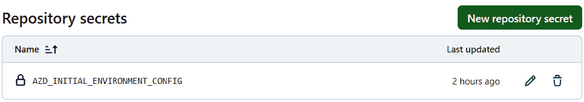

图 8.3 – 仓库密钥

`AZD_INITIAL_ENVIRONMENT_CONFIG` 密钥包含 `.azure/[环境]/config.json` 文件的内容。此文件包含一个公开可访问的服务列表，并由 `azd deploy` 读取以配置 Ingress 控制器。所需的环境名称、位置、订阅 ID 和其他详细信息存储在仓库变量中。

因为 `azd pipeline config` 为 GitHub 创建了联邦身份凭证，所以在默认（联邦）配置下不需要 Azure 的密钥。您可以选择传递 `client-credentials`，这样配置的凭证将被存储在存储库的密钥中，而不是使用 `federated` 的值。

注意

在 *第六章* 中，您了解了如何使用 Azure Container Apps 将密钥和变量分开，然后在 *第七章* 中使用 Azure App Configuration 和 Key Vault 进行操作。这里使用 GitHub Actions 的分离原因与此类似。

GitHub 允许您指定不同的存储密钥和变量的级别。当需要在组织内的不同存储库之间共享密钥时，可以使用组织级别。存储库密钥存储在存储库的作用域内，并且不可从其他存储库访问。环境密钥存储在部署环境中。这些将在 *使用部署* *环境* 部分中稍后介绍。

现在运行 GitHub Actions 工作流 – 要么通过将源代码更新推送到 GitHub 存储库，要么通过从 GitHub 门户显式运行工作流。您将看到在工作流完成之前它正在运行：

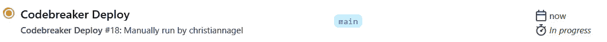

图 8.4 – 工作流进行中

在这个阶段，您可能需要等待代理可用。当它正在运行时，您可以点击它以查看有关正在进行的操作的信息。*图 8**.5* 展示了工作流成功完成后出现的步骤：

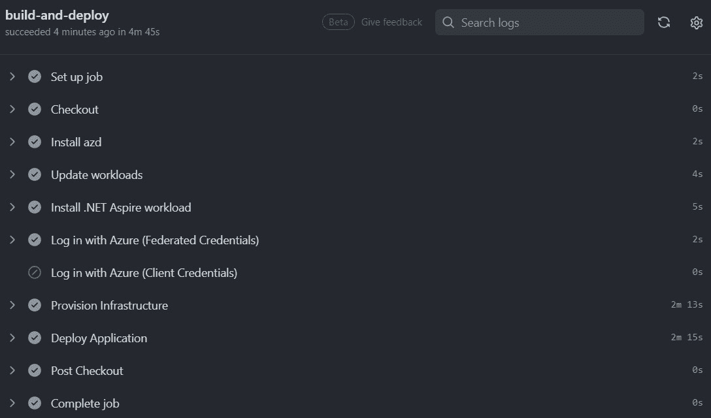

图 8.5 – 工作流步骤

检查日志后，您将看到所有已完成的步骤。在前面的图中，您可以看到使用了联邦凭证，而不是客户端凭证。您可以点击这些步骤中的每一个以获取更多详细信息。

使用 `azd` 创建 GitHub Actions 工作流时，只需要几个语句即可部署完整解决方案。对于每次未推送到主分支的源代码更改，都会更新部署。

## 利用 GitHub Actions 获取更多功能

使用来自 Visual Studio、Azure 门户或通过 `azd pipeline` 命令的集成来创建 GitHub 动作非常方便。`azd pipeline` 非常适合部署完整解决方案，但由于其处于早期开发阶段，一些功能尚未实现。我们的解决方案需要更多功能；我们将手动进行定制。

让我们看看我们的一些目标：

+   所有服务都应该构建、测试和部署

+   NuGet 包应该发布到 GitHub Packages 并在那里提供

+   我们不想重复代码，所以我们将创建可重用的工作流

+   应将部署到多个环境，例如开发、测试和生成环境

让我们深入了解细节。

# 增强 GitHub Actions 工作流

为了构建我们的服务，我们必须创建可重用的工作流。首先，让我们配置这些工作流所需的变量和密钥。

## 配置变量和密钥

我们之前已经使用`az pipeline config`配置了变量和密钥。如果您需要更多自定义，您可能需要自己设置这些值。您已经看到了如何使用 GitHub 门户访问仓库密钥和变量。现在，让我们将这些添加到密钥中：

+   `AZURE_TENANT_ID`

+   `AZURE_SUBSCRIPTION_ID`

+   `AZURE_CLIENT_ID`

要获取租户 ID，请使用 Azure CLI：

```cs
az account show --query tenantId -o tsv
```

`az account show`返回有关已登录 Azure 账户的 JSON 信息。使用 JSONPath `--query tenantId`查询，返回 Microsoft Entra 租户 ID。`-o tsv`以制表符分隔的值返回结果。使用`AZURE_TENANT_ID`仓库密钥设置返回的值。

订阅 ID 也可以使用`az` `account show`列出：

```cs
az account show --query id -o tsv
```

在这里，`id`包含订阅 ID。使用`AZURE_SUBSCRIPTION_ID`仓库密钥设置此值。

在本章的早期，我们使用了`azd pipeline`命令来创建联合身份验证的账户。让我们在 Microsoft Entra 门户中查看此账户：[`entra.microsoft.com`](https://entra.microsoft.com)。登录后，从左侧栏中，在`github-codebreaker-dev`内。如果您没有提供名称，`azd`将创建以`az-dev`开头的账户。打开此账户，在**管理**类别中，点击**证书和密钥**。打开**联合凭据**。您将看到基于 GitHub 组织和仓库命名的凭据，实体类型为**拉取请求**和**分支**。将为 GitHub Actions 部署 Azure 资源提供一个预定义的联合凭据场景。

注意

要使用 Azure 门户、Azure CLI 或 Azure PowerShell 使用联合凭据创建新的应用程序注册，请参阅以下文档：[`learn.microsoft.com/en-us/azure/developer/github/connect-from-azure?tabs=azure-portal%2Clinux#add-federated-credentials`](https://learn.microsoft.com/en-us/azure/developer/github/connect-from-azure?tabs=azure-portal%2Clinux#add-federated-credentials)。

复制`AZURE_CLIENT_ID`仓库密钥的值。

现在我们已经指定了必要的密钥和变量，让我们回到创建工作流的步骤。

## 运行单元测试

当通过更新服务的源代码来触发工作流时，第一步应该是运行单元测试。让我们创建一个可重用的工作流：

`workflows/shared-test.yml`

```cs
name: Shared workflow to build and test a .NET project
on:
  workflow_call:
    inputs:
      project-name:
        description: 'The name of the project'
        required: true
        type: string
      solution-path:
        description: 'The solution file of the project to build and run tests'
        required: true
        type: string
      dotnet-version:
        description: 'The version of .NET to use'
        required: false
        type: string
        default: '8.0.x'
```

通过调用此工作流可以触发一个可重用的工作流。由`on`指定的触发器使用`workflow_call`关键字。在此阶段，所需的输入值也已定义。使用此工作流，`project-name`和`solution-path`是必需的输入值。`dotnet-version`输入值已分配默认值，因此不是必需的。

在触发器和输入值之后，定义了一个带有运行器的作业，随后是调用的步骤：

work flows/shared-test.yml

```cs
jobs:
  run-test:
    runs-on: ubuntu-latest
    steps:
      - name: Checkout to the branch
        uses: actions/checkout@v4
      - name: Setup .NET
        uses: actions/setup-dotnet@v4
        with:
          dotnet-version: ${{ inputs.dotnet-version }}
      - name: Install .NET Aspire workload
        run: dotnet workload install aspire
      - name: Restore NuGet Packages
        run: dotnet restore ${{ inputs.solution-path }}
      - name: Run unit tests
        run: dotnet test --logger trx --results-directory "TestResults-${{ inputs.project-name}}" --no-restore ${{ inputs.solution-path }}
      - name: Upload the test results
        uses: actions/upload-artifact@v4
        with:
          name: test-results-${{ inputs.project-name}}
          path: TestResults-${{ inputs.project-name}}
        if: always()
```

使用`actions/checkout`操作检出源代码后，使用`actions/setup-dotnet`安装.NET SDK。在这里，.NET 版本是从输入值中检索的。由于现在使用此运行器安装了.NET SDK，因此可以使用.NET CLI。在下一步中，不是调用操作，而是使用`run`关键字执行`dotnet restore`命令。`dotnet restore`检索引用解决方案的 NuGet 包。如果失败，则无需继续下一步。下一步使用`dotnet test`运行单元测试。`--logger`选项指定使用 TRX 日志格式写入日志输出 – 一个 Visual Studio `actions/upload-artifact`操作。工件可以用于在运行器之间共享数据，也可以与工作流程运行一起下载。默认情况下，只有前一个步骤成功时，步骤才会运行。在这种情况下，如果测试失败，则希望从工件中下载测试结果 – 这就是为什么在上传工件时添加了`if: always()`。

此共享工作流程从`codebreaker-test.yml`工作流程启动：

workflows/codebreaker-test.yml

```cs
# code removed for brevity
jobs:
  build-and-test:
    uses: ./.github/workflows/shared-test.yml
    with:
      project-name: 'Codebreaker-Backend'
      solution-path: 'src/Chapter08.sln'
```

定义的工作流程使用名称`build-and-test`，通过`uses`关键字引用共享工作流程文件，并使用`with`关键字设置输入值。

当主分支中指定的文件和文件夹发生更改时，此工作流程会被触发，这是明确的。**图 8.6**.6 显示了运行工作流程的结果：


图 8.6 – 运行工作流程

通过这个结果，你可以看到用于查看测试结果的可下载工件。

现在我们已经运行了单元测试，让我们将之前创建的构建和部署任务结合起来。

## 运行多个任务

要从一个工作流程中运行多个作业，我们需要从部署项目中创建一个共享工作流程：

workflows/shared-deploy.yml

```cs
name: Shared workflow to deploy a .NET Aspire project
on:
  workflow_call:
    inputs:
# code removed for brevity
    secrets:
      AZURE_CLIENT_ID:
        required: true
      AZURE_TENANT_ID:
        required: true
      AZURE_SUBSCRIPTION_ID:
        required: true
```

因为这是一个从其他工作流程触发的共享工作流程，所以`on`指定了`workflow_call`。此工作流程与之前创建的部署工作流程非常相似，所以这里没有重复代码。查看源代码存储库以获取完整工作流程。这里重要的是，不仅从调用工作流程传递了输入，还传递了秘密信息。这些秘密信息使用`$ {{ secrets.<secret> }}`表达式引用。

`codebreaker-testanddeploy.yml`工作流程调用这两个共享工作流程：

workflows/codebreaker-testanddeploy.yml

```cs
# code removed for brevity
jobs:
  build-and-test:
    uses: ./.github/workflows/shared-test.yml
    with:
      project-name: Codebreaker-Backend
      solution-path: src/Chapter08.sln
  build-and-deploy:
    needs:  build-and-test
    uses: ./.github/workflows/shared-deploy.yml
    with:
      environment-name: ${{ vars.AZURE_ENV_NAME }}
      location: ${{ vars.AZURE_LOCATION }}
    secrets:
      AZURE_CLIENT_ID: ${{ secrets.AZURE_CLIENT_ID }}
AZURE_TENANT_ID: ${{ secrets.AZURE_TENANT_ID }}
      AZURE_SUBSCRIPTION_ID: ${{ secrets.AZURE_SUBSCRIPTION_ID }}
```

使用 `needs` 关键字，`build-and-deploy` 作业被定义为在运行之前需要 `build-and-test` 作业。如果 `build-and-test` 作业没有成功，则 `build-and-deploy` 不会运行。需要将密钥转发到共享工作流程。有了密钥，你可以指定要传递给调用工作流程的每个密钥，或者将调用工作流程中可用的所有密钥与被调用工作流程共享。在使用环境时（如后续部分所示），需要继承这些密钥。

当你在这一阶段运行工作流程时，你会看到一个图形视图，显示了两个作业是如何连接的，如图 *图 8.7* 所示。7*：

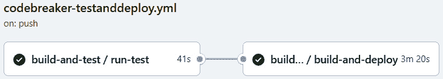

图 8.7 – 运行多个作业

这两个任务都成功完成了。

接下来，我们将深入了解可以从多个作业中使用的环境，例如，将解决方案部署到预生产和生产环境。

# 使用部署环境

当在开发者的本地系统上运行解决方案时，项目可以在本地构建和调试。只需要运行少数服务，例如 App Insights 和 Key Vault，这些服务需要在 Azure 云环境中运行。这由 .NET Aspire 自动完成，它在 AppHost 项目中配置了 `app-model`。你只需确保你已经配置了 `Azure:SubscriptionId` 使用用户密钥。为了在 Azure 中运行和测试应用程序，并尝试不同的 Azure 产品，团队中的每个开发者都可以使用 `azd init` 和 `azd up` 来在个人 Azure 订阅中运行所有服务，该订阅是 Visual Studio Professional 和 Enterprise 提供的一部分。

使用共享环境也很有用，其中解决方案在 Microsoft Azure 中运行的服务由开发团队共同使用。一个例子是客户端应用程序开发者使用新的每日构建来测试访问云中服务的客户端应用程序。这是 *开发环境*。

要运行负载测试，拥有 *测试环境* 是有用的。这些环境可以在运行负载测试之前按需创建。在负载测试完成后，并记录了结果后，它们可以被删除。有关运行测试的更多详细信息，请参阅 *第十章*。

在将应用程序移入生产之前，使用与 *生产环境* 相似的 *预生产环境* 来进行最终测试，如果应用程序表现如预期。

我们可以通过使用 GitHub Actions 将解决方案部署到所有这些环境中。然而，其中一些环境更为限制性，这意味着只有在验证了解决方案在定义的约束下成功运行后，才能进行部署。

让我们更仔细地看看。

## 使用 Azure 开发者 CLI 创建环境

要使用 Azure 开发者 CLI 创建环境，你可以使用 `azd env` `new` 命令：

```cs
azd env new codebreaker-08-prod
```

这不仅创建了一个名为 `codebreaker-08-prod` 的新环境，还将当前环境设置为这个新环境。要显示所有已配置的环境，请运行以下命令：

```cs
azd env list
```

这显示了所有已配置的环境以及当前选定的环境。要更改当前环境，请运行以下命令：

```cs
azd env select codebreaker-dev
```

使用 `azd` 创建环境会创建 `.azure` 子目录。打开此文件夹后，您将看到 `config.json` 文件。这显示了当前选定的环境。

每创建一个环境，都会创建一个包含环境名称的子目录，其中包含资源组、Azure 区域和 Azure 订阅 ID 的值。在创建新环境时，您可以使用 `--subscription` 选项更改订阅。要更改资源的位置，请使用 `--location`。

要查看环境的配置值，请运行以下命令：

```cs
azd env get-values
```

在之后更改 Azure 区域，您可以使用 `azd` `env set`：

```cs
azd env set AZURE_LOCATION eastus3
```

虽然 Azure 开发者 CLI 支持使用多个环境，但与 GitHub 环境结合使用（目前）尚不可直接访问，但可以轻松定制。在撰写本文时，`azd pipeline config` 命令仅支持每个仓库一个环境。然而，这预计将会改变，并且与 GitHub 环境的集成已经在讨论中。请检查本章仓库中的 README 文件以获取更新。

您仍然可以使用 `azd pipeline` 为每个环境创建联邦账户：

```cs
azd pipeline config --auth-type federated --principal-name github-codebreaker-prod
```

这将创建我们将与 `codebreaker-08-prod` 环境一起使用的账户。

到目前为止，我们需要学习如何使用 GitHub 环境。因此，我们将从创建 GitHub 环境开始。

## 创建 GitHub 环境

在使用 GitHub 环境之前，您需要知道此 GitHub 功能仅适用于免费公共仓库。对于私有仓库，需要团队许可证（见 [`github.com/pricing`](https://github.com/pricing)）。

在浏览器中打开您的 GitHub 仓库并点击 **设置**。在左侧面板中，在 **代码和自动化** 类别下，点击 **环境**。*图 8**.8* 显示了开发、测试、预发布和生产环境：

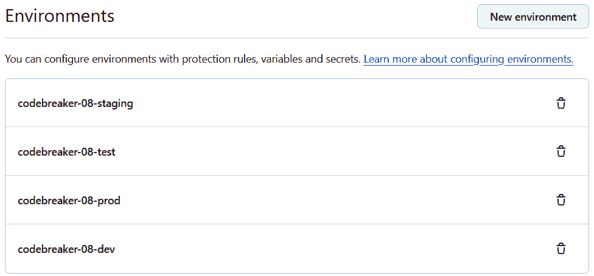

图 8.8 – GitHub 环境

您可以通过访问您的仓库使用浏览器创建这些环境。在创建环境的同时，可以应用保护规则。

## 定义部署保护规则

在发布到另一个环境之前，你可以强制执行**部署保护规则**。发布到生产环境可能仅允许从**受保护的分支**、满足命名约定的特定分支以及仅使用特定标签名的提交中进行。最多可以指定六个审查员来批准部署。还有实施自定义保护规则的选择，例如，可能检查不同测试运行的结果（测试将在*第十章*中介绍）或检查 GitHub 仓库中的问题。第三方保护规则也可用。

注意

在应用的前几个版本中，你将在不同的环境中开始部署，这时添加一些进行手动检查的审查者是良好的实践。在解决方案部署到**生产环境**之前，它需要先部署到**预发布环境**。在预发布环境中，使用手动检查。在改进 CI/CD 流程的道路上，你可能需要添加越来越多的自动检查。在进入下一阶段之前，可以进行自动化测试、代码分析、检查问题等。

在生产环境中，添加自己作为必需审查员，并启用部署保护，如图*图 8.9*所示：

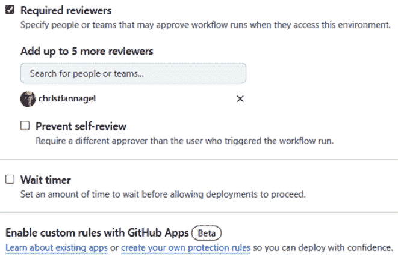

图 8.9 – GitHub 环境下的必需审查员

除了要求审查员外，你还可以使用 GitHub 合作伙伴应用程序中现有应用程序定义的规则来要求某些源代码或问题检查，并实施自定义保护规则。

注意

当使用分支和标签的部署保护规则时，你应该指定并非每个人都可以创建与规则一起使用的分支和标签。有关更多详细信息，请参阅[配置标签保护规则](https://docs.github.com/en/repositories/managing-your-repositorys-settings-and-features/managing-repository-settings/configuring-tag-protection-rules)。

接下来，我们将使用环境配置密钥和变量。

## 设置环境密钥和变量

使用环境，你还可以指定仅在这些环境中可用的变量和密钥。我们需要之前创建的联合账户的租户 ID、订阅 ID 和账户 ID。这些信息已在*增强 GitHub Actions 工作流程*部分配置。

作为提醒，要获取租户 ID，请使用`az account show –query tenantId -o tsv`。要获取订阅 ID，请使用`az account show --query id -o tsv`。对于账户，要使用环境，还需要额外的凭证。

打开 Entra 门户([`entra.microsoft.com`](https://entra.microsoft.com))并选择`az-dev<date>`。选择`repo:<github org/repo>:pull_request`和`repo:<github org/repo:refs/heads/main>`主题标识符已添加。添加新的凭据并选择**GitHub Actions 部署 Azure 资源**，如图*图 8**.10*所示：

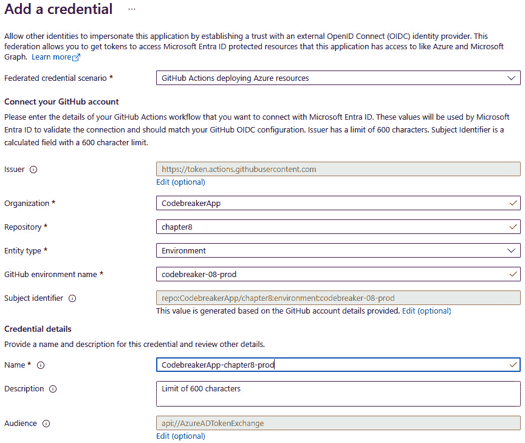

图 8.10 – 环境凭据

在此对话框中，添加您的 GitHub**组织**和**仓库**，选择**实体类型**为**环境**，输入与您的 GitHub 环境匹配的**GitHub 环境名称**值，并提供**凭据详情**。

要配置密钥，复制此应用程序注册的**应用程序（客户端）ID**值。

一旦您有了这些值，在 GitHub 门户中打开环境并添加**环境密钥**和**环境变量**，如图*图 8**.11*所示：

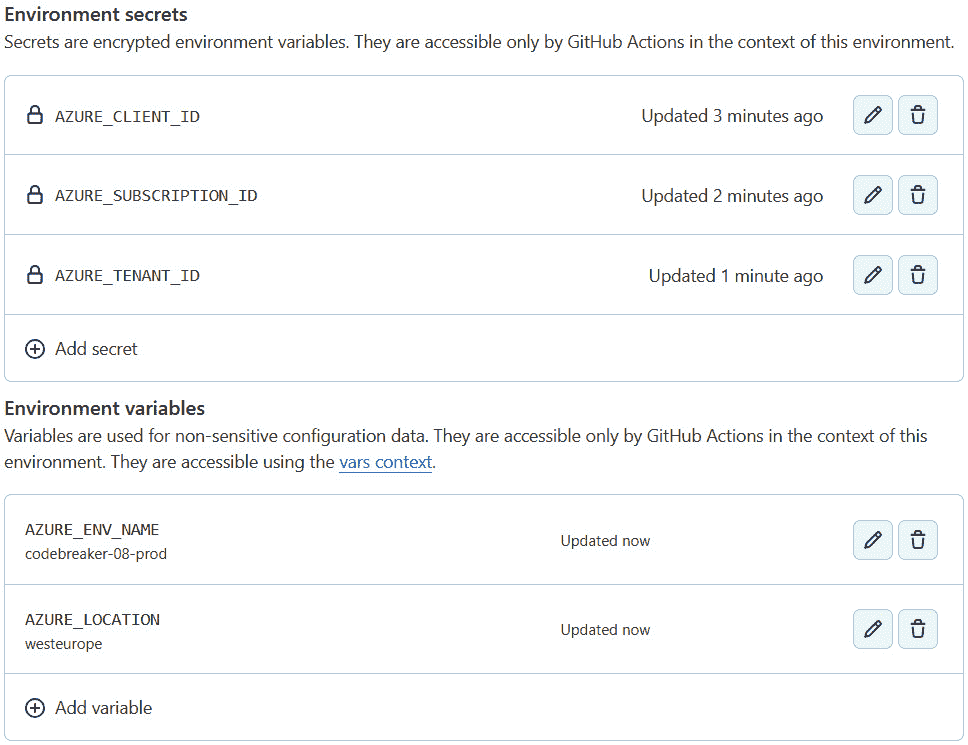

图 8.11 – 配置环境密钥和环境变量

需要以下变量：

+   `AZURE_ENV_NAME`: 应使用不带`rg-`前缀的资源组名称 – 例如，`codebreaker-08-prod`

+   `AZURE_LOCATION`: 您首选的 Azure 区域

您将需要以下密钥：

+   `AZURE_SUBSCRIPTION_ID`

+   `AZURE_TENANT_ID`

+   `AZURE_CLIENT_ID`

在此配置就绪后，让我们更新工作流。

## 使用工作流的环境

要使用工作流中的环境，您只需引用环境名称。将共享工作流`shared-deploy.yml`复制到`shared-deploy-withenvironment.yml`，并增强其环境配置：

workflows/shared-deploy-withenvironment.yml

```cs
# code removed for brevity
  workflow_call:
inputs:
      environment-name:
        description: 'The environment to deploy to'
        required: true
        type: string
jobs:
  build-and-publish:
    runs-on: ubuntu-latest
    environment: ${{ inputs.environment-name }}
```

在配置作业时，使用`environment`关键字来引用环境名称。在此实现中，使用必需的输入参数来传递环境名称。无需对密钥和变量进行更改。在环境中运行时，这些值是从环境配置中检索的。

使用各种工作流创建和推送 Docker 镜像以及发布容器应用的`codebreaker-production.yml`工作流与开发环境不同，如下所示：

workflows/codebreaker- produnction.yml

```cs
# code removed for brevity
jobs:
  build-and-deploy:
    uses: ./.github/workflows/shared-deploy-withenvironment.yml
    secrets: inherit
    with:
      environment-name: codebreaker-08-prod
```

环境参数现在设置为`codebreaker-08-prod`。这次，密钥没有明确声明，但所有此工作流可以访问的密钥都传递给了被调用的工作流。由于被调用工作流指定的环境，密钥和变量是从 GitHub 环境引用的。

现在，您可以尝试触发工作流。第一阶段运行，但第二阶段必须进行审查，如图*图 8**.12*所示：

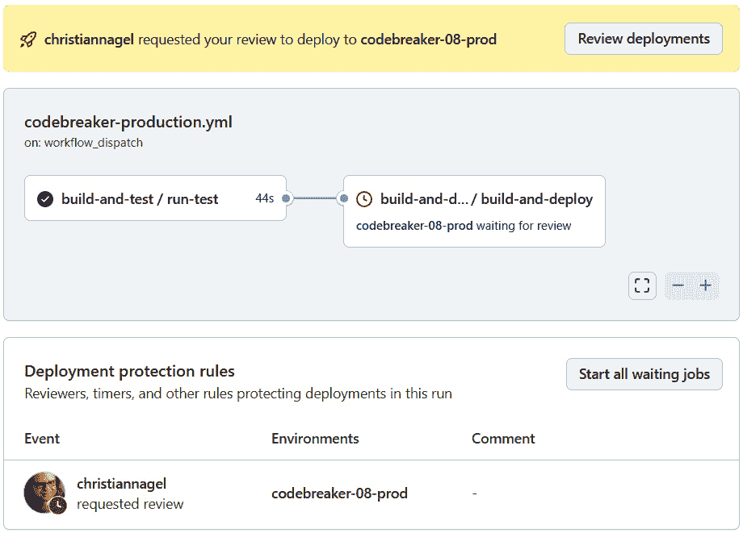

图 8.12 – 工作流请求审查

查看工作流程的结果并批准它，如图 *8.13* 所示：

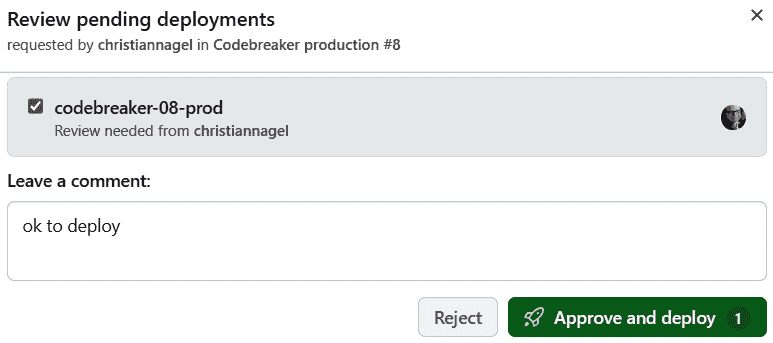

图 8.13 – 批准和部署

在这一点上，你需要等待几分钟，直到所有资源都部署到生产环境中。验证部署是否成功。在成功部署后，你可以使用客户端，更新到新环境的链接，并玩游戏。

对于客户端程序员，我们将创建一个 NuGet 包。

# 发布 NuGet 包

在我们的解决方案中，我们还有客户端应用程序使用的库。拥有 NuGet 包有助于使用这些库。通过创建 GitHub 动作，我们可以自动构建和发布 NuGet 包。如果你想使包公开可用，你可以将其发布到 NuGet 服务器（你已经使用过可用于本书的包）。要使包私有并需要身份验证，GitHub 提供 **GitHub Packages**。

## 准备库项目

向项目中添加一些元数据，例如描述包的 README Markdown 文件，以及替换默认图标的自定义图标，可以增强可用性。

`Codebreaker.GameAPIs.KiotaClient` 项目包含一个 `readme.md` 文件和一个图标 JPG 文件。这些添加需要在项目文件中上传：

Codebreaker.GameAPIs.KioataClient/Codebreaker.GameAPIs.KiotaClient.csproj

```cs
  <ItemGroup>
    <None Include="package/readme.md" Pack="true" PackagePath="\" />
    <None Include="package/codebreaker.jpeg" Pack="true" 
     PackagePath="\" />
  </ItemGroup>
```

README 文件和图标不需要构建到库中，这就是为什么在 `ItemGroup` 中使用 `None` 来排除它们从库的构建结果中。将这些项目添加到 NuGet 包中是通过 `Pack` 属性指定的。`PackagePath` 指定这些项目可以在包中的哪个文件夹找到。

以下 `PropertyGroup` 定义指定了 README 文件和包图标的使用，并添加了一些元数据：

Codebreaker.GameAPIs.KioataClient/Codebreaker.GameAPIs.KiotaClient.csproj

```cs
  <PropertyGroup>
    <PackageId>
      CNinnovation.Codebreaker.KiotaClient
    </PackageId>
    <PackageTags>
      Codebreaker;CNinnovation;Kiota
    </PackageTags>
    <Description>
      This library contains Kiota-generated classes for communication 
      with the Codebreaker games API service.
      See https://github.com/codebreakerapp for more information on 
        the complete solution.
    </Description>
    <PackageReadmeFile>readme.md</PackageReadmeFile>
    <PackageIcon>codebreaker.jpeg</PackageIcon>
  </PropertyGroup>
```

使用 `PackageId`、`PackageTags` 和 `Description` 元素指定向包添加元数据。

定义包的版本也是一个好主意。与源代码仓库一起，`Directory.Build.props` 文件中定义的 `VersionPrefix` 元素指定了子目录中找到的所有项目的版本的第一部分。使用 GitHub 动作，动态添加一个 `VersionSuffix` 元素，该元素在每次构建时递增。这种版本控制方案用于 `alpha`、`beta` 和 `prerelease` 版本。

一旦库发布，就会添加 `Version` 元素来指定包的完整版本。将 `Version` 元素添加到项目会覆盖 `VersionPrefix` 和 `VersionSuffix`，并且只使用这个版本。发布后，当下一个 beta 版本可用时，`Version` 元素再次被移除，`VersionPrefix` 元素递增到下一个迭代。

## 创建访问令牌

要将包发布到 GitHub Packages，需要一个**个人访问令牌（经典版）**。在撰写本文时，新的细粒度个人访问令牌不能与 GitHub Packages 一起使用。

你可以通过点击右上角的用户图标，选择**设置**，然后在左侧面板中点击**开发者设置**来创建一个个人访问令牌。选择**个人访问令牌**并点击**令牌（经典版）**。要创建新令牌，选择**生成新令牌（经典版）**。选择一个过期日期。发布包所需的范围是**write:packages**。选择此范围还会添加其他范围，例如读取包和访问仓库。点击**生成令牌**。你需要复制这个生成的令牌——关闭屏幕后它将不再可见。只需确保将其存储在安全的地方。如果你没有令牌，或者令牌已过期，你可以创建一个新的令牌。

对于你希望使用的 GitHub 动作，将此令牌存储在 `PAT_PUBLISHPACKAGE` 仓库的秘密中。

现在我们已经存储了这个秘密，让我们使用 GitHub 动作来使用它。

## 创建一个用于发布 GitHub 包的 GitHub 动作

用于创建 NuGet 包的 GitHub 动作与我们之前创建的 GitHub 动作有相似之处。查看源代码仓库以获取详细信息。

`shared-create-nuget.yml` 共享工作流程构建 NuGet 包并将其与 GitHub 艺术品一起上传。以下步骤在此工作流程中完成：

1.  查看源代码。

1.  设置 .NET。

1.  计算构建号（使用配置的偏移量到 GitHub 构建号）。

1.  使用 `dotnet build` 构建库。

1.  使用 `dotnet test` 测试库。

1.  使用 `dotnet pack` 创建 NuGet 包。

1.  使用 GitHub 艺术品上传包。

下一个共享工作流程（`shared-githubpackages.yml`）通过以下步骤将包上传到 GitHub Packages：

1.  下载 GitHub 艺术品。

1.  设置 .NET。

1.  使用 `dotnet nuget add source` 设置 NuGet 源。

1.  使用 `dotnet nuget push` 将包推送到 GitHub Packages。

推送包时使用配置的访问令牌。

`kiota-lib.yml` 工作流程连接两个共享工作流程并传递参数。在成功运行此工作流程后，你可以使用 GitHub 仓库的组织验证包，如图 8.14 所示。14*：

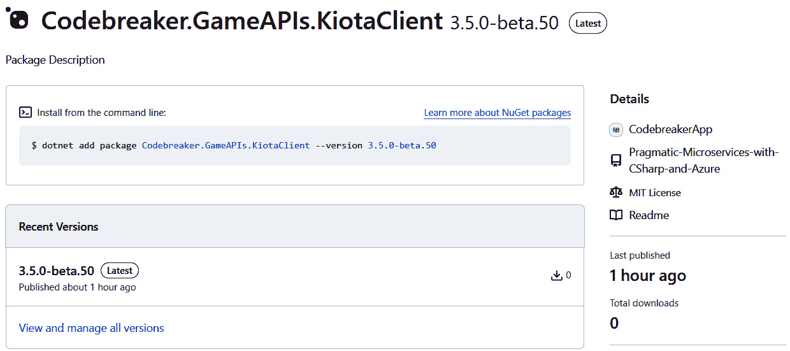

图 8.14 – GitHub Packages

使用 GitHub 环境，你可以增强 NuGet 包的创建并定义环境，例如，在成功使用 GitHub Packages 的私有源之后，仅将包发布到公开可用的 NuGet 服务器。

在现代部署中，不仅仅是使用开发、测试和生产环境。我们将在下一节讨论这个问题。

# 使用现代部署模式

使用开发、预发布和生产环境是“传统”部署模式之一。如今，也使用了其他部署模式：

+   当使用**金丝雀发布**时，用户可以选择不同的应用程序版本。这从 Edge 浏览器中很明显，它提供每月更新的 Beta 频道、每周更新的 Dev 频道和每日更新的金丝雀频道。用户可以决定要测试哪个版本。有关更多详细信息，请参阅[`www.microsoft.com/en-us/edge/download/insider`](https://www.microsoft.com/en-us/edge/download/insider)。

+   在**A/B 测试**中，用户随机收到两种不同的用户界面之一。当使用此模式时，您可以监控哪种 UI 可以让用户更高效。

+   **蓝绿部署**允许您通过安装到预发布服务器，交换预发布与生产环境，快速回滚安装。如果出现问题，可以轻松回滚。

+   **暗启动**是一种模式，您可以在确保新功能在激活开关打开之前隐藏的情况下发布应用程序的新版本。一个例子是当功能应在特定时间可用时。此开关可以通过时间事件打开 – 无需重新部署应用程序。

+   **功能开关**允许您打开/关闭每个功能。一个选项是为特定用户组启用一些功能，例如早期采用者。用户自己也可以决定他们想要测试的新功能。此类开关在 Microsoft Azure 和 Visual Studio 中可用。

在*第七章*中，您看到了 Azure App Configuration 的实际应用。这项 Azure 服务不仅支持集中式应用程序配置，还提供了功能标志。Azure App Configuration 的这项功能可以通过使用不同的功能标志过滤器与几种现代部署模式一起使用。

## 配置功能标志

让我们打开使用 Bicep 脚本创建的 Azure App Configuration 服务。在左侧面板中，在**操作**类别下，打开**功能管理器**。

注意

由于资源是从 Bicep 脚本创建的，您可能无法访问此资源以添加配置数据。使用**访问控制（IAM）**，将您的用户添加到**应用程序配置数据所有者**或**贡献者**角色。您可能需要等待大约 15 分钟，角色才会更改。

创建一个新的功能标志，如图*8.15*所示：

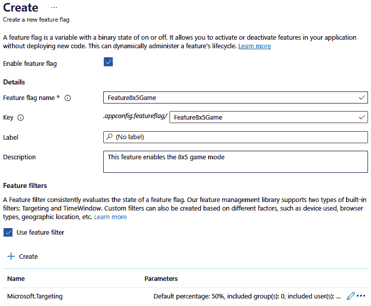

图 8.15 – 创建功能标志

将功能标志的名称设置为`Feature8x5Game`，添加描述，并勾选`FeatureGame6x4Mini`、`FeatureGame6x4`和`FeatureGame5x5x4`。对于前两个，不要添加过滤器；只需启用这些中的一个。对于最后一个，添加时间过滤器，以便将来可以启用，但不要设置过期日期。

**目标过滤器**允许您为特定用户组（早期采用者）打开功能。它也可以作为百分比过滤器，因此您可以为此随机百分比的用户打开此功能。另一个内置过滤器是**时间窗口过滤器**。使用此过滤器，您可以指定此功能应启用的开始和结束时间。您还可以为过滤器创建自定义实现。

现在我们已经配置了这个功能标志，让我们从`game-apis`服务中使用它。

## 功能标志的 DI 和中间件配置

要使用功能管理，将`Microsoft.FeatureManagement.AspNetCore` NuGet 包添加到`Codebreaker.GameAPIs`项目中。DI 容器需要配置功能标志，如下所示：

Codebreaker.GameAPIs/Program.cs

```cs
// code removed for brevity
builder.Services.AddFeatureManagement()
  .AddFeatureFilter<TargetingFilter>()
  .AddFeatureFilter<TimeWindowFilter>();
```

`AddFeatureManagement`扩展方法注册了功能标志所需的类型。每个使用的过滤器都通过`AddFeatureFilter`扩展方法添加。

备注

功能管理 API 也可以在不使用 Azure 的情况下使用。在查看本书 GitHub 仓库中的源代码时，您会看到功能管理 API 也可以不使用 Azure 进行配置。在这种情况下，调用`AddFeatureManagement` API 的重载以传递`IConfiguration`对象。有了这个，功能标志可以使用.NET 配置选项进行配置。请参阅*第七章*以获取有关配置的更多信息。

要将功能管理连接到 Azure App Configuration，您必须更新`AddAzureAppConfiguration`方法：

Codebreaker.GameAPIs/Program.cs

```cs
  builder.Configuration.AddAzureAppConfiguration(options =>
  {
    options.Connect(new Uri(endpoint), credential)
      .Select("GamesAPI*")
      .ConfigureKeyVault(kv =>
      {
        kv.SetCredential(credential);
      })
      .UseFeatureFlags();
  });
```

`UseFeatureFlags`是`AzureAppConfigurationOptions`类的一个方法，用于连接功能标志。

在使用功能标志时，Azure App Configuration 中间件也需要进行配置：

Codebreaker.GameAPIs/Program.cs

```cs
var app = builder.Build();
if (solutionEnvironment == "Azure")
{
  app.UseAzureAppConfiguration();
}
```

设置完成后，我们可以检查功能标志是否已设置。

## 使用功能标志

现在，我们可以使用功能管理器来检查功能是否可用。我们将首先为`IFeatureManager`接口创建一个扩展方法：

Codebreaker.GameAPIs/Extensions/FeatureManagerExtensions.cs

```cs
public static class FeatureManagerExtensions
{
  private static List<string>? s_featureNames;
  public static async Task<bool> IsGameTypeAvailable(this 
    IFeatureManager featureManager, GameType gameType)
  {
    async Task<List<string>> GetFeatureNamesAsync()
    {
      List<string> featureNames = [];
      await foreach (string featureName in featureManager.
        GetFeatureNamesAsync())
      {
        featureNames.Add(featureName);
      }
      return featureNames;
    }
    string featureName = $"Feature{gameType}";
    if ((s_featureNames ?? await GetFeatureNamesAsync()).
    Contains(featureName))
    {
      return await featureManager.IsEnabledAsync(featureName);
    }
    else
    {
      return true;
    }
  }
}
```

此方法使用由`IFeatureManager`接口定义的`GetFeatureNamesAsync`和`IsEnabledAsync`方法。在第一次调用此方法时，检索与功能管理器注册的功能列表，并将其添加到`_featureNames`集合中。并非每种游戏类型都注册为功能。对于未注册为功能的游戏类型，该方法返回`true`以通知我们此类型可用。对于所有已注册为功能的游戏类型，使用`IsEnabledAsync`方法来检查功能是否启用。

接下来，让我们用最少的 API 注入`IFeatureManager`：

Codebreaker.GameAPIs/Endpoints/GameEndpoints.cs

```cs
group.MapPost("/", async Task<Results<Created<CreateGameResponse>, BadRequest<GameError>>> (
  CreateGameRequest request,
  IGamesService gameService,
  IFeatureManager featureManager,
  HttpContext context,
  CancellationToken cancellationToken) =>
  {
    Game game;
    try
    {
      bool featureAvailable = await featureManager.
        IsGameTypeAvailable(request.GameType);
      if (!featureAvailable)
      {
        GameError error = new(ErrorCodes.
          GameTypeCurrentlyNotAvailable, "Game type currently not 
          available", context.Request.GetDisplayUrl());
        return TypedResults.BadRequest(error);
      }
      game = await gameService.StartGameAsync(request.GameType.
        ToString(), request.PlayerName, cancellationToken);}
// code removed for brevity
```

在使用 API 启动游戏时，`IFeatureManagement`接口被注入以检查请求的游戏类型，并使用之前创建的扩展方法`IsGameTypeAvailable`启用功能。根据结果，会返回错误或创建一个新的游戏。

使用此实现，您可以运行应用程序并测试这些功能标志。`game-apis`项目包含一个 HTTP 文件，您可以使用它创建所有不同的游戏类型，并查看使用功能标志时返回的结果。您可以在您的开发系统上本地测试。在将更新推送到您的 GitHub 仓库后，一个工作流程已准备好被触发。然后，您只需在 HTTP 文件中配置您的 API 服务的链接，以测试使用 Azure Container Apps 运行的服务。

# 摘要

在*第六章*中使用 Bicep 脚本创建 Azure 服务之后，在本章中，您学习了如何使用 GitHub Actions 进行**持续集成**（**CI**）和**持续交付**（**CD**）。在这里，您更改了源代码，创建并合并了一个拉取请求，测试了代码，并部署了 Azure Container Apps。使用 GitHub Actions，您学习了如何构建 NuGet 包并将它们推送到 GitHub Packages。

使用 GitHub 环境，您创建了多个部署环境，在部署扩展到另一个阶段之前需要执行额外的检查。

之后，您学习了如何配置 Azure App Configuration，以及如何使用功能标志，这些标志对于现代部署模式（如 A/B 测试、蓝绿部署和暗启动）是必需的。

下一章将涵盖另一个重要主题：身份验证和授权。在*第七章*中，您学习了如何使用托管标识运行 Azure 服务。在*第九章*中，我们将限制允许调用 API 的应用程序，对匿名用户的功能进行限制，并添加仅允许特定用户组使用的 API。

# 进一步阅读

若想了解更多关于本章讨论的主题，请参考以下链接：

+   *GitHub Actions* 文档：[`docs.github.com/en/actions`](https://docs.github.com/en/actions)

+   *azd: 配置* *管道*：[`learn.microsoft.com/en-us/azure/developer/azure-developer-cli/configure-devops-pipeline`](https://learn.microsoft.com/en-us/azure/developer/azure-developer-cli/configure-devops-pipeline)

+   *使用环境进行* *部署*：[`docs.github.com/en/actions/deployment/targeting-different-environments/using-environments-for-deployment`](https://docs.github.com/en/actions/deployment/targeting-different-environments/using-environments-for-deployment)

+   *创建自定义保护* 规则：[`docs.github.com/en/actions/deployment/protecting-deployments/creating-custom-deployment-protection-rules`](https://docs.github.com/en/actions/deployment/protecting-deployments/creating-custom-deployment-protection-rules)

+   *Microsoft 功能管理* 文档：[`learn.microsoft.com/en-us/dotnet/api/microsoft.featuremanagement?view=azure-dotnet`](https://learn.microsoft.com/en-us/dotnet/api/microsoft.featuremanagement?view=azure-dotnet)
