# 9

# 使用服务和客户端进行身份验证和授权

并非每个用户和应用都应该被允许访问所有 API 服务。某些 API 应仅从特定应用程序访问，而其他 API 应仅限于特定用户组。

在本章中，你将学习如何使用 **企业到消费者** (**B2C**) 允许用户在我们的应用程序中注册并保护 API。我们将使用 Azure **活动目录** (**AD**) B2C 来实现这一点。对于本地解决方案（也可以在云中使用），我们将使用 ASP.NET Core Identity。

而不是为每个 API 项目进行安全保护，你将了解 Microsoft **Yet Another Reverse Proxy** (**YARP**)，这是一个放在可用的 API 前面的代理，用于限制对后端服务的访问。

在本章中，你将学习以下内容：

+   创建 Azure AD B2C 租户

+   保护 REST API

+   使用 Microsoft YARP

+   使用 ASP.NET Core Identity

# 技术要求

在本章中，就像前面的章节一样，你需要一个 Azure 订阅、Docker Desktop 和 .NET Aspire。

本章的代码可以在本书的 GitHub 仓库中找到：[`github.com/PacktPublishing/Pragmatic-Microservices-with-CSharp-and-Azure`](https://github.com/PacktPublishing/Pragmatic-Microservices-with-CSharp-and-Azure)。

`ch09` 文件夹包含以下项目及其输出：

+   `Codebreaker.ApiGateway`：这是一个新项目，将在 `game-apis` 服务和 `bot-service` 前充当应用程序网关，并借助 YARP 保护 API

+   `WebAppAuth`：这是一个新的客户端项目，专注于使用 Azure AD B2C 创建新用户，从客户端提供身份验证，并通过网关调用 `bot-service`

+   `Codebreaker.ApiGateway.Identities`：这是一个新项目，可以用作 `Codebreaker.ApiGateway` 的替代品，其中不是使用 Azure AD B2C，而是创建和管理本地用户

为了帮助你使用本章的代码，请首先使用上一章的代码。

# 选择身份解决方案

对于 .NET 解决方案，有多种选项可用于对用户进行身份验证。如果你需要一个可以管理用户的本地数据库，你可以使用 **ASP.NET Core Identity**，它使用 EF Core（见 *第五章*）。它允许你存储本地用户并将用户账户（如来自 Microsoft、Facebook 和 Google 的账户）与 **OpenID Connect** (**OIDC**) 集成。对于数据库，可以使用 SQL Server 和 MySQL，而数据模式是完全可定制的。

为了减少工作量和提高安全性，不需要在每个服务中实现此功能——在这里，可以使用 Microsoft YARP 来转发请求并发送所需的声明。

如果外部应用程序正在访问身份管理解决方案，应使用**OIDC**服务器来管理身份。如果无法在云服务中存储用户数据，可以使用第三方服务，如 Duende 的 Identity Server（[`duendesoftware.com/products/communityedition`](https://duendesoftware.com/products/communityedition)）。这对于小型公司是免费的。

在云服务中存储用户数据时，许多公司使用**Microsoft Entra**。这可以轻松地与.NET 应用程序集成。这项服务提供了**企业对企业**（**B2B**）功能，允许您添加外部用户（**Entra External Identities**）。微软、Facebook 和谷歌账户都列在支持的外部用户名单中。然而，在撰写本文时，**Microsoft Entra**不允许用户自行注册。为此，**Azure AD B2C**是一个很好的选择。此服务还可以与本地运行的并从云中访问身份验证的服务一起使用。

注意

Azure AD B2C 的用户数据居住要求允许您在创建目录时选择一个国家，并显示数据的位置。然而，如果要求将用户数据保留在瑞士，数据将存储在欧洲，这可能不足以满足某些企业的法律要求。

对于 Codebreaker 解决方案，我们将使用 Azure AD B2C 和 ASP.NET Core Identity。

# 创建 Azure AD B2C 租户

Codebreaker 解决方案应允许用户使用应用程序进行注册并玩不同类型的游戏。一些有限的游戏类型可供匿名用户使用。所有游戏类型和更多功能都可供注册用户使用。解决方案的一些部分应仅对特定用户组可访问——例如，`bot-service`不应从普通注册玩家用户访问。需要特定的用户权限（或声明）来进行区分。

要创建新的 AAD B2C 租户，请打开 Azure 门户并点击**创建资源**。从左侧栏中选择**身份**，然后选择**Azure Active Directory B2C**。然后，选择**创建新的 Azure AD B2C 租户**。这将打开如图 9.1 所示的屏幕：

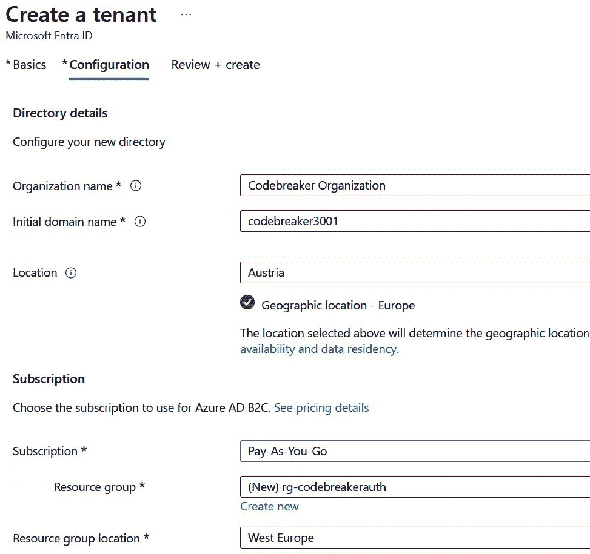

图 9.1 – 创建 AAD B2C 租户

要创建新的 AAD B2C 租户，您需要输入组织的名称、域名（一个尚未存在的域名）、用于定义用户数据存储区域的地理位置、订阅和资源组。完成这些操作后，点击**审查 + 创建**，然后点击**创建**。

您需要等待一段时间以创建目录。要在 Azure 门户中列出您可用的目录，并切换目录，请点击**设置**按钮。选择新目录并点击**切换**以更改到它。同样，您也可以切换回运行 Azure 资源的目录。

在接下来的几节中，我们将执行以下操作：

+   指定身份提供者，以便用户不需要输入另一个密码

+   配置用户属性以定义应用程序需要从用户处获取的信息

+   定义用户流程以指定用户信息如何流动

+   创建应用程序注册以定义提供 API 和客户端应用程序以访问 API 的服务应用程序

## 指定身份提供者

当您处于 Azure AD B2C 中时，可以打开 Azure AD B2C 配置。B2C 目录支持大量不同的身份提供者。当用户使用身份提供者时，不需要记住另一个密码。在 Azure AD B2C 配置中，在左侧面板的**管理**类别中，选择**身份提供者**（见图*图 9.2*）：

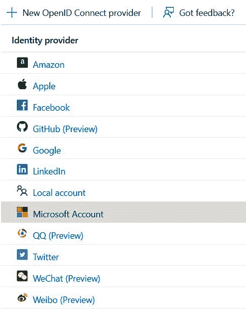

图 9.2 – 身份提供者

默认情况下，**本地账户**已配置，以便密码以本地方式与 AAD B2C 一起存储。您可以配置支持 OIDC 的 Microsoft、Google、Facebook 和其他账户。Codebreaker 目录已将 GitHub 配置为提供者，因为大多数开发者已经有了 GitHub 账户。

对于每个提供者，您需要执行的操作来配置它。您只需单击提供者即可获取该信息。例如，对于 GitHub，您需要创建 GitHub OAuth 应用程序以获取配置此提供者所需的所有值。对于使用 AAD B2C 进行身份验证的服务，您可以保留默认设置。

## 配置用户属性

无论您选择哪个提供者，您都必须有一种方法来识别用户。为了收集此类信息，您必须向您的用户索要详细信息。您还可以创建应在目录中存储的自定义属性。在**管理**类别中，选择**用户属性**，如图*图 9.3*所示：

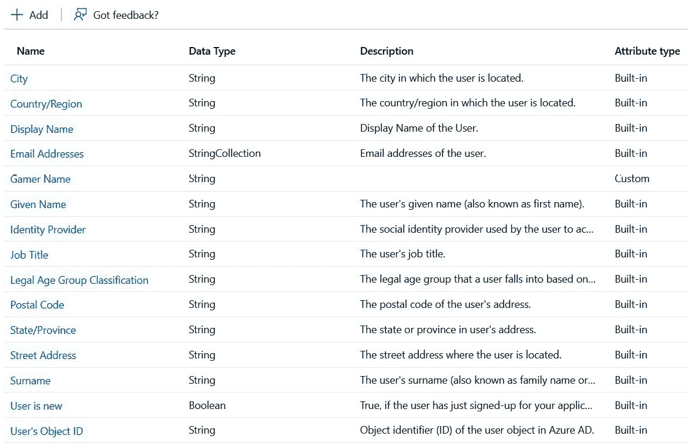

图 9.3 – 用户属性

这里，有几个内置属性，例如`String`类型的`Gamer Name`。

注意

由于**通用数据保护条例**（**GDPR**），您需要确保您只收集必要的数据并保持其安全，允许用户请求您存储的数据，并允许用户在不需要因法律原因存储时删除该数据。

## 定义用户流程

使用用户流程，您定义在注册或编辑用户配置文件时应从用户处收集哪些信息，以及应在**声明**中发送给应用程序哪些信息。

在 AAD B2C 配置中，从左侧面板中，在`B2C_1_`内添加一个名称（例如，`SUSI`），并选择**电子邮件**注册身份提供者。您还可以选择如 GitHub 等社交提供者。关于**用户属性和令牌声明**类别，选择当此对话框显示时用户应输入的用户属性，以及作为令牌传递给应用程序的声明，如图*图 9.4*所示：

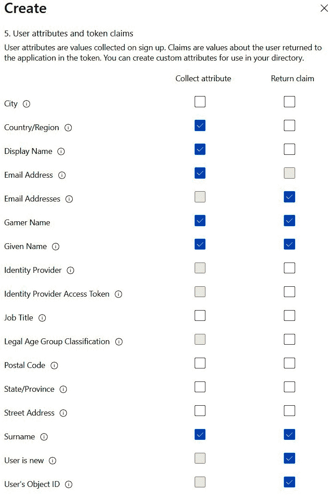

图 9.4 – 创建用户流程

在定义从用户那里请求的信息时，请记住 GDPR。

Azure AD B2C 允许您通过指定公司品牌、更改页面布局、返回自定义页面以及在用户注册时添加用于自定义验证器的 API 连接器来自定义用户流程对话框。

注意

用户属性可以通过创建用户流程或 **自定义策略** 来填充。有关更多信息，请参阅 *进一步阅读* 部分的链接。还可以查看 Codebreaker 后端存储库中的源代码 ([`github.com/codebreakerapp/Codebreaker.Backend`](https://github.com/codebreakerapp/Codebreaker.Backend))，其中包含用于为特权用户添加组的自定义策略。

一旦注册了应用程序（下一步），您就可以测试用户流程，如图 *图 9*.5* 所示：

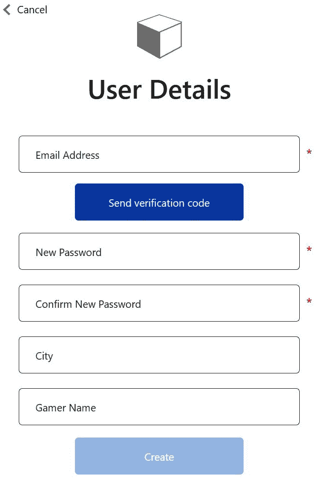

图 9.5 – 测试用户流程

选择应收集的用户属性定义了对话的输入元素。图标、颜色和布局可以自定义。甚至可以创建完整的自定义对话框。

## 创建应用注册

接下来，我们将学习如何注册应用。在这里，我们将注册提供 API 和客户端应用程序的应用程序网关。其他应用可以类似地注册。

在左侧面板的 **管理** 类别中，点击 **应用注册**。这将打开 **应用注册** 页面，如图 *图 9*.6* 所示：

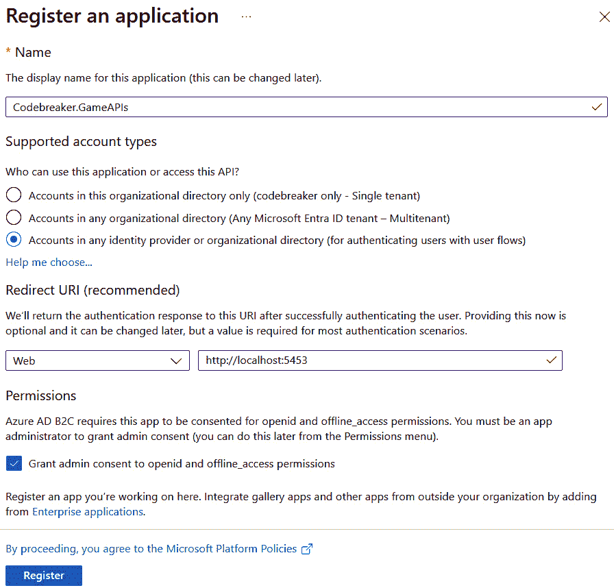

图 9.6 – 注册应用

添加多个应用注册：`Codebreaker.GameAPIs` 应用提供游戏 API，`Codebreaker.Bot` 和 `Codebreaker.Blazor` 是需要 API 权限的 Web 应用程序，而 `Codebreaker.Client` 是需要 API 权限的客户端应用程序。

当您配置应用注册过程时，您指定哪些帐户可以使用此应用程序。在这里，我们将允许所有帐户、外部注册的用户和重定向 URI。要测试从本地开发系统测试 `game-apis` 服务，请指定本地运行时使用的端口号，例如 `http://localhost:5453`，然后点击 **注册** 按钮。稍后需要添加 Azure 容器应用的链接。

### 定义作用域

您可以通过应用注册过程指定提供 API 的应用程序。在 `games`。在此范围内，添加 `Games.Play` 和 `Games.Query` 作用域，如图 *图 9*.7* 所示：

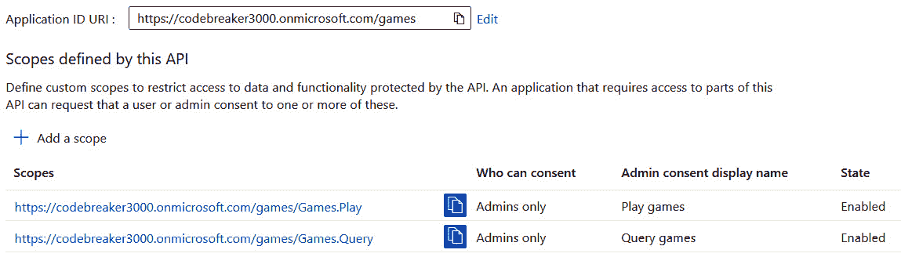

图 9.7 – 定义作用域

### 创建密钥

要仅允许已识别的应用程序，您可以添加证书或密钥。与使用密钥相比，更好的方法可能是使用允许访问服务的用户运行应用程序。在这里，可以使用托管标识。并非所有场景都支持此操作。

使用左侧面板中的**证书和密钥**选项创建一个客户端密钥。密钥创建后无法再次从门户中读取，只能复制。在离开页面之前复制密钥。

### 添加 API 权限

对于调用 API 的应用程序注册，你需要配置**API 权限**，如图 9.8 所示：

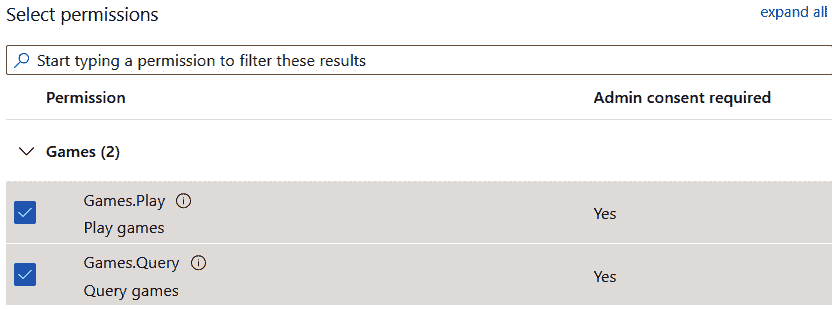

图 9.8 – 添加 API 权限

`Codebreaker.Blazor`和`Codebreaker.Client`应用程序注册需要`Games.Play`和`Games.Query`应用程序权限。添加这些权限后，点击**授予** **管理员同意**。

### 评估应用程序注册过程

完成此配置后，打开`bot-service`和客户端应用程序。然后，点击**评估我的应用程序注册**，如图 9.9 所示。

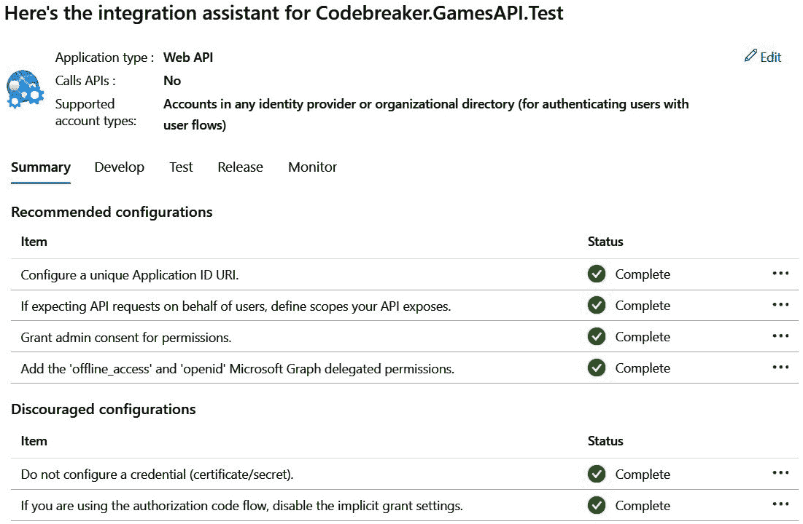

图 9.9 – 集成助手结果

集成助手在点击推荐配置上方的标签时，为开发、测试、发布和监控提供了大量信息。如果你看到一些警告或错误，点击省略号（**…**）。从这里，你可以查看文档并打开一个可以更改你配置的页面。

在配置了 Azure AD B2C 之后，让我们实现一些代码，以便我们可以利用 AAD B2C。

# 保护 API

我们现在可以保护每个 API 项目。然而，我们可以以不同的方式来做这件事，以减少我们需要做的工作。一个选项是使用 Azure Container Apps 来配置身份验证。而不是为每个容器应用配置此设置，让我们创建一个新的项目，该项目将被保护并路由到多个服务。为此，我们将使用**YARP**。

## 创建带有身份验证的新项目

使用带有`-au`身份验证选项的.NET 模板创建一个新的 Web API 项目：

```cs
dotnet new webapi -minimal -au IndividualB2C -o Codebreaker.ApiGateway
```

使用.NET CLI，你也可以传递配置 B2C 服务所需的所有值，例如`--domain`用于域名，`--aad-b2c-instance`用于传递登录域名链接，`--client-id`用于应用程序 ID，`--susi-policy-id`用于注册用户流程（在它被称为*用户流程*之前，它被称为*策略*），以及`--default-scope`用于配置作用域。如果你没有为这些配置分配参数值，你只需在`appsettings.json`文件中创建后更改它们即可。

已添加到该项目中的与身份验证和授权相关的 NuGet 包如下：

+   `Microsoft.AspNetCore.Authentication.JwtBearer`：此包支持使用**JSON Web** **令牌**（**JWT**）进行身份验证

+   `Microsoft.AspNetCore.Authentication.OpenIdConnect`：此包允许使用 OIDC 与身份提供者进行身份验证，例如 Azure AD B2C

+   `Microsoft.Identity.Web`：此包提供用于身份验证流程和用户授权的实用工具和中间件

+   `Microsoft.Identity.Web.DownstreamApi`: 此包有助于使用相同的身份验证上下文调用下游 API

接下来，我们将 YARP 添加到这个项目中。

## 使用 YARP 创建应用程序网关

在创建微服务解决方案时，没有必要为每个服务实现身份验证。相反，你可以创建一个充当反向代理的服务。客户端只调用反向代理。此代理将经过身份验证的请求转发到其他服务。在这里，我们将使用 Microsoft YARP。反向代理位于后端服务之前，并在请求发送到服务之前拦截来自客户端的调用。YARP 代理提供不同的功能，如负载均衡、速率限制、协议切换、根据不同版本选择服务等。基于第 7 层，代理可以读取 HTTP 请求，根据链接和 HTTP 头进行路由，以及更改使用的协议。在这里，我们将使用反向代理来处理身份验证和授权，然后再将请求转发到后端服务。

*图 9**.10* 展示了与服务通信的新方法：

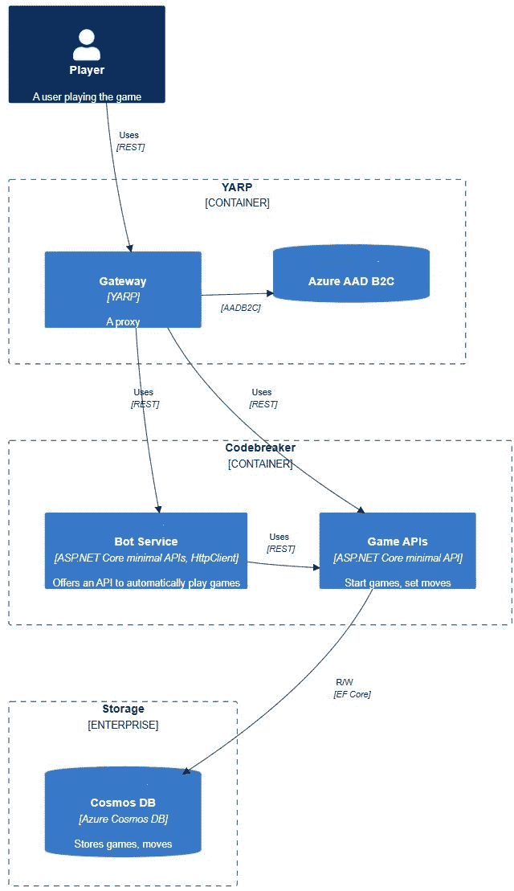

图 9.10 – 通过 YARP 进行通信

反向代理将传入的请求路由到后端服务。已路由的后端服务是`game-apis`和`bot-service`。客户端应用程序不与这些服务交互；它们只是使用 YARP 网关。

除了我们之前添加的 NuGet 包之外，我们还需要添加`Yarp.ReverseProxy`和`Microsoft.Extensions.ServiceDiscovery.Yarp` NuGet 包。第一个是 YARP 的包，而第二个允许我们使用 YARP 进行.NET 服务发现。

## 使用 YARP 映射路由

代理服务如何与后端 API 通信可以通过编程方式或使用配置文件进行配置。我们将使用`appsettings.json`文件进行第二种选项。首先，让我们配置`game-apis`服务和`bot-service`的地址：

Codebreaker.ApiGatewayIntro/appsettings.json

```cs
{
  "ReverseProxy": {
    "Clusters": {
      "gamesapicluster": {
        "Destinations": {
          "gamescluster/destination1": {
            "Address": "http://gameapis"
          }
        }
      }
      "botcluster": {
        "Destinations": {
          "botcluster/destination1": {
            "Address": "http://bot"
          }
        }
      },
    },
    // configuration removed for brevity
  }
}
```

完整的反向代理配置已添加到`ReverseProxy`部分，配置部分，称为`Clusters`，定义了可用于`game-apis`服务和`bot-service`的系统列表。对于每个服务，可以添加多个地址。使用服务发现 YARP 包，我们可以使用.NET Aspire 命名端点。

以下代码配置了使用集群配置的路由：

Codebreaker.ApiGatewayIntro/appsettings.json

```cs
{
  "ReverseProxy": {
    // configuration removed for brevity
    "Routes": {
      "gamesRoute": {
        "ClusterId": "gamesapicluster",
        "Match": {
          "Path": "/games/{*any}"
        }
      },
      "botRoute": {
        "ClusterId": "botcluster",
        "Match": {
          "Path": "/bot/{*any}"
        }
      }
    }
  }
}
```

`Routes`配置包含一个路由列表。`gamesRoute`引用之前指定的`gamesapicluster`，而`botRoute`引用由`botcluster`定义的主机。`Match`配置指定用于将请求映射到相应集群的`Path`。

我们只需要对启动代码进行少量更新以激活此反向代理库：

Codebreaker.ApiGateway/Program.cs

```cs
var builder = WebApplication.CreateBuilder(args);
builder.Services.AddReverseProxy()
  .LoadFromConfig(
    builder.Configuration.GetSection("ReverseProxy"));
var app = builder.Build();
app.MapReverseProxy();
app.Run();
```

`AddReverseProxy` 方法将反向代理所需的服务注册到 DI 容器中。`LoadFromConfig` 方法从之前指定的配置中检索配置值。`MapReverseProxy` 方法配置中间件以根据配置转发请求。

在 `AppHost` 项目中，在添加对网关项目的引用之后，可以将网关添加到应用程序模型中：

Codebreaker.AppHost/Program.cs

```cs
var gameAPIs = builder.AddProject<Projects.Codebreaker_GameAPIs>("gameapis")
  .WithReference(cosmos)
  .WithEnvironment("DataStore", dataStore);
var bot = builder.AddProject<Projects.CodeBreaker_Bot>("bot")
  .WithReference(gameAPIs);
builder.AddProject<Projects.Codebreaker_ApiGateway>("gateway")
  .WithReference(gameAPIs)
.WithReference(bot)
  .WithExternalHttpEndpoints();
// code removed for brevity
```

API 网关需要引用 `game-apis` 服务和 `bot-service`。在这里，外部 HTTP 端点不再需要。当网关部署到 Azure Container Apps 环境时，只有网关需要从外部引用，因此只有网关配置使用 `WithExternalHttpEndpoints` 方法。

在此基础上，您可以启动应用程序并通过网关调用两个服务。请求被转发到特定的服务。

接下来，我们将向网关添加身份验证。

## 添加网关的身份验证

使用已添加身份验证和授权的 .NET 模板 Web API 已经添加了一些代码。我们现在将增强此代码。

我们可以通过调用 `AddAuthentication` 方法来配置 DI 容器以通过身份验证用户：

Codebreaker.ApiGateway/Program.cs

```cs
var builder = WebApplication.CreateBuilder(args);
builder.Services.AddAuthentication(JwtBearerDefaults.AuthenticationScheme)
  .AddMicrosoftIdentityWebApi(
    builder.Configuration.GetSection("AzureAdB2C"));
// code removed for brevity
```

`AddAuthentication` 方法注册了身份验证所需的服务的服务。`JwtBearerDefaults.AuthenticationScheme` 参数返回 **Bearer** 作为身份验证方案。Bearer 令牌在大多数 REST API 中使用，因为它们易于使用且不需要加密，但需要执行 HTTPS 加密以安全地传输。

`AddMicrosoftIdentityWebApi` 是一个扩展方法，它扩展了 `AuthenticationBuilder` 并使用 Microsoft Identity 平台保护 API。`AzureAdB2C` 是一个配置部分，它指定了从 `appsettings.json` 中的 AADB2C 的值：

Codebreaker.ApiGateway/appsettings.json

```cs
{
  // configuration removed for brevity
  «AzureAdB2C»: {
    «Instance»: «https://<domain>.b2clogin.com»,
    «Domain»: «<domain>.onmicrosoft.com»,
    "ClientId": "<app-id>",
    "SignedOutCallbackPath": "/signout/B2C_1_SUSI",
    "SignUpSignInPolicyId": "B2C_1_SUSI"
  }
}
```

使用 `appsettings.json` 配置文件，您需要配置您的 Azure AD B2C 域名、应用程序 ID 以及之前配置的用户流程。

`AddAuthentication` 方法指定了身份验证配置：

Codebreaker.ApiGateway/Program.cs

```cs
var builder = WebApplication.CreateBuilder(args);
// code removed for brevity
builder.Services.AddAuthentication(JwtBearerDefaults.AuthenticationScheme)
  .AddMicrosoftIdentityWebApi(
    builder.Configuration.GetSection("AzureAdB2C"));
builder.Services.AddAuthorization(options =>
{
  options.AddPolicy("playPolicy", config =>
{
    config.RequireScope("Games.Play");
  });
  options.AddPolicy("queryPolicy", config =>
  {
    config.RequireScope("Games.Query");
    config.RequireAuthentication();
  }
});
```

`AddAuthorization` 方法允许使用 `AuthorizationOptions` 代理进行配置。这些选项允许您指定默认策略和命名策略。前面的代码片段定义了 `playPolicy` 和 `queryPolicy` 策略。`playPolicy` 需要设置 `Games.Play` 范围，而 `queryPolicy` 需要设置 `Games.Query` 范围。`queryPolicy` 还要求用户必须经过身份验证。您可以通过使用 `RequireClaim` 方法定义一个与令牌一起传递的声明。

在设置了策略之后，可以将路由限制为所需的策略：

Codebreaker.ApiGateway/appsettings.json

```cs
// configuration removed for brevity
  "ReverseProxy": {
    "Routes": {
      "botRoute": {
        "ClusterId": "botcluster",
        "AuthorizationPolicy": "botPolicy",
        "Match": {
          "Path": "/bot/{*any}"
        }
      },
```

使用 `AuthorizationPolicy` 配置，与 `botRoute` 一起，引用 `botPolicy` 以要求认证用户和应用程序发送正确的范围。

现在我们已经配置了 DI 容器，需要配置中间件：

Codebreaker.GameAPis/Program.cs

```cs
var app = builder.Build();
app.UseAuthentication();
app.UseAuthorization();
// code removed for brevity
```

`UseAuthentication` 方法添加了身份验证中间件，而 `UseAuthorization` 方法添加了授权中间件。

注意

如果最小 API 需要直接限制，可以使用 `RequireAuthorization` 扩展方法。可以将策略作为参数传递以检查策略的要求。将 `ClaimsPrincipal` 注入为最小 API 方法的参数时，可以以编程方式检索有关用户和声明信息的详细信息。这允许我们根据通过 API 获取的值进行检查限制。

为了测试这一点，我们将更新我们的客户端应用程序。

# 使用 Microsoft Identity 和 ASP.NET Core 网络应用程序进行身份验证

要使用 Azure AD B2C 进行身份验证，我们将使用 Microsoft Identity 平台。在本节中，我们将重点介绍使用 Azure AD B2C 创建账户、登录以及使用 ASP.NET Core 网络应用程序调用受保护的 REST API。

与我们之前创建的最小 API 一样，可以使用 .NET 模板。运行以下命令以创建新项目：

```cs
dotnet new webapp -au IndividualB2C -o WebAppAuth
```

在创建此项目时，添加了几个用于身份验证和身份的 NuGet 包。这些在我们保护 API 时已经讨论过。一个之前未使用过的附加包是 `Microsoft.Identity.Web.UI`。此包与 `Microsoft.Identity.Web` 集成，并提供用于登录、注销和配置文件管理的预构建 UI 元素。

通过 DI 容器配置，添加了身份验证。因此，我们需要对其进行自定义以调用 API：

WebAppAuth/Program.cs

```cs
IConfigurationSection scopeSections = builder.Configuration
  .GetSection("AzureAdB2C").GetSection("Scopes");
String[] scopes = scopeSection.Get<string[]>() == [];
builder.Services.AddAuthentication(OpenIdConnectDefaults.AuthenticationScheme)
  .AddMicrosoftIdentityWebApp(
    builder.Configuration.GetSection("AzureAdB2C"))
  .EnableTokenAcquisitionToCallDownstreamApi(scopes)
  .AddInMemoryTokenCaches();
```

要使用 Azure AAD B2C，需要使用 `appsettings.json` 文件中 `AzureAdB2C` 部分的配置来调用 `AddAuthentication`。`AddMicrosoftIdentityWeb` 是来自 `Microsoft.Identity.Web` NuGet 包的扩展方法。这配置了支持 cookie 和 `OpenIdConnect`。`EnableTokenAcquisitionToCallDownstreamApi` 方法允许我们传递从应用程序接收到的令牌，以便我们可以通过 `HttpClient` 将其转发到应用程序调用的 API。当使用此方法时，`ITokenAcquisition` 接口在 DI 容器中注册。这可以用来检索令牌并将它们传递给 `HttpClient` 的 HTTP 头。

对于 Microsoft Identity 用户界面，需要使用 DI 容器配置 `AddMicrosoftIdentityUI` 方法：

WebAppAuth/Program.cs

```cs
builder.Services.AddRazorPages()
  .AddMicrosoftIdentityUI();
```

此方法使用 `MicrosoftIdentity` 区域配置 `AccountController`（基于 ASP.NET Core MVC），并提供了 `SignIn` 和 `SignOut` 方法。

注意

在创建 Blazor 客户端应用程序时，.NET 7 模板内置了对 AD B2C 的支持，但 .NET 8 中则没有。对于 .NET 9 的支持已被计划。您可以手动添加 AD B2C 集成。

可以通过不同的客户端技术实现身份验证的不同差异。查看“进一步阅读”部分中的链接以获取更多信息。还可以查看 Codebreaker GitHub ([`github.com/codebreakerapp`](https://github.com/codebreakerapp)) 以获取 Blazor、WinUI、.NET MAUI、WPF 和 Uno Platform 的实现。

# 使用 Azure 容器应用指定身份验证

我们可以直接使用 Azure 容器应用来管理身份验证，而不是需要管理服务本身的身份验证。在 Azure 门户中选择已部署的游戏 API 后，在左侧面板的 **设置**类别中选择 **身份验证**。在这里，您可以添加一个 **身份提供者**。通过选择 **Microsoft**，您可以配置 **Workforce** 或 **Customer** 租户类型。**Workforce** 用于 B2B 场景。在这里，您可以直接在 Microsoft Entra 中创建应用程序注册。对于 B2C，选择 **Customer**。

# 使用 ASP.NET Core Identity 在本地数据库中存储用户信息

如果 Azure AD B2C 对您来说不是一种选择，您可以使用 .NET 提供的 **ASP.NET Core Identity** 来在本地数据库中存储用户。我们将使用这种方式作为运行解决方案的替代方法，无需配置 Azure AD B2C。

使用 `-au` `Individual` 选项：

```cs
dotnet new blazor -au Individual -int Auto -o Codebreaker.ApiGateway.Identities
```

这创建了两个项目：`Codebreaker.ApiGateway.Identities` 和 `Codebreaker.ApiGateway.Identities.Client`。第二个项目是一个库，其中包含可以在客户端运行并具有 **交互式 WebAssembly 渲染**以及 **交互式服务器渲染**的 **Razor 组件**。这个库在第一个项目中引用，该项目托管 Blazor 应用程序并包含支持交互式服务器渲染的 Razor 组件。该项目包含一个用于注册用户以及帮助用户找回密码的组件列表，以及用于管理用户信息的组件。

让我们探讨这个应用程序的一些重要部分，从数据库开始。

## 自定义 EF Core 配置

在这个项目中，用户信息通过 EF Core 存储在关系型数据库中。默认情况下，使用 MySQL。这可以轻松地更改为 SQL Server，但在这个场景中使用 MySQL 也是很好的。

存储的用户信息由 `ApplicationDbContext` 类定义：

Codebreaker.ApiGateway.Identities/Data/ApplicationDbContext.cs

```cs
public class ApplicationDbContext(DbContextOptions<ApplicationDbContext> options) :
  IdentityDbContext<ApplicationUser>(options)
{
}
```

`ApplicationDbContext` 是一个具有基类层次结构的 EF Core 上下文。由于是从模板创建的，因此这个类的主体为空。添加自定义 `DbSet` 属性允许您向数据库添加额外的表。基类 `IdentityDbContext` 使用 `ApplicationUser` 类作为泛型参数来定义要存储的用户信息：

Codebreaker.ApiGateway.Identities/Data/ApplicationUser.cs

```cs
public class ApplicationUser : IdentityUser
{
}
```

向此类添加属性允许您使用额外的列自定义`users`表。要查看定义的属性，需要从`IdentityUser`基类开始跟踪，`IdentityUser`继承自`IdentityUser<string>`。泛型字符串参数指定了使用 GUID 值作为键。泛型`IdentiyUser`类型定义了`UserName`、`Email`、`PasswordHash`和`PhoneNumber`等属性，以映射到列。

`IdentityDbContext<TUser>`有一些其他基类，例如`IdentityUserContext<TUser`, `TRole`, `TKey`, `TUserClaim`, `TuserLogin`, 和 `TUserToken>`，用于定义使用的一些表。

EF Core 上下文需要与 DI 容器进行配置：

Codebreaker.ApiGateway.Identities/Program.cs

```cs
// code removed for brevity
builder.AddMySqlDbContext<ApplicationDbContext>("usersdb");
```

在这里，EF Core 配置已更改，以使用`Aspire.Pomelo.EntityFrameworkCore.MySql` NuGet 包和 MySQL Entity Framework .NET Aspire 组件。

这样，EF Core 上下文已经与 ASP.NET Core 身份验证进行了配置。

## 配置 ASP.NET Core 身份验证

当配置 ASP.NET Core 身份验证时，EF Core 必须进行映射：

Codebreaker.ApiGateway.Identities/Program.cs

```cs
// code removed for brevity
builder.Services.AddIdentityCore<ApplicationUser>(options =>
  options.SignIn.RequireConfirmedAccount = true)
  .AddEntityFrameworkStores<ApplicationDbContext>()
  .AddSignInManager()
  .AddDefaultTokenProviders();
```

`AddIdentityCore`方法配置了`ApplicationUser`类（与 EF Core 模型一起使用的相同类）以用于 ASP.NET Core 身份验证。当用户注册时，在使用账户之前，需要通过设置`RequireConfirmedAccount`属性（将在下文中讨论）进行确认。通过调用`AddEntityFrameworkStores`，EF Core 上下文`ApplicationDbContext`被映射到 ASP.NET Core 身份验证。`AddSignInManager`方法将`SignInManager`类注册到 DI 容器中。`SignInManager`可用于登录和注销用户，检索声明，并处理双因素认证选项。`AddDefaultTokenProviders`方法通过实现`IUserTwoFactorTokenProvider`接口来注册令牌提供者，以返回和验证用于双因素认证的令牌，例如电子邮件、电话等。

要确认账户，需要将`IEmailSender`接口注册到 DI 容器中：

Codebreaker.ApiGateway.Identities/Data/ApplicationUser.cs

```cs
builder.Services.AddSingleton<IEmailSender<ApplicationUser>, IdentityNoOpEmailSender>();
```

在默认配置下，实现了无操作的`IdentityNoOpEmailSender`类。这对于测试目的来说是实用的，但需要更改以验证用户的电子邮件地址。

现在，让我们使用.NET Aspire AppHost 项目来配置项目：

CodebreakerAppHost/Program.cs

```cs
string startupMode = Environment.GetEnvironmentVariable("STARTUP_MODE") ?? "Azure";
bool useAzureADB2C = startupMode == "Azure";
// code removed for brevity
if (startupMode == "OnPremises")
{
  var usersDbName = "usersdb";
  var mySqlPassword = builder.AddParameter("mysql-password", secret: true);
  var usersDb = builder.AddMySql("mysql", password: mySqlPassword)
    .WithEnvironment("MYSQL_DATABASE", usersDbName)
    .WithDataVolume()
    .WithPhpMyAdmin()
    .AddDatabase(usersDbName);
  var gateway = builder.AddProject<Projects.Codebreaker_ApiGateway_
    Identities>("gateway-identities")
    .WithReference(gameAPIs)
    .WithReference(bot)
    .WithReference(usersDb)
    .WithExternalHttpEndpoints();
```

在这里，AppHost 项目使用多个启动配置文件，要么以 Azure AD B2C（`Azure` 启动配置文件）启动解决方案，要么以本地数据库（`OnPremises` 启动配置文件）启动。当涉及到不同的启动配置文件设置时，会配置 `STARTUP_MODE` 环境变量，然后用于区分要启动的项目以及它们的配置。在启动 `OnPremises` 模式时，新创建的项目配置为通过 `Aspire.Hosting.MySql` NuGet 包引用在容器中运行的 MySQL 数据库。`WithDataVolume` 方法创建一个命名的 Docker 卷（见 *第五章*）以实现持久性，而 `WithPhpMyAdmin` 方法添加了管理界面。

如果我们现在运行解决方案，我们可以注册一个新用户，如图 *图 9**.11* 所示：

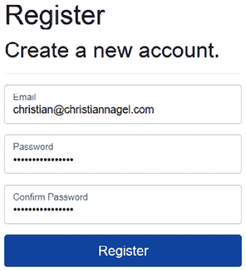

图 9.11 – 注册本地用户

在注册用户时，你可能需要应用 EF Core 迁移来创建数据库。在收到注册确认后，选择**点击此处确认您的账户**以批准电子邮件。然后，点击左侧面板上的**登录**按钮。登录后，电子邮件将显示在**认证** **必需**页面上。

注意

使用 ASP.NET Core Identity，除了让用户记住另一个密码外，还可以添加外部提供者，例如 Microsoft、Facebook 和 Google 账户，如[`learn.microsoft.com/en-us/aspnet/core/security/authentication/social`](https://learn.microsoft.com/en-us/aspnet/core/security/authentication/social)所示。

启用 phpMyAdmin 后，您可以打开管理界面并查看已创建的表，如图 *图 9**.12* 所示：

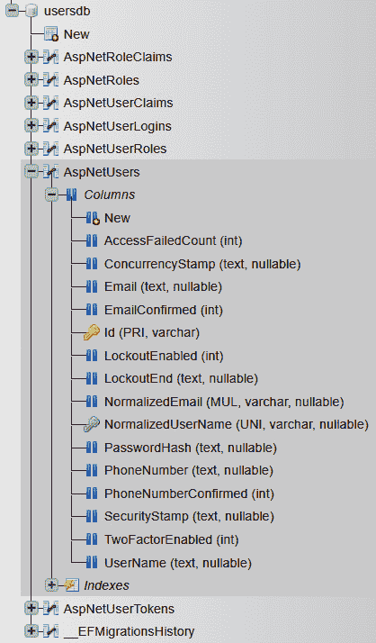

图 9.12 – MySQL 管理界面

使用此管理界面，您可以执行 SQL 查询，并轻松更改和删除记录。

在 ASP.NET Core Identity 就绪的情况下，用户现在可以使用此应用程序注册并管理他们的账户。如果用户数据不存储在托管云服务中并且可以轻松实现，这是一个很好的选择。那么使用桌面客户端应用程序呢？它们可以使用 API 来访问这些数据。我们将在下一节中学习如何添加此 API。

## 创建身份 API 端点

.NET 8 提供了使用 ASP.NET Core Identity 基础设施的标识 API 端点。

在 ASP.NET Core Identity 的 EF Core 配置就绪后，我们所需做的就是使用 DI 容器和中间件配置身份端点。首先必须配置 DI 容器：

Codebreaker.Gateway.Identity/Program.cs

```cs
// code removed for brevity
builder.Services
  .AddIdentityApiEndpoints<ApplicationUser>()
  .AddEntityFrameworkStores<ApplicationDbContext>();
```

`AddIdentityApiEndpoints`方法添加了使用 Bearer 令牌和身份 cookie 的认证，以及验证允许的密码和用户名的选项和验证器，注册`UserManager`，并提供用户声明的工厂。用于验证正确电子邮件的`IEmailSender`被配置为使用`NoOpEmailSender`。当您有`IEmailSender`的真实实现（使用您的电子邮件提供程序）时，您需要确保在调用`AddIdentityApiEndpoints`之后注册此类，以用您的配置覆盖`NoOpEmailSender`。`AddEntityFrameworkStores`方法是对返回的`IdentityBuilder`对象的扩展方法，并为用户和角色数据添加了 EF Core 存储。

可以使用`MapIdentityApi`方法配置中间件：

Codebreaker.Gateway.Identity/Program.cs

```cs
// code removed for brevity
app.MapGroup("/identity")
  .MapIdentityApi<ApplicationUser>();
```

`MapGroup`方法用于为身份 API 添加一个公共前缀。`MapIdentityApi`本身定义了几个 URI，例如`/register`，通过 POST 请求正文使用`RegisterRequest`注册新用户，以及`/login`，在传递`LoginRequest`时登录用户，`LoginRequest`可以包括用户名、密码、双因素代码、重置忘记密码的链接、电子邮件确认等。

一些这些 API 允许匿名访问（例如，在注册或登录时），而其他 API 则需要认证。带有`/manage`链接的 API 组被配置为需要认证。

当启用 Swagger 时，您将看到所有这些 API，如图*图 9.13*所示。这意味着您可以在从客户端应用程序使用之前测试它们：

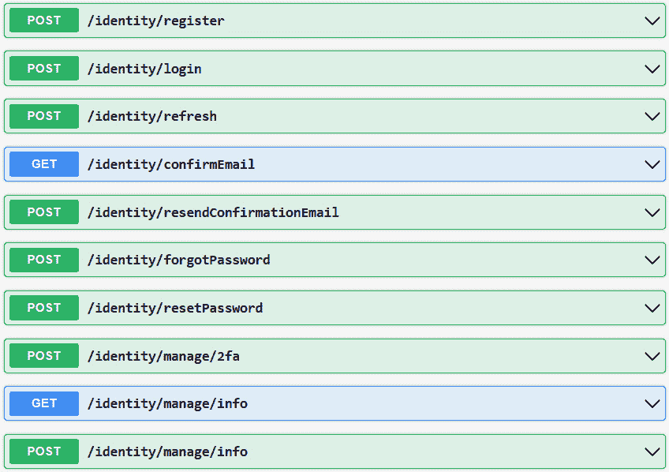

图 9.13 – 身份 API 端点

尝试调用`/register` API 并传递两个值来创建新用户。如果没有创建自定义的`IEmailSender`接口实现，成功时将返回 HTTP 状态码`200`，并且 HTTP 正文为空。如果情况如此，您可以在登录之前使用 MySQL 管理 UI 批准用户（或更改 ASP.NET Core Identity 配置，使其不需要已确认的账户）；否则，登录将被拒绝。

登录成功后，会返回 Bearer 令牌。您将收到访问令牌和刷新令牌以及默认设置为 3,600 秒的过期信息。刷新令牌可以与`/refresh` API 一起使用，以获取新的访问令牌和刷新令牌。

注意

要了解如何使用 SendGrid 实现`IEmailSender`，请参阅以下文章：[`learn.microsoft.com/en-us/aspnet/core/security/authentication/accconfirm`](https://learn.microsoft.com/en-us/aspnet/core/security/authentication/accconfirm)。

# 摘要

在本章中，您学习了如何使用 Microsoft Identities 和 ASP.NET Core Identity 通过 Azure AD B2C 进行用户认证。使用 Azure AD B2C，您添加了自定义用户属性，指定了用户流程，并注册了应用程序。

而不是为每个 API 实现保护，您使用 Microsoft YARP 创建了一个反向代理，并通过网关服务保护了 API。使用 YARP，我们定义了路由以映射不同的后端服务，并使用路由配置了策略，要求认证客户端。

您还学习了如何使用 ASP.NET Core Identity 作为内置 ASP.NET Core 功能的替代选项进行身份验证和授权，但功能更简单。

下一章将介绍如何测试微服务解决方案，从单元测试到集成测试，包括使用 Microsoft Playwright 测试服务。

# 进一步阅读

要了解更多关于本章讨论的主题，请参阅以下链接：

+   *Azure AD B2C 声明* *模式*: [`learn.microsoft.com/en-us/azure/active-directory-b2c/claimsschema`](https://learn.microsoft.com/en-us/azure/active-directory-b2c/claimsschema)

+   *使用 API 连接器从外部来源丰富令牌中的声明* [`learn.microsoft.com/en-us/azure/active-directory-b2c/add-api-connector-token-enrichment`](https://learn.microsoft.com/en-us/azure/active-directory-b2c/add-api-connector-token-enrichment)

+   *ASP.NET Core* *中间件*: [`learn.microsoft.com/en-us/aspnet/core/fundamentals/middleware`](https://learn.microsoft.com/en-us/aspnet/core/fundamentals/middleware)

+   *如何使用身份验证来保护 SPAs 的 Web API 后端* [`learn.microsoft.com/en-us/aspnet/core/security/authentication/identity-api-authorization`](https://learn.microsoft.com/en-us/aspnet/core/security/authentication/identity-api-authorization)

+   *YARP 的 GitHub 仓库* [`github.com/microsoft/reverse-proxy`](https://github.com/microsoft/reverse-proxy)

+   *使用 Azure AD B2C 保护 Blazor WASM 应用* [`learn.microsoft.com/en-us/aspnet/core/blazor/security/webassembly/hosted-with-azure-active-directory-b2c`](https://learn.microsoft.com/en-us/aspnet/core/blazor/security/webassembly/hosted-with-azure-active-directory-b2c)

+   *使用 Azure AD B2C 保护 WPF 桌面应用* [`learn.microsoft.com/en-us/azure/active-directory-b2c/configure-authentication-sample-wpf-desktop-app`](https://learn.microsoft.com/en-us/azure/active-directory-b2c/configure-authentication-sample-wpf-desktop-app)

+   *选择一个身份管理* *解决方案*: [`learn.microsoft.com/en-us/aspnet/core/security/how-to-choose-identity-solution`](https://learn.microsoft.com/en-us/aspnet/core/security/how-to-choose-identity-solution)

+   *Azure API* *管理*: [`learn.microsoft.com/en-us/azure/api-management/`](https://learn.microsoft.com/en-us/azure/api-management/)

# 第三部分：故障排除和扩展

在本部分中，重点转向确保应用程序的平稳运行和及时解决任何新出现的问题。强调通过单元测试进行早期问题检测。您将深入了解使用 .NET Aspire 库创建集成测试，以及使用 Microsoft Playwright 实现端到端测试。Open Telemetry 促进的日志、指标和分布式跟踪的重要性将被探讨。.NET Aspire 仪表板将有助于在开发过程中监控服务交互、性能指标、内存消耗等。在 Azure 环境中，将利用 Azure Log Analytics 和 Application Insights，同时还可以使用 **Prometheus** 和 **Grafana** 等替代选项，这些选项可以在本地和云环境中部署。在扩展服务时，将利用前几章中获得的经验，并建议在使用 Azure Load Testing 时谨慎行事，以防止超出预算限制。在扩展之前，将识别并实施潜在的性能提升。

本部分包含以下章节：

+   *第十章*，*关于解决方案测试的所有内容*

+   *第十一章*，*日志和监控*

+   *第十二章*，*扩展服务*
