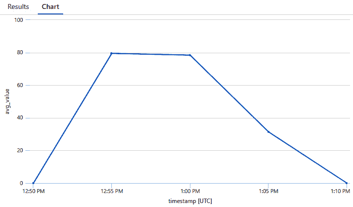

# 11

# 日志记录和监控

在微服务解决方案中，许多服务可以相互交互。当一个服务失败时，整个解决方案不应该崩溃。在前一章中，我们介绍了不同类型的测试以尽早发现问题。在这里，我们将探讨尽可能早地在生产中查找问题——可能是在用户看到问题之前。

为了在应用程序运行时发现问题和查看应用程序如何成功运行，解决方案需要增强以提供遥测数据。通过**日志记录**，我们可以看到正在发生什么；根据不同的日志级别，我们可以区分信息日志和错误。通过**指标**数据，我们可以监控计数器，例如内存和 CPU 消耗，以及 HTTP 请求的数量。我们还将编写自定义计数器以查看游戏玩了多少次以及需要多少次游戏移动才能获胜。**分布式跟踪**提供了关于服务如何交互的信息。谁在调用此服务？这个错误是从哪里开始的？

**OpenTelemetry**是一个行业标准 – 一组 API，允许不同的语言和工具进行工具化、生成、收集和导出遥测数据。支持 OpenTelemetry 的.NET API 用于日志记录、指标和分布式跟踪，这正是本章的内容。我们将使用**Prometheus**和**Grafana**，它们为本地解决方案提供了出色的图形视图，以及**Azure Application Insights**，以便解决方案可以在 Microsoft Azure 云中运行。

在本章中，您将学习以下内容：

+   添加日志消息

+   使用和创建指标数据

+   使用分布式跟踪

+   使用 Azure Application Insights 进行监控

+   使用 Prometheus 和 Grafana 进行监控

# 技术要求

与前几章一样，您需要一个 Azure 订阅和 Docker Desktop。要创建解决方案的所有 Azure 资源，您可以使用 Azure 开发者 CLI – `azd up`创建所有资源。请查看存储库中本章的 README 文件以获取详细信息。

本章的代码可以在以下 GitHub 存储库中找到：[`github.com/PacktPublishing/Pragmatic-Microservices-with-CSharp-and-Azure/`](https://github.com/PacktPublishing/Pragmatic-Microservices-with-CSharp-and-Azure/)。

在`ch11`文件夹中，您将看到本章的项目结果。本章在`AppHost`项目的`launchsettings.json`文件中添加了 Prometheus 启动配置文件。这也将`ASPNETCORE_ENVIRONMENT`和`DOTNETCORE_ENVIRONMENT`环境变量设置为`Prometheus`。默认启动配置文件使用运行在 Microsoft Azure 上的服务。Prometheus 启动配置文件用于运行 Prometheus 和 Grafana，这些工具可以在本地环境中轻松使用。

这些是本章的重要项目：

+   `Codebreaker.AppHost` – .NET Aspire 宿主项目。

+   `Codebreaker.ServiceDefaults` – 通用服务配置。该项目增加了用于监控的服务配置。

+   `Codebreaker.GamesAPI` – 服务项目通过日志记录、指标和分布式跟踪得到增强.*   `Codebreaker.Bot` – 此项目包含监控信息，并将用于玩可监控的游戏.*   `grafana`文件夹包含在 Grafana Docker 容器内使用的配置文件.*   `prometheus`文件夹包含由 Prometheus Docker 容器使用的配置文件。

你可以从上一章的源代码开始，以集成本章的功能。

# 添加日志消息

为了在运行解决方案时成功或失败地查看正在发生的事情，我们添加日志消息。理解日志概念的重要部分如下：

+   **源**：谁写入日志信息——类别名称是什么？

+   **日志提供程序**：日志信息被写入到哪里？

+   **日志级别**：日志消息的级别是什么？仅仅是信息还是错误？

+   **过滤**：记录了哪些信息？

源是通过使用`ILogger<T>`泛型接口定义的。使用这个泛型接口，类别名称是从泛型参数类型的类名中获取的。如果你使用`ILoggerFactory`接口而不是`ILogger<T>`，类别名称是通过调用`CreateLogger`方法传递的。.NET 使用的类别名称示例包括`Microsoft.EntityFrameworkCore.Database.Command`、`System.Net.Http.HttpClient`和`Microsoft.Hosting.Lifetime`。具有层次结构的名称有助于配置常见的设置。

为了定义日志消息的写入位置，日志提供程序在应用程序启动时进行配置。`WebApplication`类的`CreateBuilder`方法配置了多个日志提供程序：

+   `ConsoleLogProvider`用于将日志消息写入控制台

+   `DebugLoggerProvider`，仅在附加调试器时将消息写入调试输出窗口

+   `EventSourceLoggerProvider`，该提供程序在 Windows 上使用**Windows 事件跟踪**（**ETW**）和在 Linux 上使用**Linux 跟踪工具包：下一代**（**LTTng**）来写入日志消息

在*第五章*中创建的 AOT ASP.NET Core 应用程序中，使用了`CreateSlimBuilder`方法。`CreateSlimBuilder`仅配置控制台提供程序；其他提供程序需要手动添加。

`ILogger`接口定义了一个带有`LogLevel`枚举值的`Log`方法，包含`Trace`（0）- `Debug` - `Information` - `Warning` - `Error` - `Critical`（5）- `None`（6）值。通过这个，我们可以配置只写入`Warning`级别或更高级别的消息，或者写入指定`Trace`级别或更高级别的每条消息。此配置可能因提供程序和源而异。

下面的代码片段显示了使用 JSON 配置文件的定制配置：

```cs
{
  "Logging": {
    "LogLevel": {
      "Default": "Information",
      "Microsoft.AspNetCore": "Warning",
      "Microsoft.EntityFrameworkCore": "Warning",
      "Codebreaker": "Trace"
    },
    "EventSource": {
      "LogLevel": {
        "Default": "Warning"
      }
    }
  }
}
```

在启动时，在 `CreateBuilder` 方法的实现中访问带有配置的 `Logging` 部分。在这里，我们可以自定义日志配置。使用此配置文件，默认日志级别通过 `LogLevel:Default` 键指定。在这里，日志设置为 `Information`，因此 `Debug` 和 `Trace` 日志消息不会被写入。此默认配置通过以 `Microsoft.AspNetCore` 开头的日志类别进行更改。使用此类别，只写入警告、错误和关键消息。作为 `Logging` 的子键的 `LogLevel` 键配置了所有日志提供程序，除非覆盖了提供程序的配置。在这里，这是为 `EventSource` 日志提供程序执行的。默认日志级别设置为 `Warning`。

接下来，让我们为游戏 API 添加日志记录功能。

## 创建强类型日志消息

游戏 API 服务在编写日志消息时使用了 `ILogger` 扩展方法，如 `LogError` 和 `LogInformation`。接下来，我们将展示如何使用自定义日志方法。让我们添加一个 `Log` 类来定义所有与游戏 API 项目相关的日志消息：

Codebreaker.GameAPIs/Infrastructure/Log.cs

```cs
public static partial class Log
{
  [LoggerMessage(
    EventId = 3001,
    Level = LogLevel.Warning,
    Message = "Game {GameId} not found")]
public static partial void GameNotFound(this ILogger logger, 
    Guid gameId);
  // code removed for brevity
  [LoggerMessage(
    EventId = 4001,
    Level = LogLevel.Information,
    Message = "The move {Move} was set for {GameId} with result {Result}")]
  public static partial void SendMove(this ILogger logger, string 
    move, Guid gameId, string result);
  // code removed for brevity
}
```

`LoggerMessage` 属性被源生成器使用。对于带有此属性的注解方法，日志源生成器会创建一个实现。该方法需要是 `void` 类型并带有 `ILogger` 参数。该方法也可以定义为扩展方法，就像这里的情况一样。参数名称需要与 `Message` 属性内部使用的表达式匹配，例如 `gameId`、`move` 和 `result`。

在写入日志消息之前，生成的日志代码会检查日志级别是否启用。有时，创建使用生成方法的自定义方法可能很有用，如下面的代码片段所示：

Codebreaker.GameAPIs/Infrastructure/Log.cs

```cs
[LoggerMessage(
  EventId = 4003,
  Level = LogLevel.Information,
  Message = "Game lost after {Seconds} seconds with game {Gameid}")]
private static partial void GameLost(this ILogger logger, int seconds, Guid gameid);
public static void GameEnded(this ILogger logger, Game game)
{
  if (logger.IsEnabled(LogLevel.Information))
  {
    if (game.IsVictory)
    {
logger.GameWon(game.Moves.Count, game.Duration?.Seconds ?? 0, 
        game.Id);
    }
    else
    {
      logger.GameLost(game.Duration?.Seconds ?? 0, game.Id);
    }
  }
}
```

`GameEnded` 方法检查 `Game` 对象是否为胜利，并据此调用 `GameWon` 或 `GameLost` 日志方法。在使用任何 CPU 和内存进行此过程（日志也可能需要枚举集合以生成有用的日志消息）之前，验证是否应该执行此操作——即检查日志级别是否启用。这是通过使用 `logger.IsEnabled` 方法并传递日志级别来检查的。

注意

写入日志时，不要使用插值字符串，例如 `logger.LogInformation($"log message {expression}");`。相反，使用 `logger.LogInformation("log message {expression}", expression);`。第二种形式支持结构化日志。传递的消息字符串是一个模板。使用这个模板，大括号内的内容可以用来创建索引，并且（取决于日志收集器）你可以查询包含此术语的所有日志条目。此外，使用格式化字符串会分配一个新的字符串，该字符串需要被垃圾回收。在第二种版本中，所有写入的日志条目只有一个字符串。

检查 GitHub 仓库以获取使用`Log`类定义的更多方法。接下来，让我们使用这个类来编写日志消息。

## 编写日志消息

日志消息主要是由`GamesService`类编写的，因此我们需要更改构造函数：

Codebreaker.GameAPIs/Services/GamesService.cs

```cs
public class GamesService(
  IGamesRepository dataRepository,
  ILogger<GamesService> logger) : IGamesService
{
  // code removed for brevity
}
```

使用更新的构造函数，注入了`ILogger`接口的泛型版本。类型参数指定了日志的类别名称。

注意

在本章中，`GamesService`类通过日志、分布式跟踪和度量功能进行了增强。这就是为什么你在源代码仓库的最终代码中看到所有这些更改的原因。

`StartGameAsync`方法通过日志进行了增强：

Codebreaker.GameAPIs/Services/GamesService.cs

```cs
public async Task<Game> StartGameAsync(
  string gameType,
  string playerName,
  CancellationToken cancellationToken = default)
{
  Game game;
  try
  {
    game = GamesFactory.CreateGame(gameType, playerName);
    await dataRepository.AddGameAsync(game, cancellationToken);
logger.GameStarted(game.Id);
  }
catch (CodebreakerException ex) when (ex.Code is 
    CodebreakerExceptionCodes.InvalidGameType)
  {
    logger.InvalidGameType(gameType);
    throw;
  }
  catch (Exception ex)
  {
    logger.Error(ex, ex.Message);
    throw;
  }
  return game;
}
```

`GamesFactory`类可以抛出`CodebreakerException`类型的异常。这个异常被捕获以写入日志消息并重新抛出异常。异常将由端点实现处理，最终返回特定的 HTTP 结果。在这里，我们只想记录这个信息并重新抛出异常。

对于泛型异常，`Log`类定义了一个强类型的`Error`方法，并用于写入此消息。`InvalidGameType`方法以`Warning`级别写入日志消息。在这里，客户端可能发送了无效的（或目前不被接受的）游戏类型。虽然这种情况不应该发生，但通常是由于客户端的问题，我们不需要在服务端处理它。了解这样的客户端是有好处的。`Error`方法以`Error`级别写入日志消息。检查更具体的错误类型并创建额外的消息可能是有用的。

在成功调用时，通过调用`Log`类的`GameStarted`方法写入日志消息，该方法的`Informational`级别被设置。

让我们使用.NET Aspire 检查日志消息。

## 使用.NET Aspire 仪表板查看日志

.NET Aspire 生成的`Codebreaker.ServiceDefaults`库包含日志配置：

Codebreaker.ServiceDefaults/Extensions.cs

```cs
public static IHostApplicationBuilder ConfigureOpenTelemetry(this IHostApplicationBuilder builder)
{
  builder.Logging.AddOpenTelemetry(logging =>
  {
    logging.IncludeFormattedMessage = true;
    logging.IncludeScopes = true;
  });
  // code removed for brevity
}
```

`AddOpenTelemetry`方法将`OpenTelemetry`日志记录器添加到日志工厂。此提供程序配置为包括格式化消息和包括日志作用域。将`IncludeFormattedMessage`设置为`true`指定，如果使用日志模板（我们确实使用了），则在为 OpenTelemetry 创建日志记录时也会包括格式化消息。默认情况下，情况并非如此。将`IncludeScopes`设置为`true`指定在日志中包括日志作用域 ID，这允许我们使用`ILogger`接口的`BeginScope`方法定义作用域时看到日志消息的层次结构。`ConfigureOpenTelemetry`方法在`AddServiceDefaults`方法内部调用，而`AddServiceDefaults`方法又从游戏 API 和机器人服务中调用。

在此日志配置就绪后，是时候在本地启动服务，运行 .NET Aspire 仪表板。启动应用程序和解决方案，让机器人服务玩一些游戏。然后，打开 .NET Aspire 仪表板，在 **监控** 类别下选择 **控制台日志**。在这里，你会看到已启动游戏的日志输出，如图 *图 11.1* 所示。你还可以看到来自 **Entity Framework Core** （**EF Core**）的日志输出，包括执行的查询和 ASP.NET Core 日志 - 除非将级别设置为不显示信息性消息：


图 11.1 – 带有 .NET Aspire 仪表板的日志

此外，打开来自机器人服务的日志。机器人服务在收到结果后，会记录每次移动集合的日志输出，以显示移动的成功程度和剩余选项的数量，如图 *图 11.2* 所示：


图 11.2 – 机器人服务的日志

当你打开我们用 `GameStarted` 事件编写的 `GameId` 占位符时，如图 *图 11.3* 所示。其他数据，如 `RequestPath` 占位符，来自 .NET 活动，我们将在 *使用分布式* *跟踪* 部分稍后查看：


图 11.3 – 结构化日志

使用 `GameId`，将游戏标识符设置为值，并读取与此游戏相关的所有日志。在这里，你可以轻松地跟踪单个游戏玩法，如图 *图 11.4* 所示：


图 11.4 – 带有 GameId 过滤器的结构化日志

在编写日志后，让我们开始处理指标数据。

# 使用指标数据

指标数据用于监控 CPU 和内存消耗或 HTTP 队列长度等计数。这些信息可用于分析服务所需资源，并相应地扩展服务。

使用指标数据，我们可以得到一些计数。这些计数可以根据内存或 CPU 消耗或 HTTP 队列长度来扩展服务。

在添加自定义指标之前，让我们先检查内置的指标数据。

## 监控内置 .NET 指标

如前所述，.NET 提供了许多内置的指标数据，可以使用 `dotnet counters` .NET 工具进行监控（通过 `dotnet tool install dotnet-counters -g` 作为全局工具安装），许多计数已经通过打开 **指标** 视图从 .NET Aspire 仪表板中可用。*图 11.5* 显示了在机器人并行玩了几场游戏时，游戏 API 服务的 .NET 管理堆大小：


图 11.5 – 指标

对于许多应用程序，你不需要创建自定义指标数据 - 但一些自定义计数可能很有趣，并且如下一节所示，添加这些指标并不困难。

## 创建自定义指标数据

使用 `Codebreaker` 解决方案，我们感兴趣的是了解刚刚玩过的活跃游戏数量、从一个游戏移动到另一个游戏所需的时间、完成游戏所需的时间以及赢得与输掉的游戏数量。

注意

在收集所有数据后，我们需要注意**通用数据保护条例**（**GDPR**）。不存储任何与用户相关的数据，仅保留日志和指标信息，我们就在安全的一边。

让我们创建一个新的 `GamesMetrics` 类，它包含所有需要的计数器：

Codebreaker.GameAPIs/Infrastructure/GamesMetrics.cs

```cs
public sealed class GamesMetrics : IDisposable
{
  public const string MeterName = "Codebreaker.Games";
  public const string Version = "1.0";
  private readonly Meter _meter;
  private readonly UpDownCounter<long> _activeGamesCounter;
  private readonly Histogram<double> _gameDuration;
  private readonly Histogram<double> _moveThinkTime;
  private readonly Histogram<int> _movesPerGameWin;
  private readonly Counter<long> _invalidMoveCounter;
  private readonly Counter<long> _gamesWonCounter;
  private readonly Counter<long> _gamesLostCounter;
  private readonly ConcurrentDictionary<Guid, DateTime> _moveTimes = new();
```

在 `GameMetrics` 类中定义的字段是为 `Meter` 类准备的，这是创建所有不同度量仪器所需的。这个类在 `System.Diagnostics.Metrics` 命名空间内定义。这个类负责创建所有用于监控度量数据的仪器。`Meter` 类型需要一个名称，用于指定我们感兴趣的度量数据。版本值是可选的。

`Counter` 类型用于计算赢得和输掉的游戏数量以及所有无效的游戏移动。`Counter` 可以用于正数值，并且大多数度量查看器显示每秒的计数数量，但也可以显示累积值。`UpDownCounter` 类型用于正负值。我们用它来表示活跃游戏的数量。每次游戏结束时，都会进行一次递减。`Histogram` 类型特别有趣。这种度量仪器可以用来显示任意值。在这里，这个仪器用来显示完成游戏所需的时间、用户在游戏移动之间所需的时间以及赢得游戏所需的移动次数。

使用 `GamesMetrics` 类的构造函数，创建并初始化 `Meter` 类和仪器：

Codebreaker.GameAPIs/Infrastructure/GamesMetrics.cs

```cs
public GamesMetrics(IMeterFactory meterFactory)
{
  _meter = meterFactory.Create(MeterName, Version);
  _activeGamesCounter = _meter.CreateUpDownCounter<long>(
    "codebreaker.active_games",
    unit: "{games}",
description: "Number of games that are currently active on the 
      server.");
  _gameDuration = _meter.CreateHistogram<double>(
"codebreaker.game_duration",
    unit: "s",
    description: "Duration of a game in seconds.");
  // code removed for brevity
}
```

`IMeterFactory` 是从 .NET 8 开始的新接口。这允许通过 `IMeterFactory` 创建度量类型，通过将 `GamesMetrics` 构造函数注入来创建 `Meter` 实例和仪器。`CreateCounter`、`CreateUpDownCounter` 和 `CreateHistogram` 是创建不同度量仪器的函数。仪器的名称、单位和描述在创建仪器时指定。

在使用这些计数器之前，让我们添加标签。

## 创建标签

写入度量数据，`GameMetrics` 类：

Codebreaker.GameAPIs/Infrastructure/GamesMetrics.cs

```cs
private static KeyValuePair<string, object?> CreateGameTypeTag(string gameType) =>
  KeyValuePair.Create<string, object?>("GameType", gameType);
private static KeyValuePair<string, object?> CreateGameIdTag(Guid id) =>
  KeyValuePair.Create<string, object?>("GameId", id.ToString());
```

`CreateGameTypeTag` 是一个辅助方法，用于创建名为 `GameType` 的标签，并设置通过方法参数传递的值。同样，`CreateGameIdTag` 是创建 `GameId` 标签的方法。

现在，我们准备好使用这些仪器创建方法。

## 为度量数据创建强类型方法

`GameStarted` 方法用于在创建新游戏时写入度量数据：

Codebreaker.GameAPIs/Infrastructure/GamesMetrics.cs

```cs
public void GameStarted(Game game)
{
  if (_moveThinkTime.Enabled)
  {
     _moveTimes.TryAdd(game.Id, game.StartTime);
  }
  if (_activeGamesCounter.Enabled)
  {
_activeGamesCounter.Add(1, CreateGameTypeTag(game.GameType));
  }
}
```

当没有人监听度量数据时，无需采取任何行动。在向仪表写入值之前，应验证仪表是否已启用。如果没有人监听仪表，则计数器被禁用。

要写入移动之间的时间差，我们需要记住上一个移动的时间。为此，`GameMetrics` 类包含 `_moveTimes` 字典。这个字典使用游戏 ID 作为键，最后移动（或游戏开始）的时间作为最新移动值。只有在使用 `_moveThinkTime` 仪表时，才需要计算此信息。

在游戏开始时增加计数的计数器是 `_activeGamesCounter`。使用 `UpDownCounter`，`Add` 方法用于更改计数器值。`Add` 方法的第二个——可选的——参数允许传递标签。在这里，添加了一个游戏类型的标签。这允许我们根据游戏类型检查度量数据。比较不同游戏类型的活跃游戏计数很有趣。

要写入直方图值，我们实现 `MoveSet` 方法：

Codebreaker.GameAPIs/Infrastructure/GamesMetrics.cs

```cs
public void MoveSet(Guid id, DateTime moveTime, string gameType)
{
  if (_moveThinkTime.Enabled)
  {
    _moveTimes.AddOrUpdate(id, moveTime, (id1, prevTime) =>
    {
      _moveThinkTime.Record((moveTime - prevTime).TotalSeconds, 
        [CreateGameIdTag(id1), CreateGameTypeTag(gameType)]);
      return moveTime;
    });
  }
}
```

在实现 `MoveSet` 时，对于接收到的游戏 ID，我们从字典中获取之前记录的时间，计算与新时间的差值，使用 `Histogram` 仪表的 `Record` 方法写入数据，并将新接收的时间写入字典。

在游戏结束时，实现 `GameEnded` 方法。在这里，使用了多个仪表，但此方法只需要简单的实现来检查每个仪表是否启用，并相应地写入计数。请检查源代码存储库以获取完整的代码。

接下来，我们可以将 `GamesService` 类的实现更改为使用 `GamesMetrics` 实例。

## 注入和使用度量

让我们更新 `GamesService` 类以支持度量数据：

Codebreaker.GameAPIs/Services/GamesService.cs

```cs
public class GamesService(
  IGamesRepository dataRepository,
  ILogger<GamesService> logger,
  GamesMetrics metrics) : IGamesService
{
  public async Task<Game> StartGameAsync(
    string gameType,
    string playerName,
    CancellationToken cancellationToken = default)
  {
    Game game;
    try
    {
      game = GamesFactory.CreateGame(gameType, playerName);
      await dataRepository.AddGameAsync(game, cancellationToken);
            metrics.GameStarted(game);
            logger.GameStarted(game.Id);
        }
      // code removed for brevity
  return game;
}
```

所需做的只是注入 `GamesMetrics` 类并调用 `GameStarted` 方法。

当然，`GamesMetrics` 类需要在 **DI** 容器（**DIC**）中进行配置：

Codebreaker.GameAPIs/ApplicationServices.cs

```cs
builder.Services.AddMetrics();
builder.Services.AddSingleton<GamesMetrics>();
builder.Services.AddOpenTelemetry()
  .WithMetrics(m => m.AddMeter(GamesMetrics.MeterName));
```

`AddMetrics` 扩展方法注册了 `IMeterFactory` 接口的实现。`GamesMetrics` 类被注册为单例——以创建仪表一次。我们还使用 OpenTelemetry 配置了 `GamesMetrics` 类——这样，我们就有了监听器，这些度量数据将显示在 .NET Aspire 仪表板上。

使用这个方法，我们可以运行应用程序。然而，由于这个额外的参数，`GamesService` 类的单元测试不再编译。在我们继续之前，让我们更新它。

## 更新单元测试以注入度量类型

`GamesService` 类使用一个具体类型——它注入 `GamesMetrics` 类型。这不能直接模拟，但我们可以模拟 `IMeterFactory` 接口以创建 `GamesMetrics` 实例。

以下代码片段展示了用于单元测试的`IMeterFactory`接口的实现：

Codebreaker.GameAPIs.Tests/TestMeterFactory.cs

```cs
internal sealed class TestMeterFactory : IMeterFactory
{
  public List<Meter> Meters { get; } = [];
  public Meter Create(MeterOptions options)
  {
    Meter meter = new(options.Name, options.Version, Array.
Empty<KeyValuePair<string, object?>>(), scope: this);
    Meters.Add(meter);
    return meter;
  }
  public void Dispose()
  {
    foreach (var meter in Meters)
    {
      meter.Dispose();
    }
    Meters.Clear();
  }
}
```

要实现`IMeterFactory`接口，需要实现`Create`和`Dispose`方法。使用`Create`方法，通过名称、版本和标签信息创建一个新的`Meter`实例。

现在，这个`TestMeterFactory`类可以用来为单元测试创建`GamesService`类的实例：

Codebreaker.GameAPIs.Tests/GamesServiceTests.cs

```cs
private GamesService GetGamesService()
{
  IMeterFactory meterFactory = new TestMeterFactory();
  GamesMetrics metrics = new(meterFactory);
  return new GamesService(
    _gamesRepositoryMock.Object,
    NullLogger<GamesService>.Instance,
    metrics);
}
```

创建一个新的`GamesMetrics`实例时，会创建`TestMeterFactory`类。现在`GamesService`类的单元测试可以成功构建。

注意

当调用`GamesService`构造函数时，GitHub 包含一个额外的参数，`ActivitySource`。`ActivitySource`在*使用分布式跟踪*部分中添加，并需要适配单元测试。

还需要为`GamesMetrics`类编写一个单元测试，我们将在下一步进行。

## 创建单元测试以验证指标

指标数据可以轻易地在办公室的显示器上显示为重要的业务信息。应用程序发生了什么？用户活跃度如何？错误率是否上升？虽然指标信息对于正在接收和处理的订单来说并不重要，但如果未记录指标数据，很容易错过某些东西不工作的情况——因此，为指标数据创建单元测试应该是创建自定义指标类型的一部分。

首先，让我们创建一个骨架来返回`IMeterFactory`实例和`GamesMetrics`实例。

### 计数器工厂骨架

以下代码片段定义了`GamesMetrics`单元测试使用的骨架：

Codebreaker.GameAPIs.Tests/GamesMetricsTests.cs

```cs
private static IServiceProvider CreateServiceProvider()
{
  ServiceCollection services = new();
  service.AddMetrics();
  services.AddSingleton<GamesMetrics>();
  return serviceCollection.BuildServiceProvider();
}
private static (IMeterFactory MeterFactory, GamesMetrics Metrics) CreateMeterFactorySkeleton()
{
  var container = CreateServiceProvider();
  GamesMetrics metrics = container.GetRequiredService<GamesMetrics>();
  IMeterFactory meterFactory = container.GetRequiredService<IMeterFactory>();
  return (meterFactory, metrics);
}
```

这里，我们需要`IMeterFactory`接口的真实实现。这是通过单元测试的 DIC 配置的——包括`GamesMetrics`单例。现在`CreateMeterFactorySkelton`方法从 DIC 中获取`IMeterFactory`和`GameMetrics`实例。

### 单元测试

使用此骨架，我们可以为所有`GameMetrics`方法创建单元测试：

Codebreaker.GameAPIs.Tests/GamesMetricsTests.cs

```cs
public class GamesMetricsTests
{
  private Guid _gameId = Guid.Parse("DBDF4DD9-3A02-4B2A-87F6-FFE4BA1DCE52");
  private DateTime _gameStartTime = new DateTime(2024, 1, 1, 12, 10, 5);
  private DateTime _gameMove1Time = new DateTime(2024, 1, 1, 12, 10, 15);
  [Fact]
  public void MoveSet_Should_Record_ThinkTime()
  {
    // arrange
    (IMeterFactory meterFactory, GamesMetrics metrics) = 
CreateMeterFactorySkeleton();
    MetricCollector<double> collector = new(meterFactory, 
GamesMetrics.MeterName, "codebreaker.move_think_time");
    var game = GetGame();
    metrics.GameStarted(game);
    // act
    metrics.MoveSet(game.Id, _gameMove1Time, "Game6x4");
    // assert
    var measurements = collector.GetMeasurementSnapshot();
    Assert.Single(measurements);
Assert.Equal(10, measurements[0].Value);
  }
  // code removed for brevity
```

为了方便对指标类进行单元测试，`Microsoft.Extensions.Diagnostics.Testing` NuGet 包中定义的`MetricCollector`类可以在`Microsoft.Extensions.Diagnostics.Metrics.Testing`命名空间中注册为指标数据的监听器并收集这些信息。对于调试目的，启用指标工具也非常有用。

在从骨架返回`IMeterFActory`和`GamesMetrics`对象后，创建了一个收集器。您需要为每个需要测试的仪器创建一个收集器。泛型类型参数和仪器的名称需要匹配。`GamesMetrics`类的`MoveSet`方法记录了前一个动作（或游戏开始）和当前动作之间的时间。使用`Assert.Single`，它验证了恰好有一个测量值写入收集器。使用`Assert.Equal`，它检查这一记录包含值 10。如果您从`_gameStartTime`和`_gameMove1Time`计算值，这与测试数据传递的时间差相匹配。

随着`GameMetrics`类测试成功，让我们转到.NET Aspire 仪表板来查看自定义指标数据。

## 使用.NET Aspire 仪表板查看指标数据

我们在游戏 API 项目中注入了指标，并使用 OpenTelemetry 配置了我们的自定义`GamesMetrics`类。现在，我们可以使用.NET Aspire 仪表板来查看玩过的游戏了！

运行服务并启动机器人以并行运行多个游戏，我们可以看到有趣的结果。有时，由于机器人输掉了游戏，它无法在 12 步内找到答案，如*图 11.6*所示：


图 11.6 – 失败游戏的计数器

*图 11.7* 显示了机器人赢得的游戏数量要高得多。此图还显示了由于指定的标签而可以选择的游戏类型过滤器：


图 11.7 – 胜利游戏的计数器

虽然胜利和失败使用了简单的计数器，*图 11.8* 显示了带有活跃游戏数量的上下计数器：


图 11.8 – 活跃游戏的上下计数器

*图 11.9* 显示了一个直方图，可以检查游戏的持续时间：


图 11.9 – 显示游戏持续时间的直方图

一个直方图显示了**P50**、**P90**和**P99**的值。这些名称是百分位数的标记。完成的游戏中有 50%在最低值以下：在整个时间范围内，50%的游戏在 25 秒内完成。下一条更高的线标记了 90%的游戏运行。随着时间的推移，有一些峰值，我们可以看到有时 90%的游戏在 25 秒内完成，但也可能需要 50 秒。为了达到更高的游戏数量，99%的游戏在 50 到 75 秒内完成。在高峰时段，需要 250 秒。如果用户在玩游戏，这是可以预料的。我们需要比机器人更多的时间来解决这个问题。但在这里，只是机器人玩游戏。对于不同的游戏，机器人被配置为在游戏移动之间采取不同的时间。然而，机器人从未被配置为花费这么长时间。因此，这需要是另一个问题，可能是服务负载过高。为了更容易地找到这种行为的原因，下一节将介绍分布式追踪。

# 使用分布式追踪

如果在服务中发生错误，这个请求是从哪里来的，它起源于哪里？使用分布式追踪，我们可以看到服务和资源的交互，并且可以轻松地跟踪客户端请求如何流向不同的服务，并看到错误何时发生，从错误向上到堆栈。

使用.NET，我们使用`ActivitySource`和`Activity`类来指定分布式追踪的信息。

## 使用 DIC 创建 ActivitySource 类

当编写追踪信息时，你通常在一个项目中只有一个`ActivitySource`类，该类被所有编写追踪信息的类使用。在游戏客户端库中，`ActivitySource`类被用作静态成员。使用如游戏 API 这样的可执行项目中的`ActivitySource`类，我们可以将其注册到 DIC 中：

Codebreaker.GameAPIs/ApplicationServices.cs

```cs
public static void AddApplicationTelemetry(this IhostApplicationBuilder builder)
{
  // code removed for brevity
  const string ActivitySourceName = "Codebreaker.GameAPIs";
  const string ActivitySourceVersion = "1.0.0";
builder.Services.AddKeyedSingleton(ActivitySourceName, (services, _) 
  =>
    new ActivitySource(ActivitySourceName,
ActivitySourceVersion));
```

ASP.NET Core 的初始化已经注册了一个名为`Microsoft.AspNetCore`的`ActivitySource`类作为`ActivitySource`类型的单例。我们不希望用我们的名字覆盖这个设置。ASP.NET Core 特性注入这个`ActivitySource`实例应该仍然得到这个实例，但对我们自己的追踪消息，应该使用`Codebreaker.GameAPIs`活动源。借助.NET 8 对依赖注入（DIC）的增强，我们可以通过调用`AddKeyedSingleton`方法并指定名称和版本字符串，在 DIC 中注册一个命名服务。使用由 lambda 表达式定义的工厂创建一个实例。

接下来，我们可以使用`GamesService`类注入这个单例实例。

## 编写追踪消息

通过`GamesService`类的构造函数，我们现在可以注入配置好的`ActivitySource`类：

Codebreaker.GameAPIs/Services/GamesService.cs

```cs
public class GamesService(
  IGamesRepository dataRepository,
  ILogger<GamesService> logger,
  GamesMetrics metrics,
[FromKeyedServices("Codebreaker.GameAPIs")] ActivitySource 
    activitySource) :
    IGamesService
{
  // code removed for brevity
```

使用`FromKeyedServices`属性，我们从 DIC 中获取命名实例。

接下来，让我们通过创建一个`Activity`对象来更新创建新游戏的过程：

Codebreaker.GameAPIs/Services/GamesService.cs

```cs
public async Task<Game> StartGameAsync(string gameType, string playerName, CancellationToken cancellationToken = default)
{
  Game game;
using var activity = activitySource.CreateActivity("StartGame", 
    ActivityKind.Server);
  try
  {
    game = GamesFactory.CreateGame(gameType, playerName);
    activity?.AddTag(GameTypeTagName, game.GameType)
.AddTag(GameIdTagName, game.Id.ToString())
      .Start();
    await dataRepository.AddGameAsync(game, cancellationToken);
    metrics.GameStarted(game);
    logger.GameStarted(game.Id);
    activity?.SetStatus(ActivityStatusCode.Ok);
  }
  catch (CodebreakerException ex) when (ex.Code is CodebreakerExceptionCodes.InvalidGameType)
  {
    logger.InvalidGameType(gameType);
    activity?.SetStatus(ActivityStatusCode.Error, ex.Message);
    throw;
  }
  catch (Exception ex)
  {
    logger.Error(ex, ex.Message);
    activity?.SetStatus(ActivityStatusCode.Error, ex.Message);
    throw;
  }
  return game;
}
```

通过调用 `CreateActivity` 方法创建 `Activity` 对象。这里使用的参数是活动的名称和活动类型。服务指定 `ActivityKind.Server`，而客户端库使用 `ActivityKind.Client`。其他可用的类型有 `Producer` 和 `Consumer`。

创建 `Activity` 对象的方法可能会返回 `null`。如果没有人为 `ActivitySource` 类添加监听器，`CreateActivity` 方法将返回 `null`。这减少了开销，但也意味着我们始终需要在使用 `Activity` 对象之前检查 `null` 值。使用 `null` 条件运算符，这很容易做到。

使用 `StartActivity` 方法而不是 `CreateActivity` 方法会立即启动活动。在这里，我们希望向活动添加一些数据，这些数据会与日志输出一起显示。使用 `AddTag` 方法添加游戏类型和游戏 ID。此方法将键值对添加到日志条目中，允许过滤和搜索。`SetBaggage` 方法允许添加信息不仅限于这个活动输出——这些信息会传递给子活动。行李信息跨进程使用，因此需要可序列化。调用 `Start` 方法开始活动——这将写入带有标签和行李信息的第一个日志记录。

当调用 `Stop` 方法时，活动结束。在这里，使用 `using` 声明在 `activity` 变量超出作用域时销毁活动。这会隐式地停止活动。

在活动结束之前，调用 `SetStatus` 方法。此方法指定活动的结果，并在活动结束时写入。在游戏成功启动的情况下，活动的状态是 `ActivityStatusCode.Ok`。在出现错误的情况下，状态码是 `ActivityStatusCode.Error`，并写入异常消息。

请检查其他源代码仓库，以获取使用 `GamesService` 类创建的其他活动。

在这个实现中，我们只需要配置服务默认库来监控自定义的 `ActivitySource` 类。

## 使用 .NET Aspire 仪表板查看分布式跟踪

首先，让我们将自定义的 `ActivitySource` 类添加到配置中：

Codebreaker.ServiceDefaults/Extensions.cs

```cs
public static IHostApplicationBuilder ConfigureOpenTelemetry(this IHostApplicationBuilder builder)
{
  // code removed for brevity
  builder.Services.AddOpenTelemetry()
    .WithTracing(tracing =>
    {
      if (builder.Environment.IsDevelopment())
      {
        tracing.SetSampler(new AlaysOnSampler());
      }
      tracing.AddSource(
        "Codebreaker.GameAPIs.Client",
        "Codebreaker.GameAPIs")
        .AddAspNetCoreInstrumentation()
        .AddGrpcClientInstrumentation()
        .AddHttpClientInstrumentation();
```

`WithTracing` 方法配置分布式跟踪设置。`TracerProviderBuilder` 类的 `AddSource` 方法设置应订阅的源。`Codebreaker.GameAPIs` 是配置了游戏 API 服务的活动源名称。`Codebreaker.GameAPIs.Client` 是客户端库中使用的活动源名称，该库由机器人服务引用。接下来的方法调用配置了 ASP.NET Core、gRPC 和 `HttpClient` 的内置源。

现在，使用机器人运行几场游戏，你可以在 .NET Aspire 仪表板中看到 *跟踪*，如图 *11.10* 所示：


图 11.10 – 跟踪

向机器人发送`POST`请求以玩多个游戏，请求立即返回（图中的请求列出了 4,84 毫秒）。该图还显示了从后台任务中启动的此请求的活动。这个任务是为了玩游戏。这与多个活动（或`bot POST bot/bots`，这是从 ASP.NET Core 创建的活动）有什么关系。下一个活动`bot StartGameAsync`是从游戏客户端库创建的自定义活动。`bot POST`是来自`HttpClient`的下一个活动。从那里，我们切换到`gameapis`服务。使用游戏 API 创建的自定义活动是`gameapis StartGame`和`gameapis SetMove`。

在进行这些活动中的每一个时，你都可以深入了解并获取数据，包括游戏 ID 和游戏类型的标签，如图*11.11*所示：


图 11.11 – 跟踪数据

在监控这些数据的同时，也切换到**结构化日志**。使用这些日志，你可以看到一个**跟踪**标识符。点击它，你将从日志切换到跟踪信息。反之亦然。在打开跟踪时，你也可以切换到与跟踪相关的日志信息。

在开发环境中使用.NET Aspire 仪表板现在非常棒。对于生产环境，我们有不同的需求。让我们切换到使用.NET Azure 服务进行监控。

# 使用 Azure Application Insights 进行监控

创建 Azure Container Apps 环境（从*第六章*开始）也会创建一个**Azure Log Analytics**资源。在本章中，我们添加了一个**Azure Application Insights**资源，并显式地将 Log Analytics 资源添加到应用程序模型中。Log Analytics 和 Application Insights 都是**Azure** **Monitor**服务的一部分。

Log Analytics 用于监控创建的日志数据量及其相关成本，并在使用量高于预期时提供原因。Application Insights 专注于应用程序遥测数据和用户数据。

## 配置.NET Aspire 主机以使用 Application Insights

要添加 Application Insights，请添加 NuGet 包`Aspire.Hosting.Azure.ApplicationInsights`，并更新.NET Aspire `AppHost`项目的`Program.cs`文件：

Codebreaker.AppHost/Program.cs

```cs
var builder = DistributedApplication.CreateBuilder(args);
// code removed for brevity
var logs = builder.AddAzureLogAnalyticsWorkspace("logs");
var appInsights = builder.AddAzureApplicationInsights("insights", logs);
var cosmos = builder.AddAzureCosmosDB("codebreakercosmos")
  .AddDatabase("codebreaker");
var gameAPIs = builder.AddProject<Projects.Codebreaker_GameAPIs>("gameapis")
    .WithReference(cosmos)
    .WithReference(appInsights);
var bot = builder.AddProject<Projects.CodeBreaker_Bot>("bot")
    .WithReference(gameAPIs)
.WithReference(appInsights);
builder.Build().Run();
// code removed for brevity
```

通过调用 AddAzureApplicationInsights 方法添加 Application Insights 资源。此方法需要一个名称和一个由调用 AddAzureLogAnalytics 方法创建的日志分析工作区资源。游戏 API 和机器人服务都将使用此资源，因此它通过使用`WithReference`方法通过 Aspire 编排进行转发。

通过这种方式，我们可以配置服务以使用 Application Insights。

## 配置服务以使用 Application Insights

要使用 Application Insights，可以更新通用配置项目：

Codebreaker.ServiceDefaults/Extensions.cs

```cs
private static IHostApplicationBuilder AddOpenTelemetryExporters(
  this IHostApplicationBuilder builder)
{
  builder.Services.AddOpenTelemetry()
    .UseAzureMonitor(options =>
    {
      options.ConnectionString = builder.Configuration[
        "APPLICATIONINSIGHTS_CONNECTION_STRING"];
    });
  // code removed for brevity
  return builder;
}
```

`AddOpenTelemetryExporters` 方法是在同一类中的 `AddServiceDefaults` 方法中调用的。`AddServiceDefaults` 方法使用每个服务项目的 `WebApplication` 配置进行调用。`AddOpenTelemetry` 方法是 OpenTelementry SDK 的一部分，用于配置服务的日志记录、指标和分布式跟踪。`UseAzureMonitor` 扩展方法配置提供者将此信息写入 Azure Monitor。

这就是我们需要做的全部。让我们检查从应用程序中获得的信息。

## 使用 Application Insights 监控解决方案

如前所述，当使用 Aspire 仪表板进行监控时运行应用程序，使用机器人运行多个游戏。由于 Application Insights 已配置，因此不需要将解决方案部署到 Azure；当在本地运行应用程序时，监控信息也将可在 Azure 中获取。使用机器人启动几轮游戏后，在 Azure 门户中打开 Azure Application Insights 资源。

玩了几局游戏后，检查 Azure 门户。使用 Application Insights，在左侧面板的 **调查** 类别中，选择 **应用映射**。在这里，你可以看到不同的服务是如何通信的，如 *图 11*.12* 所示：


图 11.12 – 应用映射

上一张图显示了机器人服务调用游戏 API 服务，并且它与 Azure Cosmos 数据库进行通信。从这些信息中可以轻松地看到消息计数、使用的时间和错误。点击一个连接，可以通过查看最慢的调用和直接访问日志信息来调查性能。

在 Azure 门户的 **调查** 类别中，你可以深入了解其他有趣的信息，例如 **性能**，在这里你可以了解慢速操作，以及 **故障**，在这里你可以深入了解错误和异常。智能检测可以在服务不按通常的预期值行为时给你发送通知（警报）。

在 `codebreaker.active_games` 和 `codebreaker.game_moves-per-win` 中，你可以选择指标名称和聚合类型来计算值并查看图形结果，如 *图 11*.13* 所示：


图 11.13 – 通过 Application Insights 获取的指标

通过这个图表，第一行显示了游戏的平均持续时间（秒），第二行显示了平均所需的移动次数，第三行显示了当前活跃的游戏数量。

点击 `customMetrics` 表，你可以查询所有指标数据。

使用此 KQL 查询在时间图表上获取平均 EF Core 查询：

```cs
customMetrics
| where name == "ec.Microsoft.EntityFrameworkCore.queries-per-second"
| summarize avg(value) by bin(timestamp, 5min)
| render timechart
```

此查询通过 `name` 列筛选 `customMetrics` 表，以获取每秒的 EF Core 查询。此结果（您可以通过点击 **结果** 来查看符合此查询的每条记录）随后用于显示时间图表上的平均值和时间戳。您的结果可能看起来像 *图 11.14* 中所示：



图 11.14 – 使用 KQL 的 EF Core 平均查询

如果您的服务可以访问 Microsoft Azure 上的此资源，则无论服务运行在何处，都可以使用 Application Insights 资源。如果整个解决方案需要在本地运行，则可以使用 Prometheus 和 Grafana，正如我们接下来将要做的。

# 使用 Prometheus 和 Grafana 进行监控

对于监控微服务解决方案，Prometheus 和 Grafana 经常被使用。**Prometheus** 使用拉模型从服务中收集数据。使用这些数据，**PromQL** 查询语言分析这些信息。**Grafana** 可以访问 Prometheus 收集的数据以显示图形视图。

我们将使用运行 Prometheus 和 Grafana 的 Docker 容器。Microsoft Azure 还提供了 Prometheus 和 Grafana 的托管服务，也可以使用。

接下来，让我们为 Prometheus 和 Grafana 配置 Docker 容器。

## 为 Prometheus 和 Grafana 添加 Docker 容器

要使用 Prometheus 和 Grafana 的解决方案，您需要选择启动配置文件 – 使用 Visual Studio，在项目选择后，在工具栏中选择 **OnPremises**。

使用命令行，使用 `--launch-profile` 参数：

```cs
dotnet run --project Codebreaker.AppHost.csproj --launch-profile OnPremises
```

要在 Docker 容器内使用 SQL Server，请将 `DataStore` 配置设置为 `SQLServer`（有关详细信息，请参阅 *第三章*）；您也可以使用相同的构建配置使用内存或 Cosmos。

要使用 Prometheus Docker 容器，我们需要更改 .NET Aspire `AppHost` 实现：

Codebreaker.AppHost/Program.cs

```cs
var builder = DistributedApplication.CreateBuilder(args);
var sqlServer = builder.AddSqlServer("sql")
  .WithDataVolume()
  .PublishAsContainer()
  .AddDatabase("CodebreakerSql");
var prometheus = builder.AddContainer("prometheus", "prom/prometheus")
  .WithBindMount("../prometheus", "/etc/prometheus", isReadOnly: true)
  .WithHttpEndpoint(9090, hostPort: 9090);
// code removed for brevity
```

我们最初使用的第一个 Docker 容器是 SQL Server 的容器。要使用 SQL Server 的 Docker 镜像，使用了 `AddSqlServerContainer` 扩展方法。要使用 Prometheus Docker 镜像，我们需要使用 `AddContainer` 泛型方法，它允许添加任何 Docker 镜像。Prometheus 的 Docker 镜像可以从 Docker Hub 使用 `prom/prometheus` 拉取。对于 Prometheus 配置，我们使用存储在容器外部的 `prometheus` 文件夹。使用 `WithBindMount`，将 `prometheus` 主机目录映射到容器内的 `/etc/prometheus` 文件夹。Prometheus 使用端口 `9090` 访问其服务。此端口通过 `WithHttpEndpoint` 方法映射到主机端口 `9090` 以使 Prometheus 可用。

接下来，添加一个具有相同文件的 Grafana Docker 容器：

Codebreaker.AppHost/Program.cs

```cs
var grafana = builder.AddContainer("grafana", "grafana/grafana")
  .WithBindMount("../grafana/config", "/etc/grafana",
    isReadOnly: true)
  .WithBindMount("../grafana/dashboards",
    "/var/lib/grafana/dashboards", isReadOnly: true)
  .WithHttpEndpoint(containerPort: 3000, hostPort: 3000,
    name: "grafana-http");
var gameAPIs = builder.AddProject<Projects.Codebreaker_GameAPIs>("gameapis")
  .WithReference(sqlServer)
  .WithEnvironment("DataStore", dataStore)
  .WithEnvironment("GRAFANA_URL",
    grafana.GetEndpoint("grafana-http"));
  .WithEnvironment("StartupMode", startupMode);
  builder.AddProject<Projects.CodeBreaker_Bot>("bot")
    .WithReference(gameAPIs);
    .WithEnvironment("StartupMode", startupMode);
// code removed for brevity
```

Grafana 的 Docker 镜像通过 Docker Hub 以 `grafana/grafana` 的名称拉取。此容器需要在 `/etc/grafana` 和 `/var/lib/grafana/dashboards` Docker 容器目录中进行挂载，用于 Grafana 配置和仪表板配置。对于这两个挂载，我们将有一个本地的 `grafana` 目录。Grafana 服务将在端口 `3000` 上可用。

在配置 Docker 容器之后，让我们添加 Prometheus 的配置。

## 配置 Prometheus

Prometheus 使用 `prometheus` 文件夹中的此 YML 文件进行配置，该文件夹由先前指定的 Docker 容器配置引用：

prometheus/prometheus.yml

```cs
global:
  scrape_interval: 1s
scrape_configs:
  - job_name: 'codebreakergames'
    static_configs:
      - targets: ['host.docker.internal:9400']
  - job_name: 'codebreakerbot'
    static_configs:
- targets: ['host.docker.internal:5141']
```

Prometheus 从服务中拉取遥测数据。Prometheus 从 Prometheus 拉取数据的频率由 `scrape_interval` 参数定义。为了运行测试和获取快速信息，这里配置了 1 秒。在生产系统中，您可能需要将此值增加到，例如，30 秒以减少对服务的负载。从 Prometheus 访问的服务是游戏 API 和机器人服务。请确保配置到您的服务项目的端口号。您可以使用 `Properties/launchsettings.json` 文件查看这些值。

要添加一个 Prometheus 用于抓取遥测数据的 API 端点，`Extensions` 类的 `MapDefaultEndpoints` 方法需要更新：

Codebreaker.ServiceDefaults/Extensions.cs

```cs
public static WebApplication MapDefaultEndpoints(this WebApplication app)
{
  if (Environment.GetEnvironmentVariable("StartupMode") == "OnPremises")
  {
    app.MapPrometheusScrapingEndpoint();
  }
// code removed for brevity
  return app;
}
```

`MapPrometheusScrapingEndpoint` 方法配置了一个端点并将 `PrometheusExporterMiddleware` 中间件映射。

`AddOpenTelemetryExporters` 方法也需要更新：

Codebreaker.ServiceDefaults/Extensions.cs

```cs
private static IHostApplicationBuilder AddOpenTelemetryExporters(this IHostApplicationBuilder builder)
{
  // code removed for brevity
  builder.Services.AddOpenTelemetry()
    .WithMetrics(metrics => metrics.AddPrometheusExporter());
  return builder;
}
```

使用 Azure Application Insights，我们使用了 `UseAzureMonitor` 方法。对于 Prometheus，我们使用 `WithMetrics` 方法，而 `AddPrometheusExporter` 添加了 Prometheus 的导出器。

在配置 Prometheus 之后，让我们配置 Grafana。

## 配置 Grafana

使用此配置的 Grafana Docker 容器，我们使用 `grafana` 主文件夹定义了配置。在这里，我们需要创建一个 `grafana.ini` 配置文件：

grafana/grafana.ini

```cs
[auth.anonymous]
enabled = true
org_name = Main Org.
org_role = Admin
hide_version = false
[dashboards]
default_home_dashboard_path = /var/lib/grafana/dashboards/aspnetcore.json
min_refresh_interval = 1s
```

对于本地的简单测试，我们允许匿名认证并指定非认证用户可以更改设置和自定义仪表板。使用的首页仪表板是 ASP.NET Core 仪表板。

要从 Grafana 访问 Prometheus，需要使用 YML 文件指定数据源：

grafana/config/provisioning/datasources/default.yaml

```cs
apiVersion: 1
datasources:
  - name: Prometheus
    type: prometheus
    access: proxy
url: http://host.docker.internal:9090
    uid: PBFA97CFB590B2093
```

`datasources` 文件夹包含 Prometheus 数据源的配置文件。它使用 Prometheus 使用的端口 `9090`。

默认仪表板也使用 YML 文件进行配置：

grafana/config/provisioning/dashboards/default.yml

```cs
apiVersion: 1
providers:
  - name: Default
    folder: .NET
    type: file
    options:
      path:
        /var/lib/grafana/dashboards
```

仪表盘本身存储在 `grafana/dashboards` 文件夹中。您可以在 [`grafana.com/grafana/dashboards`](https://grafana.com/grafana/dashboards) 获取预构建的仪表盘。ASP.NET Core 团队提供了名为 *ASP.NET Core Endpoint*（ID：19925）和 *ASP.NET Core*（ID：19924）的仪表盘，用于监控请求持续时间、错误率、当前连接、总请求等 .NET 8 指标。这两个仪表盘都已复制到本章的最终解决方案中。

当此配置就绪时，我们就可以再次启动解决方案了——在本地系统上运行所有服务。

## 使用 Prometheus 和 Grafana 监控解决方案

当您现在运行应用程序时，有三个 Docker 容器正在运行：SQL Server、Prometheus 和 Grafana，以及机器人和服务 API 项目，如图 *图 11.15* 所示。Grafana 列出了从主机可访问的端点：


图 11.15 – 使用 Prometheus 和 Grafana 的 Aspire 仪表盘

通过再次访问机器人服务以让它玩一些游戏，我们可以从 Grafana Docker 容器中访问配置的仪表盘，如图 *图 11.16* 所示：


图 11.16 – Grafana 仪表盘

此页面是通过在左侧面板中选择 **仪表盘** 打开的。在那里，您可以打开配置的 ASP.NET Core 仪表盘以查看这些指标。

您还可以看到写入的自定义指标计数，如图 *图 11.17* 所示：


图 11.17 – 使用 Grafana 的活动游戏

前面的图显示了活动游戏数量（所有都是从机器人开始的）。要查看此屏幕，请打开左侧面板中的 **探索** 菜单。然后，从组合框中选择指标的值并单击 **查询** 按钮。通过图表，您可以选择不同的显示类型。

在上一节中，您已经看到了用于监控解决方案的 Azure 服务。使用 Prometheus 和 Grafana，您已经看到了可以轻松用于本地环境的服务。如果您在 Microsoft Azure 中运行时更喜欢 Prometheus 和 Grafana，一种使用方式是将这些服务运行在 Azure Container Apps 中。同时，Azure 也提供了管理的服务：Azure 提供了管理 Grafana 和 Azure Monitor 管理服务 Prometheus。使用这些服务，相同的服务可用，但管理需求减少。

# 摘要

在本章中，您学习了从微服务解决方案中提供遥测数据，包括日志记录、指标和分布式跟踪。对于日志记录，您使用了高性能、强类型的日志记录来编写信息级日志以及错误。对于指标，您使用创建的仪表创建自定义指标数据。对于分布式跟踪，您使用了 `ActivitySource` 和 `Activity` 类。

为了监控所有这些遥测数据，您使用了.NET Aspire 仪表板、Azure Application Insights 和 Prometheus 与 Grafana。

在下一章中，我们将探讨如何使用指标数据来扩展在 Azure Container Apps 中运行的服务。我们将了解使用我们在*第十章*中创建的负载测试来测量的服务的内存和 CPU 使用情况，结合本章的指标信息，了解如何根据需求增长进行服务扩展，并实现健康检查以在服务不健康时恢复服务。

# 进一步阅读

要了解更多关于本章讨论的主题，您可以参考以下链接：

+   OpenTelemetry：[`opentelemetry.io/`](https://opentelemetry.io/)

+   .NET 中的高性能日志记录：[`learn.microsoft.com/en-us/dotnet/core/extensions/high-performance-logging`](https://learn.microsoft.com/en-us/dotnet/core/extensions/high-performance-logging)

+   Application Insights：[`learn.microsoft.com/en-us/azure/azure-monitor/app/app-insights-overview`](https://learn.microsoft.com/en-us/azure/azure-monitor/app/app-insights-overview)

+   KQL 仓库：[`github.com/microsoft/Kusto-Query-Language`](https://github.com/microsoft/Kusto-Query-Language)

+   Prometheus：[`prometheus.io/`](https://prometheus.io/)

+   Grafana 仓库：[`github.com/grafana/grafana`](https://github.com/grafana/grafana)

+   Grafana 仪表板：[`grafana.com/grafana/dashboards/`](https://grafana.com/grafana/dashboards/)
