# 12

# 扩展服务

服务的响应速度有多快？服务是否仅限于 CPU 内核或内存？根据用户负载，何时启动更多服务器实例是有用的？如果你运行过多的计算资源，或者如果它们太大，你将支付比必要的更多费用。如果你使用的资源太小，响应时间会增加，或者应用程序可能根本不可用。这样，你会失去客户，你的收入也会减少。你应该知道如何找到瓶颈，并知道如何调整哪些好的旋钮来按需扩展资源。

在 *第十章* 中，我们创建了负载测试来查看服务在负载下的行为，而在 *第十一章* 中，我们通过添加遥测数据扩展了服务。现在，我们将使用负载测试和遥测数据来找出最佳的扩展选项。

在本章中，我们将借助遥测数据开始减少响应时间，在分析负载之前，这可以通过一个实例运行。最后，我们将定义规则，以便我们可以扩展到多个实例。为了在服务无响应时自动重启实例，我们将添加健康检查。

在本章中，你将学习以下内容：

+   使用缓存提高性能

+   使用 Azure Load Testing 模拟用户

+   扩容和扩展服务

+   使用缩放规则

+   实施健康检查

# 技术要求

在本章中，就像前面的章节一样，你需要一个 Azure 订阅、Azure 开发者 CLI (`winget install Microsoft.Azd`) 和 Docker Desktop。

本章的代码可以在本书的 GitHub 仓库中找到：[`github.com/PacktPublishing/Pragmatic-Microservices-with-CSharp-and-Azure`](https://github.com/PacktPublishing/Pragmatic-Microservices-With-CSharp-and-Azure)。

`ch12` 文件夹包含本章所需的各个项目及其输出。要添加本章的功能，你可以从上一章的源代码开始。

本章我们将实现以下项目：

+   `Codebreaker.AppHost`: .NET Aspire 主项目。该项目通过添加 Redis 资源用于缓存而得到增强。

+   `Codebreaker.ServiceDefaults`: 在这里，我们为所有服务使用一个通用的健康检查配置。

+   `Codebreaker.GameAPIs`: 通过这个项目，我们实现了缓存游戏以减少数据库访问，并添加了自定义的健康检查。

要了解如何将资源发布到 Microsoft Azure，请查看本章的 README 文件。

注意

在编写本章时，我们创建了具有许多用户和更改 Azure Cosmos 数据库规模的负载测试。这些测试的持续时间和您可以使用它们的虚拟用户数量取决于您愿意花费的金额。如果您增加数据库的 RU/s，请确保在测试运行后删除资源，或者至少在测试运行后再次减少 RU/s 的数量。您还可以跳过运行具有更多用户数的测试，只需读取结果即可。

# 使用缓存提高性能

在分析应用程序的 CPU 和内存需求之前，让我们看看在哪里可以轻松获得胜利，以便更快地向客户端返回响应。通过检查遥测信息（如我们在上一章中所做的那样），我们可以看到在使用分布式跟踪发送游戏移动时，会向数据库发出多个请求。*图 12**.1* 显示了机器人发送 SetMoveAsync 请求：

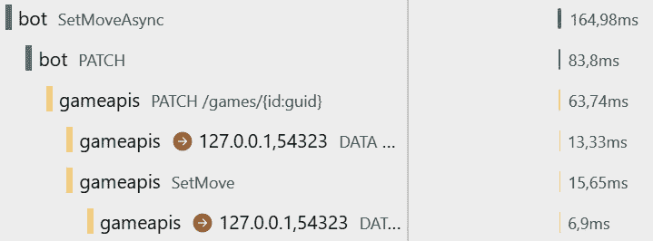

图 12.1 – 追踪移动集

如前图所示，当接收到 PATCH 请求时，使用游戏 ID 从数据库中检索游戏以验证接收到的数据的正确性。在计算移动后，结果游戏被写入数据库。EF Core 的跟踪信息以 DATA 关键字显示，以及访问所需的时间。

性能可能已经足够好，但这也取决于数据库负载。当使用 SQL Server 数据库时，由于写入操作导致的锁定，大量的写入可能会降低读取性能。在更高的数据库负载下，增加请求单元（RU）的数量或使用更大的机器（这会增加成本）可以是解决更高负载的一种方法。更好的选择是缓存数据。许多数据库读取可以通过从内存缓存中读取对象来替代。

一个初步的想法可能是将游戏存储在进程的内存中。如果不在那里，则从数据库中检索它。然而，如果有多个服务实例正在运行，客户端可能会用服务器 A 调用一个移动，用服务器 B 调用另一个移动。因为游戏包含最后移动的编号，从本地缓存中读取它可能会导致游戏的旧版本，因此请求失败。围绕这个问题的一个选项是使用粘性会话。这样，一个客户端总是获得同一个服务实例来满足请求。通过使用分布式内存缓存，可以轻松避免这个要求。

注意

在粘性会话中，客户端总是连接到同一服务实例。粘性会话的最大缺点是当服务崩溃时。没有粘性会话，客户端可以立即切换到另一个服务实例，并且不会检测到任何停机时间。在有粘性会话的情况下，所有会话数据都会对客户端丢失。这并不是唯一的缺点。如果由于性能低下而启动了另一个实例怎么办？新的服务实例只会接收来自新客户端的流量。现有的客户端会继续与它们已经通信的服务器保持连接。这会导致服务器利用率延迟（仅来自新客户端）。在有粘性会话的情况下，服务实例之间的负载可能会不均匀分布。最好的做法是尽量避免使用粘性会话。

当使用分布式内存缓存时，有多种选项可供选择。使用 Microsoft Azure 时，可以使用 Azure Cache for Redis。这项服务根据您的可用性和内存大小需求提供标准、高级、企业和企业闪存产品。使用 Azure Cosmos DB 时，可以采用集成在 Azure Cosmos DB 网关中的内存缓存。该服务的一项特性是针对点读取的项缓存，在游戏运行期间可以多次读取项，从而降低了使用 Azure Cosmos DB 的成本，因为从缓存中读取所需的 RU/s 为 0。

在这里，我们将使用 Redis 的 Docker 容器，它可以在本地 Docker 环境中使用，也可以用于在 Azure Container Apps 中运行解决方案。

## 从缓存中读取和写入

`IDistributedCache`接口的 API 支持写入字节数组和字符串——数据需要通过网络发送到 Redis 集群。为此，我们将创建将`Game`类转换为字节并从字节转换回`Game`类的方法：

Codebreaker.GameAPIs/Models/GameExtensions.cs

```cs
public static class GameExtensions
{
  public static byte[] ToBytes(this Game game) =>
    JsonSerializer.SerializeToUtf8Bytes(game);
  public static Game? ToGame(this byte[] bytes) =>
    JsonSerializer.Deserialize<Game>(bytes);
}
```

`System.Text.Json`序列化器不仅支持将数据序列化为 JSON，还可以将其序列化为字节数组。`Game`类已经支持使用此序列化器进行序列化，因此不需要对`Game`和`Move`模型类型进行任何其他更改。

我们可以从`GamesService`类访问缓存：

Codebreaker.GameAPIs/Services/GamesService.cs

```cs
public class GamesService(
  IGamesRepository dataRepository,
  IDistributedCache distributedCache,
  ILogger<GamesService> logger,
  GamesMetrics metrics,
  [FromKeyedServices("Codebreaker.GameAPIs")]
  ActivitySource activitySource) : IGamesService
{
```

无论使用什么技术实现分布式内存缓存，我们都可以注入`IDistributedCache`接口。

为了使用缓存更新`Game`类，我们可以实现以下方法：

Codebreaker.GameAPIs/Services/GamesService.cs

```cs
private async Task UpdateGameInCacheAsync(Game game, CancellationToken cancellationToken = default)
{
await distributedCache.SetAsync(game.Id.ToString(), game.ToBytes(), 
  cancellationToken);
}
```

游戏 ID 用作键，从缓存中检索游戏对象。调用`SetAsync`方法将对象添加到缓存。如果对象已经缓存，则使用新值更新。通过`DistributedEntryCacheOptions`类型的附加参数，可以配置对象以指定对象应在缓存中停留的时间。在这里，我们需要使用用户从一个动作到另一个动作所需的典型时间。每次检索和更新时，**滑动过期**重新开始。我们可以在这里指定此值，也可以配置默认值。

当创建游戏（`StartGameAsync`）以及设置游戏移动（`SetMoveAsync`）后，需要从`GamesService`类调用`UpdateGameInCacheAsync`方法。

`StartGameAsync`方法中的实现如下所示：

Codebreaker.GameAPIs/Services/GamesService.cs

```cs
game = GamesFactory.CreateGame(gameType, playerName);
activity?.AddTag(GameTypeTagName, game.GameType)
  .AddTag(GameIdTagName, game.Id.ToString())
  .Start();
await Task.WhenAll(
  dataRepository.AddGameAsync(game, cancellationToken),
UpdateGameInCacheAsync(game, cancellationToken));
metrics.GameStarted(game);
```

可以并行写入数据库和缓存。我们不需要等待数据库写入完成，就可以将游戏对象添加到缓存并返回更快的答案。如果数据库失败，游戏是否缓存并不重要。

要从缓存中读取数据，我们需要实现`GetGameFromCacheOrDataStoreAsync`：

Codebreaker.GameAPIs/Services/GamesService.cs

```cs
// code removed for brevity
private async Task<Game?> GetGameFromCacheOrDataStoreAsync(
  Guid id, CancellationToken cancellationToken = default)
{
byte[]? bytesGame = await distributedCache.GetAsync(id.ToString(), 
  cancellationToken);
  if (bytesGame is null)
  {
    return await dataRepository.GetGameAsync(id, cancellationToken);
  }
  else
  {
    return bytesGame.ToGame();
  }
}
```

缓存中的`GetAsync`方法返回缓存的字节数组，然后使用`ToGame`方法进行转换。如果数据在缓存中不可用（可能因为已经分配了太多内存而将项目从缓存中移除，或者如果用户思考下一步棋的时间过长），我们将从数据库中获取游戏。源代码仓库中的代码包括一个标志，您可以通过它关闭从缓存中读取，以便轻松尝试不使用缓存的不同负载，以检查结果。

`GetGameFromCacheOrDataStoreAsync`需要从`SetMoveAsync`和`GetGameAsync`方法中调用。

## 配置 Aspire Redis 组件

关于`game-apis`项目，我们需要添加**.NET Aspire StackExchange Redis 组件**来配置 DI 容器：

Codebreaker.GameAPIs/ApplicationServices.cs

```cs
public static void AddApplicationServices(this IHostApplicationBuilder builder)
{
  // code removed for brevity
  builder.Services.AddScoped<IGamesService, GamesService>();
  builder.AddRedisDistributedCache("redis");
}
```

`AddRedisDistributedCache`方法使用需要与 Aspire App Host 项目配置的缓存名称来获取连接字符串和配置值。使用此方法，还可以以编程方式指定配置值。

最后，在 AppHost 项目中使用`app-model`配置 Redis 资源的 Docker 容器：

Codebreaker.AppHost/Program.cs

```cs
var redis = builder.AddRedis("redis")
  .WithRedisCommander()
  .PublishAsContainer();
var cosmos = builder.AddAzureCosmosDB("cosmos")
    .AddDatabase("codebreaker");
var gameAPIs = builder.AddProject<Projects.Codebreaker_GameAPIs>("gameapis")
  .WithReference(cosmos)
  .WithReference(redis)
  .WithReference(appInsights)
  .WithEnvironment("DataStore", dataStore);
```

`AddRedis`方法配置使用`redis` Docker 镜像为此服务。这需要使用`PublishAsAzureRedis` API 而不是`PublishAsContainer`进行配置。此方法配置`WithRedisCommander`的 PaaS 提供程序，为`app-model`添加 Redis 的管理 UI。

在此配置下，通过机器人运行游戏提供 *图 12*.2 中所示的结果。即使在使用本地系统上的低负载时，写入 SQL Server 需要 5.96 毫秒，写入缓存需要 1.83 毫秒。两者都在 Docker 容器中运行：

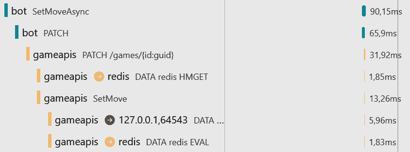

图 12.2 – 使用分布式缓存设置移动

接下来，让我们给 game-apis 项目添加一些负载，以查看资源消耗。

# 使用 Azure Load Testing 模拟用户

在 *第十章* 中，我们创建了用于创建负载测试的 Playwright 测试。这些 Playwright 测试允许我们使用 .NET 代码轻松创建一个完整的流程，以便我们可以从测试中玩游戏。使用 Microsoft Azure，我们可以使用另一个服务来创建测试，并获取与 Azure 服务的集成分析：Azure Load Testing。

注意

在撰写本文时，**Microsoft Playwright 测试**云服务非常适合测试 Web 应用程序的负载。然而，它不支持 API 的负载测试，因此我们将在此使用 Azure Load Testing。您仍然可以使用 Azure 计算（例如，Azure 容器实例）来运行 Playwright 测试，但 Azure Load Testing 具有更好的报告配置和报告功能。

在创建负载测试之前，请确保使用 azd up 将解决方案部署到 Microsoft Azure。查看本章节的 README 文件以获取有关不同 azd 版本更多详细信息。

在 Azure 资源创建后，在 Azure 门户中打开 `game-apis` Azure 容器应用，并从左侧栏选择 **应用程序** | **容器**。容器的资源分配将显示为 *0.5 CPU 核心* 和 *1* *Gi 内存*。

现在，让我们确保第一次测试只使用一个副本。

## 缩放到一个副本

缩放和副本可以扩展到 300 个实例。默认配置是从 1 扩展到 10。创建带有许多用户的负载将自动扩展并启动多个实例。要查看单个实例的限制，将缩放更改为 Min 副本和 Max 副本都仅为一个实例，如图 *图 12*.3 所示。点击创建将创建应用程序的新版本，并在之后取消预配现有版本：

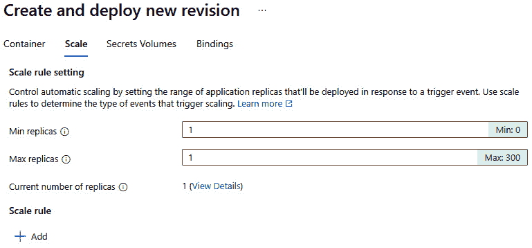

图 12.3 – 使用 Azure 容器应用更改副本

要在部署时指定缩放，创建 YAML 模板以指定 Azure 容器应用的配置。启动一个终端，将当前目录设置为解决方案，并从 Azure 开发者 CLI 中运行以下命令（在您使用 azd init 初始化解决方案之后）：

```cs
azd infra synth
```

此工具使用 app-model 清单创建 Bicep 文件以部署 app-model 的 Azure 资源（在根 infra 文件夹中）。AppHost 项目的 infra 文件夹包含描述已创建的每个 Azure 容器应用（从项目和 Docker 镜像）的 YAML 模板。参见 *第六章* 了解有关 Bicep 文件的更多详细信息。

在 AppHost 项目中，您会看到已生成一个 `<app>.tmpl.yaml` 文件，用于指定 Azure 容器应用的设置。

默认情况下，最小副本数设置为 `1`。使用 bot-service，您可以更改配置：

```cs
  template:
    containers:
# code removed for brevity
    scale:
minReplicas: 0
      maxReplicas: 1
```

使用 bot-service，为了降低成本，可以将缩放范围定义为从 `0` 到 `1`。当最小实例计数设置为 `0` 时，服务没有成本。只需注意，启动服务需要几秒钟，第一个访问服务的用户需要等待。因为机器人不是由游戏玩家调用的，而且这个服务并不总是需要的，它可以缩小到 `0`。game-apis 服务应该始终快速返回答案；因此，最小缩放应设置为 `1`。如果没有服务负载，会有闲置费用。这样，CPU 的成本可以降低到正常成本的约 10%，但内存（应用程序仍然加载在内存中）的价格是正常的。为了测试精确一个副本的负载，将 game-apis 服务的最小和最大值设置为 `1`。稍后，在扩展时，我们将再次增加最大副本的数量。

在 YAML 文件中更改副本数量后，可以使用 az up 或仅使用 az deploy 重新部署应用程序。

我们还需要确保数据库允许所需的请求。通过负载测试，我们可以预期我们需要超过 400 RU/s。在第一次测试运行之前，将 Azure Cosmos DB 的吞吐量更改为自动缩放，最大值为 1,000 RU/s。

现在，我们已准备好创建测试。

## 创建基于 Azure URL 的负载测试

要创建新的负载测试，使用 Azure 门户创建 Azure Load Testing 资源。指定资源组名称和资源名称。

一旦资源可用，在门户中打开它，并在左侧栏中选择 **测试** | **测试**。然后，在选择 **创建基于 URL 的测试** 后点击 **创建**。在 **基本** 选项卡下，指定 **测试名称** 和 **测试描述** 的值，并勾选 **启用高级设置** 复选框，如图 *图 12* 所示。4*：

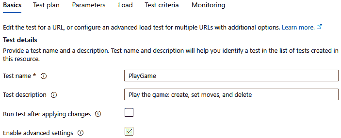

图 12.4 – 负载测试 – 基本设置

选择 **启用高级设置** 后，可以创建包含最多五个 HTTP 请求的测试计划。因此，在 **测试计划** 部分添加五个请求，如图 *图 12* 所示。5*：

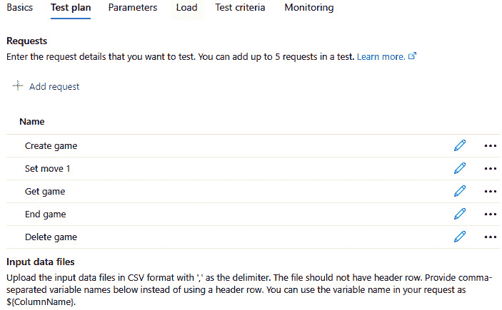

图 12.5 – 负载测试 – 测试计划

第一个请求是创建游戏的 POST 请求。第二个是更新游戏移动的 PATCH 请求。接着是一个获取游戏信息的 GET 请求，一个结束游戏的 PATCH 请求，以及一个删除游戏的 DELETE 请求。

这些请求可以很容易地通过 UI 进行配置，如图 *图 12.6* 所示：

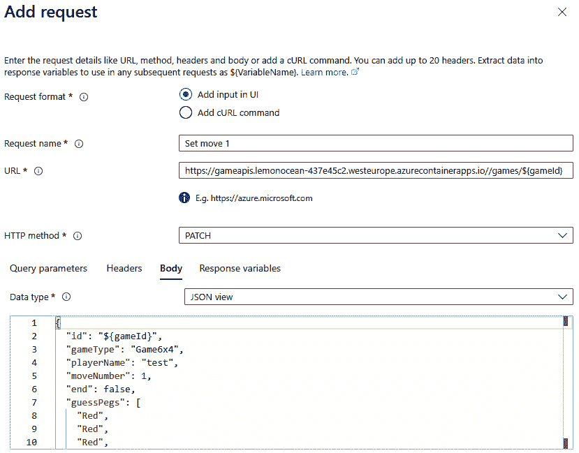

图 12.6 – 压力测试 – 添加请求

你可以从 OpenAPI 描述或 HTTP 文件中获取请求信息，也可以将此章节的 README 文件中的请求复制到 Body 区域。请求及其 HTTP 头部信息已列出。确保在指定 URL 时使用指向你的 Azure 容器应用的链接。

在 POST 请求中，不仅指定正文，还要定义响应的使用。JSON 结果返回 id；这可以通过 $.id 表达式访问。将其设置为 gameId 变量。响应变量可以在后续请求中使用——并且所有后续请求都需要游戏 ID。在设置游戏移动时，使用 ${gameId} 将游戏 ID 传递到 URL 字符串和 HTTP 正文。你可以查看此章节的 README 文件以获取有关不同请求应指定哪些值的更多详细信息。

在下一对话框中，如 *图 12.7* 所示，可以指定负载：

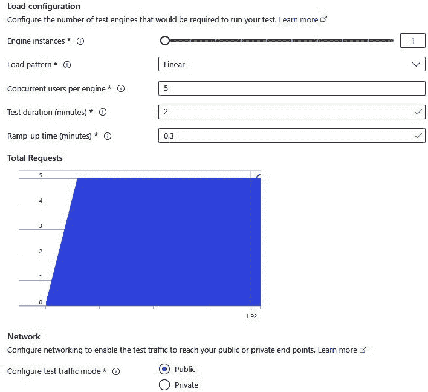

图 12.7 – 压力测试 – 指定负载

在这里，我们将从 5 个并发虚拟用户开始测试，并使用更多用户负载和多个引擎实例进行其他测试，起始时间为 0.3 分钟。一个测试引擎实例可以指定多达 250 个虚拟用户，并且使用 10 个实例可以增加到 2,500 个虚拟用户。配置还允许你指定负载模式值，该值会随着时间的推移增加负载。进行多次不同用户数量的测试运行可以很好地指示应使用哪些缩放规则来增加服务实例的数量。

注意在测试时，使用 2,500 个虚拟用户和 10 个后台虚拟机可能产生的成本。与迄今为止我们使用的其他资源不同，使用这个方法，你很容易就会超过 Visual Studio Enterprise Azure 订阅或免费 Azure 订阅的订阅限制。幸运的是，我们只需为测试运行的时间付费，而无需为仅需要短时间的物理机器付费。

注意

不要假设虚拟用户与真实用户相同。与 Azure 负载测试中的虚拟用户相比，真实用户产生的负载要少得多。真实用户在移动之间需要思考。每次移动之间可能需要几秒钟，甚至几分钟。虚拟用户只是连续调用 API。在幕后使用的 JMeter 测试中，虚拟用户的数量配置了要使用的线程数。您可以将虚拟用户与真实用户相比计算出多少真实用户取决于应用程序的类型。您需要找出在监控生产中的应用程序时，真实用户平均思考的时间有多长。在*第十章*中，我们创建了自定义指标数据来监控移动之间的时间；这是一个很好的值来使用。

在测试标准配置（见图*图 12.8*）中，您可以指定测试何时应该失败 – 例如，当响应时间过长时。在进行第一次测试运行之前，您可以留空测试标准以查看低负载下达到的值：

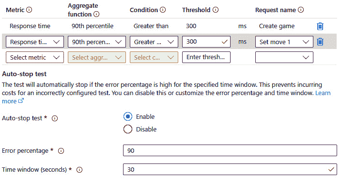

图 12.8 – 压力测试 – 测试标准

对于最后一个配置，打开监控设置，如图*图 12.9*所示：

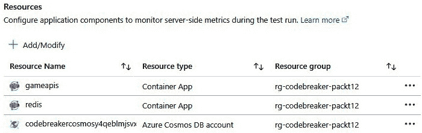

图 12.9 – 指定监控资源

选择参与测试的资源，例如游戏 APIs 和 Redis Azure 容器应用，以及 Azure Cosmos DB 资源。您可以根据资源组轻松过滤资源。

现在，我们已经准备好运行测试。

## 使用虚拟用户运行负载

在创建和修改测试后，点击保存后，您需要等待 JMeter 脚本创建完成；否则，测试将无法启动。要运行测试，请点击运行按钮并输入测试描述 – 例如，5 个用户 0.5 核心。

测试完成后，您将看到来自测试引擎的客户端指标和来自所选 Azure 容器应用的端点服务的服务器端指标。

当我进行测试运行时，发送了 7,834 个请求（远多于五个人在 2 分钟内会做的请求），并且使用了高达 0.49 个 CPU 核心和 354 MB 的内存。90%的请求响应时间低于 116 毫秒，吞吐量为每秒 67.53 个请求。

注意

不要期望多次运行会得到相同的结果。许多依赖项运行这些测试。使用不同 Azure 服务之间的网络性能和延迟如何？对于我的测试，我在服务运行的同一天 Azure 区域创建了 Azure Load Testing 服务。即使在同一 Azure 区域，不同的资源也可能在相同或不同的数据中心中运行。这些差异不是问题。用户将位于 Azure 数据中心之外。我们需要知道一个实例可以服务多少用户，以及最佳的应用程序设置是什么，例如 CPU 和内存资源（扩展）或运行多个副本（扩展）。我们还需要看到真正的瓶颈是什么，以及什么可以控制。

*图 12.10* 显示了每次 API 调用的响应时间结果：

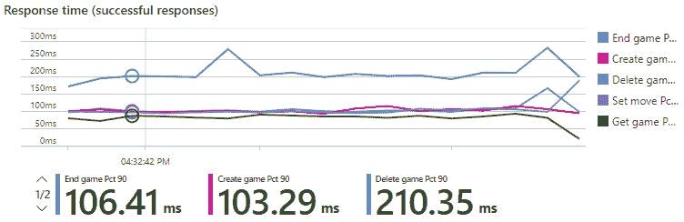

图 12.10 – 五个虚拟用户的响应时间

使用五个虚拟用户时，考虑到所有请求，响应时间是可以接受的。有趣的是，使用 Azure Cosmos DB，删除请求需要最长时间来完成。

五个虚拟用户是一个良好的起点，但让我们增加更多的负载。

## 在更高负载下达到限制

要更改测试的负载，您可以编辑它。为此，点击 `25`。点击 **应用** 并等待 Azure 门户中的 JMeter 脚本创建带有 **通知**。此时，您可以再次开始测试。

在我的测试运行中，将虚拟用户数量增加到 25 仅导致 11.701 个总请求，每秒 98.39 个请求。创建游戏的请求需要 289 毫秒，90% 分位数。*图 12.11* 显示了此测试每秒的请求数量：

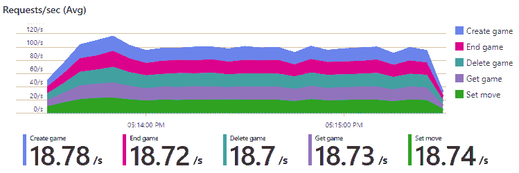

图 12.11 – 每秒请求数量

将结果与五个用户的测试运行进行比较，使用 25 个用户仅导致总请求和每秒请求量略有增加。因此，创建游戏的时间从 96 毫秒增加到 498 毫秒。这不是一个好的结果。为什么会这样？服务器端指标没有达到 Azure Container Apps 的 CPU 核心和内存限制。限制不是 Azure Container Apps 的，而是 Azure Cosmos 数据库的，如图 *图 12.12* 所示：

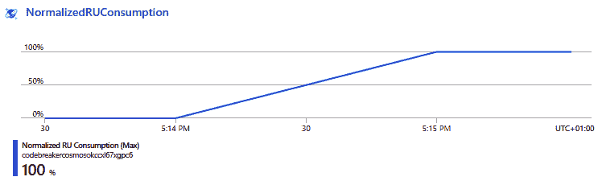

图 12.12 – Azure Cosmos DB RU 消耗

当使用 Azure Cosmos DB 运行此测试时，RU 被配置为 **autoscale** 吞吐量，并达到了最大 1,000 RU/s 限制。这可以在前面的图中看到。您还可以在 App Insights 中的 **Application Map** 中深入了解，并检查不同的 Azure Cosmos DB 指标，如图 *图 12.13* 所示。13*：

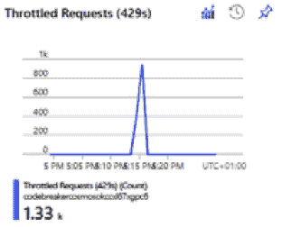

图 12.13 – 使用 Azure Cosmos DB 限制请求

如我们所见，请求已被限制；`game-apis`服务返回了错误代码 429。您可以使用**Kusto 查询语言**（**KQL**）来查询这些日志消息（有关 KQL 的更多信息，请参阅*第十一章*）：

```cs
ContainerAppConsoleLogs_CL
| where  Log_s contains "Request rate is large"
```

返回的完整日志消息为“*请求速率过高。可能需要更多请求单元，因此没有进行更改。请稍后重试此请求。更多信息：http://aka.ms/cosmosdb-error-429.*”

在本章早期，我们通过使用缓存删除数据库中不需要的请求来减少 Azure Cosmos DB 的负载。如果没有这个更改，限制会更早地被触及。

虽然错误代码 429 已返回到`game-apis`服务，但由于.NET Aspire 内置的重试配置，调用结果仍然成功。但当然，请求所需的时间增加了。

在创建测试时，我们确保可以看到测试中所有资源的指标数据。这就是为什么我们可以通过测试运行看到 Cosmos 指标，并且可以轻松修复它。让我们使用 Cosmos DB 来增加 RU/s。最大值为 1,000 RU/s，最小值为 100。将最大值增加到 10,000 将最小值设置为 1,000。确保您在测试运行期间仅将最大值更改为更高的值，并在需要时进行更改。您可以在调整 RU/s 的对话框中查看预期的成本。确保您在不再需要时减少缩放限制。可以将最大值设置为 1,000,000 RU/s，这将最小值设置为 100,000。在点击**保存**按钮之前，您可以在更改此吞吐量时查看价格范围。请注意，当更改超过 10,000 RU/s 的最大值时，此计算能力可能需要 4 到 6 小时才能可用。

在 25 个虚拟用户的情况下，我们达到了 1,000 RU/s 的限制。因此，让我们将其增加到 10,000 RU/s。如果不需要这么多 RU/s 来满足特定数量的用户，我们将在测试结果中看到这一点，并在测试运行后根据我们的需求调整设置。

在增加 RU/s 限制并再次使用 25 个虚拟用户运行测试后，Azure Cosmos DB 不再是瓶颈。只有 12%的 RU/s 正在使用。因此，让我们将虚拟用户数量增加到 50。

# 扩展服务或扩展服务

让我们使用 50 个虚拟用户运行测试，并比较在增加 CPU 和内存以及增加副本数量时性能如何不同。

## 配置扩展

要进行扩展，我们必须增加 CPU 和内存值。

注意

当使用 `azd up` 创建容器应用时，会创建一个 *基于消费的* 环境。还有创建带有 *专用硬件* 的 *工作负载配置文件* 的选项。当使用专用硬件时，您可以选择将要使用的虚拟机类型。在撰写本书时，虚拟机分为类别 D（通用型，4 – 32 核心，16 – 128 GiB 内存）和 E（内存优化型，4 – 32 核心，32 – 256 GiB 内存，并带有最多 4 个 GPU）。机器类型还定义了可用的网络带宽。根据您的工作负载，有许多不错的选择。

要在 Azure 门户中更改 CPU 和内存，在容器应用中，从左侧栏选择 **容器**，点击 **编辑和部署** 按钮，选择容器镜像，然后点击 **编辑**。这将打开容器编辑器，您可以在其中选择 CPU 核心和内存，如图 *图 12**.14* 所示：

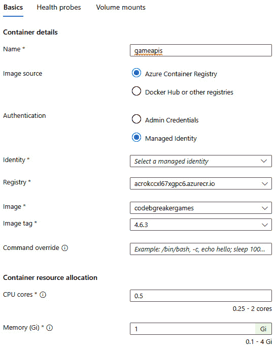

图 12.14 – 编辑容器的设置

在这里，我们将更改 CPU 和内存值。当使用基于消费的环境时，请注意配置需要映射，例如，0.5 核心 1.0 Gi 内存，1.0 核心 2.0 Gi 内存，最高到 2.0 核心 4.0 Gi 内存。在消费工作负载配置文件中，您可以使用一个容器拥有高达 4.0 核心 8.0 Gi 内存。

我们也可以使用 YAML 模板文件进行配置：

```cs
template:
  containers:
    - image: {{ .Image }}
      name: gameapis
      resources:
        cpu: 1.0
        memory: 2Gi
# configuration removed for brevity
```

CPU 和内存资源在 `resources` 类别中指定。在确定最佳配置后，使用 YAML 文件指定它将创建正确的大小。

对 50 个用户进行 2 分钟的负载测试，基于以下配置显示以下结果：

|  | **总请求** | **吞吐量** | **创建** **游戏响应** | **10,000 RU/s** |
| --- | --- | --- | --- | --- |
| 0.5 核心，1 Gi | 12,015 | 100.13/s | 491 ms | 16% |
| 1 核心，2 Gi | 20,621 | 171.84/s | 383 ms | 24% |
| 2 核心，4 Gi | 22,444 | 187.03/s | 381 ms | 26% |

表 12.1 – 扩展负载测试结果

使用这些配置，我们可以看到将计算资源增加到 1 核心 2 Gi 内存会带来改进，而再次复制计算资源只会带来小幅改进。

现在，让我们更改副本。

## 配置扩展

您在本章前面学习了如何更改副本数量。在本节中，我们将同时更改最小和最大计数到相同的值，这样我们就可以在不同的实例之间分配负载。

当测试使用 0.5 核心 1 Gi 内存时，我们收到以下计数：

|  | **总请求** | **吞吐量** | **创建** **游戏响应** | **10,000 RU/s** |
| --- | --- | --- | --- | --- |
| 1 副本 | 12,015 | 100.13/s | 491 ms | 16% |
| 2 副本 | 16,291 | 135.76/s | 490 ms | 20% |
| 4 副本 | 27,704 | 230.87/s | 299 ms | 34% |

表 12.2 – 扩展负载测试结果

使用 0.5 核心和 1 Gi 的内存的两个副本与一个核心和 2 Gi 内存的一个副本使用的 CPU 和内存资源相同。一个核心的实例是更好的性能选择，有 20,621 个请求，而另一个有 16,291 个请求。通过添加更多副本，我们可以比仅添加 CPU 资源实现更高的缩放。

使用多个副本的一个大优点是我们可以根据负载动态缩放。我们将在下一节中创建缩放规则。缩放规则不允许我们更改 CPU 和内存资源。

在扩展多个实例时，你需要注意应用程序是否为此而设计。当在内存游戏存储中使用 Codebreaker 应用程序时，实现时考虑了多线程，但没有考虑多台机器。当一个用户开始游戏，而下一个用户设置移动时，第一个请求可能会访问存储在内存中的第一台机器，而第二个请求可能会访问设置移动的游戏不可用的第二台机器。提供分布式内存的 Redis 缓存解决了这个问题。本章 GitHub 仓库中提供的示例应用程序包括`DistributedMemoryGamesRepository`类，它可以配置为`DataStore`配置设置为`DistributedMemory`。为了在本地开发环境中测试此功能，你可以更改 AppHost 项目：

Codebreaker.AppHost/Program.cs

```cs
var gameAPIs = builder.AddProject<Projects.Codebreaker_GameAPIs>("gameapis")
  .WithReference(cosmos)
  .WithReference(redis)
  .WithReference(appInsights)
  .WithEnvironment("DataStore", dataStore)
  .WithEnvironment("StartupMode", startupMode)
  .WithReplicas(2);
```

当在配置项目时添加`WithReplicas`方法，可以指定副本的数量。当值为`2`时，在本地运行解决方案时，.NET Aspire 仪表板（*图 12**.15*）显示运行的两个`game-apis`服务实例。每个服务都有一个端口号，允许访问特定的实例。公共端口号`9400`是引用运行在端口号`49379`和`49376`的`game-apis`服务实例的代理客户端的端口号。代理使用的端口号由`launchsettings.json`文件定义，而实例的端口号在新的应用程序启动时随机更改：

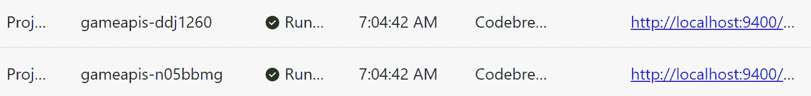

图 12.15 – game-apis 的两个副本

现在我们已经了解了在运行多个副本时可以进行的改进，让我们进行动态缩放。

# 使用缩放规则动态缩放

使用 Azure Container Apps，可以根据并发 HTTP 请求、并发 TCP 请求或自定义规则定义缩放规则。使用自定义规则，缩放可以基于 CPU、内存或基于不同数据源的许多事件。

一个微服务不一定基于 HTTP 请求触发。该服务也可以异步触发，例如，当队列中到达消息时（例如，使用 Azure 存储队列或 Azure 服务总线）或当事件发生时（例如，使用 Azure 事件中心或 Apache Kafka）。

Azure 容器应用的缩放规则基于 **Kubernetes 事件驱动自动缩放**（**KEDA**），提供了一长串的缩放器。您可以在 [`keda.sh`](https://keda.sh) 找到完整的列表。

当使用 Azure Service Bus 队列与 KEDA 缩放器一起使用时，您可以指定在启动另一个副本时应有多少条消息在队列中。所有 KEDA 缩放器共有的特点是轮询间隔的配置 – 检查值的频率（默认为 30 秒），一个用于计算副本数量的缩放算法，以及冷却期（300 秒） – 在副本启动后可以再次停止副本之前的时间。

在 *第十五章* 中，我们将使用消息和事件进行通信，自动缩放将基于基于事件的 KEDA 缩放器。

当我们使用固定数量的实例测试负载时，我们看到最佳的服务扩展选项是使用 HTTP 请求的数量。因此，让我们使用 HTTP 规则配置扩展。我们可以通过使用 Azure 门户和由 `azd infra synth` 生成的模板 YAML 文件来完成此操作。这是 Azure 门户中 JSON 内容的输出：

```cs
"template": {
      ...
      "scale": {
        "minReplicas": 1,
        "maxReplicas": 8,
        "rules": [{
          "name": "http-rule",
          "http": {
            "metadata": {
              "concurrentRequests": "30"
            }
          }
        }]
      }
    }
```

默认的 HTTP 规则与 10 个并发请求成比例。根据测试结果，我们将此值设置为 `30`。副本的数量在 `1` 到 `8` 之间。关于 HTTP 缩放的重要信息是，每 15 秒计算一次请求数量。将过去 15 秒内的总请求数除以 15，以便可以将其与 `concurrentRequests` 值进行比较。据此，计算副本的数量。因此，如果每秒有 140 个请求，实例计数将设置为 5。

当应用此缩放规则且实例处于活动状态时，我们可以配置具有动态模式配置的负载测试，如图 *图 12.16* 所示：

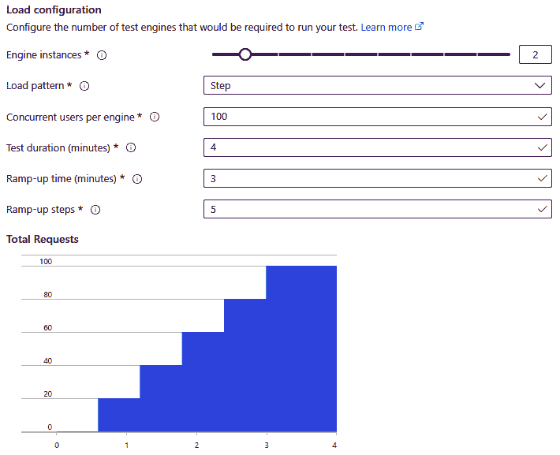

图 12.16 – 步骤负载模式

在此步骤负载模式下，使用两个引擎实例启动 200 个虚拟用户。完整的测试持续时间是 4 分钟。爬坡时间定义了达到 200 个虚拟用户所需的时间 – 使用 5 个爬坡步骤以 40 的增量增加用户。

测试运行完成后，您可以看到虚拟用户随时间增加的情况，如图 *图 12.17* 所示：

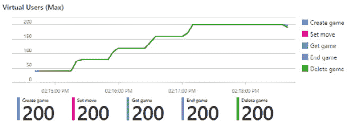

图 12.17 – 200 虚拟用户

每秒请求数量显示在 *图 12.18* 中：

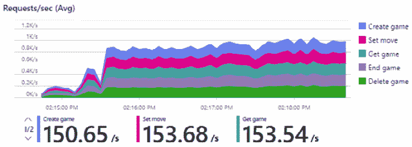

图 12.18 – 每秒请求数量

*图 12.19* 显示了响应时间，时间在下午 2:17 开始变长。您有什么想法吗？

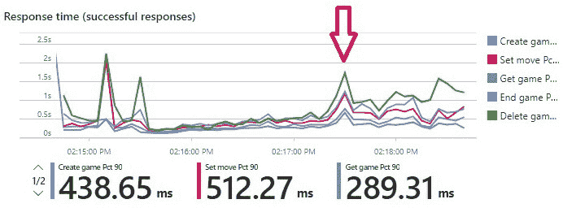

图 12.19 – 响应时间

答案是，使用这种负载，我们达到了 Azure Cosmos 数据库的 10,000 RU/s 限制，如图 *图 12.20* 所示：

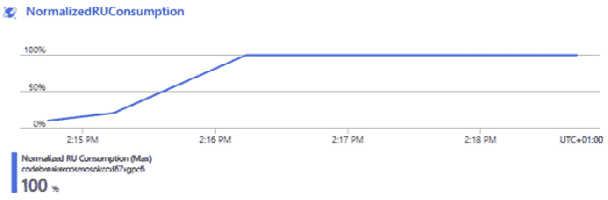

图 12.20 – 达到 10,000 RU/s

在下午 2:16 之后达到了最大 RU/s。当达到这个限制时，不会立即返回“请求过多”的响应。

看到我们创建的缩放规则的副本计数也很有趣。这显示在 *图 12.21* 中：

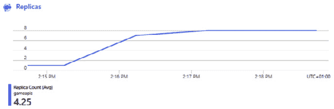

图 12.21 – 副本计数

副本计数从 1 开始，增加到 8 – 最大配置的副本数。*图 12.19* 显示了另一个问题，而不是 RU/s 限制。启动后，响应时间有一些峰值。这对应于 *图 12.18* 中每秒请求量的减少。在这次测试运行之后，我不得不深入调查这个问题。指标数据没有揭示原因，但检查 `ContainerAppSystemLogs_CL` 表中的日志提供了关于问题是什么的信息。当时，是时候启动一个新的副本了。根据日志，分配了新的副本，拉取了镜像，并创建了一个容器 – 但 *启动探测* 失败，副本不健康。不会向这样的副本发送请求。因此，对于我们所生成的负载，我们仍然只有一个副本。在第三个副本成功之前，有缺陷的副本启动了两次。这就是为什么增加副本计数比预期花费的时间更长，这也是为什么开始时出现峰值的原因。之后，每个新创建的副本都立即成功。如果你有特定副本的问题，你可以使用副本的名称来查询日志：

```cs
ContainerAppSystemLogs_CL
| where ReplicaName_s == "gameapis--tc47v0x-7cb88d64b8-np8cg"
| order  by  time_t asc
```

接下来，我们将深入了解健康检查。这将帮助你理解启动探测。

# 实现健康检查

托管平台需要知道服务是否成功启动并且可以处理请求。当服务正在运行时，托管平台会持续检查服务是否正在运行或已损坏并需要重启。这就是健康检查的目的。

使用 Kubernetes，可以配置三个探测：

+   `启动`: 容器是否已准备好并且已启动？当这个探测成功时，Kubernetes 将切换到其他探测。

+   `活跃性`: 应用程序是否崩溃或死锁？如果失败，则停止 pod，并创建一个新的容器实例。

+   `就绪性`: 应用程序是否准备好接收请求？如果失败，则不会向此服务实例发送请求，但 pod 仍然运行。

由于 Azure Container Apps 基于 Kubernetes，因此可以使用此 Azure 服务配置这三个探测。

## 将健康检查添加到 DI 容器

健康检查可以通过 `AddDefaultHealthChecks` 扩展方法中的 DI 容器进行配置：

Codebreaker.ServiceDefaults/Extensions.cs

```cs
public static IHostApplicationBuilder AddDefaultHealthChecks(this IHostApplicationBuilder builder)
{
  builder.Services.AddHealthChecks()
    .AddCheck(
      "self",
      () => HealthCheckResult.Healthy(),
      tags: ["live"]);
  return builder;
}
```

`AddHealthChecks` 方法将 `HealthCheckService` 类注册到 DI 容器中，该容器将可用于健康检查。`AddHealthChecks` 方法可以多次调用以访问 `IHealthChecksBuilder`，它用于注册不同的检查实现。流畅调用的 `AddCheck` 方法使用委托在调用时返回 `HealthCheckResult.Healthy` 结果。最后一个参数定义了 `"live"` 标签。标签与中间件一起使用，以指定应使用哪个路由进行此健康检查。正如其名所示，此标签非常适合 `liveness` 探针。当服务可访问时，会返回一个结果。如果服务不可用，则不返回任何内容，因此它将被重新启动。名称 `self` 表示仅使用此健康检查本身，而外部资源仅在就绪健康检查中咨询。

在 `game-apis` 服务的启动时，使用 Azure Cosmos DB 创建容器，如果数据库模式已更新，则可以使用 SQL Server 进行数据库迁移。在此完成之前，应用程序尚未准备好接收请求。对于某些应用程序，在接收请求之前需要用参考数据填充缓存。为此，必须使用数据库更新代码定义一个布尔标志，该标志在更新完成后设置。让我们向 `game-apis` 的 DI 容器配置中添加一个健康检查：

Codebreaker.GameAPIs/Program.cs

```cs
builder.Services.AddHealthChecks().AddCheck("dbupdate", () =>
{
  return ApplicationServices.IsDatabaseUpdateComplete ?
    HealthCheckResult.Healthy("DB update done") :
    HealthCheckResult.Degraded("DB update not ready");
});
```

在此实现中，如果标志（`IsDatabaseUpdateComplete` 属性）为真，则返回 `Healthy`，否则返回 `Degraded`。

当你尝试此操作时，数据库迁移可能太快而无法看到降级结果——特别是如果数据库已经创建的话。在 `Codebreaker.GameAPIs/ApplicationServices.cs` 文件中将数据库迁移添加延迟有助于这里，因为你可以查看不同的健康结果。

注意

健康检查应快速实现。这些检查调用频率很高，不应导致大的开销。通常，这些检查涉及打开连接或检查要设置的标志。

## 使用 .NET Aspire 组件添加健康检查

所有 .NET Aspire 组件都启用了健康检查功能——如果组件支持健康检查。请查阅有关这些组件的文档以了解更多信息。

与指标和遥测配置类似，健康检查可以通过组件的配置设置启用和禁用。

这可以通过编程方式完成：

Codebreaker.GameAPIs/ApplicationServices.cs

```cs
            builder.Services.AddDbContextPool<IGamesRepository, GamesSqlServerContext>(options =>
{
  var connectionString = builder.Configuration.GetConnectionString("CodebreakerSql") ??
    throw new InvalidOperationException("Could not read SQL Server connection string");
  options.UseSqlServer(connectionString);
  options.UseQueryTrackingBehavior(QueryTrackingBehavior.NoTracking);
});
builder.EnrichSqlServerDbContext<GamesSqlServerContext>(
  static settings =>
  {
    settings.DisableTracing = false;
    settings.DisableRetry = false;
    settings.DisableHealthChecks = false;
  });
```

.NET Aspire SQL Server EF Core `EnrichSqlServerDbContext` 组件方法的参数允许我们覆盖组件设置的默认值，例如指标、跟踪和健康检查。

我们还可以使用以下 .NET Aspire 配置来指定此功能：

```cs
{
  // code removed for brevity
  "Aspire": {
    "Microsoft": {
      "EntityFrameworkCore": {
        "SqlServer": {
         "DbContextPooling": true,
         "DisableTracing": false,
         "DisableHealthCheck": false,
         "DisableMetrics": false
       }
     }
   },
   "StackExchange": {
     "Redis": {
       "DisableTracing": false,
       "DisableHealthCheck": false
     }
   }
 }
```

此配置显示了 Redis 和 SQL Server EF Core 组件的设置。这两个组件都与就绪探针集成。这些健康检查做了什么？没有对数据库进行读取或写入。健康检查应该是快速的，并且不会对系统造成高负载。Redis 组件尝试打开连接。SQL Server EF Core 组件调用 EF Core 的 `CanConnectAsync` 方法。您需要注意，当 Azure Container App 的空闲定价缩放到 1 时，带有自定义健康检查，它可能永远不会空闲。

使用此类配置确保可以在不重新编译项目的情况下进行更改。

现在我们已经实现了和配置了健康检查，让我们将这些映射到 URL 请求。

## 映射健康检查

将健康链接映射到 URL 允许我们访问它们。共享的 `Codebreaker.ServiceDefaults` 文件包含使用 `MapDefaultEndpoints` 方法配置的健康端点：

Codebreaker.ServiceDefaults/Extensions.cs

```cs
public static WebApplication MapDefaultEndpoints(this WebApplication app)
{
  // code removed for brevity
  app.MapHealthChecks("/alive", new HealthCheckOptions
  {
    Predicate = r => r.Tags.Contains("live")
  });
  app.MapHealthChecks("/health");
  return app;
}
```

`/alive` 探针链接已配置为仅使用带有 `live` 标签的健康检查，因此健康检查用于检查服务是否存活。此链接应配置为实时探测，如果服务没有返回 `Healthy`，则应重新启动服务。

`/health` 探针链接已配置为不根据标签限制健康检查。在这里，所有健康检查都会被调用，并且需要成功。此链接应用于就绪探针：服务是否准备好接收请求？如果返回 `Unhealthy` 或 `Degraded`，则服务没有停止，但不会接收请求。

注意

您可能想知道为什么 .NET Aspire 不使用 `/healthz` 链接进行就绪探针，因为它通常与 Kubernetes 一起使用。`/healthz` 历史上来自 Google 的内部实践，z-pages，因此不会发生冲突。.NET Aspire 团队对不同的链接进行了多次迭代，包括 `/liveness` 和 `/readiness`，最终确定为 `/alive` 和 `/health`。

现在我们已经将健康检查映射到 URI，让我们使用这些链接。

## 使用 Azure Container Apps 进行健康检查

使用 Azure Container Apps 生成探针配置后，您可以自动集成健康探针。您还可以使用这些健康探针与 Azure 仪表板一起使用。然而，这不在 .NET Aspire 的第一个版本中提供，计划在以后的版本中提供。但是，通过一点定制，这可以轻松完成。

为了使其工作，您需要使用 `azd init` 初始化解决方案，您之前已经这样做，然后在将解决方案发布到 Azure 之前。现在，从包含解决方案的文件夹中创建将发布这些项目的代码：

```cs
azd infra synth
```

通过这种方式，AppHost 项目包含一个 `infra` 文件夹，其中包含 `<app>.tmpl.yaml` 文件。在 `gameapis.tmpl.yaml` 文件中，指定 `probes` 部分：

```cs
  template:
    containers:
      - image: {{ .Image }}
        name: gameapis
        probes:
          - type: liveness
            httpGet:
              path: /alive
              port: 8080
            initialDelaySeconds: 3
            periodSeconds: 3
          - type: readiness
            httpGet:
              path: /health
              port: 8080
            initialDelaySeconds: 10
            periodSeconds: 5
          - type: startup
            tcpSocket:
              port: 8080
            initialDelaySeconds: 1
            periodSeconds: 1
            timeoutSeconds: 3
            failureThreshold: 30
        env:
        - name: AZURE_CLIENT_ID
# configuration removed for brevity
```

`probes` 部分允许配置 `liveness`、`readiness` 和 `startup` 探测类型。`liveness` 探测配置为调用 `/alive` 链接，而 `readiness` 探测配置为调用带有运行 Docker 容器端口的 `/health` 链接。Azure Container Apps 有默认设置。然而，一旦指定了探测，就需要配置所有探测类型；否则，未配置的探测将被禁用。因此，当指定 `liveness` 和 `readiness` 探测时，也应配置 `startup` 探测。此探测使用 TCP 连接连接到服务以验证连接是否成功。

`initialDelaySeconds` 指定了等待直到第一次探测完成所需的秒数。如果这失败了，将在 `periodSeconds` 指定的秒数之后进行额外的检查。只有当达到 `failureTreshold` 时，失败才会计数。

默认启动探测使用 TCP 探测，检查入口目标端口，初始延迟为 1 秒，超时为 3 秒，周期为 1 秒。随着失败阈值的增加，这会乘以，应用可能需要一些时间才能成功启动。一旦 `startup` 探测成功一次，之后只使用 `liveness` 和 `readiness` 探测。

进行此更改后，从解决方案文件夹中运行以下命令：

```cs
azd deploy
```

这将部署服务到 Azure 并配置健康检查。

打开 Azure 门户，导航到 Azure Container Apps，并从左侧面板中选择 **容器**。你会看到一个名为 **健康探测** 的选项卡，如图 *图 12.22* 所示：

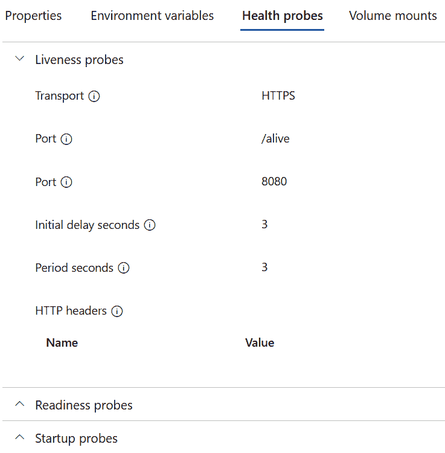

图 12.22 – Azure Container Apps 中的健康探测

在这里，我们可以看到门户中配置的 `liveness` 探测的设置。你还可以验证 `readiness` 和 `startup` 探测。*图 12.23* 显示了容器的状态：

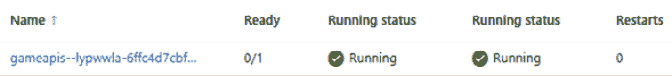

图 12.23 – 容器应用正在运行但尚未就绪

在这里，有一个副本正在运行，但这个副本尚未就绪。当时的 `readiness` 探测没有返回成功。如果你配置了 Redis 组件使用 .NET Aspire 提供健康检查，你可以使用 Azure Container Apps 环境停止此容器。你会看到 `game-apis` 服务尚未就绪。因为 `game-apis` 服务启用了组件健康检查，所以健康检查返回了错误。

# 摘要

在本章中，你学习了如何使用遥测数据并实现缓存以减少数据库请求的数量。你创建了健康检查，区分了启动、存活性和就绪性检查。存活性检查用于重启服务，而就绪性检查用于验证服务是否准备好接收请求。关于就绪性检查，你学习了如何集成 .NET Aspire 组件。你还学习了如何从负载测试中获取信息以找到已部署应用程序中的瓶颈，并决定你希望使用的架构。通过这样做，你学习了如何配置应用程序，使其在 CPU 和内存发生变化时进行扩展，以及如何使用扩展规则在运行多个副本时进行横向扩展。

本章揭示了使用微服务的一个重要原因：随着规模的扩大，可以轻松实现极大的灵活性。

下一章将作为一个起点，并实现与微服务不同的通信技术。当向你的应用程序添加更多功能时，你需要考虑在测试环境中对解决方案进行持续负载测试并监控变化。

# 进一步阅读

要了解更多关于本章讨论的主题，请参阅以下链接：

+   *ASP.NET* *Core* 中的分布式缓存：[`learn.microsoft.com/en-us/aspnet/core/performance/caching/distributed`](https://learn.microsoft.com/en-us/aspnet/core/performance/caching/distributed)

+   *数据库可伸缩性：横向扩展与纵向扩展*：[`azure.microsoft.com/en-au/resources/cloud-computing-dictionary/scaling-out-vs-scaling-up/`](https://azure.microsoft.com/en-au/resources/cloud-computing-dictionary/scaling-out-vs-scaling-up/)

+   *Azure 虚拟机* *大小*：[`learn.microsoft.com/en-us/azure/virtual-machines/sizes`](https://learn.microsoft.com/en-us/azure/virtual-machines/sizes)

+   *工作负载* *配置文件*：[`learn.microsoft.com/en-us/azure/container-apps/workload-profiles-overview`](https://learn.microsoft.com/en-us/azure/container-apps/workload-profiles-overview)

+   *容器* *配置*：[`learn.microsoft.com/en-us/azure/container-apps/containers#configuration`](https://learn.microsoft.com/en-us/azure/container-apps/containers#configuration)

+   *Azure Container Apps YAML* *规范*：[`learn.microsoft.com/en-us/azure/container-apps/azure-resource-manager-api-spec`](https://learn.microsoft.com/en-us/azure/container-apps/azure-resource-manager-api-spec)

+   *ASP.NET* *Core* 中的健康检查：[`learn.microsoft.com/en-us/aspnet/core/host-and-deploy/health-checks/`](https://learn.microsoft.com/en-us/aspnet/core/host-and-deploy/health-checks/)

+   *关于 /**healthz* 的约定：[`stackoverflow.com/questions/43380939/where-does-the-convention-of-using-healthz-for-application-health-checks-come-f`](https://stackoverflow.com/questions/43380939/where-does-the-convention-of-using-healthz-for-application-health-checks-come-f)*

# 第四部分：更多通信选项

在本部分，重点转向利用各种通信技术以及整合额外的 Azure 服务来增强应用程序。通过 SignalR 实现实时消息功能，将应用程序到客户端的即时更新传递。使用 gRPC 进行服务间的有效二进制通信，通过队列和事件发布实现无缝的消息交换。Azure 服务如 Azure SignalR 服务、事件中心、Azure 队列存储和 Apache Kafka 被集成到应用程序生态系统中。此外，还提供了针对生产环境考虑因素的详细审查，最终将应用程序部署到 Kubernetes 集群，特别是 Azure Kubernetes 服务，利用 **Aspir8**。

本部分包含以下章节：

+   *第十三章*，*使用 SignalR 进行实时消息传递*

+   *第十四章*，*二进制通信的 gRPC*

+   *第十五章**，使用消息和事件进行异步通信*

+   *第十六章**，在本地和云端运行应用程序*
