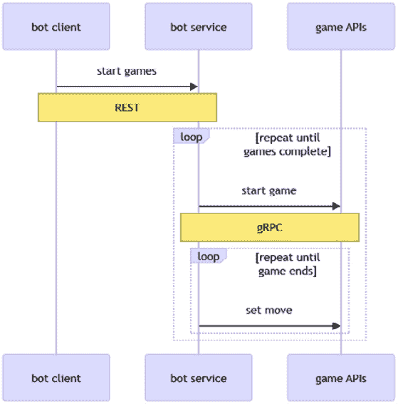

# 使用消息和事件进行异步通信

在上一章中，我们使用二进制通信更新了我们的服务。然而，某些服务不需要连接的服务：客户端和服务器不需要同时连接，这意味着通信可以是异步的。这种通信可以通过向队列发送消息或发布事件来完成。

在本章中，我们将使用 Azure 服务进行异步通信——也就是说，Azure 队列存储和 Azure 事件中心。我们还将使用 Apache Kafka 作为替代选项。

你将学习以下内容：

+   区分消息队列和事件

+   使用队列发送和接收消息

+   使用 Azure 事件中心发布和订阅事件

+   使用 Apache Kafka 进行事件处理

# 技术要求

在本章，就像前几章一样，你需要一个 Azure 订阅和 Docker Desktop。

本章的代码可以在本书的 GitHub 仓库中找到：[`github.com/PacktPublishing/Pragmatic-Microservices-with-CSharp-and-Azure/`](https://github.com/PacktPublishing/Pragmatic-Microservices-with-CSharp-and-Azure/)。

`ch15`文件夹包含本章的项目及其输出。要添加本章的功能，可以从上一章的源代码开始。

在本章中，我们将考虑以下项目：

+   `Codebreaker.AppHost`: 这是一个.NET Aspire 宿主项目。通过添加 Azure 存储、Azure 事件中心和 Apache Kafka 服务，增强了应用程序模型。

+   `Codebreaker.BotQ`: 这是一个包含与`Codebreaker.Bot`几乎相同代码的新项目。然而，它不是使用 REST API 来触发游戏玩法，而是使用消息队列。

+   `Codebreaker.GameAPIs`: 该项目已更新，不再直接将完成的游戏转发到`live-service`。相反，根据启动配置文件启动，它将事件发布到 Azure 事件中心或 Apache Kafka。

+   `Codebreaker.Live`: 该项目已更改，以便使用异步流订阅 Azure 事件中心的事件。SignalR 实现也已更改，以便使用异步流。

+   `Codebreaker.Ranking`: 这是一个新的项目，它从 Azure 事件中心或 Kafka 接收事件，将这些信息写入 Azure Cosmos DB 数据库，并提供一个 REST 服务来检索当天的排名。与使用`live-service`相比，使用事件中心我们有接收事件的不同方式。

# 比较消息和事件

在上一章中，我们使用了与所有服务连接的网络通信。首先，我们来看看如图*图 15.1*所示的机器人和游戏 API 之间的通信：



图 15.1 - 机器人和游戏 API 之间的同步通信

机器人服务可以通过 REST 访问。机器人服务本身通过 gRPC 调用游戏 API 服务（所有其他客户端都使用 REST 与游戏 API 服务通信）。然后，机器人服务继续与游戏 API 服务通信，发送移动操作直到游戏结束，并继续下一轮游戏，直到达到指定的游戏数量。机器人客户端通过 REST 调用机器人服务，这是（类似于 gRPC）同步通信，具有请求/回复。这里的机器人服务没有同步实现，因为机器人客户端不需要等待所有游戏都进行——在此期间 HTTP 协议会超时。相反，机器人服务返回一个 HTTP `ACCEPTED`响应（状态码 202）和一个唯一标识符，客户端可以使用该标识符来检查状态。该协议本身是同步的，因为客户端等待响应 202。

当游戏结束时，下一部分通信通过*图 15.2*展示。


图 15.2 - 从游戏 API 发起的同步通信

游戏 API 服务使用 gRPC 通知排名服务和实时服务。实时服务通过 SignalR 继续通信，通知所有已连接的客户端游戏结束。排名服务将在本章实现，将所有结束的游戏写入新的数据库。为了简化此图，未显示在通信中使用的某些服务。游戏 API 和 Azure Cosmos DB 之间存在同步通信，类似于排名服务。

在同步通信中，如果其中一个服务延迟，延迟会返回到原始调用者。如果其中一个服务出现错误，客户端不会收到成功的响应。

Microsoft Azure 提供了一些可以用于创建异步通信的服务：Azure 队列存储、Azure 服务总线、Azure 事件网格和 Azure 事件中心。让我们看看与机器人客户端和机器人服务通信的*图 15.3*的新版本。


图 15.3 - 机器人客户端与机器人服务之间的异步通信

在新的实现中，Azure 队列存储开始发挥作用。机器人服务注册到队列以接收消息。机器人客户端，而不是使用 HTTP 与机器人服务通信，向队列发送消息。如果有人开始处理此消息，机器人客户端不需要等待。对于客户端来说，工作已经完成。由于机器人服务注册了接收消息，它从队列中接收消息，并以与之前相同的方式玩游戏，这不会改变。

接下来，我们来看游戏 API 服务在*图 15.4*中启动的异步通信。


图 15.4 – 从游戏 API 发起的异步通信

在这里，Azure 事件中心发挥了作用。游戏 API 服务，而不是与排名和实时服务都进行同步通信，只需与事件中心进行通信。一个游戏结束事件被推送到这个服务。游戏 API 不需要知道谁对这个事件感兴趣，谁接收这个事件。在这里，注册了两个订阅者，排名服务和实时服务，并接收这个事件。从现在开始，通信与之前相同。排名服务将接收到的信息写入数据库（此处未显示），实时服务将此信息转发给订阅实时服务的客户端 – 如果他们订阅了与事件存储相同的游戏类型。

使用消息队列和事件之间的主要区别可以从以下场景中看出。当向队列发送消息时，只有一个接收者处理该消息。可以连接多个读取器到同一个队列（出于性能原因），但只有一个读取器处理消息。如果消息处理成功，它将从队列中删除。使用事件时，多个订阅者接收和处理相同的事件。

让我们来看看 Microsoft Azure 为消息和事件提供的不同选项。

## 消息队列

Microsoft Azure 提供 Azure 队列存储（Azure 存储账户的一部分）和服务总线队列，可用于消息队列。Azure 队列存储是更简单、更经济的选项，但 Azure 服务总线提供了更多功能，例如顺序保证、原子操作、批量发送消息、重复检测等。有关详细信息，请参阅[`learn.microsoft.com/en-us/azure/service-bus-messaging/service-bus-azure-and-service-bus-queues-compared-contrasted`](https://learn.microsoft.com/en-us/azure/service-bus-messaging/service-bus-azure-and-service-bus-queues-compared-contrasted)。

## 事件

要发布和订阅事件，您可以使用 Azure 事件网格和 Azure 事件中心。**Azure 事件网格**易于使用，可以轻松订阅大多数 Azure 资源的事件。在 Azure 门户中，对于大多数资源，您可以在左侧栏中看到**事件**菜单。例如，当打开 Azure 存储账户时，点击**事件**后，点击**事件订阅**。使用存储账户，您将看到如图 15.5 所示的事件类型，例如**Blob 创建**、**Blob 删除**、**Blob 重命名**、**目录创建**、**目录删除**、**目录重命名**、**Blob 层变更**等：


图 15.5 – 创建事件订阅

事件类型由 Azure 资源预定义。使用事件订阅，您可以指定事件应在何处触发。您可以通过端点来选择，这可以是 Azure 函数、存储队列、混合连接、Webhook 等。

事件网格还允许您指定要定义的自定义主题，具有高达每秒 10,000,000 个事件的高吞吐量，并且每月免费提供 100,000 个操作。此服务作为在 Azure 上运行的 PaaS 提供服务，名为 **Azure Arc 上的 Kubernetes 事件网格**。

为了支持更多的事件，使用分区进行大规模扩展，以及一个低延迟的大数据流平台，可以使用 **Azure Event Hubs**。此服务提供可靠的事件交付，如果事件尚未交付，则事件将存储最多 7 天。事件网格还与流分析有很好的集成。

让我们使用 Azure 队列和 Azure 事件网格更新 Codebreaker 解决方案。

注意

在撰写本文时，.NET Aspire 已计划支持 Azure 事件网格。事件网格、队列存储和 Azure 服务总线已经可用。

让我们开始使用 Codebreaker 机器人服务从 Azure 队列存储读取。

# 创建一个从 Azure 队列存储读取的服务

我们之前使用的 `Codebreaker.Bot` 项目提供了一个最小化的 API 服务。随着更新，不再需要 REST API - 一个简单的控制台应用程序就足够了。只需创建一个新的控制台应用程序（`dotnet new console -o Codebreaker.BotQ`），并将 `Codebreaker.Bot` 的源代码复制过来。新的机器人也将使用 gRPC 与游戏 API 服务进行通信。因为这不是 ASP.NET Core 应用程序，所以需要以下 NuGet 包来支持 gRPC：

+   `Google.Protobuf`

+   `Grpc.Net.ClientFactory`

+   `Grpc.Tools`

对于依赖注入容器，我们还需要 `Microsoft.Extensions.Hosting`，对于 .NET Aspire 存储队列组件，我们需要 `Aspire.Azure.Storage.Queues`。

接下来，我们将更新应用程序模型。

## 定义 Azure 存储的应用程序模型

使用 AppHost 项目，引用新创建的项目 `Codebreaker.BotQ`，并添加 `Aspire.Hosting.Azure.Storage` NuGet 包，以便您可以使用 Azure 存储资源。

使用 `AddAzureStorage` 方法通过应用程序模型指定 Azure 存储：

Codebreaker.AppHost/Program.cs

```cs
// code removed for brevity
if (startupMode == "OnPremises")
{
}
else
{
  var storage = builder.AddAzureStorage("storage");
  var botQueue = storage.AddQueues("botqueue");
}
```

Azure 存储资源支持队列、表和块。这次，我们将使用队列，因此我们调用了 `AddQueues` 扩展方法。

项目配置引用队列：

Codebreaker.AppHost/Program.cs

```cs
string botLoop =
  builder.Configuration.GetSection("Bot")["Loop"] ??
    "false";
string botDelay =
  builder.Configuration.GetSection("Bot")["Delay"] ??
    "1000";
// code removed for brevity
builder.AddProject<Projects.Codebreaker_BotQ>("bot")
  .WithReference(insights)
.WithReference(botQueue)
  .WithReference(gameAPIs)
  .WithEnvironment("Bot__Loop", botLoop)
  .WithEnvironment("Bot__Delay", botDelay);
```

注意使用新的机器人项目而不是旧的项目。新项目引用队列以传递连接字符串。此外，我们指定了 `Loop` 和 `Delay` 参数，这些参数从配置中读取，并在启动 `bot-service` 时设置为环境变量。

这些值在 AppHost 开发配置中指定：

Codebreaker.AppHost/appsettings.Development.json

```cs
{
  // configuration removed for brevity
  "Bot": {
    "Loop": true,
    "Delay": 2000
  }
}
```

新的 `bot-service` 可以循环读取存储队列中的值——这在此处进行配置。当与 Azure 发布时，循环就不需要了。这将在后面的 *将解决方案部署到 Microsoft* *Azure* 部分中介绍。

现在已经指定了应用程序模型，让我们继续新的机器人项目。

## 使用存储队列组件

在之前的机器人项目中，我们接收了值以便我们可以开始玩一系列的游戏。新的机器人也需要相同的信息：

Codebreaker.BotQ/Endpoints/BotQueueClient.cs

```cs
public record class BotMessage(
  int Count, int Delay, int ThinkTime);
```

`Count` 属性用于要玩的游戏数量，`Delay` 属性用于游戏之间的延迟，`ThinkTime` 属性用于游戏移动之间的思考时间值。

`BotQueueClientOptions` 类用于接收从 AppHost 传递的配置值：

Codebreaker.BotQ/Endpoints/BotQueueClient.cs

```cs
// code removed for brevity
public class BotQueueClientOptions
{
  public bool Loop { get; set; } = false;
  public int Delay { get; set; } = 1000;
}
```

在 `BotQueueClient` 类的构造函数中，`options`、`logger`、之前使用的 `CodebreakerTimer` 和 `QueueServiceClient` 被注入：

Codebreaker.BotQ/Endpoints/BotQueueClient.cs

```cs
public class BotQueueClient(
  QueueServiceClient client,
  CodebreakerTimer timer,
  ILogger<BotQueueClient> logger,
  IOptions<BotQueueClientOptions> options)
{
// code removed for brevity
```

`QueueService` 客户端类来自 `Azure.Storage.Queues` 命名空间，并与 Azure 存储队列资源通信，以获取有关队列的信息，以及创建队列。通过实现 `CodebreakerTimer`，使用计时器来一局接一局地玩游戏。它使用我们从队列中接收到的值。

`RunAsync` 方法启动工作：

Codebreaker.BotQ/Endpoints/BotQueueClient.cs

```cs
public async Task RunAsync()
{
  var queueClient = client.GetQueueClient(«botqueue»);
  await queueClient.CreateIfNotExistsAsync();
  var deadLetterClient = client.GetQueueClient(
    «dead-letter»);
  await deadLetterClient.CreateIfNotExistsAsync();
  bool repeat = options.Value.Loop;
  do
  {
    await ProcessMessagesAsync(
    queueClient, deadLetterClient);
    await Task.Delay(options.Value.Delay);
  } while (repeat);
}
// code removed for brevity
```

要从队列中读取消息，我们使用 `QueueClient` 类。`QueueServiceClient` 方法 `GetQueueClient` 返回 `QueueClient` 以与名为 `botqueue` 的队列通信。根据我们之前指定的应用程序模型，只创建了存储帐户，而不是队列本身。如果它不存在，我们创建队列。然后——在循环中——我们调用 `ProcessMessagesAsync`。如果循环未设置，则只检索一次消息。这可以在 *将解决方案部署到 Microsoft* *Azure* 部分中讨论的发布 Azure 容器应用作业时使用。

注意

可以检查死信队列以确定是否出现消息问题。例如，当消息无法成功处理几次时，例如，当接收者抛出异常时，消息将被写入死信队列。

接下来，`ProcessMessageAsync` 从队列中读取消息：

Codebreaker.BotQ/Endpoints/BotQueueClient.cs

```cs
private async Task ProcessMessagesAsync(
  QueueClient queueClient,
  QueueClient deadLetterClient)
{
  QueueProperties properties =
    await queueClient.GetPropertiesAsync();
  if (properties.ApproximateMessagesCount > 0)
  {
    QueueMessage[] messages =
      await queueClient.ReceiveMessagesAsync();
    foreach (var encodedMessage in messages)
    {
      if (encodedMessage.DequeueCount > 3)
      {
        await deadLetterClient.SendMessageAsync(
          encodedMessage.MessageText);
        await queueClient.DeleteMessageAsync(
          encodedMessage.MessageId,
          encodedMessage.PopReceipt);
        continue;
      }
      byte[] bytes = Convert.FromBase64String(
        encodedMessage.MessageText);
      string message = Encoding.UTF8.GetString(bytes);
      var botMessage =
        JsonSerializer.Deserialize<BotMessage>(message);
      timer.Start(
        botMessage.Delay,
        botMessage.Count,
        botMessage.ThinkTime);
      await queueClient.DeleteMessageAsync(
        encMessage.MessageId, encMessage.PopReceipt);
    }
  }
}
// code removed for brevity
```

首先，检查队列的属性以查看是否可用消息，使用 `ApproximateMessagesCount` 属性。如果是这种情况，使用 `ReceiveMessagesAsync` 获取消息。此方法从队列中读取消息，此时消息将不再对其他人可见。消息不可见的时间可以使用 `visibilityTimeout` 参数设置。默认值为 30 秒。成功反序列化消息后，使用 `DeleteMessageAsync` 删除消息。`timer.Start` 方法启动一个异步玩游戏的任务。因此，如果游戏需要更长的时间来玩（有多个游戏或思考时间更长），这不会影响删除消息。如果消息返回到队列，它可以再次处理。实现检查获取的消息的出队计数。如果读取了三次，消息将进入死信队列，可以手动检查问题。

接下来，让我们配置 DI 容器：

Codebreaker.BotQ/ApplicationServices.cs

```cs
public static void AddApplicationServices(this IHostApplicationBuilder builder)
{
  builder.AddAzureQueueClient("botqueue");
  builder.Services.AddScoped<BotQueueClient>();
  var botConfig = builder.Configuration.GetSection("Bot");
builder.Services.Configure<BotQueueClientOptions>(
    section);
  builder.Services.AddScoped<CodebreakerTimer>();
  builder.Services.AddScoped<CodebreakerGameRunner>();
  builder.Services.AddSingleton<IGamesClient,
    GrpcGamesClient>()
    .AddGrpcClient<GrpcGame.GrpcGameClient>(
      client =>
      {
        client.Address = new Uri("https://gameapis");
      });
}
```

`AddAzureQueueClient` 方法使用 `Aspire.Azure.Storage.Queues` NuGet 包定义。此方法配置 Aspire 组件并将 `QueueService` 客户端注册到 DI 容器中。通过 AppHost 传递的环境变量，这些值使用 `builder.Configuration.GetSection` 获取并使用 `BotQueueClientOptions` 类进行配置，该类定义了循环的行为。除此之外，计时器、游戏运行器和 gRPC 的配置与之前的机器人服务实现相同。

现在，我们准备运行应用程序并测试队列。

## 运行应用程序

你可以在新的机器人服务项目中设置断点以验证队列的功能。当你启动应用程序时，会创建一个 Azure 存储帐户。随着 `BotQueueClient` 的初始化，消息队列被创建。这可以在 Azure 门户中验证，如图 15.6* 所示：


图 15.6 – 创建存储队列

`botqueue` 和 `dead-letter` 存储队列已经创建。现在，打开 `botqueue` 并传递一个有效的 JSON 消息，如图 15.7* 所示：


图 15.7 – 将消息添加到队列

`BotMessage` 类：

```cs
{
  "Count": 3,
  "Delay": 5,
  "ThinkTime": 1
}
```

使用有效的 JSON 消息，你会看到消息被处理了。发送一个非 JSON 格式的消息后，你会在死信队列中看到该消息——在经过一些重试之后。

由于机器人现在在我们发送消息时开始玩游戏，让我们来看看下一个增强功能——使用 Azure Event Hubs。

# 向 Azure Event Hubs 发布消息

要使用 Azure Event Hubs，我们将实现游戏 API 服务，以便我们可以发布事件。

## 定义 Event Hubs 的应用程序模型

要在 AppHost 项目中使用 Azure Event Hubs，需要 `Aspire.Hosting.Azure.EventHubs` NuGet 包。

在这里，需要将 Event Hubs 添加到应用程序模型中：

Codebreaker.AppHost/Program.cs

```cs
var eventHub =
  builder.AddAzureEventHubs("codebreakerevents")
    .AddEventHub("games");
// code removed for brevity
```

`AddAzureEventHubs` 方法添加了一个 Azure Event Hubs 命名空间，`AddEventHub` 作为事件中心。命名空间是一个管理容器，包含网络端点和访问控制。默认创建的事件中心命名空间位于标准层。对于开发，您可以将其更改为基本层。事件中心在命名空间内创建。为了可扩展性，事件中心使用一个或多个分区。默认情况下，事件中心创建时带有四个分区。分区包含一个有序的事件流。分区的数量不会改变价格，但吞吐量单位数会改变。吞吐量单位数指定每秒的事件数。分区的数量应等于或高于吞吐量单位数。吞吐量单位可以根据需要更改；分区的数量只能在高级和专用层中更改。

指定事件中心后，我们可以引用它：

Codebreaker.AppHost/Program.cs

```cs
var gameAPIs =
builder.AddProject<Projects.Codebreaker_GameAPIs>(
    "gameapis")
    .WithExternalHttpEndpoints()
    .WithReference(cosmos)
    .WithReference(redis)
    .WithReference(insights)
    .WithReference(eventHub)
    .WithEnvironment("DataStore", dataStore);
```

使用游戏 API 服务，我们用事件中心替换了引用的实时服务。对实时服务的引用不再需要。

现在，我们可以查看游戏 API 服务。

## 使用 .NET Aspire Event Hubs 组件生成事件

要使用 .NET Aspire Event Hubs 组件，我们必须添加 `Aspire.Azure.Messaging.EventHub` NuGet 包。

使用此包，我们可以配置 DI 容器：

Codebreaker.GameAPIs/ApplicationServices.cs

```cs
  builder.AddAzureEventHubProducerClient(
    "codebreakerevents",settings =>
    {
settings.EventHubName = "games";
    });
```

从游戏 API 服务中，为了发送关于完成游戏的详细信息，在之前的章节中，我们创建了 `LiveReportClient` 类来调用 REST 服务和 `GrpcLiveReportClient` 类来调用 gRPC 服务。现在，我们可以使用 `EventHubReportProducer` 类实现我们之前使用的相同接口 – `IGameReport`。

发送事件可以很容易地完成，如下所示：

Codebreaker.GameAPIs/Services/EventHubReportProducer.cs

```cs
public class EventHubReportProducer(
  EventHubProducerClient producerClient,
  ILogger<EventHubLiveReportClient> logger) :
  IGameReport
{
  public async Task ReportGameEndedAsync(
    GameSummary game,
    CancellationToken cancellationToken = default)
  {
    var data = BinaryData.FromObjectAsJson(game);
    await producerClient.SendAsync(
      [ new EventData(data) ],
      cancellationToken);
    // code removed for brevity
  }
}
```

`EventHubReportProducer` 类注入 `EventHubProducerClient` 类以向事件中心发送事件。使用 `BinaryData.FromObjectAsJson` 将 `GameSummary` 转换为 `BinaryData`。`Azure.Messaging.EventHubs` 命名空间中的 `EventData` 类允许我们传递一个字符串、`BinaryData` 和 `ReadOnlyMemory<byte>`。然后，通过调用 `SendAsync` 方法发布事件。

现在我们已经发布了一些事件，让我们来订阅它们。

# 订阅 Azure Event Hubs 事件

`Codebreaker.Live` 项目之前提供了一种由游戏 API 服务调用的 gRPC 服务，用于通过 SignalR 发布完成的游戏。我们不再提供 gRPC 服务，而是可以订阅事件。

创建一个新的 `Codebreaker.Ranking` 项目，以便您可以提供最小化的 API。此项目将接收与 `Codebreaker.Live` 相同的事件，但将它们写入数据库以提供基于日、周和月的游戏排名。

要创建 `Codebreaker.Ranking` 项目，请使用以下命令：

```cs
dotnet new webapi -minimal -o Codebreaker.Ranking
```

将新创建的项目作为引用添加到 `Codebreaker.AppHost`，并引用 `Codebreaker.ServiceDefaults` 以配置服务默认值。现在，我们可以更新应用模型。

## 定义事件中心的订阅者应用模型

使用 AppHost 项目，直播和排名项目引用事件中心，类似于事件发布项目：

Codebreaker.AppHost/Program.cs

```cs
var storage = builder.AddAzureStorage("storage");
var blob = storage.AddBlobs("checkpoints");
var live =
  builder.AddProject<Projects.Codebreaker_Live>("live")
  .WithExternalHttpEndpoints()
  .WithReference(insights)
  .WithReference(eventHub)
  .WithReference(signalR);
builder.AddProject<Projects.Codebreaker_Ranking>("ranking")
  .WithExternalHttpEndpoints()
  .WithReference(cosmos)
  .WithReference(insights)
  .WithReference(eventHub)
  .WithReference(blob);
// code removed for brevity
```

订阅事件可以通过两种方式完成，要么使用事件中心消费者客户端，要么使用事件处理器客户端。事件中心消费者客户端使用起来更简单，并支持异步流。事件处理器客户端功能更强大，并支持并行接收多个分区。第二种选项需要在 Azure Blob 存储帐户中保存检查点。我们使用与队列相同的帐户。

我们将实现两种版本。Codebreaker 直播服务使用异步流，而具有 `EventHubConsumerClient` 类的事件中心消费者客户端符合其需求。Codebreaker 排名服务利用事件处理器客户端，使用 `EventProcessorClient`。

## 使用异步流式传输的 Event Hubs 组件

当使用 `Codebreaker.Live` 项目时，需要引用 `Aspire.Azure.Messaging.EventHubs` NuGet 包：

注意

`Codebreaker.Live` 项目是在 *第十三章* 中创建的。在这里，我们将创建一个新的 SignalR 中心以提供流式传输。

Codebreaker.Live/ApplicationServices.cs

```cs
public static void AddApplicationServices(this IHostApplicationBuilder builder)
{
  builder.Services.AddSignalR()
    .AddMessagePackProtocol()
    .AddNamedAzureSignalR("signalr");
   builder.AddAzureEventHubConsumerClient("codebreakerevents",
  settings =>
  {
settings.EventHubName = "games";
  });
}
```

`AddAzureEventHubConsumerClient` 方法将 `EventHubConsumerClient` 类配置为 DI 容器中的单例。

现在，我们必须创建一个新的 SignalR 中心以注入 `EventHubConsumerClient`：

Codebreaker.Live/Endpoints/StreamingLiveHub.cs

```cs
public class StreamingLiveHub(
  EventHubConsumerClient consumerClient,
  ILogger<StreamingLiveHub> logger) : Hub
{
  // code removed for brevity
```

通过使用主构造函数，`EventHubConsumerClient` 被注入以检索事件。

现在，创建 `SubscribeToGameCompletions` 方法：

Codebreaker.Live/Endpoints/StreamingLiveHub.cs

```cs
public async IAsyncEnumerable<GameSummary>
  SubscribeToGameCompletions(
    string gameType,
    [EnumeratorCancellation] CancellationToken
      cancellationToken)
{
  await foreach (PartitionEvent ev in
    consumerClient.ReadEventsAsync(cancellationToken))
  {
    GameSummary gameSummary;
    try
    {
      logger.ProcessingGameCompletionEvent();
      gameSummary = ev.Data.EventBody
        .ToObjectFromJson<GameSummary>();
    }
    catch (Exception ex)
    {
      logger.ErrorProcessingGameCompletionEvent(
        ex, ex.Message);
      continue;
    }
      if (gameSummary.GameType == gameType)
      {
        yield return gameSummary;
      }
      else
      {
        continue;
      }
    }
  }
```

SignalR 支持使用返回 `IAsyncEnumerable` 方法的异步流式传输。`SubscribeToGameCompletions` 方法接收一个游戏类型参数，仅返回此游戏类型的游戏完成情况。`EventHubConsumerClient` 通过调用 `ReadEventsAsync` 方法支持异步流式传输。如果接收到的游戏摘要符合请求的游戏类型，它将通过异步流返回给客户端。

在这一点上，中间件需要配置以引用新的中心：

Codebreaker.Live/ApplicationServices.cs

```cs
app.MapHub<LiveHub>("/livesubscribe");
app.MapHub<StreamingLiveHub>("/streaminglivesubscribe");
```

我们还需要通过异步流和新的链接更新客户端：

LiveTestClient/StreamingLiveClient.cs

```cs
public async Task SubscribeToGame(string gameType, CancellationToken cancellationToken = default)
{
  if (_hubConnection is null) throw new InvalidOperationException("Start a connection first!");
  try
  {
    await foreach (GameSummary summary in
      _hubConnection.StreamAsync<GameSummary>(
        "SubscribeToGameCompletions",
        gameType,
        cancellationToken))
    {
      string status = summary.IsVictory ? "won" : "lost";
      Console.WriteLine($"Game {summary.Id} {status} " +
        $"by {summary.PlayerName} after " +
        $"{summary.Duration:g} with " +
        $"{summary.NumberMoves} moves");
    }
  }
  catch (HubException ex)
  {
    logger.LogError(ex, ex.Message);
    throw;
  }
  catch (OperationCanceledException ex)
  {
    logger.LogWarning(ex.Message);
  }
}
```

使用我们在 *第十三章* 中创建的相同的 SignalR 初始化配置，客户端现在使用 SignalR `HubConnection` 类的 `StreamAsync` 方法异步流式传输服务返回的结果。

通过这些更改，你现在已经可以测试和运行解决方案，从消息队列开始，直到 SignalR 流式客户端，以接收完成的游戏。然而，让我们添加另一个事件中心客户端来处理消息，这次使用事件中心处理器。

## 使用.NET Aspire 事件中心组件处理消息

`Codebreaker.Ranking` 项目接收事件，将这些事件写入 Azure Cosmos 数据库，并为玩家提供最小的 API 来获取排名信息。此项目引用了.NET Aspire 的 `Aspire.Azure.Messaging.EventHubs` 和 `Aspire.Azure.Storage.Blobs` 组件：

Codebreaker.Ranking/ApplicationServices.cs

```cs
public static void AddApplicationServices(this IHostApplicationBuilder builder)
{
  // code removed for brevity
  builder.AddKeyedAzureBlobClient("checkpoints");
  builder.AddAzureEventProcessorClient("codebreakerevents",
    settings =>
    {
      settings.EventHubName = "games";
      settings.BlobClientServiceKey = "checkpoints";
    });
  builder.Services.AddDbContextFactory<RankingsContext>(
    options =>
    {
      string connectionString =
        builder.Configuration.GetConnectionString(
          "codebreakercosmos") ??
          throw new InvalidOperationException(
            "Could not read the Cosmos connection-string");
      options.UseCosmos(connectionString, "codebreaker");
    });
  builder.EnrichCosmosDbContext<RankingsContext>();
  builder.Services
    .AddSingleton<IGameSummaryEventProcessor,
      GameSummaryEventProcessor>();}
```

`AddAzureEventProcessorClient` 注册了 `EventProcessorClient` 类的单例实例。我们连接到相同的命名空间和事件中心，因此此配置相同。不同之处在于 `AddKeyedAzureBlobClient` 是.NET Aspire Blob 存储组件的一个方法。此方法将单例实例注册到 DI 容器中，以读取和写入 blob。通过设置 `BlobClientServiceKey` 来写入检查点，将存储连接到事件中心。

你也可以通过不注册键配置来简化配置。注册的一个默认存储组件会自动从事件中心组件中使用。

除了事件中心配置之外，还必须配置 EF Core 上下文以将接收到的游戏摘要信息写入 Azure Cosmos DB 数据库。查看*第三章*以获取更多详细信息。与*第三章*相反，我们在 DI 容器中注册了一个 EF Core 上下文工厂，这允许我们将它注入到单例对象中，并使用较短的生存周期创建上下文对象。

注册的 `GameSummaryEventProcessor` 是我们处理事件的实现：

Codebreaker.Ranking/Services/GameSummaryEventProcessor.cs

```cs
public class GameSummaryEventProcessor(
  EventProcessorClient client,
  IDbContextFactory<RankingsContext> factory,
  ILogger<GameSummaryEventProcessor> logger)
{
  public async Task StartProcessingAsync(
    CancellationToken = default)
  {
    // code removed for brevity
  }
  public Task StopProcessingAsync(
    CancellationToken cancellationToken = default)
  {
  }
}
```

该类注入 `EventProcessorClient` 和 EF Core 上下文工厂。此类实现了启动和停止事件处理的方法。

下面的代码片段显示了 `StartProcessingAsync` 方法：

Codebreaker.Ranking/Services/GameSummaryEventProcessor.cs

```cs
public async Task StartProcessingAsync(CancellationToken cancellationToken = default)
{
  // code removed for brevity
  client.ProcessEventAsync += async (args) =>
  {
    GameSummary summary = args.Data.EventBody
      .ToObjectFromJson<GameSummary1>();
    using var context = await factory.CreateDbContextAsync(
      cancellationToken);
    await context.AddGameSummaryAsync(summary,
      cancellationToken);
    await args.UpdateCheckpointAsync(cancellationToken);
  };
  client.ProcessErrorAsync += (args) =>
  {
    logger.LogError(args.Exception,
      "Error processing event, {error}",
      args.Exception.Message);
    return Task.CompletedTask;
  };
  await client.StartProcessingAsync(cancellationToken);
}
```

一旦你开始通过调用 `StartProcessingAsync` 方法处理事件，`EventProcessorClient` 类就会触发.NET 事件，这些事件在接收到消息时以及发生错误时被调用：`ProcessEventAsync` 和 `ProcessErrorAsync`。接收到的消息被从二进制转换为 `GameSummary` 对象并写入数据库。此外，存储账户中的检查点也被写入，以便我们知道哪个事件消息是最后被处理的。

当这一切就绪后，启动应用程序，打开 Azure 门户向机器人队列发送消息，让机器人玩一些游戏，并监控事件发送情况。*图 15.8*显示了 Azure 门户显示的事件中心指标：


图 15.8 – 事件中心指标

除了检查事件中心指标外，还要验证写入排名数据库的数据。此外，启动 SignalR 客户端应用程序，以便可以使用异步流监控事件数据。

在 Azure 门户中打开事件中心实例，并在 **设置** 类别下选择 **配置**（见 *图 15**.9*）：


图 15.9 – 事件中心配置

在这里，你可以看到配置的分区数量，并且可以禁用中心。关于 `ranking-service` 在某一天没有运行，之后仍有足够的时间处理游戏。

你还可以配置如何捕获数据（**功能** | **捕获**）使用 Azure 存储帐户（**Avro** 序列化格式）或 Azure 数据湖（**Parquet** 或 **Delta Lake** 序列化格式）。在配置捕获或其他 SKU 之前，请确保查看定价选项。

提及价格，当你将解决方案部署到 Microsoft Azure 时，你需要注意哪些方面？

# 将解决方案部署到 Microsoft Azure

当使用低负载时，当它在 Microsoft Azure 上运行时，完整的解决方案并不昂贵。CPU 功率通常会导致更高的成本。Azure 容器应用运行了多少个容器？`bot-service`、`game-apis` 服务、`live-service`、`ranking-service` 和 Redis 容器。`game-apis` 服务应按最小值 1 进行扩展，这为第一个用户提供快速响应，以便他们能够得到快速的第一个答案。如果服务空闲时扩展到 1，则会有一个空闲价格，这可以显著降低 CPU 成本。`bot-service`、`live-service` 和 `ranking-service` 可以缩减到 0，这意味着在 CPU 和内存方面没有成本。然而，请注意自定义健康检查（在第 *12 章* 中介绍），这可能会对缩减到 0 产生不利影响。对于 `live-service`，如果没有监听器查询正在运行的游戏，则无法订阅事件。因此，只有在客户端连接时才适用成本。

机器人包含一个持续运行的循环，并反复检查队列。在 Azure 容器应用环境中，这并不是必要的。在这里，我们可以创建一个 **Azure 容器应用作业** 资源。此资源仅基于触发器启动——例如，cron 时间或存储队列中可用的消息等事件。

使用 .NET Aspire 默认情况下不支持创建 Azure 容器应用作业。然而，通过一些定制可以实现这一点。以下是你需要做的：

1.  使用 `azd init` 初始化项目。

1.  使用 `azd infra synth` 创建 Bicep 文件和清单文件。

1.  使用 `azd provision` 创建 Azure 资源。

1.  更改应作为容器应用作业而不是容器应用部署的项目清单文件。

1.  使用 `azd deploy` 部署项目（你可以通过 `azd deploy <service>` 逐个项目部署或部署所有项目）。

由于.NET Aspire 的快速更新，请查看本章 GitHub 仓库中的 README 文件以获取最新更新。

接下来，让我们看看使用 Azure 服务的替代选项。

# 使用 Apache Kafka 进行事件处理

Apache Kafka 可以用作 Azure 队列存储和 Azure 事件中心的替代品——尤其是在本地解决方案方面。这项技术被许多公司在他们的本地环境中用于高性能的应用程序到应用程序的消息传递，支持可扩展的多生产者和消费者环境（如事件中心），并支持类似消息队列的只读一次场景。

使用带有`OnPremises`启动配置文件的 AppHost 启动现在将使用之前创建的`Codebreaker.Bot`。这使用 REST API 而不是消息队列，替换了`game-apis`服务的发布事件机制，并使`ranking-service`的事件订阅使用 Apache Kafka。

首先，我们将更改`app-model`。

## 配置 app-model 中的 Apache Kafka

要使用`app-model`中的 Apache Kafka 资源，我们必须添加`Aspire.Hosting.Kafka` NuGet 包：

Codebreaker.AppHost/Program.cs

```cs
var kafka = builder.AddKafka("kafkamessaging");
// code removed for brevity
var gameAPIs = builder.AddProject<Projects.Codebreaker_GameAPIs>("gameapis")
  .WithExternalHttpEndpoints()
  .WithReference(sqlServer)
  .WithReference(redis)
  .WithReference(kafka)
  .WithEnvironment("DataStore", dataStore)
  .WithEnvironment("StartupMode", startupMode);
  builder.AddProject<Projects.Codebreaker_Ranking>("ranking")
  .WithExternalHttpEndpoints()
  .WithReference(cosmos)
  .WithReference(kafka)
  .WithEnvironment("StartupMode", startupMode);
```

`AddKafka`方法为本地开发添加了一个 Docker 容器。这个资源被`game-apis`服务和`ranking-service`引用，用于转发连接。`StartupMode`与启动配置文件配置，并作为环境变量转发到这两个项目，以便它们可以在 Azure 事件中心和 Apache Kafka 之间进行选择。

接下来，我们将使用 Aspire 组件来发布事件。

## 发布 Apache Kafka 事件

当涉及到发布者和订阅者时，使用的是`Aspire.Confluent.Kafka` NuGet 包。在这个包中，在`Confluent.Kafka`命名空间内，定义了`IProducer`接口。通过`KafkaGameReportProducer`类注入的对象实现了这个接口，用于发布完成的游戏：

Codebreaker.GameAPIs/Services/KafkaGameReportProducer.cs

```cs
public class KafkaGameReportProducer(
  IProducer<string, string> producerClient,
  ILogger<KafkaLiveReportProducer> logger)
  : IGameReport
{
  public async Task ReportGameEndedAsync(
    GameSummary game,
    CancellationToken cancellationToken = default)
  {
    Message<string, string> message = new()
    {
      Key = game.Id.ToString(),
      Value = JsonSerializer.Serialize(game)
};
    string[] topics = ["ranking", "live"];
    foreach (var topic in topics)
    {
      _ = producerClient.ProduceAsync(topic, message,
        cancellationToken);
    }
    producerClient.Flush(TimeSpan.FromSeconds(5));
    logger.GameCompletionSent(game.Id, "Kafka");
    return Task.CompletedTask;
  }
}
```

`KafkaGameReportProducer`实现了之前使用的相同接口——即`IGameReport`。`IProducer`接口的泛型参数定义了键和值的类型。使用 Kafka 时，可以指定序列化器，这允许自定义序列化。我们可以使用简单字符串，它们在不同平台上易于工作。使用.NET 时，我们可以使用`System.Text.Json`序列化器将`GameSummary`对象序列化为字符串。

`IProducer`接口定义了`ProduceAsync`方法来发布消息。第一个参数命名了一个主题。在调用`ProduceAsync`方法时，消息被发送到 Kafka 代理服务。消息将保留在那里，直到被主题的订阅者读取——直到保留期结束。默认保留期是 1 周。要向多个订阅者（`live-service`和`ranking-service`）发送消息，使用一个主题列表。

当消息被发送到代理时，`ProduceAsync` 方法返回 `DeliveryResult`。我们不等待消息被发送；相反，我们使用循环发送具有多个主题的相同消息。可以使用 `Task.WhenAll` 等待所有发送完成，或者使用 `Flush` 方法等待直到超时。`Flush` 方法返回队列中的项目数。在生产者被销毁之前，你需要确保所有消息都已发送到代理。因为生产者被配置为使用 DI 容器的单例，我们可以稍后执行刷新操作。

现在，我们必须配置 DI 容器：

Codebreaker.GameAPIs/ApplicationServices.cs

```cs
// code removed for brevity
string? mode = builder.Configuration["StartupMode"];
if (mode == "OnPremises")
{
  builder.AddKafkaProducer<string, string>(
    "kafkamessaging", settings =>
  {
    settings.Config.AllowAutoCreateTopics = true;
  });
  builder.Services.AddSingleton<IGameReport,
    KafkaGameReportProducer>();
}
```

`AddKafkaProducer` 方法将 `IProducer` 接口注册为单例。`kafkamessaging` 是与 `app-model` 一起使用的字符串，用于获取 Kafka 服务器的连接字符串。使用 `KafkaProducerSettings` 参数，可以配置遥测配置和生产者设置。在这里，`AllowAutoCreateTopics` 设置被设置为 `true` – 这是生产者的默认值。对于消费者，此值默认为 `false`。之前创建的 `KafkaGameReportProducer` 类也被注册为单例。`IGameReport` 接口已经被 `GameService` 类用于报告完成的游戏，无论这种报告是如何实现的。

现在，让我们使用排名服务订阅这些事件。

## 订阅 Apache Kafka 事件

如 `Codebreaker.Ranking` 这样的订阅应用程序需要引用相同的 .NET Aspire 组件包。当涉及到消费者类时，必须注入 `IConsumer` 接口：

Codebreaker.Ranking/GameSummaryKafkaConsumer.cs

```cs
public class GameSummaryKafkaConsumer(
  IConsumer<string, string> kafkaClient,
  IDbContextFactory<RankingsContext> factory,
  ILogger<GameSummaryEventProcessor> logger)
  : IGameSummaryProcessor
{
  public async Task StartProcessingAsync(
    CancellationToken cancellationToken = default)
  {
    kafkaClient.Subscribe("ranking");
    try
    {
      while (!cancellationToken.IsCancellationRequested)
      {
        try
        {
          var result = kafkaClient.Consume(
            cancellationToken);
          var value = result.Message.Value;
          var summary =
            JsonSerializer.Deserialize<GameSummary>(value);
          // code removed for brevity
          using var context = await
            factory.CreateDbContextAsync(
              cancellationToken);
          await context.AddGameSummaryAsync(
            summary, cancellationToken);
        }
        catch (ConsumeException ex) when
          (ex.HResult == -2146233088)
        {
          logger.LogWarning("Consume exception {Message}",
            ex.Message);
          await Task.Delay(TimeSpan.FromSeconds(10));
        }
      }
    }
  }
}
```

排名服务使用 `Subscribe` 方法订阅 `ranking` 主题的消息。该主题在发布消息时使用过。如果由于尚未写入消息而导致主题不存在，`Consume` 方法将抛出 `ConsumeException` 错误。该异常被捕获，并在延迟后重复执行 `Consume` 方法。当排名服务启动时，可能一个游戏尚未完成，并且 Kafka 服务的 Docker 容器尚未配置为保持状态。

当接收到消息时，它会写入数据库，正如我们之前在 Azure Event Hubs 中看到的。

现在，我们只需要配置 DI 容器：

Codebreaker.Ranking/ApplicationServices.cs

```cs
string? mode = builder.Configuration["StartupMode"];
if (mode == "OnPremises")
{
  builder.AddKafkaConsumer<string, string>(
    "kafkamessaging", settings =>
  {
    settings.Config.GroupId = "Ranking";
  };
  builder.Services.AddSingleton<IGameSummaryProcessor,
    GameSummaryKafkaConsumer>();
}
```

要注册 `IConsumer` 接口，我们使用 `AddKafkaConsumer` 方法。`GroupId` 需要与 Kafka 消费者客户端一起配置。组用于可伸缩性。类似于 Azure Event Hubs，Kafka 使用分区。使用相同组 ID 的多个订阅者从不同的分区接收消息。这允许实现高可伸缩性。

现在，使用 `OnPremises` 启动配置文件启动解决方案。启动机器人的 Open API 页面，让它玩一些游戏，并调试和监控服务。*图 15.10* 显示了 `game-apis` 服务的指标计数，包括传输的字节数：


图 15.10 – Kafka 指标

检查字节数、已发布和订阅的消息以及发布者和订阅者的队列大小。现在也是休息一下，玩几轮 Codebreaker 的好时机。

# 摘要

在本章中，你学习了如何通过使用异步通信技术、消息和事件来解耦服务。使用 Microsoft Azure，我们使用了 Azure 存储账户中的队列和 Azure Event Hubs 中的事件。除了使用这些 PaaS 服务外，你还可以在 Azure Container Apps 环境中运行 Kafka，但需要使用应用程序模型进行配置。

你还学习了使用消息队列与具有多个订阅者的发布/订阅事件模型之间的区别。

请务必查看“进一步阅读”部分中关于 Azure Service Bus 的 .NET Aspire 组件。此服务提供了更多功能，包括消息队列，你将了解一些你已知的 Apache Kafka 的概念。

在介绍了所有不同的服务之后，在下一章中，我们将探讨在将应用程序部署到生产环境时应考虑的更多因素，并将解决方案部署到 Kubernetes 集群。

# 进一步阅读

要了解更多关于本章讨论的主题，请参阅以下链接：

+   *.NET Aspire Azure Blob Storage* *组件*: [`learn.microsoft.com/en-us/dotnet/aspire/storage/azure-storage-blobs-component`](https://learn.microsoft.com/en-us/dotnet/aspire/storage/azure-storage-blobs-component)

+   *.NET Aspire Azure Queue Storage* *组件*: [`learn.microsoft.com/en-us/dotnet/aspire/storage/azure-storage-queues-component`](https://learn.microsoft.com/en-us/dotnet/aspire/storage/azure-storage-queues-component)

+   *Azure Event Hubs* *文档*: [`learn.microsoft.com/en-us/azure/event-hubs/`](https://learn.microsoft.com/en-us/azure/event-hubs/)

+   .*NET Aspire Azure Event Hubs* *组件*: [`github.com/dotnet/aspire/tree/main/src/Aspire.Hosting.Azure.EventHubs`](https://github.com/dotnet/aspire/tree/main/src/Aspire.Hosting.Azure.EventHubs)

+   *.NET Aspire Azure Service Bus* *组件*: [`learn.microsoft.com/en-us/dotnet/aspire/messaging/azure-service-bus-component`](https://learn.microsoft.com/en-us/dotnet/aspire/messaging/azure-service-bus-component)

+   *.NET Aspire RabbitMQ* *组件*: [`learn.microsoft.com/en-us/dotnet/aspire/messaging/rabbitmq-client-component`](https://learn.microsoft.com/en-us/dotnet/aspire/messaging/rabbitmq-client-component)

+   *.NET Aspire Apache Kafka* *组件*: [`learn.microsoft.com/en-us/dotnet/aspire/messaging/kafka-component`](https://learn.microsoft.com/en-us/dotnet/aspire/messaging/kafka-component)

+   *Apache Kafka .NET* *客户端*: [`docs.confluent.io/kafka-clients/dotnet/current/overview.html`](https://docs.confluent.io/kafka-clients/dotnet/current/overview.html)
