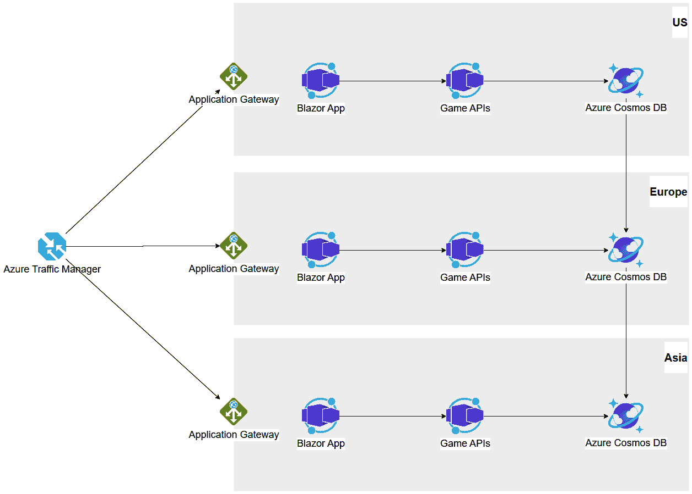
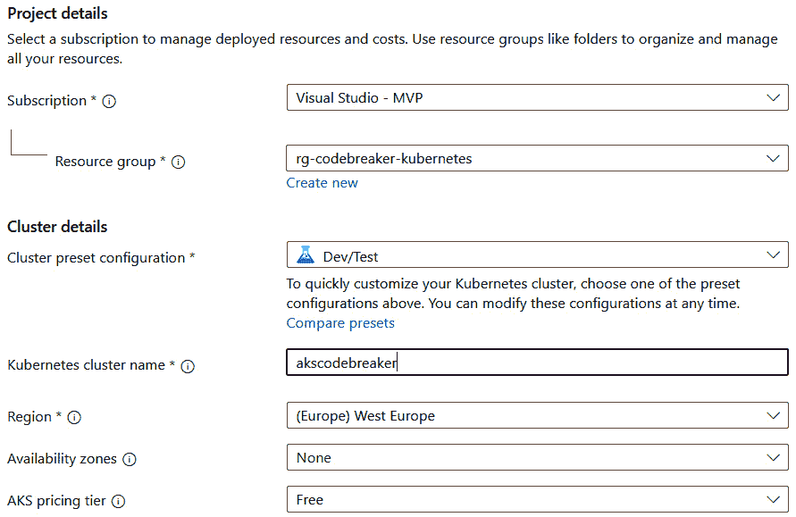
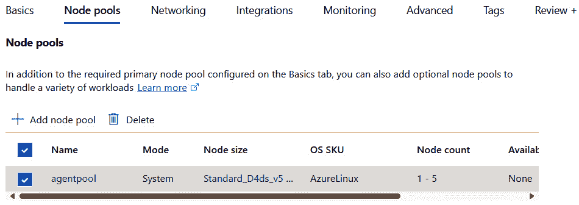
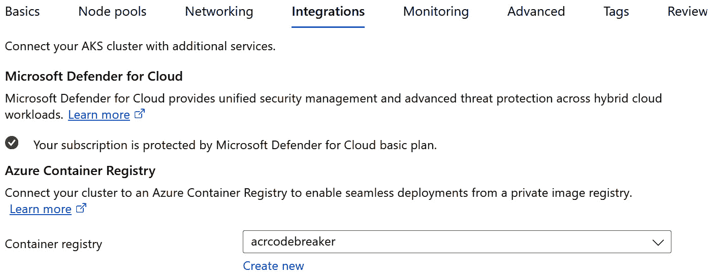
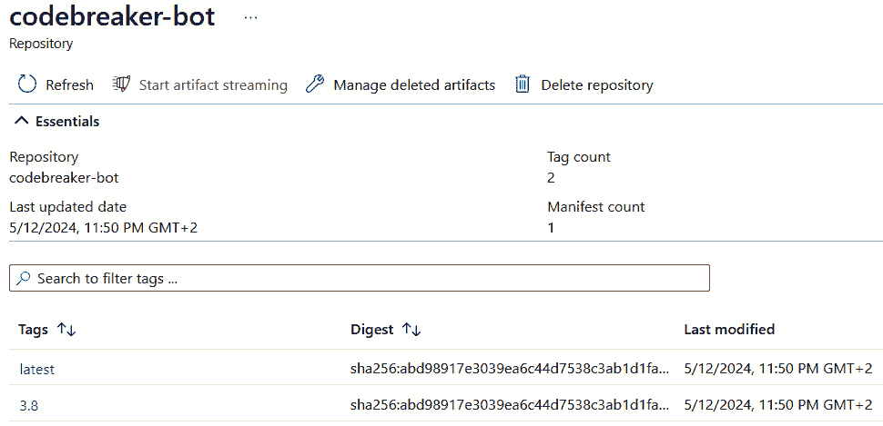

# 16

# 在本地和云中运行应用程序

到上一章为止，我们在 Codebreaker 应用程序中添加了额外的功能；在第*15 章*中，我们添加了使用异步通信进行通信的服务。我们使用了 Azure Storage 队列和 Azure Event Hubs 与 Azure Codebreaker 变体；在本地版本中，我们添加了一个 Kafka 容器。

在本章中，我们将探讨将解决方案部署到微软 Azure 和本地环境时需要了解的内容。使用 Azure，我们从*第五章*开始部署解决方案到 Azure Container Apps 环境。Azure Container Apps 环境在幕后使用 Kubernetes。在本章中，我们直接部署到一个 Kubernetes 集群，它很容易在本地环境和任何云中使用。

在本章中，你将学习以下内容：

+   使用 C#和 Aspire 自定义部署

+   使用 Azure 创建 Kubernetes 集群

+   使用 Aspir8 将应用程序部署到 Kubernetes

# 技术要求

与前几章一样，你需要一个 Azure 订阅、.NET 8 以及.NET Aspire，以及 Docker Desktop。在本章中，我们将使用一个新的工具，Aspir8，将应用程序部署到 Kubernetes 集群。

本章的代码可以在以下 GitHub 仓库中找到：[`github.com/PacktPublishing/Pragmatic-Microservices-with-CSharp-and-Azure/`](https://github.com/PacktPublishing/Pragmatic-Microservices-with-CSharp-and-Azure/)。

在`ch16`文件夹中，你会看到可以部署的项目。本章最重要的项目是`Codebreaker.AppHost`，它使用 Azure 原生云服务定义了应用程序模型，以及可以与本地环境一起使用的配置。此配置还用于将解决方案部署到 Kubernetes 集群。

# 考虑生产环境中的部署

Codebreaker 解决方案使用了几种不同的原生 Azure 云服务。在第*8 章*中，你看到了我们如何使用**GitHub Actions**通过批准来部署到不同的环境，如开发、测试、预生产和生产环境。随着上一章中添加了越来越多的服务，部署也需要相应更新。

在许多组织中，生产环境部署与开发环境有些脱节。通常，来自开发组织的不同团队使用不同的工具来管理这些部署。

**持续集成**（**CI**）和**持续部署**（**CD**）通常用于与源代码分离的仓库中。不同的产品，如 GitHub Actions、Azure DevOps 管道以及许多第三方提供的产品，都被使用。

从管道中，可以触发 Azure Developer CLI（azd），使用 Bicep 脚本，直接使用 Azure CLI 或 PowerShell 脚本，或者使用 Terraform、Ansible、Chef 和 Puppet 等第三方产品。

在决定不同产品之间时，也需要考虑生产环境的要求，以及与开发环境的不同之处。在生产环境中，预计会有不同的负载。对于负载测试，使用与生产环境相同的基础设施是有用的。因此，对于环境的完整基础设施，需要能够轻松创建。

基础设施需要映射业务需求——如果事情没有按预期工作，会损失多少收入？我们需要考虑以下这些话题：

+   **可伸缩性**：适应不断变化的需求。需求可能会随着时间的推移略有增加，或者也可能有需求激增。

+   **可靠性**：确保服务按预期工作。

+   **可用性**：确保服务在客户所在的位置可用。可用性指标是**平均故障间隔时间**（**MTBF**）——故障发生前的平均时间——和**平均修复时间**（**MTTR**）——服务再次运行所需的时间。

+   **恢复**：如果发生中断，可以使用的恢复指标是**恢复点时间**（**RTO**）——应用程序不可用的可接受时间——和**恢复点目标**（**RPO**）——数据损失的最大允许时间。

这些要求需要与业务需求进行比较。通过**冗余**，资源被复制，并且多个服务正在运行。没有单点故障。数据可以在 Azure 区域内的一个数据中心内复制，在 Azure 区域的不同数据中心之间（Azure **可用区**），以及在不同 Azure 区域之间（使用**多区域**架构）复制。

生产环境的一个要求是增强安全性。数据保护需要确保个人用户数据安全。通过**静态加密**，数据在数据库中存储时被加密。而不是使用服务管理的密钥，可以使用客户管理的密钥。使用客户管理的密钥在许多 Azure 服务中是可能的，但通常需要不同的（更昂贵的）SKU 来启用客户管理的密钥。虚拟网络是另一个增强安全性的选项。使用子网，可以限制对数据库服务器的访问。**私有端点**可以用来限制仅对特定服务的访问，防止数据泄露。可以配置 IP 防火墙规则。

我们不能在这里讨论所有不同的要求，但一个重要的启示是，在生产环境中，我们可能需要一些额外的 Azure 资源（如虚拟网络），不同的配置和其他 SKU。参见*图 16*。1，了解 Codebreaker 应用程序如何利用多个 Azure 区域。



图 16.1 – 带虚拟网络的 Codebreaker

此图显示了美国、欧洲和亚洲的 Azure 区域，以及跨区域复制的 Azure Cosmos DB。数据库由运行在数据库同一区域的 Container Apps 访问。同一区域的前端（Blazor）和后端（游戏 API）可以在一个 Azure Container Apps 环境中运行，而游戏 API 服务仅限内部访问。使用配置了防火墙的 Azure Application Gateway 来访问 Blazor Web 应用程序。Azure Traffic Manager 可以在不同区域之间进行路由。

Codebreaker 解决方案是如何满足所有要求的？具有可扩展性、可靠性和安全性，应用程序使用的所有资源都需要经过验证。在*第十二章*中，我们向 Codebreaker 服务添加了巨大的负载以测试扩展和扩展。由于开发服务的无状态特性，使用的资源也相应地扩展，我们预计在满足所有要求方面不会有问题。Azure Cosmos DB 数据库可以全球复制，即使进行多区域写入以将游戏存储在用户附近，也能提供最佳性能。我们关注了分区键，它不会阻止其他游戏玩家对数据库的写入。Azure Event Hubs（在*第十五章*中添加）提供了比所需更多的性能。标准 SKU 支持每个吞吐量单位每秒 1,000 个事件。可以添加额外的吞吐量单位，并且可以切换到提供更多资源的 Premium 层级。一个重要的方面是看到正在发生什么，以便能够及时反应，这在*第十一章*中有所涉及。

虽然许多组织有独立负责开发和基础设施的团队，但这也有一些缺点。

在*第六章*中，我们介绍了如何使用从应用模型创建的.NET Aspire 清单来创建 Bicep 脚本。这些 Bicep 脚本可以根据生产环境的要求进行定制。使用定制 Bicep 脚本的不利之处在于，应用模型上的更改不会自动反映到 Bicep 脚本中。Bicep 脚本需要手动再次更新。

如果能够使用 C#代码完全定义 Azure 基础设施配置，包括所有需要的不同方面，那将非常棒。当应用模型更新时，基础设施配置也会同时改变。

## 使用 C#和.NET Aspire 定制部署

在撰写本文时，正在进行增强以实现这一功能。目前，它仅处于实验模式，可用的 API 可能会发生变化，因此我们只会简要地探讨这一点。

要定义 .NET Aspire 应用程序模型，API 有一个带有委托参数的重载。例如，我们迄今为止使用的 `AddAzureKeyVault` 方法是 `IDistributedApplicationBuilder` 接口的扩展方法，并使用一个 `name` 参数。第二个重载指定了一个额外的 `Action` 委托参数。这个重载应用了 `Experimental` 属性来标记该 API 可能会更改。与这个委托一起使用的参数是 `IResourceBuilder<AzureKeyVaultResource>`、`ResourceModuleConstruct` 和 `KeyVault`。这允许我们在创建 Azure Key Vault 时配置从参数检索到的秘密：

```cs
#pragma warning disable AZPROVISION001
var aSecret = builder.AddParameter("aSecret", secret: true);
var keyVault = builder.AddAzureKeyVault("keyvault",
  (_, construct, _) =>
  {
    var secret = new KeyVaultSecret(construct,
      name: "secret1");
    secret.AssignProperty(p => p.Properties.Value,
      aSecret);
  });
#pragma warning restore AZPROVISION001
```

使用这里的方法，委托的第一个和第三个参数被忽略。`ResourceModuleConstruct` 类型的第二个参数指定了创建 `KeyVaultSecret` 的范围——它是为这个 Azure Key Vault 创建的。

另一个示例展示了如何使用 Azure 存储帐户配置属性和调用构建器的方法：

```cs
var storage = builder.AddAzureStorage("storage",
  (builder, _, account) =>
  {
    builder.AddQueues("botqueue");
    builder.AddBlobs("checkpoints");
    account.AssignProperty(p => p.AccessTier, "Hot");
    account.AssignProperty(p => p.Sku.Name,
      "Standard_LRS");
  });
```

在创建 Azure 存储帐户时，使用 `IResourceBuilder<AzureStorageAccount>` 和 `StorageAccount` 参数与 `Action` 委托，第二个参数被忽略。`IResourceBuilder` 用于使用存储帐户创建队列和 blob 容器。我们之前已经使用这些 `AddQueues` 和 `AddBlobs` 方法，而不需要通过实验性 API 使用 `AddStorageAccount` 的返回值来调用这些方法。`AddAzureStorage` 方法返回一个构建器。这只是为了方便，在这个代码块中定义它。`StorageAccount` 参数用于指定属性，将 SKU 设置为本地冗余，并将访问层设置为热，这对于操作来说更便宜，但对于存储来说更昂贵。

许多组织正在改变他们部署和管理基础设施的方式。了解这些发展情况对于决定应该采取什么方向以及哪些工具最适合组织的需求非常有用。

目前，API 很可能将发生变化——所以请谨慎使用。随着 .NET Aspire 的快速发展，新功能可以快速改进，这个功能可能不会太远（在撰写本文时）发布。请查看本章的 README 文件以获取更新。

接下来，我们将探讨如何轻松部署到 Kubernetes。

# 使用 Microsoft Azure 创建 Kubernetes 集群

虽然 Azure Container Apps 环境基于 Kubernetes，但不能使用 Kubernetes 工具（**kubectl**）；Kubernetes 功能被抽象化以简化。Kubernetes 是一个开源系统，用于扩展和管理容器化应用程序，并被许多公司在其本地环境中使用。有了这个，对于许多公司来说，能够在本地和任何云环境中运行服务非常重要。请参阅 *进一步阅读* 部分，以获取有关 Kubernetes 的更多信息。

Codebreaker 应用程序已构建了两个启动配置文件。我们将`OnPremises`启动配置文件发布到 Kubernetes 集群。例如，使用此启动配置文件时，Kafka 代替了 Azure 事件中心。

通过安装 Docker Desktop，您可以启用 Kubernetes。这个单节点集群仅用于小型测试场景。相反，我们将使用 Kubernetes 的托管版本：**Azure Kubernetes 服务**（**AKS**）。与自行安装的集群相比，安装和管理要容易得多。

在创建集群之前，我们需要一个新的资源组和一个**Azure 容器注册库**（**ACR**）。

使用 Azure CLI 创建一个新的资源组：

```cs
az group create -l westeurope -n rg-codebreaker-kubernetes
```

指定您选择的 Azure 区域并指定资源组名称。然后，使用`az` `acr create`创建一个新的 ACR：

```cs
az acr create -g rg-codebreaker-kubernetes --sku Basic -l <yourregion> -n <youracr>
```

使用之前创建的资源组，指定 SKU（最便宜版本，`Basic`适合此用途），并为注册库使用一个唯一名称。

使用此方法，在 Azure 门户中创建一个新的 AKS（[`portal.azure.com`](https://portal.azure.com)）——见*图 16.2*。



图 16.2 – 基本 AKS 配置

使用第一个对话框选择刚刚创建的资源组。在**集群详情**中，您可以选择以下预设配置之一：**生产标准**、**开发/测试**、**生产经济**和**生产企业**。虚拟机的大小根据预设而有所不同，并且某些功能配置不同。例如，**生产企业**有一个**私有集群**，其中 API 服务器仅可通过内部网络访问。为我们的测试环境选择**开发/测试**预设。输入集群名称并选择集群所在的区域。所有其他**基本**设置都可以保持默认设置——包括 AKS 定价层**免费**。使用**免费**提供的服务，只有在运行我们的构建 Docker 镜像的节点和其他配置的服务（如托管 Prometheus 和 Grafana）上才会产生费用。请注意，您配置的每个节点实例都是一个需要付费的虚拟机。**开发/测试**预设设置最适合进行少于 10 个节点的实验和测试。在**标准**定价层，您可以在集群中运行多达 5,000 个节点。

在配置**基本**设置后，点击**下一步**以配置节点池（*图 16.3*）。



图 16.3 – AKS 节点池

节点池的默认配置为`1`。系统节点池需要 Linux 作为操作系统。这些节点池运行系统 Pod。要运行应用程序，首选用户节点池。为了更便宜的测试，我们只使用一个节点池——系统节点池。

在选择池的配置时，您可以选择操作系统、虚拟机大小、自动或手动扩展、最小和最大节点数量以及每个节点的最大 Pod 数量。允许的范围是每个节点 30-250 个 Pod。一个 Pod 可以运行一个或多个容器。在大多数 Kubernetes 配置中，一个 Pod 运行一个容器。如果 Pod 或运行 Pod 的节点失败，Kubernetes 将创建一个副本。

在 **节点池** 配置中，您还可以启用虚拟节点。虚拟节点利用 Azure 容器实例，如果需要更多负载，可以快速启动容器。

注意

创建用户节点池允许您为节点池选择 Windows。这允许在 Kubernetes 上运行旧版应用程序。这是 AKS 提供的与 Azure 容器应用不同的功能。

在 **节点池** 配置之后，点击 **下一步** 将引导到 **网络** 配置。保留默认设置。再次点击 **下一步** 将打开 **集成** 设置（见 *图 16.4*）。



图 16.4 – AKS 集成设置

在 **集成** 设置中，选择之前创建的 ACR。使用 AKS，提供了与注册表的直接集成。

点击 `OnPremises` 启动配置文件，将配置 Grafana 和 Prometheus 的 Docker 容器。或者，可以使用 Azure 服务管理的 Prometheus 和管理的 Grafana。

将剩余的设置保留为默认值。通过点击 **审查 + 创建**，进行最终检查。如果成功，点击 **创建** 按钮。创建 AKS 需要几分钟时间——但比手动创建 Kubernetes 集群快得多。

在成功部署到 Kubernetes 集群后，将 Kubernetes 命令行客户端 `kubectl` 连接到 AKS。使用 Docker Desktop，此工具与其一起安装。要将 `kubectl` 连接到此 AKS 安装，请使用以下命令：

```cs
az aks get-credentials --resource-group <your resource group> --name <your aks name>
```

这将 AKS 的连接添加到 `%HOMEPATH%/.kube/config` 配置文件中。现在，您可以使用 `kubectl` 工具：

```cs
kubectl get nodes
```

这将返回 AKS 服务中的运行节点。

接下来，让我们发布我们的应用程序。

# 使用 Aspir8 部署到 Kubernetes

使用 .NET Aspire，我们创建了应用程序模型来定义使用不同资源之间的所有依赖关系。首先，在 *第一章* 中，您看到了从应用程序模型创建的 Aspire 清单。此清单文件与其部署的技术无关。Azure 开发者 CLI 为部署解决方案创建 Bicep 脚本（见 *第六章* 和 *第八章*）。开源工具 **Aspirate**（**Aspir8**）（见 [`github.com/prom3theu5/aspirational-manifests`](https://github.com/prom3theu5/aspirational-manifests)）将 Aspire 清单文件转换为 Docker Compose 或 Kubernetes 的 Helm 图表或 kustomize 清单。

您可以为每个启动配置创建一个 Aspire 清单，如下所示：

```cs
cd Codebreaker.AppHost
dotnet run --launch-profile OnPremises -- --publisher manifest --output-path onpremises-manifest.json
```

我们的 app 模型定义了两个不同的版本。一个版本使用云原生 Azure 服务，而另一个选项则独立于任何云环境。第二个选项是通过使用 `OnPremises` 启动配置启动应用程序来配置的。

使用 `dotnet run`，我们通过传递 `--launch-profile OnPremises` 选项来启动应用程序，使用 `launchprofiles.json` 文件中指定的配置文件。`--` 选项是一个分隔符，用于指定运行应用程序的参数。`--publisher manifest` 选项创建 Aspire 清单文件。

注意

我们与 Codebreaker 应用模型定义有严格的分离。在某种混合模式下也是可能的。例如，您可以使用在本地运行的解决方案，同时使用在 Azure 内运行的 Azure Application Insights 来获得此云服务提供的优势。您还可以使用 Azure Functions 在本地 Kubernetes 集群上运行。有许多选项可供选择最适合您需求的服务。

在使用 `aspirate` 工具之前，需要安装它：

```cs
dotnet tool install -g aspirate --prerelease
```

在撰写本文时，此工具尚未发布，因此需要设置 `--prerelease` 选项。`-g` 选项将此工具安装为全局工具。

注意

在撰写本文时，`aspirate` 工具处于预发布状态，预计会有所变化。请检查书籍仓库中 *第十六章* 的 README 文件以获取部署 Codebreaker 应用到 Kubernetes 的最新更新。

可选地，您可以使用 Aspir8 指定初始配置。

```cs
cd Codebreaker.AppHost
aspirate init --launch-profile OnPremises
```

`aspirate` 工具允许指定一个类似于 .NET CLI 的启动配置，以便相应地自定义配置。通过使用 `aspirate init`，您可以指定容器构建器并在 Docker Desktop 和 Podman 之间进行选择。默认设置是 Docker Desktop。对于容器注册表的回退值，输入您创建的 ACR 的 URL。`aspirate init` 会创建一个包含指定配置的 `aspirate-state.json` 文件。您可以重新运行 `aspirate init`，这将覆盖此配置文件。

## 创建 Kubernetes 清单

现在让我们使用带有启动配置的应用模型来生成发布到 Kubernetes 的清单：

```cs
aspirate generate --launch-profile OnPremises --output-path ./kustomize-output --skip-build --namespace codebreakerns
```

`aspirate generate` 可以创建用于部署的 Kubernetes 清单，以及构建和发布 Docker 镜像。在这里，我们不使用 `--skip-build` 选项来构建 Docker 镜像。使用 `--launch-profile` 选项，直接使用具有应用模型的 `AppHost` 项目。`aspirate generate` 还可以使用 `--aspirate-manifest` 选项引用之前生成的 .NET Aspire 清单。通过设置 `--output-path`，指定一个不同的文件夹来创建输出结果。`--namespace` 选项与 Kubernetes 相关，用于为部署的服务定义命名空间。这使得在集群上区分不同的服务变得更加容易。

注意

`aspirate` 支持使用 Helm 和 `kustomize` 生成清单。Helm 是一个使用名为 `kustomize` 的打包格式的打包管理器，而 `kustomize` 是一个配置管理器，它是 `kubectl` 内置的，采用无模板的方式来修补和合并 YAML 文件。

检查 `kustomize-output` 文件夹的结果。对于指定的每个项目，都会创建一个文件夹（例如，`gameapis`、`bot` 和 `redis`），其中包含 `deployment.yaml`、`service.yaml` 和 `kustomization.yaml`。

部署定义了一个 pod 和副本集的声明性配置。pod 的“期望状态”由部署描述。在这个文件中，你可以读取和更改使用的副本数量，以及 pod 中运行的容器。

服务定义了一个网络应用程序。这指定了应用程序使用的端口。服务在一个或多个 pod 中运行。

`kustomization.yaml` 文件引用了 `deployment.yaml` 和 `service.yaml`，并指定了配置值，例如你已经在 .NET Aspire 仪表板中看到的环境变量。

准备好清单文件后，我们可以创建 Docker 镜像并将它们推送到 ACR。

## 创建和推送 Docker 镜像

使用 `aspirate build`，我们可以构建并将 Docker 镜像发布到注册表。使用 `aspirate` 工具，可以指定用户名和密码值以将镜像推送到私有注册表。当使用 ACR 时，这并不是必需的，因为 Aspir8 使用 `dotnet publish`。只需确保使用以下方式登录到 ACR：

```cs
az acr login –name <yourregistry>
```

然后，你可以使用 `aspirate build`：

```cs
aspirate build --launch-profile OnPremises --container-image-tag 3.8 --container-image-tag latest --container-registry <yourregistry>.azurecr.io
```

从此命令开始，指定你的注册表名称。指定多个标签将它们添加到仓库中，如 *图 16.5* 所示。



图 16.5 – AKS 仓库

镜像被推送到 ACR，并显示 `latest` 和 `3.8` 标签，如 `aspirate build` 中指定的。接下来，使用 Kubernetes 清单将镜像部署到集群。

## 部署到 Kubernetes

现在，我们可以将清单应用到 Kubernetes 集群：

```cs
aspirate apply --input-path kustomize-output
```

`aspirate apply` 命令使用之前创建的清单文件，通过使用 `kubectl apply` 命令将服务和部署应用到 Kubernetes 集群。只需确保 AKS 已配置为默认的 Kubernetes 环境（在创建 AKS 后使用之前使用的命令：`az aks get-credentials`）。

现在，你可以使用以下命令：

```cs
kubectl get deployments --namespace codebreakerns
```

此命令显示了 `codebreakerns` 命名空间中的部署。你可以看到可用的和准备就绪的部署。

类似地，使用此命令查看服务：

```cs
kubectl get services --namespace codebreakerns
```

在这里，你可以看到正在运行的服务的 IP 地址和注册的端口。

现在，你可以配置一个 `aspirate`。目前，请查看“进一步阅读”部分以了解如何完成此操作。

注意

Aspir8 除了支持 Kubernetes，还支持 Docker Compose，以及使用 `kustomize` 和 Helm。通过使用 `aspirate generate`，你可以为 `compose` 提供带有 `--output-format` 选项的参数。这将创建一个简单的 Docker Compose 文件，你可以使用 Docker CLI 启动它。

# 摘要

在本章中，您学习了在生产环境中使用微服务架构部署应用程序的一些最终考虑因素。您现在对在多个区域运行解决方案以及使用可用性区域有了认识，并且可以讨论这对您组织的影响。

您学习了 AKS 作为托管选项来托管 Kubernetes 集群，并使用 .NET Aspire 清单通过 Aspir8 创建部署。

通过达到本书的 *第十六章*，您完成了一次令人印象深刻的巡游，从最小的 API 开始，并在每一章中添加更多服务，使用不同的技术。

使用本书的存储库，解决方案计划更新到更新的 .NET 和 .NET Aspire 版本。随着新版本的可用，本书版本将保持在 `dotnet8` 分支中。

要查看 Codebreaker 的更多开发情况，请查看 [`github.com/codebreakerapp`](https://github.com/codebreakerapp) 组织。在那里，你可以看到解决方案的进一步开发，以及客户端应用程序的列表。此外，请访问 [`codebreaker.app`](https://codebreaker.app) 玩一些游戏——当然，现在你也可以使用在您的（托管）Kubernetes 集群中运行的版本。

# 进一步阅读

要了解本章讨论的主题的更多信息，您可以参考以下链接：

+   *业务连续性和灾难恢复*：[`learn.microsoft.com/en-us/azure/cloud-adoption-framework/ready/landing-zone/design-area/management-business-continuity-disaster-recovery`](https://learn.microsoft.com/en-us/azure/cloud-adoption-framework/ready/landing-zone/design-area/management-business-continuity-disaster-recovery)

+   *Azure 负载均衡* 选项：[`learn.microsoft.com/en-us/azure/architecture/guide/technology-choices/load-balancing-overview`](https://learn.microsoft.com/en-us/azure/architecture/guide/technology-choices/load-balancing-overview)

+   Kubernetes：[`kubernetes.io/`](https://kubernetes.io/)

+   学习 Kubernetes 基础知识：[`kubernetes.io/docs/tutorials/kubernetes-basics/`](https://kubernetes.io/docs/tutorials/kubernetes-basics/)

+   Helm - Kubernetes 的包管理器：[`helm.sh`](https://helm.sh)

+   `kubectl` 命令行工具：[`kubernetes.io/docs/reference/kubectl/`](https://kubernetes.io/docs/reference/kubectl/)

+   吸取 GitHub 仓库：[`github.com/prom3theu5/aspirational-manifests`](https://github.com/prom3theu5/aspirational-manifests)

+   *从头开始 aspir8*：[`github.com/devkimchi/aspir8-from-scratch`](https://github.com/devkimchi/aspir8-from-scratch)

+   *使用 Azure Kubernetes 服务配置入口*：[`learn.microsoft.com/en-us/azure/aks/app-routing`](https://learn.microsoft.com/en-us/azure/aks/app-routing)

+   *手动将 .NET 微服务部署到 Kubernetes*：[`learn.microsoft.com/en-us/training/modules/dotnet-deploy-microservices-kubernetes/`](https://learn.microsoft.com/en-us/training/modules/dotnet-deploy-microservices-kubernetes/)

+   `kubectl` – 官方发音指南：[`www.youtube.com/watch?v=2wgAIvXpJqU`](https://www.youtube.com/watch?v=2wgAIvXpJqU)
