# 1

# 揭秘无服务器应用

当谈到软件开发时，我们正生活在令人难以置信的时代。随着云平台的发展以及现代技术的兴起，成为一名开发者如今既是一种美好的生活方式，也是一种充满挑战的职业。有如此多的方式来交付应用程序，有如此多的创新技术去探索，我们可能会陷入一个恶性循环，即我们更多地关注技术而不是实际的解决方案。

本章旨在介绍无服务器架构，并探讨您如何使用这种方法来实现微服务应用程序。为了实现这一目标，它涵盖了无服务器背后的理论，并提供了对它如何成为微服务实现可行替代方案的理解。

本章还探讨了微软如何实现**函数即服务（FaaS）**，使用 Azure Functions 作为构建微服务的一种选项。将介绍两种替代开发平台：Visual Studio Code 和 Visual Studio。

到本章结束时，您将了解 Azure Functions 中可用的不同触发器，并准备好创建您的第一个函数。

# 技术要求

本章需要 Visual Studio 2022 免费版 *社区版* 或 Visual Studio Code。在章节中，将介绍如何针对每个开发环境调试 Azure Functions 的详细信息。您还需要一个 Azure 账户来创建示例环境。您可以在[`github.com/PacktPublishing/Practical-Serverless-and-Microservices-with-Csharp`](https://github.com/PacktPublishing/Practical-Serverless-and-Microservices-with-Csharp)找到本章的示例代码。

# 什么是无服务器？

当有人要求您开发一个解决方案时，他们通常最关心的事情不是基础设施将如何工作。事实是，即使是对于开发者来说，关于基础设施最重要的东西就是它简单地工作得很好。

考虑到这一现实情况，拥有一个能够动态管理服务器分配和配置的云提供商，将底层基础设施留给提供商，可能是一个最佳场景。

这正是无服务器架构所承诺的：一个我们可以用来构建和运行应用程序和服务的模型，而无需自己管理底层基础设施！这种方法完全抽象化了服务器管理，使开发者能够专注于他们的代码。

第一个提出这一概念的是亚马逊，2014 年推出了 AWS Lambda。之后，微软和谷歌也提供了类似的服务，分别是 Microsoft Azure Functions 和 Google Cloud Functions。正如我们之前提到的，本书的重点将是 Azure Functions。

我们可以考虑使用无服务器计算的一些优点。你不必担心扩展的事实可以被认为是主要的一个。此外，云解决方案提供商维护环境的可靠性和安全性。除此之外，采用这种方法，你有按需付费的选项，因此你只为所使用的付费，这使可持续增长模式成为可能。

无服务器架构也可以被认为是一种加速软件开发的好方法，因为你只需关注实现该程序所需的代码。另一方面，你可能难以管理大量功能，因此这种组织结构需要妥善处理，以避免在创建具有许多功能的解决方案时出现问题。

自从引入无服务器以来，已经创建了各种类型的函数。这些函数作为触发器，用于启动处理。一旦函数被触发，执行就可以用不同的编程语言完成。

现在，让我们检查一下功能是否可以被认为是微服务。

# 无服务器是一种提供微服务的方式吗？

如果你查看微服务的定义，你会发现将应用程序作为松散耦合的组件提供，这些组件代表业务能力的实现。你可以用几个函数构建类似的东西，所以是的，无服务器是一种提供微服务的方式。

一些专家甚至认为无服务器架构是微服务架构的一种演变，因为无服务器架构的焦点是在一个安全的环境中提供可伸缩性，使得一组功能可以独立地进行开发、测试和部署，这为软件架构带来了很多灵活性。这正是微服务架构的主要哲学。

让我们以一个例子来想象，比如一个负责用户身份验证的微服务。你可能为注册、登录和重置密码创建特定的功能。考虑到这一组功能可以在单个无服务器项目中创建，你既有创建分离功能的灵活性，也有定义微服务目的的可能性。

无服务器项目将自然支持与数据库、消息队列、OpenAPI 规范和其他 API 的集成，从而实现通常需要的健壮微服务架构的设计模式。同样重要的是要提到，保持微服务隔离、小型且最好是可重用的是一个值得遵循的最佳实践。

现在你已经了解到你可以使用无服务器方法编写微服务，让我们了解微软 Azure 在其平台上如何呈现无服务器。

# 微软 Azure 如何呈现无服务器？

2016 年，Microsoft 推出了 Azure Functions 作为一种平台即服务（PaaS）产品，旨在提供 FaaS 功能。这一选项为企业转型提供了可扩展的创新。今天，Azure Functions 给我们提供了使用多种编程语言（包括 C#、JavaScript、F#、Java 和 Python）来增强应用程序的机会。

Azure Functions 的一个突出特点是它与其他 Azure 服务和第三方 API 的无缝集成。例如，它可以轻松连接到不同的 Azure 数据库（从 Azure SQL Server 到 Azure Cosmos DB），Azure Event Grid 用于事件驱动架构，以及 Azure Logic Apps 用于工作流自动化。这种连接性简化了构建复杂、企业级应用程序的过程，这些应用程序利用了多种服务。

多年来，Azure Functions 的可能性不断发展。今天，我们甚至可以使用 Azure Durable Functions 来管理有状态的流程和长时间运行的操作。有了这个，您可以编排可以在多个函数执行中执行复杂流程。

但 Microsoft 不仅为编写函数创建了一个环境。他们还创建了一个完整的开发人员管道，遵循现在在企业解决方案中广泛讨论和使用的 DevSecOps 流程。开发者可以使用 Azure Pipelines、GitHub Actions 和其他 CI/CD 服务来自动化部署过程。您还可以使用 Azure Monitor 和 Application Insights 监控和诊断这些函数中的事件，这些工具有助于故障排除和优化。

PaaS 解决方案还允许不同的设置调整可伸缩性和安全性方面。根据您选择的托管计划，您将拥有不同的扩展机会，您可以在此处查看：

+   消费计划：Azure Functions 的基本且最具成本效益的入门选项。适用于具有自动扩展的事件驱动工作负载。

+   弹性消费计划：提供快速、弹性扩展，同时支持私有网络（VNet 集成）。

+   专用计划（App Service 计划）：适用于长时间运行的功能和需要更可预测的性能及资源分配的场景。

+   Azure 容器应用程序计划：适用于基于微服务架构，使用多种技术堆栈或需要更高灵活性的场景。

+   专用计划：为高性能场景设计，具有按需扩展的能力，提供对 VNet、更长的执行时间和预热实例等高级功能的支持。

总结来说，Microsoft Azure 通过 Azure Functions 提供无服务器 FaaS，提供了一个强大、灵活且可扩展的平台，增强了无服务器应用程序的开发和部署。通过使用 Azure Functions，开发者可以构建和维护响应迅速、成本效益高的解决方案。现在，让我们来探讨如何在 Azure 门户中创建一个 Azure 函数。

# 在 Azure 中创建您的第一个无服务器应用程序

在 Azure 中创建您的第一个无服务器应用没有多少步骤。当使用 Azure 门户时，您可以通过直接的过程完成它。按照以下步骤开始：

1.  登录到 Azure 门户。为此，打开您的网络浏览器并导航到 Azure 门户 [`portal.azure.com/`](https://portal.azure.com/)。使用您的 Azure 账户凭据登录。

1.  在 Azure 门户中，点击位于左上角的**创建资源**按钮。

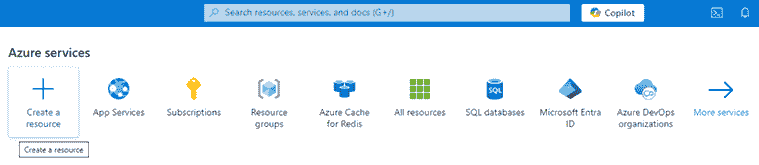

图 1.1：在 Azure 门户中创建资源

1.  在**搜索服务和市场**窗口中，搜索**功能应用**，并从搜索结果中选择它。此服务也将显示在**热门 Azure 服务**部分。

1.  点击**创建**按钮开始创建过程。

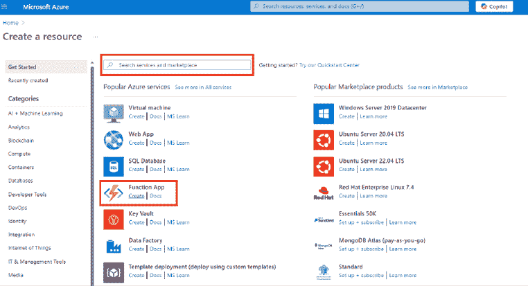

图 1.2：选择功能应用进行创建

一旦选择**功能应用**，您将被提示选择所需的托管计划。今天，我们使用 Azure Functions 有五种托管计划选项。这些计划根据扩展行为、冷启动、使用虚拟网络的可能性以及显然的价格而有所不同。**消费**计划正是无服务器所涉及的内容，您不知道代码在哪里以及如何运行，您只需为代码的执行付费。另一方面，当您选择**应用服务**或**容器应用环境**计划时，您将拥有更多对硬件和资源消耗的控制权，这意味着您可以在解决方案中使用 Azure Functions 的灵活性，以及大型应用程序所需的相应管理。

当您选择创建 Azure 功能应用时，将立即显示以下屏幕。正如我们之前所描述的，您需要根据您的需求选择托管计划。

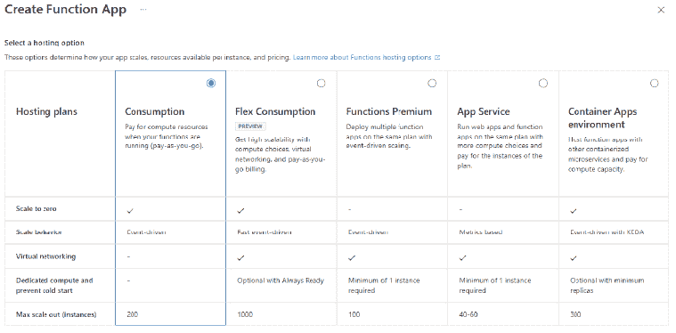

图 1.3：功能应用托管计划

为了本章的目的，我们将选择**消费**计划。一旦选择此选项，您将找到一个向导来帮助您创建服务。在这个服务中，您需要填写以下信息：

+   **基础**：填写所需的字段，例如**订阅**、**资源组**、**功能应用名称**、**区域**和**操作系统**。确保您选择的名称是唯一的。在**运行时堆栈**中，选择您函数的编程语言。我们将选择**.NET 8 Isolated**工作模型，但还有其他选项，正如我们之前所展示的。值得注意的是，进程模型将在 2026 年被淘汰，因此不要使用这种方法开始项目。

+   **存储**：功能应用默认需要 Azure 存储账户。

+   **网络**：这是您定义 Azure 函数是否可供公共访问的地方。

+   **监控**：启用 Application Insights 以监控您的函数应用，以获得更好的诊断和性能跟踪。别忘了 Azure Monitor 日志会导致成本增加。

+   **部署**：还可以启动为函数应用所需的部署设置。这对于使用 GitHub Actions 作为默认方式实现持续部署很有趣。

+   **标签**：在专业环境中，将函数应用进行标记被认为是便于 FinOps 活动的良好实践。

在*第二章*“揭秘微服务应用”中，我们将讨论将微服务与外部世界接口的最佳方式。出于安全考虑，不建议您直接向公众提供函数。您可以选择使用应用程序网关，如 Azure 应用网关，或使用 Azure API Management 作为您使用 Azure Functions 开发的 API 的入口。

一旦您点击**审查和创建**，您将能够检查所有设置。审查您的配置，然后再次点击**创建**按钮以部署您的函数应用：

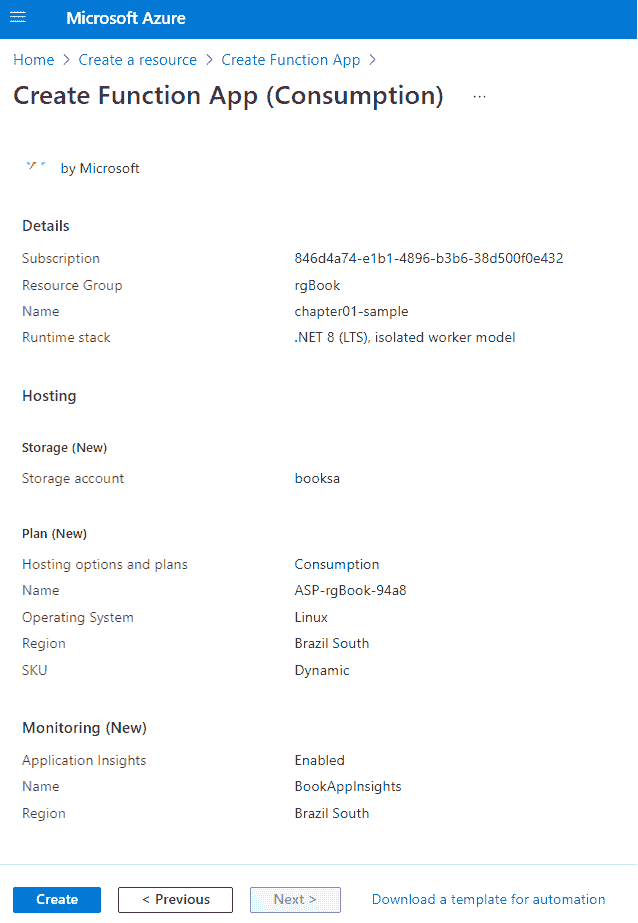

图 1.4：审查函数应用设置

部署完成后，通过点击**转到资源**按钮导航到您的新函数应用。您将看到函数应用正在正常运行：

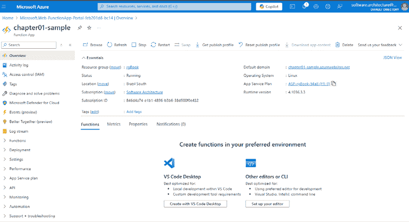

图 1.5：函数应用运行

现在，是时候了解使用 Azure Functions 进行开发的可能性和开始编码了。

# 理解 Azure Functions 中可用的触发器

Azure Functions 的基本思想是每个函数都需要一个触发器来启动其执行。一旦触发器被触发，您的代码执行将很快开始。然而，执行开始所需的时间可能会根据所选的托管计划而变化。例如，在消费计划中，函数可能会遇到冷启动——即当平台需要初始化资源时发生的延迟。了解这一点也很重要，即函数可以同时触发多次，这允许并行执行。

Azure Functions 提供了各种触发器，允许开发者在响应不同事件时执行代码。这里我们有最常用的触发器：

+   HTTP 触发器：此触发器允许通过 HTTP 请求执行函数。这对于创建 API 和 webhook 非常有用，其中可以使用标准 HTTP 方法调用函数。

+   Timer 触发器：此触发器根据 NCRONTAB 模型安排运行函数。它非常适合需要定期执行的任务，例如清理操作、数据处理或发送定期报告。重要的是要提到，相同的定时触发器函数在其第一次执行完成后不会再次运行。这种行为有助于防止重叠执行和潜在冲突。

+   Blob Storage 触发器：当在 Azure Blob Storage 容器中创建或更新新的 blob 时，此触发器将运行函数。它适用于处理或转换文件，例如图像或日志，在它们上传时。

+   Queue Storage 触发器：当向 Azure Queue Storage 添加消息时，此触发器将运行函数。它适用于构建可伸缩且可靠的背景处理系统。

+   Event Grid 触发器：此触发器在 Azure Event Grid 发布事件时运行函数。它适用于对来自各种 Azure 服务的事件做出反应，例如资源创建、修改或删除。

+   Service Bus 触发器：当在 Azure Service Bus 队列或主题中接收到消息时，此触发器将运行函数。它非常适合处理应用程序间的消息传递和构建复杂的流程。

+   Cosmos DB 触发器：此触发器在 Azure Cosmos DB 中创建和更新时运行函数。它适用于实时处理数据更改，例如更新搜索索引或触发额外的数据处理。

这些触发器提供了灵活性和可伸缩性，允许开发者构建能够无缝响应不同类型事件的基于事件的应用程序。重要的是要说明，Azure Functions 中还有其他可用的触发器，我们将在下一章中更详细地讨论它们。

# 使用 Azure Functions 进行编码

本主题的重点是快速介绍一些开发 Azure 函数的方法。在本书的其他章节中，我们将介绍与汽车共享相关的用例。正如您将在 *第二章* 中详细看到的，*揭秘微服务应用程序*，每个微服务都必须有一个健康检查端点。让我们开发一个这样的健康检查 API 的示例。

# 使用 VS Code 编码 Azure 函数

使用 VS Code 创建 HTTP 触发器 Azure 函数涉及几个定义明确的步骤。以下是一个详细的指南，帮助您完成这个过程。

使用 VS Code 开发 Azure 函数有一些先决条件，如下所述：

+   确保您的机器上已安装 VS Code。使用 VS Code 不仅可以帮助您开发所需的 Azure 函数，还可以通过 **Azure Tools** 扩展来管理您的 Azure 账户。

+   建议您登录到您的 Azure 账户以创建新的函数。**C# 开发工具包**也可能已安装。

+   可以安装 **GitHub Copilot 扩展** 来帮助您解决编码问题，同时在进行编码时为您提供指导。

+   安装 VS Code 的 Azure Functions 扩展。这个 VS Code 扩展将方便函数的开发，为每个期望的函数触发器提供向导。

+   安装 VS Code 的 Azurite 扩展。这个 VS Code 扩展是一个开源的与 Azure Storage API 兼容的服务器，用于本地调试 Azure Functions。

+   确保你已经安装了 **Azure Functions Core Tools** 和 **.NET SDK**，如果你使用的是 C#。

一旦你设置了你的环境，你将会有以下类似的结构：

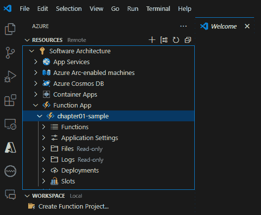

图 1.6：VS Code 准备编写 Azure 函数

+   一旦所有先决条件都设置好了，在 **Azure** 选项卡中，转到 **WORKSPACE** 并选择 **创建函数项目…**。接下来，执行以下步骤：

    1.  选择你的项目位置并选择你首选的编程语言。

    1.  按提示创建一个新的 HTTP 触发函数。你可以将其命名为 `Health` 并调用命名空间 `CarShare.Function.`。

    1.  你需要决定这个函数的 **访问权限**。在这个例子中，你可以选择 **匿名**。我们稍后会讨论每个安全选项。

    1.  打开新创建的函数文件。你会看到一个 HTTP 触发函数的模板代码。

    1.  修改函数以满足你的特定要求，在这种情况下，意味着如果函数运行正常则进行响应。注意这是一个 `GET` 和 `POST` 函数。根据我们的定义，你可以将代码更改为仅作为 HTTP `GET` 函数。

    1.  保存你的更改。

对于本地运行和调试，你只需按 *F5* 或导航到 **运行** > **开始调试**。VS Code 将启动 Azure Functions 主机，你将在输出窗口中看到函数 URL。然后，你可以使用 **Postman** 或你的浏览器等工具向你的函数端点发送 HTTP 请求。

值得注意的是，为了在本地运行 Azure Functions，你需要允许 PowerShell 脚本在没有数字签名的情况下运行。这可能会根据你公司提供的安全策略成为一个问题。

一旦函数开始运行，你可以将其视为与其他类型的软件项目工作相同，甚至调试也能正常工作。触发器将取决于你设置的函数。以下图显示了函数程序的代码，你可以看到使用 `OkObjectResult` 和消息“是的！函数正在运行！”以及 UTC 时间对调用者的响应。

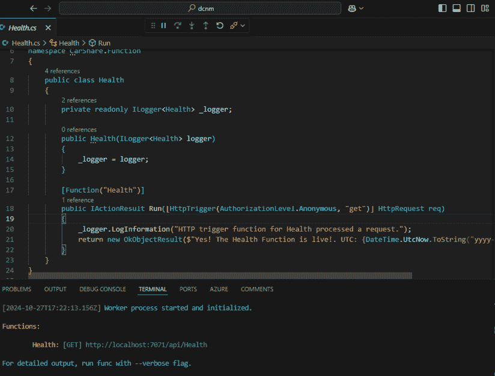

图 1.7：本地运行的 Azure Functions

由于你已经创建了一个与 GitHub 仓库连接的函数应用，并且部署过程由 GitHub Actions 处理，一旦你将代码提交并拉取到 GitHub，GitHub Actions 将自动构建函数并将其作为函数应用部署。

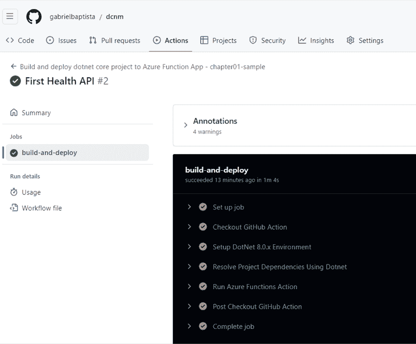

图 1.8：使用 GitHub Actions 部署的函数应用

本书的目的不是讨论 CI/CD 策略，但在专业开发时，你肯定需要考虑它们。

可以在 Azure 门户中检查此部署的结果，其中开发的函数将在函数列表中可用。值得注意的是，一个函数应用可以同时处理多个函数。 

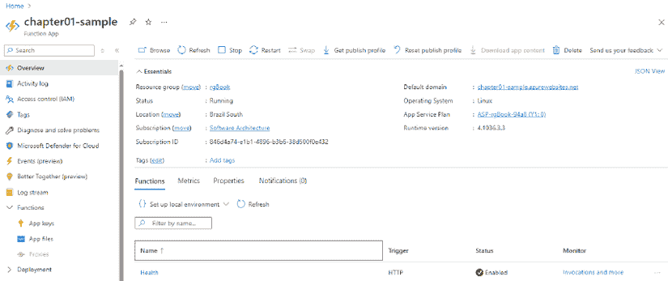

图 1.9：函数应用中可用的健康功能

函数一旦发布到 Azure，就可以立即执行。由于这个示例函数是一个 `GET` HTTP 触发器开发的，我们可以通过在网页浏览器中访问 API 来检查函数是否工作。

图 1.10：健康功能运行正常

由于你没有实时的 CI/CD 管道，你也可以直接从 VS Code IDE 发布你的 Azure 函数。为此，你可以使用 VS Code 提供的 Azure Functions 扩展。

在此情况下，需要遵循几个步骤。第一步是在 VS Code 提示中选中部署函数的操作：

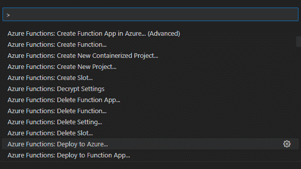

图 1.11：使用 VS Code 部署到 Azure

之后，你需要选择相应的订阅以及你想要部署的新函数应用的名称，考虑到一个新的函数：

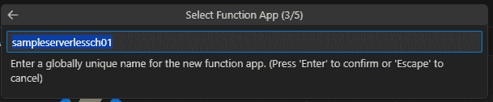

图 1.12：创建新的函数应用

扩展程序提出的当前流程是在灵活消耗计划中部署 Azure 函数。有一些特定的位置可以提供此选项：

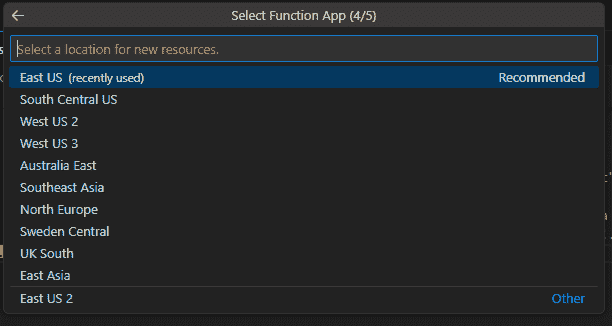

图 1.13：定义新函数应用的位置

运行时堆栈的定义对于充分利用你的 Azure 函数也很重要。在灵活消耗计划的情况下，你还将被要求输入实例的内存使用量和可用于并行调用的最大实例数。

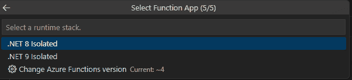

图 1.14：定义新函数应用的运行时堆栈

一旦定义了这些集合，你的 Azure 函数将正确部署。你还可以使用相同的技术重新部署函数，而不需要每次都重新创建 Azure 函数应用。

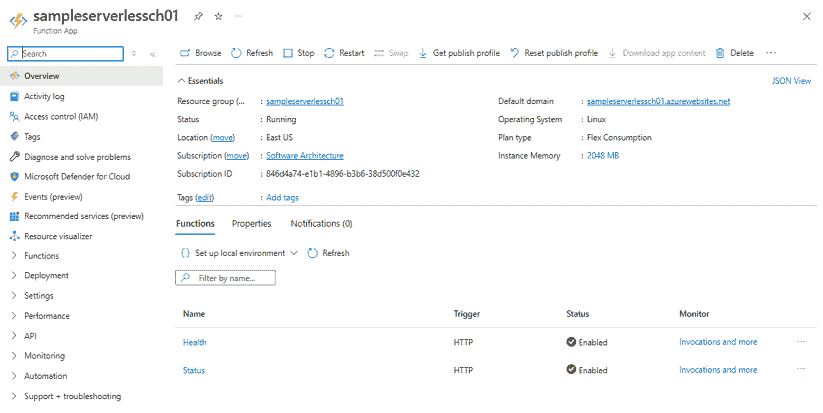

图 1.15：函数应用正确部署

最后但同样重要的是，Azure 门户还为您提供了监控和管理已部署函数的可能性。一旦完成此过程，您就可以监控您函数的性能和日志。通过使用您函数应用的 **监控** 部分，您可以查看执行细节，跟踪失败，并分析性能指标。

# 使用 Visual Studio 编码 Azure 函数

Visual Studio 是开发 Azure 函数的最佳选择之一。为了做到这一点，您必须设置 **Azure 开发工作负载**，这将有助于在平台上原生启用 Azure 函数开发。

一旦完成此操作，您使用 VS Code 创建的项目将在 Visual Studio 中可用。在这种情况下，VS Code 和 Visual Studio 的区别在于，Visual Studio 将提供一个更易于设置的环境用于调试，以及许多可以促进您决策的视觉对话框。

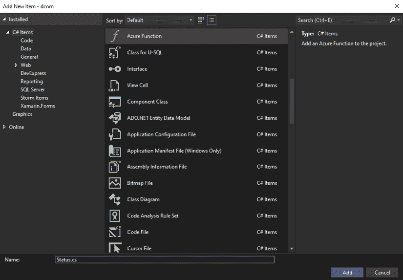

图 1.16：为 Function app 创建新的 Azure 函数

这些对话框简化了开发过程，因此如果您有机会使用 Visual Studio，这将是最优选择。

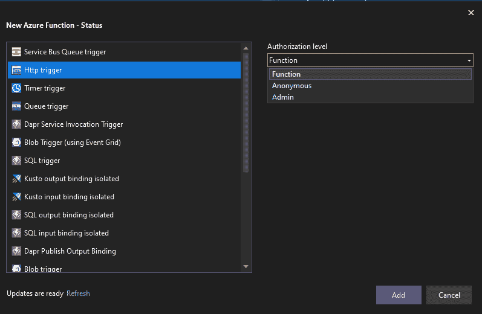

图 1.17：定义 Azure 函数触发类型

再次强调，当您创建一个 Function Apps 项目时，您可以向该项目添加多个函数，这对于微服务解决方案来说非常有用。在下面的示例中，我们添加了一个名为 `Status` 的第二个 HTTP 触发函数，以帮助您理解这种可能性，并让您看到这些函数如何在单个 Function App 中协同工作。

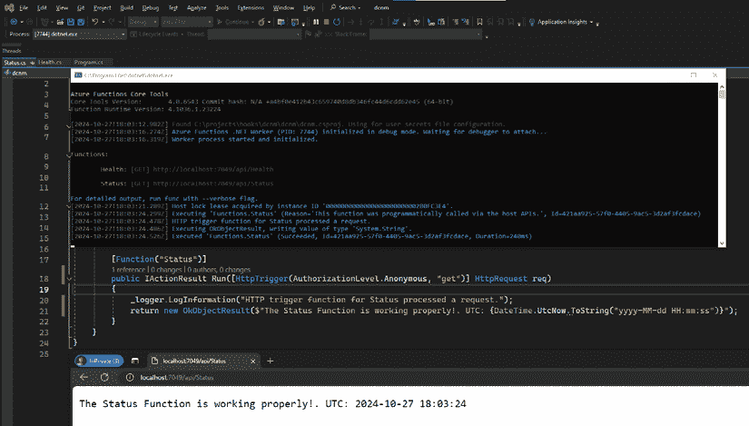

图 1.18：具有多个函数的 Function app

重要的是要提到，最初使用 VS Code 开发的相同代码可以继续使用 Visual Studio 进行维护，反之亦然。这很好，因为您可以让同一团队中的不同开发者使用这两个环境，而这不会引起问题，至少在 Function Apps 项目中不会。

由于其全面的调试设置环境和集成的视觉对话框，Visual Studio 是开发 Azure 函数的绝佳选择。开发者可以在 VS Code 和 Visual Studio 之间切换，而不会出现兼容性问题，从而促进团队协作。HTTP 触发等多个函数可以位于单个 Function Apps 项目中，支持微服务解决方案。

# 摘要

本章探讨了云平台的演变和现代技术的兴起，强调了关注解决方案而不是仅仅关注技术的重要性。本章强调了无服务器计算的优势，如可扩展性、可靠性、安全性和成本效益，同时也讨论了潜在的挑战。它讨论了无服务器架构如何交付微服务以及使用 Microsoft Azure Functions 构建和部署无服务器应用程序的好处。本章还提供了使用 VS Code 和 Visual Studio 等工具创建和管理 Azure 函数的实用指南。

在下一章中，我们将讨论如何在企业场景中定义和设计微服务应用程序。

# 问题

1.  本章中提到使用无服务器计算的主要优势是什么？

无服务器计算提供了几个优势，包括自动扩展、按使用付费的模型带来的成本效益以及减少基础设施管理。开发者无需担心提供或维护服务器，这使他们能够更快、更有效地交付解决方案。

它还通过让开发者专注于代码来促进软件开发加速。此外，云服务提供商管理环境的可靠性和安全性，从而在不牺牲性能或安全性的情况下提供可扩展和可持续的解决方案。

1.  如何使用无服务器架构来交付微服务？

无服务器架构通过允许开发者创建独立、小型且可重用的函数来支持微服务模型，这些函数代表不同的业务能力。这些函数可以独立部署、测试和扩展，遵循微服务的核心原则。

本章提供了一个用户身份验证微服务的例子，其中注册、登录和密码重置等单独的功能在一个无服务器项目中实现。这种灵活性增强了使用微服务原则构建的应用程序的模块化和可维护性。

1.  Azure Functions 中可用的关键触发器及其用途是什么？

Azure Functions 可以通过各种事件触发。主要触发器包括 HTTP 触发器（用于 Web 请求）、定时触发器（计划任务）、Blob 存储触发器（文件上传或更改）、队列存储触发器（消息处理）、事件网格触发器（从 Azure 服务处理事件）、服务总线触发器（应用程序之间的消息传递）和 Cosmos DB 触发器（数据库更改处理）。

每个触发器都允许开发者以灵活性和可扩展性构建事件驱动应用程序。例如，定时触发器非常适合重复性任务，而 HTTP 触发器通常用于 API 和 webhooks。这种触发器的多样性支持开发多样化的响应式解决方案。

1.  在 Azure 门户中创建无服务器应用需要哪些步骤？

要在 Azure 中创建无服务器应用，开发者必须登录到 Azure 门户并创建一个新的函数应用资源。在设置过程中，他们需要选择托管计划（例如，消费计划），定义项目详情，如区域、运行时堆栈、存储账户和网络选项，并通过应用程序洞察启用监控。

在审查完配置后，开发者点击**创建**来部署函数应用。一旦部署完成，他们可以直接从门户或通过开发工具如 Visual Studio 或 VS Code 导航到资源，开始编码并直接管理它。

1.  Azure 函数如何与其他 Azure 服务和第三方 API 集成？

Azure 函数与各种 Azure 服务无缝集成，如 Azure SQL、Cosmos DB、Event Grid、Service Bus 和 Logic Apps。这使得开发者能够利用现有的 Azure 基础设施构建复杂的工作流、自动化任务并创建高度响应的应用程序。

此外，Azure 函数还可以连接到第三方 API 和服务，支持混合架构。这种集成能力允许开发者扩展其应用程序到多个平台，增强云原生解决方案的灵活性和可扩展性。

# 进一步阅读

+   Azure 函数文档：[`learn.microsoft.com/en-us/azure/azure-functions/`](https://learn.microsoft.com/en-us/azure/azure-functions/)

+   Azure API 管理文档：[`learn.microsoft.com/en-us/azure/api-management/`](https://learn.microsoft.com/en-us/azure/api-management/)

+   Azure 应用程序网关文档：[`learn.microsoft.com/en-us/azure/application-gateway/overview`](https://learn.microsoft.com/en-us/azure/application-gateway/overview)

# 加入我们的 Discord 社区

加入我们的社区 Discord 空间，与作者和其他读者进行讨论：

[`packt.link/PSMCSharp`](https://packt.link/PSMCSharp)

