# 2

# 揭秘微服务应用

在过去十年中，微服务架构在现代软件开发中占据了核心地位。在本章中，我们将定义微服务架构是什么。你将了解微服务成功的原因，它们的优缺点，以及何时值得采用它们。从导致它们产生的难题开始，我们将讨论典型的使用场景，采用它们对整体项目成本的影响，以及你可能期望的回报。

你将深入了解微服务的组织结构，发现它如何与通常的单体应用不同，更像是装配线而不是由用户请求驱动的处理。这种新构思的组织带来了新的挑战，需要特定的技术来确保一致性、协调性和可靠性。

此外，还创建了新的模式和最佳实践来应对微服务带来的挑战并优化其优势。在这里，我们将介绍并总结一些基本模式，而它们的实际实施以及更具体的模式将在本书的剩余部分详细阐述。

更具体地说，本章涵盖了以下内容：

+   **服务导向架构**（**SOAs**）和微服务的兴起

+   微服务架构的定义和组织

+   何时采用微服务架构是值得的？

+   微服务的常见模式

# 服务导向架构（SOAs）和微服务的兴起

简单来说，微服务是在计算机网络中部署的软件块，它们通过网络协议进行通信。然而，这还不是全部；它们还必须遵守一系列进一步的约束。

在给出微服务架构的更详细定义之前，我们必须了解微服务理念是如何演变的，以及它被用来解决什么类型的问题。我们将通过两个独立的子节来描述这一演变的两个主要步骤。

## SOA 的兴起

微服务方向的第一步是由所谓的**服务导向架构**（SOAs）所采取的，即基于通信进程网络的架构。最初，SOAs 被实现为类似于你在 ASP.NET Core 中可能已经体验过的 Web 服务。

在 SOA 中，实现软件应用中不同功能或角色的不同宏模块被暴露为相互通信的独立进程，它们通过标准协议进行通信。第一个 SOA 实现是通过基于 XML 的 SOAP 协议进行通信的 Web 服务。然后，大多数 Web 服务架构转向基于 JSON 的 Web API，你可能已经了解，因为 RESTful Web 服务可以作为标准 ASP.NET 项目模板使用。*进一步阅读*部分包含了一些有用的链接，提供了更多关于 RESTful Web 服务的详细信息。

SOA 是在商业应用程序软件开发热潮期间被构想出来的，作为将不同分支和部门使用的各种现有应用程序集成到一个单一公司信息系统中的多种方法之一。由于现有应用程序是用不同的技术实现的，而且各个分支和部门可用的软件专业知识是异质的，因此 SOA 是以下迫切需求的答案：

1.  允许使用不同技术实现的模块之间进行软件通信，并且运行在不同的平台上（Linux + Apache、Linux + NGINX 或 Windows + IIS）。实际上，基于不同技术的软件不是二进制兼容的，但只要每个都作为通过技术无关的标准协议与其他软件通信的 Web 服务实现，它们仍然可以相互合作。其中，值得提及的是基于文本的 HTTP REST 协议和二进制的 gRPC 协议。同样值得提及的是，HTTP REST 协议是一个实际的标准，而 gRPC 目前只是一个由谷歌提出的实际标准。*进一步阅读*部分包含了一些有用的链接，可以获取更多关于这些协议的详细信息。

1.  允许每个宏模块的版本独立于其他模块进行演进。例如，你可能会决定将某些网络服务迁移到新的.NET 9 版本，以利用新的.NET 功能或新的可用库，同时保留其他不需要修改的网络服务，例如.NET 8。

1.  推广为其他应用程序提供服务的公共网络服务。例如，想想谷歌提供的各种公共服务，如谷歌地图，或者微软提供的各种人工智能服务，如语言翻译服务。

1.  下面是一个总结经典 SOA 的图表。

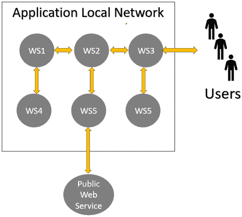

图 2.1：SOA

1.  随着公司信息系统和其他复杂 SOA 应用的不断发展，占领了更多市场和用户，因此出现了新的需求和约束。我们将在下一小节中讨论它们。

## 向微服务架构迈进

随着应用用户和流量的增加达到不同的数量级，性能优化以及在各个软件模块之间最佳平衡硬件资源成为了一个*必须*。这导致了一个新的需求：

每个软件模块必须能够独立于其他模块进行扩展，这样我们才能为每个模块分配其所需的最佳资源量。

随着公司信息系统在组织中扮演核心角色，其持续运行，即几乎零停机时间，成为了一个*必须*，这导致另一个重要约束：

微服务架构必须是冗余的。每个软件模块必须在不同的硬件节点上运行多个副本，以抵抗软件崩溃和硬件故障。

此外，为了适应快速变化的市场，对开发时间的要求变得更加紧迫。因此，需要更多的开发者来开发和维护每个应用程序，并按照给定的严格里程碑进行。

不幸的是，处理涉及四个人以上软件项目的质量要求证明是实质上不可能的。因此，SOA 中增加了一个新的约束：

构成应用程序的服务必须完全独立于彼此，以便它们可以由松散交互的独立团队实现。

然而，维护工作也需要优化，从而产生了另一个重要的约束：

服务的修改不应传播到其他服务。因此，每个服务都必须有一个定义良好的接口，该接口不会随着软件维护（或者至少很少改变）而改变。出于同样的原因，在服务实现中采用的设计选择不应限制任何其他应用程序服务。

通过将每个软件模块作为独立的服务实现，我们可以通过简单地将其复制到 N 个不同实例来分配更多硬件资源，从而满足第一和第二个要求，这样我们就可以优化整体性能并确保冗余。

1.  我们还需要一个新的参与者，它决定使用每个服务的副本数量以及将它们放置在什么硬件上。存在类似的实体，称为**编排器**。值得注意的是，我们可能也有几个编排器，每个编排器负责一组服务，或者根本没有任何编排器！

1.  总结来说，我们从由粗粒度耦合的 Web 服务组成的应用程序转变为细粒度和松散耦合的微服务，每个微服务由不同的开发团队实现，如下所示。

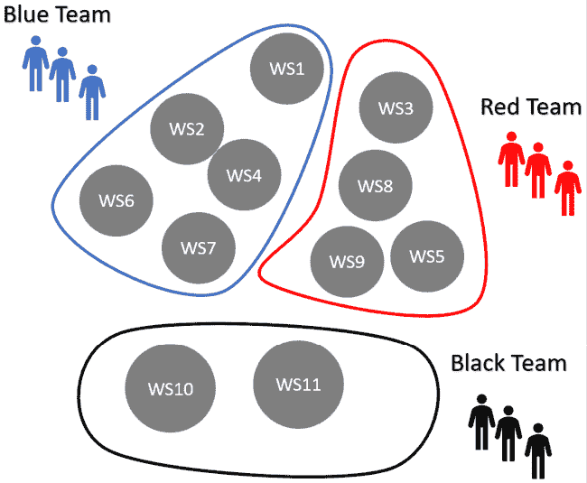

图 2.2：微服务架构

1.  图表显示了分配给不同松散耦合团队的不同粒度微服务。值得注意的是，虽然松散耦合也是原始 Web 服务架构的初始目标之一，但需要时间才能提升到良好水平，直到微服务技术的出现使其达到顶峰。

1.  前面的图表和需求并没有精确地定义微服务是什么；它们只是解释了微服务时代的开始。在下一节中，我们将给出一个更正式的微服务定义，该定义反映了它们当前的进化阶段。

# 微服务架构的定义和组织

在本节中，我们将给出微服务的定义，并详细说明它们对组织立即产生的影响，区分*微服务定义*，它预计会随着时间的推移逐渐变化，以及*微服务实际组织*，它可能随着新技术的出现而更快地发展。

在第一小节中，我们将关注定义及其直接后果。

## 微服务架构的定义

让我们先列出所有微服务需求。然后，我们将分别讨论每个需求。

微服务架构是基于 SOA 的架构，满足以下所有约束：

+   模块边界是根据它们所需的专业领域定义的。正如我们将在以下小节中讨论的，这应该确保它们是松散耦合的。

+   每个模块都实现为一个可复制的服务，称为**微服务**，其中可复制的意思是可以创建每个服务的多个实例，以实现可扩展性和冗余。

+   每个服务可以由不同的团队实现和维护，其中所有团队都是松散耦合的。

+   每个服务都有一个所有参与开发项目的团队都了解的明确接口。

+   通信协议在项目开始时决定，并且所有团队都知道。

+   每个服务必须仅依赖于其他服务公开的接口和采用的通信协议。特别是，为某个服务采用的设计选择不能对其他服务的实现施加约束。

鼓励您将上述约束与上一节中讨论的导致微服务架构构思的需求进行比较。实际上，这些约束中的每一个都是前一个或多个需求直接的结果。

让我们详细讨论每个约束。

### 专业领域和微服务

这个约束的目的是提供一个实际规则来定义每个微服务的边界，以便微服务保持松散耦合，并且可以被松散耦合的团队处理。它基于由 Eric Evans（参见*领域驱动设计*：[`www.amazon.com/exec/obidos/ASIN/0321125215/domainlanguag-20`](https://www.amazon.com/exec/obidos/ASIN/0321125215/domainlanguag-20)）开发的**领域驱动设计**理论。在这里，我们将简要介绍这个理论的一些基本概念，但如果你有兴趣了解更多，请参阅*进一步阅读*部分以获取更多详细信息。

基本上，每个专业领域都使用一种典型的语言。因此，在分析过程中，只需检测你与之交谈的专家使用的语言的变化，就可以理解每个微服务包含的内容和排除的内容。

这种技术的合理性在于，紧密互动的人们总是发展出一种被同一领域专家共享的特定语言，而缺乏这种共同语言则是松散互动的信号。

这样，应用**域**或应用**子域**被分割成所谓的**边界上下文**，每个上下文都由使用通用语言的特点所表征。值得注意的是，**域**、**子域**和**边界上下文**都是 DDD 的核心概念。有关它们和 DDD 的更多详细信息，您可以参考*进一步阅读*部分，但我们的简单描述应该足以开始使用微服务。

因此，我们得到了应用的第一种划分，即**边界上下文**。每个上下文都分配给一个团队，并为每个上下文定义一个正式的接口。这个接口成为微服务的规范，也是其他团队必须了解的关于微服务的所有信息。

然后，每个被分配微服务的团队可以将它进一步分割成更小的微服务，以便独立于其他微服务对其进行扩展，同时检查每个结果微服务与其他微服务交换的消息量是否可接受（松散耦合）。

第一次划分用于在团队之间分配工作，而第二次划分旨在以各种方式优化性能，我们将在*微服务组织*子节中详细说明。

## 可复制的微服务

应该有一种方法来创建同一微服务的多个实例，并将它们放置在可用的硬件上，以便将更多的硬件资源分配给最关键的微服务。对于某些应用程序或单个微服务，这可以手动完成；但更常见的是，采用称为**编排器**的专用软件工具。在这本书中，我们将描述两个编排器：**Kubernetes**，在*第八章*，*使用 Kubernetes 进行实用微服务组织*，以及**Azure Container Apps**，在*第九章*，*简化容器和 Kubernetes：Azure Container Apps* *和其他工具*。

### 在不同团队之间分割微服务开发

在*领域专业知识和微服务*子节中已经解释了微服务的定义方式，以便它们可以被分配给不同松散耦合的团队。在这里，值得指出的是，在这个阶段定义的微服务被称为**逻辑微服务**，然后每个团队可以决定根据各种实际原因将每个逻辑微服务分割成一个或多个**物理微服务**。

### 微服务、接口和通信协议

一旦微服务被分配给不同的团队，就是时候定义它们的接口和用于每种消息的通信协议了。这些信息在所有团队之间共享，以便每个团队都知道如何与其他团队处理的微服务进行通信。

只需在所有逻辑微服务的接口和相关的通信协议之间共享，而每个逻辑微服务如何划分为物理微服务的划分只是在每个团队内部共享。

各个团队的协调以及所有服务的文档和监控是通过各种工具实现的。以下是主要使用的工具：

+   **上下文映射**是表示所有应用程序上下文团队之间组织关系的图形表示。

+   **服务目录**收集有关所有微服务需求、团队、成本和其他属性的信息。像**Datadog**([`docs.datadoghq.com/service_catalog/`](https://docs.datadoghq.com/service_catalog/))和**Backstage**([`backstage.io/docs/features/software-catalog/`](https://backstage.io/docs/features/software-catalog/))这样的工具执行各种类型的监控，而像**Postman**([`www.postman.com/`](https://www.postman.com/))和**Swagger**([`swagger.io/`](https://swagger.io/))这样的工具主要关注正式要求，例如测试和自动生成与服务交互的客户端。

### 只有逻辑微服务的接口是公开的

每个微服务的代码不能对其他所有逻辑微服务的公共接口的实现方式做出任何假设。关于所使用的科技（.NET、Python、Java 等）及其版本，以及其他微服务使用的算法和数据架构，都不能做出任何假设。

分析了微服务架构的定义及其直接后果后，我们可以转向目前最实用的组织方式。

## 微服务组织

微服务设计选择独立性的第一个后果是，每个微服务都必须拥有私有存储，因为共享数据库会导致使用该数据库的微服务之间产生依赖。假设微服务 A 和 B 都访问同一个数据库表 T。现在，我们正在修改微服务 A 以满足新用户的需求。作为这次更新的部分，A 的解决方案将需要我们用两个新表 T1 和 T2 来替换表 T。

在类似的情况下，我们也必须修改 B 的代码以适应用 T1 和 T2 替换 T。显然，同样的限制不适用于同一微服务的不同实例，因此它们可以共享同一个数据库。为了总结，我们可以陈述以下：

不同微服务的实例不能共享一个公共数据库。

不幸的是，远离单一应用程序数据库不可避免地会导致数据重复和协调挑战。更具体地说，相同的数据块必须在几个微服务中重复，因此当它发生变化时，必须将变化通知所有使用其复制副本的微服务。

因此，我们可以提出另一个组织约束：

微服务必须以最小化数据重复的方式设计，或者换句话说，重复应尽可能涉及最少的微服务。

如前所述，如果我们根据专业领域定义微服务，最后一个约束应该自动得到保证，因为不同的专业领域通常共享的数据很少。

没有其他约束直接从微服务的定义中产生，但只需要在响应时间上添加一个微不足道的性能约束，就可以迫使微服务的组织方式更接近于装配线而不是通常的用户请求驱动的软件。让我们看看原因。

一个用户请求到达微服务 **A** 可能会引发一系列对其他微服务的请求，如下面的图所示：

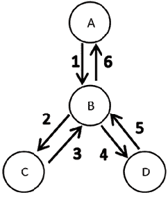

图 2.3：同步请求-响应链

消息 1-6 是由对微服务 *A* 的请求触发的，并且按顺序发送，因此它们的处理时间总和等于响应时间。此外，微服务 *A* 在发送消息 *1* 后保持阻塞，等待响应，直到它收到最后一条消息 (*6*)；也就是说，它在整个链式通信过程的整个生命周期内保持阻塞。

微服务 **B** 两次被阻塞，等待它发出的请求的响应。第一次是在 *2*-*3* 通信期间，第二次是在 *4*-*5* 通信期间。总的来说，一个简单的请求-响应模式对微服务通信意味着高响应时间和微服务计算时间的浪费。

克服上述问题的唯一方法要么是避免微服务之间的完全依赖，要么是将满足任何用户请求所需的所有信息缓存到第一个微服务，*A* 中。由于达到完全独立基本上是不可能的，通常的解决方案是在 *A* 中缓存它需要回答请求而不需要进一步了解其他微服务的任何数据。

为了实现这个目标，微服务是主动的，并采用所谓的 **异步数据共享** 方法。每当它们更新数据时，它们会将更新的信息发送给所有需要这些信息的其他微服务。简单来说，在上面的例子中，树节点，而不是等待来自父节点的请求，每次它们的私有数据发生变化时，都会将预处理的发送给所有可能的调用者，如图下面的图所示。

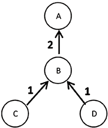

图 2.4：数据驱动通信

标记为*1*的两种通信都是在**C**/*D*微服务的数据发生变化时触发的，并且它们可能并行发生。此外，一旦通信被发送，每个微服务就可以返回其工作，而无需等待响应。最后，当请求到达微服务**A**时，它已经拥有了构建响应所需的所有数据，无需与其他微服务交互。一般来说，基于**异步数据共享**的微服务会在数据变化后立即预处理数据并将其发送给可能需要它的其他服务。这样，每个微服务已经包含了可以用来立即响应用户请求的预计算数据，无需进行进一步针对特定请求的通信。

这次，我们无法谈论请求和响应，而只能简单地说成是交换的消息。与古典 Web 应用打交道的人会习惯于请求/响应通信，其中客户端发起请求，服务器处理该请求并发送响应。

通常，在请求/响应通信中，涉及的参与者之一，比如**A**，会发送一个包含**请求**的消息，要求对另一个参与者，比如**B**，执行一些特定的处理，然后**B**执行所需的处理并返回一个结果（**响应**），这也可以是一个错误通知。

然而，我们可能也有非请求/响应的通信。在这种情况下，我们只需说成是消息。在这种情况下，没有响应，只有确认消息已被最终目标或中间参与者正确接收。与响应不同，确认是在完成消息处理之前发送的。

返回到**异步数据共享**，当新数据可用时，每个微服务完成其工作后，将结果发送给所有感兴趣的微服务，然后继续执行其工作，而无需等待接收者的响应。

每个发送者只需等待其直接接收者的确认，因此等待时间不会像在最初的链式请求/响应示例中那样累加。

那么，消息确认呢？它们也会引起小的延迟。是否有可能也消除这种较小的低效？当然，借助异步通信可以做到！

在同步通信中，发送者在继续其处理之前等待消息确认。这样，如果确认超时或被错误通知取代，发送者可以执行纠正操作，例如重新发送消息。

在异步通信中，发送者不会等待确认或错误通知，而是在消息发送后立即继续其处理，同时确认或错误通知被发送到回调。

在微服务中，异步通信更有效，因为它完全避免了等待时间。然而，在可能出错的情况下执行纠正措施的需要使得整体的消息发送动作变得复杂。更具体地说，所有发送的消息都必须添加到队列中，每次收到确认时，消息被标记为正确发送并从队列中移除。否则，如果在可配置的`timeout`时间内没有收到确认，或者发生错误，则根据某些重试策略将消息标记为需要重发。

微服务异步数据共享方法通常伴随着所谓的**命令查询责任分离**（**CQRS**）模式。根据 CQRS，微服务被分为*更新微服务*，执行常规的 CRUD 操作，以及*查询微服务*，专门回答从多个其他微服务聚合数据的查询，如下图所示：

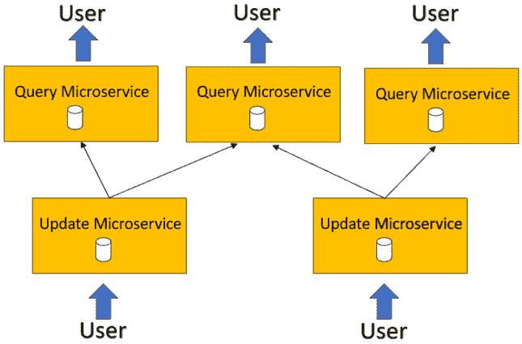

图 2.5：更新和查询微服务

根据异步数据共享方法，每个更新微服务将其所有修改发送到需要它们的查询服务，而查询微服务预先计算所有查询以确保快速响应时间。值得注意的是，数据驱动更新类似于一个工厂装配线，构建所有可能的查询结果。

更新和查询微服务都被称为**前端**微服务，因为它们参与了与用户的常规请求-响应模式。然而，它们路径中的数据更新也可能遇到完全不与用户交互的微服务。它们被称为**工作**微服务。以下图显示了工作微服务和前端微服务之间的关系。

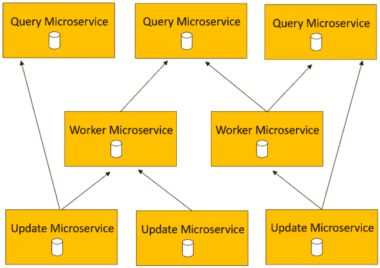

图 2.6：前端和工作微服务

虽然前端微服务通常通过为每个请求创建一个线程来并行响应多个用户请求，但工作微服务仅涉及数据更新，因此它们不需要并行化请求以确保对用户的低响应时间。

因此，它们的操作与组成装配线的各个站点的操作完全类似。它们从输入队列中提取输入消息，并依次处理它们。一旦可用，输出数据就会发送到所有感兴趣的微服务。这种处理方式被称为**数据驱动**。

有些人可能会反对，认为工作微服务是不必要的，因为他们的工作可能已经被消费他们输出的前端服务处理了。这并不是事实！例如，让我们想象一下需要在一个时间段内合并的会计数据，然后才能用作复杂查询的字段。当然，每个需要合并数据的查询微服务都可能负责合并它。然而，这会导致处理努力和存储部分总和的重复。

此外，将合并处理嵌入到其他微服务中，将使其能够独立扩展，从而更好地优化整体性能。

下一个子节将展示一个示例，该示例展示了迄今为止学到的所有概念。

## 汽车共享示例

下图显示了汽车共享应用路线处理部分的通信图。虚线包围属于同一逻辑微服务的所有物理微服务。查询微服务位于图像的顶部，更新微服务位于底部，工作微服务位于中间（带有灰色阴影）。

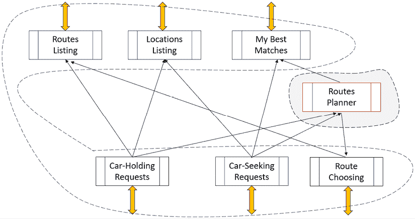

图 2.7：汽车共享应用的路线处理子系统

语言分析检测到两个逻辑微服务。第一个说的是汽车共享者的语言，由六个物理微服务组成。第二个专注于拓扑，因为它在源点和目的地之间找到最佳路线，并将中间源-目的地对与现有路线相匹配。

汽车持有者通过在`Car-Holding-Requests`更新微服务上执行 CRUD 操作来处理他们的请求，而寻找汽车的用户则以类似的方式与`Car-Seeking-Requests`更新微服务进行交互。`Routes-Listing`微服务列出所有有空位的新乘客可用行程，以帮助汽车寻求者选择他们的旅行日期。一旦选择了日期，请求将通过`Car-Seeking-Requests`微服务提交。

汽车持有者和汽车寻求者都与`Route-Choosing`更新微服务进行交互。汽车寻求者会从几个可用的路线中选择源点和目的地的路线，而汽车持有者则通过选择适合其源点和目的地的路线来接受汽车寻求者。一旦汽车寻求者选择了一条路线并被汽车持有者接受，所有其他不兼容的选项都将从汽车持有者和汽车寻求者的最佳匹配中删除。

`My-Best-Matches` 微服务列出了汽车寻求者和车主的所有可用路线。`Routes-Planner` 工作微服务计算适合车主出发地和目的地的最佳路线，这些路线也包含了一些汽车寻求者的出发地和目的地。它存储未匹配的汽车寻求者请求，直到添加了一个距离它们可接受的路线。当这种情况发生时，`Routes-Planner` 微服务为相同的行程创建了一条新的替代路线，包含新的出发地-目的地对。所有路线的变化都会发送到`My-Best-Matches`和`Route-Choosing`微服务。

`Locations-Listing` 微服务处理已知位置的数据库，并用于各种用户建议，例如用户来源和目的地的自动完成以及基于用户偏好统计的建议有趣行程。它从所有汽车车主和汽车寻求者的请求中获取输入。

我们已经看到了微服务旨在解决的问题以及它们的采用如何增加了应用程序设计的复杂性。此外，不难想象，测试和维护运行在多个不同机器上并依赖于复杂数据驱动通信模式的应用程序应该是一项复杂且耗时的任务。

因此，评估在我们应用程序中使用微服务架构的影响非常重要，以验证成本是否可承受，以及采用微服务的优势是否超过其劣势和额外成本。在下一节中，我们将介绍一些评估此类评估的标准。

# 何时采用微服务架构才是值得的？

需要超过五个开发者的应用程序无疑是微服务架构的良好目标，因为逻辑微服务有助于将劳动力分成小型、松散耦合的团队。

具有多个耗时模块的高流量应用程序也是微服务架构的良好目标，因为它需要模块级性能优化。

对于只需要不到五人的小团队实现的应用程序，流量较低，不是微服务架构的良好目标。

在上述两种极端情况之间决定何时采用微服务并不容易。一般来说，这需要详细分析成本和回报。

考虑到成本，采用微服务架构的开发工作量大约是传统单体应用的五倍。我们通过将单体应用转换为微服务架构，平均进行了 7 次重写，得到了这个规模。

这部分原因是处理可靠通信、协调和详细资源管理所需的额外工作量。然而，大部分成本来自测试、调试和监控分布式应用程序的困难。

在本书的后面部分，我们将描述处理上述所有问题的工具和方法，但微服务带来的额外成本仍然存在。

考虑到预期回报，最显著的优势是能够将维护集中在关键模块上，因为如果微服务的接口没有变化，那么其实现中的更剧烈的变化，例如迁移到不同的操作系统，或迁移到不同的开发堆栈，或者简单地迁移到同一堆栈的新版本，也不需要对所有其他微服务进行任何更改。

我们可能会决定将不需要进行多次市场审查更改的模块的维护减少到最低限度，同时专注于仅增加应用程序感知价值或需要更改以适应快速发展的市场的市场审查模块。总之，我们可能会专注于用户所需的重要更改，而将所有不涉及这些更改的模块保持不变。

专注于仅几个模块可以确保快速上市时间，因此我们可以尽快满足市场机会，而不会存在发布新版本过晚的风险。

当某些特定功能的流量增加时，我们也可以通过仅扩展相关的微服务来快速调整性能。值得注意的是，调整每个特定构建块的能力允许更好地利用可用硬件，从而降低整体硬件成本。此外，调整和监控特定微服务的能力简化了实现更好的响应时间和总体性能目标。

在分析了导致微服务架构演变的演变过程，以及其本质和基本组织之后，我们可以继续探讨虽然不是特定于微服务，但在微服务架构中常见的模式。

# 微服务常见模式

在本节中，我们将分析所有微服务架构中使用的根本模式，这些模式与特定的编程语言或工具无关。其中大部分与微服务通信有关。让我们从常见的重试策略开始。

## 弹性任务执行

微服务可以从一台机器移动到另一台机器，以实现更好的负载均衡。它们也可以被重新启动，以重置一些可能的内存泄漏或解决其他性能问题。在这些操作过程中，它们可能会错过发送给它们的某些消息，或者可能会中断某些正在进行的计算。此外，由于软件错误或硬件故障也可能发生。

由于微服务架构需要具有可靠性（几乎零停机时间），它们通常是冗余的，并且需要特别注意检测故障和采取纠正措施。因此，所有微服务架构都必须提供机制来检测失败，例如简单的超时，以及纠正失败的操作。

失败是通过检测意外异常或超时来发现的。由于代码总是可以安排成将超时转换为异常，因此失败检测总能被简化为适当的异常处理。

为了解决这个问题，微服务开发者的社区定义了一些有用的**重试策略**，可以将它们附加到特定的异常上。它们通常通过特定的库以及其他的可靠性模式来实现，但有时云提供商会直接提供这些功能。

下面是微服务架构中使用的标准可靠性模式：

+   **指数重试**：它被设计用来克服暂时性故障，例如由于微服务实例重启导致的失败。在每次失败后，操作会以指数级增加的延迟重新尝试，直到达到最大尝试次数。例如，首先，我们会在 10 毫秒后重试，如果这次重试操作导致新的失败，那么会在 20 毫秒后进行新的尝试，然后是 40 毫秒，以此类推。如果达到最大尝试次数，则会抛出异常，此时可以找到另一个重试策略或某种其他异常处理策略。

+   **断路器**：它被设计用来处理长期故障，通常在指数重试达到最大重试次数后触发。当假设存在长期故障时，通过立即抛出异常而不尝试所有必要的操作来禁止对资源的访问。禁止时间必须足够长，以便允许人工干预或任何其他类型的手动修复。

+   **隔离舱隔离**：隔离舱隔离被设计用来防止故障和拥塞的传播。基本思想是将服务和/或资源组织成隔离的部分，使得来自某个部分的故障或拥塞仅限于该部分，而系统的其余部分继续正常工作。

假设，例如，几个微服务副本使用相同的数据库（这是常见的）。由于一个故障，一个副本可能会开始打开过多的数据库连接，从而也会使需要访问相同数据库的所有其他副本发生拥塞。

在这种情况下，我们认识到数据库连接是关键资源，需要隔离舱隔离。因此，我们计算数据库可以正确处理的连接的最大数量，并将它们分配给所有副本，例如，为每个微服务副本分配最多五个并发连接。

这样，副本的故障不会影响其他副本对数据库的正确访问。此外，如果应用程序组织得当，由于失败的副本而未能得到服务的请求最终将在正常工作的副本上重试，从而使整个应用程序能够继续正常运行。一般来说，如果我们想对共享资源的所有请求进行分区，我们可以按以下步骤进行：

1.  允许对共享资源的最大类似待处理同时出站请求数量；比如说 5，就像之前的数据库示例中那样。这就像对线程创建设置一个上限。

1.  超过之前上限的请求将被排队。

1.  如果达到最大队列长度，任何进一步的请求将引发异常以终止它们。

值得指出的是，之前展示的请求分区和节流模式是应用隔离舱隔离的常见方式，但并非唯一方式。任何分区加隔离策略都可以归类为隔离舱隔离。例如，可以将两个交互式微服务的副本分成两个隔离分区，这样只有属于同一分区的副本才能交互。这样，分区中的故障不会影响另一个分区。

除了上面提到的处理故障的动作和策略，微服务架构还提供了故障预防策略。通过监控硬件资源的异常消耗和定期进行硬件和软件健康检查来实现故障预防。为此，编排器监控内存和 CPU 资源的使用情况，并在它们超出开发者定义的范围时重启微服务实例或添加新的实例。此外，它们还提供了声明周期性软件检查的可能性，编排器可以执行这些检查以验证微服务是否正常运行。最常见的此类健康检查是调用微服务公开的**健康 REST 端点**。再次强调，如果微服务未能通过健康检查，它将被重启。

当一个硬件节点未能通过健康检查时，其所有微服务将被转移到不同的硬件节点。

## 高效处理异步通信

与相关的异步确认一起的异步通信导致三个重要问题：

1.  由于在通信后，发送微服务会转向处理其他请求而无需等待确认，因此它必须保留所有已发送消息的副本，直到检测到确认或通信故障（如超时），以便它可以重试操作（例如，使用指数重试），或者它可以采取其他类型的纠正措施。

1.  由于在超时的情况下，消息可能会被重新发送，因此预期的接收者可能会收到相同消息的多个副本。

1.  消息可以以与发送时不同的顺序到达接收者。例如，如果两个指示接收者修改产品名称的消息按顺序 M1, M2 发送，我们期望最终名称是 M2 中包含的名称。然而，如果接收者以错误的顺序接收这两条消息，M2, M1，最终的产品名称将是 M1 中包含的名称，从而造成错误。

第一个问题通过将所有消息保存在队列中解决，如图所示：

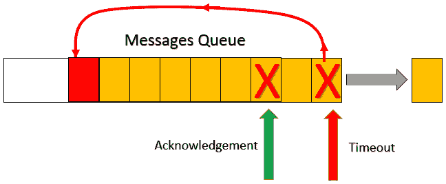

图 2.8：输出消息队列

当收到确认时，相关的消息将从队列中移除。相反，如果检测到失败或超时，消息将被添加到队列末尾以重新尝试。如果必须使用指数重试来处理重试，则每个队列条目都必须包含当前尝试的次数和消息可以重新发送的最小时间。

第二个和第三个问题要求每个接收到的消息都有一个唯一的标识符和序列号。唯一的标识符有助于识别和丢弃重复项，而序列号有助于接收者重建正确的消息顺序。以下图示展示了一种可能的实现。

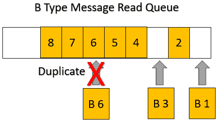

图 2.9：输入消息队列

只有在它们前面的所有序列空缺都被填补并读取之后，才能从输入队列中读取消息，而重复的消息则容易识别并丢弃。

## 基于事件的通信

假设我们在图 2.7 中的拼车应用中添加一个新的微服务，比如一个计算用户行程统计的工人微服务。我们将被迫修改所有需要从它那里获取输入的微服务，因为这些微服务也必须向新添加的微服务发送一些消息。

微服务架构的主要约束是，对微服务的修改不能传播到其他微服务，但我们通过简单地添加一个新的微服务，已经违反了这个基本原则。

为了克服这个问题，可能会引起新添加的微服务兴趣的消息，使用**发布-订阅**模式进行处理。也就是说，发送者将消息发送到发布者端点，而不是直接发送给最终接收者。然后，每个对这条消息感兴趣的微服务只需订阅这个端点，这样订阅端点就会自动发送它接收到的所有消息。以下图示展示了发布-订阅模式的工作原理。

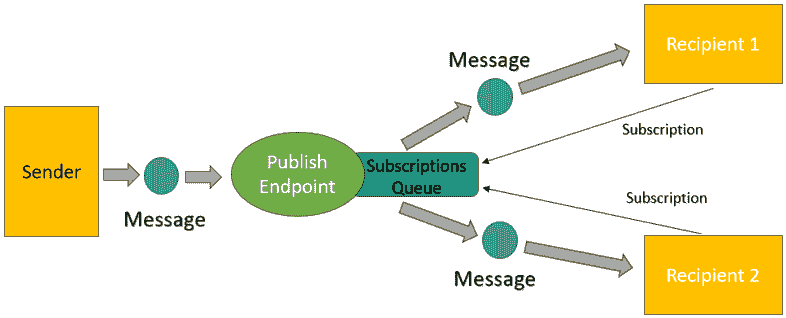

图 2.10：发布-订阅模式

一旦发布端点收到一条消息，它就会将其重新发送到所有添加到其订阅队列的订阅者。这样，如果我们添加一个新的微服务，就不需要对所有消息发送者进行任何修改，因为他们只需要继续将他们的消息发送到适当的发布端点。新添加的微服务需要将自己注册到正确的发布端点。

发布端点由称为消息代理的应用程序处理，这些代理提供此服务以及其他消息传递服务。消息代理本身可以作为可复制的微服务部署，但它们通常由所有主要云提供商作为标准服务提供。

其中，值得提及的是**RabbitMQ**，它必须作为微服务安装，以及**Azure Service Bus**，它在 Azure 中作为云服务提供。我们将在本书的其余部分详细介绍它们，但感兴趣的读者可以在*进一步阅读*部分找到更多详细信息。

## 与外部世界的接口

微服务应用程序通常局限于私有网络，并通过网关、负载均衡器和 Web 服务器通过公共或私有 IP 地址公开其服务。这些组件可以将外部地址路由到内部微服务。然而，很难让用户客户端应用程序选择将每个请求发送到哪个微服务。

通常，输入请求都由一个独特的端点处理，称为**API 网关**，它分析这些请求并将请求转换为适合内部微服务的请求。这样，用户客户端应用程序不需要了解微服务应用程序的内部组织方式。因此，在维护期间，我们可以自由地更改应用程序的组织，而不会影响使用它的客户端，因为所需的转换是由应用程序 API 网关执行的。这个过程被称为**Web API 接口转换**。

下图总结了 API 网关的操作：

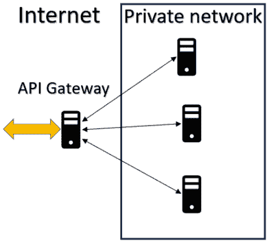

图 2.11：API 网关

API 网关还可以通过将所有请求发送到属于客户端应用程序所需版本的微服务来处理应用程序版本。

此外，它们通常还处理身份验证令牌；也就是说，它们有解码它们的密钥，并验证它们包含的所有用户信息，例如用户 ID 和其访问权限。

请不要将身份验证与登录混淆。登录是在用户开始与应用程序交互时每次会话中执行一次，并且由一个专门的微服务执行。成功登录的结果是一个身份验证令牌，它编码了有关用户的信息，并且必须在所有后续请求中包含。

总结来说，API 网关提供以下服务：

+   Web API 接口转换

+   版本

+   身份验证

然而，它们通常还提供其他服务，例如：

+   API 文档端点，即提供应用提供的服务正式描述以及如何请求它们的端点。在 REST 通信的情况下，API 文档基于 **OpenAPI** 标准（参见 *进一步阅读*）。

+   缓存，即向用户客户端和 Web 中间节点添加适当的 HTTP 头来处理所有响应的缓存。

值得指出的是，上述服务只是商业或开源 API 网关中可用的服务的一般示例，这些网关通常提供广泛的服务。

API 网关可以作为使用 YARP（[`microsoft.github.io/reverse-proxy/index.html`](https://microsoft.github.io/reverse-proxy/index.html)）等库的临时微服务实现，或者它们可以使用现有的可配置应用程序，例如开源的 Ocelot（[`github.com/ThreeMammals/Ocelot`](https://github.com/ThreeMammals/Ocelot)）。所有主要提供商都提供强大的可配置 API 网关，称为 **API 管理系统**（对于 Azure，请参阅 [`azure.microsoft.com/en-us/products/api-management`](https://azure.microsoft.com/en-us/products/api-management)）。然而，也存在独立的云原生提供者，如 Kong（[`docs.konghq.com/gateway/latest/`](https://docs.konghq.com/gateway/latest/)）。

# 摘要

在本章中，我们介绍了微服务的基础知识，从它们的演变开始，继续到它们的定义、组织以及主要模式。

我们描述了基于微服务应用的主要特性和要求，如何其组织结构更类似于装配线而非用户请求驱动的应用，如何使微服务可靠，以及如何有效地处理故障和由高效异步通信引起的所有问题。

最后，我们描述了如何通过基于发布者-订阅者的通信使所有微服务彼此更加独立，以及如何将微服务应用与外部世界接口。

下一章描述了构建企业级微服务的两个重要构建块：Docker 和洋葱架构。

# 问题

1.  持有式 SOA 和现代微服务架构之间的主要区别是什么？

在微服务架构中，架构是细粒度的。此外，每个微服务不得依赖于其他微服务的架构选择。此外，微服务必须是冗余的、可复制的和有弹性的。

1.  为什么松散耦合的团队如此重要？

因为协调松散耦合的团队相当容易。

1.  为什么每个逻辑微服务必须有专用的存储？

这是微服务的设计选择与其他所有微服务采用的设计选择独立性的直接后果。事实上，共享一个公共数据库将迫使数据库结构采用共同的设计选择。

1.  为什么需要数据驱动的通信？

这是避免造成不可接受的总体响应时间的长链递归请求和响应的唯一方法。

1.  为什么事件驱动的通信如此重要？

因为事件驱动的通信完全解耦了微服务，这样开发者就可以在不修改任何现有微服务的情况下添加新的微服务。

1.  API 网关通常会提供登录服务吗？

由称为身份验证服务器的特定微服务提供的登录服务。

1.  什么是指数重试？

一种在每次失败后指数级增加失败和重试之间延迟的重试策略。

# 进一步阅读

+   埃里克·埃文斯，《领域驱动设计》：[`www.amazon.com/exec/obidos/ASIN/0321125215/domainlanguag-20`](https://www.amazon.com/exec/obidos/ASIN/0321125215/domainlanguag-20 )

+   更多关于领域驱动设计的资源可以在这里找到：[`www.domainlanguage.com/ddd/`](https://www.domainlanguage.com/ddd/)

+   可以在这里找到关于 CQRS 设计原则的详细讨论：[`udidahan.com/2009/12/09/clarified-cqrs/`](https://udidahan.com/2009/12/09/clarified-cqrs/)

+   ASP.NET Core REST API：[`docs.microsoft.com/en-US/aspnet/core/web-api/`](https://docs.microsoft.com/en-US/aspnet/core/web-api/)

+   Datadog: [`docs.datadoghq.com/service_catalog/`](https://docs.datadoghq.com/service_catalog/)

+   Backstage：[`backstage.io/docs/features/software-catalog/`](https://backstage.io/docs/features/software-catalog/)

+   OpenAPI（REST API 规范）：[`swagger.io/docs/specification/v3_0/about/`](https://swagger.io/docs/specification/v3_0/about/)

+   Postman: [`www.postman.com/`](https://www.postman.com/)

+   gRPC：[`grpc.io/`](https://grpc.io/ )

+   RabbitMQ：[`www.rabbitmq.com/`](https://www.rabbitmq.com/)

+   Azure 服务总线：[`azure.microsoft.com/en-us/products/service-bus/`](https://azure.microsoft.com/en-us/products/service-bus/)

+   Ocelot：[`github.com/ThreeMammals/Ocelot`](https://github.com/ThreeMammals/Ocelot)

+   YARP：[`microsoft.github.io/reverse-proxy/index.html`](https://microsoft.github.io/reverse-proxy/index.html)

+   Kong: [`docs.konghq.com/gateway/latest/`](https://docs.konghq.com/gateway/latest/)

+   Azure API 管理：[`azure.microsoft.com/en-us/products/api-management`](https://azure.microsoft.com/en-us/products/api-management)

# 加入我们的 Discord 社区

加入我们社区的 Discord 空间，与作者和其他读者进行讨论：

`packt.link/PSMCSharp`

